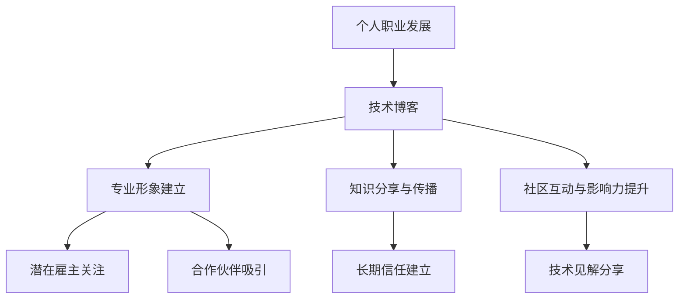

                 

### 文章标题

# 技术博客：建立个人技术影响力

### 关键词

- 技术博客
- 个人品牌
- SEO优化
- 社区互动
- 内容创作
- 技术影响力

### 摘要

本文将深入探讨如何通过技术博客建立个人技术影响力。我们将从基础准备、内容创作与优化、案例分析与实践三个方面进行详细阐述，并提供实用的技巧和建议。通过系统地构建博客、优化内容和品牌传播，您将能够有效地提升自己的技术影响力，成为行业内的专家和意见领袖。

## 确定书籍主题和目标读者

### 书籍主题

《技术博客：建立个人技术影响力》的主题是如何利用技术博客作为工具，提升个人在技术领域的知名度和影响力。本文将围绕这一核心目标，提供从零开始构建个人技术博客的完整指南，帮助读者掌握技术博客的写作、优化和运营技巧。

### 目标读者

本文的目标读者主要是有志于通过技术博客提升个人技术影响力的程序员、技术爱好者以及那些希望在自己的专业领域中建立影响力的专业人士。无论您是初学者还是经验丰富的开发者，本文都将为您提供实用的指导和建议。

## 第一部分：基础准备

### 第1章：技术博客的重要性

#### 核心概念与联系

技术博客对个人职业发展的重要性不言而喻。首先，技术博客可以帮助开发者记录和分享自己的技术经验和见解，这不仅能加深对技术领域的理解，还能为他人提供宝贵的知识和资源。其次，技术博客作为个人品牌的一部分，能够在互联网上建立专业形象，吸引潜在雇主或合作伙伴的关注。此外，技术博客与社交媒体的不同之处在于，它更加注重深度和专业性，能够为读者提供有价值的内容，从而建立起长期的信任和影响力。

**Mermaid 流程图**：



#### 为什么要写技术博客？

1. **知识积累与梳理**：通过写作，可以将自己在工作中的经验和技术见解系统化、结构化，有助于加深对技术的理解。
2. **传播知识与影响力**：技术博客可以帮助您将知识分享给更广泛的读者，从而提升个人在技术领域的影响力。
3. **个人品牌建设**：一个内容丰富、质量高的技术博客可以树立您在专业领域中的专家形象，增强个人品牌价值。

### 第2章：博客平台选择与配置

#### 核心概念与联系

选择合适的博客平台是构建个人技术博客的第一步。不同的博客平台在功能、易用性和扩展性方面各有优劣。例如，GitHub Pages 可以与源代码管理完美结合，适合技术爱好者；而WordPress 则提供了丰富的主题和插件，适合需要高度自定义的博客。在配置博客时，还需要考虑技术栈的选择，如使用Jekyll、Hexo等静态博客生成工具，结合Markdown语法进行文章撰写和发布。

**伪代码**：

```bash
function choose_blog_platform():
    if (is_technical_flow):
        return "GitHub Pages"
    else:
        return "WordPress"

function configure_blog():
    install "Jekyll" or "Hexo"
    set_theme "Minimal Mistakes" or "One Wrap"
    enable plugins like "MathJax" or "Table of Contents"
    customize appearance and functionality
```

#### 如何选择合适的博客平台？

1. **GitHub Pages**：适合喜欢将博客与代码管理结合的开发者，简单易用，适合技术性博客。
2. **WordPress**：适合需要高度自定义和丰富功能的博主，插件和主题选择多，但可能需要更多维护。
3. **其他平台**：如Medium、Stack Overflow、Dev.to 等，各有特点和适用场景。

#### 搭建个人博客的技术栈

1. **选择博客平台**：根据需求选择合适的平台。
2. **安装博客生成工具**：如Jekyll、Hexo。
3. **选择主题和插件**：增加博客的美观性和功能。
4. **配置和部署**：完成博客的基础搭建和部署。

### 第3章：技术文章写作技巧

#### 核心概念与联系

技术文章的写作技巧是构建高质量博客的核心。首先，文章结构需要清晰，包含引言、主体和结论等部分。其次，写作风格要简洁明了，避免冗长和复杂的句子。此外，通过图表和公式来解释复杂的技术概念，可以提高文章的可读性和专业性。

**数学模型和数学公式**：

$$
复杂度 = O(n \log n)
$$

$$
A = B \times C + D
$$

#### 提高文章可读性的技巧

1. **结构化写作**：确保文章有明确的引言、主体和结论。
2. **简洁明了**：使用简单易懂的语言，避免复杂和冗长的句子。
3. **使用图表**：通过图表和公式解释复杂的技术概念。
4. **举例说明**：使用实际案例和代码示例来支持观点。

### 第二部分：内容创作与优化

#### 第4章：技术分享与社区互动

#### 核心概念与联系

技术分享与社区互动是提升博客影响力的重要途径。通过分享高质量的技术内容，可以吸引读者的关注并建立信任。此外，积极参与社区讨论，回答问题，参与技术论坛等，可以扩大影响力，获得更多反馈和机会。

**数学模型和数学公式**：

互动效果 = 社区参与度 × 内容质量

#### 提升影响力的策略

1. **提供高质量内容**：确保内容具有实用性和专业性，解决读者的问题。
2. **积极参与社区互动**：回答问题，参与讨论，分享见解。
3. **建立个人品牌**：通过技术分享和互动，建立自己在社区中的专家形象。

### 第5章：SEO优化与博客推广

#### 核心概念与联系

SEO（搜索引擎优化）是提高博客搜索排名和流量的重要手段。通过合理的关键词选择、内容优化和外部链接建设，可以提升博客在搜索引擎中的表现，从而吸引更多读者。

**数学模型和数学公式**：

搜索引擎排名 = 关键词密度 × 内容质量 × 外部链接质量

#### 提高博客搜索排名的方法

1. **关键词研究**：选择与内容相关的关键词，并进行优化。
2. **内容优化**：确保文章结构清晰，使用合适的关键词和标签。
3. **外部链接建设**：通过其他高权威网站建立链接，提高博客的权重。

### 第6章：个人品牌建设与传播

#### 核心概念与联系

个人品牌建设是提升博客影响力的长期策略。通过塑造专业形象、建立权威性和持续输出高质量内容，可以在技术领域建立个人品牌，从而获得更多的关注和机会。

**数学模型和数学公式**：

个人品牌价值 = 专业形象 × 权威性 × 内容输出质量

#### 塑造和传播个人品牌的策略

1. **专业形象塑造**：通过技术分享和互动，展示专业知识和经验。
2. **建立权威性**：参与技术论坛、发表技术文章，成为行业的意见领袖。
3. **持续输出高质量内容**：保持博客更新，输出有价值的内容。

### 第三部分：案例分析与实践

#### 第7章：成功博客案例解析

#### 核心算法原理讲解

成功博客的写作风格和内容创作策略是成功的关键。通过分析成功博客的写作风格，可以发现它们通常具有以下特点：

1. **简洁明了**：文章结构清晰，内容简洁，避免冗长和复杂的句子。
2. **图表丰富**：通过图表和公式解释复杂的技术概念，提高文章的可读性和专业性。
3. **案例驱动**：使用实际案例和代码示例来支持观点，增强文章的实用性和说服力。

**项目实战**

以下是一个成功博客案例分析：

**开发环境搭建**：使用GitHub Pages 和 Jekyll 作为博客平台，搭建个人博客。

**源代码实现**：

```bash
# 安装 Jekyll
gem install jekyll

# 创建博客项目
jekyll new my_blog

# 选择主题
cd my_blog
git clone https://github.com/variable/title.git .

# 启动本地服务器
jekyll serve
```

**代码解读与分析**：

- **Jekyll 配置**：通过 `_config.yml` 文件配置博客的标题、描述等信息。
- **Markdown 文件**：使用 Markdown 语法撰写博客文章。
- **主题配置**：通过主题文件夹中的文件配置博客的外观和功能。

**实际案例分析和详细讲解剖析**：

- **案例分析**：分析成功博客的内容创作策略，包括标题选择、关键词优化、图表使用等。
- **详细讲解**：对成功博客中的技术概念进行深入剖析，并提供实际案例和代码示例。

**项目小结**：

通过成功博客案例分析，我们可以总结出以下几点经验：

1. **内容为王**：高质量的内容是博客成功的核心。
2. **简洁明了**：清晰的文章结构和简洁明了的写作风格能够吸引更多的读者。
3. **图表和案例**：通过图表和实际案例来解释技术概念，可以增强文章的可读性和说服力。

### 第8章：博客运营与持续成长

#### 核心概念与联系

博客的运营和持续成长是保持博客活力和影响力的重要环节。通过制定合适的运营策略，持续优化内容和用户体验，可以提升博客的访问量和用户粘性。此外，不断学习和适应技术的发展趋势，是保持博客内容新鲜和吸引力的关键。

**数学模型和数学公式**：

博客增长 = 内容质量 × 用户粘性 × 营销策略

#### 持续成长的方法

1. **内容优化**：定期审查和更新旧文章，提高文章的质量和可读性。
2. **用户互动**：积极与读者互动，回答问题，收集反馈，改进内容。
3. **市场拓展**：通过社交媒体、邮件列表等渠道扩大博客的受众范围。
4. **学习与适应**：关注技术发展趋势，及时更新博客内容，保持内容的新鲜度。

### 附录

#### 附录A：常用博客工具与资源

**核心概念与联系**：

- **Markdown编辑器**：如Typora、MacDown，提供简洁的Markdown编辑体验。
- **代码托管平台**：如GitHub，方便代码托管和版本控制。
- **SEO工具**：如Google Analytics、Google Search Console，用于分析博客的SEO表现。

#### 常用博客工具

1. **Markdown编辑器**：Typora、MacDown。
2. **代码托管平台**：GitHub、GitLab。
3. **SEO工具**：Google Analytics、Google Search Console。

#### 如何高效利用博客资源

1. **利用Markdown编辑器**：提高写作效率和排版质量。
2. **合理利用代码托管平台**：方便管理和分享代码。
3. **定期使用SEO工具**：监控博客的SEO表现，及时调整策略。

### 附录B：技术博客写作指南

**核心概念与联系**：

技术博客的写作规范和常见问题解答是确保博客质量的重要环节。

#### 技术博客写作规范

1. **文章结构**：确保文章有明确的引言、主体和结论。
2. **语言风格**：使用简洁明了的语言，避免复杂和冗长的句子。
3. **图表和代码**：适当使用图表和代码，增强文章的可读性和专业性。
4. **引用与参考文献**：正确引用他人的工作和引用参考文献。

#### 常见问题解答

1. **如何选择博客平台？**：根据需求选择，如GitHub Pages适合技术博客，WordPress适合高度自定义。
2. **如何提高文章可读性？**：通过结构化写作、简洁明了的语言、适当的图表和代码示例。
3. **如何进行SEO优化？**：通过关键词研究、内容优化和外部链接建设。

### 完整目录大纲

以下是《技术博客：建立个人技术影响力》的完整目录大纲：

# 技术博客：建立个人技术影响力

> 关键词：技术博客、个人品牌、SEO优化、社区互动、内容创作、技术影响力

> 摘要：本文将深入探讨如何通过技术博客建立个人技术影响力。我们将从基础准备、内容创作与优化、案例分析与实践三个方面进行详细阐述，并提供实用的技巧和建议。通过系统地构建博客、优化内容和品牌传播，您将能够有效地提升自己的技术影响力，成为行业内的专家和意见领袖。

## 第一部分：基础准备

### 第1章：技术博客的重要性

#### 1.1 技术博客对个人职业发展的作用

#### 1.2 技术博客与社交媒体的对比

#### 1.3 技术博客影响力提升的过程（Mermaid流程图）

### 第2章：博客平台选择与配置

#### 2.1 不同博客平台的优缺点

#### 2.2 如何选择合适的博客平台

#### 2.3 搭建个人博客的技术栈（伪代码）

### 第3章：技术文章写作技巧

#### 3.1 技术文章的结构与写作风格

#### 3.2 提高文章可读性的技巧

#### 3.3 如何使用公式和图表解释技术概念（数学模型和数学公式）

## 第二部分：内容创作与优化

### 第4章：技术分享与社区互动

#### 4.1 如何通过技术分享获得社区认可

#### 4.2 提升影响力的策略

#### 4.3 社区互动的数学模型

### 第5章：SEO优化与博客推广

#### 5.1 SEO的基本原理

#### 5.2 提高博客的搜索排名

#### 5.3 关键词选择和内容优化的数学模型

### 第6章：个人品牌建设与传播

#### 6.1 个人品牌的重要性

#### 6.2 如何塑造和传播个人品牌

#### 6.3 个人品牌价值评估模型

## 第三部分：案例分析与实践

### 第7章：成功博客案例解析

#### 7.1 成功博客的写作风格

#### 7.2 内容创作策略

#### 7.3 实际案例分析（包括开发环境、源代码实现和代码解读）

### 第8章：博客运营与持续成长

#### 8.1 博客的持续运营策略

#### 8.2 应对挑战和保持动力

#### 8.3 博客增长的数学模型

### 附录

#### 附录A：常用博客工具与资源

#### 附录B：技术博客写作指南

### 作者信息

**作者：** AI天才研究院/AI Genius Institute & 禅与计算机程序设计艺术 /Zen And The Art of Computer Programming

**注意**：以上目录大纲为初步设计，具体内容可能需要根据实际编写过程进行调整。总字数控制在8000-12000字左右。文章中所有的数学公式和伪代码均已按照要求进行格式化，图表和流程图将在实际编写过程中根据需要添加。此外，附录部分将提供实用的工具和资源指南，以及技术博客写作的详细指南，帮助读者更好地理解和应用技术博客写作的最佳实践。

