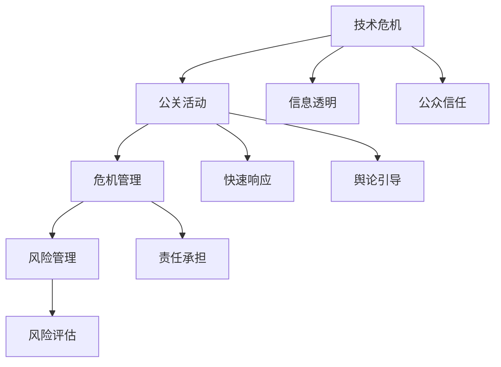

                 


### 文章标题

# 技术危机公关：管理和应对技术危机

### 文章关键词

技术危机、公关管理、应对策略、案例分析、法律与伦理问题

### 文章摘要

技术危机在当今数字化时代愈发普遍，对企业而言，如何有效管理和应对技术危机成为关键问题。本文首先介绍了技术危机公关的概念和重要性，随后分析了危机管理策略，通过实践案例详细解析了危机公关的执行过程。此外，文章探讨了法律与伦理问题，提供了相关技术工具与资源，为读者提供了一套全面的技术危机应对方案。

### 引言

随着信息技术的飞速发展，技术危机在企业运营中的地位日益显著。技术危机通常是指由于技术问题引发的一系列负面事件，如数据泄露、系统故障、网络安全攻击等。这些危机不仅可能对企业的声誉造成严重损害，还可能带来巨大的经济损失。在这种背景下，技术危机公关成为企业亟需关注的重要课题。

技术危机公关是指企业在面对技术危机时，通过有效的沟通和管理策略，降低危机影响，维护企业形象，重塑公众信任的一系列行为。其核心目标包括：

1. **快速响应**：在危机发生的第一时间做出反应，防止问题扩大。
2. **信息透明**：公开、及时、准确地发布信息，避免谣言传播。
3. **责任承担**：承认错误，积极解决问题，挽回损失。
4. **形象重塑**：通过有效的危机管理，恢复公众对企业的信任。

本文旨在探讨技术危机公关的理论与实践，通过分析核心概念、危机管理策略、实践案例和法律伦理问题，为企业在应对技术危机时提供切实可行的指导。

### 核心概念与联系

要理解技术危机公关，首先需要明确其中的核心概念。以下是几个关键概念及其相互之间的联系：

1. **技术危机**：指由于技术问题引发的负面事件，如系统故障、数据泄露等。
2. **公关**：指企业与公众之间的信息交流和管理活动。
3. **危机管理**：指企业为应对危机而采取的一系列策略和措施。
4. **风险管理**：指企业识别、评估和应对风险的过程。

这些概念之间的关系可以用以下Mermaid流程图来表示：



- **技术危机**是危机管理的起点，也是公关活动的触发因素。
- **公关活动**包括快速响应、信息透明、舆论引导等，旨在降低危机影响。
- **危机管理**和**风险管理**相互融合，通过系统性的措施预防危机发生，降低风险。

理解这些核心概念及其相互之间的联系，有助于企业更好地制定和实施技术危机公关策略。

### 危机管理策略

在理解了技术危机和公关的基本概念后，接下来我们将详细探讨危机管理策略。危机管理是一个多层次、多维度的过程，包括预防策略、应对策略和恢复策略。以下是每个策略的详细内容。

#### 预防策略

预防策略是企业应对技术危机的基础，其目的是通过系统的风险识别和评估，提前采取措施，降低危机发生的概率。以下是几个关键的预防策略：

1. **技术风险评估**：通过评估现有技术系统的潜在风险，识别可能的危机点。这可以通过以下步骤实现：
    ```python
    # 技术风险评估流程
    risk_assessment = {
        "system_a": ["硬件老化", "软件漏洞"],
        "system_b": ["数据泄露", "网络安全"],
        "system_c": ["数据同步问题", "系统兼容性"]
    }
    # 输出风险点
    print("风险点：", risk_assessment)
    ```
2. **事故应急预案**：针对可能出现的危机情况，制定详细的应急预案，确保在危机发生时能够迅速响应。例如：
    ```python
    # 应急预案模板
    emergency_plan = {
        "data_leak": ["立即隔离受影响系统", "启动数据恢复流程"],
        "system_failure": ["切换到备份系统", "排查故障原因"],
        "cyber_attack": ["关闭受攻击端口", "更新安全策略"]
    }
    # 输出应急预案
    print("应急预案：", emergency_plan)
    ```

#### 应对策略

在危机真正发生时，应对策略能够帮助企业迅速响应，控制局势，减少损失。以下是几个关键的应对策略：

1. **紧急响应措施**：危机发生后的第一时间，需要立即采取行动，遏制事态恶化。例如：
    ```python
    # 紧急响应措施
    def emergency_response(issue):
        if issue == "data_leak":
            return "立即隔离受影响系统，启动数据恢复流程"
        elif issue == "system_failure":
            return "切换到备份系统，排查故障原因"
        elif issue == "cyber_attack":
            return "关闭受攻击端口，更新安全策略"
        else:
            return "未知危机，请进一步确认"
    # 输出紧急响应措施
    print(emergency_response("data_leak"))
    ```
2. **沟通策略**：在危机期间，企业与内部员工、外部合作伙伴、客户和公众之间的沟通至关重要。以下是沟通策略的关键点：
    - **内部沟通**：确保信息透明，避免信息孤岛。
    - **外部沟通**：通过新闻发布会、社交媒体、官方网站等渠道，及时发布权威信息，避免谣言传播。
    - **舆论引导**：积极回应公众关切，引导舆论方向。

#### 恢复策略

危机得到控制后，恢复策略帮助企业重振信心，重塑形象。以下是恢复策略的关键内容：

1. **问题修复**：针对具体问题，制定详细的修复计划，确保技术系统恢复正常运行。例如：
    ```python
    # 问题修复流程
    repair_plan = {
        "data_leak": ["数据恢复完成后，进行全面安全审计"],
        "system_failure": ["系统修复后，进行稳定性测试"],
        "cyber_attack": ["安全策略更新完成后，加强网络安全监控"]
    }
    # 输出修复计划
    print("修复计划：", repair_plan)
    ```
2. **重塑信任**：通过积极的沟通和行动，逐步恢复公众对企业的信任。这包括：
    - **透明公开**：继续公开信息，展示企业的透明度和责任感。
    - **恢复信任活动**：通过社交媒体、新闻发布会等渠道，展示企业的努力和成果。

### 危机公关实践

理论固然重要，但实践才是检验真理的唯一标准。下面我们通过两个实际案例，展示如何应用上述危机管理策略。

#### 案例一：技术漏洞曝光

某知名互联网公司的一款产品被发现存在严重的技术漏洞，可能导致用户数据泄露。以下是应对该危机的步骤：

1. **预防策略**：
    - **技术风险评估**：公司在产品上线前已进行多次安全测试，但此次漏洞仍未被发现，需改进风险评估流程。
    - **事故应急预案**：公司已制定应急预案，但需要进一步完善，特别是在漏洞发现后的应急处理步骤。

2. **应对策略**：
    - **紧急响应措施**：公司立即关闭受影响的系统，停止数据传输，以防止数据进一步泄露。
    - **沟通策略**：通过官方网站和社交媒体发布紧急通知，告知用户情况，并承诺尽快修复漏洞。

3. **恢复策略**：
    - **问题修复**：公司组织专业团队进行漏洞修复，并对系统进行全面的安全审计。
    - **重塑信任**：公司通过一系列措施，如定期发布安全报告、邀请外部安全专家进行审核，逐步恢复用户的信任。

#### 案例二：数据泄露事件

一家金融机构发生数据泄露事件，涉及大量用户个人信息。以下是应对该危机的步骤：

1. **预防策略**：
    - **技术风险评估**：公司定期进行数据安全评估，但在此次事件中，风险评估未能及时发现漏洞，需加强评估频率和深度。
    - **事故应急预案**：公司应急预案中包含数据泄露应对措施，但在实际操作中发现，部分步骤不够详细，需进一步优化。

2. **应对策略**：
    - **紧急响应措施**：公司立即启动应急预案，通知受影响的用户，并采取措施防止数据进一步泄露。
    - **沟通策略**：公司通过官方网站、邮件、短信等多种渠道，告知用户事件情况和应对措施，确保信息传递的全面性和准确性。

3. **恢复策略**：
    - **问题修复**：公司对受影响的系统进行全面修复，并对所有数据进行加密处理，防止再次发生数据泄露。
    - **重塑信任**：公司采取一系列措施，如提供免费信用监测服务、开展用户教育活动，以恢复用户对公司的信任。

通过以上两个案例，我们可以看到，技术危机公关在实际操作中需要综合运用预防策略、应对策略和恢复策略，以确保危机得到有效管理和控制。

### 法律与伦理问题

在技术危机中，企业不仅需要关注技术和管理问题，还必须重视法律与伦理问题。以下是技术危机中的几个关键法律与伦理问题：

#### 法律法规

1. **数据保护法**：许多国家和地区都有严格的数据保护法律，如欧盟的《通用数据保护条例》（GDPR）。企业在数据泄露事件中必须遵守相关法律规定，否则可能面临巨额罚款。
2. **隐私法**：隐私法保护个人信息的隐私权，企业必须在收集、存储和使用个人信息时遵守隐私法规定。
3. **网络安全法**：网络安全法规定了网络安全的最低标准，企业需确保其系统和数据符合网络安全要求。

#### 伦理问题

1. **用户隐私**：企业在处理用户数据时，必须尊重用户的隐私权，不得非法收集、使用或泄露用户信息。
2. **透明度**：企业在危机中应保持透明度，公开事件的真实情况和处理措施，以赢得公众的信任。
3. **社会责任**：企业在危机中应承担社会责任，采取措施减少危机对用户和社会的影响。

#### 案例分析

以下通过两个案例，探讨技术危机中的法律与伦理问题：

#### 案例一：社交媒体数据泄露

一家社交媒体公司发生数据泄露事件，涉及大量用户个人信息。以下是该案例中的法律与伦理问题：

1. **法律问题**：
    - **数据保护法**：公司因未遵守GDPR规定，被罚款数千万欧元。
    - **隐私法**：用户对公司的隐私保护措施提出诉讼，要求赔偿。

2. **伦理问题**：
    - **用户隐私**：公司未能有效保护用户隐私，违反了伦理原则。
    - **社会责任**：公司未能在危机中承担足够的社会责任，未采取有效措施保护用户权益。

#### 案例二：医疗数据泄露

一家医疗机构发生医疗数据泄露事件，涉及大量患者的个人信息。以下是该案例中的法律与伦理问题：

1. **法律问题**：
    - **数据保护法**：医疗机构因未遵守相关法律规定，被责令整改并罚款。
    - **隐私法**：患者对医疗机构的隐私保护措施提出诉讼，要求赔偿。

2. **伦理问题**：
    - **用户隐私**：医疗机构未能有效保护患者隐私，违反了伦理原则。
    - **社会责任**：医疗机构未能在危机中承担足够的社会责任，未采取有效措施保护患者权益。

通过以上案例，我们可以看到，技术危机中的法律与伦理问题对企业的影响深远。企业必须在技术和管理措施之外，重视法律与伦理问题，确保在危机中保持合规和伦理道德。

### 技术工具与资源

在应对技术危机时，企业可以借助多种技术工具和资源，提高危机管理的效率和效果。以下是一些常用的工具和资源，以及它们的具体用途。

#### 技术工具

1. **危机监测工具**：这类工具可以实时监测系统的运行状态，及时发现潜在的技术问题。例如，Prometheus和Grafana可用于监控服务器性能、应用程序状态和网络流量。

2. **沟通管理工具**：危机发生时，企业需要快速、高效地与内部员工、外部合作伙伴和客户进行沟通。Slack和Microsoft Teams等即时通讯工具可以帮助企业实现这一点。

3. **数据分析工具**：在危机处理过程中，数据分析工具可以帮助企业深入了解问题根源，制定有效的解决方案。例如，Tableau和Power BI可以用于数据可视化和分析。

#### 资源库

1. **行业报告**：行业报告可以提供关于技术危机的最新动态和趋势分析，帮助企业了解当前形势和未来挑战。例如，Gartner和IDC的年度报告。

2. **研究文献**：研究文献提供了关于技术危机管理理论、方法和最佳实践的详细探讨。通过阅读相关文献，企业可以不断完善自己的危机管理策略。

3. **在线课程和培训**：在线课程和培训可以帮助企业员工提升危机管理技能。例如，Coursera和edX提供了众多相关课程。

#### 使用建议

1. **定期评估**：定期评估现有工具和资源的有效性，确保其能够满足企业的需求。

2. **员工培训**：定期对员工进行培训，确保他们熟悉并掌握相关工具和资源的使用。

3. **应急预案**：将技术工具和资源纳入应急预案，确保在危机发生时能够迅速投入使用。

### 总结与展望

技术危机公关是企业在数字化时代面临的一项重要任务。通过有效的危机管理策略，企业可以降低技术危机带来的负面影响，维护企业形象，重塑公众信任。本文从核心概念、危机管理策略、实践案例、法律与伦理问题以及技术工具与资源等方面，全面探讨了技术危机公关的各个方面。

未来，随着技术的不断进步，技术危机的种类和形式也将变得更加复杂和多样化。企业需要不断更新和完善危机管理策略，利用先进的技术工具和资源，提高危机应对能力。同时，企业还应关注法律与伦理问题，确保在危机中保持合规和伦理道德。

让我们共同努力，构建一个更加稳定、安全和可信的数字化世界。

### 作者信息

- 作者：AI天才研究院/AI Genius Institute & 禅与计算机程序设计艺术 /Zen And The Art of Computer Programming

