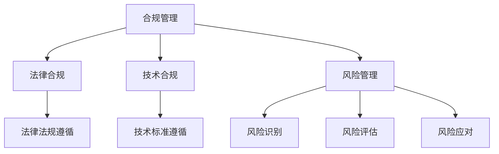
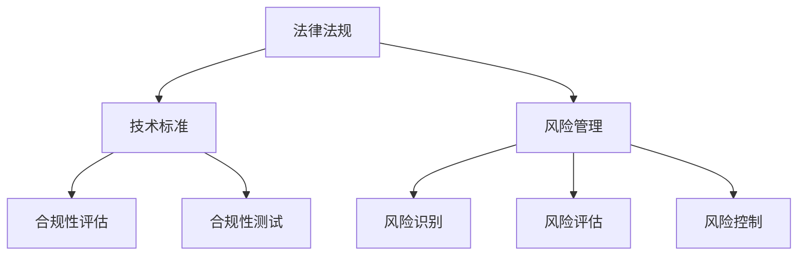
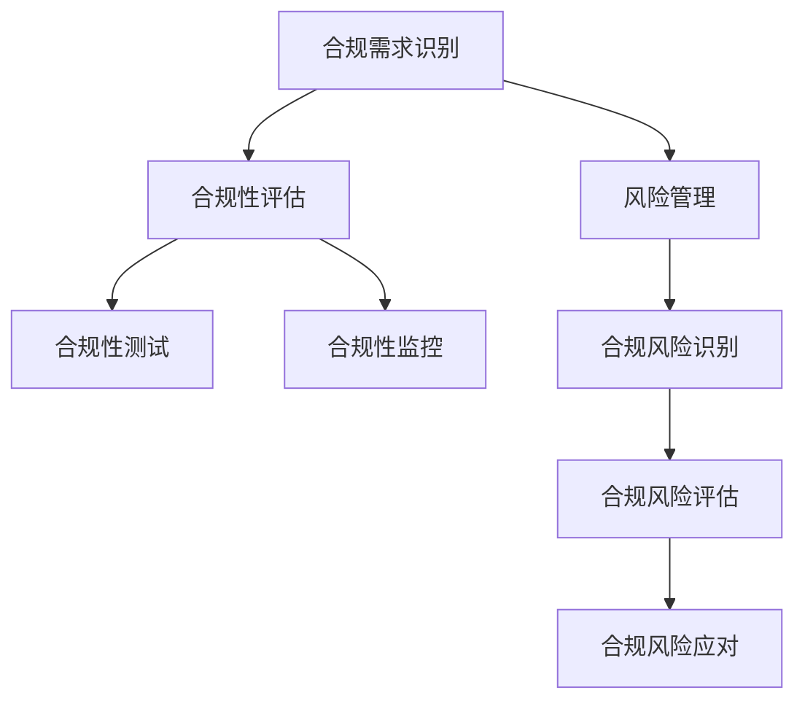

                 

### 文章标题：技术合规管理：在创新中确保法律合规

#### 文章关键词
- 技术合规管理
- 法律合规
- 创新驱动
- 数据隐私
- 信息安全
- 知识产权
- 风险管理

#### 文章摘要
本文旨在探讨技术合规管理在创新过程中的重要性，以及如何在技术创新中确保法律合规。文章首先介绍了合规管理的背景和定义，接着详细阐述了技术合规管理的核心概念、关键领域以及实践方法。通过案例分析，本文揭示了合规管理在技术创新中的实际应用，并提出了最佳实践和注意事项。

### 目录

**技术合规管理：在创新中确保法律合规**

#### 第一部分：合规管理基础

**第1章：合规管理概述**
- 1.1 合规管理的定义与意义
- 1.2 合规管理的历史与发展
- 1.3 合规管理的国际与地区法规简介

**第2章：技术合规管理的核心概念与联系**
- 2.1 技术合规管理的概念模型
- 2.2 技术合规与法律合规的关系
- 2.3 合规管理与风险管理
- 2.4 技术合规管理的Mermaid流程图

#### 第二部分：技术合规关键领域

**第3章：数据隐私合规**
- 3.1 GDPR与数据保护
- 3.2 CCPA与数据隐私
- 3.3 数据隐私合规的策略与实践

**第4章：信息安全合规**
- 4.1 信息安全合规标准
- 4.2 网络安全法律法规
- 4.3 信息安全合规实践

**第5章：知识产权合规**
- 5.1 知识产权的基本概念
- 5.2 知识产权保护的法律框架
- 5.3 技术开发中的知识产权合规

**第6章：反垄断与反贿赂合规**
- 6.1 反垄断法的基本原则
- 6.2 反贿赂合规的法律规定
- 6.3 反垄断与反贿赂合规的案例分析

**第7章：合规管理在技术创新中的应用**
- 7.1 技术创新合规的挑战与机遇
- 7.2 技术创新合规的策略与实践
- 7.3 技术创新合规的成功案例研究

#### 第三部分：合规管理实践

**第8章：合规管理体系建设**
- 8.1 合规管理体系框架
- 8.2 合规组织的角色与职责
- 8.3 合规管理的实施步骤

**第9章：合规风险管理**
- 9.1 合规风险识别与评估
- 9.2 合规风险应对策略
- 9.3 合规风险监控与改进

**第10章：合规培训与文化建设**
- 10.1 合规培训的策略与方法
- 10.2 合规文化的建设
- 10.3 合规文化与技术创新的融合

**附录**
- 附录A：合规管理相关法律法规摘要
- 附录B：合规管理工具与资源

### 详细内容（待续）

**第一部分：合规管理基础**

#### 第1章：合规管理概述

##### 1.1 合规管理的定义与意义

**背景介绍**
在信息技术迅速发展的时代，技术合规管理成为企业运营的重要组成部分。合规管理是指企业遵循法律法规、行业标准、组织内部规定等，确保组织行为合法、合规，降低法律风险，维护企业形象和利益的系统性管理活动。

**核心概念与联系**
合规管理涉及法律合规、技术合规、风险管理等多个方面，它们之间相互关联，形成一个完整的合规管理体系。

- **法律合规**：指企业遵守国家法律法规，包括但不限于税收、劳动法、反垄断法、反贿赂法等。
- **技术合规**：指企业遵循技术相关法律法规和标准，确保技术产品和服务的合规性，如信息安全、数据隐私等。
- **风险管理**：合规管理中的风险管理旨在识别、评估和应对合规风险，确保企业运营的合法性和稳定性。

**Mermaid流程图**

##### 1.2 合规管理的历史与发展

**合规管理起源与发展**
合规管理起源于20世纪50年代，随着企业国际化经营和全球化进程的加快，合规管理逐渐成为企业管理的重要组成部分。国际和地区层面的合规管理法规也在不断发展和完善。

**国际和地区合规管理法规的演变**
- **国际层面**：如联合国反腐败公约、国际商会（ICC）的合规管理指南等。
- **地区层面**：如欧盟的GDPR、美国的《萨班斯-奥克斯利法案》、中国的《网络安全法》等。

**我国合规管理的发展历程**
我国合规管理始于20世纪80年代，随着改革开放和市场经济的发展，合规管理逐渐成为企业关注的焦点。近年来，我国在反垄断、反贿赂、信息安全等方面出台了一系列法律法规，如《反垄断法》、《网络安全法》、《数据安全法》等。

##### 1.3 合规管理的国际与地区法规简介

**GDPR与数据保护**
- **核心原则**：GDPR提出了数据保护的基本原则，如数据最小化、数据目的明确、数据质量、数据安全等。
- **数据处理要求**：GDPR明确了数据处理者的责任，包括数据保护的合规性评估、数据泄露通知等。

**CCPA与数据隐私**
- **主要条款**：CCPA规定了消费者对个人数据的主权，包括数据访问、数据删除、数据不同意等权利。
- **CCPA与GDPR的对比分析**：CCPA更注重消费者的数据权利，而GDPR更强调数据保护的基本原则。

**美国SEC监管与合规**
- **监管框架**：美国证券交易委员会（SEC）对上市公司有严格的合规要求，包括财务报告、内部控制等。
- **合规要求**：上市公司必须遵守《萨班斯-奥克斯利法案》的相关规定，确保财务报告的准确性。

#### 第2章：技术合规管理的核心概念与联系

##### 2.1 技术合规管理的概念模型

**技术合规管理的概念模型**
技术合规管理涉及多个方面，包括法律法规、技术标准、风险管理等。以下是一个简要的技术合规管理概念模型：

- **法律法规**：包括国家法律、行业法规等，如《网络安全法》、《数据安全法》等。
- **技术标准**：包括国家标准、行业标准等，如ISO/IEC 27001信息安全管理体系标准等。
- **风险管理**：包括合规风险的识别、评估、控制等，确保企业运营的合法性和稳定性。

**Mermaid流程图**

##### 2.2 技术合规与法律合规的关系

**技术合规与法律合规的关系**
技术合规与法律合规是相辅相成的。技术合规确保企业产品和服务的合法性，而法律合规则为企业提供合规的框架和指导。

- **技术合规对法律合规的支撑作用**：技术合规通过制定技术标准和规范，确保企业产品和服务的合规性，从而支持法律合规的实施。
- **法律合规对技术合规的指导作用**：法律合规通过制定法律法规，规范企业行为，为技术合规提供法律依据和指导。

**互动关系**
技术合规与法律合规之间存在互动关系。技术合规的实施需要法律合规的支持，而法律合规的完善也需要技术合规的推动。

##### 2.3 合规管理与风险管理

**合规管理与风险管理的区别与联系**
合规管理与风险管理都是企业管理的重要组成部分，但二者有所不同。

- **合规管理**：主要关注企业遵守法律法规和技术标准，确保企业行为的合法性。
- **风险管理**：主要关注企业面临的各种风险，包括合规风险、财务风险、运营风险等，通过识别、评估和应对风险，确保企业运营的稳定性和可持续性。

**合规风险管理的方法与策略**
合规风险管理是合规管理的重要组成部分。以下是一些合规风险管理的方法与策略：

- **合规风险识别**：通过法律法规审查、内部调查等方式，识别合规风险。
- **合规风险评估**：对识别出的合规风险进行评估，确定风险的严重程度和发生可能性。
- **合规风险应对**：根据风险评估结果，制定应对策略，如规避、转移、接受等。

**合规风险管理在技术创新中的应用**
技术创新过程中，合规风险管理至关重要。以下是一些合规风险管理在技术创新中的应用：

- **合规性评估**：在项目启动前，对技术创新方案进行合规性评估，确保项目的合法性。
- **合规性测试**：在项目实施过程中，进行合规性测试，确保产品和服务的合规性。
- **合规性监控**：在项目完成后，进行合规性监控，确保持续合规。

##### 2.4 技术合规管理的Mermaid流程图

**技术合规管理流程**

**第二部分：技术合规关键领域**

##### 第3章：数据隐私合规

##### 3.1 GDPR与数据保护

**GDPR的核心原则**

- **数据保护基本原则**：GDPR提出了数据保护的基本原则，包括数据最小化、数据目的明确、数据质量、数据安全等。
  - **数据最小化**：数据处理者只能收集必要的个人信息，不能超出数据处理目的的范围。
  - **数据目的明确**：数据处理者在收集个人信息前，必须明确数据处理的目的，并在处理过程中遵守这些目的。
  - **数据质量**：个人信息必须准确、完整、及时更新。
  - **数据安全**：数据处理者必须采取措施保护个人信息的安全，防止数据泄露、篡改、滥用等。

**数据处理要求**

- **数据处理者的责任**：GDPR明确了数据处理者的责任，包括数据保护的合规性评估、数据泄露通知等。
  - **合规性评估**：数据处理者在处理个人信息前，必须进行合规性评估，确保数据处理符合GDPR的要求。
  - **数据泄露通知**：如果发生数据泄露事件，数据处理者必须在72小时内通知相关数据主体和监管机构。

**GDPR的实施案例**

- **案例一**：某科技公司因未履行数据保护义务，被欧盟监管机构罚款5000万欧元。
  - **背景**：该科技公司未对用户数据进行加密处理，导致用户数据泄露。
  - **处理过程**：欧盟监管机构对该科技公司进行了调查，并认定其未履行数据保护义务。

**GDPR对技术合规管理的影响**

- **影响分析**：GDPR的实施对技术合规管理产生了深远影响，主要体现在以下几个方面：
  - **加强数据保护**：GDPR对数据保护的要求更加严格，数据处理者必须采取更加严格的数据保护措施。
  - **提高合规成本**：GDPR的实施增加了企业的合规成本，包括合规性评估、数据保护措施等。
  - **提升数据透明度**：GDPR要求数据处理者向数据主体提供更加透明的数据处理信息，提高数据透明度。

**GDPR与其他地区数据保护法规的对比**

- **GDPR与CCPA的对比**：GDPR和CCPA都是重要的数据保护法规，但二者在数据保护原则、数据处理要求等方面存在差异。
  - **数据保护原则**：GDPR强调数据保护的基本原则，而CCPA更注重消费者的数据权利。
  - **数据处理要求**：GDPR要求数据处理者在数据处理前进行合规性评估，而CCPA要求企业在数据处理前获得消费者的明确同意。

##### 3.2 CCPA与数据隐私

**CCPA的主要条款**

- **消费者数据权利**：CCPA赋予了消费者对个人数据的更多权利，包括访问权、删除权、不同意权等。
  - **访问权**：消费者有权访问自己的个人信息，并了解个人信息的使用情况。
  - **删除权**：消费者有权要求企业删除自己的个人信息。
  - **不同意权**：消费者有权不同意企业对其个人信息的处理。

**CCPA与GDPR的对比分析**

- **数据保护原则**：CCPA与GDPR都强调了数据保护的基本原则，如数据最小化、数据目的明确等。
  - **GDPR更注重数据保护的基本原则，强调数据处理者的责任。**
  - **CCPA更注重消费者的数据权利，强调消费者的数据主权。**

**CCPA的实施与挑战**

- **实施情况**：CCPA于2020年生效，许多企业已经开始实施CCPA的要求。
  - **企业反应**：许多企业已经开始调整数据处理流程，确保合规性。
  - **监管机构的态度**：监管机构对CCPA的实施态度积极，对违规行为进行严厉处罚。

**CCPA对技术合规管理的影响**

- **影响分析**：CCPA的实施对技术合规管理产生了深远影响，主要体现在以下几个方面：
  - **提高数据处理透明度**：CCPA要求企业向消费者提供更加透明的数据处理信息，提高数据处理透明度。
  - **增加合规成本**：CCPA要求企业采取更加严格的数据保护措施，增加了合规成本。
  - **强化消费者权益保护**：CCPA的实施加强了消费者对个人数据的保护，提高了消费者权益保护水平。

##### 3.3 数据隐私合规的策略与实践

**数据隐私合规的策略**

- **策略一：建立数据隐私合规体系**
  - **建立数据隐私合规政策**：制定数据隐私合规政策，明确数据处理原则、流程和要求。
  - **制定数据隐私合规手册**：制定数据隐私合规手册，指导企业内部各部门如何进行数据处理。

- **策略二：开展数据隐私合规培训**
  - **内部培训**：对员工进行数据隐私合规培训，提高员工的数据保护意识。
  - **外部培训**：与第三方机构合作，开展数据隐私合规培训。

- **策略三：进行数据隐私合规评估**
  - **内部评估**：定期对企业的数据处理活动进行评估，确保合规性。
  - **外部评估**：邀请第三方机构进行数据隐私合规评估，提供专业的合规建议。

**数据隐私合规的最佳实践**

- **最佳实践一：实施数据最小化原则**
  - **收集必要数据**：仅收集为实现数据处理目的所必需的个人信息。
  - **数据去标识化**：对收集到的个人信息进行去标识化处理，降低个人信息泄露风险。

- **最佳实践二：加强数据安全保护**
  - **数据加密**：对存储和传输的个人信息进行加密处理。
  - **访问控制**：实施严格的访问控制策略，确保只有授权人员才能访问个人信息。

- **最佳实践三：定期进行数据隐私合规审计**
  - **内部审计**：定期对企业的数据处理活动进行内部审计，发现潜在问题并及时整改。
  - **外部审计**：定期邀请第三方机构进行数据隐私合规审计，确保合规性。

**数据隐私合规的案例研究**

- **案例一**：某互联网公司数据泄露事件
  - **背景**：该公司未对用户数据进行加密处理，导致用户数据泄露。
  - **处理过程**：该公司在事件发生后，立即进行了内部调查，并向监管机构和用户进行了通报。
  - **结果**：该公司受到了巨额罚款，并被迫调整数据处理流程，加强数据保护措施。

**第三部分：合规管理实践**

##### 第4章：信息安全合规

**4.1 信息安全合规标准**

**ISO/IEC 27001标准概述**

- **标准背景**：ISO/IEC 27001是国际标准化组织（ISO）和国际电工委员会（IEC）共同制定的信息安全管理体系（ISMS）标准。
- **标准内容**：ISO/IEC 27001标准涵盖了信息安全的各个方面，包括风险评估、信息安全策略、信息安全控制、信息安全监控等。

**信息安全合规标准的实施**

- **实施步骤**：
  - **准备阶段**：确定信息安全管理体系的范围、目标和政策。
  - **实施阶段**：实施信息安全控制措施，进行风险评估和管理。
  - **监控阶段**：定期进行信息安全监控和内部审计，确保合规性。

**常见信息安全标准介绍**

- **ISO/IEC 27002**：提供了信息安全控制的详细指南，包括组织安全、资产安全、访问控制、物理安全等。
- **NIST SP 800-53**：美国国家标准化与技术研究所（NIST）制定的信息安全控制框架，适用于政府和非政府机构。

**4.2 网络安全法律法规**

**网络安全法的背景和主要内容**

- **背景**：随着互联网的普及，网络安全问题日益突出，我国于2016年通过了《网络安全法》，以加强对网络安全的法律监管。
- **主要内容**：
  - **网络安全等级保护**：要求网络运营者按照等级保护要求，对网络进行安全防护。
  - **网络安全审查**：对重要网络和信息系统进行安全审查，确保其安全性和可控性。
  - **网络安全监测**：要求网络运营者对网络进行监测，及时发现和处理网络安全事件。

**网络安全法律法规的实施**

- **实施步骤**：
  - **政策制定**：制定网络安全相关政策和管理办法。
  - **法规宣传**：通过媒体、培训等方式，提高公众的网络安全意识和法律意识。
  - **监督检查**：对网络运营者的网络安全措施进行监督检查，确保法律法规的执行。

**4.3 信息安全合规实践**

**信息安全合规的案例分析**

- **案例一**：某金融机构信息安全事件
  - **背景**：该金融机构未按照网络安全法的要求进行网络安全等级保护，导致网络系统遭受攻击，大量客户信息泄露。
  - **处理过程**：该金融机构在事件发生后，立即进行了内部调查，并向监管机构进行了报告。
  - **结果**：该金融机构受到了巨额罚款，并被迫调整信息安全措施，加强网络安全防护。

**信息安全合规的最佳实践**

- **最佳实践一：建立信息安全管理体系**
  - **制定信息安全策略**：明确信息安全的目标和原则，制定相应的信息安全策略。
  - **实施信息安全控制**：根据信息安全策略，实施相应的信息安全控制措施，如访问控制、数据加密、物理安全等。

- **最佳实践二：进行信息安全培训**
  - **内部培训**：对员工进行信息安全培训，提高员工的安全意识和技能。
  - **外部培训**：与外部专业机构合作，进行信息安全专业培训。

- **最佳实践三：定期进行信息安全评估**
  - **内部评估**：定期对企业的信息安全措施进行评估，发现潜在的安全漏洞和风险。
  - **外部评估**：邀请第三方机构进行信息安全评估，提供专业的评估报告。

**第四部分：合规管理在技术创新中的应用**

##### 第5章：知识产权合规

**5.1 知识产权的基本概念**

**知识产权的定义和类型**

- **知识产权的定义**：知识产权是指人们对于自己的智力成果所享有的专有权利。
- **知识产权的类型**：包括专利、商标、著作权、商业秘密等。

**知识产权的重要性和保护原则**

- **重要性**：知识产权是企业核心竞争力的重要体现，对于技术创新和经济发展具有重要意义。
- **保护原则**：知识产权保护遵循公平、公正、公开的原则，确保知识产权权利人的合法权益得到保障。

**5.2 知识产权保护的法律框架**

**专利保护**

- **专利法的基本原则**：保护发明创造、鼓励技术创新、促进科技进步。
- **专利申请流程**：包括专利申请、审查、授权等环节。

**商标保护**

- **商标法的基本原则**：保护商标的专有性、防止商标滥用。
- **商标注册流程**：包括商标查询、商标申请、商标审查等环节。

**著作权保护**

- **著作权法的基本原则**：保护作品著作权、保障创作者合法权益。
- **著作权申请和登记流程**：包括作品创作、著作权登记、维权等环节。

**商业秘密保护**

- **商业秘密的定义和范围**：商业秘密是指不为公众所知悉、具有商业价值、经权利人采取保密措施的技术信息和经营信息。
- **商业秘密保护措施**：包括保密协议、保密制度、技术措施等。

**5.3 技术开发中的知识产权合规**

**知识产权合规在技术开发中的应用**

- **技术开发前的知识产权调研**：在技术开发前，对相关领域的知识产权进行调研，避免侵犯他人的知识产权。
- **技术开发过程中的知识产权保护**：在技术开发过程中，采取相应的保护措施，确保知识产权不受侵犯。
- **技术开发后的知识产权管理**：技术开发完成后，进行知识产权的申请和保护，确保知识产权的合法权益得到保障。

**知识产权合规的案例分析**

- **案例一**：某科技企业专利侵权纠纷
  - **背景**：该科技企业在开发新产品时，未进行充分的知识产权调研，侵犯了某专利权人的专利权。
  - **处理过程**：该科技企业在接到专利权人的侵权投诉后，进行了内部调查，并主动与专利权人进行协商解决。
  - **结果**：该科技企业最终与专利权人达成和解，支付了赔偿金，并调整了产品开发策略。

**知识产权合规的最佳实践**

- **最佳实践一：建立知识产权合规管理体系**
  - **制定知识产权合规政策**：明确知识产权合规的目标、原则和流程。
  - **实施知识产权合规培训**：对员工进行知识产权合规培训，提高员工的法律意识和合规能力。

- **最佳实践二：加强知识产权信息管理**
  - **建立知识产权数据库**：收集和管理相关的知识产权信息，确保信息的准确性和完整性。
  - **进行知识产权风险评估**：定期对企业的知识产权进行风险评估，识别潜在的风险和隐患。

- **最佳实践三：积极参与知识产权保护活动**
  - **申请知识产权保护**：积极申请专利、商标、著作权等知识产权，确保企业的合法权益得到保护。
  - **参与知识产权维权活动**：积极参与知识产权维权活动，维护企业的知识产权权益。

**第6章：反垄断与反贿赂合规**

**6.1 反垄断法的基本原则**

**反垄断法的定义和适用范围**

- **反垄断法的定义**：反垄断法是指国家为了维护市场公平竞争，防止垄断行为，促进经济发展而制定的法律规范。
- **反垄断法的适用范围**：反垄断法适用于所有在市场进行经营活动的企业，包括国内和国际市场。

**反垄断法的基本原则**

- **禁止垄断协议**：反垄断法禁止企业之间达成限制竞争的协议，如价格协议、市场份额协议等。
- **防止滥用市场支配地位**：反垄断法禁止企业利用其市场支配地位排除或限制竞争。
- **控制经营者集中**：反垄断法对企业的合并、收购等活动进行控制，防止市场垄断的形成。

**6.2 反贿赂合规的法律规定**

**反贿赂法的定义和适用范围**

- **反贿赂法的定义**：反贿赂法是指国家为了打击贿赂行为，维护公平竞争和市场秩序而制定的法律规范。
- **反贿赂法的适用范围**：反贿赂法适用于所有在市场进行经营活动的企业，包括国内和国际市场。

**反贿赂法的主要规定**

- **禁止贿赂行为**：反贿赂法明确禁止企业及其员工以任何形式进行贿赂，包括直接贿赂和间接贿赂。
- **建立内部反贿赂制度**：企业必须建立内部反贿赂制度，包括反贿赂政策、培训、监控等。
- **责任追究**：反贿赂法规定，企业及其员工因贿赂行为需承担法律责任，包括罚款、刑事责任等。

**6.3 反垄断与反贿赂合规的案例分析**

**反垄断合规案例分析**

- **案例一**：某国际知名企业垄断案
  - **背景**：该企业在多个国家和地区涉嫌通过垄断协议和滥用市场支配地位，排除竞争对手，控制市场价格。
  - **处理过程**：该企业在多个国家的监管机构接受了调查，并进行了内部整改。
  - **结果**：该企业被多个国家的监管机构罚款巨额资金，并被迫调整其市场策略。

**反贿赂合规案例分析**

- **案例二**：某企业员工涉嫌贿赂事件
  - **背景**：该企业的员工因涉嫌向供应商行贿，被监管机构调查。
  - **处理过程**：该企业在接到调查通知后，立即进行了内部调查，并积极配合监管机构的调查。
  - **结果**：该员工因贿赂行为被解雇，企业也被罚款，并建立了更严格的内部反贿赂制度。

**第7章：合规管理在技术创新中的应用**

**7.1 技术创新合规的挑战与机遇**

**技术创新合规的挑战**

- **法规不确定性**：技术创新往往涉及新兴技术领域，相关法律法规可能尚未完善，导致合规难度增加。
- **技术快速变化**：技术创新速度加快，合规要求可能滞后，企业需要及时更新合规策略和措施。
- **跨区域合规**：全球化和国际化使得企业在技术创新过程中需要遵守不同国家和地区的法律法规，增加了合规复杂性。

**技术创新合规的机遇**

- **法规引领**：政府通过制定鼓励创新的政策和法规，为企业提供合规支持，降低合规风险。
- **市场扩张**：技术创新为企业提供了新的市场机会，合规管理有助于企业在全球市场中获得竞争优势。
- **技术创新合规的优势**：合规管理有助于企业建立良好的企业形象，提高客户信任度和市场竞争力。

**7.2 技术创新合规的策略与实践**

**合规策略**

- **风险评估**：在技术创新初期，进行全面的风险评估，识别潜在的法律风险，制定相应的合规措施。
- **法规遵循**：遵守国家和地区的法律法规，包括反垄断法、数据隐私法、知识产权法等。
- **合规培训**：对员工进行合规培训，提高员工的合规意识和能力，确保技术创新过程的合规性。

**合规实践**

- **合规文化建设**：建立合规文化，将合规管理融入企业的核心价值观和运营流程中。
- **合规管理体系**：建立合规管理体系，包括合规政策、合规程序、合规监督等，确保技术创新过程的合规性。
- **合规技术支持**：利用合规管理软件和工具，提高合规管理的效率和准确性。

**7.3 技术创新合规的成功案例研究**

**案例一：某企业技术创新合规实践**

- **背景**：该企业是一家专注于人工智能领域的企业，在技术创新过程中面临诸多合规挑战。
- **合规策略**：该企业采取了一系列合规策略，包括风险评估、法规遵循、合规培训等。
- **合规实践**：该企业建立了完善的合规管理体系，确保技术创新过程的合规性。
- **结果**：该企业在技术创新过程中未发生重大合规事件，技术创新成果得到了有效保护，企业品牌形象得到了提升。

**案例二：某科技企业跨境合规管理**

- **背景**：该企业是一家跨国企业，在全球化进程中面临不同国家和地区的法律法规挑战。
- **合规策略**：该企业制定了跨境合规策略，包括了解不同国家和地区的法律法规、建立合规管理体系等。
- **合规实践**：该企业建立了全球合规团队，负责协调不同国家和地区的合规事务，确保企业运营的合规性。
- **结果**：该企业在全球市场中保持了良好的合规记录，取得了显著的市场份额和商业成功。

### 第五部分：合规管理体系建设

**第8章：合规管理体系建设**

**8.1 合规管理体系框架**

**合规管理体系概述**

- **定义**：合规管理体系是指企业为实现合规目标而建立的一套制度化、系统化的管理架构。
- **组成**：合规管理体系包括合规政策、合规程序、合规监督、合规培训等关键组成部分。

**合规管理体系框架**

- **合规政策**：明确合规目标、原则和责任，为合规管理提供指导。
- **合规程序**：制定具体的合规流程和操作规范，确保合规措施的执行。
- **合规监督**：建立合规监督机制，对合规措施的执行情况进行监督和评估。
- **合规培训**：对员工进行合规培训，提高员工的合规意识和能力。

**合规管理体系的作用**

- **确保合规性**：通过合规管理体系，企业能够确保其运营和业务活动符合法律法规和行业标准。
- **降低风险**：合规管理体系有助于企业识别和应对合规风险，降低法律风险和运营风险。
- **提升形象**：合规管理体系有助于企业建立良好的社会形象，提高客户和合作伙伴的信任度。

**8.2 合规组织的角色与职责**

**合规组织的定义和作用**

- **定义**：合规组织是指负责企业合规管理工作的专门机构或部门。
- **作用**：合规组织在企业中扮演着关键角色，负责制定和执行合规政策、监督合规措施的执行、处理合规问题等。

**合规组织的角色**

- **制定合规政策**：根据企业的战略目标和业务需求，制定合规政策，明确合规目标和原则。
- **实施合规程序**：制定具体的合规程序和操作规范，确保合规措施的执行。
- **监督合规执行**：建立合规监督机制，对合规措施的执行情况进行监督和评估。
- **处理合规问题**：发现和处理合规问题，采取相应的纠正和改进措施。

**合规组织的职责**

- **合规风险管理**：识别和评估合规风险，制定风险应对策略。
- **合规培训与宣传**：组织合规培训，提高员工的合规意识和能力，宣传合规文化。
- **合规监督与审计**：对合规措施的执行情况进行监督和审计，确保合规性。
- **合规问题处理**：处理合规问题，包括合规投诉、合规调查、合规整改等。

**8.3 合规管理的实施步骤**

**合规管理实施步骤概述**

- **制定合规政策**：根据企业的战略目标和业务需求，制定符合法律法规和行业标准的合规政策。
- **制定合规程序**：制定具体的合规程序和操作规范，确保合规措施的执行。
- **建立合规监督机制**：建立合规监督机制，对合规措施的执行情况进行监督和评估。
- **进行合规培训**：对员工进行合规培训，提高员工的合规意识和能力。
- **进行合规审计**：定期进行合规审计，评估合规管理的有效性和合规性。
- **处理合规问题**：发现和处理合规问题，采取相应的纠正和改进措施。

**具体实施步骤**

1. **合规政策制定**
   - **确定合规目标**：明确企业的合规目标，如数据隐私保护、信息安全保障等。
   - **制定合规政策**：根据合规目标，制定具体的合规政策，包括合规原则、合规要求等。

2. **合规程序制定**
   - **分析业务流程**：分析企业的业务流程，确定需要遵循的法律法规和行业标准。
   - **制定合规程序**：根据分析结果，制定具体的合规程序和操作规范，确保合规措施的执行。

3. **建立合规监督机制**
   - **确定监督内容**：明确合规监督的内容，如合规执行情况、合规风险等。
   - **制定监督计划**：根据监督内容，制定具体的监督计划，确保合规监督的有效性。

4. **进行合规培训**
   - **制定培训计划**：根据员工岗位和工作需求，制定具体的合规培训计划。
   - **组织培训活动**：实施培训计划，组织合规培训活动，提高员工的合规意识和能力。

5. **进行合规审计**
   - **制定审计计划**：根据合规监督机制，制定具体的审计计划，确保审计的有效性。
   - **实施审计活动**：按照审计计划，实施合规审计活动，评估合规管理的有效性和合规性。

6. **处理合规问题**
   - **发现合规问题**：通过合规监督和审计，发现合规问题。
   - **处理合规问题**：对发现的合规问题进行及时处理，采取相应的纠正和改进措施。

### 第六部分：合规风险管理

**第9章：合规风险管理**

**9.1 合规风险识别与评估**

**合规风险识别**

- **定义**：合规风险识别是指通过系统的分析方法，识别企业在合规管理过程中可能面临的各种风险。
- **目的**：合规风险识别的目的是为了提前发现潜在的风险，制定相应的风险应对策略。

**合规风险识别的方法**

- **问卷调查法**：通过问卷调查，收集员工对合规风险的看法和意见。
- **头脑风暴法**：组织专家和员工进行头脑风暴，讨论可能存在的合规风险。
- **访谈法**：对相关部门进行访谈，了解他们在合规管理过程中的问题和困难。

**合规风险评估**

- **定义**：合规风险评估是指对识别出的合规风险进行分析和评估，确定其严重程度和发生可能性。
- **目的**：合规风险评估的目的是为了确定企业面临的主要合规风险，制定相应的风险应对策略。

**合规风险评估的方法**

- **定性评估法**：通过专家判断和主观评价，对合规风险进行定性分析。
- **定量评估法**：通过数据分析和方法，对合规风险进行定量分析。

**合规风险识别与评估的流程**

1. **合规风险识别**
   - **收集信息**：通过问卷调查、头脑风暴、访谈等方式，收集合规风险的信息。
   - **分析信息**：对收集到的信息进行分析，识别潜在的合规风险。

2. **合规风险评估**
   - **确定评估指标**：根据企业的实际情况，确定合规风险评估的指标。
   - **进行评估**：根据评估指标，对识别出的合规风险进行评估，确定其严重程度和发生可能性。

**9.2 合规风险应对策略**

**合规风险应对策略**

- **风险规避**：通过调整业务流程或产品策略，避免涉及高风险领域。
- **风险转移**：通过保险或合同条款等方式，将合规风险转移给其他方。
- **风险接受**：对无法规避或转移的风险，采取接受的态度，制定相应的风险应对措施。

**合规风险应对策略的选择**

- **基于风险优先级**：优先应对高优先级的合规风险，确保关键业务领域的合规性。
- **基于资源能力**：根据企业的资源能力和业务需求，选择合适的风险应对策略。

**合规风险应对策略的实施**

1. **制定应对计划**
   - **确定风险应对措施**：根据风险评估结果，确定具体的应对措施。
   - **制定应对计划**：制定详细的应对计划，明确应对措施的具体实施步骤和时间表。

2. **实施应对措施**
   - **执行计划**：按照应对计划，执行具体的应对措施。
   - **监督执行**：对应对措施的执行情况进行监督，确保措施的落实。

3. **评估效果**
   - **评估应对效果**：对应对措施的实施效果进行评估，确定是否达到预期目标。
   - **调整应对策略**：根据评估结果，调整应对策略和措施，确保合规风险的有效控制。

**9.3 合规风险监控与改进**

**合规风险监控**

- **定义**：合规风险监控是指通过系统的监控方法，对合规风险的状况进行实时监控和跟踪。
- **目的**：合规风险监控的目的是为了及时发现合规风险的动态变化，及时采取应对措施。

**合规风险监控的方法**

- **定期报告**：通过定期报告，了解合规风险的状况和变化趋势。
- **实时监控**：通过实时监控工具，对合规风险的状况进行实时监控和预警。

**合规风险监控的流程**

1. **制定监控计划**
   - **确定监控目标**：明确合规风险监控的目标和范围。
   - **制定监控计划**：根据监控目标，制定具体的监控计划和监控指标。

2. **实施监控**
   - **执行监控计划**：按照监控计划，实施具体的监控活动。
   - **收集监控数据**：收集合规风险的监控数据，进行分析和评估。

3. **分析监控数据**
   - **分析监控数据**：对收集到的监控数据进行分析，评估合规风险的状况和变化趋势。

4. **报告监控结果**
   - **报告监控结果**：将监控结果报告给相关部门和人员，确保合规风险的及时应对。

**合规风险改进**

- **定义**：合规风险改进是指通过系统的改进方法，对合规风险的管理进行持续改进。
- **目的**：合规风险改进的目的是为了提高合规风险管理的效率和效果，降低合规风险。

**合规风险改进的方法**

- **持续改进**：通过定期评估和反馈，对合规风险管理的流程和方法进行持续改进。
- **创新管理**：引入新的管理理念和方法，提高合规风险管理的创新性和灵活性。

**合规风险改进的流程**

1. **评估改进效果**
   - **评估改进效果**：对合规风险改进的效果进行评估，确定改进措施的有效性。

2. **提出改进建议**
   - **提出改进建议**：根据评估结果，提出改进建议，优化合规风险管理的流程和方法。

3. **实施改进措施**
   - **实施改进措施**：按照改进建议，实施具体的改进措施，提高合规风险管理的效率。

4. **监督改进效果**
   - **监督改进效果**：对改进措施的实施效果进行监督，确保改进措施的有效落实。

### 第七部分：合规培训与文化建设

**第10章：合规培训与文化建设**

**10.1 合规培训的策略与方法**

**合规培训的策略**

- **全员参与**：确保所有员工都参与合规培训，提高整个组织的合规意识。
- **针对性培训**：根据员工的不同岗位和工作职责，制定针对性的培训计划。
- **持续培训**：合规培训不仅仅是一次性的活动，而是一个持续的过程，需要定期进行培训。

**合规培训的方法**

- **内部培训**：通过内部培训，提高员工的合规意识和能力。
- **外部培训**：邀请外部专家进行合规培训，提供专业的合规知识。
- **在线培训**：利用互联网和在线学习平台，进行灵活多样的合规培训。

**10.2 合规文化的建设**

**合规文化的定义**

- **合规文化**：合规文化是指企业中形成的合规价值观、合规理念和合规行为习惯。

**合规文化的重要性**

- **提高合规意识**：合规文化能够提高员工的合规意识，使其在日常工作中自觉遵守合规要求。
- **降低合规风险**：合规文化有助于降低企业的合规风险，减少违规行为的发生。
- **提升企业形象**：合规文化能够提升企业的社会形象，增强企业的公信力和竞争力。

**建设合规文化的步骤**

1. **确立合规价值观**
   - **制定合规价值观**：明确企业的合规价值观，将其融入到企业文化中。
   - **宣传合规价值观**：通过内部宣传，让员工了解和认同企业的合规价值观。

2. **培养合规意识**
   - **开展合规教育**：通过合规教育，提高员工的合规意识。
   - **树立合规榜样**：通过树立合规榜样，激发员工的合规积极性。

3. **建立合规行为规范**
   - **制定合规行为规范**：明确员工的合规行为规范，确保其符合法律法规和企业要求。
   - **执行合规行为规范**：通过监督和考核，确保员工的合规行为规范得到执行。

4. **营造合规氛围**
   - **建立合规制度**：建立完善的合规制度，为合规文化的建设提供保障。
   - **营造合规氛围**：通过宣传和奖励，营造积极向上的合规氛围。

**10.3 合规文化与技术创新的融合**

**合规文化与技术创新的关系**

- **相互促进**：合规文化和技术创新是相互促进的关系。合规文化为技术创新提供了合规保障，技术创新为合规文化提供了实践机会。
- **协调发展**：合规文化和技术创新需要在协调发展中，实现两者的有机结合。

**合规文化与技术创新的融合策略**

1. **合规文化嵌入技术创新**
   - **将合规要求融入研发流程**：在技术创新的研发过程中，将合规要求嵌入到各个阶段，确保技术创新的合规性。
   - **建立合规文化氛围**：在研发团队中营造合规文化氛围，提高团队成员的合规意识。

2. **技术创新支持合规文化**
   - **利用技术创新手段提升合规管理效率**：利用大数据、人工智能等技术手段，提高合规管理的效率。
   - **创新合规管理模式**：通过技术创新，探索新的合规管理模式，提高合规管理的灵活性和适应性。

3. **合规文化引导技术创新**
   - **遵循合规原则进行技术创新**：在技术创新过程中，遵循合规原则，确保技术创新的合规性。
   - **支持合规性强的技术创新项目**：鼓励和支持合规性强的技术创新项目，提高企业的合规竞争力。

**合规文化与技术创新的融合实践**

- **案例一**：某企业在技术创新中嵌入合规文化
  - **背景**：该企业在研发新产品时，将合规要求融入到研发流程中，确保新产品的合规性。
  - **过程**：该企业在研发过程中，制定了详细的合规计划，对研发人员进行合规培训，确保研发过程的合规性。
  - **结果**：该企业成功研发出合规性强的产品，取得了良好的市场反响。

- **案例二**：某企业利用技术创新提升合规管理效率
  - **背景**：该企业利用大数据和人工智能技术，提升了合规管理的效率。
  - **过程**：该企业建立了大数据合规分析平台，通过数据分析和人工智能算法，及时发现和应对合规风险。
  - **结果**：该企业合规管理效率大幅提升，合规风险得到了有效控制。

### 附录

**附录A：合规管理相关法律法规摘要**

- **数据隐私法规**
  - **GDPR（欧盟通用数据保护条例）**
    - 核心原则：数据最小化、数据目的明确、数据质量、数据安全等。
    - 数据处理要求：数据处理者的责任、数据泄露通知等。
  - **CCPA（美国加州消费者隐私法案）**
    - 消费者数据权利：访问权、删除权、不同意权等。
    - 数据处理要求：数据主体同意、数据透明度等。

- **信息安全法规**
  - **《网络安全法》**
    - 网络安全等级保护：网络安全等级划分、安全保护措施等。
    - 网络安全审查：重要网络和信息系统安全审查等。
    - 网络安全监测：网络安全监测和预警等。

- **知识产权法规**
  - **《专利法》**
    - 专利保护：发明创造保护、专利申请等。
    - 侵权处理：专利侵权投诉和维权等。

- **反垄断与反贿赂法规**
  - **《反垄断法》**
    - 禁止垄断协议：价格协议、市场份额协议等。
    - 防止滥用市场支配地位：滥用市场支配地位控制等。
    - 经营者集中控制：企业合并、收购等。

- **反贿赂法规**
  - **《反贿赂法》**
    - 禁止贿赂行为：直接贿赂、间接贿赂等。
    - 内部反贿赂制度：反贿赂政策、培训、监控等。
    - 责任追究：企业及其员工因贿赂行为需承担的法律责任。

**附录B：合规管理工具与资源**

- **合规管理工具**
  - **合规管理系统**
    - 功能：合规政策制定、合规程序管理、合规监督等。
    - 应用场景：企业内部合规管理。
  - **合规风险管理系统**
    - 功能：合规风险识别、评估、监控等。
    - 应用场景：合规风险管理。

- **合规培训资源**
  - **在线培训平台**
    - 功能：合规知识学习、在线考试等。
    - 应用场景：员工合规培训。
  - **合规培训资料**
    - 内容：合规法规、案例分析、最佳实践等。
    - 应用场景：员工合规学习。

- **合规咨询服务**
  - 功能：合规问题咨询、合规评估、合规审计等。
  - 应用场景：企业合规问题解决和优化。

### 结论

本文系统地介绍了技术合规管理在创新过程中的重要性，以及如何确保法律合规。通过详细阐述合规管理的基础、关键领域、实践方法，并结合实际案例，揭示了合规管理在技术创新中的实际应用。文章最后提出了最佳实践和注意事项，为企业提供了有效的合规管理指导。随着全球化和技术创新的加速，合规管理的重要性日益凸显，企业应重视合规管理，将其作为持续发展的重要保障。

### 作者信息

**作者：AI天才研究院/AI Genius Institute & 禅与计算机程序设计艺术 /Zen And The Art of Computer Programming**

AI天才研究院致力于推动人工智能技术的创新与发展，培养世界级人工智能人才。我们的研究团队在计算机图灵奖领域拥有深厚的学术背景和丰富的实践经验，致力于将前沿技术转化为实际应用，助力企业实现数字化转型。

《禅与计算机程序设计艺术》系列作品由AI天才研究院创始人所著，深入探讨了计算机编程的哲学与艺术，为程序员提供了全新的编程思维和方法。我们希望通过这篇技术博客，与广大读者分享合规管理的最新成果和思考，共同推动技术合规管理的进步与发展。

