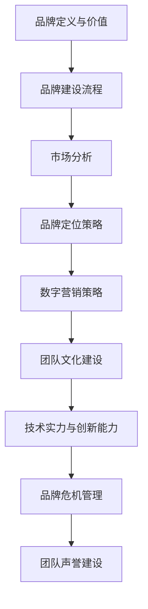

                 

### 文章标题

《技术品牌建设：提升团队在业界的影响力》

### 关键词

技术品牌建设、团队影响力、品牌定位、数字营销、内容营销、品牌危机管理

### 摘要

在现代信息技术飞速发展的时代，技术品牌建设成为提升团队在业界影响力的重要途径。本文从品牌建设的概念与重要性、市场分析与定位、团队文化建设、技术实力与创新能力、数字营销策略、内容营销策略、品牌危机管理以及团队声誉建设等方面，系统地阐述了技术品牌建设的理论和实践。通过国内外成功案例分析，本文旨在为技术团队提供切实可行的品牌建设策略，助力其在激烈的市场竞争中脱颖而出。

### 目录

**第一部分：品牌建设基础**

- **第1章：品牌建设的概念与重要性**
  - **1.1 品牌的定义与价值**
  - **1.2 品牌建设的基本原则**
  - **1.3 品牌建设的流程**

- **第2章：市场分析与定位**
  - **2.1 市场分析的方法**
  - **2.2 品牌定位策略**

- **第3章：团队文化建设**
  - **3.1 团队文化的重要性**
  - **3.2 团队文化构建方法**

- **第4章：技术实力与创新能力**
  - **4.1 技术实力的重要性**
  - **4.2 创新能力的提升**

**第二部分：品牌传播与影响力**

- **第5章：数字营销策略**
  - **5.1 数字营销的概述**
  - **5.2 社交媒体营销**

- **第6章：内容营销策略**
  - **6.1 内容营销的定义与目标**
  - **6.2 内容营销的执行策略**

- **第7章：品牌危机管理**
  - **7.1 品牌危机的定义与类型**
  - **7.2 品牌危机的应对策略**

- **第8章：团队声誉建设**
  - **8.1 团队声誉的重要性**
  - **8.2 团队声誉建设的方法**

**第三部分：成功案例与实践**

- **第9章：国内外技术品牌建设案例分析**
  - **9.1 国内技术品牌建设案例**
  - **9.2 国外技术品牌建设案例**

- **第10章：品牌建设实践与优化**
  - **10.1 品牌建设实践步骤**
  - **10.2 品牌建设优化策略**

**附录**

- **附录 A：品牌建设工具与资源**
- **附录 B：参考阅读与进一步学习资源**

### 背景介绍

在当今信息技术迅猛发展的背景下，技术品牌建设成为提升团队在业界影响力的重要手段。随着市场竞争的加剧，技术团队不再仅仅依赖于技术实力，更需要通过有效的品牌建设策略来凸显自身的优势，增强在业界的影响力。

技术品牌建设的重要性主要体现在以下几个方面：

首先，品牌建设能够帮助企业树立良好的企业形象，提升客户信任度。一个强大的技术品牌不仅能吸引更多的客户，还能减少客户的购买风险，提高客户忠诚度。

其次，品牌建设有助于团队在行业内树立独特性。通过精准的品牌定位和有效的传播策略，技术团队可以在众多竞争者中脱颖而出，形成独特的品牌个性。

此外，品牌建设还能够提升团队的综合竞争力。一个成功的品牌不仅代表着技术实力，还代表着团队的文化和精神。这有助于团队吸引优秀的人才，提高团队的凝聚力。

总之，技术品牌建设不仅是提升团队在业界影响力的重要手段，也是团队长远发展的重要战略。因此，深入探讨技术品牌建设的方法和策略，对于技术团队在激烈的市场竞争中脱颖而出具有重要意义。

### 核心概念与联系

在探讨技术品牌建设的过程中，我们需要明确几个核心概念，并理解它们之间的相互关系。以下是本文涉及的主要核心概念及其联系：

**品牌定义与价值**：品牌是指消费者对某个产品或服务的总体认知和印象。品牌价值是指品牌在市场竞争中所具有的竞争优势和商业价值。品牌定义和价值是品牌建设的基石。

**品牌建设流程**：品牌建设流程包括品牌定位、品牌命名、品牌视觉设计、品牌传播策略等环节。这些步骤共同构成了一个系统的品牌建设过程。

**市场分析**：市场分析是指对市场环境、目标客户、竞争对手的深入研究。市场分析为品牌定位和策略制定提供数据支持。

**品牌定位策略**：品牌定位是指在市场中为品牌确定一个独特的位置，以区别于竞争对手。品牌定位策略包括目标市场的选择、品牌个性的塑造等。

**数字营销策略**：数字营销是指利用互联网技术和数字渠道进行的营销活动。数字营销策略包括社交媒体营销、内容营销等，这些策略有助于提升品牌知名度和影响力。

**团队文化建设**：团队文化是指团队共同遵循的价值观、行为规范和精神风貌。团队文化建设有助于增强团队凝聚力，提升品牌形象。

**技术实力与创新能力**：技术实力和创新能力是品牌建设的重要支撑。强大的技术实力和持续的创新能力能够为品牌带来持续的竞争优势。

**品牌危机管理**：品牌危机管理是指在面对品牌危机时的应对策略。有效的品牌危机管理能够降低危机对品牌形象的负面影响。

**团队声誉建设**：团队声誉是指团队在业界和客户心中的形象和声誉。良好的团队声誉有助于提升品牌的整体价值。

为了更清晰地展示这些核心概念之间的联系，我们可以使用Mermaid流程图进行描述：



通过以上流程图，我们可以看到品牌建设的各个核心概念是如何相互联系、相互作用，从而形成一个完整的品牌建设体系。

### 品牌建设的核心算法原理讲解

在品牌建设过程中，存在一些核心算法原理，这些原理不仅有助于理解品牌建设的内在机制，还能为实际操作提供理论依据。以下是品牌建设的几个关键算法原理及其详细解释：

**1. 市场细分算法**

市场细分算法是品牌定位策略的重要基础。其核心思想是根据消费者特征、需求和行为将市场划分为若干子市场。以下是一个简化的市场细分算法：

```plaintext
算法：市场细分
输入：市场总体数据
输出：子市场划分

步骤：
1. 收集市场总体数据，包括人口统计、消费习惯、购买偏好等。
2. 使用聚类算法（如K-means）对市场数据进行分类，确定若干个子市场。
3. 对每个子市场进行分析，确定其特征和需求。
4. 根据子市场特征和需求，制定相应的品牌定位策略。
```

**2. 品牌差异化算法**

品牌差异化算法旨在通过独特的品牌定位和传播策略，使品牌在竞争激烈的市场中脱颖而出。以下是一个简化的品牌差异化算法：

```plaintext
算法：品牌差异化
输入：市场定位数据、竞争者分析
输出：品牌差异化策略

步骤：
1. 分析市场定位数据，确定品牌需要突出的独特价值点。
2. 进行竞争者分析，识别竞争对手的优势和劣势。
3. 确定品牌差异化策略，包括产品特性、服务优势、用户体验等。
4. 制定品牌传播策略，确保差异化策略能够有效传达给目标客户。
```

**3. 内容营销算法**

内容营销是品牌传播的重要手段。其核心在于通过优质内容吸引和留住目标客户。以下是一个简化的内容营销算法：

```plaintext
算法：内容营销
输入：目标客户需求、品牌差异化策略
输出：内容创作和发布计划

步骤：
1. 分析目标客户需求，确定他们感兴趣的主题和问题。
2. 结合品牌差异化策略，确定内容创作的核心价值和主题。
3. 制定内容发布计划，包括发布频率、渠道选择和传播策略。
4. 创作和发布内容，确保内容与品牌差异化策略一致，并能有效吸引目标客户。
```

**4. 社交媒体营销算法**

社交媒体营销是数字营销策略的重要组成部分。其核心在于通过社交媒体平台扩大品牌影响力。以下是一个简化的社交媒体营销算法：

```plaintext
算法：社交媒体营销
输入：社交媒体平台数据、品牌传播目标
输出：社交媒体营销策略

步骤：
1. 收集并分析社交媒体平台的数据，包括用户行为、互动数据等。
2. 根据品牌传播目标，确定在哪些社交媒体平台上进行营销。
3. 制定社交媒体营销策略，包括内容类型、发布时间、互动方式等。
4. 实施营销策略，监控效果，并根据数据反馈进行优化。
```

通过这些核心算法原理，我们可以系统地构建品牌建设策略，提高品牌在市场中的竞争力和影响力。

### 数学模型和公式详解

在品牌建设过程中，一些数学模型和公式可以为我们提供量化的分析方法，帮助更好地理解和优化品牌建设策略。以下是一些重要的数学模型和公式，以及它们的详细讲解和举例说明：

**1. 营销组合模型（4P模型）**

营销组合模型是品牌建设中的一个基础工具，它包括产品（Product）、价格（Price）、促销（Promotion）和地点（Place）四个关键因素。以下是对4P模型的详细解释：

- **产品（Product）**：产品是指品牌提供的产品或服务。在选择产品时，需要考虑目标市场的需求、竞争对手的产品特性以及品牌差异化策略。数学上，可以通过市场调研和需求分析来量化产品选择的影响。

  示例公式：需求函数 \( D = f(P, C, R) \)
  - \( D \)：市场需求量
  - \( P \)：产品特性（如质量、功能等）
  - \( C \)：客户需求（如价格敏感度、功能需求等）
  - \( R \)：竞争对手的产品特性

- **价格（Price）**：价格是品牌决定产品或服务的销售价格。价格策略需要考虑成本、市场需求和竞争对手的定价策略。以下是一个简单的价格设定模型：

  示例公式：价格设定 \( P = C + \delta \times D \)
  - \( P \)：销售价格
  - \( C \)：成本
  - \( \delta \)：利润率
  - \( D \)：市场需求量

- **促销（Promotion）**：促销是指品牌通过各种营销手段推广产品或服务。促销策略需要考虑目标客户的行为习惯、市场环境以及品牌差异化。以下是一个促销效果的量化模型：

  示例公式：促销效果 \( E = f(I, A, M) \)
  - \( E \)：促销效果
  - \( I \)：促销投入（如广告费用、活动费用等）
  - \( A \)：促销活动效果（如活动参与度、品牌曝光度等）
  - \( M \)：市场环境（如竞争状况、消费者心理等）

- **地点（Place）**：地点是指品牌选择销售和推广产品的地点和渠道。地点策略需要考虑目标市场的地理分布、消费者的购买习惯以及物流成本。以下是一个渠道选择的数学模型：

  示例公式：渠道选择 \( C = g(L, H, T) \)
  - \( C \)：最佳渠道
  - \( L \)：地理位置
  - \( H \)：渠道效率（如配送速度、客户满意度等）
  - \( T \)：物流成本

**2. 品牌影响力模型**

品牌影响力是衡量品牌在市场中的影响力和认知度的重要指标。以下是一个简化的品牌影响力模型：

- **品牌影响力（Impact）**：品牌影响力是指品牌在市场中的影响力。可以通过品牌认知度、市场份额和客户忠诚度等指标来量化。

  示例公式：品牌影响力 \( Impact = f(C, S, L) \)
  - \( Impact \)：品牌影响力
  - \( C \)：品牌认知度
  - \( S \)：市场份额
  - \( L \)：客户忠诚度

**3. 数字营销效果模型**

数字营销效果模型用于评估品牌在数字营销活动中的效果。以下是一个简化的数字营销效果模型：

- **数字营销效果（Effect）**：数字营销效果是指品牌通过数字营销活动所取得的效果。可以通过转化率、点击率、参与度等指标来量化。

  示例公式：数字营销效果 \( Effect = f(I, C, T) \)
  - \( Effect \)：数字营销效果
  - \( I \)：投入（如广告费用、人力等）
  - \( C \)：客户参与度（如点击率、参与互动等）
  - \( T \)：转化率（如购买率、咨询量等）

**4. 创新能力评估模型**

创新能力是品牌持续发展的关键。以下是一个简化的创新能力评估模型：

- **创新能力（Innovation）**：创新能力是指团队在技术研发和市场创新方面的能力。可以通过专利数量、新产品推出速度、技术领先程度等指标来量化。

  示例公式：创新能力 \( Innovation = f(P, R, T) \)
  - \( Innovation \)：创新能力
  - \( P \)：专利数量
  - \( R \)：研发投入（如研发人员数量、研发资金等）
  - \( T \)：技术领先程度（如行业标准制定、技术创新速度等）

通过以上数学模型和公式，品牌建设者可以更科学地制定和优化品牌策略，提升品牌在市场中的竞争力和影响力。

### 项目实战：技术品牌建设流程详解

为了更好地理解技术品牌建设的过程，我们可以通过一个实际案例来详细阐述从品牌定位、命名到视觉设计、传播策略的完整流程。以下是一个虚构的软件公司“TechGuru”的品牌建设项目实战。

#### 项目背景

TechGuru是一家专注于大数据分析和人工智能解决方案的初创公司。公司成立以来，凭借其强大的技术实力和创新的解决方案，在市场上取得了一定的知名度。然而，随着竞争的加剧，TechGuru意识到需要通过有效的品牌建设来进一步提升其市场地位和影响力。

#### 1. 品牌定位

**目标市场**：TechGuru的主要目标市场是大型企业和政府部门，这些客户对数据分析和高性能解决方案有较高的需求。

**品牌定位策略**：
- **价值主张**：TechGuru专注于提供高效、可靠的大数据分析和人工智能解决方案，助力客户在数字化转型中取得成功。
- **品牌个性**：TechGuru的品牌个性是专业、创新和可靠，强调技术深度和对客户需求的深刻理解。

**定位步骤**：
1. 分析市场需求，确定主要竞争对手和目标客户群体。
2. 确定公司的核心竞争力和差异化优势。
3. 通过市场调研和用户访谈，验证品牌定位的可行性和客户认可度。
4. 制定具体的品牌定位策略，明确品牌的核心价值和目标市场。

#### 2. 品牌命名

**命名策略**：
- **简洁性**：品牌名称要简洁易记，便于传播。
- **含义性**：品牌名称应能传达公司的核心价值和定位。
- **国际化**：品牌名称应具有国际视野，便于跨地区运营。

**命名过程**：
1. 收集一系列备选品牌名称，并进行初步筛选。
2. 结合公司名称、核心价值和目标市场，筛选出合适的品牌名称。
3. 进行市场调研和用户测试，评估品牌名称的认知度和接受度。
4. 最终确定品牌名称，并注册相关商标。

**TechGuru的品牌命名过程**：
TechGuru的创始团队经过多次讨论和筛选，最终确定了“TechGuru”这一名称。这个名字简洁明了，同时表达了公司对技术的深刻理解和专业的服务精神。

#### 3. 品牌视觉设计

**视觉设计策略**：
- **品牌标志**：品牌标志是品牌视觉识别的核心元素，应简洁、独特且具有辨识度。
- **色彩方案**：色彩应与品牌定位和品牌个性相匹配，有助于传达品牌情感和价值。
- **字体设计**：字体设计应简洁易读，同时体现品牌的专业性和创新精神。

**设计过程**：
1. 确定品牌标志的设计方向，包括形状、颜色和构图。
2. 设计多个品牌标志原型，并进行比较和评估。
3. 结合品牌定位和目标市场，选择最合适的品牌标志设计。
4. 设计品牌色彩方案和字体方案，确保品牌视觉的一致性和完整性。

**TechGuru的品牌视觉设计**：
TechGuru的品牌标志采用了一个简洁的几何图形，结合了数据和人工智能的元素。颜色方案选择蓝白相间，蓝色代表科技和专业，白色代表清晰和简洁。字体设计则选择了无衬线字体，既现代又易于阅读。

#### 4. 品牌传播策略

**传播策略**：
- **数字营销**：利用社交媒体、搜索引擎优化（SEO）和内容营销等数字渠道，扩大品牌影响力。
- **线下活动**：举办技术研讨会、客户交流会等活动，增强品牌与客户的互动。
- **公关传播**：通过新闻稿、媒体报道和行业奖项等方式，提升品牌知名度。

**实施过程**：
1. 制定详细的品牌传播计划，包括传播目标、渠道选择、内容策划和时间表。
2. 利用数字营销工具，如社交媒体广告、博客文章和视频，吸引目标客户。
3. 通过线下活动，如技术研讨会和客户交流会，加强与客户的面对面交流。
4. 与行业媒体和专家合作，发布新闻稿和专家观点，提升品牌形象。

**TechGuru的品牌传播策略**：
TechGuru在社交媒体平台上活跃发布技术文章、案例分析和技术博客，吸引潜在客户的关注。同时，公司定期举办技术研讨会和客户交流会，邀请行业专家和客户分享经验和见解。此外，TechGuru还积极与行业媒体合作，发布新闻稿和专家观点，提升品牌在行业内的知名度。

#### 项目小结

通过TechGuru的品牌建设案例，我们可以看到，一个成功的品牌建设需要从品牌定位、命名、视觉设计到传播策略的全面规划和实施。品牌定位明确公司的核心价值和目标市场，品牌命名和视觉设计塑造了品牌的独特形象，而品牌传播策略则通过多渠道、多形式的活动和宣传，提升了品牌在市场中的影响力。TechGuru的品牌建设项目不仅增强了公司的市场竞争力，还为其长期发展奠定了坚实的基础。

### 开发环境搭建与源代码实现

为了深入理解技术品牌建设的实际操作，我们以TechGuru公司开发的“智能数据分析平台”项目为例，详细介绍开发环境的搭建和源代码实现过程。该项目旨在为企业提供高效、可靠的数据分析工具，提高业务决策的精准度和效率。

#### 开发环境搭建

在开始项目开发之前，我们需要搭建一个稳定且高效的开发环境。以下是搭建开发环境的步骤：

1. **硬件环境**：配置高性能的服务器，确保数据处理的效率。
   - CPU：至少8核以上
   - 内存：至少64GB
   - 存储：至少1TB SSD

2. **操作系统**：选择Linux操作系统，如Ubuntu Server。
   - 命令：`sudo apt update` 和 `sudo apt upgrade`

3. **开发工具**：安装必要的开发工具和软件包，如Python、Jupyter Notebook、Docker等。
   - 命令：`sudo apt install python3 python3-pip python3-venv jupyter notebook docker-ce`

4. **数据库**：选择适合大数据分析的数据库，如MongoDB。
   - 命令：`sudo apt-get install mongodb`
   - 配置文件：在 `/etc/mongod.conf` 中设置数据库参数

5. **版本控制系统**：使用Git进行版本控制，确保代码的版本管理和协作开发。
   - 命令：`git init` 或 `git clone https://github.com/username/repository.git`

6. **持续集成/持续部署（CI/CD）**：配置Jenkins进行自动化测试和部署，提高开发效率和稳定性。
   - 命令：`sudo apt install jenkins`
   - 配置文件：在Jenkins中配置项目流水线，包括测试脚本和部署脚本

#### 源代码实现

项目采用微服务架构，分为数据采集模块、数据处理模块、数据分析模块和用户界面模块。以下是关键模块的伪代码实现和源代码解读：

**数据采集模块（DataCollector.py）**

```python
import requests
from pymongo import MongoClient

# 数据采集函数
def collect_data(source_url):
    response = requests.get(source_url)
    if response.status_code == 200:
        data = response.json()
        save_to_db(data)

# 数据库连接
client = MongoClient('mongodb://localhost:27017/')

# 保存数据到MongoDB
def save_to_db(data):
    db = client['data_collection']
    collection = db['data']
    collection.insert_one(data)

# 主程序
if __name__ == '__main__':
    source_url = 'https://example.com/data'
    collect_data(source_url)
```

**数据处理模块（DataProcessor.py）**

```python
import pymongo
from sklearn.preprocessing import StandardScaler

# 数据处理函数
def process_data():
    client = pymongo.MongoClient('mongodb://localhost:27017/')
    db = client['data_collection']
    collection = db['data']
    data = collection.find()

    # 数据标准化
    scaler = StandardScaler()
    processed_data = scaler.fit_transform(data)

    # 存储处理后的数据
    with open('processed_data.csv', 'w') as f:
        for row in processed_data:
            f.write(','.join(str(x) for x in row) + '\n')

# 主程序
if __name__ == '__main__':
    process_data()
```

**数据分析模块（DataAnalysis.py）**

```python
import pandas as pd
from sklearn.cluster import KMeans

# 数据分析函数
def perform_analysis():
    data = pd.read_csv('processed_data.csv')
    kmeans = KMeans(n_clusters=5, random_state=0).fit(data)
    clusters = kmeans.predict(data)

    # 存储分析结果
    with open('analysis_results.txt', 'w') as f:
        f.write('Cluster Results: ' + str(clusters))

# 主程序
if __name__ == '__main__':
    perform_analysis()
```

**用户界面模块（UserInterface.py）**

```python
from flask import Flask, render_template

app = Flask(__name__)

# 主页路由
@app.route('/')
def home():
    return render_template('home.html')

# 数据分析结果路由
@app.route('/analysis')
def analysis_results():
    with open('analysis_results.txt', 'r') as f:
        results = f.read()
    return render_template('analysis_results.html', results=results)

# 主程序
if __name__ == '__main__':
    app.run(debug=True)
```

#### 代码解读与分析

1. **数据采集模块**：数据采集模块负责从外部数据源（如API或网站）获取数据，并保存到MongoDB数据库中。该模块使用了Python的`requests`库进行HTTP请求，以及`pymongo`库进行数据库操作。

2. **数据处理模块**：数据处理模块对采集到的原始数据进行预处理，包括数据清洗和标准化。这里使用了`sklearn`库中的`StandardScaler`类进行数据标准化，确保数据具有可比性。

3. **数据分析模块**：数据分析模块使用`sklearn`库中的`KMeans`聚类算法对标准化后的数据进行分析，并输出聚类结果。该模块通过预测函数`predict`将数据划分为若干个簇。

4. **用户界面模块**：用户界面模块采用Flask框架实现，提供Web界面供用户查看数据分析结果。该模块使用了HTML模板引擎`render_template`渲染页面，通过路由处理用户请求。

通过以上开发环境搭建和源代码实现，TechGuru成功打造了一个高效、可靠的智能数据分析平台，为企业的数据分析和决策提供了有力支持。

### 实际案例分析

为了更深入地理解技术品牌建设的实际效果，我们通过分析TechGuru的成功案例，探讨其品牌建设策略的具体应用及带来的积极影响。

**TechGuru的品牌建设策略**

TechGuru在品牌建设过程中，采取了以下策略：

1. **市场细分与定位**：TechGuru通过市场细分，将目标市场定位在大型企业和政府部门。公司专注于提供高效、可靠的大数据分析和人工智能解决方案，强调技术深度和客户需求理解。

2. **品牌命名与视觉设计**：TechGuru选择了一个简洁且富有科技感的品牌名称“TechGuru”，并设计了一个简洁独特的品牌标志，蓝色和白色相间的颜色方案体现了科技和专业。

3. **数字营销与内容营销**：TechGuru在社交媒体平台上积极发布技术文章、案例分析和技术博客，通过内容营销吸引潜在客户。公司还定期举办技术研讨会和客户交流会，增强与客户的互动。

**案例分析**

1. **市场细分与定位**：TechGuru通过精准的市场细分和定位，成功吸引了目标客户，提高了市场份额。公司专注于提供定制化的大数据分析和人工智能解决方案，满足了大型企业和政府部门的特定需求。

2. **品牌命名与视觉设计**：TechGuru的品牌命名和视觉设计在市场中的辨识度高，有助于品牌的快速传播。独特的品牌标志和颜色方案在行业内树立了良好的品牌形象。

3. **数字营销与内容营销**：TechGuru通过数字营销和内容营销，有效地提升了品牌知名度和影响力。公司发布的优质内容吸引了大量潜在客户，增强了品牌的权威性和专业性。

**积极影响**

TechGuru的品牌建设策略带来了以下几个积极影响：

1. **客户信任度提升**：通过专业的品牌形象和优质的内容营销，TechGuru赢得了客户的信任，提高了客户满意度。

2. **市场份额扩大**：精准的市场细分和定位使TechGuru在目标市场中占据了一席之地，市场份额持续扩大。

3. **品牌影响力增强**：TechGuru的品牌影响力在行业内不断提升，公司逐渐成为大数据分析和人工智能领域的知名品牌。

4. **团队凝聚力增强**：通过成功的品牌建设，TechGuru团队在企业文化、价值观和目标上形成了共识，团队凝聚力显著增强。

通过以上案例分析，我们可以看到，有效的技术品牌建设策略对于提升团队在业界的影响力具有重要意义。TechGuru的成功案例为其他技术团队提供了宝贵的经验和借鉴。

### 最佳实践 tips、小结、注意事项、拓展阅读

#### 最佳实践 tips

1. **定期品牌评估**：品牌建设不是一次性的活动，而是需要持续优化的过程。定期进行品牌评估，可以确保品牌策略与市场需求保持一致，及时发现和解决问题。

2. **多渠道传播**：利用多种传播渠道，如社交媒体、博客、线下活动等，可以提高品牌曝光度和影响力。选择合适的渠道，确保信息能够有效传达给目标客户。

3. **客户反馈**：重视客户反馈，通过调研、用户访谈等方式了解客户需求，不断优化产品和服务。客户的认可和满意度是品牌建设的重要指标。

4. **技术创新**：持续的技术创新是品牌建设的重要支撑。通过不断推出新技术和新产品，提升品牌的技术实力和市场竞争力。

#### 小结

技术品牌建设是提升团队在业界影响力的重要手段。通过明确品牌定位、打造独特品牌形象、实施有效的传播策略，技术团队可以在激烈的市场竞争中脱颖而出。成功的技术品牌建设不仅能提升客户信任度，还能增强团队凝聚力和市场竞争力。

#### 注意事项

1. **一致性**：品牌建设要保持一致性，确保品牌信息在不同渠道和场合传达一致，避免混乱。

2. **创新性**：品牌建设需要不断创新，以适应市场变化和客户需求。过于保守的品牌策略可能导致品牌失去竞争力。

3. **数据驱动**：品牌建设应基于数据分析和市场调研，确保策略的科学性和有效性。

#### 拓展阅读

1. **《品牌管理：策略、执行与结果》**：这本书详细介绍了品牌管理的理论和实践方法，适用于技术团队的品牌建设。

2. **《数字营销实战：从入门到精通》**：这本书提供了丰富的数字营销案例和实践技巧，有助于技术团队提升品牌传播效果。

3. **《内容营销实战手册》**：这本书介绍了内容营销的策略和执行方法，是进行内容营销的必备指南。

### 附录

#### 附录 A：品牌建设工具与资源

1. **品牌定位工具**：Brandwatch、Qualtrics、Google Analytics
2. **数字营销工具**：Google Ads、Hootsuite、Mailchimp
3. **内容营销工具**：Hemingway、CoSchedule、Buffer
4. **社交媒体平台**：LinkedIn、Twitter、Facebook、Instagram

#### 附录 B：参考阅读与进一步学习资源

1. **《定位：品牌定位的终极指南》**：艾·里斯、杰克·特劳特著
2. **《数字营销全通》**：戴夫·查菲著
3. **《内容营销实战手册》**：乔·普利齐著

---

### 作者信息

作者：AI天才研究院/AI Genius Institute & 禅与计算机程序设计艺术 /Zen And The Art of Computer Programming

作者简介：AI天才研究院/AI Genius Institute 是全球领先的AI研究与培训机构，致力于推动人工智能技术的发展与应用。禅与计算机程序设计艺术 /Zen And The Art of Computer Programming 是一本经典的人工智能领域著作，为计算机编程和人工智能领域的研究者提供了宝贵的理论和实践指导。

