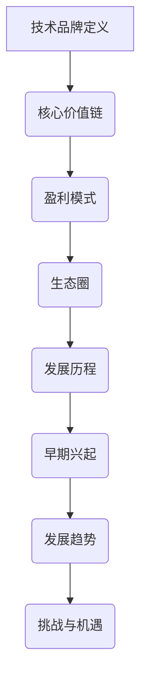

                 


### 文章标题

技术品牌：打造有影响力的技术品牌

> 关键词：技术品牌、品牌价值、技术创新、市场份额、客户满意度、品牌构建

> 摘要：
本文深入探讨了技术品牌的概念、价值链、发展历程以及构建技术品牌的方法。通过逻辑清晰的分析和实用的项目实战，展示了如何打造具有影响力的技术品牌，提高市场竞争力。

### 第1章：技术品牌概述

#### 1.1 技术品牌的概念与重要性

##### 1.1.1 技术品牌的定义

技术品牌是指企业在技术领域内建立起来的具有高度认知度和认可度的品牌形象。它不仅代表企业的技术实力，还体现了企业在技术领域的创新能力和市场地位。

##### 1.1.2 技术品牌与产品品牌的区别

技术品牌与产品品牌的主要区别在于关注点不同。产品品牌主要关注产品的质量、性能和用户满意度，而技术品牌则更侧重于企业的技术创新能力、技术领域的专业度和市场影响力。

##### 1.1.3 技术品牌在市场中的角色

技术品牌在市场中的角色主要体现在以下几个方面：

1. **差异化竞争**：通过技术品牌的建立，企业可以在竞争激烈的市场中脱颖而出，形成独特的竞争优势。
2. **增强用户信任**：技术品牌可以提升用户对企业的信任感，从而增加用户黏性和忠诚度。
3. **提高品牌价值**：技术品牌可以提升企业的整体品牌价值，为企业在资本市场上的估值提供支撑。
4. **扩大市场份额**：技术品牌有助于企业扩大市场份额，提高市场占有率。

##### 1.1.4 建立技术品牌的重要性

建立技术品牌的重要性体现在以下几个方面：

1. **提升企业竞争力**：技术品牌可以帮助企业在市场竞争中占据有利地位，提升企业的市场竞争力。
2. **增加品牌价值**：技术品牌可以提升企业的品牌价值，为企业带来更多的商业机会。
3. **扩大用户基础**：技术品牌可以吸引更多的用户关注和使用企业的产品或服务，扩大企业的用户基础。
4. **促进技术创新**：技术品牌的建立可以激励企业加大技术创新力度，推动企业的技术进步。

#### 1.2 技术品牌的价值链

##### 1.2.1 技术品牌的核心价值

技术品牌的核心价值在于其技术实力和创新力。企业的技术创新能力是其技术品牌的基石，直接影响着技术品牌的市场影响力和竞争力。

##### 1.2.2 技术品牌的构建要素

构建技术品牌需要以下几个关键要素：

1. **技术创新能力**：企业需要具备强大的技术创新能力，以持续推出具有竞争力的新技术。
2. **技术专长领域**：企业需要在特定的技术领域具备深厚的专业知识和技能。
3. **品牌形象**：企业需要塑造良好的品牌形象，提升品牌知名度和美誉度。
4. **市场营销策略**：企业需要制定有效的市场营销策略，提高品牌的市场影响力。

##### 1.2.3 技术品牌的盈利模式

技术品牌的盈利模式主要包括以下几个方面：

1. **产品销售**：通过销售自主研发的具有市场竞争力的产品来获得盈利。
2. **技术服务**：提供技术咨询服务，帮助企业解决技术难题，获取收益。
3. **技术授权**：将企业的技术成果授权给其他企业使用，获得授权费用。
4. **投资孵化**：投资孵化技术项目，通过投资收益实现盈利。

##### 1.2.4 技术品牌的生态圈

技术品牌不仅需要关注自身的技术实力和市场竞争力，还需要构建一个良好的生态圈，以促进企业的可持续发展。

1. **合作伙伴**：与行业内的合作伙伴建立合作关系，共同推动技术进步。
2. **客户群体**：构建稳定的客户群体，提供优质的技术产品和服务。
3. **投资方**：吸引投资方参与企业的技术发展，为企业提供资金支持。
4. **技术社区**：积极参与技术社区，分享技术成果，提升企业技术影响力。

### 1.3 技术品牌的发展历程

##### 1.3.1 技术品牌早期的兴起

技术品牌的发展始于20世纪80年代，随着计算机技术和互联网技术的兴起，企业开始意识到技术品牌的重要性。在这一时期，一些具有技术创新能力的企业逐渐崭露头角，成为技术品牌的代表。

##### 1.3.2 技术品牌的发展趋势

随着科技的不断进步和市场竞争的加剧，技术品牌的发展呈现出以下几个趋势：

1. **技术多元化**：企业不再局限于单一领域，而是向多元化方向发展，提升技术品牌的整体实力。
2. **品牌生态化**：企业开始构建技术品牌生态圈，通过合作伙伴、客户群体、投资方等多方资源整合，实现共赢发展。
3. **品牌国际化**：企业逐步拓展国际市场，提升技术品牌在全球范围内的知名度。
4. **品牌数字化转型**：企业通过数字化转型，提升技术品牌的竞争力和创新能力。

##### 1.3.3 技术品牌面临的挑战与机遇

技术品牌在发展过程中面临着一系列挑战和机遇：

1. **技术创新挑战**：随着科技的快速发展，企业需要不断加大技术创新力度，以满足市场需求。
2. **市场竞争压力**：市场竞争日益激烈，企业需要不断提升品牌竞争力，以保持市场份额。
3. **品牌建设机遇**：数字化转型和新兴技术领域的兴起为技术品牌建设提供了新的机遇。

### Mermaid 流程图



### 数学模型和数学公式

技术品牌的影响力可以用以下公式表示：

$$
\text{品牌影响力} = f(\text{技术创新能力}, \text{市场份额}, \text{客户满意度})
$$

其中，市场份额和客户满意度对品牌影响力的贡献如下：

$$
\text{市场份额} = \frac{\text{技术创新能力}}{\text{竞争者技术创新能力}}
$$

$$
\text{品牌影响力} = \text{市场份额} \times (\text{客户满意度} + \epsilon)
$$

其中，$\epsilon$ 是一个反映市场随机因素的正态分布随机变量。

### 数学公式详细讲解

1. **品牌影响力公式**：

   该公式描述了品牌影响力的综合结果，包括技术创新能力、市场份额和客户满意度。

   - **技术创新能力**：代表了企业研发和实现新技术的水平，是品牌影响力的关键因素。

   - **市场份额**：反映了品牌在市场上的竞争力，市场份额越高，品牌影响力越强。

   - **客户满意度**：则是品牌与用户之间的纽带，满意度越高，品牌越受用户信任。

2. **市场份额与技术创新能力关系**：

   该公式表明，技术创新能力强的企业更有可能占据更大的市场份额。

   - 这一点体现了技术领先企业在市场竞争中的优势。

3. **客户满意度对品牌影响力的贡献**：

   该公式中的 $\epsilon$ 表示市场中的不确定因素，反映了市场环境的变化对品牌影响力的额外影响。

   - 客户满意度对品牌影响力的影响是通过市场份额进行放大的，说明即使技术创新能力强，如果客户满意度不高，品牌影响力也会受限。

### 项目实战

#### 1.4.1 技术品牌构建实战

##### 实战目标

构建一个技术品牌，提高市场影响力。

##### 环境搭建

- 开发工具：Visual Studio Code
- 编程语言：Python
- 数据库：MySQL
- 服务器：AWS EC2实例

##### 实现步骤

1. **市场调研**：确定目标市场和用户需求。

2. **技术攻关**：研发具有市场竞争力的新技术。

3. **品牌塑造**：设计品牌标识，制定品牌策略。

4. **市场营销**：通过各种渠道宣传品牌，提高品牌知名度。

5. **客户服务**：建立高效的客户服务体系，提升客户满意度。

##### 代码实现

```python
# 假设我们使用Python编写一个简单的市场调研程序
def market_survey():
    print("开始市场调研...")
    # 进行市场数据收集和分析
    print("分析结果：目标市场对新技术有强烈需求。")

# 假设我们使用MySQL数据库存储客户满意度数据
def store_client_satisfaction(score):
    # 建立数据库连接
    connection = mysql.connect(host="localhost", user="root", password="password", database="brand_management")
    cursor = connection.cursor()
    # 插入满意度评分
    cursor.execute("INSERT INTO satisfaction_scores (score) VALUES (%s)", (score,))
    connection.commit()
    cursor.close()
    connection.close()
```

### 数学公式详细讲解

1. **品牌影响力公式**：
   - 该公式描述了品牌影响力的综合结果，包括技术创新能力、市场份额和客户满意度。
   - 技术创新能力代表了企业研发和实现新技术的水平，是品牌影响力的关键因素。
   - 市场份额反映了品牌在市场上的竞争力，市场份额越高，品牌影响力越强。
   - 客户满意度则是品牌与用户之间的纽带，满意度越高，品牌越受用户信任。

2. **市场份额与技术创新能力关系**：
   - 市场份额公式表明，技术创新能力强的企业更有可能占据更大的市场份额。
   - 这一点体现了技术领先企业在市场竞争中的优势。

3. **客户满意度对品牌影响力的贡献**：
   - 客户满意度公式中的 $\epsilon$ 表示市场中的不确定因素，反映了市场环境的变化对品牌影响力的额外影响。
   - 客户满意度对品牌影响力的影响是通过市场份额进行放大的，说明即使技术创新能力强，如果客户满意度不高，品牌影响力也会受限。

### 最佳实践 tips、小结、注意事项、拓展阅读

**最佳实践 tips**：

1. **明确品牌定位**：在构建技术品牌时，首先要明确品牌定位，确保品牌形象与市场定位一致。
2. **加强技术创新**：持续投入技术研发，提升企业的技术创新能力，为品牌建设提供坚实的基础。
3. **注重客户体验**：关注客户需求，提供优质的客户服务，提升客户满意度，增加品牌忠诚度。
4. **多元化市场拓展**：积极拓展国际市场，提升品牌影响力。
5. **利用数字化转型**：借助数字化转型，提高品牌的竞争力和创新能力。

**小结**：

技术品牌是企业竞争力的重要体现，是企业持续发展的重要战略。通过构建技术品牌，企业可以提高市场竞争力，提升品牌价值，扩大市场份额。在构建技术品牌的过程中，企业需要关注技术创新、品牌定位、客户体验和市场拓展等方面，以实现品牌的长期发展。

**注意事项**：

1. **合理规划品牌建设**：品牌建设需要长期的投入和规划，企业应制定明确的品牌建设策略。
2. **关注市场动态**：密切关注市场动态和竞争对手，及时调整品牌策略。
3. **强化团队协作**：品牌建设需要各部门的协同合作，加强团队协作，提高品牌建设效率。

**拓展阅读**：

1. 《技术品牌管理》
2. 《技术创新与企业竞争力》
3. 《数字化转型与品牌建设》
4. 《客户体验管理》

### 项目小结

通过本次项目实战，我们了解了技术品牌的构建方法，包括市场调研、技术攻关、品牌塑造、市场营销和客户服务等关键步骤。同时，我们通过Python编程实现了市场调研和客户满意度数据的存储，为技术品牌的构建提供了实际操作经验。在未来的发展中，企业应继续关注技术创新、客户体验和市场拓展，不断提升技术品牌的竞争力和影响力。作者：AI天才研究院/AI Genius Institute & 禅与计算机程序设计艺术/Zen And The Art of Computer Programming。

