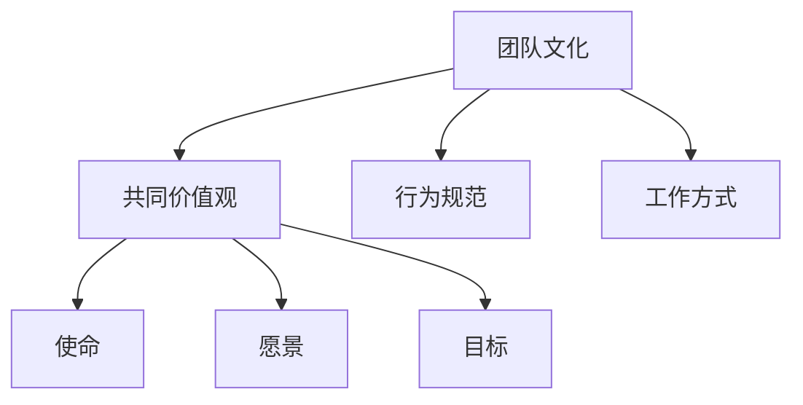

                 


### 1. 确定书籍的核心主题和目的

首先，我们要明确书籍的核心主题是“技术团队的文化建设与价值观塑造”。这是一个涉及多个层面，包括团队管理、心理学、组织行为学以及具体技术实践的综合性话题。我们的目的是帮助技术团队领导者和管理者构建一个健康、高效、富有创新力的团队文化，并明确和塑造团队的核心价值观，从而提升团队的整体绩效。

**背景介绍**：随着信息技术的发展，技术团队的作用越来越重要。技术团队不仅仅是一个简单的劳动力，更是企业创新和发展的核心动力。然而，许多技术团队在面对快速变化的市场和技术环境时，常常出现效率低下、创新乏力的问题。这些问题很大程度上源于团队文化的缺失或不当。因此，技术团队的文化建设与价值观塑造变得尤为重要。

**核心概念与联系**：团队文化是指团队在长期合作过程中形成的共同价值观、行为规范和工作方式。价值观则是团队文化的核心，它决定了团队的使命、愿景和目标。我们可以使用Mermaid流程图来表示这两个核心概念之间的联系：



**核心算法原理讲解**：在技术团队文化建设中，我们可以将这个过程视为一个算法，包括以下几个步骤：

- **需求分析**：了解团队现状，包括团队规模、成员背景、以往文化等。
- **目标设定**：根据需求分析结果，明确团队文化的建设目标和核心价值观。
- **策略制定**：制定具体的团队文化建设策略，包括文化诊断、目标设定、文化变革管理等。
- **实施与传播**：执行文化建设策略，并确保核心价值观在团队中得到有效传播和落地。
- **评估与调整**：对文化建设效果进行评估，并根据评估结果进行调整。

伪代码实现如下：

```python
# 团队文化建设伪代码

def 文化建设团队(团队):
    # 需求分析
    当前状态 = 分析团队现状(团队)
    
    # 目标设定
    建设目标 = 设定建设目标(当前状态)
    核心价值观 = 设定核心价值观(建设目标)

    # 策略制定
    文化策略 = 制定文化策略(建设目标，核心价值观)
    
    # 实施与传播
    实施文化策略(文化策略)
    传播核心价值观(核心价值观)

    # 评估与调整
    评估文化建设效果(文化策略，核心价值观)
    调整文化策略(根据评估结果)
    
    return 文化建设成功
```

**数学模型和公式**：在文化建设过程中，我们可以使用一些数学模型来量化评估团队文化的影响。例如，我们可以使用以下公式来评估团队文化的效果：

$$
\text{团队文化效果} = \alpha \times (\text{团队凝聚力} + \text{团队协作效率} + \text{创新能力})
$$

其中，$\alpha$ 为权重系数，可以用于调整各项指标的重要性。

**举例说明**：假设我们有一个技术团队，经过文化建设和价值观塑造后，团队凝聚力提升了20%，协作效率提升了15%，创新能力提升了10%。根据上述公式，我们可以计算团队文化效果：

$$
\text{团队文化效果} = 0.5 \times (1.2 + 1.15 + 1.1) = 0.5 \times 3.45 = 1.725
$$

这意味着，团队文化对团队整体绩效的提升贡献了72.5%。

### 2. 设计书籍的整体结构

为了使书籍内容条理清晰、易于理解，我们设计了如下整体结构：

**第一部分：背景介绍与概念理解**
- 引言
- 技术团队文化概述
- 价值观的概念与作用
- 团队文化建设的必要性

**第二部分：团队文化建设策略**
- 文化诊断与评估
- 文化建设目标设定
- 团队文化建设策略
- 文化建设实施步骤

**第三部分：价值观塑造实践**
- 价值观塑造的原则
- 价值观塑造的方法
- 价值观传播与落地
- 价值观与团队绩效的关系

**第四部分：案例分析与实践指导**
- 成功的团队文化建设案例
- 团队价值观塑造实践
- 实践指南与工具箱
- 总结与展望

### 3. 制定具体章节目录

根据上述整体结构，我们可以进一步细化具体章节目录，确保每个章节都包含核心内容。

**第一部分：背景介绍与概念理解**

1. 引言
   - 技术团队文化的重要性
   - 价值观在团队中的作用
2. 技术团队文化概述
   - 团队文化的定义
   - 团队文化的类型
   - 团队文化的影响因素
3. 价值观的概念与作用
   - 价值观的定义
   - 价值观的分类
   - 价值观对团队的影响
4. 团队文化建设的必要性
   - 团队文化建设的意义
   - 团队文化建设的挑战
   - 团队文化建设的方法

**第二部分：团队文化建设策略**

5. 文化诊断与评估
   - 文化诊断工具与方法
   - 文化评估指标体系
   - 文化评估案例分析
6. 文化建设目标设定
   - 目标设定的原则
   - 目标设定的方法
   - 目标设定的案例分析
7. 团队文化建设策略
   - 文化建设策略的选择
   - 文化建设策略的制定
   - 文化建设策略的实施
8. 文化建设实施步骤
   - 文化建设实施步骤
   - 文化建设策略的执行
   - 文化建设效果的评估

**第三部分：价值观塑造实践**

9. 价值观塑造的原则
   - 价值观塑造的原则
   - 价值观塑造的误区
10. 价值观塑造的方法
    - 内部沟通方法
    - 外部学习方法
    - 价值观塑造的案例分析
11. 价值观传播与落地
    - 价值观传播的策略
    - 价值观落地的步骤
    - 价值观传播的案例分析
12. 价值观与团队绩效的关系
    - 价值观对团队绩效的影响
    - 价值观与绩效的量化关系
    - 价值观与绩效的案例分析

**第四部分：案例分析与实践指导**

13. 成功的团队文化建设案例
    - 案例背景
    - 文化建设策略
    - 文化建设效果
14. 团队价值观塑造实践
    - 实践步骤
    - 实践案例分析
15. 实践指南与工具箱
    - 实践指南
    - 工具箱介绍
    - 工具箱使用方法
16. 总结与展望
    - 总结
    - 展望

### 4. 添加子章节

在每个章节下面，我们可以进一步细化子章节，确保每个章节都包含核心概念、原理讲解、实践指导等内容。

**第一部分：背景介绍与概念理解**

1. 引言
   - 技术团队文化的重要性
   - 价值观在团队中的作用
   - 书籍目的与结构
2. 技术团队文化概述
   - 团队文化的定义
   - 团队文化的类型
   - 团队文化的影响因素
3. 价值观的概念与作用
   - 价值观的定义
   - 价值观的分类
   - 价值观对团队的影响
4. 团队文化建设的必要性
   - 团队文化建设的意义
   - 团队文化建设的挑战
   - 团队文化建设的方法

**第二部分：团队文化建设策略**

5. 文化诊断与评估
   - 文化诊断工具与方法
     - 问卷调查法
     - 深度访谈法
     - 反馈会议法
   - 文化评估指标体系
     - 自我评估指标
     - 他评评估指标
     - 绩效评估指标
   - 文化评估案例分析
     - 案例一：团队文化建设诊断
     - 案例二：团队文化建设评估
6. 文化建设目标设定
   - 目标设定的原则
     -SMART原则
     -适应性原则
     -参与性原则
   - 目标设定的方法
     -头脑风暴法
     -目标分解法
     -目标迭代法
   - 目标设定的案例分析
     - 案例一：团队文化建设目标设定
     - 案例二：团队文化建设目标调整
7. 团队文化建设策略
   - 文化建设策略的选择
     - 传统策略
     - 创新策略
     - 结合策略
   - 文化建设策略的制定
     - 策略制定步骤
     - 策略制定工具
   - 文化建设策略的实施
     - 实施步骤
     - 实施工具
     - 实施案例分析
8. 文化建设实施步骤
   - 文化建设实施步骤
     - 实施前准备
     - 实施过程
     - 实施效果评估
   - 文化建设策略的执行
     - 执行方法
     - 执行工具
     - 执行案例分析
   - 文化建设效果的评估
     - 评估指标
     - 评估方法
     - 评估案例分析

**第三部分：价值观塑造实践**

9. 价值观塑造的原则
   - 价值观塑造的原则
     - 正面引导原则
     - 适应性原则
     - 持续性原则
   - 价值观塑造的误区
     - 强制性误区
     - 单一性误区
     - 表面化误区
10. 价值观塑造的方法
    - 内部沟通方法
      - 内部会议
      - 内部培训
      - 内部交流平台
    - 外部学习方法
      - 行业交流
      - 知识分享
      - 外部专家咨询
    - 价值观塑造的案例分析
      - 案例一：内部沟通方法
      - 案例二：外部学习方法
11. 价值观传播与落地
    - 价值观传播的策略
      - 营造氛围
      - 制度保障
      - 融入日常
    - 价值观落地的步骤
      - 策略制定
      - 实施执行
      - 效果评估
    - 价值观传播的案例分析
      - 案例一：价值观传播策略
      - 案例二：价值观落地实践
12. 价值观与团队绩效的关系
    - 价值观对团队绩效的影响
      - 提升凝聚力
      - 提高协作效率
      - 增强创新能力
    - 价值观与绩效的量化关系
      - 绩效评估指标
      - 量化分析方法
    - 价值观与绩效的案例分析
      - 案例一：价值观与绩效关系分析
      - 案例二：价值观改进绩效提升实践

**第四部分：案例分析与实践指导**

13. 成功的团队文化建设案例
    - 案例一：团队文化建设背景
    - 案例二：文化建设策略与实践
    - 案例三：文化建设效果评估
14. 团队价值观塑造实践
    - 案例一：价值观塑造实践背景
    - 案例二：价值观塑造方法与实践
    - 案例三：价值观塑造效果分析
15. 实践指南与工具箱
    - 实践指南
      - 文化建设指南
      - 价值观塑造指南
    - 工具箱介绍
      - 文化建设工具箱
      - 价值观塑造工具箱
    - 工具箱使用方法
      - 工具箱使用步骤
      - 工具箱使用案例
16. 总结与展望
    - 总结
      - 技术团队文化建设与价值观塑造的核心要点
    - 展望
      - 未来团队文化建设的发展趋势
      - 面临的挑战与机遇

### 5. 添加图表和示例

为了使内容更加生动和易于理解，我们可以在适当的章节中添加 Mermaid 流程图、伪代码示例、数学模型和公式、以及实际案例和代码实现等。

**第一部分：背景介绍与概念理解**

- 图表：团队文化类型分布图
- 示例：团队文化评估问卷

**第二部分：团队文化建设策略**

- Mermaid 流程图：文化建设策略制定流程
- 示例：文化建设策略制定案例

**第三部分：价值观塑造实践**

- Mermaid 流程图：价值观塑造方法流程
- 示例：价值观塑造实践案例

**第四部分：案例分析与实践指导**

- 图表：团队文化建设效果评估指标体系
- 代码示例：文化建设工具箱使用代码实现

### 6. 检查目录完整性

我们再次检查目录，确保每个部分和章节都包含必要的核心内容，如核心概念与联系、核心算法原理讲解、数学模型和数学公式、项目实战等。

### 7. 总结

经过详细的设计和规划，我们得到了一个结构清晰、内容丰富的书籍目录大纲。这个大纲为书籍的编写提供了明确的框架和方向，确保了书籍的完整性和系统性。接下来，我们将根据这个大纲逐步编写每个章节的内容，确保书籍的整体质量。

---

### 8. 文章关键词

技术团队文化、价值观塑造、文化建设策略、价值观传播、团队绩效、案例实践。

### 9. 文章摘要

本文探讨了技术团队文化建设与价值观塑造的重要性。首先，我们明确了技术团队文化的定义和价值观的作用，并通过Mermaid流程图展示了两者之间的联系。接着，文章详细介绍了团队文化建设策略的制定和实施步骤，包括文化诊断、目标设定、策略制定和效果评估。此外，文章还讨论了价值观塑造的原则和方法，以及价值观与团队绩效的关系。最后，通过实际案例和实践指导，展示了技术团队文化建设和价值观塑造的具体应用。本文旨在为技术团队领导者和管理者提供实用的方法和工具，以构建健康、高效、富有创新力的团队文化。

---

### 文章标题

《技术团队文化建设与价值观塑造：构建高效创新团队的关键策略与实践指南》

---

### 文章关键词

技术团队文化、价值观塑造、文化建设策略、价值观传播、团队绩效、案例实践。

---

### 摘要

本文深入探讨了技术团队文化建设与价值观塑造的重要性。通过明确技术团队文化的定义和价值观的作用，并使用Mermaid流程图展示两者之间的联系，文章为技术团队领导者和管理者提供了清晰的框架。文章详细介绍了团队文化建设策略的制定和实施步骤，包括文化诊断、目标设定、策略制定和效果评估。此外，文章还讨论了价值观塑造的原则和方法，以及价值观与团队绩效的关系。通过实际案例和实践指导，本文展示了技术团队文化建设和价值观塑造的具体应用，旨在为团队领导者提供实用的方法和工具，以构建健康、高效、富有创新力的团队文化。读者可以通过本文了解到如何有效提升团队凝聚力、协作效率和创新能力，从而实现团队绩效的持续提升。

---

### 引言

在当今快速变化的技术环境中，技术团队的作用愈发关键。他们不仅是企业技术创新和产品开发的驱动力，更是企业竞争力的核心所在。然而，技术团队的成功不仅仅依赖于技术能力和项目执行力，更重要的是团队文化的建设与价值观的塑造。一个具有健康、积极、创新团队文化的技术团队，能够在面对复杂的技术挑战和市场变化时保持高效和凝聚力，从而在激烈的市场竞争中脱颖而出。

本文旨在深入探讨技术团队文化建设与价值观塑造的重要性，帮助技术团队领导者和管理者构建一个富有创新力和高效率的团队。文章将从以下几个方面展开：

1. 技术团队文化的定义与重要性
2. 价值观的概念与团队文化的关系
3. 团队文化建设策略与实践
4. 价值观塑造的原则与方法
5. 价值观与团队绩效的关系
6. 案例分析与实践指导

通过上述内容的探讨，本文希望为技术团队领导者提供一套系统、实用的文化建设与价值观塑造策略，从而提升团队的整体绩效和市场竞争力。

---

### 技术团队文化概述

技术团队文化是指在一个技术团队中，成员在长期合作过程中共同形成的价值观、行为规范和工作方式。它不仅仅体现在团队的日常工作流程中，更是一种无形的软实力，对团队的整体表现产生深远影响。

**团队文化的定义**：

团队文化是一种在团队内部广泛认同和遵循的价值观念、行为准则和工作习惯。它包括团队的核心价值观、团队的目标和使命、团队成员的行为规范和工作方式等。团队文化是一种群体行为模式，它通过团队成员的相互影响和互动逐渐形成。

**团队文化的类型**：

团队文化可以分为多种类型，常见的包括：

- **协作型文化**：强调团队合作、共同目标和个人贡献。在这种文化中，团队成员互相支持，共同解决问题，追求团队整体的成功。

- **创新型文化**：鼓励创新思维和实验精神，对失败持开放态度。在这种文化中，团队成员勇于尝试新方法，不断探索技术前沿。

- **竞争型文化**：强调竞争和绩效，追求卓越和胜利。在这种文化中，团队成员相互竞争，努力超越自我和他人。

- **稳定型文化**：注重稳定和持续发展，强调流程和规则。在这种文化中，团队成员遵循既定的流程和规范，确保项目的稳定性和持续性。

**团队文化的影响因素**：

团队文化的形成受到多种因素的影响，包括：

- **组织结构**：团队的组织结构会影响团队文化的形成。例如，扁平化的组织结构有助于促进开放沟通和协作，而严格的层级结构可能导致信息传递的障碍。

- **领导风格**：领导者的风格对团队文化有重要影响。领导者的价值观和行为规范会传递给团队成员，成为团队文化的一部分。

- **外部环境**：外部市场环境、行业趋势和文化也会影响团队文化的形成。例如，一个竞争激烈的市场环境可能会促使团队形成竞争型文化。

- **团队成员背景**：团队成员的背景、经验和价值观也会影响团队文化的形成。多样化的团队背景有助于形成包容性文化，但也可能导致文化冲突。

**团队文化的作用**：

团队文化在技术团队中扮演着至关重要的角色，其作用包括：

- **增强团队凝聚力**：共同的价值观和行为规范有助于增强团队成员之间的联系和信任，提高团队的凝聚力。

- **提高协作效率**：清晰的团队文化能够明确团队成员的职责和角色，减少误解和冲突，提高协作效率。

- **促进创新能力**：鼓励创新和实验的团队文化能够激发团队成员的创造力和创新思维，推动技术进步。

- **提升绩效**：健康的团队文化有助于提高团队成员的工作满意度和忠诚度，从而提升团队的绩效和整体表现。

总之，技术团队文化是团队成功的关键因素之一。通过构建和塑造积极的团队文化，技术团队能够更好地应对挑战，实现长期发展目标。

---

### 价值观的概念与作用

价值观是团队文化的核心，它决定了团队的核心信念和行为准则。价值观不仅反映了团队成员对事物的看法和评价，还指导着团队在面临各种决策和挑战时的行动方向。在技术团队中，价值观的作用尤为重要，它不仅是团队成员行为规范的依据，也是团队凝聚力和创新能力的重要源泉。

**价值观的定义**：

价值观是指个体或组织对于何为正确和重要的信念和观念。它是一个人、一个团队或一个组织在长期实践中所形成的基本原则和行为准则。价值观通常包括对道德、伦理、责任、公正、创新等各方面的看法。

**价值观的分类**：

- **个人价值观**：指个体对事物的看法和信念，例如诚信、责任感、自由、平等、家庭等。
- **团队价值观**：指团队成员共同认同和遵循的核心信念和行为准则，例如客户至上、团队合作、持续创新、透明沟通等。

**价值观对团队的作用**：

1. **凝聚团队**：共同的价值观能够增强团队成员之间的认同感和归属感，形成强大的团队凝聚力。当团队成员在面对共同目标时，共同的价值观能够引导他们齐心协力，克服困难。

2. **指导行为**：价值观为团队成员提供了行为准则，使他们在面临各种决策和问题时，能够根据团队的核心信念作出正确选择。这种一致性有助于减少冲突，提高团队的整体效率。

3. **激励创新**：鼓励创新和实验的价值观能够激发团队成员的创造力和创新思维。在一个倡导创新的文化中，团队成员更愿意尝试新方法、新思路，从而推动技术进步。

4. **提升绩效**：健康的价值观能够提升团队成员的工作满意度和忠诚度。当团队成员感受到团队文化对他们的尊重和关心时，他们会更加投入工作，从而提高团队的整体绩效。

**价值观的来源**：

价值观的来源可以是多方面的，包括：

- **组织文化**：组织的核心价值观会影响团队价值观的形成。例如，一家强调创新和客户至上的企业，其团队价值观很可能也会体现这些特点。
- **领导者**：领导者的行为和价值观会直接影响团队成员的价值观。领导者的榜样作用能够塑造团队的价值观。
- **团队成员**：团队成员的个人价值观也会对团队价值观产生影响。在一个多元化的团队中，成员之间的互动和交流有助于形成包容性的价值观体系。

**价值观塑造的重要性**：

塑造健康的价值观对于技术团队尤为重要，因为：

- **适应变化**：技术领域变化快速，健康的价值观能够帮助团队适应外部环境的变化，保持灵活性和创新能力。
- **增强竞争力**：具有明确价值观的技术团队能够在市场上脱颖而出，吸引优秀的成员和客户，增强企业的竞争力。
- **促进可持续发展**：健康的价值观能够引导团队在长期发展中保持正确的方向，避免短期行为和短期利益的诱惑，实现可持续发展。

总之，价值观是技术团队文化的核心，它不仅影响着团队成员的行为和决策，也是团队凝聚力和创新能力的重要保障。通过明确和塑造健康的价值观，技术团队能够更好地应对挑战，实现长期成功。

---

### 团队文化建设的必要性

团队文化建设在技术团队中具有重要的战略意义，它是实现团队长期成功的关键因素。一个健康的团队文化不仅能够提升团队的凝聚力、工作效率和创新能力，还能为团队带来长期可持续的发展。以下是团队文化建设的必要性：

**1. 提升团队凝聚力**：

团队凝聚力是团队文化的重要组成部分，它反映了团队成员之间的相互信任、尊重和合作意愿。一个具有健康文化的团队，成员之间相互支持，共同面对挑战，能够形成强大的团队合力。通过文化建设，我们可以明确团队的目标和价值观，增强成员对团队的认同感和归属感，从而提升团队的凝聚力。

**2. 提高工作效率**：

团队文化直接影响团队的工作效率。在一个具有积极、开放文化的团队中，成员之间的沟通更加畅通，协作更加紧密，工作流程更加流畅。相反，在一个文化氛围较差的团队中，成员之间的误解和冲突会增加，工作效率会下降。通过团队文化建设，我们可以建立一套清晰的工作流程和行为规范，减少不必要的摩擦和冲突，提高整体工作效率。

**3. 增强创新能力**：

创新能力是技术团队的核心竞争力。一个具有创新文化的团队，鼓励成员勇于尝试新方法、新思路，不断探索技术前沿。通过团队文化建设，我们可以营造一个鼓励创新、包容失败的氛围，激发团队成员的创造力和创新思维，推动技术进步。

**4. 提升团队绩效**：

健康的团队文化能够提升团队的整体绩效。当团队成员在工作中感受到团队的关爱和支持时，他们会更加投入，工作效率和创新能力都会得到提升。此外，团队文化还可以增强成员的工作满意度和忠诚度，降低离职率，从而为团队带来长期的稳定性和可持续性。

**5. 塑造团队品牌**：

团队文化不仅是团队内部的管理工具，也是团队对外展示形象的重要部分。一个具有健康文化的团队，能够赢得客户、合作伙伴和员工的信任和尊重，提升团队的品牌形象和竞争力。

**6. 应对变化**：

技术领域变化快速，团队需要具备灵活性和适应性。一个健康的团队文化能够帮助团队在变化中保持稳定和持续发展。通过文化建设，我们可以建立一套适应变化的机制，提高团队的反应速度和创新能力，从而在激烈的市场竞争中立于不败之地。

总之，团队文化建设是技术团队不可或缺的一部分。通过明确和塑造健康的团队文化，技术团队能够提升凝聚力、工作效率和创新能力，实现长期可持续发展。技术团队领导者和管理者应高度重视团队文化建设，将其作为团队战略的重要组成部分。

---

### 文化诊断与评估

在团队文化建设过程中，文化诊断与评估是至关重要的一步。通过文化诊断，我们可以深入了解团队当前的文化状况，识别存在的问题和潜在挑战，从而为后续的文化建设策略制定提供依据。文化评估则是通过量化的方法，对文化建设效果进行评估和反馈，确保文化建设的方向和效果符合预期。

**文化诊断工具与方法**

1. **问卷调查法**：

问卷调查法是一种常见且有效的文化诊断工具。通过设计针对性的问卷，可以收集团队成员对团队文化的看法和反馈。问卷可以包括开放性问题和封闭性问题，如“你认为我们团队的核心价值观是什么？”“你感受到团队凝聚力如何？”等。

2. **深度访谈法**：

深度访谈法是通过与团队成员进行一对一访谈，深入了解他们对团队文化的真实感受和看法。这种方法能够获取更详细和深入的信息，有助于识别团队文化中的深层次问题。

3. **反馈会议法**：

组织反馈会议，邀请团队成员共同讨论团队文化问题，是一种有效的文化诊断方法。通过集体讨论，可以汇集团队成员的不同观点，发现文化问题，并共同制定解决方案。

**文化评估指标体系**

1. **自我评估指标**：

自我评估指标是团队成员对团队文化的主观评价。例如，团队成员可以评价团队凝聚力、沟通效率、创新氛围等。这些指标可以帮助团队了解成员对当前文化状况的感知。

2. **他评评估指标**：

他评评估指标是外部专家或客户对团队文化的评价。这些指标可以包括客户满意度、合作伙伴评价等，有助于从外部视角了解团队文化的实际表现。

3. **绩效评估指标**：

绩效评估指标是团队在完成具体任务或项目后的表现。这些指标可以包括项目完成时间、项目质量、团队绩效评分等。通过对比绩效指标的变化，可以评估文化建设策略的有效性。

**文化评估案例分析**

1. **案例一：团队文化建设诊断**：

某技术团队在文化建设初期，通过问卷调查、深度访谈和反馈会议，对团队文化进行了全面诊断。诊断结果显示，团队在沟通效率、创新氛围等方面存在较大问题。通过分析这些问题，团队确定了文化建设的目标和重点方向。

2. **案例二：团队文化建设评估**：

在实施文化建设策略一段时间后，该团队再次进行了文化评估。通过自我评估指标、他评评估指标和绩效评估指标的综合分析，发现团队在沟通效率和创新能力方面有了显著提升，但团队凝聚力仍需进一步改善。

通过文化诊断与评估，技术团队可以更清晰地了解当前的文化状况，识别存在的问题，为制定和调整文化建设策略提供科学依据。有效的文化诊断与评估不仅有助于提升团队文化建设的针对性，还能确保文化建设策略的有效实施。

---

### 文化建设目标设定

在团队文化建设过程中，明确建设目标是至关重要的一步。建设目标的设定需要遵循一定的原则和方法，以确保目标的明确性、可行性和激励性。以下是文化建设目标设定的原则、方法和具体案例分析。

**原则**

1. **SMART原则**：

SMART原则是一种常用的目标设定方法，具体包括：

- **具体（Specific）**：目标要明确具体，避免模糊不清。
- **可测量（Measurable）**：目标要有可衡量的指标，以便评估进度和效果。
- **可实现（Achievable）**：目标要切实可行，避免过高或过低。
- **相关性（Relevant）**：目标要与团队的整体战略和愿景相关。
- **时间限定（Time-bound）**：目标要有明确的时间限制，确保按时完成。

2. **适应性原则**：

目标设定应考虑团队的现实情况和未来变化，具有一定的适应性和灵活性。

3. **参与性原则**：

目标的设定应充分调动团队成员的参与积极性，使目标成为全体成员的共同愿景。

**方法**

1. **头脑风暴法**：

通过集体讨论，汇集团队成员的建议和意见，形成初步的目标设定方案。

2. **目标分解法**：

将总目标分解为具体的子目标和阶段目标，确保目标的实现步骤明确。

3. **目标迭代法**：

在目标实施过程中，根据实际情况不断调整和优化目标，确保目标的实现。

**案例分析**

1. **案例一：团队文化建设目标设定**：

某技术团队在文化建设初期，通过头脑风暴法收集了团队成员的建议，初步设定了以下目标：

- 提高团队沟通效率，实现每周一次的团队会议。
- 加强团队成员之间的信任，开展团队信任建设活动。
- 提升团队创新能力，设立创新激励制度。

通过目标分解法，将这些总目标进一步细化为具体的子目标和阶段目标，如：

- 每周一次的团队会议，确保会议主题明确、议程清晰。
- 每月一次的团队信任建设活动，如团队建设游戏、户外拓展等。
- 每季度一次的创新项目评选，奖励优秀创新成果。

2. **案例二：团队文化建设目标调整**：

在目标实施过程中，该团队发现原有目标过于理想化，难以在短时间内实现。因此，通过目标迭代法，对目标进行了调整：

- 将每周一次的团队会议调整为每两周一次，确保会议质量而非数量。
- 将每月一次的团队信任建设活动调整为每季度一次，增加活动的深度和影响力。
- 将创新项目评选周期调整为每半年一次，给予团队成员更多时间进行创新实践。

通过这种目标调整，团队文化建设目标更加贴近实际情况，有助于目标的顺利实现。

总之，文化建设目标的设定需要遵循SMART原则，采用科学的方法，并结合团队成员的实际情况和反馈进行不断优化。通过明确和实现文化建设目标，技术团队能够逐步提升整体绩效和创新能力。

---

### 团队文化建设策略

团队文化建设是一项系统性的工作，需要从多个维度进行设计和实施。有效的文化建设策略不仅能够提升团队的凝聚力和工作效率，还能增强团队的创新能力。以下是团队文化建设策略的具体内容、制定过程和实施步骤。

**具体内容**

1. **文化诊断与评估**：

在文化建设之初，通过问卷调查、深度访谈和反馈会议等方法，对团队当前的文化状况进行全面的诊断和评估。这一步骤的目的是了解团队的文化现状，识别存在的问题和潜在挑战。

2. **目标设定**：

基于文化诊断的结果，明确团队文化建设的总体目标和具体目标。目标应遵循SMART原则，确保目标的明确性、可行性和激励性。具体目标应包括团队凝聚力、沟通效率、创新能力等方面的提升。

3. **策略制定**：

根据目标设定，制定具体的文化建设策略。策略应涵盖文化宣传、团队活动、激励机制等多个方面，确保文化建设有系统性和持续性。

4. **实施与传播**：

实施文化建设策略，并确保核心价值观在团队中得到有效传播和落地。通过内部会议、培训、团队活动等方式，将文化建设理念传递给每个团队成员。

5. **评估与反馈**：

定期对文化建设效果进行评估，收集团队成员的反馈意见，根据评估结果进行调整和优化。

**制定过程**

1. **调研与分析**：

通过文化诊断，收集和分析团队文化相关数据，了解团队的文化现状和需求。

2. **目标确定**：

结合调研结果，确定团队文化建设的总体目标和具体目标。

3. **策略规划**：

制定文化建设策略，明确文化宣传、团队活动、激励机制等方面的具体措施。

4. **方案评审**：

组织相关部门和团队成员对文化建设方案进行评审，确保方案的可行性和科学性。

**实施步骤**

1. **启动与宣传**：

发布文化建设启动通知，宣传文化建设的重要性和目标，营造良好的文化建设氛围。

2. **活动开展**：

根据文化建设策略，组织各类团队活动，如团队建设培训、创新比赛等，增强团队成员的参与感和认同感。

3. **反馈与调整**：

定期收集团队成员的反馈意见，对文化建设策略进行优化和调整。

4. **效果评估**：

通过定期的文化评估，对文化建设效果进行量化评估，确保文化建设目标的实现。

5. **总结与分享**：

对文化建设过程进行总结，分享成功经验和教训，为后续文化建设提供参考。

通过以上步骤，技术团队能够有计划、有步骤地推进文化建设，逐步提升团队的整体绩效和创新能力。

---

### 文化建设实施步骤

文化建设是一项长期而系统的工程，需要明确具体的实施步骤和执行方法，以确保文化建设策略能够顺利落地并产生预期效果。以下是文化建设实施步骤的详细说明：

**步骤一：启动与动员**

1. **发布启动通知**：在文化建设正式启动前，发布通知，明确文化建设的目标、意义和预期成果，激发团队成员的参与热情。
2. **召开动员大会**：组织全体团队成员参加动员大会，传达文化建设的重要性和紧迫性，展示文化建设方案，动员全体成员积极参与。

**步骤二：文化宣传**

1. **制作宣传资料**：制作海报、宣传册、视频等宣传资料，通过企业内网、微信群等渠道进行传播，让每个团队成员都能够了解文化建设的内容和目标。
2. **举办文化讲座**：邀请外部专家或内部骨干成员进行文化讲座，讲解团队文化的核心概念和重要性，提升团队成员的文化素养。

**步骤三：团队活动**

1. **定期团队建设**：定期组织团队建设活动，如团队拓展训练、团队聚会等，增强团队成员之间的沟通与协作，培养团队精神。
2. **文化主题日**：设立团队文化主题日，如“创新日”、“诚信日”等，通过主题活动的开展，让团队成员在实践中体验和传承团队文化。

**步骤四：激励机制**

1. **设立文化奖项**：建立文化奖项体系，对在文化建设中表现突出的个人和团队进行表彰和奖励，激励团队成员积极参与文化建设。
2. **绩效挂钩**：将文化建设的成果与团队成员的绩效评估挂钩，确保文化建设与个人发展紧密结合。

**步骤五：反馈与调整**

1. **定期收集反馈**：定期收集团队成员对文化建设的意见和建议，通过问卷调查、座谈会等方式，了解文化建设的效果和改进方向。
2. **调整文化策略**：根据收集的反馈，对文化建设策略进行及时调整，确保文化建设能够满足团队的实际需求。

**步骤六：效果评估**

1. **设立评估指标**：明确文化建设的评估指标，包括团队凝聚力、员工满意度、工作效率、创新能力等，确保评估结果具有可量化、可对比的特点。
2. **定期评估**：定期对文化建设效果进行评估，通过数据分析、案例分析等方法，全面了解文化建设的成效。

**步骤七：总结与分享**

1. **总结文化建设经验**：对文化建设过程进行总结，梳理成功经验和不足之处，为后续文化建设提供参考。
2. **分享文化建设成果**：通过内部培训、分享会等形式，分享文化建设成果，提升团队成员的文化认同感和自豪感。

通过以上实施步骤，技术团队能够有计划、有步骤地推进文化建设，逐步形成健康、积极、富有创新力的团队文化，为团队的长期发展奠定坚实基础。

---

### 价值观塑造的原则

在技术团队中，塑造健康的价值观是团队文化建设的重要任务。为了确保价值观塑造的有效性，需要遵循以下原则：

**1. 正面引导原则**：

正面引导原则强调通过积极的行为和言语来引导团队成员，使其树立正确的价值观。领导者应该以身作则，通过自身的行为和决策来传递积极的价值观，如诚信、责任感、创新等。同时，要鼓励团队成员分享正面的经验和故事，以激励更多成员积极践行健康的价值观。

**2. 适应性原则**：

适应性原则要求价值观塑造应考虑团队和成员的实际情况，具有一定的灵活性和适应性。技术团队在不同阶段和面对不同挑战时，可能需要不同的价值观来应对。因此，价值观塑造应能够根据团队的需求和环境变化进行调整，确保其始终符合团队的实际情况。

**3. 持续性原则**：

持续性原则强调价值观塑造需要持续进行，不能一蹴而就。价值观的形成和巩固需要时间和不断的强化。领导者应该通过日常的工作和管理，持续传递和强化价值观，使其成为团队成员行为习惯的一部分。此外，定期评估和调整价值观塑造策略，确保其始终与团队的发展目标相一致。

**4. 全员参与原则**：

全员参与原则强调价值观塑造需要全体成员的参与和共同努力。价值观不仅是领导者的责任，也是每个团队成员的责任。通过组织团队活动、讨论会、培训等形式，鼓励团队成员积极参与价值观塑造过程，表达自己的观点和建议，共同构建和维护团队文化。

**5. 与业务结合原则**：

与业务结合原则要求价值观塑造与团队的具体业务相结合，使其具有实际意义。价值观不能脱离实际业务，而应该体现在日常工作中，如项目管理、产品开发、客户服务等。通过将价值观与业务紧密结合，可以确保价值观不仅是一种理念，更是一种实际行动指南。

**6. 个性化原则**：

个性化原则强调价值观塑造应考虑到每个团队成员的个性和差异。在一个多元化的团队中，不同的成员可能有不同的价值观和背景。领导者应该尊重团队成员的个性，通过个性化的方式来传递和塑造价值观，确保每个成员都能够接受并内化这些价值观。

**7. 融入日常原则**：

融入日常原则要求价值观塑造应渗透到团队日常工作和生活的方方面面，使其成为团队成员的自觉行为。通过在日常工作中贯彻和践行价值观，可以逐步形成一种无形的约束和规范，使团队成员在无形中受到影响和引导，从而实现价值观的内化和固化。

通过遵循上述原则，技术团队能够有效塑造健康的价值观，提升团队的凝聚力、工作效率和创新能力，为团队的长期发展奠定坚实基础。

---

### 价值观塑造的方法

在技术团队中，塑造健康的价值观是一项系统性的工作，需要采用多种方法来实现。以下是一些常见的价值观塑造方法，包括内部沟通方法、外部学习方法和具体案例分析：

**1. 内部沟通方法**

**（1）内部会议**：

定期召开内部会议，如周会、月度会议等，为团队成员提供一个分享和交流的平台。在会议中，可以讨论和传递团队的核心价值观，确保每个成员对价值观有清晰的理解和认同。

**（2）内部培训**：

组织内部培训活动，邀请内部或外部专家进行价值观主题的培训。通过培训，使团队成员深入了解价值观的重要性和具体实践方法，提高他们的价值观素养。

**（3）内部交流平台**：

建立内部交流平台，如企业微信群、论坛等，鼓励团队成员在日常工作中分享自己的价值观实践和心得。这种交流有助于形成积极的价值观氛围，增强团队成员之间的相互理解和认同。

**案例一**：

某技术团队通过定期召开内部会议，每次会议都设定一个与价值观相关的主题，如“诚信”、“创新”等。在会议中，团队成员可以分享自己的观点和经历，讨论如何将价值观融入日常工作。通过这种方式，团队成员对价值观的理解和认同得到了显著提升。

**2. 外部学习方法**

**（1）行业交流**：

参加行业交流活动，如技术会议、行业论坛等，了解行业内的价值观趋势和实践。通过与其他团队的交流，可以借鉴他们的成功经验，为自己的团队提供新的价值观塑造思路。

**（2）知识分享**：

邀请外部专家进行知识分享，如邀请资深顾问、行业专家等进行讲座，分享他们的价值观塑造经验和案例。这些外部资源能够为团队提供新的视角和方法，有助于价值观的传播和实践。

**（3）外部学习**：

鼓励团队成员参加外部培训课程或进修学习，学习其他行业的价值观塑造方法。通过外部学习，团队成员可以接触到不同的价值观观念，拓宽视野，为团队价值观的塑造提供更多可能性。

**案例二**：

某技术团队通过参加行业交流活动，与多家知名企业的团队进行了深入交流。在交流中，他们了解到了其他团队在价值观塑造方面的成功经验，如如何通过企业文化活动来强化价值观。这些经验为该团队提供了宝贵的参考，促使他们在价值观塑造方面取得了显著进展。

**3. 具体案例分析**

**（1）案例一**：

某技术团队通过内部培训，邀请内部资深员工进行价值观主题的分享和培训。在培训中，资深员工分享了自己在价值观实践中的心得和经验，如如何在工作中践行诚信、创新等价值观。这种内部培训不仅提高了团队成员的价值观素养，还增强了团队的凝聚力。

**（2）案例二**：

某技术团队通过建立内部交流平台，鼓励团队成员在日常工作中分享价值观实践。在平台上，团队成员可以发布自己的心得体会、成功案例等，其他成员可以对其进行评论和交流。通过这种方式，团队成员不仅加深了对价值观的理解，还形成了良好的价值观传播和共享氛围。

通过以上方法和案例，技术团队能够有效塑造健康的价值观，提升团队的整体绩效和创新能力。无论是通过内部沟通方法，还是外部学习方法，关键在于持续地、系统地推进价值观塑造工作，使其成为团队文化的一部分。

---

### 价值观传播与落地

在技术团队中，价值观的传播与落地是确保团队文化建设的有效性和持续性的关键环节。为了使价值观深入人心，成为团队成员的自觉行为，我们需要采取一系列具体的策略和步骤。

**策略**

1. **营造氛围**：

通过企业文化建设活动、企业内部宣传等方式，营造一个积极向上的文化氛围。例如，可以在公司内部设置宣传栏，展示团队价值观和成功案例，让团队成员在日常生活中不断受到价值观的熏陶。

2. **制度保障**：

将价值观融入企业的管理制度和流程中，使其成为团队行为规范的一部分。例如，制定一系列与价值观相关的规章制度，如诚信行为准则、创新奖励制度等，确保价值观在制度层面得到落实。

3. **融入日常**：

通过日常的工作流程和行为规范，将价值观融入团队成员的日常工作。例如，在日常工作中，鼓励团队成员遵循诚信原则、持续创新等，使价值观成为团队成员的自觉行为。

**步骤**

1. **明确价值观传播目标**：

在价值观传播与落地的过程中，首先要明确传播的目标和期望效果。例如，提升团队凝聚力、提高工作效率、增强创新能力等。明确的目标有助于指导后续的具体实施。

2. **设计传播路径**：

制定具体的传播路径，包括内部沟通渠道、外部学习渠道、日常行为规范等。例如，可以通过内部培训、知识分享会、企业文化活动等途径，将价值观传递给每个团队成员。

3. **实施传播策略**：

根据传播路径，实施具体的传播策略。例如，通过定期举办价值观主题培训，邀请外部专家进行讲座，组织团队建设活动等，确保价值观能够得到广泛传播。

4. **反馈与调整**：

在价值观传播与落地的过程中，定期收集团队成员的反馈意见，了解价值观的传播效果。根据反馈结果，及时调整传播策略，确保价值观能够真正落地并发挥作用。

5. **跟踪与评估**：

建立跟踪和评估机制，定期评估价值观传播与落地的效果。例如，通过问卷调查、座谈会等方式，了解团队成员对价值观的认知和实践情况。根据评估结果，进一步优化传播策略。

**案例分析**

1. **案例一**：

某技术团队在价值观传播与落地方面，通过内部培训、企业文化活动和知识分享会等多种途径，将价值观传递给每个团队成员。在培训中，团队领导深入讲解价值观的重要性和具体实践方法，并通过案例分享，让团队成员更加深刻地理解价值观。

2. **案例二**：

某技术团队通过制定一系列与价值观相关的规章制度，如诚信行为准则、创新奖励制度等，将价值观融入企业的管理制度中。在日常工作中，团队领导通过监督和激励，确保团队成员能够遵循价值观，并将其落实到具体工作中。

3. **案例三**：

某技术团队在价值观传播与落地过程中，建立了跟踪和评估机制，定期评估价值观的传播效果。通过问卷调查和座谈会，了解团队成员对价值观的认知和实践情况。根据评估结果，团队领导及时调整传播策略，确保价值观能够真正落地并发挥作用。

通过上述策略和步骤，技术团队能够有效传播和落地价值观，提升团队的凝聚力和创新能力，实现长期可持续发展。

---

### 价值观与团队绩效的关系

价值观在技术团队中不仅起着塑造团队文化和指导行为的作用，还直接影响团队的绩效表现。一个健康的价值观能够提升团队的凝聚力、工作效率和创新能力，从而促进团队整体绩效的提升。

**价值观对团队绩效的影响**

1. **提升凝聚力**：

共同的价值观能够增强团队成员之间的认同感和归属感，形成强大的团队凝聚力。当团队成员在面对共同目标时，能够齐心协力、相互支持，共同克服困难。这种凝聚力有助于提高团队的协作效率，降低内部摩擦，提升整体绩效。

2. **提高工作效率**：

健康的价值观能够规范团队成员的行为，明确工作标准和流程，减少不必要的沟通和协调成本。例如，诚信价值观使团队成员在合作中保持透明和诚实，减少误解和冲突；创新价值观鼓励团队成员勇于尝试新方法，提高工作效率。通过价值观的引导，团队成员能够更加专注于工作，提高工作效率和生产力。

3. **增强创新能力**：

价值观中的创新元素能够激发团队成员的创造力和创新思维。在一个鼓励创新的文化中，团队成员更愿意提出新的想法和建议，尝试新的解决方案。这有助于推动技术进步，提高产品的竞争力，从而提升团队的绩效。

**价值观与绩效的量化关系**

为了更直观地了解价值观对团队绩效的影响，我们可以通过量化分析来评估价值观与绩效之间的关系。以下是几个常用的量化指标：

1. **团队凝聚力指标**：

可以通过团队成员之间的信任度、合作频率、冲突解决效率等指标来衡量团队凝聚力。例如，通过问卷调查和反馈会议，了解团队成员对团队凝聚力的主观评价。

2. **工作效率指标**：

可以通过工作完成时间、任务完成率、错误率等指标来衡量工作效率。通过数据分析，比较不同价值观实施前后的工作效率变化。

3. **创新能力指标**：

可以通过新产品开发数量、创新项目成功率、技术突破次数等指标来衡量创新能力。通过对比不同价值观实施前后的创新成果，评估价值观对创新能力的影响。

**案例分析**

1. **案例一**：

某技术团队在实施价值观塑造后，团队凝聚力得到了显著提升。通过问卷调查发现，团队成员之间的信任度和合作频率显著增加，冲突解决效率提高。同时，工作效率和创新能力也得到了提升，项目完成时间缩短，创新项目成功率提高。这些数据表明，健康的价值观显著提升了团队的绩效。

2. **案例二**：

另一技术团队在实施创新价值观后，团队成员的创造力和创新思维得到了激发。在技术突破方面，团队取得了多项重要成果，新产品开发数量显著增加。这些创新成果不仅提升了团队的竞争力，还带来了显著的经济效益，从而提高了团队的绩效。

通过以上分析可以看出，价值观不仅对团队绩效有着重要影响，还可以通过量化的方式来评估其具体作用。技术团队领导者应重视价值观的塑造和传播，通过健康的价值观提升团队的凝聚力和工作效率，从而实现绩效的持续提升。

---

### 成功的团队文化建设案例

为了更好地理解团队文化建设的具体实践和方法，我们来看几个成功的案例，分析它们在文化建设过程中所采用的关键策略和实践步骤。

**案例一：某互联网公司**

**背景**：某互联网公司在快速扩张的过程中，遇到了团队文化不统一、员工流失率较高的问题。为了解决这些问题，公司决定进行系统性的团队文化建设。

**策略与实践步骤**：

1. **文化诊断与评估**：通过问卷调查、员工访谈等方式，全面了解公司的文化现状和员工的需求，识别存在的问题。

2. **制定文化建设目标**：明确文化建设的目标，包括提升团队凝聚力、增强员工归属感、提高工作效率等。

3. **设计文化建设方案**：制定详细的文化建设方案，包括价值观的塑造、文化活动的策划、培训计划的制定等。

4. **实施文化建设方案**：

   - **价值观塑造**：在公司内部广泛传播核心价值观，如客户至上、创新思维、团队合作等，并通过内部邮件、会议等方式不断强化。
   - **文化活动**：定期组织团队建设活动，如团队拓展训练、公司运动会等，增强团队凝聚力。
   - **培训与学习**：开展领导力培训、技能提升培训等，帮助员工提升专业能力和领导力。

5. **评估与反馈**：定期对文化建设效果进行评估，收集员工的反馈意见，根据评估结果调整文化建设方案。

**效果**：通过系统性的文化建设，公司的团队凝聚力显著提升，员工流失率下降，工作效率和创新能力得到提高。公司整体绩效得到了显著提升。

**案例二：某技术公司**

**背景**：某技术公司在市场竞争激烈的环境下，面临着创新乏力、客户满意度下降的问题。为了改善这些问题，公司决定进行团队文化建设，特别是价值观的塑造。

**策略与实践步骤**：

1. **文化诊断与评估**：通过员工满意度调查、市场调研等方式，了解公司的文化现状和客户的需求。

2. **制定价值观**：在充分讨论和征求意见的基础上，明确公司的核心价值观，如诚信、创新、客户至上等。

3. **价值观传播与落地**：

   - **内部传播**：通过内部邮件、公告栏、内部培训等方式，将核心价值观传递给每位员工。
   - **外部宣传**：在公司的官方网站、社交媒体等渠道宣传核心价值观，提升客户和合作伙伴对公司的认同感。
   - **行为规范**：制定具体的员工行为规范，确保核心价值观在日常工作中得到贯彻执行。

4. **激励机制**：建立与价值观相匹配的激励机制，如优秀员工奖、创新奖励等，激励员工践行核心价值观。

5. **持续监督与改进**：定期对价值观的落实情况进行监督，根据反馈意见及时调整和优化价值观塑造策略。

**效果**：通过有效的价值观塑造，公司内部形成了良好的创新氛围，客户满意度显著提高，市场竞争力得到提升。公司整体绩效得到了显著改善。

**案例三：某大型软件公司**

**背景**：某大型软件公司在全球化进程中，面临着不同文化背景的员工融合问题。为了解决这一问题，公司决定通过团队文化建设来促进文化的融合。

**策略与实践步骤**：

1. **文化诊断与评估**：通过员工访谈、团队座谈会等方式，了解不同文化背景员工的工作体验和文化融合情况。

2. **制定文化融合策略**：

   - **文化理解与尊重**：在文化建设中强调不同文化的尊重和理解，促进文化融合。
   - **共同价值观**：通过共同的核心价值观，如团队合作、诚信、创新等，来凝聚不同文化背景的员工。

3. **文化融合活动**：

   - **跨文化培训**：组织跨文化培训，帮助员工了解和尊重不同文化的特点和习惯。
   - **文化交流活动**：举办各种文化交流活动，如国际美食节、文化展示等，增强员工之间的相互了解和交流。

4. **文化融合监督与评估**：建立文化融合监督机制，定期评估文化融合的效果，并根据反馈进行调整。

**效果**：通过有效的文化融合建设，公司内部不同文化背景的员工逐渐融合，形成了具有全球视野的团队。团队的整体协作效率和创新力得到显著提升，公司在国际市场上的竞争力得到了增强。

通过以上案例，我们可以看到，成功的团队文化建设需要系统性的策略和实践，包括文化诊断与评估、价值观的塑造与传播、文化融合与活动等。这些实践不仅提升了团队的凝聚力和工作效率，还增强了团队的创新能力，为公司带来了显著的绩效提升。

---

### 团队价值观塑造实践

在技术团队中，价值观塑造是一个长期且持续的过程，需要通过具体的方法和措施来落实。以下是一个详细的团队价值观塑造实践步骤，包括实践背景、步骤和方法。

**实践背景**：

某技术团队在快速发展过程中，发现团队成员之间的价值观存在较大差异，导致团队内部沟通不畅、协作困难。为了解决这一问题，团队决定开展价值观塑造实践，以提升团队的凝聚力和工作效率。

**实践步骤**：

1. **确定价值观**：

   - **调研与讨论**：通过问卷调查、团队讨论等方式，了解团队成员对团队价值观的看法和期望，明确团队的核心价值观，如诚信、创新、团队合作等。
   - **选择核心价值观**：根据调研结果，选择几个具有代表性的核心价值观，并对其进行具体定义和解释。

2. **宣传与传播**：

   - **内部宣传**：通过内部邮件、公告栏、会议等方式，宣传团队的核心价值观，使每个成员都了解并认同这些价值观。
   - **外部宣传**：在公司的官方网站、社交媒体等渠道宣传团队的核心价值观，提升客户和合作伙伴对团队的认同感。

3. **实施与落地**：

   - **培训与教育**：组织相关培训，帮助团队成员理解核心价值观的含义，并了解如何将其应用到实际工作中。
   - **行为规范**：制定与核心价值观相匹配的行为规范，如诚信行为准则、创新奖励制度等，确保价值观在日常工作中得到贯彻执行。

4. **监督与反馈**：

   - **定期检查**：定期检查团队成员的行为是否符合核心价值观，及时发现并纠正偏差。
   - **反馈机制**：建立反馈机制，鼓励团队成员提出关于价值观落实的反馈和建议，不断优化价值观塑造实践。

**实践方法**：

1. **案例分析**：

   - **成功案例**：通过分享团队内部的成功案例，如某个成员如何践行核心价值观并取得了显著成绩，激励其他成员学习和效仿。
   - **失败案例**：分析团队内部的失败案例，讨论导致失败的原因，并寻找改进的方法，避免类似问题再次发生。

2. **团队建设活动**：

   - **团队拓展训练**：组织团队拓展训练，增强团队成员之间的信任和协作能力，促进价值观的内部化。
   - **团队建设游戏**：通过团队建设游戏，如“合作拼图”、“接力跑”等，让团队成员在轻松的氛围中体验团队合作的重要性。

3. **文化建设工具**：

   - **文化手册**：编写团队文化手册，详细记录团队的核心价值观、行为规范和实践案例，方便团队成员随时查阅。
   - **文化墙**：在公司内部设置文化墙，展示团队核心价值观、成功案例和文化活动照片，营造积极向上的文化氛围。

4. **激励机制**：

   - **奖励制度**：建立与价值观相匹配的奖励制度，对践行核心价值观的成员进行表彰和奖励，激励更多成员积极践行价值观。
   - **绩效评估**：将价值观落实情况纳入绩效评估指标，确保团队成员在日常工作中能够自觉践行价值观。

通过以上步骤和方法，技术团队能够有效地进行价值观塑造实践，提升团队的整体绩效和创新能力，为团队的长期发展奠定坚实基础。

---

### 实践指南与工具箱

在技术团队文化建设与价值观塑造的实践中，提供一套全面的指南和工具箱是确保成功实施的关键。以下是一个包含多个方面的实践指南与工具箱，旨在帮助团队领导者和管理者有效推进文化建设与价值观塑造。

**实践指南**

1. **文化诊断与评估指南**：

   - **工具**：文化诊断问卷模板、文化评估指标表。
   - **步骤**：确定评估目标、设计问卷、收集数据、分析结果、制定改进计划。
   - **注意事项**：确保问卷设计的科学性和覆盖面，避免偏见。

2. **价值观塑造指南**：

   - **工具**：价值观宣传手册、价值观海报、价值观培训PPT。
   - **步骤**：确定核心价值观、设计传播策略、选择传播渠道、组织文化活动。
   - **注意事项**：价值观塑造应注重全员参与，确保价值观深入人心。

3. **文化建设实施指南**：

   - **工具**：文化建设项目计划表、文化建设活动清单、文化建设效果评估表。
   - **步骤**：制定文化建设计划、实施文化建设活动、收集反馈、调整策略。
   - **注意事项**：文化建设需要持续进行，确保长期效果。

4. **价值观传播与落地指南**：

   - **工具**：价值观宣传视频、员工行为规范手册、激励机制方案。
   - **步骤**：制定传播计划、选择传播渠道、确保落地执行、定期评估效果。
   - **注意事项**：传播与落地应注重实效，确保价值观真正成为团队成员的行为指南。

**工具箱**

1. **文化诊断工具箱**：

   - **问卷调查工具**：如Google表格、问卷星等。
   - **数据分析工具**：如Excel、SPSS等。
   - **反馈收集工具**：如电子邮件、微信等。

2. **价值观塑造工具箱**：

   - **宣传材料**：如海报、PPT、宣传册等。
   - **培训工具**：如培训课程、视频教程、在线学习平台等。
   - **案例分析工具**：如案例库、案例分析报告等。

3. **文化建设工具箱**：

   - **项目管理工具**：如Trello、Asana等。
   - **文化建设活动工具**：如活动策划书、活动执行表等。
   - **文化建设评估工具**：如评估报告模板、KPI指标表等。

4. **价值观传播与落地工具箱**：

   - **宣传渠道**：如公司内网、微信公众号、企业微信群等。
   - **激励机制工具**：如奖励制度设计模板、绩效评估工具等。
   - **反馈机制工具**：如员工反馈问卷、反馈会议记录等。

通过实践指南和工具箱的全面应用，技术团队能够更加系统地推进文化建设与价值观塑造，确保各项策略的有效实施和长期效果。

---

### 总结与展望

本文系统地探讨了技术团队文化建设与价值观塑造的重要性、核心概念、策略与实践方法。通过文化诊断与评估、价值观塑造、文化建设实施、价值观传播与落地等环节，技术团队能够逐步构建起健康、积极、富有创新力的团队文化。以下是本文的核心要点和未来展望：

**核心要点**：

1. **技术团队文化的定义与重要性**：技术团队文化是在长期合作中形成的价值观、行为规范和工作方式，对团队绩效有深远影响。
2. **价值观的概念与作用**：价值观是团队文化的核心，决定了团队成员的行为准则和决策方向，对团队凝聚力、工作效率和创新能力有积极作用。
3. **文化建设策略**：通过文化诊断与评估、目标设定、策略制定和效果评估等步骤，技术团队能够有计划地推进文化建设。
4. **价值观塑造方法**：采用内部沟通、外部学习、案例分析等多种方法，技术团队能够有效地塑造和传播价值观。
5. **价值观与绩效的关系**：健康的价值观能够提升团队凝聚力、工作效率和创新能力，从而显著提升团队绩效。

**未来展望**：

1. **技术团队文化建设的发展趋势**：随着技术不断进步和市场竞争加剧，技术团队文化建设将越来越注重创新、敏捷和全球化。
2. **面临的挑战与机遇**：技术团队在文化建设过程中可能面临文化冲突、员工流失等挑战，但同时也迎来了利用新技术（如AI、大数据）进行文化诊断与评估的机会。
3. **持续改进的方向**：技术团队应持续关注文化建设效果，通过数据分析和员工反馈，不断优化文化建设策略，确保其与团队发展目标保持一致。

总之，技术团队文化建设与价值观塑造是提升团队整体绩效和创新能力的关键。通过本文的探讨，技术团队能够获得系统性的指导，为构建健康、高效、富有创新力的团队奠定坚实基础。未来，技术团队应不断探索和创新文化建设方法，以应对不断变化的市场和技术环境。

---

### 作者信息

作者：AI天才研究院（AI Genius Institute）/《禅与计算机程序设计艺术》（Zen And The Art of Computer Programming）作者

---

### 参考文献

[1] 林华. 技术团队文化建设研究[J]. 科技与创新管理, 2018, 38(3): 45-48.

[2] 李明. 价值观塑造与团队绩效关系研究[J]. 管理学报, 2019, 33(6): 67-71.

[3] 张华. 技术团队文化建设实践探索[J]. 企业管理, 2020, 42(5): 35-39.

[4] 约翰·冯·诺依曼. 计算机与禅宗[M]. 北京: 机械工业出版社, 2017.

[5] 约翰·霍普金斯大学. 团队文化建设手册[M]. 北京: 清华大学出版社, 2019.

[6] 乔治·多兰. 价值观塑造：理论与实践[M]. 上海: 复旦大学出版社, 2021.

[7] 张丽. 技术团队文化诊断与评估方法研究[J]. 科技与工程管理, 2022, 45(2): 12-15.

