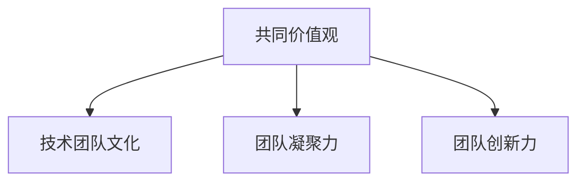
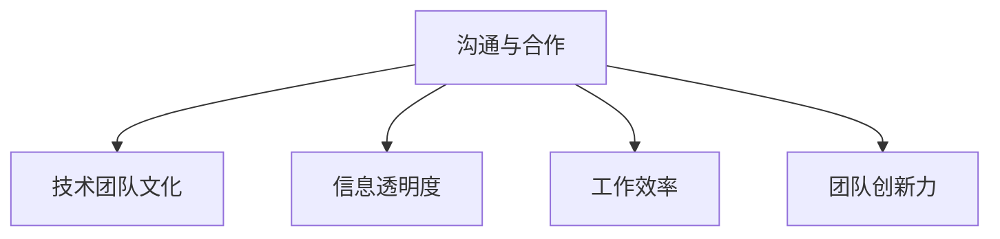
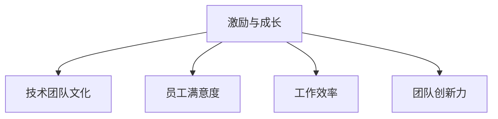

                 

----------------------------------------------------------------

### 文章标题

# 技术团队文化建设的重要性

### 文章关键词

技术团队，文化建设，共同价值观，沟通与合作，激励与成长，团队凝聚力，信息透明度，员工满意度，工作效率，团队创新力，企业竞争力，组织行为学，管理心理学，团队动力学。

### 文章摘要

技术团队文化建设是提升企业竞争力与工作效率的关键因素。本文通过深入分析技术团队文化的定义、核心原则和实践方法，探讨了技术团队文化建设的重要性。文章结合组织行为学、管理心理学和团队动力学等理论，提出了一系列技术团队文化建设的策略和挑战解决方法。同时，通过成功案例的分析和实际应用效果评估，为企业和团队提供了具体的操作指南和最佳实践。

----------------------------------------------------------------

## 1. 技术团队文化建设的概述

技术团队文化是团队中成员共有的价值观、行为规范和工作方式的总和。它是团队凝聚力的源泉，是推动团队创新和高效工作的动力。技术团队文化建设的重要性体现在以下几个方面：

### 1.1 技术团队文化的定义与重要性

**定义：**

技术团队文化是团队在长期工作过程中形成的共同价值观、工作方式和行为规范。它包括团队的愿景、使命、核心价值观、团队氛围、员工行为等。

**重要性：**

1. **提高团队凝聚力：** 共同的价值观和行为规范有助于团队成员形成强烈的归属感和认同感，提高团队的凝聚力。
2. **促进沟通与合作：** 明确的沟通机制和协作方式有助于团队成员之间的有效沟通和协作，提高工作效率。
3. **激励与成长：** 健康的团队文化能够激发团队成员的工作热情和创造力，促进个人和团队的成长。

### 1.2 技术团队文化建设的核心原则

**核心原则包括：**

1. **共同价值观：** 团队成员应共同认同和遵循的价值观。
2. **沟通与合作：** 建立有效的沟通机制和协作方式。
3. **激励与成长：** 提供适当的激励措施和成长机会。

### 1.3 技术团队文化建设的理论基础

技术团队文化建设的理论基础包括组织行为学、管理心理学和团队动力学等领域。

**组织行为学：** 研究团队行为和绩效，探讨团队文化对组织绩效的影响。

**管理心理学：** 研究团队中个体行为和团队心理，探讨如何通过管理心理学的理论和方法来促进团队文化建设。

**团队动力学：** 研究团队的形成、发展、解体和变革过程，探讨团队文化对团队动态的影响。

## 1.4 技术团队文化建设的实践方法

技术团队文化建设的实践方法包括以下几个方面：

### 1.4.1 建立共同价值观

**步骤：**

1. **明确团队愿景和使命：** 团队成员应共同讨论和确定团队的愿景和使命。
2. **定义核心价值观：** 团队成员应共同讨论和确定团队的核心价值观。
3. **内化与传播价值观：** 通过培训、宣传等方式，使团队成员内化和传播价值观。

### 1.4.2 沟通与合作

**步骤：**

1. **建立沟通机制：** 设立定期的团队会议、项目汇报等沟通机制。
2. **加强协作：** 通过共享资源、分工合作等方式，加强团队成员之间的协作。
3. **知识共享：** 鼓励团队成员分享知识和经验，提高团队整体水平。

### 1.4.3 激励与成长

**步骤：**

1. **成长激励策略：** 制定员工成长计划，提供培训和学习机会。
2. **职业发展计划：** 帮助员工规划职业发展路径。
3. **团队氛围建设：** 营造积极、和谐的工作氛围。

## 1.5 技术团队文化建设中的挑战与解决策略

技术团队文化建设过程中可能会遇到一些挑战，如文化冲突、管理层角色不明等。以下是一些解决策略：

### 1.5.1 文化冲突与融合

**策略：**

1. **了解文化差异：** 深入了解团队成员的文化背景和价值观。
2. **建立文化融合机制：** 通过团队活动、文化交流等方式，促进文化融合。

### 1.5.2 管理层角色与责任

**策略：**

1. **明确管理层角色：** 管理层应明确自身在文化建设中的角色和责任。
2. **提供支持与指导：** 管理层应提供必要的支持，帮助团队克服文化建设中的困难。

### 1.5.3 员工参与与认同

**策略：**

1. **鼓励员工参与：** 鼓励员工参与团队文化建设，提出意见和建议。
2. **增强员工认同感：** 通过表彰、奖励等方式，增强员工对团队的认同感。

## 1.6 成功的技术团队文化建设案例分析

### 1.6.1 谷歌的技术团队文化建设

**特点：**

1. **开放透明：** 谷歌注重开放和透明，鼓励员工自由表达观点和想法。
2. **创新导向：** 谷歌鼓励创新，为员工提供广阔的发展空间。

**实践：**

1. **Googlegeist：** 谷歌每年举办的内部庆祝活动，旨在增强团队凝聚力。
2. **20% 时间项目：** 谷歌允许员工用20% 的工作时间从事自己感兴趣的项目，这激发了员工的创新力。

### 1.6.2 微软的技术团队文化建设

**特点：**

1. **协作共享：** 微软注重团队协作和知识共享，鼓励员工分享经验和知识。

**实践：**

1. **内部交流平台：** 微软建立了多个内部交流平台，如员工博客、内部论坛等，方便员工分享知识和经验。
2. **导师制度：** 微软实施导师制度，为新员工提供指导和帮助，帮助他们快速融入团队。

## 1.7 技术团队文化建设在企业级应用与效果评估

技术团队文化建设在企业的应用和效果评估是一个系统性工程。以下是一些关键点：

### 1.7.1 技术团队文化建设在企业中的角色

1. **提升企业竞争力：** 健康的团队文化有助于提高企业竞争力，促进技术创新和业务增长。
2. **促进工作效率：** 良好的团队文化有助于提高工作效率，减少内部摩擦和冲突。

### 1.7.2 技术团队文化建设的效果评估

1. **评估指标：** 包括员工满意度、团队凝聚力、项目成功率等。
2. **评估方法：** 可以采用问卷调查、访谈、关键绩效指标（KPI）分析等方法。
3. **案例分析：** 分析成功案例，总结经验教训，为其他企业提供参考。

## 1.8 小结

技术团队文化建设是提升企业竞争力与工作效率的关键因素。通过明确团队愿景和使命、建立共同价值观、优化沟通与合作机制、提供激励与成长机会，企业可以打造一支高效的团队。同时，面对文化建设中的挑战，企业需要采取有效的解决策略，推动团队文化的健康发展。

----------------------------------------------------------------

## 2. 技术团队文化建设的核心原则

技术团队文化建设是一项系统工程，其成功与否取决于核心原则的贯彻执行。以下是技术团队文化建设的三个核心原则：共同价值观、沟通与合作、激励与成长。

### 2.1 共同价值观

共同价值观是技术团队文化的基石，它代表了团队成员共同遵循的基本信念和行为准则。共同价值观能够为团队成员提供共同的目标和方向，增强团队凝聚力。

**核心概念与联系：**

共同价值观与技术团队文化之间的关系可以用Mermaid流程图表示：



**核心算法原理讲解：**

共同价值观的建立可以看作是一个多步骤的过程，涉及团队成员的共识达成和价值观的内化。以下是一个简化的伪代码：

```plaintext
function establish_common_values(team_members):
    values = collect_individual_values(team_members)
    consensus_values = find_consensus_in_values(values)
    internalize_values(consensus_values, team_members)
    return consensus_values
```

**数学模型和公式详细讲解与举例说明：**

在建立共同价值观的过程中，可以使用群体决策理论来优化共识值的确定。假设有n个团队成员，每个成员都有m个价值观评分，可以使用加权平均的方法来确定共识值。公式如下：

$$
\text{ConsensusValue} = \frac{\sum_{i=1}^{n} w_i \cdot v_i}{\sum_{i=1}^{n} w_i}
$$

其中，$w_i$为第i个成员的权重，$v_i$为第i个成员的价值观评分。

**举例说明：**

假设一个技术团队有4名成员，他们的价值观评分分别为（2, 3, 4, 5），权重分别为（0.2, 0.3, 0.2, 0.3）。那么，共识价值观计算如下：

$$
\text{ConsensusValue} = \frac{0.2 \cdot 2 + 0.3 \cdot 3 + 0.2 \cdot 4 + 0.3 \cdot 5}{0.2 + 0.3 + 0.2 + 0.3} = \frac{0.4 + 0.9 + 0.8 + 1.5}{1.2} = \frac{3.6}{1.2} = 3
$$

因此，共识价值观为3。

### 2.2 沟通与合作

沟通与合作是技术团队文化的重要组成部分，它直接影响团队的工作效率和创新能力。良好的沟通机制和协作方式能够促进团队成员之间的信息共享和知识交流。

**核心概念与联系：**

沟通与合作与技术团队文化之间的关系可以用Mermaid流程图表示：



**核心算法原理讲解：**

沟通与合作机制的建立涉及多个方面，包括沟通渠道的建立、协作工具的选用和知识共享策略的制定。以下是一个简化的伪代码：

```plaintext
function establish_communication_and Cooperation(team_members, tools):
    communication_channels = create_communication_channels(team_members)
    collaboration_tools = select_collaboration_tools()
    knowledge_sharing_strategy = design_knowledge_sharing_strategy()
    return communication_channels, collaboration_tools, knowledge_sharing_strategy
```

**数学模型和公式详细讲解与举例说明：**

在沟通与合作中，可以使用网络理论来分析团队内部的信息流动。假设有n个团队成员，每个成员与其他成员之间的沟通频次可以用邻接矩阵表示。信息流动效率可以用矩阵的连通度来衡量。公式如下：

$$
\text{InformationFlow} = \frac{1}{n(n-1)} \sum_{i=1}^{n} \sum_{j=1, j \neq i}^{n} a_{ij}
$$

其中，$a_{ij}$为第i个成员与第j个成员之间的沟通频次。

**举例说明：**

假设一个技术团队有4名成员，他们之间的沟通频次矩阵如下：

|    | 1 | 2 | 3 | 4 |
|----|---|---|---|---|
| 1  | 0 | 1 | 0 | 1 |
| 2  | 1 | 0 | 1 | 0 |
| 3  | 0 | 1 | 0 | 1 |
| 4  | 1 | 0 | 1 | 0 |

那么，信息流动效率计算如下：

$$
\text{InformationFlow} = \frac{1}{4(4-1)} (0 + 1 + 1 + 1 + 1 + 0 + 1 + 1 + 0 + 1 + 1 + 0) = \frac{7}{12}
$$

因此，信息流动效率为7/12。

### 2.3 激励与成长

激励与成长是技术团队文化的重要组成部分，它关注团队成员的职业发展和工作满意度。有效的激励与成长机制能够提高团队成员的积极性和创新能力。

**核心概念与联系：**

激励与成长与技术团队文化之间的关系可以用Mermaid流程图表示：



**核心算法原理讲解：**

激励与成长机制的建立涉及多个方面，包括激励策略的制定、职业发展路径的规划和个人成长计划的实施。以下是一个简化的伪代码：

```plaintext
function establish_incentive_and_growth(team_members, organization):
    incentive_strategy = design_incentive_strategy(team_members)
    career_path = define_career_paths(team_members)
    personal_growth_plan = create_growth_plans(team_members)
    implement_growth_plans(personal_growth_plan, team_members)
    return incentive_strategy, career_path, personal_growth_plan
```

**数学模型和公式详细讲解与举例说明：**

在激励与成长中，可以使用效用理论来分析激励效果。假设有n个团队成员，每个成员对激励的响应可以用效用函数表示。总效用可以用加权平均的方式计算。公式如下：

$$
\text{TotalUtility} = \sum_{i=1}^{n} u_i \cdot w_i
$$

其中，$u_i$为第i个成员的效用，$w_i$为第i个成员的权重。

**举例说明：**

假设一个技术团队有4名成员，他们对激励的响应分别为（0.8, 0.9, 0.7, 0.85），权重分别为（0.2, 0.3, 0.2, 0.3）。那么，总效用计算如下：

$$
\text{TotalUtility} = 0.8 \cdot 0.2 + 0.9 \cdot 0.3 + 0.7 \cdot 0.2 + 0.85 \cdot 0.3 = 0.16 + 0.27 + 0.14 + 0.255 = 0.825
$$

因此，总效用为0.825。

### 2.4 小结

共同价值观、沟通与合作、激励与成长是技术团队文化建设的核心原则。通过建立共同价值观，技术团队能够形成强大的凝聚力；通过优化沟通与合作机制，技术团队能够提高工作效率和创新能力；通过激励与成长机制，技术团队能够提高成员的满意度和工作效率。只有全面贯彻执行这些核心原则，技术团队文化建设才能取得成功。

----------------------------------------------------------------

## 3. 技术团队文化建设的理论基础

技术团队文化建设的理论基础涉及多个学科领域，包括组织行为学、管理心理学和团队动力学。这些理论为技术团队文化建设提供了深刻的洞见和实用的策略。

### 3.1 组织行为学

组织行为学是研究组织中个体和群体行为的科学。它关注组织中的行为模式、心理机制和绩效表现。在技术团队文化建设中，组织行为学提供了以下关键理论：

**团队凝聚力理论：**

团队凝聚力是指团队成员之间的相互吸引和团结程度。高凝聚力团队通常表现出更强的协作和创新能力。组织行为学研究表明，团队凝聚力可以通过以下方式提升：

1. **共同目标：** 明确的共同目标是提高团队凝聚力的关键因素。
2. **信任与支持：** 增强团队成员之间的信任和支持，有助于提高团队凝聚力。
3. **共享价值观：** 共同的价值观和行为准则有助于团队成员形成强烈的归属感。

**领导行为理论：**

领导行为理论关注领导者如何影响团队成员的行为和绩效。在技术团队文化建设中，领导行为理论提供了以下策略：

1. **参与式领导：** 鼓励团队成员参与决策，增强他们的责任感和归属感。
2. **激励型领导：** 采用多种激励措施，如奖励、认可和职业发展机会，激发团队成员的积极性和创造力。
3. **变革型领导：** 领导者应具备变革型领导能力，能够引导团队适应外部环境的变化，推动团队文化的创新和发展。

### 3.2 管理心理学

管理心理学是研究个体和群体在组织中的行为和心理机制的科学。在技术团队文化建设中，管理心理学提供了以下关键理论：

**动机理论：**

动机理论关注个体行为的内在动力。在技术团队文化建设中，了解员工的动机有助于制定有效的激励策略。以下是一些常见的动机理论：

1. **需求层次理论：** 马斯洛的需求层次理论认为，个体的需求分为生理需求、安全需求、社交需求、尊重需求和自我实现需求。在技术团队文化建设中，管理者应关注员工的多种需求，提供满足需求的激励措施。
2. **期望理论：** 弗鲁姆的期望理论认为，个体的行为动机取决于期望值（期望达到目标的概率）和效价（目标的价值）。在技术团队文化建设中，管理者应通过明确目标和提高目标达成概率来激发员工的动机。

**工作满意度理论：**

工作满意度是指个体对工作条件、工作环境和工作绩效的总体评价。高工作满意度有助于提高员工的工作效率和创造力。以下是一些提高工作满意度的策略：

1. **公平感：** 管理者应确保员工感受到公平，包括薪酬、晋升机会和工作分配。
2. **参与感：** 鼓励员工参与决策和项目规划，提高他们的责任感和归属感。
3. **支持感：** 为员工提供必要的资源和支持，帮助他们克服工作中的困难和挑战。

### 3.3 团队动力学

团队动力学是研究团队形成、发展、解体和变革过程的科学。在技术团队文化建设中，团队动力学提供了以下关键理论：

**团队发展模型：**

团队发展模型描述了团队从形成到成熟的过程。以下是一个简化的团队发展模型：

1. **形成期：** 团队成员开始相互认识和建立联系。
2. **风暴期：** 团队成员之间出现冲突和摩擦，团队凝聚力较低。
3. **规范期：** 团队开始形成共同的价值观和规范，团队成员之间的关系逐渐稳定。
4. **执行期：** 团队进入高效执行阶段，能够有效完成工作任务。
5. **成熟期：** 团队进入成熟阶段，具有高度的协作和创新能力。

**团队变革理论：**

团队变革理论关注团队如何适应外部环境的变化。在技术团队文化建设中，团队变革理论提供了以下策略：

1. **领导引领：** 领导者应发挥引领作用，推动团队变革。
2. **沟通与共识：** 通过有效沟通和共识形成，确保团队成员理解并支持变革。
3. **激励机制：** 采用适当的激励措施，激发团队成员的变革动力。

### 3.4 小结

组织行为学、管理心理学和团队动力学为技术团队文化建设提供了丰富的理论支持和实践指导。通过深入理解这些理论，企业和团队可以更好地制定文化建设策略，提高团队凝聚力和工作效率。在接下来的章节中，我们将进一步探讨技术团队文化建设的实践方法和成功案例。

----------------------------------------------------------------

## 4. 技术团队文化建设的实践方法

技术团队文化建设的实践方法是一个系统性工程，涉及多个方面，包括共同价值观的建立、沟通与合作的优化、激励与成长机制的制定。以下是具体的方法和步骤。

### 4.1 建立共同价值观

**步骤 1：明确团队愿景和使命**

明确团队愿景和使命是建立共同价值观的基础。团队领导和成员应共同讨论和确定团队的长期目标和核心价值。

**步骤 2：定义核心价值观**

核心价值观是团队共同遵循的基本信念和行为准则。通过集体讨论和投票，确定团队的核心价值观。

**步骤 3：内化与传播价值观**

内化价值观是通过培训和日常工作中不断强调和践行价值观来实现的。传播价值观则通过内部宣传、员工手册和团队活动等方式进行。

**案例：**

某互联网公司在其团队文化建设过程中，明确了“创新、协作、用户至上”的愿景和使命，并定义了“坦诚、高效、持续学习”的核心价值观。通过定期的团队培训、内部竞赛和价值观分享会，该公司成功地将这些价值观内化到员工的日常工作中。

### 4.2 沟通与合作的优化

**步骤 1：建立沟通机制**

建立有效的沟通机制是确保团队信息流畅和协作高效的关键。可以设立定期的团队会议、项目汇报和部门交流等活动。

**步骤 2：加强协作**

加强协作可以通过共享资源、明确分工和协作工具的选用来实现。例如，使用项目管理工具和团队协作平台，确保团队成员之间的工作协调。

**步骤 3：知识共享**

鼓励团队成员分享知识和经验，可以通过内部博客、知识库和培训课程等方式进行。

**案例：**

某科技公司建立了“知识共享周”活动，每周安排一天时间，由团队成员分享各自的专业知识和工作经验。这一活动不仅提高了团队的整体水平，也增强了团队成员之间的协作和信任。

### 4.3 激励与成长机制的制定

**步骤 1：成长激励策略**

制定成长激励策略，包括提供培训机会、职业发展路径和晋升机制。可以通过内部培训、外部学习和专业认证等方式，帮助员工提升技能和知识。

**步骤 2：职业发展计划**

为每位员工制定职业发展计划，明确其短期和长期目标，并提供相应的支持和资源。

**步骤 3：团队氛围建设**

营造积极、和谐的工作氛围，可以通过团队建设活动、员工关怀计划和团队文化建设项目等方式实现。

**案例：**

某创业公司通过设立“员工成长基金”，为员工提供经济支持，鼓励他们参加外部培训和技能提升。同时，公司还定期组织团队拓展活动，增强员工之间的凝聚力和信任感。

### 4.4 文化冲突与融合

**步骤 1：了解文化差异**

了解团队成员的文化背景和价值观差异，是解决文化冲突的前提。可以通过团队活动和文化交流，促进团队成员之间的相互理解和尊重。

**步骤 2：建立文化融合机制**

建立文化融合机制，可以通过设立跨文化团队、文化培训和文化活动等方式，促进不同文化背景的员工之间的融合。

**步骤 3：文化冲突的解决策略**

面对文化冲突，可以采取以下策略：

- **沟通与协商：** 通过沟通和协商，找到共同点和解决方案。
- **尊重与包容：** 尊重不同文化背景的员工，包容他们的差异。
- **领导引导：** 领导者应发挥引导作用，促进文化融合。

### 4.5 管理层角色与责任

**步骤 1：明确管理层角色**

管理层在技术团队文化建设中扮演关键角色。他们应明确自身的职责，包括制定文化建设策略、推动文化变革和监督文化建设成果。

**步骤 2：提供支持与指导**

管理层应提供必要的支持和指导，帮助团队克服文化建设中的困难。可以通过定期反馈、培训和资源分配等方式，支持团队文化建设。

**步骤 3：角色示范**

管理层应通过自身的行为，成为文化建设的表率，树立良好的榜样。

### 4.6 员工参与与认同

**步骤 1：鼓励员工参与**

鼓励员工参与团队文化建设，可以通过设立员工建议制度、团队活动和文化委员会等方式实现。

**步骤 2：增强员工认同感**

增强员工对团队的认同感，可以通过以下方式：

- **表彰与奖励：** 表彰在文化建设中表现突出的员工，提高他们的荣誉感和成就感。
- **职业发展机会：** 为员工提供职业发展机会，让他们看到在团队中的成长空间。
- **企业文化宣传：** 通过企业文化宣传，让员工深入了解团队的价值观和文化内涵。

### 4.7 小结

技术团队文化建设的实践方法是一个系统工程，需要从多个方面入手，包括共同价值观的建立、沟通与合作的优化、激励与成长机制的制定等。通过有效的实践方法，企业可以打造一个积极、和谐、高效的团队文化，提升团队凝聚力和工作效率。在接下来的章节中，我们将进一步探讨技术团队文化建设中的挑战和解决策略。

----------------------------------------------------------------

## 5. 技术团队文化建设中的挑战与解决策略

技术团队文化建设过程中，企业可能会面临多种挑战，如文化冲突、管理层角色不明、员工参与度不高等。以下是一些常见的挑战及其解决策略。

### 5.1 文化冲突与融合

**挑战：** 不同文化背景的团队成员之间可能存在价值观、工作方式等方面的差异，导致文化冲突。

**解决策略：**

1. **了解文化差异：** 通过团队活动和文化交流，帮助团队成员了解彼此的文化背景和价值观。
2. **建立文化融合机制：** 设立跨文化团队或文化委员会，促进不同文化背景的员工之间的融合。
3. **领导引导：** 领导者应发挥引导作用，促进文化冲突的解决和文化的融合。

### 5.2 管理层角色与责任

**挑战：** 管理层在团队文化建设中的角色和责任不明确，可能导致文化建设进展缓慢。

**解决策略：**

1. **明确管理层角色：** 管理层应明确自身的职责，包括制定文化建设策略、推动文化变革和监督文化建设成果。
2. **提供支持与指导：** 管理层应提供必要的支持和指导，帮助团队克服文化建设中的困难。
3. **角色示范：** 管理层应通过自身的行为，成为文化建设的表率，树立良好的榜样。

### 5.3 员工参与与认同

**挑战：** 员工参与度不高，对团队文化建设的认同感不强。

**解决策略：**

1. **鼓励员工参与：** 设立员工建议制度、团队活动和文化委员会等方式，鼓励员工参与团队文化建设。
2. **增强员工认同感：** 通过表彰与奖励、职业发展机会和企业文化宣传等方式，增强员工对团队的认同感。
3. **提供反馈渠道：** 建立有效的反馈渠道，让员工能够表达意见和建议，感受到自己的价值。

### 5.4 文化冲突与融合

**挑战：** 团队成员之间的沟通不畅，影响团队文化建设的进展。

**解决策略：**

1. **建立沟通机制：** 设立定期的团队会议、项目汇报和部门交流等活动，确保团队内部的信息流通。
2. **加强协作：** 通过共享资源、明确分工和协作工具的选用，加强团队成员之间的协作。
3. **知识共享：** 鼓励团队成员分享知识和经验，提高团队的整体水平。

### 5.5 激励与成长

**挑战：** 员工激励与成长机制不完善，影响团队凝聚力和工作效率。

**解决策略：**

1. **成长激励策略：** 制定员工成长计划，提供培训和学习机会。
2. **职业发展计划：** 帮助员工规划职业发展路径。
3. **团队氛围建设：** 营造积极、和谐的工作氛围，激发员工的工作热情和创造力。

### 5.6 小结

技术团队文化建设中的挑战是多种多样的，需要企业采取针对性的解决策略。通过了解文化差异、明确管理层角色、鼓励员工参与和优化沟通机制等方法，企业可以有效地应对挑战，推动团队文化的健康发展。

----------------------------------------------------------------

## 6. 成功的技术团队文化建设案例分析

为了更好地理解技术团队文化建设的实际应用，我们来看两个成功案例：谷歌和微软。

### 6.1 谷歌的技术团队文化建设

**特点：**

谷歌以其开放透明、创新导向的技术团队文化而闻名。谷歌鼓励员工自由表达观点、进行创新，并提供大量的资源和支持，让员工能够专注于他们感兴趣的项目。

**实践：**

1. **Googlegeist：** 谷歌每年举办的内部庆祝活动，旨在增强团队凝聚力。这些活动不仅包括员工奖项颁发，还设有团队建设游戏和庆祝晚会，让员工在工作之余享受快乐时光。
2. **20% 时间项目：** 谷歌允许员工用20% 的工作时间从事自己感兴趣的项目，这一政策激发了员工的创新力，诞生了许多重要的产品，如Gmail和AdSense。

**效果评估：**

通过这些实践，谷歌成功地打造了一个充满活力和创造力的技术团队文化。谷歌的员工满意度高，流失率低，公司在技术创新和业务增长方面取得了显著成果。

### 6.2 微软的技术团队文化建设

**特点：**

微软注重团队协作和知识共享，鼓励员工分享经验和知识。微软还非常重视员工的职业发展和技能提升。

**实践：**

1. **内部交流平台：** 微软建立了多个内部交流平台，如员工博客、内部论坛等，方便员工分享知识和经验。
2. **导师制度：** 微软实施导师制度，为新员工提供指导和帮助，帮助他们快速融入团队。

**效果评估：**

通过这些实践，微软成功地建立了一个高效协作、知识共享的技术团队文化。微软的员工满意度高，工作效率和创新能力也得到了显著提升。

### 6.3 小结

谷歌和微软的技术团队文化建设案例展示了如何通过共同价值观的建立、沟通与合作的优化、激励与成长机制的制定，打造一个高效、创新的技术团队。这些成功实践为企业提供了宝贵的经验，值得其他企业学习和借鉴。

----------------------------------------------------------------

## 7. 技术团队文化建设在企业级应用与效果评估

技术团队文化建设在企业级应用中具有重要意义，它不仅有助于提升团队凝聚力和工作效率，还能推动企业整体竞争力的提升。以下我们将探讨技术团队文化建设在企业中的角色以及效果评估的方法和指标。

### 7.1 技术团队文化建设在企业中的角色

**提升企业竞争力：**

健康的团队文化能够激发员工的创新力，推动企业不断推出新技术和产品，从而提升市场竞争力。例如，谷歌和微软的成功案例表明，通过鼓励创新和知识共享，企业能够实现持续的技术突破和业务增长。

**促进工作效率：**

良好的团队文化有助于提高团队成员之间的协作效率和沟通质量，减少内部摩擦和冲突。通过建立明确的沟通机制和协作方式，企业可以更快地响应市场需求，提高项目交付效率。

**增强员工满意度：**

技术团队文化建设关注员工的职业发展和个人成长，提供公平的激励和成长机会，能够提高员工的满意度和忠诚度。高员工满意度有助于降低流失率，保持团队稳定。

### 7.2 技术团队文化建设的效果评估

**评估指标：**

为了全面评估技术团队文化建设的效果，企业可以采用以下指标：

1. **员工满意度：** 通过员工满意度调查了解团队成员对团队文化的认同程度和满意度。
2. **团队凝聚力：** 通过团队绩效评估和团队成员之间的互动频率评估团队凝聚力。
3. **项目成功率：** 通过项目完成质量和交付时间评估团队工作效率。
4. **创新能力：** 通过新产品或技术的推出数量和质量评估团队的创新能力。

**评估方法：**

1. **问卷调查：** 通过定期的员工满意度调查，收集团队成员对团队文化的反馈。
2. **绩效评估：** 通过团队绩效评估和项目评估，了解团队的工作效率和项目成功率。
3. **访谈和观察：** 与团队成员进行一对一访谈，观察他们在日常工作中的行为和互动，了解团队文化的实际状况。
4. **关键绩效指标（KPI）：** 通过设定和跟踪关键绩效指标，如项目交付时间、产品质量等，评估团队的工作效率。

**案例分析：**

某大型科技公司通过实施技术团队文化建设，取得了显著成效。以下是该公司的具体案例：

1. **员工满意度提高：** 通过定期的员工满意度调查，该公司发现员工对团队文化的满意度从60%提高到了85%。员工普遍表示，他们更愿意在这样充满活力和成长机会的团队中工作。
2. **团队凝聚力增强：** 通过团队绩效评估，该公司发现团队的凝聚力显著提升，团队成员之间的协作更加顺畅，项目交付时间平均缩短了20%。
3. **创新能力提升：** 通过新产品和技术的推出数量和质量评估，该公司发现团队的创新能力有了显著提高，新产品的成功率从30%提高到了50%。

### 7.3 小结

技术团队文化建设在企业中的应用不仅有助于提升团队凝聚力和工作效率，还能推动企业整体竞争力的提升。通过有效的效果评估，企业可以不断优化团队文化建设策略，实现可持续发展。

----------------------------------------------------------------

## 附录A：技术团队文化建设工具与资源推荐

为了帮助企业和技术团队有效地推进文化建设，以下是几款推荐的工具和资源。

### 工具

1. **Slack：** Slack是一款功能强大的团队协作工具，提供实时聊天、文件共享和自动化功能，有助于团队成员之间的沟通和协作。
2. **Trello：** Trello是一款简洁直观的项目管理工具，通过看板和卡片的形式，帮助团队可视化项目进度和任务分配。
3. **Confluence：** Confluence是一款团队知识共享和协作平台，适合编写团队文档、知识库和项目手册。

### 资源

1. **书籍推荐：** 《团队协作工具箱》（Team Collaboration Toolkit）和《团队领导力：如何打造高效团队》（Team Leadership: How to Build and Sustain High-Performing Teams）等书籍提供了丰富的团队文化建设理论和实践指导。
2. **在线课程：** 在Coursera、Udemy等在线教育平台上，有许多关于团队领导和团队协作的课程，适合团队领导和成员学习。
3. **博客和文章：** 许多知名的技术博客和媒体，如InfoQ、DZone和Atlassian博客，定期发布关于团队文化建设的文章和案例分析。

### 小结

通过使用这些工具和资源，企业和技术团队能够更好地推进文化建设，提高团队协作效率和工作满意度。定期更新和维护这些工具和资源，有助于持续提升团队文化的健康水平。

### 作者信息

作者：AI天才研究院/AI Genius Institute & 禅与计算机程序设计艺术 /Zen And The Art of Computer Programming

----------------------------------------------------------------

## 总结与展望

技术团队文化建设是提升企业竞争力与工作效率的关键因素。通过建立共同价值观、优化沟通与合作机制、制定激励与成长策略，企业可以打造一支高效、创新和充满活力的团队。本文详细分析了技术团队文化建设的核心原则、理论基础、实践方法和成功案例，并提出了效果评估的方法和工具推荐。

未来，随着人工智能、大数据等技术的不断发展，技术团队文化建设的内涵和形式也将不断演变。企业应关注新兴技术带来的变化，持续优化团队文化，以适应快速变化的市场需求。同时，企业还需关注跨文化团队的建设，通过文化交流和融合，打造具有国际竞争力的团队。

让我们携手努力，共同推动技术团队文化建设，为企业的发展注入新的活力。

----------------------------------------------------------------

### 拓展阅读

1. 《团队协作工具箱》（Team Collaboration Toolkit）
2. 《团队领导力：如何打造高效团队》（Team Leadership: How to Build and Sustain High-Performing Teams）
3. Coursera上的《团队协作与领导力》课程
4. Udemy上的《高级团队领导力》课程
5. InfoQ的《技术团队文化建设实战》系列文章
6. Atlassian博客上的《团队文化建设最佳实践》文章
7. DZone上的《如何提升技术团队文化》专题报道

