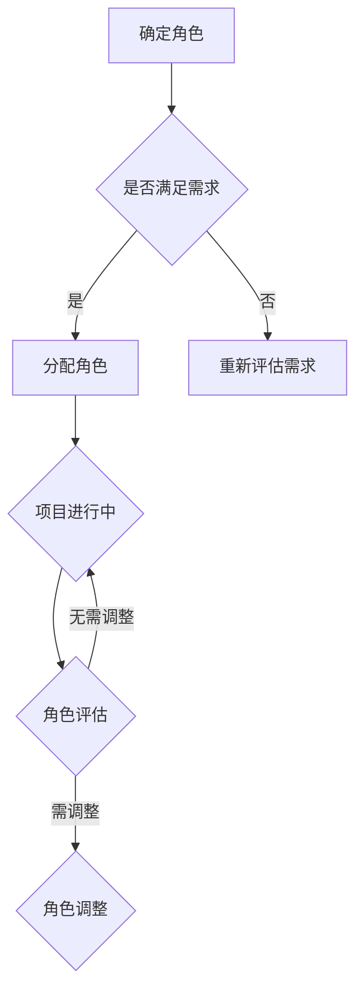
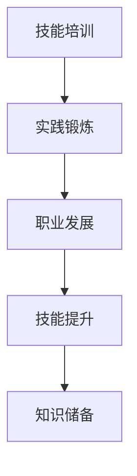
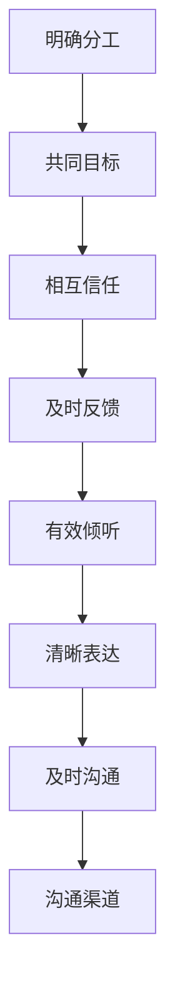
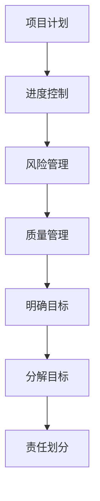
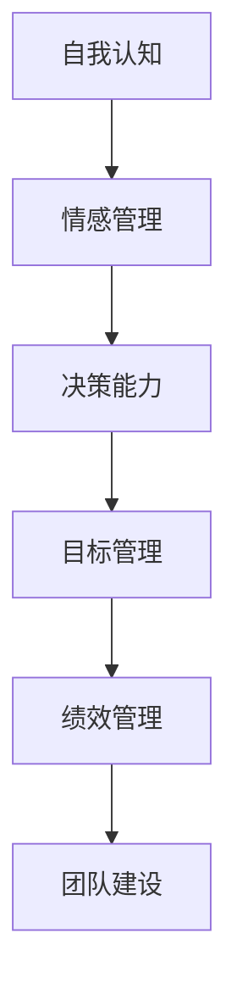
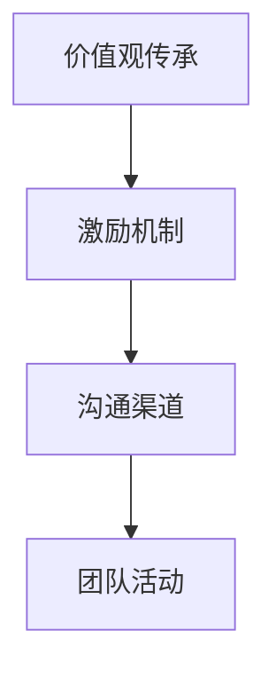
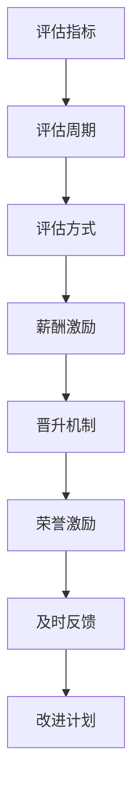

                 


## 文章标题：技术团队梯队建设：培养全方位人才

技术团队梯队建设是提高企业核心竞争力的重要手段。随着技术的快速发展和市场需求的不断变化，企业对技术团队的要求也越来越高。本文将围绕技术团队梯队建设的核心问题，提供一系列实用的策略和方法，帮助团队管理人员和技术负责人培养全方位人才，打造高效技术团队。

## 文章关键词

技术团队、梯队建设、全方位人才、培养策略、团队管理、项目实战、领导力、绩效评估、团队文化、最佳实践。

## 摘要

本文旨在探讨技术团队梯队建设的方法和策略，从团队建设理论框架、团队角色与职责划分、成员能力提升策略、团队协作与沟通技巧、项目管理与目标制定、领导力与团队管理、团队文化与氛围建设以及团队绩效评估与激励等方面，为技术团队管理人员和技术负责人提供全面的指导和实践建议。

## 目录

1. 背景介绍
2. 核心概念与联系
3. 团队角色与职责划分
4. 成员能力提升策略
5. 团队协作与沟通技巧
6. 项目管理与目标制定
7. 领导力与团队管理
8. 团队文化与氛围建设
9. 团队绩效评估与激励
10. 项目实战
11. 最佳实践 tips
12. 小结与拓展阅读

## 1. 背景介绍

### 1.1 技术团队在企业发展中的重要性

在当今数字化时代，技术已经成为企业发展的核心驱动力。技术团队作为企业创新和发展的主力军，其建设水平直接影响到企业的竞争力和发展速度。技术团队梯队建设旨在通过科学的策略和有效的管理，培养一支具有综合素质和专业技能的团队，为企业提供持续的技术创新和业务支持。

### 1.2 技术团队面临的挑战

随着技术的快速发展和市场环境的不断变化，技术团队面临着诸多挑战。如何保持团队的活力和创新力，如何应对技术变革带来的冲击，如何提高团队的协同效率和执行力，都是技术团队管理人员和技术负责人需要深入思考的问题。

### 1.3 梯队建设的核心目标

技术团队梯队建设的核心目标是培养全方位人才，提升团队整体素质。具体包括以下几个方面：

- **技能提升**：团队成员要具备扎实的专业技能和持续学习的能力。
- **知识储备**：团队成员要掌握广博的知识体系，能够应对多样化的技术挑战。
- **协作能力**：团队成员要具备良好的协作精神和沟通技巧，能够高效协同完成项目任务。
- **领导力**：团队成员要具备一定的领导力，能够在团队中发挥积极作用，推动团队发展。

## 2. 核心概念与联系

为了更好地理解技术团队梯队建设，我们需要了解以下几个核心概念，并探讨它们之间的联系。

### 2.1 团队建设理论框架

团队建设理论框架是指导团队建设和发展的基础。常见的团队建设理论包括：

- **Tuckman模型**：描述了团队发展经历的五个阶段：形成、激荡、规范、执行和 adjourning。
- **Belbin模型**：提出了九种团队角色，帮助团队了解成员的角色优势与不足，实现角色互补。
- **Lencioni的五环模型**：包括信任、沟通、承诺、协作和成绩，指导团队建立高效协作机制。

这些理论为我们提供了团队建设的系统方法论，有助于我们根据实际情况制定团队建设策略。

### 2.2 团队角色与职责划分

团队角色与职责划分是技术团队梯队建设的重要内容。清晰的团队角色和明确的职责有助于提高团队协作效率，避免职责重叠和责任推卸。

- **领导角色**：领导者要具备战略规划、团队激励、资源协调等能力，引领团队朝着既定目标前进。
- **技术专家角色**：技术专家要具备专业知识和技能，能够在项目中发挥技术指导作用。
- **项目管理角色**：项目经理要具备项目规划、进度控制、风险管理等能力，确保项目顺利实施。
- **支持角色**：支持角色包括测试人员、文档编写人员等，负责项目的质量和文档工作。

### 2.3 成员能力提升策略

成员能力提升策略是技术团队梯队建设的关键环节。通过培训、实践和激励等手段，不断提升团队成员的技能和知识储备，是实现团队整体素质提升的基础。

- **技能培训**：定期组织专业技能培训，帮助团队成员掌握最新的技术动态和工具。
- **知识更新**：鼓励团队成员参加行业研讨会、技术论坛等活动，了解行业发展趋势。
- **实践锻炼**：通过实际项目锻炼，提高团队成员的实战能力和问题解决能力。
- **职业发展**：为团队成员提供职业发展规划，鼓励他们不断提升自身能力和素质。

### 2.4 团队协作与沟通技巧

团队协作与沟通技巧是提高团队执行力的重要因素。良好的团队协作和沟通能够提高工作效率，减少错误和冲突。

- **协作原则**：明确团队协作原则，建立良好的协作机制。
- **沟通技巧**：提高团队成员的沟通技巧，确保信息传递准确、及时、有效。
- **高效会议**：优化会议流程，提高会议效率，确保会议目标的实现。

### 2.5 项目管理与目标制定

项目管理与目标制定是技术团队梯队建设的重要保障。科学的项目管理方法和明确的目标制定能够确保项目顺利实施，实现团队目标。

- **项目管理知识**：掌握项目管理基础知识，如项目计划、进度控制、风险管理等。
- **目标制定**：明确项目目标和阶段性目标，确保团队目标的实现。

### 2.6 领导力与团队管理

领导力与团队管理是技术团队梯队建设的重要支撑。领导者要具备领导力，能够引领团队不断进步。

- **领导力培养**：通过学习领导力理论和实践，不断提升领导力水平。
- **团队管理**：关注团队成员的发展需求，提供必要的支持和指导。

### 2.7 团队文化与氛围建设

团队文化与氛围建设是技术团队梯队建设的重要组成部分。良好的团队文化和积极向上的氛围能够激发团队成员的积极性和创造力。

- **团队文化**：建立团队价值观和行为准则，塑造团队特色。
- **氛围建设**：营造宽松、包容、积极向上的工作氛围，促进团队成员的沟通与合作。

### 2.8 团队绩效评估与激励

团队绩效评估与激励是技术团队梯队建设的重要手段。通过绩效评估和激励措施，激发团队成员的工作热情和创造力。

- **绩效评估**：建立科学的绩效评估体系，公正、客观地评价团队成员的工作表现。
- **激励措施**：制定合理的激励政策，激励团队成员不断提升自身能力和素质。

## 3. 团队角色与职责划分

技术团队的角色与职责划分是梯队建设的基础。一个高效的技术团队通常包括以下几种关键角色：

### 3.1 领导角色

领导者负责团队的总体方向和目标设定。他们需要具备以下职责：

- **战略规划**：制定团队长期和短期的战略规划。
- **决策制定**：在项目关键节点上做出决策。
- **团队激励**：通过激励措施提升团队成员的积极性。

### 3.2 技术专家角色

技术专家是团队的技术支柱。他们需要具备以下职责：

- **技术指导**：为项目提供技术上的指导和决策支持。
- **技术培训**：为团队成员提供技术培训，提升团队整体技术水平。
- **技术创新**：推动团队在技术上的创新和突破。

### 3.3 项目管理角色

项目经理是项目的核心管理角色。他们需要具备以下职责：

- **项目规划**：制定详细的项目计划，确保项目顺利进行。
- **进度控制**：监控项目进度，确保项目按时交付。
- **风险管理**：识别和管理项目风险，确保项目顺利完成。

### 3.4 支持角色

支持角色是项目成功的关键保障。他们包括：

- **测试人员**：负责软件测试，确保产品质量。
- **文档编写人员**：负责项目文档的编写和维护。
- **运维人员**：负责系统运维，确保系统稳定运行。

### 3.5 团队角色动态调整

团队角色并非一成不变。随着项目的发展和团队成员的变化，角色也需要相应调整。以下是一些角色调整的建议：

- **角色互补**：通过角色互补，提高团队整体效能。
- **技能迁移**：鼓励团队成员在项目中不断学习新技能，实现角色转换。
- **领导轮换**：定期进行领导轮换，培养更多潜在领导者。

### 3.6 角色划分的Mermaid流程图

以下是一个简单的Mermaid流程图，展示团队角色划分和动态调整的过程：



## 4. 成员能力提升策略

成员能力提升是技术团队梯队建设的关键。通过以下策略，可以全面提升团队成员的技能和知识储备：

### 4.1 技能培训

技能培训是提升团队成员技术能力的重要手段。以下是一些技能培训的建议：

- **内部培训**：组织定期的内部培训，由技术专家分享最新的技术动态和经验。
- **外部培训**：鼓励团队成员参加外部培训课程，学习前沿技术。
- **在线学习**：利用在线学习平台，如Coursera、edX等，进行自学。

### 4.2 实践锻炼

实践是提升团队成员能力的关键。以下是一些实践锻炼的建议：

- **项目实战**：通过实际项目，锻炼团队成员的实战能力和问题解决能力。
- **代码评审**：定期进行代码评审，提高代码质量和技术水平。
- **开源参与**：鼓励团队成员参与开源项目，提升技术影响力。

### 4.3 职业发展

职业发展是激励团队成员不断提升自身能力和素质的重要手段。以下是一些职业发展的建议：

- **职业规划**：为团队成员提供职业发展规划，明确职业发展路径。
- **晋升机制**：建立科学的晋升机制，激励团队成员不断提升自身能力。
- **专业认证**：鼓励团队成员获得相关领域的专业认证，提升职业竞争力。

### 4.4 Mermaid流程图

以下是一个简单的Mermaid流程图，展示成员能力提升的过程：



## 5. 团队协作与沟通技巧

团队协作与沟通是技术团队成功的关键。以下是一些团队协作与沟通技巧：

### 5.1 协作原则

- **明确分工**：确保每个团队成员都清楚自己的职责和任务。
- **共同目标**：确保团队成员都认同团队的目标，共同努力。
- **相互信任**：建立团队成员之间的信任，减少沟通障碍。
- **及时反馈**：鼓励团队成员及时反馈问题和进展，确保信息畅通。

### 5.2 沟通技巧

- **有效倾听**：倾听是沟通的基础，确保理解对方的观点和需求。
- **清晰表达**：用简洁、明了的语言表达自己的观点和需求。
- **及时沟通**：确保沟通及时，避免信息传递过程中的误解和错误。
- **沟通渠道**：建立多种沟通渠道，如邮件、即时通讯工具、面对面会议等。

### 5.3 高效会议

- **会议目标明确**：每次会议都要明确会议的目标和议程，确保会议高效。
- **控制会议时间**：严格控制会议时间，避免会议拖延。
- **会议记录**：会议后进行记录，确保会议成果和行动项得到落实。

### 5.4 Mermaid流程图

以下是一个简单的Mermaid流程图，展示团队协作与沟通的过程：



## 6. 项目管理与目标制定

科学的项目管理与目标制定是技术团队梯队建设的重要保障。以下是一些关键步骤和方法：

### 6.1 项目管理知识

- **项目计划**：制定详细的项目计划，明确项目范围、目标、任务和资源需求。
- **进度控制**：监控项目进度，确保项目按计划进行。
- **风险管理**：识别和管理项目风险，确保项目顺利进行。
- **质量管理**：确保项目交付的产品或服务符合质量标准。

### 6.2 目标制定

- **明确目标**：制定明确、可衡量的项目目标。
- **分解目标**：将大目标分解为阶段性目标，确保每个阶段都有明确的任务和目标。
- **责任划分**：明确每个团队成员在项目中的责任和任务。

### 6.3 Mermaid流程图

以下是一个简单的Mermaid流程图，展示项目管理和目标制定的过程：



## 7. 领导力与团队管理

领导力与团队管理是技术团队梯队建设的重要支撑。以下是一些关键方面：

### 7.1 领导力培养

- **自我认知**：领导者需要了解自己的优势和不足，不断提升自我认知。
- **情感管理**：领导者要具备良好的情感管理能力，能够理解并满足团队成员的情感需求。
- **决策能力**：领导者要具备快速、明智的决策能力，能够应对各种挑战。

### 7.2 团队管理

- **目标管理**：确保团队成员明确团队目标，并为之努力。
- **绩效管理**：建立科学的绩效评估体系，公正、客观地评价团队成员的工作表现。
- **团队建设**：通过团队活动、培训和激励等手段，提升团队的凝聚力和执行力。

### 7.3 Mermaid流程图

以下是一个简单的Mermaid流程图，展示领导力与团队管理的过程：



## 8. 团队文化与氛围建设

团队文化与氛围建设是技术团队梯队建设的重要组成部分。以下是一些关键方面：

### 8.1 团队文化定义

团队文化是指团队在长期发展中形成的共同价值观、行为准则和工作方式。良好的团队文化能够促进团队成员之间的沟通与合作，提升团队整体效能。

### 8.2 团队氛围建设

团队氛围是指团队成员在工作中的情绪状态、工作态度和相互关系。积极向上的团队氛围能够激发团队成员的积极性和创造力，提高团队执行力。

### 8.3 建设积极向上团队文化

- **价值观传承**：将团队的价值观融入到日常工作中，确保团队成员都认同并践行。
- **激励机制**：建立合理的激励机制，鼓励团队成员积极参与团队活动，提升团队凝聚力。
- **沟通渠道**：建立多种沟通渠道，促进团队成员之间的交流与合作。
- **团队活动**：组织定期的团队活动，增强团队成员之间的感情和信任。

### 8.4 Mermaid流程图

以下是一个简单的Mermaid流程图，展示团队文化与氛围建设的过程：



## 9. 团队绩效评估与激励

团队绩效评估与激励是技术团队梯队建设的重要手段。以下是一些关键方面：

### 9.1 绩效评估体系设计

- **评估指标**：确定合理的评估指标，如工作质量、工作效率、团队合作等。
- **评估周期**：确定评估周期，如季度、半年或年度。
- **评估方式**：采用多种评估方式，如自我评估、同事评估、上级评估等。

### 9.2 激励措施实施

- **薪酬激励**：通过合理的薪酬激励，提高团队成员的工作积极性。
- **晋升机制**：建立科学的晋升机制，激励团队成员不断提升自身能力和素质。
- **荣誉激励**：设立荣誉制度，表彰优秀团队成员，提高团队凝聚力。

### 9.3 绩效反馈与改进

- **及时反馈**：在评估后，及时向团队成员反馈评估结果，指出优点和不足。
- **改进计划**：鼓励团队成员制定改进计划，不断提升自身能力和绩效。

### 9.4 Mermaid流程图

以下是一个简单的Mermaid流程图，展示团队绩效评估与激励的过程：



## 10. 项目实战

为了更好地理解技术团队梯队建设的实际操作，我们通过一个实际项目来进行分析和讲解。

### 10.1 项目背景

某企业计划开发一款企业级智能办公系统，以提高企业办公效率。该项目涉及多个模块，包括邮件管理、日程安排、文档共享等。

### 10.2 项目开发环境搭建

在项目开发过程中，我们首先需要搭建开发环境。以下是一个简单的开发环境搭建步骤：

1. 安装Java开发工具包（JDK）
2. 配置Maven项目构建工具
3. 安装MySQL数据库
4. 安装Eclipse或IntelliJ IDEA等集成开发环境（IDE）

### 10.3 源代码详细实现和代码解读

以下是一个简单的邮件管理模块的实现示例，我们将使用Java语言和Spring框架进行开发。

```java
// 邮件服务类
public class MailService {
    
    // 发送邮件
    public void sendMail(String to, String subject, String content) {
        // 使用JavaMail发送邮件
        Properties properties = new Properties();
        properties.put("mail.smtp.host", "smtp.example.com");
        properties.put("mail.smtp.port", "587");
        properties.put("mail.smtp.auth", "true");
        
        Session session = Session.getInstance(properties, new Authenticator() {
            protected PasswordAuthentication getPasswordAuthentication() {
                return new PasswordAuthentication("username", "password");
            }
        });
        
        try {
            Message message = new MimeMessage(session);
            message.setFrom(new InternetAddress("from@example.com"));
            message.setRecipients(Message.RecipientType.TO, InternetAddress.parse(to));
            message.setSubject(subject);
            message.setText(content);
            
            Transport.send(message);
            System.out.println("邮件发送成功");
        } catch (MessagingException e) {
            e.printStackTrace();
            System.out.println("邮件发送失败");
        }
    }
}
```

### 10.4 代码应用解读与分析

在这个示例中，我们实现了一个简单的邮件服务类`MailService`，用于发送邮件。关键代码如下：

- **配置邮件服务属性**：通过`Properties`类配置邮件服务属性，如SMTP主机、端口、是否需要身份验证等。
- **创建会话**：通过`Session`类创建邮件会话，并设置身份验证。
- **创建邮件消息**：通过`MimeMessage`类创建邮件消息，设置发件人、收件人、主题和内容。
- **发送邮件**：通过`Transport`类发送邮件。

这个示例代码展示了如何使用JavaMail发送邮件。在实际项目中，我们还需要考虑邮件内容格式、附件处理、邮件模板等更多细节。

### 10.5 实际案例分析和详细讲解剖析

在实际项目中，邮件管理模块不仅需要实现发送邮件的功能，还需要处理邮件接收、邮件存储、邮件搜索等功能。以下是一个实际案例的分析：

- **邮件接收**：使用JavaMail的`Store`和`Folder`类，连接邮件服务器，获取邮件列表，读取邮件内容。
- **邮件存储**：将读取到的邮件内容存储到本地数据库或邮件服务器的文件夹中。
- **邮件搜索**：提供邮件搜索功能，支持按关键字、邮件主题、发送者等条件进行搜索。

通过这个实际案例，我们可以看到邮件管理模块的复杂性。在实际开发过程中，需要根据项目需求逐步实现各个功能，并进行充分的测试和优化。

### 10.6 项目小结

通过这个实际项目，我们可以总结出以下几点经验和教训：

- **需求分析**：在项目开始前，进行充分的需求分析，明确项目目标和功能需求。
- **模块划分**：将项目划分为多个模块，便于管理和开发。
- **代码规范**：遵循良好的代码规范，提高代码可读性和可维护性。
- **测试和优化**：在开发过程中，进行充分的测试和优化，确保项目质量和性能。

这些经验和教训对于技术团队梯队建设具有重要的指导意义。

## 11. 最佳实践 tips

### 11.1 提升团队技能

- **定期培训**：组织定期的技术培训，提升团队整体技能水平。
- **内部分享**：鼓励团队成员进行技术分享，促进知识交流。

### 11.2 建立协作机制

- **明确职责**：明确团队成员的职责和任务，避免工作重复和冲突。
- **协作工具**：使用高效的协作工具，如Jira、Confluence等，提高团队协作效率。

### 11.3 激励团队成员

- **合理激励**：建立合理的激励政策，激励团队成员不断提升自身能力和绩效。
- **认可贡献**：及时认可团队成员的贡献，提高团队凝聚力。

## 12. 小结与拓展阅读

本文从多个角度探讨了技术团队梯队建设的方法和策略，包括团队建设理论框架、团队角色与职责划分、成员能力提升策略、团队协作与沟通技巧、项目管理与目标制定、领导力与团队管理、团队文化与氛围建设以及团队绩效评估与激励等。通过这些策略和方法的实施，可以有效地提升技术团队的执行力、创新力和竞争力。

为了更好地理解和应用这些策略和方法，我们提供了一个实际项目的案例，详细分析了项目开发过程中的关键步骤和注意事项。希望本文能够为技术团队管理人员和技术负责人提供有益的参考和启示。

拓展阅读：

- 《敏捷团队实践指南》：了解敏捷开发方法和实践，提升团队协作效率。
- 《领导力与团队管理》：学习领导力和团队管理技巧，提升团队领导力。
- 《项目管理知识体系指南》：掌握项目管理基础知识，提高项目管理能力。

## 作者信息

作者：AI天才研究院/AI Genius Institute & 禅与计算机程序设计艺术/Zen And The Art of Computer Programming

