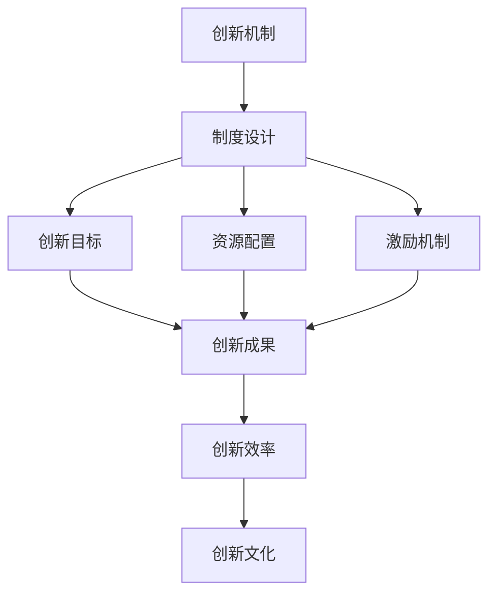

                 

## 文章标题：技术团队的创新机制：鼓励创新的制度设计

### 关键词：
- 创新机制
- 制度设计
- 技术团队管理
- 创新文化
- 激励机制
- 技术能力建设

### 摘要：
本文深入探讨了技术团队创新机制的构建和制度设计的重要性。通过分析创新的概念、机制及其与制度设计的关系，本文提出了鼓励创新的技术团队管理制度设计原则，并详细阐述了技术团队的组织结构设计、能力建设、项目管理以及创新文化的培育。文章通过伪代码、LaTeX公式和实际案例，提供了具体的实现方法和最佳实践，旨在为技术团队管理者提供系统的创新机制构建指南。

----------------------------------------------------------------

## 引言

在当前技术快速发展的时代，创新已成为企业核心竞争力的重要体现。技术团队作为创新的主要推动力量，其创新能力的高低直接影响到企业的竞争力和发展速度。因此，如何构建有效的创新机制，成为技术团队管理的重要课题。

### 1.1 创新的重要性

创新不仅仅是技术创新，它涵盖了新产品、新服务、新流程、新商业模式等多个方面。对于技术团队而言，创新意味着对现有技术的改进、新技术的引入、解决问题的能力提升等。以下是创新的几个关键点：

- **提高竞争力**：创新能够帮助企业抢占市场先机，提高产品或服务的差异化程度，从而在竞争激烈的市场中脱颖而出。
- **促进发展**：创新是推动企业持续发展的重要动力，能够带来新的业务增长点，提升企业的市场地位。
- **提升员工满意度**：创新工作环境能够激发员工的创造力和工作热情，提高员工的工作满意度和忠诚度。

### 1.2 技术团队的角色

技术团队在企业中扮演着至关重要的角色，其职责包括但不限于：

- **技术开发**：负责新产品或服务的研发和实现。
- **技术支持**：为其他部门提供技术支持，解决技术难题。
- **技术优化**：对现有技术进行优化，提高效率和性能。
- **创新驱动**：通过技术创新推动企业的持续发展。

### 1.3 文章结构与目的

本文将围绕技术团队的创新机制和制度设计展开讨论，主要结构如下：

- **创新机制概述**：介绍创新机制的基本概念和分类。
- **制度设计原理**：探讨制度设计的基本原则和核心要素。
- **技术团队管理实践**：分析技术团队的组织结构设计、能力建设、项目管理等。
- **创新文化培育**：讨论如何培养和维持创新文化。

本文旨在为技术团队管理者提供一套系统的创新机制构建指南，通过理论阐述、实践分析和最佳案例，帮助读者理解和应用创新机制的设计原则，从而提升团队的整体创新能力。

----------------------------------------------------------------

## 第一部分：创新机制概述

### 第1章 创新机制的概念与类型

#### 1.1.1 创新机制的定义

创新机制是指在组织内部建立的一系列制度、流程和文化，旨在激发和引导创新行为，从而推动组织持续进步和发展的系统。创新机制不仅涉及技术创新，还包括管理创新、商业模式创新等。

#### 1.1.2 创新机制的分类

根据创新的内容和形式，创新机制可以分为以下几类：

1. **技术创新机制**：主要包括研发投入、技术创新流程、技术成果转化等。
2. **管理创新机制**：涉及组织结构、管理制度、管理方法等方面的创新。
3. **商业模式创新机制**：关注产品或服务的商业模式设计，如平台化、共享经济等。
4. **文化创新机制**：强调组织文化对创新的促进作用，如鼓励试错、容忍失败等。

#### 1.1.3 创新机制的作用

创新机制在技术团队中发挥着重要作用，主要体现在以下几个方面：

1. **激发创新动力**：通过制度和激励机制，激发团队成员的创新热情和创造力。
2. **优化创新流程**：提供明确的创新路径和规范，减少创新过程中的不确定性和浪费。
3. **提高创新效率**：通过系统化的管理和资源配置，提高创新的效率和成功率。
4. **培育创新文化**：营造创新氛围，鼓励团队成员敢于尝试、勇于创新。

#### 1.1.4 创新机制与制度设计的关系

创新机制与制度设计密切相关。制度设计是创新机制构建的基础，而创新机制则是制度设计的具体实施。良好的制度设计能够为创新提供有力的保障，如明确的创新目标、合理的资源配置、有效的激励机制等。同时，创新机制的运行效果也会反过来影响制度设计，促进其不断优化和完善。

### Mermaid 流程图：创新机制与制度设计的关系

通过上述流程图，我们可以清晰地看到创新机制与制度设计之间的相互作用关系，以及它们对创新效率和文化的促进作用。

#### 1.1.5 创新机制的核心要素

构建有效的创新机制需要考虑以下核心要素：

1. **目标明确**：确保创新活动与组织战略目标一致，明确创新的方向和重点。
2. **资源保障**：提供充足的资金、技术、人力资源等，为创新提供必要的支持。
3. **流程规范**：建立合理的创新流程，确保创新活动的顺利进行。
4. **激励机制**：设计有效的激励机制，激发团队成员的创造力和工作热情。
5. **风险管理**：建立风险管理机制，降低创新过程中的风险和不确定性。

通过以上核心要素的有机结合，技术团队能够构建出高效的创新机制，推动企业的持续创新和发展。

----------------------------------------------------------------

### 第2章 制度设计的基本原则

#### 2.1.1 目标导向原则

目标导向原则是制度设计的重要原则之一。在构建创新机制时，首先需要明确组织的战略目标和创新目标。创新机制的设计和实施应紧紧围绕这些目标展开，确保创新活动能够为组织的发展提供有力支持。

1. **明确创新目标**：创新目标应具体、可衡量，并与组织整体战略目标相一致。例如，提高产品性能、拓展新市场、实现技术突破等。
2. **制定实现路径**：为实现创新目标，需要制定具体的实施路径和行动计划。这些路径和计划应包括资源分配、时间节点、关键里程碑等。
3. **持续跟踪与评估**：在创新过程中，持续跟踪和评估创新活动的进展情况，确保其按照预期目标进行。如果出现偏离，应及时进行调整。

#### 2.1.2 平衡激励原则

平衡激励原则强调在制度设计中要平衡不同利益相关者的需求，确保激励机制的有效性和公平性。

1. **内部激励机制**：内部激励机制包括薪酬、晋升、培训等，旨在激发团队成员的积极性和创造力。在制定内部激励机制时，需要考虑团队成员的个人需求和职业发展目标，确保激励措施具有吸引力和可行性。
2. **外部激励机制**：外部激励机制包括合作伙伴关系、市场认可等，旨在吸引外部资源和支持，为创新提供更广阔的平台。在构建外部激励机制时，需要关注行业发展趋势和市场需求，建立与外部合作伙伴的长期合作关系。
3. **平衡激励**：在制度设计中，要平衡内部和外部激励机制，确保两者相辅相成，共同推动创新活动的发展。

#### 2.1.3 动态调整原则

创新环境是不断变化的，因此制度设计也需要具备灵活性和适应性。动态调整原则要求在制度设计过程中，充分考虑变化因素，确保制度能够持续适应创新发展的需求。

1. **定期评估与调整**：定期对创新机制进行评估和调整，根据评估结果对制度设计进行优化。评估内容应包括创新效果、资源配置、激励机制等方面。
2. **应对变化因素**：在制度设计过程中，要充分考虑外部环境变化、技术进步、市场动态等因素，确保制度具有应对变化的能力。
3. **持续改进**：鼓励团队成员积极参与制度改进，提出建议和改进方案。通过持续改进，不断完善和创新机制，提升创新效率和效果。

通过遵循目标导向原则、平衡激励原则和动态调整原则，技术团队能够构建出适应创新需求的制度设计，为技术创新提供有力支持。

----------------------------------------------------------------

### 第3章 制度设计的核心要素

#### 3.1.1 权力分配

权力分配是制度设计中的一个关键要素，它决定了团队成员的职责和权限。合理的权力分配有助于提高团队的工作效率和创新效果。

1. **明确职责**：在制度设计中，需要明确每个团队成员的职责和任务，确保每个人都知道自己的工作内容和目标。这有助于减少职责重叠和冲突，提高工作效率。
2. **权限界定**：权力分配不仅要明确职责，还要界定每个成员的权限范围。合理的权限界定有助于团队成员在执行任务时能够自主决策，提高工作的灵活性和响应速度。
3. **协作与分工**：在权力分配过程中，要充分考虑团队成员的协作和分工。通过合理的协作和分工，可以充分发挥每个人的优势，提高团队的协同效率。

#### 3.1.2 资源配置

资源配置是制度设计的另一个核心要素，它决定了团队在创新过程中的资源利用效率和效果。

1. **资源分类**：在制度设计中，需要明确资源的类型和用途。常见的资源包括人力、资金、设备、技术等。对每种资源进行分类，有助于更好地进行管理和调配。
2. **资源分配**：在明确资源类型和用途后，需要根据创新目标和项目需求进行资源分配。资源分配应遵循公平、合理、高效的原则，确保每个项目和团队都能获得必要的资源支持。
3. **资源管理**：在资源分配后，需要建立有效的资源管理制度，确保资源的合理使用和高效利用。资源管理包括资源调度、资源监控、资源回收等环节。

#### 3.1.3 激励机制

激励机制是制度设计中的关键要素之一，它直接影响团队成员的积极性和创造力。

1. **薪酬激励**：薪酬激励是激励机制的核心，通过提供具有竞争力的薪酬，激发团队成员的工作热情和积极性。薪酬激励应包括基本工资、绩效奖金、股票期权等。
2. **晋升激励**：晋升激励旨在为团队成员提供职业发展的机会和空间，鼓励他们在工作中不断进步和成长。晋升激励可以通过设立晋升通道、提供培训机会等来实现。
3. **荣誉激励**：荣誉激励通过表彰和奖励在创新中表现突出的团队成员，提高他们的工作积极性和自豪感。荣誉激励可以包括荣誉称号、奖励证书、公开表彰等。

通过合理分配权力、优化资源配置和设计有效的激励机制，技术团队能够构建出高效的创新机制，激发团队的创新能力，推动企业的持续发展。

----------------------------------------------------------------

### 第4章 创新文化的培育

#### 4.1.1 创新文化的内涵

创新文化是指组织内部形成的鼓励创新、容忍失败、支持创造的氛围和价值观。创新文化不仅包括组织的制度和流程，还包括员工的心态和行为。

1. **创新价值观**：创新文化强调创新的重要性，认为创新是组织发展的核心驱动力。创新价值观体现在员工对创新的认同、追求和执行力上。
2. **创新氛围**：创新文化通过营造一个开放、包容、支持的创新氛围，鼓励员工勇于尝试、敢于失败。创新氛围有助于激发员工的创造力和创新思维。
3. **创新行为**：创新文化倡导员工积极参与创新活动，通过分享经验、协作合作、持续学习等方式，不断提高创新能力和效果。

#### 4.1.2 创新文化的建设策略

要培育和维持创新文化，组织可以采取以下策略：

1. **领导层的支持**：领导层应树立创新价值观，积极参与创新活动，并为员工提供支持和资源。领导层的重视和支持是创新文化培育的重要保障。
2. **培训与教育**：组织应开展创新培训和教育，提高员工创新意识和能力。培训内容可以包括创新方法论、创新工具和技术等。
3. **鼓励试错**：创新过程中不可避免地会遇到失败和挫折，组织应鼓励员工勇于尝试、容忍失败。通过试错，员工可以不断学习和进步，提高创新成功率。
4. **跨部门协作**：创新通常需要跨部门协作，组织应建立跨部门协作机制，促进不同部门之间的沟通和合作，提高创新效率。
5. **激励机制**：建立创新激励机制，鼓励员工积极参与创新活动，并对创新成果进行奖励。激励机制可以包括薪酬奖励、晋升机会、荣誉表彰等。

#### 4.1.3 创新文化的评估方法

评估创新文化是确保创新文化培育成效的重要环节。以下是一些常见的评估方法：

1. **问卷调查**：通过问卷调查了解员工对创新文化的认知、态度和行为。问卷调查可以设计一系列关于创新价值观、创新氛围、创新行为等方面的问题。
2. **员工访谈**：与员工进行面对面访谈，深入了解他们对创新文化的看法和感受。访谈可以提供更多详细的见解和反馈。
3. **关键绩效指标（KPI）**：通过关键绩效指标评估创新文化的成效。例如，创新项目数量、创新成功率、员工满意度等。
4. **创新成果展示**：组织创新成果展示活动，展示员工在创新项目中的成果和贡献。展示活动可以激发员工的创新热情和自豪感。

通过以上方法，组织可以全面了解创新文化的现状和问题，为创新文化的进一步培育和改进提供依据。

----------------------------------------------------------------

### 第5章 技术团队的组织结构设计

#### 5.1.1 团队角色的设定

技术团队的组织结构设计首先需要明确各个角色的职责和任务，确保团队成员能够各司其职，高效协作。

1. **领导层**：领导层负责团队的宏观管理和战略规划，确保团队的创新活动与组织目标一致。领导层还负责资源的调配和团队绩效的评估。
2. **项目经理**：项目经理负责具体项目的管理和协调，确保项目按照计划进行。项目经理需要具备项目管理知识和技能，能够解决项目过程中的各种问题。
3. **技术专家**：技术专家负责技术问题的分析和解决，提供技术指导和支持。技术专家通常是团队中最有经验的成员，能够为团队的创新活动提供技术保障。
4. **开发人员**：开发人员负责具体代码的实现和调试，是创新活动的主要执行者。开发人员需要具备扎实的技术基础和创新能力。
5. **测试人员**：测试人员负责对开发完成的代码进行测试和验证，确保软件质量和可靠性。测试人员需要具备良好的测试方法和技能。

#### 5.1.2 团队规模的确定

团队规模的确定需要综合考虑项目复杂度、团队成员的能力和资源等因素。

1. **项目复杂度**：对于复杂的创新项目，需要更多的人员和资源来保证项目的顺利进行。团队规模应与项目复杂度相匹配，避免资源浪费和效率低下。
2. **团队成员能力**：团队成员的能力和技能水平会影响团队的工作效率和创新能力。团队规模应与团队成员的能力相匹配，确保每个成员都能充分发挥自己的优势。
3. **资源限制**：组织的资源限制也是确定团队规模的重要因素。团队规模应控制在组织的资源承受范围内，避免资源过度消耗。

#### 5.1.3 团队汇报机制的建立

建立有效的团队汇报机制是确保团队协作和沟通的关键。

1. **定期会议**：定期举行团队会议，让团队成员分享工作进展、讨论问题和提出建议。定期会议可以每周或每月举行，根据项目进展情况进行调整。
2. **项目进度汇报**：项目经理需要定期向领导层汇报项目进展，包括项目计划、进度、资源使用情况等。项目进度汇报可以每周或每月进行，确保领导层对项目状况有清晰的了解。
3. **问题反馈机制**：建立问题反馈机制，让团队成员能够在遇到问题时及时向项目经理和领导层反馈。问题反馈机制可以包括邮件、即时通讯工具等，确保问题得到及时解决。

通过明确团队角色、合理确定团队规模和建立有效的汇报机制，技术团队能够实现高效协作，提高创新效率和成果。

----------------------------------------------------------------

### 第6章 技术团队的能力建设

#### 6.1.1 技术能力的提升路径

技术团队的能力建设是持续创新的基础。以下是一些提升技术能力的路径：

1. **技术培训**：定期组织技术培训，帮助团队成员掌握新技术和工具。培训内容可以包括新兴技术趋势、编程语言、开发框架等。通过培训，团队成员可以不断更新知识，提高技术水平。
2. **技术交流**：鼓励团队成员参加技术交流会议、研讨会和讲座，与其他技术专家和同行交流经验和观点。技术交流有助于拓宽视野，激发创新思维，提高团队的整体技术水平。
3. **实践项目**：通过参与实际项目，团队成员可以将所学知识应用于实践，提高解决问题的能力。实践项目可以是内部项目，也可以是外部合作项目。通过实践，团队成员可以积累经验，提升技能。

#### 6.1.2 技术人才培养机制

技术人才培养机制是技术团队持续发展的重要保障。以下是一些关键点：

1. **选拔与任用**：建立科学的选拔和任用机制，确保团队成员具备合适的技术能力和职业素养。选拔标准应包括技术能力、工作经验、学习能力等。
2. **职业规划**：为团队成员提供明确的职业发展路径和规划，帮助他们在技术领域不断进步。职业规划可以包括晋升通道、技能提升计划、职业培训等。
3. **激励与奖励**：建立有效的激励和奖励机制，激励团队成员积极参与技术学习和能力提升。激励和奖励可以包括薪酬激励、晋升机会、荣誉表彰等。

#### 6.1.3 技术知识管理

技术知识管理是技术团队创新能力的重要支撑。以下是一些技术知识管理的策略：

1. **知识共享**：鼓励团队成员分享知识和经验，建立知识共享平台，如内部论坛、技术博客等。知识共享有助于提高团队的整体技术水平，促进创新思维。
2. **知识积累**：建立技术文档库，记录团队在项目中的技术经验和解决方案。技术文档库应包括项目概述、技术细节、测试报告等，为后续项目提供参考。
3. **知识更新**：定期更新技术文档库，确保知识内容保持最新。知识更新可以包括技术趋势、新工具、新方法等。

通过技术培训、人才培养和知识管理，技术团队能够不断提升技术能力，持续推动创新和发展。

----------------------------------------------------------------

### 第7章 创新项目的管理与评估

#### 7.1.1 创新项目的启动

创新项目的启动是项目管理的第一步，需要明确项目的目标、范围和资源需求。

1. **项目立项**：在项目启动前，需要进行项目立项，明确项目的背景、目标、预期成果和可行性。立项报告应详细阐述项目的意义、预期效益和风险分析。
2. **项目团队组建**：根据项目需求，组建合适的团队，明确团队成员的职责和角色。项目团队应包括项目经理、技术专家、开发人员、测试人员等。
3. **资源调配**：在项目启动阶段，需要根据项目需求进行资源的调配，包括资金、设备、技术等。资源调配应确保项目能够顺利进行，避免资源浪费。

#### 7.1.2 创新项目的执行

创新项目的执行阶段是项目管理的核心，需要确保项目按照计划进行，并应对可能出现的问题。

1. **任务分解**：将项目任务分解为具体的子任务，明确每个子任务的责任人和完成时间。任务分解应确保项目进度可控，避免任务过于集中或分散。
2. **进度监控**：通过定期检查和报告，监控项目的进度和质量。进度监控可以包括项目周报、月报等，确保项目按照计划进行。
3. **问题解决**：在项目执行过程中，难免会遇到各种问题。项目团队应建立问题解决机制，及时识别和解决项目中的问题，确保项目顺利推进。

#### 7.1.3 创新项目的评估与反馈

创新项目的评估与反馈是项目管理的重要环节，需要确保项目成果的有效性和可持续性。

1. **项目评估**：在项目完成后，进行项目评估，评估项目目标是否实现、项目质量是否达标等。项目评估可以包括成果评估、质量评估、成本评估等。
2. **反馈机制**：建立项目反馈机制，收集项目参与者和利益相关者的意见和建议。反馈机制可以包括项目回顾会、问卷调查等。
3. **持续改进**：根据项目评估和反馈，识别项目的优点和不足，提出改进措施，并纳入后续项目的管理中。持续改进有助于提高项目管理的效率和效果。

通过科学的项目管理和有效的评估与反馈，技术团队能够确保创新项目的成功实施，推动企业的持续创新和发展。

----------------------------------------------------------------

## 结论

本文系统地探讨了技术团队的创新机制和制度设计，从创新机制的概念与分类、制度设计的基本原则和核心要素、技术团队的组织结构设计、能力建设、项目管理以及创新文化的培育等方面进行了详细分析。通过理论阐述、实践分析和实际案例，本文为技术团队管理者提供了一套完整的创新机制构建指南。

### 8.1 主要观点回顾

- 创新是技术团队的重要驱动力，直接影响企业的竞争力和发展速度。
- 创新机制和制度设计是激发团队创新能力的关键，需要遵循目标导向、平衡激励和动态调整等原则。
- 技术团队的组织结构设计、能力建设和项目管理是确保创新机制有效运行的重要环节。
- 培育创新文化是推动团队持续创新的重要保障，需要建立支持创新的组织氛围和价值观。

### 8.2 未来展望

随着技术的不断进步和市场环境的变化，技术团队的创新能力将面临新的挑战和机遇。未来的创新机制和制度设计将更加注重以下几个方面：

- **敏捷性**：在快速变化的市场环境中，技术团队需要具备更高的敏捷性，能够快速响应市场需求和技术趋势。
- **跨学科协作**：未来的创新将更加依赖于跨学科的合作，技术团队需要加强与业务、设计等部门的协作，实现跨领域的创新。
- **数据驱动**：数据将成为创新的重要驱动力，技术团队需要通过数据分析和挖掘，发现潜在的创新机会和改进点。
- **全球化视角**：全球化背景下的创新将更加多元化和国际化，技术团队需要具备全球化的视野和跨文化沟通能力。

未来，技术团队将不断探索和创新，通过构建完善的创新机制和制度设计，推动企业的持续发展和竞争力的提升。

----------------------------------------------------------------

## 附录

### 附录A 制度设计工具与方法

#### A.1 制度设计工具简介

制度设计过程中，使用合适的工具和方法能够提高效率和效果。以下是一些常见的制度设计工具：

1. **SWOT分析**：用于评估创新机制的内部优势（Strengths）、劣势（Weaknesses）、外部机会（Opportunities）和威胁（Threats）。
2. **SMART原则**：确保创新目标和计划具有可衡量性（Specific）、可达成性（Measurable）、可实现性（Achievable）、相关性（Relevant）和时限性（Time-bound）。
3. **KPI（关键绩效指标）**：用于衡量创新机制的效果和绩效，包括创新项目成功率、创新产品市场占有率等。

#### A.2 制度设计方法应用实例

以下是一个创新机制制度设计的方法应用实例：

**项目名称**：研发部门创新激励机制设计

**目标**：提高研发部门员工的创新积极性，推动技术创新。

**步骤**：

1. **需求分析**：收集员工对于激励机制的需求和期望，了解现有激励机制的不足。
2. **SWOT分析**：分析现有激励机制的优势、劣势、机会和威胁，确定改进方向。
3. **SMART设定目标**：设定明确、可衡量的创新目标，如每季度提交1个技术创新提案，每个提案根据贡献度获得不同级别的奖励。
4. **KPI设计**：设定关键绩效指标，如创新项目成功率、创新产品市场占有率等，用于评估激励机制的效果。
5. **实施与监控**：制定详细的实施计划，定期监控创新项目的进展和激励机制的效果，及时调整和优化。

通过以上步骤，可以构建一个有效的创新激励机制，提高研发部门的创新能力。

### 附录B 技术团队管理案例

#### B.1 成功案例分析

**案例名称**：某互联网公司研发团队创新机制构建

**背景**：该公司在激烈的市场竞争中，意识到创新的重要性，决定构建一套有效的创新机制。

**措施**：

1. **领导层支持**：公司领导层高度重视创新，亲自推动创新机制的构建。
2. **技术培训**：定期组织技术培训，提高员工的技术水平。
3. **跨部门协作**：建立跨部门协作机制，促进不同部门之间的沟通和合作。
4. **激励制度**：设立创新奖励基金，对在创新项目中表现突出的员工进行奖励。

**效果**：通过以上措施，该公司研发团队的创新能力和工作效率显著提高，多个创新项目取得了成功，推动了公司的持续发展。

#### B.2 失败案例分析

**案例名称**：某传统企业创新机制尝试

**背景**：该公司希望借助创新机制提升企业竞争力，但在实施过程中遇到了困难。

**原因**：

1. **缺乏领导层支持**：公司领导层对创新重视不足，缺乏推动创新机制的动力。
2. **激励机制不完善**：缺乏有效的激励机制，员工缺乏参与创新的动力。
3. **技术积累不足**：公司技术积累薄弱，难以支持创新活动的开展。

**教训**：在构建创新机制时，必须得到领导层的高度重视和支持，同时要建立完善的激励机制和技术支持体系，确保创新活动的顺利开展。

通过分析成功和失败案例，技术团队管理者可以从中吸取经验教训，优化自身的创新机制设计，提高创新能力。

----------------------------------------------------------------

## 作者信息

作者：AI天才研究院/AI Genius Institute & 禅与计算机程序设计艺术 /Zen And The Art of Computer Programming

本文由AI天才研究院/AI Genius Institute的专家撰写，旨在分享技术团队创新机制和制度设计的最佳实践和理论指导，帮助技术团队管理者提升创新能力，推动企业的持续发展。同时，本文也融合了《禅与计算机程序设计艺术》的哲学思想，强调在技术追求中保持心灵的平和与专注。希望本文能为广大技术团队管理者提供有益的启示和指导。

