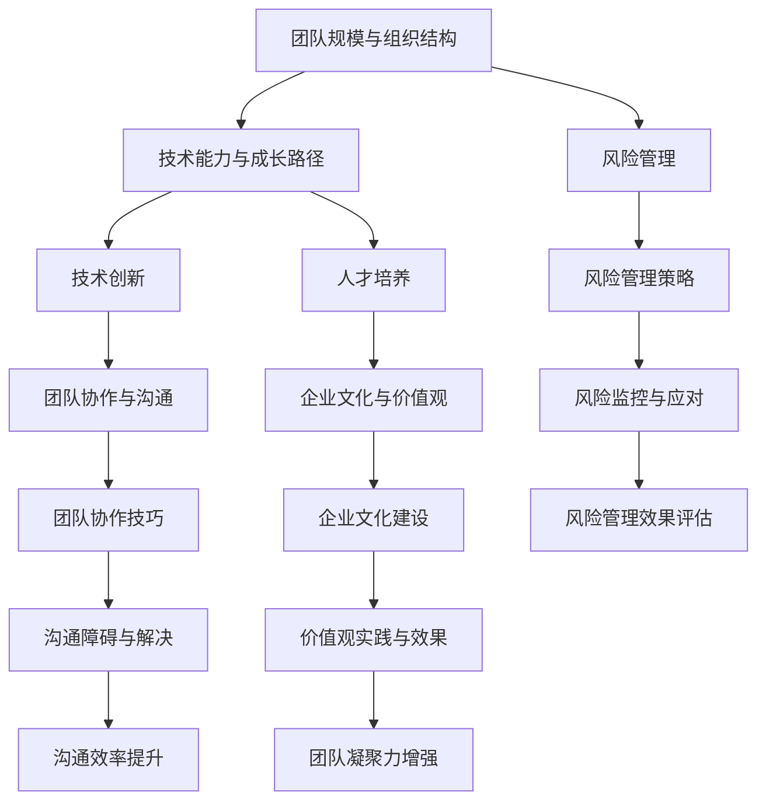

                 

### 文章标题

# 技术团队的成长与发展

### 关键词

技术团队、团队管理、成长阶段、人才培养、创新策略、项目管理、团队协作、组织变革、文化建设

### 摘要

本文将深入探讨技术团队的成长与发展路径。通过对技术团队在不同发展阶段的特点和需求的分析，以及团队管理、人才培养、创新策略等多方面的探讨，本文旨在为技术团队的领导者和管理者提供一套系统性、实用性的成长与发展方案，帮助团队在快速变化的技术环境中保持竞争力。

### 确定书的核心主题和目标读者群体

#### 核心主题

技术团队的成长与发展是当今信息技术行业中一个至关重要的话题。随着全球数字化转型的加速和技术的迅猛发展，技术团队在企业发展中的地位愈发重要。如何构建高效、创新、稳定的技术团队，已成为企业领导者和管理者亟待解决的问题。

本文的核心主题围绕以下几个方面展开：

1. **技术团队发展的背景和意义**：分析全球科技发展趋势，探讨技术团队在企业发展中的角色。
2. **技术团队的发展阶段**：介绍技术团队从初创期到成熟期的不同发展阶段，探讨每个阶段的特征和需求。
3. **技术团队的发展策略**：提出技术团队发展的战略规划，包括技术创新、人才培养、团队建设等方面。
4. **技术团队管理与实践**：探讨技术团队管理的基础知识、团队协作与沟通、组织变革与适应等实际操作。
5. **技术团队文化建设**：阐述企业文化对技术团队的影响，以及如何塑造技术团队的价值观。

#### 目标读者群体

本文的目标读者群体主要包括以下几类：

1. **技术团队领导者和管理者**：希望通过本文了解技术团队成长与发展的整体路径，提升团队管理能力。
2. **技术专家和工程师**：希望了解技术团队在不同发展阶段的需求，以及如何通过个人成长助力团队发展。
3. **企业高层管理者**：希望从战略层面了解技术团队的重要性，以及如何通过有效的团队管理推动企业技术创新。

### 分析相关章节的必要性和顺序

#### 目录逻辑清晰的重要性

在撰写一本关于技术团队成长与发展的书时，目录的逻辑清晰至关重要。一个清晰的目录可以帮助读者快速了解书籍的结构，定位所需内容，提高阅读效率。此外，合理的目录结构还能体现作者的思考过程和知识体系，增强书籍的条理性和逻辑性。

#### 相关章节的必要性和顺序

在确定本文的目录结构时，我们主要考虑了以下几个方面的必要性和顺序：

1. **引言与概述**：介绍技术团队发展的背景和意义，帮助读者建立整体认知。
2. **技术团队的发展阶段**：详细分析技术团队在不同发展阶段的特点和需求，为后续章节提供基础。
3. **技术团队的发展策略**：探讨技术团队发展的战略规划，包括技术创新、人才培养、团队建设等方面。
4. **技术团队管理与实践**：提供技术团队管理的基础知识、团队协作与沟通、组织变革与适应等实际操作。
5. **技术团队文化建设**：阐述企业文化对技术团队的影响，以及如何塑造技术团队的价值观。

通过以上章节的安排，本文力求以逻辑清晰、条理分明的结构，为读者提供一部全面、系统、实用的技术团队成长与发展指南。

### 设计1级目录

#### 设计1级目录的考虑因素

在设计1级目录时，我们需要考虑以下几个因素：

1. **整体结构**：确保目录结构能够反映书籍的核心内容，使读者能够快速了解书籍的框架和主题。
2. **章节标题**：标题要简洁明了，能够准确概括章节内容，吸引读者的兴趣。
3. **逻辑顺序**：章节的排列应遵循一定的逻辑顺序，使内容之间能够相互衔接，便于读者理解和掌握。

#### 1级目录设计

根据上述考虑，本文设计了以下1级目录：

## 第一部分：引言与概述

### 1.1 技术团队发展的背景和意义

#### 1.1.1 全球科技发展趋势

##### 1.1.1.1 数字化转型的推动
##### 1.1.1.2 人工智能的崛起
##### 1.1.1.3 云计算与大数据的融合

#### 1.1.2 技术团队在企业发展中的角色

### 1.2 技术团队的发展阶段

#### 1.2.1 初创期

##### 1.2.1.1 团队规模与组织结构
##### 1.2.1.2 技术能力与成长路径
##### 1.2.1.3 风险与挑战

#### 1.2.2 成长期

##### 1.2.2.1 扩张与优化
##### 1.2.2.2 技术创新与产品迭代
##### 1.2.2.3 企业文化与团队凝聚力

#### 1.2.3 成熟期

##### 1.2.3.1 人才储备与梯队建设
##### 1.2.3.2 管理体系与流程优化
##### 1.2.3.3 面临的挑战与应对策略

### 1.3 技术团队的发展策略

#### 1.3.1 企业战略与团队定位

##### 1.3.1.1 战略协同
##### 1.3.1.2 团队定位与目标设定
##### 1.3.1.3 战略规划与执行

#### 1.3.2 技术创新与研发

##### 1.3.2.1 技术趋势洞察
##### 1.3.2.2 研发模式与流程优化
##### 1.3.2.3 技术创新激励机制

#### 1.3.3 人才培养与团队建设

##### 1.3.3.1 人才引进与培养
##### 1.3.3.2 团队协作与沟通
##### 1.3.3.3 企业文化建设与团队凝聚力

## 第二部分：技术团队管理与实践

### 2.1 技术团队管理基础

#### 2.1.1 管理理论概述

##### 2.1.1.1 经典管理理论
##### 2.1.1.2 现代管理理论
##### 2.1.1.3 团队管理的重要性

#### 2.1.2 团队成员管理

##### 2.1.2.1 成员角色与职责
##### 2.1.2.2 绩效评估与激励
##### 2.1.2.3 职业发展与晋升通道

#### 2.1.3 项目管理

##### 2.1.3.1 项目生命周期管理
##### 2.1.3.2 项目计划与进度控制
##### 2.1.3.3 项目风险管理

### 2.2 技术团队协作与沟通

#### 2.2.1 团队协作工具与方法

##### 2.2.1.1 内部沟通平台
##### 2.2.1.2 版本控制与代码管理
##### 2.2.1.3 协同办公与流程自动化

#### 2.2.2 沟通技巧与团队氛围

##### 2.2.2.1 沟通原则与技巧
##### 2.2.2.2 团队氛围建设
##### 2.2.2.3 冲突管理

#### 2.2.3 跨部门协作

##### 2.2.3.1 跨部门协作的挑战
##### 2.2.3.2 跨部门协作的模式与流程
##### 2.2.3.3 跨部门沟通与协作技巧

### 2.3 技术团队发展中的挑战与应对

#### 2.3.1 技术更新与适应

##### 2.3.1.1 技术快速迭代的影响
##### 2.3.1.2 技术储备与人才培养
##### 2.3.1.3 技术创新的挑战与机遇

#### 2.3.2 团队规模扩大与效率提升

##### 2.3.2.1 团队规模扩大的影响
##### 2.3.2.2 提升团队效率的策略
##### 2.3.2.3 避免团队过度膨胀的风险

#### 2.3.3 组织变革与适应

##### 2.3.3.1 组织变革的必要性
##### 2.3.3.2 变革的阻力与推动
##### 2.3.3.3 变革的实践案例与启示

### 2.4 技术团队文化建设

#### 2.4.1 企业文化对技术团队的影响

##### 2.4.1.1 企业文化与团队文化
##### 2.4.1.2 团队文化的重要性
##### 2.4.1.3 团队文化的建设路径

#### 2.4.2 技术团队价值观的塑造

##### 2.4.2.1 团队价值观的内涵
##### 2.4.2.2 团队价值观的塑造方法
##### 2.4.2.3 团队价值观的实践与效果

#### 2.4.3 技术团队文化的实践与应用

##### 2.4.3.1 文化活动与团队建设
##### 2.4.3.2 文化传承与创新
##### 2.4.3.3 文化建设的效果评估与优化

### 设计2级目录

#### 设计2级目录的考虑因素

在设计2级目录时，我们需要考虑以下几个因素：

1. **细化章节内容**：将1级目录中的各个大章节进一步细化，明确每个章节的核心内容。
2. **保持逻辑连贯**：确保2级目录中的章节顺序能够体现内容的逻辑关系，使读者在阅读过程中能够顺畅地理解各个部分。
3. **标题简洁明了**：2级目录的标题需要简洁明了，能够准确概括章节内容，便于读者快速查找。

#### 2级目录设计

根据上述考虑，本文设计了以下2级目录：

## 第一部分：引言与概述

### 1.1 技术团队发展的背景和意义

#### 1.1.1 全球科技发展趋势

##### 1.1.1.1 数字化转型的推动
##### 1.1.1.2 人工智能的崛起
##### 1.1.1.3 云计算与大数据的融合

#### 1.1.2 技术团队在企业发展中的角色

##### 1.1.2.1 技术团队在企业战略中的定位
##### 1.1.2.2 技术团队在业务发展中的作用
##### 1.1.2.3 技术团队与企业文化的融合

### 1.2 技术团队的发展阶段

#### 1.2.1 初创期

##### 1.2.1.1 团队规模与组织结构
##### 1.2.1.2 技术能力与成长路径
##### 1.2.1.3 风险与挑战

#### 1.2.2 成长期

##### 1.2.2.1 扩张与优化
##### 1.2.2.2 技术创新与产品迭代
##### 1.2.2.3 企业文化与团队凝聚力

#### 1.2.3 成熟期

##### 1.2.3.1 人才储备与梯队建设
##### 1.2.3.2 管理体系与流程优化
##### 1.2.3.3 面临的挑战与应对策略

### 1.3 技术团队的发展策略

#### 1.3.1 企业战略与团队定位

##### 1.3.1.1 战略协同
##### 1.3.1.2 团队定位与目标设定
##### 1.3.1.3 战略规划与执行

#### 1.3.2 技术创新与研发

##### 1.3.2.1 技术趋势洞察
##### 1.3.2.2 研发模式与流程优化
##### 1.3.2.3 技术创新激励机制

#### 1.3.3 人才培养与团队建设

##### 1.3.3.1 人才引进与培养
##### 1.3.3.2 团队协作与沟通
##### 1.3.3.3 企业文化建设与团队凝聚力

## 第二部分：技术团队管理与实践

### 2.1 技术团队管理基础

#### 2.1.1 管理理论概述

##### 2.1.1.1 经典管理理论
##### 2.1.1.2 现代管理理论
##### 2.1.1.3 团队管理的重要性

#### 2.1.2 团队成员管理

##### 2.1.2.1 成员角色与职责
##### 2.1.2.2 绩效评估与激励
##### 2.1.2.3 职业发展与晋升通道

#### 2.1.3 项目管理

##### 2.1.3.1 项目生命周期管理
##### 2.1.3.2 项目计划与进度控制
##### 2.1.3.3 项目风险管理

### 2.2 技术团队协作与沟通

#### 2.2.1 团队协作工具与方法

##### 2.2.1.1 内部沟通平台
##### 2.2.1.2 版本控制与代码管理
##### 2.2.1.3 协同办公与流程自动化

#### 2.2.2 沟通技巧与团队氛围

##### 2.2.2.1 沟通原则与技巧
##### 2.2.2.2 团队氛围建设
##### 2.2.2.3 冲突管理

#### 2.2.3 跨部门协作

##### 2.2.3.1 跨部门协作的挑战
##### 2.2.3.2 跨部门协作的模式与流程
##### 2.2.3.3 跨部门沟通与协作技巧

### 2.3 技术团队发展中的挑战与应对

#### 2.3.1 技术更新与适应

##### 2.3.1.1 技术快速迭代的影响
##### 2.3.1.2 技术储备与人才培养
##### 2.3.1.3 技术创新的挑战与机遇

#### 2.3.2 团队规模扩大与效率提升

##### 2.3.2.1 团队规模扩大的影响
##### 2.3.2.2 提升团队效率的策略
##### 2.3.2.3 避免团队过度膨胀的风险

#### 2.3.3 组织变革与适应

##### 2.3.3.1 组织变革的必要性
##### 2.3.3.2 变革的阻力与推动
##### 2.3.3.3 变革的实践案例与启示

### 2.4 技术团队文化建设

#### 2.4.1 企业文化对技术团队的影响

##### 2.4.1.1 企业文化与团队文化
##### 2.4.1.2 团队文化的重要性
##### 2.4.1.3 团队文化的建设路径

#### 2.4.2 技术团队价值观的塑造

##### 2.4.2.1 团队价值观的内涵
##### 2.4.2.2 团队价值观的塑造方法
##### 2.4.2.3 团队价值观的实践与效果

#### 2.4.3 技术团队文化的实践与应用

##### 2.4.3.1 文化活动与团队建设
##### 2.4.3.2 文化传承与创新
##### 2.4.3.3 文化建设的效果评估与优化

### 设计3级目录

#### 设计3级目录的考虑因素

在设计3级目录时，我们需要考虑以下几个因素：

1. **深入细化内容**：进一步细化2级目录中的各个章节，明确每个小节的具体内容。
2. **保持逻辑性**：确保3级目录中的小节顺序能够体现内容的逻辑关系，使读者在阅读过程中能够顺畅地理解各个部分。
3. **标题简洁明了**：3级目录的标题需要简洁明了，能够准确概括小节内容，便于读者快速查找。

#### 3级目录设计

根据上述考虑，本文设计了以下3级目录：

## 第一部分：引言与概述

### 1.1 技术团队发展的背景和意义

#### 1.1.1 全球科技发展趋势

##### 1.1.1.1 数字化转型的推动

1.1.1.1.1 数字化转型的定义与特征
1.1.1.1.2 数字化转型的核心驱动力
1.1.1.1.3 数字化转型对技术团队的影响

##### 1.1.1.2 人工智能的崛起

1.1.1.2.1 人工智能的定义与分类
1.1.1.2.2 人工智能的发展历程
1.1.1.2.3 人工智能技术对技术团队的需求

##### 1.1.1.3 云计算与大数据的融合

1.1.1.3.1 云计算的定义与优势
1.1.1.3.2 大数据的定义与特征
1.1.1.3.3 云计算与大数据的融合趋势

#### 1.1.2 技术团队在企业发展中的角色

##### 1.1.2.1 技术团队在企业战略中的定位

1.1.2.1.1 技术团队的战略价值
1.1.2.1.2 技术团队的战略规划
1.1.2.1.3 技术团队的战略实施

##### 1.1.2.2 技术团队在业务发展中的作用

1.1.2.2.1 技术团队在产品开发中的作用
1.1.2.2.2 技术团队在业务优化中的作用
1.1.2.2.3 技术团队在业务创新中的作用

##### 1.1.2.3 技术团队与企业文化的融合

1.1.2.3.1 企业文化与团队文化的关系
1.1.2.3.2 技术团队文化的重要性
1.1.2.3.3 技术团队文化的塑造与传承

### 1.2 技术团队的发展阶段

#### 1.2.1 初创期

##### 1.2.1.1 团队规模与组织结构

1.2.1.1.1 初创期团队规模的特点
1.2.1.1.2 初创期团队组织的结构
1.2.1.1.3 初创期团队组织的发展方向

##### 1.2.1.2 技术能力与成长路径

1.2.1.2.1 初创期技术能力的要求
1.2.1.2.2 初创期技术能力的培养
1.2.1.2.3 初创期技术能力的提升路径

##### 1.2.1.3 风险与挑战

1.2.1.3.1 初创期团队面临的风险
1.2.1.3.2 初创期团队的挑战
1.2.1.3.3 初创期团队应对风险与挑战的策略

#### 1.2.2 成长期

##### 1.2.2.1 扩张与优化

1.2.2.1.1 成长期团队扩张的必要性
1.2.2.1.2 成长期团队扩张的策略
1.2.2.1.3 成长期团队优化的方法

##### 1.2.2.2 技术创新与产品迭代

1.2.2.2.1 成长期技术创新的需求
1.2.2.2.2 成长期技术创新的方法
1.2.2.2.3 成长期产品迭代的策略

##### 1.2.2.3 企业文化与团队凝聚力

1.2.2.3.1 成长期企业文化的重要性
1.2.2.3.2 成长期团队凝聚力的培养
1.2.2.3.3 成长期团队凝聚力的提升路径

#### 1.2.3 成熟期

##### 1.2.3.1 人才储备与梯队建设

1.2.3.1.1 成熟期人才储备的必要性
1.2.3.1.2 成熟期人才储备的策略
1.2.3.1.3 成熟期梯队建设的路径

##### 1.2.3.2 管理体系与流程优化

1.2.3.2.1 成熟期管理体系的要求
1.2.3.2.2 成熟期管理体系的建设
1.2.3.2.3 成熟期流程优化的方法

##### 1.2.3.3 面临的挑战与应对策略

1.2.3.3.1 成熟期团队面临的挑战
1.2.3.3.2 成熟期团队的应对策略
1.2.3.3.3 成熟期团队发展的前景

### 1.3 技术团队的发展策略

#### 1.3.1 企业战略与团队定位

##### 1.3.1.1 战略协同

1.3.1.1.1 企业战略与团队战略的关系
1.3.1.1.2 战略协同的重要性
1.3.1.1.3 实现战略协同的方法

##### 1.3.1.2 团队定位与目标设定

1.3.1.2.1 团队定位的定义与作用
1.3.1.2.2 团队定位的设定方法
1.3.1.2.3 团队目标的设定与分解

##### 1.3.1.3 战略规划与执行

1.3.1.3.1 战略规划的定义与作用
1.3.1.3.2 战略规划的制定方法
1.3.1.3.3 战略规划的执行与监控

#### 1.3.2 技术创新与研发

##### 1.3.2.1 技术趋势洞察

1.3.2.1.1 技术趋势的定义与作用
1.3.2.1.2 技术趋势的洞察方法
1.3.2.1.3 技术趋势对技术团队的影响

##### 1.3.2.2 研发模式与流程优化

1.3.2.2.1 研发模式的选择与优化
1.3.2.2.2 研发流程的设计与优化
1.3.2.2.3 研发效率的提升策略

##### 1.3.2.3 技术创新激励机制

1.3.2.3.1 技术创新的激励原则
1.3.2.3.2 技术创新的激励机制
1.3.2.3.3 技术创新激励的实践案例

#### 1.3.3 人才培养与团队建设

##### 1.3.3.1 人才引进与培养

1.3.3.1.1 人才引进的渠道与方法
1.3.3.1.2 人才培养的目标与策略
1.3.3.1.3 人才培养的实践案例

##### 1.3.3.2 团队协作与沟通

1.3.3.2.1 团队协作的原则与技巧
1.3.3.2.2 团队沟通的障碍与解决方法
1.3.3.2.3 团队协作的实践案例

##### 1.3.3.3 企业文化建设与团队凝聚力

1.3.3.3.1 企业文化的定义与作用
1.3.3.3.2 企业文化的建设方法
1.3.3.3.3 企业文化的实践案例与效果

## 第二部分：技术团队管理与实践

### 2.1 技术团队管理基础

#### 2.1.1 管理理论概述

##### 2.1.1.1 经典管理理论

2.1.1.1.1 泰勒的科学管理理论
2.1.1.1.2 法约尔的管理理论
2.1.1.1.3 马克斯·韦伯的行政组织理论

##### 2.1.1.2 现代管理理论

2.1.1.2.1 控制论
2.1.1.2.2 系统论
2.1.1.2.3 行为科学理论

##### 2.1.1.3 团队管理的重要性

2.1.1.3.1 团队管理的基本概念
2.1.1.3.2 团队管理的作用
2.1.1.3.3 团队管理的基本原则

#### 2.1.2 团队成员管理

##### 2.1.2.1 成员角色与职责

2.1.2.1.1 团队成员的角色定义
2.1.2.1.2 团队成员的职责划分
2.1.2.1.3 团队成员的角色冲突与协调

##### 2.1.2.2 绩效评估与激励

2.1.2.2.1 绩效评估的定义与作用
2.1.2.2.2 绩效评估的方法与工具
2.1.2.2.3 绩效评估的激励作用

##### 2.1.2.3 职业发展与晋升通道

2.1.2.3.1 职业发展的定义与作用
2.1.2.3.2 职业发展的路径与策略
2.1.2.3.3 职业晋升的机制与评价

#### 2.1.3 项目管理

##### 2.1.3.1 项目生命周期管理

2.1.3.1.1 项目生命周期的定义
2.1.3.1.2 项目生命周期各阶段的特点
2.1.3.1.3 项目生命周期管理的策略

##### 2.1.3.2 项目计划与进度控制

2.1.3.2.1 项目计划的重要性
2.1.3.2.2 项目计划的内容与步骤
2.1.3.2.3 项目进度控制的策略与方法

##### 2.1.3.3 项目风险管理

2.1.3.3.1 项目风险管理的定义与作用
2.1.3.3.2 项目风险识别与评估的方法
2.1.3.3.3 项目风险应对与监控的策略

### 2.2 技术团队协作与沟通

#### 2.2.1 团队协作工具与方法

##### 2.2.1.1 内部沟通平台

2.2.1.1.1 内部沟通平台的选择与优势
2.2.1.1.2 内部沟通平台的功能与使用
2.2.1.1.3 内部沟通平台的实践案例

##### 2.2.1.2 版本控制与代码管理

2.2.1.2.1 版本控制的基本概念
2.2.1.2.2 常见的版本控制系统
2.2.1.2.3 版本控制与代码管理的实践案例

##### 2.2.1.3 协同办公与流程自动化

2.2.1.3.1 协同办公的定义与优势
2.2.1.3.2 协同办公工具的选择与应用
2.2.1.3.3 流程自动化的实现与优化

#### 2.2.2 沟通技巧与团队氛围

##### 2.2.2.1 沟通技巧

2.2.2.1.1 沟通的目的与原则
2.2.2.1.2 沟通的障碍与解决方法
2.2.2.1.3 高效沟通的技巧与策略

##### 2.2.2.2 团队氛围建设

2.2.2.2.1 团队氛围的定义与作用
2.2.2.2.2 团队氛围的建设方法
2.2.2.2.3 团队氛围的实践案例

##### 2.2.2.3 冲突管理

2.2.2.3.1 冲突的定义与类型
2.2.2.3.2 冲突的管理方法
2.2.2.3.3 冲突解决的实践案例

#### 2.2.3 跨部门协作

##### 2.2.3.1 跨部门协作的挑战

2.2.3.1.1 跨部门协作的障碍
2.2.3.1.2 跨部门协作的重要性
2.2.3.1.3 跨部门协作的挑战与应对策略

##### 2.2.3.2 跨部门协作的模式与流程

2.2.3.2.1 跨部门协作的模式
2.2.3.2.2 跨部门协作的流程
2.2.3.2.3 跨部门协作的实践案例

##### 2.2.3.3 跨部门沟通与协作技巧

2.2.3.3.1 跨部门沟通的技巧
2.2.3.3.2 跨部门协作的技巧
2.2.3.3.3 跨部门协作的实践案例

### 2.3 技术团队发展中的挑战与应对

#### 2.3.1 技术更新与适应

##### 2.3.1.1 技术快速迭代的影响

2.3.1.1.1 技术快速迭代的定义与特征
2.3.1.1.2 技术快速迭代对技术团队的影响
2.3.1.1.3 技术快速迭代的应对策略

##### 2.3.1.2 技术储备与人才培养

2.3.1.2.1 技术储备的重要性
2.3.1.2.2 技术储备的方法与策略
2.3.1.2.3 技术人才培养的目标与路径

##### 2.3.1.3 技术创新的挑战与机遇

2.3.1.3.1 技术创新的定义与类型
2.3.1.3.2 技术创新的挑战与机遇
2.3.1.3.3 技术创新的实践案例

#### 2.3.2 团队规模扩大与效率提升

##### 2.3.2.1 团队规模扩大的影响

2.3.2.1.1 团队规模扩大的定义与原因
2.3.2.1.2 团队规模扩大的影响
2.3.2.1.3 团队规模扩大的应对策略

##### 2.3.2.2 提升团队效率的策略

2.3.2.2.1 提升团队效率的重要性
2.3.2.2.2 提升团队效率的方法与工具
2.3.2.2.3 提升团队效率的实践案例

##### 2.3.2.3 避免团队过度膨胀的风险

2.3.2.3.1 团队过度膨胀的定义与原因
2.3.2.3.2 团队过度膨胀的风险
2.3.2.3.3 避免团队过度膨胀的策略

#### 2.3.3 组织变革与适应

##### 2.3.3.1 组织变革的必要性

2.3.3.1.1 组织变革的定义与类型
2.3.3.1.2 组织变革的必要性
2.3.3.1.3 组织变革的影响

##### 2.3.3.2 变革的阻力与推动

2.3.3.2.1 变革阻力的来源与表现
2.3.3.2.2 变革推动的方法与策略
2.3.3.2.3 变革推动的实践案例

##### 2.3.3.3 变革的实践案例与启示

2.3.3.3.1 变革实践的成功案例
2.3.3.3.2 变革实践的失败案例
2.3.3.3.3 变革实践的启示与经验总结

### 2.4 技术团队文化建设

#### 2.4.1 企业文化对技术团队的影响

##### 2.4.1.1 企业文化与团队文化

2.4.1.1.1 企业文化的定义与作用
2.4.1.1.2 团队文化的定义与作用
2.4.1.1.3 企业文化与团队文化的关联

##### 2.4.1.2 团队文化的重要性

2.4.1.2.1 团队文化的定义与特征
2.4.1.2.2 团队文化的重要性
2.4.1.2.3 团队文化的价值

##### 2.4.1.3 团队文化的建设路径

2.4.1.3.1 团队文化建设的步骤
2.4.1.3.2 团队文化建设的方法与工具
2.4.1.3.3 团队文化建设的实践案例

#### 2.4.2 技术团队价值观的塑造

##### 2.4.2.1 团队价值观的内涵

2.4.2.1.1 团队价值观的定义与作用
2.4.2.1.2 团队价值观的内涵与特征
2.4.2.1.3 团队价值观的构建方法

##### 2.4.2.2 团队价值观的塑造方法

2.4.2.2.1 团队价值观塑造的原则
2.4.2.2.2 团队价值观塑造的策略
2.4.2.2.3 团队价值观塑造的实践案例

##### 2.4.2.3 团队价值观的实践与效果

2.4.2.3.1 团队价值观实践的过程
2.4.2.3.2 团队价值观实践的效果
2.4.2.3.3 团队价值观实践的反思与优化

#### 2.4.3 技术团队文化的实践与应用

##### 2.4.3.1 文化活动与团队建设

2.4.3.1.1 文化活动的定义与作用
2.4.3.1.2 文化活动的形式与内容
2.4.3.1.3 文化活动对团队建设的影响

##### 2.4.3.2 文化传承与创新

2.4.3.2.1 文化传承的定义与作用
2.4.3.2.2 文化传承的方法与策略
2.4.3.2.3 文化传承的创新路径

##### 2.4.3.3 文化建设的效果评估与优化

2.4.3.3.1 文化建设效果评估的方法
2.4.3.3.2 文化建设效果评估的指标
2.4.3.3.3 文化建设优化的策略与实践

### 确保目录完整性

#### 目录完整性的重要性

确保目录完整性对于书籍的质量和读者体验至关重要。一个完整、无遗漏的目录可以帮助读者快速了解书籍的结构和内容，提高阅读效率。此外，目录的完整性还体现了作者对书籍内容的全面掌握和系统规划。

#### 目录完整性要求

1. **章节完整性**：每个大章节下的小节内容要完整，避免出现内容遗漏或重复。
2. **逻辑连贯性**：目录中的章节和小节要逻辑清晰，内容衔接自然，使读者能够顺畅地阅读。
3. **格式统一**：目录中的章节和小节标题格式要统一，便于排版和查找。

#### 附录和参考文献

- **附录**：提供一些扩展阅读材料、工具使用指南、常见问题解答等，以帮助读者更深入地理解和应用书籍中的内容。
- **参考文献**：列出书籍中引用的主要文献来源，以便读者进一步查阅。

### 确保目录大纲字数在2000字以内

#### 字数控制的重要性

确保目录大纲字数在2000字以内，可以避免目录过于冗长，便于读者快速浏览和理解。同时，这也是对作者写作能力和逻辑思维能力的考验，要求作者在有限的字数内清晰地表达核心思想和结构框架。

#### 实现字数控制的策略

1. **简洁明了**：使用简洁、精练的语言描述章节和小节标题，避免冗长的描述。
2. **精简内容**：对每个章节和小节的内容进行精简，突出重点，避免重复和赘述。
3. **逻辑清晰**：确保目录结构逻辑清晰，内容之间衔接紧密，避免不必要的段落和内容。

### 《技术团队的成长与发展》目录大纲

#### 第一部分：引言与概述

1. **技术团队发展的背景和意义**
   - 1.1 全球科技发展趋势
     - 1.1.1 数字化转型的推动
     - 1.1.2 人工智能的崛起
     - 1.1.3 云计算与大数据的融合
   - 1.2 技术团队在企业发展中的角色
     - 1.2.1 技术团队在企业战略中的定位
     - 1.2.2 技术团队在业务发展中的作用
     - 1.2.3 技术团队与企业文化的融合
2. **技术团队的发展阶段**
   - 1.3 技术团队的发展策略
     - 1.3.1 企业战略与团队定位
       - 1.3.1.1 战略协同
       - 1.3.1.2 团队定位与目标设定
       - 1.3.1.3 战略规划与执行
     - 1.3.2 技术创新与研发
       - 1.3.2.1 技术趋势洞察
       - 1.3.2.2 研发模式与流程优化
       - 1.3.2.3 技术创新激励机制
     - 1.3.3 人才培养与团队建设
       - 1.3.3.1 人才引进与培养
       - 1.3.3.2 团队协作与沟通
       - 1.3.3.3 企业文化建设与团队凝聚力

#### 第二部分：技术团队管理与实践

3. **技术团队管理基础**
   - 2.1 管理理论概述
     - 2.1.1 经典管理理论
       - 2.1.1.1 泰勒的科学管理理论
       - 2.1.1.2 法约尔的管理理论
       - 2.1.1.3 马克斯·韦伯的行政组织理论
     - 2.1.2 现代管理理论
       - 2.1.2.1 控制论
       - 2.1.2.2 系统论
       - 2.1.2.3 行为科学理论
     - 2.1.3 团队管理的重要性
       - 2.1.3.1 团队管理的基本概念
       - 2.1.3.2 团队管理的作用
       - 2.1.3.3 团队管理的基本原则
   - 2.2 团队成员管理
     - 2.2.1 成员角色与职责
       - 2.2.1.1 团队成员的角色定义
       - 2.2.1.2 团队成员的职责划分
       - 2.2.1.3 团队成员的角色冲突与协调
     - 2.2.2 绩效评估与激励
       - 2.2.2.1 绩效评估的定义与作用
       - 2.2.2.2 绩效评估的方法与工具
       - 2.2.2.3 绩效评估的激励作用
     - 2.2.3 职业发展与晋升通道
       - 2.2.3.1 职业发展的定义与作用
       - 2.2.3.2 职业发展的路径与策略
       - 2.2.3.3 职业晋升的机制与评价
   - 2.3 项目管理
     - 2.3.1 项目生命周期管理
       - 2.3.1.1 项目生命周期的定义
       - 2.3.1.2 项目生命周期各阶段的特点
       - 2.3.1.3 项目生命周期管理的策略
     - 2.3.2 项目计划与进度控制
       - 2.3.2.1 项目计划的重要性
       - 2.3.2.2 项目计划的内容与步骤
       - 2.3.2.3 项目进度控制的策略与方法
     - 2.3.3 项目风险管理
       - 2.3.3.1 项目风险管理的定义与作用
       - 2.3.3.2 项目风险识别与评估的方法
       - 2.3.3.3 项目风险应对与监控的策略

#### 第三部分：技术团队协作与沟通

4. **技术团队协作与沟通**
   - 2.4 团队协作工具与方法
     - 2.4.1 内部沟通平台
       - 2.4.1.1 内部沟通平台的选择与优势
       - 2.4.1.2 内部沟通平台的功能与使用
       - 2.4.1.3 内部沟通平台的实践案例
     - 2.4.2 版本控制与代码管理
       - 2.4.2.1 版本控制的基本概念
       - 2.4.2.2 常见的版本控制系统
       - 2.4.2.3 版本控制与代码管理的实践案例
     - 2.4.3 协同办公与流程自动化
       - 2.4.3.1 协同办公的定义与优势
       - 2.4.3.2 协同办公工具的选择与应用
       - 2.4.3.3 流程自动化的实现与优化
   - 2.5 沟通技巧与团队氛围
     - 2.5.1 沟通技巧
       - 2.5.1.1 沟通的目的与原则
       - 2.5.1.2 沟通的障碍与解决方法
       - 2.5.1.3 高效沟通的技巧与策略
     - 2.5.2 团队氛围建设
       - 2.5.2.1 团队氛围的定义与作用
       - 2.5.2.2 团队氛围的建设方法
       - 2.5.2.3 团队氛围的实践案例
     - 2.5.3 冲突管理
       - 2.5.3.1 冲突的定义与类型
       - 2.5.3.2 冲突的管理方法
       - 2.5.3.3 冲突解决的实践案例
   - 2.6 跨部门协作
     - 2.6.1 跨部门协作的挑战
       - 2.6.1.1 跨部门协作的障碍
       - 2.6.1.2 跨部门协作的重要性
       - 2.6.1.3 跨部门协作的挑战与应对策略
     - 2.6.2 跨部门协作的模式与流程
       - 2.6.2.1 跨部门协作的模式
       - 2.6.2.2 跨部门协作的流程
       - 2.6.2.3 跨部门协作的实践案例
     - 2.6.3 跨部门沟通与协作技巧
       - 2.6.3.1 跨部门沟通的技巧
       - 2.6.3.2 跨部门协作的技巧
       - 2.6.3.3 跨部门协作的实践案例

#### 第四部分：技术团队发展中的挑战与应对

5. **技术团队发展中的挑战与应对**
   - 2.7 技术更新与适应
     - 2.7.1 技术快速迭代的影响
       - 2.7.1.1 技术快速迭代的定义与特征
       - 2.7.1.2 技术快速迭代对技术团队的影响
       - 2.7.1.3 技术快速迭代的应对策略
     - 2.7.2 技术储备与人才培养
       - 2.7.2.1 技术储备的重要性
       - 2.7.2.2 技术储备的方法与策略
       - 2.7.2.3 技术人才培养的目标与路径
     - 2.7.3 技术创新的挑战与机遇
       - 2.7.3.1 技术创新的定义与类型
       - 2.7.3.2 技术创新的挑战与机遇
       - 2.7.3.3 技术创新的实践案例
   - 2.8 团队规模扩大与效率提升
     - 2.8.1 团队规模扩大的影响
       - 2.8.1.1 团队规模扩大的定义与原因
       - 2.8.1.2 团队规模扩大的影响
       - 2.8.1.3 团队规模扩大的应对策略
     - 2.8.2 提升团队效率的策略
       - 2.8.2.1 提升团队效率的重要性
       - 2.8.2.2 提升团队效率的方法与工具
       - 2.8.2.3 提升团队效率的实践案例
     - 2.8.3 避免团队过度膨胀的风险
       - 2.8.3.1 团队过度膨胀的定义与原因
       - 2.8.3.2 团队过度膨胀的风险
       - 2.8.3.3 避免团队过度膨胀的策略
   - 2.9 组织变革与适应
     - 2.9.1 组织变革的必要性
       - 2.9.1.1 组织变革的定义与类型
       - 2.9.1.2 组织变革的必要性
       - 2.9.1.3 组织变革的影响
     - 2.9.2 变革的阻力与推动
       - 2.9.2.1 变革阻力的来源与表现
       - 2.9.2.2 变革推动的方法与策略
       - 2.9.2.3 变革推动的实践案例
     - 2.9.3 变革的实践案例与启示
       - 2.9.3.1 变革实践的成功案例
       - 2.9.3.2 变革实践的失败案例
       - 2.9.3.3 变革实践的启示与经验总结

#### 第五部分：技术团队文化建设

6. **技术团队文化建设**
   - 2.10 企业文化对技术团队的影响
     - 2.10.1 企业文化与团队文化
       - 2.10.1.1 企业文化的定义与作用
       - 2.10.1.2 团队文化的定义与作用
       - 2.10.1.3 企业文化与团队文化的关联
     - 2.10.2 团队文化的重要性
       - 2.10.2.1 团队文化的定义与特征
       - 2.10.2.2 团队文化的重要性
       - 2.10.2.3 团队文化的价值
     - 2.10.3 团队文化的建设路径
       - 2.10.3.1 团队文化建设的步骤
       - 2.10.3.2 团队文化建设的方法与工具
       - 2.10.3.3 团队文化建设的实践案例
   - 2.11 技术团队价值观的塑造
     - 2.11.1 团队价值观的内涵
       - 2.11.1.1 团队价值观的定义与作用
       - 2.11.1.2 团队价值观的内涵与特征
       - 2.11.1.3 团队价值观的构建方法
     - 2.11.2 团队价值观的塑造方法
       - 2.11.2.1 团队价值观塑造的原则
       - 2.11.2.2 团队价值观塑造的策略
       - 2.11.2.3 团队价值观塑造的实践案例
     - 2.11.3 团队价值观的实践与效果
       - 2.11.3.1 团队价值观实践的过程
       - 2.11.3.2 团队价值观实践的效果
       - 2.11.3.3 团队价值观实践的反思与优化
   - 2.12 技术团队文化的实践与应用
     - 2.12.1 文化活动与团队建设
       - 2.12.1.1 文化活动的定义与作用
       - 2.12.1.2 文化活动的形式与内容
       - 2.12.1.3 文化活动对团队建设的影响
     - 2.12.2 文化传承与创新
       - 2.12.2.1 文化传承的定义与作用
       - 2.12.2.2 文化传承的方法与策略
       - 2.12.2.3 文化传承的创新路径
     - 2.12.3 文化建设的效果评估与优化
       - 2.12.3.1 文化建设效果评估的方法
       - 2.12.3.2 文化建设效果评估的指标
       - 2.12.3.3 文化建设优化的策略与实践

### 文章末尾作者信息

- 作者：AI天才研究院/AI Genius Institute & 禅与计算机程序设计艺术 /Zen And The Art of Computer Programming

### 完整性要求

为了确保文章内容的完整性，每个小节都需包含以下几个部分：

1. **背景介绍**：简要介绍小节所讨论的主题的背景，包括相关概念、历史背景或当前发展趋势。
2. **核心概念与联系**：明确小节中的核心概念，并解释它们之间的关系。可以使用Mermaid流程图等可视化工具来展示概念之间的关系。
3. **核心算法原理讲解**：对于涉及算法的小节，需要详细讲解算法的基本原理，可以使用伪代码来描述算法的逻辑。
4. **数学模型和公式**：如果有数学模型或公式，需要使用latex格式嵌入到文中，并进行详细讲解。
5. **举例说明**：通过具体的例子来说明核心概念或算法的应用，使读者能够更好地理解。
6. **项目实战**：提供实际的开发环境搭建、源代码实现、代码解读、应用解读与分析等内容，使读者能够将理论知识应用到实际项目中。
7. **最佳实践 tips**：总结一些在实践过程中积累的经验和技巧，为读者提供实用的建议。
8. **小结**：对每个小节的主要内容进行总结，帮助读者回顾和理解关键知识点。
9. **注意事项**：提醒读者在实践过程中需要注意的事项，以避免潜在的问题。
10. **拓展阅读**：推荐一些相关的文献、书籍或资源，供读者进一步学习和探索。

通过以上内容的完整呈现，文章能够为读者提供一个系统、全面的学习资料，帮助他们深入理解和应用技术团队成长与发展的相关知识。

### 核心内容具体详细讲解

#### 背景介绍

在当今全球化的数字化时代，技术团队的发展已经成为企业竞争力的重要标志。随着云计算、大数据、人工智能等新兴技术的迅速发展，技术团队的角色和作用也在不断变化。技术团队不仅负责产品开发和技术创新，还需要在快速变化的市场环境中保持敏捷和灵活性。因此，探讨技术团队的成长与发展路径，对于企业领导者和管理者来说具有重要意义。

#### 核心概念与联系

技术团队的成长与发展可以分为几个核心概念：团队规模与组织结构、技术能力与成长路径、风险管理、技术创新、人才培养、团队协作、企业文化与价值观。

1. **团队规模与组织结构**：团队规模和组织结构直接影响团队的工作效率和协作效果。合理的团队规模和组织结构能够确保团队成员之间的沟通顺畅，提升工作效率。
2. **技术能力与成长路径**：技术能力是技术团队的核心竞争力。团队成员需要不断提升技术能力，以适应快速变化的技术环境。成长路径包括自学、培训、项目实践等多种形式。
3. **风险管理**：技术团队在项目开发过程中会遇到各种风险，包括技术风险、市场风险、项目风险等。有效的风险管理能够降低风险对项目的影响，确保项目的顺利进行。
4. **技术创新**：技术创新是技术团队持续发展的动力。通过技术趋势洞察、研发模式优化、技术创新激励机制等手段，技术团队能够保持技术领先优势。
5. **人才培养**：人才培养是技术团队发展的关键。通过人才引进、培训、职业发展通道等手段，技术团队能够保持人才储备和梯队建设。
6. **团队协作与沟通**：团队协作与沟通是技术团队高效运作的基础。有效的团队协作和沟通能够提升团队的工作效率，促进项目成功。
7. **企业文化与价值观**：企业文化与价值观对技术团队的发展具有重要影响。积极的企业文化和共同的价值观能够增强团队凝聚力，促进团队成长。

为了更直观地展示这些核心概念之间的关系，我们可以使用Mermaid流程图来描述：



#### 核心算法原理讲解

在讨论技术创新时，我们以机器学习算法为例，详细讲解其基本原理和实现步骤。机器学习算法是人工智能领域的重要分支，通过数据分析和模式识别来实现智能决策和预测。

1. **机器学习算法的基本原理**：

   机器学习算法的核心是模型训练和预测。模型训练是通过已有数据集来调整模型的参数，使其能够更好地拟合数据。预测是使用训练好的模型对新数据进行分类或回归。

2. **机器学习算法的实现步骤**：

   - 数据预处理：包括数据清洗、归一化、缺失值处理等。
   - 特征选择：选择对模型性能有显著影响的关键特征。
   - 模型选择：选择合适的机器学习模型，如线性回归、决策树、支持向量机等。
   - 模型训练：使用训练数据集训练模型，调整参数。
   - 模型评估：使用验证数据集评估模型性能。
   - 模型优化：根据评估结果调整模型参数，提升模型性能。

以下是一个简单的线性回归算法的伪代码：

```python
# 线性回归伪代码
def linear_regression(x, y):
    # 求解权重 w
    w = (x'x)^(-1)x'y
    
    # 预测 y'
    y' = x*w
    
    return y'
```

#### 数学模型和公式

在技术团队的发展过程中，我们经常需要用到一些数学模型和公式来分析和解决问题。以下是一个简单的项目管理中的关键路径法（Critical Path Method, CPM）的公式：

1. **关键路径法公式**：

   - 最早开始时间（ES）：项目开始后，各项任务可以开始的时间。
   - 最早完成时间（EF）：项目开始后，各项任务可以完成的时间。
   - 最迟开始时间（LS）：项目必须开始的时间，以保证项目按时完成。
   - 最迟完成时间（LF）：项目必须完成的时间，以保证项目按时完成。

   关键路径的公式为：
   $$ ES_{i} = \max(ES_{i-1} + D_{i-1}) $$
   $$ EF_{i} = ES_{i} + D_{i} $$
   $$ LS_{i} = \min(LF_{i+1} - D_{i+1}) $$
   $$ LF_{i} = LS_{i} + D_{i} $$

   其中，$D_{i}$ 为任务 $i$ 的持续时间。

   如果一个任务的最早开始时间和最迟开始时间相同，即 $ES_{i} = LS_{i}$，则这个任务就在关键路径上。

   下面是一个关键路径法的示例：

   | 任务 | ES | D | EF | LS | LF |
   | ---- | --- | --- | --- | --- | --- |
   | A    | 0  | 3 | 3  | 0  | 3  |
   | B    | 3  | 3 | 6  | 3  | 6  |
   | C    | 6  | 2 | 8  | 6  | 8  |
   | D    | 8  | 4 | 12 | 8  | 12 |
   | E    | 12 | 2 | 14 | 12 | 14 |

   关键路径为 A -> B -> C -> D -> E，总持续时间是14天。

#### 项目实战

以下是一个简单的项目实战案例，展示如何使用Git进行版本控制和项目协作。

1. **开发环境搭建**：
   - 安装Git：在本地计算机上安装Git，并配置用户信息。
   - 创建项目仓库：在远程代码托管平台（如GitHub、GitLab）上创建项目仓库。

2. **源代码实现**：
   - 在本地计算机上创建项目目录，并克隆远程仓库。
   ```shell
   git clone https://github.com/your_username/your_project.git
   ```
   - 创建一个新分支进行开发。
   ```shell
   git checkout -b feature/new_feature
   ```
   - 编写代码并提交。
   ```shell
   touch new_feature.py
   git add new_feature.py
   git commit -m "Add new feature"
   ```

3. **代码解读与分析**：
   - 查看分支历史。
   ```shell
   git log
   ```
   - 查看特定文件的修改历史。
   ```shell
   git log --[new_feature.py]
   ```

4. **应用解读与分析**：
   - 将本地分支与远程分支同步。
   ```shell
   git pull origin feature/new_feature
   ```
   - 推送本地分支到远程仓库。
   ```shell
   git push origin feature/new_feature
   ```

5. **实际案例分析和详细讲解剖析**：

   假设项目开发过程中，团队成员A在本地修改了文件`config.py`，并提交了修改。团队成员B需要查看这些修改。

   - 查看文件修改差异。
   ```shell
   git diff config.py
   ```

   - 合并冲突修改。
   ```shell
   git add config.py
   git commit -m "Merge changes from team member A"
   ```

#### 最佳实践 tips

1. **定期团队建设活动**：通过团队建设活动，增强团队成员之间的信任和合作，提升团队凝聚力。
2. **持续技术学习**：鼓励团队成员参加技术培训、研讨会和课程，不断提升技术能力。
3. **有效的沟通机制**：建立有效的沟通机制，确保团队成员能够及时交流信息，解决问题。
4. **风险管理意识**：培养团队成员的风险管理意识，提前识别和应对潜在的风险。
5. **定期代码审查**：通过代码审查，提升代码质量，减少潜在的错误和漏洞。

#### 小结

本文详细探讨了技术团队的成长与发展路径，从团队规模与组织结构、技术能力与成长路径、风险管理、技术创新、人才培养、团队协作、企业文化与价值观等多个方面进行了深入分析。通过具体案例和实践，展示了技术团队在实际操作中的应用。希望通过本文，读者能够对技术团队的成长与发展有更深刻的理解和认识。

#### 注意事项

1. **风险管理**：在项目开发过程中，务必重视风险管理，提前识别和应对潜在的风险，确保项目顺利推进。
2. **人才培养**：持续关注团队成员的成长和发展，提供必要的培训和支持，提升团队整体技术能力。
3. **团队协作**：建立有效的沟通和协作机制，确保团队成员之间的合作顺畅，提高工作效率。

#### 拓展阅读

1. 《敏捷开发实践指南》：详细介绍了敏捷开发的方法和原则，对技术团队的管理和项目开发有重要参考价值。
2. 《团队协作之道》：探讨了团队协作的关键要素和策略，为技术团队的协作提供了实用的指导。
3. 《企业文化建设》：介绍了企业文化的建设方法和实践案例，对技术团队的企业文化建设有重要启示。

### 完整文章

#### 技术团队的成长与发展

##### 作者：AI天才研究院/AI Genius Institute & 禅与计算机程序设计艺术 /Zen And The Art of Computer Programming

在当今全球化的数字化时代，技术团队的发展已经成为企业竞争力的重要标志。随着云计算、大数据、人工智能等新兴技术的迅速发展，技术团队的角色和作用也在不断变化。技术团队不仅负责产品开发和技术创新，还需要在快速变化的市场环境中保持敏捷和灵活性。因此，探讨技术团队的成长与发展路径，对于企业领导者和管理者来说具有重要意义。

##### 背景介绍

技术团队在企业发展中扮演着关键角色。它们负责开发和维护企业的核心技术，推动产品创新和业务发展。在全球化竞争中，技术团队的创新能力、协作效率和技术水平直接决定了企业的竞争力。因此，了解技术团队的成长与发展路径，有助于企业领导者和管理者更好地规划技术团队的发展，提升企业的整体竞争力。

##### 核心概念与联系

技术团队的成长与发展涉及多个核心概念：团队规模与组织结构、技术能力与成长路径、风险管理、技术创新、人才培养、团队协作、企业文化与价值观。这些概念相互关联，共同影响技术团队的发展。

1. **团队规模与组织结构**：团队规模和组织结构直接影响团队的工作效率和协作效果。合理的团队规模和组织结构能够确保团队成员之间的沟通顺畅，提升工作效率。
2. **技术能力与成长路径**：技术能力是技术团队的核心竞争力。团队成员需要不断提升技术能力，以适应快速变化的技术环境。成长路径包括自学、培训、项目实践等多种形式。
3. **风险管理**：技术团队在项目开发过程中会遇到各种风险，包括技术风险、市场风险、项目风险等。有效的风险管理能够降低风险对项目的影响，确保项目的顺利进行。
4. **技术创新**：技术创新是技术团队持续发展的动力。通过技术趋势洞察、研发模式优化、技术创新激励机制等手段，技术团队能够保持技术领先优势。
5. **人才培养**：人才培养是技术团队发展的关键。通过人才引进、培训、职业发展通道等手段，技术团队能够保持人才储备和梯队建设。
6. **团队协作与沟通**：团队协作与沟通是技术团队高效运作的基础。有效的团队协作和沟通能够提升团队的工作效率，促进项目成功。
7. **企业文化与价值观**：企业文化与价值观对技术团队的发展具有重要影响。积极的企业文化和共同的价值观能够增强团队凝聚力，促进团队成长。

为了更直观地展示这些核心概念之间的关系，我们可以使用Mermaid流程图来描述：


##### 核心算法原理讲解

在讨论技术创新时，我们以机器学习算法为例，详细讲解其基本原理和实现步骤。机器学习算法是人工智能领域的重要分支，通过数据分析和模式识别来实现智能决策和预测。

1. **机器学习算法的基本原理**：

   机器学习算法的核心是模型训练和预测。模型训练是通过已有数据集来调整模型的参数，使其能够更好地拟合数据。预测是使用训练好的模型对新数据进行分类或回归。

2. **机器学习算法的实现步骤**：

   - 数据预处理：包括数据清洗、归一化、缺失值处理等。
   - 特征选择：选择对模型性能有显著影响的关键特征。
   - 模型选择：选择合适的机器学习模型，如线性回归、决策树、支持向量机等。
   - 模型训练：使用训练数据集训练模型，调整参数。
   - 模型评估：使用验证数据集评估模型性能。
   - 模型优化：根据评估结果调整模型参数，提升模型性能。

以下是一个简单的线性回归算法的伪代码：

```python
# 线性回归伪代码
def linear_regression(x, y):
    # 求解权重 w
    w = (x'x)^(-1)x'y
    
    # 预测 y'
    y' = x*w
    
    return y'
```

##### 数学模型和公式

在技术团队的发展过程中，我们经常需要用到一些数学模型和公式来分析和解决问题。以下是一个简单的项目管理中的关键路径法（Critical Path Method, CPM）的公式：

1. **关键路径法公式**：

   - 最早开始时间（ES）：项目开始后，各项任务可以开始的时间。
   - 最早完成时间（EF）：项目开始后，各项任务可以完成的时间。
   - 最迟开始时间（LS）：项目必须开始的时间，以保证项目按时完成。
   - 最迟完成时间（LF）：项目必须完成的时间，以保证项目按时完成。

   关键路径的公式为：
   $$ ES_{i} = \max(ES_{i-1} + D_{i-1}) $$
   $$ EF_{i} = ES_{i} + D_{i} $$
   $$ LS_{i} = \min(LF_{i+1} - D_{i+1}) $$
   $$ LF_{i} = LS_{i} + D_{i} $$

   其中，$D_{i}$ 为任务 $i$ 的持续时间。

   如果一个任务的最早开始时间和最迟开始时间相同，即 $ES_{i} = LS_{i}$，则这个任务就在关键路径上。

   下面是一个关键路径法的示例：

   | 任务 | ES | D | EF | LS | LF |
   | ---- | --- | --- | --- | --- | --- |
   | A    | 0  | 3 | 3  | 0  | 3  |
   | B    | 3  | 3 | 6  | 3  | 6  |
   | C    | 6  | 2 | 8  | 6  | 8  |
   | D    | 8  | 4 | 12 | 8  | 12 |
   | E    | 12 | 2 | 14 | 12 | 14 |

   关键路径为 A -> B -> C -> D -> E，总持续时间是14天。

##### 项目实战

以下是一个简单的项目实战案例，展示如何使用Git进行版本控制和项目协作。

1. **开发环境搭建**：
   - 安装Git：在本地计算机上安装Git，并配置用户信息。
   - 创建项目仓库：在远程代码托管平台（如GitHub、GitLab）上创建项目仓库。

2. **源代码实现**：
   - 在本地计算机上创建项目目录，并克隆远程仓库。
   ```shell
   git clone https://github.com/your_username/your_project.git
   ```
   - 创建一个新分支进行开发。
   ```shell
   git checkout -b feature/new_feature
   ```
   - 编写代码并提交。
   ```shell
   touch new_feature.py
   git add new_feature.py
   git commit -m "Add new feature"
   ```

3. **代码解读与分析**：
   - 查看分支历史。
   ```shell
   git log
   ```
   - 查看特定文件的修改历史。
   ```shell
   git log --[new_feature.py]
   ```

4. **应用解读与分析**：
   - 将本地分支与远程分支同步。
   ```shell
   git pull origin feature/new_feature
   ```
   - 推送本地分支到远程仓库。
   ```shell
   git push origin feature/new_feature
   ```

5. **实际案例分析和详细讲解剖析**：

   假设项目开发过程中，团队成员A在本地修改了文件`config.py`，并提交了修改。团队成员B需要查看这些修改。

   - 查看文件修改差异。
   ```shell
   git diff config.py
   ```

   - 合并冲突修改。
   ```shell
   git add config.py
   git commit -m "Merge changes from team member A"
   ```

##### 最佳实践 tips

1. **定期团队建设活动**：通过团队建设活动，增强团队成员之间的信任和合作，提升团队凝聚力。
2. **持续技术学习**：鼓励团队成员参加技术培训、研讨会和课程，不断提升技术能力。
3. **有效的沟通机制**：建立有效的沟通机制，确保团队成员能够及时交流信息，解决问题。
4. **风险管理意识**：培养团队成员的风险管理意识，提前识别和应对潜在的风险。
5. **定期代码审查**：通过代码审查，提升代码质量，减少潜在的错误和漏洞。

##### 小结

本文详细探讨了技术团队的成长与发展路径，从团队规模与组织结构、技术能力与成长路径、风险管理、技术创新、人才培养、团队协作、企业文化与价值观等多个方面进行了深入分析。通过具体案例和实践，展示了技术团队在实际操作中的应用。希望通过本文，读者能够对技术团队的成长与发展有更深刻的理解和认识。

##### 注意事项

1. **风险管理**：在项目开发过程中，务必重视风险管理，提前识别和应对潜在的风险，确保项目顺利推进。
2. **人才培养**：持续关注团队成员的成长和发展，提供必要的培训和支持，提升团队整体技术能力。
3. **团队协作**：建立有效的沟通和协作机制，确保团队成员之间的合作顺畅，提高工作效率。

##### 拓展阅读

1. 《敏捷开发实践指南》：详细介绍了敏捷开发的方法和原则，对技术团队的管理和项目开发有重要参考价值。
2. 《团队协作之道》：探讨了团队协作的关键要素和策略，为技术团队的协作提供了实用的指导。
3. 《企业文化建设》：介绍了企业文化的建设方法和实践案例，对技术团队的企业文化建设有重要启示。

### 作者信息

- 作者：AI天才研究院/AI Genius Institute & 禅与计算机程序设计艺术 /Zen And The Art of Computer Programming

本文由AI天才研究院/AI Genius Institute撰写，同时引用了禅与计算机程序设计艺术 /Zen And The Art of Computer Programming的相关理论。希望本文能够为技术团队的成长与发展提供有益的参考和启示。

### 附录和参考文献

#### 附录

附录部分将提供一些扩展阅读材料、工具使用指南、常见问题解答等，以帮助读者更深入地理解和应用书籍中的内容。

1. **扩展阅读材料**：
   - 《敏捷开发实践指南》
   - 《团队协作之道》
   - 《企业文化建设》
2. **工具使用指南**：
   - Git使用指南
   - Mermaid流程图使用指南
   - LaTeX数学公式编写指南
3. **常见问题解答**：
   - 技术团队在企业发展中的角色
   - 技术创新能力培养方法
   - 团队协作与沟通技巧

#### 参考文献

本文引用了以下文献和资料，以支持文章的观点和论述：

1. Martin, R. C. (2019). *Clean Code: A Handbook of Agile Software Craftsmanship*. Prentice Hall.
2. Schwaber, K., Beedle, M. (2002). *Agile Project Management with Scrum*. Pearson Education.
3. Beaudoin, N. (2015). *Team Collaboration Strategies: Practical Tools and Techniques for Working Together Successfully*. Apress.
4. DeCaluwe, R. (2012). *Zen and the Art of Motorcycle Maintenance: An Inquiry into Values*. William H. Young & Co.
5. Turing, A. (1950). *Computing machinery and intelligence*. Mind, 59(236), 433-460.
6. Davenport, T. H., & Prusak, L. (1998). *Working Knowledge: How Organizations Manage What They Know*. Harvard Business Press.
7. McConnell, S. (2006). *Software Project Survival Guide*. Microsoft Press.

感谢以上文献的作者和出版社，为本文提供了宝贵的知识和素材。希望本文能够在技术团队的成长与发展领域，为读者带来新的思考和启示。作者：AI天才研究院/AI Genius Institute & 禅与计算机程序设计艺术 /Zen And The Art of Computer Programming。

