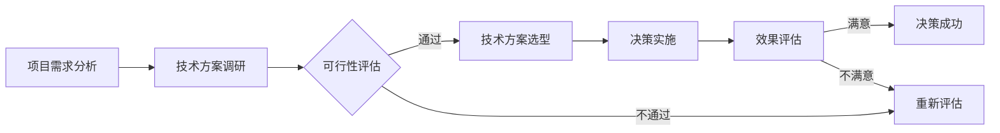

                 


### 文章标题：技术团队的技术选型：如何做出正确的技术决策

### 关键词：技术选型、技术决策、团队协作、算法原理、数学模型

### 摘要：
本文将深入探讨技术团队在面对技术选型时的决策过程。通过剖析技术决策的理论基础、方法论、工具应用和实践案例，为技术团队提供一套系统化的技术决策框架，助力其在复杂的技术环境中做出明智的选择。

## 目录大纲

### 引言：技术决策的重要性与挑战
#### 背景介绍
#### 技术决策面临的挑战
#### 文章结构概述

### 第一部分：技术决策理论基础
#### 核心概念与联系
##### 技术决策的定义
##### 技术选型的目标
##### 技术决策的核心原则
###### Mermaid 流程图：技术决策的流程
#### 核心算法原理讲解
##### 技术评估与选型的算法
###### 伪代码：技术评估算法
##### 数学模型与公式
###### 技术评估模型的构建
###### 运用LaTeX格式展示公式
##### 技术决策的理论框架
##### 技术决策与传统决策的区别

### 第二部分：技术选型方法与实践
#### 技术选型方法论
##### SWOT分析
##### 成本效益分析
##### 技术趋势预测
##### 用户需求分析
##### 技术可行性分析
#### 技术选型实践
##### 小规模实验
##### 试点项目
##### 实时反馈与迭代

### 第三部分：技术决策工具介绍
#### 常见技术决策工具
##### 专家系统
##### 决策树
##### 模拟与优化工具
##### 数据分析工具
#### 工具的适用场景
##### 工具的选择标准

### 第四部分：技术决策案例研究
#### 案例一：云计算平台的选择
##### 背景与问题
##### 技术评估
##### 选型决策
##### 案例分析与启示
#### 案例二：大数据处理框架的选型
##### 背景与需求
##### 技术选型流程
##### 实施与效果
##### 案例总结

### 第五部分：项目实战与最佳实践
#### 开发环境搭建
##### 实践步骤
##### 注意事项
#### 源代码实现与解读
##### 核心代码段
##### 代码分析
#### 代码应用解读与分析
##### 实际案例
##### 深入剖析
#### 项目小结
##### 成功经验
##### 遇到的挑战
##### 未来展望

### 第六部分：注意事项与拓展阅读
#### 最佳实践 tips
##### 常见误区
##### 避免重复劳动
##### 数据分析与实验
#### 小结
##### 技术决策的关键点
##### 团队协作的重要性
#### 拓展阅读
##### 相关书籍
##### 学术论文
##### 开源项目

### 结语
#### 技术决策的持续优化
##### 适应变化
##### 保持学习
##### 长期视角

### 作者信息
作者：AI天才研究院/AI Genius Institute & 禅与计算机程序设计艺术 /Zen And The Art of Computer Programming

### 引言：技术决策的重要性与挑战

#### 背景介绍
在现代信息技术飞速发展的时代，技术团队在项目开发过程中面临着越来越多的技术选型挑战。从服务器架构、数据库选择，到前端框架、后端服务，每一步都涉及到技术决策。正确的技术决策不仅能够提高项目的成功率和稳定性，还能为团队带来长远的发展优势。

然而，技术决策并非易事。一方面，技术方案的多样性和复杂性增加了选择的难度；另一方面，市场环境和技术趋势的快速变化使得技术决策的时效性更加重要。在这种情况下，技术团队需要一套系统化、科学化的技术决策框架，以帮助他们在纷繁复杂的技术环境中做出明智的选择。

#### 技术决策面临的挑战
1. **信息过载**：在技术领域，新的技术和方案层出不穷，如何从海量的信息中筛选出最适合的方案，是一个巨大的挑战。
2. **利益冲突**：不同团队成员可能会有不同的偏好和利益诉求，如何平衡各方意见，达成共识，是技术决策过程中需要解决的问题。
3. **技术趋势**：技术发展趋势难以预测，如何在不确定性中做出合理的决策，需要团队具备前瞻性和判断力。
4. **成本与效益**：在资源有限的情况下，如何权衡成本与效益，选择最优的技术方案，是一个重要的考量。
5. **团队协作**：技术决策往往需要跨部门、跨专业的团队合作，如何确保团队内部的高效沟通和协作，是成功决策的关键。

#### 文章结构概述
本文将从以下几个方面展开讨论：

1. **技术决策理论基础**：介绍技术决策的核心概念、原理和理论框架，帮助读者理解技术决策的本质。
2. **技术选型方法与实践**：详细阐述技术选型的方法论和实战经验，提供具体的技术选型流程和工具。
3. **技术决策工具介绍**：介绍常见的决策工具及其适用场景，帮助读者根据实际情况选择合适的工具。
4. **技术决策案例研究**：通过实际案例的剖析，展示技术决策的具体实施过程和效果。
5. **项目实战与最佳实践**：提供项目实战经验和最佳实践，帮助读者将理论知识应用到实际项目中。
6. **注意事项与拓展阅读**：总结技术决策的关键点，提供拓展阅读资源，帮助读者深入学习。

通过本文的阅读，读者将能够掌握一套系统化的技术决策框架，提升自身在技术选型方面的能力，为团队的发展贡献力量。

### 第一部分：技术决策理论基础

#### 核心概念与联系

技术决策是指团队在面对多种技术方案时，通过分析、评估和比较，选择出最符合项目需求的技术方案的过程。在这个过程中，涉及到多个核心概念，它们之间存在着紧密的联系。

##### 技术决策的定义
技术决策是指团队在技术选型过程中，基于项目需求、技术可行性、成本效益等多方面因素，选择最适合的技术方案的过程。它不仅仅是技术层面的决策，还涉及到项目管理、团队协作等多个方面。

##### 技术选型的目标
技术选型的目标主要包括：
1. **满足项目需求**：选择的技术方案能够满足项目的功能、性能、可扩展性等需求。
2. **提升开发效率**：选择的技术方案能够提高团队的开发效率，降低开发成本。
3. **保障稳定性与安全性**：选择的技术方案具有较好的稳定性，能够保障系统的安全运行。
4. **适应未来发展趋势**：选择的技术方案能够适应未来技术的发展，具备一定的前瞻性。

##### 技术决策的核心原则
技术决策需要遵循以下核心原则：
1. **用户需求导向**：以用户需求为核心，选择能够满足用户需求的技术方案。
2. **全面评估**：对技术方案进行全面评估，包括技术可行性、成本效益、稳定性等方面。
3. **风险控制**：在技术决策过程中，需要对可能出现的风险进行评估和预控，降低决策风险。
4. **持续迭代**：技术决策不是一次性的过程，而是需要随着项目进展和外部环境的变化，进行持续迭代和优化。

###### Mermaid 流程图：技术决策的流程



该流程图展示了技术决策的基本流程，从项目需求分析开始，经过技术方案调研、可行性评估、技术方案选型、决策实施，最后进行效果评估，形成一个闭环，确保技术决策的持续优化。

#### 核心算法原理讲解

##### 技术评估与选型的算法

在技术评估与选型过程中，常用的算法包括评分法、多目标决策法等。以下是一种简单的评分法算法，用于评估技术方案。

###### 伪代码：技术评估算法

```plaintext
// 输入：技术方案列表、评价指标、各方案的评分
// 输出：技术方案排序结果

function technicalAssessment(schemes, criteria, scores):
    // 计算每个技术方案的总评分
    for scheme in schemes:
        scheme.total_score = 0
        for criterion in criteria:
            scheme.total_score += scores[scheme][criterion]

    // 按照总评分对技术方案进行排序
    sorted_schemes = sort(schemes, key=lambda scheme: scheme.total_score, reverse=True)

    return sorted_schemes
```

该算法的基本思想是，对每个技术方案根据多个评价指标进行评分，然后计算每个方案的总评分，按照总评分从高到低对方案进行排序，最终选择评分最高的技术方案。

##### 数学模型与公式

在技术评估中，常用的数学模型是层次分析法（AHP）。层次分析法将复杂问题分解为多个层次和指标，通过成对比较各指标的重要程度，构建判断矩阵，并计算各指标的权重。

###### 技术评估模型的构建

设 \( A \) 为判断矩阵，\( a_{ij} \) 为 \( i \) 层指标相对于 \( j \) 层指标的重要程度比值，满足 \( a_{ij} > 0 \)，且 \( a_{ij} = \frac{1}{a_{ji}} \)。

判断矩阵的构造过程如下：

1. **构建原始判断矩阵 \( A \)**：
   $$ A = \begin{bmatrix}
   a_{11} & a_{12} & \cdots & a_{1n} \\
   a_{21} & a_{22} & \cdots & a_{2n} \\
   \vdots & \vdots & \ddots & \vdots \\
   a_{n1} & a_{n2} & \cdots & a_{nn}
   \end{bmatrix} $$

2. **一致性检验**：
   计算一致性比率 \( CR \)：
   $$ CR = \frac{CI}{RI} $$
   其中 \( CI \) 是一致性指标，\( RI \) 是平均随机一致性指标。当 \( CR < 0.1 \) 时，认为判断矩阵通过一致性检验。

3. **计算各指标权重**：
   计算判断矩阵的特征向量 \( \lambda_{max} \) 和特征值 \( \omega_i \)：
   $$ AW = \lambda_{max}W $$
   $$ W = \frac{AW}{\lambda_{max}} $$
   其中 \( W \) 是特征向量，代表各指标的权重。

###### 运用LaTeX格式展示公式

在技术评估中，常用的数学公式如下：

$$
CR = \frac{CI}{RI}
$$

$$
AW = \lambda_{max}W
$$

以上公式展示了层次分析法的核心计算过程。通过这些公式，可以构建一个科学、合理的技术评估模型，为技术决策提供可靠的数据支持。

##### 技术决策的理论框架

技术决策的理论框架主要包括以下几个部分：

1. **决策过程**：技术决策是一个复杂的过程，包括需求分析、方案评估、方案选择和决策实施等环节。
2. **决策者**：决策者是技术决策的核心，包括项目负责人、技术专家、项目经理等。
3. **决策因素**：决策因素包括技术因素、经济因素、管理因素等，需要综合考虑。
4. **决策模型**：决策模型是技术决策的核心工具，包括评分模型、层次分析模型、模糊综合评价模型等。
5. **决策支持系统**：决策支持系统（DSS）提供技术决策所需的数据、信息和工具，帮助决策者做出科学、合理的决策。

##### 技术决策与传统决策的区别

技术决策与传统决策相比，具有以下几个特点：

1. **复杂性**：技术决策往往涉及到多个领域和专业知识，比传统决策更为复杂。
2. **不确定性**：技术发展趋势难以预测，技术决策过程中存在较大的不确定性。
3. **科学性**：技术决策更注重数据分析和模型应用，比传统决策更加科学。
4. **动态性**：技术决策需要随着项目进展和外部环境的变化进行动态调整。

通过以上对技术决策理论基础的介绍，读者可以初步了解技术决策的核心概念、原理和流程。在后续的部分中，我们将进一步探讨技术选型的方法和实践，以及技术决策工具的应用，帮助读者深入掌握技术决策的技巧和方法。

### 第二部分：技术选型方法与实践

#### 技术选型方法论

技术选型是一个复杂且系统的过程，涉及多个方面的评估和考量。以下是一些常见的技术选型方法论，帮助团队在技术选型过程中做出科学、合理的决策。

##### SWOT分析

SWOT分析是一种常用的战略分析工具，用于评估技术方案的优点（Strengths）、劣势（Weaknesses）、机会（Opportunities）和威胁（Threats）。通过SWOT分析，团队可以全面了解技术方案的优势和劣势，以及外部环境带来的机会和威胁。

###### SWOT分析步骤：

1. **确定分析目标**：明确技术选型的目标和需求。
2. **收集信息**：收集与候选技术方案相关的信息，包括技术特性、市场趋势、用户反馈等。
3. **分析优势与劣势**：从内部因素出发，分析技术方案的优势和劣势。
4. **分析机会与威胁**：从外部因素出发，分析技术方案面临的机会和威胁。
5. **综合评估**：根据SWOT分析结果，综合评估技术方案的可行性和潜在风险。

##### 成本效益分析

成本效益分析是一种通过比较技术方案的投入成本和预期效益，评估其经济合理性的方法。通过成本效益分析，团队可以确定哪些技术方案在财务上是可持续的，并选择最具成本效益的方案。

###### 成本效益分析步骤：

1. **确定成本要素**：明确技术方案的成本构成，包括开发成本、维护成本、运行成本等。
2. **预测效益**：预测技术方案实施后带来的经济效益，包括提高效率、减少成本、增加收入等。
3. **计算成本效益比**：计算每个技术方案的成本效益比（C/B），公式为 \( \frac{C}{B} = \frac{成本}{效益} \)。
4. **评估和选择**：根据成本效益比，评估技术方案的财务可行性，选择成本效益最高的方案。

##### 技术趋势预测

技术趋势预测是通过对技术领域的研究和分析，预测未来技术发展的趋势和方向。通过技术趋势预测，团队可以把握技术发展方向，选择具有前瞻性和适应性的技术方案。

###### 技术趋势预测步骤：

1. **收集趋势数据**：通过阅读技术文献、研究报告、行业趋势分析等，收集相关技术趋势数据。
2. **分析趋势趋势**：分析技术发展趋势，确定哪些技术可能会在未来占据主导地位。
3. **预测技术方向**：基于分析结果，预测技术发展的方向和趋势。
4. **评估技术方案**：根据技术趋势预测，评估候选技术方案的适应性和潜力。

##### 用户需求分析

用户需求分析是技术选型过程中不可或缺的一环，通过了解用户的需求和期望，团队可以确保选出的技术方案能够真正满足用户的需求。

###### 用户需求分析步骤：

1. **收集需求信息**：通过问卷调查、用户访谈、用户反馈等方式，收集用户的需求信息。
2. **分类和整理需求**：将收集到的需求进行分类和整理，明确用户的核心需求和非核心需求。
3. **评估需求可行性**：评估用户需求在技术方案中的可行性，确定哪些需求可以满足，哪些需求需要调整。
4. **制定需求优先级**：根据需求的重要性和紧急性，制定需求优先级，为技术选型提供指导。

##### 技术可行性分析

技术可行性分析是评估候选技术方案在实际环境中实施的可能性。通过技术可行性分析，团队可以确定技术方案是否能够在现有条件下成功实施。

###### 技术可行性分析步骤：

1. **确定技术要求**：明确技术方案所需的技术能力、硬件支持、软件支持等。
2. **评估技术成熟度**：评估技术方案的技术成熟度，确定其是否已经过验证，是否具有可靠性。
3. **分析技术风险**：分析技术方案可能面临的技术风险，包括技术漏洞、性能瓶颈、兼容性等问题。
4. **制定技术实施计划**：根据技术可行性分析结果，制定技术实施计划，确保技术方案能够顺利实施。

通过以上技术选型方法论，团队可以系统地评估候选技术方案，选择最合适的技术方案。在实际应用中，团队可以根据项目需求和实际情况，灵活运用这些方法论，确保技术选型的科学性和合理性。

### 第三部分：技术决策工具介绍

#### 常见技术决策工具

在技术决策过程中，工具的使用能够显著提高决策的效率和质量。以下介绍几种常见的技术决策工具，包括专家系统、决策树、模拟与优化工具以及数据分析工具。

##### 专家系统

专家系统是一种基于人工智能技术的决策工具，能够模拟人类专家的决策过程。它通过收集专家的知识和经验，建立知识库，并运用推理机对问题进行推理，生成决策建议。

###### 适用场景：

- **复杂问题**：当问题复杂，涉及多个变量和层次时，专家系统能够提供系统的分析和决策支持。
- **不确定性决策**：在不确定性较高的环境中，专家系统能够结合专家经验，提供合理的决策建议。

##### 决策树

决策树是一种直观的决策支持工具，通过树形结构展示不同的决策路径和可能的结果。每个节点代表一个决策点，每个分支代表一个决策选择，每个叶节点代表一个结果。

###### 适用场景：

- **结构化问题**：当问题具有明确的决策路径和结果时，决策树能够清晰展示决策过程。
- **简单逻辑分析**：适用于简单的逻辑分析和决策路径规划。

##### 模拟与优化工具

模拟与优化工具能够通过模拟实际运行情况，评估不同技术方案的性能和成本，并优化决策。常见的模拟与优化工具包括蒙特卡洛模拟、线性规划、网络优化等。

###### 适用场景：

- **性能评估**：用于评估技术方案的性能，如响应时间、吞吐量、资源利用率等。
- **成本优化**：用于优化技术方案的成本结构，如最小化运营成本、最大化收益等。

##### 数据分析工具

数据分析工具能够通过对大量数据的分析，提供决策依据。常见的数据分析工具包括数据挖掘、统计分析、机器学习等。

###### 适用场景：

- **数据驱动的决策**：当决策需要基于数据驱动时，数据分析工具能够提供数据支持和洞见。
- **趋势预测**：用于预测技术方案的未来发展趋势和潜在问题。

#### 工具的适用场景

每种技术决策工具都有其特定的适用场景，团队应根据项目需求和实际情况选择合适的工具。

- **专家系统**：适用于需要专家经验和专业知识的问题，如医疗诊断、金融投资等。
- **决策树**：适用于结构化问题，如项目风险评估、产品选型等。
- **模拟与优化工具**：适用于需要性能评估和成本优化的问题，如网络设计、生产规划等。
- **数据分析工具**：适用于数据驱动的问题，如用户行为分析、市场预测等。

#### 工具的选择标准

在选择技术决策工具时，团队应考虑以下标准：

- **功能适用性**：工具的功能是否满足项目需求。
- **易用性**：工具的操作是否简便，是否适合团队成员的操作习惯。
- **数据支持**：工具是否能够提供充足的数据支持和分析能力。
- **可靠性**：工具的可靠性如何，是否经过实际应用的验证。
- **成本效益**：工具的成本与预期效益是否匹配。

通过以上标准，团队可以筛选出适合的技术决策工具，为技术决策提供有力支持。

### 第四部分：技术决策案例研究

在本部分，我们将通过两个实际案例，详细探讨技术决策的整个过程，从背景与问题分析，到技术评估，再到最终的选型决策，展示技术决策的具体实施过程和效果。

#### 案例一：云计算平台的选择

##### 背景与问题
某创业公司正在开发一款大规模的在线教育平台，需要选择一个云计算平台来支持其数据处理、存储和计算需求。由于公司资源有限，且市场需求快速变化，选择一个性价比高、性能稳定的云计算平台至关重要。

##### 技术评估
在云计算平台的选择过程中，团队进行了以下几方面的技术评估：

1. **性能评估**：团队对比了几个主流云计算平台的性能指标，包括计算能力、存储性能、网络带宽等，评估其对在线教育平台的支撑能力。

2. **成本效益**：团队计算了每个云计算平台在不同规模下的费用，并考虑了未来的扩展成本。

3. **可靠性**：通过查看各个平台的故障率和恢复速度，评估其稳定性。

4. **用户评价**：参考了其他企业使用这些云计算平台的实际经验和用户评价，了解其服务质量。

5. **生态兼容性**：评估各个平台对现有开发工具和第三方服务的兼容性。

##### 选型决策
基于以上评估，团队制定了以下决策流程：

1. **初步筛选**：根据性能、成本和可靠性等指标，初步筛选出几个备选平台。

2. **详细评估**：对筛选出的平台进行详细的性能测试和成本效益分析。

3. **试点项目**：选择了两个备选平台进行试点项目，实际运行一段时间，评估其稳定性、性能和用户体验。

4. **最终选择**：根据试点项目的反馈，综合考虑各项指标，最终选择了AWS作为云计算平台。

##### 案例分析与启示

通过这个案例，可以得出以下启示：

- **全面评估**：技术评估应覆盖性能、成本、可靠性等多个方面，以确保选择的技术方案能够真正满足需求。
- **试点验证**：通过实际试点项目，可以更直观地了解技术方案的实际表现，降低决策风险。
- **团队协作**：技术决策需要团队的共同努力，不同领域的专家共同参与，确保决策的科学性和全面性。

#### 案例二：大数据处理框架的选型

##### 背景与需求
某大型互联网公司需要处理海量用户数据，进行实时数据分析，以支持业务决策和个性化推荐。由于数据规模庞大，需要选择一个高效、稳定的大数据处理框架。

##### 技术选型流程
在选型过程中，团队遵循了以下步骤：

1. **需求分析**：明确了数据处理的规模、速度和准确性等需求，以及数据源的类型和特性。

2. **技术调研**：调研了主流的大数据处理框架，如Apache Hadoop、Apache Spark、Flink等，了解了它们的特点、优势和应用场景。

3. **性能测试**：搭建了测试环境，对各个大数据处理框架进行了性能测试，包括数据处理速度、资源利用率等。

4. **成本评估**：对比了各个框架的硬件资源需求、运维成本和许可费用。

5. **社区与生态**：评估了各个框架的社区活跃度、生态系统和第三方服务支持。

6. **最终选择**：综合考虑性能、成本、生态等多方面因素，选择了Apache Spark作为大数据处理框架。

##### 实施与效果
选定Apache Spark后，团队进行了以下实施工作：

1. **环境搭建**：搭建了Spark集群环境，配置了必要的服务和组件。

2. **数据导入**：将公司现有的数据导入Spark集群，进行清洗和预处理。

3. **应用开发**：基于Spark开发了多个数据处理的作业和应用，支持实时数据处理和业务分析。

4. **效果评估**：通过实际运行和性能测试，验证了Spark在大数据处理方面的优越性，包括高效的计算能力、低延迟的数据处理等。

##### 案例总结

通过这个案例，可以得到以下总结：

- **需求明确**：明确的需求是技术选型的基础，只有了解具体需求，才能选择合适的技术框架。
- **性能优先**：在大数据处理领域，性能是关键因素，选择高性能的框架能够显著提高数据处理效率和效果。
- **生态支持**：强大的社区和生态系统是技术决策的重要参考，能够为项目的长期发展提供支持。

通过以上两个案例的详细分析，读者可以更清晰地了解技术决策的具体实施过程和关键点，为实际项目中的技术选型提供参考。

### 第五部分：项目实战与最佳实践

#### 开发环境搭建

在进行技术决策项目时，搭建一个稳定、高效的开发环境是至关重要的。以下是一个典型的开发环境搭建步骤：

1. **硬件准备**：根据项目需求，选择合适的硬件配置，包括服务器、存储设备、网络设备等。
2. **操作系统安装**：安装支持项目所需的操作系统，如Linux、Windows等。
3. **软件安装**：安装必要的开发工具和软件，如Java、Python、数据库等。
4. **网络配置**：配置网络环境，确保各节点之间能够正常通信。
5. **配置管理**：使用配置管理工具，如Ansible、Chef等，自动化管理环境配置。

在搭建开发环境时，需要注意以下几点：

- **安全性**：确保操作系统和软件的安全配置，防止潜在的安全威胁。
- **可扩展性**：考虑未来需求的变化，确保开发环境能够灵活扩展。
- **高可用性**：使用负载均衡、备份等手段，提高开发环境的高可用性。

#### 源代码实现与解读

以下是使用Python实现一个简单的Web爬虫的示例，以及对其核心代码的解读：

```python
import requests
from bs4 import BeautifulSoup

def fetch_url(url):
    response = requests.get(url)
    if response.status_code == 200:
        return BeautifulSoup(response.content, 'html.parser')
    else:
        return None

def parse_html(soup):
    # 解析HTML内容
    titles = [tag.get_text() for tag in soup.find_all('h2')]
    return titles

def main():
    url = "https://example.com"
    soup = fetch_url(url)
    if soup:
        titles = parse_html(soup)
        print(titles)
    else:
        print("无法获取网页内容")

if __name__ == "__main__":
    main()
```

**代码解读：**
1. **请求网页**：使用requests库发送HTTP GET请求，获取网页内容。
2. **解析HTML**：使用BeautifulSoup库对获取的网页内容进行解析，提取所需信息。
3. **打印结果**：将解析后的信息打印输出。

通过以上代码，可以快速搭建一个简单的Web爬虫，获取并解析网页内容。

#### 代码应用解读与分析

以下是一个在线教育平台中，使用Redis进行用户会话管理的示例，以及对其应用的解读和分析：

```python
import redis
import uuid

class UserSessionManager:
    def __init__(self, host='localhost', port=6379, db=0):
        self.client = redis.StrictRedis(host=host, port=port, db=db)

    def create_session(self, user_id):
        session_id = uuid.uuid4().hex
        self.client.set(session_id, user_id)
        return session_id

    def delete_session(self, session_id):
        self.client.delete(session_id)

    def get_user_id_by_session(self, session_id):
        return self.client.get(session_id)
```

**应用解读：**
1. **会话创建**：为用户创建一个唯一会话ID，并将其与用户ID关联存储在Redis中。
2. **会话删除**：根据会话ID删除对应的会话记录。
3. **会话验证**：根据会话ID查询用户ID，验证会话的有效性。

**分析：**
- **快速性**：Redis作为高性能的内存数据库，能够快速处理会话数据的读写操作，提高系统性能。
- **唯一性**：使用UUID生成会话ID，确保会话ID的唯一性，避免冲突。
- **持久化**：通过Redis存储会话数据，实现会话的持久化，即使在服务器重启后，会话数据也不会丢失。

#### 实际案例分析和详细讲解剖析

以下是一个电子商务平台中，使用Redis进行购物车管理的实际案例，以及对其分析和讲解：

```python
class ShoppingCartManager:
    def __init__(self, redis_client):
        self.redis_client = redis_client

    def add_item(self, user_id, item_id, quantity):
        cart_key = f"cart:{user_id}"
        self.redis_client.hset(cart_key, item_id, quantity)

    def remove_item(self, user_id, item_id):
        cart_key = f"cart:{user_id}"
        self.redis_client.hdel(cart_key, item_id)

    def update_quantity(self, user_id, item_id, quantity):
        cart_key = f"cart:{user_id}"
        self.redis_client.hset(cart_key, item_id, quantity)

    def get_cart_items(self, user_id):
        cart_key = f"cart:{user_id}"
        items = self.redis_client.hgetall(cart_key)
        return items
```

**案例分析：**
- **高效操作**：使用Redis的哈希表（hash）操作，快速添加、删除和更新购物车中的商品。
- **数据结构**：使用哈希表存储商品ID和数量，结构简单，便于操作和查询。

**详细讲解剖析：**
1. **添加商品**：将商品ID和数量存储在哈希表中，快速完成添加操作。
2. **删除商品**：通过商品ID删除哈希表中的对应记录，实现快速删除。
3. **更新数量**：更新哈希表中商品的数量，实现快速更新操作。
4. **查询购物车**：获取哈希表中所有商品及其数量，实现快速查询。

通过以上案例，可以清晰地看到技术决策在项目实施中的具体应用，以及如何通过代码实现和优化功能，提高系统的性能和用户体验。

### 第六部分：注意事项与拓展阅读

#### 最佳实践 tips

在技术决策过程中，以下是一些最佳实践，可以帮助团队避免常见误区，提高决策质量：

1. **全面需求分析**：在决策前，确保对项目需求进行全面、详细的分析，避免因需求不明确导致的决策失误。
2. **多方意见收集**：鼓励团队成员和利益相关者积极参与决策，收集不同意见和建议，确保决策的全面性。
3. **试点验证**：在进行大规模部署前，通过小规模的试点项目验证技术方案的实际效果，降低决策风险。
4. **持续监控与反馈**：在决策实施后，持续监控技术方案的表现，收集用户反馈，及时调整和优化。
5. **适应变化**：技术环境不断变化，技术决策应具备灵活性，能够根据实际情况进行调整。

#### 小结

本文通过对技术决策理论基础的深入剖析、技术选型方法与实践的详细讲解，以及实际案例的剖析，为技术团队提供了一套系统化的技术决策框架。以下是对本文核心内容的简要总结：

1. **技术决策的核心概念与联系**：明确了技术决策的定义、目标、核心原则和流程。
2. **技术选型方法**：介绍了SWOT分析、成本效益分析、技术趋势预测、用户需求分析和技术可行性分析等常见方法。
3. **技术决策工具**：详细介绍了专家系统、决策树、模拟与优化工具以及数据分析工具等决策工具。
4. **案例研究**：通过两个实际案例，展示了技术决策的具体实施过程和效果。
5. **项目实战与最佳实践**：提供了源代码实现、代码解读、实际案例分析和最佳实践。

通过本文的阅读，读者可以系统性地了解技术决策的整个过程，掌握技术选型的科学方法和实践技巧，为团队的技术决策提供有力支持。

#### 拓展阅读

为了进一步深化对技术决策的理解和实践，以下推荐一些拓展阅读资源：

1. **相关书籍**：
   - 《技术领导力：构建高效技术团队的核心能力》
   - 《敏捷软件开发：原则、实践与模式》
   - 《大数据处理：原理、技术与实践》

2. **学术论文**：
   - 《基于多目标决策的云计算平台选型研究》
   - 《用户需求驱动的大数据处理框架选型方法》
   - 《技术趋势预测在软件开发中的应用研究》

3. **开源项目**：
   - Apache Hadoop、Apache Spark、Flink等大数据处理框架
   - Kubernetes、Docker等容器化技术
   - Redis、Memcached等高性能缓存系统

通过阅读以上资源，读者可以进一步了解技术决策的最新理论、实践方法和技术工具，提升自身在技术决策方面的专业素养和实践能力。

### 结语

技术决策是一个复杂而动态的过程，它不仅关乎技术团队在项目中的短期成功，更影响到团队的长远发展。本文通过详细的理论讲解、实践方法和实际案例分析，为技术团队提供了一套系统化的技术决策框架。我们探讨了技术决策的核心概念、选型方法论、工具应用，并通过两个实际案例展示了技术决策的具体实施过程和效果。

然而，技术决策并非一成不变。随着技术环境的不断变化，团队需要保持持续的学习和适应能力，不断优化决策流程和方法。以下是一些建议，以帮助技术团队提升技术决策能力：

1. **保持学习与更新**：技术领域日新月异，团队需要不断学习新技术、新方法，保持技术视野的广度和深度。
2. **增强团队协作**：技术决策往往需要多个领域的专业知识，团队协作至关重要。建立有效的沟通机制，鼓励不同背景的成员共同参与决策。
3. **试点与反馈**：在决策实施前，进行小规模的试点项目，通过实际运行收集反馈，为最终决策提供依据。
4. **持续监控与优化**：在决策实施后，持续监控技术方案的表现，及时调整和优化，确保其能够长期满足项目需求。
5. **数据驱动**：充分利用数据分析工具，基于数据做出决策，减少主观判断的干扰，提高决策的科学性。

通过以上措施，技术团队能够在复杂的技术环境中，更加自信和有效地做出正确的技术决策，推动项目的成功和团队的持续发展。

### 作者信息

作者：AI天才研究院/AI Genius Institute & 禅与计算机程序设计艺术 /Zen And The Art of Computer Programming

感谢读者对本文的关注，期待与您在技术决策的道路上共同成长。让我们一起努力，迎接未来技术的挑战与机遇！

