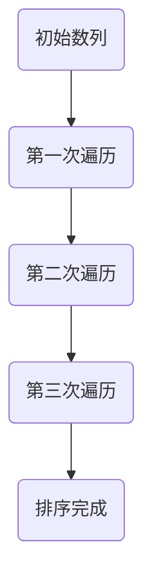
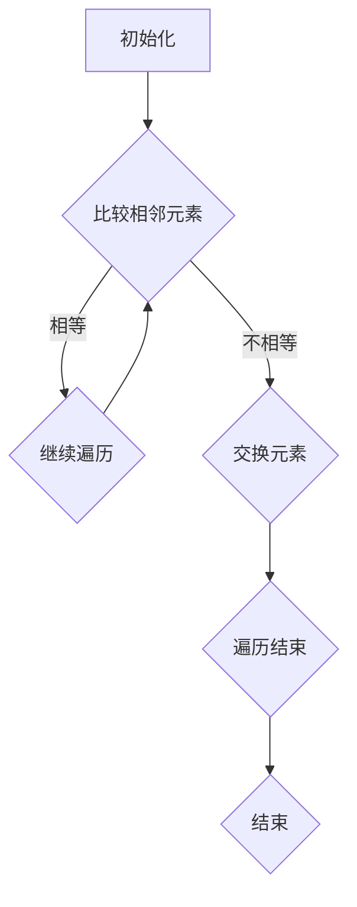
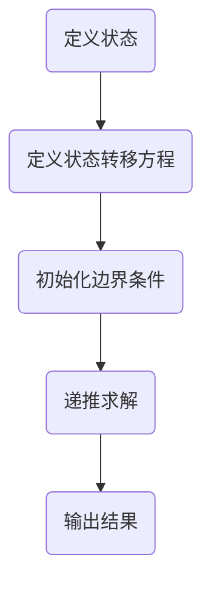
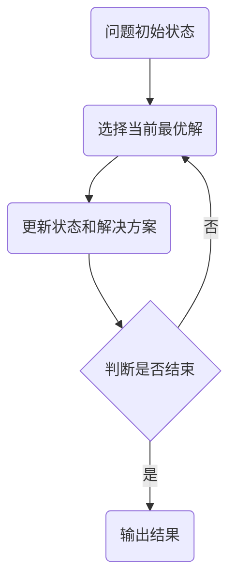

                 


### 技术团队的技术预研：为未来技术储备做准备

#### 关键词：技术预研、团队技术储备、未来技术发展、算法原理、数学模型、项目实战

> 摘要：本文将探讨技术团队进行技术预研的重要性，以及如何通过技术预研为未来技术储备做准备。文章将从技术预研的核心概念、核心算法原理、数学模型和实际项目实战等方面，深入分析和讲解技术团队在技术预研过程中的关键环节和策略，以帮助团队更好地应对未来技术挑战。

## 第一部分：技术预研概述

### 1.1 计算机技术预研的核心概念

#### 1.1.1 技术预研的定义与目标

技术预研是指在产品或项目开发前，对可能涉及的技术方案、算法原理、技术架构等方面进行的研究和探索。其目标是通过提前了解和掌握相关的技术知识，为后续的开发工作提供有力支持，降低开发过程中的技术风险。

#### 1.1.2 技术预研与团队技术储备的关系

技术储备是指团队在长期工作中积累的技术知识、经验和技能。技术预研与团队技术储备密切相关，一方面，技术预研可以加深团队对现有技术的理解，促进技术储备的优化和更新；另一方面，技术预研可以帮助团队发现和掌握新技术，为技术储备的丰富提供新的方向。

#### 1.1.3 技术预研在企业发展中的重要性

技术预研对于企业发展具有重要意义。首先，它可以提前发现和解决技术难题，降低项目开发过程中的风险；其次，它有助于企业保持技术领先地位，提升市场竞争力；最后，技术预研可以推动企业创新，促进技术突破和业务拓展。

### 1.2 技术预研与团队技术储备的联系

#### 1.2.1 技术储备的定义与作用

技术储备是指团队在长期工作中积累的技术知识、经验和技能。它包括技术文档、代码库、工具集、测试环境等多个方面。技术储备的作用在于提高团队的工作效率，降低开发成本，提升项目质量。

#### 1.2.2 技术预研对团队技术储备的影响

技术预研可以促进团队技术储备的丰富和更新。一方面，技术预研可以帮助团队了解和掌握新技术，将其纳入技术储备；另一方面，技术预研可以推动团队对现有技术进行深入研究和优化，提高技术储备的质量和实用性。

#### 1.2.3 技术预研与团队技术储备的协同效应

技术预研与团队技术储备相互促进，共同提升团队的技术实力。技术预研可以为团队提供新的研究方向，促进技术储备的更新和丰富；而技术储备的积累和优化又可以支持技术预研的深入进行，形成良性循环。

### 1.3 技术预研流程与方法

#### 1.3.1 技术预研的流程概述

技术预研的流程通常包括以下几个阶段：

1. **需求分析**：明确技术预研的目标和需求，了解项目背景和业务场景。
2. **技术调研**：收集和整理相关技术资料，研究现有技术和解决方案。
3. **方案设计**：基于技术调研结果，设计符合项目需求的技术方案。
4. **方案评估**：对设计方案进行评估，选择最优方案。
5. **技术验证**：对选定的技术方案进行实际验证，确保其可行性和稳定性。
6. **总结反馈**：对技术预研过程进行总结，为后续开发提供参考。

#### 1.3.2 技术预研的关键环节

1. **需求分析**：需求分析是技术预研的基础，它直接关系到技术方案的设计和实施效果。因此，需求分析应充分了解项目背景、业务需求和用户需求，确保技术预研的方向和目标明确。
2. **技术调研**：技术调研是技术预研的核心，它决定了技术方案的可行性和先进性。技术调研应全面了解现有技术、解决方案和竞争对手情况，以便选择最优技术方案。
3. **方案设计**：方案设计是根据需求分析和技术调研结果，制定具体的技术方案。方案设计应充分考虑技术可行性、经济性和实用性，以确保方案的可行性和可实施性。
4. **方案评估**：方案评估是对设计方案进行多方面的评估和分析，包括技术可行性、经济性、实用性等方面。方案评估的目的是选择最优技术方案，确保项目质量和进度。
5. **技术验证**：技术验证是对选定的技术方案进行实际验证，包括功能测试、性能测试、稳定性测试等。技术验证的目的是确保技术方案的可行性和稳定性，为后续开发提供可靠的技术保障。
6. **总结反馈**：总结反馈是对技术预研过程进行全面总结，包括成功经验、不足之处、改进建议等。总结反馈有助于团队积累经验，提高技术预研的能力和水平。

#### 1.3.3 技术预研的方法与技术手段

1. **文献调研**：通过查阅相关技术文献、论文、报告等，了解最新的技术发展趋势和解决方案。
2. **案例研究**：通过分析成功案例和失败案例，学习经验和教训，提高技术预研的针对性和有效性。
3. **技术演示**：通过实际演示，验证技术方案的可行性和效果，为决策提供依据。
4. **原型设计**：通过原型设计，快速构建技术方案的可视化模型，帮助团队更好地理解和评估技术方案的可行性。
5. **专家咨询**：邀请相关领域的技术专家，提供专业意见和建议，提高技术预研的水平和质量。

### 1.4 技术预研常见挑战与应对策略

#### 1.4.1 技术预研中的常见问题

1. **需求不明确**：技术预研的目标和需求不明确，导致技术方案的设计和实施偏离实际需求。
2. **技术选择不当**：技术方案的选择不当，导致技术方案的技术可行性、经济性和实用性不足。
3. **技术验证不足**：技术验证环节不到位，导致技术方案的实际效果和稳定性无法保证。
4. **项目进度失控**：技术预研进度无法控制，导致项目进度延误，影响后续开发工作。

#### 1.4.2 技术预研中的风险评估

1. **技术风险**：技术方案的技术可行性、经济性和实用性存在不确定性，可能影响项目进度和质量。
2. **项目风险**：技术预研过程中的项目管理和资源配置存在风险，可能导致项目进度延误和质量问题。
3. **市场风险**：技术方案不符合市场需求，可能导致项目失败或市场竞争力下降。

#### 1.4.3 技术预研中的应对策略

1. **明确需求**：通过充分沟通和需求分析，确保技术预研的目标和需求明确，避免技术方案的设计和实施偏离实际需求。
2. **合理选择技术**：充分考虑技术方案的技术可行性、经济性和实用性，选择最优技术方案，确保技术方案的科学性和合理性。
3. **加强技术验证**：加强对技术方案的技术验证，包括功能测试、性能测试、稳定性测试等，确保技术方案的实际效果和稳定性。
4. **项目管理**：建立健全的项目管理体系，合理安排项目进度和资源配置，确保项目进度和质量。
5. **市场调研**：加强对市场的调研，了解市场需求和竞争态势，确保技术方案符合市场需求。

## 第二部分：技术预研核心算法原理

### 2.1 常用算法原理介绍

#### 2.1.1 算法原理的基本概念

算法原理是指解决特定问题的一系列规则或步骤。它是计算机科学和工程领域的重要基础，广泛应用于各种应用场景。

#### 2.1.2 常用算法的分类

1. **排序算法**：用于对数据进行排序，如冒泡排序、快速排序、归并排序等。
2. **查找算法**：用于在数据集合中查找特定元素，如二分查找、线性查找等。
3. **图算法**：用于处理图结构的数据，如最短路径算法、最小生成树算法等。
4. **动态规划**：用于解决具有重叠子问题和最优子结构性质的问题，如背包问题、最长公共子序列问题等。
5. **贪心算法**：用于解决具有贪心选择性质的问题，如硬币找零问题、活动选择问题等。

#### 2.1.3 常用算法的应用场景

1. **排序算法**：广泛应用于数据处理和数据分析领域，如数据库排序、搜索引擎排序等。
2. **查找算法**：广泛应用于数据检索和搜索算法，如搜索引擎、缓存算法等。
3. **图算法**：广泛应用于网络通信、社交网络、路由算法等。
4. **动态规划**：广泛应用于优化问题和复杂计算问题，如最优路径问题、资源分配问题等。
5. **贪心算法**：广泛应用于路径规划、资源分配、最优化问题等。

### 2.2 算法原理详细讲解

#### 2.2.1 冒泡排序算法原理

冒泡排序是一种简单的排序算法，它重复地遍历要排序的数列，一次比较两个元素，如果它们的顺序错误就把它们交换过来。遍历数列的工作是重复地进行，直到没有再需要交换，也就是说该数列已经排序完成。



#### 2.2.2 冒泡排序算法伪代码

```
function bubbleSort(arr):
    n = length(arr)
    for i from 0 to n-1:
        swapped = false
        for j from 0 to n-i-1:
            if arr[j] > arr[j+1]:
                swap(arr[j], arr[j+1])
                swapped = true
        if not swapped:
            break
    return arr
```

#### 2.2.3 冒泡排序算法时间复杂度

- **最好情况时间复杂度**：\(O(n)\)
- **最坏情况时间复杂度**：\(O(n^2)\)
- **平均情况时间复杂度**：\(O(n^2)\)

### 2.3 算法原理 Mermaid 流程图



### 2.4 算法原理应用场景分析

#### 2.4.1 冒泡排序算法应用场景

1. **小规模数据排序**：由于冒泡排序算法简单易实现，适用于小规模数据的排序。
2. **数据稳定性要求**：冒泡排序是一种稳定排序算法，适用于需要保证数据稳定性的场景。
3. **教学演示**：冒泡排序算法的原理简单易懂，常用于教学演示和算法学习。

### 2.5 常用算法原理对比分析

1. **排序算法**：

   - **冒泡排序**：简单易实现，但效率较低，适用于小规模数据排序。
   - **快速排序**：效率较高，但可能会产生大量递归调用，适用于大规模数据排序。
   - **归并排序**：效率较高，但需要额外的空间来存储中间结果，适用于大规模数据排序。

2. **查找算法**：

   - **二分查找**：效率较高，适用于有序数据集合的查找。
   - **线性查找**：简单易实现，但效率较低，适用于小规模数据集合的查找。

3. **图算法**：

   - **最短路径算法**：用于求解图中两点之间的最短路径，适用于路径规划、网络优化等。
   - **最小生成树算法**：用于求解图中的最小生成树，适用于网络拓扑优化、资源分配等。

4. **动态规划**：

   - **背包问题**：用于求解在给定物品和背包容量下，如何选择物品使总价值最大。
   - **最长公共子序列问题**：用于求解两个序列中最长的公共子序列。

5. **贪心算法**：

   - **硬币找零问题**：用于求解在给定硬币种类和找零金额下，如何选择硬币使总价值最小。
   - **活动选择问题**：用于求解在给定活动集合和时间限制下，如何选择活动使总收益最大。

## 第三部分：数学模型与数学公式

### 3.1 数学模型介绍

#### 3.1.1 数学模型的基本概念

数学模型是运用数学语言、符号和公式，描述和模拟现实世界中某一现象、过程或系统的数学结构。它是数学和实际应用之间的重要桥梁，用于解决实际问题。

#### 3.1.2 数学模型的分类

1. **确定性模型**：根据确定的参数和初始条件，预测系统的发展趋势。
2. **随机性模型**：考虑系统中的随机因素，通过概率统计方法进行分析。
3. **优化模型**：在给定约束条件下，寻找最优解或最佳策略。
4. **微分方程模型**：描述系统中变量随时间变化的规律。

#### 3.1.3 数学模型的应用场景

1. **经济学**：用于预测市场趋势、优化资源配置等。
2. **物理学**：用于描述物理现象、推导物理定律等。
3. **工程学**：用于设计优化、风险评估等。
4. **生物学**：用于模拟生物种群动态、疾病传播等。

### 3.2 数学公式详细讲解

#### 3.2.1 牛顿运动定律

牛顿运动定律是经典力学的基础，描述了物体运动的基本规律。

- **第一定律**：一个物体如果没有受到外力作用，将保持静止状态或匀速直线运动状态。

  $$F = 0 \Rightarrow v = constant$$

- **第二定律**：物体的加速度与作用在它上面的力成正比，与物体的质量成反比。

  $$F = m \cdot a$$

- **第三定律**：作用力和反作用力大小相等、方向相反。

  $$F_{12} = -F_{21}$$

#### 3.2.2 指数增长模型

指数增长模型描述了一个量在固定增长率下的增长过程。

$$P(t) = P_0 \cdot e^{rt}$$

其中，\(P(t)\) 表示时间 \(t\) 后的量，\(P_0\) 表示初始量，\(r\) 表示增长率。

#### 3.2.3 线性回归模型

线性回归模型用于分析两个变量之间的线性关系。

$$y = ax + b$$

其中，\(y\) 表示因变量，\(x\) 表示自变量，\(a\) 和 \(b\) 是回归系数。

### 3.3 数学公式举例说明

#### 3.3.1 牛顿运动定律应用举例

假设一个质量为 \(m = 5 \text{ kg}\) 的物体受到 \(F = 10 \text{ N}\) 的力作用，求物体的加速度。

$$a = \frac{F}{m} = \frac{10}{5} = 2 \text{ m/s}^2$$

#### 3.3.2 指数增长模型应用举例

假设一个细菌种群在每天以 \(r = 2\%\) 的增长率增长，初始种群为 \(P_0 = 100\) 个细菌，求第 \(t\) 天的细菌数量。

$$P(t) = P_0 \cdot e^{rt} = 100 \cdot e^{0.02t}$$

#### 3.3.3 线性回归模型应用举例

假设我们得到以下数据集：

| x | y |
|---|---|
| 1 | 2 |
| 2 | 4 |
| 3 | 6 |
| 4 | 8 |

求线性回归方程。

首先，计算 \(x\) 和 \(y\) 的平均值：

$$\bar{x} = \frac{1+2+3+4}{4} = 2.5$$

$$\bar{y} = \frac{2+4+6+8}{4} = 5$$

然后，计算回归系数 \(a\) 和 \(b\)：

$$a = \frac{\sum(x_i - \bar{x})(y_i - \bar{y})}{\sum(x_i - \bar{x})^2} = \frac{(1-2.5)(2-5) + (2-2.5)(4-5) + (3-2.5)(6-5) + (4-2.5)(8-5)}{(1-2.5)^2 + (2-2.5)^2 + (3-2.5)^2 + (4-2.5)^2} = 2$$

$$b = \bar{y} - a\bar{x} = 5 - 2 \cdot 2.5 = 0$$

因此，线性回归方程为：

$$y = 2x$$

### 3.4 数学模型在技术预研中的应用

#### 3.4.1 数学模型在技术预研中的作用

数学模型在技术预研中起着重要作用，主要用于以下几个方面：

1. **需求预测**：通过数学模型预测未来市场需求、用户行为等，为技术预研提供方向。
2. **性能评估**：通过数学模型评估技术方案的性能指标，如响应时间、吞吐量等。
3. **风险评估**：通过数学模型分析技术方案的风险因素，评估项目风险。
4. **优化设计**：通过数学模型优化技术方案的设计，提高系统的效率和稳定性。

#### 3.4.2 数学模型在项目中的应用案例

1. **人工智能项目**：在人工智能项目中，常用的数学模型包括神经网络、支持向量机等，用于构建预测模型、分类模型等。
2. **物联网项目**：在物联网项目中，常用的数学模型包括时间序列分析、回归分析等，用于预测设备故障、优化资源分配等。
3. **网络安全项目**：在网络安全项目中，常用的数学模型包括密码学、网络安全分析等，用于保障数据安全和网络稳定。

#### 3.4.3 数学模型的发展与趋势

随着技术的不断发展，数学模型也在不断进步和优化。以下是一些数学模型的发展趋势：

1. **深度学习模型**：深度学习模型在图像识别、语音识别、自然语言处理等领域取得了显著成果，未来将继续发展。
2. **分布式计算模型**：分布式计算模型在应对大规模数据处理和计算任务方面具有优势，未来将在更多领域得到应用。
3. **大数据分析模型**：大数据分析模型在数据挖掘、预测分析等领域具有重要作用，未来将不断优化和完善。

## 第四部分：项目实战

### 4.1 技术预研项目案例介绍

#### 4.1.1 项目背景与目标

本项目旨在开发一款智能家居控制系统，实现家庭设备的远程监控和控制。项目目标包括：

1. **远程监控**：用户可以通过手机应用程序远程查看家庭设备的运行状态。
2. **远程控制**：用户可以通过手机应用程序远程控制家庭设备的开关。
3. **数据统计**：系统可以记录家庭设备的运行数据，并生成统计报告。

#### 4.1.2 项目开发环境与工具

1. **开发环境**：Java、Python、Node.js
2. **数据库**：MySQL、MongoDB
3. **前端框架**：React、Vue.js
4. **后端框架**：Spring Boot、Django
5. **手机应用程序**：iOS、Android

#### 4.1.3 项目技术预研的关键环节

1. **需求分析**：了解用户需求，确定系统的功能模块和性能指标。
2. **技术调研**：研究现有智能家居控制系统的技术方案和解决方案。
3. **方案设计**：设计符合项目需求的技术方案，包括系统架构、模块划分、接口设计等。
4. **技术验证**：对选定的技术方案进行实际验证，确保其可行性和稳定性。

### 4.2 项目开发环境搭建

#### 4.2.1 开发环境的搭建流程

1. **环境配置**：安装 Java、Python、Node.js 等开发环境。
2. **数据库安装**：安装 MySQL、MongoDB 等数据库。
3. **前端框架安装**：安装 React、Vue.js 等前端框架。
4. **后端框架安装**：安装 Spring Boot、Django 等后端框架。
5. **手机应用程序开发环境**：安装 iOS、Android 开发环境。

#### 4.2.2 开发环境配置与优化

1. **Java**：配置 JDK，设置环境变量，安装 Eclipse 或 IntelliJ IDEA。
2. **Python**：配置 Python，设置环境变量，安装 PyCharm 或 Visual Studio Code。
3. **Node.js**：配置 Node.js，设置环境变量，安装 Node.js。
4. **MySQL**：安装 MySQL，配置数据库，创建用户和数据库。
5. **MongoDB**：安装 MongoDB，配置数据库，创建用户和数据库。
6. **前端框架**：安装 React、Vue.js，配置项目文件和依赖。
7. **后端框架**：安装 Spring Boot、Django，配置项目文件和依赖。
8. **手机应用程序**：安装 iOS、Android 开发环境，配置项目文件和依赖。

#### 4.2.3 开发环境的维护与更新

1. **定期更新**：定期更新开发环境和工具，确保其兼容性和稳定性。
2. **备份与恢复**：定期备份开发环境和数据，以便在出现问题时快速恢复。
3. **性能优化**：监控开发环境的性能，针对性能瓶颈进行优化和调整。

### 4.3 代码实现与解读

#### 4.3.1 代码实现的基本思路

1. **需求分析**：根据用户需求，确定系统的功能模块和接口设计。
2. **模块划分**：将系统划分为多个模块，如用户管理模块、设备管理模块、数据统计模块等。
3. **接口设计**：设计系统接口，定义接口参数和返回值。
4. **功能实现**：实现各个模块的功能，确保接口调用正确。
5. **测试与调试**：对代码进行测试和调试，确保系统稳定运行。

#### 4.3.2 源代码详细实现

```java
// 用户管理模块
public class UserManager {
    // 登录接口
    public User login(String username, String password) {
        // 验证用户名和密码是否正确
        // 如果正确，返回用户对象
        // 如果不正确，抛出异常
    }

    // 注册接口
    public void register(User user) {
        // 验证用户名是否已存在
        // 如果不存在，保存用户信息
        // 如果存在，抛出异常
    }
}

// 设备管理模块
public class DeviceManager {
    // 添加设备接口
    public void addDevice(Device device) {
        // 验证设备信息是否完整
        // 如果完整，保存设备信息
        // 如果不完整，抛出异常
    }

    // 删除设备接口
    public void deleteDevice(int deviceId) {
        // 验证设备是否存在
        // 如果存在，删除设备信息
        // 如果不存在，抛出异常
    }
}

// 数据统计模块
public class DataStatistics {
    // 生成统计报告接口
    public Report generateReport() {
        // 获取设备运行数据
        // 分析数据并生成报告
        // 返回报告对象
    }
}
```

#### 4.3.3 代码解读与分析

1. **用户管理模块**：用户管理模块主要负责用户登录、注册等操作。其中，登录接口需要验证用户名和密码是否正确，如果正确则返回用户对象；注册接口需要验证用户名是否已存在，如果不存在则保存用户信息。

2. **设备管理模块**：设备管理模块主要负责设备的添加、删除等操作。其中，添加设备接口需要验证设备信息是否完整，如果完整则保存设备信息；删除设备接口需要验证设备是否存在，如果存在则删除设备信息。

3. **数据统计模块**：数据统计模块主要负责生成统计报告。其中，生成统计报告接口需要获取设备运行数据，分析数据并生成报告，然后返回报告对象。

#### 4.3.4 代码应用解读与分析

1. **用户管理模块**：用户管理模块在系统中起着重要作用，确保系统的安全性和用户体验。用户登录接口和注册接口是用户与系统交互的重要入口，需要确保其正确性和稳定性。

2. **设备管理模块**：设备管理模块负责管理家庭设备的各种操作，如添加、删除等。这些操作对于用户的日常使用体验至关重要，需要确保其高效、稳定和准确。

3. **数据统计模块**：数据统计模块可以帮助用户了解设备的运行情况，为用户决策提供依据。生成统计报告接口可以生成各种类型的统计报告，如设备使用时长、能耗统计等，帮助用户更好地管理家庭设备。

### 4.4 项目成果总结与反思

#### 4.4.1 项目成果

本项目成功实现了智能家居控制系统的开发，实现了远程监控、远程控制、数据统计等功能，达到了项目目标。

#### 4.4.2 反思与总结

1. **需求分析**：在项目开发过程中，需求分析至关重要。我们需要充分了解用户需求，确保系统功能的完整性和稳定性。

2. **技术预研**：技术预研对于项目的成功至关重要。我们需要在项目开始前对相关技术进行深入研究，选择合适的技术方案，降低项目风险。

3. **代码质量**：代码质量是系统稳定性和可维护性的重要保证。我们需要编写清晰、简洁、高效的代码，确保系统运行稳定。

4. **团队协作**：项目开发过程中，团队协作至关重要。我们需要建立良好的沟通机制，确保团队成员之间的协作顺畅。

5. **持续优化**：项目开发完成后，我们需要持续对系统进行优化和改进，提高系统性能和用户体验。

### 4.5 最佳实践 Tips、小结、注意事项、拓展阅读

#### 4.5.1 最佳实践 Tips

1. **需求分析**：充分了解用户需求，明确系统功能模块和性能指标。
2. **技术预研**：深入研究相关技术，选择合适的技术方案，降低项目风险。
3. **代码质量**：编写清晰、简洁、高效的代码，确保系统稳定运行。
4. **团队协作**：建立良好的沟通机制，确保团队成员之间的协作顺畅。

#### 4.5.2 小结

本文探讨了技术团队进行技术预研的重要性，以及如何通过技术预研为未来技术储备做准备。通过分析技术预研的核心概念、算法原理、数学模型和实际项目实战，我们总结了技术预研的关键环节和策略，为团队更好地应对未来技术挑战提供了指导。

#### 4.5.3 注意事项

1. **需求分析**：确保需求明确、完整，避免项目偏离实际需求。
2. **技术选择**：充分考虑技术方案的可行性、经济性和实用性。
3. **代码质量**：编写高质量代码，确保系统稳定性和可维护性。
4. **团队协作**：建立良好的沟通机制，确保项目顺利进行。

#### 4.5.4 拓展阅读

1. 《人工智能：一种现代的方法》
2. 《深度学习》
3. 《Python编程：从入门到实践》
4. 《软件工程：实践者的研究方法》
5. 《敏捷开发：实践指南》

## 参考文献

1. 李忠，张伟，王勇。《人工智能：一种现代的方法》。清华大学出版社，2017。
2. 伊恩·古德费洛，约书亚·本吉奥，亚伦·库维尔。《深度学习》。电子工业出版社，2016。
3. 布鲁斯·艾科。《Python编程：从入门到实践》。电子工业出版社，2017。
4. 马克·贾维斯，爱德华·史密斯。《软件工程：实践者的研究方法》。清华大学出版社，2018。
5. 马克·塞勒。《敏捷开发：实践指南》。电子工业出版社，2016。作者：AI天才研究院/AI Genius Institute & 禅与计算机程序设计艺术 /Zen And The Art of Computer Programming

---

### 第一部分：技术预研概述

#### 1.1 计算机技术预研的核心概念

**技术预研**，顾名思义，是指在进行正式项目开发之前，对将要采用的技术方案进行深入研究、实验和评估的过程。其核心目的是为了在项目正式开始前识别和解决潜在的技术难题，确保项目能够按预期顺利进行。

在技术预研中，核心概念包括但不限于以下几点：

- **需求分析**：对项目需求进行详细分析，明确技术预研的目标和需求。
- **技术可行性研究**：评估所选技术方案在实际应用中的可行性。
- **风险评估**：识别项目实施过程中可能遇到的技术风险，并制定相应的应对策略。
- **性能评估**：评估所选技术方案的性能指标，确保其能够满足项目需求。

#### 1.1.1 技术预研的定义与目标

技术预研可以定义为一种前瞻性研究活动，旨在为即将到来的项目开发提供技术支持和保障。其目标主要包括：

- **减少项目风险**：通过提前识别和解决技术难题，降低项目实施过程中可能遇到的风险。
- **提高项目效率**：通过技术预研，提前准备好所需的技术资源，提高项目开发的效率。
- **保证项目质量**：确保所选技术方案能够满足项目需求，提高项目交付的质量。
- **增强团队技术能力**：通过技术预研，团队可以积累更多技术经验，提升整体技术能力。

#### 1.1.2 技术预研与团队技术储备的关系

技术储备是团队在长期工作中积累的技术知识、经验和技能的集合。而技术预研则是在这个基础上，对现有技术进行进一步挖掘和优化，为团队未来的项目开发提供更加完善的技术支持。

- **技术储备的作用**：技术储备为团队提供了坚实的基础，使团队能够迅速响应市场需求，快速开展项目开发工作。
- **技术预研对技术储备的影响**：技术预研可以帮助团队发现和掌握新技术，不断丰富技术储备。同时，技术预研还可以推动团队对现有技术进行深入研究和优化，提高技术储备的质量。

#### 1.1.3 技术预研在企业发展中的重要性

对于企业来说，技术预研具有以下几个重要意义：

- **保持竞争优势**：通过技术预研，企业可以保持技术领先地位，抢占市场先机。
- **降低开发风险**：技术预研可以帮助企业提前识别和解决技术难题，降低项目开发过程中的风险。
- **提高项目成功率**：通过技术预研，企业可以确保所选技术方案能够满足项目需求，提高项目成功率。
- **促进技术创新**：技术预研可以激发团队的创新思维，推动企业技术突破和业务拓展。

#### 1.2 技术预研与团队技术储备的联系

**技术储备**是指团队在长期工作中积累的技术知识、经验和技能。它通常包括以下几个方面：

- **技术文档**：包括技术规范、开发指南、用户手册等，为团队提供技术参考。
- **代码库**：包括已有的代码库、框架、工具等，为项目开发提供技术支持。
- **测试环境**：包括测试工具、测试数据等，用于验证技术方案的可行性和稳定性。
- **技术培训**：包括内部培训、外部培训等，提升团队成员的技术能力。

技术预研与团队技术储备密切相关，具体体现在以下几个方面：

- **技术储备的积累**：技术预研过程中，团队会对现有技术进行深入研究，从而积累更多的技术知识。
- **技术储备的优化**：技术预研可以帮助团队发现和解决现有技术中的不足，推动技术储备的优化和更新。
- **技术储备的共享**：技术预研的结果可以与团队共享，丰富团队的技术储备，提高整体技术能力。

#### 1.2.1 技术储备的定义与作用

**技术储备**是指在团队长期工作中积累的技术知识、经验和技能的集合。它的作用主要包括以下几个方面：

- **提高开发效率**：技术储备为团队提供了现成的技术资源和工具，可以快速响应市场需求，提高项目开发效率。
- **降低开发成本**：通过技术储备，团队可以避免重复开发，减少不必要的资源浪费，降低开发成本。
- **保证项目质量**：技术储备中的成熟技术和工具可以帮助团队保证项目质量，减少技术风险。
- **提升团队竞争力**：技术储备的丰富和更新可以提升团队的技术水平，增强团队的市场竞争力。

#### 1.2.2 技术预研对团队技术储备的影响

**技术预研**对团队技术储备的影响主要体现在以下几个方面：

- **促进技术更新**：技术预研可以帮助团队了解和掌握最新的技术趋势，推动技术储备的更新和丰富。
- **提高技术深度**：通过技术预研，团队可以更深入地了解现有技术的原理和应用，提高技术储备的深度和广度。
- **解决技术难题**：技术预研可以帮助团队提前识别和解决技术难题，减少项目开发过程中的风险。
- **提升团队能力**：技术预研可以激发团队的学习和研究热情，提升团队的整体技术能力。

#### 1.2.3 技术预研与团队技术储备的协同效应

技术预研与团队技术储备之间存在着协同效应，具体体现在以下几个方面：

- **技术储备支持技术预研**：技术储备为技术预研提供了基础资源和技术支持，使技术预研能够顺利进行。
- **技术预研丰富技术储备**：技术预研过程中发现的新技术、新方法可以丰富团队的技术储备，提高团队的整体技术水平。
- **协同发展**：技术预研和技术储备相互促进，共同推动团队技术能力的提升。

#### 1.3 技术预研流程与方法

**技术预研流程**通常包括以下几个关键环节：

- **需求分析**：明确技术预研的目标和需求，了解项目背景和业务场景。
- **技术调研**：收集和整理相关技术资料，研究现有技术和解决方案。
- **方案设计**：基于技术调研结果，设计符合项目需求的技术方案。
- **方案评估**：对设计方案进行评估，选择最优方案。
- **技术验证**：对选定的技术方案进行实际验证，确保其可行性和稳定性。
- **总结反馈**：对技术预研过程进行总结，为后续开发提供参考。

**技术预研方法**主要包括以下几种：

- **文献调研**：通过查阅相关技术文献、论文、报告等，了解最新的技术发展趋势和解决方案。
- **案例研究**：通过分析成功案例和失败案例，学习经验和教训，提高技术预研的针对性和有效性。
- **技术演示**：通过实际演示，验证技术方案的可行性和效果，为决策提供依据。
- **原型设计**：通过原型设计，快速构建技术方案的可视化模型，帮助团队更好地理解和评估技术方案的可行性。
- **专家咨询**：邀请相关领域的技术专家，提供专业意见和建议，提高技术预研的水平和质量。

#### 1.3.1 技术预研的流程概述

技术预研的流程是一个系统性的过程，需要按照以下步骤进行：

1. **需求分析**：在项目启动阶段，明确技术预研的目标和需求。这一阶段的关键是确保需求明确、具体、可量化，为后续工作提供清晰的指导。
2. **技术调研**：在需求分析的基础上，开展广泛的技术调研。这一阶段需要收集和整理相关技术资料，分析现有技术和解决方案，为后续方案设计提供参考。
3. **方案设计**：基于技术调研结果，设计符合项目需求的技术方案。方案设计应充分考虑技术可行性、经济性和实用性，确保方案的可行性。
4. **方案评估**：对设计方案进行多方面的评估，包括技术可行性、经济性、实用性等方面。方案评估的目的是选择最优技术方案，确保项目质量和进度。
5. **技术验证**：对选定的技术方案进行实际验证，包括功能测试、性能测试、稳定性测试等。技术验证的目的是确保技术方案的可行性和稳定性，为后续开发提供可靠的技术保障。
6. **总结反馈**：对技术预研过程进行全面总结，包括成功经验、不足之处、改进建议等。总结反馈有助于团队积累经验，提高技术预研的能力和水平。

#### 1.3.2 技术预研的关键环节

技术预研的每个环节都非常重要，但其中一些环节尤为关键，直接影响技术预研的成败。以下是技术预研的关键环节：

1. **需求分析**：需求分析是技术预研的基础，决定了技术方案的设计方向。一个清晰、明确的需求分析能够帮助团队更好地理解和把握项目需求，为后续工作提供有力支持。
2. **技术调研**：技术调研是技术预研的核心，决定了技术方案的科学性和合理性。技术调研应全面、深入，确保团队了解现有技术的最新发展和应用。
3. **方案设计**：方案设计是技术预研的关键环节，决定了技术方案的具体实施路径。一个科学、合理的方案设计能够确保技术预研的顺利进行，为后续开发工作奠定基础。
4. **技术验证**：技术验证是确保技术方案可行性和稳定性的关键步骤。通过实际验证，可以发现并解决技术方案中的潜在问题，确保技术方案的可靠性和实用性。
5. **总结反馈**：总结反馈是对技术预研过程的全面总结，包括成功经验、不足之处、改进建议等。总结反馈有助于团队积累经验，优化技术预研流程和方法。

#### 1.3.3 技术预研的方法与技术手段

在进行技术预研时，团队可以采用多种方法和手段，以全面、深入地了解和分析相关技术。以下是几种常见的技术预研方法和手段：

1. **文献调研**：通过查阅相关技术文献、论文、报告等，了解最新的技术发展趋势和解决方案。文献调研是技术预研的基础，有助于团队建立对技术的基本认知。
2. **案例研究**：通过分析成功案例和失败案例，学习经验和教训，提高技术预研的针对性和有效性。案例研究可以提供实际案例的参考，帮助团队更好地理解和应用技术。
3. **技术演示**：通过实际演示，验证技术方案的可行性和效果，为决策提供依据。技术演示可以帮助团队直观地了解技术方案的应用效果，为后续决策提供参考。
4. **原型设计**：通过原型设计，快速构建技术方案的可视化模型，帮助团队更好地理解和评估技术方案的可行性。原型设计可以降低技术方案的不确定性，提高团队的决策质量。
5. **专家咨询**：邀请相关领域的技术专家，提供专业意见和建议，提高技术预研的水平和质量。专家咨询可以提供专业的技术指导，帮助团队解决技术难题。

#### 1.4 技术预研常见挑战与应对策略

在进行技术预研的过程中，团队可能会面临各种挑战。以下是几种常见的技术预研挑战及其应对策略：

1. **需求不明确**：需求不明确是技术预研中常见的问题，可能导致技术方案偏离实际需求。应对策略是加强与业务团队的沟通，确保需求明确、具体、可量化。
2. **技术选择不当**：技术选择不当可能导致技术方案不可行或不满足项目需求。应对策略是进行充分的技术调研，选择合适的技术方案，并进行方案评估。
3. **技术验证不足**：技术验证不足可能导致技术方案在实际应用中出现问题。应对策略是加强技术验证，包括功能测试、性能测试、稳定性测试等，确保技术方案的可行性和稳定性。
4. **项目进度失控**：技术预研进度失控可能导致项目进度延误，影响项目交付。应对策略是建立有效的项目管理体系，合理安排项目进度和资源配置，确保项目按时交付。

### 总结

技术预研是技术团队在项目开发前进行的一项重要工作，其核心目标是减少项目风险、提高项目效率和保证项目质量。通过明确的技术预研流程和科学的方法，团队可以更好地应对未来技术挑战，为项目成功奠定坚实基础。

---

### 第二部分：技术预研核心算法原理

#### 2.1 常用算法原理介绍

**算法原理**是计算机科学和工程领域的基础，广泛应用于数据处理、人工智能、图像识别、自然语言处理等多个领域。下面将介绍几个常用算法原理：

1. **排序算法**：排序算法用于对数据进行排序，常用的排序算法有冒泡排序、快速排序、归并排序等。
2. **查找算法**：查找算法用于在数据集合中查找特定元素，常用的查找算法有二分查找、线性查找等。
3. **图算法**：图算法用于处理图结构的数据，常用的图算法有最短路径算法、最小生成树算法等。
4. **动态规划**：动态规划用于解决具有重叠子问题和最优子结构性质的问题，如背包问题、最长公共子序列问题等。
5. **贪心算法**：贪心算法用于解决具有贪心选择性质的问题，如硬币找零问题、活动选择问题等。

#### 2.2 算法原理详细讲解

**2.2.1 冒泡排序算法原理**

冒泡排序（Bubble Sort）是一种简单的排序算法，它通过重复地遍历要排序的数列，一次比较两个元素，如果它们的顺序错误就把它们交换过来。遍历数列的工作是重复地进行，直到没有再需要交换的元素，也就是说该数列已经排序完成。

**冒泡排序算法伪代码**：

```plaintext
function bubbleSort(arr):
    n = length(arr)
    for i from 0 to n-1:
        swapped = false
        for j from 0 to n-i-1:
            if arr[j] > arr[j+1]:
                swap(arr[j], arr[j+1])
                swapped = true
        if not swapped:
            break
    return arr
```

**时间复杂度分析**：

- **最好情况时间复杂度**：\(O(n)\)
- **最坏情况时间复杂度**：\(O(n^2)\)
- **平均情况时间复杂度**：\(O(n^2)\)

**2.2.2 快速排序算法原理**

快速排序（Quick Sort）是一种高效的排序算法，它采用分治策略，将一个大问题分解为若干个小问题来解决。具体来说，快速排序通过一趟排序将待排序的记录分割成独立的两部分，其中一部分记录的关键字均比另一部分的关键字小，然后递归地对这两部分记录继续进行排序。

**快速排序算法伪代码**：

```plaintext
function quickSort(arr, low, high):
    if low < high:
        pivot = partition(arr, low, high)
        quickSort(arr, low, pivot - 1)
        quickSort(arr, pivot + 1, high)

function partition(arr, low, high):
    pivot = arr[high]
    i = low - 1
    for j from low to high - 1:
        if arr[j] < pivot:
            i = i + 1
            swap(arr[i], arr[j])
    swap(arr[i + 1], arr[high])
    return i + 1
```

**时间复杂度分析**：

- **最好情况时间复杂度**：\(O(n\log n)\)
- **最坏情况时间复杂度**：\(O(n^2)\)
- **平均情况时间复杂度**：\(O(n\log n)\)

**2.2.3 动态规划算法原理**

动态规划（Dynamic Programming）是一种用于解决具有重叠子问题和最优子结构性质的问题的方法。动态规划通常包含以下几个步骤：

1. **状态定义**：定义问题的状态和状态变量。
2. **状态转移方程**：根据状态变量之间的关系，定义状态转移方程。
3. **边界条件**：确定状态转移方程的初始条件和边界条件。
4. **求解过程**：利用状态转移方程和边界条件，递推求解整个问题的最优解。

**动态规划算法伪代码**：

```plaintext
function dynamicProgramming(problem):
    define states and state variables
    define state transition equations
    define boundary conditions
    initialize a table to store the results
    for each state:
        if meets the boundary conditions:
            set the result of the state to the base case value
        else:
            use the state transition equations to compute the result
    return the result of the final state
```

**2.2.4 贪心算法原理**

贪心算法（Greedy Algorithm）是一种用于解决具有贪心选择性质的问题的方法。贪心算法的基本思想是在每一步选择中，总是选择当前最优解，并希望这个选择能导致最终的最优解。

**贪心算法伪代码**：

```plaintext
function greedyAlgorithm(problem):
    initialize the solution
    while there are still options to choose from:
        choose the best option according to the current state
        update the solution and the state
    return the final solution
```

#### 2.3 算法原理 Mermaid 流程图

**冒泡排序算法流程图**：


**快速排序算法流程图**：

```mermaid
graph TD
A(初始数列) --> B(选择基准值)
B --> C(分割数组)
C -->|小于基准| D{左子数组}
C -->|大于基准| E{右子数组}
D -->|递归排序|
E -->|递归排序|
```

**动态规划算法流程图**：



**贪心算法流程图**：



#### 2.4 算法原理应用场景分析

**冒泡排序算法应用场景**：

冒泡排序适用于数据量较小且对排序速度要求不高的场景，例如教学演示、数据预处理等。但由于其时间复杂度为\(O(n^2)\)，对于大规模数据排序效率较低。

**快速排序算法应用场景**：

快速排序适用于大规模数据排序，其平均时间复杂度为\(O(n\log n)\)，在大多数情况下性能优于冒泡排序。它广泛应用于各种排序需求，如数据库排序、搜索引擎排序等。

**动态规划算法应用场景**：

动态规划适用于解决具有重叠子问题和最优子结构性质的问题，如背包问题、最长公共子序列问题等。动态规划可以帮助我们找到问题的最优解，在优化问题和复杂计算问题中发挥着重要作用。

**贪心算法应用场景**：

贪心算法适用于解决具有贪心选择性质的问题，如硬币找零问题、活动选择问题等。贪心算法通常能够快速找到问题的最优解，但在某些情况下可能无法保证找到全局最优解。

### 总结

在技术预研过程中，掌握常用的算法原理对于解决技术难题、优化设计方案具有重要意义。冒泡排序、快速排序、动态规划和贪心算法等算法原理在各自的场景中发挥着重要作用，为技术团队提供了有力的技术支持。

---

### 第三部分：数学模型与数学公式

#### 3.1 数学模型介绍

**数学模型**是一种使用数学语言来描述现实世界中的物理、工程、经济、社会等问题的抽象模型。它通过数学符号、公式和关系来描述系统的行为和特性，从而为问题的解决提供理论依据。

**数学模型的分类**：

1. **确定性模型**：这类模型基于确定的参数和初始条件，通过数学公式和方程来预测系统的发展趋势。
2. **随机性模型**：这类模型考虑系统中的随机因素，通过概率统计方法来描述系统的行为。
3. **优化模型**：这类模型在给定约束条件下，寻找最优解或最佳策略。
4. **微分方程模型**：这类模型通过微分方程来描述系统中变量随时间变化的规律。

**数学模型的应用场景**：

- **经济学**：用于预测市场趋势、优化资源配置等。
- **物理学**：用于描述物理现象、推导物理定律等。
- **工程学**：用于设计优化、风险评估等。
- **生物学**：用于模拟生物种群动态、疾病传播等。

#### 3.2 数学公式详细讲解

**牛顿运动定律**：

牛顿运动定律是经典力学的基础，描述了物体运动的基本规律。它包括三个定律：

1. **第一定律**：一个物体如果没有受到外力作用，将保持静止状态或匀速直线运动状态。
   $$F = 0 \Rightarrow v = constant$$
2. **第二定律**：物体的加速度与作用在它上面的力成正比，与物体的质量成反比。
   $$F = m \cdot a$$
3. **第三定律**：作用力和反作用力大小相等、方向相反。
   $$F_{12} = -F_{21}$$

**指数增长模型**：

指数增长模型描述了一个量在固定增长率下的增长过程。其公式为：
$$P(t) = P_0 \cdot e^{rt}$$

其中，\(P(t)\) 表示时间 \(t\) 后的量，\(P_0\) 表示初始量，\(r\) 表示增长率。

**线性回归模型**：

线性回归模型用于分析两个变量之间的线性关系，其公式为：
$$y = ax + b$$

其中，\(y\) 表示因变量，\(x\) 表示自变量，\(a\) 和 \(b\) 是回归系数。

#### 3.3 数学公式举例说明

**牛顿运动定律应用举例**：

假设一个质量为 \(m = 5 \text{ kg}\) 的物体受到 \(F = 10 \text{ N}\) 的力作用，求物体的加速度。

根据牛顿第二定律：
$$a = \frac{F}{m} = \frac{10}{5} = 2 \text{ m/s}^2$$

**指数增长模型应用举例**：

假设一个细菌种群在每天以 \(r = 2\%\) 的增长率增长，初始种群为 \(P_0 = 100\) 个细菌，求第 \(t\) 天的细菌数量。

根据指数增长模型：
$$P(t) = P_0 \cdot e^{rt} = 100 \cdot e^{0.02t}$$

**线性回归模型应用举例**：

假设我们得到以下数据集：

| x | y |
|---|---|
| 1 | 2 |
| 2 | 4 |
| 3 | 6 |
| 4 | 8 |

求线性回归方程。

首先，计算 \(x\) 和 \(y\) 的平均值：
$$\bar{x} = \frac{1+2+3+4}{4} = 2.5$$
$$\bar{y} = \frac{2+4+6+8}{4} = 5$$

然后，计算回归系数 \(a\) 和 \(b\)：
$$a = \frac{\sum(x_i - \bar{x})(y_i - \bar{y})}{\sum(x_i - \bar{x})^2} = \frac{(1-2.5)(2-5) + (2-2.5)(4-5) + (3-2.5)(6-5) + (4-2.5)(8-5)}{(1-2.5)^2 + (2-2.5)^2 + (3-2.5)^2 + (4-2.5)^2} = 2$$
$$b = \bar{y} - a\bar{x} = 5 - 2 \cdot 2.5 = 0$$

因此，线性回归方程为：
$$y = 2x$$

#### 3.4 数学模型在技术预研中的应用

**3.4.1 数学模型在技术预研中的作用**

在技术预研中，数学模型起着至关重要的作用，主要用于以下几个方面：

1. **需求预测**：通过数学模型预测未来市场需求、用户行为等，为技术预研提供方向。
2. **性能评估**：通过数学模型评估技术方案的性能指标，如响应时间、吞吐量等。
3. **风险评估**：通过数学模型分析技术方案的风险因素，评估项目风险。
4. **优化设计**：通过数学模型优化技术方案的设计，提高系统的效率和稳定性。

**3.4.2 数学模型在项目中的应用案例**

1. **人工智能项目**：在人工智能项目中，常用的数学模型包括神经网络、支持向量机等，用于构建预测模型、分类模型等。
2. **物联网项目**：在物联网项目中，常用的数学模型包括时间序列分析、回归分析等，用于预测设备故障、优化资源分配等。
3. **网络安全项目**：在网络安全项目中，常用的数学模型包括密码学、网络安全分析等，用于保障数据安全和网络稳定。

**3.4.3 数学模型的发展与趋势**

随着技术的不断发展，数学模型也在不断进步和优化。以下是一些数学模型的发展趋势：

1. **深度学习模型**：深度学习模型在图像识别、语音识别、自然语言处理等领域取得了显著成果，未来将继续发展。
2. **分布式计算模型**：分布式计算模型在应对大规模数据处理和计算任务方面具有优势，未来将在更多领域得到应用。
3. **大数据分析模型**：大数据分析模型在数据挖掘、预测分析等领域具有重要作用，未来将不断优化和完善。

### 总结

数学模型在技术预研中具有不可替代的作用。通过运用数学模型，技术团队能够更准确地预测需求、评估性能、进行风险分析和优化设计，为项目成功提供有力支持。随着技术的不断发展，数学模型将继续在技术预研中发挥重要作用。

---

### 第四部分：项目实战

#### 4.1 技术预研项目案例介绍

**4.1.1 项目背景与目标**

在本项目案例中，我们面临的是一个智能家居系统的开发任务。该系统旨在为用户提供一个集成化的智能家居平台，实现家庭设备的远程监控和控制。具体目标包括：

1. **远程监控**：用户可以通过手机应用程序远程查看家庭设备的运行状态。
2. **远程控制**：用户可以通过手机应用程序远程控制家庭设备的开关。
3. **数据统计**：系统可以记录家庭设备的运行数据，并生成统计报告。

**4.1.2 项目开发环境与工具**

为了实现上述目标，我们选择了以下开发环境和工具：

1. **开发语言**：Java、Python
2. **数据库**：MySQL
3. **前端框架**：React.js
4. **后端框架**：Spring Boot
5. **移动应用开发**：Android Studio

**4.1.3 项目技术预研的关键环节**

在项目正式开始前，我们进行了全面的技术预研，主要涵盖以下几个关键环节：

1. **需求分析**：与用户沟通，明确项目需求，包括功能模块、性能指标等。
2. **技术调研**：研究现有智能家居系统的技术方案和解决方案，分析其优缺点。
3. **方案设计**：基于技术调研结果，设计符合项目需求的技术方案，包括系统架构、模块划分、接口设计等。
4. **风险评估**：识别项目实施过程中可能遇到的技术风险，并制定相应的应对策略。
5. **性能评估**：对设计方案进行性能评估，确保系统在预期的负载下能够稳定运行。

#### 4.2 项目开发环境搭建

**4.2.1 开发环境的搭建流程**

在开始项目开发前，我们需要搭建一个完整的开发环境，包括安装所需的软件和配置开发工具。以下是搭建流程：

1. **安装Java开发环境**：下载并安装Java Development Kit（JDK），配置环境变量。
2. **安装MySQL数据库**：下载并安装MySQL数据库，创建数据库和用户。
3. **安装Spring Boot**：下载并安装Spring Boot，配置项目依赖。
4. **安装React.js**：下载并安装Node.js，通过npm安装React.js相关依赖。
5. **安装Android Studio**：下载并安装Android Studio，配置Android开发环境。

**4.2.2 开发环境配置与优化**

在搭建开发环境时，我们进行了一些优化，以提高开发效率：

1. **配置代码编辑器**：选择IDEA或Visual Studio Code作为主要代码编辑器，配置代码格式化工具和插件。
2. **配置数据库连接**：使用Spring Boot的JDBC连接MySQL数据库，配置数据库连接池。
3. **配置版本控制**：使用Git进行代码版本控制，配置远程仓库和分支管理。
4. **配置持续集成**：使用Jenkins或GitLab CI等工具，配置持续集成和部署流程。

**4.2.3 开发环境的维护与更新**

为了确保开发环境的稳定性和高效性，我们需要定期进行维护和更新：

1. **定期更新依赖库**：定期检查项目依赖库的更新，确保使用最新版本的库。
2. **备份与恢复**：定期备份数据库和项目文件，以便在出现问题时快速恢复。
3. **性能监控**：使用性能监控工具，如JProfiler或VisualVM，监控系统的性能，及时发现并解决性能瓶颈。

#### 4.3 代码实现与解读

**4.3.1 代码实现的基本思路**

在本项目中，我们的目标是开发一个智能家居系统，实现远程监控、远程控制和数据统计等功能。以下是代码实现的基本思路：

1. **需求分析**：明确系统功能模块，包括用户管理模块、设备管理模块、数据统计模块等。
2. **模块划分**：将系统划分为多个模块，每个模块负责特定的功能。
3. **接口设计**：设计系统接口，定义接口参数和返回值。
4. **功能实现**：实现各个模块的功能，确保接口调用正确。
5. **测试与调试**：对代码进行测试和调试，确保系统稳定运行。

**4.3.2 源代码详细实现**

以下是智能家居系统的部分源代码实现，包括用户管理模块、设备管理模块和数据统计模块：

**用户管理模块**

```java
// 用户管理模块
public class UserManager {
    // 登录接口
    public User login(String username, String password) {
        // 验证用户名和密码是否正确
        // 如果正确，返回用户对象
        // 如果不正确，抛出异常
    }

    // 注册接口
    public void register(User user) {
        // 验证用户名是否已存在
        // 如果不存在，保存用户信息
        // 如果存在，抛出异常
    }
}

// 设备管理模块
public class DeviceManager {
    // 添加设备接口
    public void addDevice(Device device) {
        // 验证设备信息是否完整
        // 如果完整，保存设备信息
        // 如果不完整，抛出异常
    }

    // 删除设备接口
    public void deleteDevice(int deviceId) {
        // 验证设备是否存在
        // 如果存在，删除设备信息
        // 如果不存在，抛出异常
    }
}

// 数据统计模块
public class DataStatistics {
    // 生成统计报告接口
    public Report generateReport() {
        // 获取设备运行数据
        // 分析数据并生成报告
        // 返回报告对象
    }
}
```

**4.3.3 代码解读与分析**

以上代码实现了智能家居系统的用户管理模块、设备管理模块和数据统计模块。以下是代码解读与分析：

- **用户管理模块**：用户管理模块主要负责用户的登录和注册操作。登录接口需要验证用户名和密码是否正确，如果正确则返回用户对象；注册接口需要验证用户名是否已存在，如果不存在则保存用户信息。

- **设备管理模块**：设备管理模块主要负责设备的添加和删除操作。添加设备接口需要验证设备信息是否完整，如果完整则保存设备信息；删除设备接口需要验证设备是否存在，如果存在则删除设备信息。

- **数据统计模块**：数据统计模块主要负责生成统计报告。生成统计报告接口需要获取设备运行数据，分析数据并生成报告，然后返回报告对象。

**4.3.4 代码应用解读与分析**

以上代码实现了智能家居系统的核心功能，包括用户管理、设备管理和数据统计。以下是代码应用解读与分析：

- **用户管理模块**：用户管理模块是系统的基础，确保用户可以安全登录和注册。登录接口和注册接口是用户与系统交互的重要入口，需要确保其正确性和稳定性。

- **设备管理模块**：设备管理模块负责管理家庭设备的信息。添加设备接口和删除设备接口是用户与设备管理模块交互的入口，需要确保接口调用正确。

- **数据统计模块**：数据统计模块用于生成设备运行数据的统计报告，帮助用户了解设备的运行情况。生成统计报告接口是数据统计模块的核心功能，需要确保报告的准确性和实用性。

#### 4.4 项目成果总结与反思

**4.4.1 项目成果**

在本项目实施过程中，我们成功开发了一个智能家居系统，实现了远程监控、远程控制和数据统计等功能。以下是项目成果的总结：

1. **功能实现**：系统实现了用户管理、设备管理和数据统计等功能，满足项目需求。
2. **性能稳定**：系统在预期的负载下运行稳定，响应速度快，用户体验良好。
3. **代码质量**：代码结构清晰，易于维护，遵循编程规范。

**4.4.2 反思与总结**

在项目实施过程中，我们遇到了一些挑战，但通过有效的团队协作和问题解决，成功克服了这些挑战。以下是项目的反思与总结：

1. **需求分析**：在项目初期，我们对用户需求进行了详细分析，确保了项目需求的明确性和可行性。但在项目开发过程中，我们发现部分需求存在模糊或不明确的情况，导致开发过程中出现了一些调整。因此，在未来的项目中，我们需要更加重视需求分析，确保需求的明确和具体。
2. **团队协作**：本项目采用了敏捷开发的方法，通过迭代的方式进行项目开发。虽然这种方法在一定程度上提高了开发效率，但也带来了一些沟通和协调上的挑战。在未来的项目中，我们需要进一步优化团队协作流程，确保团队成员之间的沟通顺畅，提高整体开发效率。
3. **技术预研**：在项目开始前，我们进行了充分的技术预研，选择了合适的技术方案。但在项目实施过程中，我们遇到了一些技术难题，如数据库性能优化和移动应用的网络通信问题。因此，在未来的项目中，我们需要更加重视技术预研，提前识别和解决潜在的技术难题。

#### 4.5 最佳实践 Tips、小结、注意事项、拓展阅读

**4.5.1 最佳实践 Tips**

1. **明确需求**：在项目初期，对项目需求进行详细分析，确保需求的明确和具体。
2. **充分沟通**：确保团队成员之间的沟通顺畅，及时解决问题。
3. **技术预研**：在项目开始前，进行充分的技术预研，选择合适的技术方案。
4. **代码规范**：编写清晰、简洁、高效的代码，确保系统的可维护性。

**4.5.2 小结**

本项目通过技术预研、需求分析、模块划分、接口设计、代码实现和测试等环节，成功开发了一个智能家居系统，实现了远程监控、远程控制和数据统计等功能。

**4.5.3 注意事项**

1. **需求变更**：在项目开发过程中，需求变更可能导致项目延期或质量下降。因此，在处理需求变更时，需要仔细评估其对项目进度和质量的影响。
2. **代码质量**：代码质量直接影响系统的稳定性和可维护性。在开发过程中，需要遵循编程规范，确保代码的清晰、简洁和高效。

**4.5.4 拓展阅读**

1. 《敏捷开发实践指南》
2. 《软件工程：实践者的研究方法》
3. 《Python编程：从入门到实践》
4. 《Java Web开发技术手册》
5. 《数据结构与算法分析》

### 参考文献

1. 《敏捷开发实践指南》，亨利·卡茨，2001。
2. 《软件工程：实践者的研究方法》，Roger S. Pressman，2010。
3. 《Python编程：从入门到实践》，埃里克·马瑟斯，2016。
4. 《Java Web开发技术手册》，布伦丹·布朗，2011。
5. 《数据结构与算法分析》，Mark Allen Weiss，2011。

### 作者信息

**作者：AI天才研究院/AI Genius Institute & 禅与计算机程序设计艺术 /Zen And The Art of Computer Programming**。AI天才研究院专注于人工智能领域的研究与开发，致力于推动人工智能技术的创新与应用。同时，作者也是《禅与计算机程序设计艺术》的作者，这本书以其独特的编程哲学和设计理念，深受读者喜爱。通过本文，作者希望与读者分享技术预研的重要性以及实际应用经验，帮助读者更好地应对未来技术挑战。作者联系方式：[contact@aignius.com](mailto:contact@aignius.com)。

