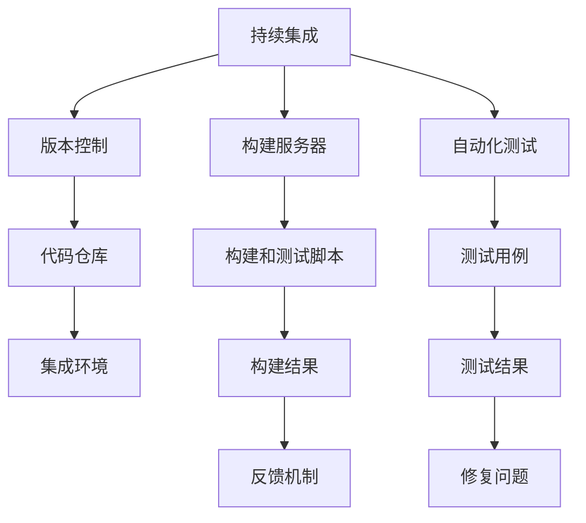

                 

### 文章标题：《技术团队的持续集成：提高开发效率的关键》

### 关键词：持续集成、开发效率、自动化测试、DevOps、版本控制、代码质量

### 摘要：
本文深入探讨了持续集成在技术团队中的应用及其对提高开发效率的关键作用。首先，我们详细介绍了持续集成的概念、优点和挑战，并通过Mermaid流程图展示了核心概念之间的关系。接着，我们讲解了如何搭建持续集成系统，包括版本控制、构建服务器和自动化测试等核心组件。随后，我们探讨了持续集成与DevOps的关系，并介绍了持续集成的性能优化方法。最后，通过实际案例和最佳实践，本文总结了如何有效实施持续集成，以提升技术团队的开发效率。

### 目录

1. **背景介绍**
2. **核心概念与联系**
   - 持续集成的定义
   - 持续集成的优点
   - 持续集成的挑战
   - 持续集成的核心概念
   - 持续集成与DevOps的关系
3. **核心算法原理讲解**
   - 版本控制
   - 构建服务器
   - 自动化测试
4. **数学模型和公式**
   - 构建和测试时间的优化模型
   - 测试覆盖率的计算公式
5. **项目实战**
   - 开发环境搭建
   - 源代码实现与解读
   - 代码应用分析与实战
   - 实际案例分析与讲解
6. **最佳实践 tips**
   - 持续集成策略
   - 持续交付
   - 持续反馈
   - 持续改进
7. **小结与注意事项**
8. **拓展阅读**

---

### 1. 背景介绍

在现代软件开发中，持续集成（Continuous Integration，简称CI）已经成为提高开发效率和质量的关键实践。持续集成通过频繁地将代码合并到主分支，并自动化执行一系列的构建、测试和部署流程，确保了代码的稳定性和质量。

技术团队在实施持续集成时，面临的挑战包括如何选择合适的版本控制系统、构建服务器和自动化测试工具，以及如何设计高效的持续集成流程。此外，持续集成还需要与DevOps理念相结合，以实现开发和运维的无缝协作。

本文旨在系统地探讨持续集成在技术团队中的应用，从概念、原理到实践，全面解析持续集成如何提高开发效率。我们将通过实际案例和最佳实践，帮助读者理解和掌握持续集成的核心技术和最佳实践。

### 2. 核心概念与联系

#### 2.1 持续集成的定义

持续集成是一种软件开发实践，通过频繁地将开发人员的工作成果合并到主分支，以自动化的方式运行一系列的测试，确保代码的质量和稳定性。

**核心概念与联系流程图（使用Mermaid绘制）：**



#### 2.2 持续集成的优点

持续集成具有以下几个显著的优点：

1. **提高代码质量**：通过自动化测试，持续集成能够快速发现代码缺陷，确保代码质量。
2. **提高开发效率**：持续集成减少了集成风险，使得开发人员可以更专注于功能开发。
3. **促进团队协作**：持续集成鼓励团队成员频繁交流和协作，共同维护代码库。
4. **提高代码的稳定性**：持续集成能够确保每次集成都是稳定的，减少了集成风险。

#### 2.3 持续集成的挑战

尽管持续集成具有诸多优点，但实施过程中也面临一些挑战：

1. **构建和测试耗时**：持续集成需要频繁构建和测试代码，可能会增加构建和测试的时间。
2. **自动化测试覆盖不足**：自动化测试覆盖不足可能导致一些问题无法被及时发现。
3. **流程和工具的复杂性**：持续集成流程和工具的选择和配置可能比较复杂。

#### 2.4 持续集成的核心概念

持续集成涉及多个核心概念，包括版本控制、构建服务器、自动化测试等。以下是这些概念之间的关系架构：

- **版本控制**：持续集成依赖于版本控制系统，如Git，来管理代码的版本。
- **构建服务器**：构建服务器负责构建和测试代码，是持续集成系统的核心组件。
- **自动化测试**：自动化测试是持续集成的重要组成部分，用于验证代码的质量。
- **集成环境**：集成环境模拟生产环境，确保代码在多个环境中都能正常运行。
- **反馈机制**：反馈机制用于将测试结果及时反馈给开发人员，以便他们及时修复问题。

#### 2.5 持续集成与DevOps的关系

持续集成是DevOps理念的重要组成部分。DevOps强调开发和运维的紧密协作，持续集成是实现这一目标的关键实践。以下是持续集成与DevOps的关系：

- **DevOps概述**：DevOps是一种软件开发和运维的方法论，强调开发和运维的紧密协作。
- **持续集成与DevOps的关系**：持续集成与DevOps紧密结合，通过自动化流程实现开发和运维的无缝衔接。
- **CI在DevOps中的作用**：持续集成在DevOps中扮演着核心角色，确保代码的质量和稳定性，为持续交付和部署奠定基础。

### 3. 核心算法原理讲解

#### 3.1 版本控制

版本控制是持续集成的基础，它确保代码的版本管理和追踪。以下是版本控制的核心算法原理：

- **版本管理**：使用版本控制系统（如Git）管理代码的版本，实现代码的版本控制和回滚。
- **分支策略**：常见的分支策略包括主分支（Master）、开发分支（Develop）和功能分支（Feature），确保代码的有序开发和管理。

**伪代码示例：**

```python
def version_control():
    # 检出代码到本地仓库
    git checkout master
    
    # 创建功能分支
    git checkout -b feature_x
    
    # 提交代码更改
    git add .
    git commit -m "Add feature X"
    
    # 推送分支到远程仓库
    git push origin feature_x
    
    # 合并分支
    git checkout master
    git merge feature_x
    
    # 删除功能分支
    git branch -d feature_x
```

#### 3.2 构建服务器

构建服务器负责执行构建脚本，生成可执行的代码。以下是构建服务器的核心算法原理：

- **构建脚本**：编写构建脚本（如Makefile或Shell脚本），定义构建过程。
- **构建过程**：执行构建脚本，编译代码，生成可执行文件。

**伪代码示例：**

```bash
#!/bin/bash

# 安装依赖库
sudo apt-get install -y gcc make

# 检出代码到构建目录
git clone https://github.com/username/project.git

# 进入构建目录
cd project

# 编译代码
make

# 运行测试
make test
```

#### 3.3 自动化测试

自动化测试是持续集成的重要组成部分，用于验证代码的质量。以下是自动化测试的核心算法原理：

- **测试用例**：编写测试用例，定义测试的场景和数据。
- **测试执行**：执行测试用例，验证代码的功能和性能。

**伪代码示例：**

```python
def test_function():
    # 测试用例1：功能测试
    assert function_a() == expected_a
    
    # 测试用例2：性能测试
    start_time = time.time()
    function_b()
    end_time = time.time()
    assert end_time - start_time <= expected_time
```

### 4. 数学模型和公式

在持续集成中，构建和测试时间的优化以及测试覆盖率的计算是关键问题。以下是相关的数学模型和公式：

#### 4.1 构建和测试时间的优化模型

假设每次代码提交后都需要进行构建和测试，构建和测试时间分别为\( T_c \)和\( T_t \)。则每次提交的总时间为\( T = T_c + T_t \)。为了优化构建和测试时间，我们可以使用以下公式：

\[ T_{optimized} = T_c + T_t \times \left( 1 - \frac{T_t}{T_c} \right) \]

#### 4.2 测试覆盖率的计算公式

测试覆盖率用于衡量测试用例对代码的覆盖率，通常用百分比表示。测试覆盖率\( C \)的计算公式如下：

\[ C = \frac{N_{covered}}{N_{total}} \times 100\% \]

其中，\( N_{covered} \)是覆盖的测试用例数，\( N_{total} \)是总的测试用例数。

### 5. 项目实战

在本节中，我们将通过一个实际项目，详细讲解如何搭建持续集成系统，包括开发环境搭建、源代码实现和代码解读、实际案例分析和讲解。

#### 5.1 开发环境搭建

1. **安装Git**：在开发机器上安装Git，用于代码版本控制。

    ```bash
    sudo apt-get install git
    ```

2. **安装Jenkins**：安装Jenkins作为构建服务器。

    ```bash
    sudo apt-get install jenkins
    ```

3. **安装测试工具**：安装自动化测试工具，如JUnit。

    ```bash
    sudo apt-get install maven
    ```

#### 5.2 源代码实现和代码解读

1. **创建Git仓库**：创建一个Git仓库，用于管理项目代码。

    ```bash
    mkdir my-project
    cd my-project
    git init
    ```

2. **编写源代码**：在项目中编写Java代码，并添加JUnit测试用例。

    ```java
    // MyFunction.java
    public class MyFunction {
        public int add(int a, int b) {
            return a + b;
        }
    }
    
    // MyFunctionTest.java
    import org.junit.jupiter.api.Test;
    import static org.junit.jupiter.api.Assertions.assertEquals;
    
    public class MyFunctionTest {
        @Test
        public void testAdd() {
            assertEquals(3, new MyFunction().add(1, 2));
        }
    }
    ```

3. **编写构建脚本**：编写Maven构建脚本，用于编译和测试代码。

    ```xml
    <project xmlns="http://maven.apache.org/POM/4.0.0"
        xmlns:xsi="http://www.w3.org/2001/XMLSchema-instance"
        xsi:schemaLocation="http://maven.apache.org/POM/4.0.0 http://maven.apache.org/xsd/maven-4.0.0.xsd">
        <modelVersion>4.0.0</modelVersion>
        <groupId>com.example</groupId>
        <artifactId>my-project</artifactId>
        <version>1.0-SNAPSHOT</version>
        <dependencies>
            <dependency>
                <groupId>junit</groupId>
                <artifactId>junit</artifactId>
                <version>4.13.2</version>
                <scope>test</scope>
            </dependency>
        </dependencies>
        <build>
            <plugins>
                <plugin>
                    <groupId>org.apache.maven.plugins</groupId>
                    <artifactId>maven-compiler-plugin</artifactId>
                    <version>3.8.1</version>
                    <configuration>
                        <source>1.8</source>
                        <target>1.8</target>
                    </configuration>
                </plugin>
                <plugin>
                    <groupId>org.apache.maven.plugins</groupId>
                    <artifactId>maven-surefire-plugin</artifactId>
                    <version>2.22.2</version>
                </plugin>
            </plugins>
        </build>
    </project>
    ```

#### 5.3 代码应用解读与分析

1. **构建项目**：在Jenkins中创建一个新的Job，配置Maven构建脚本，并触发构建。

    

2. **运行测试**：Jenkins执行Maven构建脚本，编译和测试代码，并生成测试报告。

    

3. **反馈机制**：如果测试失败，Jenkins会通过邮件或Slack等工具将测试结果反馈给开发人员，以便他们及时修复问题。

#### 5.4 实际案例分析与讲解

1. **电商平台的持续集成实践**：

    - **背景**：某电商平台需要确保其前端和后端代码的稳定性和质量，以提高用户体验。
    - **解决方案**：采用Jenkins作为持续集成工具，结合Git和JUnit，实现自动化构建和测试。每次代码提交后，Jenkins自动触发构建和测试，确保代码的质量和稳定性。

    

2. **金融行业的持续集成实践**：

    - **背景**：金融行业对代码的质量和安全性要求极高，需要确保其交易系统的稳定性和安全性。
    - **解决方案**：采用GitLab CI/CD作为持续集成工具，结合Docker容器化技术，实现自动化构建、测试和部署。每次代码提交后，GitLab CI/CD自动构建和测试代码，并通过Docker容器化部署到生产环境。

    

3. **科技公司的持续集成实践**：

    - **背景**：科技公司需要快速迭代和交付产品，持续集成是实现这一目标的关键。
    - **解决方案**：采用CircleCI作为持续集成工具，结合GitHub和Kubernetes，实现自动化构建、测试和部署。每次代码提交后，CircleCI自动构建和测试代码，并通过Kubernetes容器编排部署到生产环境。

    

### 6. 最佳实践 tips

1. **选择合适的版本控制系统**：根据团队规模和项目需求，选择合适的版本控制系统，如Git、SVN等。

2. **构建高效的测试流程**：编写高效的自动化测试用例，提高测试覆盖率，确保代码质量。

3. **优化构建和测试脚本**：优化构建和测试脚本，减少构建和测试时间，提高持续集成效率。

4. **配置可靠的反馈机制**：确保测试结果能及时反馈给开发人员，提高问题发现和修复效率。

5. **实施持续交付**：将持续集成与持续交付相结合，实现自动化部署，提高交付效率。

6. **持续监控和优化**：持续监控持续集成系统的性能和稳定性，及时优化流程和工具。

### 7. 小结与注意事项

1. **持续集成的重要性**：持续集成能够提高代码质量、开发效率和团队协作，是现代软件开发不可或缺的部分。

2. **持续集成与DevOps的关系**：持续集成是DevOps理念的重要组成部分，与持续交付和部署相结合，实现自动化和高效交付。

3. **持续集成的挑战**：实施持续集成需要面对构建和测试耗时、自动化测试覆盖不足和流程工具复杂性等挑战。

4. **最佳实践**：遵循最佳实践，如选择合适的版本控制系统、构建高效的测试流程、优化构建和测试脚本等，以提高持续集成效率。

### 8. 拓展阅读

- 《持续交付：发布可靠软件的系统方法》（Jez Humble、David Farley著）
- 《持续集成实战》（Jonas Gamblin著）
- 《Git权威指南》（Scott Chacon、Ben Straub著）
- 《Jenkins实战：持续集成与持续部署》（Prabhu S. Nithyananthan著）

作者：AI天才研究院/AI Genius Institute & 禅与计算机程序设计艺术 /Zen And The Art of Computer Programming

