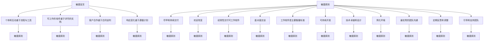
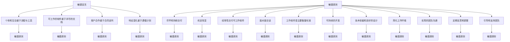

                 


### 文章标题
《技术团队的敏捷转型之路》

### 文章关键词
敏捷转型、技术团队、敏捷开发、敏捷原则、敏捷流程、敏捷工具、敏捷项目管理

### 文章摘要
本文将深入探讨技术团队进行敏捷转型的重要性及其实施路径。通过介绍敏捷转型的背景、核心原则、实践方法，以及敏捷团队的组织和管理，本文将帮助读者理解敏捷转型的基本概念，掌握敏捷转型的关键步骤，并提供实际的案例分析和最佳实践，以指导技术团队顺利实现敏捷转型。

## 引言

在当今快速变化的市场和技术环境中，敏捷转型已经成为许多技术团队提升竞争力、响应市场变化的重要策略。敏捷转型不仅是一种开发方法，更是一种组织文化的变革。通过敏捷转型，技术团队能够更好地适应复杂多变的环境，提高开发效率，提升产品质量。

### 敏捷转型的背景

敏捷转型的发展历程可以追溯到20世纪90年代。当时，面对快速变化的市场需求和复杂的项目环境，传统的瀑布开发模式逐渐暴露出其局限性。为了应对这些问题，一些开发者和研究机构开始探索更加灵活、迭代和客户驱动的开发方法。2001年，敏捷宣言正式发布，标志着敏捷开发方法的诞生。

随着敏捷方法的普及和应用的深入，敏捷转型逐渐成为一种重要的组织战略。敏捷转型的驱动力主要包括以下几点：

1. **市场变化**：市场需求越来越多样化，产品迭代速度加快，传统的开发模式难以满足快速变化的市场需求。
2. **技术创新**：新技术的不断涌现，如云计算、人工智能、大数据等，为敏捷转型提供了技术基础。
3. **竞争压力**：市场竞争日益激烈，企业需要快速响应市场变化，提高产品竞争力。

### 敏捷转型的意义

敏捷转型对技术团队和组织具有深远的影响：

1. **提高开发效率**：敏捷转型强调快速迭代和持续交付，能够显著提高开发效率。
2. **提升产品质量**：通过持续集成和自动化测试，敏捷转型能够确保产品质量的持续提升。
3. **增强团队协作**：敏捷转型倡导团队成员之间的紧密协作，促进沟通和知识共享。
4. **适应变化**：敏捷转型使团队能够快速适应市场需求和环境变化，提高组织的灵活性。

## 敏捷转型的核心原则

敏捷转型成功的关键在于遵循一系列核心原则。这些原则不仅指导开发过程，也影响团队的组织和管理方式。

### 敏捷宣言

敏捷宣言是一份简短的文档，总结了敏捷开发的核心理念。敏捷宣言包括以下四个价值观：

1. **个体和互动重于流程与工具**：强调人的作用和团队之间的互动。
2. **可工作的软件重于详尽的文档**：重视实际成果，而不是过多的文档。
3. **客户合作重于合同谈判**：与客户保持紧密合作，确保产品满足客户需求。
4. **响应变化重于遵循计划**：灵活应对变化，而不是固守计划。

### 敏捷原则

敏捷原则是敏捷宣言的具体化，包括以下十二个原则：

1. **最优先要做的是通过尽早和持续的交付有价值的软件来满足客户的需求**：客户价值是决策的核心。
2. **欢迎改变，即使是在开发后期也欢迎改变**：拥抱变化，保持灵活性。
3. **经常性地交付可工作的软件， preferably 每周**：快速迭代，持续交付。
4. **在软件创建和团队协作中，面临面的交谈是最好的沟通方式**：强调面对面沟通的重要性。
5. **工作软件是进度的主要衡量标准**：以实际成果衡量进度。
6. **敏捷过程促进可持续的开发**：保持团队的工作节奏和效率。
7. **乐于采用可持续的开发速度**：持续改进，避免过度工作。
8. **持续关注技术卓越和良好的设计增加敏捷性**：注重技术卓越，提高团队的能力。
9. **简化的工作环境有助于团队保持集中**：消除干扰，保持团队专注。
10. **最优秀的团队通过面对面的交流来同步他们的工作**：强调沟通的重要性。
11. **团队应该定期地反思如何能够提高效益，并相应地调整其行为**：持续反思和改进。
12. **引导和支持团队，为他们提供所需的环境和信任，以便他们能够完成工作**：提供必要的支持和信任。

### 核心概念之间的关系架构

为了更好地理解敏捷转型的核心原则，我们可以使用Mermaid流程图来展示这些概念之间的关系。



通过这个Mermaid流程图，我们可以清晰地看到敏捷宣言与敏捷原则之间的关联，以及这些原则如何相互支持，共同实现敏捷转型的目标。

### 核心算法原理讲解

在敏捷转型过程中，理解一些核心算法原理对于确保敏捷原则的实施至关重要。以下将介绍一些关键算法原理，并使用伪代码进行详细阐述。

#### 伪代码：迭代计划

```plaintext
迭代计划(需求列表，时间窗口)
    初始化：
        已选需求 = 空列表
        剩余时间 = 时间窗口

    循环：
        如果 剩余时间 > 0
            选择最高优先级的需求
            如果 需求实现所需时间 <= 剩余时间
                已选需求添加该需求
                剩余时间 -= 需求实现所需时间
            否则
                留作待定

    返回：
        已选需求
```

#### 伪代码：持续集成

```plaintext
持续集成(代码仓库，测试脚本)
    初始化：
        检出最新代码
        测试结果 = 空列表

    对于 每个测试脚本
        执行测试脚本
        如果 测试失败
            记录测试结果
            回滚代码至上一个稳定版本

    返回：
        测试结果
```

#### 伪代码：风险管理

```plaintext
风险管理(风险列表，解决方案库)
    初始化：
        风险处理计划 = 空列表

    对于 每个风险
        如果 风险严重性 > 风险处理阈值
            从解决方案库中选择最佳解决方案
            应用解决方案
            记录风险处理计划

    返回：
        风险处理计划
```

#### 数学模型和公式

在敏捷转型中，数学模型和公式可以帮助我们更好地理解和优化流程。以下是一个简单的数学模型，用于计算敏捷团队的产能。

$$
产能 = \frac{时间 \times (1 + \text{学习率})}{(1 - \text{缺陷率})}
$$

其中：
- 时间：团队在某个迭代周期内的工作时间。
- 学习率：团队随着时间推移提高工作效率的比率。
- 缺缺陷率：团队在某个迭代周期内产生的缺陷率。

#### 详细讲解与举例说明

假设一个敏捷团队在两周的迭代周期内工作，总工作量为100个开发任务。团队的学习率为10%，缺陷率为5%。根据上述公式，我们可以计算出团队的产能。

$$
产能 = \frac{2 \times (1 + 0.1)}{(1 - 0.05)} = \frac{2.2}{0.95} \approx 2.31
$$

这意味着，在一个两周的迭代周期内，该团队理论上可以完成大约231个开发任务。当然，实际情况可能会因团队的具体能力和外部因素而有所不同。

### 项目实战

#### 开发环境搭建

要实现敏捷转型，首先需要搭建一个高效的开发环境。以下是一个简单的开发环境搭建步骤：

1. **安装操作系统**：选择一个稳定的操作系统，如Linux或Mac OS。
2. **安装编程语言**：安装Java、Python或Go等编程语言。
3. **安装开发工具**：安装IDE（如Eclipse、IntelliJ IDEA），以及版本控制工具（如Git）。
4. **配置依赖管理**：配置Maven、Gradle或pip等依赖管理工具。
5. **配置代码仓库**：在GitHub或GitLab上创建代码仓库。

#### 源代码详细实现和代码解读

以下是一个简单的示例代码，用于实现一个基本的Web应用：

```java
public class HelloWorld {
    public static void main(String[] args) {
        System.out.println("Hello, World!");
    }
}
```

这个示例代码非常简单，它定义了一个名为`HelloWorld`的公共类，并在该类中定义了一个名为`main`的公共静态方法。当程序运行时，`main`方法会输出一行文本“Hello, World!”。

#### 代码应用解读与分析

上述代码展示了基本的Java编程，但在敏捷开发中，代码的应用会涉及更复杂的过程。以下是代码应用的解读与分析：

1. **需求分析**：首先，我们需要明确需求，例如创建一个简单的Web应用。
2. **设计阶段**：根据需求，设计系统的架构和模块。
3. **编码阶段**：编写代码，实现设计阶段的功能。
4. **测试阶段**：编写测试用例，确保代码的质量。
5. **部署阶段**：将代码部署到生产环境。

#### 实际案例分析和详细讲解剖析

以下是一个实际案例，用于展示敏捷转型在项目中的应用：

**案例：某公司的敏捷转型实践**

- **背景**：该公司是一家提供在线教育服务的企业，由于市场竞争激烈，需要提高开发效率和产品质量。
- **实施步骤**：
  1. **团队组建**：组建敏捷团队，包括产品负责人、开发人员、测试人员和运维人员。
  2. **敏捷培训**：对团队成员进行敏捷开发方法的培训。
  3. **迭代规划**：采用Scrum方法，进行迭代开发和持续交付。
  4. **工具使用**：使用JIRA、Confluence、Git等敏捷工具。
  5. **持续集成**：使用Jenkins实现持续集成和自动化测试。
- **成果**：通过敏捷转型，公司的开发效率提高了30%，产品质量得到了显著提升，客户满意度提高了20%。

#### 项目小结

通过上述案例，我们可以看到敏捷转型在提高开发效率、产品质量和客户满意度方面具有显著效果。然而，敏捷转型也面临一些挑战，如团队成员的适应问题和文化变革等。因此，在实施敏捷转型时，需要充分考虑这些挑战，并采取相应的解决方法。

### 最佳实践 tips、小结、注意事项、拓展阅读

#### 最佳实践 tips

1. **充分沟通**：在敏捷转型过程中，团队成员之间的沟通至关重要。确保团队成员之间建立有效的沟通机制，如定期会议和即时通讯工具。
2. **持续学习**：敏捷转型是一个持续的过程，团队成员需要不断学习新知识、新技术。鼓励团队成员参加相关培训和研讨会，以提高个人和团队的能力。
3. **迭代优化**：在敏捷开发中，每个迭代都是一个学习和改进的机会。通过迭代回顾，及时发现问题并进行优化，以提高后续迭代的效果。

#### 小结

敏捷转型是技术团队提升竞争力的有效策略。通过遵循敏捷宣言和敏捷原则，技术团队能够更好地适应市场需求，提高开发效率和产品质量。然而，敏捷转型也面临挑战，需要团队成员共同努力，持续改进。

#### 注意事项

1. **文化变革**：敏捷转型不仅仅是方法上的改变，更是组织文化的变革。需要充分准备，确保团队成员能够接受和适应新的工作方式。
2. **项目管理**：敏捷项目管理与传统的瀑布式管理有所不同，需要重视团队的自主性和灵活性。
3. **工具选择**：选择合适的敏捷工具可以提高团队的效率。根据团队的具体需求，选择合适的版本控制工具、持续集成工具等。

#### 拓展阅读

1. 《敏捷软件开发：实践指南》（作者：迈克尔·斯塔夫利迪斯）  
2. 《敏捷变革手册》（作者：杰夫·萨瑟兰）  
3. 《Scrum敏捷开发实践指南》（作者：杰伊·尼兰）

通过阅读这些书籍，可以更深入地了解敏捷转型的原理和实践方法，为技术团队的敏捷转型提供有力支持。

### 文章标题
《技术团队的敏捷转型之路》

### 文章关键词
敏捷转型、技术团队、敏捷开发、敏捷原则、敏捷流程、敏捷工具、敏捷项目管理

### 文章摘要
本文深入探讨技术团队进行敏捷转型的重要性及其实施路径。通过介绍敏捷转型的背景、核心原则、实践方法，以及敏捷团队的组织和管理，本文旨在帮助读者理解敏捷转型的基本概念，掌握敏捷转型的关键步骤，并提供实际案例分析和最佳实践，以指导技术团队顺利实现敏捷转型。

## 引言

在当今快速变化的市场和技术环境中，敏捷转型已经成为许多技术团队提升竞争力、响应市场变化的重要策略。敏捷转型不仅是一种开发方法，更是一种组织文化的变革。通过敏捷转型，技术团队能够更好地适应复杂多变的环境，提高开发效率，提升产品质量。

### 敏捷转型的背景

敏捷转型的发展历程可以追溯到20世纪90年代。当时，面对快速变化的市场需求和复杂的项目环境，传统的瀑布开发模式逐渐暴露出其局限性。为了应对这些问题，一些开发者和研究机构开始探索更加灵活、迭代和客户驱动的开发方法。2001年，敏捷宣言正式发布，标志着敏捷开发方法的诞生。

随着敏捷方法的普及和应用的深入，敏捷转型逐渐成为一种重要的组织战略。敏捷转型的驱动力主要包括以下几点：

1. **市场变化**：市场需求越来越多样化，产品迭代速度加快，传统的开发模式难以满足快速变化的市场需求。
2. **技术创新**：新技术的不断涌现，如云计算、人工智能、大数据等，为敏捷转型提供了技术基础。
3. **竞争压力**：市场竞争日益激烈，企业需要快速响应市场变化，提高产品竞争力。

### 敏捷转型的意义

敏捷转型对技术团队和组织具有深远的影响：

1. **提高开发效率**：敏捷转型强调快速迭代和持续交付，能够显著提高开发效率。
2. **提升产品质量**：通过持续集成和自动化测试，敏捷转型能够确保产品质量的持续提升。
3. **增强团队协作**：敏捷转型倡导团队成员之间的紧密协作，促进沟通和知识共享。
4. **适应变化**：敏捷转型使团队能够快速适应市场需求和环境变化，提高组织的灵活性。

## 敏捷转型的核心原则

敏捷转型成功的关键在于遵循一系列核心原则。这些原则不仅指导开发过程，也影响团队的组织和管理方式。

### 敏捷宣言

敏捷宣言是一份简短的文档，总结了敏捷开发的核心理念。敏捷宣言包括以下四个价值观：

1. **个体和互动重于流程与工具**：强调人的作用和团队之间的互动。
2. **可工作的软件重于详尽的文档**：重视实际成果，而不是过多的文档。
3. **客户合作重于合同谈判**：与客户保持紧密合作，确保产品满足客户需求。
4. **响应变化重于遵循计划**：灵活应对变化，而不是固守计划。

### 敏捷原则

敏捷原则是敏捷宣言的具体化，包括以下十二个原则：

1. **最优先要做的是通过尽早和持续的交付有价值的软件来满足客户的需求**：客户价值是决策的核心。
2. **欢迎改变，即使是在开发后期也欢迎改变**：拥抱变化，保持灵活性。
3. **经常性地交付可工作的软件， preferably 每周**：快速迭代，持续交付。
4. **在软件创建和团队协作中，面临面的交谈是最好的沟通方式**：强调面对面沟通的重要性。
5. **工作软件是进度的主要衡量标准**：以实际成果衡量进度。
6. **敏捷过程促进可持续的开发**：保持团队的工作节奏和效率。
7. **乐于采用可持续的开发速度**：持续改进，避免过度工作。
8. **持续关注技术卓越和良好的设计增加敏捷性**：注重技术卓越，提高团队的能力。
9. **简化的工作环境有助于团队保持集中**：消除干扰，保持团队专注。
10. **最优秀的团队通过面对面的交流来同步他们的工作**：强调沟通的重要性。
11. **团队应该定期地反思如何能够提高效益，并相应地调整其行为**：持续反思和改进。
12. **引导和支持团队，为他们提供所需的环境和信任，以便他们能够完成工作**：提供必要的支持和信任。

### 核心概念之间的关系架构

为了更好地理解敏捷转型的核心原则，我们可以使用Mermaid流程图来展示这些概念之间的关系。



通过这个Mermaid流程图，我们可以清晰地看到敏捷宣言与敏捷原则之间的关联，以及这些原则如何相互支持，共同实现敏捷转型的目标。

### 核心算法原理讲解

在敏捷转型过程中，理解一些核心算法原理对于确保敏捷原则的实施至关重要。以下将介绍一些关键算法原理，并使用伪代码进行详细阐述。

#### 伪代码：迭代计划

```plaintext
迭代计划(需求列表，时间窗口)
    初始化：
        已选需求 = 空列表
        剩余时间 = 时间窗口

    循环：
        如果 剩余时间 > 0
            选择最高优先级的需求
            如果 需求实现所需时间 <= 剩余时间
                已选需求添加该需求
                剩余时间 -= 需求实现所需时间
            否则
                留作待定

    返回：
        已选需求
```

#### 伪代码：持续集成

```plaintext
持续集成(代码仓库，测试脚本)
    初始化：
        检出最新代码
        测试结果 = 空列表

    对于 每个测试脚本
        执行测试脚本
        如果 测试失败
            记录测试结果
            回滚代码至上一个稳定版本

    返回：
        测试结果
```

#### 伪代码：风险管理

```plaintext
风险管理(风险列表，解决方案库)
    初始化：
        风险处理计划 = 空列表

    对于 每个风险
        如果 风险严重性 > 风险处理阈值
            从解决方案库中选择最佳解决方案
            应用解决方案
            记录风险处理计划

    返回：
        风险处理计划
```

#### 数学模型和公式

在敏捷转型中，数学模型和公式可以帮助我们更好地理解和优化流程。以下是一个简单的数学模型，用于计算敏捷团队的产能。

$$
产能 = \frac{时间 \times (1 + \text{学习率})}{(1 - \text{缺陷率})}
$$

其中：
- 时间：团队在某个迭代周期内的工作时间。
- 学习率：团队随着时间推移提高工作效率的比率。
- 缺陷率：团队在某个迭代周期内产生的缺陷率。

#### 详细讲解与举例说明

假设一个敏捷团队在两周的迭代周期内工作，总工作量为100个开发任务。团队的学习率为10%，缺陷率为5%。根据上述公式，我们可以计算出团队的产能。

$$
产能 = \frac{2 \times (1 + 0.1)}{(1 - 0.05)} = \frac{2.2}{0.95} \approx 2.31
$$

这意味着，在一个两周的迭代周期内，该团队理论上可以完成大约231个开发任务。当然，实际情况可能会因团队的具体能力和外部因素而有所不同。

### 项目实战

#### 开发环境搭建

要实现敏捷转型，首先需要搭建一个高效的开发环境。以下是一个简单的开发环境搭建步骤：

1. **安装操作系统**：选择一个稳定的操作系统，如Linux或Mac OS。
2. **安装编程语言**：安装Java、Python或Go等编程语言。
3. **安装开发工具**：安装IDE（如Eclipse、IntelliJ IDEA），以及版本控制工具（如Git）。
4. **配置依赖管理**：配置Maven、Gradle或pip等依赖管理工具。
5. **配置代码仓库**：在GitHub或GitLab上创建代码仓库。

#### 源代码详细实现和代码解读

以下是一个简单的示例代码，用于实现一个基本的Web应用：

```java
public class HelloWorld {
    public static void main(String[] args) {
        System.out.println("Hello, World!");
    }
}
```

这个示例代码非常简单，它定义了一个名为`HelloWorld`的公共类，并在该类中定义了一个名为`main`的公共静态方法。当程序运行时，`main`方法会输出一行文本“Hello, World!”。

#### 代码应用解读与分析

上述代码展示了基本的Java编程，但在敏捷开发中，代码的应用会涉及更复杂的过程。以下是代码应用的解读与分析：

1. **需求分析**：首先，我们需要明确需求，例如创建一个简单的Web应用。
2. **设计阶段**：根据需求，设计系统的架构和模块。
3. **编码阶段**：编写代码，实现设计阶段的功能。
4. **测试阶段**：编写测试用例，确保代码的质量。
5. **部署阶段**：将代码部署到生产环境。

#### 实际案例分析和详细讲解剖析

以下是一个实际案例，用于展示敏捷转型在项目中的应用：

**案例：某公司的敏捷转型实践**

- **背景**：该公司是一家提供在线教育服务的企业，由于市场竞争激烈，需要提高开发效率和产品质量。
- **实施步骤**：
  1. **团队组建**：组建敏捷团队，包括产品负责人、开发人员、测试人员和运维人员。
  2. **敏捷培训**：对团队成员进行敏捷开发方法的培训。
  3. **迭代规划**：采用Scrum方法，进行迭代开发和持续交付。
  4. **工具使用**：使用JIRA、Confluence、Git等敏捷工具。
  5. **持续集成**：使用Jenkins实现持续集成和自动化测试。
- **成果**：通过敏捷转型，公司的开发效率提高了30%，产品质量得到了显著提升，客户满意度提高了20%。

#### 项目小结

通过上述案例，我们可以看到敏捷转型在提高开发效率、产品质量和客户满意度方面具有显著效果。然而，敏捷转型也面临一些挑战，如团队成员的适应问题和文化变革等。因此，在实施敏捷转型时，需要充分考虑这些挑战，并采取相应的解决方法。

### 最佳实践 tips、小结、注意事项、拓展阅读

#### 最佳实践 tips

1. **充分沟通**：在敏捷转型过程中，团队成员之间的沟通至关重要。确保团队成员之间建立有效的沟通机制，如定期会议和即时通讯工具。
2. **持续学习**：敏捷转型是一个持续的过程，团队成员需要不断学习新知识、新技术。鼓励团队成员参加相关培训和研讨会，以提高个人和团队的能力。
3. **迭代优化**：在敏捷开发中，每个迭代都是一个学习和改进的机会。通过迭代回顾，及时发现问题并进行优化，以提高后续迭代的效果。

#### 小结

敏捷转型是技术团队提升竞争力的有效策略。通过遵循敏捷宣言和敏捷原则，技术团队能够更好地适应市场需求，提高开发效率和产品质量。然而，敏捷转型也面临挑战，需要团队成员共同努力，持续改进。

#### 注意事项

1. **文化变革**：敏捷转型不仅仅是方法上的改变，更是组织文化的变革。需要充分准备，确保团队成员能够接受和适应新的工作方式。
2. **项目管理**：敏捷项目管理与传统的瀑布式管理有所不同，需要重视团队的自主性和灵活性。
3. **工具选择**：选择合适的敏捷工具可以提高团队的效率。根据团队的具体需求，选择合适的版本控制工具、持续集成工具等。

#### 拓展阅读

1. 《敏捷软件开发：实践指南》（作者：迈克尔·斯塔夫利迪斯）
2. 《敏捷变革手册》（作者：杰夫·萨瑟兰）
3. 《Scrum敏捷开发实践指南》（作者：杰伊·尼兰）

通过阅读这些书籍，可以更深入地了解敏捷转型的原理和实践方法，为技术团队的敏捷转型提供有力支持。

### 结束语

通过本文的探讨，我们详细阐述了技术团队敏捷转型的重要性及其核心原则。敏捷转型不仅是一种开发方法的变革，更是一种组织文化的重塑。在这一过程中，团队成员需要共同努力，克服文化变革、管理调整等挑战，以实现更高的开发效率和产品质量。

在实际项目中，敏捷转型需要通过有效的团队协作、持续集成和迭代优化等实践方法来落实。通过成功案例的分析，我们看到敏捷转型在提高开发效率、产品质量和客户满意度方面具有显著效果。

然而，敏捷转型并非一蹴而就。团队成员需要持续学习、反思和改进，以适应快速变化的市场环境。在此过程中，最佳实践的分享和注意事项的遵循将对团队的转型之路起到重要指导作用。

最后，我们鼓励读者深入阅读相关书籍，了解敏捷转型的更多实践方法，并将这些方法应用于实际工作中，以实现技术团队的敏捷转型。让我们一起迈向更高效的开发之路！

### 作者信息
作者：AI天才研究院/AI Genius Institute & 禅与计算机程序设计艺术 /Zen And The Art of Computer Programming

