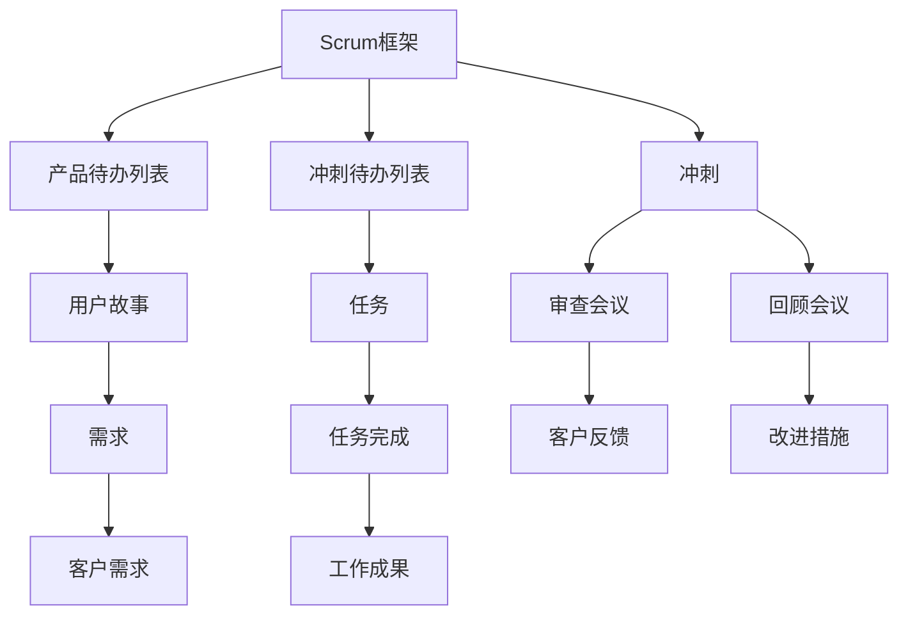

                 


### 敏捷开发的基本概念

#### 敏捷开发的起源与发展

敏捷开发（Agile Development）起源于20世纪90年代，它是对传统的瀑布式开发方法的一种反思和改进。最早的敏捷思想可以追溯到1980年代末，当时一些软件开发人员开始质疑传统开发方法的局限性。到了1990年代初，软件开发领域出现了一系列问题，如项目延期、预算超支、质量低下等，这些问题促使人们寻求新的开发方法。

1999年，17位软件开发专家在雪鸟峰会议上共同签署了《敏捷宣言》（The Agile Manifesto），正式提出了敏捷开发的核心理念。这份宣言强调了个体和互动的重要性、可工作的软件的重要性、客户合作的持续进行以及响应变化的重要性。

敏捷开发的发展经历了多个阶段，从最初的轻量级方法，如Scrum和Kanban，到后来的扩展和实践，如看板（Kanban）和极限编程（XP）。随着互联网和移动应用的兴起，敏捷开发逐渐成为软件开发的主流方法，广泛应用于各种规模和类型的软件项目。

#### 敏捷开发的核心理念

敏捷开发的核心思想可以概括为“响应变化，快速迭代”。它强调在开发过程中保持灵活性，通过不断迭代和反馈来适应变化。以下是敏捷开发的几个核心理念：

1. **个体和互动高于过程和工具**：敏捷开发认为，团队的成员和他们的合作比遵循特定的流程或使用特定的工具更为重要。

2. **可工作的软件高于详尽的文档**：敏捷开发强调交付可用的软件，而不是编写详细的文档。

3. **客户合作高于合同谈判**：敏捷开发鼓励与客户紧密合作，通过频繁的沟通和反馈来确保开发的方向和目标与客户的需求一致。

4. **响应变化高于遵循计划**：敏捷开发认为，变化是不可避免的，因此，项目应该具备灵活性，能够迅速适应变化。

#### 敏捷开发的实践原则

敏捷开发的实践原则进一步详细阐述了其核心理念。以下是一些关键的实践原则：

1. **需求可通过持续交付来渐进地满足**：敏捷开发强调持续交付工作成果，而不是一次性交付完整的项目。

2. **welcoming changing requirements**：敏捷开发接受需求的变化，甚至在开发后期，也能适应这些变化。

3. **频繁交付工作成果**：通常每个迭代周期（Sprint）为2到4周，每个迭代都会交付一个可以工作的软件版本。

4. **在较短的迭代中进行计划和评估**：迭代周期短，可以更快地得到反馈，从而更快地调整计划和方向。

5. **鼓励可持续的开发速度**：敏捷开发鼓励团队成员保持稳定的开发速度，避免过度工作。

6. **经常性地进行反思和调整**：敏捷开发要求团队定期进行反思，从经验中学习，并根据反馈调整开发过程。

通过这些实践原则，敏捷开发旨在提高软件开发的质量和效率，同时确保团队能够快速响应客户和市场的需求。

### 敏捷开发与传统开发方法的比较

#### 传统开发方法的特点

传统开发方法，如瀑布模型（Waterfall Model），是一种线性、顺序的开发方法，其特点如下：

1. **严格的项目计划**：在项目开始前，需要详细规划所有阶段的工作，包括需求分析、设计、开发、测试和部署等。

2. **阶段性交付**：项目被分为多个阶段，每个阶段完成后才能进入下一个阶段。例如，需求分析完成后才能进行设计，设计完成后才能进入开发。

3. **详尽的文档**：在每个阶段，需要编写详细的文档，如需求文档、设计文档、测试文档等。

4. **固定的需求和范围**：项目启动时，需求和范围通常被认为是固定的，除非出现重大问题，否则不会更改。

5. **线性进度跟踪**：项目的进度通常通过里程碑和进度报告来跟踪，每个里程碑都有明确的交付目标。

#### 敏捷开发的优势

与传统的瀑布模型相比，敏捷开发具有以下优势：

1. **灵活性**：敏捷开发接受需求的变化，项目可以在开发过程中进行调整，以更好地适应变化。

2. **快速反馈**：通过短周期的迭代，开发团队能够快速获得反馈，并根据反馈调整开发方向。

3. **持续交付**：敏捷开发强调持续交付可工作的软件，而不是等到项目全部完成。

4. **高效的团队协作**：敏捷开发鼓励团队成员之间的紧密合作，通过每日站会和迭代回顾来提高协作效率。

5. **客户参与**：敏捷开发强调与客户的紧密合作，通过频繁的沟通确保项目符合客户的需求。

6. **风险控制**：由于敏捷开发采用迭代的方式，每个迭代都会交付工作成果，因此可以在早期识别和纠正问题。

#### 敏捷开发与敏捷转型的区别

敏捷开发是一种开发方法，而敏捷转型（Agile Transformation）是指整个组织从传统的开发方法向敏捷方法转型的过程。敏捷转型的关键区别包括：

1. **范围**：敏捷开发主要关注开发过程和方法，而敏捷转型涉及整个组织的文化、流程和组织结构。

2. **目标**：敏捷开发的目标是提高软件开发的质量和效率，而敏捷转型的目标是建立一种敏捷的组织文化和流程，以支持持续的创新和响应变化。

3. **实施**：敏捷开发通常由开发团队执行，而敏捷转型需要整个组织的管理层和团队成员的参与。

4. **复杂性**：敏捷开发相对简单，可以在团队层面实施，而敏捷转型涉及多个部门和层次，更加复杂。

通过敏捷转型，组织可以更好地适应快速变化的市场需求，提高开发效率和质量，同时建立一种以客户需求为中心的文化。

### 敏捷开发的核心实践

敏捷开发的核心实践包括Scrum框架、Kanban方法和敏捷团队的组织结构。这些实践共同构成了敏捷开发的基础，帮助团队提高软件开发的质量和效率。

#### Scrum框架

Scrum是一种流行的敏捷开发框架，它通过迭代和增量开发的方式，帮助团队快速响应变化。以下是Scrum框架的核心组成部分：

1. **产品待办列表（Product Backlog）**：产品待办列表是团队需要完成的所有任务的列表，这些任务被称为用户故事（User Stories）。用户故事通常以“作为一个……，我想要……，以便……”的形式描述。

2. **冲刺待办列表（Sprint Backlog）**：在每一轮冲刺（Sprint）开始时，团队从产品待办列表中选择一些用户故事，并将其添加到冲刺待办列表中。冲刺待办列表是团队在冲刺期间需要完成的任务列表。

3. **冲刺（Sprint）**：冲刺是Scrum的核心概念之一，通常持续2到4周。在每个冲刺期间，团队专注于完成冲刺待办列表中的用户故事。

4. **每日站会（Daily Stand-up）**：每日站会是一种简短的会议，通常持续15分钟。站会的目的是确保团队成员了解项目的进展，协调工作，解决潜在的问题。

5. **审查会议（Review）**：审查会议是每个冲刺结束时进行的会议，团队展示他们在冲刺期间完成的用户故事，收集反馈，并根据反馈进行调整。

6. **回顾会议（Retrospective）**：回顾会议是每个冲刺结束后的会议，团队讨论他们在冲刺期间的表现，识别需要改进的领域，并制定改进计划。

#### Kanban方法

Kanban是一种基于看板的敏捷开发方法，它通过可视化工作流程，帮助团队提高效率和减少浪费。以下是Kanban方法的核心组成部分：

1. **看板板（Kanban Board）**：看板板是一个可视化的工作流程，通常包含三个主要区域：待办区（To Do）、进行中区（In Progress）和完成区（Done）。每个区域都包含一组卡片，表示需要完成的工作。

2. **工作流限制（Work In Progress Limit）**：工作流限制是指在一个特定区域中可以同时处理的最大任务数量。这个限制有助于减少任务堆积，提高工作效率。

3. **卡片（Card）**：卡片是表示一个任务的最小单位，通常包含任务名称、任务描述、优先级、负责人等信息。

4. **进度跟踪（Progress Tracking）**：通过看板板，团队能够清晰地了解每个任务的进展情况，及时发现和解决瓶颈。

#### 敏捷团队的组织结构

敏捷团队的组织结构与传统团队有很大的不同，它更注重跨职能和自组织。以下是敏捷团队的核心组织结构：

1. **Scrum Master**：Scrum Master是敏捷团队的教练和导师，负责确保团队遵循Scrum框架，解决团队遇到的障碍，并促进持续改进。

2. **Product Owner**：Product Owner是敏捷团队的产品负责人，负责定义产品愿景、制定产品待办列表，并与客户沟通，确保团队能够交付符合客户需求的产品。

3. **开发团队**：开发团队是敏捷团队的核心成员，他们负责实现产品待办列表中的用户故事，通常包括开发人员、测试人员、设计师等。

4. **自组织**：敏捷团队具有高度的自主性，团队成员根据项目需求自主分配任务，并负责完成这些任务。

通过Scrum框架、Kanban方法和敏捷团队的组织结构，敏捷开发能够提高团队的合作效率，快速响应变化，并交付高质量的产品。

### 敏捷转型前的评估

在进行敏捷转型之前，团队和企业需要进行全面的评估，以确保转型的成功。以下是敏捷转型前需要进行的几个关键评估：

#### 团队敏捷成熟度评估

1. **评估标准**：团队敏捷成熟度评估通常基于一系列标准，如Scrum实践、敏捷原则的遵循情况、团队的协作效率等。

2. **评估方法**：评估方法包括问卷调查、面谈、团队工作坊等。通过这些方法，可以收集团队成员的反馈，了解团队的现状和存在的问题。

3. **评估结果**：评估结果可以帮助团队识别需要改进的领域，并为后续的转型计划提供依据。

#### 企业敏捷转型风险评估

1. **评估内容**：企业敏捷转型风险评估主要包括项目风险、组织风险、技术风险等。项目风险可能包括资源不足、进度延误等；组织风险可能包括文化抵触、管理层的支持不足等；技术风险可能包括技术债务、技术架构的不适应性等。

2. **评估方法**：评估方法包括风险识别、风险分析、风险排序等。通过这些方法，可以系统性地识别和评估可能的风险。

3. **评估结果**：评估结果可以帮助企业制定风险管理计划，提前预防和应对可能出现的风险。

#### 敏捷转型的目标设定

1. **目标类型**：敏捷转型的目标可以分为短期目标、中期目标和长期目标。短期目标可能包括提高团队的协作效率、减少项目延期等；中期目标可能包括建立敏捷文化、优化开发流程等；长期目标可能包括持续提高产品质量、增强市场竞争力等。

2. **目标设定方法**：目标设定方法包括目标分解、SMART原则（具体、可衡量、可达成、相关、时限）等。通过这些方法，可以确保目标的明确性和可实现性。

3. **目标评估方法**：目标评估方法包括定期检查、反馈机制等。通过这些方法，可以监控目标的实现情况，并根据实际情况进行调整。

通过团队敏捷成熟度评估、企业敏捷转型风险评估和敏捷转型目标的设定，团队能够更好地准备敏捷转型，为后续的实施奠定坚实的基础。

### 敏捷转型的组织与文化准备

敏捷转型不仅仅是技术的变革，更是一种组织文化的转变。为了成功实施敏捷转型，团队和企业需要在组织结构和文化方面做出相应的调整。

#### 组织结构调整

1. **扁平化组织**：敏捷团队通常采用扁平化的组织结构，减少中间管理层次，增加团队成员的自主性。这样可以提高决策速度和团队协作效率。

2. **跨职能团队**：敏捷团队是跨职能的，包含开发、测试、设计和运维等不同角色的成员。这样可以确保团队能够独立完成从需求到交付的全过程，减少依赖和沟通成本。

3. **去中心化管理**：在敏捷转型中，管理层不再是命令和控制的角色，而是转变为支持者和促进者。这种去中心化的管理模式有助于提高团队的自主性和创造力。

#### 文化的改变

1. **开放与透明**：敏捷文化强调开放和透明，鼓励团队成员之间频繁沟通，共享信息。这样可以提高团队的信任和协作效率。

2. **客户导向**：敏捷转型要求团队以客户需求为导向，通过持续交付和反馈来确保项目符合客户期望。

3. **学习和改进**：敏捷文化鼓励团队成员不断学习和改进，通过定期回顾和反思，不断优化开发过程。

4. **鼓励失败**：敏捷文化认为失败是学习的机会，鼓励团队成员从失败中吸取教训，不断提高。

#### 敏捷教练与团队成员的角色转变

1. **敏捷教练**：敏捷教练是团队在敏捷转型过程中的指导者，负责确保团队遵循敏捷原则和实践。他们需要具备丰富的敏捷知识和经验，能够帮助团队解决各种问题。

2. **团队成员**：在敏捷转型中，团队成员的角色也发生了变化。他们需要从执行者转变为参与者和决策者，积极参与团队的规划和决策过程。

通过组织结构调整和文化的改变，团队能够更好地适应敏捷开发的要求，提高协作效率和质量，为敏捷转型奠定坚实的基础。

### 敏捷转型的资源准备

在敏捷转型过程中，团队和企业需要充分准备必要的资源，以确保转型的顺利实施。以下是敏捷转型过程中需要考虑的关键资源准备：

#### 技术工具的选取

1. **项目管理工具**：选择合适的项目管理工具，如JIRA、Trello、Asana等，可以帮助团队更好地管理产品待办列表、冲刺待办列表和任务进度。

2. **协作工具**：使用协作工具，如Slack、Microsoft Teams、Zoom等，可以促进团队成员之间的沟通和协作，确保信息流畅。

3. **版本控制系统**：使用版本控制系统，如Git，可以帮助团队更好地管理代码变更和协作开发。

4. **自动化测试工具**：选择合适的自动化测试工具，如Selenium、JUnit、Cucumber等，可以提升测试效率，减少人工测试的工作量。

#### 敏捷培训与知识传播

1. **内部培训**：组织内部敏捷培训，让团队成员了解敏捷原则和实践，提高他们的敏捷意识和技能。

2. **外部培训**：邀请外部敏捷教练或培训机构进行培训，以获取更专业的指导和知识。

3. **知识传播**：通过文档、内部会议、工作坊等方式，传播敏捷知识和经验，确保团队成员能够持续学习和成长。

#### 敏捷转型的预算与资源规划

1. **预算规划**：制定详细的预算计划，确保敏捷转型所需的资金投入。这包括培训费用、工具采购费用、临时资源费用等。

2. **资源分配**：合理分配资源，确保团队成员在转型过程中有足够的支持和时间进行学习和实践。

3. **风险应对**：为可能出现的风险预留一定的预算和资源，以应对转型过程中可能出现的问题。

通过技术工具的选取、敏捷培训和知识传播，以及详细的预算与资源规划，团队能够为敏捷转型提供充足的资源支持，确保转型的顺利进行。

### 敏捷转型的第一阶段：启动

敏捷转型的启动是转型的关键步骤，它奠定了后续迭代和持续优化的基础。以下是敏捷转型的第一阶段：启动，包括建立敏捷团队、制定转型计划以及选择试点项目。

#### 建立敏捷团队

1. **确定团队成员**：首先，需要确定敏捷团队的成员。团队成员应包括来自不同职能领域的人员，如开发人员、测试人员、设计师、产品负责人等。确保团队成员具备多样化的技能和知识，以支持敏捷团队的全职能特性。

2. **角色分配**：根据敏捷框架，敏捷团队应包括Scrum Master、Product Owner和开发团队。Scrum Master负责确保团队遵循敏捷原则和实践，Product Owner负责产品愿景和需求管理，开发团队负责实现用户故事。

3. **团队培训**：在团队组建后，组织敏捷培训，让团队成员了解敏捷原则、Scrum框架和Kanban方法等。通过培训，团队成员可以掌握敏捷开发的核心概念和实践。

#### 制定敏捷转型计划

1. **明确目标**：制定敏捷转型计划的第一步是明确转型目标。这些目标可以是提高团队协作效率、减少项目延期、提升产品质量等。确保目标具体、可衡量和可实现。

2. **制定计划**：根据转型目标，制定详细的转型计划。计划应包括时间表、任务分配、资源需求等。在计划中，应明确每个阶段的目标和任务，以及相应的里程碑和验收标准。

3. **风险评估**：在制定计划时，需要进行风险评估，识别可能出现的风险，并制定相应的应对措施。这有助于在转型过程中预防和应对潜在的问题。

#### 选择试点项目

1. **选择合适的项目**：选择一个适合进行敏捷转型的试点项目。该项目应具备以下特点：项目规模适中、需求明确、团队熟悉项目背景和需求。

2. **确定试点周期**：为试点项目确定一个适当的迭代周期，如2周或4周。在试点周期内，团队将按照敏捷原则和实践进行开发和交付。

3. **跟踪进展**：在试点项目开始后，需要定期跟踪进展，收集团队反馈，并根据反馈进行调整。通过这种方式，团队能够及时发现和解决问题，确保试点项目的成功。

通过建立敏捷团队、制定敏捷转型计划以及选择合适的试点项目，团队能够顺利启动敏捷转型，为后续的迭代和持续优化奠定基础。

### 敏捷转型的第二阶段：迭代

敏捷转型的第二阶段是迭代阶段，这一阶段的核心目标是通过持续的迭代，逐步实现敏捷开发的目标。以下是迭代阶段的主要组成部分：迭代周期的管理、迭代中的团队协作以及迭代中的反馈与调整。

#### 迭代周期的管理

1. **迭代计划会议（Sprint Planning）**：迭代计划会议是每个迭代周期开始的会议，团队在这个会议上确定本次迭代的目标和要完成的用户故事。产品负责人（Product Owner）将用户故事放入冲刺待办列表（Sprint Backlog），开发团队则根据优先级和难度进行选择和排序。

2. **每日站会（Daily Stand-up）**：每日站会是迭代周期中每天早晨举行的短暂会议，通常持续15分钟。站会旨在确保团队成员了解项目的进展，解决遇到的问题，并协调工作。站会的格式通常包括三个问题：“昨天你完成了什么？”“今天你计划完成什么？”“你遇到了什么障碍？”

3. **迭代审查会议（Sprint Review）**：迭代审查会议在迭代周期结束时举行，团队向利益相关者展示本次迭代完成的用户故事和成果，收集反馈，并根据反馈调整未来的迭代计划。

4. **迭代回顾会议（Sprint Retrospective）**：迭代回顾会议在迭代审查会议之后进行，团队在这个会议上反思本次迭代的流程和协作，识别成功之处和需要改进的领域，并制定改进措施。回顾会议有助于团队不断学习和成长。

#### 迭代中的团队协作

1. **跨职能团队协作**：敏捷团队通常由来自不同职能领域的人员组成，如开发、测试、设计和运维。跨职能团队协作有助于团队成员共同解决复杂问题，提高项目的交付效率。

2. **协作工具的使用**：使用协作工具，如JIRA、Trello、Slack等，可以有效地管理任务、沟通信息和跟踪项目进展。这些工具提供了一个集中的平台，让团队成员可以实时共享信息，协作完成任务。

3. **持续集成与持续部署（CI/CD）**：敏捷团队通常采用持续集成和持续部署的实践，这有助于确保代码的持续整合和交付。通过自动化测试和部署，团队可以快速发现和修复问题，提高软件质量。

#### 迭代中的反馈与调整

1. **客户反馈**：在迭代过程中，客户和利益相关者的反馈至关重要。通过定期的审查会议和用户测试，团队可以收集客户的反馈，并根据反馈进行调整。

2. **迭代调整**：根据反馈，团队可能会调整未来的迭代计划，重新优先级和规划用户故事。这种灵活性有助于确保项目始终符合客户的需求和期望。

3. **改进措施的实施**：在迭代回顾会议上，团队会讨论在本次迭代中遇到的问题和挑战，并制定改进措施。这些改进措施将在下一个迭代中实施，以持续提升团队的协作效率和项目质量。

通过有效的迭代周期管理、团队协作和反馈调整，敏捷团队可以在不断迭代的过程中，逐步实现敏捷开发的目标，提高项目的交付质量和客户满意度。

### 敏捷转型的第三阶段：持续优化

敏捷转型的第三阶段是持续优化阶段，这一阶段的重点是确保团队在敏捷实践中不断进步，提高开发效率和产品质量。以下是持续优化阶段的核心内容：持续集成与持续部署、持续学习与知识分享以及敏捷转型的回顾与改进。

#### 持续集成与持续部署

1. **持续集成（CI）**：持续集成是一种软件开发实践，通过自动化工具将开发人员的代码定期合并到共享的主分支中，并运行自动化测试，确保代码库的一致性和稳定性。持续集成的核心目标是快速发现和解决集成过程中的冲突和错误。

2. **持续部署（CD）**：持续部署是将代码自动部署到生产环境的过程，通过自动化测试和部署流水线，确保代码的高效、安全交付。持续部署的目标是减少手动操作，提高交付速度和稳定性。

3. **工具选择**：常用的持续集成和持续部署工具有Jenkins、GitLab CI/CD、CircleCI等。这些工具可以提供自动化测试、代码审查、部署流水线等功能，帮助团队实现高效的持续集成与持续部署。

#### 持续学习与知识分享

1. **内部培训**：团队定期组织内部培训，让团队成员了解新的敏捷方法和最佳实践。通过培训，团队成员可以不断提高自己的技能和知识，适应不断变化的技术环境。

2. **知识分享会议**：团队定期举行知识分享会议，让成员分享他们在敏捷实践中的经验和教训。通过这些会议，团队可以共同学习，互相启发，提高整体协作效率。

3. **经验交流**：鼓励团队成员参加外部敏捷会议和研讨会，与业界专家和同行交流经验，了解最新的敏捷发展和趋势。

#### 敏捷转型的回顾与改进

1. **迭代回顾**：在每个迭代结束时，团队进行回顾会议，总结本次迭代的成功之处和存在的问题。通过回顾，团队可以发现改进的机会，并制定相应的改进计划。

2. **持续改进计划**：根据回顾会议的结果，团队制定持续改进计划，包括改进措施、责任人和完成时间等。这些改进计划将在下一个迭代中实施，以持续提升团队的协作效率和项目质量。

3. **反思与调整**：敏捷转型的过程中，团队需要不断反思和调整自己的实践。通过定期的反思，团队可以识别需要改进的领域，并根据反馈进行优化。

通过持续集成与持续部署、持续学习与知识分享以及敏捷转型的回顾与改进，团队可以在敏捷实践中不断进步，提高开发效率和产品质量，为企业的长期发展奠定坚实的基础。

### 案例一：某互联网公司的敏捷转型之路

#### 公司背景

某互联网公司成立于2010年，主要提供在线教育和电子商务服务。公司早期采用传统的瀑布开发模式，随着业务的快速扩张，项目管理和开发效率逐渐成为瓶颈。为了应对激烈的市场竞争，提高开发效率和产品质量，公司在2018年决定进行敏捷转型。

#### 敏捷转型的挑战

1. **文化阻力**：公司早期采用的是命令式的管理风格，团队对敏捷方法存在一定的抵触情绪，尤其是对自主管理和自我驱动的概念不太接受。

2. **流程复杂**：原有的开发流程过于复杂，涉及多个部门，沟通成本高，信息传递不畅。

3. **技术债务**：由于快速扩张，公司积累了大量的技术债务，系统架构和代码质量亟待提升。

4. **人员素质**：团队中部分成员对敏捷开发的理解和掌握程度不足，需要通过培训和知识分享来提升。

#### 敏捷转型的实施过程

1. **评估与规划**：首先，公司对当前的开发流程和团队协作情况进行了全面的评估，识别了需要改进的领域和挑战。随后，公司制定了详细的敏捷转型计划，明确了转型目标和时间表。

2. **组织结构调整**：公司进行了组织结构调整，建立了跨职能的敏捷团队，取消了传统的项目经理角色，设立了Scrum Master和Product Owner。同时，公司推行扁平化的管理结构，提高了团队的自主性和决策速度。

3. **文化与培训**：公司重视敏捷文化的建设，通过内部培训和外部专家指导，提高了团队成员对敏捷开发的理解和实践能力。公司还组织了多次敏捷工作坊，促进团队成员之间的沟通和协作。

4. **试点项目**：公司选择一个中小型项目作为敏捷转型的试点，通过短周期的迭代，逐步引入Scrum和Kanban方法。试点项目取得成功后，公司逐步将敏捷方法推广到其他项目。

5. **持续改进**：在转型过程中，公司定期进行回顾和反思，根据反馈调整转型策略。公司还引入了持续集成与持续部署，提高了代码质量和交付效率。

#### 敏捷转型带来的收益

1. **开发效率提升**：通过敏捷开发，团队的开发周期显著缩短，从原来的数月减少到数周。项目交付速度大幅提升，客户满意度提高。

2. **产品质量提高**：通过持续集成和持续部署，代码质量和稳定性得到了显著提升。测试覆盖率和自动化测试覆盖率均大幅提高。

3. **团队协作增强**：敏捷转型促进了团队内部的协作和沟通，团队成员之间的信任和配合显著增强，组织氛围更加积极。

4. **文化转变**：公司整体文化从命令式转变为以客户为中心和以团队自主管理为特点的敏捷文化，员工的参与度和积极性得到提升。

通过敏捷转型，某互联网公司成功克服了文化、流程和技术等方面的挑战，显著提升了开发效率、产品质量和团队协作，为公司的长期发展奠定了坚实基础。

### 案例二：传统企业的敏捷转型实践

#### 企业背景

某传统制造企业在2005年成立，主要从事高端制造业产品的研发和生产。由于市场竞争日益激烈，企业开始意识到需要通过改进开发流程来提高生产效率和产品质量。在2015年，企业决定进行敏捷转型，以应对快速变化的市场需求。

#### 敏捷转型的必要性

1. **需求变化快速**：随着市场需求的不断变化，传统的开发模式已经无法满足快速响应客户需求的要求。

2. **项目延期和质量问题**：传统的瀑布开发模式导致项目延期和质量问题频发，影响了企业的市场竞争力。

3. **资源浪费**：传统的开发模式中，大量的时间和资源被浪费在文档编写和流程审批上，导致开发效率低下。

4. **客户满意度下降**：客户对产品质量和交付速度的要求越来越高，传统的开发模式已经无法满足客户的期望。

#### 敏捷转型的实施步骤

1. **评估与规划**：企业首先对当前的开发流程和团队协作进行了全面评估，识别了需要改进的领域和潜在的风险。随后，企业制定了详细的敏捷转型计划，明确了转型目标和时间表。

2. **组织结构调整**：企业进行了组织结构调整，取消了传统的项目管理岗位，设立了Scrum Master和Product Owner。同时，企业推行扁平化的管理结构，提高了团队的自主性和决策速度。

3. **文化与培训**：企业重视敏捷文化的建设，通过内部培训和外部专家指导，提高了团队成员对敏捷开发的理解和实践能力。企业还组织了多次敏捷工作坊，促进团队成员之间的沟通和协作。

4. **试点项目**：企业选择一个中小型项目作为敏捷转型的试点，通过短周期的迭代，逐步引入Scrum和Kanban方法。试点项目取得成功后，企业逐步将敏捷方法推广到其他项目。

5. **持续改进**：在转型过程中，企业定期进行回顾和反思，根据反馈调整转型策略。企业还引入了持续集成与持续部署，提高了代码质量和交付效率。

#### 敏捷转型的成果

1. **开发效率提升**：通过敏捷开发，企业的开发周期显著缩短，从原来的数月减少到数周。项目交付速度大幅提升，客户满意度提高。

2. **产品质量提高**：通过持续集成和持续部署，代码质量和稳定性得到了显著提升。测试覆盖率和自动化测试覆盖率均大幅提高。

3. **团队协作增强**：敏捷转型促进了团队内部的协作和沟通，团队成员之间的信任和配合显著增强，组织氛围更加积极。

4. **文化转变**：企业整体文化从命令式转变为以客户为中心和以团队自主管理为特点的敏捷文化，员工的参与度和积极性得到提升。

通过敏捷转型，某传统制造企业成功克服了传统开发模式的挑战，显著提升了开发效率、产品质量和团队协作，为企业的长期发展奠定了坚实基础。

### 附录A：敏捷转型的常见问题与解答

在敏捷转型的过程中，团队和企业可能会遇到各种问题和挑战。以下是一些常见的问题及其解答，帮助团队更好地应对这些挑战。

#### 问题1：如何克服文化阻力？

**解答**：克服文化阻力需要时间、沟通和领导力。首先，通过教育和培训，提高团队成员对敏捷文化的理解。其次，领导者需要成为敏捷文化的倡导者，通过自身行为树立榜样。此外，通过小步快跑和试点项目，逐步证明敏捷方法的有效性，让团队成员逐渐接受和适应。

#### 问题2：如何管理跨职能团队的协作？

**解答**：跨职能团队的协作需要有效的沟通和协作工具。通过定期的团队会议、工作坊和敏捷工具（如JIRA、Trello等），确保团队成员了解项目进展和任务分配。同时，建立清晰的角色和责任，明确每个团队成员的职责，减少协作中的混乱。

#### 问题3：敏捷转型需要多少时间？

**解答**：敏捷转型的速度取决于多种因素，如企业的规模、团队的数量和复杂性、转型的计划等。一般来说，一个成功的敏捷转型可能需要6个月到1年的时间。重要的是，转型是一个持续的过程，需要团队不断地学习和改进。

#### 问题4：如何确保敏捷转型的可持续性？

**解答**：确保敏捷转型的可持续性需要从多个方面入手。首先，建立敏捷文化和价值观，使其成为组织的一部分。其次，定期进行回顾和反思，从经验中学习，并根据反馈调整转型策略。此外，通过持续的培训和学习，确保团队成员具备敏捷所需的技能和知识。

#### 问题5：敏捷转型是否适用于所有类型的项目？

**解答**：敏捷转型适用于大多数类型的软件项目，特别是那些需求变化快、客户参与要求高的项目。然而，对于一些需求相对稳定、项目周期长的项目，传统的开发方法可能更为适合。关键在于根据项目特点和团队实际情况，灵活应用敏捷方法。

通过解决这些问题，团队可以更好地应对敏捷转型过程中的挑战，确保转型的成功。

### 附录B：敏捷转型的参考资料

为了帮助读者深入了解敏捷转型，以下推荐了一些优秀的敏捷开发书籍、在线资源和社区。

#### 书籍推荐

1. **《敏捷实践指南》**（Agile Practices Guide）：这是一本全面介绍敏捷开发方法和实践的书籍，适合初学者和有经验的敏捷实践者。

2. **《敏捷项目管理》**（Agile Project Management）：本书详细介绍了敏捷项目管理的原理和实践，对于希望将敏捷方法应用于项目管理的读者非常有帮助。

3. **《敏捷实践指南：团队协作》**（Agile Practices Guide: Team Collaboration）：这本书专注于敏捷团队协作的最佳实践，包括团队动态、沟通和决策等。

#### 在线资源

1. **敏捷联盟（Agile Alliance）**：官方网站提供了大量的敏捷资源和社区讨论，包括白皮书、研究报告和在线课程。

2. **Scrum官方网站**：Scrum.org提供了Scrum认证课程、培训材料和相关资源，是了解Scrum框架的理想平台。

3. **敏捷博客和文章**：许多知名的敏捷专家和社区成员在个人博客和网站上分享了他们的经验和见解，如《敏捷时代》和《敏捷革命》等。

#### 敏捷开发社区与论坛

1. **敏捷论坛（Agile Forums）**：这是一个活跃的敏捷社区，成员可以提问、分享经验和参与讨论。

2. **敏捷开发用户组（Agile Development User Groups）**：许多城市和组织都有敏捷开发用户组，定期举办会议和活动，为成员提供交流和学习的机会。

3. **敏捷社区（Agile Community）**：这是一个全球性的敏捷社区，提供各种资源和网络连接，帮助敏捷实践者交流和合作。

通过这些书籍、在线资源和敏捷社区，读者可以不断学习和实践敏捷转型，提高软件开发的质量和效率。



### 核心算法原理讲解

敏捷转型的核心在于Scrum框架的实践，以下通过伪代码详细阐述Scrum框架的基本算法原理，并给出具体的实现步骤。

```python
# 敏捷转型的核心算法——Scrum框架

# 定义Scrum框架的核心组成部分
class ScrumFramework:
    def __init__(self, product_backlog, sprint_duration):
        self.product_backlog = product_backlog
        self.sprint_backlog = []
        self.sprint_duration = sprint_duration
        self.sprint = None

    # 完成需求
    def complete_item(self, item):
        print(f"完成需求：{item}")
        # 更新产品待办列表
        self.product_backlog.remove(item)

    # 开始新冲刺
    def start_sprint(self):
        # 选择产品待办列表中的用户故事
        self.sprint = self.product_backlog[:self.sprint_duration]
        self.sprint_backlog = self.sprint[:]
        # 更新产品待办列表
        self.product_backlog = list(set(self.product_backlog) - set(self.sprint))
        print(f"开始新冲刺，冲刺任务：{self.sprint}")

    # 审查会议
    def review_meeting(self):
        print("审查会议：展示已完成的工作成果并收集反馈")
        # 根据反馈更新产品待办列表
        feedback = input("请输入审查会议的反馈：")
        self.product_backlog += [item for item in self.sprint if self.is_feedback_accepted(item, feedback)]

    # 回顾会议
    def retrospective_meeting(self):
        print("回顾会议：总结本次冲刺的经验和教训")
        # 根据回顾结果更新敏捷实践
        improvement = input("请输入回顾会议的改进建议：")
        self.apply_improvement(improvement)

    # 应用改进措施
    def apply_improvement(self, improvement):
        print(f"应用改进措施：{improvement}")
        # 更新Scrum框架的实践
        pass

    # 判断用户故事是否被接受
    def is_feedback_accepted(self, item, feedback):
        # 根据反馈逻辑判断
        return True

# 实例化Scrum框架
scrum_framework = ScrumFramework(product_backlog=["需求1", "需求2", "需求3"], sprint_duration=2)

# 运行Scrum框架
scrum_framework.start_sprint()
# 模拟团队成员完成任务
scrum_framework.complete_item("需求1")
# 进行审查会议
scrum_framework.review_meeting()
# 进行回顾会议
scrum_framework.retropective_meeting()
```

这段伪代码展示了Scrum框架的基本流程，包括启动新的冲刺、完成任务、审查会议和回顾会议。在实际应用中，还需要结合具体的工具和实践，如JIRA、Trello等，来管理产品待办列表和冲刺待办列表，以及实现自动化反馈和改进措施的应用。

### 数学模型和公式

在敏捷开发中，一个重要的数学模型是复杂性指数，它帮助团队预测项目进度和风险。以下是一个简化的复杂性指数模型，使用Python进行实现。

```python
# 复杂性指数模型

def complexity_index(initial_value, growth_rate, time):
    """
    计算复杂性指数增长
    :param initial_value: 初始值
    :param growth_rate: 增长率
    :param time: 时间
    :return: 复杂性指数
    """
    return initial_value * (growth_rate ** time)

# 示例
initial_value = 1.0  # 初始值
growth_rate = 1.1    # 增长率
time = 3             # 时间

# 计算复杂性指数
complexity = complexity_index(initial_value, growth_rate, time)
print(f"复杂性指数：{complexity}")
```

该模型假设复杂性随时间呈指数增长，增长率为1.1，意味着每经过一个时间单位，复杂性增加10%。实际应用中，复杂性指数可以根据项目的具体情况进行调整。

### 详细讲解和举例说明

为了更好地理解复杂性指数模型，我们可以通过一个实际例子来说明。

**例子**：假设一个软件开发项目，其初始复杂性为100，项目预计在6个月内完成，复杂性的增长率为每周增加5%。我们需要计算项目在6个月后的总复杂性。

1. **初始化参数**：
   - 初始复杂性（`initial_value`）：100
   - 复杂性增长率（`growth_rate`）：每周增加5%，即1.05
   - 时间（`time`）：6个月，大约24周

2. **计算每周的复杂性**：
   使用复杂性指数模型计算每周的复杂性增长。

```python
for week in range(1, 25):
    current_complexity = complexity_index(initial_value, growth_rate, week)
    print(f"第{week}周的复杂性：{current_complexity}")
```

3. **总复杂性计算**：
   将所有周的复杂性相加，得到总复杂性。

```python
total_complexity = sum(complexity_index(initial_value, growth_rate, week) for week in range(1, 25))
print(f"6个月后的总复杂性：{total_complexity}")
```

通过这个例子，我们可以看到复杂性指数如何随着时间的推移而增长，以及如何计算项目的总复杂性。这种方法可以帮助团队更好地理解和预测项目进展中的复杂性和风险。

### 实际案例分析和详细讲解剖析

为了更深入地理解敏捷转型对企业和团队的影响，我们可以分析几个实际案例，并详细讲解每个案例中的关键过程和成果。

#### 案例一：一家快速增长的初创公司的敏捷转型

**背景**：
该公司成立于2016年，是一家提供人工智能解决方案的初创公司。在初创阶段，由于团队规模较小，公司采用传统的开发模式，但很快发现这种方法无法满足快速变化的市场需求。2018年，公司决定进行敏捷转型。

**过程**：
1. **评估与规划**：首先，公司对现有的开发流程进行了详细评估，识别了需要改进的领域。随后，公司制定了敏捷转型计划，明确了转型目标和时间表。
2. **组织结构调整**：公司取消了传统的项目经理角色，设立了Scrum Master和Product Owner。团队进行了组织重构，每个团队成员都明确了角色和职责。
3. **文化与培训**：公司重视敏捷文化的建设，通过内部培训和外部专家指导，提高了团队成员的敏捷意识和技能。公司还组织了多次敏捷工作坊，促进团队成员之间的沟通和协作。
4. **试点项目**：公司选择一个中小型项目作为敏捷转型的试点，通过短周期的迭代逐步引入Scrum方法。试点项目成功后，公司逐步将敏捷方法推广到其他项目。
5. **持续改进**：公司定期进行回顾和反思，根据反馈调整转型策略。通过持续集成与持续部署，提高了代码质量和交付效率。

**成果**：
1. **开发效率提升**：敏捷转型后，公司的开发周期显著缩短，从原来的数月减少到数周。项目交付速度大幅提升，客户满意度提高。
2. **产品质量提高**：通过持续集成和持续部署，代码质量和稳定性得到了显著提升。测试覆盖率和自动化测试覆盖率均大幅提高。
3. **团队协作增强**：敏捷转型促进了团队内部的协作和沟通，团队成员之间的信任和配合显著增强，组织氛围更加积极。
4. **文化转变**：公司整体文化从命令式转变为以客户为中心和以团队自主管理为特点的敏捷文化，员工的参与度和积极性得到提升。

#### 案例二：一家大型制造企业的敏捷转型

**背景**：
该公司成立于1980年，是一家拥有数万员工的全球性制造企业。由于市场竞争激烈，公司意识到需要通过改进开发流程来提高生产效率和产品质量。2018年，公司决定进行敏捷转型。

**过程**：
1. **评估与规划**：公司对当前的制造流程和研发流程进行了全面评估，识别了需要改进的领域和潜在的风险。随后，公司制定了详细的敏捷转型计划，明确了转型目标和时间表。
2. **组织结构调整**：公司进行了组织结构调整，取消了传统的项目经理角色，设立了Scrum Master和Product Owner。同时，公司推行扁平化的管理结构，提高了团队的自主性和决策速度。
3. **文化与培训**：公司重视敏捷文化的建设，通过内部培训和外部专家指导，提高了团队成员的敏捷意识和技能。公司还组织了多次敏捷工作坊，促进团队成员之间的沟通和协作。
4. **试点项目**：公司选择一个中小型项目作为敏捷转型的试点，通过短周期的迭代逐步引入Scrum和Kanban方法。试点项目成功后，公司逐步将敏捷方法推广到其他项目。
5. **持续改进**：公司定期进行回顾和反思，根据反馈调整转型策略。通过持续集成与持续部署，提高了制造流程的效率和产品质量。

**成果**：
1. **生产效率提高**：敏捷转型后，公司的生产周期显著缩短，从原来的数月减少到数周。生产效率大幅提升，库存成本降低。
2. **产品质量提高**：通过持续集成和持续部署，制造流程中的复杂性和错误率显著降低。产品合格率提高，客户满意度提升。
3. **团队协作增强**：敏捷转型促进了团队内部的协作和沟通，团队成员之间的信任和配合显著增强，组织氛围更加积极。
4. **文化转变**：公司整体文化从命令式转变为以客户为中心和以团队自主管理为特点的敏捷文化，员工的参与度和积极性得到提升。

通过这些实际案例的分析，我们可以看到敏捷转型对企业和团队带来的显著变化和成果。敏捷转型不仅提高了开发效率和产品质量，还增强了团队协作和企业文化的积极氛围，为企业的长期发展奠定了坚实基础。

### 项目小结

通过本文的讨论，我们详细介绍了技术团队的敏捷转型之路。从敏捷开发的起源和核心理念，到敏捷转型前的评估和组织与文化准备，再到敏捷转型的实施和持续优化，我们系统地阐述了敏捷转型的各个阶段和关键步骤。

**主要发现和结论**：

1. **敏捷开发的优势**：敏捷开发通过快速迭代和持续交付，提高了开发效率和产品质量，增强了团队的协作和客户参与度。

2. **敏捷转型的关键**：敏捷转型不仅仅是技术的变革，更是一种组织文化的转变。组织结构调整、文化与培训以及资源的充分准备是成功转型的基础。

3. **挑战与解决方案**：敏捷转型过程中，团队可能会遇到文化阻力、流程复杂、技术债务和人员素质不足等挑战。通过培训和持续改进，可以有效应对这些挑战。

4. **实际案例验证**：通过分析实际案例，我们看到敏捷转型能够显著提升企业的开发效率和产品质量，增强团队协作和客户满意度。

**未来方向和建议**：

1. **持续改进**：敏捷转型是一个持续的过程，团队需要定期回顾和反思，根据反馈不断优化开发流程和团队协作。

2. **跨领域应用**：敏捷方法不仅适用于软件开发，还可以应用于其他领域，如产品管理、市场营销等。跨领域的敏捷实践有助于企业实现全面的敏捷转型。

3. **文化培育**：建立以客户为中心和以团队自主管理为特点的敏捷文化，是确保敏捷转型成功的关键。领导者需要成为敏捷文化的倡导者，推动组织的文化变革。

4. **知识共享**：通过内部培训、知识分享会议和外部社区交流，不断提升团队成员的敏捷意识和技能，推动敏捷实践的深入和普及。

通过本文的探讨，我们期望为技术团队的敏捷转型提供有价值的指导和建议，帮助企业和团队实现敏捷转型，提高开发效率和质量，增强市场竞争力和持续创新能力。

### 最佳实践 Tips

在敏捷转型过程中，以下是一些最佳实践，可以帮助团队更好地实施敏捷方法和提高开发效率：

1. **定期反思与改进**：定期进行回顾和反思会议，识别成功之处和需要改进的领域，并根据反馈进行调整。这有助于团队不断学习和成长。

2. **持续集成与持续部署**：采用持续集成（CI）和持续部署（CD）的实践，确保代码的持续整合和交付。自动化测试和部署可以提高代码质量和交付效率。

3. **客户参与**：保持与客户的紧密合作，通过定期的反馈和沟通，确保项目始终符合客户的需求和期望。客户的参与可以减少误解和返工。

4. **跨职能团队协作**：建立跨职能团队，确保团队成员具备多样化的技能和知识，可以独立完成从需求到交付的全过程。这有助于减少依赖和沟通成本。

5. **透明沟通**：建立透明的沟通渠道，如每日站会、迭代审查会议和回顾会议，确保团队成员了解项目的进展和问题。这有助于提高团队的协作效率和问题解决速度。

6. **敏捷培训与知识分享**：定期组织敏捷培训，提高团队成员的敏捷意识和技能。通过知识分享会议和工作坊，促进团队成员之间的学习和经验交流。

7. **灵活应对变化**：敏捷方法强调响应变化。团队应该具备灵活性，能够快速调整计划和方向，以适应市场需求和项目需求的变化。

通过遵循这些最佳实践，团队能够更好地实施敏捷方法，提高开发效率和质量，实现敏捷转型的目标。

### 注意事项

在敏捷转型的过程中，以下注意事项可以帮助团队避免常见问题，确保转型顺利进行：

1. **充分准备**：在开始敏捷转型之前，团队和企业需要对当前的流程、文化和资源进行全面评估，并制定详细的转型计划。

2. **避免一次性转型**：敏捷转型是一个逐步的过程，避免一次性转型到完全敏捷状态。逐步引入敏捷方法，让团队成员逐渐适应新的工作方式。

3. **保持透明沟通**：确保团队成员之间的沟通畅通无阻，定期举行会议，如每日站会、迭代审查会议和回顾会议，及时解决问题和分享经验。

4. **避免过度文档化**：虽然文档在软件开发中很重要，但敏捷方法强调可工作的软件高于详尽的文档。避免过度文档化，确保团队专注于实际开发工作。

5. **持续改进**：敏捷转型不是一次性的活动，而是一个持续的过程。定期回顾和反思，根据反馈不断改进开发流程和团队协作方式。

6. **尊重团队自主性**：敏捷团队应该具备高度的自主性，团队成员应该参与决策过程。管理层应该支持团队的自主性，避免过度干预。

7. **关注客户需求**：始终保持对客户需求的关注，确保项目始终符合客户的期望和需求。通过定期的客户反馈和沟通，及时调整项目方向。

通过关注这些注意事项，团队能够更好地应对敏捷转型过程中的挑战，确保转型的成功。

### 拓展阅读

为了帮助读者更深入地了解敏捷开发和敏捷转型的相关内容，以下推荐几本经典书籍和几篇有影响力的论文：

#### 书籍推荐

1. **《敏捷开发实践指南》**（Agile Practices Guide）：作者Mike Cohn，详细介绍了敏捷开发的方法和实践，适合初学者和有经验的敏捷实践者。

2. **《敏捷项目管理》**（Agile Project Management）：作者Ken Schwaber和Jeff Sutherland，深入探讨了敏捷项目管理的原理和实践。

3. **《敏捷实践指南：团队协作》**（Agile Practices Guide: Team Collaboration）：作者Michael James，专注于敏捷团队协作的最佳实践，包括团队动态、沟通和决策等。

#### 论文推荐

1. **《敏捷开发：轻量级过程管理》**（Agile Software Development: Lightning- Fast Product Development）：作者Jeff Sutherland，介绍了Scrum框架和敏捷开发的核心原理。

2. **《敏捷联盟宣言》**（Manifesto for Agile Software Development）：这是一篇由17位敏捷专家共同签署的宣言，提出了敏捷开发的核心理念。

3. **《敏捷软件开发：原则、模式与实践》**（Agile Software Development: Principles, Patterns, and Practices）：作者Robert C. Martin，详细阐述了敏捷开发的原则、模式和最佳实践。

通过阅读这些书籍和论文，读者可以进一步了解敏捷开发和敏捷转型的核心概念和实践，提升自己在敏捷实践中的能力和水平。

