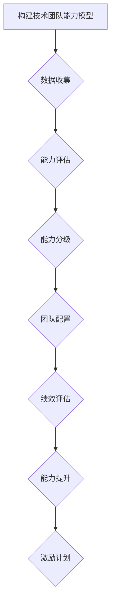

                 

## 文章标题：技术团队的激励机制设计

### 关键词：技术团队，激励机制，管理，绩效，薪酬，文化

### 摘要：
本文旨在深入探讨技术团队激励机制的设计与实施，通过系统分析和实例讲解，揭示激励机制在提升团队效能、激发创新能力和增强团队凝聚力方面的重要性。本文将围绕技术团队激励机制的核心概念、设计原则、实施策略和优化方法进行全面阐述，旨在为企业管理者和技术团队领导者提供实用的指导和建议。

## 第一部分：技术团队激励机制概述

### 1.1 激励机制在技术团队管理中的作用

技术团队激励机制在团队管理中扮演着至关重要的角色。有效的激励机制能够激发团队成员的积极性、主动性和创造性，从而提高团队的绩效和创新能力。首先，激励机制能够明确团队目标和个人目标，使团队成员更加明确自己的工作方向和职责。其次，激励机制可以激励团队成员不断提升自身技能和知识水平，以适应技术发展的需求。此外，激励机制还能够增强团队成员之间的协作和沟通，促进团队凝聚力的形成。

### 1.2 技术团队激励机制的设计原则

技术团队激励机制的设计应遵循以下原则：

1. **目标导向**：激励机制应与团队目标和个人目标相一致，确保团队成员在工作过程中始终保持目标明确、方向清晰。
2. **公平公正**：激励机制应确保公平公正，避免因个人偏见或利益冲突导致的不公平现象。
3. **激励多样性**：激励机制应涵盖薪酬、绩效、文化和成长等多个方面，以满足团队成员多样化的需求。
4. **持续优化**：激励机制应不断调整和优化，以适应技术团队的发展变化和外部环境的变化。

### 1.3 技术团队激励机制的发展趋势

随着信息技术的发展和管理理念的更新，技术团队的激励机制也在不断演变。以下是一些发展趋势：

1. **个性化激励**：针对不同团队成员的个性化需求，设计具有针对性的激励机制。
2. **长期激励**：注重长期激励，如股权激励、职业发展规划等，以留住核心人才。
3. **全方位激励**：不仅仅关注薪酬和绩效，还包括工作环境、团队文化等方面的激励。
4. **智能化激励**：利用人工智能技术，实现激励机制的自动化和智能化，提高管理效率。

## 第二部分：核心概念与联系

### 2.1 技术团队能力模型

技术团队能力模型是技术团队激励机制设计的基础。以下是一个简化的技术团队能力模型及其应用：

**技术团队能力模型：**
- **技术水平**：团队成员的技能和知识水平，包括编程能力、项目经验等。
- **项目管理能力**：团队在项目管理方面的能力，如时间管理、风险管理等。
- **创新能力**：团队在技术创新和产品研发方面的能力。
- **协作能力**：团队成员之间的协作和沟通能力。

**技术能力模型的应用：**
1. **能力评估**：通过技术团队能力模型，对团队成员的能力进行评估，以便制定针对性的培训和发展计划。
2. **团队配置**：根据技术团队能力模型，合理配置团队成员，实现团队的最佳组合。
3. **绩效评估**：将技术团队能力模型与绩效评估体系相结合，对团队成员的绩效进行综合评估。

### 2.2 绩效评估体系

绩效评估体系是技术团队激励机制的核心。以下是一个简化的绩效评估体系及其应用：

**绩效评估体系：**
- **目标设定**：明确团队和个人的绩效目标，确保目标的具体性和可实现性。
- **过程监控**：实时监控团队成员的工作过程，确保目标的达成。
- **结果评估**：对团队成员的工作结果进行评估，包括质量、速度和成本等方面。
- **反馈与改进**：根据评估结果，提供反馈，指导团队成员改进工作方法。

**绩效评估的应用：**
1. **激励分配**：根据绩效评估结果，进行薪酬、奖金等激励分配。
2. **职业发展**：依据绩效评估结果，制定团队成员的职业发展规划。
3. **团队管理**：通过绩效评估，识别团队的优势和不足，为团队管理提供依据。

## 第三部分：激励机制设计实践

### 3.1 薪酬激励机制设计

薪酬激励机制是技术团队激励机制的重要组成部分。以下是一个简化的薪酬激励机制设计及其应用：

**薪酬激励机制设计：**
- **基本薪酬**：根据团队成员的职位和技能水平，设定基本薪酬。
- **绩效薪酬**：根据绩效评估结果，发放绩效奖金。
- **长期激励**：通过股权激励、期权等手段，留住核心人才。
- **福利待遇**：提供良好的福利待遇，如医疗保险、住房补贴等。

**薪酬激励机制的应用：**
1. **薪酬管理**：建立健全的薪酬管理体系，确保薪酬的公平性和透明性。
2. **薪酬调整**：根据市场行情和团队绩效，合理调整薪酬水平。
3. **薪酬激励效果评估**：定期评估薪酬激励机制的效果，不断优化。

### 3.2 绩效激励机制设计

绩效激励机制是技术团队激励机制的核心。以下是一个简化的绩效激励机制设计及其应用：

**绩效激励机制设计：**
- **绩效指标**：设定明确的绩效指标，如项目完成率、代码质量等。
- **绩效评估**：建立科学的绩效评估体系，对团队成员的绩效进行评估。
- **激励措施**：根据绩效评估结果，实施奖励措施，如奖金、晋升等。

**绩效激励机制的应用：**
1. **绩效目标设定**：明确团队和个人的绩效目标，确保目标的可实现性。
2. **绩效评估实施**：按照绩效评估体系，对团队成员的绩效进行评估。
3. **激励措施执行**：根据绩效评估结果，实施激励措施，激发团队成员的积极性。

### 3.3 文化激励机制设计

文化激励机制是技术团队激励机制的重要组成部分。以下是一个简化的文化激励机制设计及其应用：

**文化激励机制设计：**
- **企业文化**：塑造积极向上的企业文化，营造良好的团队氛围。
- **团队活动**：组织团队活动，增强团队成员之间的沟通和协作。
- **荣誉制度**：建立荣誉制度，对表现出色的团队成员进行表彰。

**文化激励机制的应用：**
1. **企业文化建设**：通过多种方式，强化企业文化，提升团队凝聚力。
2. **团队活动组织**：定期组织团队活动，增强团队凝聚力。
3. **荣誉表彰**：对表现出色的团队成员进行表彰，激发团队成员的积极性。

## 第四部分：技术团队激励机制的实施与优化

### 4.1 激励机制实施的步骤与方法

技术团队激励机制的实施需要遵循以下步骤：

1. **明确目标**：明确技术团队激励机制的目标，确保激励机制与团队目标和个人目标相一致。
2. **设计方案**：根据团队实际情况，设计合适的激励机制方案。
3. **试点运行**：在部分团队或项目中试点运行激励机制，收集反馈并进行调整。
4. **全面推广**：在试点成功的基础上，全面推广激励机制。

**激励机制实施的方法**：

- **宣传教育**：通过内部培训、宣传等方式，提高团队成员对激励机制的认知和理解。
- **制度建设**：建立完善的激励机制制度，确保激励机制的实施有据可依。
- **过程监控**：实时监控激励机制的实施过程，确保激励机制的有效运行。

### 4.2 激励机制优化的策略与技巧

激励机制优化的策略与技巧包括：

1. **定期评估**：定期对激励机制的效果进行评估，识别存在的问题和不足。
2. **持续改进**：根据评估结果，不断优化激励机制，提高激励效果。
3. **反馈机制**：建立有效的反馈机制，鼓励团队成员提出意见和建议，为激励机制优化提供参考。
4. **个性化激励**：针对不同团队成员的个性化需求，设计具有针对性的激励机制。

### 4.3 激励机制优化的实际案例分析

**案例一：某科技公司的绩效激励机制优化**

某科技公司通过以下方式优化其绩效激励机制：

1. **引入KPI考核**：将关键绩效指标（KPI）引入绩效评估体系，使绩效评估更加客观和科学。
2. **设立奖金池**：设立绩效奖金池，根据团队整体绩效和个体绩效，按比例分配奖金。
3. **员工参与决策**：邀请员工参与绩效激励政策的制定和调整，提高员工的参与感和认同感。

**案例二：某互联网企业的文化激励机制优化**

某互联网企业通过以下方式优化其文化激励机制：

1. **强化企业文化**：通过企业文化建设，强化企业的核心价值观，营造积极向上的团队氛围。
2. **组织团队活动**：定期组织团队活动，增强团队成员之间的沟通和协作。
3. **荣誉制度**：建立荣誉制度，对在企业文化建设中表现突出的团队成员进行表彰。

## 第五部分：技术团队激励机制的未来展望

### 5.1 新技术对激励机制的影响

新技术的发展对技术团队的激励机制产生深远影响。以下是一些新技术对激励机制的影响：

1. **人工智能**：利用人工智能技术，实现激励机制的自动化和个性化，提高激励效果。
2. **区块链**：利用区块链技术，确保激励机制的数据透明和安全，增强信任。
3. **大数据**：利用大数据技术，分析团队成员的行为和绩效数据，为激励机制优化提供科学依据。

### 5.2 技术团队激励机制的发展趋势

技术团队激励机制的发展趋势包括：

1. **智能化**：随着人工智能技术的发展，激励机制将更加智能化，提高管理效率。
2. **个性化**：随着员工个性化需求的增加，激励机制将更加注重个性化。
3. **多元化**：激励机制将涵盖薪酬、绩效、文化、成长等多个方面，满足团队成员的多样化需求。
4. **可持续性**：激励机制将更加注重长期激励，促进员工的职业发展和团队长期发展。

## 附录

### 附录A：技术团队激励机制设计工具与资源

**A.1 激励机制设计工具介绍**

1. **KPI考核工具**：用于设定和跟踪关键绩效指标（KPI）。
2. **绩效评估工具**：用于对团队成员的绩效进行评估。
3. **员工满意度调查工具**：用于了解员工对激励机制的满意度和建议。

**A.2 激励机制设计资源推荐**

1. **《激励管理》**：详细介绍了激励机制的设计和实践。
2. **《绩效管理》**：系统阐述了绩效评估的方法和应用。
3. **《团队管理工具箱》**：提供了多种团队管理工具和资源。

## 结论

技术团队的激励机制设计是提升团队效能和创新能力的关键。本文通过对技术团队激励机制的深入分析，揭示了激励机制的设计原则、实施策略和优化方法。同时，本文对未来技术团队激励机制的发展趋势进行了展望，为企业管理者和技术团队领导者提供了实用的指导和建议。在新的技术环境下，不断优化和创新激励机制，将有助于提升技术团队的竞争力和创新能力。

## 作者信息

作者：AI天才研究院/AI Genius Institute & 禅与计算机程序设计艺术 /Zen And The Art of Computer Programming

[END] | AI天才研究院/AI Genius Institute
| 禅与计算机程序设计艺术 /Zen And The Art of Computer Programming## 1.1 激励机制在技术团队管理中的作用

在技术团队管理中，激励机制起着至关重要的作用。激励机制不仅仅关乎薪酬的分配，更涉及团队目标的设定、成员积极性的调动以及整体创新能力的提升。以下是激励机制在技术团队管理中的具体作用：

首先，激励机制有助于明确团队目标和个体目标。通过设定明确的绩效目标和激励措施，团队领导可以确保每个成员都了解自己的职责和期望成果，从而提高团队的协作效率和工作目标的一致性。例如，在项目开发过程中，通过设置项目关键绩效指标（KPI）和绩效奖金，可以激励团队成员更快地完成项目，并在过程中保持高质量的标准。

其次，激励机制能够激发团队成员的积极性和创造性。合理的薪酬激励、绩效奖励和职业发展机会等，都可以提高团队成员的工作动力和热情。当一个团队成员看到自己的努力能够得到认可和回报时，他们会更加投入工作，勇于创新，提出新的解决方案，从而推动团队整体的技术进步和创新。

第三，激励机制有助于提升团队的整体绩效。通过绩效评估和奖励机制，能够及时发现团队中的优秀个体和团队，鼓励他们继续保持高水平的表现，并对表现不佳的成员提供改进的机会和资源。这种正反馈循环有助于提高团队的整体绩效，使团队能够在竞争激烈的市场中保持优势。

此外，激励机制还能够增强团队凝聚力。当团队成员因为共同的成就和荣誉而获得奖励时，他们会感受到团队之间的紧密联系，增加对团队的认同感和归属感。这种团队凝聚力不仅有助于提高团队成员的工作效率，还能在面对困难和挑战时，形成强大的团队合力，共同克服难关。

最后，激励机制为团队管理提供了有效的工具。通过分析激励机制的运行效果，团队领导可以了解团队成员的需求和期望，调整管理策略，优化团队结构，从而实现团队管理的持续改进。例如，通过定期调查员工满意度，可以识别出激励机制中存在的问题，并采取相应的措施进行改进。

综上所述，激励机制在技术团队管理中具有不可替代的作用。它不仅能够激发团队成员的积极性和创造性，提高团队的整体绩效，还能增强团队凝聚力，为团队管理提供有效的工具。因此，设计有效的激励机制是技术团队领导者必须关注的重要课题。在接下来的内容中，我们将进一步探讨激励机制的设计原则和实施方法。

## 1.2 技术团队激励机制的设计原则

设计有效的技术团队激励机制，是提升团队绩效和创新能力的关键。为了确保激励机制的科学性和可操作性，我们应遵循以下设计原则：

### 1.2.1 目标导向

激励机制的设计必须与团队目标和个人目标紧密结合。具体来说，这意味着两个层次的目标设定：一是团队层面的目标，如项目的成功交付、技术的突破性进展等；二是个人层面的目标，如个人的技能提升、职业发展等。通过明确的目标导向，确保团队成员在实现团队目标的同时，也能实现个人的职业目标。例如，在一个软件开发项目中，团队目标可能是按时按质完成项目，个人目标可能是掌握新的编程语言或框架。通过将这两者结合，可以激励团队成员在工作中保持高效率和积极进取的态度。

### 1.2.2 公平公正

公平公正是激励机制设计的重要原则之一。这意味着激励机制必须确保每位成员都有公平的机会获得激励，且激励措施的实施过程应透明、公正。公平不仅仅指薪酬的分配，还包括绩效评估、职业发展机会等各个方面。例如，在绩效评估中，应采用科学、客观的评估标准，确保评估结果公平合理，避免因个人偏见或主观因素导致的不公平现象。此外，在激励措施的执行过程中，应确保信息透明，让每位成员都能了解激励政策的制定和执行情况，增强对激励机制的信服和接受度。

### 1.2.3 激励多样性

技术团队中的成员具有多样化的需求和期望，因此，激励机制也应具备多样性。多样性不仅体现在激励手段上，还包括激励内容、激励形式等方面。以下是一些具体的激励多样性策略：

1. **薪酬激励**：除了基本的固定薪酬，还可以通过绩效奖金、项目奖金、年终奖等多种形式提供额外的经济激励。
2. **绩效激励**：除了薪酬激励，还可以通过荣誉称号、晋升机会、培训机会等非经济激励手段，满足团队成员对职业发展和社会认可的需求。
3. **工作激励**：提供良好的工作环境和条件，如弹性工作时间、远程工作选项、良好的办公设施等，增强员工的工作满意度和归属感。
4. **文化激励**：营造积极向上的企业文化，通过团队活动、企业文化建设等，增强团队成员的归属感和团队凝聚力。

### 1.2.4 持续优化

激励机制的设计不是一次性的工作，而是一个持续优化的过程。随着技术团队的发展和市场环境的变化，激励机制也需要不断调整和优化，以确保其始终具备激励效果。以下是一些持续优化激励机制的方法：

1. **定期评估**：定期对激励机制的效果进行评估，通过数据分析、员工反馈等手段，识别激励机制中的问题和不足，及时进行调整。
2. **员工参与**：鼓励员工参与到激励机制的设计和优化过程中，通过问卷调查、座谈会等方式，收集员工的意见和建议，使激励机制更加符合员工的实际需求。
3. **技术创新**：随着新技术的发展，激励机制也应不断创新。例如，利用大数据分析技术，实现个性化的激励方案；利用人工智能技术，自动化地管理和优化激励机制。

通过遵循上述设计原则，技术团队可以构建一个科学、合理且有效的激励机制，从而激发团队成员的积极性、主动性和创造性，提升团队的整体绩效和创新能力。

## 1.3 技术团队激励机制的发展趋势

随着技术环境的不断变化和企业管理理念的更新，技术团队的激励机制也在不断演变。以下是一些技术团队激励机制的发展趋势，为企业管理者和技术团队领导者提供前瞻性指导。

### 1.3.1 个性化激励

在传统的激励机制中，大多数企业采取的是统一的激励措施，如固定薪酬、绩效奖金等。然而，随着员工个性化需求的增加，个性化激励逐渐成为新的趋势。个性化激励意味着根据员工的个人需求、职业目标和技能水平，量身定制激励方案。例如，对于希望快速提升技能的员工，可以提供额外的培训机会和职业发展规划；对于追求工作生活平衡的员工，可以提供更加灵活的工作时间和远程工作选项。通过个性化激励，企业能够更好地满足员工的需求，提高员工的满意度和忠诚度。

### 1.3.2 长期激励

传统的激励机制往往注重短期激励，如绩效奖金和即时奖励。然而，随着市场竞争的加剧和企业对核心人才的重视，长期激励逐渐成为新的趋势。长期激励主要包括股权激励、期权、长期服务奖金等，旨在通过长期的回报机制，留住企业的核心人才，促进员工的长期职业发展。例如，通过向关键技术人员授予股权或期权，使他们能够分享公司的成长和成功，从而增强他们的归属感和责任感。长期激励不仅能够吸引和留住优秀人才，还能促进企业的长期稳定发展。

### 1.3.3 全方位激励

技术团队激励机制的发展趋势还体现在全方位激励的推行。全方位激励不仅涵盖经济激励，还包括工作环境、企业文化、职业发展等多方面。通过全方位激励，企业可以更全面地满足员工的需求，提升员工的工作满意度和忠诚度。以下是一些具体的全方位激励措施：

1. **工作环境**：提供舒适、现代化的办公环境和设施，如宽敞的办公空间、高品质的办公设备等，提升员工的工作舒适度。
2. **企业文化**：营造积极向上的企业文化，通过企业价值观的传播、团队建设活动等，增强员工的归属感和认同感。
3. **职业发展**：提供丰富的职业发展机会，如晋升通道、培训机会、跨部门轮岗等，帮助员工实现职业成长。
4. **工作与生活平衡**：提供灵活的工作安排、弹性工作时间、带薪休假等，帮助员工实现工作与生活的平衡。

### 1.3.4 智能化激励

随着人工智能和大数据技术的发展，智能化激励也逐渐成为技术团队激励机制的一个重要趋势。通过大数据分析，企业可以了解员工的绩效表现、行为习惯和需求偏好，从而制定更加精准的激励方案。例如，利用人工智能算法，企业可以自动推荐适合员工的培训课程、项目任务等，提高激励措施的有效性。此外，智能化激励还可以通过自动化系统实现激励措施的管理和执行，提高激励机制的效率和透明度。

### 1.3.5 社会化激励

社会化激励是指通过社会网络和社区平台，增强员工之间的互动和协作，提高员工的归属感和团队凝聚力。随着社交媒体和协作工具的普及，社会化激励已经成为一种重要的激励机制。例如，企业可以通过建立内部社交平台，鼓励员工分享经验、交流心得，形成良好的知识共享氛围；通过举办线上或线下活动，增强员工之间的交流和互动，提高团队的凝聚力。

总之，技术团队激励机制的发展趋势表现为个性化、长期化、全方位、智能化和社会化。企业管理者和技术团队领导者应密切关注这些趋势，结合企业的实际情况，不断创新和优化激励机制，以提升团队的整体绩效和创新能力。

## 2.1 技术团队能力模型

技术团队能力模型是设计有效激励机制的基础。一个完善的技术团队能力模型可以帮助团队领导者准确评估团队成员的能力，合理配置资源，制定培训和发展计划。以下是一个简化的技术团队能力模型，以及如何应用这一模型来提升团队绩效。

### 技术团队能力模型的构建

技术团队能力模型通常包括以下几个关键维度：

1. **技术水平**：团队成员的技能和知识水平，包括编程语言、开发框架、数据库技术等。
2. **项目管理能力**：团队成员在项目管理方面的能力，如项目规划、风险管理、团队协作等。
3. **创新能力**：团队成员在技术创新和产品研发方面的能力，如提出新的解决方案、优化现有流程等。
4. **协作能力**：团队成员之间的协作和沟通能力，包括团队内部的合作以及与其他团队的协调。
5. **学习能力**：团队成员持续学习和自我提升的能力，这对于技术团队来说至关重要。

构建技术团队能力模型的方法通常包括以下步骤：

1. **数据收集**：通过问卷调查、访谈、工作记录等方式，收集团队成员的相关数据。
2. **能力评估**：根据收集的数据，对团队成员的能力进行评估，确定每个成员的能力水平。
3. **能力分级**：将评估结果进行分类，为每个团队成员打分或划分等级。
4. **能力图谱**：绘制能力图谱，展示团队成员的能力分布和团队整体的能力结构。

### 技术能力模型的应用

技术团队能力模型的应用主要包括以下几个方面：

1. **能力评估**：通过技术团队能力模型，对团队成员的能力进行定期评估，识别团队的优势和短板。这有助于团队领导制定有针对性的培训和发展计划，提升团队的整体能力。

2. **团队配置**：根据技术团队能力模型，合理配置团队成员，将擅长不同技术领域的成员分配到相应的项目中，确保每个项目都有合适的人才支持。

3. **绩效评估**：将技术团队能力模型与绩效评估体系相结合，对团队成员的绩效进行综合评估。这不仅包括技术成果，还包括项目管理能力、创新能力、协作能力等方面的表现。

4. **能力提升**：通过技术团队能力模型，识别出团队成员在特定领域的知识或技能缺陷，制定针对性的培训计划，提高团队成员的素质。

### 实例：技术团队能力模型的应用

假设一个技术团队需要评估其整体能力，并据此制定激励计划。以下是具体步骤：

1. **数据收集**：团队领导通过问卷调查和访谈的方式，收集团队成员的技术水平、项目管理能力、创新能力、协作能力和学习能力等方面的数据。

2. **能力评估**：根据收集到的数据，对每个团队成员的能力进行评估，并将评估结果记录在能力图谱上。

3. **能力分级**：根据评估结果，将团队成员分为不同等级，如“高级”、“中级”和“初级”。

4. **团队配置**：根据能力图谱，将高级成员分配到复杂项目中，中级成员负责关键模块，初级成员参与基础开发。

5. **绩效评估**：将能力模型与绩效评估体系相结合，对每个成员的绩效进行综合评估，考虑技术水平、项目管理能力、创新能力、协作能力等多个方面。

6. **能力提升**：针对评估中发现的能力短板，制定培训计划，例如安排团队成员参加专业培训课程、技术研讨会等，提升他们的专业技能和综合素质。

7. **激励计划**：根据绩效评估结果和能力提升计划，制定激励措施，如提供额外的奖金、晋升机会、培训补贴等，以激励团队成员持续提升自己的能力。

通过上述步骤，技术团队能力模型不仅帮助团队领导更好地了解团队的整体能力状况，还能为制定有效的激励机制提供依据，从而提升团队的整体绩效和创新能力。

### Mermaid 流程图

以下是一个简化的技术团队能力模型及其应用的 Mermaid 流程图：

该流程图展示了技术团队能力模型从构建到应用的全过程，帮助读者更直观地理解技术团队能力模型在激励机制设计中的作用。

## 2.2 绩效评估体系

绩效评估体系是技术团队激励机制的核心部分，它通过系统地衡量团队成员的工作表现，为激励措施的制定和调整提供依据。一个科学、合理的绩效评估体系不仅能够公正地反映团队成员的工作成绩，还能够激励团队成员不断提升自身能力和工作绩效。以下将详细介绍绩效评估体系的基本构成、方法和实践案例。

### 2.2.1 绩效评估的方法与工具

**1. 定量评估方法**

定量评估方法主要通过具体的指标和数据进行评估，这种方法通常包括以下几种：

- **关键绩效指标（KPI）**：KPI 是衡量团队成员工作成效的关键指标，如项目完成率、代码质量、客户满意度等。通过设定明确的 KPI，可以量化团队成员的工作成果，使绩效评估更加客观和可衡量。
- **工作量统计**：工作量统计是衡量团队成员工作量的一种方法，通常包括任务完成数、代码行数、文档编写量等。这种方法可以帮助团队领导了解团队成员的工作量和工作进度，为绩效评估提供数据支持。
- **时间追踪工具**：使用时间追踪工具，如 Toggl 或 RescueTime，可以帮助团队成员记录工作时间和分配，从而更准确地衡量工作量和效率。

**2. 定性评估方法**

定性评估方法主要通过主观评价和团队反馈来进行，这种方法通常包括以下几种：

- **360度评估**：360度评估是一种全面的绩效评估方法，它不仅包括团队成员的上司、同事和下属的评价，还包括团队成员的自我评估。这种方法可以提供多角度的反馈，帮助团队成员了解自己的优势和不足。
- **行为观察**：行为观察是通过观察团队成员在工作中的行为和表现，进行评估的方法。这种方法可以帮助团队领导了解团队成员的实际工作状态和工作风格，从而提供更具体、详细的反馈。

**3. 绩效评估工具**

- **绩效管理软件**：如Microsoft Performance Point、Benchmarks 等软件，这些工具可以帮助团队领导进行绩效数据的收集、分析和报告。
- **问卷调查**：通过问卷调查的方式，收集团队成员和上级的评价，可以更全面地了解团队成员的工作表现。

### 2.2.2 绩效评估的实践案例

**案例一：某互联网公司的绩效评估体系**

某互联网公司通过以下方式建立其绩效评估体系：

1. **设定关键绩效指标（KPI）**：根据公司战略目标和业务需求，设定了包括项目完成率、代码质量、客户满意度等在内的多个 KPI。
2. **季度评估**：每季度进行一次绩效评估，评估过程包括自我评估、上级评价和同事反馈等多个环节。
3. **360度评估**：每季度进行一次360度评估，收集团队成员和上级、同事的反馈，帮助团队成员了解自己的表现和改进方向。
4. **反馈与改进**：根据评估结果，对表现优秀的团队成员进行表彰和奖励，对表现不佳的团队成员提供改进建议和培训机会。

**案例二：某科技公司的小组绩效评估**

某科技公司通过以下方式对小组绩效进行评估：

1. **小组目标设定**：每个小组在项目开始前，设定明确的小组目标和关键绩效指标。
2. **项目进展监控**：使用项目管理工具（如JIRA），实时监控项目进展和工作量。
3. **定期会议**：每周进行一次小组会议，讨论项目进展和存在的问题，确保项目按计划进行。
4. **绩效评估**：在项目结束后，根据项目完成情况、代码质量、客户反馈等指标，对小组绩效进行评估，并根据评估结果进行奖励和反馈。

通过上述案例，我们可以看到，一个有效的绩效评估体系不仅需要科学、合理的评估方法和工具，还需要结合实际情况进行灵活调整和优化，以确保评估结果能够真正反映团队成员的工作表现，并为激励措施的制定提供有力依据。

### 总结

绩效评估体系是技术团队激励机制的重要组成部分，通过科学、合理的评估方法和工具，可以公正地衡量团队成员的工作绩效，为激励措施的制定和调整提供依据。在实践中，企业应根据自身特点和需求，选择合适的绩效评估方法和工具，并不断优化评估体系，以提高激励效果和团队整体绩效。

## 3.1 薪酬激励机制设计

薪酬激励机制是技术团队激励机制的重要组成部分，其设计直接关系到团队成员的工作积极性、创新能力和长期留任。一个合理的薪酬激励机制不仅能激励团队成员努力工作，还能吸引和保留优秀人才。以下将从薪酬激励机制的基本原则、设计方法及实际案例分析三个方面，详细探讨薪酬激励机制的设计。

### 3.1.1 薪酬激励机制的基本原则

薪酬激励机制的设计应遵循以下基本原则：

**1. 公平公正**

公平公正是薪酬激励机制设计的基础。这意味着薪酬的分配应基于团队成员的贡献和工作表现，确保每位成员都能获得与其工作价值相匹配的回报。同时，薪酬激励政策的制定和执行过程应透明，避免主观偏见和不公平现象。

**2. 竞争性**

薪酬激励机制应具备一定的市场竞争力，以吸引和留住优秀人才。通过调查行业薪酬水平和市场行情，确保企业提供的薪酬水平能够与行业平均水平相当，甚至具备一定的优势。

**3. 激励性**

薪酬激励机制应具备激励性，能够激发团队成员的积极性和创造性。这不仅包括短期激励，如绩效奖金和项目奖励，还包括长期激励，如股权激励和职业发展规划。

**4. 可调性**

薪酬激励机制应具备可调性，能够根据企业战略调整、市场变化和团队绩效进行灵活调整。通过定期评估和反馈，及时优化薪酬激励机制，确保其持续有效。

### 3.1.2 薪酬激励机制的设计方法

薪酬激励机制的设计方法主要包括以下几个方面：

**1. 确定薪酬结构**

薪酬结构包括基本工资、绩效工资、奖金和福利等。合理确定薪酬结构是薪酬激励机制设计的关键。通常，基本工资占薪酬结构的主体部分，绩效工资和奖金作为激励手段，根据团队成员的工作表现进行调整。

**2. 设定薪酬等级**

根据团队成员的职位、技能和工作经验，设定不同的薪酬等级。薪酬等级应具备一定的市场竞争力，同时确保内部公平。例如，可以设定初级工程师、中级工程师、高级工程师等不同的薪酬等级，每个等级对应不同的薪酬水平。

**3. 绩效评估**

建立科学的绩效评估体系，对团队成员的工作表现进行客观、公正的评估。绩效评估结果将直接影响绩效工资和奖金的发放。绩效评估指标应涵盖工作质量、工作效率、团队合作等多个方面，确保评估的全面性和公正性。

**4. 奖金和奖励**

设计奖金和奖励制度，激励团队成员在特定项目或任务中取得优异成绩。奖金和奖励可以包括项目奖金、年终奖、特别贡献奖等。这些奖励应与团队成员的实际贡献和绩效表现直接挂钩。

**5. 长期激励**

通过股权激励、期权、职业发展规划等长期激励手段，留住企业的核心人才。长期激励不仅能够提高员工的归属感和忠诚度，还能促进企业的长期稳定发展。

### 3.1.3 薪酬激励机制的实际案例分析

**案例一：某互联网公司的薪酬激励机制**

某互联网公司通过以下方式设计其薪酬激励机制：

1. **基本工资**：根据市场行情和公司战略，设定基本工资，确保具有市场竞争力。
2. **绩效工资**：根据团队成员的绩效评估结果，发放绩效工资，占基本工资的20%-30%。
3. **奖金**：设定项目奖金和年终奖，对在项目中表现突出的团队成员进行奖励。
4. **股权激励**：向核心员工授予股票期权，使其能够分享公司的成长和成功。
5. **职业发展规划**：提供职业发展机会，如晋升通道、内部培训等，帮助员工实现职业成长。

**案例二：某科技公司的小组薪酬激励机制**

某科技公司通过以下方式设计小组薪酬激励机制：

1. **项目奖金**：根据项目完成情况和客户满意度，对小组进行项目奖金奖励。
2. **团队绩效**：定期对团队进行绩效评估，评估结果直接影响团队奖金的发放。
3. **创新奖励**：设立创新奖励，对提出有效创新方案的小组进行奖励。
4. **股权激励**：向在项目中表现优异的小组成员授予股票期权。

通过上述案例分析，我们可以看到，合理的薪酬激励机制能够激发团队成员的积极性，提高团队整体绩效，并为企业培养和留住核心人才。企业在设计薪酬激励机制时，应结合自身特点和需求，制定适合企业的薪酬策略，不断优化和调整，以实现长期可持续发展。

## 3.2 绩效激励机制设计

绩效激励机制是提升技术团队整体绩效和创新能力的关键环节。通过合理的绩效激励机制，企业能够激发团队成员的工作积极性，提高工作效率和成果质量。以下将从绩效激励机制的设计、执行和效果评估三个方面，详细探讨绩效激励机制的设计。

### 3.2.1 绩效激励机制的设计

**1. 确定绩效指标**

绩效指标是绩效激励机制的核心，它决定了激励机制的有效性。在确定绩效指标时，应考虑以下几个关键因素：

- **目标导向**：绩效指标应与团队目标和公司战略紧密相关，确保团队成员在实现团队目标的同时，也能实现个人目标。
- **具体可衡量**：绩效指标应具有具体性和可衡量性，使团队成员能够明确自己的工作方向和努力目标。
- **多样性**：绩效指标应涵盖多个方面，包括工作量、工作效率、工作质量、团队合作、创新能力等，确保对团队成员的全方位评估。

**2. 设定绩效等级**

为了激励团队成员的积极性，应将绩效指标划分为不同的等级，如优秀、良好、一般和较差。每个绩效等级对应相应的激励措施，如奖金、晋升机会、培训机会等。

**3. 制定激励政策**

激励政策是绩效激励机制的具体实施措施，它包括奖金、晋升、培训等激励手段。在制定激励政策时，应考虑以下几个原则：

- **公平公正**：确保激励政策的公平性和透明性，避免主观偏见和不公平现象。
- **激励性**：激励政策应具备激励性，能够激发团队成员的积极性和创造性。
- **灵活性**：激励政策应具备灵活性，能够根据团队绩效和市场环境进行调整。

**4. 确保反馈机制**

绩效激励机制的有效性离不开反馈机制。企业应建立完善的反馈机制，定期对团队成员的工作表现进行评估和反馈，帮助团队成员了解自己的优势和不足，制定改进计划。

### 3.2.2 绩效激励机制执行

**1. 明确执行流程**

绩效激励机制的执行应遵循明确的流程，包括绩效目标设定、绩效评估、激励措施实施等环节。在执行过程中，应注意以下几点：

- **明确目标**：在项目或任务开始前，明确团队成员的绩效目标，确保目标的具体性和可实现性。
- **过程监控**：实时监控团队成员的工作过程，确保绩效目标的达成。
- **透明评估**：绩效评估过程应透明，确保团队成员对评估结果的理解和接受。
- **及时激励**：根据绩效评估结果，及时实施激励措施，确保激励效果的及时性。

**2. 强化团队协作**

绩效激励机制不仅关注个人绩效，还应注重团队协作。通过设置团队绩效指标和团队奖励措施，鼓励团队成员之间相互协作、共同进步。

**3. 培训与支持**

在绩效激励机制执行过程中，企业应提供必要的培训和支持，帮助团队成员提升技能和知识水平，以应对复杂的工作任务和挑战。

### 3.2.3 绩效激励机制效果评估

**1. 数据分析**

通过数据分析，评估绩效激励机制的实际效果。具体指标包括激励措施的覆盖率、激励措施的满意度、绩效提升率等。通过数据分析，识别激励机制中的问题和不足，为优化提供依据。

**2. 员工反馈**

通过员工反馈，了解团队成员对绩效激励机制的看法和建议。员工反馈可以帮助企业识别激励机制中的潜在问题，并根据反馈进行改进。

**3. 定期评估**

定期对绩效激励机制进行评估，包括激励政策的适应性、激励效果、员工满意度等。通过定期评估，确保绩效激励机制持续有效，能够满足团队成员的需求和期望。

**4. 持续优化**

根据评估结果，持续优化绩效激励机制，包括调整绩效指标、激励政策、反馈机制等。通过持续优化，确保绩效激励机制始终保持科学性和有效性。

通过以上步骤，企业可以设计并执行一个有效的绩效激励机制，激发团队成员的积极性、主动性和创造性，提升团队的整体绩效和创新能力。

## 3.3 文化激励机制设计

文化激励机制是提升技术团队凝聚力和创新力的重要手段之一。通过积极的企业文化建设和有效的文化激励机制，企业能够增强团队成员的归属感和忠诚度，促进团队协作和创新。以下将从文化激励机制的作用、设计思路和实践案例三个方面，详细探讨文化激励机制的设计。

### 3.3.1 文化激励机制的作用

**1. 增强团队凝聚力**

企业文化是团队成员共同价值观和行为准则的体现，通过积极的企业文化建设，企业能够增强团队成员之间的认同感和归属感，促进团队凝聚力的形成。例如，通过组织团队活动、庆祝团队成就等，能够增强团队成员之间的情感联系，提高团队的团结协作水平。

**2. 激发创新意识**

企业文化不仅是团队协作的基础，也是激发创新意识的重要动力。一个开放、包容、鼓励创新的企业文化能够激发团队成员的创造力和创新意识，促进技术突破和产品创新。例如，通过设立创新奖项、鼓励员工提出创新建议等，能够激发团队成员的创新热情。

**3. 提升工作满意度**

企业文化对团队成员的工作满意度有显著影响。一个积极向上的企业文化能够提升团队成员的工作积极性和满意度，减少员工流失率。例如，通过提供良好的工作环境、尊重员工意见、关心员工成长等，能够提高团队成员的工作满意度和忠诚度。

### 3.3.2 文化激励机制的设计思路

**1. 明确企业核心价值观**

企业核心价值观是企业文化建设的核心，是文化激励机制设计的基础。在明确企业核心价值观的基础上，企业可以设计与之相一致的文化活动和文化奖励，确保文化激励机制与企业的核心价值观保持一致。

**2. 建立良好的沟通机制**

有效的沟通是文化激励机制设计的关键。企业应建立开放、透明的沟通机制，鼓励团队成员之间进行沟通和交流，增强团队内部的协作和信任。例如，通过定期召开团队会议、设立意见箱、开展团队建设活动等，促进团队成员之间的沟通和交流。

**3. 鼓励团队参与和反馈**

文化激励机制应鼓励团队成员的参与和反馈，使团队成员感受到自己在企业文化中的价值和重要性。例如，通过设立员工建议奖、员工满意度调查等，鼓励团队成员提出意见和建议，参与企业文化的建设。

**4. 创新文化活动和奖励**

文化激励活动的设计应注重创新，使活动形式多样、富有吸引力。例如，通过举办技术创新大赛、团队建设拓展活动、知识分享会等，增强团队成员的参与感和归属感。同时，设立创新奖励，对在文化活动中表现突出的团队成员进行表彰和奖励。

### 3.3.3 文化激励机制的实践案例

**案例一：某互联网公司的文化激励机制**

某互联网公司通过以下方式设计其文化激励机制：

1. **核心价值观宣传**：定期在公司内部宣传企业核心价值观，通过邮件、公告栏、团队会议等多种形式，使团队成员深入理解和认同企业的核心价值观。

2. **团队建设活动**：定期组织团队建设活动，如团建拓展、户外运动等，增强团队成员之间的情感联系和团队凝聚力。

3. **创新奖励**：设立创新奖励，对在工作中提出有效创新建议、在技术竞赛中获奖的团队成员进行表彰和奖励。

4. **员工满意度调查**：定期进行员工满意度调查，了解团队成员对文化氛围和企业文化的意见和建议，及时进行调整和优化。

**案例二：某科技企业的文化激励机制**

某科技企业通过以下方式设计其文化激励机制：

1. **知识分享会**：定期举办知识分享会，鼓励团队成员分享自己的技术经验和心得，促进知识传播和团队协作。

2. **员工关爱计划**：设立员工关爱计划，关心员工的成长和生活，提供职业发展规划、心理健康辅导等，提升员工的工作满意度和忠诚度。

3. **荣誉墙**：设立荣誉墙，展示团队成员的荣誉和成就，增强团队成员的成就感和自豪感。

4. **团队活动**：定期组织团队活动，如团队聚餐、节日庆祝等，增强团队凝聚力和成员之间的友谊。

通过上述实践案例，我们可以看到，有效的文化激励机制能够显著提升技术团队的凝聚力和创新能力，促进企业的长期稳定发展。企业在设计文化激励机制时，应结合自身特点和需求，不断创新和优化文化活动和奖励措施，以实现最佳激励效果。

## 4.1 激励机制实施的步骤与方法

有效实施激励机制是确保其发挥预期作用的关键环节。为了实现这一目标，企业需要遵循一系列科学的步骤和方法，并利用合适的管理工具。以下将详细讨论激励机制实施的步骤、关键环节及实施后的效果评估。

### 4.1.1 实施前的准备工作

激励机制的有效实施始于充分的准备工作。以下是实施前需要完成的关键步骤：

**1. 确定目标和原则**

在实施激励机制之前，首先需要明确激励机制的目标和原则。这包括激励机制的总体目标（如提升团队绩效、增强员工满意度等），以及具体的原则（如公平公正、竞争性、可调性等）。明确目标和原则有助于为后续的实施提供方向和依据。

**2. 分析需求和现状**

分析团队成员的需求和现状是制定合适激励机制的基础。企业可以通过问卷调查、访谈、员工满意度调查等方式，了解团队成员对现有激励机制的看法和建议。同时，分析团队的工作状态、绩效水平、技能状况等，以识别激励机制的改进方向。

**3. 设计激励机制方案**

基于目标和现状分析，设计具体的激励机制方案。这包括确定薪酬结构、绩效评估指标、奖励形式等。设计过程中应充分考虑员工的个性化需求和企业实际情况，确保激励机制具有可操作性和有效性。

**4. 制定实施计划**

制定详细的实施计划，明确激励机制的实施步骤、时间表、责任人等。实施计划应包括激励政策的宣传、培训、试点运行、全面推广等环节，确保激励机制的顺利实施。

### 4.1.2 实施过程中的关键环节

激励机制的实施过程需要密切监控和有效管理，以下是关键环节：

**1. 宣传和培训**

在激励机制实施前，企业应通过内部会议、培训等方式，向全体员工宣传和解释激励政策，确保员工充分理解激励机制的内涵和目的。特别是对于新政策或新方案，应进行详细的培训和指导，帮助员工熟悉操作流程和评估标准。

**2. 试点运行**

在全面推广之前，可以选择部分团队或项目进行试点运行。试点运行有助于发现和解决潜在问题，为全面推广积累经验。在试点过程中，企业应密切关注试点团队的反馈，及时调整和优化激励机制方案。

**3. 过程监控**

激励机制的实施过程中，企业应建立有效的监控机制，实时跟踪激励机制的实施情况。具体包括监控激励政策的执行情况、绩效评估结果的合理性、奖励措施的及时性等。通过过程监控，确保激励机制能够按计划执行，并达到预期效果。

**4. 沟通与反馈**

在激励机制实施过程中，企业应保持与员工的持续沟通，及时收集员工的反馈和建议。通过定期召开座谈会、设立意见箱等方式，鼓励员工表达对激励机制的看法和意见。企业应根据反馈进行必要的调整和改进，确保激励机制能够适应员工的需求和期望。

### 4.1.3 实施后的效果评估

激励机制实施后，企业需要对效果进行评估，以验证其有效性，并为进一步优化提供依据。以下是一些关键评估步骤：

**1. 数据分析**

通过数据分析，评估激励机制的实际效果。具体包括激励政策的覆盖率、员工满意度、绩效提升率等指标。数据分析应涵盖多个维度，如员工绩效、团队绩效、员工流失率等，以全面反映激励机制的效果。

**2. 员工反馈**

通过员工反馈，了解员工对激励机制的感受和评价。员工反馈可以通过问卷调查、面对面访谈、意见箱等方式进行。企业应重视员工的反馈，识别激励机制中的问题和不足，为优化提供参考。

**3. 定期评估**

定期对激励机制进行评估，包括短期效果评估和长期效果评估。短期效果评估通常在激励机制实施后的几个月内进行，主要评估激励机制对员工绩效和团队氛围的影响。长期效果评估则关注激励机制对员工满意度和企业长期发展的贡献。

**4. 持续优化**

根据评估结果，持续优化激励机制。这包括调整绩效评估指标、改进激励政策、完善反馈机制等。通过持续优化，确保激励机制始终保持科学性和有效性，能够持续激发员工的工作积极性和创新能力。

综上所述，激励机制的实施是一个系统化的过程，需要从准备、实施到评估的各个环节进行科学管理和优化。通过遵循合理的步骤和方法，企业可以确保激励机制的有效实施，提升团队的整体绩效和创新能力。

## 4.2 激励机制优化的策略与技巧

激励机制的有效性不仅取决于其设计，还需要通过持续的优化来适应不断变化的企业环境和技术团队需求。以下将讨论激励机制优化的原则、方法和实际案例，帮助企业管理者和技术团队领导者提升激励机制的效果。

### 4.2.1 优化激励机制的原则

优化激励机制时应遵循以下原则：

**1. 目标一致性**

激励机制优化应确保与企业的战略目标和团队目标保持一致。这意味着在调整激励机制时，应充分考虑企业的发展方向和团队的工作重点，确保激励机制能够支持和推动企业的战略目标。

**2. 公平性和透明性**

公平性和透明性是激励机制优化的基础。优化过程中，应确保激励政策对所有团队成员都是公平的，避免因个人偏见或不当操作导致的不公平现象。同时，激励机制的执行过程应透明，使团队成员了解激励政策的依据和标准。

**3. 适应性**

激励机制应具备适应性，能够根据企业内部和外部环境的变化进行调整。例如，当市场行情发生变化或企业战略调整时，激励机制也应相应调整，以确保其持续有效。

**4. 持续改进**

激励机制优化是一个持续的过程。企业应定期评估激励机制的效果，并根据反馈和数据分析进行持续改进，确保激励机制能够不断适应新的挑战和需求。

### 4.2.2 优化激励机制的方法

**1. 数据驱动**

使用数据来驱动激励机制优化，通过收集和分析团队成员的工作绩效、满意度、离职率等数据，识别激励机制的优缺点。例如，通过分析绩效数据和员工反馈，可以找出哪些激励措施最为有效，哪些需要调整。

**2. 员工参与**

鼓励员工参与激励机制优化的过程，通过问卷调查、座谈会、意见箱等方式，收集员工的意见和建议。员工参与不仅能够提高激励政策的接受度和执行力，还能使激励机制更加符合员工的实际需求。

**3. 定期评估**

定期对激励机制进行评估，包括短期效果评估和长期效果评估。短期评估通常在激励机制实施后的几个月内进行，以了解激励机制对员工绩效和团队氛围的影响；长期评估则关注激励机制对员工满意度和企业长期发展的贡献。

**4. 灵活调整**

根据评估结果，灵活调整激励机制。这包括调整绩效评估指标、奖励形式、激励频率等。例如，如果发现某些奖励措施对员工激励效果不佳，可以尝试更换奖励形式或增加激励频率。

### 4.2.3 优化激励机制的实际案例

**案例一：某科技公司的激励机制优化**

某科技公司通过以下方式优化其激励机制：

1. **数据驱动**：通过分析员工的绩效数据和满意度调查结果，发现某些激励政策未能有效激励员工。根据分析结果，公司调整了绩效评估指标，增加了对团队合作和创新能力的考核。

2. **员工参与**：公司邀请员工参与激励机制优化讨论，收集了关于奖励形式、评估标准和反馈机制的改进建议。基于员工反馈，公司改进了绩效评估工具，使评估过程更加透明和公平。

3. **定期评估**：公司每季度对激励机制进行评估，通过数据分析发现某些奖励措施的效果不如预期。根据评估结果，公司调整了奖金发放规则，使奖励更加具有激励性。

4. **灵活调整**：公司根据市场变化和企业战略调整，灵活调整激励机制。例如，在市场波动较大时，公司增加了短期激励措施，以吸引和留住核心人才。

**案例二：某互联网企业的文化激励机制优化**

某互联网企业通过以下方式优化其文化激励机制：

1. **员工参与**：公司通过内部讨论和问卷调查，了解员工对当前企业文化活动和奖励措施的看法。根据员工反馈，公司增加了团队建设活动和知识分享会，使文化活动更加丰富多样。

2. **定期评估**：公司每半年对文化激励机制进行评估，通过数据分析发现某些活动对员工激励效果不佳。根据评估结果，公司调整了文化活动形式和奖励措施，增加了对创新项目的支持和奖励。

3. **灵活调整**：公司根据企业战略调整和文化建设目标，灵活调整激励机制。例如，在公司上市后，公司增加了股票期权等长期激励措施，以留住核心人才。

通过上述实际案例，我们可以看到，激励机制优化是一个复杂而细致的工作，需要结合数据驱动、员工参与、定期评估和灵活调整等多种方法。通过科学、合理的优化，企业可以提升激励机制的效果，促进团队绩效的提升和企业的发展。

## 4.3 激励机制优化的实际案例分析

### 4.3.1 某科技公司的激励机制优化

某科技公司在其发展过程中，通过多次优化激励机制，实现了显著的业务增长和员工满意度提升。以下是一个详细的案例分析。

**背景**：
该科技公司成立于2010年，主要从事软件研发和信息技术服务。随着公司规模的扩大和市场竞争的加剧，公司领导层意识到激励机制的重要性，特别是在技术团队中。然而，原有的激励机制存在一些问题，如激励措施单一、缺乏针对性、无法有效区分员工贡献等。

**优化措施**：

1. **数据驱动**：公司首先通过数据分析，识别出激励机制中的问题。数据分析显示，部分员工对现有的薪酬和奖金制度满意度较低，同时，一些关键项目的完成质量和速度未达到预期。

2. **员工参与**：公司组织了多场座谈会和问卷调查，邀请员工提出改进建议。员工普遍反馈希望激励措施更加多样化和个性化，同时希望有更多的职业发展机会。

3. **绩效评估改进**：公司引入了多维度的绩效评估体系，不仅包括工作质量和效率，还包括团队合作、创新能力、客户满意度等。同时，优化了绩效评估流程，使评估过程更加透明和公正。

4. **长期激励措施**：公司增加了股权激励和职业发展规划，特别是针对核心人才。股权激励计划使员工能够分享公司成长的红利，增强了员工的归属感和忠诚度。

**实施过程**：

1. **试点运行**：在部分团队进行激励机制优化的试点运行，通过观察和反馈，进一步调整优化方案。

2. **全员培训**：公司对全体员工进行激励机制优化政策的培训，确保员工了解新的激励措施和评估标准。

3. **持续监控**：公司建立了持续监控机制，定期收集员工反馈和绩效数据，以评估激励机制优化效果。

**效果评估**：

1. **绩效提升**：激励机制优化后，团队成员的工作积极性和创新能力显著提升，项目质量和交付速度有了显著改善。

2. **员工满意度**：员工满意度调查显示，员工对新的激励机制满意度明显提升，特别是对股权激励和职业发展规划的认可度较高。

3. **离职率下降**：激励机制优化后，核心人才的流失率明显下降，公司能够更好地留住关键人才。

**总结**：

该科技公司的激励机制优化实践表明，通过数据驱动、员工参与、绩效评估改进和长期激励措施，可以显著提升团队的绩效和员工满意度。这一案例为其他企业提供了有益的借鉴，特别是在技术团队的管理和激励方面。

### 4.3.2 某互联网企业的文化激励机制优化

另一个值得关注的案例是某互联网企业在文化激励机制优化方面的实践。

**背景**：
该互联网企业成立于2015年，是一家快速发展的科技公司，以其创新的文化氛围和灵活的工作环境著称。然而，随着公司规模的扩大和员工数量的增加，原有的文化激励机制逐渐显得不够灵活和多样化，难以满足不同员工的个性化需求。

**优化措施**：

1. **多元化文化活动**：公司增加了多种文化活动的形式，包括团队建设活动、技术分享会、员工兴趣小组等，以满足不同员工的兴趣和需求。

2. **员工参与度提升**：公司鼓励员工参与到文化活动的策划和组织中，通过员工自发的活动和项目，提升员工的参与度和归属感。

3. **荣誉制度**：公司建立了荣誉制度，对在企业文化建设和团队贡献方面表现突出的员工进行表彰，增强了员工的成就感和自豪感。

4. **长期激励**：公司推出了长期激励计划，如员工股票期权和职业发展基金，使员工能够分享公司的长期成长和成功。

**实施过程**：

1. **试点推行**：在部分部门试点推行新的文化激励机制，通过试点部门的反馈，不断优化和调整方案。

2. **全员培训**：公司对所有员工进行新激励机制和荣誉制度的培训，确保员工了解并积极参与。

3. **持续反馈**：公司建立了持续反馈机制，定期收集员工对文化激励机制的建议和意见，以便进行进一步优化。

**效果评估**：

1. **员工参与度提升**：新的文化激励机制有效提升了员工的参与度，员工更加积极主动地参与到企业文化建设中。

2. **团队凝聚力增强**：通过多样化的文化活动，团队成员之间的互动和沟通增多，团队凝聚力显著增强。

3. **员工满意度**：员工满意度调查显示，员工对新的文化激励机制表示满意，特别是对荣誉制度和长期激励计划的认可度较高。

**总结**：

该互联网企业的文化激励机制优化实践展示了通过多元化文化活动、员工参与度提升、荣誉制度和长期激励等措施，可以有效提升员工的参与度和团队凝聚力，从而促进企业的长期发展。这一案例为其他企业提供了宝贵的经验和参考。

通过上述两个实际案例分析，我们可以看到，激励机制优化需要结合企业实际情况，通过科学的方法和合理的措施，不断提升激励机制的有效性。企业应根据自身特点和员工需求，灵活调整激励机制，以实现最佳激励效果。

## 5.1 新技术对激励机制的影响

随着信息技术的飞速发展，尤其是人工智能（AI）、区块链和大数据等新兴技术的应用，技术团队的激励机制也面临着深刻变革。这些新技术不仅改变了传统的工作方式和组织模式，也为激励机制的设计和实施带来了全新的可能性。以下将探讨这些新技术如何影响技术团队的激励机制。

### 5.1.1 人工智能在激励机制中的应用

人工智能（AI）在激励机制中的应用主要体现在以下几个方面：

**1. 智能绩效评估**

传统的绩效评估往往依赖于主观评价和定量分析，而人工智能可以通过分析大量的数据，如工作时长、工作效率、团队合作表现等，提供更加客观和精确的绩效评估。AI算法可以识别出工作中的关键绩效指标（KPI），并根据这些指标对团队成员进行自动化的评估和排名。

**2. 个性化激励方案**

AI技术可以根据员工的个人行为和绩效数据，制定个性化的激励方案。例如，通过分析员工的兴趣、工作习惯和职业发展目标，AI可以推荐最适合的培训课程、项目任务和奖励措施，从而提高激励的针对性和有效性。

**3. 自动化奖励发放**

人工智能可以自动化地处理奖励发放流程，从绩效评估到奖金发放，减少了人为干预和误差，提高了激励机制的透明度和执行力。例如，AI系统可以自动识别绩效优秀的员工，并在系统设定的时间自动发放奖金。

### 5.1.2 区块链在激励机制中的应用

区块链技术在激励机制中的应用，主要关注数据透明性、信任和可追溯性：

**1. 数据透明性**

区块链技术通过分布式账本技术，确保了数据的透明性和不可篡改性。在激励机制中，团队成员的绩效数据、奖励记录等都可以存储在区块链上，供所有人查看。这种透明性增强了员工对激励机制的信任，减少了信息不对称和主观偏见。

**2. 增强信任**

区块链技术通过去中心化的方式，减少了中介环节，从而提高了激励机制的信任度。例如，在股权激励中，区块链技术可以确保股票交易的真实性和透明性，减少因信息不对称和信任缺失导致的纠纷。

**3. 可追溯性**

区块链技术为激励机制提供了可追溯的记录，使奖励的发放和分配过程更加透明和可验证。团队成员可以通过区块链查询自己的绩效记录和奖励情况，确保激励机制的公平性和公正性。

### 5.1.3 大数据在激励机制中的应用

大数据技术在激励机制中的应用，主要体现在以下几个方面：

**1. 数据驱动决策**

大数据技术通过对员工行为和绩效数据的分析，可以帮助企业制定更加科学和有效的激励政策。例如，通过对员工的工作效率、工作时长和客户满意度等数据进行分析，企业可以识别出最有效的激励措施，从而优化激励机制。

**2. 挖掘潜在人才**

大数据技术可以帮助企业识别出潜在的高绩效人才，通过分析团队成员的历史绩效数据、工作表现和职业发展轨迹，企业可以提前发现和培养未来的关键人才。

**3. 优化激励方案**

大数据技术可以帮助企业实时监控激励政策的效果，通过分析激励措施的实施情况和员工的反馈数据，企业可以及时调整和优化激励方案，确保激励机制能够持续有效。

### 总结

新技术如人工智能、区块链和大数据在激励机制中的应用，为技术团队的管理和激励提供了全新的工具和方法。通过这些技术，企业可以实现更加客观、透明和个性化的激励机制，提升员工的满意度和团队的整体绩效。随着新技术的不断发展和普及，激励机制将越来越依赖这些先进技术，为技术团队的管理带来更多的机遇和挑战。

## 5.2 技术团队激励机制的发展趋势

随着全球化进程的加快、信息技术的迅猛发展以及市场环境的不断变化，技术团队的激励机制也在不断演进。未来，技术团队激励机制的发展将呈现出以下几个主要趋势：

### 5.2.1 智能化

人工智能（AI）技术的应用将使激励机制更加智能化。通过大数据分析和机器学习算法，企业可以更准确地评估团队成员的绩效，识别他们的需求和行为模式，从而制定个性化的激励方案。智能化激励不仅能够提高激励措施的针对性，还能够减少人为干预，提高管理效率。例如，AI系统可以根据团队成员的技能水平和绩效表现，自动推荐适合他们的培训课程、项目任务和奖励措施。

### 5.2.2 个性化

随着员工个性化需求的增加，激励机制将更加注重个性化。未来的激励机制将不仅考虑员工的绩效和贡献，还会关注员工的个人兴趣、职业目标和价值观。通过个性化和定制化的激励方案，企业可以更好地满足员工的多元化需求，提高员工的工作满意度和忠诚度。例如，企业可以提供灵活的工作时间、远程工作选项、个性化的职业发展路径等，以满足不同员工的个性化需求。

### 5.2.3 全方位激励

未来的激励机制将不再局限于薪酬和奖金，而将涵盖薪酬、绩效、文化、成长等多个方面。全方位激励将帮助员工在职业发展的不同阶段获得持续的支持和激励。例如，企业可以通过提供多样化的培训机会、职业发展规划、团队建设活动等，增强员工的技能和综合素质，从而提高他们的工作绩效和职业满足感。

### 5.2.4 长期激励

长期激励将成为未来激励机制的重要趋势。随着市场竞争的加剧和企业对核心人才的重视，企业将更加注重通过长期激励手段留住关键人才。例如，股权激励、期权、长期服务奖金等长期激励措施，不仅能够提高员工的归属感和忠诚度，还能够促进企业的长期稳定发展。

### 5.2.5 社会化

社会化激励将逐渐成为技术团队激励机制的一部分。通过社交媒体和协作工具，企业可以加强员工之间的互动和协作，提高团队的凝聚力和创新能力。例如，企业可以通过内部社交平台鼓励员工分享经验、交流心得，形成良好的知识共享氛围；通过线上活动、竞赛等方式，增强员工的团队归属感和协作意识。

### 5.2.6 数据驱动

数据驱动将成为激励机制设计和管理的重要依据。通过收集和分析大量的员工绩效数据、行为数据等，企业可以更科学地制定和调整激励机制，确保其能够有效激发员工的工作积极性。数据驱动的激励机制不仅能够提高管理的透明度和公正性，还能够帮助企业更好地识别和培养未来的关键人才。

### 5.2.7 可持续发展

未来的激励机制将更加注重可持续发展。企业在制定激励机制时，不仅要考虑短期绩效，还要关注员工的长期职业发展和企业的社会责任。通过建立可持续的激励机制，企业可以促进员工的长期成长，提高企业的社会形象和品牌价值。

综上所述，技术团队激励机制的发展趋势将更加智能化、个性化、全方位、长期化、社会化、数据驱动和可持续发展。企业应密切关注这些趋势，结合自身特点和需求，不断创新和优化激励机制，以提升团队的整体绩效和创新能力，实现长期可持续发展。

## 5.2.1 人工智能在激励机制中的应用

随着人工智能技术的快速发展，其在激励机制中的应用日益广泛，为企业提供了前所未有的机会来优化激励机制的设计和执行。以下将详细探讨人工智能在技术团队激励机制中的应用，以及其带来的优势和挑战。

### 5.2.1.1 智能绩效评估

人工智能在绩效评估中的应用是当前最引人注目的领域之一。传统的绩效评估往往依赖于主观评价和定量分析，而人工智能可以通过大数据分析和机器学习算法，提供更加客观和精确的绩效评估。具体来说，AI系统可以分析大量的数据，如工作时长、工作效率、项目交付质量、团队合作表现等，从中识别出关键绩效指标（KPI），并对团队成员进行自动化的评估和排名。

**优势**：

1. **客观性**：人工智能系统不受个人偏见和主观判断的影响，能够提供更加客观的评估结果。
2. **精确性**：通过机器学习算法，AI系统能够识别出数据中的细微差异，提供更加精确的绩效评估。
3. **效率**：自动化评估能够大幅减少人力和时间成本，提高绩效评估的效率。

**挑战**：

1. **数据质量**：绩效评估的准确性依赖于数据的质量，如果数据存在偏差或不完整，评估结果也会受到影响。
2. **透明度**：AI系统的评估过程可能不够透明，员工可能难以理解评估依据和结果，从而影响对激励机制的信服度。

### 5.2.1.2 个性化激励方案

人工智能还可以通过分析员工的个人行为和绩效数据，制定个性化的激励方案。这种个性化激励不仅考虑员工的绩效和贡献，还关注员工的个人兴趣、职业目标和价值观。例如，AI系统可以根据员工的技能水平和绩效表现，推荐适合的培训课程、项目任务和奖励措施。

**优势**：

1. **针对性**：个性化激励方案能够更好地满足员工的个性化需求，提高激励的针对性。
2. **灵活性**：通过大数据分析和机器学习，企业可以快速调整激励方案，以适应员工的变化和需求。
3. **提升满意度**：个性化的激励方案能够提高员工的工作满意度和忠诚度。

**挑战**：

1. **隐私问题**：个性化激励方案需要收集和分析大量的个人数据，这可能引发隐私保护问题。
2. **实施难度**：个性化激励方案的实施需要复杂的算法和技术支持，对企业来说可能是一项挑战。

### 5.2.1.3 自动化奖励发放

人工智能技术还可以用于自动化奖励发放，从绩效评估到奖金发放，减少人为干预和误差。例如，AI系统可以自动识别绩效优秀的员工，并在系统设定的时间自动发放奖金。

**优势**：

1. **效率**：自动化奖励发放能够大幅提高奖励发放的效率，减少人为干预和误差。
2. **透明度**：自动化的奖励发放过程更加透明，员工可以清晰地了解奖励的依据和发放过程。
3. **减少不公平**：自动化系统能够确保奖励分配的公平性，减少人为因素导致的不公平现象。

**挑战**：

1. **技术依赖**：企业需要投入大量的技术资源和资金来开发和维护AI系统，这可能对中小企业构成挑战。
2. **系统稳定性**：AI系统需要确保稳定性和可靠性，任何系统故障都可能导致奖励发放的失败。

### 5.2.1.4 智能工作助手

除了绩效评估和奖励发放，人工智能还可以作为智能工作助手，帮助团队成员提高工作效率。例如，AI助手可以自动安排会议、提醒任务截止日期、提供工作建议等，从而减轻团队成员的工作负担。

**优势**：

1. **提升效率**：智能工作助手能够自动处理重复性高、耗时的任务，提高团队成员的工作效率。
2. **减少错误**：AI助手能够通过自动化流程减少人为错误，提高工作质量。
3. **灵活协同**：智能工作助手可以与团队成员协同工作，提供实时的工作支持和建议。

**挑战**：

1. **适应性问题**：不同团队成员可能对AI助手的接受度和适应性不同，需要时间适应和培训。
2. **依赖性**：过度依赖AI助手可能导致团队成员减少自主思考和决策能力。

### 结论

人工智能在激励机制中的应用带来了许多优势，包括客观性、精确性、效率、针对性等，但同时也伴随着数据隐私、技术依赖和系统稳定性等挑战。企业应综合考虑这些因素，科学规划和实施人工智能在激励机制中的应用，以实现最佳效果。

## 5.2.2 区块链在激励机制中的应用

区块链技术以其去中心化、透明性和不可篡改的特点，正在逐步应用于技术团队的激励机制设计中。以下将详细探讨区块链在激励机制中的应用及其带来的优势与挑战。

### 5.2.2.1 数据透明性

区块链技术的分布式账本确保了数据的透明性和不可篡改性。在技术团队的激励机制中，团队成员的绩效数据、奖励记录、职业发展等信息可以存储在区块链上，供所有人查看。这种透明性不仅提高了激励机制的公正性，还增强了员工对激励机制的信服度。

**优势**：

1. **透明性**：区块链技术确保了数据存储和记录的透明性，所有团队成员都可以查看相关数据，减少了信息不对称和主观偏见。
2. **不可篡改性**：区块链上的数据一旦记录，就无法被篡改，确保了数据的安全性和可信度。
3. **减少欺诈**：透明和不可篡改的特性减少了数据篡改和欺诈的可能性，提高了激励机制的可信度。

**挑战**：

1. **数据隐私**：尽管区块链保证了数据的透明性，但也可能引发数据隐私问题。如何平衡数据透明性和隐私保护是一个需要解决的问题。
2. **技术门槛**：区块链技术的实施和维护需要较高的技术门槛，中小企业可能难以承担相关成本。

### 5.2.2.2 增强信任

区块链的去中心化特性减少了中介环节，从而提高了激励机制的信任度。在股权激励、绩效奖励等场景中，区块链技术可以确保奖励的发放过程公开透明，减少了信息不对称和信任缺失导致的纠纷。

**优势**：

1. **去中心化**：去中心化特性减少了中介环节，降低了交易成本，提高了激励机制的可信度。
2. **降低风险**：通过区块链技术，可以降低因信息不对称和信任缺失导致的激励政策执行风险。
3. **实时监控**：区块链上的交易记录可以实时监控，确保奖励发放的透明性和及时性。

**挑战**：

1. **法律和监管**：区块链技术涉及的法律和监管问题较为复杂，需要制定相应的法规和政策来规范其应用。
2. **技术成熟度**：尽管区块链技术已经相对成熟，但在激励机制中的应用仍需进一步验证和完善。

### 5.2.2.3 可追溯性

区块链技术的不可篡改性确保了激励机制的每个环节都具有可追溯性。团队成员可以通过区块链查询自己的绩效记录、奖励情况等，确保激励机制的公平性和公正性。

**优势**：

1. **可追溯性**：激励机制的每个环节都具有可追溯性，使奖励的分配和发放过程更加透明和可验证。
2. **证据保全**：通过区块链，可以保全激励机制的证据，为后续的审计和争议解决提供依据。
3. **增强公正性**：可追溯性确保了激励政策的公正性，减少了人为干预和操作的空间。

**挑战**：

1. **数据量管理**：随着激励机制的规模扩大，区块链上的数据量将迅速增加，如何高效管理这些数据成为一个挑战。
2. **性能优化**：区块链的性能和扩展性仍需进一步提升，以应对大规模激励机制的实时需求。

### 结论

区块链在激励机制中的应用带来了数据透明性、增强信任和可追溯性的优势，但同时也面临数据隐私、技术门槛和法律监管等挑战。企业应在充分评估这些因素的基础上，谨慎应用区块链技术，以实现激励机制的优化和提升。

## 5.2.3 大数据在激励机制中的应用

大数据技术在现代企业管理中扮演着越来越重要的角色，其应用范围也越来越广泛。在技术团队的激励机制设计中，大数据技术同样发挥着重要作用。以下将详细探讨大数据在激励机制中的应用及其优势与挑战。

### 5.2.3.1 数据驱动决策

大数据技术的一个重要应用是支持数据驱动的决策。通过收集和分析大量的数据，如员工的工作表现、项目进度、团队合作情况等，企业可以更科学地制定和调整激励机制。这种基于数据的决策不仅提高了激励机制的精确性，还能够更好地满足员工的个性化需求。

**优势**：

1. **科学性**：基于数据的决策可以减少主观偏见，提高激励政策的科学性和公正性。
2. **个性化**：通过分析员工的行为和绩效数据，企业可以制定更加个性化的激励方案，满足不同员工的需求。
3. **实时调整**：大数据技术可以实时监控激励政策的效果，企业可以根据数据反馈及时调整激励政策，确保其持续有效。

**挑战**：

1. **数据质量**：大数据的准确性和可靠性取决于数据的质量，如果数据存在偏差或不完整，决策的准确性也会受到影响。
2. **隐私问题**：大数据分析涉及大量的个人数据，如何保护员工隐私是一个需要解决的重要问题。

### 5.2.3.2 挖掘潜在人才

大数据技术可以帮助企业挖掘潜在的高绩效人才。通过分析员工的绩效数据、职业发展轨迹和工作表现等，企业可以识别出具有潜力的员工，并为他们提供更多的培训和发展机会。这种基于数据的挖掘不仅有助于企业发现和培养未来的关键人才，还能够提高员工的职业满意度和忠诚度。

**优势**：

1. **精准识别**：大数据技术可以精确地识别出高绩效人才，减少人为误判的可能性。
2. **数据支持**：基于数据的挖掘提供了坚实的证据支持，使人才选拔过程更加公正和透明。
3. **持续优化**：通过持续的数据分析和反馈，企业可以不断优化人才选拔和培养策略，提高人才发展效率。

**挑战**：

1. **数据隐私**：大数据分析涉及大量的个人数据，如何保护员工的隐私是一个需要考虑的重要问题。
2. **数据安全**：大数据系统需要确保数据的安全性和完整性，防止数据泄露和被恶意利用。

### 5.2.3.3 优化激励方案

大数据技术还可以用于优化激励方案。通过对激励政策执行情况的实时监控和分析，企业可以发现激励政策中的问题和不足，并据此进行调整和优化。例如，通过分析奖励发放的数据，企业可以识别出哪些激励措施对员工激励效果最好，从而优化奖励形式和发放频率。

**优势**：

1. **反馈及时**：基于大数据的分析可以实时获取激励政策的执行情况和员工反馈，企业可以及时调整激励政策，提高激励效果。
2. **全面分析**：大数据技术可以全面分析激励政策的各个方面，提供更全面的优化建议。
3. **减少浪费**：通过优化激励方案，企业可以减少不必要的奖励支出，提高资源利用效率。

**挑战**：

1. **复杂性**：大数据分析的复杂性较高，需要专业的人才和技术支持。
2. **实施成本**：大数据分析和优化需要投入大量的资金和资源，对企业来说可能是一笔不小的负担。

### 结论

大数据技术在激励机制中的应用为企业和技术团队提供了有力的支持，通过数据驱动的决策、挖掘潜在人才和优化激励方案，企业可以更科学和有效地管理激励机制。然而，数据质量和隐私保护等问题也需要得到妥善解决，以确保大数据技术的应用能够真正发挥其潜力。

## 5.2.4 全球趋势分析

在全球范围内，技术团队激励机制的设计和实施正在经历一系列显著的变革和趋势。这些趋势不仅反映了技术环境的快速变化，也体现了企业管理理念的进步。以下将对全球范围内技术团队激励机制的主要趋势进行深入分析：

### 1. 个性化激励

在全球范围内，企业越来越注重个性化激励。这种趋势体现在对员工个性化需求的关注上，包括职业发展、工作环境、薪酬和福利等方面。例如，一些企业通过定制化的职业发展路径和灵活的工作安排，以满足员工的个性化需求。此外，个性化激励还包括通过数据分析和人工智能技术，为员工提供个性化的培训和发展计划。

**优势**：

- **提升员工满意度**：个性化的激励措施能够更好地满足员工的个性化需求，从而提高员工的工作满意度和忠诚度。
- **促进创新**：个性化的激励措施鼓励员工探索和尝试新的方法，推动创新。

**挑战**：

- **管理复杂度**：个性化激励需要大量的资源和时间来设计和实施，增加了管理复杂性。
- **数据隐私**：个性化激励依赖于大量的个人数据，如何保护员工的隐私成为一大挑战。

### 2. 长期激励

长期激励已成为全球技术团队激励机制的一个重要趋势。这种趋势体现在对股权激励、期权和长期服务奖金的广泛采用。长期激励不仅能够留住核心人才，还能促进员工的长期职业发展。

**优势**：

- **留住关键人才**：长期激励可以增强员工的归属感和忠诚度，尤其是对于具有高度专业技能和知识的员工。
- **促进企业长期发展**：长期激励有助于员工将个人利益与企业的长期目标相结合，从而推动企业的长期发展。

**挑战**：

- **市场波动**：长期激励如股权激励受到市场波动的影响，可能对员工的长期收益产生不确定性。
- **法律合规**：在跨国界实施长期激励需要遵守不同国家的法律和税务规定，增加了合规难度。

### 3. 数据驱动

数据驱动正逐渐成为技术团队激励机制设计和管理的重要依据。通过大数据和人工智能技术，企业可以更科学地制定和调整激励机制，确保其能够有效激发员工的工作积极性。

**优势**：

- **提高效率**：数据驱动可以减少主观偏见，提高激励政策的精准度和效率。
- **优化决策**：基于数据的决策提供了更全面的视角，有助于企业优化激励机制的设计和实施。

**挑战**：

- **数据质量**：数据驱动的决策依赖于数据的质量，数据的不准确或不完整可能导致错误的决策。
- **技术依赖**：数据驱动需要大量的技术和资源支持，中小企业可能难以承担相关成本。

### 4. 全方位激励

全方位激励正成为全球技术团队激励机制的新趋势。这种趋势体现在激励机制的多样化，不仅包括薪酬和奖金，还包括职业发展、工作环境、企业文化等方面。

**优势**：

- **提高员工满意度**：全方位激励可以满足员工的多样化需求，提高员工的整体满意度。
- **增强团队凝聚力**：通过多样化的激励措施，可以增强团队成员之间的协作和团队凝聚力。

**挑战**：

- **资源分配**：全方位激励需要企业投入更多的资源，如何合理分配这些资源成为一大挑战。
- **管理复杂度**：多样化的激励措施增加了管理的复杂度，需要企业具备较强的管理能力。

### 5. 社会化激励

社会化激励正逐步被全球企业所重视，通过社交媒体和协作工具，企业可以加强员工之间的互动和协作，提高团队的凝聚力和创新能力。

**优势**：

- **促进知识共享**：社会化激励可以通过社交媒体和协作工具促进团队成员之间的知识共享和经验交流。
- **增强团队凝聚力**：社会化激励有助于增强团队成员之间的信任和协作，提高团队的整体凝聚力。

**挑战**：

- **管理难度**：社会化激励需要企业对社交媒体和协作工具进行有效管理，以防止负面信息和行为的影响。
- **信息安全**：社会化激励涉及大量的个人信息和公司敏感信息，确保信息安全成为一大挑战。

### 结论

全球范围内技术团队激励机制的发展趋势体现了个性化、长期化、数据驱动、全方位和社会化等多个方面。企业应密切关注这些趋势，结合自身实际情况，不断创新和优化激励机制，以提升团队的绩效和创新能力，实现企业的长期发展。

## 5.2.5 未来发展方向

在未来的技术环境中，技术团队的激励机制将继续发展，以适应不断变化的科技动态和企业管理需求。以下将探讨未来技术团队激励机制的发展方向，以及可能面临的挑战和机遇。

### 1. 智能化与自动化

未来，人工智能和自动化技术将在激励机制中发挥更加关键的作用。通过机器学习和数据挖掘，企业可以更加精准地预测员工行为和绩效，制定个性化的激励方案。此外，自动化系统将提高激励政策执行和奖励发放的效率，减少人为错误和管理成本。

**挑战**：

- **技术依赖**：智能化和自动化的实现需要大量的技术和资金投入，对于中小企业可能构成挑战。
- **隐私保护**：自动化系统在处理大量个人数据时，如何保护员工隐私是一个重要问题。

**机遇**：

- **效率提升**：智能化的激励机制可以大幅提高管理效率，减少重复性劳动。
- **个性化体验**：个性化的激励方案能够更好地满足员工的多样化需求，提高员工满意度和忠诚度。

### 2. 数据驱动与实时反馈

随着大数据和实时数据分析技术的发展，激励机制将更加数据驱动和实时反馈。企业可以通过实时监控员工的工作表现和反馈，及时调整激励政策，确保其始终有效。这种数据驱动的管理模式将提高激励政策的精准性和适应性。

**挑战**：

- **数据质量**：数据的准确性和完整性是数据驱动决策的基础，如何确保数据质量是一个挑战。
- **实时性**：实时数据分析需要强大的技术支持，企业需要投入大量资源。

**机遇**：

- **决策优化**：基于数据的实时反馈可以优化激励政策的制定和执行，提高管理决策的准确性。
- **持续改进**：数据驱动的管理模式使企业能够持续改进激励机制，适应不断变化的市场环境。

### 3. 可持续发展与社会责任

未来，技术团队的激励机制将更加注重可持续发展和社会责任。企业将不仅考虑短期绩效，还会关注员工的长期职业发展和企业的社会影响。通过引入环保技术和社会责任项目，企业可以在激励员工的同时，实现企业的社会责任目标。

**挑战**：

- **成本压力**：实施可持续发展和社会责任项目可能会增加企业的成本，对利润产生一定影响。
- **员工接受度**：如何确保员工接受并认同这些理念，是推广可持续发展和社会责任项目的关键。

**机遇**：

- **品牌价值**：注重可持续发展和社会责任的企业将提高品牌形象和公信力，吸引更多的优秀人才。
- **长期收益**：可持续发展的激励政策有助于企业实现长期稳定发展，提高竞争力。

### 4. 跨界协作与多元化

未来，随着全球化进程的加快，技术团队的激励机制将更加多元化，包括跨行业、跨文化合作。企业将通过跨界协作，吸收不同领域的最佳实践和理念，优化激励机制。此外，多元化背景的员工将为企业带来不同的视角和创新思维，促进激励机制的创新和进步。

**挑战**：

- **文化冲突**：跨文化团队合作可能面临文化冲突和管理难题。
- **管理复杂度**：多元化的激励机制设计和管理将更加复杂，需要企业具备更高的管理能力。

**机遇**：

- **创新动力**：多元化的团队和激励政策将促进创新思维和协作，提高团队的整体创新能力。
- **全球化发展**：跨行业和跨文化的合作将帮助企业更好地适应全球市场，实现全球化发展。

### 5. 环境适应性

未来，技术团队激励机制将更加注重环境适应性，以应对快速变化的科技环境和市场条件。企业将根据不同的环境变化，灵活调整激励机制，确保其始终具备激励效果。这种适应性将使企业能够更好地应对市场波动和竞争压力。

**挑战**：

- **灵活性**：企业需要具备快速调整激励机制的能力，这对管理团队提出了更高的要求。
- **适应性**：如何在变化的环境中保持激励机制的持续有效性，是企业需要面对的挑战。

**机遇**：

- **灵活管理**：具备高度环境适应性的激励机制将使企业能够迅速应对市场变化，保持竞争优势。
- **持续改进**：通过不断调整和优化激励机制，企业可以持续提升团队绩效和创新能力。

### 结论

未来技术团队激励机制的发展方向包括智能化与自动化、数据驱动与实时反馈、可持续发展与社会责任、跨界协作与多元化以及环境适应性。这些发展方向不仅反映了技术环境的快速变化，也体现了企业管理理念的进步。企业应紧跟这些趋势，结合自身实际情况，不断创新和优化激励机制，以实现团队的长期发展和企业的可持续增长。

## 附录A：技术团队激励机制设计工具与资源

在设计和实施技术团队激励机制时，企业可以利用各种工具和资源来提高效率、确保公平性和有效性。以下将介绍几种常用的技术团队激励机制设计工具与资源，帮助企业管理者和技术团队领导者更好地规划和实施激励机制。

### A.1 激励机制设计工具介绍

**1. KPI考核工具**

KPI（关键绩效指标）考核工具是技术团队激励机制设计中的重要工具之一。这类工具可以帮助企业设定关键绩效指标，跟踪和评估团队成员的工作表现。常用的KPI考核工具有：

- **Microsoft Performance Point**：提供了强大的绩效管理功能，可以自定义KPI，并对绩效进行全面的监控和分析。
- **Benchmarks**：是一个云端的绩效管理平台，支持多维度的绩效评估，提供实时数据分析和报告功能。

**2. 绩效评估工具**

绩效评估工具用于对团队成员的绩效进行客观、公正的评估。这类工具可以帮助企业建立科学的绩效评估体系，提高评估的效率和准确性。常用的绩效评估工具有：

- **Trello**：一个可视化的项目管理工具，支持任务管理、进度跟踪和团队协作，可以与KPI考核工具相结合使用。
- **Asana**：一个全面的任务管理工具，支持绩效评估、进度跟踪和团队协作，可以自定义评估标准和指标。

**3. 员工满意度调查工具**

员工满意度调查工具可以帮助企业了解团队成员对激励机制和公司文化的看法，从而进行优化和调整。常用的员工满意度调查工具有：

- **SurveyMonkey**：提供了多种调查模板和问卷设计工具，可以进行在线调查和分析，快速收集员工反馈。
- **Qualtrics**：一个专业的调查和分析平台，支持复杂的问卷设计和多语言调查，提供详细的数据分析和报告。

### A.2 激励机制设计资源推荐

**1. 《激励管理》**

《激励管理》是一本系统介绍激励机制设计和实施的经典著作，内容涵盖了激励理论、激励策略、激励机制实施和效果评估等方面。这本书为企业管理者提供了实用的激励管理方法和技巧。

**2. 《绩效管理》**

《绩效管理》是一本关于绩效评估和管理的权威指南，详细介绍了绩效评估的原则、方法、工具和实践。这本书帮助企业管理者建立科学的绩效评估体系，提高绩效管理的效率和效果。

**3. 《团队管理工具箱》**

《团队管理工具箱》是一本实用的团队管理指南，提供了丰富的团队管理工具和资源，包括团队建设活动、沟通技巧、领导力发展等。这本书帮助企业管理者提升团队管理能力，提高团队绩效。

通过使用这些工具和资源，企业可以更加科学和有效地设计和实施激励机制，提高团队的整体绩效和创新能力，实现企业的长期发展目标。

### 结论

附录A介绍了几种常用的技术团队激励机制设计工具与资源，包括KPI考核工具、绩效评估工具和员工满意度调查工具，以及推荐的三本书籍。这些工具和资源有助于企业更好地设计和实施激励机制，提高团队绩效和员工满意度，实现企业的长期发展目标。企业在实际应用中，可以根据自身需求和实际情况，选择合适的工具和资源，不断优化激励机制，以应对快速变化的商业环境。

## 结论

本文系统地探讨了技术团队激励机制的设计与实施，从激励机制在技术团队管理中的作用、设计原则、核心概念与联系、实践方法、实施与优化，到未来发展趋势，全面揭示了激励机制在提升团队效能、激发创新能力和增强团队凝聚力方面的重要性。以下是对全文内容的总结：

首先，技术团队激励机制在团队管理中具有不可替代的作用。它能够明确团队和个人的目标，激发团队成员的积极性和创造性，提高团队的整体绩效和创新能力，同时增强团队凝聚力。有效的激励机制不仅关乎薪酬的分配，还涉及工作环境、职业发展等多个方面。

其次，技术团队激励机制的设计应遵循目标导向、公平公正、激励多样性、持续优化等原则。个性化、长期化、全方位和智能化的激励措施，能够更好地满足员工的多样化需求，提高激励效果。同时，随着新技术的发展，激励机制也应不断优化和创新，以适应快速变化的科技环境和市场条件。

在核心概念与联系部分，技术团队能力模型和绩效评估体系是激励机制设计的基础。通过技术团队能力模型，可以科学地评估和配置团队成员的能力，制定有针对性的激励方案。绩效评估体系则通过系统的评估方法和工具，确保激励机制能够公正、有效地执行。

实践方法部分详细介绍了薪酬激励机制、绩效激励机制和文化激励机制的设计与实施。通过实际案例的分析，展示了不同类型激励措施的具体应用和效果。在实施与优化部分，强调了激励机制实施前的准备工作、过程中的关键环节以及实施后的效果评估和持续优化的重要性。

未来发展趋势表明，智能化、数据驱动、个性化、长期化、全方位和社会化将成为技术团队激励机制的主要方向。人工智能、区块链和大数据等新技术，将在激励机制的设计和实施中发挥越来越重要的作用，为企业提供更科学、精准和高效的激励手段。

最后，本文通过附录A介绍了几种常用的激励机制设计工具与资源，为企业管理者提供了实用的指导和参考。通过合理选择和利用这些工具和资源，企业可以更好地设计和实施激励机制，提升团队的整体绩效和创新能力。

总之，技术团队的激励机制设计是一个复杂而细致的过程，需要结合企业的实际情况和员工的需求，不断优化和创新。企业应密切关注发展趋势，灵活应用新技术，科学设计和实施激励机制，以实现团队的长期发展和企业的可持续增长。通过有效的激励机制，企业不仅能提升团队的绩效和创新能力，还能增强团队的凝聚力和竞争力，为企业的长远发展奠定坚实的基础。作者希望通过本文，为企业管理者和技术团队领导者提供有益的借鉴和启示，共同推动技术团队激励机制的不断优化和发展。

