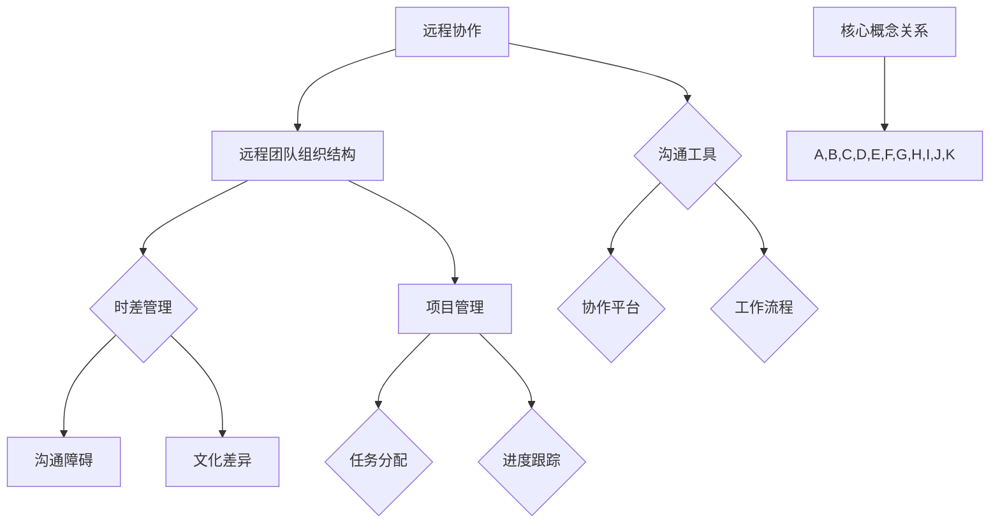
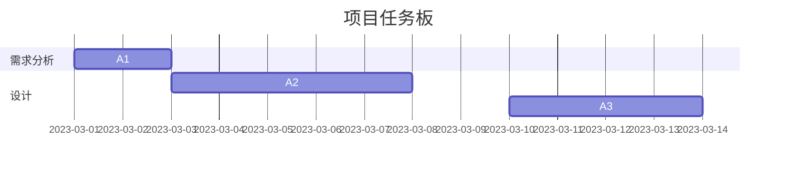

                 

### 文章标题

《技术团队的远程协作：跨时区工作的挑战与对策》

### 关键词

远程协作、跨时区工作、挑战、对策、技术工具、项目管理、时间管理

### 摘要

随着全球化的加速和互联网技术的普及，远程协作已经成为现代技术团队的重要组成部分。特别是在跨时区的工作环境中，远程协作不仅面临时差、沟通和文化差异等挑战，还需要找到有效的工作方法和工具。本文将深入探讨技术团队在远程协作中的挑战，包括时差、沟通和文化差异等，并介绍一系列对策，如使用合适的工具、时间管理和项目管理策略。通过实际案例分析和最佳实践分享，本文旨在为技术团队提供跨时区工作的有效指导。

---

## 引言

在当今的全球化和数字化时代，远程协作已经成为企业运营的重要组成部分。特别是在技术领域，远程团队的存在已经司空见惯。这种协作模式不仅打破了地域的限制，还提高了团队的灵活性和响应速度。然而，远程协作，特别是跨时区的工作，带来了许多独特的挑战。本文将围绕这些问题展开讨论，并提出相应的解决方案。

### 跨时区工作的定义与背景

跨时区工作指的是团队成员处于不同的时区，进行协同工作的模式。这种模式在全球化的背景下变得越来越普遍，尤其是在大型技术公司中，他们可能拥有分布在全球各地的研发团队。例如，一家总部位于美国的科技公司，其研发中心可能分布在欧洲、亚洲和澳大利亚等地。这样的布局虽然有利于全球化布局和资源整合，但也带来了很多挑战。

#### 挑战

1. **时差问题**：最大的挑战之一是时差。团队成员可能需要在不同时间段工作，导致会议安排和协作变得复杂。例如，位于美国西海岸的工程师和位于欧洲东部的工程师可能存在四个小时的时差，这会导致沟通和协调上的困难。

2. **沟通障碍**：由于团队成员分散在不同地区，沟通变得尤为重要。然而，跨时区的沟通可能受到语言障碍、文化差异和时差的影响。这些因素可能导致信息传递不准确，影响项目的进展。

3. **文化差异**：团队成员来自不同的文化背景，这可能导致工作习惯、沟通方式和决策流程的差异。文化差异可能会增加误解和冲突，影响团队的协作效率。

4. **项目管理**：远程团队的项目管理变得更加复杂。项目经理需要制定和实施有效的策略来确保项目按时完成，同时保持团队成员的积极性和参与度。

#### 机遇

尽管跨时区工作存在诸多挑战，但同时也带来了很多机遇：

1. **全球化资源整合**：跨时区工作使得企业能够利用全球范围内的优秀人才，整合不同地区的资源和优势。

2. **灵活性**：远程团队可以灵活地安排工作时间，提高工作效率。团队成员可以自由选择工作地点，这有助于提高工作满意度和生产力。

3. **创新能力**：不同文化背景的碰撞可以激发创新思维，推动技术进步和业务发展。

### 目的和结构

本文旨在探讨技术团队在跨时区工作中面临的挑战，并提出相应的解决方案。文章将分为以下几个部分：

1. **核心概念与联系**：介绍远程协作的基本概念、远程团队的组织结构以及跨时区工作的挑战。
2. **核心算法原理讲解**：探讨如何利用技术手段解决跨时区工作带来的问题，如时差管理、沟通协作工具的使用等。
3. **数学模型和数学公式**：介绍与远程协作相关的时间管理模型、风险评估模型等。
4. **项目实战**：提供实际案例，展示如何在远程团队中实施有效的跨时区工作策略。
5. **最佳实践与未来展望**：总结成功案例，分享最佳实践，并对未来的远程协作趋势进行分析。

通过本文的探讨，我们希望能够为技术团队提供一些实用的策略和工具，帮助他们更好地应对跨时区工作的挑战。

---

## 核心概念与联系

在深入探讨跨时区工作的挑战与对策之前，我们需要了解一些核心概念，并分析它们之间的关系。这些核心概念包括远程协作、远程团队的组织结构以及跨时区工作的挑战。

### 远程协作的基本概念

远程协作是指团队成员通过电子设备和互联网进行协作的过程。这种协作模式使得团队成员不必处于同一地理位置，也能够高效地完成共同的任务。远程协作的目的是提高工作效率、降低成本，同时保持团队的灵活性。

#### 远程协作的关键要素

1. **沟通工具**：远程协作的核心在于沟通。团队成员需要使用各种工具进行交流，如电子邮件、即时通讯、视频会议等。选择合适的沟通工具对于团队协作至关重要。

2. **协作平台**：协作平台提供了项目管理和任务分配的功能，帮助团队成员跟踪项目进度、共享资源和文档。常见的协作平台包括Jira、Trello、Slack等。

3. **工作流程**：远程协作需要明确的工作流程，以确保团队成员能够高效地完成各自的任务。工作流程包括任务分配、进度跟踪、代码审查和测试等。

4. **时间管理**：远程协作中的时间管理尤为重要。团队成员需要合理安排工作时间，确保任务按时完成。时间管理工具如Toggl、RescueTime等可以帮助团队成员更好地管理时间。

### 远程团队的组织结构

远程团队的组织结构通常分为集中式和分布式两种。

#### 集中式远程团队

集中式远程团队是指团队成员虽然不在同一地点，但工作时间和工作内容相对固定。这种结构有助于建立明确的工作流程和沟通机制，但可能受到时差的影响。

1. **核心团队**：由核心成员组成，负责项目的主要工作。
2. **支持团队**：由辅助人员组成，提供技术支持、文档编写和测试等工作。

#### 分布式远程团队

分布式远程团队是指团队成员分布在不同的时区和工作地点，工作时间和工作内容更加灵活。这种结构有利于全球资源的整合，但也带来了更多挑战。

1. **全球协作**：团队成员来自不同的国家和地区，可以充分利用全球的人才资源。
2. **弹性工作时间**：团队成员可以根据自己的时区和工作习惯自由安排工作时间。

### 跨时区工作的挑战

#### 时差管理

时差是跨时区工作的最大挑战之一。团队成员可能需要在不同时间段工作，导致会议安排和协作变得复杂。时差管理的关键在于：

1. **合理分配任务**：根据团队成员的时区安排任务，确保每个成员都有足够的工作时间。
2. **灵活的会议安排**：通过调整会议时间，尽量减少对团队成员的影响。

#### 沟通障碍

跨时区的沟通可能受到语言障碍、文化差异和时差的影响。为解决这些问题，可以采取以下措施：

1. **使用标准语言**：确保所有团队成员使用相同的语言进行交流，减少语言障碍。
2. **建立文化敏感度**：通过培训和文化交流，提高团队成员的文化敏感度，减少误解和冲突。
3. **沟通工具的优化**：选择适合远程协作的沟通工具，如视频会议、即时通讯等，提高沟通效率。

### 核心概念之间的关系

远程协作、远程团队的组织结构和跨时区工作的挑战之间存在着紧密的联系。

1. **远程协作是基础**：远程协作是远程团队运作的基础，决定了团队的工作效率。
2. **组织结构影响协作**：不同的组织结构会影响团队成员的协作方式和工作效率。
3. **跨时区工作的挑战需要解决**：跨时区工作带来的挑战是远程协作中必须解决的问题，直接影响团队的协作效果。

通过理解这些核心概念和它们之间的关系，我们可以更好地应对跨时区工作的挑战，提高远程团队的工作效率。

### Mermaid 流程图

以下是一个用于描述远程协作和跨时区工作挑战的Mermaid流程图：



在这个流程图中，我们可以清晰地看到远程协作、远程团队组织结构和跨时区工作的挑战（时差管理、沟通障碍和文化差异）之间的关系。同时，也展示了远程协作的核心要素（沟通工具、协作平台和工作流程）在团队运作中的作用。

通过这个流程图，我们可以更好地理解远程协作和跨时区工作挑战的内在联系，为后续章节的讨论打下基础。

---

## 核心算法原理讲解

为了应对跨时区工作带来的挑战，技术团队需要采用一系列技术手段和算法来优化沟通、管理时间和提高项目效率。以下将详细讲解这些核心算法原理，并使用伪代码来展示其具体实现。

### 时差管理算法

#### 问题描述

时差管理是跨时区工作中最棘手的问题之一。为了确保团队成员能够高效协作，我们需要设计一个算法来合理安排任务和工作时间。

#### 算法原理

时差管理算法的核心是找到一个最优的协作时间窗口，使得团队成员能够最大限度地利用工作时间。

1. **任务优先级排序**：根据任务的紧急程度和重要性进行排序。
2. **时区分析**：分析团队成员的时区分布，找出共同的协作时间段。
3. **时间窗口优化**：通过优化算法，找到最适合团队成员协作的时间窗口。

#### 伪代码

```python
def time_zone_management(team_members, tasks):
    # 任务优先级排序
    sorted_tasks = sort_tasks_by_priority(tasks)
    
    # 分析时区分布
    time_zones = analyze_time_zones(team_members)
    
    # 找到共同的协作时间段
    common_time_slots = find_common_time_slots(time_zones)
    
    # 优化时间窗口
    optimized_time_slots = optimize_time_slots(sorted_tasks, common_time_slots)
    
    # 分配任务到优化后的时间窗口
    assign_tasks_to_time_slots(optimized_time_slots)
    
    return optimized_time_slots
```

### 沟通协作算法

#### 问题描述

跨时区工作的沟通效率往往较低，因为团队成员可能无法在同一时间进行沟通。为了解决这个问题，我们需要设计一种有效的沟通协作算法。

#### 算法原理

沟通协作算法旨在选择合适的沟通工具，并制定一套沟通机制来确保信息的及时传递和准确理解。

1. **沟通工具选择**：根据团队成员的偏好和项目需求选择最合适的沟通工具。
2. **沟通机制设计**：设计一套沟通流程，包括会议安排、信息共享和反馈机制。
3. **实时监控与调整**：实时监控沟通效果，根据反馈进行调整。

#### 伪代码

```python
def communication協作_algorithm(team_members, project_requirements):
    # 选择合适的沟通工具
    chosen_communication_tools = select_communication_tools(team_members, project_requirements)
    
    # 设计沟通机制
    communication_mechanism = design_communication_mechanism(chosen_communication_tools)
    
    # 实时监控与调整
    monitor_communication_effectiveness(communication_mechanism)
    
    return communication_mechanism
```

### 时间管理算法

#### 问题描述

时间管理在远程协作中至关重要。为了提高工作效率，我们需要设计一种有效的算法来管理团队成员的时间。

#### 算法原理

时间管理算法的核心在于合理分配工作时间，确保任务按时完成。

1. **任务分解**：将大任务分解为小任务，以便更好地管理。
2. **时间预算**：为每个任务分配合理的时间预算。
3. **进度跟踪**：实时跟踪任务进度，及时调整时间分配。

#### 伪代码

```python
def time_management_algorithm(tasks):
    # 任务分解
    small_tasks = decompose_tasks(tasks)
    
    # 时间预算
    time_budgets = assign_time_budgets(small_tasks)
    
    # 进度跟踪
    track_progress(time_budgets)
    
    return time_budgets
```

### 数学模型和数学公式

为了更好地理解和实施上述算法，我们引入一些数学模型和公式来解释和优化这些算法。

#### 时间优化模型

假设我们有n个任务，每个任务的优先级为\(p_i\)，所需时间为\(t_i\)。为了找到最优的协作时间窗口，我们可以使用以下时间优化模型：

$$
\max \sum_{i=1}^{n} p_i \cdot \min\left(\frac{t_i}{2}, \frac{24 - t_i}{2}\right)
$$

其中，\(\min\left(\frac{t_i}{2}, \frac{24 - t_i}{2}\right)\)表示任务可以占据的最小时间窗口。

#### 沟通效率模型

假设我们有m个沟通工具，每个工具的效率为\(e_i\)。为了选择最优的沟通工具，我们可以使用以下沟通效率模型：

$$
\max \sum_{i=1}^{m} e_i
$$

#### 时间管理模型

假设我们有k个任务，每个任务的时间预算为\(b_i\)，实际完成时间为\(t_i\)。为了确保任务按时完成，我们可以使用以下时间管理模型：

$$
\min \sum_{i=1}^{k} (b_i - t_i)
$$

这些数学模型和公式可以帮助我们更好地理解和优化跨时区工作的算法，从而提高远程团队的工作效率和协作效果。

---

## 项目实战

为了更好地理解如何在远程团队中实施有效的跨时区工作策略，我们将通过一个实际案例进行详细分析。

### 案例背景

某大型科技公司需要开发一款跨平台的应用程序，其开发团队分布在五个不同的时区，包括美国东海岸、西海岸、欧洲中部、亚洲东部和澳大利亚。团队由前端开发人员、后端开发人员、测试工程师和项目经理组成。由于团队成员处于不同的时区，项目协调和任务分配成为了一大挑战。

### 开发环境搭建

在开始项目之前，团队首先搭建了一个统一的开发环境。这个环境包括以下关键组件：

1. **版本控制**：使用Git进行版本控制，确保代码的一致性和可追溯性。
2. **代码库**：在GitHub上创建了一个公共代码库，所有团队成员都可以访问和提交代码。
3. **容器化**：使用Docker容器化技术，确保在不同的环境中运行相同的代码。
4. **持续集成/持续部署（CI/CD）**：使用Jenkins实现持续集成和持续部署，自动化测试和部署流程。

### 源代码详细实现和代码解读

项目分为多个阶段，每个阶段都有不同的任务。以下是一个典型的代码实现和解读：

#### 阶段一：需求分析和设计

在这个阶段，项目经理和需求分析师与客户进行了多次视频会议，收集需求并制定项目计划。项目经理使用Trello创建了项目任务板，将任务分配给团队成员。



#### 阶段二：前端开发

前端开发人员根据设计稿编写HTML、CSS和JavaScript代码。为了提高协作效率，他们使用Slack进行实时沟通，并在GitHub上提交代码并进行代码审查。

```javascript
// 示例：前端代码实现
function loginUser(username, password) {
    // 实现登录逻辑
}
```

#### 阶段三：后端开发

后端开发人员使用Node.js和Express框架开发API接口。他们使用Jira跟踪任务进度，并通过视频会议进行代码审查。

```javascript
// 示例：后端代码实现
app.post('/api/login', (req, res) => {
    // 处理登录请求
});
```

#### 阶段四：测试

测试工程师编写测试用例，使用Selenium进行自动化测试，并通过Jenkins自动化执行测试脚本。

```python
# 示例：测试代码实现
def test_login():
    # 实现登录测试逻辑
```

### 代码应用解读与分析

通过上述代码实现，我们可以看到：

1. **版本控制**：Git的版本控制确保了代码的安全性和一致性，团队成员可以随时查看和回滚代码。
2. **容器化**：Docker容器化技术确保了开发环境的一致性，避免了环境差异导致的问题。
3. **CI/CD**：Jenkins实现了持续集成和持续部署，自动化测试和部署提高了开发效率。

### 实际案例分析和详细讲解剖析

在实际项目中，团队遇到了以下问题：

1. **时差问题**：由于团队成员分布在不同的时区，会议和代码审查时间安排变得复杂。团队采用了以下策略解决时差问题：

   - **灵活的会议安排**：通过提前协商，尽量将会议安排在团队成员的共同时间窗口。
   - **视频会议工具**：使用Zoom、Microsoft Teams等视频会议工具，确保会议的实时性和高效性。

2. **沟通障碍**：由于团队成员使用不同的沟通工具，沟通效率受到影响。团队采用了以下策略：

   - **统一沟通工具**：选择Slack作为主要的沟通工具，确保信息的集中管理和快速响应。
   - **沟通培训**：定期进行沟通技巧培训，提高团队成员的沟通效率。

3. **文化差异**：团队成员来自不同的文化背景，可能会导致工作习惯和沟通方式的差异。团队采取了以下策略：

   - **文化敏感度培训**：进行文化差异培训，提高团队成员的文化敏感度。
   - **尊重多样性**：鼓励团队成员分享各自的文化背景和工作习惯，促进团队内部的多样性和包容性。

### 项目小结

通过上述实际案例的分析，我们可以得出以下结论：

1. **技术手段的应用**：使用版本控制、容器化和CI/CD等技术手段，提高了开发效率和代码质量。
2. **沟通与协作**：通过灵活的会议安排、统一的沟通工具和文化敏感度培训，提高了团队的沟通效率和协作效果。
3. **项目管理**：使用项目任务板、Jira等项目管理工具，确保项目进度和任务分配的透明性和可控性。

这些经验对于其他跨时区工作的远程团队具有借鉴意义，帮助他们更好地应对跨时区工作的挑战。

---

## 最佳实践与未来展望

在跨时区工作的远程团队中，成功实施有效的协作策略不仅需要技术手段的支持，还需要团队成员之间的默契和不断的实践。以下是一些最佳实践，旨在帮助团队更好地应对远程协作的挑战，同时展望未来可能的发展趋势。

### 最佳实践

1. **灵活的工作时间安排**：制定灵活的工作时间表，以适应团队成员不同的时区。例如，可以通过“轮班制”来确保24小时不间断的工作，从而提高项目的响应速度。

2. **高效的沟通机制**：选择并熟练使用适合团队沟通需求的工具，如Slack、Zoom、Microsoft Teams等。建立明确的沟通渠道和规范，确保信息的快速传递和有效沟通。

3. **明确的任务分配与跟踪**：使用项目管理工具（如Jira、Trello等）进行任务分配和进度跟踪，确保每个成员的任务明确、可控。定期进行项目进度汇报和回顾，及时调整策略。

4. **文化敏感度培训**：定期组织文化敏感度培训，提高团队成员对多样性的认识和尊重。通过跨文化的交流和合作，减少误解和冲突，增强团队凝聚力。

5. **技术工具集成**：集成多种技术工具，如版本控制、持续集成/持续部署（CI/CD）等，确保开发流程的自动化和标准化。通过技术手段提高工作效率，减少人为错误。

### 小结

通过上述最佳实践，技术团队可以在跨时区的工作环境中实现高效的协作。灵活的工作时间安排、高效的沟通机制、明确的任务分配与跟踪、文化敏感度培训以及技术工具集成，这些策略共同作用，提高了团队的协作效率和项目的成功率。

### 未来展望

未来，随着技术的不断进步，远程协作和跨时区工作的模式也将不断演变和优化。以下是一些可能的发展趋势：

1. **更智能的协作工具**：随着人工智能和机器学习技术的发展，未来的协作工具将更加智能化，能够自动分析和推荐最佳的工作时间和协作方式。

2. **虚拟现实（VR）和增强现实（AR）**：虚拟现实和增强现实技术将为远程协作提供更加沉浸式的体验。团队成员可以通过VR/AR设备进行虚拟会议和协作，增强沟通效果和协作体验。

3. **全球化协作平台**：未来的协作平台将更加全球化，支持多种语言和文化，提供更加全面和多样化的协作功能。

4. **更加灵活的工作模式**：随着远程工作逐渐成为主流，工作模式也将更加灵活。例如，部分团队成员可以选择远程办公，而另一些团队成员则在公司办公室工作。这种混合工作模式将进一步提高团队的工作效率和灵活性。

5. **更多的文化融合**：随着远程团队规模的扩大，团队成员来自更多的国家和地区，这将促进不同文化的融合。通过文化交流和协作，团队将更加多元化，从而激发更多的创新和创意。

总之，随着技术的不断进步，远程协作和跨时区工作的模式将变得更加高效、灵活和智能化。技术团队需要不断学习和适应这些变化，以保持竞争优势和团队活力。

---

## 结论

跨时区工作的远程协作在现代技术团队中越来越普遍，但同时也带来了诸多挑战。本文通过详细的分析和实际案例，探讨了跨时区工作面临的时差管理、沟通障碍和文化差异等问题，并提出了一系列有效的对策。我们介绍了多种技术工具和算法，以及最佳实践，帮助技术团队在跨时区的工作环境中实现高效协作。未来，随着技术的不断进步，远程协作的模式将变得更加高效和灵活。技术团队需要持续学习和适应这些变化，以应对不断变化的挑战，保持竞争优势。

### 作者信息

作者：AI天才研究院/AI Genius Institute & 禅与计算机程序设计艺术 /Zen And The Art of Computer Programming

