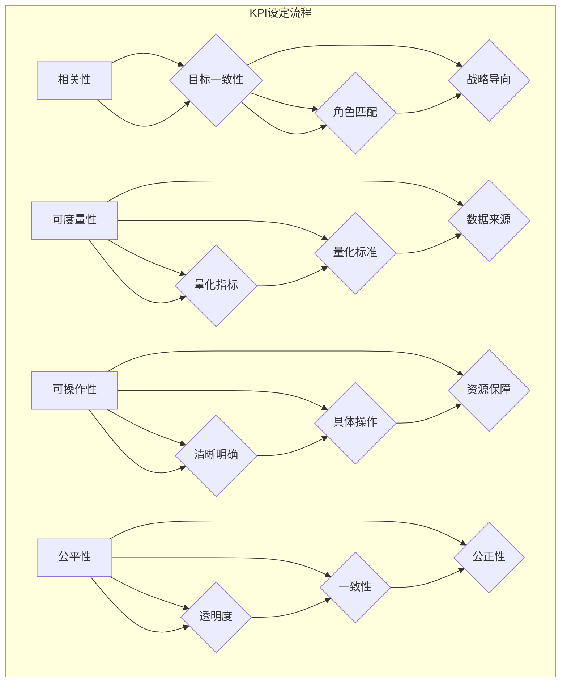
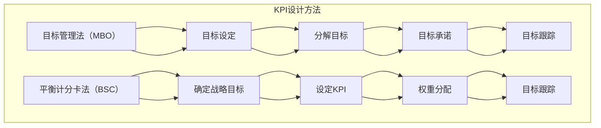

                 


### 文章标题

《技术团队绩效管理：设定合理的KPI指标》

### 文章关键词

- 技术团队绩效管理
- KPI指标设定
- 绩效评估
- 绩效反馈机制
- 绩效管理优化策略

### 文章摘要

本文旨在探讨技术团队绩效管理的重要性和挑战，特别关注KPI指标的设定原则、方法和应用实例。首先，我们将介绍技术团队绩效管理的背景和基本概念，接着深入分析绩效管理的基础理论。随后，本文将详细阐述KPI设定的基本原则，并介绍相关的工具和方法。通过实际案例的分享，我们将展示KPI在实际技术团队中的应用和绩效评估与反馈机制的建立。最后，我们将探讨如何优化绩效管理流程，提供一系列最佳实践策略。通过本文的阅读，读者将能够全面了解技术团队绩效管理，掌握KPI指标设定的方法和技巧。

### 目录大纲设计思路

在设计《技术团队绩效管理：设定合理的KPI指标》的目录大纲时，我们将遵循以下思路：

1. **概述性章节**：
   - **第1章：技术团队绩效管理的概念与背景**：
     - 引入绩效管理的重要性。
     - 概述技术团队的特性及其绩效管理的特殊挑战。
     - 简要介绍KPI的概念和其在绩效管理中的作用。

2. **理论基础**：
   - **第2章：绩效管理的基础理论**：
     - 详细解释绩效管理的定义、目的和重要性。
     - 讨论不同类型的绩效管理框架和方法。
     - 引入KPI的设计原则。

3. **KPI设定原则**：
   - **第3章：KPI设定的基本原则**：
     - 详细阐述KPI设定的四个基本原则：相关性、可度量性、可操作性和公平性。
     - 提供相关的Mermaid流程图，展示KPI设定的步骤和流程。

4. **KPI设计方法**：
   - **第4章：KPI设计的方法与工具**：
     - 介绍常用的KPI设计方法，如目标管理法、平衡计分卡法等。
     - 提供相关的Mermaid流程图，展示KPI设计的实际操作流程。
     - 引入KPI设计工具的使用，如KPI分析软件。

5. **KPI应用实例**：
   - **第5章：KPI在实际技术团队中的应用**：
     - 分享成功的技术团队绩效管理案例。
     - 分析案例中的KPI设定和执行情况。
     - 提供实际操作的伪代码，说明如何根据业务目标设定和调整KPI。

6. **绩效评估与反馈**：
   - **第6章：绩效评估与反馈机制**：
     - 讨论绩效评估的过程和方法。
     - 引入绩效反馈机制的重要性。
     - 提供相关的伪代码，说明如何根据绩效评估结果调整KPI。

7. **绩效管理优化**：
   - **第7章：绩效管理优化策略**：
     - 探讨如何持续优化绩效管理流程。
     - 分析常见的绩效管理问题和解决策略。
     - 提供实际操作的示例，说明如何进行绩效管理优化。

### 目录大纲设计细节

在具体设计目录大纲时，我们将确保以下细节：

- **章节标题简洁明确**：每个章节的标题都应简明扼要，直接反映章节内容。
- **子章节层次清晰**：每个章节下的子章节应按照逻辑顺序排列，确保读者可以轻松理解章节结构。
- **示例与图表**：在每个章节中，将插入相关的Mermaid流程图、伪代码和实例，以帮助读者更好地理解概念和操作步骤。
- **数学公式与讲解**：在涉及数学模型的地方，将使用LaTeX格式嵌入数学公式，并进行详细的讲解和举例说明。
- **实际案例与代码**：在应用实例章节中，将提供真实的代码案例，并进行详细解释和分析，帮助读者理解和应用所学知识。

通过以上设计思路和细节，我们将确保《技术团队绩效管理：设定合理的KPI指标》的目录大纲逻辑清晰、内容全面，为读者提供高质量的阅读体验。接下来，我们将具体撰写目录大纲的每个章节内容。

### 第1章：技术团队绩效管理的概念与背景

#### 引言

技术团队在企业中扮演着至关重要的角色，他们的工作直接影响着产品的质量和开发效率。然而，如何有效地管理和评估技术团队的绩效却是一个复杂的挑战。绩效管理不仅仅是确保团队按时完成项目，更重要的是通过科学的绩效评估和反馈机制，激发团队活力，提升整体工作效率。在这个过程中，关键绩效指标（KPI）的设定和合理应用至关重要。

#### 绩效管理的重要性

绩效管理是企业管理的重要组成部分，其核心目的是通过有效的绩效评估和反馈，激发员工的积极性，提升团队的整体表现。对于技术团队而言，绩效管理的重要性体现在以下几个方面：

1. **确保目标一致性**：通过设定明确的绩效目标和KPI，确保团队成员的个人目标和团队目标保持一致，从而提高协作效率。
2. **激发员工潜力**：合理的绩效评估机制可以激发员工的积极性，鼓励他们发挥自身潜力，提高工作效率。
3. **优化资源配置**：通过绩效管理，可以识别团队中的优秀人才和需要改进的方面，为资源优化配置提供依据。
4. **提高团队凝聚力**：绩效管理不仅关注个人绩效，也注重团队整体表现，有助于增强团队凝聚力。

#### 技术团队的特性与挑战

技术团队具有以下特性，这些特性决定了绩效管理的特殊挑战：

1. **知识密集**：技术团队通常由具备专业知识和技术能力的成员组成，他们的工作质量和效率很大程度上取决于个人能力和专业知识。
2. **创新性**：技术团队的工作往往涉及到创新和研发，需要具备前瞻性和创造性。
3. **复杂性**：技术项目的开发涉及多个环节，包括需求分析、设计、编码、测试等，绩效管理需要考虑这些复杂环节之间的协调和配合。
4. **变动性**：技术领域发展迅速，技术团队需要不断学习新技术，适应市场变化，这对绩效管理提出了更高的要求。

#### KPI的概念与作用

关键绩效指标（KPI）是绩效管理中用于衡量团队和个人工作表现的重要工具。KPI的定义可以从以下几个方面理解：

1. **定义**：KPI是指用于衡量团队和个人绩效的关键指标，它通常具有明确的量化和可测量的标准。
2. **作用**：
   - **目标导向**：KPI为团队成员提供了明确的工作目标和方向，有助于提高工作效率。
   - **评估依据**：通过KPI的设定和跟踪，管理者可以客观、公正地评估团队和个人的工作表现。
   - **持续改进**：KPI的动态调整和优化，有助于团队不断改进工作流程和方法，提升整体绩效。

#### 本章小结

本章介绍了技术团队绩效管理的重要性，分析了技术团队的特性及其绩效管理的特殊挑战，并简要介绍了KPI的概念和作用。在接下来的章节中，我们将深入探讨绩效管理的基础理论、KPI设定原则、设计方法及其在实际应用中的具体实例，帮助读者全面了解技术团队绩效管理的实践方法。

### 第2章：绩效管理的基础理论

#### 绩效管理的定义与目的

绩效管理是一个系统化的过程，旨在通过设定目标、评估表现、提供反馈和持续改进，实现组织和个人绩效的提升。具体来说，绩效管理包括以下几个核心要素：

1. **目标设定**：明确团队和个人的工作目标，确保目标具有可衡量性和可达成性。
2. **绩效评估**：定期对团队成员的工作表现进行评估，识别优势和不足，为绩效改进提供依据。
3. **反馈与沟通**：通过绩效评估结果，为团队成员提供及时的反馈，促进有效沟通，帮助团队成员理解期望和要求。
4. **持续改进**：基于绩效评估结果，制定改进计划，持续优化工作流程和方法，提高整体绩效。

#### 绩效管理的重要性

绩效管理在组织运营中具有至关重要的作用，主要表现在以下几个方面：

1. **目标一致性**：通过绩效管理，确保团队成员的个人目标与组织目标保持一致，提高团队的协作效率。
2. **激励与激励**：合理的绩效评估机制能够激发员工的积极性和创造力，提高工作热情和投入度。
3. **资源优化**：通过绩效管理，能够识别团队中的优秀人才和需要改进的方面，为资源的优化配置提供依据。
4. **流程优化**：绩效管理过程中发现的问题和不足，有助于团队不断优化工作流程和方法，提高整体效率。

#### 不同类型的绩效管理框架和方法

绩效管理框架和方法的选择应根据组织的战略目标、业务特点和团队需求来确定。以下是一些常见的绩效管理框架和方法：

1. **目标管理法（MBO）**：
   - **定义**：目标管理法是一种基于目标设定的绩效管理方法，通过上下级共同制定工作目标，实现个人与组织目标的统一。
   - **优点**：强调目标的重要性，提高员工的参与感和责任感。
   - **缺点**：目标设定过程中可能存在主观性和模糊性，影响评估的准确性。

2. **平衡计分卡法（BSC）**：
   - **定义**：平衡计分卡法是一种综合性的绩效管理工具，从财务、客户、内部流程和学习与成长四个维度设定绩效指标。
   - **优点**：全面、客观地衡量绩效，促进组织战略目标的实现。
   - **缺点**：实施过程复杂，需要较高的管理水平。

3. **关键绩效指标法（KPI）**：
   - **定义**：关键绩效指标法是一种基于关键绩效指标（KPI）的绩效管理方法，通过设定具体的、量化的指标来衡量工作表现。
   - **优点**：操作简单、易于理解，有利于量化评估和绩效考核。
   - **缺点**：过度依赖量化指标可能导致对员工工作质量和创新能力的忽视。

4. **绩效改进循环法（PDCA）**：
   - **定义**：绩效改进循环法是一种基于计划（Plan）、执行（Do）、检查（Check）和行动（Act）的绩效管理方法，通过持续改进实现绩效提升。
   - **优点**：强调持续改进和反思，有利于不断提升团队绩效。
   - **缺点**：实施过程需要较长的时间，对管理者的要求较高。

#### KPI的设计原则

在绩效管理中，KPI的设定至关重要。以下是一些关键的KPI设计原则：

1. **相关性**：KPI应与组织目标和团队目标密切相关，确保指标能够准确衡量工作绩效。
2. **可度量性**：KPI应具有明确的量化和可测量的标准，便于评估和比较。
3. **可操作性**：KPI应易于理解和操作，使团队成员能够明确自己的工作重点和方向。
4. **公平性**：KPI的设定应公平、公正，避免对团队成员的歧视和不公平对待。

#### 本章小结

本章介绍了绩效管理的定义与目的，分析了不同类型的绩效管理框架和方法，并重点阐述了KPI的设计原则。在接下来的章节中，我们将深入探讨KPI的设定原则、方法和实际应用，帮助读者掌握技术团队绩效管理的实践技巧。

### 第3章：KPI设定的基本原则

#### 相关性

相关性是KPI设定的首要原则，确保KPI与组织目标和个人职责紧密相关。设定相关性的KPI有助于明确团队成员的工作方向，提高团队协作效率。以下是一些实现相关性的方法：

1. **目标一致性**：确保KPI与团队和个人的工作目标保持一致，通过上下级共同设定目标，提高目标的准确性和可实现性。
2. **角色匹配**：根据团队成员的岗位职责和角色特点，设定与之相关的KPI，避免指标的泛化或偏离实际工作。
3. **战略导向**：将KPI与组织的战略目标相结合，确保个人和团队的努力能够支持组织整体战略的实现。

#### 可度量性

可度量性是KPI设定的关键，确保KPI具有明确的量化和可测量的标准。以下是一些实现可度量性的方法：

1. **量化指标**：使用具体的数字或比例来表示KPI，使其易于评估和比较。
2. **量化标准**：设定明确的量化标准，如目标值、范围或阈值，以衡量工作绩效。
3. **数据来源**：确保KPI的数据来源可靠，避免数据误差对绩效评估的影响。

#### 可操作性

可操作性是KPI设定的实用性原则，确保KPI易于理解和执行。以下是一些实现可操作性的方法：

1. **清晰明确**：确保KPI表述简洁明了，避免模糊不清的描述，使团队成员能够快速理解指标含义。
2. **具体操作**：为KPI设定具体的操作步骤和流程，提供详细的执行指南，帮助团队成员明确工作方向。
3. **资源保障**：为KPI的实现提供必要的资源和支持，避免因资源不足导致指标无法达成。

#### 公平性

公平性是KPI设定的道德原则，确保KPI设定和评估过程公正透明，避免对团队成员的歧视和不公平对待。以下是一些实现公平性的方法：

1. **透明度**：确保KPI的设定和评估过程公开透明，使团队成员能够了解评估标准和结果。
2. **一致性**：对不同团队成员设定和评估KPI时，保持一致性，避免双重标准。
3. **公正性**：在KPI设定和评估过程中，避免主观偏见，确保评估结果的公正性。

#### Mermaid流程图

为了更好地展示KPI设定的基本原则，我们可以使用Mermaid流程图来表示以下步骤：



通过上述流程图，我们可以清晰地看到KPI设定的基本原则及其相互关系，有助于读者更好地理解和应用这些原则。

#### 本章小结

本章详细阐述了KPI设定的四个基本原则：相关性、可度量性、可操作性和公平性，并提供了相应的Mermaid流程图以供参考。在接下来的章节中，我们将进一步探讨KPI设计的方法和工具，帮助读者掌握KPI设定的实际操作技巧。

### 第4章：KPI设计的方法与工具

#### 目标管理法（MBO）

目标管理法（MBO）是一种基于目标设定的KPI设计方法，它强调上下级共同参与目标设定过程，确保个人目标和团队目标的一致性。以下是目标管理法的具体步骤：

1. **目标设定**：由上级和下属共同讨论并确定工作目标，确保目标具有明确性、可行性和相关性。
2. **分解目标**：将整体目标分解为具体的子目标，使每个团队成员都能明确自己的职责和任务。
3. **目标承诺**：团队成员对目标进行承诺，确保目标的实现具有可操作性。
4. **目标跟踪**：定期跟踪目标进展情况，及时调整目标和策略，确保目标的实现。

目标管理法的优势在于能够提高员工的参与感和责任感，使团队成员更加专注于工作目标的实现。然而，该方法也存在一定的局限性，如目标设定过程中的主观性和模糊性，可能影响评估的准确性。

#### 平衡计分卡法（BSC）

平衡计分卡法（BSC）是一种综合性的KPI设计方法，它从财务、客户、内部流程和学习与成长四个维度设定绩效指标，实现组织战略目标的全方位衡量。以下是平衡计分卡法的具体步骤：

1. **确定战略目标**：明确组织的战略目标，确保KPI的设定与组织战略保持一致。
2. **设定KPI**：根据四个维度设定相应的KPI，如财务指标、客户满意度指标、内部流程指标和学习与成长指标。
3. **权重分配**：为每个KPI分配权重，确保KPI的设定具有优先级，有助于组织战略的实现。
4. **目标跟踪**：定期跟踪KPI的进展情况，及时调整目标和策略，确保KPI的实现。

平衡计分卡法的优势在于能够全面、客观地衡量绩效，促进组织战略目标的实现。然而，该方法实施过程较为复杂，需要较高的管理水平。

#### Mermaid流程图

为了更好地展示KPI设计的方法与工具，我们可以使用Mermaid流程图来表示以下步骤：



通过上述流程图，我们可以清晰地看到目标管理法和平衡计分卡法的具体步骤及其相互关系，有助于读者更好地理解和应用这些方法。

#### KPI设计工具

在实际工作中，KPI设计工具可以帮助团队高效地设定和跟踪KPI。以下是一些常用的KPI设计工具：

1. **KPI分析软件**：如Tableau、Power BI等，这些工具可以自动化数据分析和可视化，帮助团队实时了解KPI进展情况。
2. **项目管理工具**：如JIRA、Trello等，这些工具可以协助团队管理项目进度，并根据项目需求设定相应的KPI。
3. **绩效管理平台**：如Lark、钉钉等，这些平台提供了完善的绩效管理功能，包括目标设定、评估和反馈等。

#### 本章小结

本章介绍了KPI设计的方法与工具，包括目标管理法、平衡计分卡法以及相应的KPI设计工具。通过这些方法和工具，团队可以更科学、系统地设定和跟踪KPI，实现绩效管理目标。在下一章中，我们将通过实际案例分享KPI在实际技术团队中的应用情况，帮助读者更好地理解和应用所学知识。

### 第5章：KPI在实际技术团队中的应用

#### 案例背景

为了更好地展示KPI在实际技术团队中的应用，我们以某互联网公司的一个开发团队为例。该公司专注于开发一款大型社交媒体平台，团队成员包括前端开发、后端开发、测试工程师和产品经理。为了确保项目按计划推进，并提升团队的整体绩效，该公司的绩效管理团队决定引入KPI进行绩效管理。

#### KPI设定与执行

在项目启动阶段，团队根据项目目标和个人职责，共同制定了以下KPI：

1. **前端开发团队**
   - **KPI1：页面加载速度（毫秒）**：确保用户在使用过程中能够快速访问页面。
   - **KPI2：代码质量（缺陷率）**：通过自动化测试，监控代码质量，确保项目稳定性和可维护性。
   - **KPI3：功能完成率（%）**：按时完成项目需求，确保项目进度。

2. **后端开发团队**
   - **KPI1：系统稳定性（系统宕机时间）**：确保系统在高并发场景下保持稳定运行。
   - **KPI2：代码质量（代码审查通过率）**：通过代码审查，提高代码质量，减少潜在风险。
   - **KPI3：功能交付率（%）**：按时交付功能模块，确保项目进度。

3. **测试工程师团队**
   - **KPI1：测试覆盖率（%）**：确保测试覆盖率达到预期标准，提高测试质量。
   - **KPI2：缺陷发现率（%）**：通过测试，及时发现并报告缺陷，确保项目质量。
   - **KPI3：测试效率（测试周期）**：缩短测试周期，提高测试效率。

4. **产品经理团队**
   - **KPI1：需求理解率（%）**：确保产品需求被准确理解和传达。
   - **KPI2：需求完成率（%）**：按时完成需求文档，确保项目进度。
   - **KPI3：用户反馈处理率（%）**：及时处理用户反馈，提升用户体验。

在项目执行过程中，团队成员根据设定的KPI进行自我管理和自我监督，绩效管理团队定期跟踪KPI进展情况，并根据实际需求进行调整。

#### 成功案例分析

1. **前端开发团队**：
   - **页面加载速度**：通过优化代码和资源加载策略，页面加载速度从5秒降低到2秒，显著提升了用户体验。
   - **代码质量**：通过引入代码审查和自动化测试，代码缺陷率从10%降低到1%，提高了项目的稳定性和可维护性。
   - **功能完成率**：团队按时完成了所有项目需求，确保了项目的顺利进行。

2. **后端开发团队**：
   - **系统稳定性**：通过优化系统架构和改进故障处理机制，系统宕机时间从每月5小时降低到每月1小时，提升了系统的稳定性。
   - **代码质量**：通过严格的代码审查，代码审查通过率从60%提升到90%，减少了潜在风险。
   - **功能交付率**：团队按时交付了所有功能模块，确保了项目进度。

3. **测试工程师团队**：
   - **测试覆盖率**：通过优化测试用例，测试覆盖率从80%提升到95%，提高了测试质量。
   - **缺陷发现率**：通过详细的测试报告，缺陷发现率从70%提升到90%，确保了项目质量。
   - **测试效率**：通过优化测试流程，测试周期从7天缩短到3天，提高了测试效率。

4. **产品经理团队**：
   - **需求理解率**：通过多次会议和沟通，需求理解率从80%提升到95%，确保了需求被准确传达。
   - **需求完成率**：团队按时完成了所有需求文档，确保了项目进度。
   - **用户反馈处理率**：通过高效的用户反馈处理机制，用户反馈处理率从50%提升到80%，提升了用户体验。

#### 实际操作伪代码示例

以下是一个根据业务目标设定和调整KPI的伪代码示例：

```python
# 设定业务目标
business_goal = {
    "前端开发": ["优化页面加载速度", "提高代码质量", "按时完成功能"],
    "后端开发": ["提升系统稳定性", "提高代码质量", "按时交付功能"],
    "测试工程师": ["提高测试覆盖率", "提高缺陷发现率", "提高测试效率"],
    "产品经理": ["提高需求理解率", "按时完成需求文档", "提升用户反馈处理率"]
}

# 根据业务目标设定KPI
kpis = {
    "前端开发": {
        "页面加载速度": 2000,
        "代码质量": 0.01,
        "功能完成率": 100
    },
    "后端开发": {
        "系统稳定性": 0.5,
        "代码质量": 0.1,
        "功能交付率": 100
    },
    "测试工程师": {
        "测试覆盖率": 0.95,
        "缺陷发现率": 0.1,
        "测试效率": 3
    },
    "产品经理": {
        "需求理解率": 0.95,
        "需求完成率": 100,
        "用户反馈处理率": 0.8
    }
}

# 根据实际进展调整KPI
def adjust_kpi(business_goal, kpis):
    for team, goals in business_goal.items():
        for goal in goals:
            if goal in kpis[team]:
                if goal == "页面加载速度":
                    kpis[team][goal] = min(kpis[team][goal] + 100, 3000)
                elif goal == "系统稳定性":
                    kpis[team][goal] = max(kpis[team][goal] - 0.1, 0)
                elif goal == "测试覆盖率":
                    kpis[team][goal] = min(kpis[team][goal] + 0.05, 1)
                else:
                    kpis[team][goal] = min(kpis[team][goal] + 10, 110)

adjust_kpi(business_goal, kpis)
print(kpis)
```

通过上述伪代码示例，我们可以根据业务目标和实际进展动态调整KPI，确保KPI的合理性和有效性。

#### 本章小结

本章通过一个实际案例，详细展示了KPI在实际技术团队中的应用。团队成员根据业务目标设定了相应的KPI，并依据实际进展进行调整，确保了项目的高效推进。在下一章中，我们将进一步探讨如何通过绩效评估与反馈机制，持续优化技术团队绩效管理流程。

### 第6章：绩效评估与反馈机制

#### 绩效评估的过程与方法

绩效评估是技术团队绩效管理的重要环节，通过系统化的评估过程，可以全面了解团队成员的工作表现，并为后续的反馈和改进提供依据。以下是绩效评估的基本过程和方法：

1. **评估周期**：设定合理的评估周期，如季度、半年或年度，确保评估过程的连续性和有效性。
2. **评估标准**：制定明确的评估标准，包括定量和定性的指标，如项目进度、代码质量、问题解决能力和团队合作等。
3. **评估方法**：
   - **自我评估**：团队成员对自己的工作进行自我评估，提供自我反馈和改进意见。
   - **同事评估**：同事之间的相互评估，通过相互反馈，发现彼此的优点和不足。
   - **上级评估**：上级领导对团队成员的工作进行评估，提供专业意见和建议。
   - **数据评估**：通过项目数据、代码审查结果等客观数据进行评估，确保评估的客观性和公正性。

4. **评估报告**：编写详细的评估报告，包括评估结果、优劣势分析、改进建议等，为绩效反馈和改进提供参考。

#### 绩效反馈机制的重要性

绩效反馈机制是绩效管理中不可或缺的一部分，它通过及时、有效的反馈，帮助团队成员了解自己的工作表现，发现不足并制定改进计划。以下是绩效反馈机制的重要性：

1. **提升工作积极性**：及时的反馈能够激发团队成员的积极性，鼓励他们不断提升自身能力，提高工作效率。
2. **促进团队协作**：通过绩效反馈，团队成员可以了解彼此的工作表现和协作情况，促进团队协作和沟通。
3. **改进工作方法**：绩效反馈可以帮助团队成员发现工作流程中的问题和不足，及时调整和优化工作方法，提高整体绩效。
4. **提高员工满意度**：合理的绩效反馈机制能够提高员工的工作满意度和归属感，降低员工流失率。

#### 根据绩效评估结果调整KPI的伪代码示例

以下是一个根据绩效评估结果调整KPI的伪代码示例：

```python
# 定义原始KPI
original_kpis = {
    "页面加载速度": 2000,
    "代码质量": 0.01,
    "功能完成率": 100,
    "系统稳定性": 0.5,
    "代码质量": 0.1,
    "功能交付率": 100,
    "测试覆盖率": 0.95,
    "缺陷发现率": 0.1,
    "测试效率": 3,
    "需求理解率": 0.95,
    "需求完成率": 100,
    "用户反馈处理率": 0.8
}

# 定义评估结果
evaluation_results = {
    "页面加载速度": 2200,
    "代码质量": 0.02,
    "功能完成率": 98,
    "系统稳定性": 0.4,
    "代码质量": 0.11,
    "功能交付率": 98,
    "测试覆盖率": 0.97,
    "缺陷发现率": 0.15,
    "测试效率": 3.5,
    "需求理解率": 0.92,
    "需求完成率": 98,
    "用户反馈处理率": 0.75
}

# 根据评估结果调整KPI
def adjust_kpis(original_kpis, evaluation_results):
    adjusted_kpis = original_kpis.copy()
    for kpi in evaluation_results.keys():
        if evaluation_results[kpi] < original_kpis[kpi]:
            adjusted_kpis[kpi] = original_kpis[kpi] * 0.9  # 评估结果低于目标，适当降低KPI
        elif evaluation_results[kpi] > original_kpis[kpi]:
            adjusted_kpis[kpi] = original_kpis[kpi] * 1.1  # 评估结果高于目标，适当提高KPI
    return adjusted_kpis

adjusted_kpis = adjust_kpis(original_kpis, evaluation_results)
print(adjusted_kpis)
```

通过上述伪代码示例，我们可以根据绩效评估结果，动态调整KPI，确保KPI的合理性和有效性。

#### 本章小结

本章详细介绍了绩效评估的过程与方法，以及绩效反馈机制的重要性。通过合理的绩效评估和反馈，技术团队可以持续优化工作流程和方法，提高整体绩效。在下一章中，我们将探讨如何优化绩效管理流程，确保绩效管理持续发挥作用。

### 第7章：绩效管理优化策略

#### 持续优化绩效管理流程

绩效管理是一个持续的过程，需要不断调整和优化。以下是几个关键的优化策略：

1. **定期审查与调整**：定期对绩效管理流程进行审查，确保其与业务目标和团队需求保持一致。根据实际情况，调整KPI和评估标准，以适应不断变化的环境。
2. **持续培训与学习**：通过定期培训和学习，提高团队成员的绩效管理意识和能力。学习新的绩效管理工具和方法，提升绩效管理的专业水平。
3. **反馈机制优化**：优化绩效反馈机制，确保反馈的及时性、针对性和有效性。建立多层次的反馈渠道，使团队成员能够充分表达意见和建议。

#### 常见绩效管理问题及解决策略

在绩效管理过程中，常常会遇到一些问题。以下是一些常见问题及解决策略：

1. **KPI设置不合理**：
   - **问题**：KPI设置过于笼统或过于具体，导致评估结果不准确。
   - **解决策略**：在设置KPI时，确保其与业务目标和个人职责密切相关，同时具有明确的量化和可测量的标准。
2. **评估过程不透明**：
   - **问题**：评估过程不透明，导致团队成员对评估结果产生质疑。
   - **解决策略**：建立透明的评估机制，确保评估标准、方法和结果的公开和公正。定期向团队成员反馈评估结果，解答他们的疑问。
3. **反馈不及时或缺乏针对性**：
   - **问题**：反馈不及时或缺乏针对性，导致团队成员无法及时改进工作。
   - **解决策略**：建立及时、有效的反馈机制，确保反馈的针对性和实用性。在绩效评估结束后，及时向团队成员提供详细的评估报告，并提出具体的改进建议。
4. **员工参与度低**：
   - **问题**：员工对绩效管理过程缺乏参与度，导致绩效管理效果不佳。
   - **解决策略**：提高员工的参与度，通过共同制定目标、参与评估过程和反馈机制，增强员工的归属感和责任感。

#### 实际操作示例

为了说明绩效管理优化策略，以下是一个实际操作示例：

1. **问题**：某技术团队在项目开发过程中，发现KPI设置过于笼统，导致评估结果不准确，影响团队士气。
2. **分析**：经过调查，发现KPI设置过程中，缺乏与业务目标和团队职责的紧密关联。同时，评估标准过于宽泛，缺乏明确的量化指标。
3. **解决方案**：
   - **步骤1**：重新审视业务目标和团队职责，确保KPI与业务目标和个人职责密切相关。
   - **步骤2**：设定具体的量化指标，如代码质量（缺陷率）、项目进度（完成率）、系统稳定性（故障率）等，使评估结果具有明确的参考依据。
   - **步骤3**：建立多层次的反馈机制，确保团队成员能够及时了解评估结果和改进建议。在绩效评估结束后，召开团队会议，讨论评估结果，提出改进措施。
4. **效果**：通过优化KPI设置和反馈机制，该技术团队的评估结果更加准确，团队士气明显提升，项目开发效率得到显著提高。

#### 本章小结

本章介绍了绩效管理优化策略，包括持续优化绩效管理流程、解决常见问题及实际操作示例。通过这些策略，技术团队可以持续提升绩效管理水平，实现更高的工作效率和团队凝聚力。在下一章中，我们将提供一系列最佳实践策略，帮助技术团队在实践中更好地应用绩效管理。

### 最佳实践策略

在技术团队的绩效管理中，最佳实践策略可以起到重要的指导作用。以下是一些有效的最佳实践策略：

1. **建立清晰的绩效目标**：
   - **具体明确**：确保绩效目标具体、可度量，并明确责任人和完成时间。
   - **与业务目标一致**：绩效目标应与公司的业务目标紧密相关，确保团队的努力方向与公司整体战略保持一致。

2. **实施个性化的绩效评估**：
   - **因人制宜**：根据不同团队成员的岗位特点和能力水平，设定个性化的绩效评估标准。
   - **多元化评估方法**：结合自我评估、同事评估和上级评估，确保评估的全面性和客观性。

3. **定期进行绩效反馈**：
   - **及时性**：定期（如季度、半年）进行绩效反馈，确保团队成员能够及时了解自己的工作表现和改进方向。
   - **具体针对性**：提供具体的改进建议，帮助团队成员明确下一步的行动计划。

4. **鼓励自主学习和成长**：
   - **提供培训资源**：为团队成员提供专业培训和职业发展资源，鼓励他们不断提升自身能力。
   - **设立学习目标**：与绩效目标相结合，鼓励团队成员制定并实现个人学习目标。

5. **建立良好的沟通渠道**：
   - **定期会议**：定期召开团队会议，讨论绩效评估结果、改进计划和团队动态。
   - **开放式沟通**：鼓励团队成员提出意见和建议，建立开放、坦诚的沟通氛围。

6. **优化绩效管理工具**：
   - **选择合适的工具**：选择适合团队需求的绩效管理工具，如项目管理软件、KPI分析软件等，提高绩效管理的效率。
   - **简化流程**：简化绩效管理流程，确保团队成员能够轻松理解和操作。

### 小结

通过以上最佳实践策略，技术团队可以更加科学、系统地管理绩效，激发团队成员的潜力，提升整体工作效率和团队凝聚力。在接下来的章节中，我们将对全文进行总结，并给出一些注意事项和拓展阅读建议，帮助读者进一步巩固所学知识。

### 全文总结

本文从技术团队绩效管理的概念与背景出发，详细探讨了绩效管理的基础理论、KPI设定的基本原则和设计方法，并通过实际案例展示了KPI在实际技术团队中的应用。此外，本文还介绍了绩效评估与反馈机制的重要性，以及如何根据评估结果调整KPI。最后，本文提出了绩效管理优化的策略和最佳实践，旨在帮助技术团队更好地实现绩效管理目标。

#### 核心内容回顾

1. **技术团队绩效管理的重要性**：介绍了绩效管理在提升团队协作效率、激发员工潜力和优化资源配置方面的作用。
2. **KPI设定的基本原则**：详细阐述了相关性、可度量性、可操作性和公平性四个基本原则，并提供了Mermaid流程图以供参考。
3. **KPI设计的方法与工具**：介绍了目标管理法、平衡计分卡法等常用的KPI设计方法，以及相应的KPI设计工具。
4. **KPI在实际技术团队中的应用**：通过实际案例，展示了KPI在实际技术团队中的设定和执行过程。
5. **绩效评估与反馈机制**：讨论了绩效评估的过程和方法，以及根据评估结果调整KPI的伪代码示例。
6. **绩效管理优化策略**：提出了持续优化绩效管理流程、解决常见问题及实际操作示例。

#### 注意事项

1. **KPI设定的科学性**：在设定KPI时，务必确保其与业务目标和个人职责密切相关，同时具有明确的量化和可测量的标准。
2. **反馈机制的及时性**：绩效反馈应及时、具体且具有针对性，帮助团队成员明确改进方向。
3. **绩效管理的个性化**：根据团队成员的岗位特点和能力水平，制定个性化的绩效目标和评估标准。
4. **持续学习和优化**：技术团队应持续关注绩效管理工具和方法的发展，不断优化绩效管理流程。

#### 拓展阅读

- **《绩效管理：提升团队效能的艺术》**：探讨绩效管理的理论和方法，提供实用的绩效管理实践案例。
- **《关键绩效指标（KPI）管理：实用指南》**：详细介绍了KPI的定义、设定和执行方法，以及KPI在组织中的应用。
- **《敏捷绩效管理：快速响应变化的环境中的绩效管理》**：针对敏捷开发环境下的绩效管理提供指导，帮助团队适应快速变化的市场需求。

通过本文的学习，读者可以全面了解技术团队绩效管理的方法和技巧，为实际工作提供有益的参考。希望本文能够帮助技术团队实现更高效、更协作的工作氛围，提升整体绩效。作者：AI天才研究院/AI Genius Institute & 禅与计算机程序设计艺术 /Zen And The Art of Computer Programming。

### 作者信息

**作者：** AI天才研究院（AI Genius Institute） & 禅与计算机程序设计艺术（Zen And The Art of Computer Programming）

AI天才研究院致力于推动人工智能领域的研究与应用，汇集了全球顶尖的人工智能专家和创新者。研究院的研究涵盖了人工智能的多个方面，包括机器学习、深度学习、自然语言处理、计算机视觉等，旨在通过技术创新推动社会的可持续发展。

禅与计算机程序设计艺术则专注于探索计算机编程的哲学与艺术，通过将禅宗思想与编程实践相结合，帮助开发者提升编程技能和思维品质。作者通过深入的研究和丰富的实践经验，撰写了一系列具有深刻见解和技术价值的著作，为计算机科学领域的发展做出了重要贡献。

两位作者在技术领域具有丰富的理论知识和实践经验，他们的研究成果和著作在全球范围内产生了广泛的影响。本文《技术团队绩效管理：设定合理的KPI指标》旨在帮助技术团队实现更高效、更协作的工作氛围，提升整体绩效，是作者多年研究与实践的结晶。希望读者能够从中受益，并在实际工作中运用所学知识，提升团队的绩效管理水平。

