                 

## 文章标题

### 技术团队远程管理：跨地域协作的最佳实践

### 关键词：
- 远程管理
- 跨地域协作
- 敏捷开发
- 自动化工具
- 项目管理
- 文化差异
- 时差管理

### 摘要：

在当今全球化的时代，技术团队远程管理已成为企业运营的重要组成部分。本文旨在探讨跨地域协作的最佳实践，通过系统化的方法，帮助技术团队克服地理和文化差异，实现高效的远程协作。文章首先介绍了远程管理的基本概念和架构设计，随后深入分析了管理策略和技术实现，并通过具体案例展示了实践中的应用。最后，文章讨论了远程管理中可能遇到的挑战及其解决方案，提供了全面的技术和管理指导。

## 概念引入与概述

### 1.1 核心概念与联系

#### 1.1.1 远程管理的重要性

远程管理，即通过信息技术和协作工具，对分散在不同地理位置的团队成员进行协调、监控和评估。随着全球化的加速和互联网技术的发展，远程管理已经成为现代企业运营的常态。特别是在技术领域，远程管理可以灵活调配全球资源，实现跨地域的协同开发，提高团队的响应速度和创新能力。

#### 1.1.2 跨地域协作的挑战与机遇

跨地域协作面临诸多挑战，如时差、文化差异、沟通障碍和协作效率等问题。然而，这些挑战也蕴含着机遇。通过合适的策略和技术，企业可以实现全球资源的最大化利用，拓展市场覆盖范围，提高产品的竞争力。

#### 1.1.3 核心概念联系与Mermaid流程图

为了更好地理解远程管理和跨地域协作之间的关系，我们可以借助Mermaid流程图来展示这些核心概念的联系。

```mermaid
graph TD
    A[远程管理] --> B[项目管理工具]
    A --> C[协作平台]
    A --> D[自动化工具]
    B --> E[团队协作]
    B --> F[任务分配]
    C --> G[沟通与协作]
    C --> H[文档管理]
    D --> I[代码审查]
    D --> J[自动化测试]
    E --> K[进度跟踪]
    E --> L[风险评估]
    F --> M[绩效评估]
    G --> N[时差管理]
    H --> O[知识共享]
    I --> P[代码质量]
    J --> Q[部署流程]
    K --> R[任务协调]
    L --> S[问题解决]
    M --> T[激励与奖励]
    N --> U[沟通效率]
    O --> V[文化适应]
    P --> W[交付质量]
    Q --> X[生产效率]
    R --> Y[冲突解决]
    S --> Z[流程优化]
    T --> A
    U --> C
    V --> G
    W --> I
    X --> J
    Y --> K
    Z --> D
```



通过上述Mermaid流程图，我们可以清晰地看到远程管理中的各个核心概念及其相互之间的关系。这些概念构成了一个完整的远程管理架构，为跨地域协作提供了坚实的基础。

### 1.2 架构设计

在技术团队远程管理的架构设计中，工具选择、流程设计和组织结构是关键要素。

#### 1.2.1 远程管理的工具选择

远程管理工具的选择应当根据团队的特定需求和业务模式进行。常见的管理工具包括：

- **项目管理工具**：如Jira、Trello、Asana等，用于任务分配、进度跟踪和团队协作。
- **协作平台**：如Slack、Microsoft Teams、Zoom等，用于实时沟通和团队协作。
- **自动化工具**：如Git、Jenkins、Docker等，用于代码管理、自动化测试和部署。

#### 1.2.2 跨地域协作的流程设计

跨地域协作的流程设计应当考虑以下几个方面：

- **团队协作流程**：明确任务分配、进度跟踪和问题解决的流程。
- **项目管理流程**：制定项目计划、风险管理、进度控制和质量保证的流程。
- **沟通与协作流程**：确保团队成员能够实时沟通、共享信息和协同工作。

#### 1.2.3 组织结构设计

组织结构设计应当考虑到远程管理的特殊性，确保团队成员之间的协作顺畅。常见的设计模式包括：

- **分布式团队**：团队成员分布在不同地理位置，但通过技术工具保持紧密协作。
- **矩阵式团队**：团队成员同时服务于多个项目和职能，实现资源的灵活调配。
- **虚拟团队**：通过虚拟平台进行协作，无需物理集中。

### 1.3 管理策略

#### 1.3.1 绩效评估策略

在远程管理中，绩效评估策略需要考虑到团队成员的远程工作环境。以下是一些关键点：

- **关键绩效指标（KPIs）**：设定明确、可衡量的KPIs，如任务完成率、代码质量、客户满意度等。
- **定量与定性评估**：结合定量数据和定性反馈，全面评估团队成员的表现。
- **定期反馈**：定期与团队成员进行一对一的绩效评估，及时反馈和指导。

#### 1.3.2 团队沟通技巧

有效的团队沟通是远程管理成功的关键。以下是一些建议：

- **定期会议**：通过视频会议、电话会议等方式，定期召开团队会议，确保信息传递和沟通畅通。
- **即时通讯**：利用即时通讯工具，如Slack、WhatsApp等，及时处理紧急问题和日常沟通。
- **异步沟通**：对于非紧急信息，鼓励团队成员通过邮件、论坛等方式进行异步沟通，提高工作效率。

#### 1.3.3 员工激励方法

远程管理中的员工激励需要考虑到团队成员的心理需求和远程工作的特殊性。以下是一些建议：

- **目标激励**：设定明确的目标和奖励机制，激发员工的积极性和成就感。
- **认可与奖励**：定期对表现出色的员工进行认可和奖励，增强团队的凝聚力。
- **工作与生活平衡**：关注员工的工作与生活平衡，提供灵活的工作时间和远程工作的支持。

### 1.4 技术实现

#### 1.4.1 项目管理工具的应用

项目管理工具如Jira、Trello等，能够帮助团队进行任务分配、进度跟踪和协作。以下是一个简单的使用示例：

```plaintext
# 项目任务
## 任务1：需求分析
- [ ] 收集需求
- [ ] 分析需求
- [ ] 编写需求文档

## 任务2：设计
- [ ] 完成架构设计
- [ ] 完成详细设计
- [ ] 设计评审

## 任务3：开发
- [ ] 完成模块1开发
- [ ] 完成模块2开发
- [ ] 完成集成测试
```

#### 1.4.2 协作平台的选择与使用

协作平台如Slack、Microsoft Teams等，提供了实时的沟通和协作功能。以下是一个简单的使用示例：

```plaintext
## 项目讨论
> @所有人，项目需求分析阶段已开始，请各位同事参与讨论。

## 技术支持
> @Alice，你能帮我解决一个技术问题吗？关于模块3的接口设计。

## 社交互动
> 🥳庆祝我们的第一个里程碑完成！今天下班后一起线上聚餐吧！
```

#### 1.4.3 自动化脚本的开发与实践

自动化脚本能够提高团队的工作效率，减少人为错误。以下是一个简单的Python脚本示例，用于自动化测试：

```python
import unittest
from selenium import webdriver

class TestCase(unittest.TestCase):
    def test_login(self):
        driver = webdriver.Firefox()
        driver.get("http://www.example.com/login")
        driver.find_element_by_name("username").send_keys("admin")
        driver.find_element_by_name("password").send_keys("password")
        driver.find_element_by_name("submit").click()
        assert "Welcome" in driver.page_source

if __name__ == "__main__":
    unittest.main()
```

### 1.5 远程管理实战案例

#### 1.5.1 案例一：跨地域敏捷开发实践

某跨国公司需要开发一款全球化应用，团队分布在欧洲、美洲和亚洲。为了实现高效的远程协作，公司采用了敏捷开发方法，并引入了项目管理工具和协作平台。

**实施步骤**：

1. **需求分析**：通过视频会议和在线工具，收集和分析全球用户的需求。
2. **迭代规划**：每两周进行一次迭代规划，制定短期的开发目标和任务。
3. **任务分配**：根据团队成员的专长，分配相应的开发任务。
4. **日常沟通**：通过Slack和Zoom，进行每日站会和问题解决。
5. **代码审查与测试**：通过Git和Jenkins，进行代码审查和自动化测试。
6. **部署与反馈**：通过Docker和Kubernetes，实现应用的快速部署和迭代。

**效果分析**：

通过跨地域敏捷开发实践，项目在规定的时间内顺利完成了多个版本的迭代，并得到了用户的高度评价。团队成员的协作效率显著提高，项目的交付质量也得到了保障。

#### 1.5.2 案例二：远程团队协作的最佳实践

某初创公司团队成员分布在不同的城市，为了实现高效协作，公司采取了以下措施：

**实施步骤**：

1. **设立明确的目标**：公司明确了短期和长期的目标，并制定了详细的行动计划。
2. **使用项目管理工具**：采用Trello进行任务分配和进度跟踪。
3. **定期团队会议**：每周召开一次团队会议，总结上周的工作和计划下周的任务。
4. **即时沟通工具**：使用Slack进行日常沟通和协作。
5. **代码审查与测试**：使用Git和Jenkins进行代码管理和自动化测试。
6. **员工激励**：通过远程团队活动、虚拟奖励等方式，激发员工的积极性和创造力。

**效果分析**：

通过这些措施，公司的团队协作效率得到了显著提升，项目进度按时完成，员工的工作满意度和团队凝聚力也明显提高。

#### 1.5.3 案例三：远程管理中的问题与解决方案

某远程管理团队在项目实施过程中遇到了以下问题：

1. **时差问题**：团队成员分布在不同的时区，导致沟通不畅和工作效率低下。
2. **文化差异**：团队成员来自不同的国家，文化差异导致协作困难。
3. **技术瓶颈**：部分团队成员缺乏必要的技能和工具，影响项目进度。

**解决方案**：

1. **时差管理**：通过合理的排班和任务分配，确保每个团队成员都有充足的工作时间。同时，利用在线协作工具，如Zoom和Slack，实现实时沟通和协作。
2. **文化适应**：组织跨文化培训，提高团队成员的文化敏感度和沟通能力。鼓励团队成员分享各自的文化背景，增进相互理解。
3. **技能提升**：为团队成员提供培训和学习资源，提高其技能水平。同时，引入合适的工具和平台，如Jenkins和Docker，提升团队的技术能力。

**效果分析**：

通过上述解决方案，团队克服了时差、文化差异和技术瓶颈等问题，项目进度得到了有效控制，项目质量和团队协作效率也得到了显著提升。

### 1.6 挑战与应对

#### 1.6.1 时差与工作效率

时差是远程管理中的一大挑战。为了应对时差问题，团队可以采取以下策略：

1. **灵活排班**：根据团队成员的时区，合理分配工作任务，确保每个成员都有足够的工作时间。
2. **利用在线协作工具**：使用Zoom、Slack等在线工具，实现实时沟通和协作，弥补时差的不足。
3. **异步沟通**：对于非紧急信息，鼓励团队成员通过邮件、论坛等方式进行异步沟通，提高工作效率。

#### 1.6.2 文化差异与团队融合

文化差异可能影响团队协作和沟通。为了应对文化差异，团队可以采取以下策略：

1. **跨文化培训**：组织跨文化培训，提高团队成员的文化敏感度和沟通能力。
2. **开放沟通**：鼓励团队成员分享各自的文化背景，增进相互理解。
3. **共同目标**：确保团队成员明确共同的目标和愿景，增强团队的凝聚力。

#### 1.6.3 技术瓶颈与解决方案

技术瓶颈可能导致项目进度延迟和团队效率低下。为了应对技术瓶颈，团队可以采取以下策略：

1. **技能提升**：为团队成员提供培训和学习资源，提高其技能水平。
2. **工具优化**：引入合适的工具和平台，提升团队的技术能力。
3. **技术支持**：建立技术支持团队，为团队成员提供及时的技术帮助和解决方案。

### 1.7 数学模型与算法原理

#### 1.7.1 绩效评估模型

绩效评估是远程管理中至关重要的一环。以下是一个简单的绩效评估模型：

$$
绩效得分 = \frac{KPI1得分 + KPI2得分 + ... + KPIN得分}{N}
$$

其中，$KPI1, KPI2, ..., KPIN$ 是设定的关键绩效指标，$N$ 是关键绩效指标的总数。

#### 1.7.2 沟通效率分析算法

沟通效率是衡量团队协作效果的重要指标。以下是一个简单的沟通效率分析算法：

$$
沟通效率 = \frac{有效沟通时间}{总沟通时间}
$$

其中，$有效沟通时间$ 是指产生实际工作成果的沟通时间，$总沟通时间$ 是指团队沟通的总时间。

#### 1.7.3 自动化脚本设计原理

自动化脚本可以提高团队的工作效率。以下是一个简单的Python脚本设计原理：

```python
# 导入必要的库
import os
import unittest

# 定义测试类
class TestCase(unittest.TestCase):
    def test_file(self):
        # 执行测试
        assert os.path.exists("test.txt")

# 执行测试
if __name__ == "__main__":
    unittest.main()
```

### 1.8 案例研究：全球远程团队的运营与管理

#### 2.3.1 案例背景与目标

某全球远程团队由来自欧洲、美洲和亚洲的成员组成，负责开发一款全球化的企业级应用。团队的目标是提高协作效率，确保项目按时交付，并保持高质量的产品输出。

#### 2.3.2 案例实施过程

1. **需求分析与规划**：团队通过视频会议和在线协作工具，进行需求分析和项目规划。
2. **任务分配与进度跟踪**：使用Trello进行任务分配和进度跟踪，确保每个成员都能清楚地了解自己的任务和项目的进展。
3. **团队沟通**：通过Zoom和Slack进行实时沟通，确保团队成员之间的信息传递和协作畅通。
4. **代码审查与测试**：使用Git和Jenkins进行代码审查和自动化测试，确保代码的质量和项目的稳定性。
5. **部署与维护**：使用Docker和Kubernetes进行应用的部署和维护，确保项目的快速迭代和持续交付。

#### 2.3.3 案例效果分析与总结

通过全球远程团队的运营与管理，项目在规定的时间内完成了多个版本的迭代，并得到了客户的高度评价。团队成员的协作效率显著提高，项目交付质量也得到了保障。团队的成功经验表明，通过合理的规划和管理，全球远程团队可以实现高效协作，实现业务目标。

### 1.9 新技术的应用与趋势

#### 2.4.1 人工智能在远程管理中的应用

人工智能（AI）正在逐渐改变远程管理的面貌。AI技术可以用于：

- **自动化任务分配**：通过机器学习算法，自动分析团队成员的能力和任务需求，实现智能的任务分配。
- **智能沟通助手**：利用自然语言处理（NLP）技术，开发智能聊天机器人，辅助团队成员进行日常沟通和问题解决。
- **风险评估与预测**：通过数据分析和机器学习模型，预测项目风险，提前采取措施，确保项目的顺利推进。

#### 2.4.2 区块链技术在团队协作中的潜力

区块链技术具有去中心化、透明化和不可篡改的特性，可以用于：

- **智能合约**：自动执行合同条款，确保团队成员的权益和项目的透明性。
- **版权保护**：保护团队成员的知识产权，防止未经授权的使用和传播。
- **数据共享**：建立安全的数据共享平台，确保团队成员之间的数据交换和共享。

#### 2.4.3 远程工作技术的发展趋势

随着远程工作的普及，远程工作技术的发展也呈现出以下趋势：

- **虚拟现实（VR）与增强现实（AR）**：利用VR和AR技术，实现虚拟的会议室和工作空间，提高远程团队的互动和协作体验。
- **云原生应用**：开发云原生应用，提高远程团队的工作效率和应用性能。
- **数字孪生**：建立数字孪生模型，实时模拟和监控远程团队的工作流程和项目进度。

### 附录

#### 附录A：远程管理工具列表与使用指南

- **项目管理工具**：
  - Jira：任务分配、进度跟踪、报告生成
  - Trello：看板式任务管理、实时协作
  - Asana：任务管理、目标跟踪、协作交流

- **协作平台**：
  - Slack：实时沟通、消息传递、团队协作
  - Microsoft Teams：会议组织、文件共享、即时通讯
  - Zoom：视频会议、屏幕共享、实时协作

- **自动化工具**：
  - Jenkins：自动化构建、测试和部署
  - Git：版本控制、代码管理、协作开发
  - Docker：容器化、自动化部署、持续集成

#### 附录B：参考文献与拓展阅读

- **远程管理研究论文**：
  - 【参考文献1】作者. (年). 标题. 期刊名称, 卷号(期号), 页码.
  - 【参考文献2】作者. (年). 标题. 期刊名称, 卷号(期号), 页码.

- **远程协作实践书籍**：
  - 【参考文献3】作者. (年). 《远程协作的艺术：如何在异地团队中高效工作》。出版社名称.
  - 【参考文献4】作者. (年). 《远程团队的秘密：构建高效跨地域团队的实践指南》。出版社名称.

- **相关技术资料**：
  - 【参考文献5】作者. (年). 《人工智能在远程管理中的应用》。出版社名称.
  - 【参考文献6】作者. (年). 《区块链技术：从基础到应用》。出版社名称.
  - 【参考文献7】作者. (年). 《云计算与虚拟化技术》。出版社名称.

## 总结与展望

### 2.9 总结

本文从多个角度探讨了技术团队远程管理以及跨地域协作的最佳实践。通过概念引入、架构设计、管理策略、技术实现、实战案例、挑战与应对以及新技术的应用等方面，全面展示了远程管理的核心内容和关键要素。文章旨在为技术团队提供一套系统、实用的远程管理指南，帮助团队克服地理和文化差异，实现高效协作。

### 2.10 展望

未来，远程管理将继续发展，新技术如人工智能、区块链、虚拟现实等将在远程管理中发挥更加重要的作用。同时，随着远程工作的普及，企业和团队需要不断适应新的工作模式，探索更高效的管理方法和协作工具。我们期待，通过不断的实践和探索，远程管理将变得更加成熟和高效，为企业和团队创造更大的价值。

