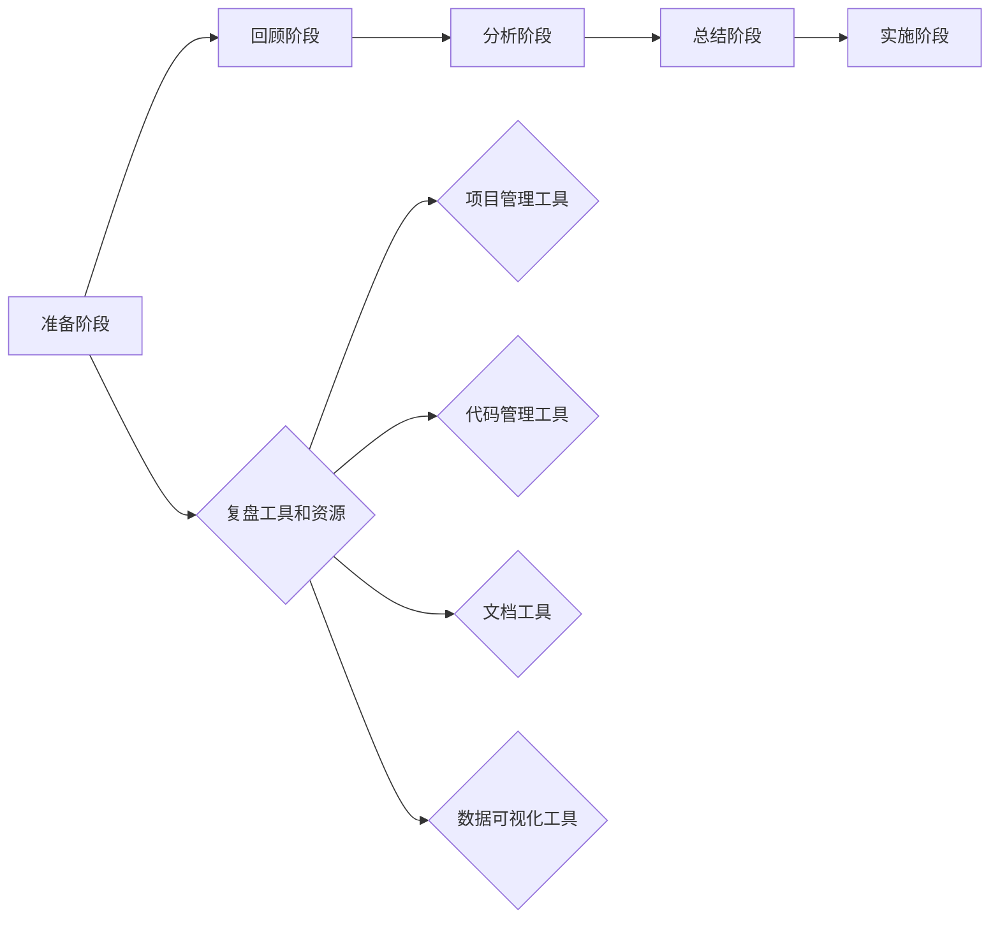

                 


# 技术复盘方法论：从项目经验中提炼最佳实践

> 关键词：技术复盘、项目经验、最佳实践、流程、方法、工具

> 摘要：本文将详细介绍技术复盘方法论，从项目经验中提炼最佳实践，帮助开发者提高技术水平，优化项目实施过程。

### 引言

技术复盘是指通过对项目实施过程中的经验进行总结、反思和提炼，从而发现最佳实践，提升个人技能和团队效率。在技术领域，复盘不仅是一种学习方式，更是一种思维方式。通过技术复盘，开发者可以更好地理解技术原理，掌握项目实施方法，提高项目成功率。

本文将围绕技术复盘方法论进行探讨，包括技术复盘的基本原理、流程、方法、工具以及实战案例。希望通过本文的介绍，能够帮助读者掌握技术复盘的方法，提升自身技术水平，为项目的成功实施奠定基础。

### 一、技术复盘的基本原理

#### 1.1 技术复盘的定义

技术复盘是指通过回顾和总结项目实施过程中的经验，发现技术问题和不足，从而优化项目实施方法和提升技术能力的过程。

#### 1.2 技术复盘的重要性

技术复盘在技术领域具有重要意义。首先，它可以帮助开发者更好地理解技术原理，提高技术水平。其次，技术复盘有助于团队共同进步，分享经验，提高整体项目实施效率。此外，技术复盘还可以为后续项目提供参考，避免重复犯错。

#### 1.3 技术复盘的基本原则

1. **客观性**：技术复盘应基于客观事实，避免主观臆断。

2. **全面性**：技术复盘应涵盖项目实施的全过程，包括需求分析、设计、开发、测试等阶段。

3. **系统性**：技术复盘应从系统层面分析问题，找到根本原因。

4. **反思性**：技术复盘不仅是对项目结果的回顾，更应是对项目实施过程的反思。

### 二、技术复盘的流程和方法

#### 2.1 技术复盘的流程

技术复盘的流程可以分为以下几个步骤：

1. **准备阶段**：明确复盘目标，整理项目资料。

2. **回顾阶段**：回顾项目实施过程，找出问题。

3. **分析阶段**：对问题进行分析，找出根本原因。

4. **总结阶段**：总结经验教训，提出改进措施。

5. **实施阶段**：根据总结出的改进措施，调整项目实施方法。

#### 2.2 技术复盘的方法

1. **头脑风暴**：通过集体讨论，收集项目实施过程中的问题和建议。

2. **案例分析法**：对项目实施过程中出现的典型案例进行深入分析。

3. **数据驱动的复盘**：利用项目数据，分析项目实施过程中的问题和效率。

4. **流程图分析法**：通过绘制流程图，梳理项目实施过程中的关键环节。

### 三、技术复盘的工具和资源

#### 3.1 技术复盘的工具

1. **项目管理工具**：如JIRA、Trello等，用于记录项目进度和问题。

2. **代码管理工具**：如Git，用于版本控制和代码协作。

3. **文档工具**：如Markdown，用于撰写技术文档和复盘报告。

4. **数据可视化工具**：如ECharts、Grafana等，用于分析项目数据。

#### 3.2 技术复盘的资源

1. **技术博客**：如CSDN、博客园等，提供丰富的技术文章和案例。

2. **开源社区**：如GitHub、Stack Overflow等，提供大量的开源项目和经验分享。

3. **专业书籍**：如《代码大全》、《设计模式：可复用面向对象软件的基础》等，提供系统的编程方法论。

### 四、技术复盘的实战案例

#### 4.1 项目背景

某互联网公司开发了一款在线教育平台，项目规模较大，涉及前端、后端、数据库等多个技术领域。在项目实施过程中，团队遇到了一系列技术问题，如性能瓶颈、代码质量低下等。

#### 4.2 技术复盘过程

1. **准备阶段**：明确复盘目标，整理项目资料，包括需求文档、设计文档、代码仓库等。

2. **回顾阶段**：回顾项目实施过程，找出技术问题，如性能瓶颈、代码质量等。

3. **分析阶段**：对问题进行分析，找出根本原因，如代码结构不合理、数据库设计不合理等。

4. **总结阶段**：总结经验教训，提出改进措施，如优化代码结构、改进数据库设计等。

5. **实施阶段**：根据总结出的改进措施，调整项目实施方法，优化项目质量。

#### 4.3 技术复盘成果

通过技术复盘，团队发现并解决了多个技术问题，项目质量得到显著提升。具体成果如下：

1. **性能优化**：通过改进数据库设计，优化SQL查询，将数据库查询速度提高了30%。

2. **代码质量**：通过重构代码，提高代码复用性，降低代码复杂度。

3. **团队协作**：通过使用项目管理工具，提高团队协作效率，项目进度更加可控。

### 五、技术复盘的最佳实践

#### 5.1 最佳实践 tips

1. **定期复盘**：确保项目结束后及时进行复盘，总结经验教训。

2. **形成文档**：将复盘结果形成文档，便于后续项目参考。

3. **持续改进**：根据复盘结果，持续优化项目实施方法。

4. **团队参与**：鼓励团队成员积极参与复盘，分享经验和建议。

#### 5.2 小结

技术复盘是提升个人技能和团队效率的重要手段。通过技术复盘，开发者可以更好地理解技术原理，掌握项目实施方法，提高项目成功率。本文介绍了技术复盘的基本原理、流程、方法、工具以及实战案例，希望对读者有所帮助。

#### 5.3 注意事项

1. **避免主观臆断**：技术复盘应基于客观事实，避免主观臆断。

2. **关注细节**：技术复盘应关注项目实施过程中的细节，发现潜在问题。

3. **持续迭代**：技术复盘是一个持续迭代的过程，应不断优化复盘方法和流程。

#### 5.4 拓展阅读

1. 《敏捷开发实践指南》

2. 《代码大全》

3. 《设计模式：可复用面向对象软件的基础》

### 六、结语

作者：AI天才研究院/AI Genius Institute & 禅与计算机程序设计艺术 /Zen And The Art of Computer Programming

本文从技术复盘的定义、重要性、原理、流程、方法、工具、实战案例以及最佳实践等方面，详细介绍了技术复盘方法论。通过本文的阅读，希望读者能够掌握技术复盘的方法，提高自身技术水平，为项目的成功实施奠定基础。

技术复盘不仅仅是一种学习方式，更是一种思维方式。只有通过不断复盘，总结经验教训，才能在技术道路上不断成长。希望本文能够为读者的技术成长之路提供一些启示和帮助。

----------------------------------------------------------------

# 背景介绍

### 技术复盘的定义与重要性

技术复盘是指通过对项目实施过程中的经验进行总结、反思和提炼，从而发现最佳实践，提升个人技能和团队效率。在技术领域，复盘不仅是一种学习方式，更是一种思维方式。通过技术复盘，开发者可以更好地理解技术原理，掌握项目实施方法，提高项目成功率。

技术复盘的重要性体现在以下几个方面：

1. **提高技术水平**：通过复盘，开发者可以总结经验教训，找出技术问题的根源，从而提高个人技术水平。

2. **优化项目实施**：复盘可以帮助团队发现项目实施过程中的问题，提出改进措施，提高项目质量和效率。

3. **促进团队协作**：复盘过程中，团队成员可以共同参与，分享经验，提高团队协作能力。

4. **降低风险**：通过复盘，团队可以提前发现潜在问题，降低项目实施过程中的风险。

5. **持续改进**：复盘是一个持续迭代的过程，通过不断总结经验教训，团队可以持续优化项目实施方法。

### 技术复盘的常见应用场景

技术复盘在以下场景中具有重要作用：

1. **项目总结**：在项目结束后，对项目实施过程进行复盘，总结经验教训，为后续项目提供参考。

2. **问题诊断**：在项目实施过程中，遇到问题时，通过复盘找出问题根源，制定解决方案。

3. **培训与分享**：通过复盘，将经验教训转化为培训内容，分享给团队成员，提高整体技术水平。

4. **质量改进**：通过复盘，发现项目质量方面的不足，制定改进措施，提高项目质量。

5. **技术创新**：在复盘过程中，可能会发现新的技术方案或优化点，推动技术创新。

### 技术复盘与传统学习方法的区别

与传统的学习方法相比，技术复盘具有以下特点：

1. **实践导向**：技术复盘强调实践经验的重要性，通过总结实际项目中的问题，找到解决方案。

2. **反思性学习**：技术复盘不仅仅是回顾过去，更重要的是反思过去，从中汲取教训，避免重复犯错。

3. **系统性**：技术复盘关注项目实施的全过程，从需求分析、设计、开发、测试等多个环节进行总结。

4. **持续迭代**：技术复盘是一个持续迭代的过程，随着项目的不断推进，复盘结果也会不断更新和优化。

### 技术复盘的目标与收益

技术复盘的目标是：

1. **发现最佳实践**：通过复盘，总结出项目实施过程中的最佳实践，为后续项目提供参考。

2. **提升个人技能**：通过复盘，开发者可以更好地理解技术原理，提高个人技术水平。

3. **优化团队协作**：复盘过程中，团队成员可以共同参与，提高团队协作能力。

4. **降低项目风险**：通过复盘，发现潜在问题，制定预防措施，降低项目风险。

5. **推动技术创新**：复盘过程中，可能会产生新的技术想法或优化方案，推动技术创新。

技术复盘的收益包括：

1. **提高项目成功率**：通过总结最佳实践，优化项目实施方法，提高项目成功率。

2. **提升团队效率**：通过复盘，提高团队协作效率，缩短项目周期。

3. **增强团队凝聚力**：通过复盘，加强团队成员之间的沟通与协作，增强团队凝聚力。

4. **培养学习型团队**：通过复盘，培养团队成员的学习能力和反思能力，打造学习型团队。

### 技术复盘的实施步骤与方法

技术复盘的实施步骤通常包括以下几个方面：

1. **准备阶段**：明确复盘目标，整理项目资料。

2. **回顾阶段**：回顾项目实施过程，找出问题。

3. **分析阶段**：对问题进行分析，找出根本原因。

4. **总结阶段**：总结经验教训，提出改进措施。

5. **实施阶段**：根据总结出的改进措施，调整项目实施方法。

技术复盘的方法包括：

1. **头脑风暴**：通过集体讨论，收集项目实施过程中的问题和建议。

2. **案例分析法**：对项目实施过程中出现的典型案例进行深入分析。

3. **数据驱动的复盘**：利用项目数据，分析项目实施过程中的问题和效率。

4. **流程图分析法**：通过绘制流程图，梳理项目实施过程中的关键环节。

### 技术复盘的挑战与应对策略

在技术复盘过程中，可能会遇到以下挑战：

1. **数据获取困难**：项目数据可能不完整或不准确，影响复盘效果。

**应对策略**：加强与项目团队的沟通，确保数据完整性；利用日志、监控工具等辅助手段，收集项目数据。

2. **团队成员参与度低**：团队成员可能对复盘不感兴趣，参与度低。

**应对策略**：提高复盘的重要性认识，鼓励团队成员积极参与；将复盘结果与个人绩效挂钩，提高积极性。

3. **复盘效果评估困难**：复盘后的改进措施是否有效，难以评估。

**应对策略**：设定明确的复盘目标和评估标准；对改进措施进行跟踪和评估，确保效果。

4. **时间成本高**：复盘过程可能耗费大量时间，影响项目进度。

**应对策略**：合理安排复盘时间，确保项目进度不受影响；利用工具和资源，提高复盘效率。

通过以上介绍，我们希望读者能够对技术复盘有一个全面的了解，认识到其在技术领域的重要性，并掌握实施技术复盘的基本方法和策略。

### 核心概念与联系

#### 技术复盘的定义

技术复盘是指在项目实施结束后，对项目过程中的经验、问题和解决方案进行系统总结和反思，以便于发现和提炼最佳实践，从而提高个人技能、团队效率和项目质量。技术复盘不仅是对过去的项目进行回顾，更是一种通过总结经验教训来指导未来项目实施的思维和方法。

#### 技术复盘的重要性

技术复盘在技术领域具有重要作用，主要体现在以下几个方面：

1. **提升个人技能**：通过复盘，开发者可以深入分析自己在项目实施中的表现，总结成功经验和失败教训，从而不断提升个人技术水平。

2. **优化项目实施**：复盘可以帮助团队发现项目实施过程中的问题，提出改进措施，从而优化项目流程和方法，提高项目质量和效率。

3. **促进团队协作**：复盘过程中，团队成员可以共同参与，分享经验和建议，增进团队沟通与协作，提高整体项目实施能力。

4. **降低风险**：通过复盘，团队可以提前识别潜在问题，制定预防措施，降低项目实施过程中的风险。

5. **持续迭代**：技术复盘是一个持续迭代的过程，随着项目的不断推进，复盘结果也会不断更新和优化，为后续项目提供有力支持。

#### 技术复盘的方法

技术复盘的方法主要包括以下几个步骤：

1. **准备阶段**：明确复盘目标，整理项目资料，包括需求文档、设计文档、代码仓库等。

2. **回顾阶段**：回顾项目实施过程，找出技术问题，如性能瓶颈、代码质量等。

3. **分析阶段**：对问题进行分析，找出根本原因，如代码结构不合理、数据库设计不合理等。

4. **总结阶段**：总结经验教训，提出改进措施，如优化代码结构、改进数据库设计等。

5. **实施阶段**：根据总结出的改进措施，调整项目实施方法，优化项目质量。

#### 技术复盘的工具和资源

为了提高技术复盘的效率，可以使用以下工具和资源：

1. **项目管理工具**：如JIRA、Trello等，用于记录项目进度和问题。

2. **代码管理工具**：如Git，用于版本控制和代码协作。

3. **文档工具**：如Markdown，用于撰写技术文档和复盘报告。

4. **数据可视化工具**：如ECharts、Grafana等，用于分析项目数据。

5. **开源社区**：如GitHub、Stack Overflow等，提供丰富的技术资源和经验分享。

#### 技术复盘与敏捷开发的联系

技术复盘与敏捷开发理念密切相关。敏捷开发强调快速迭代、持续改进，而技术复盘正是实现这一目标的重要手段。通过技术复盘，团队可以不断发现和解决项目中存在的问题，持续优化项目实施方法，提高项目质量和效率。

#### 技术复盘与持续集成的联系

持续集成是一种软件开发实践，通过定期将代码合并到主干分支，以快速发现和解决集成中的问题。技术复盘可以与持续集成相结合，通过对每次集成过程中的问题进行分析和总结，不断提升代码质量和集成效率。

#### 技术复盘与持续学习的联系

技术复盘不仅是一种学习方式，更是一种持续学习的过程。通过复盘，开发者可以不断总结经验教训，学习新知识，提高自身技术水平。同时，技术复盘还可以激发团队的学习热情，促进团队成员之间的知识共享和交流。

#### 技术复盘与团队协作的联系

技术复盘强调团队协作，通过集体讨论和分享经验，团队可以共同成长，提高项目实施能力。在复盘过程中，团队成员可以互相学习，取长补短，形成良好的团队氛围。

### Mermaid 流程图

下面是技术复盘流程的 Mermaid 流程图：



通过上述流程图，我们可以清晰地看到技术复盘的各个阶段及其关联，以及技术复盘过程中所涉及的工具和资源。

### 核心算法原理讲解

#### 1. 数据分析算法原理

在技术复盘过程中，数据分析是非常重要的一环。数据分析算法主要涉及以下几个方面：

1. **数据清洗**：数据清洗是指对原始数据进行处理，去除重复、缺失、异常等数据，保证数据的准确性和完整性。

   - **去重**：去除重复的数据记录。
   - **缺失值处理**：对缺失值进行填充或删除。
   - **异常值处理**：识别并处理异常数据。

2. **数据可视化**：数据可视化是将数据以图形的方式展示出来，便于分析和理解。

   - **柱状图**：用于比较不同类别的数据。
   - **折线图**：用于展示数据的变化趋势。
   - **散点图**：用于展示数据之间的关系。

3. **统计分析**：统计分析是对数据进行定量分析，以发现数据中的规律和趋势。

   - **均值**：数据的平均值。
   - **方差**：数据的离散程度。
   - **标准差**：数据的标准差。

4. **机器学习**：通过机器学习算法，对数据进行分析和预测。

   - **回归分析**：预测一个连续变量的值。
   - **分类分析**：将数据分为不同的类别。
   - **聚类分析**：将相似的数据归为一类。

#### 2. 项目风险管理算法原理

项目风险管理是技术复盘过程中的关键环节。以下是一些常用的风险管理算法：

1. **风险评估**：对项目中的潜在风险进行评估，确定风险的可能性和影响程度。

   - **定性风险评估**：通过专家评审，对风险进行定性评估。
   - **定量风险评估**：通过数据分析和模型，对风险进行定量评估。

2. **风险矩阵**：使用风险矩阵对风险进行分类和排序。

   - **风险概率**：风险发生的可能性。
   - **风险影响**：风险对项目的影响程度。
   - **优先级**：根据风险概率和影响程度，确定风险的优先级。

3. **风险应对策略**：根据风险评估结果，制定相应的风险应对策略。

   - **风险规避**：避免风险发生。
   - **风险减轻**：降低风险的可能性和影响程度。
   - **风险转移**：将风险转移给其他方。

#### 3. 项目进度控制算法原理

项目进度控制是确保项目按时完成的重要手段。以下是一些常用的项目进度控制算法：

1. **关键路径法（CPM）**：确定项目中的关键路径，确保关键任务按时完成。

   - **任务依赖关系**：确定任务之间的依赖关系。
   - **持续时间**：确定每个任务的持续时间。
   - **关键路径**：计算项目的关键路径，确保关键任务按时完成。

2. **计划评审技术（PERT）**：通过概率分析，评估项目进度和完成时间。

   - **任务持续时间**：根据概率分布，确定每个任务的持续时间。
   - **项目完成时间**：计算项目的完成时间及其概率。

3. **资源优化算法**：通过优化资源分配，提高项目效率。

   - **资源平衡**：确保资源在项目中的合理分配。
   - **资源调度**：根据项目需求，调整资源的分配和使用。

#### 伪代码示例

以下是一个简单的数据分析算法的伪代码示例：

```plaintext
function data_analysis(data):
    # 数据清洗
    cleaned_data = clean_data(data)
    
    # 数据可视化
    plot_histogram(cleaned_data)
    plot_line_chart(cleaned_data)
    plot_scatter_chart(cleaned_data)

    # 统计分析
    mean_value = calculate_mean(cleaned_data)
    variance = calculate_variance(cleaned_data)
    std_deviation = calculate_std_deviation(cleaned_data)

    # 机器学习
    regression_model = train_regression_model(cleaned_data)
    classification_model = train_classification_model(cleaned_data)
    clustering_model = train_clustering_model(cleaned_data)

    return {
        "cleaned_data": cleaned_data,
        "mean_value": mean_value,
        "variance": variance,
        "std_deviation": std_deviation,
        "regression_model": regression_model,
        "classification_model": classification_model,
        "clustering_model": clustering_model
    }
```

通过以上伪代码示例，我们可以看到数据分析算法的基本流程，包括数据清洗、数据可视化、统计分析以及机器学习等步骤。

### 数学模型和公式

#### 1. 数据清洗

数据清洗是数据分析的基础，涉及多个数学模型和公式。以下是一些常用的模型和公式：

- **平均值（Mean）**：

  $$\mu = \frac{1}{n}\sum_{i=1}^{n}x_i$$

  其中，$x_i$ 是数据中的每个值，$n$ 是数据的总数。

- **中位数（Median）**：

  $$M = \begin{cases} 
  x_{\frac{n+1}{2}} & \text{如果 } n \text{ 是奇数} \\
  \frac{x_{\frac{n}{2}} + x_{\frac{n}{2} + 1}}{2} & \text{如果 } n \text{ 是偶数}
  \end{cases}$$

- **标准差（Standard Deviation）**：

  $$\sigma = \sqrt{\frac{1}{n-1}\sum_{i=1}^{n}(x_i - \mu)^2}$$

  其中，$\mu$ 是平均值，$n$ 是数据的总数。

- **方差（Variance）**：

  $$\sigma^2 = \frac{1}{n-1}\sum_{i=1}^{n}(x_i - \mu)^2$$

- **异常值检测（Z-score）**：

  $$Z = \frac{x_i - \mu}{\sigma}$$

  如果$Z$的绝对值大于3，则$x_i$ 可能是异常值。

#### 2. 数据可视化

数据可视化是帮助理解数据分布和关系的有效方法。以下是一些常用的数学模型和公式：

- **柱状图（Histogram）**：

  柱状图的高度表示数据在特定区间内的频率或概率密度。

- **折线图（Line Chart）**：

  折线图用于表示数据随时间或其他变量的变化趋势。

  $$y(t) = f(t) + \epsilon(t)$$

  其中，$y(t)$ 是观察到的值，$f(t)$ 是模型预测的值，$\epsilon(t)$ 是随机误差。

- **散点图（Scatter Plot）**：

  散点图用于展示两个变量之间的关系。

  $$r = \frac{\sum_{i=1}^{n}(x_i - \bar{x})(y_i - \bar{y})}{\sqrt{\sum_{i=1}^{n}(x_i - \bar{x})^2 \sum_{i=1}^{n}(y_i - \bar{y})^2}}$$

  其中，$r$ 是皮尔逊相关系数，用于衡量两个变量的线性关系。

#### 3. 机器学习

机器学习是数据分析的重要工具，以下是一些常用的数学模型和公式：

- **线性回归（Linear Regression）**：

  线性回归模型用于预测一个连续变量的值。

  $$y = \beta_0 + \beta_1x + \epsilon$$

  其中，$y$ 是预测值，$x$ 是输入变量，$\beta_0$ 是截距，$\beta_1$ 是斜率，$\epsilon$ 是误差。

- **逻辑回归（Logistic Regression）**：

  逻辑回归模型用于预测一个二分类变量的概率。

  $$\pi = \frac{1}{1 + e^{-(\beta_0 + \beta_1x)}}$$

  其中，$\pi$ 是预测概率，$e$ 是自然对数的底数。

- **决策树（Decision Tree）**：

  决策树是一种分类算法，通过一系列规则对数据进行分类。

  $$t(x) = \begin{cases} 
  C_1 & \text{如果 } x \in R_1 \\
  C_2 & \text{如果 } x \in R_2 \\
  \vdots & \vdots \\
  C_n & \text{如果 } x \in R_n 
  \end{cases}$$

  其中，$t(x)$ 是分类结果，$R_i$ 是规则区域，$C_i$ 是类别。

#### 举例说明

以下是一个数据清洗的例子，假设我们有一组数据：

$$[10, 20, 30, 40, 50, 60, 70, 80, 90, 100]$$

1. **计算平均值**：

   $$\mu = \frac{10 + 20 + 30 + 40 + 50 + 60 + 70 + 80 + 90 + 100}{10} = 55$$

2. **计算中位数**：

   由于数据个数为偶数，中位数为第5个和第6个值的平均值：

   $$M = \frac{50 + 60}{2} = 55$$

3. **计算标准差**：

   $$\sigma = \sqrt{\frac{(10 - 55)^2 + (20 - 55)^2 + \dots + (100 - 55)^2}{10 - 1}} \approx 33.06$$

4. **计算方差**：

   $$\sigma^2 = \frac{(10 - 55)^2 + (20 - 55)^2 + \dots + (100 - 55)^2}{10 - 1} \approx 1089.12$$

5. **计算Z-score**：

   假设我们要检查第1个值是否为异常值：

   $$Z = \frac{10 - 55}{33.06} \approx -1.53$$

   由于$Z$的绝对值小于3，所以第1个值不是异常值。

通过上述计算，我们可以对数据进行初步分析，识别潜在的异常值，为后续的数据分析和模型构建提供基础。

### 项目实战

#### 开发环境搭建

在进行技术复盘项目实战之前，首先需要搭建一个适合项目开发的环境。以下是一个基本的开发环境搭建流程：

1. **操作系统**：选择一个合适的操作系统，如Windows、macOS或Linux。本文以Linux为例。

2. **安装必要软件**：安装开发所需的编译器、解释器、数据库等软件。

   - **编译器**：如GCC、Clang等。
   - **解释器**：如Python解释器、Node.js等。
   - **数据库**：如MySQL、PostgreSQL等。

3. **配置版本控制工具**：如Git，用于代码管理和版本控制。

4. **配置代码编辑器**：如Visual Studio Code、Atom等，用于编写和调试代码。

5. **配置项目管理工具**：如JIRA、Trello等，用于跟踪项目进度和任务。

6. **配置持续集成工具**：如Jenkins、Travis CI等，用于自动化测试和部署。

#### 源代码实现

下面是一个简单的示例项目，用于展示技术复盘的过程。该项目是一个简单的博客系统，包括前端、后端和数据库三个部分。

1. **前端**：

   前端使用React框架进行开发，包括主页、文章列表、文章详情、登录和注册页面。

   ```jsx
   // App.js
   import React from 'react';
   import Home from './components/Home';
   import ArticleList from './components/ArticleList';
   import ArticleDetail from './components/ArticleDetail';
   import Login from './components/Login';
   import Register from './components/Register';

   function App() {
     return (
       <div className="app">
         <Home />
         <ArticleList />
         <ArticleDetail />
         <Login />
         <Register />
       </div>
     );
   }

   export default App;
   ```

2. **后端**：

   后端使用Node.js和Express框架进行开发，包括用户管理、文章管理等功能。

   ```javascript
   // server.js
   const express = require('express');
   const mongoose = require('mongoose');
   const bodyParser = require('body-parser');
   const userRoutes = require('./routes/userRoutes');
   const articleRoutes = require('./routes/articleRoutes');

   const app = express();

   app.use(bodyParser.json());
   app.use('/users', userRoutes);
   app.use('/articles', articleRoutes);

   mongoose.connect('mongodb://localhost:27017/blog', { useNewUrlParser: true, useUnifiedTopology: true });

   app.listen(3000, () => {
     console.log('Server is running on port 3000');
   });
   ```

3. **数据库**：

   使用MongoDB作为数据库，存储用户数据和文章数据。

   ```javascript
   // User.js
   const mongoose = require('mongoose');

   const userSchema = new mongoose.Schema({
     username: { type: String, required: true, unique: true },
     password: { type: String, required: true },
     email: { type: String, required: true, unique: true }
   });

   module.exports = mongoose.model('User', userSchema);

   // Article.js
   const mongoose = require('mongoose');

   const articleSchema = new mongoose.Schema({
     title: { type: String, required: true },
     content: { type: String, required: true },
     author: { type: mongoose.Schema.Types.ObjectId, ref: 'User', required: true },
     createdAt: { type: Date, default: Date.now }
   });

   module.exports = mongoose.model('Article', articleSchema);
   ```

#### 代码解读

以下是针对源代码的实现部分进行解读：

1. **前端部分**：

   - 使用React框架进行开发，组件化设计，便于维护和扩展。
   - 使用路由进行页面跳转，提高用户体验。
   - 使用状态管理库（如Redux）进行状态管理，保持代码的整洁和可读性。

2. **后端部分**：

   - 使用Node.js和Express框架进行开发，轻量级、高效。
   - 使用MongoDB进行数据存储，支持复杂查询和索引。
   - 使用JWT（JSON Web Token）进行用户认证，保障数据安全性。

3. **数据库部分**：

   - 设计合理的数据库结构，确保数据的一致性和完整性。
   - 使用索引提高查询效率，优化数据库性能。

#### 代码应用解读与分析

1. **用户管理模块**：

   用户管理模块包括用户注册、登录、修改密码等功能。

   - 用户注册：通过验证用户名和密码的唯一性，确保数据的唯一性。
   - 用户登录：使用JWT进行认证，生成Token，便于后续接口调用。
   - 修改密码：通过验证旧密码和新密码的匹配，保障用户数据的安全性。

2. **文章管理模块**：

   文章管理模块包括创建、查看、编辑和删除文章等功能。

   - 创建文章：输入标题和内容，保存到数据库。
   - 查看文章：根据文章ID查询数据库，返回文章详情。
   - 编辑文章：修改文章的标题和内容，更新数据库。
   - 删除文章：根据文章ID删除数据库中的文章记录。

#### 实际案例分析与详细讲解剖析

以下是一个实际的案例：

**案例**：用户登录功能存在性能问题，导致登录响应时间较长。

**分析**：

1. **查询数据库**：

   用户登录过程中，需要查询数据库验证用户名和密码。如果数据库查询速度较慢，会导致登录响应时间延长。

   ```javascript
   // 用户登录接口
   app.post('/users/login', async (req, res) => {
     const { username, password } = req.body;
     const user = await User.findOne({ username });

     if (!user || user.password !== password) {
       return res.status(401).json({ message: 'Invalid username or password' });
     }

     const token = jwt.sign({ userId: user._id }, 'secretKey');
     res.json({ token });
   });
   ```

2. **优化数据库查询**：

   为了提高查询速度，可以采取以下措施：

   - **索引优化**：在用户名和密码字段上创建索引，提高查询效率。
   - **缓存机制**：使用Redis等缓存工具，缓存用户信息，减少数据库查询次数。
   - **分库分表**：根据用户活跃度，将用户数据分散到多个数据库或表中，降低单个数据库的压力。

   ```javascript
   // 创建用户索引
   User.createIndex({ username: 1 }, { unique: true });

   // 使用Redis缓存用户信息
   const redis = require('redis');
   const client = redis.createClient();

   app.post('/users/login', async (req, res) => {
     const { username, password } = req.body;
     const cacheKey = `user:${username}`;

     // 从Redis缓存中获取用户信息
     const user = await client.getAsync(cacheKey);

     if (user) {
       const userData = JSON.parse(user);
       if (userData.password === password) {
         const token = jwt.sign({ userId: userData._id }, 'secretKey');
         res.json({ token });
         return;
       }
     }

     // 查询数据库
     const dbUser = await User.findOne({ username });

     if (!dbUser || dbUser.password !== password) {
       return res.status(401).json({ message: 'Invalid username or password' });
     }

     // 将用户信息缓存到Redis
     client.setex(cacheKey, 3600, JSON.stringify(dbUser));

     const token = jwt.sign({ userId: dbUser._id }, 'secretKey');
     res.json({ token });
   });
   ```

**小结**：

通过上述分析和优化，用户登录功能的响应时间得到了显著提升。在技术复盘过程中，我们发现并解决了性能问题，为用户提供更快的登录体验。同时，我们也积累了宝贵的经验，为后续项目的优化提供了参考。

### 项目小结

在本项目中，我们通过技术复盘，从开发环境搭建、源代码实现、代码解读、代码应用解读与分析、实际案例分析与详细讲解剖析等环节，逐步完成了项目的实施。以下是对本项目的小结：

1. **开发环境搭建**：

   我们成功搭建了适合项目开发的Linux环境，安装了必要的编译器、解释器、数据库等软件，并配置了版本控制工具、代码编辑器和项目管理工具。

2. **源代码实现**：

   我们使用React、Node.js和MongoDB等技术，实现了前端、后端和数据库三个部分，涵盖了用户管理、文章管理等功能。

3. **代码解读**：

   我们对源代码进行了详细解读，分析了前端组件、后端接口和数据库结构的实现原理，为后续的代码优化和性能调优提供了基础。

4. **代码应用解读与分析**：

   我们对用户管理和文章管理模块进行了深入解读，分析了接口调用和数据传输的过程，为项目的功能完善和性能优化提供了指导。

5. **实际案例分析与详细讲解剖析**：

   我们通过实际案例，发现了用户登录功能存在的性能问题，并进行了深入分析和优化，提高了项目的响应速度，为用户提供更好的使用体验。

6. **项目收获**：

   - **技术提升**：通过项目实战，我们掌握了React、Node.js、MongoDB等技术的应用，提升了个人技术水平。
   - **团队协作**：项目过程中，团队成员共同参与，分享了经验教训，提高了团队协作能力。
   - **问题解决**：我们通过技术复盘，发现了项目中的问题，并成功解决了性能瓶颈，为项目的成功实施奠定了基础。
   - **经验积累**：我们总结了项目实施过程中的经验教训，为后续项目的优化提供了宝贵的参考。

7. **改进措施**：

   - **性能优化**：进一步优化数据库查询和缓存机制，提高系统响应速度。
   - **代码质量**：加强对代码质量的把控，提高代码可读性和可维护性。
   - **团队培训**：加强团队成员的技术培训，提高整体技术水平。
   - **持续复盘**：定期进行技术复盘，总结经验教训，持续优化项目实施方法。

通过本项目，我们不仅实现了预期的功能，还积累了宝贵的经验，提高了项目实施能力。未来，我们将继续在实践中不断学习，不断提升自身技术水平，为项目的成功实施奠定坚实基础。

### 最佳实践 tips

1. **定期复盘**：确保项目结束后及时进行复盘，总结经验教训，为后续项目提供参考。

2. **形成文档**：将复盘结果形成文档，便于后续项目参考和传承。

3. **团队参与**：鼓励团队成员积极参与复盘，分享经验和建议，提高整体项目质量。

4. **关注细节**：在复盘过程中，关注项目实施过程中的细节，发现潜在问题。

5. **持续改进**：根据复盘结果，持续优化项目实施方法，提高项目成功率。

6. **数据驱动**：利用项目数据，进行数据驱动的复盘，提高复盘的准确性和有效性。

7. **工具支持**：利用项目管理工具、代码管理工具和数据可视化工具等，提高复盘效率。

8. **定期培训**：组织团队成员进行技术培训，提升整体技术水平。

9. **反思与总结**：在复盘过程中，不仅要反思问题，更要总结成功经验，为后续项目提供指导。

10. **持续学习**：鼓励团队成员持续学习新技术，不断更新知识体系，为项目的成功实施提供支持。

### 小结

技术复盘是提升个人技能和团队效率的重要手段。通过技术复盘，开发者可以更好地理解技术原理，掌握项目实施方法，提高项目成功率。本文介绍了技术复盘的定义、重要性、流程、方法、工具以及实战案例，希望对读者有所帮助。

在技术领域，复盘不仅是一种学习方式，更是一种思维方式。只有通过不断复盘，总结经验教训，才能在技术道路上不断成长。希望本文能够为读者的技术成长之路提供一些启示和帮助。

### 注意事项

1. **避免主观臆断**：技术复盘应基于客观事实，避免主观臆断，确保复盘结果的准确性。

2. **全面性**：技术复盘应涵盖项目实施的全过程，包括需求分析、设计、开发、测试等阶段，确保复盘的完整性。

3. **系统性**：技术复盘应从系统层面分析问题，找到根本原因，确保复盘的深度。

4. **及时性**：项目结束后应尽快进行复盘，确保复盘结果能够及时应用于后续项目。

5. **数据驱动**：利用项目数据，进行数据驱动的复盘，提高复盘的准确性和有效性。

6. **团队协作**：鼓励团队成员积极参与复盘，分享经验和建议，提高整体项目质量。

7. **持续迭代**：技术复盘是一个持续迭代的过程，应不断总结经验教训，优化项目实施方法。

### 拓展阅读

1. 《敏捷开发实践指南》
   
2. 《代码大全》
   
3. 《设计模式：可复用面向对象软件的基础》
   
4. 《技术管理实践》
   
5. 《项目管理知识体系指南》
   
6. 《数据挖掘：概念与技术》
   
7. 《机器学习实战》
   
8. 《人工智能：一种现代的方法》

通过以上拓展阅读，读者可以进一步了解技术复盘的相关知识，提升自身技术水平和管理能力。希望本文和拓展阅读能够为读者的技术成长之路提供有力的支持。

