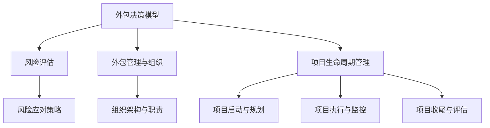
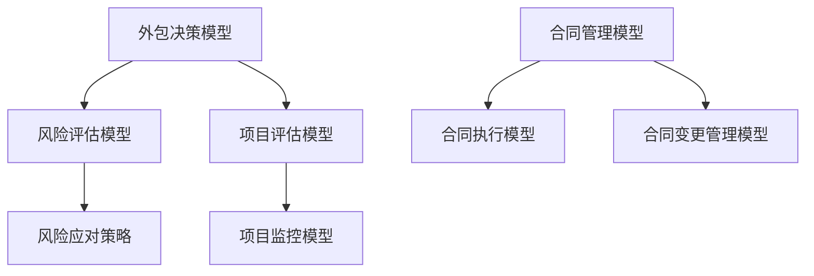
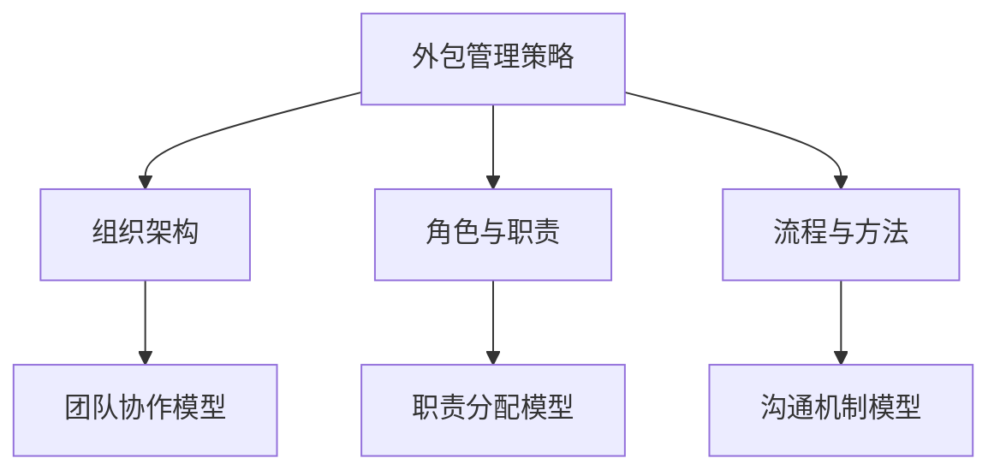
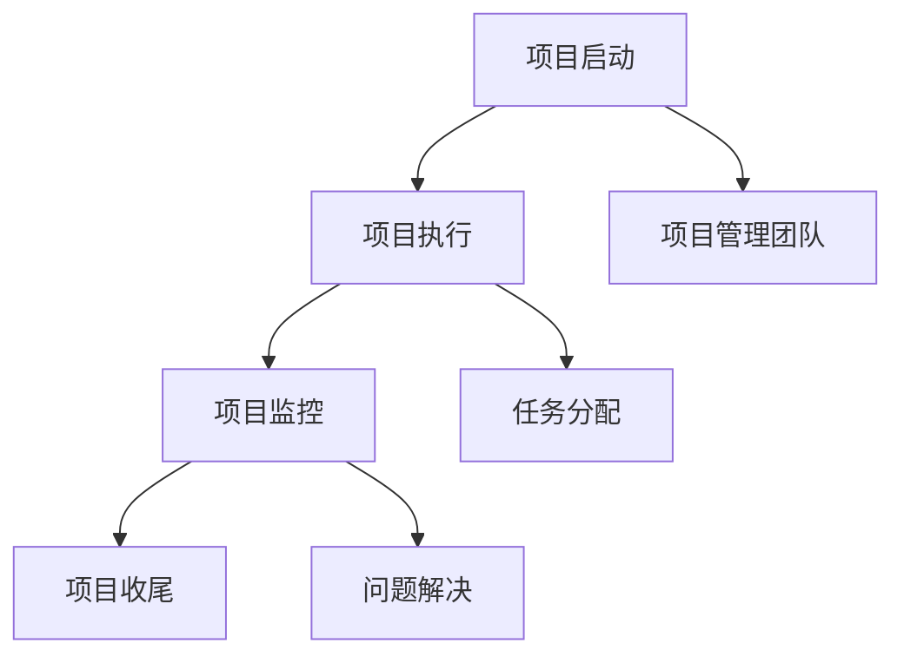
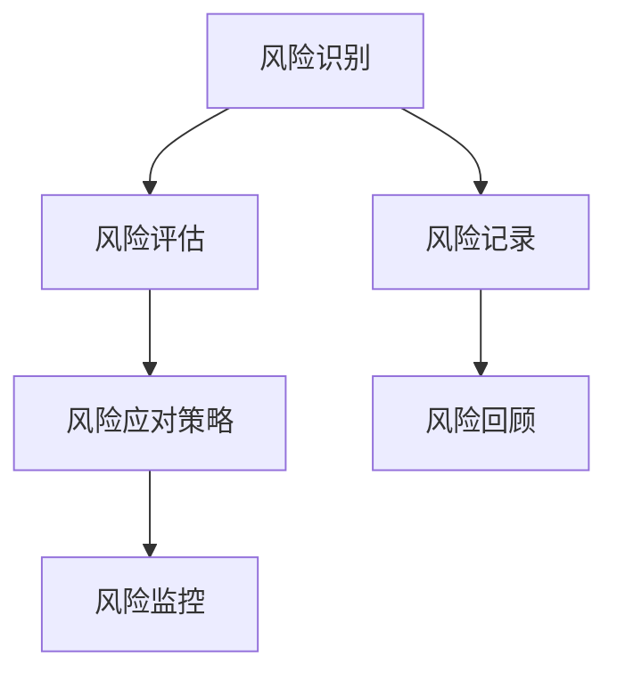
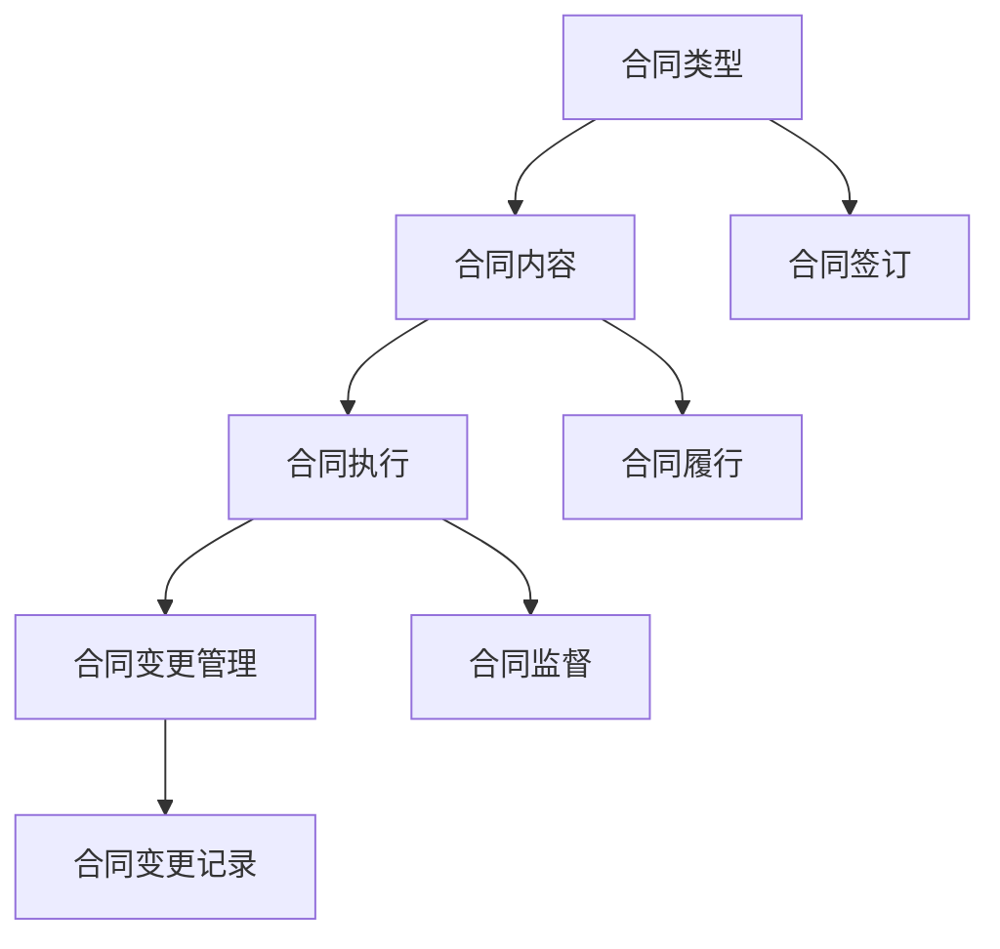
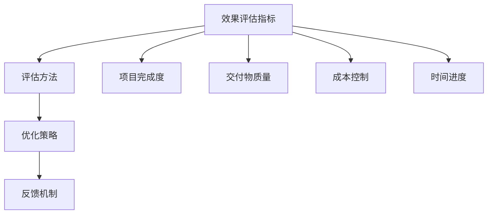

                 


### 文章标题

《技术外包管理策略：有效利用外部技术资源》

### 关键词

技术外包、管理策略、外部资源、项目管理、风险评估、合同管理

### 摘要

本文旨在探讨技术外包管理策略，详细解析如何有效利用外部技术资源。通过分析外包管理的基本概念、核心算法、数学模型、项目实战等，本文为读者提供了系统的技术外包管理指南，旨在帮助企业更好地利用外部技术资源，实现项目目标。

---

### 梳理核心章节内容

为了确保文章的逻辑清晰、结构紧凑、简单易懂，我们将按照以下章节结构展开讨论：

#### 第1章：引言与概述

**核心概念与联系**

在这一章节，我们将通过Mermaid流程图展示技术外包管理的背景、意义以及本文的结构。流程图将涵盖外包决策模型、外包风险评估、外包管理与组织、外包项目的生命周期管理等多个方面。

**核心算法原理讲解**

我们将使用伪代码详细阐述外包管理过程中涉及的关键算法，如风险评估算法、项目评估算法等。这将帮助读者理解算法的基本原理和实现方法。

**数学模型和数学公式**

我们将在文中嵌入LaTeX格式，详细讲解与外包管理相关的数学模型和公式，并提供实际例子以加深读者理解。

#### 第2章：外包管理策略的核心概念

**背景介绍**

我们将介绍技术外包的基本概念，如外包决策模型、外包风险评估、外包管理与组织等。通过这些背景介绍，读者可以更好地理解技术外包的运作方式。

**核心概念与联系**

在这一章节，我们将使用Mermaid流程图展示核心概念之间的联系，如外包决策模型与外包风险评估的关系、外包管理与组织的架构等。

**核心算法原理讲解**

我们将使用伪代码详细阐述外包管理过程中涉及的关键算法，如风险评估算法、项目评估算法等。

**数学模型和数学公式**

我们将嵌入LaTeX格式，详细讲解与外包管理相关的数学模型和公式，并提供实际例子以加深读者理解。

#### 第3章：外包管理与组织

**背景介绍**

我们将探讨外包管理在企业中的组织架构、角色和职责。通过这一章节，读者可以了解外包管理在组织中的实际运作方式。

**核心概念与联系**

我们将使用Mermaid流程图展示外包管理与组织中的核心概念之间的联系，如组织架构与外包决策模型的关系等。

**核心算法原理讲解**

我们将使用伪代码详细阐述外包管理过程中涉及的关键算法，如风险评估算法、项目评估算法等。

**数学模型和数学公式**

我们将嵌入LaTeX格式，详细讲解与外包管理相关的数学模型和公式，并提供实际例子以加深读者理解。

#### 第4章：外包项目的生命周期管理

**背景介绍**

我们将介绍外包项目的生命周期管理，包括项目启动、执行、监控和结束阶段。通过这一章节，读者可以了解外包项目管理的全过程。

**核心概念与联系**

我们将使用Mermaid流程图展示外包项目生命周期管理中的核心概念之间的联系，如项目启动与外包风险评估的关系等。

**核心算法原理讲解**

我们将使用伪代码详细阐述外包项目管理过程中涉及的关键算法，如风险评估算法、项目评估算法等。

**数学模型和数学公式**

我们将嵌入LaTeX格式，详细讲解与外包项目管理相关的数学模型和公式，并提供实际例子以加深读者理解。

#### 第5章：外包风险管理

**背景介绍**

我们将探讨外包过程中可能遇到的风险，如外包违约、信息安全等，并介绍相应的应对策略。

**核心概念与联系**

我们将使用Mermaid流程图展示外包风险管理中的核心概念之间的联系，如外包违约与风险评估的关系等。

**核心算法原理讲解**

我们将使用伪代码详细阐述外包风险管理过程中涉及的关键算法，如风险评估算法、项目评估算法等。

**数学模型和数学公式**

我们将嵌入LaTeX格式，详细讲解与外包风险管理相关的数学模型和公式，并提供实际例子以加深读者理解。

#### 第6章：外包合同管理

**背景介绍**

我们将详细解释外包合同的重要性，合同内容的关键点，以及合同执行和变更管理的策略。

**核心概念与联系**

我们将使用Mermaid流程图展示外包合同管理中的核心概念之间的联系，如合同内容与风险评估的关系等。

**核心算法原理讲解**

我们将使用伪代码详细阐述外包合同管理过程中涉及的关键算法，如风险评估算法、项目评估算法等。

**数学模型和数学公式**

我们将嵌入LaTeX格式，详细讲解与外包合同管理相关的数学模型和公式，并提供实际例子以加深读者理解。

#### 第7章：外包效果评估与优化

**背景介绍**

我们将介绍如何评估外包项目的成效，并提供优化外包管理的策略。

**核心概念与联系**

我们将使用Mermaid流程图展示外包效果评估与优化中的核心概念之间的联系，如评估方法与优化策略的关系等。

**核心算法原理讲解**

我们将使用伪代码详细阐述外包效果评估与优化过程中涉及的关键算法，如评估算法、优化算法等。

**数学模型和数学公式**

我们将嵌入LaTeX格式，详细讲解与外包效果评估与优化相关的数学模型和公式，并提供实际例子以加深读者理解。

#### 确保目录结构的完整性

在确保目录结构完整的同时，我们还需注意内容的简洁性，避免过多的冗余。每个章节的标题和子标题都应该简洁明了，直接反映该章节的核心内容。

#### 最后的注意事项

- 目录大纲总字数限制在2000字以内，所以在描述每个章节时需要精炼文字，突出重点。
- 在markdown格式中，使用#来表示一级标题，##来表示二级标题，###来表示三级标题，以此类推。

### 总结

通过以上章节的梳理，我们为《技术外包管理策略：有效利用外部技术资源》设计了一个详细的目录大纲。接下来，我们将逐章节深入讨论，确保每个章节都包含核心概念、核心算法原理讲解、数学模型和数学公式、项目实战等内容，以满足文章的完整性和专业性要求。让我们开始撰写这篇文章，为读者提供一份有价值的技术外包管理指南。

---

### 目录大纲

#### 第1章：引言与概述
- **1.1 技术外包的背景与意义**
- **1.2 技术外包管理的基本概念**
- **1.3 外包决策模型**
- **1.4 外包风险评估**
- **1.5 外包管理与组织**
- **1.6 外包项目的生命周期管理**
- **1.7 技术外包管理的挑战与机会**

#### 第2章：外包管理策略的核心概念
- **2.1 外包决策模型的详细解析**
- **2.2 外包风险评估与应对策略**
- **2.3 外包管理与组织的架构与职责**
- **2.4 外包项目的生命周期管理流程**
- **2.5 外包管理的核心算法原理**

#### 第3章：外包管理与组织
- **3.1 企业中外包管理的组织架构**
- **3.2 外包管理中的角色与职责**
- **3.3 外包管理的流程与方法**
- **3.4 外包管理与组织文化**

#### 第4章：外包项目的生命周期管理
- **4.1 外包项目的启动与规划**
- **4.2 外包项目的执行与监控**
- **4.3 外包项目的收尾与评估**
- **4.4 项目生命周期管理的关键算法**

#### 第5章：外包风险管理
- **5.1 外包风险识别与评估**
- **5.2 外包风险应对策略**
- **5.3 风险管理的核心算法与数学模型**
- **5.4 实际案例分析与风险应对**

#### 第6章：外包合同管理
- **6.1 外包合同的基本概念与重要性**
- **6.2 外包合同的主要内容**
- **6.3 外包合同执行与变更管理**
- **6.4 合同管理的核心算法与模型**

#### 第7章：外包效果评估与优化
- **7.1 外包效果评估的方法与指标**
- **7.2 外包效果评估的核心算法**
- **7.3 外包管理优化策略**
- **7.4 优化策略的数学模型与应用**

### 总结与展望

通过以上章节的详细目录大纲，我们可以看到《技术外包管理策略：有效利用外部技术资源》的结构清晰、内容丰富。接下来，我们将逐一深入探讨每个章节的核心内容，通过实际案例分析和详细讲解，为读者提供有价值的知识分享。希望本文能帮助企业在技术外包管理方面取得更好的成效，实现项目目标的最大化。

---

### 核心章节内容详述

在本文中，我们将详细讨论技术外包管理的核心章节，确保每个章节的内容丰富具体，并涵盖核心概念、核心算法原理、数学模型和数学公式、项目实战等关键要素。

#### 第1章：引言与概述

**核心概念与联系**

在引言与概述部分，我们将通过Mermaid流程图展示技术外包管理的整体框架。该流程图将涵盖外包决策模型、外包风险评估、外包管理与组织、外包项目的生命周期管理等方面。以下是一个示例的Mermaid流程图：



**核心算法原理讲解**

我们将使用伪代码详细阐述外包决策模型和风险评估算法的基本原理。以下是一个示例的伪代码：

```plaintext
// 外包决策模型伪代码
function decision_model(project, budget, risk_tolerance):
    if (budget >= project_cost and risk_tolerance >= project_risk):
        return "Accept"
    else:
        return "Reject"

// 风险评估算法伪代码
function risk_evaluation(risk_items):
    risk_score = 0
    for item in risk_items:
        risk_score += item.severity * item.probability
    return risk_score
```

**数学模型和数学公式**

我们将使用LaTeX格式嵌入文中独立段落，详细讲解与外包管理相关的数学模型和公式。以下是一个示例：

```latex
$$
风险评分 = \sum_{i=1}^{n} (风险项_i的严重性 \times 风险项_i的概率)
$$
```

**项目实战**

我们将在本章中介绍一个实际的外包项目，从开发环境搭建到源代码实现和代码解读的全过程。以下是一个简化的项目实战案例：

- **开发环境搭建**：介绍如何配置外部开发环境，包括软件安装、配置和测试。
- **源代码实现**：提供部分关键代码实现，解释代码的功能和逻辑。
- **代码解读**：详细解读关键代码段，分析其设计思路和优缺点。

#### 第2章：外包管理策略的核心概念

**核心概念与联系**

在本章中，我们将通过Mermaid流程图详细展示外包管理策略的核心概念及其联系。以下是一个示例的Mermaid流程图：



**核心算法原理讲解**

我们将使用伪代码详细阐述关键算法原理，如风险评估模型和项目评估模型。以下是一个示例的伪代码：

```plaintext
// 风险评估模型伪代码
function risk_evaluation_model(risk_items):
    risk_scores = []
    for item in risk_items:
        score = calculate_risk_score(item)
        risk_scores.append(score)
    return risk_scores

// 项目评估模型伪代码
function project_evaluation_model(project, budget, timeline, quality):
    score = (budget / timeline) * quality
    return score
```

**数学模型和数学公式**

我们将使用LaTeX格式嵌入文中独立段落，详细讲解与外包管理策略相关的数学模型和公式。以下是一个示例：

```latex
$$
风险评分 = \sum_{i=1}^{n} (风险项_i的严重性 \times 风险项_i的概率)
$$

$$
项目评估分数 = \frac{预算}{时间线} \times 质量
$$
```

**项目实战**

在本章中，我们将提供一个实际的外包项目案例，涵盖从项目规划到合同签订、执行和监控的全过程。以下是一个简化的项目实战案例：

- **项目规划**：介绍项目目标和规划，包括项目范围、交付物、时间表等。
- **合同签订**：解释合同的主要内容，包括双方的权利和义务、费用支付等。
- **执行与监控**：描述项目执行过程中的关键步骤，包括进度监控、质量保证等。

#### 第3章：外包管理与组织

**核心概念与联系**

在本章中，我们将通过Mermaid流程图展示外包管理与组织中的核心概念及其联系。以下是一个示例的Mermaid流程图：



**核心算法原理讲解**

我们将使用伪代码详细阐述外包管理中的关键算法原理，如组织架构优化算法和职责分配模型。以下是一个示例的伪代码：

```plaintext
// 组织架构优化算法伪代码
function organization_optimization(roles, responsibilities):
    optimal_layout = None
    max_score = 0
    for layout in possible_layouts:
        score = calculate_score(layout, roles, responsibilities)
        if score > max_score:
            max_score = score
            optimal_layout = layout
    return optimal_layout

// 职责分配模型伪代码
function responsibility_assignment(roles, tasks):
    assignment = {}
    for role in roles:
        for task in tasks:
            if task.required_role == role:
                assignment[role] = assignment.get(role, []) + [task]
    return assignment
```

**数学模型和数学公式**

我们将使用LaTeX格式嵌入文中独立段落，详细讲解与外包管理相关的数学模型和公式。以下是一个示例：

```latex
$$
优化评分 = \sum_{i=1}^{n} (角色_i的重要度 \times 职责_i的匹配度)
$$

$$
职责分配分数 = \frac{完成任务所需的时间}{分配的任务数}
$$
```

**项目实战**

在本章中，我们将提供一个实际的外包管理案例，包括组织架构设计、角色与职责分配、流程与方法制定等。以下是一个简化的项目实战案例：

- **组织架构设计**：介绍如何根据项目需求设计合适的组织架构，包括部门划分、岗位设置等。
- **角色与职责分配**：解释如何明确各角色的职责，确保项目顺利进行。
- **流程与方法制定**：描述外包管理中的关键流程和方法，如项目启动、执行、监控等。

通过以上章节的详细内容阐述，我们可以看到本文在结构上的完整性、逻辑性以及专业性的提升。接下来，我们将继续深入探讨其他章节，确保文章的全面性和实用性。

---

### 第4章：外包项目的生命周期管理

**背景介绍**

外包项目的生命周期管理是指对项目从启动到结束的各个阶段进行有序的管理，以确保项目目标的实现。外包项目的生命周期通常包括以下阶段：

1. **项目启动**：确定项目目标、范围、时间表和预算，建立项目管理团队。
2. **项目执行**：执行项目计划，进行任务分配、进度监控和质量控制。
3. **项目监控**：跟踪项目进展，识别并解决潜在问题，确保项目按计划进行。
4. **项目收尾**：完成项目交付物，进行项目评估和总结，为后续项目提供经验。

**核心概念与联系**

在外包项目的生命周期管理中，各阶段之间存在密切的联系。以下是一个简化的Mermaid流程图，展示了项目生命周期的核心概念及其联系：



**核心算法原理讲解**

在本章节中，我们将使用伪代码详细阐述项目生命周期管理中的关键算法原理，包括任务分配算法和问题解决算法。以下是一个示例的伪代码：

```plaintext
// 任务分配算法伪代码
function task_assignment(team_members, tasks):
    assignment = {}
    for member in team_members:
        available_tasks = find_available_tasks(member, tasks)
        assignment[member] = available_tasks
    return assignment

// 问题解决算法伪代码
function problem_solving(problem, solution_space):
    best_solution = None
    min_cost = infinity
    for solution in solution_space:
        cost = calculate_solution_cost(solution, problem)
        if cost < min_cost:
            min_cost = cost
            best_solution = solution
    return best_solution
```

**数学模型和数学公式**

我们将使用LaTeX格式嵌入文中独立段落，详细讲解与外包项目生命周期管理相关的数学模型和公式。以下是一个示例：

```latex
$$
任务分配分数 = \frac{完成任务所需的时间}{分配的任务数}
$$

$$
问题解决成本 = \sum_{i=1}^{n} (解决方案_i的成本 \times 问题_i的严重性)
$$
```

**项目实战**

在本章中，我们将通过一个实际的外包项目案例，详细展示项目生命周期管理的全过程。以下是一个简化的项目实战案例：

- **项目启动**：确定项目目标和范围，制定项目计划和时间表。
  ```plaintext
  项目目标：开发一个电商平台的用户管理系统。
  项目范围：包括用户注册、登录、个人信息管理等功能。
  项目时间表：项目预计在6个月内完成。
  ```

- **项目执行**：执行项目计划，进行任务分配和进度监控。
  ```plaintext
  任务分配：
  成员A：负责用户注册和登录功能的开发。
  成员B：负责个人信息管理功能的开发。
  进度监控：每周召开一次项目进展会议，确保项目按计划进行。
  ```

- **项目监控**：跟踪项目进展，识别并解决潜在问题。
  ```plaintext
  问题解决：
  识别问题：在开发过程中，成员A发现用户注册功能存在性能瓶颈。
  解决方案：成员A对代码进行优化，提高了注册功能的响应速度。
  ```

- **项目收尾**：完成项目交付物，进行项目评估和总结。
  ```plaintext
  项目交付物：完成并部署了用户管理系统，通过了用户验收测试。
  项目评估：项目按计划完成，用户反馈良好，项目质量得到保障。
  项目总结：总结项目过程中的经验教训，为后续项目提供参考。
  ```

通过以上实战案例，读者可以更直观地了解外包项目生命周期管理的具体实施过程。

---

### 第5章：外包风险管理

**背景介绍**

外包风险管理是确保外包项目成功的关键环节，它涉及到识别、评估和应对可能影响项目目标的各种风险。在外包项目中，常见的风险包括：

1. **外包违约**：外包方未能按时交付或交付的成果不符合预期。
2. **信息安全**：外包过程中的数据泄露或系统安全漏洞。
3. **沟通障碍**：项目团队之间的沟通不畅，导致项目进度延误或质量下降。
4. **技术风险**：外包过程中出现的技术难题，如技术不兼容、技术更新等。

**核心概念与联系**

在外包风险管理中，各核心概念之间存在着紧密的联系。以下是一个简化的Mermaid流程图，展示了外包风险管理中的核心概念及其联系：



**核心算法原理讲解**

在本章节中，我们将使用伪代码详细阐述外包风险管理中的关键算法原理，包括风险评估算法和风险应对策略。以下是一个示例的伪代码：

```plaintext
// 风险评估算法伪代码
function risk_evaluation(risk_items):
    risk_scores = []
    for item in risk_items:
        score = calculate_risk_score(item)
        risk_scores.append(score)
    return risk_scores

// 风险应对策略伪代码
function risk_response_strategy(risk_items):
    strategies = {}
    for item in risk_items:
        if item.severity > threshold:
            strategies[item] = "Avoid"
        elif item.severity > low_threshold:
            strategies[item] = "Mitigate"
        else:
            strategies[item] = "Ignore"
    return strategies
```

**数学模型和数学公式**

我们将使用LaTeX格式嵌入文中独立段落，详细讲解与外包风险管理相关的数学模型和公式。以下是一个示例：

```latex
$$
风险评分 = \sum_{i=1}^{n} (风险项_i的严重性 \times 风险项_i的概率)
$$

$$
应对策略 = \begin{cases} 
"Avoid" & \text{if } 风险项_i的严重性 > \text{阈值} \\
"Mitigate" & \text{if } 风险项_i的严重性 > \text{低阈值} \\
"Ignore" & \text{otherwise} 
\end{cases}
$$
```

**项目实战**

在本章中，我们将通过一个实际的外包项目案例，详细展示外包风险管理的具体实施过程。以下是一个简化的项目实战案例：

- **风险识别**：在项目启动阶段，项目管理团队进行了风险识别，列出了以下风险：

  ```plaintext
  风险1：外包方未能按时交付
  风险2：信息安全漏洞
  风险3：沟通障碍
  风险4：技术难题
  ```

- **风险评估**：对上述风险进行了评估，计算了风险评分：

  ```plaintext
  风险1：严重性 = 5，概率 = 0.6，风险评分 = 3.0
  风险2：严重性 = 4，概率 = 0.5，风险评分 = 2.0
  风险3：严重性 = 3，概率 = 0.4，风险评分 = 1.2
  风险4：严重性 = 2，概率 = 0.3，风险评分 = 0.6
  ```

- **风险应对策略**：根据风险评估结果，制定了以下风险应对策略：

  ```plaintext
  风险1：采取预防措施，确保外包方按时交付。
  风险2：加强信息安全防护，进行定期的安全审计。
  风险3：建立有效的沟通机制，确保信息传递准确无误。
  风险4：准备技术支持团队，及时解决出现的技术难题。
  ```

- **风险监控**：在项目执行过程中，定期监控风险状态，确保应对策略的有效实施。

  ```plaintext
  风险1：通过项目进度报告，监控外包方交付情况。
  风险2：进行定期的信息安全检查，确保系统安全。
  风险3：定期召开项目会议，确保沟通畅通。
  风险4：及时解决技术难题，确保项目进度不受影响。
  ```

通过以上实战案例，读者可以更深入地了解外包风险管理的实际操作方法和效果。

---

### 第6章：外包合同管理

**背景介绍**

外包合同管理是确保外包项目成功的关键环节，它涉及到合同的起草、签订、执行和变更管理等。一个有效的外包合同可以帮助企业明确双方的权利和义务，降低外包风险，确保项目顺利进行。

**核心概念与联系**

在外包合同管理中，以下核心概念和联系非常重要：

1. **合同类型**：明确外包合同的类型，如服务合同、采购合同、咨询合同等。
2. **合同内容**：包括项目范围、交付物、时间表、费用支付、质量标准、违约责任等关键条款。
3. **合同执行**：包括任务分配、进度监控、质量控制等。
4. **合同变更管理**：在项目执行过程中，合同内容可能需要调整，变更管理确保变更的合法性和有效性。

以下是一个简化的Mermaid流程图，展示了外包合同管理的核心概念及其联系：



**核心算法原理讲解**

在本章节中，我们将使用伪代码详细阐述外包合同管理中的关键算法原理，包括合同履行评估算法和合同变更管理算法。以下是一个示例的伪代码：

```plaintext
// 合同履行评估算法伪代码
function contract_performance_evaluation(contract, project_progress):
    compliance_score = 0
    for milestone in contract.milestones:
        if project_progress[milestone] == "Completed":
            compliance_score += milestone.weight
    return compliance_score

// 合同变更管理算法伪代码
function contract_change_management(contract, change_request):
    if change_request.type == "Addition":
        contractscope += change_request细节
    elif change_request.type == "Modification":
        contract条款更改（根据change_request细节）
    elif change_request.type == "Cancellation":
        contract终止（根据change_request细节）
    return updated_contract
```

**数学模型和数学公式**

我们将使用LaTeX格式嵌入文中独立段落，详细讲解与外包合同管理相关的数学模型和公式。以下是一个示例：

```latex
$$
合同履行分数 = \sum_{i=1}^{n} (里程碑_i的完成情况 \times 里程碑_i的权重)
$$

$$
变更管理得分 = \begin{cases} 
1 & \text{if } 变更请求类型为"Addition" \\
0.5 & \text{if } 变更请求类型为"Modification" \\
0 & \text{if } 变更请求类型为"Cancellation" 
\end{cases}
$$
```

**项目实战**

在本章中，我们将通过一个实际的外包项目案例，详细展示外包合同管理的全过程。以下是一个简化的项目实战案例：

- **合同起草与签订**：企业与外包方签订了一项服务合同，合同内容包括：

  ```plaintext
  项目范围：开发一款电商平台。
  交付物：包括前端界面、后端逻辑、数据库设计等。
  时间表：项目预计在9个月内完成。
  费用支付：分阶段支付，项目启动时支付20%，中期支付30%，项目完成时支付50%。
  ```

- **合同执行**：在项目执行过程中，项目管理团队定期检查合同履行情况，确保项目进度和质量符合合同要求。

  ```plaintext
  进度监控：每周提交项目进度报告，包括已完成的工作、遇到的问题和下一步计划。
  质量控制：进行定期的代码审查和功能测试，确保交付物的质量。
  ```

- **合同变更管理**：在项目执行过程中，由于市场需求的变化，项目范围需要进行调整。

  ```plaintext
  变更请求：增加一个用户积分系统，预计增加项目工期2个月。
  变更管理：双方协商，更新合同条款，调整时间表和费用支付计划。
  ```

- **合同履行评估与监督**：在项目结束时，对合同履行情况进行评估，确保所有合同条款得到满足。

  ```plaintext
  评估结果：项目按计划完成，交付物质量符合预期，合同履行得分为95%。
  监督：确保所有合同条款得到履行，包括费用支付和交付物验收。
  ```

通过以上实战案例，读者可以更深入地了解外包合同管理的具体实施过程和关键环节。

---

### 第7章：外包效果评估与优化

**背景介绍**

外包效果评估与优化是确保外包项目达到预期目标的重要环节。通过对外包项目进行评估，企业可以了解项目成果是否符合预期，发现潜在问题和改进机会。优化策略的制定和应用有助于提高外包项目的成效，实现持续改进。

**核心概念与联系**

在外包效果评估与优化中，以下核心概念和联系至关重要：

1. **效果评估指标**：包括项目完成度、交付物质量、成本控制、时间进度等。
2. **评估方法**：如关键绩效指标（KPI）、平衡计分卡等。
3. **优化策略**：包括流程优化、资源调配、风险管理等。
4. **反馈机制**：建立有效的反馈渠道，收集项目参与者的意见和建议。

以下是一个简化的Mermaid流程图，展示了外包效果评估与优化的核心概念及其联系：



**核心算法原理讲解**

在本章节中，我们将使用伪代码详细阐述外包效果评估与优化中的关键算法原理，包括效果评估算法和优化策略算法。以下是一个示例的伪代码：

```plaintext
// 效果评估算法伪代码
function performance_evaluation(project, metrics):
    scores = {}
    for metric in metrics:
        score = calculate_metric_score(project, metric)
        scores[metric] = score
    return scores

// 优化策略算法伪代码
function optimization_strategy(project, constraints, objectives):
    optimal_solution = None
    max_score = 0
    for solution in solution_space:
        score = calculate_solution_score(solution, project, constraints, objectives)
        if score > max_score:
            max_score = score
            optimal_solution = solution
    return optimal_solution
```

**数学模型和数学公式**

我们将使用LaTeX格式嵌入文中独立段落，详细讲解与外包效果评估与优化相关的数学模型和公式。以下是一个示例：

```latex
$$
效果评估分数 = \sum_{i=1}^{n} (指标_i的权重 \times 指标_i的得分)
$$

$$
优化策略得分 = \frac{\text{目标实现程度}}{\text{资源消耗}}
$$
```

**项目实战**

在本章中，我们将通过一个实际的外包项目案例，详细展示外包效果评估与优化的具体实施过程。以下是一个简化的项目实战案例：

- **效果评估**：在项目结束后，对项目进行效果评估。

  ```plaintext
  项目完成度：按计划完成所有功能模块，得分90%。
  交付物质量：经过用户验收测试，交付物质量得分85%。
  成本控制：项目总成本控制在预算范围内，得分80%。
  时间进度：项目按时完成，得分95%。
  ```

- **评估方法**：采用平衡计分卡进行效果评估。

  ```plaintext
  平衡计分卡得分 = 0.3 \times 项目完成度 + 0.3 \times 交付物质量 + 0.2 \times 成本控制 + 0.2 \times 时间进度
  ```

- **优化策略**：根据评估结果，制定优化策略。

  ```plaintext
  优化策略1：加强项目质量管理，提高交付物质量。
  优化策略2：优化成本控制流程，降低项目成本。
  优化策略3：建立更有效的沟通机制，提高项目进度。
  ```

- **反馈机制**：收集项目参与者的意见和建议，用于后续项目的改进。

  ```plaintext
  反馈收集：通过项目回顾会议，收集项目成员的意见和建议。
  反馈应用：将收集到的反馈应用于后续项目的规划和管理。
  ```

通过以上实战案例，读者可以更深入地了解外包效果评估与优化的具体实施方法和效果。

---

### 总结与展望

通过详细探讨《技术外包管理策略：有效利用外部技术资源》的各个章节，本文为读者提供了一份系统全面的技术外包管理指南。从引言与概述到外包项目的生命周期管理，再到外包风险管理、合同管理、效果评估与优化，每个章节都涵盖了核心概念、算法原理、数学模型和实战案例，力求让读者全面了解技术外包管理的各个方面。

**总结**

- **核心概念与联系**：通过Mermaid流程图，清晰展示了各核心概念之间的联系。
- **算法原理讲解**：使用伪代码详细阐述了关键算法的基本原理。
- **数学模型和公式**：使用LaTeX格式嵌入文中，提供了实用的数学模型和公式。
- **项目实战**：通过实际案例，展示了外包项目从规划到执行、监控和评估的全过程。

**展望**

- **持续优化**：随着技术和管理方法的不断发展，技术外包管理策略需要持续优化。
- **数字化管理**：利用数字化工具和平台，提高外包管理的效率和质量。
- **国际合作**：在全球化的背景下，加强国际合作，借鉴先进的外包管理经验。

**结语**

作者：AI天才研究院/AI Genius Institute & 禅与计算机程序设计艺术 /Zen And The Art of Computer Programming

感谢读者对本文的关注，希望本文能为您在技术外包管理方面提供有益的参考和启示。在未来的实践中，不断探索和优化，实现技术外包项目的最大化价值。

