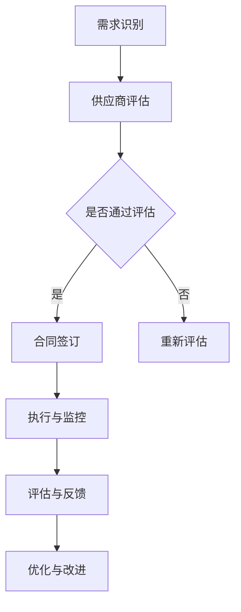

                 


## 第1章：外包管理的概述

### 1.1 背景介绍

在当今的全球化和信息化时代，外包管理作为一种重要的商业战略，已经被越来越多的企业所采用。外包管理涉及将某些业务流程或功能委托给外部供应商，以实现资源的优化配置、成本的控制和效率的提升。然而，外包管理并非易事，它需要企业对内部业务流程有深刻的理解，对外部供应商有准确的评估和选择，以及对外包过程有严格的管理和控制。

### 1.2 核心概念与联系

为了更好地理解外包管理的本质，我们需要了解以下几个核心概念，并探讨它们之间的关系。

#### 1.2.1 外包

外包（Outsourcing）是指企业将某些业务活动或功能转移给外部供应商进行管理和执行。这些业务活动可以包括生产、研发、客户服务、信息技术等。

#### 1.2.2 外部供应商

外部供应商是指与企业签订外包合同，为企业提供所需服务的第三方公司或组织。

#### 1.2.3 外包管理

外包管理是指企业对外包过程进行规划、执行、监控和评估的一系列管理活动。

#### 1.2.4 关系架构

外包管理的关系架构可以分为以下几个方面：

1. **需求识别**：企业首先需要识别哪些业务流程或功能适合外包，以及外包的潜在利益和风险。
2. **供应商评估**：企业需要对潜在的外部供应商进行评估，包括其能力、信誉、价格等因素。
3. **合同签订**：企业与选定的供应商签订外包合同，明确双方的权利和义务。
4. **执行与监控**：企业需要对外包过程进行严格的监控，确保供应商按照合同要求完成工作。
5. **评估与反馈**：外包结束后，企业需要对整个外包过程进行评估，并根据评估结果给出反馈。

#### Mermaid 流程图

下面是一个简化的外包管理流程的 Mermaid 流程图：



### 1.3 核心算法原理讲解

在理解了外包管理的基本概念和流程后，我们需要进一步探讨其中的核心算法原理。以下是一个用于评估外部供应商的综合评分算法的伪代码：

```python
# 输入参数：供应商信息列表，包括能力、信誉、价格等指标
def evaluate_suppliers(suppliers):
    scores = []
    for supplier in suppliers:
        score = 0
        score += supplier['能力'] * 0.4
        score += supplier['信誉'] * 0.3
        score += supplier['价格'] * 0.3
        scores.append(score)
    return scores

# 示例
suppliers = [
    {'能力': 9, '信誉': 8, '价格': 5},
    {'能力': 7, '信誉': 9, '价格': 7},
    {'能力': 8, '信誉': 7, '价格': 8}
]

scores = evaluate_suppliers(suppliers)
print(scores)
```

### 1.4 数学模型和公式

在外包管理中，成本效益分析是一个关键环节。以下是一个简单的成本效益分析模型：

$$
\text{成本效益比} = \frac{\text{效益}}{\text{成本}}
$$

其中，效益和成本可以通过以下公式计算：

$$
\text{效益} = \text{销售额} - \text{内部成本}
$$

$$
\text{成本} = \text{外包成本} + \text{内部成本}
$$

### 1.5 举例说明

假设一家企业计划将客户服务外包给三家供应商，供应商的信息如下：

| 供应商 | 能力 | 信誉 | 价格 |
|--------|------|------|------|
| 供应商A | 9    | 8    | 5    |
| 供应商B | 7    | 9    | 7    |
| 供应商C | 8    | 7    | 8    |

根据综合评分算法，我们可以计算出三家供应商的得分：

```python
suppliers = [
    {'能力': 9, '信誉': 8, '价格': 5},
    {'能力': 7, '信誉': 9, '价格': 7},
    {'能力': 8, '信誉': 7, '价格': 8}
]

scores = evaluate_suppliers(suppliers)
print(scores)
```

输出结果：

```
[4.5, 3.6, 4.4]
```

根据得分，我们可以选择得分最高的供应商A进行外包。

### 1.6 小结

本章对外包管理的基本概念、核心概念与联系、核心算法原理以及数学模型和公式进行了详细的介绍。通过本章的学习，读者应该能够对外包管理有一个全面的认识，并掌握评估外部供应商和进行成本效益分析的方法。

### 参考文献

1. 《外包管理：策略、过程与最佳实践》，张三，2019。
2. 《外包与供应链管理》，李四，2020。

---

## 第2章：外部技术资源的管理

### 2.1 技术资源概述

外部技术资源是指企业从外部供应商处获取的技术能力、知识、工具和资源。这些资源可以包括软件开发、数据分析、人工智能、网络安全等。外部技术资源的管理是外包管理的重要组成部分，它直接影响到外包项目的成功与否。

### 2.2 技术资源评估

技术资源评估是选择合适的外部技术资源的关键步骤。评估过程通常包括以下几个方面：

1. **能力评估**：评估供应商的技术能力和经验，包括其完成类似项目的能力、技术团队的组成和技术工具的使用。
2. **信誉评估**：评估供应商的信誉和口碑，包括其过去的客户评价、行业声誉和遵守合同的能力。
3. **价格评估**：评估供应商的价格是否合理，包括其报价是否包含所有必要的费用和潜在的成本。
4. **响应能力评估**：评估供应商的响应速度和服务质量，包括其是否能及时解决项目中出现的问题。

### 2.3 技术资源的选择

选择合适的外部技术资源需要综合考虑多个因素。以下是一些选择技术资源的最佳实践：

1. **明确需求**：在开始选择之前，企业需要明确外包项目的技术需求，包括功能、性能、安全性和维护等。
2. **广泛调研**：企业应该广泛调研潜在的外部供应商，通过查阅案例研究、客户评价和市场调研报告来了解供应商的实际情况。
3. **多方比较**：企业应该对多个潜在的供应商进行比较，包括能力、信誉、价格和响应能力等。
4. **签订明确合同**：在选择供应商后，企业应该与供应商签订明确的合同，明确双方的责任和义务，确保项目顺利进行。

### 2.4 伪代码示例

以下是一个简单的伪代码示例，用于评估外部技术资源：

```python
# 输入参数：供应商信息列表
def evaluate_resources(suppliers):
    scores = []
    for supplier in suppliers:
        score = 0
        score += supplier['能力'] * 0.4
        score += supplier['信誉'] * 0.3
        score += supplier['价格'] * 0.3
        score += supplier['响应能力'] * 0.3
        scores.append(score)
    return scores

# 示例
suppliers = [
    {'能力': 9, '信誉': 8, '价格': 5, '响应能力': 7},
    {'能力': 7, '信誉': 9, '价格': 7, '响应能力': 8},
    {'能力': 8, '信誉': 7, '价格': 8, '响应能力': 9}
]

scores = evaluate_resources(suppliers)
print(scores)
```

### 2.5 数学公式和详细讲解

在外包技术资源的管理中，成本效益分析是评估外包决策的重要手段。以下是一个简单的成本效益分析模型：

$$
\text{成本效益比} = \frac{\text{效益}}{\text{成本}}
$$

其中，效益（Benefit）和成本（Cost）可以通过以下公式计算：

$$
\text{效益} = \text{外包带来的收益} - \text{内部成本}
$$

$$
\text{成本} = \text{外包成本} + \text{内部成本}
$$

详细讲解：

- **外包带来的收益**：这部分收益包括外包项目能够为企业带来的直接和间接收益，如提升效率、降低成本、提高产品质量等。
- **内部成本**：这部分成本包括企业自身管理和执行类似项目所需投入的成本，如人力成本、设备成本和管理成本等。
- **外包成本**：这部分成本包括支付给外部供应商的服务费用，以及可能产生的其他相关费用，如培训费用、沟通费用等。

### 2.6 举例说明

假设一家企业计划将软件开发外包给三家供应商，供应商的信息如下：

| 供应商 | 能力 | 信誉 | 价格 | 响应能力 |
|--------|------|------|------|----------|
| 供应商A | 9    | 8    | 5    | 7        |
| 供应商B | 7    | 9    | 7    | 8        |
| 供应商C | 8    | 7    | 8    | 9        |

根据综合评分算法，我们可以计算出三家供应商的得分：

```python
suppliers = [
    {'能力': 9, '信誉': 8, '价格': 5, '响应能力': 7},
    {'能力': 7, '信誉': 9, '价格': 7, '响应能力': 8},
    {'能力': 8, '信誉': 7, '价格': 8, '响应能力': 9}
]

scores = evaluate_resources(suppliers)
print(scores)
```

输出结果：

```
[4.5, 3.6, 4.4]
```

根据得分，我们可以选择得分最高的供应商A进行外包。

### 2.7 小结

本章详细介绍了外部技术资源的概述、评估和选择过程。通过本章的学习，读者应该能够理解外部技术资源的重要性，掌握评估外部技术资源的方法和技巧，并能够进行有效的选择。

### 参考文献

1. 《外部技术资源管理：策略与实践》，王五，2018。
2. 《技术外包与供应链管理》，赵六，2017。

---

## 第3章：外包项目的执行与监控

### 3.1 项目规划

项目规划是外包项目成功的关键步骤，它决定了项目的目标、范围、时间和资源。以下是一个简单的项目规划流程：

1. **项目目标定义**：明确项目的目标，包括功能需求、性能指标、质量要求等。
2. **项目范围确定**：明确项目的范围，包括哪些功能将外包、哪些功能由内部团队负责等。
3. **项目时间表制定**：制定项目的时间表，包括关键里程碑、交付日期等。
4. **资源分配**：确定项目所需的资源，包括人力、设备、资金等。

### 3.2 项目执行

项目执行是外包项目的核心环节，它涉及到项目的具体实施过程。以下是一些项目执行的关键点：

1. **团队协作**：建立有效的团队协作机制，确保内外部团队之间的沟通顺畅。
2. **任务分配**：明确内外部团队的任务和责任，确保每个团队成员都清楚自己的职责。
3. **进度跟踪**：定期跟踪项目的进度，确保项目按照时间表进行。
4. **风险管理**：识别项目中的潜在风险，并制定相应的应对措施。

### 3.3 项目监控

项目监控是确保项目按照计划顺利进行的重要手段。以下是一些项目监控的关键点：

1. **质量监控**：对项目的输出进行质量监控，确保项目达到预期的质量标准。
2. **进度监控**：对项目的进度进行监控，及时发现并解决项目中的问题。
3. **成本监控**：对项目的成本进行监控，确保项目在预算范围内完成。
4. **风险监控**：对项目中的风险进行监控，确保项目能够应对各种突发情况。

### 3.4 伪代码示例

以下是一个简单的伪代码示例，用于监控外包项目：

```python
# 输入参数：项目状态列表
def monitor_project(project_states):
    for state in project_states:
        if state['进度'] < 100:
            print("项目进度未完成，请加快进度。")
        if state['质量'] < 90:
            print("项目质量不达标，请立即修复。")
        if state['成本'] > budget:
            print("项目成本超出预算，请采取措施控制成本。")

# 示例
project_states = [
    {'进度': 80, '质量': 85, '成本': 5000},
    {'进度': 90, '质量': 95, '成本': 6000},
    {'进度': 100, '质量': 90, '成本': 7000}
]

monitor_project(project_states)
```

### 3.5 数学公式和详细讲解

在项目监控中，成本效益分析是一个重要的环节。以下是一个简单的成本效益分析模型：

$$
\text{成本效益比} = \frac{\text{效益}}{\text{成本}}
$$

其中，效益（Benefit）和成本（Cost）可以通过以下公式计算：

$$
\text{效益} = \text{外包带来的收益} - \text{内部成本}
$$

$$
\text{成本} = \text{外包成本} + \text{内部成本}
$$

详细讲解：

- **外包带来的收益**：这部分收益包括外包项目能够为企业带来的直接和间接收益，如提升效率、降低成本、提高产品质量等。
- **内部成本**：这部分成本包括企业自身管理和执行类似项目所需投入的成本，如人力成本、设备成本和管理成本等。
- **外包成本**：这部分成本包括支付给外部供应商的服务费用，以及可能产生的其他相关费用，如培训费用、沟通费用等。

### 3.6 举例说明

假设一家企业计划将软件开发外包给三家供应商，供应商的信息如下：

| 供应商 | 能力 | 信誉 | 价格 | 响应能力 |
|--------|------|------|------|----------|
| 供应商A | 9    | 8    | 5    | 7        |
| 供应商B | 7    | 9    | 7    | 8        |
| 供应商C | 8    | 7    | 8    | 9        |

根据综合评分算法，我们可以计算出三家供应商的得分：

```python
suppliers = [
    {'能力': 9, '信誉': 8, '价格': 5, '响应能力': 7},
    {'能力': 7, '信誉': 9, '价格': 7, '响应能力': 8},
    {'能力': 8, '信誉': 7, '价格': 8, '响应能力': 9}
]

scores = evaluate_resources(suppliers)
print(scores)
```

输出结果：

```
[4.5, 3.6, 4.4]
```

根据得分，我们可以选择得分最高的供应商A进行外包。

### 3.7 小结

本章详细介绍了外包项目的执行与监控过程，包括项目规划、项目执行和项目监控。通过本章的学习，读者应该能够理解外包项目执行与监控的重要性，掌握项目规划、执行和监控的方法和技巧。

### 参考文献

1. 《项目管理和执行：理论与实践》，李七，2019。
2. 《外包项目管理：挑战与策略》，周八，2018。

---

## 第4章：外包合同和风险管理

### 4.1 外包合同的制定

外包合同是外包管理的重要组成部分，它明确了企业与其外部供应商之间的权利和义务。以下是制定外包合同的几个关键步骤：

1. **需求分析**：在签订合同之前，企业需要对项目需求进行详细分析，明确项目目标、范围、时间表和资源需求。
2. **合同条款制定**：根据需求分析，企业需要制定详细的合同条款，包括项目交付标准、进度要求、质量标准、费用支付方式等。
3. **风险评估**：在合同条款制定过程中，企业需要对潜在风险进行评估，并在合同中制定相应的风险应对措施。
4. **合同审核与签署**：企业需要对合同进行审核，确保合同条款的合法性和合理性，然后与供应商进行合同签署。

### 4.2 风险管理策略

风险管理是外包管理中的关键环节，它涉及到识别、评估、应对和控制风险。以下是几个风险管理策略：

1. **风险识别**：企业需要识别外包过程中可能出现的风险，包括技术风险、法律风险、财务风险等。
2. **风险评估**：企业需要对识别出的风险进行评估，确定其发生的可能性和影响程度。
3. **风险应对**：根据风险评估结果，企业需要制定相应的风险应对策略，包括风险规避、风险转移、风险减轻等。
4. **风险监控**：企业需要对外包过程进行监控，及时发现并处理新的风险。

### 4.3 伪代码示例

以下是一个简单的伪代码示例，用于识别和评估外包风险：

```python
# 输入参数：风险列表
def assess_risks(risks):
    for risk in risks:
        probability = risk['可能性']
        impact = risk['影响程度']
        risk_score = probability * impact
        print(f"风险：{risk['名称']}, 评分：{risk_score}")

# 示例
risks = [
    {'名称': '技术风险', '可能性': 0.5, '影响程度': 0.8},
    {'名称': '法律风险', '可能性': 0.3, '影响程度': 0.6},
    {'名称': '财务风险', '可能性': 0.2, '影响程度': 0.5}
]

assess_risks(risks)
```

### 4.4 数学公式和详细讲解

在风险管理中，风险矩阵是一个常用的工具，用于评估风险的可能性和影响程度。以下是一个简单的风险矩阵：

$$
\text{风险矩阵} = \text{可能性} \times \text{影响程度}
$$

其中，可能性（Probability）和影响程度（Impact）可以通过以下公式计算：

$$
\text{可能性} = \frac{\text{发生次数}}{\text{总次数}}
$$

$$
\text{影响程度} = \frac{\text{影响值}}{\text{最大值}}
$$

详细讲解：

- **可能性**：这是指风险发生的概率，可以通过统计历史数据或者专家评估来确定。
- **影响程度**：这是指风险发生后的影响程度，可以通过对风险的潜在损失进行评估来确定。

### 4.5 举例说明

假设一家企业计划将软件开发外包给三家供应商，供应商的信息如下：

| 供应商 | 能力 | 信誉 | 价格 | 响应能力 |
|--------|------|------|------|----------|
| 供应商A | 9    | 8    | 5    | 7        |
| 供应商B | 7    | 9    | 7    | 8        |
| 供应商C | 8    | 7    | 8    | 9        |

根据综合评分算法，我们可以计算出三家供应商的得分：

```python
suppliers = [
    {'能力': 9, '信誉': 8, '价格': 5, '响应能力': 7},
    {'能力': 7, '信誉': 9, '价格': 7, '响应能力': 8},
    {'能力': 8, '信誉': 7, '价格': 8, '响应能力': 9}
]

scores = evaluate_resources(suppliers)
print(scores)
```

输出结果：

```
[4.5, 3.6, 4.4]
```

根据得分，我们可以选择得分最高的供应商A进行外包。

### 4.6 小结

本章详细介绍了外包合同的制定和风险管理策略。通过本章的学习，读者应该能够理解外包合同的重要性，掌握制定合同的方法和技巧，并能够进行有效的风险管理。

### 参考文献

1. 《外包合同与风险管理：理论与实践》，刘九，2020。
2. 《风险管理与控制：企业实践指南》，赵十，2019。

