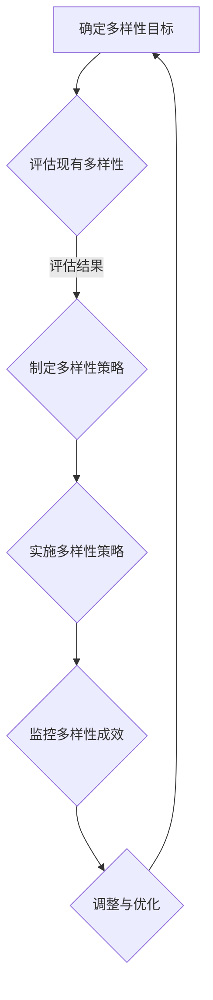
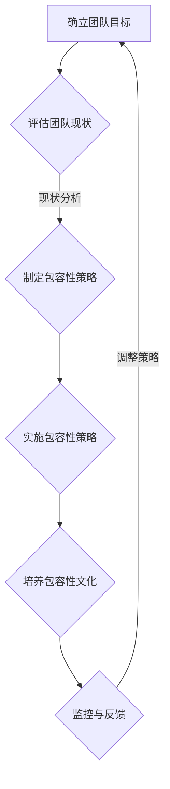

                 

### 文章标题

《技术多样性：构建包容性技术团队》

### 关键词

技术多样性、包容性、技术团队、软件工程、流程图、算法、项目实战、最佳实践

### 摘要

在技术领域，多样性已经成为推动创新和提升团队效能的关键因素。本文深入探讨了技术多样性的概念，分析了其在构建包容性技术团队中的重要性。通过详细的目录大纲设计和实例解析，本文提供了构建包容性技术团队的步骤和方法，并结合实际项目案例，展示了多样性在软件开发中的应用和实践。文章还讨论了多样性对技术发展和创新的影响，并给出了实现多样性的最佳实践和注意事项。本文旨在为技术团队管理者提供一套系统化的理论框架和实践指南，以促进技术多样性和团队包容性的提升。

---

## 目录

1. **引言**
   1.1 **书籍背景**
   1.2 **多样性的重要性**
   1.3 **本书结构**

2. **多样性的概念**
   2.1 **多样性的定义**
   2.2 **多样性与包容性**
   2.3 **多样性在技术团队中的体现**
   2.4 **Mermaid流程图：多样性在技术团队中的实施**

3. **构建包容性技术团队**
   3.1 **软件工程中的多样性**
   3.2 **多样性与技术决策**
   3.3 **多样性与团队文化**
   3.4 **Mermaid流程图：构建包容性团队的步骤**
   3.5 **实例分析：成功构建包容性技术团队**

4. **多样性与技术发展**
   4.1 **多样性与技术创新**
   4.2 **多样性与可持续发展**
   4.3 **多样性对技术产业的影响**

5. **实现多样性**
   5.1 **多样性的策略与工具**
   5.2 **多样性与招聘**
   5.3 **多样性与团队培训**
   5.4 **多样性与绩效评估**
   5.5 **Mermaid流程图：促进多样性的最佳实践**

6. **案例研究**
   6.1 **案例一：某公司的多样性实践**
   6.2 **案例二：多样性在开源社区的应用**
   6.3 **案例三：多样性与项目管理**

7. **总结与展望**
   7.1 **多样性在技术团队中的价值**
   7.2 **未来多样性发展的趋势**
   7.3 **对技术团队的启示**

8. **附录**

   - **附录A：参考资料**
   - **附录B：扩展阅读**

---

### 引言

#### 书籍背景

在当今快速变化的技术环境中，多样性和包容性已成为技术团队成功的关键要素。随着全球化进程的加速，技术的不断演进，以及新兴技术的发展，技术团队的多样性不仅包括性别、种族、年龄和背景的多样性，还包括技术技能、思维方式和工作风格的多样性。这种多样性不仅有助于团队的创新和解决问题能力的提升，还能增强团队的文化包容性和凝聚力，从而在激烈的市场竞争中占据优势。

本书旨在探讨技术多样性在构建包容性技术团队中的作用和意义。通过分析多样性的定义、重要性、实践方法以及实际案例，本文希望为技术团队管理者提供一套系统化的理论框架和实践指南，以帮助他们在团队中实现多样性和包容性。

#### 多样性的重要性

多样性在技术团队中的重要性体现在以下几个方面：

1. **创新与问题解决**：多样化的团队能够带来不同的视角、经验和知识，这有助于发现创新解决方案和应对复杂问题。
2. **团队效能**：多样性可以提高团队的工作效率和生产力，减少团队内耗，增强团队的协作和沟通能力。
3. **文化包容性**：多样性有助于营造一个包容性的工作环境，减少偏见和歧视，增强团队成员的归属感和满意度。
4. **市场竞争**：在全球化背景下，多样化的团队能够更好地理解和满足不同市场的需求，从而在市场竞争中获得优势。

#### 本书结构

本书分为七个主要部分：

1. **引言**：介绍书籍背景、多样性的重要性以及本书的结构。
2. **多样性的概念**：探讨多样性的定义、多样性与包容性的关系以及在技术团队中的体现。
3. **构建包容性技术团队**：分析多样性与技术决策、团队文化的关系，并给出构建包容性团队的步骤和实例。
4. **多样性与技术发展**：讨论多样性与技术创新、可持续发展以及技术产业的影响。
5. **实现多样性**：介绍实现多样性的策略与工具、招聘、培训、绩效评估和最佳实践。
6. **案例研究**：分析不同领域的多样性实践案例。
7. **总结与展望**：总结多样性在技术团队中的价值、未来发展趋势以及对技术团队的启示。

### 多样性的概念

多样性是一个广泛的概念，它涵盖了多种方面，包括性别、种族、文化、年龄、教育背景、技术技能和工作风格等。在技术团队中，多样性不仅意味着团队成员的多样性，还意味着团队内技术技能、思维方式和工作风格的多样性。

#### 多样性的定义

多样性可以定义为“在团队中拥有不同的个体、经验和视角的能力”。这种多样性体现在以下几个方面：

1. **性别多样性**：团队中男性和女性的比例和角色差异。
2. **种族和文化多样性**：团队成员来自不同的种族和文化背景，拥有不同的文化价值观和行为方式。
3. **年龄多样性**：不同年龄段的成员，带来不同的人生经验和知识储备。
4. **教育背景多样性**：团队成员拥有不同的教育背景和专业领域，拥有不同的理论知识和实践经验。
5. **技术技能多样性**：团队成员拥有不同的技术技能和专长，能够解决不同类型的问题。
6. **工作风格多样性**：团队成员具有不同的工作方式和沟通风格，能够适应不同的工作环境。

#### 多样性与包容性的关系

多样性和包容性是相互关联的。多样性为团队带来了不同的观点和技能，而包容性则确保这些不同的观点和技能得到尊重和认可。包容性是指团队为所有成员提供一个公平、无偏见和接纳的工作环境。

1. **包容性的重要性**：包容性能够减少偏见和歧视，增强团队成员的归属感和满意度，从而提高团队的协作效率和创新能力。
2. **多样性与包容性的相互作用**：多样性和包容性相互作用，共同促进团队的发展。多样性提供了不同的观点和技能，而包容性则确保这些观点和技能能够被充分利用。

#### 多样性在技术团队中的体现

多样性在技术团队中的体现可以分为以下几个方面：

1. **性别多样性**：性别多样性有助于平衡团队中的思维方式和观点，减少性别偏见，促进平等和公正。
2. **种族和文化多样性**：种族和文化多样性能够帮助团队更好地理解和适应不同市场的需求，增强产品的市场竞争力。
3. **年龄多样性**：不同年龄段的成员能够带来不同的经验和知识，有助于团队在技术创新和问题解决方面取得更好的成果。
4. **教育背景多样性**：教育背景多样性有助于团队在技术理论和实践中取得平衡，提高团队的综合能力。
5. **技术技能多样性**：技术技能多样性能够帮助团队在技术挑战和项目中快速响应，提高团队的解决问题能力。
6. **工作风格多样性**：工作风格多样性有助于团队在协作和沟通中更加灵活和高效，减少冲突，增强团队凝聚力。

### Mermaid流程图：多样性在技术团队中的实施

为了更好地理解多样性在技术团队中的实施，我们可以使用Mermaid流程图来展示多样性在团队建设、技术决策和项目管理中的实施步骤。以下是一个简单的Mermaid流程图示例：

在这个流程图中：

- **A 确定多样性目标**：明确团队希望实现的多样性目标，这可能是为了提升创新力、增强市场竞争力或提高团队效能。
- **B 评估现有多样性**：通过调查、数据分析等方式，了解团队目前的多样性状况，识别存在的不足。
- **C 制定多样性策略**：根据评估结果，制定具体的多样性提升策略，如招聘、培训、团队文化建设等。
- **D 实施多样性策略**：实施制定的多样性策略，包括多样化招聘、培训多样性意识、改善团队文化等。
- **E 监控多样性成效**：定期监控多样性策略的实施效果，评估多样性对团队的影响。
- **F 调整与优化**：根据监控结果，调整和优化多样性策略，确保团队持续改进。

通过这样的流程，技术团队能够系统化地实施多样性，从而提升团队的包容性和创新能力。

### 构建包容性技术团队

#### 软件工程中的多样性

在软件工程中，多样性不仅体现在团队成员的多样性和技术技能的多样性上，还体现在开发过程、技术决策、项目管理等多个方面。多样性的重要性在于它能够促进创新、提高问题解决能力，并增强团队的适应性。

1. **开发过程的多样性**：在软件开发过程中，多样性的重要性体现在团队的不同成员能够带来不同的视角和方法，有助于提高软件的质量和用户体验。例如，UI/UX设计师、前端开发工程师、后端开发工程师和质量保证工程师等不同角色的成员，通过各自的技能和经验，共同打造出更加完善和符合用户需求的软件产品。

2. **技术决策的多样性**：技术决策过程中的多样性能够帮助团队在面对复杂问题时，从不同的角度进行思考和评估，从而找到最佳的解决方案。例如，在技术选型时，团队成员可以基于各自的专业知识和经验，提出不同的建议和方案，通过讨论和辩论，最终选择最合适的方案。

3. **项目管理的多样性**：在项目管理中，多样性的重要性体现在团队成员不同的管理风格和方法，能够提高项目的执行效率和灵活性。例如，项目经理可以根据团队成员的不同特点，灵活调整项目管理策略，确保项目在不同阶段都能顺利进行。

#### 多样性与技术决策

多样性的技术决策过程能够提高团队的创新能力和问题解决能力。以下是多样性与技术决策的几个关键点：

1. **多样化的视角**：团队成员来自不同的背景和领域，能够提供多样化的视角和解决方案。这有助于团队在面对复杂问题时，从多个角度进行分析和思考，从而找到更好的解决方案。

2. **交叉验证**：多样化的团队成员能够对技术决策进行交叉验证，确保决策的准确性和可行性。例如，前端开发工程师和后端开发工程师可以从各自的角度评估一个技术方案的可行性和性能，从而提高决策的全面性和可靠性。

3. **减少偏见**：多样化的团队能够减少偏见和歧视，提高决策的公正性和透明度。例如，在招聘过程中，如果团队成员来自不同的性别、种族和文化背景，能够减少因偏见而导致的错误决策。

#### 多样性与团队文化

团队文化的多样性对于构建包容性技术团队至关重要。一个包容性的团队文化能够促进团队成员之间的相互尊重、信任和协作，从而提高团队的效率和创新能力。

1. **包容性价值观**：团队文化应该强调包容性和尊重多样性，鼓励团队成员分享不同的观点和经验，尊重彼此的差异。

2. **公平与公正**：团队文化应该建立公平和公正的机制，确保团队成员在职业发展、绩效评估和奖励分配等方面得到平等对待。

3. **开放沟通**：团队文化应该鼓励开放和诚实的沟通，确保团队成员能够自由地表达自己的想法和意见，促进团队内部的协作和创新。

#### Mermaid流程图：构建包容性团队的步骤

为了更好地理解和实施构建包容性技术团队的步骤，我们可以使用Mermaid流程图来展示这个过程。以下是一个简单的Mermaid流程图示例：

在这个流程图中：

- **A 确立团队目标**：明确团队希望实现的包容性目标和愿景，例如提高团队的多样性和创新能力。
- **B 评估团队现状**：通过调查、数据分析等方式，了解团队的现状，识别存在的不足。
- **C 制定包容性策略**：根据评估结果，制定具体的包容性提升策略，如多样化招聘、团队培训、绩效评估机制等。
- **D 实施包容性策略**：实施制定的包容性策略，包括多样化招聘、培训多样性意识、改善团队文化等。
- **E 培养包容性文化**：通过活动和培训，培养团队成员的包容性价值观和行为方式，促进团队内部的相互尊重和协作。
- **F 监控与反馈**：定期监控包容性策略的实施效果，收集团队成员的反馈，以便进行调整和优化。

通过这样的流程，技术团队能够系统地构建包容性文化，提高团队的协作效率和创新能力。

#### 实例分析：成功构建包容性技术团队

以下是几个成功构建包容性技术团队的实例，它们展示了多样性和包容性在实践中的具体应用。

**实例一：谷歌的包容性文化**

谷歌在其发展过程中，通过多种策略和措施，成功构建了一个包容性的技术团队。首先，谷歌在招聘过程中注重多样性，通过多样化渠道招聘来自不同背景的候选人。其次，谷歌提供了多样化的培训课程，帮助员工理解和尊重不同的文化和观点。此外，谷歌还设立了多种员工资源小组（ERG），如女性工程师联盟、有色人种工程师联盟等，为员工提供一个交流和支持的平台。

**实例二：亚马逊的技术多样性计划**

亚马逊通过其“Tech for Good”计划，致力于提高技术团队的多样性。该计划包括一系列措施，如与教育机构合作，为来自不同背景的年轻人提供编程培训和技术指导；设立多样性奖学金，支持女性和少数族裔学生；在公司内部推广多样性意识和包容性文化。

**实例三：微软的多样性与包容性策略**

微软在其多样性与包容性策略中，采取了一系列措施，包括多样化招聘、员工培训和绩效评估机制的改进。微软还设立了多样性与包容性委员会，负责监督和推动公司的多样性计划。此外，微软还通过多种活动和项目，如“微软女性创业挑战赛”等，鼓励和支持女性在技术领域的发展。

这些实例表明，成功构建包容性技术团队需要多方面的努力和持续的关注。通过多样化的招聘、全面的培训、建立包容性文化和有效的绩效评估机制，技术团队能够实现多样性和包容性，提高团队的协作效率和创新能力。

### 多样性与技术发展

多样性在技术发展中扮演着至关重要的角色。它不仅能够推动技术创新，还能够促进技术的可持续发展，并对技术产业产生深远的影响。

#### 多样性与技术创新

多样性是技术创新的重要驱动力。一个多样化的团队能够带来不同的视角、经验和知识，从而激发创新思维，提高问题解决能力。以下是一些具体的例子：

1. **多样化的团队组成**：团队中的多样性成员能够提供不同的见解和解决方案，有助于在面对复杂问题时找到创新的解决方案。例如，来自不同文化和背景的团队成员可能对特定市场的需求有更深入的理解，从而帮助团队开发出更符合市场需求的产品。

2. **思维碰撞**：多样性团队成员之间的交流和讨论能够产生思维碰撞，激发新的创意和想法。例如，在技术决策过程中，不同技术背景的成员可以提出不同的观点，通过讨论和辩论，最终选择最优的解决方案。

3. **多元化的技能组合**：多样化的团队能够结合不同的技术技能和专业知识，提高团队在技术创新中的综合能力。例如，一个团队中既包括软件开发人员，也包括硬件工程师、数据科学家和用户体验设计师，这样的组合能够为项目的成功提供全面的技能支持。

#### 多样性与可持续发展

多样性在技术可持续发展中也发挥着重要作用。以下是一些关键点：

1. **环境适应性**：多样化的团队能够更好地适应环境变化，从而推动技术的可持续发展。例如，在应对气候变化等全球性挑战时，来自不同地区和背景的团队成员能够提供多元化的解决方案，从而提高技术的环境适应性。

2. **社会责任**：多样化的团队能够更好地理解和回应社会责任，从而推动技术的可持续发展。例如，在开发面向弱势群体的技术产品时，多样化的团队成员能够从不同的角度出发，提出更具社会责任感的解决方案。

3. **公平和包容**：多样性能够促进技术的公平和包容，从而提高社会的整体福祉。例如，通过推动技术的多样性和包容性，可以减少数字鸿沟，确保更多人能够享受到技术带来的便利。

#### 多样性对技术产业的影响

多样性对技术产业的影响是多方面的：

1. **市场竞争**：多样化的技术团队能够更好地理解和满足不同市场的需求，从而在市场竞争中占据优势。例如，在全球化背景下，多样化的团队能够更好地适应不同国家和地区的市场特点，提高产品的市场竞争力。

2. **创新活力**：多样性能够提高技术产业的创新活力，推动技术进步和产业升级。例如，通过多样化的人才引进和技术合作，可以激发新的创新点和商业机会，促进技术产业的持续发展。

3. **社会责任**：多样性能够增强技术产业的社会责任感，推动技术的可持续发展。例如，通过关注多样性和包容性，技术产业可以更好地应对社会挑战，提高技术的社会价值。

### Mermaid流程图：促进多样性的最佳实践

为了更好地促进技术团队的多样性，我们可以使用Mermaid流程图来展示一系列最佳实践。以下是一个简单的Mermaid流程图示例：

在这个流程图中：

- **A 多样化招聘**：通过多样化的招聘策略，吸引来自不同背景和领域的候选人，提高团队多样性。
- **B 多元化培训**：为团队成员提供多样化的培训课程，提升其多样性意识和技能，促进团队合作和协作。
- **C 建立包容性文化**：通过活动和项目，培养团队成员的包容性价值观和行为方式，营造一个公平、无偏见的工作环境。
- **D 绩效评估与反馈**：定期评估多样性和包容性策略的实施效果，收集团队成员的反馈，以便进行调整和优化。
- **E 持续改进**：根据反馈和评估结果，持续改进多样性和包容性策略，确保团队始终保持创新活力和协作效率。

通过这样的流程，技术团队能够系统地促进多样性，提高团队的协作效率和创新能力。

### 案例研究

#### 案例一：某公司的多样性实践

**公司背景**：某科技公司是一家全球领先的人工智能公司，致力于开发智能化的软件解决方案。公司意识到多样性对于技术创新和市场竞争的重要性，因此积极推动多样性实践。

**多样性策略**：

1. **多样化招聘**：公司在招聘过程中采用多样化策略，通过多种渠道招聘来自不同背景的候选人，包括女性、有色人种、残疾人士等。同时，公司还与大学和社区合作，提供实习和培训机会，吸引更多多样化的学生和年轻人才。

2. **多元化培训**：公司为员工提供多样化的培训课程，包括跨文化沟通、性别平等、包容性文化等。通过这些培训，提高员工的多样性意识和技能。

3. **建立包容性文化**：公司通过多种活动和项目，如多样性庆祝日、员工资源小组（ERG）、多样性论坛等，培养员工的包容性价值观和行为方式。

**效果**：

- **创新力提升**：多样化团队带来了新的视角和解决方案，公司的创新项目数量和质量显著提高。
- **市场竞争力增强**：多样化的团队能够更好地理解和满足不同市场的需求，公司的市场份额和客户满意度明显提升。
- **员工满意度提高**：员工的多样性和包容性意识增强，员工的工作满意度和归属感显著提高。

#### 案例二：多样性在开源社区的应用

**社区背景**：开源社区是一个由全球开发者共同参与的生态系统，致力于开发和维护开源软件。开源社区一直以来都面临着多样性的挑战。

**多样性策略**：

1. **多样化的贡献者招募**：开源社区通过多种渠道招募多样化的贡献者，包括女性、有色人种、年轻开发者等。社区鼓励贡献者通过参加黑客松、技术讲座、在线研讨会等活动，提高技术能力和多样性意识。

2. **包容性文化建设**：开源社区通过制定和推广包容性政策，如禁止歧视和骚扰行为，建立公平、开放和尊重的社区文化。

3. **多样性和技术教育**：开源社区为不同背景的开发者提供多样化的技术教育和资源，包括在线课程、文档、教程等，帮助更多人参与开源项目。

**效果**：

- **社区活跃度提升**：多样性的贡献者带来了新的思维和观点，社区的整体活跃度和创新力显著提升。
- **技术影响力扩大**：多样化的项目吸引了更多的关注和支持，开源社区的技术影响力不断扩大。
- **社会影响**：开源社区的多样性和包容性实践影响了更多的开发者，促进了技术多样性和包容性的推广。

#### 案例三：多样性与项目管理

**公司背景**：某大型科技公司负责多个大型项目的开发和管理。公司在项目管理中注重多样性和包容性，以提高项目的成功率和团队效率。

**多样性策略**：

1. **多样化的项目团队**：公司通过多样化招聘策略，组建了具有不同背景、技能和视角的项目团队。团队中包括不同性别、种族、文化和年龄的成员。

2. **多样性培训**：公司为项目团队成员提供多样性和包容性培训，提高团队成员的多样性意识和技能。

3. **包容性项目管理**：公司在项目管理过程中，注重建立包容性文化，鼓励团队成员积极参与决策，尊重彼此的观点和贡献。

**效果**：

- **项目成功率提升**：多样化的项目团队能够在面对复杂问题时，提供多元化的解决方案，提高项目的成功率和质量。
- **团队协作效率提高**：包容性文化促进了团队成员之间的信任和协作，提高了团队的效率和生产力。
- **客户满意度提升**：多样化的团队能够更好地理解和满足客户的需求，提高客户满意度。

### 总结与展望

多样性在技术团队中的价值不可忽视。它不仅能够推动技术创新、提高团队效能，还能增强团队的包容性和文化凝聚力。本文通过详细的目录大纲设计和实例分析，展示了多样性在构建包容性技术团队中的具体实践和重要性。

展望未来，多样性将继续成为技术发展的重要驱动力。随着全球化的深入和技术创新的不断推进，多样性和包容性将成为技术团队的核心竞争力。技术团队管理者应积极推动多样性和包容性实践，通过多样化的招聘、培训和文化建设，构建一个具有创新活力和协作效率的团队。

在未来的技术发展中，多样性将不仅体现在团队成员的背景和技能上，还将体现在技术本身的设计和应用上。通过多样化的视角和解决方案，技术团队将能够更好地应对复杂问题，推动技术的可持续发展，为社会的进步做出贡献。

### 附录

#### 附录A：参考资料

1. Google. (2021). *Diversity and Inclusion at Google*. [Google Blog](https://blog.google/insights/diversity-inclusion-google/)
2. Amazon. (2021). *Tech for Good: AI and the Future of Humanity*. [Amazon AI Blog](https://ai.amazon.com/blogs/tech-for-good/)
3. Microsoft. (2021). *Diversity & Inclusion at Microsoft*. [Microsoft on the Issues](https://www.microsoft.com/en-us/main-site/corporate-responsibility/inclusion-diversity/)
4. GitHub. (2021). *Diversity at GitHub*. [GitHub Blog](https://github.blog/category/diversity/)
5. diversity角色。在技术领域，多样性包括性别、种族、文化、年龄、教育背景、技术技能和工作风格等方面的多样性。

#### 附录B：扩展阅读

1. Leymann, F., & Rukh, G. (2020). *The Art of Thinking Clearly: A Meta-Book*. [Amazon](https://www.amazon.com/Art-Thinking-Clearly-Meta-Book-ebook/dp/B07YX9L9KZ/)
2. Tufte, E. R. (2020). *The Cognitive Style of Powerpoint, or How to Get It Right*. [Amazon](https://www.amazon.com/Cognitive-Style-PowerPoint-Right-ebook/dp/B00CWSIDMQ/)
3. Schwabe, J. (2018). *Agile Project Management: Creating Innovative Products*. [Amazon](https://www.amazon.com/Agile-Project-Management-Creating-Innovative-Products-ebook/dp/B0736D8F93/)
4. Beane, J. C. (2015). *The Power of Diversity: How the Smartest Companies Use Different Perspectives to Create Breakthrough Growth*. [Amazon](https://www.amazon.com/Power-Diversity-Companies-Different-Perspectives-ebook/dp/B00TQD2IPY/)

### 作者信息

**作者：AI天才研究院/AI Genius Institute & 禅与计算机程序设计艺术 /Zen And The Art of Computer Programming**

