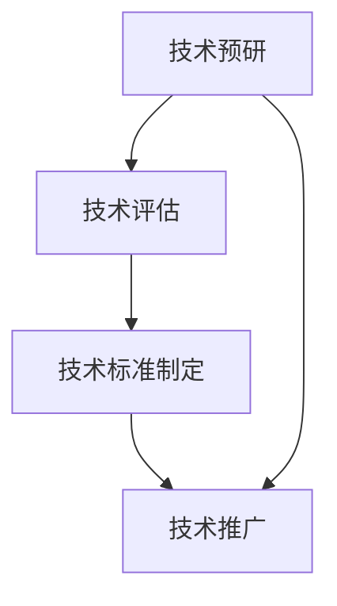
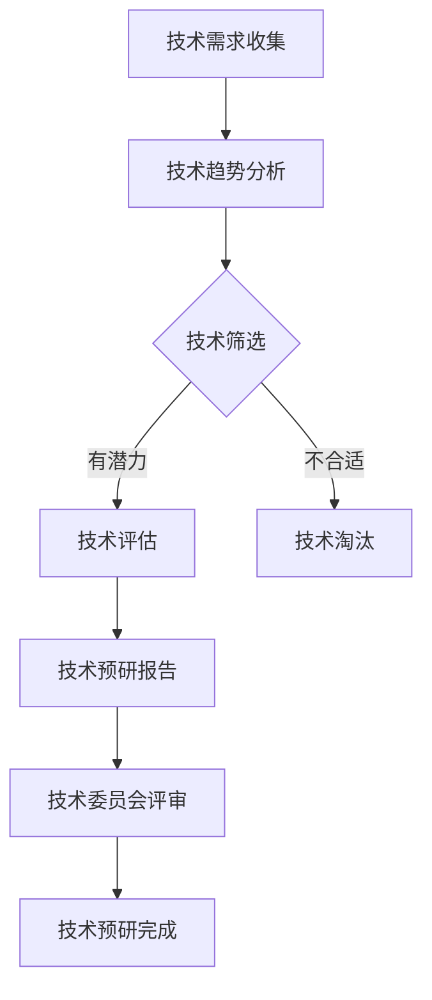
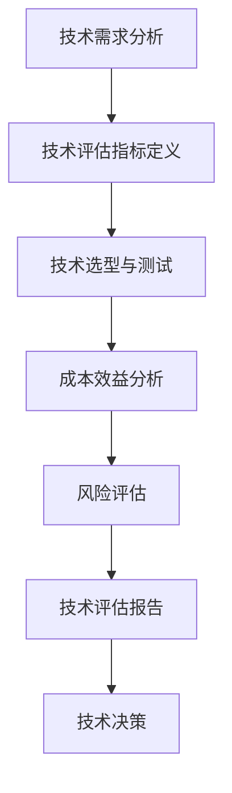

                 


### 概念与背景

#### 技术委员会的定义

技术委员会是一个由技术专家、管理层和业务分析师组成的团队，旨在为企业或组织提供技术指导、评估和决策支持。其核心目标是确保技术投资与业务需求相匹配，推动技术创新和优化，降低技术风险，提高组织的技术竞争力。

技术委员会的职责包括但不限于：

1. 技术预研：跟踪新兴技术趋势，评估其潜在应用价值，为企业或组织的技术发展方向提供建议。
2. 技术评估：评估现有技术和潜在技术的可行性、成本效益和风险，为技术投资决策提供依据。
3. 技术标准制定：制定技术规范和标准，确保技术的统一性和互操作性。
4. 技术推广：推动先进技术的应用和普及，提高组织的技术水平。

#### 技术委员会的重要性

在当今快速发展的技术环境中，技术委员会的作用日益凸显。其重要性体现在以下几个方面：

1. **战略决策支持**：技术委员会能够提供专业的技术见解和预测，帮助管理层做出更明智的决策。
2. **技术风险控制**：通过对技术进行评估和监控，技术委员会能够识别潜在风险，并提出相应的风险管理措施。
3. **技术创新推动**：技术委员会鼓励技术探索和创新，推动新技术的应用，提高组织的创新能力。
4. **资源优化配置**：技术委员会能够确保技术投资与业务需求相匹配，避免资源浪费。

#### 技术委员会的起源与发展

技术委员会的起源可以追溯到20世纪中期，当时一些大型企业开始意识到技术对于业务成功的重要性。随着信息技术的快速发展，技术委员会在各个行业中逐渐得到广泛应用。特别是在高度技术密集的行业，如互联网、金融和医疗，技术委员会已经成为不可或缺的一部分。

技术的发展和业务需求的变迁推动了技术委员会的演变。早期，技术委员会主要关注技术的可行性和成本效益。随着技术的不断进步，技术委员会的职责逐渐扩大，包括技术预研、评估、标准制定和推广。

### 核心概念与联系

为了更好地理解技术委员会的作用和运作机制，我们需要探讨几个核心概念，并分析它们之间的联系。

#### 核心概念

1. **技术预研**：技术预研是指对新兴技术的跟踪和研究，旨在评估其潜在应用价值。技术预研的目的是提前了解技术趋势，为企业或组织的技术投资提供参考。
2. **技术评估**：技术评估是对现有技术和潜在技术的可行性、成本效益和风险进行评估。技术评估的目的是为技术投资决策提供依据。
3. **技术标准制定**：技术标准制定是制定技术规范和标准，以确保技术的统一性和互操作性。技术标准的目的是提高技术的应用效率和兼容性。
4. **技术推广**：技术推广是推动先进技术的应用和普及，提高组织的技术水平。技术推广的目的是加速技术的落地和应用。

#### 核心概念之间的联系

- **技术预研**与**技术评估**：技术预研是技术评估的基础。通过技术预研，委员会可以提前了解技术趋势，为技术评估提供数据支持。技术评估则是基于技术预研的结果，对技术进行深入分析和评估，以确定其适用性和风险。
- **技术标准制定**与**技术评估**：技术标准制定依赖于技术评估的结果。技术评估确定了技术的可行性、成本效益和风险，技术标准制定则基于这些评估结果，制定出具体的技术规范和标准。
- **技术推广**与**技术预研**、**技术评估**、**技术标准制定**：技术推广是技术预研、技术评估和技术标准制定的结果。通过技术预研，委员会可以了解技术趋势，通过技术评估，委员会可以确定技术的适用性，通过技术标准制定，委员会可以制定出统一的技术规范。这些工作的成果最终通过技术推广得以实现，提高组织的技术水平。

#### Mermaid 流程图

为了更直观地展示这些核心概念之间的联系，我们可以使用 Mermaid 流程图进行表示：



在这个流程图中，技术预研作为起点，通过技术评估和技术标准制定，最终推动技术推广。技术评估和技术标准制定相互依赖，共同为技术推广提供支持。

通过这一节的内容，我们对技术委员会及其核心概念有了更深入的理解。接下来，我们将进一步探讨技术委员会的组织结构、核心能力和治理机制。

### 核心算法原理讲解

#### 技术预研

技术预研是技术委员会的第一步，它涉及到对新兴技术的跟踪和研究，以便评估其潜在应用价值。在这个过程中，技术委员会需要运用一系列的算法和工具来识别和筛选有潜力的技术。

**算法原理**：

1. **数据挖掘**：通过收集和整理大量技术资料，使用数据挖掘算法来识别技术趋势和热点。常见的算法包括关联规则挖掘、聚类分析和分类算法等。
2. **竞争分析**：通过分析竞争对手的技术应用和研发方向，来识别潜在的领先技术。这种分析方法可以基于关键词搜索、技术专利分析等。
3. **趋势预测**：利用时间序列分析和机器学习算法，对技术发展趋势进行预测。常见的算法包括ARIMA模型、LSTM网络等。

**伪代码**：

```python
def technical_rsearch(technologies, competitors, historical_data):
    # 数据挖掘
    trends = data_mining(historical_data)
    
    # 竞争分析
    competitor_trends = competitive_analysis(competitors)
    
    # 趋势预测
    predicted_trends = trend_prediction(trends, competitor_trends)
    
    # 筛选有潜力的技术
    promising_technologies = filter_promising_technologies(predicted_trends)
    
    return promising_technologies
```

**示例**：

假设技术委员会正在预研人工智能技术。通过数据挖掘，他们发现近年来机器学习算法在图像识别和自然语言处理领域有显著提升。通过竞争分析，他们发现几大科技公司在自动驾驶和智能家居领域有大量的专利申请。结合趋势预测，他们预测人工智能在工业自动化和医疗诊断领域将有广泛应用前景。因此，技术委员会将这三种技术列为预研重点。

#### 技术评估

技术评估是对已识别的技术进行深入分析，以确定其可行性、成本效益和风险。技术评估是技术投资决策的重要依据。

**算法原理**：

1. **成本效益分析**：通过对技术实施成本和预期效益的对比分析，来评估技术的经济可行性。常见的算法包括成本效益分析（CBA）和净现值（NPV）计算。
2. **风险评估**：通过对技术可能面临的风险进行识别和分析，来评估技术的风险程度。常见的方法包括蒙特卡洛模拟、敏感性分析等。
3. **技术成熟度评估**：根据技术成熟度模型（如技术成熟度指标TM4），对技术的成熟度进行评估，以确定其应用潜力。

**伪代码**：

```python
def technical_evaluation(technology, cost_data, risk_data):
    # 成本效益分析
    cost_benefit_ratio = cost_benefit_analysis(technology, cost_data)
    
    # 风险评估
    risk_level = risk_evaluation(technology, risk_data)
    
    # 技术成熟度评估
    maturity_level = maturity_evaluation(technology)
    
    # 综合评估
    evaluation_result = {
        'cost_benefit_ratio': cost_benefit_ratio,
        'risk_level': risk_level,
        'maturity_level': maturity_level
    }
    
    return evaluation_result
```

**示例**：

假设技术委员会正在评估区块链技术。通过成本效益分析，他们发现区块链的实施成本较高，但预计在数据安全和管理效率方面能带来显著效益。通过风险评估，他们发现区块链可能面临隐私保护、技术漏洞等风险。通过技术成熟度评估，他们认为区块链技术处于中期成熟度。综合这些评估结果，技术委员会认为区块链技术具有应用潜力，但需要进一步研究和风险控制。

#### 技术标准制定

技术标准制定是确保技术实现统一性和互操作性的关键环节。技术委员会需要根据评估结果，制定出具体的技术规范和标准。

**算法原理**：

1. **标准化流程**：包括需求分析、标准制定、标准发布和标准实施等环节。每个环节都有明确的算法和工具支持。
2. **标准一致性验证**：通过测试和验证，确保技术实现符合标准要求。常见的工具包括自动化测试平台和一致性验证工具。

**伪代码**：

```python
def standardization(technology, evaluation_results):
    # 需求分析
    requirements = analyze_requirements(technology)
    
    # 标准制定
    standard = create_standard(requirements)
    
    # 标准发布
    publish_standard(standard)
    
    # 标准实施
    implementation = implement_standard(standard)
    
    # 一致性验证
    is_compliant = verify_compliance(implementation, standard)
    
    return is_compliant
```

**示例**：

假设技术委员会已经评估并决定采用区块链技术。他们首先分析了业务需求，制定了详细的区块链技术规范。然后，他们发布了这些标准，并确保所有相关系统的实现都符合标准要求。最后，他们使用自动化测试平台对实现进行一致性验证，确保所有系统都符合规范。

通过这一节的内容，我们详细讲解了技术预研、技术评估和技术标准制定的算法原理，并通过伪代码和示例，展示了这些算法的实际应用。接下来，我们将探讨技术委员会的治理机制和实际案例。

### 技术委员会的治理机制

技术委员会的有效运作不仅依赖于其组织结构和核心能力，还需要完善的治理机制来确保其决策的科学性和执行的效率。治理机制是技术委员会正常运行的基础，包括沟通与协作、权力分配和风险管理等方面。

#### 沟通与协作

沟通与协作是技术委员会运作的核心，良好的沟通和协作能够确保技术委员会的决策具有科学性和可操作性。

**机制设计**：

1. **定期会议**：技术委员会应定期召开会议，讨论技术预研、评估和推广的相关问题。会议分为技术研讨会议和决策会议，分别用于技术讨论和技术决策。
2. **信息共享**：建立共享平台，确保技术委员会成员能够及时获取和共享技术信息，提高决策的准确性。
3. **反馈机制**：建立反馈机制，收集来自管理层、业务部门和外部合作伙伴的意见和建议，及时调整技术预研和评估方向。

**实例**：

某技术委员会每月召开一次技术研讨会议，讨论最新的技术趋势和潜在应用。同时，他们建立了内部邮件列表和在线讨论区，方便成员随时交流和分享技术信息。在每次会议结束后，他们还会收集参会人员的反馈意见，并根据反馈调整下一步的技术研究方向。

#### 权力分配

权力分配是技术委员会治理机制的重要组成部分，合理的权力分配能够确保技术委员会的决策高效、科学。

**机制设计**：

1. **决策层级**：技术委员会的决策分为初步评估决策、详细评估决策和最终决策三个层级。初步评估决策由技术预研小组负责，详细评估决策由技术评估小组负责，最终决策由技术委员会全体成员投票决定。
2. **权力分配**：技术预研小组负责技术预研和初步评估，技术评估小组负责详细评估和技术标准制定，技术委员会全体成员参与最终决策。

**实例**：

在某企业的技术委员会中，技术预研小组由5名技术专家组成，负责跟踪新兴技术和市场趋势。技术评估小组由3名资深技术专家和2名业务分析师组成，负责对技术进行详细评估和制定技术标准。技术委员会全体成员共10人，其中7名技术专家，3名管理层代表。最终决策需要至少6名成员同意才能通过。

#### 风险管理

技术委员会在推动技术发展的过程中，需要面对各种风险，包括技术风险、市场风险和操作风险等。有效的风险管理能够确保技术投资的稳定性和安全性。

**机制设计**：

1. **风险评估**：技术委员会应建立风险评估机制，对技术项目进行全面的风险评估，识别潜在风险并制定相应的风险管理措施。
2. **风险监控**：技术委员会应定期对技术项目的实施过程进行监控，及时发现和解决风险问题。
3. **应急响应**：建立应急响应机制，确保在风险事件发生时能够迅速响应，降低风险影响。

**实例**：

在某企业的技术委员会中，他们建立了详细的风险评估表，对每个技术项目进行风险评估。评估内容包括技术可行性、成本效益、市场风险和操作风险等。在项目实施过程中，技术委员会成员会定期审查项目的进展和风险情况，并根据风险评估结果调整项目计划。此外，他们还制定了详细的应急响应流程，确保在风险事件发生时能够迅速采取行动。

通过上述治理机制的设计和实例，我们可以看到技术委员会在运作中如何通过沟通与协作、权力分配和风险管理来确保其决策的科学性和执行的效率。这些治理机制的有效运行，有助于技术委员会更好地发挥其作用，推动技术发展和创新。

### 技术委员会运作的挑战与应对

在技术委员会的实际运作中，面临着多种挑战，包括成员冲突、技术更新速度以及外部压力等。以下是这些挑战的具体表现及应对策略。

#### 成员冲突

**挑战表现**：
技术委员会成员往往来自不同的领域和背景，他们在技术见解、决策方式上可能会有分歧，导致内部冲突。例如，技术专家可能会倾向于选择最先进的技术，而管理层可能更关注技术的经济性和稳定性。此外，不同成员在职责和利益上的差异也可能引发冲突。

**应对策略**：
1. **建立共识**：技术委员会在成立之初应明确各成员的职责和期望，建立共同的目标和价值观。定期召开共识会议，讨论并解决潜在冲突。
2. **调解机制**：设立独立的调解委员会，负责解决成员之间的争议。调解委员会成员应具有中立性和权威性，能够平衡各方的利益。
3. **冲突管理培训**：为技术委员会成员提供冲突管理培训，提高他们的沟通能力和合作意识。

#### 技术更新速度

**挑战表现**：
随着技术的快速迭代，技术委员会需要不断评估和适应新技术。然而，技术更新速度过快可能会导致以下问题：一方面，无法全面评估新技术的潜力和风险；另一方面，新技术的快速引入可能会打破现有的技术架构和业务流程，造成不稳定。

**应对策略**：
1. **阶段性更新**：技术委员会应制定阶段性技术更新计划，将技术更新分为短期、中期和长期目标，确保技术更新有序进行。
2. **优先级评估**：对新技术进行优先级评估，优先关注那些能够显著提升业务价值和降低技术风险的技术。
3. **风险管理**：建立风险管理机制，对引入的新技术进行风险识别、评估和监控，确保技术更新的安全性和稳定性。

#### 外部压力

**挑战表现**：
技术委员会在运作过程中可能会受到外部压力的影响，例如客户需求的变化、市场竞争的压力以及法律法规的约束等。这些外部压力可能会影响技术委员会的决策和执行，导致技术发展偏离企业的战略目标。

**应对策略**：
1. **灵活响应**：技术委员会应具备灵活应对外部压力的能力，及时调整技术预研和评估方向，以适应市场变化。
2. **利益平衡**：在处理外部压力时，技术委员会应综合考虑企业利益、客户需求和法律法规等多方面因素，确保决策的全面性和公正性。
3. **沟通协调**：加强与技术委员会外部合作伙伴的沟通和协调，确保技术决策能够得到各方的支持和理解。

通过上述应对策略，技术委员会可以在面对成员冲突、技术更新速度和外部压力等挑战时，保持有效的运作，确保技术发展的稳定性和可持续性。

### 技术委员会的实际案例

#### 案例一：技术委员会如何推动企业数字化转型？

**背景**：
某大型制造企业面临着产业转型和市场竞争的压力，希望通过数字化转型来提升生产效率、优化供应链管理和提高客户满意度。

**技术委员会的角色**：

1. **技术预研**：
   - 技术委员会首先进行了数字化技术的预研，重点关注物联网（IoT）、大数据分析和人工智能（AI）等前沿技术。
   - 通过数据挖掘和趋势预测，技术委员会识别出了几个有潜力的技术方向，包括智能传感器、数据仓库和机器学习算法。

2. **技术评估**：
   - 技术委员会对识别出的技术进行了详细评估，包括技术成熟度、成本效益和潜在风险。
   - 采用成本效益分析和风险评估模型，技术委员会确定了物联网和大数据分析作为重点发展方向。

3. **技术标准制定**：
   - 技术委员会制定了物联网和大数据分析的技术标准，包括数据采集、传输、存储和处理的标准规范。
   - 确保不同系统和设备之间的互操作性，为企业的数字化转型提供了统一的技术基础。

4. **技术推广**：
   - 技术委员会制定了详细的数字化转型计划，分阶段实施物联网和大数据分析项目。
   - 通过内部培训和技术支持，技术委员会推动了技术的落地和应用，确保了项目的成功实施。

**效果**：
- 企业的生产效率提高了20%，通过物联网技术实现了生产设备的远程监控和故障预警。
- 供应链管理更加高效，通过大数据分析优化了库存管理和物流调度。
- 客户满意度显著提升，通过智能传感器和数据分析提供了个性化的产品和服务。

**总结**：
技术委员会在推动企业数字化转型中发挥了关键作用，通过技术预研、评估、标准和推广，确保了技术的科学应用和高效落地，为企业的数字化转型提供了强有力的支持。

#### 案例二：技术委员会在开源社区中的作用

**背景**：
某知名互联网公司积极参与开源社区，希望通过开源项目来提升公司的技术影响力和市场竞争力。

**技术委员会的角色**：

1. **技术预研**：
   - 技术委员会对开源社区中的新兴技术和项目进行了预研，重点关注那些有潜力成为行业标准的技术。
   - 通过数据挖掘和趋势分析，技术委员会识别出了几个有前景的领域，包括区块链、云计算和人工智能。

2. **技术评估**：
   - 技术委员会对开源项目进行了详细的技术评估，包括代码质量、社区活跃度和项目影响力。
   - 采用专家评审和社区反馈相结合的方式，技术委员会确定了哪些项目值得重点支持和推广。

3. **技术标准制定**：
   - 技术委员会制定了开源项目的技术标准，包括代码规范、测试标准和文档规范。
   - 确保开源项目的质量和一致性，提高了项目的可持续性和社区参与度。

4. **技术推广**：
   - 技术委员会通过内部培训和外部活动，推广开源项目的应用和影响力。
   - 在公司内部推广开源项目，鼓励员工参与开源社区，同时也吸引外部开发者加入。

**效果**：
- 通过开源项目，公司提升了技术影响力和市场竞争力，获得了广泛的行业认可。
- 开源项目吸引了大量外部贡献者，丰富了项目的功能和特性。
- 员工的技能水平得到了提升，通过参与开源项目积累了丰富的实战经验。

**总结**：
技术委员会在开源社区中发挥了关键作用，通过技术预研、评估、标准和推广，确保了开源项目的质量和发展方向，为公司的技术发展提供了有力支持，同时也推动了整个开源社区的繁荣。

### 结论与未来展望

#### 总结

技术委员会作为一种专业的技术决策和治理机构，在推动企业或组织的技术创新和数字化转型中发挥了至关重要的作用。通过技术预研、评估、标准和推广，技术委员会确保了技术的科学应用和高效落地，提高了组织的竞争力和市场响应能力。其治理机制的有效运行，如沟通与协作、权力分配和风险管理，为技术委员会的持续发展提供了坚实基础。

#### 展望与建议

未来，技术委员会的发展将面临新的机遇和挑战。随着技术的快速迭代和市场竞争的加剧，技术委员会需要不断提升自身的专业能力和决策效率。以下是一些建议：

1. **强化技术预研**：加强对新兴技术的预研和跟踪，特别是那些具有颠覆性和长远影响的技术领域，如人工智能、量子计算等。

2. **优化评估流程**：引入更先进的技术评估方法和工具，提高评估的科学性和准确性，确保技术投资决策的合理性和高效性。

3. **提升治理能力**：加强技术委员会的治理能力，完善沟通与协作机制，确保决策的透明性和公正性。

4. **培养复合型人才**：吸引和培养具备多学科背景的复合型人才，提高技术委员会的专业水平和创新能力。

5. **加强外部合作**：积极参与开源社区和国际合作，借鉴先进经验和最佳实践，提升技术委员会的国际影响力。

6. **关注长期发展**：制定长期发展规划，确保技术委员会在技术变革和业务发展中保持领先地位。

通过以上建议，技术委员会将能够更好地适应技术发展和市场变化，继续发挥其在技术创新和数字化转型中的关键作用。

### 附录

#### A.1 技术委员会运作工具与资源推荐

1. **项目管理工具**：
   - JIRA：用于任务跟踪和项目管理，适合技术委员会进行项目计划和进度控制。
   - Trello：简洁的看板式项目管理工具，适合技术委员会进行任务分解和团队协作。

2. **技术评估工具**：
   - Stack Overflow：开发社区，提供丰富的技术问答和代码示例，有助于技术预研和评估。
   - GitHub：代码托管平台，可以查看开源项目的源代码和用户评价，有助于技术评估和社区合作。

3. **沟通与协作工具**：
   - Slack：团队沟通和协作平台，适合技术委员会进行日常沟通和文档分享。
   - Microsoft Teams：集成了聊天、会议和文件共享功能，适合远程团队协作。

4. **数据分析工具**：
   - Tableau：数据可视化工具，可以帮助技术委员会进行数据分析和趋势预测。
   - Power BI：企业级数据分析工具，适合技术委员会进行数据报告和决策支持。

#### A.2 技术委员会运作流程图与模板

图1：技术预研流程图



图2：技术评估流程图



模板1：技术评估报告模板

```
技术评估报告

一、概述
- 技术名称：
- 技术来源：
- 技术成熟度：
- 主要功能：

二、评估结果
- 成本效益分析：
  - 投资成本：
  - 预期效益：
  - 成本效益比：

- 风险评估：
  - 主要风险：
  - 风险程度：
  - 风险应对措施：

三、建议
- 技术适用性：
- 技术优先级：
- 推广策略：
```

通过这些工具和模板，技术委员会可以更加高效地运作，确保技术预研、评估和推广的顺利进行。

### 作者信息

作者：AI天才研究院/AI Genius Institute & 禅与计算机程序设计艺术 /Zen And The Art of Computer Programming

感谢读者对本文的关注，期待您在技术委员会的实践中取得卓越成就。如果您有任何问题或建议，欢迎通过以下途径与我们联系：

- 邮箱：[contact@ai-genius-institute.com](mailto:contact@ai-genius-institute.com)
- 微信公众号：AI天才研究院
- 官网：[www.ai-genius-institute.com](http://www.ai-genius-institute.com)

我们将竭诚为您服务，共同推动技术发展。再次感谢您的阅读和支持！

