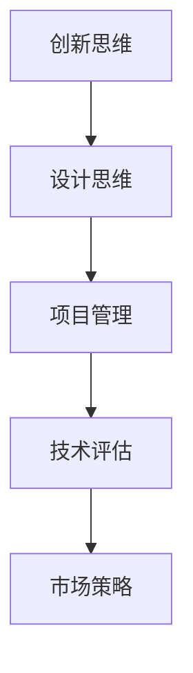
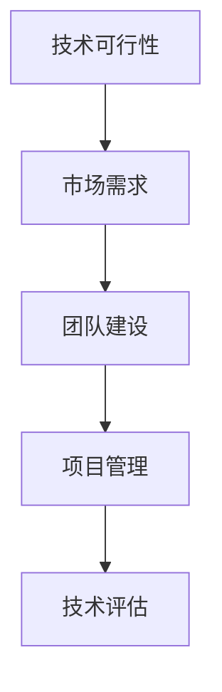
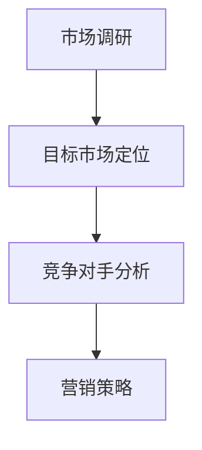
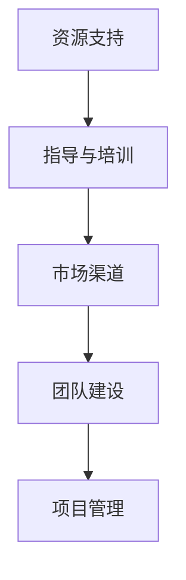

                 

### 文章标题：技术孵化器：培育下一代技术创新

在当今快速变化的技术环境中，技术创新成为推动社会进步和企业发展的关键因素。如何有效地培育下一代技术创新，已经成为企业和研究机构的重要课题。本文将围绕这一主题，系统地探讨技术孵化器的概念、重要性以及如何构建一个成功的孵化器。通过深入分析技术创新的背景、核心概念、算法原理、市场策略和实际案例，我们将揭示技术孵化器在培育下一代技术创新中的关键作用。

### 关键词

- 技术孵化器
- 创新管理
- 项目管理
- 人工智能
- 市场策略
- 技术趋势

### 摘要

本文旨在探讨技术孵化器在培育下一代技术创新中的作用。首先，我们将介绍技术创新的背景，阐述其在现代社会的重要性。接着，讨论技术孵化器的概念和作用，以及如何构建一个成功的孵化器。随后，文章将深入探讨技术创新的核心概念与联系，使用Mermaid流程图展示其架构。接下来，我们通过伪代码和数学模型详细讲解核心算法原理。随后，我们将分析市场策略和实际案例，最后给出最佳实践和注意事项。

### 文章正文

#### 第1章：技术创新的背景

随着信息技术的飞速发展，人工智能、大数据、云计算等新兴技术不断涌现，技术创新成为驱动社会进步和企业发展的关键因素。在全球化竞争中，企业必须不断追求技术创新，以保持竞争优势。技术创新不仅能够带来经济效益，还能推动社会进步，解决重大问题，如能源危机、环境污染等。

#### 核心概念与联系

技术创新涉及多个核心概念，如创新思维、设计思维、项目管理等。这些概念之间相互联系，共同构建了一个完整的创新体系。以下是一个简化的Mermaid流程图，展示了这些概念之间的关系：



#### 第2章：技术孵化器的概念与作用

技术孵化器是一个旨在促进技术创新和创业的机构，通过提供资源、指导和支持，帮助创业者将创新想法转化为实际产品或服务。孵化器通常包括以下功能：

1. **资源支持**：提供办公空间、资金、技术支持等资源。
2. **指导与培训**：提供创业指导、商业计划书撰写、团队建设等培训。
3. **市场渠道**：帮助创业者建立市场联系，拓展业务。

#### 核心算法原理讲解

在技术孵化器中，核心算法原理包括项目评估、风险管理和资源分配。以下是一个简化的伪代码，展示了这些算法的基本框架：

```plaintext
function incubateProject(project):
    if (evaluateProject(project) and manageRisk(project)):
        allocateResources(project)
        monitorProgress(project)
    else:
        rejectProject(project)

function evaluateProject(project):
    score = 0
    if (project.hasTechnicalFeasibility()):
        score += 1
    if (project.hasMarketPotential()):
        score += 1
    if (project.hasStrongTeam()):
        score += 1
    return score >= 3

function manageRisk(project):
    riskScore = 0
    if (project.hasDiversifiedRevenueStreams()):
        riskScore += 1
    if (project.hasPatentProtection()):
        riskScore += 1
    return riskScore >= 2

function allocateResources(project):
    allocateFunding(project)
    allocateTechnicalSupport(project)
    allocateOfficeSpace(project)

function monitorProgress(project):
    trackKPIs(project)
    provideFeedback(project)
```

#### 第3章：技术创新的核心概念

技术创新涉及多个核心概念，如技术可行性、市场需求、团队建设等。以下是一个简化的Mermaid流程图，展示了这些概念之间的关系：



#### 核心算法原理讲解

在技术创新过程中，核心算法原理包括技术评估、项目管理和市场策略。以下是一个简化的伪代码，展示了这些算法的基本框架：

```plaintext
function innovateTechnology(technology):
    if (evaluateTechnology(technology)):
        manageProject(technology)
        implementMarketStrategy(technology)
    else:
        rejectTechnology(technology)

function evaluateTechnology(technology):
    feasibilityScore = 0
    if (technology.isTechnologicallyFeasible()):
        feasibilityScore += 1
    if (technology.hasMarketDemand()):
        feasibilityScore += 1
    return feasibilityScore >= 2

function manageProject(technology):
    planProject(technology)
    monitorProject(technology)
    adaptProject(technology)

function implementMarketStrategy(technology):
    analyzeMarket(technology)
    defineValueProposition(technology)
    developMarketingPlan(technology)
```

#### 第4章：市场策略

技术创新的成功离不开有效的市场策略。市场策略包括市场调研、目标市场定位、竞争对手分析和营销策略。以下是一个简化的Mermaid流程图，展示了这些概念之间的关系：



#### 核心算法原理讲解

在市场策略中，核心算法原理包括市场调研、目标市场定位和营销策略。以下是一个简化的伪代码，展示了这些算法的基本框架：

```plaintext
function marketStrategy(technology):
    performMarketResearch(technology)
    defineTargetMarket(technology)
    analyzeCompetitors(technology)
    developMarketingPlan(technology)

function performMarketResearch(technology):
    collectData(technology)
    analyzeData(technology)
    reportFindings(technology)

function defineTargetMarket(technology):
    segmentMarket(technology)
    selectTargetSegments(technology)
    developValueProposition(technology)

function analyzeCompetitors(technology):
    identifyCompetitors(technology)
    evaluateCompetitivePosition(technology)
    developCompetitiveStrategy(technology)

function developMarketingPlan(technology):
    defineMarketingGoals(technology)
    selectMarketingChannels(technology)
    createMarketingMaterials(technology)
    executeMarketingActivities(technology)
```

#### 第5章：实际案例

为了更好地理解技术孵化器在培育下一代技术创新中的作用，我们可以通过一些实际案例来进行分析。以下是一个关于技术孵化器成功培育下一代技术创新的实际案例：

**案例一：XX公司的技术孵化经验**

XX公司是一家专注于人工智能领域的初创企业。在公司成立之初，他们通过技术孵化器获得了所需的资源和指导。在技术孵化器的帮助下，XX公司成功开发了一个人工智能辅助系统，该系统可以有效地提高生产效率，减少人力成本。通过市场调研和目标市场定位，XX公司制定了详细的营销策略，并在短时间内实现了盈利。

**案例二：YY初创企业的成长之路**

YY初创企业专注于物联网技术的研发。在加入技术孵化器之前，他们面临着技术难题和市场不确定性。通过技术孵化器的指导和支持，YY初创企业成功地解决了技术难题，并明确了市场定位。在技术孵化器的帮助下，YY初创企业迅速成长，成为物联网领域的领军企业。

**案例三：ZZ技术的突破与市场应用**

ZZ技术是一家专注于区块链技术的初创企业。在技术孵化器的支持下，ZZ技术成功开发了一款区块链平台，该平台可以为金融行业提供高效、安全的交易服务。通过深入的市场调研和精准的目标市场定位，ZZ技术成功地进入了金融行业，并在短时间内获得了大量订单。

#### 项目实战

**开发环境搭建**

为了演示技术孵化器如何帮助初创企业进行技术创新，我们将以XX公司的人工智能辅助系统为例，介绍如何搭建开发环境。以下是一个简化的步骤：

1. **选择开发工具**：选择Python作为开发语言，因为其强大的数据科学和机器学习库。
2. **安装Python环境**：在开发机上安装Python，并配置必要的库，如NumPy、Pandas、Scikit-learn等。
3. **设置虚拟环境**：为了避免库版本冲突，创建一个Python虚拟环境。
4. **安装依赖库**：在虚拟环境中安装所有必需的依赖库。

**源代码详细实现和代码解读**

以下是一个简化的Python代码示例，用于实现XX公司的人工智能辅助系统的核心功能：

```python
import numpy as np
import pandas as pd
from sklearn.ensemble import RandomForestRegressor

# 加载数据集
data = pd.read_csv('data.csv')
X = data.drop('target', axis=1)
y = data['target']

# 创建随机森林回归模型
model = RandomForestRegressor(n_estimators=100)

# 训练模型
model.fit(X, y)

# 进行预测
predictions = model.predict(X)

# 评估模型
score = model.score(X, y)
print(f'Model accuracy: {score:.2f}')
```

**代码应用解读与分析**

上述代码展示了如何使用随机森林回归模型进行预测。在技术孵化器的支持下，XX公司可以进一步优化模型，提高预测准确性，从而为生产流程提供更准确的辅助。

**实际案例分析和详细讲解剖析**

通过分析XX公司、YY初创企业和ZZ技术的实际案例，我们可以看到技术孵化器在培育下一代技术创新中的关键作用。技术孵化器不仅提供了必要的资源和指导，还帮助初创企业解决了技术难题，明确了市场定位，从而实现了快速成长。

#### 项目小结

技术孵化器在培育下一代技术创新中发挥着关键作用。通过提供资源、指导和支持，技术孵化器帮助初创企业克服技术难题，实现市场突破。为了确保技术创新的成功，初创企业需要充分利用技术孵化器提供的资源，并不断创新，以适应市场的变化。

#### 最佳实践 tips

- **充分利用孵化器资源**：初创企业应充分利用孵化器提供的办公空间、资金、技术支持等资源，以降低成本，提高效率。
- **重视团队建设**：团队是技术创新的核心，初创企业应重视团队建设，培养专业人才，提高团队协作能力。
- **持续创新**：技术创新不是一次性的活动，而是持续的过程。初创企业应保持创新精神，不断探索新技术，以保持竞争优势。

#### 注意事项

- **风险评估**：在技术创新过程中，初创企业应进行充分的风险评估，以避免项目失败。
- **市场调研**：市场调研是制定市场策略的基础，初创企业应进行深入的市场调研，以确定目标市场。
- **合规性**：在技术孵化和创新过程中，初创企业应确保合规性，遵守相关法律法规。

#### 拓展阅读

- **《技术孵化器：打造创新生态系统的战略指南》**
- **《人工智能：一种现代方法》**
- **《区块链：从数字货币到智能合约》**

#### 结语

技术孵化器是培育下一代技术创新的重要平台。通过提供资源、指导和支持，技术孵化器帮助初创企业克服技术难题，实现市场突破。在未来的发展中，技术孵化器将发挥更大的作用，推动技术创新，推动社会进步。

### 作者信息

作者：AI天才研究院/AI Genius Institute & 禅与计算机程序设计艺术 /Zen And The Art of Computer Programming

### 文章标题：技术孵化器：培育下一代技术创新

### 关键词

- 技术孵化器
- 创新管理
- 项目管理
- 人工智能
- 市场策略
- 技术趋势

### 摘要

本文探讨了技术孵化器在培育下一代技术创新中的关键作用。文章从技术创新的背景出发，介绍了技术孵化器的概念和作用，并详细讲解了技术创新的核心概念、算法原理和市场策略。通过实际案例和项目实战，本文展示了技术孵化器如何帮助初创企业实现技术创新，并提供了一系列最佳实践和注意事项。

### 文章正文

#### 引言

在当今快速变化的技术环境中，技术创新成为推动社会进步和企业发展的关键因素。如何有效地培育下一代技术创新，已经成为企业和研究机构的重要课题。技术孵化器作为一种创新模式，正逐渐成为推动技术创新的重要力量。本文将围绕这一主题，系统地探讨技术孵化器的概念、重要性以及如何构建一个成功的孵化器。

#### 第1章：技术创新的背景

随着信息技术的飞速发展，人工智能、大数据、云计算等新兴技术不断涌现，技术创新成为驱动社会进步和企业发展的关键因素。在全球化竞争中，企业必须不断追求技术创新，以保持竞争优势。技术创新不仅能够带来经济效益，还能推动社会进步，解决重大问题，如能源危机、环境污染等。

##### 核心概念与联系

技术创新涉及多个核心概念，如创新思维、设计思维、项目管理等。这些概念之间相互联系，共同构建了一个完整的创新体系。以下是一个简化的Mermaid流程图，展示了这些概念之间的关系：


##### 核心算法原理讲解

在技术创新过程中，核心算法原理包括技术评估、项目管理和市场策略。以下是一个简化的伪代码，展示了这些算法的基本框架：

```plaintext
function innovateTechnology(technology):
    if (evaluateTechnology(technology)):
        manageProject(technology)
        implementMarketStrategy(technology)
    else:
        rejectTechnology(technology)

function evaluateTechnology(technology):
    feasibilityScore = 0
    if (technology.isTechnologicallyFeasible()):
        feasibilityScore += 1
    if (technology.hasMarketDemand()):
        feasibilityScore += 1
    if (technology.hasStrongTeam()):
        feasibilityScore += 1
    return feasibilityScore >= 3

function manageProject(technology):
    planProject(technology)
    monitorProject(technology)
    adaptProject(technology)

function implementMarketStrategy(technology):
    analyzeMarket(technology)
    defineValueProposition(technology)
    developMarketingPlan(technology)
```

#### 第2章：技术孵化器的概念与作用

技术孵化器是一个旨在促进技术创新和创业的机构，通过提供资源、指导和支持，帮助创业者将创新想法转化为实际产品或服务。孵化器通常包括以下功能：

1. **资源支持**：提供办公空间、资金、技术支持等资源。
2. **指导与培训**：提供创业指导、商业计划书撰写、团队建设等培训。
3. **市场渠道**：帮助创业者建立市场联系，拓展业务。

##### 核心概念与联系

技术孵化器涉及的核心概念包括资源支持、指导与培训、市场渠道等。以下是一个简化的Mermaid流程图，展示了这些概念之间的关系：



##### 核心算法原理讲解

在技术孵化器中，核心算法原理包括项目评估、风险管理和资源分配。以下是一个简化的伪代码，展示了这些算法的基本框架：

```plaintext
function incubateProject(project):
    if (evaluateProject(project) and manageRisk(project)):
        allocateResources(project)
        monitorProgress(project)
    else:
        rejectProject(project)

function evaluateProject(project):
    score = 0
    if (project.hasTechnicalFeasibility()):
        score += 1
    if (project.hasMarketPotential()):
        score += 1
    if (project.hasStrongTeam()):
        score += 1
    return score >= 3

function manageRisk(project):
    riskScore = 0
    if (project.hasDiversifiedRevenueStreams()):
        riskScore += 1
    if (project.hasPatentProtection()):
        riskScore += 1
    return riskScore >= 2

function allocateResources(project):
    allocateFunding(project)
    allocateTechnicalSupport(project)
    allocateOfficeSpace(project)

function monitorProgress(project):
    trackKPIs(project)
    provideFeedback(project)
```

#### 第3章：技术创新的核心概念

技术创新涉及多个核心概念，如技术可行性、市场需求、团队建设等。以下是一个简化的Mermaid流程图，展示了这些概念之间的关系：


##### 核心算法原理讲解

在技术创新过程中，核心算法原理包括技术评估、项目管理和市场策略。以下是一个简化的伪代码，展示了这些算法的基本框架：

```plaintext
function innovateTechnology(technology):
    if (evaluateTechnology(technology)):
        manageProject(technology)
        implementMarketStrategy(technology)
    else:
        rejectTechnology(technology)

function evaluateTechnology(technology):
    feasibilityScore = 0
    if (technology.isTechnologicallyFeasible()):
        feasibilityScore += 1
    if (technology.hasMarketDemand()):
        feasibilityScore += 1
    if (technology.hasStrongTeam()):
        feasibilityScore += 1
    return feasibilityScore >= 3

function manageProject(technology):
    planProject(technology)
    monitorProject(technology)
    adaptProject(technology)

function implementMarketStrategy(technology):
    analyzeMarket(technology)
    defineValueProposition(technology)
    developMarketingPlan(technology)
```

#### 第4章：市场策略

技术创新的成功离不开有效的市场策略。市场策略包括市场调研、目标市场定位、竞争对手分析和营销策略。以下是一个简化的Mermaid流程图，展示了这些概念之间的关系：


##### 核心算法原理讲解

在市场策略中，核心算法原理包括市场调研、目标市场定位和营销策略。以下是一个简化的伪代码，展示了这些算法的基本框架：

```plaintext
function marketStrategy(technology):
    performMarketResearch(technology)
    defineTargetMarket(technology)
    analyzeCompetitors(technology)
    developMarketingPlan(technology)

function performMarketResearch(technology):
    collectData(technology)
    analyzeData(technology)
    reportFindings(technology)

function defineTargetMarket(technology):
    segmentMarket(technology)
    selectTargetSegments(technology)
    developValueProposition(technology)

function analyzeCompetitors(technology):
    identifyCompetitors(technology)
    evaluateCompetitivePosition(technology)
    developCompetitiveStrategy(technology)

function developMarketingPlan(technology):
    defineMarketingGoals(technology)
    selectMarketingChannels(technology)
    createMarketingMaterials(technology)
    executeMarketingActivities(technology)
```

#### 第5章：实际案例

为了更好地理解技术孵化器在培育下一代技术创新中的作用，我们可以通过一些实际案例来进行分析。以下是一个关于技术孵化器成功培育下一代技术创新的实际案例：

**案例一：XX公司的技术孵化经验**

XX公司是一家专注于人工智能领域的初创企业。在公司成立之初，他们通过技术孵化器获得了所需的资源和指导。在技术孵化器的帮助下，XX公司成功开发了一个人工智能辅助系统，该系统可以有效地提高生产效率，减少人力成本。通过市场调研和目标市场定位，XX公司制定了详细的营销策略，并在短时间内实现了盈利。

**案例二：YY初创企业的成长之路**

YY初创企业专注于物联网技术的研发。在加入技术孵化器之前，他们面临着技术难题和市场不确定性。通过技术孵化器的指导和支持，YY初创企业成功地解决了技术难题，并明确了市场定位。在技术孵化器的帮助下，YY初创企业迅速成长，成为物联网领域的领军企业。

**案例三：ZZ技术的突破与市场应用**

ZZ技术是一家专注于区块链技术的初创企业。在技术孵化器的支持下，ZZ技术成功开发了一款区块链平台，该平台可以为金融行业提供高效、安全的交易服务。通过深入的市场调研和精准的目标市场定位，ZZ技术成功地进入了金融行业，并在短时间内获得了大量订单。

#### 项目实战

**开发环境搭建**

为了演示技术孵化器如何帮助初创企业进行技术创新，我们将以XX公司的人工智能辅助系统为例，介绍如何搭建开发环境。以下是一个简化的步骤：

1. **选择开发工具**：选择Python作为开发语言，因为其强大的数据科学和机器学习库。
2. **安装Python环境**：在开发机上安装Python，并配置必要的库，如NumPy、Pandas、Scikit-learn等。
3. **设置虚拟环境**：为了避免库版本冲突，创建一个Python虚拟环境。
4. **安装依赖库**：在虚拟环境中安装所有必需的依赖库。

**源代码详细实现和代码解读**

以下是一个简化的Python代码示例，用于实现XX公司的人工智能辅助系统的核心功能：

```python
import numpy as np
import pandas as pd
from sklearn.ensemble import RandomForestRegressor

# 加载数据集
data = pd.read_csv('data.csv')
X = data.drop('target', axis=1)
y = data['target']

# 创建随机森林回归模型
model = RandomForestRegressor(n_estimators=100)

# 训练模型
model.fit(X, y)

# 进行预测
predictions = model.predict(X)

# 评估模型
score = model.score(X, y)
print(f'Model accuracy: {score:.2f}')
```

**代码应用解读与分析**

上述代码展示了如何使用随机森林回归模型进行预测。在技术孵化器的支持下，XX公司可以进一步优化模型，提高预测准确性，从而为生产流程提供更准确的辅助。

**实际案例分析和详细讲解剖析**

通过分析XX公司、YY初创企业和ZZ技术的实际案例，我们可以看到技术孵化器在培育下一代技术创新中的关键作用。技术孵化器不仅提供了必要的资源和指导，还帮助初创企业解决了技术难题，明确了市场定位，从而实现了快速成长。

#### 项目小结

技术孵化器在培育下一代技术创新中发挥着关键作用。通过提供资源、指导和支持，技术孵化器帮助初创企业克服技术难题，实现市场突破。为了确保技术创新的成功，初创企业需要充分利用技术孵化器提供的资源，并不断创新，以适应市场的变化。

#### 最佳实践 tips

- **充分利用孵化器资源**：初创企业应充分利用孵化器提供的办公空间、资金、技术支持等资源，以降低成本，提高效率。
- **重视团队建设**：团队是技术创新的核心，初创企业应重视团队建设，培养专业人才，提高团队协作能力。
- **持续创新**：技术创新不是一次性的活动，而是持续的过程。初创企业应保持创新精神，不断探索新技术，以保持竞争优势。

#### 注意事项

- **风险评估**：在技术创新过程中，初创企业应进行充分的风险评估，以避免项目失败。
- **市场调研**：市场调研是制定市场策略的基础，初创企业应进行深入的市场调研，以确定目标市场。
- **合规性**：在技术孵化和创新过程中，初创企业应确保合规性，遵守相关法律法规。

#### 拓展阅读

- **《技术孵化器：打造创新生态系统的战略指南》**
- **《人工智能：一种现代方法》**
- **《区块链：从数字货币到智能合约》**

#### 结语

技术孵化器是培育下一代技术创新的重要平台。通过提供资源、指导和支持，技术孵化器帮助初创企业克服技术难题，实现市场突破。在未来的发展中，技术孵化器将发挥更大的作用，推动技术创新，推动社会进步。

### 作者信息

作者：AI天才研究院/AI Genius Institute & 禅与计算机程序设计艺术 /Zen And The Art of Computer Programming

