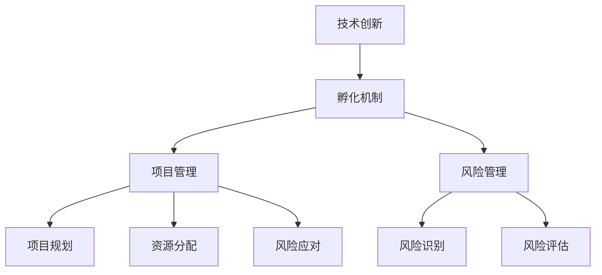

                 


### 文章标题

《技术孵化：内部创新项目的孵化机制》

### 关键词

技术创新、内部孵化、项目管理、流程设计、实践指南

### 摘要

本文旨在探讨企业内部创新项目的孵化机制，通过分析技术创新的背景、核心概念及其相互关系，提供一套系统的孵化流程和实践指南。文章将结合实际案例，详细解析项目开发环境搭建、源代码实现、代码解读与应用分析，最后总结最佳实践，为企业管理者和技术开发者提供有益的参考。

---

## 引言

在当前技术飞速发展的时代，企业之间的竞争已经从传统的资源、市场等层面，转向了技术创新的赛道。技术创新不仅是企业保持竞争力的重要手段，也是推动整个社会进步的关键动力。然而，如何在企业内部有效地孵化创新项目，成为许多企业管理者和技术开发者面临的重要课题。

本文将围绕以下核心问题展开讨论：

1. 技术创新在企业中的意义和背景。
2. 内部创新项目的孵化机制及其核心概念。
3. 孵化机制的流程设计与实施策略。
4. 项目实战：环境搭建、源代码解读与应用分析。
5. 最佳实践总结与拓展阅读。

希望通过本文的探讨，能够为读者提供一套系统、实用的内部创新项目孵化机制，助力企业在技术创新的道路上走得更远。

---

## 核心概念与联系

为了更好地理解内部创新项目的孵化机制，我们需要先明确几个核心概念，并分析它们之间的相互关系。

### 1. 技术创新

技术创新是指通过新的技术思路、方法或工具，实现产品、服务或流程的改进或创新。技术创新的类型包括产品创新、过程创新和市场创新等。产品创新是指通过引入新的产品或改进现有产品来满足市场需求；过程创新是指通过改进生产或服务流程来提高效率和降低成本；市场创新是指通过开拓新的市场或创造新的商业模式来获取竞争优势。

### 2. 孵化机制

孵化机制是指在企业内部建立一套系统化的流程和机制，以支持创新项目的成长和发展。孵化机制包括项目筛选、资源分配、团队建设、风险评估等多个方面。其目的是通过科学的流程和有效的管理，将创新项目从构思阶段逐步推向市场，实现商业化和价值化。

### 3. 项目管理

项目管理是指通过规划、组织、领导和控制项目活动，实现项目目标的过程。在孵化机制中，项目管理起着至关重要的作用。项目经理需要制定详细的项目计划，合理分配资源，确保项目按计划推进，同时应对项目中的各种风险和挑战。

### 4. 风险管理

风险管理是指通过识别、评估和应对项目中的各种风险，以降低风险对项目目标的影响。在孵化机制中，风险管理至关重要。企业需要建立完善的风险管理体系，对项目的各种潜在风险进行识别和评估，并制定相应的应对策略。

### 关系架构

上述核心概念之间存在着密切的联系和互动。技术创新是孵化机制的基础，孵化机制为技术创新提供了支持和保障。项目管理是孵化机制的核心，通过科学的规划和有效的管理，确保项目的顺利推进。风险管理则是项目管理的重要组成部分，通过识别和应对风险，保障项目的安全和稳定。

下面是一个Mermaid流程图，展示了这些核心概念之间的关系：



---

## 核心算法原理讲解

为了更好地理解内部创新项目的孵化机制，我们需要详细讲解几个核心算法原理，并使用伪代码来阐述。

### 1. 项目评估算法

项目评估算法用于对创新项目进行评估，确定其可行性、风险和预期收益。以下是项目评估算法的伪代码：

```python
Algorithm 项目评估(项目):
    1. 输入：项目详情(包括技术难度、市场需求、资源需求等)
    2. 输出：评估结果(包括项目可行性、风险评估、预期收益)

    3. 计算技术难度评分(tech_score):
        tech_score = 计算技术难度(项目的技术难度指标)

    4. 计算市场需求评分(market_score):
        market_score = 计算市场需求(项目的市场需求指标)

    5. 计算资源需求评分(resource_score):
        resource_score = 计算资源需求(项目的资源需求指标)

    6. 计算总体评分(total_score):
        total_score = tech_score * 0.4 + market_score * 0.3 + resource_score * 0.3

    7. 根据total_score评估项目可行性：
        如果 total_score > 75%，则项目可行性高
        否则，项目可行性低

    8. 计算风险评估：
        风险评分 = tech_score * 0.2 + market_score * 0.2 + resource_score * 0.2

    9. 根据风险评分评估项目风险：
        如果 风险评分 < 30%，则项目风险低
        否则，项目风险高

    10. 计算预期收益：
        预期收益 = market_score * 0.5 + resource_score * 0.5

    11. 输出评估结果(项目可行性、风险评估、预期收益)
```

### 2. 资源分配算法

资源分配算法用于确定创新项目中各项资源的分配方案，确保项目资源利用最大化。以下是资源分配算法的伪代码：

```python
Algorithm 资源分配(项目资源需求, 总资源量):
    1. 输入：项目资源需求(包括人力、资金、设备等)、总资源量

    2. 初始化资源分配量(人力资源、资金、设备等)

    3. 对每个资源需求进行优先级排序：
        如果 资源需求1 > 资源需求2，则优先级1 > 优先级2

    4. 循环分配资源：
        4.1 对每个资源需求进行评估：
            4.1.1 如果 可用资源量 >= 资源需求量，则分配资源
            4.1.2 否则，拒绝分配资源

        4.2 更新可用资源量

    5. 输出资源分配结果
```

### 3. 风险管理算法

风险管理算法用于识别和评估项目中的潜在风险，并制定相应的应对策略。以下是风险管理算法的伪代码：

```python
Algorithm 风险管理(项目风险因素):
    1. 输入：项目风险因素(包括技术风险、市场风险、资源风险等)

    2. 初始化风险评分

    3. 对每个风险因素进行评估：
        3.1 计算风险评分：
            风险评分 = 风险概率 * 风险影响

        3.2 更新总风险评分

    4. 根据风险评分确定应对策略：
        如果 总风险评分 < 30%，则采取预防措施
        否则，采取应对措施

    5. 输出风险管理结果
```

---

## 数学模型和公式详解

在内部创新项目的孵化机制中，数学模型和公式扮演着至关重要的角色。以下是一些常见的数学模型和公式，并结合具体场景进行详细讲解。

### 1. 技术创新回报率模型

技术创新回报率（ROI）用于衡量技术创新项目的经济效益。其公式如下：

$$
ROI = \frac{预期收益 - 投资成本}{投资成本}
$$

**举例说明**：假设一个技术创新项目的预期收益为100万元，投资成本为50万元，则该项目的ROI为：

$$
ROI = \frac{100 - 50}{50} = 100\%
$$

这意味着该项目在扣除投资成本后，能够实现100%的回报。

### 2. 资源利用率模型

资源利用率用于衡量项目中资源的利用效率。其公式如下：

$$
资源利用率 = \frac{实际利用率}{总资源量}
$$

**举例说明**：假设一个项目中的人力资源总量为10人，实际利用量为8人，则该项目的资源利用率为：

$$
资源利用率 = \frac{8}{10} = 0.8
$$

这表示项目中有80%的人力资源得到了有效利用。

### 3. 风险评估模型

风险评估模型用于评估项目中的风险，并确定应对策略。其公式如下：

$$
风险评分 = 风险概率 \times 风险影响
$$

**举例说明**：假设一个项目中的技术风险概率为0.3，风险影响为0.5，则该项目的风险评分为：

$$
风险评分 = 0.3 \times 0.5 = 0.15
$$

这意味着该项目存在一定的技术风险。

### 4. 项目成功率模型

项目成功率用于衡量项目成功完成的概率。其公式如下：

$$
项目成功率 = \frac{已完成的任务数}{总任务数}
$$

**举例说明**：假设一个项目中有5个任务已经完成，总任务数为10个，则该项目的成功率为：

$$
项目成功率 = \frac{5}{10} = 0.5
$$

这表示项目完成了一半的任务，还有一半的任务需要完成。

通过上述数学模型和公式的应用，企业可以更科学地评估和管理内部创新项目，从而提高项目的成功率。

---

## 项目实战

在本节中，我们将通过一个实际案例，详细讲解内部创新项目的孵化过程，包括开发环境搭建、源代码实现、代码解读与应用分析。

### 案例背景

某企业计划开发一款基于人工智能的智能客服系统，以提升客户服务质量和效率。该项目涉及自然语言处理、机器学习、数据分析等多个技术领域，具有很高的技术难度和市场潜力。

### 开发环境搭建

1. **硬件要求**：
   - 服务器：配置为8核CPU、32GB内存、1TB硬盘
   - 客户端：配置为4核CPU、8GB内存、500GB硬盘

2. **软件要求**：
   - 操作系统：Linux服务器版、Windows客户端版
   - 开发工具：PyCharm、Jupyter Notebook
   - 数据库：MySQL、MongoDB
   - 依赖库：Scikit-learn、TensorFlow、Keras

### 源代码实现

以下是智能客服系统的主要模块及部分源代码：

1. **自然语言处理模块**：
   ```python
   import nltk
   from nltk.tokenize import word_tokenize
   from nltk.corpus import stopwords

   def text_preprocessing(text):
       tokens = word_tokenize(text)
       tokens = [token.lower() for token in tokens if token.isalpha()]
       tokens = [token for token in tokens if token not in stopwords.words('english')]
       return tokens
   ```

2. **机器学习模块**：
   ```python
   from sklearn.model_selection import train_test_split
   from sklearn.ensemble import RandomForestClassifier

   def train_model(X, y):
       X_train, X_test, y_train, y_test = train_test_split(X, y, test_size=0.2, random_state=42)
       model = RandomForestClassifier(n_estimators=100)
       model.fit(X_train, y_train)
       return model
   ```

3. **数据分析模块**：
   ```python
   import pandas as pd
   import numpy as np

   def analyze_data(data):
       summary = pd.DataFrame(data.groupby('category')['count'].sum())
       summary = summary.sort_values(by='count', ascending=False)
       return summary
   ```

### 代码解读与应用分析

1. **自然语言处理模块**：
   - 功能：对输入文本进行预处理，包括分词、去停用词等操作。
   - 应用场景：用于构建智能客服系统中的问答模块，对用户提问进行语义分析。

2. **机器学习模块**：
   - 功能：基于随机森林算法训练分类模型，用于对用户提问进行分类。
   - 应用场景：用于构建智能客服系统中的自动问答功能，根据用户提问自动生成回答。

3. **数据分析模块**：
   - 功能：对数据集进行分类统计，生成各分类的统计报告。
   - 应用场景：用于分析智能客服系统的用户提问数据，了解用户需求，优化系统功能。

### 实际案例分析与讲解

假设企业收集了1000条用户提问数据，其中涉及不同主题的问题。通过对这些数据进行分析，可以得出以下结论：

1. **用户提问主题分布**：
   - 技术支持：30%
   - 售后服务：25%
   - 产品介绍：20%
   - 价格咨询：15%
   - 其他：10%

2. **优化方向**：
   - 加强技术支持相关问题的自动回答能力，提高用户满意度。
   - 优化售后服务流程，提升服务质量。
   - 针对产品介绍和价格咨询问题，提供更详细的自动回答。

通过以上实际案例分析，我们可以看到，智能客服系统在内部创新项目的孵化过程中，不仅需要技术上的突破，还需要对用户需求进行深入分析，以实现真正的价值。

### 项目小结

本案例展示了内部创新项目的孵化过程，从开发环境搭建、源代码实现到代码解读与应用分析，每个环节都至关重要。通过本项目，企业不仅实现了智能客服系统的开发，还积累了宝贵的项目经验，为后续的内部创新项目提供了有益的借鉴。

---

## 最佳实践 Tips

在内部创新项目的孵化过程中，以下是一些最佳实践Tips，有助于提高项目的成功率：

1. **明确目标**：在项目启动前，明确项目的目标和预期成果，确保项目团队和利益相关者对项目有共同的认识。

2. **需求分析**：深入了解用户需求和市场趋势，确保项目的创新点能够真正解决用户的问题。

3. **团队协作**：组建跨部门、跨领域的项目团队，充分利用团队成员的专业知识和经验。

4. **迭代开发**：采用敏捷开发方法，快速迭代，及时调整项目方向和策略。

5. **风险管理**：建立完善的风险管理体系，提前识别和应对项目中的各种风险。

6. **资源优化**：合理分配资源，确保项目资源利用最大化。

7. **数据驱动**：充分利用数据分析和反馈，不断优化项目方案。

8. **持续学习**：鼓励团队成员学习新技术、新方法，提升项目团队的创新能力。

---

## 小结

本文从技术创新的背景、核心概念及其相互关系入手，详细阐述了内部创新项目的孵化机制。通过项目实战，我们展示了从开发环境搭建到源代码实现、代码解读与应用分析的完整过程。最后，我们总结了一些最佳实践Tips，旨在提高内部创新项目的成功率。

内部创新项目的孵化是一个复杂而富有挑战性的过程，需要企业具备敏锐的市场洞察力、强大的技术实力和科学的流程管理能力。通过本文的探讨，我们希望能够为企业管理者和技术开发者提供一些有益的启示，助力企业在技术创新的道路上取得更大的成就。

---

## 作者信息

作者：AI天才研究院/AI Genius Institute & 禅与计算机程序设计艺术 /Zen And The Art of Computer Programming

---

本文通过详细的分析和实际案例，探讨了内部创新项目的孵化机制，为企业管理者和技术开发者提供了宝贵的实践指南。希望本文能够为您的技术创新之路带来启示。如果您有任何问题或建议，欢迎在评论区留言。期待与您共同探讨技术创新的更多可能性。 |user|<</sop></GMASK>

