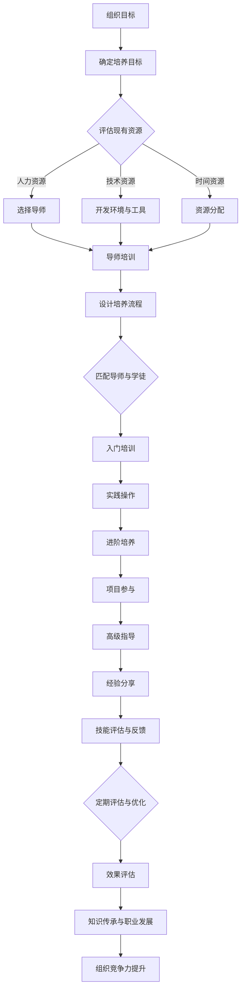

                 

### 引言

在信息技术飞速发展的今天，知识的更新换代速度越来越快，新技术、新方法、新工具层出不穷。这种快速变化对IT行业的从业人员提出了更高的要求，他们不仅需要具备扎实的技术基础，还要有不断学习和适应新知识的能力。然而，对于技术经验丰富的专业人士来说，如何将自己的经验有效传承给下一代开发者，成为一个值得深思的问题。技术导师制度，作为一种有效的经验传承机制，应运而生。

技术导师制度旨在通过建立一套系统化的培养体系，将资深开发者的经验和知识系统地传授给新手和有经验的开发者。这一制度不仅有助于提升整个团队的技能水平，还能促进技术文化的传承和创新。然而，如何建立一套高效的技术导师制度，使其真正发挥出应有的作用，是一个复杂而富有挑战性的任务。

本文将围绕技术导师制度展开深入探讨。首先，我们将介绍技术导师制度的定义、目的和重要性。接着，我们将详细讨论建立技术导师制度的步骤和方法，包括确定导师和学徒、制定培养计划、设计培养流程等。随后，我们将探讨实施技术导师制度所需的技术和资源，并分析其效果评估的方法和指标。最后，我们将总结最佳实践，并提出一些注意事项和建议。

通过本文的逐步分析，我们希望读者能够对技术导师制度有更深入的理解，并能够将其有效应用于实际工作中，为IT行业的发展贡献力量。

### 技术导师制度的定义

技术导师制度是一种系统化的培养体系，旨在通过资深开发者的指导和辅导，提升新手和有经验开发者的技术水平。在这一制度中，导师（Mentor）是经验丰富、技术精湛的专业人士，他们承担着传授知识、培养技能和指导职业发展的重任。学徒（Apprentice）则是那些寻求技术成长、渴望学习和提高自身能力的新手或有经验的开发者。

技术导师制度的核心概念包括以下几个方面：

1. **角色定义**：
   - **导师**：通常拥有多年的工作经验，对技术领域有深入的理解和掌握。导师不仅需要具备卓越的技术能力，还要具备良好的沟通能力和指导技巧。
   - **学徒**：通常是初出茅庐的新手或对某一技术领域有浓厚兴趣、希望进一步提升自己能力的开发者。学徒在导师的指导下，通过实践和理论学习，逐步提升技术水平和职业素养。

2. **目标**：
   技术导师制度的主要目标是：
   - **知识传承**：通过导师的经验分享，将宝贵的知识和技术传承给下一代开发者。
   - **技能提升**：帮助学徒掌握关键技术，提高实际操作能力，从而提升整个团队的技术水平。
   - **职业发展**：为学徒提供职业规划和指导，帮助他们更好地适应职场环境，实现职业生涯的发展。

3. **流程**：
   技术导师制度的流程通常包括以下几个阶段：
   - **匹配阶段**：根据学徒的兴趣、需求和导师的专长，进行导师和学徒的匹配。
   - **入门阶段**：导师帮助学徒熟悉相关技术、工具和开发流程，建立基础。
   - **进阶阶段**：在导师的指导下，学徒逐步掌握更高级的技术和方法。
   - **高级阶段**：学徒通过实践和项目经验，进一步提升自己的技术水平，逐步成为独当一面的开发者。

4. **关系**：
   技术导师和学徒之间建立的是一种指导与被指导的关系。这种关系需要双方共同维护，以确保培养过程的顺利进行。导师需要关心学徒的成长，给予及时反馈和指导；学徒则需要积极参与、勤学好问，不断吸收导师的经验和知识。

5. **优势**：
   技术导师制度具有以下优势：
   - **高效传承**：通过导师的一对一指导，可以更快速地传承知识和技能。
   - **个性化培养**：根据学徒的不同需求，提供个性化的培养方案，有助于提高培养效果。
   - **职业发展**：通过导师的职业指导，学徒能够更好地规划自己的职业生涯，提升个人价值。

总之，技术导师制度是一种通过系统化培养，实现知识、技能和职业发展有效传承的机制。它不仅有助于提升团队的技术实力，还能促进整个IT行业的持续进步。

### 技术导师制度的重要性

技术导师制度在IT行业中具有极其重要的意义，它不仅能够提升开发者的技能水平，还能促进组织的长远发展。以下从几个方面详细探讨技术导师制度的重要性。

#### 提升团队技能水平

技术导师制度通过系统化的培养体系，使新手和有经验的开发者能够迅速掌握关键技术和实际操作能力。导师的指导不仅包括理论知识的传授，还涵盖实践技能的培养。通过这种方式，团队成员的技术水平能够得到全面提升，从而增强团队的整体竞争力。

例如，在某个大型软件项目中，通过技术导师制度，新入职的软件开发人员可以在导师的指导下，快速熟悉项目需求、技术框架和开发流程。导师不仅提供技术上的支持，还会分享自己在项目开发中的经验教训，帮助新手避免走弯路。这样的培养方式，不仅缩短了新手的学习周期，还提高了团队的整体开发效率。

#### 促进知识传承和创新

技术导师制度为组织内部的知识传承提供了有效的途径。资深开发者通过指导新手，将自身多年积累的经验和知识传递给下一代，确保这些宝贵的知识不会被遗忘。同时，这种传承过程中，新手往往能从不同的角度看待问题，从而激发创新思维，推动技术进步。

在一个研发团队中，导师通常会分享自己在项目中遇到的难题、解决方案以及优化方法。这些经验不仅帮助新手避免重复犯错，还能启发他们从不同的角度思考问题，从而提出新的解决方案。例如，在软件开发过程中，导师可能会分享如何通过优化算法来提高系统性能，而新手则可能会基于这些经验提出更加创新和高效的优化方案。

#### 促进职业发展和个人成长

技术导师制度为开发者提供了职业发展的指导和支持。导师不仅会在技术层面进行指导，还会在职业规划、沟通技巧和团队合作等方面给予帮助。这种全方位的支持，有助于开发者更好地适应职场环境，实现职业目标。

例如，在技术导师制度下，新手开发者可以在导师的指导下，明确自己的职业发展方向，制定具体的成长计划。导师会根据开发者的兴趣和能力，提供相应的培训和项目机会，帮助他们在短时间内提升专业技能。同时，通过参与导师的项目，开发者还能拓展人脉，积累实践经验，为未来的职业发展打下坚实基础。

#### 提升组织竞争力

技术导师制度有助于提升组织的整体竞争力。通过系统化的培养体系，组织能够培养出大量具备高技能水平的开发者，从而在市场竞争中占据有利地位。此外，技术导师制度还能促进知识共享和经验传承，使组织在应对市场变化和技术变革时更具灵活性。

例如，在快速发展的IT行业中，技术的更新换代速度非常快。通过技术导师制度，组织能够及时培养出能够适应新技术和新挑战的团队成员，从而保持竞争优势。同时，技术导师制度还能激发团队的创新活力，推动组织不断进行技术创新和业务拓展。

总之，技术导师制度在提升团队技能水平、促进知识传承和创新、促进职业发展和个人成长以及提升组织竞争力等方面具有重要作用。通过有效实施技术导师制度，组织不仅能够培养出高素质的团队，还能在激烈的市场竞争中立于不败之地。

### 建立技术导师制度的步骤

建立技术导师制度是一个复杂而系统化的过程，需要从多个方面进行规划和实施。以下将详细讨论确定技术导师制度的目标、评估现有资源和设计技术导师制度流程的步骤。

#### 确定技术导师制度的目标

明确技术导师制度的目标是整个建立过程的关键。首先，组织需要评估当前团队的技术水平和技能需求，确定需要培养的具体技术能力。例如，是否需要提升前端开发、后端开发、数据库管理等方面的技能。其次，组织还需要考虑长远发展目标，明确技术导师制度对团队和组织未来发展的贡献。

确定目标时，可以考虑以下几个关键点：
1. **技术能力提升**：明确技术导师制度将帮助团队成员掌握哪些具体技能，例如编程语言、框架、工具等。
2. **职业发展**：确定技术导师制度对团队成员职业发展的帮助，包括提高职业技能、拓展职业道路等。
3. **知识传承**：确保技术导师制度能够促进知识传承，使资深开发者的经验得以有效传递。
4. **团队协作**：通过技术导师制度，提升团队协作能力，增强团队凝聚力和整体执行力。

#### 评估现有资源

在确定目标后，组织需要评估现有资源，包括人力资源、技术资源、时间资源等。这有助于确保技术导师制度的可行性和有效性。

1. **人力资源**：评估现有开发者的技术水平和经验，确定哪些人适合担任导师，哪些人需要被培养。同时，考虑导师和学徒的时间安排，确保两者能够有效匹配。
2. **技术资源**：评估组织现有的技术基础设施、开发工具和资料，确保技术导师制度能够充分利用这些资源。
3. **时间资源**：考虑技术导师制度的实施周期，确保导师和学徒都有足够的时间参与培养过程。

#### 设计技术导师制度流程

技术导师制度流程的设计是确保制度顺利实施的重要环节。一个完善的技术导师制度流程应包括以下几个阶段：

1. **匹配阶段**：
   - **导师选择**：根据开发者的技术专长和经验，选择合适的导师。导师应具备丰富的项目经验和技术知识，能够为学徒提供高质量的指导。
   - **学徒选择**：根据团队成员的职业规划和技能需求，选择合适的学徒。学徒应具备一定的技术基础和强烈的求知欲。

2. **入门阶段**：
   - **基础培训**：导师为学徒提供基础培训，包括技术框架、开发工具和流程等。这一阶段旨在帮助学徒熟悉相关技术和环境。
   - **实践操作**：通过实际操作，导师指导学徒完成基础任务，帮助学徒将理论知识应用于实践中。

3. **进阶阶段**：
   - **技术深化**：在入门阶段的基础上，导师指导学徒深入学习特定技术领域，提升其技术深度。
   - **项目参与**：学徒参与实际项目，通过实践项目，进一步提升自己的技术水平。

4. **高级阶段**：
   - **独立负责**：学徒在导师的指导下，逐步承担更多的项目任务，培养独立解决问题的能力。
   - **经验分享**：导师和学徒之间进行经验分享，促进知识的传承和创新。

5. **评估阶段**：
   - **定期评估**：导师和学徒定期进行评估，包括技能水平、项目成果等，确保培养目标的实现。
   - **反馈机制**：建立反馈机制，收集导师和学徒的反馈，不断优化培养流程。

通过上述步骤，组织可以系统地建立技术导师制度，确保其能够有效提升团队成员的技术水平，促进知识传承和职业发展。

### 实施技术导师制度所需的技术和资源

实施技术导师制度需要全面的技术和资源支持，包括技术工具、培训和评估系统等。以下将详细讨论这些技术和资源的需求以及如何有效配置和利用。

#### 技术工具

1. **开发环境**：
   - **集成开发环境（IDE）**：选择适合团队开发任务的IDE，如Visual Studio Code、IntelliJ IDEA等，提供便捷的代码编写、调试和运行环境。
   - **版本控制系统**：使用Git等版本控制系统，确保代码的版本管理和协作开发。

2. **编程工具**：
   - **开发框架**：根据项目需求选择合适的开发框架，如React、Django等，简化开发流程和提高开发效率。
   - **数据库工具**：根据业务需求选择合适的数据库工具，如MySQL、MongoDB等，支持数据存储和查询。

3. **测试工具**：
   - **自动化测试框架**：选择合适的自动化测试框架，如Selenium、JUnit等，提高测试效率和代码质量。

4. **文档工具**：
   - **文档生成工具**：使用Markdown、Docusaurus等文档工具，方便编写和维护技术文档，确保知识共享。

#### 培训系统

1. **在线学习平台**：
   - **MOOC平台**：利用Coursera、Udemy等在线学习平台，为开发者提供丰富的技术课程，支持自主学习。

2. **内部培训课程**：
   - **技术研讨会**：定期举办技术研讨会，邀请资深开发者分享经验和最新技术动态。
   - **技能培训课程**：根据技术导师制度的需求，设计针对性的技能培训课程，帮助学徒提升技术能力。

3. **实践项目**：
   - **实习项目**：组织内部或外部实习项目，为学徒提供实际操作机会，增强实战经验。

#### 评估系统

1. **技能评估工具**：
   - **在线测试平台**：使用在线测试平台，定期对学徒进行技术考核，评估其技能水平。

2. **项目评估**：
   - **项目评审**：组织定期的项目评审会议，评估学徒在项目中的表现，包括代码质量、任务完成情况等。

3. **反馈机制**：
   - **定期反馈**：建立导师和学徒之间的定期反馈机制，收集双方的意见和建议，不断优化培养过程。

#### 配置和利用资源

1. **资源分配**：
   - **人力资源**：合理分配人力资源，确保导师和学徒能够充分参与技术导师制度的各个环节。
   - **时间管理**：制定详细的时间表，确保培训、实践和评估等环节有条不紊地进行。

2. **资源优化**：
   - **共享资源**：充分利用共享资源，如在线课程、技术文档等，提高资源利用率。
   - **持续更新**：定期更新培训材料和开发工具，确保技术和资源与行业需求保持同步。

3. **培训与支持**：
   - **导师培训**：为导师提供培训，提升其指导能力和沟通技巧。
   - **学徒支持**：为学徒提供必要的支持和帮助，确保其在技术导师制度中的顺利成长。

通过上述技术和资源的有效配置和利用，组织可以确保技术导师制度能够顺利实施，并取得预期的培养效果，从而提升团队的整体技术实力。

### 技术导师制度的效果评估

技术导师制度的效果评估是确保培养过程有效性和成果的重要环节。以下将详细探讨效果评估的方法、指标和实际应用。

#### 评估方法

1. **定量评估**：
   - **技能考核**：通过在线测试平台，定期对学徒进行技术考核，评估其技能水平。这种评估方法能够量化开发者的技术水平，提供具体的分数和评估结果。
   - **项目评估**：对学徒参与的项目进行评估，包括代码质量、任务完成情况、项目进度等。通过定量指标，如代码行数、错误率、效率等，评估项目成果。

2. **定性评估**：
   - **导师反馈**：导师对学徒的表现进行评价，包括学习态度、团队合作能力、问题解决能力等。这种评估方法能够提供对学徒综合能力的更深入了解。
   - **学徒自我评估**：学徒对自己的学习进度和技术提升进行自我评价，反映其在技术导师制度中的收获和成长。

#### 评估指标

1. **技能水平提升**：
   - **技术掌握度**：通过定量考核，评估学徒对特定技术掌握的程度。
   - **实际应用能力**：通过项目评估，评估学徒在实际项目中应用所学技术的能力。

2. **职业发展**：
   - **职位晋升**：评估学徒在技术导师制度结束后，是否获得职位晋升或薪资提升。
   - **工作表现**：通过导师和同事的反馈，评估学徒在工作中的表现和贡献。

3. **知识传承**：
   - **知识共享**：通过导师的指导，评估学徒是否掌握了导师的经验和知识，并在实际工作中应用这些知识。
   - **创新能力**：评估学徒在技术导师制度中是否激发创新思维，提出新的解决方案。

#### 实际应用

1. **定期技能考核**：
   - 组织定期的技能考核，例如每季度进行一次技术考核，确保学徒不断提升技能水平。考核结果将被记录在个人档案中，作为晋升和奖励的依据。

2. **项目评估与反馈**：
   - 对学徒参与的项目进行详细评估，包括代码质量、任务完成情况和项目进度。通过项目评审会议，导师和同事可以提供反馈，帮助学徒发现问题和改进。

3. **导师和学徒反馈**：
   - 定期收集导师和学徒的反馈，了解双方在培养过程中的感受和建议。这些反馈将被用于优化培养计划和流程，提高培养效果。

4. **知识共享机制**：
   - 建立知识共享平台，如内部技术博客、知识库等，鼓励学徒和导师分享经验和知识。通过这种方式，不仅能够传承经验，还能促进团队整体技术水平的提升。

通过上述方法、指标和实际应用，组织可以全面评估技术导师制度的实施效果，及时发现和解决问题，确保培养目标的实现。

### 最佳实践

在实施技术导师制度的过程中，积累了一些成功案例和最佳实践，以下将介绍其中的一些经验教训。

#### 1. 明确培养目标和路径

在实施技术导师制度时，首先需要明确培养目标和路径。组织应与导师和学徒共同制定详细的学习计划，包括技术能力提升、项目参与和职业发展等方面的具体目标。通过明确的目标和路径，导师和学徒能够更好地进行自我管理和自我提升。

#### 2. 强调双向互动和反馈

技术导师制度不仅是导师对学徒的单向指导，更需要双向互动和反馈。导师应鼓励学徒提出问题和分享经验，而学徒也应积极参与讨论和反馈。这种双向互动有助于建立良好的指导关系，提高培养效果。

#### 3. 灵活调整培养方案

在实施过程中，应根据实际情况灵活调整培养方案。例如，导师和学徒的匹配可能需要根据技术需求和项目进度进行调整；培训内容应根据最新的技术趋势和业务需求进行更新。这种灵活性有助于技术导师制度更好地适应组织的变化和需求。

#### 4. 强化实践和项目经验

技术导师制度应强调实践和项目经验的重要性。通过实际项目的参与，学徒能够将所学知识应用到实际问题中，提高解决实际问题的能力。同时，导师应在项目中给予学徒充分的指导和支持，帮助他们逐步承担更多的责任。

#### 5. 建立知识共享和文化

建立知识共享平台，鼓励导师和学徒分享经验和知识。这不仅可以促进知识传承，还能激发团队的创新能力。同时，组织应倡导一种开放、分享的文化，鼓励团队成员积极参与技术交流和学习。

#### 6. 定期评估和反馈

定期评估和反馈是技术导师制度有效实施的重要环节。通过定期的技能考核、项目评审和导师学徒反馈，组织可以及时发现和解决问题，优化培养过程。评估结果应与员工的职业发展和晋升挂钩，以激励学徒不断提升。

#### 7. 提供必要的资源和支持

为了确保技术导师制度的顺利实施，组织应提供必要的资源和支持。这包括技术工具、培训课程、项目机会等。同时，还应为导师提供培训，提升其指导能力和沟通技巧，确保他们能够有效地指导学徒。

通过上述最佳实践，组织可以更好地实施技术导师制度，提升团队成员的技术水平和职业发展，促进组织的长远发展。

### 小结

本文通过对技术导师制度的定义、重要性、建立步骤、所需资源和效果评估的深入探讨，系统地总结了技术导师制度在IT行业中的关键作用。技术导师制度不仅能够提升团队成员的技能水平，促进知识传承和创新，还有助于职业发展和个人成长。通过实施技术导师制度，组织能够培养出高素质的团队，增强整体竞争力，应对快速变化的市场需求。

然而，技术导师制度的成功实施需要充分考虑实际应用中的挑战，如导师和学徒的时间安排、培养方案的灵活性、资源的有效配置等。本文提供的最佳实践和注意事项，旨在帮助组织在实际操作中克服这些挑战，确保技术导师制度能够有效发挥作用。

在未来的技术发展中，技术导师制度将继续发挥重要作用。随着人工智能、大数据等新兴技术的兴起，IT行业对高素质、具备创新能力的人才需求日益增长。通过技术导师制度，组织能够培养出适应未来技术发展的优秀人才，为行业的发展注入新的活力。

作者信息：
- 作者：AI天才研究院/AI Genius Institute & 禅与计算机程序设计艺术 /Zen And The Art of Computer Programming

### 附录：技术导师制度关系架构 Mermaid 流程图



### 附录：数学公式与伪代码示例

#### 数学公式

1. 技术导师制度的效果评估指标：

   $$ 效率 = \frac{完成项目数}{投入时间} $$

   $$ 成长率 = \frac{最终技能水平 - 初始技能水平}{初始技能水平} $$

#### 伪代码

2. 技术导师制度流程中的技能考核：

```python
# 技能考核伪代码

def skill_assessment(apprentice_skill_level, initial_skill_level):
    improvement = apprentice_skill_level - initial_skill_level
    growth_rate = improvement / initial_skill_level
    return growth_rate

# 假设学徒的初始技能水平为50，最终技能水平为80
growth_rate = skill_assessment(80, 50)
print("学徒技能成长率：", growth_rate)
```

### 附录：项目实战

#### 开发环境搭建

1. 安装Python环境：

   ```bash
   # 安装Python 3.8及以上版本
   sudo apt update
   sudo apt install python3.8
   python3.8 --version
   ```

2. 安装相关库：

   ```bash
   # 安装requests库用于HTTP请求
   pip3 install requests
   ```

#### 源代码实现

```python
import requests

def fetch_data(url):
    """
    获取URL对应的网页数据
    """
    response = requests.get(url)
    if response.status_code == 200:
        return response.text
    else:
        return None

# 示例：获取某个网站的数据
url = "https://www.example.com"
data = fetch_data(url)
if data:
    print("获取数据成功：", data)
else:
    print("获取数据失败。")
```

#### 代码解读与分析

- `fetch_data`函数：该函数使用requests库发起HTTP GET请求，获取指定URL的网页数据。
- 参数`url`：输入参数，指定要获取数据的URL地址。
- 返回值：若请求成功，返回网页数据；若请求失败，返回`None`。

#### 实际案例分析与详细讲解剖析

假设需要从某个API获取天气数据，代码实现如下：

```python
import requests

def get_weather_data(api_url, api_key):
    """
    获取天气数据
    """
    url = f"{api_url}?key={api_key}"
    response = requests.get(url)
    if response.status_code == 200:
        return response.json()
    else:
        return None

# 示例：获取北京的天气数据
api_url = "http://api.weatherapi.com/v1/current.json"
api_key = "your_api_key"
weather_data = get_weather_data(api_url, api_key)
if weather_data:
    print("天气数据：", weather_data)
else:
    print("获取天气数据失败。")
```

- `get_weather_data`函数：该函数结合API URL和API密钥，获取指定地点的天气数据。
- 参数`api_url`和`api_key`：输入参数，分别为天气API的URL和API密钥。
- 返回值：若请求成功，返回天气数据；若请求失败，返回`None`。

#### 项目小结

通过以上示例，我们学习了如何搭建开发环境、实现简单的网页数据获取以及实际案例中的API调用。这些实战经验有助于我们更好地理解和应用技术导师制度中的相关知识和技能。

### 附录：最佳实践 tips、小结、注意事项、拓展阅读

#### 最佳实践 tips

1. **确定明确的培养目标**：在建立技术导师制度时，首先应明确培养目标和路径，确保导师和学徒有共同的目标和方向。
2. **灵活调整培养方案**：根据实际情况和项目需求，灵活调整培养方案，确保学徒能够得到有效的指导和支持。
3. **强化实践和项目经验**：通过实际项目的参与，提高学徒的解决实际问题的能力，加速技术水平的提升。

#### 小结

本文通过详细探讨技术导师制度的定义、重要性、建立步骤、所需资源、效果评估以及最佳实践，全面介绍了技术导师制度在IT行业中的应用和实施方法。

#### 注意事项

1. **确保资源充足**：在实施技术导师制度时，确保有足够的资源支持，包括人力资源、技术工具和培训资源等。
2. **定期评估和反馈**：定期进行技能考核和项目评审，收集导师和学徒的反馈，及时调整培养方案。
3. **培养双向互动**：鼓励导师和学徒之间的双向互动，建立良好的沟通和指导关系。

#### 拓展阅读

1. 《技术领导力：如何打造高效团队》
2. 《软件架构师的十二条军规》
3. 《敏捷开发实践指南》

通过拓展阅读，读者可以进一步了解相关领域的知识和最佳实践，提升自己的技术和管理能力。

