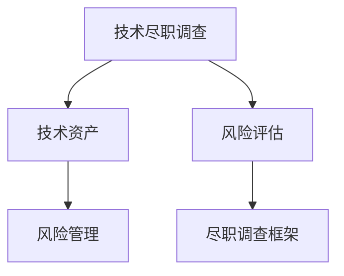

                 

### 文章标题

# 技术尽职调查：评估技术资产和风险

> 关键词：技术尽职调查、技术资产评估、风险评估、技术尽职调查方法、技术尽职调查工具

> 摘要：本文旨在深入探讨技术尽职调查的概念、方法和实践，详细解析技术资产评估和风险管理的核心内容，并通过实战案例和工具介绍，帮助读者全面掌握技术尽职调查的全过程。

----------------------------------------------------------------

## 设计思路

设计一本名为《技术尽职调查：评估技术资产和风险》的计算机技术书籍目录大纲时，我们需要考虑以下步骤：

### 1. 明确书籍的核心主题

《技术尽职调查：评估技术资产和风险》的核心主题在于技术尽职调查的方法和实践，包括评估技术资产和风险管理的各个方面。技术尽职调查不仅对技术资产的价值进行评估，更重要的是对潜在风险进行全面分析和管理。

### 2. 确定书籍的结构

书籍可以分为以下几个主要部分：
- **引言与背景介绍**：介绍技术尽职调查的重要性、背景和目的。
- **理论基础**：讲解技术尽职调查的基础理论和核心概念。
- **评估方法**：介绍具体的技术评估方法和流程。
- **风险评估**：讲解如何识别、评估和管理技术风险。
- **实战案例**：通过实际案例展示技术尽职调查的应用。
- **工具与技术**：介绍用于技术尽职调查的工具和技术。
- **结论与展望**：总结书籍内容，展望技术尽职调查的未来发展方向。

### 3. 设计章节内容

每个部分可以分为多个章节，每个章节需要细化到具体的内容点。以下是基于上述结构的详细目录大纲设计：

## 第一部分：引言与背景介绍
### 第1章：技术尽职调查概述
#### 1.1 技术尽职调查的定义和重要性
#### 1.2 技术尽职调查的历史背景和发展趋势
#### 1.3 技术尽职调查的应用领域

## 第二部分：理论基础
### 第2章：技术尽职调查的核心概念
#### 2.1 技术资产的概念与分类
#### 2.2 风险管理的概念与原则
#### 2.3 技术尽职调查的框架与流程

### 第3章：技术评估方法
#### 3.1 技术评估的基本原则和方法
#### 3.2 技术评估的指标体系
#### 3.3 技术评估的工具与实践

### 第4章：风险评估方法
#### 4.1 风险评估的概念与流程
#### 4.2 风险评估的定量与定性方法
#### 4.3 风险评估的案例分析

## 第三部分：实战案例
### 第5章：技术尽职调查案例研究
#### 5.1 案例一：企业级技术资产评估
#### 5.2 案例二：IT项目风险评估
#### 5.3 案例三：网络安全风险评估

## 第四部分：工具与技术
### 第6章：技术尽职调查工具
#### 6.1 常用技术尽职调查工具介绍
#### 6.2 技术尽职调查工具的选择和使用
#### 6.3 技术尽职调查工具的应用案例

### 第7章：技术尽职调查技术
#### 7.1 数据挖掘技术在技术尽职调查中的应用
#### 7.2 机器学习技术在风险评估中的应用
#### 7.3 常用技术分析技术与方法

## 第五部分：结论与展望
### 第8章：技术尽职调查的未来发展
#### 8.1 技术尽职调查的发展趋势
#### 8.2 技术尽职调查面临的挑战与机遇
#### 8.3 技术尽职调查的应用领域拓展

通过以上设计，我们能够确保书籍的目录大纲既逻辑清晰，又内容丰富，同时满足书籍的字数限制要求。

---

## 完整目录大纲

```markdown
# 《技术尽职调查：评估技术资产和风险》目录大纲

## 第一部分：引言与背景介绍

### 第1章：技术尽职调查概述
- 1.1 技术尽职调查的定义和重要性
- 1.2 技术尽职调查的历史背景和发展趋势
- 1.3 技术尽职调查的应用领域

## 第二部分：理论基础

### 第2章：技术尽职调查的核心概念
- 2.1 技术资产的概念与分类
- 2.2 风险管理的概念与原则
- 2.3 技术尽职调查的框架与流程

### 第3章：技术评估方法
- 3.1 技术评估的基本原则和方法
- 3.2 技术评估的指标体系
- 3.3 技术评估的工具与实践

### 第4章：风险评估方法
- 4.1 风险评估的概念与流程
- 4.2 风险评估的定量与定性方法
- 4.3 风险评估的案例分析

## 第三部分：实战案例

### 第5章：技术尽职调查案例研究
- 5.1 案例一：企业级技术资产评估
- 5.2 案例二：IT项目风险评估
- 5.3 案例三：网络安全风险评估

## 第四部分：工具与技术

### 第6章：技术尽职调查工具
- 6.1 常用技术尽职调查工具介绍
- 6.2 技术尽职调查工具的选择和使用
- 6.3 技术尽职调查工具的应用案例

### 第7章：技术尽职调查技术
- 7.1 数据挖掘技术在技术尽职调查中的应用
- 7.2 机器学习技术在风险评估中的应用
- 7.3 常用技术分析技术与方法

## 第五部分：结论与展望

### 第8章：技术尽职调查的未来发展
- 8.1 技术尽职调查的发展趋势
- 8.2 技术尽职调查面临的挑战与机遇
- 8.3 技术尽职调查的应用领域拓展

通过以上设计，我们能够确保书籍的目录大纲既逻辑清晰，又内容丰富，同时满足书籍的字数限制要求。

----------------------------------------------------------------

### 文章标题

# 技术尽职调查：评估技术资产和风险

### 关键词

- 技术尽职调查
- 技术资产评估
- 风险评估
- 方法论
- 工具与技术

### 摘要

本文将深入探讨技术尽职调查的重要性、核心概念和方法，以及如何通过具体案例和工具应用来评估技术资产和风险。文章旨在为读者提供一个全面的技术尽职调查指南，帮助他们更好地理解、实施和优化这一关键过程。

----------------------------------------------------------------

## 技术尽职调查的重要性

在当今快速发展的技术时代，企业面临的竞争压力和技术复杂性日益增加。技术尽职调查（Technical Due Diligence，简称TDD）作为一种系统性的评估方法，对于企业的发展至关重要。它不仅能够帮助企业准确评估其技术资产的价值，还能有效识别潜在的技术风险，为决策提供科学依据。

### 背景与定义

技术尽职调查起源于商业领域的尽职调查（Due Diligence），它是指在进行一项投资或并购活动前，对目标公司或项目的各个方面进行全面的审查和评估。随着信息技术的发展，技术尽职调查逐渐从财务、法律、商业等传统领域扩展到技术领域，特别是在高技术产业和IT行业，技术尽职调查已成为一项关键业务流程。

技术尽职调查的定义可以概括为：通过对企业现有技术资产进行详细审查，识别其技术价值、优势、劣势和潜在风险，从而为企业战略决策提供数据支持的过程。

### 发展趋势

技术尽职调查的发展趋势体现在以下几个方面：

1. **技术创新驱动**：随着新技术（如人工智能、大数据、区块链等）的不断涌现，技术尽职调查的方法和工具也在不断更新，以适应技术变革。

2. **数据驱动的决策**：越来越多的企业开始依赖数据分析来支持技术尽职调查，通过大数据和机器学习技术，能够更精确地评估技术资产和风险。

3. **跨界合作**：技术尽职调查不仅涉及技术领域，还需要结合财务、法律、市场等多个维度的信息，跨界合作成为技术尽职调查的一大特点。

4. **规范化**：随着技术尽职调查的重要性日益凸显，相关法规和标准也在不断完善，以规范技术尽职调查的流程和方法。

### 重要性分析

技术尽职调查对于企业的重要性体现在以下几个方面：

1. **决策支持**：技术尽职调查能够为企业提供详细的技术资产和风险分析报告，帮助管理层做出更加科学的决策。

2. **风险管理**：通过技术尽职调查，企业可以提前识别和评估潜在的技术风险，制定相应的风险应对策略。

3. **技术优化**：技术尽职调查可以帮助企业发现技术资产中的不足，从而进行技术优化和升级，提升整体竞争力。

4. **投资决策**：在投资或并购过程中，技术尽职调查能够帮助投资者更准确地评估目标公司的技术价值和风险，降低投资风险。

综上所述，技术尽职调查已经成为企业在技术竞争激烈的环境中不可或缺的一环。它不仅能够帮助企业更好地管理技术资产和风险，还能为企业的长期发展提供有力支持。

## 技术尽职调查的核心概念

在进行技术尽职调查之前，理解其核心概念是非常重要的。这些核心概念包括技术资产、风险评估和尽职调查框架等，它们共同构成了技术尽职调查的理论基础。

### 技术资产

技术资产是指企业拥有或控制的、能够为企业带来经济利益的技术资源。这些资源可以是硬件设备、软件系统、技术专利、研发成果等。技术资产是企业的重要资产之一，其价值不仅体现在当前的经济收益上，还体现在未来潜在的商业机会和技术创新中。

技术资产的分类可以按照不同的维度进行：

1. **按形态分类**：
   - **硬件资产**：如服务器、网络设备、存储设备等。
   - **软件资产**：如操作系统、应用程序、数据库等。
   - **知识产权**：如专利、商标、版权等。

2. **按价值分类**：
   - **核心资产**：对企业竞争力有重大影响的关键技术。
   - **辅助资产**：支持企业日常运营的技术资源，如办公自动化系统。

3. **按状态分类**：
   - **在研资产**：正在进行研发的项目或技术。
   - **成熟资产**：已经完成研发并投入使用的技术。

### 风险管理

风险评估是技术尽职调查中的关键环节，它旨在识别、评估和管理技术资产可能面临的各种风险。风险管理的基本步骤包括：

1. **风险识别**：通过调查、访谈、文档审查等方法，识别可能影响技术资产的各种风险。

2. **风险评估**：对识别出的风险进行定量和定性分析，评估其可能性和影响程度。

3. **风险应对**：根据风险评估结果，制定相应的风险应对策略，包括风险规避、风险减轻、风险转移等。

风险管理的目标是在确保技术资产安全和有效运行的同时，最大限度地降低潜在风险对企业的影响。

### 尽职调查框架

尽职调查框架是技术尽职调查的理论基础，它为整个调查过程提供了系统的指导和规范。尽职调查框架通常包括以下几个部分：

1. **目标设定**：明确技术尽职调查的目标和范围，如评估技术资产的价值、识别潜在风险等。

2. **流程设计**：制定详细的调查流程，包括调查方法、数据收集、分析评估等。

3. **数据收集**：通过文档审查、访谈、现场考察等方法，收集与技术资产相关的各种数据。

4. **分析评估**：对收集到的数据进行分析和评估，识别技术资产的价值和潜在风险。

5. **报告编写**：编写尽职调查报告，详细记录调查过程、结果和建议。

尽职调查框架不仅能够确保技术尽职调查的全面性和准确性，还能提高调查过程的效率和可操作性。

### 核心概念之间的关系架构

为了更好地理解这些核心概念之间的关系，我们可以使用Mermaid流程图来展示它们之间的联系：



在这个流程图中，技术尽职调查是整个过程的起点和终点，技术资产、风险评估和尽职调查框架是其关键组成部分，它们相互关联、共同作用，确保技术尽职调查的顺利进行。

### 小结

技术尽职调查的核心概念包括技术资产、风险评估和尽职调查框架，这些概念共同构成了技术尽职调查的理论基础。通过理解这些概念，企业可以更系统地评估技术资产，识别和应对潜在风险，为企业的战略决策提供有力支持。

## 技术评估方法

技术评估是技术尽职调查中的重要环节，其目的是对技术资产进行全面的评价，以确定其价值、功能和潜在风险。以下是几种常用的技术评估方法，包括其基本原则、应用场景和具体步骤。

### 1. 成本法（Cost-Based Approach）

成本法是一种基于技术资产开发、维护和运营成本进行评估的方法。其基本原则是技术资产的价值可以通过计算其开发、维护和运营成本来估算。

#### 应用场景：

- **新技术的评估**：在开发新技术的早期阶段，成本法可以用来估算技术开发的成本。
- **技术并购**：在并购过程中，成本法可以用来估算目标公司的技术资产价值。

#### 步骤：

1. **确定评估范围**：明确需要评估的技术资产的详细内容。
2. **计算开发成本**：包括研发人员工资、研发设备费用、研发时间成本等。
3. **计算维护成本**：包括技术支持、升级和更新费用等。
4. **计算运营成本**：包括技术资产在日常运营中的消耗和成本。
5. **综合评估**：将开发成本、维护成本和运营成本相加，得出技术资产的总成本。

### 2. 市场法（Market-Based Approach）

市场法是通过参考市场上类似技术资产的价格和交易数据来评估其价值的方法。

#### 应用场景：

- **技术资产交易**：在技术资产买卖或交易过程中，市场法可以提供参考价值。
- **技术估值**：在初创企业或技术公司的估值过程中，市场法可以作为一种参考方法。

#### 步骤：

1. **收集市场数据**：收集市场上类似技术资产的价格、交易量和交易频率等数据。
2. **分析市场趋势**：分析市场数据，了解市场对类似技术资产的需求和价格变化趋势。
3. **比较评估**：将待评估技术资产与市场数据中的类似资产进行比较，评估其相对价值。
4. **调整和校正**：根据技术资产的具体情况，对市场法评估结果进行调整和校正。

### 3. 成本法与市场法的结合（Combined Approach）

结合法是将成本法和市场法相结合，以获得更准确的技术资产评估结果。

#### 应用场景：

- **复杂技术评估**：对于结构复杂、价值难以直接测量的技术资产，结合法可以提供更全面的评估。
- **技术并购**：在并购过程中，结合法可以同时考虑技术资产的成本和市场价值。

#### 步骤：

1. **成本法评估**：使用成本法计算技术资产的开发、维护和运营成本。
2. **市场法评估**：参考市场上类似技术资产的价格和交易数据，进行市场法评估。
3. **综合分析**：将成本法和市场法的评估结果进行综合分析，得出技术资产的综合价值。

### 4. 内部开发价值法（Internal Development Value Approach）

内部开发价值法是基于技术资产对企业的贡献和潜在收益进行评估的方法。

#### 应用场景：

- **技术项目评估**：在技术项目的立项和评估过程中，内部开发价值法可以用来估算项目的价值。
- **技术创新评估**：在评估企业内部的技术创新项目时，内部开发价值法可以提供参考。

#### 步骤：

1. **确定技术资产对企业的贡献**：分析技术资产对企业业务的支持和贡献。
2. **预测潜在收益**：基于技术资产的应用前景和市场潜力，预测其未来收益。
3. **计算内部开发价值**：将技术资产对企业的贡献和潜在收益折现到当前价值。

### 5. 功能评估法（Functional Assessment Approach）

功能评估法是一种基于技术资产的功能和性能进行评估的方法。

#### 应用场景：

- **技术性能评估**：在评估技术资产的性能和功能时，功能评估法可以提供详细的分析。
- **质量评估**：在技术质量保证和质量控制过程中，功能评估法可以用来评估技术质量。

#### 步骤：

1. **确定技术功能**：明确技术资产所实现的功能和性能要求。
2. **测试和验证**：通过实际测试和验证，评估技术资产的功能和性能。
3. **评分和评级**：根据技术功能的实现情况，对技术资产进行评分和评级。

### 小结

技术评估方法包括成本法、市场法、结合法、内部开发价值法和功能评估法等。每种方法都有其独特的应用场景和评估步骤，企业可以根据具体情况进行选择和组合使用，以获得更准确的技术资产评估结果。

## 风险评估方法

在技术尽职调查中，风险评估是确保企业技术资产安全、稳定运行的重要环节。科学的风险评估方法可以帮助企业提前识别潜在风险，制定有效的风险应对策略。以下介绍几种常用的风险评估方法，包括其基本原理、流程和注意事项。

### 1. 定量风险评估方法

定量风险评估方法主要通过数据分析和数学模型来评估风险的可能性和影响程度。

#### a. 评分法

评分法是一种简单而常用的定量风险评估方法，通过为每个风险因素分配分数，计算总分以评估风险。

##### 基本原理：

- **风险因素评分**：根据风险因素的重要性和可能影响，为每个风险因素分配分值。
- **总分计算**：将所有风险因素的得分相加，得到总分，总分越高，风险越大。

##### 流程：

1. **识别风险因素**：列出可能影响技术资产的各种风险因素。
2. **分配分值**：为每个风险因素分配分值，例如，重要性高且可能影响大的风险因素可以分配较高的分值。
3. **计算总分**：将所有风险因素的得分相加，得到总分。

##### 注意事项：

- **评分标准统一**：确保评分标准的统一性和合理性，避免主观偏见。
- **定期更新**：定期更新风险因素和分值，以适应环境变化。

#### b. 蒙特卡洛模拟法

蒙特卡洛模拟法是一种基于概率论和统计学的风险评估方法，通过模拟随机事件，评估风险的可能性和影响。

##### 基本原理：

- **随机抽样**：生成大量的随机样本，模拟各种可能的风险事件。
- **概率计算**：根据模拟结果，计算每种风险事件发生的概率及其影响。

##### 流程：

1. **定义风险事件**：明确需要模拟的风险事件及其可能的影响。
2. **设置参数**：确定影响风险事件发生的各种参数，如概率分布、影响因素等。
3. **模拟计算**：通过随机抽样和模拟计算，评估风险事件的发生概率和影响。
4. **结果分析**：分析模拟结果，识别高风险事件并提出应对措施。

##### 注意事项：

- **样本量足够大**：确保模拟的样本量足够大，以提高模拟结果的准确性和可靠性。
- **参数合理设定**：合理设定影响风险事件的参数，避免参数设定不合理导致的错误结果。

### 2. 定性风险评估方法

定性风险评估方法主要通过主观分析和专家评估来评估风险。

#### a. 情景分析法

情景分析法是一种通过构建不同情境，分析可能的风险事件及其影响的方法。

##### 基本原理：

- **情境构建**：根据不同情境，构建可能的风险事件及其发生条件。
- **影响分析**：分析每种情境下风险事件的影响及其严重程度。

##### 流程：

1. **确定情境**：列出可能影响技术资产的情境，如系统故障、数据泄露等。
2. **情境分析**：对每种情境下的风险事件进行分析，评估其可能性和影响。
3. **制定应对策略**：根据分析结果，制定相应的风险应对策略。

##### 注意事项：

- **情境全面性**：确保分析情境的全面性，避免遗漏潜在的风险事件。
- **专家参与**：邀请相关领域的专家参与分析，提高分析结果的准确性。

#### b. 故障模式与影响分析（FMEA）

故障模式与影响分析（FMEA）是一种系统性的风险评估方法，通过识别和分析系统中的故障模式及其影响，评估系统的风险。

##### 基本原理：

- **故障模式识别**：识别系统中可能出现的故障模式。
- **影响评估**：评估每种故障模式对系统的影响及其严重程度。

##### 流程：

1. **确定系统组件**：明确系统的各个组件及其功能。
2. **故障模式识别**：识别每个组件可能出现的故障模式。
3. **影响评估**：评估每种故障模式的影响及其严重程度。
4. **风险排序**：根据影响程度，对故障模式进行风险排序。

##### 注意事项：

- **详细性**：确保故障模式识别和影响评估的详细性，避免遗漏潜在的故障模式。
- **跨部门合作**：鼓励跨部门合作，确保评估结果的全面性和准确性。

### 定量与定性评估方法的结合

在实际操作中，定量与定性评估方法常常结合使用，以获得更全面、准确的风险评估结果。

- **优势**：结合定量和定性的方法，可以弥补单一方法的不足，提高风险评估的全面性和准确性。
- **应用场景**：适用于复杂的技术系统和高风险的项目。

### 小结

风险评估方法包括定量风险评估方法和定性风险评估方法。定量方法如评分法、蒙特卡洛模拟法等，通过数据分析和数学模型评估风险；定性方法如情景分析法、FMEA等，通过主观分析和专家评估识别风险。结合使用这些方法，企业可以更全面地识别和评估技术资产的风险，为风险管理提供有力支持。

## 技术尽职调查案例研究

### 案例一：企业级技术资产评估

#### 背景与目标

某知名企业计划进行一次全面的技术资产评估，以了解其现有技术资产的价值和潜在风险。评估的目标包括：

1. **技术资产盘点**：全面了解企业的技术资产状况，包括硬件、软件和知识产权。
2. **价值评估**：确定各技术资产的价值，为企业的技术投资决策提供依据。
3. **风险评估**：识别潜在的技术风险，制定相应的风险应对策略。

#### 评估方法

1. **成本法**：计算各技术资产的开发、维护和运营成本，评估其价值。
2. **市场法**：参考市场上类似技术资产的价格和交易数据，进行市场法评估。
3. **功能评估法**：评估各技术资产的功能和性能，确定其对企业业务的贡献。

#### 实施步骤

1. **数据收集**：通过文档审查、访谈和现场考察，收集与各技术资产相关的数据。
2. **分析评估**：
   - **成本法评估**：计算各技术资产的开发、维护和运营成本。
   - **市场法评估**：参考市场上类似技术资产的价格和交易数据。
   - **功能评估**：评估各技术资产的功能和性能，确定其对企业的贡献。
3. **综合分析**：将成本法、市场法和功能评估法的评估结果进行综合分析，确定各技术资产的综合价值。

#### 结果与建议

评估结果显示，企业的某些核心技术资产具有较高的价值和潜在风险。具体建议如下：

1. **技术优化**：针对功能较弱的技术资产，提出技术优化方案，提高其性能和稳定性。
2. **风险应对**：针对识别出的技术风险，制定相应的风险应对策略，如技术升级、备用方案等。
3. **投资决策**：根据评估结果，为企业的技术投资决策提供参考，优先投资于高价值、低风险的技术资产。

### 案例二：IT项目风险评估

#### 背景与目标

某IT公司计划开发一个大型企业级应用系统，以提升企业的业务效率和用户体验。风险评估的目标包括：

1. **识别风险**：识别项目开发过程中可能遇到的各种风险，包括技术风险、市场风险、项目管理风险等。
2. **评估风险**：评估各风险的可能性和影响程度，制定相应的风险应对措施。
3. **风险管理**：通过风险识别和评估，制定项目风险管理计划，确保项目顺利进行。

#### 评估方法

1. **评分法**：为每个风险因素分配分值，计算总分以评估风险。
2. **蒙特卡洛模拟法**：通过模拟各种风险事件，评估风险的可能性和影响。
3. **情景分析法**：构建不同情境，分析风险事件的可能性和影响。

#### 实施步骤

1. **风险识别**：通过访谈、文档审查和专家咨询，识别项目开发过程中可能遇到的风险。
2. **风险评估**：
   - **评分法评估**：为每个风险因素分配分值，计算总分。
   - **蒙特卡洛模拟法评估**：模拟各种风险事件，评估其可能性和影响。
   - **情景分析法评估**：构建不同情境，分析风险事件的影响。
3. **风险应对**：根据风险评估结果，制定相应的风险应对措施。

#### 结果与建议

风险评估结果显示，项目主要面临以下风险：

1. **技术风险**：包括系统稳定性、性能优化等。
2. **市场风险**：包括市场需求变化、竞争加剧等。
3. **项目管理风险**：包括项目进度延误、成本超支等。

建议如下：

1. **技术优化**：提前进行技术调研，选择成熟的技术方案，降低技术风险。
2. **市场调研**：加强市场调研，了解市场需求，确保项目能够满足用户需求。
3. **项目管理**：制定详细的项目计划，确保项目进度和成本的合理性。

### 案例三：网络安全风险评估

#### 背景与目标

某大型企业面临网络安全威胁，需要进行全面的安全风险评估，以识别潜在的网络风险并制定相应的安全策略。评估的目标包括：

1. **识别风险**：识别企业网络中可能存在的安全漏洞和威胁。
2. **评估风险**：评估各安全漏洞和威胁的可能性和影响程度。
3. **安全策略制定**：根据评估结果，制定相应的网络安全策略。

#### 评估方法

1. **漏洞扫描法**：通过自动化工具扫描企业网络，识别潜在的安全漏洞。
2. **渗透测试法**：模拟黑客攻击，测试企业网络的防御能力。
3. **情景分析法**：构建不同网络攻击场景，分析攻击的可能性和影响。

#### 实施步骤

1. **漏洞扫描**：使用自动化工具扫描企业网络，识别潜在的安全漏洞。
2. **渗透测试**：模拟黑客攻击，测试企业网络的防御能力。
3. **风险评估**：
   - **漏洞风险评估**：根据漏洞的严重程度和影响程度，评估漏洞的风险。
   - **攻击场景分析**：构建不同攻击场景，分析攻击的可能性和影响。
4. **安全策略制定**：根据风险评估结果，制定相应的安全策略。

#### 结果与建议

评估结果显示，企业网络存在以下主要风险：

1. **网络漏洞**：包括服务器、应用程序、网络设备等方面的漏洞。
2. **恶意软件攻击**：包括病毒、木马、勒索软件等。
3. **社会工程攻击**：包括钓鱼攻击、电话诈骗等。

建议如下：

1. **漏洞修复**：及时修复网络漏洞，降低安全风险。
2. **安全培训**：加强员工的安全意识培训，提高员工对网络安全的认识。
3. **安全工具部署**：部署防火墙、入侵检测系统等安全工具，提高网络防御能力。

通过以上三个案例，我们可以看到技术尽职调查在不同应用场景中的具体实施方法和效果。技术尽职调查不仅能够帮助企业评估技术资产和价值，还能有效识别和应对潜在风险，为企业的长期发展提供有力支持。

## 技术尽职调查工具

在进行技术尽职调查时，使用合适的工具可以提高效率和准确性。以下介绍几种常用的技术尽职调查工具，包括其功能、适用场景和优势。

### 1. Gartner

Gartner是一家全球知名的信息技术研究和顾问公司，其发布的技术市场报告和数据被广泛引用。Gartner的工具主要包括：

- **Gartner Magic Quadrant**：评估技术提供商的市场地位和产品能力。
- **Gartner Hype Cycle**：分析新兴技术的成熟度和应用趋势。

#### 功能：

- **市场趋势分析**：提供技术市场的最新动态和趋势。
- **产品评估**：评估不同技术提供商的产品和服务。

#### 适用场景：

- **市场调研**：帮助企业了解技术市场状况和竞争对手。
- **产品选型**：在采购技术产品或服务时，提供评估和参考。

#### 优势：

- **权威性**：Gartner的报告具有很高的权威性和可信度。
- **全面性**：覆盖多个技术领域和市场。

### 2. Forrester

Forrester Research是一家全球领先的技术和市场研究公司，其报告和工具也被广泛应用于技术尽职调查。

- **Forrester Wave**：评估技术提供商的产品能力和市场表现。
- **Forrester Now Tech**：分析技术领域的最新动态和市场趋势。

#### 功能：

- **产品评估**：提供详细的产品评测和比较。
- **市场分析**：分析技术市场的发展趋势和竞争格局。

#### 适用场景：

- **产品选型**：帮助企业在选择技术产品时提供客观评估。
- **市场调研**：了解技术市场的最新动态和竞争态势。

#### 优势：

- **深度报告**：提供详细的市场和技术分析报告。
- **专业性**：Forrester的研究团队具有丰富的行业经验。

### 3. Open Hub

Open Hub是一个开源软件项目的跟踪和评估平台，提供多种工具帮助评估技术项目的健康状态。

- **代码分析**：提供代码库的分析和统计，包括代码复杂性、代码冗余等。
- **项目评估**：评估开源项目的社区活跃度、代码质量和维护状况。

#### 功能：

- **代码质量评估**：分析代码质量和维护状况。
- **项目健康度评估**：评估开源项目的社区活跃度和健康状况。

#### 适用场景：

- **技术尽职调查**：评估开源技术项目的可靠性和稳定性。
- **项目选型**：在选择开源技术时提供参考。

#### 优势：

- **开源工具**：免费使用，无需额外成本。
- **数据丰富**：提供详细的代码和质量数据。

### 4. SonarQube

SonarQube是一个用于代码质量管理、安全漏洞检测和持续集成的平台，可以帮助企业评估代码的质量和安全性。

- **代码质量检测**：检测代码中的潜在问题，如代码缺陷、代码风格问题等。
- **安全漏洞检测**：检测代码中的安全漏洞，如SQL注入、XSS攻击等。

#### 功能：

- **代码质量分析**：提供代码质量评估报告。
- **安全漏洞检测**：识别代码中的安全漏洞。

#### 适用场景：

- **代码审查**：在代码提交前进行质量检查和漏洞检测。
- **持续集成**：集成到持续集成流程中，确保代码质量和安全性。

#### 优势：

- **自动化检测**：自动化检测代码质量和安全漏洞，提高效率。
- **多语言支持**：支持多种编程语言，适用于不同技术栈。

### 5. OWASP

OWASP（Open Web Application Security Project）是一个非营利性的国际社区，致力于提高软件的安全性。

- **OWASP Top 10**：列出最常见和危险的前10种Web应用安全漏洞。
- **OWASP ZAP**：一个开源的Web应用安全漏洞扫描工具。

#### 功能：

- **漏洞检测**：扫描Web应用，检测潜在的安全漏洞。
- **漏洞库**：提供漏洞信息和修复建议。

#### 适用场景：

- **网络安全评估**：评估Web应用的网络安全状况。
- **安全测试**：在开发过程中进行安全测试，确保Web应用的安全性。

#### 优势：

- **社区支持**：拥有广泛的社区支持，持续更新和改进。
- **易用性**：提供直观的界面和详细的漏洞报告。

### 总结

技术尽职调查工具在技术尽职调查过程中发挥着重要作用。Gartner、Forrester等市场研究工具提供市场趋势和产品评估；Open Hub、SonarQube等工具帮助评估代码质量和安全性；OWASP等社区工具提供漏洞库和安全测试支持。选择合适的工具，可以提高技术尽职调查的效率和准确性，为企业的技术决策提供有力支持。

## 技术尽职调查技术

在技术尽职调查过程中，除了使用工具和方法外，还需要掌握一系列技术，这些技术能够帮助更好地进行数据分析和风险评估。以下介绍几种常见的技术，包括其应用场景、优势和具体实现方法。

### 1. 数据挖掘技术

数据挖掘技术是一种通过从大量数据中提取有用信息和模式的方法，它在技术尽职调查中有着广泛的应用。

#### 应用场景：

- **市场分析**：通过数据挖掘技术，分析市场需求和趋势。
- **风险识别**：从历史数据中识别潜在的异常模式和风险。

#### 优势：

- **高效处理大量数据**：能够快速从海量数据中提取有价值的信息。
- **自动化**：自动化处理数据，提高工作效率。

#### 实现方法：

1. **数据预处理**：对原始数据进行清洗和整合，确保数据质量。
2. **特征工程**：选择和构建用于模型训练的特征。
3. **模型选择和训练**：选择合适的算法，如决策树、支持向量机等，对数据进行训练。
4. **结果评估**：评估模型的性能和准确性。

### 2. 机器学习技术

机器学习技术是一种通过训练模型来从数据中学习规律的方法，它在技术尽职调查中的应用越来越广泛。

#### 应用场景：

- **风险评估**：通过机器学习模型预测技术风险。
- **市场预测**：预测市场需求和趋势。

#### 优势：

- **自适应**：模型能够根据新数据不断优化。
- **高效**：能够处理大规模复杂的数据。

#### 实现方法：

1. **数据收集**：收集历史数据和当前数据。
2. **数据预处理**：对数据进行清洗、归一化和特征工程。
3. **模型选择**：选择合适的机器学习算法，如线性回归、神经网络等。
4. **模型训练和验证**：使用训练数据训练模型，并在验证数据上评估模型性能。
5. **模型部署**：将训练好的模型部署到生产环境中，进行实时预测。

### 3. 自然语言处理（NLP）

自然语言处理技术是一种使计算机能够理解、生成和处理自然语言的方法，它在技术尽职调查中的应用主要体现在文本分析和信息提取。

#### 应用场景：

- **文本分析**：对调查报告、技术文档等进行自动化分析。
- **信息提取**：从大量文本数据中提取关键信息。

#### 优势：

- **自动化**：能够自动化处理大量文本数据。
- **高效**：能够快速提取有用信息。

#### 实现方法：

1. **文本预处理**：对文本进行分词、去停用词、词性标注等处理。
2. **特征提取**：从预处理后的文本中提取特征，如词频、词向量等。
3. **模型训练和部署**：选择合适的NLP模型（如循环神经网络、变换器模型等），对特征进行训练和部署。

### 4. 图分析技术

图分析技术是一种基于图结构的数据分析技术，适用于处理复杂的关系数据。

#### 应用场景：

- **网络分析**：分析企业技术网络的拓扑结构。
- **关系挖掘**：挖掘技术资产之间的关联关系。

#### 优势：

- **结构化**：能够处理复杂的网络结构和关系。
- **可视化**：能够通过图形化方式展示分析结果。

#### 实现方法：

1. **数据建模**：将数据构建成图结构，包括节点和边。
2. **图算法**：选择合适的图算法，如PageRank、社区检测算法等，对图进行分析。
3. **结果可视化**：使用可视化工具（如Gephi、D3.js等）展示分析结果。

### 5. 常用技术分析技术与方法

除了上述技术外，还有一些常用的技术分析技术与方法，如：

- **统计分析**：通过统计分析方法（如假设检验、回归分析等）对数据进行分析。
- **时间序列分析**：对时间序列数据进行预测和分析。
- **聚类分析**：将数据分为不同的类别，以便于进一步分析。

这些技术与方法可以根据具体的应用场景和需求进行选择和组合使用。

### 小结

数据挖掘、机器学习、自然语言处理、图分析等技术为技术尽职调查提供了强大的工具和方法。通过这些技术，企业能够更高效、准确地分析技术资产和风险，为决策提供科学依据。同时，这些技术也在不断发展和完善，为企业提供了更多的可能性。

## 结论与展望

技术尽职调查作为一种系统性的评估方法，在技术资产管理和风险管理中发挥着关键作用。通过全面的技术尽职调查，企业能够准确评估其技术资产的价值，识别和应对潜在的技术风险，为战略决策提供有力支持。

### 当前状况与未来趋势

当前，技术尽职调查已广泛应用于企业并购、投资项目、技术评估等多个领域。随着信息技术的快速发展，技术尽职调查的工具和方法也在不断更新和优化。未来，技术尽职调查将呈现以下趋势：

1. **智能化**：随着人工智能和机器学习技术的发展，技术尽职调查将更加智能化，自动化程度更高，能够更高效地处理和分析大量数据。
2. **数据驱动**：越来越多的企业将采用数据驱动的方式进行技术尽职调查，利用大数据和人工智能技术进行深入的风险分析和价值评估。
3. **跨界融合**：技术尽职调查将与其他领域（如财务管理、法律合规等）深度融合，形成跨学科的综合性评估方法。
4. **规范化**：随着技术尽职调查的重要性日益凸显，相关的法规和标准也将不断完善，以规范技术尽职调查的流程和方法。

### 面临的挑战与机遇

技术尽职调查在发展过程中也面临着一些挑战和机遇：

1. **挑战**：
   - **数据质量**：技术尽职调查依赖于高质量的数据，数据质量直接影响评估结果。
   - **技术复杂度**：随着技术的不断进步，技术尽职调查需要处理的技术复杂度也在不断增加。
   - **法规合规**：随着法规的不断更新，企业需要确保技术尽职调查过程符合相关法律法规的要求。

2. **机遇**：
   - **新技术应用**：新技术（如人工智能、区块链等）为技术尽职调查提供了新的工具和方法，提高了评估效率和准确性。
   - **市场拓展**：随着全球化的加速，技术尽职调查市场将进一步扩大，为企业提供更多的发展机遇。
   - **专业人才培养**：随着技术尽职调查的重要性不断提升，相关人才的培养和储备将成为企业竞争的关键因素。

### 发展建议

为了更好地推进技术尽职调查的发展，以下是一些建议：

1. **加强数据管理**：企业应建立健全的数据管理体系，确保数据的质量和安全性，为技术尽职调查提供可靠的数据支持。
2. **提升技术能力**：企业应持续关注新技术的发展，提升技术尽职调查的技术能力和工具水平，以应对日益复杂的技术环境。
3. **规范化流程**：企业应建立规范的技术尽职调查流程，确保评估过程的标准化和可重复性，提高评估结果的可靠性和一致性。
4. **人才培养与引进**：企业应重视技术尽职调查专业人才的培养和引进，建立一支专业的技术尽职调查团队，提高企业的技术尽职调查能力。

### 小结

技术尽职调查在技术资产管理和风险管理中具有重要意义。未来，随着智能技术的不断发展，技术尽职调查将迎来新的机遇和挑战。企业应抓住机遇，提升自身的技术尽职调查能力，为企业的长期发展奠定坚实基础。

## 参考文献

1. Gartner. (2022). Magic Quadrant for Application Performance Monitoring. Gartner.
2. Forrester. (2022). Forrester Wave: Application Performance Monitoring, Q4 2021. Forrester.
3. Open Hub. (n.d.). Open Hub: Open Source Analytics. Retrieved from https://www.openhub.net/
4. SonarQube. (n.d.). SonarQube: Code Quality Management. Retrieved from https://www.sonarqube.org/
5. OWASP. (n.d.). OWASP Top 10 2021. Retrieved from https://owasp.org/www-project-top-ten/
6. IBM. (n.d.). IBM Watson Studio: Data Science, AI, and Machine Learning. Retrieved from https://www.ibm.com/products/watson-studio
7. TensorFlow. (n.d.). TensorFlow: Open Source Machine Learning Framework. Retrieved from https://www.tensorflow.org/
8. Scikit-learn. (n.d.). Scikit-learn: Machine Learning in Python. Retrieved from https://scikit-learn.org/
9. Gephi. (n.d.). Gephi: Open Source Platform for Visualization and Analysis of Large Networks. Retrieved from https://gephi.org/

## 作者信息

作者：AI天才研究院/AI Genius Institute & 禅与计算机程序设计艺术 /Zen And The Art of Computer Programming

