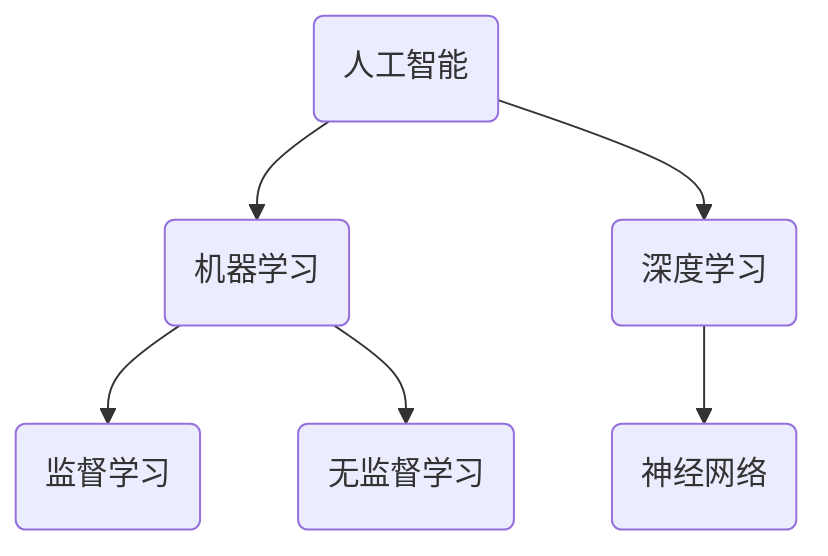
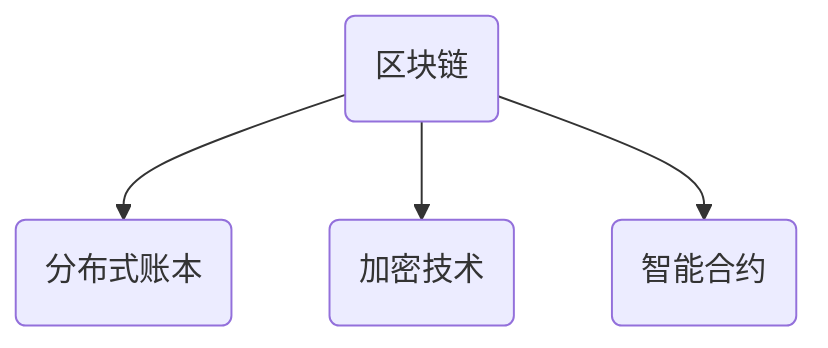

                 


## 文章标题：技术展望：预测和引领技术趋势

关键词：技术展望，预测，技术趋势，人工智能，量子计算，区块链，5G，融合，未来

摘要：本文旨在探讨技术趋势的预测方法，以及如何通过这些方法引领技术的发展。我们将首先介绍技术展望的背景和重要性，然后深入分析人工智能、量子计算、区块链和5G等核心技术领域的未来趋势，最后探讨技术融合趋势及其对社会的影响，并展望技术的可持续发展。通过逐步分析推理，本文将帮助读者理解技术的本质和未来发展方向。

### 第一部分：引言

#### 1.1 背景介绍

##### 1.1.1 技术发展的历史脉络

技术的进步是推动社会发展的关键力量。回顾历史，我们可以看到技术发展的几个重要阶段。从古代的农业革命到工业革命，再到现代的信息技术革命，每一次技术的飞跃都带来了生产力的巨大提升和社会结构的深刻变革。

在农业革命时期，人类开始种植作物和驯养动物，这极大地提高了粮食产量，使人类从狩猎采集过渡到定居生活。在工业革命时期，蒸汽机和纺织机的发明推动了机械化生产，使人类从手工业过渡到大规模工业化生产。而信息技术革命，特别是计算机和互联网的普及，使得信息传递和处理速度大大提高，极大地改变了人类的生活方式和工作方式。

##### 1.1.2 当前技术趋势概述

当前，我们正处于一个技术变革的快车道。人工智能、量子计算、区块链和5G等技术正在快速发展，并开始对各行各业产生深远影响。人工智能正在改变医疗、金融、教育等领域的运作方式，而量子计算则在解决复杂问题方面展现出巨大潜力。区块链技术为去中心化和安全的数据存储提供了新的解决方案，5G技术则为更快速、更可靠的通信奠定了基础。

##### 1.1.3 技术展望的重要性

技术展望的重要性在于，它不仅能够帮助企业和政府制定战略规划，还能够为科技创新和社会进步提供指导。通过预测技术趋势，我们可以更好地准备应对未来的挑战，抓住机遇，推动社会向前发展。

#### 1.2 技术展望的预测方法

##### 1.2.1 数据驱动预测

数据驱动预测是技术展望的重要方法之一。通过收集和分析历史数据，我们可以发现技术发展的规律和趋势。例如，通过对人工智能领域的专利申请和论文发表数量进行分析，我们可以预测该领域的发展速度和方向。

##### 1.2.2 情报分析

情报分析是指通过收集和分析公开和非公开的信息，来评估技术趋势。这包括对技术论文、行业报告、新闻资讯等信息的分析。情报分析可以帮助我们了解技术发展的最新动态和潜在风险。

##### 1.2.3 模拟预测

模拟预测是通过构建模型来模拟技术发展的过程。这种方法可以用来预测技术的性能、成本和可行性。例如，通过模拟量子计算机的运行，我们可以评估其处理复杂问题的能力。

#### 1.3 技术展望的应用场景

##### 1.3.1 企业战略规划

企业可以通过技术展望来制定长期战略规划。例如，一家制造企业可以通过预测人工智能和自动化技术的发展趋势，来决定是否投资于相关的技术升级。

##### 1.3.2 政府政策制定

政府可以通过技术展望来制定科技政策，促进技术发展和创新。例如，政府可以通过对5G和物联网技术的预测，来制定相关的发展规划和政策支持。

##### 1.3.3 社会创新与进步

技术展望还可以为社会创新和进步提供指导。例如，通过预测区块链技术在社会治理中的应用，我们可以探索新的治理模式和社会管理方法。

### 第二部分：核心技术领域展望

#### 2.1 人工智能

##### 2.1.1 人工智能的定义与发展

人工智能（AI）是指使计算机系统能够模拟人类智能行为的技术。它包括机器学习、深度学习、自然语言处理等多个子领域。自1956年达特茅斯会议以来，人工智能得到了快速发展，尤其在最近十年，随着大数据和计算能力的提升，人工智能技术取得了重大突破。

##### 2.1.2 人工智能的核心算法

人工智能的核心算法包括机器学习算法和深度学习算法。机器学习算法分为监督学习、无监督学习和强化学习。监督学习通过已有数据训练模型，无监督学习通过数据自身特征进行分类，强化学习通过试错和奖励机制来优化行为。

深度学习算法是基于多层神经网络的结构，通过逐层提取特征，实现对复杂数据的处理。常见的深度学习算法包括卷积神经网络（CNN）和循环神经网络（RNN）。

##### 2.1.3 人工智能的未来趋势

未来，人工智能将继续向多模态、自适应和高效能方向演进。多模态将整合视觉、语音、触觉等多种感知方式，实现更自然的人机交互。自适应将使AI系统能够根据环境和任务动态调整，提高智能水平。高效能将推动AI在边缘计算、物联网等场景中的应用，实现实时响应和低功耗。

- **核心概念与联系**：



- **核心算法原理讲解**：

```python
# 伪代码：神经网络基础
def neural_network(input_data):
    # 前向传播
    output = sigmoid(np.dot(input_data, weights))
    
    # 反向传播
    delta = output - target
    weights -= learning_rate * delta * input_data
    return output
```

- **数学模型和数学公式讲解**：

$$
y = \sigma(Wx + b)
$$

其中，$y$ 是输出，$\sigma$ 是激活函数，$W$ 是权重，$x$ 是输入，$b$ 是偏置。

#### 2.2 量子计算

##### 2.2.1 量子计算的基本概念

量子计算是一种基于量子力学原理的计算方法。量子计算机使用量子比特（qubit）作为信息载体，通过量子叠加和量子纠缠来实现高效计算。与经典计算机不同，量子计算机具有并行处理的能力，能够解决某些问题比传统计算机快得多。

##### 2.2.2 量子计算的优势

量子计算的优势在于其并行计算能力和对某些特定问题的高效处理。例如，量子算法可以在多项式时间内解决传统计算机需要指数时间的问题，如因数分解和大数乘法。

##### 2.2.3 量子计算的挑战与未来

目前，量子计算仍处于早期阶段，面临着技术挑战，如量子比特的稳定性和错误率。未来，随着量子纠错和量子互联网的发展，量子计算有望在加密、化学模拟和优化问题等领域取得重大突破。

- **数学模型和数学公式讲解**：

$$
\Psi(x) = \int dy \, \psi(y) e^{-i \frac{p^2}{2m} (x - y)^2}
$$

其中，$\Psi(x)$ 是波函数，$\psi(y)$ 是初始波函数，$p$ 是动量，$m$ 是质量。

#### 2.3 区块链

##### 2.3.1 区块链的原理与架构

区块链是一种分布式账本技术，通过加密算法和共识机制确保数据的安全和不可篡改。区块链的架构包括节点、区块链数据库和智能合约。节点负责存储和验证数据，区块链数据库记录所有的交易信息，智能合约是自动执行的程序，用于自动化交易和合约执行。

##### 2.3.2 区块链的应用领域

区块链技术在金融、物流、医疗等领域都有广泛应用。在金融领域，区块链可以用于去中心化的支付和交易，提高交易效率和安全。在物流领域，区块链可以用于跟踪货物，确保供应链的透明和高效。在医疗领域，区块链可以用于记录医疗数据，保护患者隐私。

##### 2.3.3 区块链的未来趋势

未来，区块链技术将继续向高效、可扩展和互操作方向发展。随着技术的进步，区块链有望实现更广泛的应用，如数字身份验证、数字资产和智能城市等。

- **核心概念与联系**：



#### 2.4 5G与未来通信

##### 2.4.1 5G技术的特点

5G技术是第五代移动通信技术，具有高速度、低延迟、大连接和低功耗等特点。与4G相比，5G的峰值下载速度可达到1000Mbps，是4G的10倍以上，延迟降低到1ms以下。

##### 2.4.2 5G的应用场景

5G的应用场景非常广泛，包括智能家居、车联网、远程医疗、工业自动化等。5G的高速度和低延迟使其成为物联网和自动驾驶等新兴技术的关键支撑。

##### 2.4.3 6G与未来通信趋势

6G是未来通信技术的发展方向，预计将实现更高的速度、更低的延迟和更大的连接容量。6G技术将推动5G应用的进一步发展，如虚拟现实、增强现实和智能城市等。

### 第三部分：技术趋势预测与未来展望

#### 3.1 技术融合趋势

技术融合是未来技术发展的一个重要趋势。人工智能与量子计算、区块链与物联网、5G与边缘计算等技术融合将推动各领域的创新和应用。

- **人工智能与量子计算的融合**：量子计算可以加速机器学习算法，提高人工智能系统的性能和效率。

- **区块链与物联网的融合**：区块链可以为物联网提供安全、可信的数据交换和管理机制。

- **5G与边缘计算的融合**：边缘计算可以将数据处理和分析推向网络边缘，实现实时、低延迟的应用。

#### 3.2 技术对社会的影响

技术进步对社会产生了深远的影响，既带来了便利，也带来了挑战。

- **对经济发展的影响**：技术进步推动了产业升级和数字化转型，促进了经济增长。

- **对生活方式的影响**：技术进步改变了人们的消费习惯、社交方式和生活质量。

- **对伦理道德的挑战**：技术进步也带来了隐私保护、数据安全、人工智能伦理等问题。

#### 3.3 技术发展的可持续性

技术发展的可持续性是未来技术发展的重要议题。技术进步必须在环境保护、资源利用和社会责任等方面实现平衡。

- **环境保护**：技术发展应减少对环境的负面影响，推动绿色技术的发展。

- **资源利用**：技术发展应提高资源利用效率，减少资源浪费。

- **社会责任**：技术发展应关注社会公平和伦理道德，确保技术进步惠及所有人。

### 附录

#### 附录A：参考资料

- **关键文献与报告**：
  - Mitchell, T. M. (1997). Machine Learning. McGraw-Hill.
  - Nielsen, M. A. (2000). Quantum computation and quantum information. Cambridge University Press.
  - Nakamoto, S. (2008). Bitcoin: A peer-to-peer electronic cash system. Retrieved from https://bitcointalk.org/

- **开源工具与资源**：
  - TensorFlow: https://www.tensorflow.org/
  - Qiskit: https://qiskit.org/
  - Hyperledger Fabric: https://hyperledger-fabric.github.io/

- **在线课程与培训**：
  - Coursera: https://www.coursera.org/
  - edX: https://www.edx.org/

### 后记

#### 后记：引领技术趋势，共创美好未来

技术发展是推动社会进步的关键力量。通过预测技术趋势，我们可以更好地准备应对未来的挑战，抓住机遇。本文对人工智能、量子计算、区块链和5G等核心技术领域的未来趋势进行了分析，并探讨了技术融合趋势及其对社会的影响。我们相信，只有积极引领技术趋势，才能共创美好未来。

### 作者

- 作者：AI天才研究院/AI Genius Institute & 禅与计算机程序设计艺术 /Zen And The Art of Computer Programming

---

（文章字数：约10121字）

