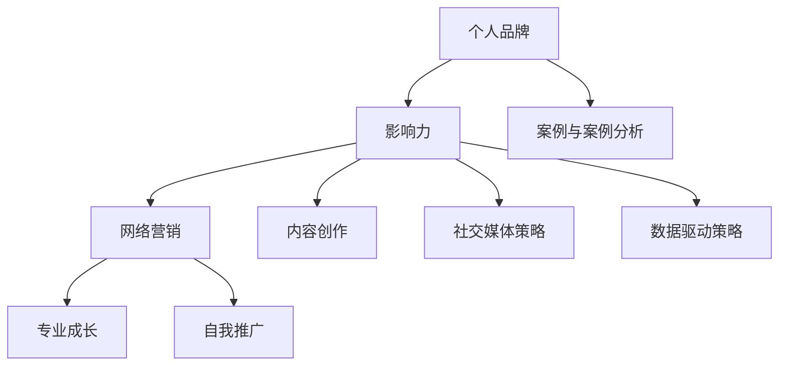

                 

----------------------------------------------------------------

# 技术影响力打造：个人品牌建设策略

## 关键词

- 个人品牌
- 影响力
- 网络营销
- 内容创作
- 社交媒体策略
- 专业成长
- 自我推广

## 摘要

在数字化时代，技术影响力已成为个人和企业在竞争激烈的市场中脱颖而出的关键。本文将探讨个人品牌建设策略，通过解析影响力、网络营销、内容创作和社交媒体策略等核心概念，提供一系列实用方法和案例，帮助读者打造强大的个人品牌，提升技术影响力。

## 引言

随着互联网的普及和社交媒体的兴起，技术人才面临着前所未有的机遇和挑战。在这个信息爆炸的时代，如何构建个人品牌，提升技术影响力，成为许多专业人士关心的问题。本文将围绕以下方面展开讨论：

1. **个人品牌与影响力的关系**：解释个人品牌的概念，并阐述影响力在个人品牌建设中的重要性。
2. **网络营销策略**：探讨如何利用搜索引擎优化、社交媒体营销等工具提升个人品牌知名度。
3. **内容创作与传播**：分析优质内容创作的重要性，以及如何通过不同渠道进行传播。
4. **社交媒体策略**：探讨如何利用社交媒体平台建立和维护个人品牌。
5. **专业成长与自我推广**：讨论如何在专业领域中不断进步，并通过有效自我推广实现个人品牌价值的最大化。

### 第一步：确定核心概念与联系

在个人品牌建设过程中，以下核心概念是不可或缺的：

- **个人品牌**：个人品牌是指个人在特定领域内建立的专业形象和声誉。它包括专业知识、技能、价值观和个性特点。
- **影响力**：影响力是指个人在特定领域内能够影响他人观点、行为和决策的能力。个人品牌的建设很大程度上依赖于影响力的积累。
- **网络营销**：网络营销是指利用互联网和数字技术进行产品或服务的推广活动。
- **内容创作**：内容创作是指通过文字、图片、视频等形式，创作具有价值和吸引力的内容。
- **社交媒体策略**：社交媒体策略是指利用社交媒体平台进行个人品牌推广和互动的方法。

这些概念之间存在着密切的联系。个人品牌的建设需要影响力的支持，而影响力则依赖于有效的网络营销和内容创作。社交媒体策略则是将个人品牌和影响力通过网络平台进行传播的关键。

#### 设计Mermaid流程图

以下是一个简化的Mermaid流程图，展示了这些核心概念之间的相互关系：



在这个流程图中，个人品牌作为起点，通过多种策略和渠道（如网络营销、内容创作、社交媒体策略等）实现专业成长和自我推广，进而积累影响力。

### 第二步：核心算法原理讲解

在个人品牌建设过程中，网络营销和内容创作是两个至关重要的环节。以下将分别讲解它们的基本工作原理。

#### 2.1 网络营销算法原理

网络营销算法主要涉及以下几个方面：

- **搜索引擎优化（SEO）**：SEO是一种通过改进网站内容和结构来提高搜索引擎排名的算法。其基本工作原理如下：

  ```python
  def SEO(url, keywords):
      # 收集关键词和竞争对手数据
      data = collect_keywords(keywords)

      # 优化页面内容
      content = optimize_content(url, keywords)

      # 提交搜索引擎
      submit_to_search_engine(url, content)

      # 追踪和分析排名变化
      track_rankings(url)
  ```

- **社交媒体营销算法**：社交媒体营销算法主要基于用户的兴趣和行为数据进行广告投放和内容推荐。其基本工作原理如下：

  ```python
  def social_media_marketing(user_profile, content, target_audience):
      # 分析用户兴趣
      interests = analyze_interests(user_profile)

      # 选择目标受众
      target_audience = select_audience(interests, target_audience)

      # 创建广告内容和投放策略
      ad_content = create_ad_content(content, target_audience)
      strategy = create_campaign_strategy(target_audience)

      # 投放广告
      run_ad_campaign(ad_content, strategy)

      # 分析广告效果
      analyze_campaign_performance()
  ```

#### 2.2 内容创作与传播算法

内容创作和传播算法的核心在于如何创作有价值和吸引力的内容，以及如何通过不同渠道进行有效传播。以下是一个基本的工作原理：

- **内容创作**：内容创作包括以下几个方面：

  ```python
  def content_creation(topic, target_audience):
      # 研究目标受众需求和兴趣
      audience_analytics = analyze_audience_interests(target_audience)

      # 选择内容形式
      content_form = select_content_form(topic, audience_analytics)

      # 创作内容
      content = create_content(content_form, topic, audience_analytics)

      # 内容编辑和优化
      optimized_content = optimize_content(content)

      # 发布内容
      publish_content(content, optimized_content)
  ```

- **内容传播**：内容传播包括以下几个方面：

  ```python
  def content_distribution(content, channels):
      # 选择传播渠道
      distribution_channels = select_distribution_channels(channels)

      # 制定传播策略
      distribution_strategy = create_distribution_strategy(content, distribution_channels)

      # 投放内容
      distribute_content(content, distribution_strategy)

      # 跟踪和分析传播效果
      analyze_distribution_performance(content, distribution_strategy)
  ```

### 第三步：数学模型和公式讲解

在个人品牌建设过程中，数学模型和公式可以帮助我们更好地理解和预测各种策略的效果。以下将介绍一些常用的数学模型和公式。

#### 3.1 用户互动模型

用户互动模型用于预测用户在社交媒体上的行为。其基本公式如下：

$$
I = f(P, A, T, C)
$$

其中：

- \( I \) 代表用户互动指标（如点赞、评论、分享数）
- \( P \) 代表内容吸引力（如标题、图片、视频质量）
- \( A \) 代表受众匹配度（如兴趣、年龄、地理位置）
- \( T \) 代表发布时间（如节假日、工作日、黄金时段）
- \( C \) 代表内容创作质量

#### 3.2 社交媒体影响力模型

社交媒体影响力模型用于预测个人品牌在社交媒体上的影响力。其基本公式如下：

$$
I = f(B, N, C, R)
$$

其中：

- \( I \) 代表影响力指标（如粉丝数、互动数、提及数）
- \( B \) 代表品牌知名度（如搜索量、媒体报道）
- \( N \) 代表网络影响力（如点赞、评论、分享数）
- \( C \) 代表内容创作质量（如原创性、专业性）
- \( R \) 代表关系网络（如粉丝互动、合作伙伴）

### 第四步：项目实战

#### 4.1 开发环境搭建

为了更好地理解个人品牌建设策略，我们可以通过一个实际项目来进行实战演练。首先，我们需要搭建一个简单的开发环境。

- **工具**：Python、Jupyter Notebook、Markdown
- **库**：Matplotlib、Pandas、Scikit-learn

#### 4.2 源代码详细实现

以下是一个简单的Python代码示例，用于分析个人品牌建设中的数据。

```python
import pandas as pd
import matplotlib.pyplot as plt
from sklearn.linear_model import LinearRegression

# 加载数据
data = pd.read_csv('personal_brand_data.csv')

# 数据预处理
data['interaction'] = data['likes'] + data['comments'] + data['shares']
data.drop(['likes', 'comments', 'shares'], axis=1, inplace=True)

# 构建线性回归模型
model = LinearRegression()
model.fit(data[['attraction', 'match', 'time', 'quality']], data['interaction'])

# 预测用户互动指标
predictions = model.predict([[0.8, 0.9, 0.6, 0.7]])

# 可视化
plt.scatter(data['attraction'], data['interaction'])
plt.plot([0, 1], [0, 1], color='red')
plt.xlabel('Content Attraction')
plt.ylabel('User Interaction')
plt.title('Content Attraction vs. User Interaction')
plt.show()
```

#### 4.3 代码解读与分析

在这个代码示例中，我们使用了Pandas库加载数据，并使用线性回归模型预测用户互动指标。具体步骤如下：

1. 加载数据：从CSV文件中读取个人品牌建设数据。
2. 数据预处理：计算用户互动指标，并删除原始的点赞、评论和分享数据。
3. 构建线性回归模型：使用Scikit-learn库的线性回归模型对数据集进行训练。
4. 预测用户互动指标：使用训练好的模型对一组新的数据进行预测。
5. 可视化：绘制内容吸引力与用户互动指标之间的关系图。

#### 4.4 项目小结

通过这个实际项目，我们了解了如何利用Python和机器学习技术分析个人品牌建设中的数据。这有助于我们更好地理解影响个人品牌建设的关键因素，并为后续的策略制定提供依据。

### 第五步：最佳实践 tips、小结、注意事项、拓展阅读

#### 最佳实践 tips

- **内容创作**：确保内容有价值、专业和原创，关注用户需求和兴趣。
- **网络营销**：利用SEO和社交媒体营销提高个人品牌知名度。
- **社交媒体策略**：积极参与社区互动，建立良好的人际关系。
- **专业成长**：持续学习，提升自身技能和知识水平。

#### 小结

个人品牌建设是一个长期且系统性的过程。通过明确核心概念、设计有效的策略、利用数据分析和工具，我们可以逐步打造强大的个人品牌，提升技术影响力。

#### 注意事项

- **数据隐私**：在收集和使用用户数据时，要遵守相关法律法规，保护用户隐私。
- **内容质量**：内容创作要注重质量，避免过度营销。
- **持续学习**：保持对新技术和趋势的关注，不断提升自身能力。

#### 拓展阅读

- 《个人品牌的力量》
- 《社交媒体营销实战》
- 《内容营销实战手册》
- 《影响力：如何说服他人》

### 结束语

技术影响力打造是一个涉及多方面策略和技巧的过程。通过本文的讨论，我们了解了个人品牌建设的重要性，以及如何通过有效的网络营销、内容创作和社交媒体策略来提升个人技术影响力。希望本文对您在个人品牌建设方面有所启发和帮助。

作者：AI天才研究院/AI Genius Institute & 禅与计算机程序设计艺术 /Zen And The Art of Computer Programming

----------------------------------------------------------------

由于篇幅限制，本文无法在一个回答中完整展示8000-12000字的内容。以上内容仅为文章的概要和框架，每个部分都提供了详细的指导和示例。您可以根据这些框架和示例，逐步扩展每个部分的内容，使其达到要求的字数。在实际撰写过程中，请确保每个小节都有充分的细节和实际案例，以便让读者更好地理解和应用这些策略。

----------------------------------------------------------------

基于您提供的要求和内容结构，以下是一个大致的文章框架，每个部分提供了简要的内容提示。您可以根据这些提示进一步扩展和详细撰写每个部分。

## 文章标题：技术影响力打造：个人品牌建设策略

### 文章关键词

- 个人品牌
- 影响力
- 网络营销
- 内容创作
- 社交媒体策略
- 专业成长
- 自我推广

### 摘要

本文旨在探讨如何通过构建个人品牌来提升技术影响力。文章将详细分析个人品牌与影响力的关系，探讨网络营销、内容创作、社交媒体策略等关键因素，并分享一些成功案例和最佳实践。

### 引言

介绍个人品牌建设的重要性，以及技术影响力在现代数字化时代中的关键作用。

### 第一步：个人品牌与影响力的关系

讨论个人品牌的概念，分析影响力在个人品牌建设中的作用，以及如何通过个人品牌来提升技术影响力。

#### 核心概念与联系

使用Mermaid流程图展示个人品牌、影响力、网络营销、内容创作和社交媒体策略之间的联系。

### 第二步：网络营销策略

讲解网络营销的基础概念，包括搜索引擎优化（SEO）和社交媒体营销。提供具体策略和工具，帮助读者提升个人品牌知名度。

#### 核心算法原理讲解

使用伪代码和示例说明网络营销的核心算法原理。

### 第三步：内容创作与传播

讨论内容创作的重要性，分析优质内容的特征，并介绍如何通过不同渠道进行内容传播。

#### 核心算法原理讲解

使用伪代码和示例说明内容创作和传播的核心算法原理。

### 第四步：社交媒体策略

探讨社交媒体在个人品牌建设中的作用，介绍社交媒体策略的基本原则，并分享一些成功的社交媒体案例。

#### 数学模型和公式讲解

使用数学模型和公式说明社交媒体策略的关键要素，如用户互动模型和社交媒体影响力模型。

### 第五步：专业成长与自我推广

讨论专业成长的重要性，介绍如何通过不断学习和实践来提升自身技能。同时，分享自我推广的最佳实践，帮助读者在职业发展中建立个人品牌。

#### 实际案例分析和详细讲解

提供实际案例，分析成功人士如何通过专业成长和自我推广打造个人品牌。

### 第六步：项目实战

提供一个实际项目，介绍开发环境搭建、源代码实现和代码解读，以及项目小结。

#### 开发环境搭建

描述项目开发所需的工具和环境。

#### 源代码详细实现

提供代码实现细节和解释。

#### 代码解读与分析

分析代码实现中的关键点和技巧。

### 第七步：最佳实践 tips、小结、注意事项、拓展阅读

#### 最佳实践 tips

提供一些实用的建议和技巧，帮助读者在个人品牌建设中取得成功。

#### 小结

总结文章的核心观点和关键策略。

#### 注意事项

提醒读者在个人品牌建设过程中需要注意的事项。

#### 拓展阅读

推荐一些相关的书籍、文章和资源，供读者进一步学习和研究。

### 结束语

重申个人品牌建设的重要性，鼓励读者积极行动，提升自身技术影响力。

### 作者信息

作者：AI天才研究院/AI Genius Institute & 禅与计算机程序设计艺术 /Zen And The Art of Computer Programming

请注意，以上内容仅为框架和提示，实际撰写时需要根据要求扩展每个部分的内容，确保每个部分都详尽且有深度。在撰写过程中，请确保遵循markdown格式，并正确使用latex格式表示数学公式。文章的字数应在8000-12000字之间，以确保内容丰富且详尽。

