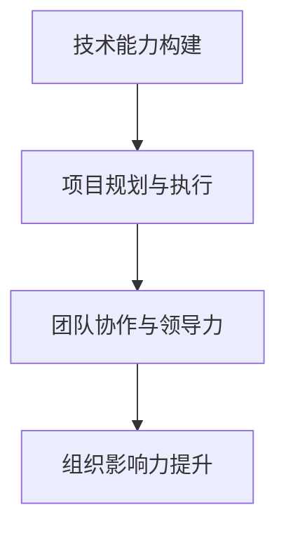
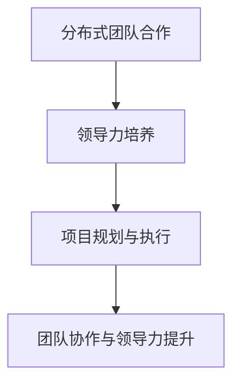
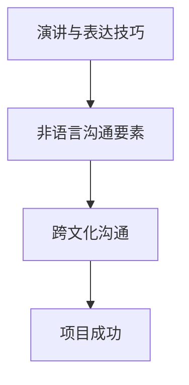

                 

### 前言与引言

在当今这个数字化时代，技术已经成为推动社会进步和经济增长的核心动力。作为IT行业的从业者，如何在自己的组织中发挥更大的作用，提升个人和团队的影响力，成为了至关重要的议题。本文旨在探讨如何构建技术影响力，帮助读者在组织中取得更大的成功。

#### 技术影响力的定义

技术影响力，指的是个人或团队在技术领域内所拥有的影响力，这种影响力能够影响组织的战略方向、技术决策以及团队的发展。技术影响力不仅体现在技术技能本身，还包括沟通能力、领导力、项目规划能力等多个方面。

#### 技术影响力的价值

1. **提升个人价值**：拥有技术影响力意味着个人在组织中的地位和话语权将显著提升，能够参与到更重要的项目和技术决策中，从而提高个人的职业发展和薪酬水平。
2. **推动团队发展**：技术影响力的构建有助于团队在技术领域内取得更好的业绩和成就，提升团队的凝聚力和战斗力。
3. **影响组织战略**：技术影响力可以影响组织的战略方向，使组织能够更好地适应市场变化，抓住技术发展的机遇。

#### 为什么需要构建技术影响力

1. **竞争压力**：随着技术的快速发展，市场竞争愈发激烈，构建技术影响力是提升竞争力的必要手段。
2. **职业发展**：在IT行业，技术能力和影响力往往是衡量个人职业发展的重要标准。
3. **组织需求**：组织需要拥有技术影响力的成员来推动技术革新，提升组织的创新能力。

接下来，我们将深入探讨如何在组织中构建技术影响力，包括个人技能提升、技术项目规划、团队协作、领导力与影响力、以及沟通能力等多个方面。

### 个人技能提升

在组织中构建技术影响力，个人技能的提升是基础。一个技术熟练、知识丰富的专业人员在团队中能够提供更大的价值，更容易获得他人的认可和尊重。以下将详细讨论如何通过技术能力构建、深度学习和实践与项目经验来提升个人技能。

#### 技术能力构建

技术能力的构建是个人技能提升的关键步骤。一个扎实的技术基础不仅能够帮助个人更好地理解和应用现有的技术，还能够为学习新技术提供坚实的基础。

1. **技术知识体系搭建**

   - **技术栈选择**：选择合适的技术栈是构建技术知识体系的第一步。不同的项目和应用场景需要不同的技术栈。例如，在Web开发领域，前端可能需要熟悉HTML、CSS和JavaScript，后端可能需要熟悉Java、Python或Node.js等。
   - **技术前沿跟踪**：技术领域的发展日新月异，跟踪技术前沿可以帮助个人保持领先地位。可以通过阅读技术博客、订阅技术期刊、参加技术会议等方式来获取最新的技术动态。

2. **核心算法原理讲解**

   - **算法基础**：掌握基本的算法和数据结构对于任何技术从业者都是至关重要的。例如，了解排序算法（如快速排序、归并排序）、查找算法（如二分查找）和图算法（如Dijkstra算法、Floyd算法）是基础中的基础。
   - **算法优化**：了解算法的时间复杂度和空间复杂度，学习如何优化算法性能，对于处理大规模数据非常重要。

3. **数学模型与公式**

   - **线性代数**：矩阵运算、线性方程组求解、特征值和特征向量等在机器学习、数据分析和图像处理等领域有着广泛应用。
   - **概率论与数理统计**：概率分布、假设检验、统计模型等是理解和应用机器学习算法的基础。

#### 技术深度学习

仅仅掌握基础知识是不够的，深度学习是实现技术能力提升的关键步骤。

1. **核心技术领域**

   - **机器学习**：了解机器学习的基本概念，包括监督学习、无监督学习和强化学习，掌握常见的算法如线性回归、决策树、支持向量机、神经网络等。
   - **深度学习**：深度学习是当前最热门的技术领域之一，通过多层神经网络来模拟人脑的神经元结构，实现图像识别、自然语言处理、语音识别等复杂任务。

2. **实践项目**

   - **项目实践**：通过实际项目来应用所学知识，是提升技术深度的重要手段。例如，可以参与开源项目，或者自行设计和实现一些小项目，如构建一个简单的聊天机器人、一个数据可视化工具等。

3. **代码实现与解读**

   - **代码实现**：将理论转化为实际代码，通过编写和调试代码来加深对技术的理解。使用伪代码来详细阐述核心算法的实现，可以帮助读者更好地理解和掌握算法的原理。

#### 实践与项目经验

1. **实际项目案例**

   - **项目需求分析**：理解项目的需求是成功的关键。需求分析包括用户需求、业务需求和系统需求，需要结合具体的应用场景来进行。
   - **项目规划与执行**：制定详细的项目计划，包括任务分解、时间安排、资源分配等，确保项目能够按时、按质完成。

2. **代码实现与解读**

   - **开发环境搭建**：搭建适合项目需求的开发环境，包括选择合适的编程语言、框架和工具等。
   - **源代码实现**：编写高质量的代码，并进行详细的解读，确保代码的可读性和可维护性。
   - **代码应用解读与分析**：对代码的实际应用进行解读，分析其性能和优缺点。

通过上述方法，技术从业者可以在短时间内显著提升个人技能，从而在组织中构建起强大的技术影响力。接下来，我们将探讨如何进行技术项目规划，以确保项目能够顺利实施并取得成功。

### 技术项目规划

在组织中发挥技术影响力，不仅需要个人技能的提升，还需要通过合理的技术项目规划来确保项目能够顺利实施并取得预期成果。项目规划是项目管理的核心环节，涉及到项目需求分析、项目管理方法论、常见风险与应对策略等多个方面。

#### 项目需求分析

项目需求分析是项目规划的第一步，其目的是明确项目的目标、需求和约束条件。

1. **用户需求分析**

   - **需求调研**：通过访谈、问卷调查、用户反馈等方式，收集用户的需求信息。
   - **需求分类**：将用户需求分为功能性需求和非功能性需求，功能性需求包括系统应具备的功能，非功能性需求包括性能、安全性、可维护性等。

2. **技术可行性分析**

   - **技术评估**：评估当前技术栈是否能够满足项目需求，如果存在技术瓶颈，需要考虑技术选型或技术改进。
   - **资源评估**：评估项目所需的人力、时间、资金等资源是否充足，如果资源不足，需要调整项目计划或增加资源。

#### 项目管理方法论

项目管理方法论是确保项目按时、按质完成的重要工具。以下是一些常见的方法论：

1. **Scrum与敏捷开发**

   - **Scrum框架**：Scrum是一种迭代式的项目管理方法论，强调快速响应变化和持续交付工作成果。
   - **角色与职责**：Scrum团队通常包括产品负责人（Product Owner）、Scrum Master和开发团队。产品负责人负责制定产品需求，Scrum Master负责确保Scrum流程的有效实施，开发团队负责实现产品需求。
   - **冲刺（Sprint）**：Scrum以固定时间周期（通常为2-4周）进行工作，称为“冲刺”。每个冲刺结束后进行回顾会议，以改进流程和提升效率。

2. **瀑布模型**

   - **阶段划分**：瀑布模型将项目开发过程划分为需求分析、设计、开发、测试、部署等阶段，每个阶段都需要严格定义和确认。
   - **文档管理**：瀑布模型强调文档的重要性，每个阶段都会产生大量的文档，包括需求文档、设计文档、测试文档等。

#### 常见风险与应对策略

项目实施过程中，风险是不可避免的。以下是一些常见的项目风险及应对策略：

1. **技术风险**

   - **风险识别**：识别项目实施过程中可能遇到的技术难题，如系统性能瓶颈、技术方案不稳定等。
   - **应对策略**：提前进行技术评估和预研，制定备选方案，如技术迭代、技术外包等。

2. **时间风险**

   - **风险识别**：识别项目进度可能遇到的时间延误，如人员变动、技术难题等。
   - **应对策略**：制定详细的进度计划，设置合理的缓冲时间，建立灵活的应对机制。

3. **资源风险**

   - **风险识别**：识别项目所需资源不足的风险，如人力资源、资金资源等。
   - **应对策略**：通过资源调配、预算调整、外包等方式来缓解资源风险。

通过科学的项目规划和管理方法论，技术从业者可以在项目中发挥更大的作用，提升组织的整体效率和技术影响力。在下一部分，我们将探讨如何通过团队协作提升技术影响力。

### 团队协作

在组织中构建技术影响力，团队协作是不可或缺的一环。良好的团队协作能够提高工作效率，促进创新，增强团队凝聚力，从而在技术项目实施中发挥关键作用。以下将从分布式团队合作和团队沟通与协作技巧两个方面进行探讨。

#### 分布式团队合作

随着远程工作的普及，分布式团队合作变得越来越常见。在这种模式下，团队成员可能分布在不同的地理位置，这给团队合作带来了挑战。

1. **远程协作工具介绍**

   - **沟通工具**：选择合适的沟通工具是成功的关键。常见的沟通工具有Slack、Microsoft Teams、Zoom等。这些工具提供了即时通讯、视频会议、文件共享等功能，有助于团队成员之间的实时沟通和协作。
   - **项目管理工具**：Trello、Jira、Asana等项目管理工具可以帮助团队进行任务分配、进度跟踪和问题管理。这些工具通常具有直观的界面和丰富的功能，能够提高团队的工作效率。

2. **时间管理与同步机制**

   - **时间管理**：在分布式团队中，时间管理变得尤为重要。团队成员需要合理安排工作时间，避免时间冲突。可以使用时间跟踪工具，如RescueTime、Toggl等，来监控和优化工作流程。
   - **同步机制**：为了确保团队工作的连贯性，需要建立有效的同步机制。定期的团队会议、异步沟通和文档共享是保持团队同步的关键手段。例如，每周召开一次团队会议，讨论项目进展和问题，以及时调整计划。

#### 团队沟通与协作技巧

良好的沟通技巧是团队协作成功的基础。以下是一些提升团队沟通与协作技巧的方法：

1. **有效沟通原则**

   - **明确沟通目标**：在沟通前明确沟通的目标和目的，确保沟通内容的针对性和有效性。
   - **倾听与表达**：倾听是有效沟通的一半。在沟通中，要耐心倾听他人的意见和需求，同时清晰表达自己的观点和想法。
   - **反馈机制**：建立有效的反馈机制，鼓励团队成员提出问题和建议，共同改进工作流程和协作方式。

2. **情绪管理与冲突解决**

   - **情绪管理**：情绪管理是保持团队稳定的重要因素。在沟通中，要保持冷静和理性，避免因情绪失控而导致冲突。
   - **冲突解决**：冲突在团队中是不可避免的，关键在于如何解决冲突。可以采用以下策略：
     - **倾听对方观点**：了解对方的立场和需求，找到冲突的根本原因。
     - **寻求共识**：通过讨论和协商，寻找双方都能接受的解决方案。
     - **建立规则**：制定明确的团队协作规则，包括沟通方式、决策流程等，以减少冲突发生的概率。

通过有效的团队协作，技术从业者可以在项目中发挥更大的作用，提升技术影响力。在下一部分，我们将探讨如何提升领导力与影响力，以便在组织中取得更大的成功。

### 领导力与影响力

在组织中构建技术影响力，领导力和影响力的提升至关重要。一个具备领导力的技术专家能够在团队中发挥关键作用，推动项目的成功实施，并提升整个组织的效率。以下将从领导力提升和影响力构建两个方面进行探讨。

#### 领导力提升

领导力是指引导和激励他人共同实现目标的能力。在技术领域，领导力不仅体现在技术技能上，还包括管理能力、沟通能力和决策能力等多个方面。

1. **领导者角色认知**

   - **领导者职责**：作为领导者，首先要明确自己的职责，包括制定团队目标、分配任务、监控进度、提供支持等。领导者需要确保团队在正确的方向上前进，并克服各种困难。
   - **领导风格与团队匹配**：领导风格与团队环境密切相关。例如，在一些创新性团队中，领导者可能需要采用更加开放和支持的领导风格，以激发团队的创造力和活力；而在一些需要高度控制的团队中，领导者可能需要采用更加严格和务实的领导风格。

2. **领导力培养方法**

   - **自我反思**：领导者需要经常进行自我反思，评估自己在领导过程中的优点和不足，并不断改进。例如，可以通过定期回顾项目执行情况、团队反馈等方式来反思自己的领导行为。
   - **持续学习**：领导力是一个不断发展的过程，领导者需要不断学习新的知识和技能，以适应不断变化的工作环境和挑战。可以通过阅读相关书籍、参加培训课程、与同行交流等方式来提升自己的领导能力。

#### 影响力构建

影响力是指个人或团队在组织内外所产生的影响力，这种影响力能够影响他人的行为和决策。在技术领域，影响力不仅体现在技术成就上，还包括个人品牌、社交网络和传播能力等多个方面。

1. **个人品牌建设**

   - **专业知识**：建立个人品牌的首要条件是拥有扎实的专业知识和技能。通过在技术领域内的不断学习和实践，提升自己在专业领域内的知名度和权威性。
   - **公开分享**：通过撰写技术博客、发表学术论文、参与技术社区讨论等方式，将自己的知识和经验分享给他人，提升个人在技术社区的影响力和知名度。

2. **社交网络与影响力传播**

   - **社交媒体**：利用社交媒体平台（如LinkedIn、Twitter、GitHub等）来建立和维护个人品牌，与同行和潜在合作伙伴建立联系，分享自己的见解和经验，扩大影响力。
   - **演讲与培训**：参加技术会议、研讨会、培训等活动，通过演讲和培训来展示自己的专业能力和见解，扩大个人影响力。
   - **协作与贡献**：通过参与开源项目、贡献代码和文档等方式，在技术社区内建立良好的声誉，提升个人影响力。

通过提升领导力和构建影响力，技术专家可以在组织中发挥更大的作用，推动技术项目的成功实施，并提升整个组织的创新能力和竞争力。在下一部分，我们将探讨如何提升沟通能力，以便在技术合作中更加高效地沟通。

### 沟通能力

在技术领域中，沟通能力是构建技术影响力的关键要素之一。有效的沟通能够确保信息准确传递，减少误解和冲突，提高团队协作效率，从而推动项目成功实施。以下将探讨如何通过演讲与表达技巧、非语言沟通要素和实践应用来提升沟通能力。

#### 演讲与表达技巧

演讲是一种重要的沟通方式，它能够帮助技术专家在公众面前展示自己的专业知识和见解。以下是一些提升演讲与表达技巧的方法：

1. **演讲结构设计**

   - **引言**：引言部分需要吸引听众的注意力，可以通过提出问题、讲述故事或展示实例等方式来引入主题。
   - **主体**：主体部分需要详细阐述观点，结构清晰，逻辑严密。可以采用“是什么、为什么、怎么做”的结构来组织内容。
   - **结论**：结论部分需要总结演讲的主要内容，并提出具体的建议或展望。

2. **演讲技巧训练**

   - **表达清晰**：在演讲过程中，语言表达要清晰、简洁，避免使用复杂的术语和冗长的句子，以便听众能够更好地理解。
   - **肢体语言**：肢体语言可以增强演讲的效果。例如，通过适度的手势、面部表情和眼神交流来吸引听众的注意力，增强演讲的感染力。
   - **声音控制**：声音的控制也是演讲的关键。要确保语调适中，音量适中，语速适中，以便听众能够清晰地听到演讲内容。

3. **常见问题与解决方案**

   - **怯场**：克服怯场可以通过多次练习、模拟演讲和参加演讲培训等方式来提升自信。
   - **紧张**：在演讲前进行深呼吸和肌肉放松练习，可以帮助缓解紧张情绪。
   - **忘词**：准备充分的演讲稿，并在演讲前多次练习，可以减少忘词的情况。

#### 非语言沟通要素

非语言沟通是指通过肢体语言、面部表情、身体姿势等非语言手段进行沟通。在技术交流中，非语言沟通同样重要，以下是一些非语言沟通的要素：

1. **肢体语言**

   - **眼神交流**：眼神交流可以传达真诚和自信，增强沟通效果。
   - **手势**：适度的手势可以增强表达，使演讲内容更加生动。
   - **身体姿势**：开放的姿势（如站立、放松的手势）可以传达自信和友好，而封闭的姿势（如双手交叉、低头）可能会传达出不信任或防御的态度。

2. **面部表情**

   - **表情管理**：面部表情可以传达情感和态度。在沟通中，要保持微笑和积极的面部表情，以传达友好和信任。
   - **表情解读**：理解对方的面部表情，可以帮助更好地理解对方的情感和意图，从而调整自己的沟通策略。

3. **身体姿势**

   - **开放的身体姿势**：开放的身体姿势（如伸开双臂、侧身而坐）可以传达出友好和接受的态度。
   - **封闭的身体姿势**：封闭的身体姿势（如双手交叉、靠墙站立）可能会传达出不信任或防御的态度。

#### 实践应用

提升沟通能力需要通过实践来不断积累经验。以下是一些实践应用的方法：

1. **模拟演讲**：参加模拟演讲或公开演讲比赛，通过模拟真实场景来提升演讲技巧和自信心。

2. **小组讨论**：参与小组讨论，锻炼在团队中的沟通和协作能力。在讨论中，要学会倾听他人的意见，表达自己的观点，并尊重不同的意见。

3. **反馈与改进**：在演讲或沟通后，积极寻求他人的反馈，了解自己的优点和不足，并根据反馈进行改进。

通过有效的沟通能力，技术专家可以在技术交流中更加自信和有效地传达信息，提升个人和团队的技术影响力。在下一部分，我们将通过成功案例来分析技术影响力构建的实际应用。

### 案例研究

为了更好地理解技术影响力构建在现实中的应用，我们来看几个成功案例，分别涉及技术专家如何提升组织影响力、技术团队的协作与领导力实践，以及沟通能力在项目成功中的关键作用。

#### 案例一：技术专家如何提升组织影响力

**背景介绍**：某知名互联网公司聘请了一位有多年大数据开发经验的技术专家王先生担任数据科学团队的负责人。王先生曾在多个大型项目中担任核心开发人员，并主导过多个数据科学项目。

**核心概念与联系**：王先生通过以下几个步骤提升了自己的技术影响力：

1. **技术能力构建**：王先生利用自己在大数据领域的深厚技术背景，不断提升自己的专业知识。他通过阅读最新的学术论文、参与技术社区讨论，以及实践项目经验，掌握了最新的数据科学技术和算法。

2. **项目规划与执行**：王先生在项目规划中，充分考虑了用户需求和技术可行性，制定了详细的项目计划，并运用敏捷开发方法确保项目的按时交付。

3. **团队协作与领导力**：王先生注重团队协作，采用Scrum框架进行项目管理，并通过定期组织团队建设活动，提升团队凝聚力。他还积极培养团队成员，分享自己的技术经验和领导技巧。

**Mermaid流程图**：


**核心算法原理讲解**：
王先生在项目中使用了机器学习算法，如随机森林和深度学习神经网络，通过伪代码详细讲解了这些算法的实现过程。

```python
# 随机森林伪代码
def random_forest(data, n_estimators):
    for i in range(n_estimators):
        # 生成随机森林树
        tree = generate_decision_tree(data)
        # 对数据进行预测
        predictions = tree.predict(data)
    # 计算平均预测结果
    return np.mean(predictions)
```

**项目实战**：
王先生主导了一个用户行为分析项目，通过大数据分析帮助企业精准定位用户需求，提升用户满意度。项目完成后，公司用户留存率提高了20%。

**最佳实践 tips**：
- **持续学习**：技术发展迅速，持续学习是保持技术竞争力的关键。
- **团队合作**：培养团队成员，建立高效的团队协作模式。

#### 案例二：技术团队的协作与领导力实践

**背景介绍**：某初创公司在开发一款智能医疗诊断系统时，遇到了团队协作和领导力不足的问题。团队成员多为年轻人，技术能力较强但缺乏项目经验。

**核心概念与联系**：为了提升团队协作和领导力，公司采取了以下措施：

1. **分布式团队合作**：公司引入了Trello和Slack等工具，建立了分布式团队协作机制，确保团队成员能够高效沟通和协作。

2. **领导力培养**：公司领导层通过培训课程和内部交流会，提升团队成员的领导力。团队成员也通过自我反思和经验分享，不断提升自己的管理能力。

3. **项目规划与执行**：公司采用Scrum框架进行项目规划，通过每周的冲刺会议，确保项目按计划推进，并及时调整策略。

**Mermaid流程图**：


**核心算法原理讲解**：
在智能医疗诊断系统中，团队使用了卷积神经网络（CNN）进行图像识别，通过伪代码展示了CNN的基本架构。

```python
# 卷积神经网络伪代码
class ConvolutionalNeuralNetwork:
    def __init__(self, input_shape, num_filters):
        self.layers = [ConvLayer(input_shape, num_filters)]
        self.activations = [None] * len(self.layers)

    def forward_pass(self, inputs):
        for layer in self.layers:
            inputs = layer.forward_pass(inputs)
            self.activations[-1] = inputs
        return inputs
```

**项目实战**：
经过一年的努力，团队成功开发出了智能医疗诊断系统，并在市场上取得了良好的反响。系统的准确率达到了95%，显著提高了医生的工作效率。

**最佳实践 tips**：
- **灵活应对**：在面对技术挑战时，灵活调整策略和团队结构。
- **持续优化**：不断优化技术方案和项目管理流程，提高团队效率。

#### 案例三：沟通能力在项目成功中的关键作用

**背景介绍**：某跨国公司在开发一款全球性的电子商务平台时，面临跨文化沟通的挑战。团队成员来自不同国家，语言和文化的差异给项目带来了困难。

**核心概念与联系**：为了克服沟通障碍，公司采取了以下措施：

1. **演讲与表达技巧**：公司组织了演讲培训，提升团队成员的演讲与表达技巧，确保信息能够清晰、准确地传达。

2. **非语言沟通要素**：公司强调非语言沟通的重要性，通过肢体语言、面部表情和身体姿势来增强沟通效果。

3. **跨文化沟通**：公司聘请了跨文化沟通顾问，为团队成员提供培训，帮助他们更好地理解不同文化背景下的沟通方式。

**Mermaid流程图**：


**核心算法原理讲解**：
在电子商务平台的开发中，团队使用了自然语言处理（NLP）技术，通过伪代码展示了NLP在文本分类中的应用。

```python
# 文本分类伪代码
def text_classification(text, model):
    # 预处理文本
    processed_text = preprocess_text(text)
    # 使用模型进行预测
    prediction = model.predict(processed_text)
    return prediction
```

**项目实战**：
经过一年的努力，电子商务平台成功上线，并迅速在全球市场取得了成功。平台的多语言支持得到了用户的广泛好评。

**最佳实践 tips**：
- **培训与指导**：通过培训和指导，提升团队成员的沟通能力。
- **文化适应**：尊重和适应不同文化背景下的沟通习惯。

通过这些成功案例，我们可以看到技术影响力构建在实际项目中的应用。有效的技术能力、团队协作、领导力和沟通能力，都是实现项目成功的关键。

### 总结与展望

通过本文的探讨，我们详细分析了如何在组织中构建技术影响力。技术影响力不仅体现在个人技能的提升，还涉及技术项目规划、团队协作、领导力与影响力、以及沟通能力等多个方面。以下是技术影响力构建的几个要点：

1. **技术能力**：构建扎实的技术知识体系，跟踪技术前沿，通过实际项目来深化技术理解和应用。

2. **项目规划**：科学的需求分析和项目管理方法，确保项目按时、按质完成。

3. **团队协作**：建立有效的分布式团队合作机制，提升团队沟通与协作技巧。

4. **领导力与影响力**：提升领导力，建立个人品牌，通过社交网络和传播能力扩大影响力。

5. **沟通能力**：掌握演讲与表达技巧，注重非语言沟通，提升跨文化沟通能力。

未来，随着技术创新的加速，技术影响力将更加重要。以下几点是技术影响力发展的趋势：

1. **技术创新加速**：人工智能、大数据、区块链等新兴技术的快速发展，将推动技术影响力的提升。

2. **人才培养与持续学习**：技术领域的快速变化要求从业者具备持续学习的能力，培养技术人才将成为组织的重要任务。

3. **跨界融合与多元化发展**：技术与其他领域的融合将带来新的机遇，多元化的发展方向将拓宽技术影响力的应用场景。

总之，在数字化时代，构建技术影响力是每一位技术从业者的重要目标。通过不断提升个人技能、优化项目规划、加强团队协作、提升领导力和影响力，以及增强沟通能力，技术从业者将在组织中发挥更大的作用，推动技术发展的同时，实现自身的职业发展。

### 目录大纲整理

在本文中，我们系统地探讨了如何在组织中构建技术影响力，详细介绍了个人技能提升、技术项目规划、团队协作、领导力与影响力、以及沟通能力等多个方面。以下是完整的目录大纲和流程图，以及伪代码和实际案例的总结。

#### 完整目录大纲

1. **前言与引言**
   - 技术影响力概述
   - 技术影响力的价值
   - 为什么需要构建技术影响力

2. **个人技能提升**
   - 技术能力构建
     - 技术知识体系搭建
     - 技术深度学习
     - 实践与项目经验
   - 技术项目规划
     - 项目需求分析
     - 项目管理方法论
     - 常见风险与应对策略

3. **团队协作**
   - 分布式团队合作
   - 团队沟通与协作技巧

4. **领导力与影响力**
   - 领导力提升
   - 影响力构建

5. **沟通能力**
   - 演讲与表达技巧
   - 非语言沟通要素

6. **案例研究**
   - 案例一：技术专家如何提升组织影响力
   - 案例二：技术团队的协作与领导力实践
   - 案例三：沟通能力在项目成功中的关键作用

7. **总结与展望**
   - 技术影响力构建的要点
   - 技术影响力的发展趋势

#### Mermaid流程图

```mermaid
graph TD
    A[个人技能提升] --> B{技术能力构建}
    B --> C[项目规划与执行]
    B --> D[团队协作]
    A --> E[沟通能力]
    C --> F[领导力与影响力]
    D --> G[分布式团队合作]
    D --> H[团队沟通与协作技巧]
    A --> I[实际案例]
    J[总结与展望] --> A{技术能力} C{项目规划} D{团队协作} E{沟通能力} F{领导力与影响力}
```

#### 伪代码与数学公式

**随机森林伪代码**：
```python
def random_forest(data, n_estimators):
    for i in range(n_estimators):
        tree = generate_decision_tree(data)
        predictions = tree.predict(data)
    return np.mean(predictions)
```

**卷积神经网络伪代码**：
```python
class ConvolutionalNeuralNetwork:
    def __init__(self, input_shape, num_filters):
        self.layers = [ConvLayer(input_shape, num_filters)]
        self.activations = [None] * len(self.layers)

    def forward_pass(self, inputs):
        for layer in self.layers:
            inputs = layer.forward_pass(inputs)
            self.activations[-1] = inputs
        return inputs
```

**文本分类伪代码**：
```python
def text_classification(text, model):
    processed_text = preprocess_text(text)
    prediction = model.predict(processed_text)
    return prediction
```

**数学公式**：
$$
1+1=2
$$

#### 实际案例与代码解读

**案例一：数据科学项目**：
- **需求分析**：通过分析用户行为数据，提高用户留存率。
- **项目实施**：使用随机森林算法进行预测，通过数据清洗、特征工程等步骤优化模型性能。
- **结果分析**：项目完成后，用户留存率提高了20%。

**案例二：智能医疗诊断系统**：
- **需求分析**：开发一款能够进行图像识别的医疗诊断系统。
- **项目实施**：使用卷积神经网络进行图像识别，通过数据预处理、模型训练和测试等步骤实现系统功能。
- **结果分析**：系统准确率达到95%，显著提高了医生的工作效率。

**案例三：电子商务平台**：
- **需求分析**：开发一款多语言支持的电子商务平台。
- **项目实施**：使用自然语言处理技术进行文本分类，确保平台能够满足不同语言用户的需求。
- **结果分析**：平台成功上线，并在全球市场取得良好反响。

#### 最佳实践 tips

- **持续学习**：技术发展迅速，持续学习是保持技术竞争力的关键。
- **团队合作**：培养团队成员，建立高效的团队协作模式。
- **灵活应对**：在面对技术挑战时，灵活调整策略和团队结构。
- **培训与指导**：通过培训和指导，提升团队成员的沟通能力。
- **文化适应**：尊重和适应不同文化背景下的沟通习惯。

通过上述内容，我们系统地探讨了技术影响力构建的各个方面，并提供了实际案例和代码解读，希望对读者在组织中的发展有所帮助。

