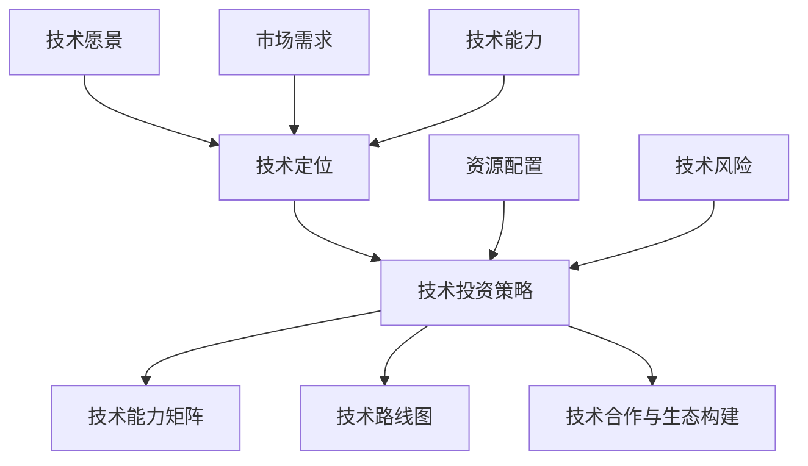
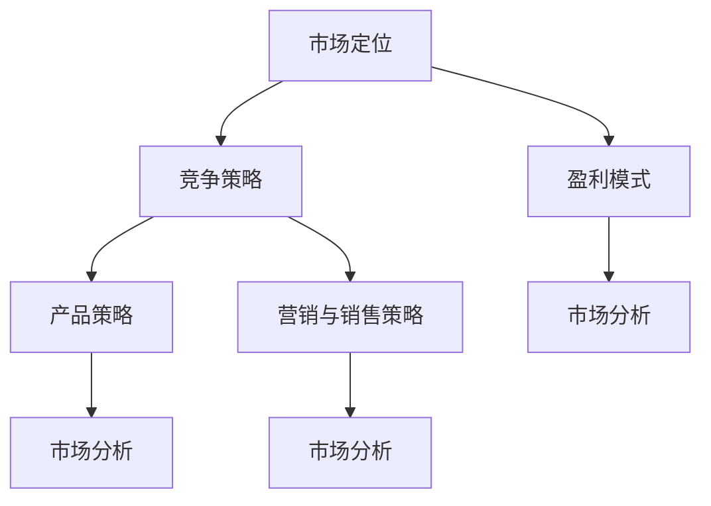

                 

### 技术战略与商业战略的对齐：实现技术价值最大化

> **关键词：** 技术战略、商业战略、对齐、价值最大化、创新驱动、市场导向

> **摘要：** 本文章深入探讨了技术战略与商业战略之间的紧密关系，分析了两者如何通过对齐实现技术价值的最大化。文章首先介绍了技术战略与商业战略的基本概念和关系，接着探讨了技术战略的核心概念与架构，以及商业战略的核心概念与架构。在此基础上，文章提出了技术战略与商业战略的对齐方法和策略，并通过具体案例进行了分析。最后，文章讨论了技术战略与商业战略对齐面临的挑战及解决方案，并对未来展望进行了探讨。

---

### 第1章: 技术战略与商业战略的对齐概述

#### 1.1 技术战略与商业战略的定义与关系

##### 1.1.1 技术战略的定义

技术战略是企业利用技术创新来获取竞争优势、提高效率和创造新价值的一种战略规划。它包括对技术创新的方向、范围、优先级以及资源分配的决策。技术战略的目的是确保企业在技术领域中保持领先地位，从而在市场竞争中取得优势。

##### 1.1.2 商业战略的定义

商业战略是企业为了在市场中定位、竞争和盈利而制定的长远规划。它包括对市场定位、竞争策略、产品策略、定价策略、营销策略和渠道策略等方面的决策。商业战略的目的是确保企业在市场中取得最大的市场份额和利润。

##### 1.1.3 技术战略与商业战略的关系

技术战略与商业战略之间存在密切的关系。技术战略是商业战略的重要支撑，技术发展可以推动商业目标的实现。同时，商业战略也需要考虑技术的可行性和限制。两者应紧密衔接，形成合力，以实现企业的长期发展。

#### 1.2 技术战略与商业战略的对齐目标

##### 1.2.1 提高企业竞争力

通过技术战略的合理规划，企业可以提高在市场中的竞争力。技术创新可以帮助企业开发新产品、改进现有产品、提高生产效率和质量，从而在市场竞争中获得优势。

##### 1.2.2 实现技术价值最大化

技术战略的制定应着眼于如何最大化技术的商业价值。企业需要通过合理的技术投资和开发，将技术转化为实际的产品和服务，从而实现经济效益。

##### 1.2.3 促进持续创新

技术战略与商业战略的对齐有助于推动企业的持续创新。通过将技术战略与市场需求相结合，企业可以不断探索新技术、新产品和新市场，保持竞争优势。

---

### 第2章: 技术战略的核心概念与架构

#### 2.1 技术战略的核心概念

##### 2.1.1 技术愿景

技术愿景是明确企业未来技术发展的蓝图和目标。它为企业提供技术发展的方向和指引，确保企业在技术领域中保持领先地位。

##### 2.1.2 技术定位

技术定位是确定企业技术领域的竞争优势和差异化战略。通过分析市场需求、竞争对手和自身技术优势，企业可以明确自身在技术领域的定位，从而制定有针对性的技术战略。

##### 2.1.3 技术投资策略

技术投资策略是制定企业技术投资方向和优先级。企业需要根据技术愿景和市场需求，合理分配资源，确保技术的持续发展。

#### 2.2 技术战略的架构设计

##### 2.2.1 技术能力矩阵

技术能力矩阵是分析企业现有技术能力和市场需求，形成匹配的技术能力矩阵。通过技术能力矩阵，企业可以明确自身在技术领域的优势和短板，从而制定针对性的技术发展计划。

##### 2.2.2 技术路线图

技术路线图是制定企业技术发展路线，明确各个阶段的目标和任务。通过技术路线图，企业可以清晰地规划技术发展的路径和里程碑，确保技术的有序推进。

##### 2.2.3 技术合作与生态构建

技术合作与生态构建是探索与企业内外部的技术合作，构建技术生态系统。通过技术合作，企业可以共享资源、知识和技术，实现技术优势互补和协同发展。

---

### 第3章: 商业战略的核心概念与架构

#### 3.1 商业战略的核心概念

##### 3.1.1 市场定位

市场定位是确定企业的目标市场和客户群体。通过市场定位，企业可以明确自身的市场定位和目标客户，从而制定有针对性的商业战略。

##### 3.1.2 竞争策略

竞争策略是制定企业在市场竞争中的策略和措施。企业需要根据市场竞争态势，选择合适的竞争策略，以在竞争中取得优势。

##### 3.1.3 盈利模式

盈利模式是确定企业的盈利途径和商业模式。企业需要根据市场需求和自身特点，选择合适的盈利模式，以实现持续盈利。

#### 3.2 商业战略的架构设计

##### 3.2.1 市场分析

市场分析是分析市场需求、竞争态势和行业趋势。通过市场分析，企业可以了解市场环境，为商业战略的制定提供依据。

##### 3.2.2 产品策略

产品策略是制定产品开发、推广和运营策略。企业需要根据市场需求和竞争态势，制定有竞争力的产品策略，以提高市场占有率。

##### 3.2.3 营销与销售策略

营销与销售策略是制定企业的营销和销售策略，提高市场占有率。企业需要根据市场需求和竞争态势，选择合适的营销和销售策略，以提高品牌知名度和销售额。

---

### 第4章: 技术战略与商业战略的对齐方法

#### 4.1 对齐目标与方法

##### 4.1.1 制定对齐目标

制定对齐目标是确保技术战略与商业战略的一致性。企业需要明确技术战略与商业战略的对齐目标，包括提高竞争力、实现技术价值最大化、促进持续创新等。

##### 4.1.2 制定对齐方法

制定对齐方法是实现技术战略与商业战略对齐的具体方法和步骤。企业可以采用以下方法：

- **技术优先策略**：优先考虑技术的创新和突破，以引领商业发展。
- **商业驱动策略**：以商业需求为导向，推动技术发展。
- **平衡发展策略**：在技术和商业之间寻求平衡，实现共同发展。

#### 4.2 对齐策略与实践

##### 4.2.1 技术优先策略

技术优先策略是优先考虑技术的创新和突破，以引领商业发展。企业需要通过技术创新，开发具有竞争力的产品和服务，以满足市场需求。

##### 4.2.2 商业驱动策略

商业驱动策略是以商业需求为导向，推动技术发展。企业需要根据市场需求，调整技术发展方向和优先级，确保技术的商业价值得到最大化。

##### 4.2.3 平衡发展策略

平衡发展策略是在技术和商业之间寻求平衡，实现共同发展。企业需要综合考虑技术战略和商业战略的需求，合理分配资源，确保技术和商业的协调发展。

---

### 第5章: 技术战略与商业战略对齐案例研究

#### 5.1 案例一：互联网巨头的技术与商业战略对齐

##### 5.1.1 企业背景

以互联网巨头谷歌（Google）为例，谷歌是一家以技术创新为核心驱动力的企业。在过去的几十年中，谷歌通过不断创新，推出了一系列革命性的技术和产品，如搜索引擎、云计算、人工智能等，取得了巨大的商业成功。

##### 5.1.2 对齐策略与实践

谷歌的技术战略与商业战略紧密对齐，以下是对齐策略与实践的探讨：

- **技术优先策略**：谷歌在技术研发上投入巨大，不断探索新技术，推动技术创新。例如，谷歌在搜索引擎领域不断优化算法，提高搜索精度和用户体验；在人工智能领域，谷歌开发了深度学习框架TensorFlow，推动了人工智能技术的发展。

- **商业驱动策略**：谷歌根据市场需求，调整技术发展方向和优先级。例如，谷歌在云计算领域推出了一系列产品，如Google Cloud Platform，为企业提供云计算服务，满足市场需求。

- **平衡发展策略**：谷歌在技术战略和商业战略之间寻求平衡，确保技术的商业价值得到最大化。例如，谷歌通过广告业务实现了巨大的盈利，同时不断推进技术研发，以保持竞争优势。

##### 5.1.3 对齐效果与启示

谷歌通过技术战略与商业战略的对齐，取得了显著的商业成功。谷歌的技术创新推动了商业发展，实现了技术价值最大化。对于其他企业，谷歌的案例提供了以下启示：

- 技术创新是商业成功的驱动力，企业应重视技术创新，投入研发资源。
- 商业需求是技术发展的导向，企业应根据市场需求调整技术发展方向和优先级。
- 在技术和商业之间寻求平衡，确保技术的商业价值得到最大化。

---

### 第6章: 技术战略与商业战略对齐的挑战与解决方案

#### 6.1 对齐挑战

##### 6.1.1 技术创新与市场需求的不匹配

技术创新与市场需求的不匹配是企业面临的主要挑战之一。企业可能过于注重技术创新，而忽视了市场需求，导致技术成果难以转化为商业价值。

##### 6.1.2 技术风险与商业风险的平衡

技术风险与商业风险的平衡是企业面临的另一个挑战。技术创新往往伴随着较高的风险，而商业战略则需要确保企业的稳健发展。如何在技术风险和商业风险之间取得平衡，是企业需要解决的问题。

##### 6.1.3 资源配置的优先级争议

资源配置的优先级争议是企业内部可能出现的挑战。不同部门之间可能对资源分配有不同的需求和期望，导致资源配置不合理，影响技术战略与商业战略的对齐。

#### 6.2 解决方案与实践

##### 6.2.1 创新驱动与市场导向相结合

解决技术创新与市场需求不匹配的解决方案是创新驱动与市场导向相结合。企业应关注市场需求，以市场需求为导向，推动技术创新。同时，企业应保持技术创新的动力，不断探索新的技术方向。

##### 6.2.2 风险管理与战略调整

解决技术风险与商业风险平衡的解决方案是风险管理与战略调整。企业应建立完善的风险管理体系，对技术创新进行风险评估和管理。同时，企业应根据市场环境和竞争态势，及时调整技术战略，以应对风险。

##### 6.2.3 资源配置优化与协同

解决资源配置优先级争议的解决方案是资源配置优化与协同。企业应建立科学的资源配置机制，确保资源的合理分配。同时，企业应加强部门间的协同，促进资源的共享和整合，以提高资源配置效率。

---

### 第7章: 未来展望与技术战略与商业战略的持续对齐

#### 7.1 技术发展趋势与商业战略的调整

未来，技术发展趋势将对商业战略产生深远影响。以下是一些技术发展趋势及其对商业战略的影响：

- **人工智能技术的快速发展**：人工智能技术的发展将推动商业模式的变革，企业需要根据人工智能技术的进步，调整商业战略，提高生产效率和服务质量。
- **大数据的广泛应用**：大数据技术的广泛应用将为企业提供更丰富的数据资源，企业需要根据大数据分析结果，调整市场定位和竞争策略。

#### 7.2 技术战略与商业战略的持续对齐

技术战略与商业战略的持续对齐是企业实现长期发展的关键。以下是一些实现持续对齐的方法：

- **定期评估与调整**：企业应定期评估技术战略与商业战略的对齐情况，根据市场环境和竞争态势，及时调整技术战略和商业战略。
- **建立跨部门协作机制**：企业应建立跨部门协作机制，促进技术部门与业务部门之间的沟通和合作，确保技术战略与商业战略的一致性。

---

在未来的发展中，技术战略与商业战略的对齐将越来越重要。企业应关注技术发展趋势，调整商业战略，以实现技术价值最大化。同时，企业应加强内部协作，确保技术战略与商业战略的持续对齐，推动企业的长期发展。

---

### 总结

本文深入探讨了技术战略与商业战略的对齐，分析了技术战略与商业战略的定义、关系以及对齐的目标和方法。通过案例研究和挑战与解决方案的探讨，本文展示了技术战略与商业战略对齐的重要性和实现方法。未来，随着技术发展趋势的变化，企业需要不断调整技术战略与商业战略，以实现技术价值最大化。

---

### 作者信息

作者：AI天才研究院/AI Genius Institute & 禅与计算机程序设计艺术 /Zen And The Art of Computer Programming### 第1章：技术战略与商业战略的对齐概述

#### 1.1 技术战略与商业战略的定义与关系

技术战略与商业战略是企业发展的两个核心方面，它们彼此交织，共同决定企业的成功与未来。为了更好地理解这两者的关系，我们需要首先明确它们各自的定义和内涵。

##### 1.1.1 技术战略的定义

技术战略是指企业为了获得持续的竞争优势，通过技术创新和科技发展来提高生产效率、创造新价值和提升客户体验的长期规划。它涉及对技术创新方向、资源分配、技术投资以及研发活动的决策。技术战略的目标是确保企业在技术领域保持领先地位，并通过技术进步推动业务增长。

具体来说，技术战略包括以下几个关键要素：

- **技术愿景**：明确企业对未来技术的期望和目标，为技术发展提供方向。
- **技术能力**：分析企业的现有技术基础，确定技术优势与劣势，以及如何通过技术积累和投资来提升自身技术能力。
- **技术路线图**：制定技术发展的阶段性目标和计划，包括研发项目、产品发布、技术标准等。
- **技术投资**：确定技术投资的优先级和预算，确保技术项目的资金支持和资源投入。

##### 1.1.2 商业战略的定义

商业战略是企业为了在市场中获得优势，实现盈利和增长而制定的长远规划。它涉及如何定位市场、如何竞争、如何定价、如何推广产品和服务等方面。商业战略的目标是确保企业在市场中的竞争力和市场份额，并实现可持续的盈利增长。

商业战略的主要组成部分包括：

- **市场定位**：确定企业的目标市场和客户群体，明确产品或服务的定位和差异化策略。
- **竞争策略**：分析竞争对手，制定有针对性的竞争策略，以保持市场优势。
- **产品策略**：确定产品开发、定价、推广和销售策略，以满足市场需求。
- **商业模式**：设计企业的盈利模式，确定如何通过提供产品或服务来获取收益。

##### 1.1.3 技术战略与商业战略的关系

技术战略与商业战略是相辅相成的，它们之间的关系可以总结为以下几点：

1. **相互依赖**：技术战略为商业战略提供支持，而商业战略为技术战略指明方向。技术进步可以帮助企业实现商业目标，而商业成功可以为技术创新提供资源保障。
   
2. **目标一致性**：技术战略和商业战略都需要实现企业的长期目标，如提高市场份额、增加收入、提升客户满意度等。两者的目标应保持一致，以确保企业资源的最优配置。

3. **协同作用**：技术战略与商业战略的协同作用可以最大化企业的价值。例如，通过技术创新可以降低成本、提高产品品质、缩短上市时间，从而在市场竞争中占据优势。

4. **动态调整**：技术环境和市场环境都是动态变化的，企业需要不断调整技术战略和商业战略，以适应新的挑战和机遇。

#### 1.2 技术战略与商业战略的对齐目标

技术战略与商业战略的对齐目标是实现技术价值最大化，提高企业竞争力，并促进企业的持续发展。具体来说，对齐目标包括以下几个方面：

1. **提高企业竞争力**：通过技术创新，提高产品的技术含量和性能，增强市场竞争力。

2. **实现技术价值最大化**：确保技术创新能够转化为实际的产品和服务，从而为企业带来经济收益。

3. **促进持续创新**：建立持续创新机制，推动技术不断进步，保持企业的技术领先地位。

4. **优化资源配置**：通过合理配置资源，确保技术投资和商业投资的协同效应，实现资源的最优利用。

5. **提高客户满意度**：通过技术创新，提供更好的产品和服务，满足客户需求，提升客户满意度。

总之，技术战略与商业战略的对齐是实现企业长期成功的关键。企业需要明确两者的关系，制定相应的战略规划，并持续优化和调整，以实现技术价值最大化，提高企业竞争力，并推动企业的持续发展。

#### 1.3 技术战略与商业战略的相互作用

技术战略与商业战略之间存在着密切的相互作用关系，这种相互作用不仅影响企业的短期业绩，更决定着企业的长期发展前景。理解这两者如何相互影响和协同作用，对于企业制定有效的战略规划至关重要。

##### 1.3.1 技术战略对商业战略的影响

1. **技术进步推动商业创新**：技术进步可以带来新的产品和服务，改变现有的商业模式。例如，互联网技术的发展催生了电子商务的兴起，改变了传统的购物方式。企业可以利用技术进步来创造新的市场机会，推动商业模式的创新。

   **示例：** 亚马逊通过电子商务平台和大数据分析技术，颠覆了传统零售行业，创造了全新的商业模式。

2. **提高生产效率和降低成本**：技术的进步可以帮助企业提高生产效率，降低生产成本。通过自动化、智能化技术，企业可以实现生产线的自动化控制，减少人力成本，提高生产效率。

   **示例：** 福特公司通过生产流水线技术的引入，大幅提高了汽车生产效率，降低了生产成本。

3. **增强市场竞争力**：技术创新可以使企业产品更具竞争力，提高市场占有率。通过开发新技术、新产品，企业可以在市场竞争中占据有利地位。

   **示例：** 苹果公司通过不断推出创新产品（如iPhone、iPad），保持了在消费电子领域的领导地位。

##### 1.3.2 商业战略对技术战略的影响

1. **市场需求驱动技术创新**：商业战略需要根据市场需求来调整产品和服务，这反过来也驱动了技术创新。企业需要通过技术创新来满足市场需求，提高客户满意度。

   **示例：** 苹果公司通过调研市场需求，推出iPhone，引领智能手机市场。

2. **资源配置决策**：商业战略中的资源配置决策会影响技术战略的执行。企业需要根据商业战略的目标来分配资源，如研发预算、人力资源等，以确保技术项目的成功。

   **示例：** 谷歌公司在发展搜索引擎技术时，投入了大量资金和人力资源，以确保技术领先。

3. **风险管理**：商业战略中的风险管理需要考虑技术风险。技术项目的成功往往伴随着较高的风险，商业战略需要通过合理的风险管理策略，确保技术投资的稳健性。

   **示例：** 特斯拉公司在发展电动汽车技术时，面临着电池技术、生产成本等风险，通过商业战略的调整，成功应对了这些挑战。

##### 1.3.3 相互促进与协同发展

技术战略与商业战略的相互作用不仅是单向的，它们之间还存在着相互促进和协同发展的关系。具体表现在以下几个方面：

1. **技术战略支持商业目标**：技术战略的制定和执行需要服务于企业的商业目标。例如，提高生产效率、降低成本、创造新市场等。

2. **商业战略指导技术发展**：商业战略中的市场需求、竞争态势和盈利模式，都会影响技术战略的制定和执行。例如，企业需要根据市场需求来决定研发哪些新技术，如何应用这些技术来满足市场。

3. **协同创新**：技术战略和商业战略的协同创新可以产生巨大的价值。企业可以通过跨部门合作，将技术优势与市场优势结合起来，实现技术突破和商业成功。

   **示例：** 亚马逊通过大数据分析技术，优化了物流和供应链管理，提高了运营效率，同时也创造了新的商业机会。

4. **动态调整**：技术环境和市场环境都是动态变化的，企业需要根据外部环境的变化，动态调整技术战略和商业战略，以保持竞争力和适应能力。

   **示例：** 谷歌公司在搜索引擎技术的基础上，不断扩展新的业务领域（如云计算、人工智能），以适应市场变化。

总之，技术战略与商业战略的相互作用是复杂的，它们彼此影响、相互促进，共同决定了企业的战略方向和发展速度。企业需要深入理解这两者之间的关系，通过有效的战略规划和执行，实现技术价值最大化，推动企业的持续发展。

#### 1.4 技术战略与商业战略的协同效应

技术战略与商业战略的协同效应是企业在激烈的市场竞争中取得成功的核心要素之一。协同效应的产生，不仅能够提升企业的整体竞争力，还能实现资源的最优化配置和价值的最大化。以下是对技术战略与商业战略协同效应的详细解析。

##### 1.4.1 资源配置优化

在技术战略与商业战略的协同作用下，企业能够实现资源配置的优化。技术战略为企业提供了明确的技术发展方向和投资优先级，而商业战略则根据市场需求和企业目标，指导资源的合理分配。通过两者的结合，企业可以确保有限的资源被投入到最具潜力和最有效的技术项目中。

- **实例**：一家制造企业可能通过技术战略确定了研发下一代节能产品的方向，而商业战略则基于市场调研和分析，确定了哪些产品具备最大的市场潜力。在这种协同效应下，企业可以将资源集中在研发和推广这些产品上，从而实现高效的市场响应和资源利用。

##### 1.4.2 技术与商业融合创新

协同效应还体现在技术与商业的融合创新上。技术战略提供了创新的动力，而商业战略则为创新提供了应用场景和市场需求。这种融合创新可以催生新的商业模式、产品和服务，为企业带来巨大的商业价值。

- **实例**：谷歌通过其技术战略在搜索引擎和人工智能领域的创新，成功推出了广告业务和Google Cloud Platform等商业产品，这些产品不仅利用了技术的优势，还满足了市场需求，实现了商业成功。

##### 1.4.3 提高响应速度和灵活性

技术战略与商业战略的协同还可以显著提高企业的响应速度和灵活性。在市场需求变化迅速的今天，企业需要能够快速调整战略和运营，以应对市场变化。技术战略和商业战略的结合，使得企业能够更加敏捷地响应市场变化。

- **实例**：特斯拉通过其技术战略在电动汽车领域的持续创新，结合其商业战略中的直销模式，能够迅速响应市场需求，推出新的电动汽车产品，保持了在电动汽车市场的领先地位。

##### 1.4.4 降低风险

通过技术战略与商业战略的协同，企业能够降低技术风险和商业风险。技术战略中的风险评估和风险控制措施，可以确保技术创新的稳健性，而商业战略中的市场分析和风险评估，则可以确保商业投资的合理性。

- **实例**：一家制药公司在开发新药时，通过技术战略的风险评估，确保研发过程中的技术风险得到有效控制，同时通过商业战略的市场调研，确保新药上市后的市场前景，从而降低了整体风险。

##### 1.4.5 提升品牌价值和客户满意度

技术战略与商业战略的协同还能提升品牌价值和客户满意度。通过技术创新带来的产品和服务优势，企业可以增强品牌影响力，提高市场认可度。同时，商业战略中的客户服务和体验优化，可以提升客户满意度，增强客户忠诚度。

- **实例**：苹果公司通过其技术战略在产品设计、用户体验等方面的持续创新，以及商业战略中的精准营销和优质的客户服务，建立了强大的品牌价值，赢得了大量忠实的客户。

##### 1.4.6 持续竞争优势

最后，技术战略与商业战略的协同效应可以为企业带来持续竞争优势。通过不断创新和技术进步，企业可以在市场中保持领先地位，同时通过商业战略的实施，巩固和扩展市场占有率。

- **实例**：微软通过其技术战略在操作系统、办公软件等领域的持续创新，以及商业战略中的战略合作和市场拓展，建立了强大的市场地位，保持了在计算机软件行业的领导地位。

综上所述，技术战略与商业战略的协同效应不仅能够提高企业的资源配置效率、推动融合创新、提升响应速度和灵活性，还能降低风险、提升品牌价值和客户满意度，最终实现持续竞争优势。企业应高度重视技术战略与商业战略的协同，通过有效的规划和执行，最大化协同效应，实现企业的长期发展目标。

### 第2章：技术战略的核心概念与架构

技术战略是企业通过技术手段实现竞争优势和业务目标的关键途径。为了确保技术战略的有效实施，企业需要明确技术战略的核心概念和架构。本节将深入探讨技术战略的核心概念，包括技术愿景、技术定位和技术投资策略，以及技术战略的架构设计，如技术能力矩阵、技术路线图和技术合作与生态构建。

#### 2.1 技术战略的核心概念

##### 2.1.1 技术愿景

技术愿景是企业对未来技术发展的预期和蓝图，它是技术战略的基础。技术愿景不仅指明了企业技术发展的长远目标，还为企业提供了明确的发展方向和战略指导。一个清晰的技术愿景可以帮助企业预见技术变革，抓住发展机遇，避免技术落后的风险。

**示例：** 一家科技公司的技术愿景可能是“通过人工智能技术，打造智能化的生活方式，提升人类生活质量。”

##### 2.1.2 技术定位

技术定位是企业在技术领域中的竞争优势和差异化战略。通过技术定位，企业可以确定自身在技术市场中的位置，明确技术发展的重点和方向。技术定位需要结合企业的资源、能力和市场需求，找到差异化优势，以便在激烈的市场竞争中脱颖而出。

**示例：** 一家专注于物联网技术的企业，其技术定位可能是“成为全球领先的物联网解决方案提供商，为智慧城市建设提供技术支持。”

##### 2.1.3 技术投资策略

技术投资策略是企业对技术投资的规划和管理。它涉及确定技术投资的优先级、预算分配和投资回报分析。技术投资策略的目的是确保企业资源的有效利用，支持技术创新和业务发展。合理的投资策略可以最大化技术投资的价值，降低技术风险。

**示例：** 一家互联网公司可能会制定以下技术投资策略：重点投资于大数据分析、人工智能和云计算技术，因为这些技术能够提升其核心业务的竞争力。

#### 2.2 技术战略的架构设计

##### 2.2.1 技术能力矩阵

技术能力矩阵是企业分析自身技术能力和市场需求的一种工具。它通过对比企业现有技术能力和市场需求，识别出企业的技术优势与短板，从而制定针对性的技术发展计划。技术能力矩阵有助于企业明确技术发展重点，优化资源配置，提升技术竞争力。

**示例：**
| 技术领域 | 技术能力等级 | 市场需求等级 |
| --- | --- | --- |
| 人工智能 | 高 | 高 |
| 云计算 | 中 | 中 |
| 物联网 | 低 | 高 |

在这个例子中，企业可以将人工智能和云计算作为技术发展的重点，同时加大对物联网技术的投资，以应对市场需求。

##### 2.2.2 技术路线图

技术路线图是描述企业技术发展路径的蓝图，它明确了企业技术发展的阶段性目标和任务。技术路线图可以帮助企业制定长期的技术规划，确保技术项目按时完成，实现技术目标。技术路线图通常包括关键里程碑、项目进度和资源需求等。

**示例：**
1. **第一阶段**：完成基础技术研究，建立技术平台。
2. **第二阶段**：开发核心产品，进行市场测试。
3. **第三阶段**：扩展产品线，实现规模化生产。

##### 2.2.3 技术合作与生态构建

技术合作与生态构建是企业获取外部技术和资源的重要途径。通过技术合作，企业可以借助外部资源，加速技术创新和业务拓展。同时，构建技术生态系统，可以促进技术交流和共享，提升整个行业的技术水平。

**示例：**
- **合作伙伴**：与高校、研究机构、同行企业建立合作关系，共同研发新技术。
- **开放平台**：搭建开放的技术平台，吸引开发者参与，共同推进技术创新。

#### 2.3 技术战略的核心概念与联系

为了更好地理解技术战略的核心概念与联系，我们可以使用Mermaid流程图来展示这些概念之间的关系。

在这个流程图中，技术愿景、技术定位、技术投资策略、技术能力矩阵、技术路线图和技术合作与生态构建构成了技术战略的核心概念。市场需求、技术能力和资源配置是影响这些核心概念的关键因素，而技术风险则是技术投资策略需要考虑的重要方面。

#### 2.4 技术战略的架构设计与实施

技术战略的架构设计不仅是理论上的规划，更需要实际操作中的实施。以下是一些关键步骤和注意事项：

1. **制定详细的技术路线图**：在技术路线图中，要明确每个阶段的目标和任务，确保项目进度和资源分配的合理性。

2. **建立技术能力矩阵**：通过技术能力矩阵，识别企业的技术优势和短板，为技术投资提供依据。技术能力矩阵需要定期更新，以反映企业的技术发展动态。

3. **制定技术投资策略**：根据市场需求和企业目标，制定明确的技术投资策略。投资策略应包括优先级、预算和预期回报等。

4. **建立技术合作与生态构建机制**：通过合作伙伴关系和开放平台，构建技术生态系统，促进技术创新和资源共享。

5. **监控与评估**：定期监控技术项目的进展情况，评估技术战略的实施效果。根据实际情况，及时调整技术战略和投资策略。

6. **跨部门协同**：技术战略的实施需要跨部门的协同合作，建立有效的沟通和协作机制，确保技术战略的顺利实施。

通过上述步骤和注意事项，企业可以确保技术战略的有效实施，实现技术价值最大化，提高企业竞争力。

总之，技术战略的核心概念与架构设计是企业实现技术价值最大化的关键。通过明确技术愿景、技术定位、技术投资策略，并合理设计技术能力矩阵、技术路线图和技术合作与生态构建，企业可以确保技术战略的有效实施，推动企业的长期发展。

---

### 第3章：商业战略的核心概念与架构

商业战略是企业为了在市场中获得竞争优势、实现盈利目标而制定的长期规划。它涵盖了市场定位、竞争策略、产品策略、定价策略、营销策略和销售策略等多个方面。为了确保商业战略的有效实施，企业需要明确商业战略的核心概念和架构，并制定相应的策略和措施。本节将深入探讨商业战略的核心概念，包括市场定位、竞争策略和盈利模式，以及商业战略的架构设计，如市场分析、产品策略和营销与销售策略。

#### 3.1 商业战略的核心概念

##### 3.1.1 市场定位

市场定位是指企业根据自身资源和能力，确定在市场中的位置和目标客户群体。通过市场定位，企业可以明确自身的竞争优势和差异化策略，从而在市场中占据有利地位。市场定位需要考虑多个因素，如目标市场的规模、需求特点、竞争态势等。

**示例：** 一家高端服装品牌，其市场定位可能是“为追求高品质生活的都市精英提供时尚、高端的服装产品。”

##### 3.1.2 竞争策略

竞争策略是企业为了在市场竞争中取得优势而采取的一系列措施。通过分析竞争对手的优势和劣势，企业可以制定有效的竞争策略，以保持市场竞争力的领先地位。竞争策略可能包括产品差异化、价格竞争、服务优势等。

**示例：** 一家快消品企业，其竞争策略可能是“通过低价策略和高效的物流网络，快速占领市场份额。”

##### 3.1.3 盈利模式

盈利模式是指企业通过提供产品或服务来获取收益的方式。不同的商业模式决定了企业的盈利途径和可持续性。企业需要根据市场需求、资源状况和竞争优势，选择合适的盈利模式。

**示例：** 一家互联网企业，其盈利模式可能是“通过广告、付费会员和电子商务等方式，实现多渠道收益。”

#### 3.2 商业战略的架构设计

##### 3.2.1 市场分析

市场分析是企业制定商业战略的重要基础。通过市场分析，企业可以了解市场环境、市场需求和竞争态势，为市场定位和竞争策略提供依据。市场分析包括以下几个方面：

- **市场需求分析**：了解目标市场的需求特点、消费者行为和购买习惯。
- **竞争态势分析**：分析主要竞争对手的市场份额、产品特点和市场策略。
- **市场趋势分析**：预测市场未来的发展趋势和变化，为企业的长期规划提供参考。

##### 3.2.2 产品策略

产品策略是企业制定的产品开发、定价、推广和销售策略。通过产品策略，企业可以确保产品与市场需求相匹配，提高产品的市场竞争力。产品策略包括以下几个方面：

- **产品定位**：根据市场定位和目标客户的需求，明确产品的特点和定位。
- **产品设计**：根据产品定位，设计具有差异化优势的产品，提高产品品质和用户体验。
- **产品定价**：根据市场需求和成本分析，制定合理的价格策略，确保产品具有价格竞争力。
- **产品推广**：通过广告、促销活动和渠道推广，提高产品的市场知名度。

##### 3.2.3 营销与销售策略

营销与销售策略是企业通过营销手段和销售渠道来推广产品、扩大市场份额的策略。通过营销与销售策略，企业可以吸引客户、增加销售额。营销与销售策略包括以下几个方面：

- **品牌建设**：通过品牌宣传和品牌形象塑造，提高品牌知名度和美誉度。
- **渠道管理**：选择合适的销售渠道，如直销、代理商、电商等，确保产品能够有效触达目标客户。
- **促销活动**：通过促销活动，如打折、赠品、优惠券等，刺激客户购买，提高销售量。
- **客户关系管理**：建立良好的客户关系，提供优质的售后服务，增加客户满意度和忠诚度。

#### 3.3 商业战略的核心概念与联系

为了更好地理解商业战略的核心概念与联系，我们可以使用Mermaid流程图来展示这些概念之间的关系。

在这个流程图中，市场定位、竞争策略和盈利模式是商业战略的核心概念，它们相互关联，共同构成商业战略的基础。市场分析为市场定位、竞争策略和盈利模式提供了数据支持，而产品策略和营销与销售策略则是实现商业战略的具体手段。

#### 3.4 商业战略的架构设计与实施

商业战略的架构设计不仅是理论上的规划，更需要实际操作中的实施。以下是一些关键步骤和注意事项：

1. **进行市场分析**：通过市场调研和分析，了解市场环境、市场需求和竞争态势，为商业战略提供依据。

2. **明确市场定位**：根据市场分析结果，确定企业在市场中的位置和目标客户群体，制定明确的市场定位策略。

3. **制定竞争策略**：分析竞争对手的优势和劣势，制定有针对性的竞争策略，确保企业在市场竞争中取得优势。

4. **设计盈利模式**：根据市场定位和竞争策略，选择合适的盈利模式，确保企业的盈利能力和可持续性。

5. **制定产品策略**：根据市场定位和竞争策略，设计具有差异化优势的产品，确保产品与市场需求相匹配。

6. **制定营销与销售策略**：通过品牌建设、渠道管理和促销活动等手段，提高产品的市场知名度和销售量。

7. **建立执行机制**：建立有效的执行机制，确保商业战略的各项目标和任务得到落实，实现商业战略的顺利实施。

8. **监控与调整**：定期监控商业战略的执行情况，根据市场变化和实际情况，及时调整商业战略和策略，确保商业战略的持续有效性。

通过上述步骤和注意事项，企业可以确保商业战略的有效实施，提高市场竞争力，实现长期发展目标。

总之，商业战略的核心概念与架构设计是企业实现市场目标、提高竞争力和实现盈利的关键。通过明确市场定位、竞争策略和盈利模式，并合理设计市场分析、产品策略和营销与销售策略，企业可以确保商业战略的有效实施，推动企业的持续发展。

---

### 第4章：技术战略与商业战略的对齐方法

技术战略与商业战略的对齐是实现企业长期成功的关键。在对齐过程中，企业需要制定明确的目标和方法，以实现技术价值最大化。以下将详细介绍几种常见的技术战略与商业战略对齐方法，包括技术优先策略、商业驱动策略和平衡发展策略。

#### 4.1 技术优先策略

技术优先策略是指企业以技术创新为核心，优先考虑技术发展，以技术驱动商业成功。这种策略强调通过技术优势来创造市场机会，提升产品竞争力。

##### 4.1.1 实施步骤

1. **明确技术愿景**：企业需要制定清晰的技术愿景，确定未来技术发展的方向和目标。

2. **投资技术研发**：企业应根据技术愿景，加大技术研发投入，培养技术团队，建立技术优势。

3. **推动技术突破**：鼓励技术创新，支持技术研发项目，推动技术突破，以提升产品性能和用户体验。

4. **市场应用**：将技术创新应用到产品和服务中，快速推向市场，抢占市场先机。

##### 4.1.2 应用示例

苹果公司（Apple）是技术优先策略的典型代表。苹果公司通过持续的技术创新，推出了iPhone、iPad等革命性产品，引领了智能手机和平板电脑市场。苹果公司的技术优势使其在市场中具有强大的竞争力，实现了巨大的商业成功。

#### 4.2 商业驱动策略

商业驱动策略是以市场需求为导向，优先考虑商业目标，通过市场需求来驱动技术发展。这种策略强调通过满足市场需求来实现商业成功，同时促进技术创新。

##### 4.2.1 实施步骤

1. **市场调研**：通过市场调研，了解市场需求、消费者行为和竞争对手策略。

2. **确定商业目标**：根据市场调研结果，明确企业的商业目标，如市场份额、收入增长等。

3. **技术适配**：根据商业目标，调整技术研发方向，确保技术能够满足市场需求。

4. **产品开发**：将技术研发与市场需求相结合，开发能够满足消费者需求的产品。

##### 4.2.2 应用示例

亚马逊（Amazon）是商业驱动策略的典型代表。亚马逊通过大数据分析和用户行为分析，了解消费者需求，不断优化产品和服务。亚马逊的物流和供应链管理技术也是基于对商业目标的精准把握，通过技术优化提升了运营效率，实现了商业成功。

#### 4.3 平衡发展策略

平衡发展策略是在技术和商业之间寻求平衡，通过技术和商业的协同发展来实现企业的长期目标。这种策略强调技术创新和商业目标的统一，通过合理配置资源，实现技术和商业的协调发展。

##### 4.3.1 实施步骤

1. **综合评估**：对企业现有技术能力和市场需求进行综合评估，确定技术和商业发展的一致性。

2. **制定策略**：根据评估结果，制定平衡发展策略，确保技术和商业目标相辅相成。

3. **资源配置**：合理配置资源，确保技术研发和商业运营的资金、人力和资源得到充分利用。

4. **持续优化**：通过定期评估和调整，确保技术战略与商业战略的持续对齐，实现协同发展。

##### 4.3.2 应用示例

丰田汽车公司（Toyota）是平衡发展策略的典型代表。丰田汽车在技术创新方面，不断推进混合动力和电动汽车技术，同时，在商业运营方面，注重生产效率和服务质量。丰田通过平衡技术发展和商业目标，实现了持续增长和全球市场领导地位。

#### 4.4 对齐方法的总结与选择

技术优先策略、商业驱动策略和平衡发展策略各有优缺点，企业应根据自身情况选择合适的对齐方法。

- **技术优先策略**：适用于技术驱动的企业，如高科技公司和创新型初创企业。优点是能够迅速抢占市场先机，缺点是可能忽视市场需求，导致产品不符合市场需求。

- **商业驱动策略**：适用于以市场需求为导向的企业，如传统制造业和服务业。优点是能够确保产品与市场需求相匹配，缺点是可能忽视技术创新，错失技术领先的机会。

- **平衡发展策略**：适用于追求长期稳定发展的企业，如大型跨国公司和成熟企业。优点是能够实现技术和商业的协同发展，缺点是可能需要较长时间来实现市场反应和技术进步。

总之，企业应根据自身情况，灵活选择并调整技术战略与商业战略的对齐方法，以实现技术价值最大化和商业成功。

---

### 第5章：技术战略与商业战略对齐的案例研究

技术战略与商业战略的对齐对于企业的成功至关重要。在本节中，我们将通过分析互联网巨头谷歌（Google）的技术与商业战略对齐，探讨其对齐策略、实践以及对齐效果与启示。

#### 5.1 案例一：谷歌的技术与商业战略对齐

##### 5.1.1 企业背景

谷歌成立于1998年，是一家全球领先的科技公司，以其搜索引擎技术而闻名。自成立以来，谷歌通过持续的技术创新，开发了一系列革命性的产品和服务，如Gmail、Google Maps、Google Ads、Google Drive和Google Cloud Platform等。谷歌的技术和商业战略对齐，使其在互联网领域占据了领导地位。

##### 5.1.2 对齐策略与实践

1. **技术优先策略**：谷歌一直秉持技术优先策略，不断推动技术创新。谷歌在人工智能、机器学习、大数据分析等领域进行大量投资，推动了搜索引擎技术的不断进步。例如，谷歌的PageRank算法是其搜索引擎技术的核心，通过分析网页之间的链接关系，提高了搜索结果的准确性。此外，谷歌还开发了TensorFlow等深度学习框架，推动了人工智能技术的发展。

2. **商业驱动策略**：谷歌以其商业需求为导向，将技术创新应用于商业场景。例如，谷歌的Gmail和Google Drive等产品不仅为用户提供便利，还帮助谷歌获取大量用户数据，用于广告精准投放和商业决策。谷歌的Google Ads广告平台是公司的主要收入来源，通过大数据分析和用户行为分析，谷歌能够为客户提供个性化的广告服务，实现了商业价值最大化。

3. **平衡发展策略**：谷歌在技术战略和商业战略之间寻求平衡，确保技术和商业的协同发展。谷歌通过建立多元化的商业模式，如广告、云服务和硬件产品，实现了技术和商业的协调发展。例如，谷歌的硬件产品线（如Google Pixel手机、Google Home智能音箱等）不仅丰富了谷歌的产品组合，还推动了技术创新和用户体验的提升。

##### 5.1.3 对齐效果与启示

1. **对齐效果**：谷歌通过技术战略与商业战略的对齐，实现了巨大的商业成功。谷歌的搜索引擎技术是其核心竞争优势，使其在互联网市场中占据了主导地位。同时，谷歌通过不断的技术创新，保持了技术领先地位，推动了公司的持续增长。谷歌的多元化商业模式和强大的盈利能力，使其在全球市场中取得了显著的成功。

2. **启示**：
   - **技术创新驱动商业成功**：企业应注重技术创新，通过技术突破来创造市场机会，提升产品竞争力。
   - **市场需求为导向**：企业应关注市场需求，将技术创新应用于商业场景，实现商业价值最大化。
   - **平衡发展与多元化**：企业应在技术战略和商业战略之间寻求平衡，建立多元化的商业模式，实现长期可持续发展。

谷歌的案例表明，技术战略与商业战略的对齐是实现企业成功的关键。通过技术创新驱动商业成功、以市场需求为导向和平衡发展策略，企业可以最大化技术价值，提升市场竞争力，实现长期可持续发展。

---

### 第6章：技术战略与商业战略对齐的挑战与解决方案

#### 6.1 对齐挑战

技术战略与商业战略的对齐过程中，企业可能会面临多种挑战。这些挑战不仅影响企业的战略实施效果，还可能阻碍企业的长期发展。以下是一些常见的技术战略与商业战略对齐挑战及解决方案。

##### 6.1.1 技术创新与市场需求的不匹配

技术创新往往具有前瞻性，而市场需求则更加现实和即时。企业可能会发现其技术创新与市场需求不匹配，导致产品或服务无法满足市场期望。

**解决方案**：
1. **加强市场调研**：企业应加强对市场需求的调研，确保技术创新与市场需求同步。通过定期收集和分析市场数据，企业可以及时了解市场动态，调整技术创新方向。
2. **用户反馈机制**：建立用户反馈机制，及时获取用户对产品或服务的反馈，通过用户需求引导技术创新。

##### 6.1.2 技术风险与商业风险的平衡

技术风险和技术创新紧密相关，但技术风险可能对企业的商业稳定产生负面影响。企业在推动技术创新时，需要在技术风险和商业风险之间取得平衡。

**解决方案**：
1. **风险管理策略**：建立完善的风险管理策略，对技术创新项目进行全面的风险评估和管理。通过风险识别、评估和监控，企业可以降低技术风险。
2. **逐步投资**：在技术创新初期，采用逐步投资策略，通过小规模试验和试点项目，降低技术风险，确保商业稳健发展。

##### 6.1.3 资源配置的优先级争议

企业内部不同部门可能在资源配置上存在优先级争议，导致资源无法有效配置，影响技术战略与商业战略的对齐。

**解决方案**：
1. **建立统一的目标**：确保企业内部各部门有统一的目标和愿景，明确技术战略与商业战略的对齐方向。通过共同的目标，减少资源配置争议。
2. **跨部门协作**：建立跨部门协作机制，促进技术部门与业务部门之间的沟通和合作。通过定期会议、联合项目等方式，加强部门间的协作。

##### 6.1.4 时间与成本管理

技术创新和商业实施往往需要较长时间和大量成本投入。企业需要在时间与成本管理方面进行合理规划，确保技术战略与商业战略的有效实施。

**解决方案**：
1. **项目管理方法**：采用项目管理方法，如敏捷开发、迭代开发等，缩短产品开发和上市时间，提高项目效率。
2. **成本控制措施**：通过成本控制措施，如预算管理、成本效益分析等，确保项目成本在可控范围内，避免资源浪费。

##### 6.1.5 持续创新能力

持续创新是技术战略与商业战略对齐的关键。企业需要建立持续创新能力，以适应快速变化的市场和技术环境。

**解决方案**：
1. **创新文化**：建立创新文化，鼓励员工提出创新想法，通过激励机制激发创新活力。
2. **外部合作**：通过外部合作，如与高校、研究机构、同行企业等建立合作关系，共享技术和资源，提升创新能力。

#### 6.2 解决方案与实践

##### 6.2.1 创新驱动与市场导向相结合

创新驱动与市场导向相结合是一种有效的解决方案，通过平衡技术创新与市场需求，实现技术战略与商业战略的对齐。

**实践方法**：
1. **市场需求驱动**：通过市场调研和用户反馈，了解市场需求，将市场需求作为技术创新的导向。
2. **技术创新支持**：在市场需求的基础上，通过技术创新，提升产品竞争力，满足市场需求。

##### 6.2.2 风险管理与战略调整

风险管理与战略调整是应对技术风险和商业风险的关键措施，通过科学的风险管理和灵活的战略调整，企业可以降低风险，确保技术战略与商业战略的对齐。

**实践方法**：
1. **风险评估**：对技术创新项目进行全面的风险评估，识别潜在风险，制定相应的风险管理措施。
2. **战略调整**：根据市场和技术环境的变化，及时调整技术战略和商业战略，确保战略的持续有效性。

##### 6.2.3 资源配置优化与协同

资源配置优化与协同是解决资源配置争议和提升资源利用效率的重要措施。

**实践方法**：
1. **资源优化**：通过资源优化措施，如预算管理、资源分配模型等，确保资源得到最优化配置。
2. **协同机制**：建立跨部门协同机制，促进技术部门与业务部门之间的沟通和合作，提升资源利用效率。

总之，技术战略与商业战略的对齐是一项复杂而重要的任务。企业需要面对各种挑战，通过创新驱动与市场导向相结合、风险管理与战略调整、资源配置优化与协同等解决方案，实现技术战略与商业战略的紧密对齐，推动企业的长期发展。

---

### 第7章：未来展望与技术战略与商业战略的持续对齐

在当前快速发展的技术环境和日益激烈的市场竞争下，企业不仅需要具备强大的技术创新能力，还必须确保其技术战略与商业战略的持续对齐。未来，随着人工智能、大数据、物联网等新兴技术的不断涌现，技术战略与商业战略的持续对齐将变得尤为重要。以下对未来技术发展趋势与商业战略的调整，以及技术战略与商业战略的持续对齐进行探讨。

#### 7.1 技术发展趋势与商业战略的调整

未来，技术发展将呈现以下几个趋势，这些趋势将对商业战略产生深远影响：

##### 7.1.1 人工智能技术的发展

人工智能（AI）技术正以惊人的速度发展，预计将在未来几年内进一步突破。AI技术在自然语言处理、计算机视觉、机器学习等方面取得了显著进展，并在医疗、金融、制造等行业得到广泛应用。随着AI技术的不断发展，企业需要重新评估其商业战略，利用AI技术优化业务流程、提高效率、创新产品和服务。

**战略调整建议**：
- **利用AI优化业务流程**：通过自动化和智能化技术，提高生产效率和服务质量，降低成本。
- **开发AI驱动的产品**：开发基于AI技术的新产品和服务，满足市场的多样化需求。

##### 7.1.2 大数据的广泛应用

大数据技术在商业领域的应用日益广泛，通过对海量数据的收集、存储、分析和应用，企业可以更深入地了解市场趋势、消费者行为和业务运营情况。大数据技术的发展将为企业提供更丰富的数据资源，推动商业模式的变革。

**战略调整建议**：
- **加强数据分析和应用**：通过大数据分析，洞察市场趋势和消费者需求，优化决策过程。
- **构建数据驱动型企业**：利用大数据技术，构建数据驱动的商业模式，提高市场竞争力和决策效率。

##### 7.1.3 物联网技术的融合

物联网（IoT）技术的发展将使设备之间的连接更加紧密，实现数据的实时传输和处理。物联网技术将在智能家居、智能交通、智能制造等领域得到广泛应用，推动产业升级和数字化转型。

**战略调整建议**：
- **布局物联网技术**：积极布局物联网技术，开发物联网应用，提升企业的智能化水平。
- **优化产业链协同**：通过物联网技术，实现产业链上下游企业之间的信息共享和协同，提高整个产业链的效率。

##### 7.1.4 区块链技术的创新

区块链技术以其去中心化、不可篡改和数据透明的特点，引起了广泛关注。区块链技术在金融、供应链管理、数字身份验证等领域具有巨大的应用潜力，将对商业战略产生重要影响。

**战略调整建议**：
- **探索区块链应用**：探索区块链技术在企业业务中的应用，如供应链管理、数字身份验证等，提高业务透明度和安全性。
- **构建可信生态系统**：通过区块链技术，构建可信的生态系统，促进企业之间的合作和信任。

#### 7.2 技术战略与商业战略的持续对齐

为了在未来技术环境中保持竞争力，企业需要确保技术战略与商业战略的持续对齐。以下是一些实现持续对齐的方法：

##### 7.2.1 定期评估与调整

定期评估技术战略与商业战略的对齐情况，根据市场和技术环境的变化，及时调整技术战略和商业战略。通过定期评估，企业可以识别出潜在的问题和挑战，并采取相应的措施进行改进。

**实践方法**：
- **设立对齐评估指标**：制定明确的评估指标，如市场占有率、技术创新成果、客户满意度等，定期评估技术战略与商业战略的对齐情况。
- **建立反馈机制**：建立反馈机制，收集员工、客户和市场对技术战略和商业战略的反馈，及时调整战略方向。

##### 7.2.2 跨部门协作

技术战略与商业战略的持续对齐需要跨部门协作，确保技术部门与业务部门之间的沟通和合作。通过跨部门协作，企业可以更好地整合资源和能力，实现技术战略与商业战略的协同效应。

**实践方法**：
- **建立跨部门团队**：建立跨部门团队，负责协调技术战略与商业战略的实施，确保各部门之间的紧密合作。
- **定期沟通会议**：定期举行跨部门沟通会议，讨论技术战略与商业战略的实施进展和问题，促进信息共享和协作。

##### 7.2.3 技术能力建设

技术能力建设是实现技术战略与商业战略对齐的基础。企业需要持续投资于技术研发和技术人才培养，提升企业的技术能力和创新能力。

**实践方法**：
- **加大研发投入**：通过增加研发预算和人才引进，提升企业的技术能力和创新能力。
- **技术人才培养**：通过培训、实习和人才引进等手段，培养具备专业技能和创新能力的人才，为技术战略与商业战略的对齐提供人才支持。

##### 7.2.4 风险管理

技术战略与商业战略的对齐过程中，企业需要应对各种风险。通过建立完善的风险管理体系，企业可以降低技术风险和商业风险，确保技术战略与商业战略的持续对齐。

**实践方法**：
- **风险识别与评估**：对技术创新项目进行全面的风险识别和评估，制定相应的风险管理措施。
- **风险管理策略**：制定风险管理策略，包括风险预防、风险转移和风险控制等，确保技术战略与商业战略的实施不受风险影响。

总之，随着技术发展趋势的不断变化，企业需要不断调整技术战略与商业战略，以保持竞争力。通过定期评估与调整、跨部门协作、技术能力建设和风险管理等手段，企业可以实现技术战略与商业战略的持续对齐，推动企业的长期发展。

---

### 总结

技术战略与商业战略的对齐是实现企业长期成功的关键。本文通过深入分析技术战略与商业战略的定义、关系、核心概念、架构以及对齐方法，揭示了两者之间的相互作用和协同效应。通过对谷歌等案例的研究，我们看到了技术战略与商业战略对齐的实践方法和成功经验。

未来，随着技术发展趋势的演变，企业需要不断调整技术战略与商业战略，以适应市场变化和抓住机遇。通过定期评估与调整、跨部门协作、技术能力建设和风险管理，企业可以实现技术战略与商业战略的持续对齐，推动企业的长期发展。

在此，我们呼吁企业高度重视技术战略与商业战略的对齐，通过有效的战略规划和执行，实现技术价值最大化，提升市场竞争力，实现企业的持续成功。

---

### 作者信息

作者：AI天才研究院/AI Genius Institute & 禅与计算机程序设计艺术 /Zen And The Art of Computer Programming

---

经过全面的探讨和分析，我们详细介绍了技术战略与商业战略的对齐，包括其核心概念、架构设计、对齐方法以及面临的挑战和解决方案。通过实际案例研究，我们展示了这些战略如何在不同企业中成功实施。展望未来，技术战略与商业战略的对齐将更加重要，企业需要持续关注技术发展趋势，灵活调整战略，以保持竞争力。

感谢您阅读本文，希望它能够为您提供有关技术战略与商业战略对齐的深入见解，助力您的企业实现长期成功。如需进一步探讨或咨询，请随时与我们联系。祝您工作顺利，未来可期！作者：AI天才研究院/AI Genius Institute & 禅与计算机程序设计艺术 /Zen And The Art of Computer Programming。

