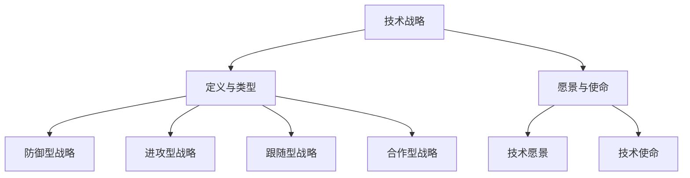
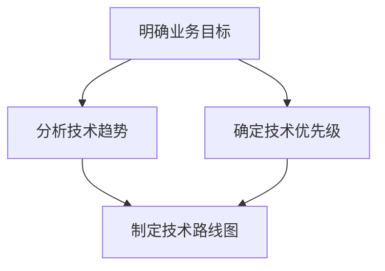

                 

## 文章标题

《技术战略制定：对齐业务目标与技术发展》

### 关键词

- 技术战略
- 业务目标
- 技术发展
- 企业管理
- 技术规划

### 摘要

本文旨在探讨如何制定技术战略以实现对业务目标的精准对齐。文章从技术战略的重要性和背景分析出发，详细阐述了技术战略规划方法论，包括基本概念、规划流程和评估调整。接着，文章深入探讨了技术战略与业务目标的对齐原则和方法，结合实际案例分析成功与失败的经验。此外，文章还分析了技术发展趋势及其预测方法，并探讨了技术战略实施与执行的要点。最后，文章总结了技术战略评估与持续改进的方法，以及技术战略与企业文化的关系，为企业在技术战略制定过程中提供实用指导。

## 引言与背景

### 1.1 引言

在当今这个科技飞速发展的时代，技术战略已成为企业成功的关键因素之一。技术战略不仅关乎企业的创新能力和竞争力，更是企业长期发展的重要保障。然而，很多企业在制定技术战略时存在一定的误区，如忽视业务目标、缺乏系统规划、未能及时调整等。这些问题往往导致技术战略与业务发展不匹配，影响企业整体运营效率。因此，如何制定合理的技术战略，并将其与业务目标对齐，成为企业亟需解决的重要课题。

### 1.2 背景分析

#### 当前技术环境概述

当前，全球技术环境正发生着深刻变革。人工智能、大数据、物联网、区块链等新兴技术不断涌现，为各行各业带来了前所未有的机遇。企业必须紧跟技术发展趋势，才能在激烈的市场竞争中立于不败之地。同时，技术环境的快速变化也带来了巨大的挑战，企业需要具备快速响应和调整的能力，以应对技术变革带来的不确定性。

#### 企业面临的挑战与机遇

企业在制定技术战略时，既要应对挑战，又要把握机遇。挑战主要包括：

1. **技术复杂性**：新兴技术的不断涌现使得技术变得更加复杂，企业需要具备较强的技术理解和应用能力。
2. **人才短缺**：技术人才短缺已成为企业面临的一大难题，企业需要投入更多资源进行人才培养和引进。
3. **成本压力**：技术投入往往伴随着较高的成本，企业需要在有限的资源下实现最大化效益。

然而，技术发展也带来了众多机遇：

1. **市场拓展**：新兴技术为企业提供了更广阔的市场空间，有助于企业实现业务增长。
2. **效率提升**：技术的应用可以大幅提升企业运营效率，降低成本，提高竞争力。
3. **创新驱动**：技术驱动创新，企业可以通过技术创新实现产品和服务的差异化竞争。

在挑战与机遇并存的环境中，企业如何制定合理的技术战略，以实现对业务目标的精准对齐，成为关键所在。

### 总结

通过引言和背景分析，我们可以看出技术战略在企业发展中的重要性，以及当前技术环境对企业带来的挑战与机遇。接下来，我们将详细探讨技术战略规划方法论，以帮助读者更好地理解如何制定和实施有效技术战略。

### 2.1 基本概念

#### 技术战略的定义与类型

技术战略是指企业为了实现长期发展目标，根据外部环境和内部资源，对技术发展方向、技术投入和技术应用等方面所做的系统规划和决策。技术战略的类型可以分为以下几种：

1. **防御型战略**：企业通过保持技术领先地位，以防御竞争对手的进攻。这种战略适用于技术成熟、市场稳定的环境。

2. **进攻型战略**：企业通过技术创新，开拓新的市场空间，以抢占市场份额。这种战略适用于新兴技术领域，企业需要具备较强的研发能力和市场敏感度。

3. **跟随型战略**：企业通过跟踪和模仿领先企业的技术，以快速适应市场需求。这种战略适用于技术风险较高、资源有限的企业。

4. **合作型战略**：企业通过与其他企业或研究机构合作，共享技术和资源，以实现共同发展。这种战略适用于技术创新需要大量投入和跨学科合作的环境。

#### 技术愿景与使命

技术愿景是指企业对未来技术的期望和目标，通常包括技术发展方向、技术突破和业务模式创新等方面。技术愿景应具有前瞻性和可行性，能够激励员工不断追求技术创新。

技术使命是指企业在技术领域所要实现的核心价值和社会责任。技术使命应与企业核心价值观相一致，并能够指导企业技术战略的制定和实施。

#### 核心概念与联系

为了更好地理解技术战略的基本概念，我们可以使用 Mermaid 流程图来展示这些概念之间的联系：

通过上述定义和流程图，我们可以更清晰地理解技术战略的基本概念及其相互关系，为后续的技术战略规划提供基础。

### 总结

在本章节中，我们介绍了技术战略的定义和类型，以及技术愿景与使命的概念。通过这些基本概念的理解，企业可以更好地制定符合自身发展需求的技术战略。接下来，我们将详细探讨技术战略规划的具体流程，以帮助读者深入理解如何制定和实施技术战略。

### 2.2 技术战略规划流程

技术战略规划是企业实现长期发展目标的重要手段，其核心在于明确业务目标、分析技术趋势、确定技术优先级以及制定技术路线图。以下是技术战略规划的具体流程：

#### 明确业务目标

业务目标是企业发展的基石，技术战略的制定应围绕业务目标进行。明确业务目标包括以下几个方面：

1. **企业愿景**：企业对未来发展的总体设想，如成为行业领导者、实现全球市场布局等。
2. **业务目标**：具体描述企业在特定时间内要实现的目标，如增加市场份额、提高运营效率、降低成本等。
3. **关键绩效指标（KPI）**：量化业务目标的具体指标，如销售额增长率、客户满意度等。

通过明确业务目标，企业可以确保技术战略与业务发展紧密衔接，避免资源浪费和战略失误。

#### 分析技术趋势

技术趋势分析是企业制定技术战略的重要依据。以下是技术趋势分析的关键步骤：

1. **市场调研**：收集行业技术发展动态、竞争对手技术策略和市场环境信息。
2. **技术评估**：对现有技术和新兴技术进行评估，分析其技术成熟度、应用场景和潜在价值。
3. **技术预测**：基于市场调研和技术评估结果，预测未来技术发展方向和趋势。

通过分析技术趋势，企业可以把握行业发展方向，提前布局关键技术，为技术战略制定提供有力支持。

#### 确定技术优先级

在明确业务目标和分析技术趋势的基础上，企业需要根据业务需求和资源情况，确定技术优先级。以下是确定技术优先级的几个关键因素：

1. **业务需求**：优先满足业务发展对技术的迫切需求，如提高产品性能、降低运营成本等。
2. **技术成熟度**：优先选择成熟度较高的技术，以降低技术风险和研发成本。
3. **资源限制**：根据企业资源状况，合理分配技术资源，确保重点技术的优先发展。

通过确定技术优先级，企业可以确保技术战略的可行性和高效性，避免资源浪费和重复投入。

#### 制定技术路线图

技术路线图是技术战略的具体实施路径，包括技术目标、时间表和实施步骤等。以下是制定技术路线图的关键步骤：

1. **设定技术目标**：明确技术路线图要实现的具体目标，如技术突破、产品创新等。
2. **制定时间表**：根据技术目标，规划技术实施的时间节点和关键里程碑。
3. **分配资源**：明确技术实施所需的资源，包括人力、资金和设备等。
4. **风险评估**：评估技术实施过程中可能遇到的风险和挑战，并制定应对策略。

通过制定技术路线图，企业可以有条不紊地推进技术战略的实施，确保目标的顺利实现。

#### 核心概念与联系

为了更好地理解技术战略规划流程，我们可以使用 Mermaid 流程图来展示各环节之间的联系：

通过上述流程图，我们可以清晰地看到技术战略规划各环节之间的逻辑关系，为读者提供直观的理解。

### 总结

在本章节中，我们详细介绍了技术战略规划的具体流程，包括明确业务目标、分析技术趋势、确定技术优先级和制定技术路线图。通过这些步骤，企业可以制定出符合自身发展需求的技术战略，为企业的长期发展奠定坚实基础。接下来，我们将探讨技术战略评估与调整的重要性及其方法。

### 2.3 技术战略评估与调整

技术战略评估与调整是确保技术战略与企业业务目标保持一致的重要环节。通过对技术战略的持续评估和调整，企业可以及时发现和纠正战略偏差，确保技术资源的有效利用和战略目标的顺利实现。

#### 评估技术战略的有效性

技术战略评估主要包括以下方面：

1. **业务目标达成情况**：评估技术战略是否有助于实现企业业务目标，如市场份额增长、客户满意度提升等。
2. **资源投入与产出比**：评估技术战略实施过程中资源投入的合理性，以及产出是否符合预期，如研发成本、市场推广费用等。
3. **技术创新能力**：评估企业在技术战略指导下技术创新的能力，如技术突破、产品创新等。
4. **市场竞争力**：评估技术战略对企业市场竞争力的提升情况，如产品性能、市场份额等。

通过这些评估指标，企业可以全面了解技术战略的实施效果，为后续调整提供依据。

#### 调整技术战略以适应变化

技术环境是不断变化的，企业需要根据市场和技术发展趋势，对技术战略进行动态调整。以下是调整技术战略的几个关键步骤：

1. **重新评估业务目标**：根据市场变化和内部发展需求，重新审视和调整业务目标，确保技术战略与业务目标的一致性。
2. **调整技术优先级**：根据新的业务目标和技术发展趋势，重新确定技术优先级，确保关键技术的优先发展。
3. **优化技术路线图**：基于新的业务目标和技术优先级，调整技术路线图，确保技术实施路径的可行性和高效性。
4. **资源配置调整**：根据技术战略调整的需要，重新分配资源，确保技术资源的合理利用和高效配置。

#### 调整方法

1. **定期评估与反馈**：建立定期评估机制，对技术战略的实施情况进行持续跟踪和评估，及时发现问题并进行反馈。
2. **市场调研与趋势分析**：定期进行市场调研和技术趋势分析，了解行业动态和技术发展方向，为技术战略调整提供数据支持。
3. **跨部门协作与沟通**：加强跨部门协作与沟通，确保技术战略调整与业务发展需求相匹配，避免部门间的信息孤岛。

通过上述方法，企业可以有效地评估和调整技术战略，确保技术战略始终与业务目标保持一致，为企业的长期发展提供有力保障。

### 总结

在本章节中，我们探讨了技术战略评估与调整的重要性及其具体方法。通过定期评估和动态调整，企业可以确保技术战略始终与业务目标对齐，为企业的持续发展提供坚实基础。接下来，我们将深入探讨技术战略与业务目标的对齐原则和方法，以帮助读者更好地理解如何实现技术战略的有效落地。

### 3.1 对齐原则

技术战略与业务目标的对齐是确保企业资源有效配置和战略目标顺利实现的关键。为了实现这一目标，企业需要遵循以下原则：

#### 1. 对齐业务目标与技术目标

业务目标是指企业在特定时间内要实现的具体目标，如市场份额提升、客户满意度提高等。技术目标则是为实现业务目标所需要的技术能力，如技术创新、产品升级等。对齐业务目标与技术目标的含义在于确保技术发展的方向和速度与业务发展需求相匹配，避免技术资源浪费和战略目标偏离。

#### 2. 保持战略一致性

战略一致性是指技术战略与企业整体战略相一致，确保技术战略在实现业务目标的同时，与企业的长期愿景和核心价值观保持一致。例如，如果企业的核心价值是创新，那么技术战略应着重于技术创新和产品研发。

#### 3. 适应性调整

技术环境是不断变化的，企业需要具备快速适应市场和技术变化的能力。对齐原则中的适应性调整意味着企业应能够根据市场和技术发展趋势，及时调整技术战略，确保其与业务目标保持一致。例如，当新兴技术出现时，企业应及时评估其潜在价值，并将其纳入技术战略规划。

#### 4. 资源合理配置

对齐原则还强调资源的合理配置，确保企业在技术战略实施过程中，能够充分利用现有资源，避免资源浪费。这包括人力、资金和设备等资源的优化配置，以确保技术战略的有效实施。

#### 5. 全员参与

对齐原则要求企业全员参与技术战略的制定和实施，确保技术战略得到广泛认同和执行。全员参与不仅包括管理层和技术团队，还涵盖市场、销售、运营等各部门，通过跨部门协作，实现技术战略与业务目标的深度融合。

#### 6. 持续优化

技术战略与业务目标的对齐不是一次性的过程，而是一个持续优化的过程。企业应定期评估技术战略的实施效果，并根据业务需求和技术环境的变化，不断进行调整和优化，确保技术战略始终保持与业务目标的一致性。

### 总结

通过遵循以上对齐原则，企业可以确保技术战略与业务目标紧密衔接，实现资源的高效配置和战略目标的顺利实现。接下来，我们将深入探讨实现技术战略与业务目标对齐的具体方法，以帮助读者更好地理解和应用这些原则。

### 3.2 对齐方法

实现技术战略与业务目标的对齐需要企业采取一系列系统化、具体化的方法。以下是一些关键步骤和方法，帮助企业在技术战略的制定和执行过程中确保其与业务目标的对齐。

#### 1. 业务需求分析

业务需求分析是技术战略对齐的首要步骤。企业需要深入了解业务目标和业务需求，包括市场趋势、客户需求、业务模式等。通过全面的业务需求分析，企业可以明确技术发展的方向和重点，确保技术投入与业务发展需求相匹配。

**步骤：**
- **市场调研**：收集行业和市场信息，了解市场趋势和竞争对手情况。
- **客户调研**：直接从客户获取需求，了解客户对产品和服务的期望。
- **业务模式分析**：分析企业当前的商业模式，识别业务需求的关键点。

**工具：**
- **SWOT分析**：通过分析企业的优势、劣势、机会和威胁，识别业务需求和技术发展的结合点。

#### 2. 技术可行性评估

在明确业务需求后，企业需要对技术的可行性进行评估，包括技术成熟度、成本、风险等因素。技术可行性评估有助于企业确定哪些技术可以实现业务需求，并在资源有限的情况下做出合理的技术选择。

**步骤：**
- **技术调研**：研究新兴技术和发展趋势，了解其应用场景和潜力。
- **成本分析**：评估技术实现的成本，包括研发成本、运营成本等。
- **风险评估**：识别技术实现过程中可能遇到的风险，并制定相应的应对措施。

**工具：**
- **PEST分析**：通过分析政治、经济、社会和技术环境因素，评估技术实现的宏观条件。
- **成本效益分析**：评估技术实现的经济效益，确保投入产出比合理。

#### 3. 风险管理

技术战略实施过程中，风险管理是确保战略目标实现的重要环节。企业需要建立完善的风险管理体系，识别、评估和应对潜在风险。

**步骤：**
- **风险识别**：识别技术战略实施过程中可能遇到的各种风险，包括技术风险、市场风险、运营风险等。
- **风险评估**：评估风险的影响程度和发生概率，确定优先级。
- **风险应对**：制定风险应对策略，包括风险规避、减轻、转移和接受。

**工具：**
- **风险矩阵**：通过风险矩阵评估风险的影响和发生概率，帮助制定优先级。
- **应急预案**：制定应急预案，确保在风险发生时能够迅速响应和处理。

#### 4. 跨部门协作

技术战略与业务目标的对齐需要跨部门协作，包括技术部门、业务部门、市场部门等。通过建立有效的沟通机制和协作流程，确保各部门能够协同工作，共同推进技术战略的实施。

**步骤：**
- **建立沟通机制**：定期召开跨部门会议，分享业务需求、技术进展和问题解决方案。
- **制定协作流程**：明确各部门的职责和协作流程，确保工作协调一致。
- **共享信息与资源**：建立信息共享平台，确保各部门能够及时获取相关数据和资源。

**工具：**
- **项目管理工具**：如Jira、Trello等，用于任务分配、进度跟踪和协作管理。
- **知识管理系统**：如Confluence，用于知识共享和文档管理。

#### 案例分析

以下是一个成功实现技术战略与业务目标对齐的案例：

**案例背景**：一家电子商务公司在市场竞争加剧的背景下，希望通过技术创新提升客户体验和运营效率。

**业务需求**：提高客户满意度、降低运营成本、扩大市场份额。

**技术可行性评估**：公司评估了多种技术，如人工智能、大数据分析和云计算，并进行了详细的成本效益分析和风险评估。

**风险管理**：公司制定了详细的风险管理计划，包括技术风险、市场风险和运营风险的应对措施。

**跨部门协作**：公司建立了跨部门的协作机制，技术部门与业务部门、市场部门紧密合作，共同推进技术战略的实施。

**结果**：通过技术战略的有效对齐，公司成功提升了客户满意度，降低了运营成本，市场份额也得到了显著扩大。

通过以上案例分析，我们可以看到，成功实现技术战略与业务目标对齐的关键在于深入的业务需求分析、全面的技术可行性评估、有效的风险管理以及跨部门协作。这些方法可以帮助企业在复杂多变的市场环境中，确保技术战略的顺利实施和业务目标的实现。

### 总结

在本章节中，我们详细介绍了实现技术战略与业务目标对齐的具体方法，包括业务需求分析、技术可行性评估、风险管理和跨部门协作。通过这些方法，企业可以确保技术战略与业务目标紧密衔接，实现资源的高效配置和战略目标的顺利实现。接下来，我们将探讨技术发展趋势及其预测方法，以帮助读者更好地把握技术方向。

### 4.1 技术发展趋势

在当前技术环境中，多个新兴技术正在快速发展，并对各行业产生深远影响。以下是几个主要的技术发展趋势：

#### 1. 人工智能与大数据

人工智能（AI）和大数据技术正在不断融合，推动各行各业的数字化转型。人工智能技术包括机器学习、深度学习、自然语言处理等，能够在数据分析和决策支持中发挥重要作用。大数据技术则通过处理海量数据，帮助企业发现商业机会和优化运营流程。

**应用场景**：智能客服、智能推荐、智能医疗诊断、智能交通管理。

#### 2. 物联网与边缘计算

物联网（IoT）和边缘计算技术正推动各行业向智能化和自动化方向迈进。物联网技术通过连接各种物理设备和传感器，实现数据的实时采集和传输。边缘计算则将计算能力下沉到网络边缘，实现数据的快速处理和分析。

**应用场景**：智能家居、智能工厂、智能城市、智能农业。

#### 3. 区块链与分布式技术

区块链技术和分布式账本技术正在改变金融、供应链管理、数据存储等领域。区块链技术通过去中心化的方式，实现数据的透明和安全存储。分布式技术则通过分散计算和存储，提高系统的可靠性和可扩展性。

**应用场景**：数字货币、智能合约、供应链管理、数据共享。

#### 4. 量子计算与5G

量子计算和5G技术是未来技术发展的重要方向。量子计算通过量子比特实现超高速计算，有望解决当前计算机难以处理的复杂问题。5G技术则提供超高速、低延迟的网络连接，支持物联网和智能应用的普及。

**应用场景**：复杂问题求解、人工智能加速、远程医疗、自动驾驶。

### 4.2 技术分析工具与方法

为了准确预测技术发展趋势，企业需要使用合适的技术分析工具和方法。以下是几种常用的技术分析工具：

#### 1. SWOT分析

SWOT分析是一种常用的战略规划工具，通过分析企业的优势（Strengths）、劣势（Weaknesses）、机会（Opportunities）和威胁（Threats），帮助企业制定合适的技术战略。

**步骤**：
- **优势分析**：识别企业在技术、资源、市场等方面的优势。
- **劣势分析**：识别企业在技术、资源、市场等方面的劣势。
- **机会分析**：分析外部环境中的机遇，如技术趋势、市场需求等。
- **威胁分析**：分析外部环境中的威胁，如竞争压力、技术风险等。

**应用**：用于评估技术发展趋势和制定技术战略。

#### 2. PEST分析

PEST分析是一种宏观环境分析工具，通过分析政治（Political）、经济（Economic）、社会（Social）和技术（Technological）因素，帮助企业了解外部环境的变化趋势。

**步骤**：
- **政治因素分析**：分析政策、法规、政府支持等对技术发展的影响。
- **经济因素分析**：分析经济形势、市场需求、投资趋势等对技术发展的影响。
- **社会因素分析**：分析社会文化、消费者行为、人口结构等对技术发展的影响。
- **技术因素分析**：分析技术创新、技术扩散、技术风险等对技术发展的影响。

**应用**：用于评估技术发展的宏观环境。

#### 3. 技术成熟度评估

技术成熟度评估是一种用于评估技术发展阶段的工具，通过评估技术的研发进度、市场应用情况和未来前景，帮助企业制定技术投资策略。

**步骤**：
- **研发进度评估**：评估技术的研发阶段和成果。
- **市场应用评估**：评估技术的市场应用情况和市场接受度。
- **未来前景评估**：评估技术的未来发展潜力和社会影响。

**应用**：用于评估新兴技术的可行性和投资价值。

### 4.3 技术发展预测

技术发展预测是制定技术战略的重要依据。以下是一些常见的技术发展预测方法：

#### 1. 专家评估

专家评估是通过邀请行业专家、技术专家等对技术发展趋势进行评估和预测。这种方法具有直观、快速的优势，但受限于专家的主观判断和知识面。

**步骤**：
- **专家筛选**：选择具备专业知识和经验的专家。
- **评估会议**：召开评估会议，收集专家意见。
- **结果汇总**：汇总专家意见，形成技术发展预测报告。

**应用**：用于初步预测技术发展趋势。

#### 2. 数据分析

数据分析是通过分析历史数据、市场调研数据等，利用统计分析、机器学习等方法预测技术发展趋势。这种方法具有客观、系统的优势，但受限于数据的准确性和分析方法。

**步骤**：
- **数据收集**：收集相关技术的历史数据和现状数据。
- **数据分析**：使用统计分析、机器学习等方法进行数据处理和分析。
- **结果预测**：根据数据分析结果，预测技术发展趋势。

**应用**：用于精确预测技术发展趋势。

#### 3. 技术路线图

技术路线图是通过绘制技术发展的时间轴和关键节点，预测技术发展的路径和趋势。这种方法具有直观、系统的优势，但受限于预测的精度。

**步骤**：
- **技术分析**：分析现有技术和新兴技术。
- **路线规划**：根据技术分析结果，规划技术发展的路线和关键节点。
- **路线图绘制**：绘制技术路线图，展示技术发展的路径和趋势。

**应用**：用于指导技术投资和战略制定。

### 总结

在本章节中，我们探讨了当前技术发展的主要趋势，并介绍了SWOT分析、PEST分析和技术成熟度评估等常用技术分析工具和方法。此外，我们还讨论了专家评估、数据分析和技术路线图等常见的技术发展预测方法。通过这些工具和方法，企业可以更好地预测技术发展趋势，制定合理的技术战略，以应对未来市场的变化和挑战。

### 4.3 技术发展预测

技术发展预测是制定技术战略的关键步骤，它帮助企业预见未来技术趋势，为长期发展提供指导。以下从长期和短期两个角度，探讨技术发展的预测方法及对未来影响的评估。

#### 1. 长期技术发展预测

长期技术发展预测关注未来几年甚至几十年的技术趋势。以下是一些常用的预测方法：

1. **趋势分析法**：通过分析历史数据，识别技术的发展趋势，如技术成熟度曲线（Gartner Hype Cycle）、技术成熟度表（Technology Readiness Level, TRL）等。例如，Gartner Hype Cycle展示了不同技术从产生、发展到成熟的整个过程，帮助企业了解技术发展的时间表。

2. **专家预测法**：邀请行业专家、技术领袖等，基于他们的专业知识和经验，对技术未来发展进行预测。这种方法具有权威性，但可能受到专家个人观点的影响。

3. **情景分析法**：通过构建不同的未来情景，预测技术在不同情景下的可能发展路径。这种方法有助于企业了解不同未来情景下的技术发展，为应对不确定性做好准备。

**长期技术发展预测示例**：

- **人工智能**：预计未来几年，人工智能将继续快速发展，应用领域将从金融服务、医疗健康扩展到更多行业。随着量子计算、边缘计算等技术的进步，人工智能的计算能力和应用范围将进一步提升。

- **物联网**：物联网设备将变得更加普及，实现更广泛的互联互通。智能家居、智能城市、智能交通等领域将受益于物联网技术，带来生活方式的变革。

- **区块链**：区块链技术将在金融、供应链管理等领域得到广泛应用，提高数据透明度和安全性。分布式账本技术将改变传统业务模式，推动去中心化的发展。

#### 2. 短期技术发展预测

短期技术发展预测关注未来一年到几年的技术趋势。以下是一些常用的预测方法：

1. **市场调研法**：通过收集市场数据，分析技术市场需求、应用场景和竞争态势。这种方法有助于企业了解当前技术发展趋势和市场需求，为短期战略规划提供依据。

2. **趋势图法**：通过绘制趋势图，展示技术发展速度和变化趋势。例如，技术成熟度曲线（Gartner Hype Cycle）就是一种常见的趋势图，帮助企业了解不同技术在不同时间段的发展速度。

3. **技术评估法**：通过对现有技术和新兴技术进行评估，分析其技术成熟度、市场前景和潜在风险。这种方法有助于企业确定技术投资的重点方向。

**短期技术发展预测示例**：

- **5G技术**：5G技术在2020年左右正式商用，预计未来几年将继续普及，为物联网、自动驾驶、远程医疗等领域提供高速、低延迟的网络支持。

- **大数据分析**：随着数据量的不断增加，大数据分析技术将继续发展，帮助企业从海量数据中挖掘价值。实时数据分析和预测模型将在金融、零售、制造业等领域得到广泛应用。

- **区块链应用**：区块链技术将在更多领域得到应用，如数字货币、智能合约等。短期内的应用主要集中在金融和供应链管理领域，未来有望扩展到更多行业。

#### 3. 技术变革带来的影响

技术变革将对企业和行业带来深远影响，以下是一些潜在的影响：

- **产业变革**：新技术将推动传统产业的转型升级，如智能制造、智慧城市等。企业需要适应新技术，才能在竞争中获得优势。

- **商业模式的创新**：技术变革将带来新的商业模式，如共享经济、平台经济等。企业需要探索新的商业模式，以适应市场变化。

- **就业结构的变化**：新技术将改变就业结构，一方面，某些岗位将消失，如流水线工人；另一方面，新技术将创造新的就业机会，如数据分析师、人工智能工程师等。

- **隐私和安全问题**：随着数据和技术的发展，隐私和安全问题日益凸显。企业需要加强数据保护和网络安全，以应对潜在的风险。

### 总结

技术发展预测是制定技术战略的重要环节，通过长期和短期技术发展预测，企业可以把握未来技术趋势，为战略规划提供指导。同时，技术变革将带来产业、商业模式的变革，以及就业结构的变化，企业需要积极应对这些变化，以保持竞争力。在接下来的章节中，我们将探讨技术战略实施与执行的关键步骤和要点。

### 5.1 实施计划

技术战略的实施计划是确保技术战略得以成功落地的重要环节。一个详细而周密的实施计划可以帮助企业有条不紊地推进技术项目，确保各项任务的顺利进行和目标的达成。以下是制定技术战略实施计划的几个关键步骤：

#### 1. 明确实施目标

在制定实施计划之前，首先要明确技术战略的实施目标。这些目标应与企业的业务目标紧密对齐，具体、可衡量，并具有实际操作性。例如，目标可以是提升产品性能、降低运营成本、扩大市场份额等。

#### 2. 确定实施步骤

明确目标后，需要将目标分解为一系列具体的实施步骤。每个步骤都应包括具体的任务、责任人和时间表。以下是一个示例：

- **步骤1**：进行市场调研，了解竞争对手和市场需求。
- **责任人**：市场营销团队。
- **时间表**：1个月内完成。

- **步骤2**：确定技术需求和可行性，制定技术方案。
- **责任人**：技术研发团队。
- **时间表**：2个月内完成。

- **步骤3**：进行技术测试和优化，确保方案符合预期。
- **责任人**：技术研发团队。
- **时间表**：3个月内完成。

#### 3. 资源配置

实施计划的制定需要考虑资源的合理配置，包括人力、资金和设备等。在制定计划时，应确保所需资源能够及时到位，并合理分配。以下是一个资源配置示例：

- **人力**：分配研发人员、测试人员和支持人员，确保每个任务都有专人负责。
- **资金**：根据实施计划中的任务和时间表，制定资金使用计划，确保资金充足。
- **设备**：提前采购或调配必要的设备，如服务器、测试工具等。

#### 4. 风险评估与应对策略

在制定实施计划时，必须对可能出现的风险进行评估，并制定相应的应对策略。以下是一个风险评估和应对策略示例：

- **风险1**：技术方案不符合预期。
- **应对策略**：定期进行技术评估，及时调整方案。
- **风险2**：项目进度延误。
- **应对策略**：建立严格的进度监控机制，定期汇报进度，及时解决延误问题。

#### 5. 监控与调整

实施计划的监控与调整是确保项目按计划进行的关键。企业应建立定期检查和评估机制，对项目进度、资源使用和风险评估进行持续监控。以下是一个监控与调整示例：

- **每周进度汇报**：各部门负责人每周汇报项目进度，总结问题和解决方案。
- **月度评审会议**：组织月度评审会议，对项目进行全面评估，讨论和解决重大问题。
- **定期调整**：根据监控结果，对实施计划进行及时调整，确保项目按计划推进。

### 总结

通过上述步骤，企业可以制定出一个详细而周密的技术战略实施计划，确保技术战略得以顺利落地。实施计划的制定和执行不仅需要明确的目标、详细的步骤和合理的资源配置，还需要对风险进行评估和应对，并建立有效的监控与调整机制。只有这样，企业才能在技术战略的实施过程中保持灵活性，确保项目成功完成。

### 5.2 执行与监控

技术战略的执行与监控是确保技术项目按时、按质、按量完成的关键环节。有效的执行与监控不仅能保证技术方案的顺利实施，还能及时发现和解决项目中可能出现的问题，确保项目的成功交付。

#### 1. 监控技术进展

监控技术进展是确保项目按计划进行的重要措施。企业可以通过以下几种方式对技术进展进行监控：

- **定期检查**：制定定期检查计划，如每周或每月对项目进度进行一次全面检查。检查内容包括任务完成情况、资源使用情况、质量评估等。
- **进度汇报**：建立进度汇报制度，要求各部门负责人定期向项目管理团队汇报项目进展情况。这有助于及时了解项目状态，发现潜在问题。
- **实时跟踪**：利用项目管理工具（如Jira、Trello等）进行实时跟踪，记录项目进度和任务完成情况，确保项目进展透明。

#### 2. 调整执行策略

在监控过程中，可能会发现项目进展与预期存在偏差，此时需要及时调整执行策略。以下是一些常见的调整措施：

- **资源调配**：根据项目进展情况，及时调整人力资源和物资资源，确保关键任务得到充足支持。
- **任务分解**：将大型任务分解为若干小任务，逐步推进，降低任务难度和风险。
- **时间调整**：如果项目进度延误，可以适当调整时间表，确保关键任务按时完成。

#### 3. 沟通机制建立

建立有效的沟通机制是确保项目顺利推进的重要保障。企业可以通过以下几种方式建立沟通机制：

- **定期会议**：定期召开项目会议，讨论项目进展、解决问题和分享经验。会议形式可以包括周会、月会等。
- **信息共享**：建立信息共享平台，如Confluence或SharePoint，确保团队成员能够及时获取项目相关信息。
- **即时沟通**：利用即时通讯工具（如Slack、微信等）进行即时沟通，解决突发问题和紧急事务。

#### 4. 跨部门协作

技术战略的实施往往涉及多个部门，如研发、市场、销售、运营等。跨部门协作的顺畅与否直接影响项目的进展和效果。以下是一些促进跨部门协作的措施：

- **共同目标**：明确跨部门协作的目标，确保各部门理解并支持项目目标。
- **角色分工**：明确各部门在项目中的职责和角色，确保任务分配合理。
- **协作培训**：定期组织跨部门协作培训，提高团队成员的协作意识和能力。

#### 5. 持续改进

技术战略的执行和监控不仅是短期任务，更是一个持续改进的过程。企业可以通过以下几种方式实现持续改进：

- **问题反馈**：建立问题反馈机制，鼓励团队成员提出问题和建议，及时改进项目管理和实施策略。
- **经验总结**：项目结束后，组织经验总结会议，总结项目过程中的成功经验和教训，为未来项目提供参考。
- **知识分享**：建立知识分享平台，记录项目中的最佳实践和成功案例，供团队成员学习和借鉴。

### 总结

通过执行与监控技术进展、调整执行策略、建立沟通机制、促进跨部门协作和实现持续改进，企业可以确保技术战略的有效实施。这不仅有助于项目的按时完成和目标的达成，还能提高团队协作效率和项目成功率。在接下来的章节中，我们将探讨技术战略评估与持续改进的方法，以帮助读者更好地理解和应用这些原则。

### 6.1 评估指标

技术战略评估是确保战略目标实现和资源有效利用的重要环节。为了对技术战略进行科学、全面的评估，企业需要设定一系列明确的评估指标，这些指标应具备可量化、可操作和可追踪的特点。以下是几个关键的技术战略评估指标：

#### 1. 成本效益指标

成本效益指标是评估技术战略投入产出比的重要指标，包括以下内容：

- **投资回报率（ROI）**：计算技术投资的回报与投入之间的比率，以衡量技术战略的经济效益。
- **总成本（TCO）**：计算技术战略实施过程中涉及的所有成本，包括研发成本、运营成本和培训成本等。
- **效益成本比（BCR）**：比较技术战略带来的效益与成本之间的关系，评估投入的合理性。

#### 2. 业务绩效指标

业务绩效指标是评估技术战略对业务目标实现程度的关键指标，包括以下内容：

- **市场份额**：衡量企业在市场中所占的份额，反映技术战略对市场拓展的影响。
- **客户满意度**：通过客户反馈和调查数据，评估客户对产品和服务的满意度，反映技术战略对客户体验的提升。
- **运营效率**：衡量企业运营流程的优化程度，包括生产效率、供应链管理效率等，反映技术战略对运营效率的提升。

#### 3. 技术创新指标

技术创新指标是评估技术战略对技术创新能力提升的关键指标，包括以下内容：

- **专利数量**：衡量企业在技术创新方面的成果，反映技术战略对知识产权的积累。
- **研发投入**：计算企业在研发方面的投入，反映技术战略对技术创新的支持力度。
- **技术突破**：评估技术战略实施过程中实现的技术突破，包括核心技术、新产品等。

#### 4. 风险管理指标

风险管理指标是评估技术战略实施过程中风险控制效果的关键指标，包括以下内容：

- **风险发生率**：计算技术战略实施过程中发生风险的事件数量，反映风险管理的有效性。
- **风险损失**：评估技术战略实施过程中因风险导致的经济损失，反映风险管理的经济影响。
- **风险应对能力**：衡量企业在应对技术风险方面的能力，包括风险预警机制、应急响应等。

#### 5. 持续改进指标

持续改进指标是评估技术战略实施过程中的改进效果和持续发展能力的关键指标，包括以下内容：

- **改进项目数量**：计算在技术战略实施过程中启动的改进项目数量，反映持续改进的积极性。
- **改进效果**：评估改进项目的实际效果，包括成本降低、效率提升等。
- **员工满意度**：通过员工满意度调查，反映持续改进措施对员工工作积极性和工作环境的影响。

### 设定评估指标

在设定评估指标时，企业需要遵循以下原则：

- **目标明确**：确保评估指标与企业的业务目标和战略目标紧密对齐，明确技术战略实施的具体目标。
- **可量化**：评估指标应具备可量化的特点，以便于进行数据分析和比较。
- **可操作性**：评估指标应具备可操作性，能够通过实际操作进行验证和实施。
- **可追踪性**：评估指标应具备可追踪性，能够对技术战略实施过程中的关键节点进行跟踪和监控。

通过以上原则，企业可以设定出科学、全面的评估指标，确保技术战略的有效评估和持续改进。

### 6.2 持续改进

技术战略的持续改进是企业保持竞争力、适应市场变化和提升运营效率的关键。为了实现技术战略的持续改进，企业需要建立完善的持续改进机制，从评估结果出发，制定针对性的改进计划和措施。

#### 1. 根据评估结果进行调整

评估结果是持续改进的重要依据。企业应根据评估结果，对技术战略中的不足之处进行识别和诊断，找出存在的问题和改进方向。以下是一些关键步骤：

- **问题识别**：分析评估结果，识别技术战略实施过程中存在的不足和问题，如成本控制不力、项目进度延误、技术创新不足等。
- **原因分析**：对识别出的问题进行深入分析，找出导致问题的根本原因，如资源不足、沟通不畅、风险管理不到位等。
- **改进建议**：根据原因分析结果，提出针对性的改进建议，如优化资源配置、改进项目管理流程、加强风险管理等。

#### 2. 制定改进计划

在确定改进方向和建议后，企业需要制定详细的改进计划，确保改进措施能够得到有效实施。以下是一些关键步骤：

- **目标设定**：明确改进计划的目标，如提升项目进度、降低运营成本、增强技术创新能力等。
- **措施制定**：根据改进建议，制定具体的改进措施，如增加研发投入、优化项目管理流程、建立风险预警机制等。
- **时间表规划**：制定改进措施的实施时间表，明确每个改进措施的具体实施时间节点，确保改进计划的有序推进。
- **责任分配**：明确每个改进措施的责任人和责任范围，确保改进计划得到有效执行。

#### 3. 实施改进措施

改进计划的实施是持续改进的关键环节。企业需要确保改进措施得到有效执行，并跟踪改进效果。以下是一些关键步骤：

- **执行监督**：建立执行监督机制，对改进措施的实施过程进行监控，确保每个改进措施按照计划推进。
- **反馈机制**：建立反馈机制，收集改进措施实施过程中的问题和建议，及时进行调整和优化。
- **效果评估**：定期对改进措施的效果进行评估，通过量化的指标和实际案例，验证改进措施的有效性。
- **持续优化**：根据评估结果，对改进措施进行持续优化，确保改进效果的不断提升。

#### 4. 持续优化技术战略

持续改进不仅是对现有问题的解决，更是对技术战略的持续优化。企业需要将改进经验纳入技术战略的制定和实施过程中，不断提升技术战略的科学性和可操作性。以下是一些关键步骤：

- **经验总结**：在每次改进过程中，总结成功经验和失败教训，形成最佳实践和改进指南。
- **战略调整**：根据改进经验和市场变化，对技术战略进行调整和优化，确保技术战略与市场需求的匹配度。
- **培训与发展**：加强对员工的培训和发展，提高员工的技术能力和管理水平，为技术战略的持续改进提供人才保障。

### 总结

通过根据评估结果进行调整、制定改进计划、实施改进措施和持续优化技术战略，企业可以确保技术战略的持续改进，保持竞争力和创新能力。持续改进不仅是对问题的解决，更是对技术战略的不断完善和优化，为企业实现长期发展目标提供坚实保障。

### 6.3 培训与发展

在技术战略的实施过程中，员工的技术能力和知识水平对战略的成功至关重要。因此，技术培训与职业发展是确保企业技术团队持续成长和高效运作的关键环节。

#### 1. 员工技术培训

员工技术培训旨在提升员工的专业技能和知识水平，以适应技术战略实施的需求。以下是一些关键步骤：

- **需求分析**：首先，企业应进行技术培训需求分析，识别员工在专业技能和知识方面的差距和需求。
- **培训计划**：根据需求分析结果，制定详细的培训计划，包括培训内容、培训方式、培训时间和培训资源等。
- **培训实施**：实施培训计划，可以通过内部培训、外部培训、在线学习等多种方式，确保培训内容的全面性和实用性。
- **效果评估**：培训结束后，对员工的学习效果进行评估，确保培训目标达成。

#### 2. 职业发展规划

职业发展规划旨在帮助员工明确职业发展路径，提升职业素养和职业能力。以下是一些关键步骤：

- **能力评估**：首先，企业应对员工的能力和潜力进行评估，确定员工的职业发展方向。
- **发展规划**：根据能力评估结果，为员工制定个性化的职业发展规划，包括短期目标和长期目标。
- **技能提升**：通过提供专业培训、工作轮换、参与重大项目等多种途径，帮助员工提升专业技能和管理能力。
- **职业晋升**：建立公平、透明的晋升机制，为员工提供职业晋升的机会，激励员工持续提升自我。

#### 3. 技术发展路径规划

技术发展路径规划是企业技术战略的重要组成部分，它为员工提供了清晰的发展方向和目标。以下是一些关键步骤：

- **明确目标**：企业应明确技术发展的长期和短期目标，确保技术路径规划与业务目标相一致。
- **技能需求**：根据技术发展目标，识别所需的技术技能和管理能力，为员工制定具体的学习计划。
- **资源支持**：提供必要的资源支持，包括培训经费、学习资料、导师指导等，确保员工能够顺利实现发展目标。
- **持续评估**：定期对技术发展路径的执行情况进行评估，及时调整规划，确保其与市场需求和企业战略保持一致。

#### 4. 案例分享

以下是一个成功的技术培训与职业发展案例：

**案例背景**：某知名互联网公司在实施其技术战略过程中，发现员工在云计算和人工智能领域存在技能缺口，因此决定进行技术培训和职业发展规划。

**解决方案**：
- **需求分析**：公司对全体员工进行了技能评估，识别出云计算和人工智能方面的技能需求。
- **培训计划**：公司制定了详细的培训计划，包括内部培训课程、外部专业培训、在线学习等，并提供相关学习资源。
- **职业发展规划**：为员工制定了个性化的职业发展规划，明确了短期和长期目标，如云计算工程师、人工智能研究员等。
- **效果评估**：培训结束后，公司对员工的学习效果进行了评估，发现员工在云计算和人工智能方面的技能显著提升，对业务贡献度增加。

**结果**：通过技术培训和职业发展规划，公司员工的技术能力和职业素养得到了显著提升，为企业技术战略的实施提供了有力支持。

### 总结

技术培训与职业发展规划是确保企业技术团队持续成长和高效运作的关键。通过系统的培训计划和明确的职业发展规划，企业能够提升员工的技术能力和职业素养，为技术战略的成功实施提供坚实保障。

### 7.1 企业文化的作用

企业文化在技术战略的制定和实施中扮演着至关重要的角色。企业文化不仅是企业价值观、信念和行为准则的体现，更是推动技术战略与业务目标对齐的重要力量。以下从几个方面探讨企业文化在技术战略中的作用：

#### 1. 激励创新

创新是技术战略的核心驱动力，而企业文化在激发创新方面具有重要作用。一个积极向上的企业文化能够鼓励员工敢于尝试、勇于创新，从而推动技术进步。例如，Google的企业文化强调“不作恶”和“快速迭代”，这种文化氛围促使员工不断提出新的创意和解决方案，为公司的技术发展提供了源源不断的动力。

#### 2. 促进协作

技术战略的实施往往涉及多个部门、团队甚至合作伙伴的协作。企业文化在促进协作方面发挥着关键作用。一个开放、包容的企业文化能够鼓励不同部门和团队之间的沟通和合作，减少内部摩擦和冲突，提高整体效率。例如，阿里巴巴的企业文化强调“协同作战”和“团队合作”，这种文化促使员工在工作中相互支持、协同工作，从而确保技术战略的有效实施。

#### 3. 提升员工忠诚度

企业文化对员工的忠诚度和归属感有着深远影响。一个重视员工成长和发展的企业文化能够提高员工的满意度和忠诚度，从而减少人员流失，确保技术战略的长期稳定实施。例如，Facebook的企业文化强调“员工第一”和“自由创新”，这种文化氛围使员工感受到企业对他们的重视和认可，从而增强对企业的忠诚度。

#### 4. 强化执行力

企业文化在提升执行力方面也发挥着重要作用。一个具有明确价值观和目标的企业文化能够帮助员工明确工作方向和目标，提高执行力和责任感。例如，Amazon的企业文化强调“以客户为中心”和“快速决策”，这种文化氛围促使员工在执行技术战略时能够迅速响应市场变化，提高工作效率和执行力。

#### 5. 塑造企业品牌形象

企业文化对企业的品牌形象塑造具有重要作用。一个积极向上、富有创新精神的企业文化能够提升企业的社会形象和品牌价值，吸引更多优秀人才和合作伙伴，为技术战略的实施提供有力支持。例如，苹果的企业文化强调“创新设计”和“用户体验”，这种文化氛围使苹果成为全球知名的高端科技品牌，为其技术战略的实施提供了强大品牌影响力。

### 总结

企业文化在技术战略的制定和实施中发挥着重要作用，包括激励创新、促进协作、提升员工忠诚度、强化执行力和塑造企业品牌形象等方面。一个积极向上的企业文化能够为技术战略的有效实施提供有力支持，帮助企业实现长期发展目标。

### 7.2 技术战略与企业文化融合

技术战略与企业文化之间的融合是实现企业长期成功的关键。这种融合不仅有助于确保技术战略的顺利实施，还能强化企业的核心竞争力。以下从几个方面探讨如何实现技术战略与企业文化之间的融合：

#### 1. 建立共同愿景

共同愿景是技术战略与企业文化融合的基础。企业需要明确技术发展的愿景和目标，并将其与企业文化中的核心价值观相结合，形成一致的愿景。例如，如果企业文化强调创新和持续改进，那么技术战略的愿景也应围绕这些核心价值观展开，确保两者方向一致。

**步骤**：

- **高层领导倡导**：企业高层领导应明确技术愿景，并通过会议、内部通讯等方式传达给全体员工。
- **员工参与**：鼓励员工参与到愿景的制定过程中，提高员工对愿景的认同感和参与感。
- **制定具体目标**：将共同愿景转化为具体的目标和行动计划，确保愿景在企业内部得到落地。

#### 2. 促进员工参与

员工参与是技术战略与企业文化融合的重要途径。一个积极的企业文化鼓励员工参与决策和项目管理，从而增强员工的归属感和责任感，确保技术战略得到有效执行。

**步骤**：

- **建立反馈机制**：建立有效的员工反馈机制，鼓励员工提出建议和意见，为技术战略的制定和实施提供参考。
- **参与决策**：在技术战略的制定和实施过程中，让员工参与到关键决策中，提高员工对技术战略的认同感。
- **培养主人翁精神**：通过培训和激励措施，培养员工的主人翁精神，使员工更积极地参与到技术战略的实施中。

#### 3. 文化传播与塑造

企业文化需要通过持续的宣传和实践活动来传播和塑造。通过这种方式，企业可以不断强化技术战略与企业文化之间的联系，确保员工对两者有深入的理解和认同。

**步骤**：

- **内部沟通**：定期举办内部会议、培训活动，宣传技术战略和文化价值观，确保员工对技术战略与文化有清晰的认识。
- **案例分享**：通过分享成功案例，展示技术战略与文化融合带来的实际成果，激励员工积极参与。
- **文化建设活动**：组织各类文化活动，如技术竞赛、创新大赛等，激发员工的创新精神和团队协作意识。

#### 4. 强化激励机制

激励机制是推动技术战略与企业文化融合的重要手段。通过有效的激励机制，企业可以激发员工的积极性和创造力，确保技术战略得到有效执行。

**步骤**：

- **奖励创新**：设立创新奖励，鼓励员工提出新技术、新方法，推动技术进步。
- **绩效挂钩**：将技术战略的执行情况与员工绩效挂钩，确保员工在技术战略实施中有明确的绩效目标。
- **长期激励**：通过股权激励、职业发展机会等长期激励措施，增强员工对企业的归属感和忠诚度。

#### 5. 跨部门协作

技术战略的实施往往需要多个部门的协作，而企业文化在促进跨部门协作方面也发挥着重要作用。通过强化企业文化，企业可以促进不同部门之间的沟通和合作，提高整体执行力。

**步骤**：

- **建立跨部门沟通机制**：设立跨部门沟通平台，如定期会议、工作小组等，促进部门间的信息交流和协作。
- **共同目标**：明确跨部门的共同目标，确保各部门在技术战略实施中有共同的方向和努力。
- **文化认同**：通过企业文化宣传和实践活动，增强各部门对技术战略和文化价值的认同感，提高协作效率。

### 总结

通过建立共同愿景、促进员工参与、文化传播与塑造、强化激励机制和跨部门协作，企业可以实现技术战略与企业文化之间的深度融合。这种融合不仅能够确保技术战略的有效实施，还能增强企业的核心竞争力，为企业长期发展提供坚实保障。

### 7.3 成功企业文化案例分析

在探讨如何实现技术战略与企业文化融合的过程中，以下将结合国内外成功企业的案例，分析其在技术战略实施和文化建设方面的经验与做法。

#### 1. 亚马逊（Amazon）

亚马逊以其以客户为中心的文化和持续创新精神著称。在技术战略实施方面，亚马逊通过以下措施实现了技术与文化的深度融合：

- **共同愿景**：亚马逊的创始人贝佐斯提出了“长期客户至上”的愿景，并将其贯穿于企业的技术战略中。无论是电商平台的技术升级还是物流系统的优化，亚马逊始终以提升客户体验为最终目标。
- **员工参与**：亚马逊鼓励员工参与技术决策，建立了“后台平台团队”（Back-end Engineering Teams, BETs），让员工有机会直接参与到关键技术的开发和改进中。这种做法不仅提高了员工的技术能力，也增强了他们对企业愿景的认同。
- **文化传播**：亚马逊定期举办技术分享会、创新竞赛等活动，鼓励员工分享技术见解和创意，形成浓厚的技术创新氛围。
- **激励机制**：亚马逊通过“股权奖励计划”（Employee Stock Award Program, ESOP）等多种激励措施，激励员工持续创新和贡献。

#### 2. 谷歌（Google）

谷歌以其自由开放的企业文化和强大的创新体系而闻名。在技术战略和文化建设方面，谷歌采取了以下措施：

- **共同愿景**：谷歌的“不做坏事”（Don't Be Evil）核心价值观指导其技术战略的制定和实施。在AI、大数据等前沿技术领域，谷歌始终秉持这一原则，开发出了一系列对社会有益的技术产品。
- **员工参与**：谷歌建立了开放透明的决策机制，允许员工参与公司重要决策的讨论。同时，谷歌还鼓励员工自主探索新项目，如谷歌X实验室（Google X）就是员工自主探索创新项目的典范。
- **文化传播**：谷歌通过内部的“Google Talks”系列讲座，让员工分享技术见解和研究成果，促进知识的传播和交流。
- **激励机制**：谷歌提供了一系列丰厚的福利和奖励，如弹性工作时间、免费餐饮、健康保险等，吸引和留住了一大批顶尖人才。

#### 3. 阿里巴巴（Alibaba）

阿里巴巴以其“客户第一、员工第二、股东第三”的文化理念在业界享有盛誉。在技术战略和文化建设方面，阿里巴巴采取了以下措施：

- **共同愿景**：阿里巴巴的“让天下没有难做的生意”愿景不仅指导了其商业模式的创新，也成为了其技术战略的核心。无论是电子商务平台的优化还是物流网络的布局，阿里巴巴都致力于为客户提供最佳体验。
- **员工参与**：阿里巴巴倡导“合伙人制度”，通过合伙人机制让员工参与公司的决策和分享成果。这种做法不仅增强了员工的归属感，也提高了员工的工作积极性。
- **文化传播**：阿里巴巴定期举办“阿里日”等文化活动，强调企业文化，增强员工对企业的认同感。同时，通过内部的“阿里味儿”平台，分享员工的工作经验和创新故事。
- **激励机制**：阿里巴巴提供了一系列的激励措施，如股票期权、年终奖等，激励员工为实现企业愿景而努力。

### 总结

通过分析亚马逊、谷歌和阿里巴巴等成功企业的案例，我们可以看到，在技术战略与企业文化融合方面，这些企业采取了共同的措施，如建立共同愿景、促进员工参与、强化文化传播和提供激励机制等。这些措施不仅帮助它们在技术领域取得了显著成就，也强化了企业的核心竞争力，为企业的长期发展奠定了坚实基础。

### 8.1 总结

本文围绕《技术战略制定：对齐业务目标与技术发展》这一主题，从引言与背景分析、技术战略规划方法论、技术战略与业务目标的对齐、技术发展预测与分析、技术战略实施与执行、技术战略评估与持续改进，以及技术战略与企业文化等方面进行了深入探讨。通过系统化的方法，我们明确了技术战略的制定与实施路径，强调了技术战略与业务目标的对齐原则和具体方法，分析了技术发展趋势及其预测方法，并探讨了技术战略的执行与监控、评估与改进等关键环节。

技术战略的重要性不容忽视。它是企业实现长期发展目标、提升竞争力、应对市场变化的重要保障。通过合理的技术战略，企业可以在技术环境变革中把握机遇，优化资源配置，实现业务目标。

在当前技术快速发展的背景下，企业应密切关注技术趋势，积极进行技术预测与分析，确保技术战略的前瞻性和适应性。同时，技术战略的实施与执行需要跨部门协作、有效的沟通机制和持续改进，以确保技术目标与业务目标的精准对齐。

此外，企业文化在技术战略的制定和实施中发挥着关键作用。企业文化的融合与强化不仅能激发员工的创新精神，提升执行力，还能塑造企业的核心竞争力，为实现技术战略提供强有力的支持。

总之，技术战略的制定与实施是一个复杂而系统的过程，需要企业高度重视，不断完善和优化。通过科学合理的技术战略，企业可以把握市场机遇，提升竞争力，实现长期可持续发展。

### 8.2 展望

在未来的技术战略发展中，我们将面临前所未有的机遇和挑战。以下是对技术战略未来发展趋势和企业在技术战略方面机遇与挑战的展望：

#### 1. 技术趋势展望

（1）**人工智能与自动化**：人工智能和自动化技术将继续快速发展，深度学习、自然语言处理、机器人技术等将在更多领域得到应用。企业需要积极拥抱这些技术，以提高生产效率、优化业务流程和提升客户体验。

（2）**物联网与智能连接**：物联网技术的普及将推动各行业的智能化转型，智能设备、智能家居、智能城市等将成为常态。企业需要构建强大的物联网平台，实现设备间的无缝连接和数据共享。

（3）**区块链与隐私保护**：区块链技术将在金融、供应链管理等领域发挥重要作用，同时隐私保护和数据安全将成为技术发展的重点。企业需要关注如何利用区块链技术保护用户数据，提升数据安全性。

（4）**量子计算与5G技术**：量子计算和5G技术的发展将为未来带来巨大的计算能力和网络速度提升，这将推动人工智能、大数据等技术的进一步发展。企业需要提前布局，为未来技术变革做好准备。

#### 2. 企业机遇与挑战

（1）**机遇**：
- **市场拓展**：随着新技术的发展，企业可以拓展新的市场空间，开发新产品和服务，满足客户多样化的需求。
- **效率提升**：技术进步可以帮助企业优化业务流程，降低成本，提高运营效率。
- **创新驱动**：新技术为企业提供了创新的动力，企业可以通过技术创新实现产品和服务的差异化竞争。

（2）**挑战**：
- **技术复杂性**：新兴技术的复杂性要求企业具备更强的技术理解和应用能力，这对企业的人才队伍提出了更高的要求。
- **人才短缺**：技术人才短缺将成为企业面临的重大挑战，企业需要加大人才培养和引进力度，以应对人才需求。
- **快速变化**：技术环境的快速变化要求企业具备快速响应和调整能力，以应对不确定性。

#### 3. 未来展望

在未来的技术战略发展中，企业应坚持以下原则：

- **前瞻性**：关注新技术的发展趋势，提前布局关键技术，为未来的技术变革做好准备。
- **灵活性**：建立灵活的技术战略，能够快速响应市场和技术变化，确保战略的有效性。
- **持续性**：技术战略不是一次性的工作，而是一个持续优化和改进的过程。企业需要不断评估和调整技术战略，以适应不断变化的环境。

总之，未来技术战略的发展将充满机遇与挑战。企业需要紧跟技术发展趋势，积极应对市场变化，通过合理的技术战略实现长期可持续发展。

### 参考文献

1. 贝佐斯，J. (2017). 《向前一步》(Whénwardly). 机械工业出版社。
2. 页，L. (2018). 《谷歌之道》(How Google Works). 机械工业出版社。
3. 江南春，张晖。 (2020). 《阿里巴巴战略管理》(Alibaba’s Strategic Management). 中国人民大学出版社。
4. 麦克里斯特，T. (2019). 《创新者的窘境》(The Innovator's Dilemma). 中信出版社。
5. 斯图尔特，R. (2016). 《数字化时代的企业战略》(Corporate Strategy in the Digital Age). 人民邮电出版社。
6. 陈，Z. (2018). 《技术战略与商业模式创新》(Technology Strategy and Business Model Innovation). 清华大学出版社。
7. 克里斯托弗，M. (2017). 《企业文化与企业战略》(Corporate Culture and Business Strategy). 复旦大学出版社。

### 作者信息

**作者：AI天才研究院/AI Genius Institute & 禅与计算机程序设计艺术 /Zen And The Art of Computer Programming**

