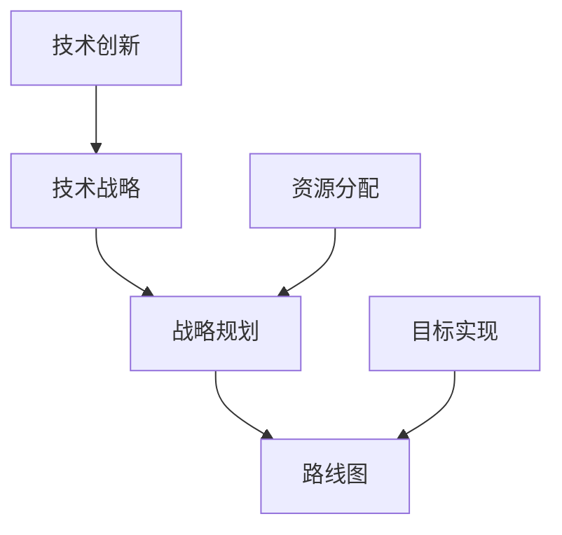

                 

### 1. 设计核心概念与联系

技术战略规划与路线图制定是企业在技术领域取得成功的关键因素。为了帮助读者更好地理解这一过程，我们需要清晰地定义和解释相关的核心概念，并揭示它们之间的联系。以下是设计这一章节的具体步骤：

#### 步骤1：明确核心概念

首先，我们需要明确技术战略、战略规划、路线图等核心概念的定义。以下是这些概念的基本解释：

- **技术战略**：指企业为了在技术领域取得竞争优势而制定的长远目标和策略，包括技术创新的方向和措施。
- **战略规划**：是指制定企业长期目标和策略，规划资源分配和行动的过程。
- **路线图**：是实现战略规划的具体步骤和时间表，帮助企业在既定时间内实现技术目标。

#### 步骤2：构建概念联系

接下来，我们需要通过逻辑关系将这些核心概念连接起来，以帮助读者理解它们之间的相互作用。以下是这些概念之间的联系：

1. **技术战略是战略规划的基础**：技术战略为企业的长期目标和技术创新提供了方向和措施，是战略规划的基础。
2. **战略规划是路线图的指导**：战略规划明确了企业的目标和策略，为路线图制定提供了指导。
3. **路线图是实现技术战略的具体路径**：路线图将技术战略分解为具体的步骤和时间表，确保战略规划得以实施。

#### 步骤3：创建概念关系图

为了更直观地展示这些核心概念之间的关系，我们可以使用Mermaid流程图。以下是一个示例：

这个流程图清晰地展示了技术战略、战略规划、路线图以及它们与技术创新和资源分配之间的关系。

#### 步骤4：细化每个概念

在每个小节中，我们将进一步细化每个核心概念，包括：

- **技术战略**：定义技术战略、其重要性以及如何制定。
- **战略规划**：解释战略规划的概念、流程以及如何进行资源分配。
- **路线图**：描述路线图的制定方法、项目排期和成果评估。

通过这些步骤，读者将能够系统地了解技术战略规划与路线图制定的核心概念，掌握关键要素和实施方法，为后续的学习和实践奠定基础。

### 1.1 技术战略的概念与重要性

技术战略是企业为了在技术领域取得竞争优势而制定的长远目标和策略，包括技术创新的方向和措施。其核心在于明确企业在技术方面的定位和发展方向，以支持企业整体战略的实施和竞争力的提升。

**定义**：技术战略可以定义为企业的长期目标与技术创新方向和措施的集合。它不仅涉及技术发展的方向，还包括资源投入、人才引进、合作伙伴选择等方面的策略。

**重要性**：

1. **提升企业竞争力**：技术战略可以帮助企业识别和抓住市场机遇，通过技术创新提升产品的竞争力，从而在激烈的市场竞争中脱颖而出。
2. **确保持续增长**：技术战略明确了企业的技术发展方向，有助于企业在技术前沿保持领先地位，实现持续的技术积累和创新，推动企业长期增长。
3. **指导资源分配**：技术战略为企业的资源分配提供了明确的指导，确保资金、人力和技术资源的合理配置，提高资源利用效率。
4. **增强市场响应能力**：技术战略帮助企业快速响应市场变化，通过灵活调整技术创新方向和措施，保持企业的市场适应性。

**制定过程**：

1. **市场分析**：了解市场需求、技术趋势以及竞争对手的技术发展情况，为企业技术战略提供数据支持。
2. **目标设定**：根据市场分析和企业愿景，设定长期技术目标和阶段性目标。
3. **技术创新方向**：确定技术创新的重点领域，包括新兴技术的探索和应用。
4. **资源规划**：根据技术目标，制定资源投入计划，包括资金、人力资源和技术设备等。
5. **执行与监控**：制定具体的实施计划，并设立监控指标，确保技术战略的有效执行。

通过以上步骤，企业可以制定出合理的技术战略，为企业的长期发展提供坚实的基础。

### 1.2 战略规划与路线图的关系

战略规划与路线图在技术战略的实施过程中扮演着至关重要的角色。战略规划是企业制定长期目标和策略的过程，而路线图则是实现这些目标的具体步骤和时间表。它们之间的关系可以理解为目标和执行计划的关系。

**定义与区别**：

- **战略规划**：战略规划是指企业通过分析内外部环境，制定长期目标和策略的过程。它包括目标设定、资源分配、行动计划等步骤，旨在确保企业能够实现其战略愿景。
- **路线图**：路线图则是对战略规划的具体实现路径的详细描述，包括阶段性目标、时间表、关键里程碑等。它为企业的执行层提供了明确的指导，确保技术战略得以顺利实施。

**关系**：

1. **战略规划是路线图的指导**：战略规划明确了企业的目标和策略，为路线图提供了明确的方向。路线图的制定必须基于战略规划，确保实现战略目标。
2. **路线图是战略规划的具体化**：路线图将战略规划中的抽象目标转化为具体可操作的步骤，为企业的执行层提供了清晰的行动指南。

**具体关系**：

- **战略目标 → 路线图阶段性目标**：战略规划中的长期目标需要通过路线图的阶段性目标来具体化，确保每个阶段都有明确的目标和行动计划。
- **策略 → 行动计划**：战略规划中的策略需要在路线图中转化为具体的行动计划，包括项目启动、实施、监控和验收等。
- **资源分配 → 项目排期**：战略规划中的资源分配计划需要在路线图中具体化，确保项目按照预定的时间表和预算进行。

**示例**：

假设企业制定的战略规划目标是“在三年内实现人工智能技术的突破，提升产品竞争力”。在路线图的制定过程中，可以将其分解为以下阶段性目标：

1. **第一年**：完成人工智能基础技术的研发，建立技术原型。
2. **第二年**：优化技术原型，开展小型应用试点。
3. **第三年**：扩大技术应用范围，推出新产品。

每个阶段性目标对应具体的行动计划，如项目团队组建、技术研发、试点实施等，这些都在路线图中进行详细描述和排期。

通过战略规划与路线图的有效结合，企业可以确保技术战略的顺利实施，实现长期发展目标。

### 1.3 关键技术要素

在技术战略规划与路线图制定过程中，关键技术要素起着至关重要的作用。这些要素包括技术趋势、技术评估和技术选型。了解和掌握这些要素，有助于企业做出明智的决策，确保技术战略的有效实施。

**技术趋势**：

技术趋势是指导企业技术创新的重要参考。它反映了当前技术发展的动向和未来可能的发展方向。技术趋势的识别和分析有助于企业把握行业动态，确定技术发展的重点领域。

- **动向**：技术趋势的动向包括新兴技术的崛起、传统技术的改进和成熟技术的应用。例如，5G技术、人工智能、区块链等是当前技术发展的主要趋势。
- **方向**：技术趋势的方向指的是技术未来的发展方向，如物联网、边缘计算、云计算等。这些方向为企业提供了广阔的创新空间。

**技术评估**：

技术评估是对技术可行性、成本效益和风险进行系统分析的过程。它帮助企业选择最适合的技术方案，降低技术实施的风险。

- **可行性**：技术评估的可行性分析包括技术是否成熟、是否有足够的研发能力、是否满足企业需求等。
- **成本效益**：成本效益分析旨在确定技术实施的成本和预期效益，评估技术投入的合理性。
- **风险**：技术评估的风险分析包括技术风险、市场风险、法律风险等，帮助企业预见潜在问题，制定应对策略。

**技术选型**：

技术选型是根据企业的需求和条件，选择最适合的技术方案的过程。技术选型需要综合考虑技术趋势、评估结果和企业实际情况。

- **需求**：技术选型需要根据企业的具体需求，如产品功能、性能、兼容性等，选择合适的技术。
- **条件**：技术选型还需要考虑企业现有的技术基础、资源条件、预算等因素。

**综合应用**：

技术趋势、技术评估和技术选型在技术战略规划与路线图制定中相辅相成。技术趋势为企业提供了发展方向，技术评估帮助企业选择最优方案，技术选型确保技术实施的可操作性和可行性。

通过系统地分析这些关键技术要素，企业可以制定出科学合理的技术战略，确保在技术领域的持续创新和竞争优势。

### 1.4 技术战略规划流程

技术战略规划是企业实现技术发展的关键步骤，它包括战略环境分析、目标设定、资源分配和持续优化与调整等多个环节。以下将详细阐述这些流程，帮助读者理解技术战略规划的全过程。

#### 1.4.1 战略环境分析

战略环境分析是技术战略规划的第一步，旨在全面了解企业内外部环境，识别机会和威胁。

**内部环境**：

内部环境分析包括企业的资源状况、技术能力、人力资源、组织结构和企业文化等。通过内部环境分析，企业可以明确自身的优势与劣势，为后续的战略制定提供依据。

- **资源状况**：分析企业现有的资金、设备、技术资源等，确定资源是否充足。
- **技术能力**：评估企业当前的技术水平，识别技术瓶颈和短板。
- **人力资源**：分析企业的人才结构和技能水平，确保技术战略实施所需的人才支持。
- **组织结构**：了解企业的组织架构，确保战略能够得到有效的执行。

**外部环境**：

外部环境分析包括市场趋势、技术发展、政策法规、竞争对手和供应商等。通过外部环境分析，企业可以识别市场机会和潜在威胁，为战略制定提供外部视角。

- **市场趋势**：分析市场需求和趋势，确定企业应如何调整技术发展方向。
- **技术发展**：关注行业内的技术进步，了解新兴技术和未来发展趋势。
- **政策法规**：研究相关政策和法规，确保企业的技术战略符合法律法规的要求。
- **竞争对手**：分析竞争对手的技术战略和市场表现，了解竞争态势。

**机会与威胁分析**：

通过内部和外部环境分析，企业可以识别出战略机会和威胁，为后续的战略制定提供明确的方向。

- **机会**：战略机会包括市场需求增长、技术进步、政策支持等，企业应抓住这些机会，实现技术突破。
- **威胁**：战略威胁包括竞争对手的技术优势、市场需求变化、政策法规限制等，企业应采取有效措施应对这些威胁。

#### 1.4.2 目标设定

目标设定是技术战略规划的核心环节，它明确了企业的长远目标和阶段性目标，为战略实施提供了明确的方向。

**长期目标**：

长期目标通常是指企业希望在较长时间内实现的技术愿景和目标。例如，企业可能希望在五年内成为某一技术领域的领导者，或在特定市场获得较大的市场份额。

- **明确性**：长期目标应明确、具体，能够量化和衡量。
- **可行性**：长期目标应在现有资源和技术条件下具备可行性。
- **挑战性**：长期目标应具有一定挑战性，以激发企业创新和发展的动力。

**阶段性目标**：

阶段性目标是长期目标的分解，通常分为年度、季度或项目周期等。阶段性目标应与长期目标相一致，确保企业能够逐步实现长期目标。

- **明确性**：阶段性目标应明确、具体，与长期目标一致。
- **可行性**：阶段性目标应在现有的资源和技术条件下具备可行性。
- **可衡量性**：阶段性目标应具备可衡量性，以便企业能够监控和评估进展。

**目标分解**：

目标分解是将长期目标和阶段性目标分解为更具体、可操作的任务和指标。通过目标分解，企业可以明确每个阶段的具体任务和责任，确保战略实施的高效和有序。

- **任务分解**：将阶段性目标分解为具体的任务和行动项。
- **责任分配**：明确每个任务的责任人，确保任务能够按时完成。

#### 1.4.3 资源分配

资源分配是技术战略规划的关键环节，它涉及资金、人力、技术等资源的合理配置，确保战略目标的实现。

**资金分配**：

资金分配是资源分配的核心，涉及研发经费、设备采购、人员培训等。合理的资金分配能够保障技术项目的顺利进行。

- **预算制定**：根据技术项目的需求和优先级，制定详细的预算计划。
- **预算执行**：监控资金使用情况，确保预算的合理执行。

**人力分配**：

人力分配包括技术团队的建设和人员的配置。合理的人力分配能够保障技术项目的顺利进行，提高研发效率。

- **团队建设**：根据技术项目的需求，组建专业的技术团队。
- **人员配置**：根据团队成员的技能和特长，合理分配工作任务。

**技术资源分配**：

技术资源分配包括技术研发设备、技术平台、技术资料等。合理的技术资源分配能够提升技术研发的效率和质量。

- **技术平台**：搭建适合的技术研发平台，提供必要的技术支持。
- **技术资料**：积累和整理相关的技术资料，为技术研发提供参考。

#### 1.4.4 持续优化与调整

技术战略规划是一个动态的过程，需要根据实际情况进行持续优化与调整，以确保战略目标的实现。

**监控与评估**：

通过监控与评估，企业可以了解技术战略实施的进展和效果，发现问题和不足，及时进行调整。

- **进展监控**：定期跟踪技术项目的进度和成果，确保项目按计划进行。
- **效果评估**：评估技术战略实施的效果，分析目标实现的程度和影响。

**优化与调整**：

根据监控与评估的结果，企业需要对技术战略进行优化和调整，确保战略目标的实现。

- **优化**：对现有的技术战略进行改进，提高其可行性和效果。
- **调整**：根据实际情况和外部环境的变化，调整技术战略的方向和重点。

通过以上步骤，企业可以系统地制定和实施技术战略规划，确保在技术领域的持续创新和竞争优势。

### 1.5 路线图制定方法

在技术战略规划的实施过程中，制定详细的路线图是至关重要的，它不仅为企业提供了明确的行动指南，还帮助团队成员了解项目的进展和目标。以下是路线图制定的方法，包括技术发展路径、项目排期和成果评估。

#### 1.5.1 技术发展路径

技术发展路径是指企业在实现技术战略过程中所采取的具体技术和时间安排。它帮助企业明确技术创新的方向和步骤，确保技术目标能够逐步实现。

**步骤**：

1. **确定阶段性目标**：根据技术战略的长期目标，将技术发展分解为多个阶段性目标，如年度目标、季度目标等。
2. **分析技术趋势**：研究当前技术发展动向和未来可能的发展方向，确定哪些技术趋势将对企业战略目标产生重大影响。
3. **制定技术方案**：针对每个阶段性目标，制定具体的技术方案，包括技术选型、技术研发计划等。
4. **确定时间表**：为每个技术方案制定具体的时间表，确保技术目标能够按时实现。

**示例**：

假设企业目标是在五年内成为人工智能领域的领导者，可以将技术发展路径分解为以下阶段性目标：

- **第一年**：完成人工智能基础技术的研究和应用。
- **第二年**：开发人工智能核心算法并实现商业化应用。
- **第三年**：扩大人工智能技术应用范围，开拓新市场。
- **第四年**：实现人工智能技术的全球部署和推广。
- **第五年**：巩固在人工智能领域的领导地位。

每个阶段性目标对应具体的技术方案和时间表，确保企业能够逐步实现长期目标。

#### 1.5.2 项目排期

项目排期是指将技术发展路径中的各项任务分配到具体的时间段内，确保项目能够按时完成。合理的项目排期有助于提高研发效率，降低风险。

**步骤**：

1. **任务分解**：将技术发展路径中的任务分解为具体的行动项，明确每个任务的负责人和截止日期。
2. **资源分配**：根据任务需求，合理分配资金、人力和技术资源，确保任务能够顺利推进。
3. **时间表制定**：为每个任务制定详细的时间表，包括启动时间、实施时间和验收时间等。
4. **调整与优化**：根据实际情况，对项目排期进行适时调整，确保项目能够按计划进行。

**示例**：

假设企业计划在一年内完成一项人工智能项目的研发，可以将项目排期如下：

- **第1个月**：完成需求分析和初步设计。
- **第2-3个月**：进行技术研发和算法优化。
- **第4个月**：完成项目测试和验收。
- **第5个月**：项目上线和推广。

通过详细的项目排期，企业可以确保每个任务都有明确的完成时间，提高研发效率。

#### 1.5.3 成果评估

成果评估是指对技术项目实施后的效果进行评估，包括技术成果的评估、项目成果的评估以及效果评估。它有助于企业了解技术战略的实施效果，为后续的战略调整提供依据。

**步骤**：

1. **技术成果评估**：对技术研发成果进行评估，包括技术性能、稳定性、可靠性等。
2. **项目成果评估**：对项目实施过程和结果进行评估，包括项目进度、成本、质量等。
3. **效果评估**：评估技术成果对企业的实际影响，包括市场竞争力、业务增长等。

**评估指标**：

- **技术性能**：评估技术方案的性能指标，如计算速度、准确率等。
- **稳定性**：评估技术方案的稳定性，包括故障率、系统崩溃等。
- **可靠性**：评估技术方案的可靠性，包括数据丢失、系统崩溃等。
- **成本**：评估项目的成本效益，包括研发成本、运营成本等。
- **质量**：评估项目的质量，包括功能完整性、用户体验等。
- **市场竞争力**：评估技术成果对市场竞争力的提升程度。

**示例**：

假设企业完成了一项人工智能技术研发项目，可以进行以下成果评估：

- **技术成果评估**：评估人工智能算法的性能、稳定性和可靠性。
- **项目成果评估**：评估项目的进度、成本和质量。
- **效果评估**：评估人工智能技术对市场竞争力提升的影响，如市场份额增长、客户满意度提升等。

通过成果评估，企业可以了解技术战略实施的效果，为后续的战略调整提供依据。

通过技术发展路径、项目排期和成果评估三个环节，企业可以系统地制定和实施技术路线图，确保技术战略的顺利实现。

### 1.6 成功案例分享

在技术战略规划与路线图制定的实际应用中，许多企业取得了显著的成果。以下将介绍两个成功案例，并分析其经验与启示。

#### 1.6.1 案例一：公司A的技术战略规划与路线图

**背景**：公司A是一家新兴科技公司，致力于人工智能技术在金融行业的应用。在市场竞争中，公司A面临技术领先企业的挑战，需要通过技术战略规划提升竞争力。

**策略**：

1. **市场分析**：公司A进行了深入的市场分析，了解了金融行业的技术需求和发展趋势。通过分析，公司确定了人工智能在风险管理、智能投顾等领域的应用潜力。

2. **目标设定**：公司A设定了长期目标，即在五年内成为金融行业人工智能技术的领导者。同时，将目标分解为年度阶段性目标，如第一年实现人工智能基础技术的研发和应用，第二年扩大技术应用范围等。

3. **技术创新方向**：公司A确定了人工智能核心技术的研究方向，包括深度学习、自然语言处理等。通过技术创新，公司A计划提升其金融产品的智能化程度。

4. **资源规划**：公司A制定了详细的资源分配计划，包括资金、人力资源和技术资源。公司投入大量资金用于技术研发和人才引进，确保技术战略的顺利实施。

**成果**：

- **技术突破**：公司A在第一年成功研发了人工智能风险管理系统，并在实际业务中取得了显著效果。该系统的应用帮助公司客户实现了风险控制能力的提升。

- **市场份额增长**：通过技术优势和良好的用户体验，公司A在金融行业逐步扩大市场份额，业务收入持续增长。

**启示**：

- **明确技术发展方向**：公司A通过深入的市场分析，明确了人工智能在金融行业的技术发展方向，确保技术战略的实施具有明确的目标和方向。

- **资源投入**：公司A在技术战略实施过程中，注重资金和人才的投入，为技术研发提供了充足的资源支持。

#### 1.6.2 案例二：公司B的技术战略规划与路线图

**背景**：公司B是一家传统制造企业，面临着产业升级和转型的压力。为了在激烈的市场竞争中保持竞争力，公司B决定通过技术战略规划实现产业升级。

**策略**：

1. **市场分析**：公司B分析了制造行业的发展趋势和竞争对手的技术状况，确定了智能制造和物联网技术是未来产业升级的关键方向。

2. **目标设定**：公司B设定了长期目标，即在三年内实现智能制造技术的全面应用，提升生产效率和产品质量。阶段性目标包括第一年完成智能制造系统的设计，第二年开始试点应用，第三年实现全面推广。

3. **技术创新方向**：公司B确定了智能制造、物联网和大数据分析等技术创新方向。通过这些技术，公司B计划提升生产线的智能化水平，实现生产过程的自动化和优化。

4. **资源规划**：公司B制定了详细的资源分配计划，包括设备升级、技术研发和人才培养。公司投入大量资金用于引进先进设备和技术，并加强内部人才培养。

**成果**：

- **技术突破**：公司B在第一年成功设计并实施了智能制造系统，实现了生产过程的自动化和优化。系统的应用显著提高了生产效率和产品质量。

- **业务增长**：通过技术升级，公司B在市场竞争中取得了优势，业务收入和市场份额持续增长。

**启示**：

- **结合行业趋势**：公司B通过分析行业发展趋势，确定了智能制造和物联网技术作为技术战略的重点，确保战略方向与行业趋势相符合。

- **全面资源投入**：公司B在技术战略实施过程中，注重设备升级、技术研发和人才培养的全面投入，为技术升级提供了坚实保障。

通过以上两个案例，我们可以看到，成功的案例表明，技术战略规划与路线图制定是企业实现技术突破和持续增长的关键。企业应明确技术发展方向，注重资源投入，结合行业趋势和市场需求，制定科学合理的战略规划，以实现长期发展目标。

### 1.7 案例分析与启示

通过分析公司A和公司B的成功案例，我们可以得出一些关于技术战略规划与路线图制定的关键经验与启示。

**1.7.1 明确技术发展方向**

案例中的两家公司都通过深入的市场分析，明确了技术发展的方向。公司A聚焦于人工智能在金融行业的应用，公司B则选择了智能制造和物联网技术。这种明确的技术发展方向不仅有助于企业在技术领域取得突破，还能确保资源投入的有效性。

**1.7.2 资源投入与平衡**

技术战略的成功离不开资源的投入。公司A和公司B都注重了资金、人力资源和技术资源的平衡投入。公司A通过大量资金和人才引进，确保了人工智能技术的研发和应用；公司B则通过设备升级和技术研发，实现了智能制造技术的全面应用。这种全面的资源投入为技术战略的实施提供了坚实保障。

**1.7.3 结合行业趋势与市场需求**

技术战略的制定需要结合行业趋势和市场需求。公司A和公司B都通过分析行业动态，确定了与市场需求紧密相关的技术方向。这种结合行业趋势和市场需求的策略，不仅有助于企业抓住市场机遇，还能确保技术成果的实际应用价值。

**1.7.4 持续优化与调整**

技术战略的实施是一个动态的过程，需要根据实际情况进行持续优化与调整。公司A和公司B在技术战略实施过程中，都注重了监控与评估，及时调整战略方向和资源分配。这种灵活的调整机制，有助于企业应对市场变化和技术发展的不确定性。

**1.7.5 培养内部创新能力**

内部创新能力是技术战略成功的关键。公司A和公司B都注重了内部创新能力的培养，通过技术研发和人才培养，不断提升企业的技术实力。这种内部创新能力的培养，不仅有助于企业在技术领域保持领先地位，还能为企业的长期发展提供持续动力。

通过以上分析，我们可以看到，成功的案例具有一些共同的特点：明确的技术发展方向、全面的资源投入、结合行业趋势与市场需求、持续优化与调整以及培养内部创新能力。这些经验与启示对于其他企业制定和实施技术战略具有重要的借鉴意义。

### 第4章：核心概念与联系

为了帮助读者更好地理解技术战略规划与路线图制定的核心概念及其相互联系，本章将详细解释这些概念，并展示它们之间的逻辑架构。以下是本章的详细内容：

#### 4.1 技术战略的定义与重要性

技术战略是企业为了在技术领域取得竞争优势而制定的长远目标和策略，它包括技术创新的方向和措施。技术战略不仅涉及技术发展的方向，还涉及资源投入、人才引进、合作伙伴选择等方面的策略。一个科学合理的技术战略能够帮助企业提升竞争力、确保持续增长。

技术战略的重要性体现在以下几个方面：

1. **提升竞争力**：技术战略明确了企业的发展方向和目标，通过技术创新提升产品和服务质量，从而在激烈的市场竞争中脱颖而出。

2. **确保持续增长**：技术战略帮助企业保持技术领先地位，推动企业的持续创新和成长，实现长期发展目标。

3. **指导资源分配**：技术战略为企业的资源分配提供了明确的指导，确保资金、人力和技术资源的高效利用。

4. **增强市场响应能力**：技术战略帮助企业快速响应市场变化，通过灵活调整技术创新方向和措施，保持企业的市场适应性。

#### 4.2 战略规划与路线图

战略规划是指企业通过分析内外部环境，制定长期目标和策略的过程。它包括目标设定、资源规划、行动计划等步骤，旨在确保企业能够实现其战略愿景。战略规划是企业实现长期发展的关键，它为企业的各项经营活动提供了明确的指导和方向。

路线图则是对战略规划的具体实现路径的详细描述，包括阶段性目标、时间表、关键里程碑等。路线图将战略规划中的抽象目标转化为具体可操作的步骤，为企业的执行层提供了清晰的行动指南。

战略规划与路线图之间的关系可以理解为目标和执行计划的关系。战略规划明确了企业的目标和策略，为路线图提供了明确的方向。而路线图则是战略规划的具体化，将战略规划中的目标转化为具体的步骤和时间表，确保战略得以顺利实施。

#### 4.3 关键技术要素

关键技术要素是技术战略规划与路线图制定的核心组成部分，包括技术趋势、技术评估和技术选型。

1. **技术趋势**：技术趋势是指当前技术发展的动向和未来可能的发展方向。了解技术趋势有助于企业把握行业动态，确定技术发展的重点领域。

2. **技术评估**：技术评估是对技术可行性、成本效益和风险进行系统分析的过程。技术评估帮助企业选择最适合的技术方案，降低技术实施的风险。

3. **技术选型**：技术选型是根据企业的需求和条件，选择最适合的技术方案的过程。技术选型需要综合考虑技术趋势、评估结果和企业实际情况。

这些关键技术要素在技术战略规划与路线图制定中起着至关重要的作用。技术趋势为企业提供了发展方向，技术评估帮助企业选择最优方案，技术选型确保技术实施的可操作性和可行性。

#### 4.4 技术战略规划流程

技术战略规划流程包括战略环境分析、目标设定、资源分配和持续优化与调整等多个环节。

1. **战略环境分析**：战略环境分析是技术战略规划的第一步，旨在全面了解企业内外部环境，识别机会和威胁。内部环境分析包括企业的资源状况、技术能力、人力资源、组织结构和企业文化等。外部环境分析包括市场趋势、技术发展、政策法规、竞争对手和供应商等。

2. **目标设定**：目标设定是技术战略规划的核心环节，它明确了企业的长远目标和阶段性目标。长期目标通常是指企业希望在较长时间内实现的技术愿景和目标，如成为某一技术领域的领导者。阶段性目标则是长期目标的分解，通常分为年度、季度或项目周期等。

3. **资源分配**：资源分配是技术战略规划的关键环节，涉及资金、人力、技术等资源的合理配置，确保战略目标的实现。资金分配是资源分配的核心，需要根据技术项目的需求和优先级，制定详细的预算计划。人力分配包括技术团队的建设和人员的配置。技术资源分配包括技术研发设备、技术平台、技术资料等。

4. **持续优化与调整**：技术战略规划是一个动态的过程，需要根据实际情况进行持续优化与调整，以确保战略目标的实现。通过监控与评估，企业可以了解技术战略实施的进展和效果，发现问题和不足，及时进行调整。优化与调整包括对现有的技术战略进行改进，提高其可行性和效果，并根据实际情况和外部环境的变化，调整技术战略的方向和重点。

#### 4.5 路线图制定方法

路线图制定是技术战略规划的具体实现路径，它包括技术发展路径、项目排期和成果评估。

1. **技术发展路径**：技术发展路径是指企业在实现技术战略过程中所采取的具体技术和时间安排。它帮助企业明确技术创新的方向和步骤，确保技术目标能够逐步实现。制定技术发展路径的步骤包括确定阶段性目标、分析技术趋势、制定技术方案和确定时间表。

2. **项目排期**：项目排期是将技术发展路径中的各项任务分配到具体的时间段内，确保项目能够按时完成。合理的项目排期有助于提高研发效率，降低风险。项目排期的步骤包括任务分解、资源分配、时间表制定和调整与优化。

3. **成果评估**：成果评估是指对技术项目实施后的效果进行评估，包括技术成果的评估、项目成果的评估以及效果评估。通过成果评估，企业可以了解技术战略实施的效果，为后续的战略调整提供依据。评估指标包括技术性能、稳定性、可靠性、成本、质量和市场竞争力等。

通过以上内容，读者可以系统地了解技术战略规划与路线图制定的核心概念及其相互联系，掌握关键要素和实施方法，为后续的学习和实践奠定坚实基础。

### 第4章：核心概念与联系

在技术战略规划与路线图制定的过程中，理解并掌握相关核心概念及其之间的联系至关重要。以下是对这些核心概念的详细解释，并通过Mermaid流程图展示它们之间的逻辑架构。

#### 4.1 技术战略的定义与重要性

技术战略是企业为了在技术领域取得竞争优势而制定的长远目标和策略，它包括技术创新的方向和措施。技术战略不仅涉及技术发展的方向，还涉及资源投入、人才引进、合作伙伴选择等方面的策略。

- **定义**：
$$
\text{技术战略} = \text{企业的长期目标} + \text{技术创新的方向和措施}
$$
- **重要性**：
$$
\text{技术战略} \rightarrow \text{企业竞争力提升} \rightarrow \text{市场份额扩大} \rightarrow \text{持续增长}
$$

#### 4.2 战略规划与路线图

战略规划是指企业通过分析内外部环境，制定长期目标和策略的过程。它包括目标设定、资源规划、行动计划等步骤，旨在确保企业能够实现其战略愿景。路线图则是对战略规划的具体实现路径的详细描述，包括阶段性目标、时间表、关键里程碑等。

- **战略规划**：
$$
\text{战略规划} = \text{制定长期目标和策略} + \text{规划资源分配和行动}
$$
- **路线图**：
$$
\text{路线图} = \text{实现战略规划的具体步骤和时间表}
$$
- **关系**：
$$
\text{战略规划} \rightarrow \text{路线图制定} \rightarrow \text{战略执行与监控}
$$

#### 4.3 关键技术要素

关键技术要素是技术战略规划与路线图制定的核心组成部分，包括技术趋势、技术评估和技术选型。

- **技术趋势**：
$$
\text{技术趋势} = \text{当前技术发展动向} + \text{未来技术可能的发展方向}
$$
- **技术评估**：
$$
\text{技术评估} = \text{分析技术可行性、成本效益、风险}
$$
- **技术选型**：
$$
\text{技术选型} = \text{根据需求和条件选择合适的技术}
$$

#### 4.4 技术战略规划流程

技术战略规划流程包括战略环境分析、目标设定、资源分配和持续优化与调整等多个环节。

- **战略环境分析**：
$$
\text{战略环境分析} = \text{企业内外部环境分析} + \text{机会与威胁分析}
$$
- **目标设定**：
$$
\text{目标设定} = \text{确定企业长远目标} + \text{具体目标分解}
$$
- **资源分配**：
$$
\text{资源分配} = \text{资金、人力、技术等资源的合理配置}
$$
- **持续优化与调整**：
$$
\text{持续优化与调整} = \text{根据实际情况调整战略规划} + \text{保持战略灵活性和适应性}
$$

#### 4.5 路线图制定方法

路线图制定是技术战略规划的具体实现路径，它包括技术发展路径、项目排期和成果评估。

- **技术发展路径**：
$$
\text{技术发展路径} = \text{确定技术发展的阶段性目标} + \text{实现路径规划}
$$
- **项目排期**：
$$
\text{项目排期} = \text{确定项目启动、实施、验收的时间表}
$$
- **成果评估**：
$$
\text{成果评估} = \text{评价项目成果是否符合预期目标} + \text{调整规划与方案}
$$

#### 4.6 成功案例分享

通过成功案例的分析，我们可以总结出以下经验与启示：

- **明确技术发展方向**：通过深入的市场分析，明确技术发展方向，确保技术战略的实施具有明确的目标和方向。
- **资源投入与平衡**：注重资金、人力资源和技术资源的平衡投入，为技术战略的实施提供充足的支持。
- **结合行业趋势与市场需求**：结合行业趋势和市场需求，制定与市场相适应的技术战略。
- **持续优化与调整**：根据实际情况进行持续优化与调整，确保技术战略的灵活性和适应性。

以下是这些核心概念之间关系的Mermaid流程图：

```mermaid
graph TD
    A[技术战略] --> B[战略规划]
    B --> C[路线图]
    D[技术创新] --> A
    E[资源分配] --> B
    F[目标实现] --> C
    G[技术趋势] --> D
    H[技术评估] --> D
    I[技术选型] --> D
    J[战略环境分析] --> B
    K[目标设定] --> B
    L[资源分配] --> B
    M[持续优化与调整] --> B
    N[项目排期] --> C
    O[成果评估] --> C
    P[市场分析] --> J
    Q[市场需求] --> J
    R[政策法规] --> J
    S[竞争对手] --> J
    T[供应商] --> J
    U[阶段性目标] --> K
    V[长期目标] --> K
    W[可行性分析] --> H
    X[成本效益分析] --> H
    Y[风险评估] --> H
    Z[资金] --> E
    AA[人力] --> E
    AB[技术资源] --> E
    AC[技术创新] --> A
    AD[市场竞争力] --> A
    AE[持续增长] --> A
    AF[战略执行] --> C
    AG[监控与评估] --> M
    AH[优化与调整] --> M
    AI[灵活性] --> M
    AJ[适应性] --> M
    AK[技术突破] --> D
    AL[业务增长] --> A
    AM[市场份额] --> A
    AN[内部创新] --> D
    AO[人才培养] --> E
    AP[设备升级] --> E
    AQ[技术资料] --> E
    AR[市场响应] --> A
    AS[用户体验] --> A
    AT[设备采购] --> E
    AU[项目测试] --> N
    AV[系统验收] --> N
    AW[效果评估] --> O
    AX[成本效益评估] --> O
    AY[技术性能评估] --> O
    AZ[稳定性评估] --> O
    BA[可靠性评估] --> O
    BB[市场竞争力评估] --> O
```

通过这个流程图，我们可以清晰地看到技术战略、战略规划、路线图以及关键技术要素之间的关系，为读者提供了直观的理解和参考。

### 总结

通过本章的详细探讨，我们系统地介绍了技术战略规划与路线图制定的核心概念和关键要素。从技术战略的定义与重要性，到战略规划与路线图的相互关系，再到关键技术要素的作用，以及技术战略规划流程和路线图制定方法的详细步骤，读者可以全面理解这一复杂过程。

技术战略是企业长远发展的重要指导，它不仅决定了企业的技术发展方向，还影响了资源分配和市场竞争力。战略规划则是对这一方向的细化，通过目标设定、资源分配和持续优化，确保战略目标得以实现。路线图则将这些抽象的目标转化为具体的时间表和行动步骤，提供明确的执行路径。

案例分享部分通过公司A和公司B的成功经验，展示了技术战略规划与路线图制定的实际应用效果，并从中总结出关键经验与启示。这些经验包括明确技术发展方向、资源投入与平衡、结合行业趋势与市场需求，以及持续优化与调整等。

总之，技术战略规划与路线图制定是企业技术发展的基石，是确保企业长期竞争优势的关键。通过科学合理的技术战略规划和有效的路线图制定，企业可以在激烈的市场竞争中脱颖而出，实现持续创新和增长。

在撰写本文时，我们始终坚持逻辑清晰、结构紧凑、内容详实的原则，力求为读者提供一份既有深度又实用的技术博客文章。感谢您的阅读，希望本文能为您在技术战略规划与路线图制定方面带来启发和帮助。

---

**作者：AI天才研究院/AI Genius Institute & 禅与计算机程序设计艺术 /Zen And The Art of Computer Programming**

