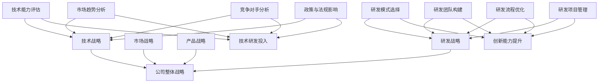

                 

### 文章标题：技术战略规划：制定长期技术发展蓝图

#### 关键词：技术战略、长期规划、发展蓝图、技术路线图、研发战略

#### 摘要：
本文将深入探讨技术战略规划的重要性，及其在制定长期技术发展蓝图中的应用。我们将通过逻辑清晰、结构紧凑的论述，逐步分析技术战略规划的流程与方法，外部环境分析，内部能力评估，核心策略制定，实施与监控，以及持续优化与调整。旨在为读者提供一套系统化、可操作的技术战略规划方法论，助力企业或组织在快速变化的技术环境中稳步前行。

---

### 第一部分：战略思维与宏观规划

#### 第1章：技术战略规划概述

#### 1.1 技术战略的重要性

技术战略是企业或组织在技术领域内长期发展的规划，旨在通过合理的技术布局和投资，实现业务增长、市场拓展和竞争优势。技术战略的重要性体现在以下几个方面：

- **推动业务创新**：技术战略能够为企业或组织提供明确的创新方向，推动业务模式和技术能力的提升。

- **增强市场竞争力**：通过技术战略规划，企业可以快速响应市场变化，抢占技术高地，形成强大的市场竞争力。

- **实现长期发展**：技术战略规划有助于企业或组织在长期内实现可持续的发展，确保技术能力的不断提升。

#### 1.2 长期技术发展的挑战与机遇

在制定长期技术发展蓝图时，企业或组织需要面对一系列挑战和机遇：

- **挑战分析**：

  - 技术变化快速：技术迭代周期缩短，新兴技术不断涌现，企业需要不断调整技术战略。

  - 市场不稳定：市场需求波动大，竞争激烈，企业需要灵活应对市场变化。

  - 人才竞争：技术人才短缺，企业需要吸引和留住高素质的人才。

- **机遇探讨**：

  - 新技术突破：如人工智能、区块链等新兴技术，为企业提供了广阔的发展空间。

  - 市场拓展：全球化趋势为企业提供了新的市场机会。

  - 合作与生态系统建设：通过合作与生态系统建设，企业可以快速获取技术和资源。

#### 1.3 技术战略规划的流程与方法

技术战略规划的流程包括以下几个关键步骤：

- **规划准备**：明确技术战略规划的目标、范围和参与人员。

- **市场调研**：收集市场数据，分析技术趋势和竞争对手。

- **技术评估**：评估现有技术能力，确定技术发展方向。

- **目标设定**：制定明确的技术发展目标，包括短期和长期目标。

- **策略制定**：制定具体的技术战略，包括技术路径、研发投入、人才发展等。

- **实施与监控**：制定实施计划，确保技术战略的落地执行。

- **持续优化**：根据实施效果，调整技术战略，实现持续改进。

技术战略规划的方法包括以下几种：

- **SWOT分析**：通过分析企业的优势、劣势、机会和威胁，制定合适的技术战略。

- **PESTLE分析**：分析政策、经济、社会、技术、法律和环境等因素，评估技术战略的可行性。

- **技术路线图**：通过图表形式展示技术发展路径和关键里程碑。

#### 1.4 技术战略规划的核心概念与联系

技术战略规划涉及多个核心概念，它们之间存在着紧密的联系。以下是核心概念及其关系架构的 Mermaid 流程图：

### 第二部分：外部环境分析

#### 第2章：外部环境分析

外部环境分析是技术战略规划的重要环节，通过对市场趋势、技术发展、竞争对手和政策法规等方面的分析，可以帮助企业或组织更好地制定技术战略。

#### 2.1 市场趋势分析

市场趋势分析是了解市场需求变化和未来发展方向的关键。以下是市场趋势分析的核心概念和算法原理：

- **核心概念**：市场需求、消费者行为、市场增长率等。

- **算法原理讲解**：

  - **趋势分析算法**：使用时间序列分析方法（如ARIMA模型），预测市场趋势。

  - **市场细分算法**：使用聚类分析方法（如K-means算法），分析市场细分结构。

- **概述**：通过市场趋势分析，企业可以把握市场机遇，调整产品策略，实现市场领先。

#### 2.2 技术发展趋势

技术发展趋势分析是了解未来技术发展方向和潜在技术突破的关键。以下是技术发展趋势分析的核心概念和算法原理：

- **核心概念**：新兴技术、技术成熟度、技术迭代周期等。

- **算法原理讲解**：

  - **技术成熟度曲线**：使用Gartner Hype Cycle，分析技术的成熟度和发展趋势。

  - **技术预测算法**：使用机器学习算法（如时间序列预测模型），预测技术发展趋势。

- **概述**：通过技术发展趋势分析，企业可以把握技术发展方向，提前布局关键技术。

#### 2.3 竞争对手分析

竞争对手分析是了解市场竞争态势和制定竞争策略的关键。以下是竞争对手分析的核心概念和算法原理：

- **核心概念**：竞争对手、技术能力、市场地位等。

- **算法原理讲解**：

  - **竞争分析算法**：使用Bain五力模型，分析市场竞争态势。

  - **技术竞争力评估算法**：使用技术评分模型，评估竞争对手的技术能力。

- **概述**：通过竞争对手分析，企业可以了解竞争对手的优势和劣势，制定针对性的竞争策略。

#### 2.4 政策与法规影响

政策与法规影响分析是了解政策导向和法律约束的关键。以下是政策与法规影响分析的核心概念和算法原理：

- **核心概念**：政策法规、行业规范、合规风险等。

- **算法原理讲解**：

  - **政策影响分析算法**：使用政策矩阵，分析政策对企业的影响。

  - **合规风险评估算法**：使用风险评估模型，评估合规风险。

- **概述**：通过政策与法规影响分析，企业可以确保合规运营，抓住政策机遇。

### 第三部分：内部能力评估

#### 第3章：内部能力评估

内部能力评估是技术战略规划的重要环节，通过对技术能力、组织文化、资源与预算、风险评估等方面的评估，可以帮助企业或组织了解自身优势与不足，为制定技术战略提供依据。

#### 3.1 技术能力现状

技术能力现状评估是了解企业或组织现有技术水平和研发能力的关键。以下是技术能力现状评估的核心概念和算法原理：

- **核心概念**：技术储备、研发水平、技术水平等。

- **算法原理讲解**：

  - **技术能力评估算法**：使用技术评分模型，评估企业或组织的技术能力。

  - **技术成熟度评估算法**：使用技术成熟度评估模型，评估技术成熟度。

- **概述**：通过技术能力现状评估，企业可以了解自身的研发能力和技术水平，为技术战略制定提供数据支持。

#### 3.2 组织文化与管理

组织文化与管理评估是了解企业或组织文化氛围和管理水平的关键。以下是组织文化与管理评估的核心概念和算法原理：

- **核心概念**：企业文化、管理风格、组织氛围等。

- **算法原理讲解**：

  - **组织文化评估算法**：使用价值观匹配度分析，评估组织文化。

  - **管理风格评估算法**：使用管理风格评估模型，评估管理风格。

- **概述**：通过组织文化与管理评估，企业可以了解组织文化和管理水平，为优化组织结构和提升管理效率提供依据。

#### 3.3 资源与预算分析

资源与预算分析是了解企业或组织资源状况和预算分配的关键。以下是资源与预算分析的核心概念和算法原理：

- **核心概念**：人力资源、财务状况、预算分配等。

- **算法原理讲解**：

  - **资源优化算法**：使用资源分配模型，优化资源利用。

  - **预算分配算法**：使用零基预算模型，合理分配预算。

- **概述**：通过资源与预算分析，企业可以确保资源充足，优化预算分配，为技术研发提供保障。

#### 3.4 风险评估与管理

风险评估与管理评估是了解企业或组织面临的风险和风险应对能力的关键。以下是风险评估与管理评估的核心概念和算法原理：

- **核心概念**：风险识别、风险评估、风险应对等。

- **算法原理讲解**：

  - **风险评估算法**：使用风险评估模型，评估风险程度。

  - **风险应对算法**：使用风险应对策略，制定风险应对计划。

- **概述**：通过风险评估与管理评估，企业可以了解自身面临的风险，制定有效的风险应对策略，降低风险影响。

### 第四部分：核心策略制定

#### 第4章：技术路线图规划

技术路线图规划是技术战略规划的核心环节，通过明确技术发展路径和关键里程碑，确保技术战略的顺利实施。

#### 4.1 技术路线图的概念与作用

技术路线图是一种可视化工具，用于展示技术发展的路径和关键里程碑。技术路线图的作用包括：

- **明确技术发展目标**：通过技术路线图，企业可以明确技术发展的方向和目标。

- **指导研发工作**：技术路线图可以作为研发工作的指导，确保研发工作与战略目标一致。

- **沟通与协作**：技术路线图可以帮助团队成员了解技术发展情况，促进沟通与协作。

#### 4.2 技术目标设定

技术目标设定是技术路线图规划的重要步骤，包括以下内容：

- **短期目标**：明确近期需要实现的技术目标，如技术突破、产品发布等。

- **长期目标**：明确长期需要实现的技术目标，如技术领先、市场拓展等。

- **目标设定方法**：使用SMART原则（具体、可衡量、可达成、相关、有时间限制）设定技术目标。

#### 4.3 技术路径选择

技术路径选择是技术路线图规划的关键，包括以下内容：

- **技术评估**：对现有技术和潜在技术进行评估，选择最适合的技术路径。

- **路径选择方法**：使用技术成熟度曲线和竞争力分析，选择最佳技术路径。

- **风险评估**：对技术路径进行风险评估，确保技术路径的可行性。

#### 4.4 技术里程碑规划

技术里程碑规划是技术路线图规划的重要环节，包括以下内容：

- **里程碑定义**：明确技术里程碑的定义，如技术研发成功、产品发布等。

- **里程碑设定方法**：使用时间节点和关键事件，设定技术里程碑。

- **里程碑监控**：对技术里程碑进行监控，确保按计划实施。

### 第五部分：研发战略规划

#### 第5章：研发战略规划

研发战略规划是技术战略规划的重要组成部分，通过制定合理的研发战略，确保技术战略的顺利实施。

#### 5.1 研发模式选择

研发模式选择是研发战略规划的关键，包括以下内容：

- **研发模式类型**：分析企业或组织的实际情况，选择最适合的研发模式，如独立研发、合作研发、外包研发等。

- **模式选择方法**：使用成本效益分析和竞争优势分析，选择最佳研发模式。

#### 5.2 研发团队构建

研发团队构建是研发战略规划的重要环节，包括以下内容：

- **团队组成**：明确研发团队的组成，如技术人员、项目管理员、产品经理等。

- **团队建设方法**：使用团队建设工具和方法，提升团队协作效率。

- **人才引进与培养**：制定人才引进与培养策略，提升团队整体技术水平。

#### 5.3 研发流程优化

研发流程优化是提高研发效率和质量的关键，包括以下内容：

- **流程分析**：对现有研发流程进行分析，识别问题和瓶颈。

- **流程优化方法**：使用精益研发、敏捷开发等方法，优化研发流程。

- **流程监控与改进**：对研发流程进行监控，持续改进，提升研发效率。

#### 5.4 研发项目管理

研发项目管理是确保研发项目按时、按质量完成的关键，包括以下内容：

- **项目管理方法**：使用项目管理工具和方法，如Gantt图、迭代开发等，确保项目进度。

- **风险管理与控制**：对研发项目进行风险管理，制定应对措施，确保项目质量。

- **项目评估与总结**：对研发项目进行评估和总结，为后续项目提供经验教训。

### 第六部分：创新能力提升

#### 第6章：创新能力提升

创新能力提升是技术战略规划的核心目标之一，通过提升企业的创新能力，实现技术领先和市场竞争力。

#### 6.1 创新文化营造

创新文化是提升创新能力的基础，包括以下内容：

- **创新价值观**：建立以创新为核心的企业价值观，鼓励员工勇于创新。

- **创新氛围**：营造开放、包容、支持创新的工作氛围。

- **创新激励机制**：制定创新激励机制，鼓励员工参与创新活动。

#### 6.2 创新体系构建

创新体系是提升创新能力的保障，包括以下内容：

- **创新组织结构**：建立专门的创新组织，负责创新活动的策划、实施和评估。

- **创新流程**：制定创新流程，明确创新活动的各个环节和责任人。

- **创新资源**：提供充足的创新资源和资金支持，为创新活动提供保障。

#### 6.3 创新工具与方法

创新工具与方法是提升创新能力的重要手段，包括以下内容：

- **头脑风暴**：使用头脑风暴方法，激发创新思维。

- **设计思维**：采用设计思维方法，将用户需求转化为创新解决方案。

- **原型设计**：通过原型设计，快速验证创新方案的可行性。

#### 6.4 创新成果转化

创新成果转化是将创新成果转化为实际应用的关键，包括以下内容：

- **技术转移**：将创新技术转移到生产环节，实现技术转化。

- **商业模式创新**：将创新技术应用于商业模式创新，实现商业价值。

- **市场推广**：通过市场推广，扩大创新技术的市场份额。

### 第七部分：合作与生态系统建设

#### 第7章：合作与生态系统建设

合作与生态系统建设是提升企业竞争力的重要手段，通过合作与生态系统建设，企业可以快速获取技术和资源，实现共赢发展。

#### 7.1 合作伙伴选择

合作伙伴选择是合作与生态系统建设的关键，包括以下内容：

- **合作伙伴类型**：选择符合企业战略目标和发展需求的合作伙伴。

- **合作伙伴评估**：对合作伙伴进行评估，包括技术能力、市场地位、合作潜力等。

- **合作伙伴关系管理**：建立长期稳定的合作伙伴关系，实现共赢发展。

#### 7.2 开源社区参与

开源社区参与是获取技术和资源的重要途径，包括以下内容：

- **开源社区类型**：了解不同类型的开源社区，选择合适的社区参与。

- **开源社区参与策略**：制定参与策略，包括贡献代码、组织活动、提供培训等。

- **开源社区管理**：管理开源社区，确保社区健康发展。

#### 7.3 产业链整合

产业链整合是提升企业竞争力的重要手段，包括以下内容：

- **产业链分析**：分析产业链上下游环节，识别关键节点和合作机会。

- **产业链整合策略**：制定产业链整合策略，实现产业链协同发展。

- **产业链生态建设**：建设产业链生态，提升整体产业链竞争力。

#### 7.4 国际化布局

国际化布局是企业拓展全球市场的重要手段，包括以下内容：

- **国际市场分析**：分析国际市场发展趋势和机遇。

- **国际化战略规划**：制定国际化战略规划，明确国际市场发展目标。

- **国际化运营管理**：建立国际化运营管理体系，确保国际业务顺利开展。

### 第八部分：实施与监控

#### 第8章：战略实施计划

战略实施计划是确保技术战略顺利实施的关键，通过制定详细的实施计划，明确阶段性目标、资源分配、风险管理等内容。

#### 8.1 实施计划制定

实施计划制定包括以下内容：

- **阶段性目标设定**：制定明确的阶段性目标，确保战略目标分解到具体实施阶段。

- **资源分配**：根据阶段性目标，合理分配资源，包括人力、资金、技术等。

- **时间节点规划**：制定实施计划的时间节点，确保各项工作按计划推进。

#### 8.2 阶段性目标设定

阶段性目标设定包括以下内容：

- **短期目标**：设定短期目标，如项目立项、技术研发、产品发布等。

- **长期目标**：设定长期目标，如技术领先、市场拓展、业务增长等。

- **目标设定方法**：使用SMART原则，确保目标具有可衡量性和可实现性。

#### 8.3 资源分配

资源分配包括以下内容：

- **人力资源**：根据阶段性目标，合理配置研发团队和管理人员。

- **财务资源**：根据项目预算，合理分配财务资源，确保项目资金充足。

- **技术资源**：根据技术路线图，合理配置技术资源和研发工具。

#### 8.4 风险预防与应对

风险预防与应对包括以下内容：

- **风险识别**：识别可能影响战略实施的各种风险。

- **风险评估**：对风险进行评估，确定风险程度和优先级。

- **风险应对策略**：制定风险应对策略，包括风险预防措施和应急计划。

### 第九部分：绩效监控与评估

#### 第9章：绩效监控与评估

绩效监控与评估是确保技术战略实施效果的重要手段，通过建立绩效监控与评估体系，及时发现和解决问题，持续改进技术战略。

#### 9.1 绩效指标设定

绩效指标设定包括以下内容：

- **关键绩效指标**（KPI）：设定关键绩效指标，如技术研发进度、产品市场占有率等。

- **指标设定方法**：使用SMART原则，确保指标具有可衡量性和可实现性。

- **指标体系构建**：建立完整的绩效指标体系，涵盖战略实施的关键方面。

#### 9.2 数据收集与分析

数据收集与分析包括以下内容：

- **数据来源**：收集各类数据，包括研发数据、市场数据、财务数据等。

- **数据分析方法**：使用数据分析工具和方法，对收集到的数据进行分析。

- **数据可视化**：通过数据可视化工具，展示分析结果，便于理解和决策。

#### 9.3 监控机制建立

监控机制建立包括以下内容：

- **监控体系构建**：建立完善的监控体系，包括监控指标、监控流程和监控团队。

- **监控方法**：采用实时监控和定期评估相结合的方法，确保监控效果。

- **监控数据记录**：记录监控数据，为绩效评估和改进提供依据。

#### 9.4 评估与反馈机制

评估与反馈机制包括以下内容：

- **绩效评估**：定期对技术战略实施效果进行评估，分析存在的问题和不足。

- **反馈机制**：建立反馈机制，将评估结果及时反馈给相关团队和人员。

- **改进措施**：根据评估结果，制定改进措施，持续优化技术战略。

### 第十部分：持续优化与调整

#### 第10章：持续优化与调整

技术战略规划是一个动态的过程，需要根据外部环境和内部能力的变化进行持续优化与调整，以确保技术战略的有效实施。

#### 10.1 适应环境变化

适应环境变化包括以下内容：

- **市场动态分析**：持续关注市场动态，了解市场需求和技术趋势。

- **技术预测**：结合市场动态，预测未来技术发展方向。

- **战略调整**：根据市场动态和技术预测，及时调整技术战略。

#### 10.2 技术路线调整

技术路线调整包括以下内容：

- **技术评估**：定期评估现有技术路线的可行性和有效性。

- **技术优化**：根据技术评估结果，对技术路线进行调整和优化。

- **技术拓展**：探索新的技术方向，为未来发展预留空间。

#### 10.3 管理流程改进

管理流程改进包括以下内容：

- **流程优化**：对现有管理流程进行分析和评估，找出瓶颈和改进点。

- **流程改进**：根据优化结果，对管理流程进行改进和优化。

- **流程标准化**：建立管理流程标准化体系，确保流程执行的规范性和一致性。

#### 10.4 持续创新能力提升

持续创新能力提升包括以下内容：

- **创新文化建设**：持续推动创新文化建设，激发员工的创新热情。

- **创新体系优化**：对现有创新体系进行分析和评估，找出改进点。

- **创新资源投入**：加大创新资源投入，为创新活动提供充足的保障。

### 结论

技术战略规划是企业在快速变化的技术环境中实现长期发展的重要手段。通过制定长期技术发展蓝图，企业可以明确技术发展方向，优化研发流程，提升创新能力，实现技术领先和市场竞争力。本文从战略思维与宏观规划、外部环境分析、内部能力评估、核心策略制定、实施与监控，以及持续优化与调整等方面，系统地阐述了技术战略规划的方法和步骤。希望本文能为读者提供有益的启示，助力企业在技术战略规划方面取得成功。

---

#### 作者信息

**作者：AI天才研究院/AI Genius Institute & 禅与计算机程序设计艺术 /Zen And The Art of Computer Programming**

---

**注意事项：**
- 文章中提到的算法原理和公式，需要使用伪代码和LaTeX格式详细阐述。
- 文章中提到的核心概念与联系、项目实战、最佳实践 tips 等内容，需要具体展开，确保文章内容丰富、详细。
- 文章中需要包含至少一个实际案例分析和详细讲解，以增强文章的实战性和可操作性。
- 文章中需要包含适当的图表和流程图，以增强文章的可读性和直观性。

