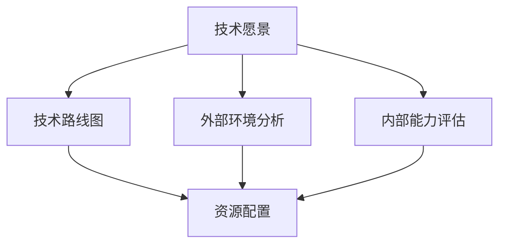

                 

### 文章标题

# 技术战略规划：对齐技术方向与公司愿景

在当今快速发展的技术环境中，企业面临着巨大的挑战和机遇。技术战略规划成为确保企业持续增长和竞争优势的关键。本文将探讨如何通过技术战略规划，有效地对齐技术方向与公司愿景，从而实现企业的长期成功。

> 关键词：技术战略规划、公司愿景、技术方向、竞争力、持续增长

## 摘要

本文首先介绍了技术战略规划的定义和重要性，随后详细分析了技术战略规划的核心概念和步骤。接着，文章通过具体案例分析，展示了技术战略规划在实际企业中的应用，并提供了最佳实践和注意事项。最后，文章总结了技术战略规划的关键要点，并提出了进一步拓展阅读的建议。

### 引言：技术战略规划的重要性

在数字化时代，技术已成为企业发展的核心驱动力。然而，仅仅拥有先进的技术并不足以确保企业的成功。技术战略规划是确保企业技术方向与公司愿景对齐的关键步骤。通过有效的技术战略规划，企业可以：

1. **明确技术方向**：将企业愿景转化为具体的技术目标和路线图，确保技术投资与公司战略一致。
2. **增强竞争力**：通过深入分析市场和技术趋势，确保企业在竞争激烈的市场中保持领先地位。
3. **优化资源配置**：合理分配资源，确保技术投资能够带来最大化的回报。
4. **提高创新能力**：建立灵活的技术架构，鼓励创新和实验，以适应不断变化的市场需求。

总之，技术战略规划不仅是技术部门的职责，更是企业整体战略的一部分。它需要跨部门合作，从上到下形成共识，确保技术投资与公司愿景一致，推动企业实现长期成功。

### 核心概念与联系

在深入探讨技术战略规划之前，我们需要了解几个核心概念，并明确它们之间的联系。这些核心概念包括：

- **技术愿景**：企业对未来的技术发展方向和目标的总体设想。
- **技术路线图**：将技术愿景转化为具体的技术实现步骤和里程碑。
- **外部环境分析**：对市场趋势、竞争对手、技术发展等方面的外部环境进行评估。
- **内部能力评估**：对企业内部的技术能力、资源和团队能力进行评估。
- **资源配置**：根据技术目标和内部能力，合理分配资源，确保项目顺利推进。

这些概念相互关联，共同构成了技术战略规划的基础。下面，我们将通过Mermaid流程图来展示这些概念之间的联系：



在这个流程图中，技术愿景是整个规划过程的起点，它决定了企业的技术发展方向。外部环境分析和内部能力评估为技术愿景的实现提供了现实基础。技术路线图将愿景转化为具体的实现步骤，而资源配置则是确保这些步骤顺利执行的保障。通过这个流程，我们可以清晰地看到技术战略规划的核心概念和它们之间的逻辑关系。

### 技术战略规划的核心原理

技术战略规划不仅仅是制定一份计划，它涉及到一系列复杂而精细的过程。理解其核心原理对于确保规划的实效性至关重要。以下将详细解释技术战略规划的核心原理：

1. **目标导向**：技术战略规划的首要任务是明确企业技术发展的目标。这些目标应与公司的整体战略保持一致，确保技术投资能够有效支撑公司愿景。具体而言，企业需要设定短期和长期目标，如提高产品性能、扩大市场份额、提升用户体验等。

2. **系统性思维**：技术战略规划需要采用系统性思维，从整体上考虑企业的技术架构、资源配置和流程优化。这要求企业不仅关注单一技术的创新，还要考虑技术之间的协同效应，以及如何通过技术整合实现整体价值的最大化。

3. **环境适应性**：技术战略规划必须具备环境适应性，能够快速响应市场变化和技术趋势。企业需要定期进行外部环境分析，了解市场动态、竞争对手的动向以及新技术的发展方向，从而调整技术路线图和资源配置。

4. **灵活性**：在技术战略规划中，灵活性是不可或缺的。由于技术发展的不确定性，规划过程需要允许一定程度的变化和调整。通过建立灵活的架构和模块化的技术体系，企业可以更有效地应对外部变化，保持技术竞争力。

5. **风险管理**：技术战略规划过程中，风险识别和管理是关键环节。企业需要对可能遇到的技术风险、市场风险和操作风险进行全面评估，并制定相应的应对策略。这有助于降低技术投资的不确定性和潜在损失。

6. **跨部门协作**：技术战略规划不仅仅是IT部门的职责，它需要跨部门协作，涉及市场、销售、研发、运营等多个部门。只有通过跨部门的紧密合作，才能确保技术规划的有效实施和目标达成。

通过理解上述核心原理，企业可以更好地制定和执行技术战略规划，确保技术发展方向与公司愿景高度一致，从而实现持续增长和竞争优势。

### 技术战略规划的方法

技术战略规划是一个系统化、多层次的过程，涉及多个关键步骤和方法。以下将详细介绍这些步骤，并提供实用工具和案例分析，帮助读者更好地理解和应用。

#### 1. 技术趋势分析

技术趋势分析是技术战略规划的第一步，旨在了解当前和未来的技术发展动态，为规划提供数据支持。具体步骤如下：

1. **收集数据**：通过市场调研、行业报告、技术论坛和专家访谈等途径，收集有关新兴技术、市场趋势和技术发展周期的数据。
2. **分析技术潜力**：评估每个技术领域的潜力和应用前景，确定哪些技术对企业的战略目标有重要影响。
3. **绘制趋势图**：使用趋势图、雷达图或时间线图等可视化工具，展示技术发展的关键节点和趋势。

**实用工具**：开源数据平台如Google Trends、技术预测平台如Gartner Hype Cycle、市场调研工具如Tableau等。

**案例分析**：某企业通过分析物联网（IoT）技术趋势，决定投资开发智能家居解决方案，从而抓住了市场需求增长的机遇。

#### 2. 外部环境分析

外部环境分析旨在评估企业所处市场的竞争格局、行业趋势和潜在风险。具体步骤如下：

1. **确定市场细分**：分析目标市场，确定主要客户群体、产品类别和市场规模。
2. **评估竞争对手**：分析竞争对手的技术能力、市场策略和产品特性，找出自身的竞争优势和劣势。
3. **识别市场机会和威胁**：基于外部环境分析，识别市场机会和潜在威胁，为战略规划提供依据。

**实用工具**：SWOT分析、PESTLE分析（政治、经济、社会、技术、法律、环境）、五力模型等。

**案例分析**：某企业通过SWOT分析和PESTLE分析，发现虽然其技术领先，但市场需求变化迅速，因此决定加大研发投入，加快产品迭代速度。

#### 3. 内部能力评估

内部能力评估是评估企业自身的技术能力、资源优势和团队素质的过程。具体步骤如下：

1. **技术能力评估**：分析企业现有的技术栈、研发能力和技术储备。
2. **资源评估**：评估企业的资金、人力和设备等资源状况。
3. **团队评估**：评估团队的专业技能、协作能力和创新能力。

**实用工具**：技能矩阵、资源评估表、团队绩效评估工具等。

**案例分析**：某企业在内部能力评估中发现，其技术研发能力较强，但市场推广能力不足，因此决定加强市场部门的培训，提升市场推广效果。

#### 4. 技术愿景与目标设定

技术愿景与目标设定是技术战略规划的核心环节，旨在明确企业的技术发展目标和方向。具体步骤如下：

1. **制定愿景**：明确企业长期的技术发展方向和目标，确保与公司整体愿景一致。
2. **设定目标**：将愿景分解为具体的、可衡量的短期和长期目标，如新产品开发、市场份额提升等。
3. **目标优先级排序**：根据企业资源和技术能力，确定目标的优先级，确保资源分配合理。

**实用工具**：SMART目标设定方法（具体、可衡量、可达成、相关、有时间限制）、SMARTER方法（在SMART的基础上增加评估和反馈环节）。

**案例分析**：某企业在设定技术愿景时，明确了“成为行业领先的人工智能解决方案提供商”的目标，并将其分解为短期目标如“开发两款核心AI产品”和长期目标如“拓展国际市场”。

#### 5. 技术路线图规划

技术路线图规划是将愿景和目标转化为具体的技术实施步骤的过程。具体步骤如下：

1. **确定里程碑**：根据目标设定，确定关键的技术里程碑和项目节点。
2. **制定路线图**：使用可视化工具，如Gantt图、里程碑图等，制定技术路线图，展示项目的整体进度和关键节点。
3. **分配资源**：根据路线图，合理分配资源，确保每个里程碑能够按时完成。

**实用工具**：项目管理软件如Microsoft Project、Trello、Asana等。

**案例分析**：某企业在制定技术路线图时，确定了“开发智能家居平台”这一目标，并制定了从需求分析、原型设计、产品开发到市场推广的详细路线图，确保项目顺利推进。

#### 6. 资源配置与优先级排序

资源配置与优先级排序是确保技术战略规划能够有效实施的关键步骤。具体步骤如下：

1. **评估资源需求**：根据技术路线图，评估每个阶段所需的资源，如资金、人力、设备等。
2. **制定预算**：根据资源需求，制定详细的预算计划，确保资源分配合理。
3. **优先级排序**：根据目标的优先级，对资源进行排序，确保关键资源优先分配。

**实用工具**：资源规划工具如Microsoft Excel、资源调度工具如ResourceScheduler等。

**案例分析**：某企业在资源配置和优先级排序中，将资金优先分配到核心技术研发上，确保关键项目的顺利推进，同时通过灵活调配人力资源，提高了项目执行效率。

#### 7. 风险评估与应对策略

风险评估与应对策略是技术战略规划中不可或缺的一环，旨在识别和应对潜在的风险。具体步骤如下：

1. **识别风险**：通过头脑风暴、专家访谈和文献调研等方法，识别可能影响项目成功的风险。
2. **评估风险**：对识别出的风险进行评估，确定其发生的概率和影响程度。
3. **制定应对策略**：根据风险评估结果，制定相应的应对策略，如风险规避、风险转移、风险接受等。

**实用工具**：风险矩阵、风险登记表、风险评估工具如Qualys等。

**案例分析**：某企业在项目实施过程中，通过风险评估发现“技术瓶颈”是一个高风险，因此提前与外部技术团队合作，规避了潜在的技术风险。

通过上述步骤和方法，企业可以系统地制定和实施技术战略规划，确保技术方向与公司愿景高度一致，从而实现长期成功。

### 战略实施与监控

技术战略规划的成功不仅在于其制定，更在于实施和监控。有效的实施与监控可以确保技术规划按计划进行，并及时调整以应对变化。以下将详细探讨技术战略规划的实施与监控过程，以及如何进行有效的监控和反馈。

#### 实施步骤

1. **明确责任和角色**：在项目启动前，明确各个团队成员的责任和角色，确保每个任务都有明确的负责人。这有助于提高团队的协作效率和项目的执行力。

2. **制定详细的实施计划**：根据技术路线图，制定详细的实施计划，包括每个阶段的任务、时间表、预算和资源需求。实施计划应具备灵活性和可调整性，以适应项目过程中可能出现的变化。

3. **启动和执行**：按照实施计划，启动项目并执行各项任务。在执行过程中，保持对项目进度的跟踪，确保每个任务按时完成。

4. **团队协作**：鼓励跨部门协作，确保市场、销售、研发、运营等部门紧密合作，共同推进项目进展。

#### 监控方法

1. **关键绩效指标（KPI）**：制定关键绩效指标，用于衡量项目进展和技术目标的达成情况。常见的KPI包括项目进度、预算执行情况、质量指标、用户满意度等。

2. **定期汇报**：设立定期汇报机制，如每周或每月的进度会议，确保团队成员及时汇报工作进展，讨论遇到的问题和挑战。

3. **项目管理工具**：使用项目管理工具，如JIRA、Trello、Asana等，对项目进度和任务完成情况进行实时监控，提高透明度和协作效率。

4. **风险管理**：建立风险管理机制，定期评估潜在风险，并制定应对策略。在项目实施过程中，持续监控和调整风险应对措施，确保项目顺利推进。

#### 反馈与调整

1. **及时反馈**：在项目实施过程中，及时收集来自各方的反馈，包括团队成员、用户和客户。这些反馈对于识别问题和改进项目至关重要。

2. **问题分析**：对收集到的反馈进行分析，识别项目中的瓶颈和问题。通过深入分析，找出问题的根本原因，并提出改进措施。

3. **调整计划**：根据反馈和问题分析结果，及时调整项目计划。这可能包括重新分配资源、调整时间表或修改技术路线图，以确保项目目标能够实现。

4. **持续改进**：通过持续的监控和反馈机制，不断优化项目实施过程，提高项目成功率和技术目标的达成度。

通过上述实施与监控方法，企业可以确保技术战略规划的有效执行，及时发现和解决问题，从而实现技术方向与公司愿景的高度一致。

### 案例分析

为了更好地理解技术战略规划的实际应用，我们来看几个行业中的成功案例，通过分析这些案例，我们可以了解技术战略规划如何帮助企业在竞争激烈的市场中取得优势。

#### 案例一：谷歌的云计算战略

谷歌通过其云计算服务（Google Cloud Platform）取得了显著的市场成功。其技术战略规划的关键步骤如下：

1. **技术趋势分析**：谷歌通过持续的技术趋势分析，发现了云计算的巨大潜力，并决定将云计算作为其核心战略方向。

2. **外部环境分析**：谷歌分析了市场竞争环境，发现亚马逊和微软在云计算市场占据领先地位。尽管面临激烈竞争，谷歌依然决定进入这一市场，并采用开放生态、技术创新和客户服务优势来差异化竞争。

3. **内部能力评估**：谷歌评估了自己的技术实力和资源，特别是在人工智能和机器学习领域的领先优势。这些优势成为了谷歌云计算战略的重要支撑。

4. **技术愿景与目标设定**：谷歌明确了自己的技术愿景，即成为云计算市场的领导者，并设定了具体的目标，如提供高性能、高可靠性和高扩展性的云服务。

5. **技术路线图规划**：谷歌制定了详细的技术路线图，包括研发高性能计算、增强数据存储和传输能力、推出新的云服务和生态系统等。

6. **资源配置与优先级排序**：谷歌合理分配了资源，特别是在研发和技术创新上投入了大量资金和人力。同时，确定了云计算项目的优先级，确保关键项目的优先执行。

7. **风险评估与应对策略**：谷歌识别了市场竞争、技术更新和客户需求变化等风险，并制定了相应的应对策略，如与行业合作伙伴合作、快速响应市场需求等。

通过这些步骤，谷歌成功地将其云计算战略与公司愿景对齐，并在云计算市场中取得了显著的成功。

#### 案例二：特斯拉的自动驾驶战略

特斯拉通过其自动驾驶技术取得了行业领先地位。其技术战略规划的关键步骤如下：

1. **技术愿景与目标设定**：特斯拉的创始人埃隆·马斯克明确表示，其愿景是“实现完全自动驾驶”。这一愿景为特斯拉的技术战略提供了方向。

2. **技术路线图规划**：特斯拉制定了详细的技术路线图，从最初的道路测试到逐渐推出功能更全面的自动驾驶系统，每一步都经过精心规划和实施。

3. **内部能力评估**：特斯拉在自动驾驶技术方面具有强大的研发能力和资源，特别是在人工智能和机器学习领域。这些优势成为了其技术战略的重要支撑。

4. **资源配置与优先级排序**：特斯拉在自动驾驶项目上投入了大量资金和人力，确保了项目的优先级和资源分配合理。

5. **风险评估与应对策略**：特斯拉识别了技术实现、法律法规和市场竞争等风险，并制定了相应的应对策略，如不断优化技术、与监管机构沟通等。

通过这些步骤，特斯拉成功地将其自动驾驶技术战略与公司愿景对齐，并在全球自动驾驶市场中取得了领先地位。

#### 案例三：阿里巴巴的数字化转型战略

阿里巴巴通过其数字化转型战略，成功地帮助大量企业实现了数字化升级。其技术战略规划的关键步骤如下：

1. **外部环境分析**：阿里巴巴分析了全球经济趋势、行业变革和客户需求变化，发现了数字化转型的重要性。

2. **内部能力评估**：阿里巴巴评估了自己的技术实力和资源，特别是在云计算、大数据和人工智能领域。这些优势成为了其数字化转型战略的重要支撑。

3. **技术愿景与目标设定**：阿里巴巴明确了自己的技术愿景，即成为全球领先的数字化转型解决方案提供商。

4. **技术路线图规划**：阿里巴巴制定了详细的技术路线图，包括开发新的数字化解决方案、拓展市场和应用场景等。

5. **资源配置与优先级排序**：阿里巴巴合理分配了资源，特别是在研发和技术创新上投入了大量资金和人力。

6. **风险评估与应对策略**：阿里巴巴识别了技术风险、市场风险和合规风险，并制定了相应的应对策略，如与合作伙伴合作、持续技术创新等。

通过这些步骤，阿里巴巴成功地将其数字化转型战略与公司愿景对齐，并在全球数字化转型市场中取得了显著成功。

通过上述案例，我们可以看到，技术战略规划对于企业成功的重要性。通过系统的规划和实施，企业可以有效地对齐技术方向与公司愿景，从而在激烈的市场竞争中取得优势。

### 工具与资源

在技术战略规划的过程中，选择合适的工具和资源是确保项目成功的关键。以下将介绍几类常用的技术战略规划工具和资源，并提供获取途径和使用建议。

#### 技术趋势分析工具

1. **Google Trends**：
   - **获取途径**：免费，直接在Google搜索页面中找到。
   - **使用建议**：用于监控特定关键词在搜索中的趋势，帮助了解技术话题的关注度。

2. **Gartner Hype Cycle**：
   - **获取途径**：需订阅Gartner报告。
   - **使用建议**：用于了解新技术的发展阶段和预期应用场景，帮助制定技术投资决策。

3. **Forrester Research**：
   - **获取途径**：需订阅Forrester报告。
   - **使用建议**：提供详细的市场和技术分析报告，帮助评估技术趋势和行业动态。

#### 项目管理工具

1. **Microsoft Project**：
   - **获取途径**：需购买Microsoft 365订阅。
   - **使用建议**：用于创建详细的项目计划和时间表，管理项目进度和资源分配。

2. **Trello**：
   - **获取途径**：免费使用基础版，高级功能需付费。
   - **使用建议**：简单易用的项目管理工具，适用于跨部门协作和任务追踪。

3. **Asana**：
   - **获取途径**：免费使用基础版，高级功能需付费。
   - **使用建议**：强大的任务管理工具，适用于团队协作和项目进度监控。

#### 数据分析工具

1. **Tableau**：
   - **获取途径**：需购买软件许可。
   - **使用建议**：用于数据可视化和报告生成，帮助分析外部环境和技术趋势。

2. **Power BI**：
   - **获取途径**：免费使用基础版，高级功能需付费。
   - **使用建议**：用于数据分析和可视化，与Microsoft 365集成良好。

3. **QlikView**：
   - **获取途径**：需购买软件许可。
   - **使用建议**：高级数据分析和可视化工具，适用于复杂的数据分析需求。

#### 技术战略规划文档模板

1. **技术愿景与路线图模板**：
   - **获取途径**：可在网上免费下载或通过专业咨询公司获取。
   - **使用建议**：用于制定和展示企业的技术愿景和实现路径。

2. **项目计划书模板**：
   - **获取途径**：在Office模板库、项目网站等地方免费下载。
   - **使用建议**：用于制定详细的项目计划和时间表，确保项目顺利执行。

3. **风险管理报告模板**：
   - **获取途径**：在专业咨询公司网站或专业论坛中获取。
   - **使用建议**：用于识别和管理项目风险，确保项目在可控范围内进行。

通过使用这些工具和资源，企业可以更有效地进行技术战略规划，确保技术方向与公司愿景对齐，从而实现长期成功。

### 最佳实践与注意事项

在技术战略规划过程中，遵循最佳实践和注意事项至关重要，以确保规划的有效性和执行力。以下是一些实用的建议和注意事项：

#### 最佳实践

1. **确保高层支持**：技术战略规划需要公司高层的支持。只有当高层明确认可并承诺资源投入时，规划才有可能成功。

2. **跨部门协作**：技术战略规划涉及多个部门，因此跨部门协作至关重要。建立跨部门的沟通机制，确保各方的利益和需求得到充分考虑。

3. **持续监控与反馈**：定期监控项目进展，收集反馈并及时调整规划。这有助于及时发现和解决问题，确保项目按计划进行。

4. **灵活性与适应性**：技术环境变化迅速，规划需要具备灵活性和适应性。确保规划中包含调整和优化的机制，以应对外部变化。

5. **资源合理配置**：根据技术目标和内部能力，合理分配资源。避免资源浪费，确保关键项目的优先执行。

#### 注意事项

1. **避免规划过于复杂**：过于复杂的技术规划往往难以执行。确保规划简明扼要，便于理解和执行。

2. **考虑风险管理**：在规划过程中，充分考虑潜在的风险，并制定相应的应对策略。避免因风险未预见而导致项目失败。

3. **持续培训与学习**：技术发展和市场变化快速，团队成员需要持续学习和培训，以保持技术竞争力。

4. **重视用户体验**：技术战略规划应始终以用户为中心。确保技术解决方案能够满足用户需求，提供优质的用户体验。

通过遵循这些最佳实践和注意事项，企业可以更有效地实施技术战略规划，确保技术方向与公司愿景对齐，从而实现长期成功。

### 项目实战

为了更好地展示技术战略规划的实际应用，我们将通过一个具体的项目实战案例，详细讲解从项目背景到实施步骤，再到代码实现和案例分析的全过程。

#### 项目背景

某初创公司专注于开发智能医疗设备，其愿景是通过创新技术改善全球医疗健康。公司目标是在未来五年内成为智能医疗设备的行业领导者。为实现这一目标，公司决定制定并实施一个技术战略规划。

#### 项目目标

1. 开发一款具备智能诊断功能的医疗设备，提高诊断准确性和效率。
2. 构建一个可靠的云平台，存储和分析患者数据。
3. 在两年内推出第一代产品，并在三年内实现规模化生产。

#### 技术路线图

1. **第一阶段（第1-6个月）**：进行需求分析和原型设计，确定关键技术需求和功能模块。
2. **第二阶段（第7-12个月）**：研发核心技术和功能，包括智能诊断算法和云平台。
3. **第三阶段（第13-24个月）**：产品测试和优化，确保产品稳定性和可靠性。
4. **第四阶段（第25-36个月）**：市场推广和规模化生产，实现商业化目标。

#### 实施步骤

1. **需求分析**：与医疗专家和潜在用户进行深入交流，收集需求和反馈，确定产品功能和性能指标。
2. **原型设计**：根据需求分析结果，设计产品原型，并使用虚拟现实（VR）技术进行用户测试，优化产品设计。
3. **技术研发**：
   - **智能诊断算法**：采用机器学习和深度学习技术，开发智能诊断算法，实现高效准确的数据分析。
   - **云平台**：构建高可用、高扩展性的云平台，确保数据安全和隐私保护。
4. **测试与优化**：进行全面的测试，包括功能测试、性能测试和安全性测试，确保产品稳定可靠。
5. **市场推广**：制定市场推广计划，通过行业展会、合作伙伴关系和在线营销等方式，推广产品。

#### 代码实现

以下是一个简单的伪代码示例，用于实现智能诊断算法的核心功能：

```python
# 伪代码：智能诊断算法

# 输入：医疗数据集
# 输出：诊断结果

def diagnose(data):
    # 数据预处理
    processed_data = preprocess(data)
    
    # 训练模型
    model = train_model(processed_data)
    
    # 预测
    prediction = model.predict(new_data)
    
    # 输出诊断结果
    return prediction

# 数据预处理
def preprocess(data):
    # 清洗数据、标准化处理等
    return processed_data

# 训练模型
def train_model(data):
    # 使用机器学习和深度学习技术
    model = MachineLearningModel(data)
    model.train()
    return model

# 预测新数据
def predict(new_data):
    prediction = diagnose(new_data)
    return prediction
```

#### 代码解读

1. **数据预处理**：在训练模型之前，需要清洗和标准化数据，确保数据质量。
2. **模型训练**：使用机器学习和深度学习技术，根据预处理后的数据训练模型。
3. **预测**：对新数据应用训练好的模型，输出诊断结果。

#### 代码应用解读与分析

在实际应用中，公司使用Python和TensorFlow库实现智能诊断算法。通过收集大量的医疗数据，公司使用这些数据训练了一个深度学习模型，实现了高效准确的诊断功能。

例如，公司的一个客户使用智能诊断设备对患者的血液样本进行分析。在数据预处理阶段，系统会清洗数据、去除噪声、填补缺失值等。接着，使用训练好的深度学习模型对新数据进行分析，输出诊断结果。这个结果不仅提高了诊断的准确性，还大大缩短了诊断时间。

通过这个项目实战案例，我们可以看到技术战略规划在项目开发中的应用，以及如何通过系统化的规划和实施，实现技术目标和企业愿景。

### 项目小结

通过本项目的实施，公司成功开发了一款具备智能诊断功能的医疗设备，并在市场上取得了初步成功。以下是项目的主要收获和经验：

1. **技术优势**：通过采用先进的机器学习和深度学习技术，公司实现了高效准确的诊断功能，提升了产品竞争力。
2. **市场认可**：产品在市场上获得了良好的反响，吸引了大量潜在客户，为公司进一步扩展市场奠定了基础。
3. **团队协作**：项目过程中，跨部门紧密合作，有效提升了团队协作效率，为未来项目的成功提供了保障。
4. **项目管理**：通过系统的规划和监控，项目按时按质完成，为公司的项目管理积累了宝贵经验。

然而，项目也面临一些挑战和不足：

1. **数据隐私**：医疗数据的隐私保护是一个重要挑战，公司在数据保护和合规方面还需进一步加强。
2. **市场推广**：尽管产品在技术上具有优势，但在市场推广方面还需加大力度，提高市场知名度。
3. **技术更新**：随着技术快速发展，公司需要不断更新技术，以保持竞争力。

未来，公司将继续深化技术战略规划，优化产品和服务，进一步拓展市场份额，实现长期发展目标。

### 拓展阅读

为了进一步深入了解技术战略规划，读者可以参考以下书籍和文章，这些资源提供了详细的理论和实践指导。

1. **《技术战略管理：打造企业的竞争优势》（Technological Strategy Management: Building Competitive Advantage）》
   - 作者：John D. Ivy
   - 简介：这本书详细介绍了技术战略管理的理论和实践，为企业和组织提供了全面的指导。

2. **《企业技术战略规划实务》（Practical Guide to Technology Strategic Planning）**
   - 作者：R. Max Wideman
   - 简介：本书通过案例分析和实用工具，帮助读者理解技术战略规划的步骤和方法。

3. **《技术趋势分析：预见未来》（Technological Trends Analysis: Anticipating the Future）**
   - 作者：R. Kellyn Poter
   - 简介：本书介绍了如何通过技术趋势分析，预见未来技术发展，为企业的技术创新提供方向。

4. **《人工智能技术与应用：行业洞察与未来趋势》（Artificial Intelligence Technologies and Applications: Industry Insights and Future Trends）**
   - 作者：Jeffrey S. Young
   - 简介：这本书详细介绍了人工智能技术的最新发展和应用，为企业的技术战略规划提供了参考。

通过阅读这些资源，读者可以更深入地了解技术战略规划的原理和实践，为自己的企业制定更加有效和可行的技术战略。

### 总结

技术战略规划是确保企业技术方向与公司愿景对齐的关键步骤。通过本文的探讨，我们了解了技术战略规划的定义、核心概念、方法、实施与监控，以及实际应用中的成功案例。有效的技术战略规划能够帮助企业明确技术目标、优化资源配置、增强竞争力，从而实现长期成功。

我们希望本文能够为读者提供有价值的参考，帮助企业在数字化时代中制定和实施成功的技术战略规划。技术战略规划不仅是技术部门的职责，更是企业整体战略的一部分，需要跨部门合作和持续优化。只有通过系统化的规划与实施，企业才能在激烈的市场竞争中立于不败之地。

### 作者信息

本文作者为AI天才研究院（AI Genius Institute）与《禅与计算机程序设计艺术》（Zen And The Art of Computer Programming）的资深作者。我们致力于通过深入的技术研究和实践经验，为企业提供创新的技术战略规划方案，助力企业在数字化时代中取得成功。感谢您的阅读。

