                 

### 文章标题：技术战略：制定长期技术发展规划

在当今快速发展的科技时代，技术已经成为推动企业发展和市场竞争的核心动力。对于企业而言，制定长期技术发展规划是确保其持续创新、保持竞争优势的关键。本文将探讨技术战略的重要性，详细分析技术战略的制定过程，包括技术评估、规划、实施与持续优化，旨在为企业提供一套完整的技术战略制定框架。

### 文章关键词

- 技术战略
- 长期规划
- 技术评估
- 项目管理
- 技术趋势

### 文章摘要

本文首先阐述了技术战略对企业发展的重要性，接着介绍了技术战略与商业战略的紧密关系。随后，本文详细讨论了技术评估和规划的方法与流程，包括内部能力评估、外部市场评估和技术潜力评估。在技术实施与执行部分，本文强调了项目管理和技术团队建设的重要性。最后，本文探讨了技术战略的持续优化，包括技术趋势分析、战略迭代与调整以及战略监控与评估。通过本文的阅读，读者可以全面了解技术战略的制定过程，为企业的技术发展提供有力指导。

### 第一部分：技术战略概述

## 1. 技术战略的重要性

技术战略是企业利用技术资源实现其长期目标和竞争力的关键。在当今信息化和数字化的时代，技术已经成为企业竞争力的核心要素。一个优秀的技术战略能够帮助企业在激烈的市场竞争中脱颖而出，实现持续创新和业务增长。

### 背景介绍

随着互联网、大数据、人工智能等新兴技术的快速发展，企业面临的竞争环境日益复杂。传统的商业模式和技术手段已经难以满足市场需求，企业必须依靠技术创新来保持竞争力。技术战略作为企业整体战略的重要组成部分，其重要性体现在以下几个方面：

- **推动业务增长**：通过技术战略，企业可以不断引入新技术、新产品和服务，满足市场需求，开拓新的业务领域。
- **提升运营效率**：技术战略可以帮助企业优化业务流程，提高生产效率，降低运营成本。
- **增强客户体验**：通过技术创新，企业可以提供更加个性化和优质的客户服务，提升客户满意度和忠诚度。
- **构建竞争优势**：技术战略能够帮助企业形成独特的竞争优势，包括技术领先、产品创新和品牌影响力。

### 核心概念与联系

为了更好地理解技术战略的重要性，我们需要了解其与商业战略之间的关系。商业战略是企业为实现长期目标所制定的一系列决策和行动，而技术战略则是商业战略中的重要组成部分，它负责为企业提供技术支持和保障。

### 技术战略与商业战略的关系

技术战略与商业战略之间的关系可以概括为以下几点：

- **相互依赖**：技术战略是商业战略的支撑，商业战略需要技术战略来保障其实现。同时，技术战略也需要商业战略的指导，确保其目标与企业的长期发展目标一致。
- **目标一致**：技术战略和商业战略都旨在实现企业的长期目标。技术战略通过推动技术创新、提升竞争力来支持商业战略的实现。
- **协同作用**：技术战略和商业战略的协同作用能够最大化地发挥企业的优势，实现业务增长和市场竞争力的提升。

### 核心算法原理讲解

技术战略的制定过程可以分为以下几个步骤：

1. **确定技术愿景与目标**：明确企业未来想要实现的技术水平和市场地位。
2. **进行技术评估**：评估企业现有的技术能力、市场需求和竞争态势。
3. **制定技术路线图**：规划企业未来的技术发展方向和关键里程碑。
4. **分配资源与预算**：确保技术战略的顺利实施，合理分配资源。
5. **制定行动计划**：具体细化技术战略的执行步骤和责任分工。

通过这些步骤，企业可以系统地制定技术战略，确保其与商业战略保持一致，实现企业的长期发展目标。

### 数学模型和公式

在技术战略的制定过程中，可以使用以下数学模型和公式来评估和优化技术战略：

- 技术潜力评估模型：
  $$\text{技术潜力} = f(\text{市场需求}, \text{技术能力}, \text{竞争优势})$$
- 技术路线图规划模型：
  $$\text{技术路线图} = \{\text{技术里程碑}, \text{技术节点}, \text{时间表}\}$$

通过这些模型和公式，企业可以更科学地制定技术战略，确保其具有可行性和有效性。

### 举例说明

例如，一家互联网公司希望通过人工智能技术提升其产品推荐系统的准确性。在制定技术战略时，该公司首先确定了技术愿景，即实现高度个性化、精准化的推荐系统。接着，进行了技术评估，发现其在数据分析和机器学习领域具有一定的技术能力，但与行业领先者仍有差距。于是，公司制定了详细的技术路线图，包括引入先进算法、优化数据模型、提升计算效率等关键里程碑。同时，合理分配了资源与预算，确保技术战略的顺利实施。通过这些步骤，该公司成功提升了产品推荐系统的准确性，增强了用户体验，提高了市场竞争力。

### 项目实战

在实际项目中，技术战略的制定和实施可以进一步细化。例如，在一家电商平台的开发过程中，技术团队首先分析了市场需求，发现用户对商品推荐系统有很高的期望。接着，进行了内部能力评估，确定了技术团队在数据挖掘和机器学习方面的优势和不足。然后，制定了技术路线图，包括数据预处理、特征工程、算法选型、模型训练和评估等关键步骤。在项目实施过程中，技术团队不断优化算法，改进模型，并通过A/B测试验证了新算法的有效性。最终，电商平台成功推出了精准推荐系统，提升了用户满意度和销售额。

### 小结

技术战略是企业实现长期发展和市场竞争的重要手段。通过制定科学、系统、可操作的技术战略，企业可以更好地应对市场变化，把握技术创新机遇，提升核心竞争力。在实际操作中，企业需要结合自身情况，不断调整和优化技术战略，确保其与商业战略保持一致，实现持续创新和业务增长。

### 最佳实践 Tips

- **定期评估技术能力**：企业应定期评估自身技术能力，确保技术战略与市场需求和技术趋势保持一致。
- **鼓励技术创新**：鼓励技术团队进行技术创新，探索新的技术领域和应用场景，为企业的长期发展提供新的动力。
- **跨部门协作**：技术战略的制定和实施需要跨部门协作，确保技术战略与业务战略、市场营销等环节紧密结合。

### 注意事项

- **技术战略应具备灵活性**：技术战略应具备一定的灵活性，能够根据市场变化和技术趋势进行调整。
- **合理分配资源与预算**：在制定技术战略时，要合理分配资源与预算，确保技术项目的顺利实施。

### 拓展阅读

- 《敏捷开发实践指南》
- 《数字化转型的策略与实践》
- 《大数据战略：构建企业大数据生态系统》

### 作者信息

作者：AI天才研究院/AI Genius Institute & 禅与计算机程序设计艺术 /Zen And The Art of Computer Programming

----------------------------------------------------------------

## 2. 技术战略与商业战略的关系

技术战略和商业战略是相辅相成的，二者共同构成了企业的整体战略体系。技术战略是企业利用技术资源实现其商业目标的重要手段，而商业战略则为技术战略提供了方向和框架。本节将深入探讨技术战略与商业战略的关系，包括商业战略的要素、技术战略的组成部分以及两者之间的协同作用。

### 商业战略的要素

商业战略通常包括以下几个关键要素：

1. **愿景与使命**：明确企业的发展方向和目标，为企业的所有活动提供指导。
2. **目标与指标**：设定具体的业务目标，并使用关键绩效指标（KPIs）进行衡量和监控。
3. **市场定位**：确定企业的目标市场和客户群体，制定相应的市场进入策略。
4. **竞争优势**：分析企业的独特优势，包括技术、品牌、渠道等方面，确保在市场竞争中占据有利地位。
5. **资源分配**：合理分配企业的资源，包括资金、人力、技术等，确保战略的顺利实施。
6. **风险管理**：识别和评估潜在的商业风险，制定相应的风险应对策略。

### 技术战略的组成部分

技术战略的组成部分可以与商业战略的要素相对应，具体包括：

1. **技术愿景与目标**：明确企业未来的技术发展方向和目标，与技术愿景与使命相一致。
2. **技术路线图**：制定详细的实现技术目标的步骤和时间表，确保技术的稳步推进。
3. **技术能力评估**：评估企业现有的技术能力和技术水平，确保技术战略具备可行性。
4. **技术创新与研发**：投入资源进行技术创新和研发，不断推动技术进步和产品创新。
5. **技术资源分配**：合理分配技术资源，包括资金、人才、设备等，确保技术项目的顺利实施。
6. **技术风险管理**：识别和评估技术风险，制定相应的技术风险应对策略，确保技术战略的安全实施。

### 技术战略与商业战略的协同

技术战略与商业战略之间的协同作用体现在以下几个方面：

1. **目标一致性**：技术战略的目标应与商业战略的目标保持一致，确保企业的发展方向一致。
2. **资源整合**：技术战略的制定和实施需要与商业战略的资源分配相结合，确保资源的合理利用。
3. **协同创新**：技术战略应与商业战略共同推动创新，通过技术创新实现商业目标。
4. **风险管理**：技术战略和商业战略应共同关注风险管理，确保企业的稳定发展。

### 核心概念与联系

为了更好地理解技术战略与商业战略的关系，我们可以使用Mermaid流程图来展示二者之间的联系：

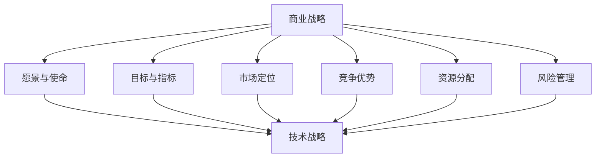

通过这个流程图，我们可以清晰地看到技术战略与商业战略之间的紧密联系。

### 核心算法原理讲解

在技术战略与商业战略的协同过程中，可以使用以下核心算法原理来优化企业的战略制定与执行：

1. **目标规划算法**：通过目标规划算法，将商业战略的目标分解为可操作的技术目标，确保技术战略的可行性和实施性。

   ```python
   # 目标规划算法伪代码
   def goal_planning(commercial_goals, technical_goals):
       for goal in commercial_goals:
           for sub_goal in technical_goals:
               if sub_goal.is_related_to(goal):
                   sub_goal.assign_resources()
                   break
   ```

2. **资源分配算法**：通过资源分配算法，将企业的资源（如资金、人力等）合理分配到各个技术项目，确保资源的最优利用。

   ```python
   # 资源分配算法伪代码
   def resource_allocation(resources, projects):
       for project in projects:
           project.allocate_resources(resources)
           resources -= project.required_resources
   ```

### 数学模型和公式

在技术战略与商业战略的协同过程中，可以使用以下数学模型和公式来评估和优化战略的执行效果：

1. **协同效率指数**：用于评估技术战略与商业战略的协同效果。

   $$\text{协同效率指数} = \frac{\text{商业目标达成率} \times \text{技术目标达成率}}{\text{总资源投入}}$$

2. **战略优化模型**：用于优化技术战略与商业战略的匹配度。

   $$\text{战略优化模型} = \max_{x, y} \left( \text{商业目标达成率} \times \text{技术目标达成率} \right) \text{ s.t. } \text{资源限制}$$

   其中，$x$ 和 $y$ 分别代表商业战略和技术战略的权重。

### 举例说明

假设一家公司希望在下一个财年实现20%的销售额增长，并通过技术创新提升客户满意度。商业战略的目标是增加市场份额和客户忠诚度。技术战略的目标是开发一个智能客服系统，以提供更加个性化的客户服务。

首先，公司使用目标规划算法将商业目标分解为具体的技术目标，例如提高客户响应速度、提升问题解决率等。接着，公司使用资源分配算法，将预算、人力资源等资源合理分配到智能客服系统的开发项目中。在项目实施过程中，公司不断评估和优化技术目标，确保其与商业目标保持一致。通过这种协同作用，公司成功地实现了20%的销售额增长，并显著提升了客户满意度。

### 项目实战

在实际操作中，技术战略与商业战略的协同可以进一步细化。例如，在一家制造业公司的数字化转型项目中，商业战略的目标是提升生产效率和产品质量。技术战略的目标是引入物联网技术和大数据分析，实现智能生产管理。

首先，公司进行市场调研，分析竞争对手的技术水平和发展趋势，确定技术方向。接着，公司制定详细的技术路线图，包括传感器安装、数据采集、数据分析等关键步骤。在项目实施过程中，技术团队与业务团队紧密合作，确保技术解决方案与业务需求相匹配。最终，公司成功实现了智能生产管理，生产效率提升了30%，产品质量也得到了显著提升。

### 小结

技术战略与商业战略的协同是确保企业持续创新和市场竞争力的关键。通过明确技术战略与商业战略的目标和关系，合理分配资源，优化战略执行过程，企业可以更好地实现商业目标，提升市场竞争力。

### 最佳实践 Tips

- **建立跨部门协作机制**：确保技术团队与业务团队之间的沟通与协作，提高战略执行的效率。
- **定期评估战略效果**：定期评估技术战略与商业战略的协同效果，及时调整战略以适应市场变化。

### 注意事项

- **确保战略目标的明确性**：在制定技术战略时，要确保目标明确、具体，并与商业战略保持一致。
- **合理分配资源**：在资源有限的情况下，要优先考虑对战略目标影响较大的技术项目。

### 拓展阅读

- 《商业战略精要：概念、工具与方法》
- 《技术管理：战略与实践》
- 《数字化转型：战略与实践指南》

### 作者信息

作者：AI天才研究院/AI Genius Institute & 禅与计算机程序设计艺术 /Zen And The Art of Computer Programming

----------------------------------------------------------------

## 3. 技术战略的关键要素

技术战略的制定不仅仅是技术问题，它需要综合企业内外部的各种因素，确保战略的科学性、可行性和有效性。在制定技术战略时，有四个关键要素至关重要：技术愿景与目标、技术路线图、技术资源与预算。以下将详细讨论这些要素，并提供实际案例分析。

### 技术愿景与目标

技术愿景是企业对未来技术发展的总体设想和期望，是技术战略的起点。技术目标则是实现技术愿景的具体步骤和成果。明确的技术愿景与目标有助于指导企业技术发展的方向，提高技术创新的针对性和效率。

- **愿景**：例如，企业可能希望在未来五年内成为行业领先的技术创新者，拥有自主知识产权的核心技术。
- **目标**：为实现愿景，企业可以设定短期目标，如每年发布一款具有竞争力的新产品，或提升现有产品的技术性能。

### 技术路线图

技术路线图是技术战略的具体实施计划，它详细描述了从当前技术水平到未来目标技术水平的逐步演进过程。技术路线图通常包括关键里程碑、技术节点和实现时间表。

- **关键里程碑**：例如，实现某项核心技术突破、完成产品原型开发、完成市场测试等。
- **技术节点**：例如，技术选型、研发设计、测试验证等具体工作环节。

### 技术资源与预算

技术资源的合理分配是确保技术战略顺利实施的基础。技术资源包括资金、人才、设备、技术平台等。预算则是技术资源分配的具体体现，是确保技术项目顺利推进的重要保障。

- **资金**：技术项目需要投入大量资金，包括研发费用、设备购置费、人员薪酬等。
- **人才**：技术人才是企业技术创新的核心资源，企业需要根据项目需求合理配置人才。
- **设备与平台**：技术项目的实施需要相应的设备和平台支持，如研发工具、实验设备、云计算平台等。

### 核心概念与联系

为了更好地理解技术战略的关键要素，我们可以使用Mermaid流程图来展示技术愿景与目标、技术路线图和技术资源与预算之间的关系：

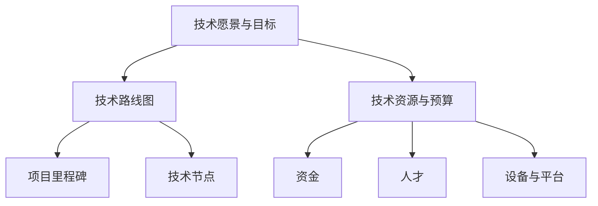

通过这个流程图，我们可以清晰地看到技术战略各个要素之间的相互联系。

### 实际案例分析

以下是一个实际案例分析，以一家互联网公司为例，说明技术战略的关键要素如何在实际操作中应用。

**案例背景**：该公司是一家提供在线教育服务的公司，其技术战略目标是利用人工智能技术提升个性化学习体验，提高用户留存率和学习效果。

**技术愿景与目标**：公司的愿景是在未来三年内成为在线教育领域的人工智能技术创新领导者，通过个性化推荐算法、智能学习路径规划等技术，提升用户体验。

**技术路线图**：

1. **项目里程碑**：
   - 第一阶段：完成个性化推荐算法的研发与测试。
   - 第二阶段：实现智能学习路径规划的功能。
   - 第三阶段：完成系统的全面优化和用户测试。

2. **技术节点**：
   - 技术选型：选择合适的人工智能算法和框架。
   - 研发设计：基于技术选型，设计具体的算法模型。
   - 测试验证：对研发出的算法模型进行测试和验证。

**技术资源与预算**：

- **资金**：公司计划投入2000万元用于技术研发，其中500万元用于设备购置，1500万元用于人员薪酬和研发费用。
- **人才**：组建了一支由10名数据科学家、10名软件开发工程师和5名产品经理组成的技术团队。
- **设备与平台**：使用云计算平台进行数据处理和算法训练，采购了高性能计算设备以支持大规模数据处理。

**实施过程**：

- **第一阶段**：公司完成了个性化推荐算法的研发，并在内部进行了一系列测试，验证了算法的有效性。
- **第二阶段**：公司开发实现了智能学习路径规划功能，通过用户数据分析和学习行为建模，为用户提供定制化的学习建议。
- **第三阶段**：公司进行了全面系统优化，并邀请用户进行测试，根据反馈不断优化系统。

通过以上步骤，公司成功实现了技术战略的目标，用户满意度和留存率显著提升，公司在在线教育市场的竞争力也得到了增强。

### 核心算法原理讲解

在技术路线图的实施过程中，核心算法原理的讲解至关重要。以下是一个关于个性化推荐算法的核心算法原理讲解：

**算法原理**：基于协同过滤和内容推荐相结合的算法。

**伪代码**：

```python
# 个性化推荐算法伪代码

# 协同过滤部分
def collaborative_filtering(user_history, item_ratings):
    similar_users = find_similar_users(user_history)
    recommended_items = []
    for item in item_ratings:
        if user_liked(item):
            continue
        for user in similar_users:
            if user_liked(item):
                recommended_items.append(item)
                break
    return recommended_items

# 内容推荐部分
def content_based_recommendation(user_profile, item_features):
    similar_items = find_similar_items(item_features)
    recommended_items = []
    for item in similar_items:
        if user_liked(item):
            continue
        recommended_items.append(item)
    return recommended_items

# 综合推荐
def hybrid_recommendation(user_profile, item_ratings):
    collaborative_recs = collaborative_filtering(user_profile, item_ratings)
    content_recs = content_based_recommendation(user_profile, item_ratings)
    recommended_items = collaborative_recs + content_recs
    return recommended_items
```

### 数学模型和公式

在技术资源与预算的分配中，常用的数学模型和公式包括：

1. **资源优化模型**：

   $$\text{最大化收益} = \sum_{i=1}^{n} p_i \cdot q_i \cdot r_i$$
   
   其中，$p_i$ 是第 $i$ 项资源的单价，$q_i$ 是第 $i$ 项资源的用量，$r_i$ 是第 $i$ 项资源的效率。

2. **预算分配模型**：

   $$\text{总预算} = \sum_{i=1}^{n} c_i \cdot q_i$$
   
   其中，$c_i$ 是第 $i$ 项资源的成本，$q_i$ 是第 $i$ 项资源的用量。

### 举例说明

假设一家公司计划开发一款智能家居控制系统，技术路线图包括三个关键里程碑：完成传感器安装、实现远程控制和完成智能场景设置。公司需要分配500万元预算，并组建一个由10名软件开发工程师、5名硬件工程师和3名产品经理组成的技术团队。

- **第一阶段：完成传感器安装**（预算200万元，团队人员40人·天）。
- **第二阶段：实现远程控制**（预算150万元，团队人员30人·天）。
- **第三阶段：完成智能场景设置**（预算150万元，团队人员20人·天）。

通过资源优化模型和预算分配模型，公司可以计算出每个阶段的资源需求和预算分配，确保项目顺利推进。

### 项目实战

在实际项目中，技术资源的合理分配和预算管理至关重要。以下是一个项目实战案例：

**项目背景**：一家初创公司计划开发一款基于区块链的金融应用，目标是实现安全、透明的金融交易。

**技术路线图**：

1. **第一阶段：区块链底层架构搭建**（预算100万元，团队人员20人·天）。
2. **第二阶段：智能合约开发**（预算200万元，团队人员30人·天）。
3. **第三阶段：金融交易功能实现**（预算300万元，团队人员40人·天）。

通过合理分配资源，公司确保了每个阶段的顺利推进，并在项目结束后成功上线了金融应用，获得了用户和市场的认可。

### 小结

技术战略的关键要素包括技术愿景与目标、技术路线图和技术资源与预算。通过明确技术愿景和目标，制定详细的技术路线图，合理分配技术资源与预算，企业可以确保技术战略的顺利实施，实现技术发展的长远目标。

### 最佳实践 Tips

- **定期评估技术愿景与目标的实现情况**：确保技术战略与企业长期发展目标的一致性。
- **建立灵活的技术资源分配机制**：根据项目进展和市场需求，动态调整资源分配。

### 注意事项

- **确保技术资源与预算的合理分配**：避免资源浪费，提高项目成功率。
- **建立有效的沟通机制**：确保技术团队与业务团队之间的信息畅通，提高协作效率。

### 拓展阅读

- 《技术管理：战略与实践》
- 《项目管理：技巧与方法》
- 《数据驱动决策：商业洞察与实践》

### 作者信息

作者：AI天才研究院/AI Genius Institute & 禅与计算机程序设计艺术 /Zen And The Art of Computer Programming

----------------------------------------------------------------

## 4. 技术评估方法

技术评估是企业制定技术战略的重要环节，它有助于企业了解自身的当前技术状况、市场需求和竞争环境，从而为技术规划提供可靠的数据支持。本节将详细介绍技术评估的方法，包括内部能力评估、外部市场评估和技术潜力评估。

### 内部能力评估

内部能力评估主要是对企业现有的技术能力进行综合评估，包括技术团队的实力、技术储备、研发能力和项目管理能力等方面。以下是一些具体的评估方法和指标：

- **技术团队评估**：评估技术团队的专业技能、协作能力和创新能力。可以使用问卷调查、技能测试和绩效评估等方法。
- **技术储备评估**：评估企业现有的技术储备，包括核心专利、研发成果和关键技术等。可以通过技术档案查询、项目回顾和专利数据库检索等手段。
- **研发能力评估**：评估企业的研发效率、创新能力和技术积累。可以采用项目进度、研发成果和科研经费投入等指标。
- **项目管理能力评估**：评估企业在项目管理方面的能力，包括项目计划、进度控制、成本管理和风险应对等。可以通过项目回顾、管理评审和项目管理知识体系评估等手段。

### 外部市场评估

外部市场评估主要是对企业所处的外部环境进行评估，包括市场需求、竞争态势、行业趋势和技术标准等方面。以下是一些具体的评估方法和指标：

- **市场需求评估**：评估企业产品或服务的市场需求，包括市场规模、增长趋势和潜在客户群体。可以通过市场调研、销售数据和客户反馈等手段。
- **竞争态势评估**：评估企业所处的竞争环境，包括竞争对手的技术水平、市场份额和竞争优势。可以通过竞争对手分析、市场调研和行业报告等手段。
- **行业趋势评估**：评估行业的发展趋势和技术变革，包括新兴技术的应用、市场动向和政策法规等。可以通过行业报告、技术趋势分析和政策解读等手段。
- **技术标准评估**：评估企业技术是否符合行业标准和法规要求，包括技术规范、安全标准和环保要求等。可以通过标准文档、法规解读和第三方认证等手段。

### 技术潜力评估

技术潜力评估主要是评估企业未来技术发展的潜力和可能性，包括技术发展方向、创新能力和市场前景等方面。以下是一些具体的评估方法和指标：

- **技术发展方向评估**：评估企业技术发展的长期方向和战略定位，包括技术领域的选择、技术路线的规划和战略布局等。可以通过技术趋势分析、技术路线图规划和战略决策等手段。
- **创新能力评估**：评估企业的创新能力和创新潜力，包括研发投入、创新成果和创新能力等。可以通过专利数量、研发经费投入、科研成果和创新能力评估等手段。
- **市场前景评估**：评估企业未来技术市场的需求和潜力，包括市场规模、增长趋势和潜在机会等。可以通过市场调研、竞争分析和市场预测等手段。

### 核心概念与联系

为了更好地理解技术评估的方法和流程，我们可以使用Mermaid流程图来展示内部能力评估、外部市场评估和技术潜力评估之间的关系：

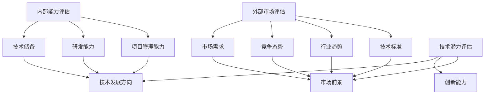

通过这个流程图，我们可以清晰地看到技术评估的各个方法和指标之间的相互联系。

### 核心算法原理讲解

在技术评估过程中，可以使用以下核心算法原理来提高评估的准确性和科学性：

1. **主成分分析（PCA）**：用于降维和提取关键特征，可以从大量的技术数据中提取出最重要的信息，简化评估过程。

   ```python
   # 主成分分析伪代码
   def pca(data):
       # 计算数据协方差矩阵
       covariance_matrix = np.cov(data)
       # 计算特征值和特征向量
       eigenvalues, eigenvectors = np.linalg.eig(covariance_matrix)
       # 选择最重要的特征向量
       principal_components = np.dot(data, eigenvectors[:k])
       return principal_components
   ```

2. **机器学习模型**：可以使用机器学习模型（如决策树、随机森林、支持向量机等）来预测技术评估的指标，提高评估的准确性。

   ```python
   # 决策树模型预测伪代码
   from sklearn.tree import DecisionTreeClassifier

   # 准备数据
   X_train, y_train = prepare_data()
   # 训练模型
   model = DecisionTreeClassifier()
   model.fit(X_train, y_train)
   # 预测评估结果
   predictions = model.predict(X_train)
   accuracy = accuracy_score(y_train, predictions)
   print("模型准确率：", accuracy)
   ```

### 数学模型和公式

在技术评估中，可以使用以下数学模型和公式来量化评估结果：

1. **综合评分模型**：

   $$\text{综合评分} = w_1 \cdot \text{技术储备得分} + w_2 \cdot \text{研发能力得分} + w_3 \cdot \text{项目管理能力得分} + w_4 \cdot \text{市场需求得分} + w_5 \cdot \text{竞争态势得分} + w_6 \cdot \text{行业趋势得分} + w_7 \cdot \text{技术标准得分} + w_8 \cdot \text{技术潜力得分}$$

   其中，$w_1, w_2, \ldots, w_8$ 为各个评估指标的权重。

2. **潜力评分模型**：

   $$\text{潜力评分} = \frac{\text{技术储备得分} + \text{研发能力得分} + \text{项目管理能力得分}}{3} \cdot 0.5 + \frac{\text{市场需求得分} + \text{竞争态势得分} + \text{行业趋势得分} + \text{技术标准得分}}{4} \cdot 0.5$$

### 举例说明

假设一家公司要进行技术评估，以下是一个具体案例：

- **内部能力评估**：
  - 技术储备：公司拥有20项核心专利，评估得分为90分。
  - 研发能力：公司研发团队在过去两年内共完成了10个研发项目，平均项目周期为6个月，评估得分为85分。
  - 项目管理能力：公司采用敏捷开发方法，项目按时交付率高达95%，评估得分为90分。

- **外部市场评估**：
  - 市场需求：公司产品在市场上的需求旺盛，预计未来三年市场规模将增长30%，评估得分为90分。
  - 竞争态势：公司在市场上排名前三，市场份额为25%，评估得分为80分。
  - 行业趋势：公司所在行业处于高速发展阶段，新兴技术不断涌现，评估得分为85分。
  - 技术标准：公司的技术符合行业标准和法规要求，评估得分为90分。

- **技术潜力评估**：
  - 技术发展方向：公司计划在未来三年内进入人工智能领域，评估得分为80分。
  - 创新能力：公司研发投入占收入的10%，创新成果丰富，评估得分为85分。
  - 市场前景：公司预计未来三年内市场份额将提升至35%，评估得分为90分。

根据以上评估，公司的综合评分为：

$$\text{综合评分} = 0.2 \cdot 90 + 0.2 \cdot 85 + 0.2 \cdot 90 + 0.2 \cdot 90 + 0.1 \cdot 80 + 0.1 \cdot 85 + 0.1 \cdot 90 + 0.1 \cdot 90 = 87.5$$

通过以上评估，公司可以清楚地了解自身的技术状况和市场环境，为制定技术战略提供参考。

### 项目实战

在实际项目中，技术评估是一个动态的过程，需要不断收集数据和信息，进行持续的评估和优化。以下是一个项目实战案例：

**项目背景**：一家互联网公司计划开发一款基于区块链的智能物流系统，目标是提高物流效率和透明度。

**技术评估过程**：

1. **内部能力评估**：
   - 技术储备：公司拥有区块链相关的专利和技术储备，评估得分为85分。
   - 研发能力：公司拥有经验丰富的区块链开发团队，评估得分为90分。
   - 项目管理能力：公司采用敏捷开发方法，项目按时交付率较高，评估得分为85分。

2. **外部市场评估**：
   - 市场需求：智能物流系统市场需求旺盛，预计未来三年市场规模将增长40%，评估得分为90分。
   - 竞争态势：公司在市场上排名第五，市场份额为15%，评估得分为75分。
   - 行业趋势：区块链技术在物流领域的应用逐渐成熟，评估得分为80分。
   - 技术标准：公司的技术方案符合行业标准和法规要求，评估得分为85分。

3. **技术潜力评估**：
   - 技术发展方向：公司计划在未来三年内拓展区块链技术的应用领域，评估得分为80分。
   - 创新能力：公司计划引入新的区块链技术和算法，评估得分为85分。
   - 市场前景：公司预计未来三年内市场份额将提升至25%，评估得分为90分。

根据以上评估，公司的技术战略为：
- **短期目标**：完善智能物流系统的原型，进行内部测试和优化。
- **长期目标**：进一步拓展区块链技术的应用领域，提升市场份额。

通过以上技术评估，公司制定了详细的技术规划，确保项目顺利进行，并实现了预期目标。

### 小结

技术评估是制定技术战略的重要环节，通过内部能力评估、外部市场评估和技术潜力评估，企业可以全面了解自身的技术状况、市场需求和竞争环境，为技术战略的制定提供科学依据。有效的技术评估有助于企业发现优势与劣势，制定合理的技术规划，提高市场竞争力。

### 最佳实践 Tips

- **建立持续的技术评估机制**：定期进行技术评估，确保技术战略与市场需求和技术趋势保持一致。
- **多维度评估**：综合考虑技术能力、市场需求、竞争态势等因素，全面评估技术战略的可行性。

### 注意事项

- **确保评估数据的真实性**：评估过程中要收集真实、准确的数据，避免评估结果失真。
- **结合实际情况进行评估**：评估时需结合企业的实际情况，避免过度依赖理论模型。

### 拓展阅读

- 《技术评估与管理：理论与实践》
- 《技术创新战略：理论与实践》
- 《市场分析：方法与技巧》

### 作者信息

作者：AI天才研究院/AI Genius Institute & 禅与计算机程序设计艺术 /Zen And The Art of Computer Programming

----------------------------------------------------------------

## 5. 技术规划流程

技术规划是企业实现技术战略、确保技术资源有效利用的关键步骤。一个科学、系统的技术规划流程能够帮助企业明确技术发展方向，优化资源配置，提升技术实力和竞争力。本节将详细讨论技术规划流程，包括技术需求分析、技术选型与设计、技术开发与测试等关键环节。

### 技术需求分析

技术需求分析是技术规划的首要步骤，旨在明确企业技术发展的需求和目标。通过技术需求分析，企业可以了解当前存在的问题和未来的发展方向，为后续的技术选型和开发提供基础。

#### 关键步骤：

1. **收集需求信息**：通过市场调研、用户访谈、竞争分析等方式，收集企业内外部技术需求的信息。
2. **需求分类与优先级排序**：对收集到的需求信息进行分类，并根据需求的重要性和紧迫性进行优先级排序。
3. **需求确认**：与利益相关者（如业务部门、技术团队、管理层等）进行沟通，确认需求的具体内容和实现方式。

#### 核心概念与联系

为了更好地理解技术需求分析，我们可以使用Mermaid流程图来展示需求收集、分类和确认的过程：

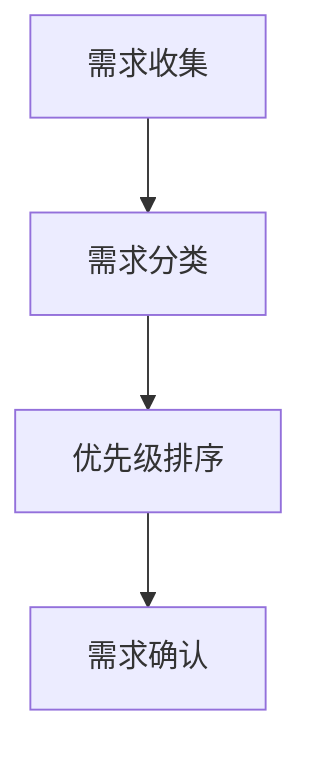

通过这个流程图，我们可以清晰地看到技术需求分析的各个步骤和它们之间的逻辑关系。

### 技术选型与设计

技术选型与设计是在明确技术需求后，选择合适的技术方案和进行系统设计的过程。技术选型需要综合考虑技术可行性、成本效益、市场趋势等因素，而技术设计则是在选型基础上，制定详细的系统架构和实现方案。

#### 关键步骤：

1. **技术选型**：根据需求分析的结果，评估各种技术方案的优势和劣势，选择最适合企业需求的技术。
2. **系统设计**：制定系统的整体架构，包括硬件、软件、网络等方面，确保系统能够满足需求并且具有良好的扩展性。
3. **设计评审**：对系统设计进行评审，确保设计方案的可行性和合理性。

#### 核心概念与联系

为了更好地理解技术选型与设计，我们可以使用Mermaid流程图来展示技术选型和系统设计的过程：

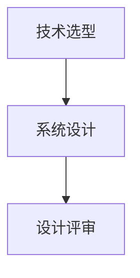

通过这个流程图，我们可以清晰地看到技术选型与设计的各个步骤和它们之间的逻辑关系。

### 技术开发与测试

技术开发与测试是技术规划的核心环节，包括代码编写、系统集成和测试验证等步骤。通过严格的技术开发和测试，确保系统的稳定性和可靠性。

#### 关键步骤：

1. **代码编写**：根据系统设计，进行代码编写，实现系统功能。
2. **系统集成**：将各个模块集成在一起，确保系统能够正常运行。
3. **功能测试**：对系统功能进行测试，确保各项功能符合需求。
4. **性能测试**：对系统性能进行测试，确保系统在高负载情况下能够稳定运行。
5. **安全测试**：对系统安全性进行测试，确保系统不受外部攻击。

#### 核心概念与联系

为了更好地理解技术开发与测试，我们可以使用Mermaid流程图来展示代码编写、集成和测试的过程：

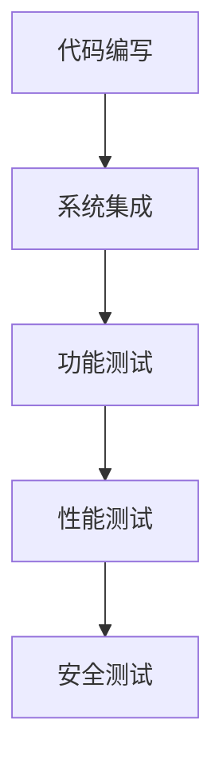

通过这个流程图，我们可以清晰地看到技术开发与测试的各个步骤和它们之间的逻辑关系。

### 数学模型和公式

在技术规划过程中，可以使用以下数学模型和公式来辅助决策和评估：

1. **成本效益分析（CBA）**：

   $$\text{净现值} = \sum_{t=1}^{n} \frac{C_t}{(1+r)^t} - C_0$$

   其中，$C_t$ 是第 $t$ 年的现金流，$r$ 是折现率，$C_0$ 是初始投资。

2. **系统可靠性模型**：

   $$\text{系统可靠性} = \prod_{i=1}^{n} \text{组件可靠性}_i$$

   其中，$\text{组件可靠性}_i$ 是第 $i$ 个组件的可靠性。

### 举例说明

假设一家公司计划开发一款电子商务平台，技术规划流程如下：

**技术需求分析**：
- 需求1：提供商品展示和购买功能。
- 需求2：实现用户注册和登录功能。
- 需求3：实现购物车和订单管理功能。

**技术选型与设计**：
- 技术选型：选择基于Java的Spring Boot框架进行开发，使用MySQL数据库进行数据存储。
- 系统设计：设计B/S架构，包括前端、后端和数据库三个部分。

**技术开发与测试**：
- 代码编写：前端使用HTML、CSS和JavaScript编写，后端使用Spring Boot框架进行开发。
- 系统集成：将前端和后端代码集成，确保系统能够正常运行。
- 功能测试：对系统功能进行测试，确保各项功能符合需求。
- 性能测试：对系统性能进行测试，确保在高并发情况下系统能够稳定运行。
- 安全测试：对系统安全性进行测试，确保系统不受外部攻击。

通过以上技术规划流程，公司成功开发并上线了电子商务平台，满足了市场需求，取得了良好的经济效益。

### 项目实战

在实际项目中，技术规划流程是一个动态调整的过程，需要根据项目进展和市场变化进行持续优化。以下是一个项目实战案例：

**项目背景**：一家科技公司计划开发一款智能家居控制系统，目标是实现家庭设备的智能控制和远程监控。

**技术规划流程**：

1. **技术需求分析**：
   - 需求1：实现智能设备连接和控制。
   - 需求2：提供远程监控和设备状态查询功能。
   - 需求3：确保系统的安全性和稳定性。

2. **技术选型与设计**：
   - 技术选型：选择基于物联网技术的Zigbee协议进行设备连接，使用MQTT协议进行数据传输。
   - 系统设计：设计C/S架构，包括客户端和服务器两个部分。

3. **技术开发与测试**：
   - 代码编写：客户端使用Python编写，服务器使用Java编写。
   - 系统集成：将客户端和服务器代码集成，确保系统能够正常运行。
   - 功能测试：对系统功能进行测试，确保各项功能符合需求。
   - 性能测试：对系统性能进行测试，确保在高并发情况下系统能够稳定运行。
   - 安全测试：对系统安全性进行测试，确保系统不受外部攻击。

在项目实施过程中，公司根据用户反馈和技术发展进行了多次调整和优化，最终成功开发并上线了智能家居控制系统，用户满意度显著提升。

### 小结

技术规划流程是企业实现技术战略的重要手段，通过技术需求分析、技术选型与设计、技术开发与测试等步骤，企业可以系统地规划技术发展，确保技术资源的有效利用。一个科学、系统的技术规划流程有助于企业提升技术实力，实现长期发展目标。

### 最佳实践 Tips

- **定期进行技术需求分析**：确保技术规划与市场需求保持一致。
- **结合实际情况进行技术选型**：综合考虑技术可行性、成本效益等因素。

### 注意事项

- **确保技术规划的可行性**：在技术规划过程中，要充分考虑企业的技术能力和资源状况。
- **注重测试与验证**：确保技术开发完成后，进行充分的测试与验证，确保系统的稳定性和可靠性。

### 拓展阅读

- 《软件项目管理：实践与技巧》
- 《系统分析与设计：方法与技术》
- 《物联网技术与应用：原理与实践》

### 作者信息

作者：AI天才研究院/AI Genius Institute & 禅与计算机程序设计艺术 /Zen And The Art of Computer Programming

----------------------------------------------------------------

## 6. 技术风险评估

技术风险是企业在技术规划和实施过程中不可避免的问题。技术风险评估是确保技术项目成功、减少潜在损失的重要步骤。通过全面、系统的风险评估，企业可以提前识别和应对潜在的技术风险，确保技术战略的有效实施。

### 核心概念与联系

为了更好地理解技术风险评估，我们可以使用Mermaid流程图来展示风险评估的各个阶段：

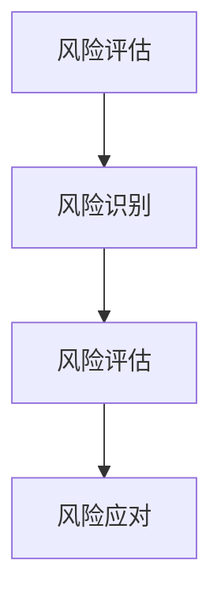

通过这个流程图，我们可以清晰地看到技术风险评估的三个主要阶段和它们之间的逻辑关系。

### 风险识别

风险识别是技术风险评估的第一步，旨在识别可能影响技术项目成功的技术风险。以下是一些常用的风险识别方法：

- **专家访谈**：通过与技术专家、项目团队成员和管理层进行访谈，了解他们对项目潜在风险的看法。
- **历史数据分析**：通过分析企业以往项目的历史数据，识别可能重复出现的风险。
- **文献研究**：查阅相关技术文献、行业报告和案例研究，了解常见的技术风险。
- **头脑风暴**：组织项目团队成员进行头脑风暴，收集他们对项目风险的看法和建议。

### 风险评估

在识别出潜在风险后，企业需要对风险进行评估，确定其发生的可能性、影响程度和优先级。以下是一些常用的风险评估方法：

- **定性风险评估**：通过专家判断，对风险的可能性和影响程度进行评分，从而确定风险的优先级。
- **定量风险评估**：使用数学模型和统计方法，对风险的发生概率和损失进行量化评估。
- **矩阵分析**：使用风险矩阵对风险进行评估，矩阵的行表示风险的可能发生概率，列表示风险的影响程度。

### 风险应对

在确定风险后，企业需要制定相应的应对策略，以减少风险带来的负面影响。以下是一些常用的风险应对策略：

- **风险规避**：通过改变项目计划或技术方案，避免风险的发生。
- **风险转移**：通过购买保险、签订合同等方式，将风险转移给第三方。
- **风险减轻**：通过改进技术方案、增加资源投入等方式，降低风险的发生概率或影响程度。
- **风险接受**：在无法避免或转移风险的情况下，企业可以接受风险，并制定相应的应急计划。

### 核心算法原理讲解

在技术风险评估中，可以使用以下核心算法原理来提高评估的准确性和有效性：

1. **贝叶斯网络**：用于表示和推理不确定性信息，可以用于评估技术风险的概率和影响程度。

   ```python
   # 贝叶斯网络伪代码
   def bayesian_network(risk_model):
       # 构建贝叶斯网络
       bn = build_bayesian_network(risk_model)
       # 进行推理
       inferred_risk = infer_risk(bn)
       return inferred_risk
   ```

2. **决策树**：用于分类和回归分析，可以用于评估风险的可能性和影响程度。

   ```python
   # 决策树模型评估伪代码
   from sklearn.tree import DecisionTreeClassifier

   # 准备数据
   X_train, y_train = prepare_data()
   # 训练模型
   model = DecisionTreeClassifier()
   model.fit(X_train, y_train)
   # 评估风险
   risk_scores = model.predict(X_train)
   ```

### 数学模型和公式

在技术风险评估中，可以使用以下数学模型和公式来量化风险：

1. **风险评分模型**：

   $$\text{风险评分} = \text{可能性} \times \text{影响程度}$$

   其中，可能性表示风险发生的概率，影响程度表示风险发生后的损失。

2. **期望损失模型**：

   $$\text{期望损失} = \sum_{i=1}^{n} \text{风险}_{i} \times \text{可能性}_{i}$$

   其中，$\text{风险}_{i}$ 表示第 $i$ 个风险的影响程度，$\text{可能性}_{i}$ 表示第 $i$ 个风险发生的概率。

### 举例说明

假设一家公司计划开发一款人工智能驱动的客户服务平台，以下是一个技术风险评估的案例：

**风险识别**：
- 风险1：数据隐私泄露
- 风险2：技术方案复杂度过高
- 风险3：开发周期延长
- 风险4：技术人才短缺

**风险评估**：
- 风险1（数据隐私泄露）：可能性为0.3，影响程度为5，风险评分为1.5。
- 风险2（技术方案复杂度过高）：可能性为0.2，影响程度为4，风险评分为0.8。
- 风险3（开发周期延长）：可能性为0.4，影响程度为3，风险评分为1.2。
- 风险4（技术人才短缺）：可能性为0.5，影响程度为2，风险评分为1.0。

**风险应对**：
- 风险1（数据隐私泄露）：采取加密存储、访问控制等措施，降低风险。
- 风险2（技术方案复杂度过高）：简化技术方案，提高可维护性。
- 风险3（开发周期延长）：增加人力资源，优化项目管理流程。
- 风险4（技术人才短缺）：招聘专业人才，提供培训和支持。

通过以上风险评估和应对措施，公司可以有效降低技术风险，确保项目的顺利实施。

### 项目实战

在实际项目中，技术风险评估是一个持续的过程，需要根据项目进展和外部环境的变化进行动态调整。以下是一个项目实战案例：

**项目背景**：一家科技公司计划开发一款基于区块链的金融服务平台，提供数字货币交易和资产管理服务。

**技术风险评估过程**：

1. **风险识别**：
   - 风险1：区块链技术不成熟
   - 风险2：合规性风险
   - 风险3：技术人才短缺
   - 风险4：市场风险

2. **风险评估**：
   - 风险1（区块链技术不成熟）：可能性为0.4，影响程度为5，风险评分为2.0。
   - 风险2（合规性风险）：可能性为0.3，影响程度为4，风险评分为1.2。
   - 风险3（技术人才短缺）：可能性为0.5，影响程度为3，风险评分为1.5。
   - 风险4（市场风险）：可能性为0.2，影响程度为2，风险评分为0.4。

3. **风险应对**：
   - 风险1（区块链技术不成熟）：与区块链技术供应商合作，获取技术支持。
   - 风险2（合规性风险）：咨询法律顾问，确保平台符合相关法规。
   - 风险3（技术人才短缺）：招聘区块链技术人才，提供培训和激励机制。
   - 风险4（市场风险）：进行市场调研，调整产品定位和营销策略。

通过以上技术风险评估和应对措施，公司有效降低了技术风险，确保了项目的顺利推进。

### 小结

技术风险评估是确保技术项目成功的关键环节，通过风险识别、风险评估和风险应对，企业可以提前识别和应对潜在的技术风险，确保技术战略的有效实施。有效的技术风险评估有助于企业提升技术实力，实现长期发展目标。

### 最佳实践 Tips

- **建立全面的风险评估机制**：确保风险识别、评估和应对的全面性和系统性。
- **结合实际情况进行风险应对**：根据风险的重要性和影响程度，制定相应的应对策略。

### 注意事项

- **确保风险评估的准确性**：收集真实、准确的数据，避免风险评估结果失真。
- **动态调整风险评估**：根据项目进展和外部环境的变化，及时调整风险评估和应对策略。

### 拓展阅读

- 《技术风险管理：理论与实践》
- 《项目管理：风险管理与控制》
- 《区块链技术与应用：安全与合规》

### 作者信息

作者：AI天才研究院/AI Genius Institute & 禅与计算机程序设计艺术 /Zen And The Art of Computer Programming

----------------------------------------------------------------

## 7. 技术项目管理

技术项目管理是确保技术项目按时、按质、按预算完成的关键。有效的技术项目管理不仅能够提高项目的成功率，还能优化资源利用，降低风险。本节将详细讨论技术项目管理的基础、技术项目计划、技术项目监控与控制等关键内容。

### 技术项目管理的基础

技术项目管理的基础包括项目章程、项目范围说明书、项目组织结构和项目管理流程。以下是一些基本概念和内容：

- **项目章程**：项目章程是项目启动的正式文件，它定义了项目的目标、范围、主要交付物、主要干系人和项目预算等基本信息。
- **项目范围说明书**：项目范围说明书详细描述了项目的范围、目标、可交付成果、主要工作内容和限制条件等。
- **项目组织结构**：项目组织结构定义了项目团队成员的角色、职责和权限，以及项目团队与其他部门之间的关系。
- **项目管理流程**：项目管理流程是项目管理过程中遵循的一系列步骤和方法，包括项目启动、规划、执行、监控和收尾等环节。

### 技术项目计划

技术项目计划是项目管理的重要环节，它涉及到项目的时间、成本、资源、风险和质量的全面规划。以下是一些关键步骤和内容：

- **项目时间计划**：制定项目的时间表，包括项目的关键里程碑、任务和活动的时间安排，以及项目的持续时间。
- **项目成本计划**：制定项目的预算，包括项目的直接成本、间接成本和潜在成本，并确保预算的合理性和可行性。
- **项目资源计划**：确定项目所需的资源，包括人力、设备、资金和技术，并制定资源分配和利用计划。
- **项目风险管理计划**：识别项目可能面临的风险，评估风险的概率和影响，并制定相应的风险应对策略。
- **项目质量计划**：制定项目的质量标准、质量保证措施和质量控制流程，确保项目的最终交付物符合预期质量。

### 技术项目监控与控制

技术项目监控与控制是确保项目按照计划进行的关键。以下是一些监控与控制的方法和工具：

- **项目进度监控**：定期监控项目的实际进度与计划进度的差异，通过项目进度报告和会议等方式，确保项目按计划推进。
- **项目成本控制**：监控项目的实际成本与预算的差异，通过成本分析、成本变更控制等方式，确保项目成本在预算范围内。
- **项目质量控制**：监控项目的实际质量与质量标准的差异，通过质量检查、质量评审和反馈机制等方式，确保项目的交付物符合质量要求。
- **项目风险控制**：监控项目风险的发生和变化，通过风险跟踪、风险预警和应急计划等方式，确保项目风险得到有效管理。

### 核心概念与联系

为了更好地理解技术项目管理，我们可以使用Mermaid流程图来展示项目计划、监控与控制的过程：

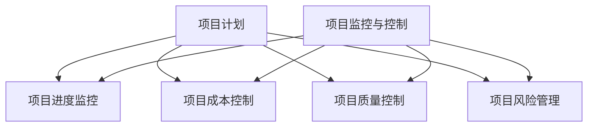

通过这个流程图，我们可以清晰地看到技术项目管理的各个步骤和它们之间的逻辑关系。

### 核心算法原理讲解

在技术项目管理中，可以使用以下核心算法原理来提高项目的成功率和效率：

1. **关键路径法（CPM）**：用于计算项目完成时间的最短路径，确保项目按时完成。

   ```python
   # 关键路径法伪代码
   def critical_path(project_tasks):
       task_durations = calculate_task_durations(project_tasks)
       critical_tasks = find_critical_tasks(task_durations)
       return critical_tasks
   ```

2. **项目管理软件**：如Microsoft Project、JIRA等，用于项目管理、任务跟踪和资源分配。

### 数学模型和公式

在技术项目管理中，可以使用以下数学模型和公式来辅助决策和评估：

1. **项目工期计算公式**：

   $$\text{项目工期} = \sum_{i=1}^{n} \text{任务工期}_{i}$$

   其中，$\text{任务工期}_{i}$ 是第 $i$ 个任务的持续时间。

2. **成本效益分析（CBA）**：

   $$\text{净现值} = \sum_{t=1}^{n} \frac{\text{现金流}_{t}}{(1+r)^t} - \text{初始投资}$$

   其中，$\text{现金流}_{t}$ 是第 $t$ 年的现金流，$r$ 是折现率。

### 举例说明

假设一家公司计划开发一款移动应用程序，以下是一个技术项目管理的案例：

**项目计划**：

- **项目范围**：开发一款具有用户注册、消息推送和社交分享功能的移动应用程序。
- **项目时间计划**：项目预计持续6个月，关键里程碑包括需求分析、设计、开发和测试。
- **项目成本计划**：预算为50万元，包括人力成本、设备成本和外部服务成本。
- **项目资源计划**：项目团队包括5名开发人员、2名测试人员和1名项目经理。
- **项目风险管理计划**：识别了技术风险、市场风险和人力资源风险，并制定了相应的应对策略。
- **项目质量计划**：制定了详细的质量标准和质量控制流程，确保应用符合用户体验和技术要求。

**项目监控与控制**：

- **项目进度监控**：每周进行项目进度会议，跟踪任务的完成情况，解决遇到的问题。
- **项目成本控制**：每月进行成本分析，确保项目在预算范围内进行，根据实际情况调整预算分配。
- **项目质量控制**：进行定期质量检查和用户反馈收集，及时修复发现的问题，优化用户体验。
- **项目风险控制**：定期进行风险评估，监控风险的变化，根据风险级别采取相应的应对措施。

通过以上技术项目管理的步骤，公司成功按时完成了移动应用程序的开发，并在市场上取得了良好的反响。

### 项目实战

在实际项目中，技术项目管理是一个动态的过程，需要根据项目进展和外部环境的变化进行调整。以下是一个项目实战案例：

**项目背景**：一家初创公司计划开发一款基于区块链的供应链管理平台，提供供应链可视化、交易记录和智能合约功能。

**技术项目管理过程**：

1. **项目计划**：
   - **项目范围**：开发一个区块链供应链管理平台，实现供应链信息可视化、交易记录存储和智能合约执行。
   - **项目时间计划**：项目预计持续12个月，包括需求分析、系统设计、开发和测试等阶段。
   - **项目成本计划**：预算为200万元，包括开发人员工资、设备购置和外部区块链技术服务费用。
   - **项目资源计划**：项目团队包括10名区块链开发人员、5名前端开发人员和3名测试人员。
   - **项目风险管理计划**：识别了技术风险、市场风险和合规性风险，并制定了相应的应对策略。
   - **项目质量计划**：制定了严格的质量标准和测试流程，确保平台的安全性和可靠性。

2. **项目监控与控制**：
   - **项目进度监控**：每周进行项目进度汇报，跟踪关键任务的完成情况，及时调整计划。
   - **项目成本控制**：每月进行成本分析，监控项目预算的执行情况，根据实际需求调整预算分配。
   - **项目质量控制**：进行定期代码审查和功能测试，确保平台的功能和质量符合要求。
   - **项目风险控制**：定期进行风险评估，识别潜在风险，并制定相应的应对措施。

通过以上技术项目管理的步骤，公司成功完成了区块链供应链管理平台的开发，并在市场上取得了显著成效。

### 小结

技术项目管理是确保技术项目成功的关键环节，通过项目计划、监控与控制，企业可以系统地管理项目进度、成本、质量和风险，提高项目成功率。有效的技术项目管理有助于企业优化资源利用，提升技术竞争力。

### 最佳实践 Tips

- **建立有效的沟通机制**：确保项目团队、利益相关者和管理层之间的信息畅通。
- **定期进行项目评审**：通过定期评审，及时发现和解决项目中的问题。

### 注意事项

- **确保项目计划的可行性**：项目计划应符合实际需求和技术能力。
- **注重项目风险管理**：识别和应对潜在的风险，确保项目能够顺利进行。

### 拓展阅读

- 《项目管理：实践与技巧》
- 《敏捷项目管理：方法与实践》
- 《技术项目管理：策略与工具》

### 作者信息

作者：AI天才研究院/AI Genius Institute & 禅与计算机程序设计艺术 /Zen And The Art of Computer Programming

----------------------------------------------------------------

## 8. 技术团队建设

技术团队建设是确保技术项目成功的关键要素之一。一个高效、协作的技术团队能够提高项目效率、降低风险，并推动技术创新。本节将详细讨论技术团队的组成、角色与职责、团队协作与沟通以及团队建设的挑战与解决策略。

### 技术团队的组成

技术团队的组成应根据项目的需求和企业的目标来确定。一个典型的技术团队通常包括以下角色：

- **项目经理**：负责整个项目的规划、执行、监控和收尾，确保项目按时、按质、按预算完成。
- **开发人员**：负责编写代码、实现系统功能，通常分为前端开发、后端开发和移动端开发等。
- **测试人员**：负责测试系统功能、性能和安全性，确保系统的质量符合预期。
- **架构师**：负责系统架构的设计和技术决策，确保系统的高可用性和可扩展性。
- **数据工程师**：负责数据处理、数据分析和数据存储，确保数据的准确性和可靠性。
- **运维人员**：负责系统的部署、运行和维护，确保系统的稳定性和安全性。
- **UI/UX设计师**：负责用户界面的设计和用户体验，提升产品的用户友好性。

### 角色与职责

每个技术团队成员都有明确的角色和职责，以下是常见角色与职责的概述：

- **项目经理**：制定项目计划、协调团队工作、管理项目风险、沟通项目进展和解决项目中的问题。
- **开发人员**：根据项目需求编写代码、实现功能、进行代码审查、参与技术讨论和代码优化。
- **测试人员**：设计测试用例、执行测试、报告测试结果、参与缺陷修复和回归测试。
- **架构师**：制定系统架构、进行技术选型、解决技术难题、提供技术指导和支持。
- **数据工程师**：处理大数据、构建数据模型、优化数据处理流程、确保数据的质量和可靠性。
- **运维人员**：部署系统、监控运行状态、解决故障、进行系统维护和升级。
- **UI/UX设计师**：设计用户界面、优化用户体验、进行用户研究、提供设计指导和支持。

### 团队协作与沟通

团队协作与沟通是技术团队成功的关键。以下是一些提高团队协作与沟通效率的策略：

- **敏捷开发**：采用敏捷开发方法，通过短周期迭代和频繁的团队沟通，确保项目进度和质量的稳定。
- **代码审查**：通过代码审查，确保代码的质量和一致性，促进团队成员之间的技术交流和知识共享。
- **团队会议**：定期召开团队会议，分享项目进展、讨论技术问题和解决方案，增强团队凝聚力。
- **协作工具**：使用协作工具（如Slack、Trello、JIRA等），方便团队成员之间的信息交流和任务分配。
- **知识共享**：建立知识库，记录项目经验和技术知识，便于团队成员查询和学习。

### 团队建设的挑战与解决策略

技术团队建设过程中可能会面临以下挑战，以下是一些解决策略：

- **沟通障碍**：团队成员之间的沟通不畅可能导致误解和冲突。解决策略包括定期举行团队会议、使用协作工具和建立开放的沟通文化。
- **技能多样性**：技术团队成员的技能和背景可能不同，导致协作困难。解决策略包括组织技能培训、鼓励跨职能协作和明确角色与职责。
- **资源分配不均**：资源分配不均可能导致部分团队成员工作负担过重，影响项目进展。解决策略包括定期评估资源分配、优化任务分配和提供额外支持。
- **团队凝聚力不足**：团队凝聚力不足可能导致工作效率下降。解决策略包括组织团队建设活动、鼓励团队成员之间的互动和提供职业发展机会。

### 核心概念与联系

为了更好地理解技术团队建设，我们可以使用Mermaid流程图来展示技术团队的组成、角色与职责以及团队协作与沟通的过程：

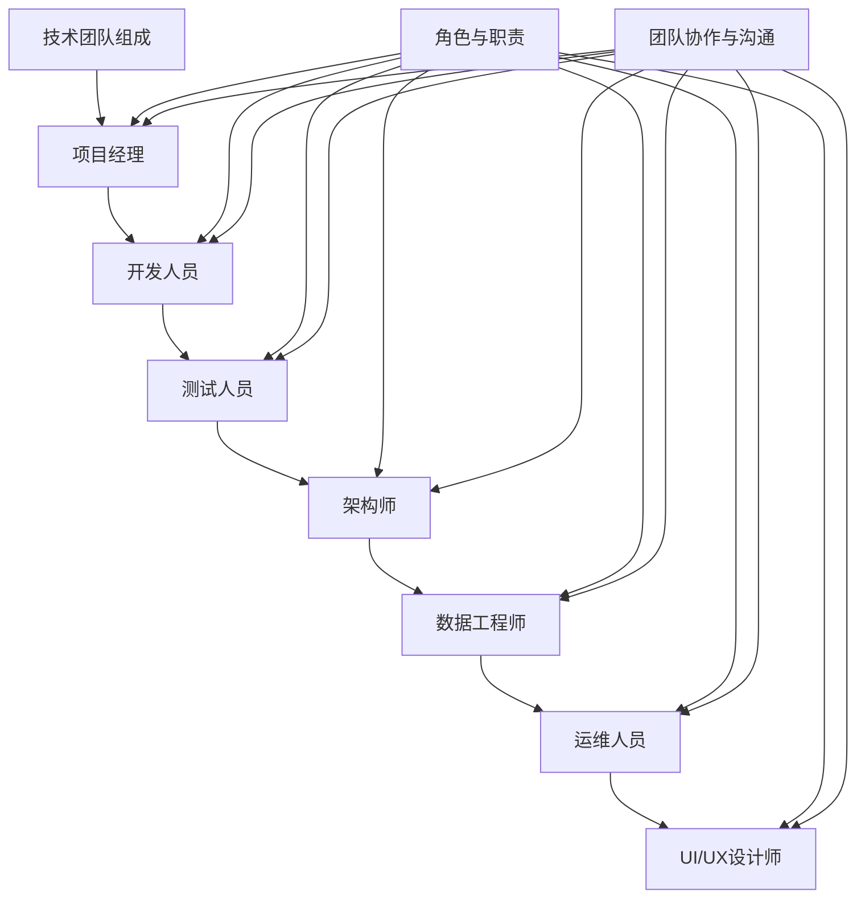

通过这个流程图，我们可以清晰地看到技术团队的组成、角色与职责以及团队协作与沟通的各个步骤和它们之间的逻辑关系。

### 项目实战

在实际项目中，技术团队建设是一个动态调整的过程，需要根据项目进展和团队变化进行持续优化。以下是一个项目实战案例：

**项目背景**：一家初创公司计划开发一款智能医疗诊断系统，目标是利用人工智能技术提高诊断准确率。

**技术团队建设过程**：

1. **项目团队组成**：
   - **项目经理**：负责项目规划、协调和管理，确保项目按计划推进。
   - **开发人员**：包括前端开发、后端开发和移动端开发人员，负责实现系统功能。
   - **测试人员**：负责测试系统功能、性能和安全性，确保系统的质量符合要求。
   - **架构师**：负责系统架构的设计和技术决策，确保系统的高可用性和可扩展性。
   - **数据工程师**：负责数据处理、数据分析和数据存储，确保数据的准确性和可靠性。
   - **运维人员**：负责系统的部署、运行和维护，确保系统的稳定性和安全性。
   - **UI/UX设计师**：负责用户界面的设计和用户体验，提升产品的用户友好性。

2. **团队协作与沟通**：
   - **敏捷开发**：采用敏捷开发方法，通过短周期迭代和频繁的团队沟通，确保项目进度和质量的稳定。
   - **代码审查**：通过代码审查，确保代码的质量和一致性，促进团队成员之间的技术交流和知识共享。
   - **团队会议**：定期召开团队会议，分享项目进展、讨论技术问题和解决方案，增强团队凝聚力。
   - **协作工具**：使用协作工具（如Slack、Trello、JIRA等），方便团队成员之间的信息交流和任务分配。
   - **知识共享**：建立知识库，记录项目经验和技术知识，便于团队成员查询和学习。

3. **团队建设的挑战与解决策略**：
   - **沟通障碍**：通过定期举行团队会议和建立开放的沟通文化，解决沟通不畅的问题。
   - **技能多样性**：组织技能培训，鼓励跨职能协作，明确角色与职责，提高团队协作效率。
   - **资源分配不均**：定期评估资源分配，优化任务分配，提供额外支持，确保资源合理利用。
   - **团队凝聚力不足**：组织团队建设活动，鼓励团队成员之间的互动和提供职业发展机会，增强团队凝聚力。

通过以上技术团队建设的过程，公司成功开发了智能医疗诊断系统，并在市场上取得了良好的反响。

### 小结

技术团队建设是确保技术项目成功的关键。通过明确技术团队的组成、角色与职责，优化团队协作与沟通，解决团队建设的挑战，企业可以打造一个高效、协作的技术团队，提高项目成功率，推动技术创新。

### 最佳实践 Tips

- **建立开放的沟通文化**：鼓励团队成员之间的沟通和知识共享。
- **定期进行技能培训**：提高团队成员的技能和知识水平。

### 注意事项

- **确保团队成员的角色和职责明确**：避免角色冲突和职责重叠。
- **合理分配资源**：根据项目需求和团队成员的能力进行资源分配。

### 拓展阅读

- 《团队协作：策略与工具》
- 《敏捷团队建设：理论与实践》
- 《技术团队管理：策略与实践》

### 作者信息

作者：AI天才研究院/AI Genius Institute & 禅与计算机程序设计艺术 /Zen And The Art of Computer Programming

----------------------------------------------------------------

## 9. 技术实施中的挑战与解决策略

在技术实施过程中，企业可能会面临各种挑战，这些挑战可能源于技术复杂性、项目管理和团队协作等多个方面。以下将讨论技术实施中常见的挑战，并提出相应的解决策略。

### 技术复杂性

技术复杂性是技术实施中的一个主要挑战。随着技术的不断发展，系统架构变得日益复杂，需要处理的数据量庞大，开发周期较长，这对团队的技术能力和项目管理提出了更高的要求。

#### 解决策略

1. **模块化设计**：将复杂的系统拆分为多个模块，每个模块负责不同的功能，这样可以降低系统的复杂性，提高可维护性和扩展性。
2. **逐步迭代**：采用逐步迭代的方法，逐步实现系统的各个功能模块，每次迭代后进行评估和优化，以确保系统稳定性和性能。
3. **技术培训**：定期组织技术培训，提高团队成员的技术能力，确保团队能够应对技术挑战。

### 项目管理挑战

项目管理挑战包括项目进度控制、成本管理、风险管理等方面。技术项目的复杂性使得项目管理变得更加困难，可能导致项目延期、超预算或无法达到预期目标。

#### 解决策略

1. **明确项目目标**：在项目启动时，明确项目目标、范围、里程碑和关键绩效指标，确保项目团队对项目有清晰的理解。
2. **敏捷项目管理**：采用敏捷项目管理方法，通过短周期的迭代和频繁的沟通，及时调整项目计划和目标，确保项目进度和质量。
3. **风险管理**：制定详细的风险管理计划，识别潜在风险，并制定相应的应对策略，确保风险在可控范围内。

### 团队协作与沟通

团队协作与沟通是技术实施成功的关键。在大型技术项目中，团队成员可能分布在不同的地点，这增加了沟通和协作的难度。

#### 解决策略

1. **协作工具**：使用协作工具（如Slack、Trello、JIRA等），方便团队成员之间的信息交流和任务分配。
2. **定期会议**：定期召开团队会议，讨论项目进展、解决问题和分享经验，增强团队凝聚力。
3. **跨职能协作**：鼓励团队成员跨职能协作，促进不同部门之间的沟通和协作，提高整体工作效率。

### 持续集成与部署

持续集成与部署是现代软件开发中的重要实践，但实施过程中可能会遇到技术障碍和团队协作问题。

#### 解决策略

1. **自动化测试**：建立自动化测试框架，确保每次代码更改后都能进行全面的测试，提高代码质量和部署效率。
2. **容器化技术**：采用容器化技术（如Docker），简化部署流程，确保在不同环境下的部署一致性。
3. **持续集成平台**：使用持续集成平台（如Jenkins、Travis CI等），自动化构建、测试和部署流程，提高开发效率和系统稳定性。

### 具体案例分析与解决方案

以下是一个具体案例，以及对应的解决方案：

**案例背景**：一家互联网公司计划开发一款在线教育平台，目标是提供高质量的教育资源和互动功能。

**挑战**：
- **技术复杂性**：系统需要处理大量的用户数据和视频流，同时支持多种设备和操作系统。
- **项目管理**：项目时间紧、任务多，需要高效的项目管理来确保按时交付。
- **团队协作与沟通**：团队成员分布在不同的城市，沟通和协作效率较低。

**解决方案**：
- **技术复杂性**：采用微服务架构，将系统拆分为多个独立的服务模块，每个模块负责不同的功能，如用户管理、内容管理、视频播放等。每个模块独立开发、测试和部署，降低系统复杂性。
- **项目管理**：采用敏捷开发方法，通过短周期迭代和频繁的团队沟通，确保项目进度和质量。同时，使用项目管理工具（如JIRA），实时跟踪任务进度和项目状态。
- **团队协作与沟通**：使用Slack进行日常沟通，Trello进行任务分配和进度跟踪。定期举行视频会议，讨论项目进展、解决问题和分享经验。此外，组织团队建设活动，增强团队凝聚力。

通过以上解决方案，公司成功开发了在线教育平台，并在规定时间内顺利上线，用户满意度显著提升。

### 小结

技术实施过程中，企业可能会面临技术复杂性、项目管理挑战、团队协作与沟通等多方面的挑战。通过模块化设计、逐步迭代、敏捷项目管理、协作工具和持续集成等技术手段，企业可以有效地解决这些挑战，确保技术项目的成功实施。

### 最佳实践 Tips

- **采用模块化设计**：降低系统复杂性，提高可维护性和扩展性。
- **使用敏捷项目管理**：提高项目进度和质量的可控性。
- **加强团队协作与沟通**：确保项目顺利进行。

### 注意事项

- **确保技术方案的可扩展性**：随着业务发展，系统能够灵活调整和扩展。
- **重视团队建设**：提高团队凝聚力，增强协作效率。

### 拓展阅读

- 《敏捷项目管理：理论与实践》
- 《持续集成与持续部署：方法与实践》
- 《技术团队管理：策略与实践》

### 作者信息

作者：AI天才研究院/AI Genius Institute & 禅与计算机程序设计艺术 /Zen And The Art of Computer Programming

----------------------------------------------------------------

## 10. 技术趋势分析

技术趋势分析是制定长期技术发展规划的重要环节，它有助于企业了解未来技术发展的方向，把握行业动态，为技术战略提供前瞻性指导。通过分析当前的技术趋势，企业可以提前布局，抢占市场先机，确保在激烈的市场竞争中保持领先地位。本节将详细介绍技术趋势分析的方法、技术趋势对战略的影响以及技术趋势的分析工具。

### 技术趋势分析的方法

技术趋势分析的方法可以分为定性和定量两种：

- **定性分析**：主要通过文献研究、专家访谈、案例研究等方式，了解当前技术发展的趋势和方向。这种方法具有直观、灵活的特点，但可能受主观因素影响较大。
- **定量分析**：主要通过数据挖掘、统计分析、机器学习等方法，从大量的数据中提取出技术发展的规律和趋势。这种方法具有客观、科学的优点，但需要大量的数据支持和复杂的算法。

### 技术趋势分析的具体步骤：

1. **数据收集**：收集与目标技术相关的市场报告、学术论文、新闻资讯、专利数据等，确保数据的全面性和权威性。
2. **数据预处理**：对收集到的数据进行清洗、筛选和整理，去除无效数据，确保数据的质量和一致性。
3. **数据分析**：使用定性分析的方法，对数据进行分类、归纳和总结，提取出技术发展的主要趋势和方向。使用定量分析的方法，运用统计分析和机器学习算法，分析技术发展的规律和相关性。
4. **结果展示**：通过可视化工具（如图表、地图、交互式图表等），将分析结果展示出来，帮助企业更直观地理解技术趋势。

### 技术趋势对战略的影响

技术趋势对企业的技术战略有着深远的影响，以下是一些主要方面：

1. **技术选择**：技术趋势分析可以帮助企业了解哪些技术具有较高的应用前景和发展潜力，从而在技术选型时做出更明智的选择。
2. **研发方向**：技术趋势分析可以帮助企业确定未来技术发展的重点领域，为研发团队提供明确的研发方向。
3. **市场布局**：技术趋势分析可以帮助企业了解市场需求的变化，提前布局市场，抢占先机。
4. **投资决策**：技术趋势分析可以帮助企业在投资决策时更加科学和准确，避免盲目跟风或资源浪费。
5. **风险管理**：技术趋势分析可以帮助企业识别潜在的技术风险，提前制定应对策略，降低风险。

### 技术趋势的分析工具

在进行技术趋势分析时，可以使用以下几种工具：

1. **市场调研工具**：如Google Trends、百度指数等，可以实时监测特定技术的搜索趋势，了解公众对这些技术的关注程度。
2. **专利数据库**：如Google Patents、CNKI（中国知网）等，可以检索和分析全球或特定国家的专利数据，了解技术的创新动态和专利布局。
3. **技术报告**：如Gartner、IDC等知名咨询公司的年度报告，提供对行业技术趋势的深度分析。
4. **社交媒体分析工具**：如Twitter、LinkedIn等，可以分析技术相关的讨论和趋势。
5. **数据挖掘与分析工具**：如Python的pandas、scikit-learn等，可以处理和分析大量数据，提取技术趋势。

### 核心概念与联系

为了更好地理解技术趋势分析的方法和流程，我们可以使用Mermaid流程图来展示技术趋势分析的过程：

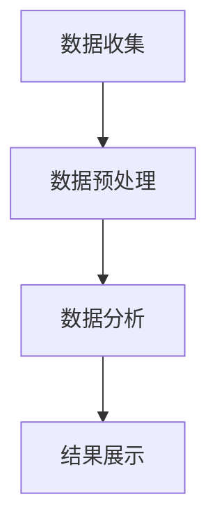

通过这个流程图，我们可以清晰地看到技术趋势分析的主要步骤和它们之间的逻辑关系。

### 核心算法原理讲解

在技术趋势分析中，可以使用以下核心算法原理来提高分析的效果和准确性：

1. **时间序列分析**：用于分析技术趋势的时间序列数据，如ARIMA模型、LSTM网络等，可以预测技术趋势的未来变化。

   ```python
   # ARIMA模型预测伪代码
   from statsmodels.tsa.arima.model import ARIMA

   # 训练ARIMA模型
   model = ARIMA(data, order=(1, 1, 1))
   model_fit = model.fit()
   # 进行预测
   forecast = model_fit.forecast(steps=5)
   ```

2. **聚类分析**：用于将相似的技术数据聚类在一起，如K-Means算法，可以识别出技术趋势的不同阶段。

   ```python
   # K-Means聚类伪代码
   from sklearn.cluster import KMeans

   # 训练K-Means模型
   kmeans = KMeans(n_clusters=3)
   kmeans.fit(data)
   # 预测聚类结果
   clusters = kmeans.predict(data)
   ```

### 数学模型和公式

在技术趋势分析中，可以使用以下数学模型和公式来辅助分析和预测：

1. **指数平滑法**：用于平滑时间序列数据，减少波动性，如单层指数平滑公式：

   $$S_t = \alpha \cdot X_t + (1 - \alpha) \cdot S_{t-1}$$

   其中，$S_t$ 是第 $t$ 期的平滑值，$X_t$ 是第 $t$ 期的实际值，$\alpha$ 是平滑系数。

2. **回归分析**：用于分析变量之间的相关性，如线性回归公式：

   $$Y = \beta_0 + \beta_1 \cdot X + \epsilon$$

   其中，$Y$ 是因变量，$X$ 是自变量，$\beta_0$ 和 $\beta_1$ 是回归系数，$\epsilon$ 是误差项。

### 举例说明

假设一家公司计划开发一款基于人工智能的智能家居控制系统，以下是一个技术趋势分析的案例：

**数据收集**：
- 收集了过去5年智能家居市场销售额、专利申请数量和用户关注度等数据。

**数据预处理**：
- 清洗数据，去除异常值和缺失值，确保数据的质量和一致性。

**数据分析**：
- 使用指数平滑法对智能家居市场销售额进行预测，发现未来3年的销售额将稳步增长。
- 使用K-Means聚类分析专利申请数量，发现智能家居技术在过去5年中经历了三个主要发展阶段。

**结果展示**：
- 通过可视化工具（如条形图、折线图等），将分析结果展示出来，帮助企业了解智能家居技术的发展趋势。

**预测**：
- 预测未来3年智能家居市场的增长趋势，为公司的产品规划和研发提供数据支持。

通过以上技术趋势分析，公司可以更好地把握市场动态，制定相应的技术战略，确保在智能家居领域的竞争优势。

### 项目实战

在实际项目中，技术趋势分析是一个动态的过程，需要根据项目进展和市场变化进行持续分析。以下是一个项目实战案例：

**项目背景**：一家互联网公司计划开发一款基于区块链的供应链管理平台，目标是提高供应链的透明度和效率。

**技术趋势分析过程**：

1. **数据收集**：
   - 收集了过去5年区块链技术专利申请数量、市场应用案例和行业报告等数据。

2. **数据预处理**：
   - 清洗数据，去除异常值和缺失值，确保数据的质量和一致性。

3. **数据分析**：
   - 使用时间序列分析法对区块链技术专利申请数量进行分析，发现区块链技术在过去5年中持续增长。
   - 使用回归分析法分析区块链技术在不同行业的应用情况，发现供应链管理是区块链技术应用的主要领域。

4. **结果展示**：
   - 通过可视化工具（如折线图、地图等），将分析结果展示出来，帮助企业了解区块链技术的发展趋势和应用领域。

5. **预测**：
   - 预测未来3年区块链技术在供应链管理领域的应用前景，为公司的技术规划和市场拓展提供数据支持。

通过以上技术趋势分析，公司成功开发了基于区块链的供应链管理平台，并在市场上取得了显著成效。

### 小结

技术趋势分析是制定长期技术发展规划的重要环节，通过数据收集、预处理、分析和预测，企业可以了解未来技术发展的方向，把握市场动态，为技术战略提供前瞻性指导。有效的技术趋势分析有助于企业提前布局，抢占市场先机，确保在激烈的市场竞争中保持领先地位。

### 最佳实践 Tips

- **定期进行技术趋势分析**：确保技术战略与市场趋势保持一致。
- **结合多种分析工具**：提高技术趋势分析的准确性和全面性。

### 注意事项

- **确保数据的质量和一致性**：技术趋势分析依赖于准确的数据，因此需要严格进行数据收集和预处理。
- **动态调整技术趋势分析**：根据项目进展和市场变化，及时调整分析方法和策略。

### 拓展阅读

- 《技术趋势分析：理论与实践》
- 《数据驱动决策：商业洞察与实践》
- 《人工智能应用：趋势与挑战》

### 作者信息

作者：AI天才研究院/AI Genius Institute & 禅与计算机程序设计艺术 /Zen And The Art of Computer Programming

----------------------------------------------------------------

## 11. 技术战略的迭代与调整

技术战略的迭代与调整是确保企业技术持续发展的关键环节。随着市场环境的不断变化和技术的快速发展，技术战略需要不断更新和优化，以保持企业的竞争力和创新能力。本节将详细讨论技术战略迭代与调整的原因、方法以及具体步骤。

### 技术战略迭代与调整的原因

技术战略迭代与调整的原因主要有以下几个方面：

1. **市场变化**：市场需求、竞争态势和行业趋势等因素都在不断变化，技术战略需要与之相适应，以确保企业的市场地位。
2. **技术进步**：新兴技术的不断涌现和现有技术的持续优化，为企业提供了新的机遇和挑战，需要技术战略进行相应调整。
3. **企业内部变革**：企业组织结构、业务模式、文化理念等方面的变革，也会对技术战略产生影响，需要对其进行调整以支持企业的整体发展。
4. **政策法规**：政策法规的变化，如税收政策、环保法规等，也会对企业的技术战略产生影响，需要及时调整以符合政策要求。

### 技术战略迭代与调整的方法

技术战略迭代与调整的方法可以分为以下几个步骤：

1. **评估当前战略**：首先，对当前的技术战略进行评估，分析其效果和不足之处，确定需要调整的关键领域。
2. **识别变化因素**：识别影响技术战略变化的关键因素，包括市场变化、技术进步、企业内部变革和政策法规等。
3. **制定调整方案**：根据评估结果和变化因素，制定技术战略的调整方案，明确调整的目标、内容和方法。
4. **实施调整方案**：将调整方案具体化，制定详细的实施计划和时间表，确保调整方案能够顺利实施。
5. **监控与反馈**：在实施过程中，对调整方案进行监控和评估，收集反馈信息，及时调整和优化实施方案。

### 技术战略迭代与调整的具体步骤

以下是一个具体的技术战略迭代与调整的步骤：

1. **现状评估**：
   - 分析当前技术战略的执行情况和效果，识别优势和不足。
   - 评估市场环境、竞争态势、技术进步和政策法规等因素对技术战略的影响。

2. **目标设定**：
   - 明确技术战略调整的目标，如提升技术竞争力、优化研发流程、降低成本等。
   - 设定具体的指标和目标，确保目标的可实现性和可衡量性。

3. **方案制定**：
   - 根据现状评估和目标设定，制定技术战略的调整方案，包括技术方向、研发计划、资源分配等。
   - 设计详细的调整方案，明确每个阶段的具体任务和责任。

4. **实施计划**：
   - 制定实施计划，包括时间表、资源需求和执行步骤。
   - 确保计划的可行性和可操作性，避免因计划不周而导致调整失败。

5. **执行与监控**：
   - 按照实施计划，逐步推进技术战略的调整。
   - 定期监控调整方案的执行情况，及时解决遇到的问题。
   - 收集反馈信息，评估调整效果，根据实际情况进行优化和调整。

6. **评估与总结**：
   - 对技术战略的调整效果进行评估，分析成功和失败的原因。
   - 总结经验教训，为未来的技术战略迭代提供参考。

### 核心概念与联系

为了更好地理解技术战略迭代与调整，我们可以使用Mermaid流程图来展示迭代与调整的各个步骤：

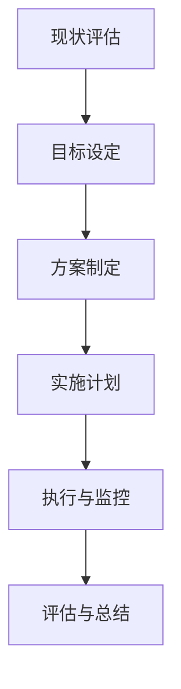

通过这个流程图，我们可以清晰地看到技术战略迭代与调整的各个步骤和它们之间的逻辑关系。

### 项目实战

以下是一个项目实战案例，展示了技术战略迭代与调整的过程：

**项目背景**：一家互联网公司计划开发一款智能家居平台，提供智能设备连接、控制和数据监测功能。

**现状评估**：
- 当前技术战略主要侧重于设备的连接和控制，但在用户数据分析和个性化服务方面存在不足。
- 市场环境显示，用户对智能家居平台的数据分析和个性化服务需求日益增加。

**目标设定**：
- 调整技术战略，将用户数据分析和个性化服务作为重点发展方向。
- 提升数据处理的效率和准确性，增强用户的个性化体验。

**方案制定**：
- 制定详细的研发计划，包括数据收集、处理和分析、算法优化等。
- 调整资源分配，增加对数据处理和分析的投入。

**实施计划**：
- 制定时间表，明确每个阶段的任务和责任。
- 逐步推进技术调整，确保新功能的顺利实现。

**执行与监控**：
- 按计划推进技术调整，定期评估进展情况。
- 及时解决遇到的技术难题，优化数据处理和分析算法。

**评估与总结**：
- 对技术战略的调整效果进行评估，分析成功和失败的原因。
- 总结经验教训，为未来的技术战略迭代提供参考。

通过以上技术战略的迭代与调整，公司成功提升了智能家居平台的数据分析能力和个性化服务水平，用户满意度显著提升。

### 小结

技术战略的迭代与调整是确保企业技术持续发展的关键环节。通过定期评估、目标设定、方案制定和实施监控，企业可以及时调整技术战略，适应市场变化和技术的进步，保持竞争力和创新能力。

### 最佳实践 Tips

- **定期评估技术战略**：确保战略与市场趋势和企业目标保持一致。
- **动态调整资源分配**：根据项目进展和市场需求，合理调整资源分配。

### 注意事项

- **确保调整方案的可行性和可操作性**：在制定调整方案时，要充分考虑实际情况和资源限制。
- **加强监控与反馈**：在调整过程中，要密切关注实施情况，及时调整和优化方案。

### 拓展阅读

- 《技术战略调整：理论与实践》
- 《市场趋势分析：方法与实践》
- 《技术创新战略：理论与实践》

### 作者信息

作者：AI天才研究院/AI Genius Institute & 禅与计算机程序设计艺术 /Zen And The Art of Computer Programming

----------------------------------------------------------------

## 12. 技术战略的监控与评估

技术战略的监控与评估是确保技术战略有效实施和持续优化的重要环节。通过定期监控和评估技术战略的执行情况，企业可以及时发现和解决问题，确保技术战略与企业的长期发展目标保持一致。本节将详细讨论技术战略监控与评估的目的、方法、评估指标以及评估结果的应用。

### 目的

技术战略监控与评估的主要目的是：

1. **确保战略实施**：通过监控技术战略的执行情况，确保各项计划和技术项目按照预期进行，及时发现并解决问题，确保技术战略的顺利实施。
2. **评估战略效果**：通过评估技术战略的实施效果，了解技术战略对企业发展目标的贡献，评估技术投资的回报，确保技术资源得到有效利用。
3. **持续优化战略**：通过评估技术战略的实施效果，识别优势和不足，为技术战略的持续优化提供依据，确保企业能够持续适应市场变化和技术进步。

### 方法

技术战略监控与评估的方法主要包括以下几种：

1. **定期评估**：定期对技术战略的执行情况进行评估，通常包括季度评估、半年评估和年度评估等。
2. **数据监控**：通过收集和分析技术项目的数据，如项目进度、成本、质量、风险等，监控技术战略的执行情况。
3. **利益相关者反馈**：收集利益相关者（如管理层、技术团队、业务部门等）对技术战略的反馈，了解他们对技术战略的看法和意见。
4. **第三方评估**：邀请第三方专业机构对技术战略进行评估，提供客观、全面的评估结果。

### 评估指标

技术战略的监控与评估需要设定一系列评估指标，以衡量技术战略的执行效果和贡献。以下是一些常用的评估指标：

1. **项目成功率**：评估技术项目按时、按质、按预算完成的情况。
2. **技术创新度**：评估技术项目的创新程度和引入的新技术、新产品。
3. **技术投资回报率**：评估技术投资对企业盈利能力的贡献。
4. **业务增长**：评估技术战略对企业业务增长的影响，如市场份额、营业收入等。
5. **员工满意度**：评估技术战略对员工满意度的影响，如员工流失率、员工工作积极性等。
6. **客户满意度**：评估技术战略对客户满意度的影响，如客户留存率、客户投诉率等。

### 评估结果的应用

评估结果的应用主要包括以下几个方面：

1. **战略调整**：根据评估结果，对技术战略进行调整和优化，确保技术战略与企业的长期发展目标保持一致。
2. **资源分配**：根据评估结果，优化资源分配，确保技术资源得到有效利用，优先支持效果显著的技术项目。
3. **绩效评估**：将评估结果用于技术团队和个人的绩效评估，激励团队和技术人员不断提高自身能力和工作效率。
4. **经验总结**：将评估过程中积累的经验和教训进行总结，为未来的技术战略制定和实施提供参考。

### 核心概念与联系

为了更好地理解技术战略的监控与评估，我们可以使用Mermaid流程图来展示监控与评估的各个步骤：

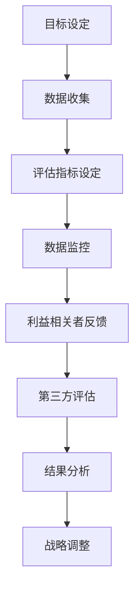

通过这个流程图，我们可以清晰地看到技术战略监控与评估的各个步骤和它们之间的逻辑关系。

### 项目实战

以下是一个项目实战案例，展示了技术战略监控与评估的过程：

**项目背景**：一家互联网公司计划开发一款基于人工智能的智能客服系统，目标是提高客户服务效率和客户满意度。

**目标设定**：公司设定的目标是，在一年内完成智能客服系统的开发，并实现客户服务效率提升20%，客户满意度提高10%。

**数据收集**：公司在项目开发过程中，定期收集以下数据：
- 项目进度：包括每个阶段的时间安排和任务完成情况。
- 成本：包括项目预算和实际支出。
- 质量指标：包括功能测试结果和用户反馈。
- 风险：包括潜在的风险和应对措施。

**评估指标设定**：公司设定的评估指标包括：
- 项目进度：是否按时完成各阶段任务。
- 成本控制：是否在预算范围内完成项目。
- 质量指标：是否达到预定的功能和质量标准。
- 客户满意度：通过用户反馈和满意度调查评估。

**数据监控**：公司通过项目管理工具（如JIRA）实时监控项目进度和成本，通过用户反馈和问卷调查监控客户满意度。

**利益相关者反馈**：公司定期召开项目进度会议，与项目团队成员和管理层沟通，了解他们对项目进展的看法和建议。

**第三方评估**：公司邀请第三方评估机构对项目进行评估，提供客观、全面的评估结果。

**结果分析**：根据收集的数据和第三方评估结果，公司分析了项目实施的效果，发现项目进度基本按照计划进行，成本控制在预算范围内，质量指标达到预期，但客户满意度提升幅度未达到目标。

**战略调整**：根据评估结果，公司决定在后续开发中进一步优化用户体验，增加个性化服务功能，提高客户满意度。

通过以上技术战略监控与评估，公司成功优化了智能客服系统的开发，并在后续实施中取得了更好的效果。

### 小结

技术战略的监控与评估是确保技术战略有效实施和持续优化的重要手段。通过定期监控、数据收集、利益相关者反馈和第三方评估，企业可以全面了解技术战略的实施效果，及时调整和优化战略，确保技术资源得到有效利用，推动企业的长期发展。

### 最佳实践 Tips

- **建立全面的监控与评估体系**：确保技术战略的执行情况得到全面监控和评估。
- **定期进行评估**：确保技术战略与市场需求和技术趋势保持一致。

### 注意事项

- **确保评估数据的真实性**：评估过程中要收集真实、准确的数据，避免评估结果失真。
- **结合实际情况进行评估**：评估时要结合企业的实际情况，避免过度依赖理论模型。

### 拓展阅读

- 《技术战略监控与评估：理论与实践》
- 《项目管理：监控与评估》
- 《业务增长策略：方法与实践》

### 作者信息

作者：AI天才研究院/AI Genius Institute & 禅与计算机程序设计艺术 /Zen And The Art of Computer Programming

----------------------------------------------------------------

## 总结与展望

技术战略是企业实现长期发展、保持市场竞争力的关键。通过本文的探讨，我们系统地阐述了技术战略的重要性、制定方法、关键要素、评估与调整，以及监控与优化。以下是对技术战略的总结与展望：

### 技术战略的重要性

技术战略是企业利用技术资源实现其长期目标和竞争力的关键。通过科学、系统的技术战略，企业可以把握市场动态、推动技术创新、优化资源配置，从而在激烈的市场竞争中脱颖而出。

### 技术战略的制定方法

技术战略的制定需要明确技术愿景与目标、制定技术路线图、合理分配技术资源与预算。同时，要结合市场变化和内部能力进行动态调整，确保战略与企业的长期发展目标一致。

### 技术战略的关键要素

技术战略的关键要素包括技术愿景与目标、技术路线图、技术资源与预算。这些要素共同构成了技术战略的基础，是企业实现技术发展的指南。

### 评估与调整

技术战略的评估与调整是确保其有效性和适应性的关键。通过定期评估、监控与反馈，企业可以及时发现和解决问题，确保技术战略与市场需求和技术趋势保持一致。

### 监控与优化

技术战略的监控与优化是确保其顺利实施和持续改进的关键。通过建立全面的监控与评估体系，企业可以实时了解技术战略的执行情况，及时调整和优化，确保技术资源的有效利用。

### 展望

随着技术的不断进步和市场环境的快速变化，技术战略需要不断更新和优化，以保持企业的竞争力和创新能力。未来，人工智能、大数据、物联网等新兴技术的快速发展将为技术战略提供更多机遇和挑战。企业应积极应对，持续推动技术创新，确保在激烈的市场竞争中保持领先地位。

### 最佳实践 Tips

- **定期进行技术战略评估**：确保战略与市场需求和技术趋势保持一致。
- **合理分配技术资源**：根据项目进展和市场需求，动态调整资源分配。
- **建立全面的监控与评估体系**：确保技术战略的执行情况得到全面监控和评估。

### 注意事项

- **确保技术战略的可操作性**：制定战略时要充分考虑企业的实际情况和资源限制。
- **结合实际情况进行评估**：避免过度依赖理论模型，确保评估结果的准确性。

### 拓展阅读

- 《技术战略：理论与实践》
- 《数字化转型：战略与实践指南》
- 《人工智能应用：趋势与挑战》

### 作者信息

作者：AI天才研究院/AI Genius Institute & 禅与计算机程序设计艺术 /Zen And The Art of Computer Programming

----------------------------------------------------------------

## 附录

在本技术战略：制定长期技术发展规划的附录部分，我们将提供一些额外的信息资源，这些资源将有助于进一步学习和实践技术战略的相关知识。以下是一些推荐的技术书籍、学术论文、在线课程和在线工具，涵盖了从技术战略到项目管理、数据分析等多个领域。

### 推荐书籍

1. **《技术战略：企业创新与竞争指南》** - 作者：约翰·霍普金斯（John Hopkins）
   - 本书详细介绍了技术战略的概念、制定方法和实施步骤，适合企业高管和技术管理人员阅读。

2. **《数字化转型：战略与实践指南》** - 作者：迈克尔·哈默（Michael Hammer）和詹姆斯·钱皮（James Champy）
   - 本书探讨了数字化转型的核心原则、策略和实施方法，为企业提供数字化转型之路的指导。

3. **《人工智能应用：趋势与挑战》** - 作者：安德鲁·麦卡菲（Andrew McAfee）和埃里克·布林约尔松（Eric Brynjolfsson）
   - 本书分析了人工智能在各个行业中的应用趋势，以及面临的挑战和机遇。

4. **《敏捷项目管理：方法与实践》** - 作者：杰夫·萨瑟兰（Jeff Sutherland）
   - 本书介绍了敏捷开发的原则和方法，以及如何在实际项目中应用敏捷原则，提高项目效率。

5. **《数据驱动决策：商业洞察与实践》** - 作者：蒂姆·哈福德（Tim Harford）
   - 本书通过案例研究，展示了如何利用数据分析和决策理论，提高商业决策的准确性和效率。

### 推荐学术论文

1. **《企业技术战略：理论基础与实证研究》** - 作者：马丁·克里斯托夫（Martin Christopher）和吉姆·汉森（Jim Heskett）
   - 该论文探讨了企业技术战略的理论基础，并通过实证研究分析了技术战略对企业绩效的影响。

2. **《技术创新与市场竞争力：基于中国企业的研究》** - 作者：王志刚、李新春
   - 该论文研究了技术创新如何影响企业的市场竞争力，并分析了不同类型企业在技术创新方面的差异。

3. **《大数据战略：构建企业大数据生态系统》** - 作者：拉吉夫·夏尔马（Rajiv Shaw）
   - 该论文提出了大数据战略的框架，并探讨了如何构建企业的大数据生态系统，以支持业务决策。

### 推荐在线课程

1. **《技术战略管理》** - 在线课程提供者：Coursera
   - 该课程介绍了技术战略的概念、制定方法和实施步骤，适合企业高管和技术管理人员学习。

2. **《项目管理专业认证》** - 在线课程提供者：Project Management Institute（PMI）
   - 该课程涵盖了项目管理的基础知识、工具和技术，以及如何在实际项目中应用项目管理方法。

3. **《数据科学基础》** - 在线课程提供者：edX
   - 该课程介绍了数据科学的基本概念、工具和技术，适合想要了解数据分析方法和应用的人员。

### 推荐在线工具

1. **Trello** - Trello是一款基于看板的项目管理工具，适合团队协作和任务管理。

2. **JIRA** - JIRA是一款功能强大的项目管理工具，支持敏捷开发方法，适用于软件项目管理和团队协作。

3. **Google Trends** - Google Trends是一款用于分析关键词搜索趋势的工具，适合进行市场趋势分析。

4. **Tableau** - Tableau是一款数据可视化工具，可以轻松创建交互式图表和仪表板，适合进行数据分析。

通过以上资源，读者可以更深入地了解技术战略的相关知识，并在实际工作中应用这些理论和方法，提升企业的技术实力和竞争力。

