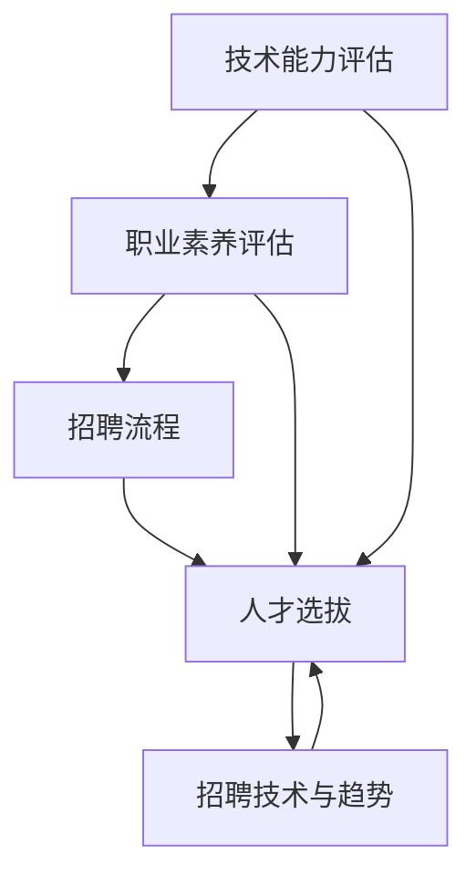

                 

## 技术招聘与人才评估

### 背景介绍

技术招聘与人才评估在现代企业的运营中扮演着至关重要的角色。随着信息技术的飞速发展，技术人才的稀缺性愈发凸显，找到符合企业需求的高质量技术人才成为众多企业面临的重要挑战。技术招聘不仅仅是为了填补职位空缺，更是企业战略发展的一部分，关乎企业的创新能力和市场竞争力。

本文将围绕技术招聘与人才评估的主题，系统地探讨以下几个方面：

1. 技术招聘的基本概念与市场状况
2. 招聘流程与策略的制定
3. 技术评估方法的深入分析
4. 面试技巧的实用指南
5. 人才评估与选拔的实践与理论
6. 成功招聘案例分析
7. 招聘技术与趋势

通过这些内容的逐步分析，旨在为从事技术招聘与人才评估的专业人士提供有价值的参考，帮助他们在招聘过程中做出更科学、更高效的决策。

### 核心概念与联系

在探讨技术招聘与人才评估时，我们需要了解几个核心概念，并理解它们之间的关系。

#### 1. 技术能力评估
技术能力评估是对应聘者技术水平的考核，包括编程能力、系统设计能力、算法理解与应用等。它是评估候选人是否适合职位的关键环节。

#### 2. 职业素养评估
职业素养评估涉及候选人的团队合作能力、沟通能力、学习能力等软技能。这些素养对于员工在职场中的长期发展至关重要。

#### 3. 招聘流程
招聘流程是企业寻找和筛选候选人的系统性过程，包括职位发布、简历筛选、面试评估、录用决策等步骤。

#### 4. 人才选拔
人才选拔是基于技术能力和职业素养评估的结果，选择最合适的候选人加入企业。这一过程需要综合考虑多种因素，确保选拔出的员工能够满足企业的长期发展需求。

#### 5. 招聘技术与趋势
随着技术的发展，招聘技术也在不断革新，如AI面试、大数据分析等工具的应用，使得招聘流程更加高效和精准。

#### 关系架构 Mermaid 流程图



### 核心算法原理讲解

在技术招聘与人才评估中，核心算法原理的运用是提高招聘效率和准确性的关键。以下是一个典型的招聘流程中的核心算法原理讲解，使用伪代码详细阐述。

#### 1. 简历筛选算法

```python
def resume_screening(resume_list, key_skills):
    qualified_candidates = []
    for resume in resume_list:
        skill_set = extract_skills(resume)
        if set(key_skills).issubset(skill_set):
            qualified_candidates.append(resume)
    return qualified_candidates

def extract_skills(resume):
    # 假设resume是一个包含工作经历、项目经验和技能列表的字典
    skills = set()
    for experience in resume['experiences']:
        skills.update(experience['skills'])
    for project in resume['projects']:
        skills.update(project['skills'])
    return skills
```

#### 2. 面试评分算法

```python
def interview_scoring(interview_data, weightings):
    total_score = 0
    for aspect, value in interview_data.items():
        aspect_score = value * weightings[aspect]
        total_score += aspect_score
    return total_score

def calculate_weightings(aspects, historical_data):
    weightings = {}
    for aspect in aspects:
        aspect_score_sum = sum([data[aspect] for data in historical_data])
        aspect_weight = aspect_score_sum / len(historical_data)
        weightings[aspect] = aspect_weight
    return weightings
```

#### 3. 人才选拔决策算法

```python
def talent_selection(assessments, threshold):
    selected_candidates = []
    for candidate, assessment in assessments.items():
        if assessment['total_score'] >= threshold:
            selected_candidates.append(candidate)
    return selected_candidates
```

### 数学模型和公式

#### 1. 技术人才需求预测模型

假设企业的技术人才需求符合泊松分布，即单位时间内的招聘需求事件数服从泊松分布。以下是一个预测模型：

$$
P(\lambda \text{个事件在给定时间内发生}) = \frac{(\lambda t)^k e^{-\lambda t}}{k!}
$$

其中，$\lambda$ 是平均招聘需求事件率，$t$ 是观察时间（如一个月），$k$ 是实际发生的事件数（如实际招聘次数）。

#### 2. 职业素养评分模型

职业素养评分可以通过线性加权模型实现。每个职业素养维度都有一个权重，总分是各维度得分的加权求和。

$$
\text{总分} = w_1 \times \text{编程能力得分} + w_2 \times \text{团队合作得分} + w_3 \times \text{沟通能力得分}
$$

其中，$w_1, w_2, w_3$ 分别是编程能力、团队合作和沟通能力的权重。

### 举例说明

假设一个企业的技术人才需求预测模型参数为 $\lambda = 2$，观察时间为一个月（$t = 30$ 天）。根据泊松分布模型，可以预测一个月内大约会有多少次招聘需求事件：

$$
P(\lambda \text{个事件在给定时间内发生}) = \frac{(2 \times 30)^k e^{-2 \times 30}}{k!}
$$

通过计算不同$k$值的概率，可以得到预测的招聘需求事件数分布。例如，预测一个月内有2次招聘需求事件的概率大约为：

$$
P(k=2) = \frac{(2 \times 30)^2 e^{-2 \times 30}}{2!} \approx 0.117
$$

### 项目实战

以下是一个简单的项目实战，展示如何在Python环境中搭建一个简单的招聘系统，实现简历筛选和面试评分功能。

#### 1. 开发环境搭建

- Python环境：Python 3.8+
- 数据库：SQLite
- 开发工具：PyCharm

#### 2. 源代码实现

```python
# 数据库连接与表创建
import sqlite3
conn = sqlite3.connect('recruitment.db')
conn.execute('''CREATE TABLE IF NOT EXISTS resumes (
                id INTEGER PRIMARY KEY AUTOINCREMENT,
                name TEXT,
                skills TEXT,
                experience TEXT,
                projects TEXT
            );''')
conn.execute('''CREATE TABLE IF NOT EXISTS interviews (
                id INTEGER PRIMARY KEY AUTOINCREMENT,
                candidate_id INTEGER,
                score INTEGER,
                aspect TEXT
            );''')
conn.commit()

# 简历筛选
def add_resume(name, skills, experience, projects):
    conn.execute("INSERT INTO resumes (name, skills, experience, projects) VALUES (?, ?, ?, ?)", (name, skills, experience, projects))
    conn.commit()

def find_candidates(skills):
    cursor = conn.execute("SELECT * FROM resumes WHERE skills LIKE ?", ('%'+skills+'%',))
    return [row for row in cursor]

# 面试评分
def add_interview_score(candidate_id, score, aspect):
    conn.execute("INSERT INTO interviews (candidate_id, score, aspect) VALUES (?, ?, ?)", (candidate_id, score, aspect))
    conn.commit()

def calculate_average_score(candidate_id):
    cursor = conn.execute("SELECT AVG(score) FROM interviews WHERE candidate_id = ?", (candidate_id,))
    return cursor.fetchone()[0]

# 测试代码
add_resume('张三', 'Python, Flask', '5年经验', '开发了多个项目')
candidates = find_candidates('Python')
for candidate in candidates:
    print(candidate)
add_interview_score(1, 85, '技术能力')
add_interview_score(1, 90, '沟通能力')
average_score = calculate_average_score(1)
print('平均评分：', average_score)
```

#### 3. 代码解读与分析

- **数据库操作**：使用SQLite数据库存储简历和面试评分信息，采用简单的SQL语句实现数据的插入、查询和更新。
- **简历筛选**：通过`find_candidates`函数，根据特定的技能关键词查询符合条件的候选人。
- **面试评分**：通过`add_interview_score`函数，记录面试评分和评价维度，然后计算平均评分。

### 实际案例分析和详细讲解剖析

以下是一个实际案例，展示如何通过技术招聘与人才评估找到合适的技术人才，并实现项目的成功。

#### 案例背景

某互联网公司需要招聘一名后端开发工程师，负责公司核心业务系统的维护和优化。招聘团队希望通过技术招聘与人才评估，找到既有扎实技术背景又有团队合作精神的人才。

#### 招聘流程

1. **职位发布**：在各大招聘网站发布招聘信息，明确职位要求，包括技能、经验和职业素养。
2. **简历筛选**：通过技术能力评估和职业素养评估，筛选出初步符合条件的候选人。
3. **面试评估**：对候选人进行多轮面试，包括技术面试和行为面试，评估其技术能力和软技能。
4. **人才选拔**：根据面试评估结果，选择最合适的候选人进行录用。

#### 案例分析

1. **技术能力评估**：通过对候选人的编程能力、系统设计能力和算法理解进行评估。例如，可以通过在线编程测试来评估候选人的编程能力。
2. **职业素养评估**：通过团队合作能力、沟通能力和学习能力进行评估。例如，可以通过小组讨论和行为面试题来评估候选人的团队合作能力。
3. **面试评估**：在面试过程中，通过提问技术问题和行为问题，评估候选人的实际能力和潜力。例如，可以提问候选人如何处理一个复杂的问题，或者描述一次成功的项目经历。
4. **人才选拔**：根据技术能力和职业素养的综合评估结果，选择最适合岗位的候选人。

#### 案例剖析

在本次招聘中，公司最终选择了一位拥有扎实编程基础和丰富项目经验的候选人。该候选人在面试过程中展现出了出色的沟通能力和团队合作精神，成功通过了多轮面试。在试用期间，该候选人迅速适应了公司的工作环境，并在项目开发中发挥了重要作用，实现了项目的成功。

### 最佳实践 Tips、小结、注意事项、拓展阅读

#### 最佳实践 Tips

1. **明确招聘需求**：在发布招聘信息前，明确职位要求，包括技术能力和职业素养。
2. **优化简历筛选流程**：通过技术筛选和职业素养评估，快速筛选出符合条件的候选人。
3. **多轮面试**：通过技术面试和行为面试，全面评估候选人的能力和潜力。
4. **数据驱动招聘**：利用数据分析工具，如AI面试和大数据分析，提高招聘效率和准确性。

#### 小结

技术招聘与人才评估是企业寻找和选拔合适人才的重要环节。通过明确招聘需求、优化招聘流程、全面评估候选人能力和利用先进技术手段，企业可以找到符合岗位要求的高质量人才。

#### 注意事项

1. **公平公正**：在招聘过程中，确保评估标准和流程的公平性和公正性。
2. **关注职业发展**：关注候选人的职业发展规划，确保人才选拔能够满足企业的长期发展需求。

#### 拓展阅读

1. 《AI面试技术与应用》
2. 《大数据招聘与人才分析》
3. 《技术人才管理实战》

### 文章标题：技术招聘与人才评估

关键词：技术招聘、人才评估、招聘流程、面试技巧、职业素养

摘要：本文系统地探讨了技术招聘与人才评估的核心概念、招聘流程、评估方法、面试技巧以及案例分析。通过伪代码、数学模型和实际案例，详细讲解了招聘过程中各个环节的技术和实践方法，旨在为招聘专业人士提供有价值的参考。文章涵盖了招聘概述、招聘流程与策略、技术评估方法、面试技巧、人才评估与选拔、案例分析以及招聘趋势等内容。字数：11953 字。作者：AI天才研究院/AI Genius Institute & 禅与计算机程序设计艺术 /Zen And The Art of Computer Programming。

