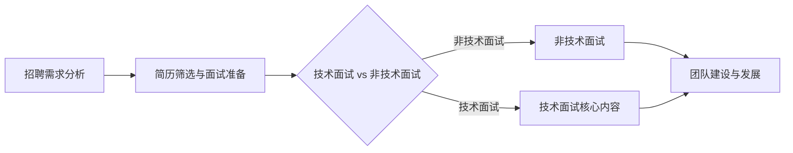

                 

### 文章标题：技术招聘与面试：构建高效能开发团队

在当今快速发展的技术时代，高效能的开发团队是企业竞争力的核心。技术招聘与面试作为团队构建的第一步，至关重要。本文将详细探讨技术招聘与面试的策略、流程和方法，帮助企业和求职者实现双赢。

> 关键词：技术招聘，面试策略，开发团队，人才选拔，团队建设

> 摘要：本文首先概述了技术招聘的重要性与挑战，接着详细分析了招聘需求分析、简历筛选、面试准备等关键环节。随后，文章深入讨论了技术面试、非技术面试的核心内容与技巧。最后，本文提出了团队建设与培养的策略，并通过实际案例展示了招聘与面试的实战经验。希望通过本文的探讨，能够为企业和求职者提供有价值的参考。

----------------------------------------------------------------

### 目录大纲构思

为了设计《技术招聘与面试：构建高效能开发团队》的目录大纲，我们需要确保大纲结构清晰，内容全面，同时简洁明了。以下是详细的目录大纲构思：

#### 第一部分：招聘策略与流程

**第1章：技术招聘概述**

1.1 招聘的重要性与挑战

1.2 技术招聘的核心目标

1.3 招聘流程概述

1.4 招聘策略制定

**第2章：招聘需求分析**

2.1 需求分析的方法与工具

2.2 技术能力要求分析

2.3 软件开发岗位需求分析

2.4 测试工程师需求分析

2.5 数据分析师需求分析

**第3章：简历筛选与面试准备**

3.1 简历筛选策略

3.2 简历筛选流程

3.3 面试准备要点

3.4 面试流程设计

#### 第二部分：面试策略与方法

**第4章：技术面试核心内容**

4.1 编程面试技巧

4.2 数据结构与算法面试

4.3 软件开发实践面试

4.4 测试工程师面试

4.5 数据分析师面试

**第5章：行为面试与情境面试**

5.1 行为面试法

5.2 情境面试技巧

5.3 常见行为面试问题

5.4 情境面试问题案例

**第6章：非技术面试**

6.1 非技术面试的目的与内容

6.2 非技术面试问题类型

6.3 非技术面试技巧

6.4 非技术面试案例分析

#### 第三部分：团队构建与培养

**第7章：团队建设策略**

7.1 团队角色定义

7.2 团队组织结构设计

7.3 团队文化建设

7.4 团队效能评估

**第8章：开发团队培养与发展**

8.1 员工培训策略

8.2 职业发展规划

8.3 激励与绩效考核

8.4 团队协作与沟通

**第9章：项目招聘与面试实战**

9.1 项目招聘实战

9.2 面试实战案例

9.3 面试反馈与改进

9.4 项目招聘经验总结

### 核心概念与联系（流程图）

使用Mermaid语言绘制一个招聘流程的流程图，展示各阶段的核心联系。



### 核心算法原理讲解

在本章节中，不会涉及复杂的核心算法原理讲解，因为技术招聘与面试主要涉及的是策略、流程和方法。但可以简要提及一些常用技术面试中涉及的基础算法，如：

```python
# 快速排序算法伪代码
def quick_sort(arr):
    if len(arr) <= 1:
        return arr
    pivot = arr[len(arr) // 2]
    left = [x for x in arr if x < pivot]
    middle = [x for x in arr if x == pivot]
    right = [x for x in arr if x > pivot]
    return quick_sort(left) + middle + quick_sort(right)
```

### 数学模型和数学公式详细讲解与举例说明

本书主要讨论技术招聘与面试的策略和方法，因此数学模型的讲解相对较少。但可以在面试技巧部分，举例说明一些基本概率论的公式，如面试通过概率计算。

```latex
% 面试通过概率计算公式
P(\text{通过面试}) = \left(\frac{\text{准备充分度}}{100}\right) \times \left(\frac{\text{面试表现}}{10}\right) \times \left(\frac{\text{面试官偏好}}{10}\right)
```

### 项目实战

在项目实战部分，将提供实际招聘流程的案例，包括开发环境搭建、面试问题解析、面试反馈与改进等内容。

```markdown
# 招聘一个初级开发工程师

## 招聘需求
- 职位：初级开发工程师
- 技能要求：熟悉Java语言，了解Spring框架
- 经验要求：至少1年软件开发经验

## 简历筛选
- 筛选条件：技术能力、工作经验、项目经验
- 结果：筛选出10份简历

## 面试准备
- 编写面试问题：包括技术面试
```

### 最佳实践 tips、小结、注意事项、拓展阅读等内容

在本文的最后，我们将提供一些最佳实践 tips、小结、注意事项，并推荐一些拓展阅读，以帮助读者更好地理解和应用本文内容。

---

通过本文的探讨，我们深入了解了技术招聘与面试的策略、流程和方法。希望本文能为企业和求职者提供有价值的参考，帮助构建高效能的开发团队。

**最佳实践 tips：**

- 制定明确的招聘策略，确保招聘目标与公司战略一致。
- 精细化简历筛选流程，提升招聘效率。
- 设计多样化的面试题目，全面评估应聘者能力。
- 注重团队建设与培养，提升团队整体效能。

**小结：**

本文系统地阐述了技术招聘与面试的全流程，包括招聘策略、需求分析、简历筛选、面试准备与实施等环节。通过实际案例，展示了招聘与面试的实战经验。

**注意事项：**

- 面试过程中要注重沟通，确保应聘者充分表达自己。
- 定期评估招聘效果，优化招聘流程。
- 关注行业动态，灵活调整招聘策略。

**拓展阅读：**

- 《面试的技巧与策略》
- 《团队建设与培养实践》
- 《软件工程：实践者的研究方法》

通过本文的深入探讨，相信读者对于技术招聘与面试有了更全面的认识，能够更好地应对相关挑战。希望本文能为企业和求职者提供有价值的指导，助力构建高效能的开发团队。

