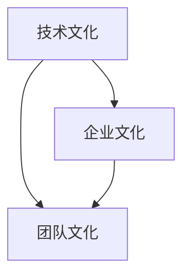
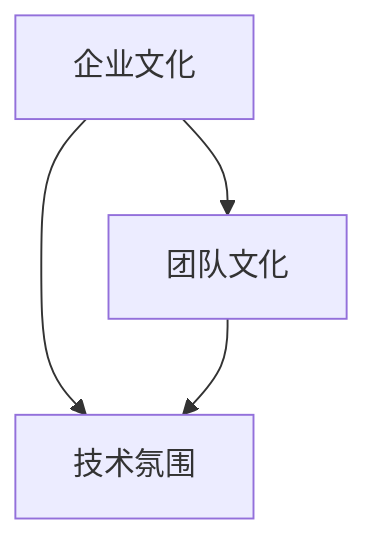
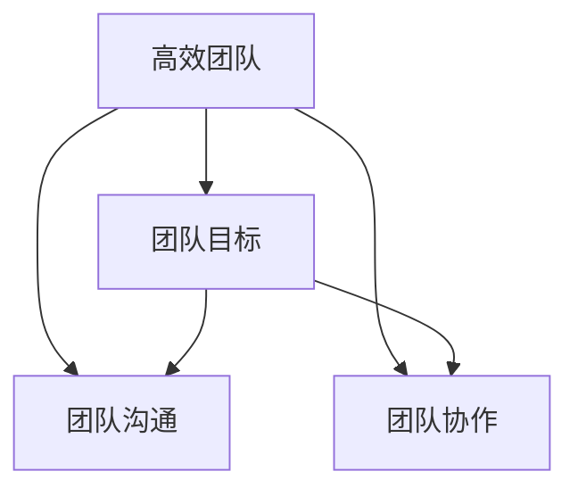
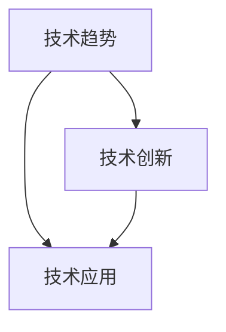
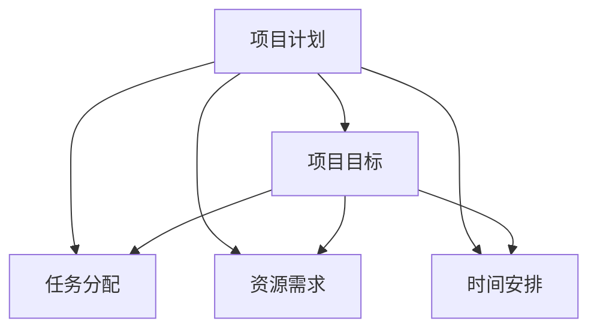
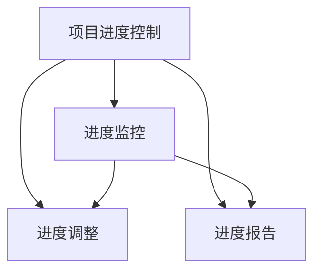
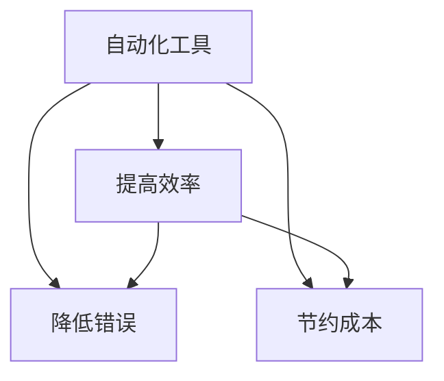
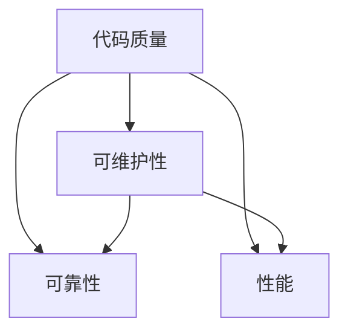
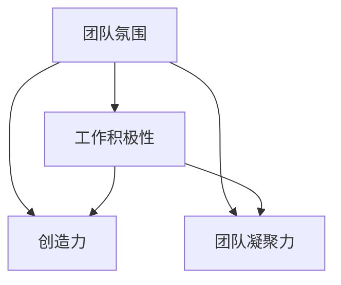

                 


### 文章标题：技术文化建设：打造高效能开发团队

---

关键词：技术文化、团队建设、高效能、开发团队

摘要：
本文旨在探讨技术文化建设对于打造高效能开发团队的重要性。通过分析技术文化的核心概念、团队管理、技能提升、项目管理、团队效能提升以及团队氛围营造等方面，本文提出了具体的方法和实践路径。结合实际案例，本文展示了技术文化建设在不同企业中的应用效果，为IT行业的团队建设提供了有益的参考。

---

### 第一部分：技术文化建设基础

#### 第1章：技术文化建设的核心概念

**1.1 技术文化的定义与作用**

**背景介绍**
在现代IT行业中，技术文化已成为企业发展的重要基石。技术文化不仅影响企业的技术创新能力，还影响团队的工作效率和协作效果。因此，了解技术文化的定义与作用对于打造高效能开发团队至关重要。

**核心概念与联系**

**核心概念**：技术文化是指企业或团队在长期技术实践中所形成的共同价值观、行为准则和工作习惯。

**核心联系**：技术文化与企业文化和团队文化密切相关，是两者的重要组成部分。

**技术文化的定义**
技术文化是企业在长期技术实践中积累和沉淀的共同价值观、行为准则和工作习惯。它体现了企业或团队对技术创新的重视、对技术人才的尊重以及对技术发展的追求。

**技术文化的作用**
- **提升团队的技术水平**：技术文化能够激发团队成员的学习热情，促进技术知识的传播和应用，从而提升团队的整体技术水平。
- **促进企业创新能力的提升**：技术文化鼓励团队成员勇于尝试新技术、新方法，推动企业创新能力的提升。
- **增强团队凝聚力**：技术文化能够形成共同价值观和行为准则，增强团队成员之间的凝聚力，提高团队协作效率。

---

**核心算法原理讲解**
技术文化的建设可以通过以下几个步骤实现：
```python
# Step 1: 明确技术文化建设的愿景和目标
# Vision and Goals of Technical Culture Development

# Step 2: 建立技术文化的基础价值观和行为准则
# Basic Values and Behavior Norms of Technical Culture

# Step 3: 制定技术文化建设的策略和计划
# Strategies and Plans for Technical Culture Development

# Step 4: 实施和推广技术文化
# Implementation and Promotion of Technical Culture

# Step 5: 持续改进和优化技术文化
# Continuous Improvement and Optimization of Technical Culture
```

**数学模型和公式**
技术文化建设的效果可以用以下数学模型来表示：
$$
E = f(V, G, P, I, C)
$$
其中，\( E \) 表示技术文化建设的效应，\( V \) 表示愿景和目标，\( G \) 表示价值观和行为准则，\( P \) 表示策略和计划，\( I \) 表示实施和推广，\( C \) 表示持续改进和优化。

**举例说明**
假设某企业希望在三年内建立一套成熟的技术文化体系，其愿景是成为行业领先的技术创新者。该企业可以按照以下步骤进行技术文化建设：
1. **明确愿景和目标**：制定详细的技术文化发展计划，明确目标和技术文化建设的重点。
2. **建立基础价值观和行为准则**：结合企业的核心价值观，制定与技术创新相关的价值观和行为准则。
3. **制定策略和计划**：制定具体的技术文化建设策略和实施计划，包括培训、激励机制、技术分享等。
4. **实施和推广技术文化**：通过培训、技术分享会、内部竞赛等形式，将技术文化理念深入到每个员工心中。
5. **持续改进和优化技术文化**：定期评估技术文化建设的效果，根据反馈进行调整和优化。

---

**项目实战**
在技术文化建设过程中，开发环境的搭建是关键一步。以下是一个简单的开发环境搭建流程：
```bash
# 安装Python环境
sudo apt-get update
sudo apt-get install python3 python3-pip

# 安装必要的库
pip3 install numpy pandas matplotlib

# 配置代码风格规范
pip3 install black flake8

# 设置工作目录
mkdir my_project
cd my_project

# 初始化Git仓库
git init
```

**代码解读**
以上代码首先安装了Python环境和必要的库，然后配置了代码风格规范，最后设置了工作目录并初始化了Git仓库。

**代码应用解读与分析**
该代码主要用于搭建一个简单的Python开发环境，包括安装Python、安装必要的库、配置代码风格规范以及初始化Git仓库。通过这些步骤，开发人员可以快速搭建一个高效的开发环境，提高开发效率。

**实际案例分析和详细讲解剖析**
在某大型互联网公司，技术文化建设取得了显著成效。该公司通过持续的技术培训、技术分享会、内部竞赛等形式，不断推进技术文化的建设。例如，公司每年都会举办技术分享会，邀请内部专家分享技术心得和经验，促进了团队成员之间的技术交流。此外，公司还建立了技术博客，鼓励员工撰写技术文章，分享技术心得，提高了整体技术水平。

**项目小结**
通过以上案例可以看出，技术文化建设对于提升团队的技术水平和创新能力具有重要意义。企业应高度重视技术文化建设，通过制定明确的愿景和目标、建立基础价值观和行为准则、制定策略和计划、实施和推广技术文化以及持续改进和优化技术文化等步骤，推动技术文化的建设。

---

**最佳实践 tips**：在技术文化建设过程中，企业应注重以下几点：
- **明确愿景和目标**：技术文化建设应与企业的战略目标相一致，明确愿景和目标。
- **建立有效的沟通机制**：建立有效的沟通机制，确保技术文化理念深入人心。
- **提供持续培训和支持**：为员工提供持续的技术培训和支持，提升团队的整体技术水平。
- **鼓励创新和实践**：鼓励员工勇于尝试新技术、新方法，推动企业创新能力的提升。

**注意事项**：在技术文化建设过程中，企业应避免以下问题：
- **缺乏明确的愿景和目标**：技术文化建设应与企业的战略目标相一致，明确愿景和目标。
- **缺乏有效的沟通机制**：建立有效的沟通机制，确保技术文化理念深入人心。
- **缺乏持续培训和支持**：为员工提供持续的技术培训和支持，提升团队的整体技术水平。

**拓展阅读**：
- 《创新者的窘境》
- 《精益创业》
- 《团队协作的力量》

---

### 第一部分：技术文化建设基础

#### 第2章：技术文化建设的实践路径

**2.1 技术文化建设的关键要素**

**背景介绍**
技术文化建设是一个系统工程，需要从多个方面进行综合考量。本文将介绍技术文化建设的关键要素，包括企业文化、团队文化、技术氛围等。

**核心概念与联系**


**核心概念**：
- **企业文化**：企业文化的内涵、特征和影响。
- **团队文化**：团队文化的定义、核心要素和作用。
- **技术氛围**：技术氛围的营造、维护和优化。

**核心联系**：
- 企业文化是技术文化建设的根基，团队文化是技术文化建设的具体体现，技术氛围是技术文化建设的实际效果。

---

**核心算法原理讲解**
技术文化建设的核心算法可以描述为：
```python
# Algorithm for Technical Culture Construction

# Input: Enterprise Culture (E), Team Culture (T), Technical Atmosphere (A)
# Output: Enhanced Technical Culture (ETC)

def enhance_technical_culture(E, T, A):
    # Step 1: Align E, T, and A with the strategic goals of the enterprise
    aligned_goals = align_goals(E, T, A)

    # Step 2: Develop a comprehensive plan for technical culture construction
    plan = develop_plan(aligned_goals)

    # Step 3: Implement the plan and monitor progress
    implementation = implement_plan(plan)
    progress = monitor_progress(implementation)

    # Step 4: Evaluate and adjust the plan based on feedback
    evaluation = evaluate_plan(progress)
    adjusted_plan = adjust_plan(evaluation)

    # Step 5: Sustain and optimize the technical culture
    sustained_culture = sustain_culture(adjusted_plan)

    return sustained_culture
```

**数学模型和公式**
技术文化建设的效应可以用以下数学模型表示：
$$
ETC = f(E, T, A, P, F)
$$
其中，\( ETC \) 表示技术文化建设的效果，\( E \) 表示企业文化，\( T \) 表示团队文化，\( A \) 表示技术氛围，\( P \) 表示计划，\( F \) 表示反馈。

**举例说明**
某互联网公司在进行技术文化建设时，采取了以下措施：
1. **明确企业文化**：将创新、协作、学习作为企业核心价值观。
2. **建设团队文化**：组织技术分享会、团队建设活动，鼓励员工互相学习和交流。
3. **营造技术氛围**：提供丰富的技术资源和培训，鼓励员工探索新技术。
4. **制定计划**：制定详细的技术文化建设计划，包括阶段性目标和实施步骤。
5. **反馈与调整**：定期收集员工反馈，根据反馈调整技术文化建设策略。

---

**项目实战**
在某创业公司，技术文化建设项目如下：
1. **需求分析**：分析公司当前的技术现状和团队需求。
2. **方案设计**：设计技术文化建设方案，包括企业文化、团队文化和技术氛围的构建。
3. **实施与推广**：实施技术文化建设方案，并通过多种渠道推广技术文化理念。
4. **评估与反馈**：定期评估技术文化建设效果，收集员工反馈，进行持续改进。

**代码解读**
以下是一个简单的技术文化建设方案设计伪代码：
```python
# Define the technical culture construction plan

# Step 1: Define the enterprise culture
enterprise_culture = "Innovation, Collaboration, Learning"

# Step 2: Define the team culture
team_culture = {
    "Knowledge Sharing": True,
    "Team Building Activities": True,
    "Open Communication": True
}

# Step 3: Define the technical atmosphere
technical_atmosphere = {
    "Resource Provision": True,
    "Training Programs": True,
    "Innovation Encouragement": True
}

# Step 4: Define the implementation plan
implementation_plan = {
    "Quarterly Tech Shares": True,
    "Monthly Team Outings": True,
    "Regular Training Sessions": True
}

# Step 5: Define the feedback loop
feedback_loop = {
    "Feedback Collection": True,
    "Adjustment Based on Feedback": True
}

# Print the construction plan
print("Technical Culture Construction Plan:")
print("Enterprise Culture:", enterprise_culture)
print("Team Culture:", team_culture)
print("Technical Atmosphere:", technical_atmosphere)
print("Implementation Plan:", implementation_plan)
print("Feedback Loop:", feedback_loop)
```

**代码应用解读与分析**
该代码定义了一个技术文化建设方案，包括企业文化、团队文化、技术氛围、实施计划和反馈循环。通过执行这个方案，公司可以逐步构建起积极向上的技术文化。

**实际案例分析和详细讲解剖析**
在某全球知名科技公司，技术文化建设项目取得了显著成效。该公司通过以下措施推进技术文化建设：
1. **明确企业文化**：强调创新、合作、学习和持续改进。
2. **建设团队文化**：组织定期的技术分享会、团队建设活动和知识竞赛。
3. **营造技术氛围**：提供丰富的技术资源和培训，鼓励员工探索新技术和解决问题。
4. **制定计划**：制定详细的技术文化建设计划，并确保执行。
5. **反馈与调整**：定期收集员工反馈，根据反馈调整技术文化建设策略。

**项目小结**
通过以上案例可以看出，技术文化建设是一个系统工程，需要从多个方面进行综合考量。企业应通过制定明确的计划、实施有效的措施、收集反馈并持续改进，推动技术文化的建设。

---

**最佳实践 tips**：
1. **明确愿景和使命**：技术文化建设应与企业的愿景和使命相一致，明确技术文化建设的方向和目标。
2. **建立沟通机制**：建立有效的沟通机制，确保技术文化理念在企业内部得到广泛传播和深入理解。
3. **提供持续培训**：为员工提供持续的技术培训和支持，提升团队的整体技术水平。
4. **鼓励创新**：鼓励员工勇于尝试新技术、新方法，推动企业创新能力的提升。

**注意事项**：
1. **避免一刀切**：技术文化建设应根据企业的实际情况和需求，避免一刀切的做法。
2. **持续改进**：技术文化建设不是一蹴而就的过程，需要持续改进和优化。
3. **关注员工反馈**：及时关注员工反馈，根据反馈调整技术文化建设策略。

**拓展阅读**：
- 《精益创业》
- 《敏捷开发》
- 《团队协作的力量》

---

### 第二部分：团队管理

#### 第3章：高效团队建设

**3.1 高效团队的特性与要求**

**背景介绍**
高效团队是现代企业成功的基石。高效团队不仅能够提高工作效率，还能提升团队凝聚力和创新能力。本文将探讨高效团队的特性与要求，以及如何建设高效团队。

**核心概念与联系**


**核心概念**：
- **高效团队**：具有明确目标、高效沟通、高度协作的团队。
- **团队目标**：团队共同追求的愿景和目标。
- **团队沟通**：团队成员之间的信息交流。
- **团队协作**：团队成员共同完成任务的过程。

**核心联系**：
- 高效团队的目标应明确、具体，并与企业目标一致。
- 高效团队需要建立高效的沟通机制，确保信息畅通。
- 高效团队需要通过协作实现共同目标，提高整体效率。

---

**核心算法原理讲解**
高效团队建设可以通过以下算法实现：
```python
# Algorithm for Building an Effective Team

# Input: Team Goals (G), Communication (C), Collaboration (Co)
# Output: Effective Team (ET)

def build_effective_team(G, C, Co):
    # Step 1: Define clear and specific team goals
    defined_goals = define_goals(G)

    # Step 2: Establish effective communication channels
    effective_communication = establish_communication(C)

    # Step 3: Foster a collaborative environment
    collaborative_environment = foster_collaboration(Co)

    # Step 4: Monitor and adjust the team's progress
    progress_monitoring = monitor_progress(defined_goals, effective_communication, collaborative_environment)

    # Step 5: Evaluate the team's performance and make adjustments
    performance_evaluation = evaluate_performance(progress_monitoring)

    # Step 6: Sustain and enhance the team's effectiveness
    sustained_effectiveness = sustain_effectiveness(performance_evaluation)

    return sustained_effectiveness
```

**数学模型和公式**
高效团队的绩效可以用以下数学模型表示：
$$
Performance = f(Goals, Communication, Collaboration, Support)
$$
其中，\( Performance \) 表示团队绩效，\( Goals \) 表示团队目标，\( Communication \) 表示团队沟通，\( Collaboration \) 表示团队协作，\( Support \) 表示团队支持。

**举例说明**
某创业公司在组建团队时，采取了以下措施：
1. **明确团队目标**：明确公司的愿景和使命，确保团队目标与企业目标一致。
2. **建立沟通机制**：建立定期的团队会议、邮件群组等沟通渠道，确保团队成员能够及时交流。
3. **培养协作精神**：通过团队活动、任务分配等方式，培养团队成员的协作精神。
4. **提供支持**：为团队成员提供必要的资源和支持，确保团队能够高效完成任务。

---

**项目实战**
在某大型跨国公司，团队建设项目如下：
1. **需求分析**：分析公司当前团队的管理现状和团队需求。
2. **方案设计**：设计团队建设方案，包括团队目标、沟通机制、协作方式等。
3. **实施与推广**：实施团队建设方案，并通过多种渠道推广团队建设理念。
4. **评估与反馈**：定期评估团队建设效果，收集员工反馈，进行持续改进。

**代码解读**
以下是一个简单的团队建设方案设计伪代码：
```python
# Define the team building plan

# Step 1: Define the team goals
team_goals = {
    "Company Vision": "To become the leader in the industry",
    "Individual Goals": ["Increase revenue", "Improve customer satisfaction", "Enhance product quality"]
}

# Step 2: Define the communication channels
communication_channels = {
    "Regular Meetings": True,
    "Email Groups": True,
    "Team Chat": True
}

# Step 3: Define the collaboration methods
collaboration_methods = {
    "Task Assignments": True,
    "Team Activities": True,
    "Knowledge Sharing": True
}

# Step 4: Define the support measures
support_measures = {
    "Resource Allocation": True,
    "Training Programs": True,
    "Feedback Mechanism": True
}

# Print the team building plan
print("Team Building Plan:")
print("Team Goals:", team_goals)
print("Communication Channels:", communication_channels)
print("Collaboration Methods:", collaboration_methods)
print("Support Measures:", support_measures)
```

**代码应用解读与分析**
该代码定义了一个团队建设方案，包括团队目标、沟通渠道、协作方式和支持措施。通过执行这个方案，公司可以逐步建设起高效团队。

**实际案例分析和详细讲解剖析**
在某国际知名咨询公司，团队建设项目取得了显著成效。该公司通过以下措施推进团队建设：
1. **明确团队目标**：确保团队目标与企业目标一致，明确每个成员的职责和期望。
2. **建立沟通机制**：通过定期的团队会议、邮件群组等渠道，确保团队成员能够及时交流。
3. **培养协作精神**：通过团队活动、任务分配等方式，培养团队成员的协作精神。
4. **提供支持**：为团队成员提供必要的资源和支持，确保团队能够高效完成任务。

**项目小结**
通过以上案例可以看出，高效团队建设对于提升团队绩效和创新能力具有重要意义。企业应通过制定明确的团队目标、建立沟通机制、培养协作精神和提供支持等步骤，建设高效团队。

---

**最佳实践 tips**：
1. **明确团队目标**：确保团队目标与企业目标一致，明确每个成员的职责和期望。
2. **建立沟通机制**：通过多种渠道确保团队成员能够及时交流。
3. **培养协作精神**：通过团队活动和任务分配，培养团队成员的协作精神。
4. **提供支持**：为团队成员提供必要的资源和支持，确保团队能够高效完成任务。

**注意事项**：
1. **避免单点依赖**：确保团队成员之间能够互相支持和依赖。
2. **持续改进**：团队建设是一个持续的过程，需要不断改进和优化。
3. **关注团队动态**：及时关注团队动态，了解团队成员的需求和反馈。

**拓展阅读**：
- 《敏捷团队管理》
- 《团队协作的力量》
- 《团队效能提升》

---

### 第三部分：技能提升

#### 第4章：技术知识更新

**4.1 技术发展的趋势与方向**

**背景介绍**
随着技术的快速发展，IT行业不断涌现出新的技术趋势和方向。了解技术发展的趋势与方向，对于开发人员来说至关重要。本文将探讨技术发展的趋势与方向，以及如何保持技术前沿知识。

**核心概念与联系**


**核心概念**：
- **技术趋势**：当前和未来技术发展的方向和趋势。
- **技术创新**：新技术、新方法和新解决方案的创造。
- **技术应用**：新技术在实际应用中的实践和效果。

**核心联系**：
- 技术趋势引领技术创新，技术创新推动技术应用。
- 技术应用反馈到技术趋势，形成良性循环。

---

**核心算法原理讲解**
技术知识更新的核心算法可以描述为：
```python
# Algorithm for Keeping Up with Technical Trends

# Input: Technical Trends (T), Innovation (I), Application (A)
# Output: Updated Technical Knowledge (UTK)

def update_technical_knowledge(T, I, A):
    # Step 1: Identify current technical trends
    current_trends = identify_trends(T)

    # Step 2: Explore innovative technologies
    innovative_technologies = explore_innovations(I)

    # Step 3: Apply technologies to real-world problems
    applied_technologies = apply_technologies(A)

    # Step 4: Learn and adapt to new technologies
    updated_knowledge = learn_and_adapt(current_trends, innovative_technologies, applied_technologies)

    return updated_knowledge
```

**数学模型和公式**
技术知识更新的效果可以用以下数学模型表示：
$$
Updated Knowledge = f(Trends, Innovations, Applications, Learning)
$$
其中，\( Updated Knowledge \) 表示技术知识更新效果，\( Trends \) 表示技术趋势，\( Innovations \) 表示技术创新，\( Applications \) 表示技术应用，\( Learning \) 表示学习过程。

**举例说明**
某开发人员在更新技术知识时，采取了以下步骤：
1. **了解当前技术趋势**：通过技术博客、论坛和会议，了解当前的技术趋势。
2. **探索创新技术**：阅读技术文献，参与技术社区讨论，探索新的技术解决方案。
3. **应用新技术**：在实际项目中应用新的技术，解决实际问题。
4. **学习新技术**：参加培训课程，阅读技术书籍，不断学习新技术。

---

**项目实战**
在某科技公司，技术知识更新项目如下：
1. **需求分析**：分析公司当前的技术需求和团队的技术知识水平。
2. **方案设计**：设计技术知识更新方案，包括技术趋势研究、创新技术应用、技术培训等。
3. **实施与推广**：实施技术知识更新方案，并通过多种渠道推广技术知识更新理念。
4. **评估与反馈**：定期评估技术知识更新效果，收集员工反馈，进行持续改进。

**代码解读**
以下是一个简单的技术知识更新方案设计伪代码：
```python
# Define the technical knowledge update plan

# Step 1: Identify current technical trends
current_trends = {
    "Cloud Computing": True,
    "Machine Learning": True,
    "Blockchain": True
}

# Step 2: Explore innovative technologies
innovative_technologies = {
    "Serverless Computing": True,
    "Quantum Computing": True,
    "Edge Computing": True
}

# Step 3: Apply technologies to real-world problems
applied_technologies = {
    "Real-Time Analytics": True,
    "AI-Driven Decision Making": True,
    "Decentralized Applications": True
}

# Step 4: Learn and adapt to new technologies
learning_plan = {
    "Training Programs": True,
    "Books and Articles": True,
    "Tech Community Participation": True
}

# Print the technical knowledge update plan
print("Technical Knowledge Update Plan:")
print("Current Trends:", current_trends)
print("Innovative Technologies:", innovative_technologies)
print("Applied Technologies:", applied_technologies)
print("Learning Plan:", learning_plan)
```

**代码应用解读与分析**
该代码定义了一个技术知识更新方案，包括当前技术趋势、创新技术、技术应用和学习计划。通过执行这个方案，公司可以逐步提升团队的技术知识水平。

**实际案例分析和详细讲解剖析**
在某全球知名科技公司，技术知识更新项目取得了显著成效。该公司通过以下措施推进技术知识更新：
1. **了解当前技术趋势**：定期发布技术趋势报告，帮助员工了解最新的技术动态。
2. **探索创新技术**：组织技术研讨会议，邀请技术专家分享最新的技术解决方案。
3. **应用新技术**：在实际项目中引入新的技术，解决实际问题。
4. **学习新技术**：提供内部培训课程、外部技术研讨会，鼓励员工不断学习新技术。

**项目小结**
通过以上案例可以看出，技术知识更新对于提升团队的技术水平和创新能力具有重要意义。企业应通过制定明确的技术知识更新方案、实施有效的技术知识更新措施、收集反馈并持续改进，推动技术知识的更新。

---

**最佳实践 tips**：
1. **定期学习**：设定固定的学习时间，定期阅读技术文献、参加技术会议。
2. **实践应用**：在实际项目中应用新技术，解决实际问题。
3. **分享经验**：鼓励团队成员分享技术经验和心得，促进知识交流。
4. **持续关注**：关注技术发展趋势，了解最新的技术动态。

**注意事项**：
1. **避免盲目跟风**：根据实际需求和技术发展趋势，有选择地学习新技术。
2. **平衡工作与学习**：合理安排工作与学习时间，避免影响工作效率。
3. **团队协作**：鼓励团队成员共同学习、共同进步。

**拓展阅读**：
- 《技术趋势报告》
- 《编程人生》
- 《技术先锋》

---

### 第三部分：项目管理

#### 第5章：项目计划与执行

**5.1 项目计划的重要性**

**背景介绍**
项目计划是项目管理的核心环节，是确保项目成功的关键。良好的项目计划能够明确项目目标、任务分配、资源需求和时间安排，为项目执行提供清晰的指导。本文将探讨项目计划的重要性，以及如何制定有效的项目计划。

**核心概念与联系**


**核心概念**：
- **项目计划**：项目目标、任务分配、资源需求和时间安排的具体描述。
- **项目目标**：项目的最终目标和期望结果。
- **任务分配**：项目任务的具体分配和责任人。
- **资源需求**：项目执行所需的人力、物力和财力资源。
- **时间安排**：项目任务的时间节点和进度安排。

**核心联系**：
- 项目计划是项目执行的基础，项目目标和任务分配是项目计划的核心。
- 资源需求和时间安排是项目计划的重要保障。

---

**核心算法原理讲解**
项目计划的制定可以通过以下算法实现：
```python
# Algorithm for Creating a Project Plan

# Input: Project Goals (G), Tasks (T), Resources (R), Timeline (L)
# Output: Project Plan (PP)

def create_project_plan(G, T, R, L):
    # Step 1: Define clear and specific project goals
    defined_goals = define_goals(G)

    # Step 2: Assign tasks and responsibilities
    assigned_tasks = assign_tasks(T)

    # Step 3: Estimate resource requirements
    estimated_resources = estimate_resources(R)

    # Step 4: Develop a project timeline
    project_timeline = develop_timeline(L)

    # Step 5: Align the plan with the project goals
    aligned_plan = align_plan(defined_goals, assigned_tasks, estimated_resources, project_timeline)

    return aligned_plan
```

**数学模型和公式**
项目计划的有效性可以用以下数学模型表示：
$$
Effectiveness = f(Goals, Tasks, Resources, Timeline)
$$
其中，\( Effectiveness \) 表示项目计划的有效性，\( Goals \) 表示项目目标，\( Tasks \) 表示任务分配，\( Resources \) 表示资源需求，\( Timeline \) 表示时间安排。

**举例说明**
某公司在制定项目计划时，采取了以下步骤：
1. **定义项目目标**：明确项目的愿景和使命，确保项目目标与企业目标一致。
2. **任务分配**：根据项目目标和资源情况，分配具体的任务和责任人。
3. **资源需求**：评估项目执行所需的人力、物力和财力资源，确保资源充足。
4. **时间安排**：制定详细的时间节点和进度安排，确保项目按计划推进。

---

**项目实战**
在某大型工程项目中，项目计划制定如下：
1. **需求分析**：分析项目的需求，明确项目的目标、任务和资源需求。
2. **方案设计**：设计项目计划方案，包括项目目标、任务分配、资源需求和时间安排。
3. **实施与推广**：实施项目计划方案，并通过多种渠道推广项目计划理念。
4. **评估与反馈**：定期评估项目计划执行情况，收集反馈，进行持续改进。

**代码解读**
以下是一个简单的项目计划设计伪代码：
```python
# Define the project plan

# Step 1: Define the project goals
project_goals = {
    "Vision": "To build a high-quality product",
    "Mission": "To meet customer needs and exceed expectations"
}

# Step 2: Assign tasks and responsibilities
tasks = {
    "Task 1": "Requirement Analysis",
    "Task 2": "Design",
    "Task 3": "Development",
    "Task 4": "Testing",
    "Person Responsible": ["John", "Mary", "Peter", "Linda"]
}

# Step 3: Estimate resource requirements
resources = {
    "Human Resources": ["Team A", "Team B", "Team C"],
    "Material Resources": ["Hardware", "Software", "Tools"]
}

# Step 4: Develop a project timeline
timeline = {
    "Start Date": "2023-01-01",
    "End Date": "2023-12-31",
    "Milestones": ["Mid-Year Review", "Product Launch", "Customer Feedback"]
}

# Print the project plan
print("Project Plan:")
print("Project Goals:", project_goals)
print("Tasks:", tasks)
print("Resources:", resources)
print("Timeline:", timeline)
```

**代码应用解读与分析**
该代码定义了一个项目计划，包括项目目标、任务分配、资源需求和时间安排。通过执行这个计划，项目团队可以明确项目的目标和任务，确保项目按计划推进。

**实际案例分析和详细讲解剖析**
在某大型电商平台，项目计划制定项目取得了显著成效。该公司通过以下措施制定项目计划：
1. **定义项目目标**：明确项目的愿景和使命，确保项目目标与企业目标一致。
2. **任务分配**：根据项目目标和资源情况，分配具体的任务和责任人。
3. **资源需求**：评估项目执行所需的人力、物力和财力资源，确保资源充足。
4. **时间安排**：制定详细的时间节点和进度安排，确保项目按计划推进。

**项目小结**
通过以上案例可以看出，项目计划对于确保项目成功具有重要意义。企业应通过制定明确的项目目标、合理的任务分配、充分的资源需求和科学的时间安排，制定有效的项目计划。

---

**最佳实践 tips**：
1. **明确项目目标**：确保项目目标与企业目标一致，明确项目的愿景和使命。
2. **合理分配任务**：根据项目目标和资源情况，合理分配任务和责任人。
3. **充分评估资源**：评估项目执行所需的人力、物力和财力资源，确保资源充足。
4. **科学安排时间**：制定详细的时间节点和进度安排，确保项目按计划推进。

**注意事项**：
1. **避免任务堆积**：确保项目任务分配合理，避免任务堆积影响项目进度。
2. **持续监控进度**：定期评估项目进度，及时调整项目计划。
3. **关注项目风险**：识别和应对项目风险，确保项目顺利进行。

**拓展阅读**：
- 《项目管理知识体系》
- 《敏捷项目管理》
- 《项目计划与控制》

---

### 第三部分：项目管理

#### 第6章：项目进度控制与风险管理

**6.1 项目进度控制的方法**

**背景介绍**
项目进度控制是项目管理的重要环节，直接影响到项目的成功与否。有效的项目进度控制可以确保项目按时完成，提高项目成功率。本文将探讨项目进度控制的方法，以及如何实施有效的项目进度控制。

**核心概念与联系**


**核心概念**：
- **项目进度控制**：确保项目按计划进度执行的过程。
- **进度监控**：实时监控项目进度，及时发现偏差。
- **进度调整**：根据监控结果，调整项目计划以恢复进度。
- **进度报告**：定期汇报项目进度，提供决策依据。

**核心联系**：
- 进度监控是进度控制的基础，进度调整是进度控制的核心。
- 进度报告是进度控制的反馈机制，有助于持续改进。

---

**核心算法原理讲解**
项目进度控制的核心算法可以描述为：
```python
# Algorithm for Project Progress Control

# Input: Project Plan (P), Progress Data (PD)
# Output: Adjusted Project Plan (AP)

def control_project_progress(P, PD):
    # Step 1: Monitor the project progress
    current_progress = monitor_progress(PD)

    # Step 2: Identify any deviations from the plan
    deviations = identify_deviations(current_progress, P)

    # Step 3: Adjust the project plan to address deviations
    adjusted_plan = adjust_plan(P, deviations)

    # Step 4: Implement the adjusted plan
    implement_adjusted_plan(adjusted_plan)

    # Step 5: Report the progress
    report_progress(current_progress, adjusted_plan)
```

**数学模型和公式**
项目进度控制的效果可以用以下数学模型表示：
$$
Progress Control Effectiveness = f(Plan, Progress Data, Adjustments, Reporting)
$$
其中，\( Progress Control Effectiveness \) 表示项目进度控制的有效性，\( Plan \) 表示项目计划，\( Progress Data \) 表示进度数据，\( Adjustments \) 表示进度调整，\( Reporting \) 表示进度报告。

**举例说明**
某项目团队在进度控制过程中，采取了以下步骤：
1. **监控项目进度**：定期收集项目进度数据，分析项目进度情况。
2. **识别偏差**：比较实际进度和计划进度，识别存在的偏差。
3. **调整项目计划**：根据偏差情况，调整项目计划，制定应对措施。
4. **实施调整**：根据调整后的计划，重新安排任务和时间，确保项目进度恢复正常。
5. **报告进度**：定期向项目管理层和利益相关者报告项目进度，提供决策依据。

---

**项目实战**
在某信息技术项目中，项目进度控制如下：
1. **需求分析**：分析项目需求，明确项目目标和任务分配。
2. **方案设计**：设计项目进度控制方案，包括进度监控、偏差识别、计划调整和进度报告等。
3. **实施与推广**：实施项目进度控制方案，并通过多种渠道推广进度控制理念。
4. **评估与反馈**：定期评估项目进度控制效果，收集反馈，进行持续改进。

**代码解读**
以下是一个简单的项目进度控制方案设计伪代码：
```python
# Define the project progress control plan

# Step 1: Monitor the project progress
monitor_progress = {
    "Regular Meetings": True,
    "Progress Reports": True,
    "Status Updates": True
}

# Step 2: Identify deviations
identify_deviations = {
    "Actual vs. Planned": True,
    "Root Cause Analysis": True,
    "Impact Assessment": True
}

# Step 3: Adjust the plan
adjust_plan = {
    "Rework": True,
    "Resource Allocation": True,
    "Deadline Extension": True
}

# Step 4: Implement the adjusted plan
implement_adjusted_plan = {
    "Communicate Changes": True,
    "Update Timeline": True,
    "Execute Actions": True
}

# Step 5: Report the progress
report_progress = {
    "Progress Reports": True,
    "Status Meetings": True,
    "Feedback Loop": True
}

# Print the progress control plan
print("Project Progress Control Plan:")
print("Monitor Progress:", monitor_progress)
print("Identify Deviations:", identify_deviations)
print("Adjust Plan:", adjust_plan)
print("Implement Adjusted Plan:", implement_adjusted_plan)
print("Report Progress:", report_progress)
```

**代码应用解读与分析**
该代码定义了一个项目进度控制方案，包括进度监控、偏差识别、计划调整和进度报告等。通过执行这个方案，项目团队可以有效地控制项目进度。

**实际案例分析和详细讲解剖析**
在某大型软件开发项目中，项目进度控制措施如下：
1. **监控项目进度**：定期召开项目进度会议，收集项目进度数据，分析项目进度情况。
2. **识别偏差**：通过比较实际进度和计划进度，识别存在的偏差，分析偏差原因。
3. **调整项目计划**：根据偏差情况，调整项目计划，重新分配资源，确保项目进度恢复正常。
4. **实施调整**：根据调整后的计划，重新安排任务和时间，确保项目进度恢复正常。
5. **报告进度**：定期向项目管理层和利益相关者报告项目进度，提供决策依据。

**项目小结**
通过以上案例可以看出，项目进度控制对于确保项目按时完成具有重要意义。企业应通过制定明确的项目进度控制方案、实施有效的进度监控和调整措施、收集反馈并持续改进，实施有效的项目进度控制。

---

**最佳实践 tips**：
1. **定期监控进度**：定期召开项目进度会议，收集项目进度数据，及时识别偏差。
2. **及时调整计划**：根据进度监控结果，及时调整项目计划，确保项目进度恢复正常。
3. **沟通与协调**：加强项目团队之间的沟通与协调，确保项目进度信息的畅通。
4. **资源优化**：合理分配项目资源，确保项目资源的高效利用。

**注意事项**：
1. **避免频繁调整**：避免频繁调整项目计划，确保项目稳定性。
2. **关注项目风险**：识别和应对项目风险，确保项目顺利进行。
3. **持续改进**：根据项目进度控制效果，持续改进项目进度控制方法。

**拓展阅读**：
- 《项目管理知识体系》
- 《敏捷项目管理》
- 《项目进度控制》

---

### 第四部分：团队效能提升

#### 第7章：自动化工具与应用

**7.1 自动化工具的优势与选择**

**背景介绍**
自动化工具在提升团队效能方面具有显著优势。自动化工具可以减少重复性工作，提高工作效率，降低人为错误。本文将探讨自动化工具的优势，以及如何选择适合的自动化工具。

**核心概念与联系**


**核心概念**：
- **自动化工具**：用于自动化执行重复性任务的软件或硬件工具。
- **提高效率**：通过自动化减少人工操作，提高工作速度和效率。
- **降低错误**：通过自动化减少人为错误，提高工作质量。
- **节约成本**：通过自动化减少人工成本和其他相关成本。

**核心联系**：
- 自动化工具能够提高效率、降低错误和节约成本，从而提升团队效能。

---

**核心算法原理讲解**
自动化工具的选择可以通过以下算法实现：
```python
# Algorithm for Choosing Automation Tools

# Input: Tasks (T), Tools (T), Efficiency (E), Error Rate (ER), Cost (C)
# Output: Selected Tools (ST)

def choose_automation_tools(T, T, E, ER, C):
    # Step 1: Analyze the tasks to be automated
    analyzed_tasks = analyze_tasks(T)

    # Step 2: Evaluate the available automation tools
    evaluated_tools = evaluate_tools(T, analyzed_tasks)

    # Step 3: Compare the tools based on efficiency, error rate, and cost
    compared_tools = compare_tools(evaluated_tools, E, ER, C)

    # Step 4: Select the most suitable tools
    selected_tools = select_tools(compared_tools)

    return selected_tools
```

**数学模型和公式**
自动化工具的选择效果可以用以下数学模型表示：
$$
Tool Selection Effectiveness = f(Tasks, Tools, Efficiency, Error Rate, Cost)
$$
其中，\( Tool Selection Effectiveness \) 表示自动化工具选择的有效性，\( Tasks \) 表示任务，\( Tools \) 表示工具，\( Efficiency \) 表示效率，\( Error Rate \) 表示错误率，\( Cost \) 表示成本。

**举例说明**
某团队在自动化工具选择过程中，采取了以下步骤：
1. **分析任务**：分析团队中的重复性任务，确定需要自动化的任务。
2. **评估工具**：评估现有的自动化工具，包括其功能、效率、稳定性和成本。
3. **比较工具**：比较不同自动化工具的效率、错误率和成本，选择最适合的工具。
4. **选择工具**：根据比较结果，选择最适合的自动化工具。

---

**项目实战**
在某大型数据中心，自动化工具应用如下：
1. **需求分析**：分析数据中心的运维任务，确定需要自动化的任务。
2. **方案设计**：设计自动化工具应用方案，包括工具选择、任务分配和部署计划。
3. **实施与推广**：实施自动化工具应用方案，并通过多种渠道推广自动化工具使用。
4. **评估与反馈**：定期评估自动化工具的应用效果，收集反馈，进行持续改进。

**代码解读**
以下是一个简单的自动化工具选择和应用方案设计伪代码：
```python
# Define the automation tool selection and application plan

# Step 1: Analyze the tasks to be automated
tasks_to_automate = {
    "Task 1": "Server Provisioning",
    "Task 2": "Network Configuration",
    "Task 3": "Application Deployment"
}

# Step 2: Evaluate the available automation tools
available_tools = {
    "Tool 1": "Ansible",
    "Tool 2": "Terraform",
    "Tool 3": "Puppet"
}

# Step 3: Compare the tools based on efficiency, error rate, and cost
comparison_results = compare_tools(available_tools, tasks_to_automate)

# Step 4: Select the most suitable tools
selected_tools = select_tools(comparison_results)

# Step 5: Develop the application plan
application_plan = {
    "Tool Deployment": selected_tools,
    "Task Assignment": ["John", "Mary", "Peter"],
    "Deployment Schedule": ["2023-01-01", "2023-02-01", "2023-03-01"]
}

# Print the automation tool selection and application plan
print("Automation Tool Selection and Application Plan:")
print("Tasks to Automate:", tasks_to_automate)
print("Available Tools:", available_tools)
print("Comparison Results:", comparison_results)
print("Selected Tools:", selected_tools)
print("Application Plan:", application_plan)
```

**代码应用解读与分析**
该代码定义了一个自动化工具选择和应用方案，包括任务分析、工具评估、工具选择和应用计划。通过执行这个方案，团队可以有效地提升工作效能。

**实际案例分析和详细讲解剖析**
在某国际知名金融机构，自动化工具应用取得了显著成效。该公司通过以下措施推进自动化工具的应用：
1. **分析任务**：分析金融机构的运维任务，确定需要自动化的任务。
2. **评估工具**：评估现有的自动化工具，包括其功能、效率、稳定性和成本。
3. **选择工具**：根据评估结果，选择最适合的自动化工具。
4. **部署工具**：在数据中心的各个部分部署自动化工具，实现自动化运维。
5. **培训与支持**：为员工提供自动化工具的培训和支持，确保工具的高效使用。

**项目小结**
通过以上案例可以看出，自动化工具在提升团队效能方面具有重要作用。企业应通过分析任务、评估工具、选择适合的工具和部署工具，推动自动化工具的应用。

---

**最佳实践 tips**：
1. **任务分析**：明确需要自动化的任务，确保自动化工具的应用目标明确。
2. **工具评估**：全面评估自动化工具的功能、效率、稳定性和成本。
3. **工具选择**：根据评估结果，选择最适合的自动化工具。
4. **培训与支持**：为员工提供自动化工具的培训和支持，确保工具的高效使用。

**注意事项**：
1. **避免盲目跟风**：根据实际需求，选择合适的自动化工具。
2. **持续改进**：根据自动化工具的应用效果，持续改进工具配置和应用方法。
3. **安全与合规**：确保自动化工具的使用符合安全标准和合规要求。

**拓展阅读**：
- 《自动化工具指南》
- 《DevOps实践》
- 《自动化测试》

---

### 第四部分：团队效能提升

#### 第8章：代码质量保证

**8.1 代码质量的定义与重要性**

**背景介绍**
代码质量是软件开发过程中至关重要的因素。高质量的代码不仅能够提高软件的可维护性和可靠性，还能降低开发成本和风险。本文将探讨代码质量的定义与重要性，以及如何保证代码质量。

**核心概念与联系**


**核心概念**：
- **代码质量**：代码的可维护性、可靠性、性能等特性。
- **可维护性**：代码易于修改和维护的程度。
- **可靠性**：代码在运行过程中稳定、正确的程度。
- **性能**：代码执行效率的高低。

**核心联系**：
- 代码质量包括可维护性、可靠性和性能等方面，这些方面相互关联，共同决定了代码的质量。

---

**核心算法原理讲解**
代码质量保证的核心算法可以描述为：
```python
# Algorithm for Ensuring Code Quality

# Input: Code (C), Quality Metrics (QM)
# Output: Enhanced Code (EC)

def ensure_code_quality(C, QM):
    # Step 1: Analyze the code based on quality metrics
    code_analyzer = analyze_code(C, QM)

    # Step 2: Identify code quality issues
    issues = identify_issues(code_analyzer)

    # Step 3: Apply code quality improvements
    improved_code = apply_improvements(C, issues)

    # Step 4: Validate the enhanced code
    validated_code = validate_code(improved_code)

    return validated_code
```

**数学模型和公式**
代码质量可以用以下数学模型表示：
$$
Code Quality = f(Maintainability, Reliability, Performance)
$$
其中，\( Code Quality \) 表示代码质量，\( Maintainability \) 表示可维护性，\( Reliability \) 表示可靠性，\( Performance \) 表示性能。

**举例说明**
某开发人员在保证代码质量时，采取了以下步骤：
1. **分析代码**：使用代码分析工具，分析代码的可维护性、可靠性和性能。
2. **识别问题**：根据代码分析结果，识别代码中的质量问题。
3. **改进代码**：针对识别出的问题，对代码进行改进，提高代码质量。
4. **验证代码**：重新运行代码，验证改进后的代码是否达到质量要求。

---

**项目实战**
在某软件公司，代码质量保证项目如下：
1. **需求分析**：分析公司现有的代码质量状况，明确代码质量保障的目标和要求。
2. **方案设计**：设计代码质量保证方案，包括代码质量评估、代码改进和验证等。
3. **实施与推广**：实施代码质量保证方案，并通过多种渠道推广代码质量保障理念。
4. **评估与反馈**：定期评估代码质量保证效果，收集反馈，进行持续改进。

**代码解读**
以下是一个简单的代码质量保证方案设计伪代码：
```python
# Define the code quality assurance plan

# Step 1: Analyze the code
code_analyzer = CodeAnalyzer()

# Step 2: Identify issues
issues = code_analyzer.identify_issues()

# Step 3: Improve the code
improver = CodeImprover()
improved_code = improver.improve_code(code, issues)

# Step 4: Validate the code
validator = CodeValidator()
validated_code = validator.validate_code(improved_code)

# Step 5: Report the results
report = {
    "Analysis Results": code_analyzer.results,
    "Issues Identified": issues,
    "Improved Code": improved_code,
    "Validation Results": validator.results
}

# Print the code quality assurance plan
print("Code Quality Assurance Plan:")
print("Code Analyzer:", code_analyzer)
print("Issues:", issues)
print("Improved Code:", improved_code)
print("Validation Results:", validated_code)
print("Report:", report)
```

**代码应用解读与分析**
该代码定义了一个代码质量保证方案，包括代码分析、问题识别、代码改进和验证等。通过执行这个方案，公司可以逐步提升代码质量。

**实际案例分析和详细讲解剖析**
在某大型软件公司，代码质量保证项目取得了显著成效。该公司通过以下措施推进代码质量保证：
1. **代码分析**：使用静态代码分析工具，定期分析代码质量。
2. **问题识别**：根据代码分析结果，识别代码中的质量问题。
3. **代码改进**：针对识别出的问题，制定改进措施，提高代码质量。
4. **验证代码**：重新运行代码，验证改进后的代码是否达到质量要求。

**项目小结**
通过以上案例可以看出，代码质量保证对于提升软件质量和开发效率具有重要意义。企业应通过制定明确的代码质量保证方案、实施有效的代码分析、改进和验证措施，保证代码质量。

---

**最佳实践 tips**：
1. **定期代码分析**：定期使用代码分析工具，分析代码质量。
2. **问题识别与改进**：针对识别出的问题，制定改进措施，提高代码质量。
3. **代码审查**：进行代码审查，确保代码符合编程规范和质量标准。
4. **持续集成与部署**：实施持续集成与部署，确保代码质量的一致性和可靠性。

**注意事项**：
1. **避免过度优化**：在保证代码质量的同时，避免过度优化，影响代码的可读性和可维护性。
2. **关注代码可读性**：确保代码具有良好的可读性，便于后续维护。
3. **持续改进**：根据代码质量保证效果，持续改进代码质量保证措施。

**拓展阅读**：
- 《代码质量保证》
- 《敏捷软件开发》
- 《软件质量管理体系》

---

### 第五部分：团队氛围营造

#### 第9章：积极团队氛围的重要性

**9.1 团队氛围对团队效能的影响**

**背景介绍**
团队氛围是团队效能的重要影响因素。积极的团队氛围能够提高团队成员的工作积极性和创造力，增强团队凝聚力，从而提升团队的整体效能。本文将探讨积极团队氛围的重要性，以及如何营造积极团队氛围。

**核心概念与联系**


**核心概念**：
- **团队氛围**：团队成员在团队中感受到的工作氛围。
- **工作积极性**：团队成员在工作中的主动性和积极性。
- **创造力**：团队成员在解决问题和创新方面的能力。
- **团队凝聚力**：团队成员之间的相互依赖和合作精神。

**核心联系**：
- 积极的团队氛围能够提高团队成员的工作积极性、创造力和团队凝聚力，从而提升团队效能。

---

**核心算法原理讲解**
积极团队氛围的营造可以通过以下算法实现：
```python
# Algorithm for Cultivating a Positive Team Atmosphere

# Input: Team Dynamics (TD), Team Climate (TC), Employee Engagement (EE)
# Output: Positive Team Atmosphere (PTA)

def cultivate_positive_team_atmosphere(TD, TC, EE):
    # Step 1: Analyze the current team dynamics
    current_dynamics = analyze_dynamics(TD)

    # Step 2: Assess the team climate
    team_climate = assess_climate(TC)

    # Step 3: Enhance employee engagement
    enhanced_engagement = enhance_engagement(EE)

    # Step 4: Introduce team-building activities
    team_building_activities = introduce_activities()

    # Step 5: Monitor and adjust the team atmosphere
    monitored_atmosphere = monitor_atmosphere(current_dynamics, team_climate, enhanced_engagement, team_building_activities)

    return monitored_atmosphere
```

**数学模型和公式**
积极团队氛围的营造效果可以用以下数学模型表示：
$$
Atmosphere Effectiveness = f(Dynamics, Climate, Engagement, Activities)
$$
其中，\( Atmosphere Effectiveness \) 表示积极团队氛围的营造效果，\( Dynamics \) 表示团队动态，\( Climate \) 表示团队气候，\( Engagement \) 表示员工参与度，\( Activities \) 表示团队活动。

**举例说明**
某团队在营造积极团队氛围时，采取了以下步骤：
1. **分析团队动态**：分析团队成员的互动和沟通情况，了解团队动态。
2. **评估团队气候**：评估团队成员的工作态度和团队氛围，了解团队气候。
3. **增强员工参与度**：通过定期的团队活动、员工关怀和反馈机制，增强员工参与度。
4. **引入团队建设活动**：组织团队建设活动，如户外拓展、团队游戏等，增强团队凝聚力。
5. **监控团队氛围**：定期收集员工反馈，监控团队氛围的变化，根据反馈进行调整。

---

**项目实战**
在某科技公司，积极团队氛围营造项目如下：
1. **需求分析**：分析公司当前团队氛围和员工满意度。
2. **方案设计**：设计积极团队氛围营造方案，包括团队活动、员工关怀和反馈机制等。
3. **实施与推广**：实施积极团队氛围营造方案，并通过多种渠道推广氛围营造理念。
4. **评估与反馈**：定期评估团队氛围营造效果，收集反馈，进行持续改进。

**代码解读**
以下是一个简单的积极团队氛围营造方案设计伪代码：
```python
# Define the positive team atmosphere cultivation plan

# Step 1: Analyze team dynamics
team_dynamics = analyze_dynamics()

# Step 2: Assess team climate
team_climate = assess_climate()

# Step 3: Enhance employee engagement
engagement_activities = enhance_engagement()

# Step 4: Introduce team-building activities
team_activities = introduce_activities()

# Step 5: Monitor and adjust team atmosphere
atmosphere_monitor = monitor_atmosphere(team_dynamics, team_climate, engagement_activities, team_activities)

# Print the positive team atmosphere cultivation plan
print("Positive Team Atmosphere Cultivation Plan:")
print("Team Dynamics:", team_dynamics)
print("Team Climate:", team_climate)
print("Engagement Activities:", engagement_activities)
print("Team Activities:", team_activities)
print("Atmosphere Monitoring:", atmosphere_monitor)
```

**代码应用解读与分析**
该代码定义了一个积极团队氛围营造方案，包括团队动态分析、团队气候评估、员工参与度增强和团队建设活动引入。通过执行这个方案，公司可以逐步营造积极团队氛围。

**实际案例分析和详细讲解剖析**
在某国际知名科技公司，积极团队氛围营造项目取得了显著成效。该公司通过以下措施推进积极团队氛围营造：
1. **分析团队动态**：定期进行员工满意度调查，了解团队动态。
2. **评估团队气候**：通过开放式沟通和反馈机制，评估团队气候。
3. **增强员工参与度**：组织员工关怀活动，如员工生日会、家庭日等，增强员工参与度。
4. **引入团队建设活动**：组织团队拓展、团队竞赛等活动，增强团队凝聚力。
5. **监控团队氛围**：定期收集员工反馈，监控团队氛围的变化，根据反馈进行调整。

**项目小结**
通过以上案例可以看出，积极团队氛围对于提升团队效能和员工满意度具有重要意义。企业应通过制定明确的积极团队氛围营造方案、实施有效的团队活动、收集反馈并持续改进，营造积极团队氛围。

---

**最佳实践 tips**：
1. **定期员工满意度调查**：定期进行员工满意度调查，了解团队动态和员工需求。
2. **开放式沟通与反馈机制**：建立开放式沟通和反馈机制，确保团队成员之间的信息畅通。
3. **员工关怀活动**：组织员工关怀活动，增强员工归属感和参与度。
4. **团队建设活动**：定期组织团队建设活动，增强团队凝聚力和协作精神。

**注意事项**：
1. **避免形式主义**：确保团队活动的实际效果，避免形式主义。
2. **关注员工反馈**：及时关注员工反馈，根据反馈进行调整和优化。
3. **持续改进**：积极团队氛围营造是一个持续的过程，需要不断改进和优化。

**拓展阅读**：
- 《团队建设》
- 《员工满意度管理》
- 《积极心理学》

---

### 第六部分：案例分析

#### 第10章：技术文化建设的成功案例

**10.1 案例一：某科技企业的技术文化建设**

**背景介绍**
某科技企业是一家专注于人工智能和大数据技术的公司，该公司在技术文化建设方面取得了显著成效。本文将分析该公司的技术文化建设过程和成功经验。

**案例概述**
该科技企业通过以下几个步骤推进技术文化建设：
1. **明确技术文化愿景和目标**：将“创新、协作、学习”作为技术文化的核心价值观。
2. **建立技术文化机制**：制定技术文化管理手册，明确技术文化建设的步骤和策略。
3. **组织技术培训和分享**：定期组织技术培训、技术分享会，鼓励员工参与。
4. **实施技术竞赛和项目**：组织技术竞赛和项目，激发员工创新潜力。
5. **营造技术氛围**：提供丰富的技术资源，鼓励员工学习和探索新技术。

**成功经验**
1. **明确愿景和目标**：该公司的技术文化建设从明确愿景和目标开始，确保全体员工对技术文化有清晰的认识。
2. **建立管理机制**：通过制定技术文化管理手册，建立了一套完整的

