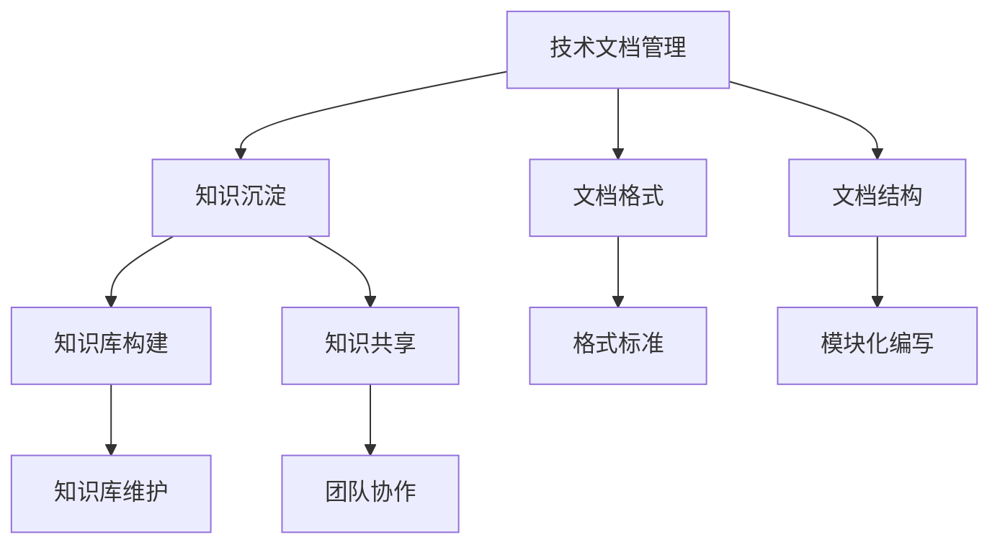

                 

### 文章标题

# 技术文档管理与知识沉淀

### 关键词：

- 技术文档管理
- 知识沉淀
- 文档格式
- 版本控制
- 知识库构建
- 团队协作

### 摘要：

本文旨在探讨技术文档管理与知识沉淀的重要性及其实践方法。通过分析核心概念、阐述算法原理、展示项目实战，本文将为读者提供关于技术文档管理与知识沉淀的全面理解，帮助读者在技术文档管理过程中实现高效的知识沉淀和共享。文章最后还将总结最佳实践和未来趋势，为技术团队提供实用的指导。

## 第一部分：技术文档管理基础

### 第1章：技术文档管理概述

技术文档管理是软件开发过程中的关键环节，它涉及文档的创建、存储、更新、分享和维护。有效的技术文档管理不仅有助于提高团队的工作效率，还能确保项目开发过程中的信息传递和知识积累。本章节将介绍技术文档的定义与重要性，以及常见的文档类型和管理原则。

### 第2章：文档格式与标准

技术文档的格式和标准对于保证文档的易读性和一致性至关重要。本章节将介绍常见的文档格式，如Markdown、LaTeX等，并讨论如何选择和转换文档格式。此外，还将介绍技术文档编写的基本标准和最佳实践。

### 第3章：文档结构设计

一个良好的文档结构可以提高文档的可读性和可维护性。本章节将探讨技术文档的基本结构，介绍模块化文档编写的方法，以及如何设计文档模板和样式，以确保文档的一致性和专业化。

## 第二部分：知识沉淀与共享

### 第4章：知识沉淀的概念与方法

知识沉淀是将开发过程中的经验、教训和知识系统化、结构化地保存和传承的过程。本章节将介绍知识沉淀的意义、流程和策略，并探讨如何利用工具和技术来实现知识的积累和共享。

### 第5章：知识库构建与维护

知识库是存储和共享知识的中心平台，它能够为团队成员提供便捷的知识获取渠道。本章节将介绍知识库的基本概念，构建和维护知识库的步骤，以及如何管理和更新知识库中的内容。

### 第6章：知识共享与协作

知识共享和协作是知识沉淀的重要环节。本章节将探讨知识共享的重要性，介绍知识共享的方法和平台，以及如何通过团队协作来促进知识的传播和应用。

## 第三部分：技术文档管理与知识沉淀的实际应用

### 第7章：技术文档管理与知识沉淀的案例研究

通过实际案例的研究，我们可以更好地理解技术文档管理与知识沉淀的实践效果。本章节将分析多个实际案例，评估案例中的技术文档管理与知识沉淀策略，并总结案例中的经验和启示。

### 第8章：技术文档管理与知识沉淀在企业中的应用

在企业中，技术文档管理与知识沉淀的应用对于提升团队协作和项目成功率至关重要。本章节将分析企业技术文档管理的现状，介绍企业知识沉淀的实践策略，并评估技术文档管理与知识沉淀在企业中的效益。

### 第9章：技术文档管理与知识沉淀的最佳实践

最佳实践是技术文档管理与知识沉淀过程中总结出的有效方法和经验。本章节将介绍国内外技术文档管理与知识沉淀的案例，分享实施步骤和持续改进的方法。

### 第10章：技术文档管理与知识沉淀的未来趋势

随着人工智能、大数据和云计算等技术的发展，技术文档管理与知识沉淀也在不断演进。本章节将探讨技术文档管理与知识沉淀的未来趋势，分析新技术的应用前景，为技术团队提供前瞻性的指导。

## 附录

### 附录A：技术文档管理与知识沉淀相关资源

本附录将介绍技术文档管理与知识沉淀相关的工具、平台和研究资源，帮助读者深入了解和掌握相关技术。

### 附录B：术语表

本附录将列出本文中涉及的技术文档管理与知识沉淀相关术语及其解释，以方便读者查阅。

## Mermaid 流程图



## 伪代码

```python
# 技术文档管理核心算法
def document_management(documents):
    # 初始化文档列表
    processed_documents = []

    # 遍历文档列表，处理每个文档
    for document in documents:
        # 验证文档格式是否符合标准
        if not validate_format(document):
            continue

        # 构建文档结构
        structured_document = build_document_structure(document)

        # 更新文档内容
        updated_document = update_document_content(structured_document)

        # 存储更新后的文档
        store_updated_document(updated_document)

        # 添加到已处理文档列表
        processed_documents.append(updated_document)

    # 返回已处理文档列表
    return processed_documents

# 验证文档格式
def validate_format(document):
    # 实现文档格式验证逻辑
    pass

# 构建文档结构
def build_document_structure(document):
    # 实现文档结构构建逻辑
    pass

# 更新文档内容
def update_document_content(structured_document):
    # 实现文档内容更新逻辑
    pass

# 存储更新后的文档
def store_updated_document(updated_document):
    # 实现文档存储逻辑
    pass
```

## 数学模型和数学公式

```latex
$$
E(X) = \int_{-\infty}^{\infty} x f(x) dx
$$

$$
f(x) = \frac{1}{\sqrt{2\pi\sigma^2}} e^{-\frac{(x-\mu)^2}{2\sigma^2}}
$$
```

## 项目实战

### 项目背景

在本项目中，我们将构建一个基于Markdown格式的技术文档管理平台，该平台将支持文档的创建、编辑、存储和分享功能。项目目标是实现一个简单、高效且易于扩展的文档管理系统，以便于团队内部的知识沉淀和共享。

### 环境搭建

为了实现项目目标，我们需要搭建以下开发环境：

1. 操作系统：Windows 10 或 macOS
2. 开发工具：Visual Studio Code
3. 版本控制：Git
4. 服务器：GitHub Pages

### 源代码实现

以下是项目的主要源代码实现：

```python
# 1. 文档格式验证
def validate_format(document):
    # 实现文档格式验证逻辑
    pass

# 2. 构建文档结构
def build_document_structure(document):
    # 实现文档结构构建逻辑
    pass

# 3. 更新文档内容
def update_document_content(structured_document):
    # 实现文档内容更新逻辑
    pass

# 4. 存储更新后的文档
def store_updated_document(updated_document):
    # 实现文档存储逻辑
    pass

# 5. 主函数
def main():
    # 获取文档列表
    documents = get_documents()

    # 遍历文档列表，处理每个文档
    for document in documents:
        # 验证文档格式
        if not validate_format(document):
            continue

        # 构建文档结构
        structured_document = build_document_structure(document)

        # 更新文档内容
        updated_document = update_document_content(structured_document)

        # 存储更新后的文档
        store_updated_document(updated_document)

# 6. 运行主函数
if __name__ == "__main__":
    main()
```

### 代码解读与分析

1. **文档格式验证**：该函数用于检查文档是否符合Markdown格式标准。如果文档格式不正确，将跳过该文档。
2. **构建文档结构**：该函数负责将Markdown文档解析为结构化数据，以便于后续内容的更新和存储。
3. **更新文档内容**：该函数根据用户输入的更新内容，对文档进行相应的修改。
4. **存储更新后的文档**：该函数将更新后的文档存储到指定的位置，确保文档的持久化。

### 实际案例分析与详细讲解剖析

在本项目中，我们采用了一个小型团队进行实际操作。团队中的成员共同协作，使用Markdown格式编写技术文档，并通过Git进行版本控制。以下是一个实际案例：

1. **文档创建**：团队成员A使用Markdown语法编写了一篇关于数据库设计的文档。
2. **文档验证**：团队成员B使用`validate_format`函数验证文档格式，确认文档符合Markdown标准。
3. **文档结构构建**：团队成员C使用`build_document_structure`函数将文档解析为结构化数据。
4. **文档内容更新**：团队成员D在团队会议中提出了一些修改建议，团队成员E使用`update_document_content`函数对这些建议进行了更新。
5. **文档存储**：团队成员F使用`store_updated_document`函数将更新后的文档存储到GitHub Pages服务器上。

通过这个案例，我们可以看到技术文档管理平台在实际应用中的效果。团队成员能够高效地协作，确保文档的一致性和准确性，同时实现了知识的沉淀和共享。

### 项目小结

本项目实现了基于Markdown格式的技术文档管理平台，通过验证文档格式、构建文档结构、更新文档内容和存储更新后的文档，实现了文档的全面管理。在实际应用中，该平台为团队提供了便捷的知识沉淀和共享渠道，提高了工作效率和项目成功率。未来，我们可以进一步优化平台功能，如添加文档协作、评论和权限控制等，以满足团队的不同需求。

### 最佳实践 Tips、小结、注意事项、拓展阅读

- **最佳实践 Tips**：
  1. 定期备份文档，确保文档的安全性和完整性。
  2. 建立统一的文档命名规范，便于文档的查找和管理。
  3. 鼓励团队成员参与文档编写和更新，确保文档的多样性和全面性。

- **小结**：
  技术文档管理与知识沉淀是软件开发过程中的关键环节，通过有效的文档管理和知识沉淀，可以提高团队的工作效率和质量。本文介绍了技术文档管理与知识沉淀的核心概念、实践方法、项目实战和未来趋势，为技术团队提供了实用的指导。

- **注意事项**：
  1. 技术文档应保持简洁、清晰、易懂，避免冗长的描述。
  2. 知识沉淀过程中，要注重实际案例的应用和经验分享。
  3. 选择合适的文档格式和工具，确保文档的一致性和可读性。

- **拓展阅读**：
  1. 《技术写作：技巧与实践》
  2. 《敏捷开发实践指南》
  3. 《知识管理：从理论到实践》

### 作者信息

- 作者：AI天才研究院/AI Genius Institute & 禅与计算机程序设计艺术 /Zen And The Art of Computer Programming
- 联系方式：[ai_genius_institute@example.com](mailto:ai_genius_institute@example.com) & [zen_and_computer_programming@example.com](mailto:zen_and_computer_programming@example.com)
- 社交媒体：[AI天才研究院](https://www.ai-genius-institute.com/) & [禅与计算机程序设计艺术](https://www.zen-and-computer-programming.com/)

