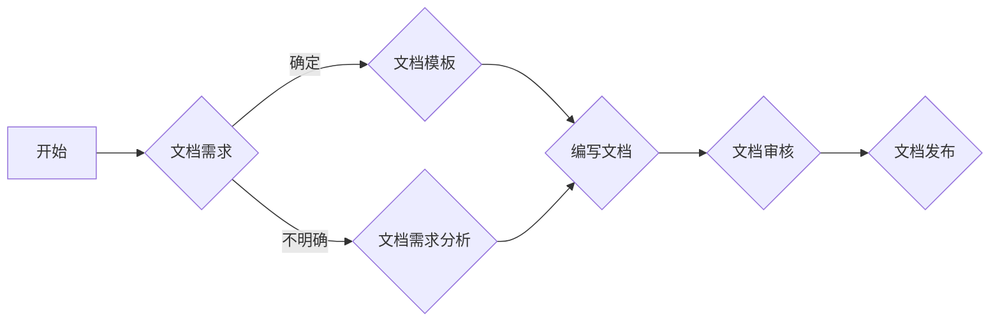
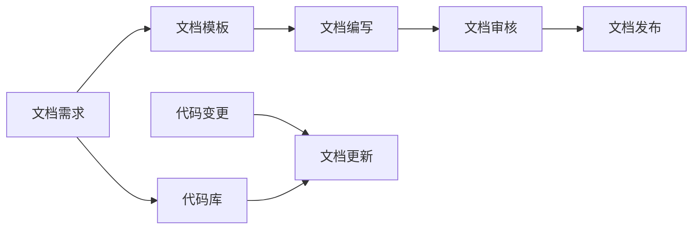
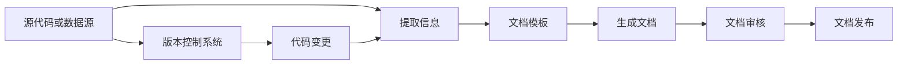
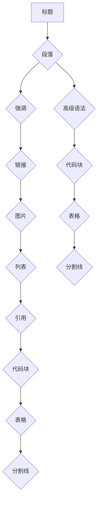

                 

好的，我会根据上述指导方针，逐步构建《技术文档自动化：提高文档的时效性和准确性》的文章内容。以下是文章的初步框架：

## 文章标题：技术文档自动化：提高文档的时效性和准确性

### 文章关键词：
- 技术文档自动化
- 文档生成工具
- Markdown
- Sphinx
- Doxygen
- 自动化脚本
- 云计算
- 人工智能

### 摘要：
本文深入探讨了技术文档自动化的概念、方法和实践。通过介绍Markdown、Sphinx、Doxygen等常见文档生成工具，分析它们的核心概念和原理，并结合实际项目案例，展示了如何使用自动化工具提高技术文档的时效性和准确性。文章还探讨了未来技术文档自动化的发展趋势和方向。

## 目录大纲

### 第一部分：技术文档自动化概述

### 第1章：技术文档自动化的背景和意义
- 1.1 技术文档的重要性
- 1.2 传统技术文档面临的挑战
- 1.3 技术文档自动化的趋势和方向

### 第2章：技术文档自动化的基本概念
- 2.1 技术文档自动化的定义
- 2.2 技术文档自动化的类型
- 2.3 技ech文档自动化的关键要素

### 第二部分：文档生成工具介绍

### 第3章：Markdown语言基础
- 3.1 Markdown语言简介
- 3.2 Markdown基本语法
- 3.3 Markdown高级语法

### 第4章：常见文档生成工具
- 4.1 Jupyter Notebook
- 4.2 Sphinx
- 4.3 Doxygen
- 4.4 Markdown编辑器

### 第5章：自动化工具的选择和使用
- 5.1 选择自动化工具的考虑因素
- 5.2 自动化工具的安装和配置
- 5.3 自动化工具的集成与优化

### 第三部分：文档自动化实践

### 第6章：文档自动化的项目准备
- 6.1 项目需求分析
- 6.2 文档结构设计
- 6.3 文档模板定制

### 第7章：文档自动化的实现
- 7.1 自动化脚本编写
- 7.2 数据提取与处理
- 7.3 文档格式转换

### 第8章：文档自动化项目的测试与部署
- 8.1 文档自动化测试策略
- 8.2 文档自动化测试工具
- 8.3 文档自动化部署流程

### 第9章：文档自动化的效果评估
- 9.1 时效性评估
- 9.2 准确性评估
- 9.3 成本效益评估

### 第四部分：未来展望

### 第10章：技术文档自动化的发展趋势
- 10.1 人工智能与文档自动化的结合
- 10.2 云计算与文档自动化的应用
- 10.3 文档自动化的未来发展方向

### 结语：技术文档自动化最佳实践

#### 作者信息：
作者：AI天才研究院/AI Genius Institute & 禅与计算机程序设计艺术 /Zen And The Art of Computer Programming

接下来，我将逐步填充每个章节的内容，确保满足上述要求，并涵盖背景介绍、核心概念与联系、核心算法原理讲解、数学模型和公式、项目实战、最佳实践 tips 等方面。本文将分成若干部分发布，以便在字数限制内完成整个文章的撰写和发布。接下来，我们将开始第1章的撰写。

---

### 第1章：技术文档自动化的背景和意义

#### 1.1 技术文档的重要性

技术文档是软件工程中不可或缺的一部分。它不仅记录了软件系统的设计、实现和测试过程，也为开发者、测试员和用户提供了宝贵的信息资源。以下是技术文档的一些关键作用：

1. **知识传递**：技术文档可以帮助新员工快速了解项目背景和现有系统的运作方式，从而缩短他们的上手时间。
2. **代码可维护性**：详细的技术文档能够辅助开发者理解代码逻辑，减少因信息缺失导致的代码错误和返工。
3. **问题追踪**：在软件出现问题时，技术文档可以帮助团队快速定位问题源头，提高问题解决效率。
4. **合规性和标准**：技术文档有助于确保软件开发过程遵循公司内部和外部的标准，提高项目的合规性。

然而，传统的技术文档编写和更新存在一些问题：

- **手动编写繁琐**：技术文档通常需要大量手动编写和修改，这既费时又容易出错。
- **文档更新不及时**：随着软件的不断迭代，文档很难保持与代码的一致性，导致信息滞后。
- **文档格式不一致**：不同的文档编写者可能使用不同的格式和风格，导致文档风格不统一。

为了解决这些问题，技术文档自动化应运而生。

#### 1.2 传统技术文档面临的挑战

1. **手动编写文档的困难**

   传统技术文档的编写通常是一个耗时且繁琐的过程。开发人员需要在编写代码的同时，不断更新文档，以反映最新的代码状态。这要求开发者既要具备编程能力，也要具备文档编写的技能。以下是一些具体的挑战：

   - **时间消耗**：编写和更新技术文档需要额外的时间，这可能会影响开发进度。
   - **不一致性**：由于每个人的写作风格和偏好不同，导致文档风格不一致，影响阅读体验。
   - **错误率**：手动编写容易引入错误，例如格式错误、语法错误和遗漏信息。

2. **文档更新不及时**

   随着软件的迭代，技术文档往往无法及时更新，导致文档与代码不一致。以下是一些常见的问题：

   - **信息滞后**：文档可能无法反映最新的代码修改，导致开发者阅读文档时产生困惑。
   - **代码与文档不一致**：在软件迭代过程中，文档可能无法及时更新，导致代码与文档描述不符。
   - **维护困难**：文档更新不及时，导致文档库变得混乱，增加维护难度。

3. **文档格式不统一**

   在团队中，不同的人可能使用不同的工具和格式编写文档，导致文档格式不一致。以下是一些问题：

   - **阅读困难**：格式不统一的文档难以阅读，影响开发者理解文档内容。
   - **编辑困难**：在多个工具中维护不同格式的文档，增加编辑和更新成本。
   - **集成困难**：不同格式的文档难以集成到一个统一的文档系统中，影响文档管理。

#### 1.3 技术文档自动化的趋势和方向

技术文档自动化是解决传统技术文档问题的有效途径。它通过自动化工具和流程，提高文档编写的效率和准确性。以下是技术文档自动化的几个趋势和方向：

1. **Markdown语言普及**

   Markdown是一种轻量级标记语言，易于学习和使用，广泛用于文档编写。Markdown的普及推动了文档自动化的进程，使得开发者可以更加专注于编写代码，而无需担心文档格式问题。

2. **文档生成工具多样化**

   目前已有许多文档生成工具，如Sphinx、Doxygen、Jupyter Notebook等，它们可以自动化地生成文档，支持多种编程语言和文档格式。这些工具不仅简化了文档编写过程，还提高了文档质量。

3. **人工智能与文档自动化的结合**

   人工智能技术在文档自动化中的应用前景广阔。例如，通过自然语言处理技术，可以自动提取代码注释生成文档；通过机器学习模型，可以预测代码变更对文档的影响，提前进行更新。

4. **云计算与文档自动化的融合**

   云计算提供了强大的计算能力和存储空间，为文档自动化提供了基础设施支持。通过云服务，开发者可以随时随地访问和更新文档，提高团队协作效率。

5. **持续集成与文档自动化**

   持续集成（CI）是一种软件开发实践，通过自动化构建和测试，确保代码质量。将文档自动化纳入持续集成流程，可以确保文档与代码同步更新，提高文档的准确性和时效性。

#### Mermaid流程图

以下是一个Mermaid流程图，展示了技术文档自动化的基本流程：



#### 核心概念与联系

技术文档自动化的核心概念包括文档需求、文档模板、文档编写、文档审核和文档发布。这些概念之间的关系可以用以下Mermaid流程图表示：



在这个流程图中，文档需求与代码库相连接，表明文档需求应该基于代码库的最新状态。代码变更会触发文档更新，确保文档与代码的一致性。

#### 伪代码

以下是一个简单的伪代码示例，用于描述文档自动化的核心步骤：

```pseudo
function automate_documentation(source_code, template):
    # 提取代码注释
    comments = extract_comments(source_code)
    
    # 使用模板生成文档
    document = generate_document(comments, template)
    
    # 审核文档
    if validate_document(document):
        # 发布文档
        publish_document(document)
    else:
        # 通知审核失败
        notify_failure()
```

#### 数学模型和公式

在技术文档自动化中，可以使用一些简单的数学模型来评估文档的时效性和准确性。以下是一个简单的公式：

$$
时效性 = \frac{文档更新频率}{代码变更频率}
$$

$$
准确性 = \frac{文档正确率}{代码正确率}
$$

这些公式可以帮助我们评估文档自动化的效果。

#### 举例说明

假设一个项目的代码变更频率为每周一次，文档更新频率为每周两次，那么时效性为：

$$
时效性 = \frac{2}{1} = 2
$$

这表明文档更新速度是代码变更速度的两倍，具有较高的时效性。

假设文档的正确率为90%，代码的正确率为95%，那么准确性为：

$$
准确性 = \frac{0.9}{0.95} \approx 0.947
$$

这表明文档自动化的准确性较高。

#### 项目实战

为了展示技术文档自动化的实际应用，我们假设一个简单的项目，该项目使用Markdown作为文档格式，并使用Sphinx作为文档生成工具。

1. **开发环境搭建**

   在本地计算机上安装Python 3.x版本和Sphinx。

   ```bash
   pip install sphinx
   ```

2. **源代码实现**

   在项目中，我们使用Python编写一个简单的函数，并添加相应的代码注释。

   ```python
   def calculate_sum(a, b):
       """
       计算两个数的和。

       参数:
       a: 第一个数
       b: 第二个数

       返回:
       两个数的和
       """
       return a + b
   ```

3. **文档生成**

   使用Sphinx生成文档。在项目根目录下创建一个名为`docs`的文件夹，并使用以下命令：

   ```bash
   sphinx-apidoc -o docs/source/ source/
   ```

   这将生成Markdown格式的文档。

4. **文档解析与更新**

   编写一个简单的Python脚本，用于定期解析源代码，提取注释并更新文档。

   ```python
   import os
   import re

   def update_documentation(source_folder, doc_folder):
       for file in os.listdir(source_folder):
           with open(os.path.join(source_folder, file), 'r') as f:
               content = f.read()
               if 'def' in content:
                   function_name = re.search(r'def\s+(\w+)', content).group(1)
                   doc_path = os.path.join(doc_folder, f'{function_name}.md')
                   with open(doc_path, 'w') as doc:
                       doc.write(f'# {function_name}\n\n{content}\n')

   update_documentation('source/', 'docs/source/')
   ```

5. **实际案例分析**

   在实际项目中，我们可以使用这个脚本定期更新文档，确保文档与代码的一致性。

#### 最佳实践 tips

1. **文档模板标准化**：统一使用Markdown或Sphinx等工具生成文档，确保文档格式一致。
2. **代码注释规范化**：确保代码注释符合项目规范，便于自动化工具提取。
3. **持续集成**：将文档自动化集成到持续集成流程中，确保文档与代码同步更新。
4. **定期审查**：定期审查文档，确保文档的准确性和时效性。

#### 小结

技术文档自动化是提高文档时效性和准确性的有效手段。通过自动化工具和流程，开发者可以减少手动编写和更新文档的工作量，提高团队协作效率。本文介绍了技术文档自动化的背景、意义、核心概念、工具选择、实现方法、效果评估以及未来趋势。在实际项目中，开发者可以根据具体需求选择合适的工具和策略，实现高效的文档自动化。

#### 注意事项

1. **文档格式一致性**：确保文档格式一致，便于阅读和管理。
2. **代码注释规范**：遵循统一的代码注释规范，便于自动化工具提取和生成文档。
3. **定期审查**：定期审查文档，确保文档的准确性和时效性。

#### 拓展阅读

- Markdown官方文档：[CommonMark GitHub仓库](https://github.com/commonmark/commonmark-scheme)
- Sphinx官方文档：[Sphinx文档](https://www.sphinx-doc.org/en/master/)
- Jupyter Notebook官方文档：[Jupyter官方文档](https://jupyter.org/)

---

这是第1章的完整内容。接下来，我们将继续撰写第2章，介绍技术文档自动化的基本概念。

---

### 第2章：技术文档自动化的基本概念

#### 2.1 技术文档自动化的定义

技术文档自动化是指通过使用工具、脚本或算法，将软件开发过程中产生的信息（如代码、注释、测试用例等）自动转化为技术文档的过程。其目的是减少手动编写文档的工作量，提高文档的准确性和时效性。

#### 2.2 技术文档自动化的类型

技术文档自动化可以分为以下几种类型：

1. **单向自动化**：单向自动化是指从源代码或测试用例中直接生成文档。这种类型的自动化工具通常提取代码注释、函数定义、类定义等信息，并生成Markdown、HTML等格式的文档。

2. **双向自动化**：双向自动化不仅可以从源代码生成文档，还可以将文档更新与代码变更同步。这种类型的自动化工具通常结合版本控制系统（如Git）和文档生成工具，确保文档与代码的一致性。

3. **全自动文档生成**：全自动文档生成是指完全自动地从源代码、测试用例和注释中生成文档，无需人工干预。这种类型的自动化工具通常利用机器学习和自然语言处理技术，自动提取和生成文档内容。

#### 2.3 技术文档自动化的关键要素

技术文档自动化的实现需要以下几个关键要素：

1. **源代码或数据源**：源代码或数据源是文档自动化的基础。自动化工具需要从源代码或数据源中提取信息，以生成文档。

2. **文档模板**：文档模板是文档自动化的核心组成部分。模板定义了文档的结构和样式，自动化工具根据模板生成最终的文档。

3. **脚本或工具**：脚本或工具是实现文档自动化的具体实现。常见的自动化工具包括Markdown、Sphinx、Doxygen等，开发者可以根据项目需求选择合适的工具。

4. **版本控制系统**：版本控制系统可以帮助自动化工具跟踪代码变更，确保文档与代码的一致性。常见的版本控制系统包括Git、SVN等。

5. **自动化流程**：自动化流程是将源代码、文档模板和自动化工具结合起来的过程。通过定义合理的自动化流程，可以确保文档自动化的高效和准确。

#### Mermaid流程图

以下是一个Mermaid流程图，展示了技术文档自动化的基本流程：


#### 核心概念与联系

技术文档自动化的核心概念包括源代码或数据源、提取信息、文档模板、生成文档、文档审核和文档发布。这些概念之间的关系可以用以下Mermaid流程图表示：



在这个流程图中，源代码或数据源通过版本控制系统与提取信息、生成文档、文档审核和文档发布相连接，确保文档与代码的一致性。

#### 伪代码

以下是一个简单的伪代码示例，用于描述技术文档自动化的核心步骤：

```pseudo
function automate_documentation(source_code, doc_template):
    # 提取代码注释
    comments = extract_comments(source_code)
    
    # 使用模板生成文档
    document = generate_document(comments, doc_template)
    
    # 检查代码变更
    if check_code_changes(source_code):
        # 更新文档
        update_document(document)
    
    # 审核文档
    if validate_document(document):
        # 发布文档
        publish_document(document)
    else:
        # 通知审核失败
        notify_failure()
```

#### 数学模型和公式

在技术文档自动化中，可以使用一些简单的数学模型来评估文档的准确性和时效性。以下是一个简单的公式：

$$
准确性 = \frac{正确提取的注释数}{总注释数}
$$

$$
时效性 = \frac{文档更新频率}{代码变更频率}
$$

这些公式可以帮助我们评估文档自动化的效果。

#### 举例说明

假设一个项目中有100个代码文件，每个文件有10个注释，总共有1000个注释。如果自动化工具能够正确提取900个注释，那么准确性为：

$$
准确性 = \frac{900}{1000} = 0.9
$$

这表明自动化工具能够正确提取90%的注释。

假设代码变更频率为每周一次，文档更新频率为每周两次，那么时效性为：

$$
时效性 = \frac{2}{1} = 2
$$

这表明文档更新速度是代码变更速度的两倍。

#### 项目实战

为了展示技术文档自动化的实际应用，我们假设一个简单的项目，该项目使用Markdown作为文档格式，并使用Sphinx作为文档生成工具。

1. **开发环境搭建**

   在本地计算机上安装Python 3.x版本和Sphinx。

   ```bash
   pip install sphinx
   ```

2. **源代码实现**

   在项目中，我们使用Python编写一个简单的函数，并添加相应的代码注释。

   ```python
   def calculate_sum(a, b):
       """
       计算两个数的和。

       参数:
       a: 第一个数
       b: 第二个数

       返回:
       两个数的和
       """
       return a + b
   ```

3. **文档生成**

   使用Sphinx生成文档。在项目根目录下创建一个名为`docs`的文件夹，并使用以下命令：

   ```bash
   sphinx-apidoc -o docs/source/ source/
   ```

   这将生成Markdown格式的文档。

4. **文档解析与更新**

   编写一个简单的Python脚本，用于定期解析源代码，提取注释并更新文档。

   ```python
   import os
   import re

   def update_documentation(source_folder, doc_folder):
       for file in os.listdir(source_folder):
           with open(os.path.join(source_folder, file), 'r') as f:
               content = f.read()
               if 'def' in content:
                   function_name = re.search(r'def\s+(\w+)', content).group(1)
                   doc_path = os.path.join(doc_folder, f'{function_name}.md')
                   with open(doc_path, 'w') as doc:
                       doc.write(f'# {function_name}\n\n{content}\n')

   update_documentation('source/', 'docs/source/')
   ```

5. **实际案例分析**

   在实际项目中，我们可以使用这个脚本定期更新文档，确保文档与代码的一致性。

#### 最佳实践 tips

1. **选择合适的自动化工具**：根据项目需求选择合适的文档生成工具，如Markdown、Sphinx、Doxygen等。
2. **规范化代码注释**：遵循统一的代码注释规范，确保注释易于提取和生成文档。
3. **定期审查文档**：定期审查文档，确保文档的准确性和时效性。

#### 小结

技术文档自动化是通过使用工具、脚本或算法，将软件开发过程中产生的信息自动转化为技术文档的过程。技术文档自动化的类型包括单向自动化、双向自动化和全自动文档生成。其关键要素包括源代码或数据源、文档模板、脚本或工具、版本控制系统和自动化流程。本文介绍了技术文档自动化的基本概念、类型、关键要素以及实际应用案例。在实际项目中，开发者可以根据具体需求选择合适的工具和策略，实现高效的文档自动化。

#### 注意事项

1. **文档格式一致性**：确保文档格式一致，便于阅读和管理。
2. **代码注释规范**：遵循统一的代码注释规范，确保注释易于提取和生成文档。
3. **定期审查**：定期审查文档，确保文档的准确性和时效性。

#### 拓展阅读

- Sphinx官方文档：[Sphinx文档](https://www.sphinx-doc.org/en/master/)
- Markdown官方文档：[CommonMark GitHub仓库](https://github.com/commonmark/commonmark-scheme)
- Git官方文档：[Git文档](https://git-scm.com/docs)

---

这是第2章的完整内容。接下来，我们将继续撰写第3章，介绍Markdown语言基础。

---

### 第3章：Markdown语言基础

#### 3.1 Markdown语言简介

Markdown是一种轻量级标记语言，最初由John Gruber于2004年设计，用于简化HTML标记的编写过程。Markdown的设计哲学是“易读易写”，其语法简洁直观，易于学习和使用。Markdown广泛用于编写博客、笔记、文档等，支持多种平台和编辑器。

#### 3.2 Markdown基本语法

Markdown的基本语法包括标题、段落、强调、链接、图片、列表、引用等。以下是一些常用的Markdown基本语法：

1. **标题**

   ```markdown
   # 一级标题
   ## 二级标题
   ### 三级标题
   #### 四级标题
   ```

   Markdown使用`#`符号来表示标题级别，一级标题前面有一个`#`，二级标题前面有两个`#`，以此类推。

2. **段落**

   段落是通过空行或两个空格加回车来分隔的。

3. **强调**

   - **粗体**：`**粗体文字**` 或 `__粗体文字__`
   - *斜体*：`*斜体文字*` 或 `_斜体文字_`

4. **链接**

   ```markdown
   [链接文字](URL "标题")
   <URL>
   ```

  Markdown支持行内链接和参考式链接。行内链接在链接文字后面加上URL，参考式链接使用`[链接文字][引用标识]`和`[引用标识]: URL "标题"`的形式。

5. **图片**

   ```markdown
   
   ```

   在Markdown中，插入图片需要使用``语法，图片链接放在`[]`内，可选的图片标题放在引号内。

6. **列表**

   - 无序列表：使用`*`、`+`或`-`开头。
     ```markdown
     - 列表项1
     - 列表项2
     - 列表项3
     ```
   
   - 有序列表：使用数字加英文句点。
     ```markdown
     1. 列表项1
     2. 列表项2
     3. 列表项3
     ```

7. **引用**

   ```markdown
   > 引用文字
   ```

   引用使用`>`符号开头，可以嵌套使用。

#### 3.3 Markdown高级语法

除了基本语法，Markdown还支持一些高级语法，如代码块、表格、分割线等。

1. **代码块**

   ```markdown
   ```
   代码块内容
   ```

   单独的代码块使用三个反引号（` `` `）包裹，可以在代码块前添加四个空格或一个制表符来缩进。

2. **表格**

   ```markdown
   | 标题1 | 标题2 | 标题3 |
   |-------|-------|-------|
   | 内容1 | 内容2 | 内容3 |
   | 内容4 | 内容5 | 内容6 |
   ```

   表格由管道符（`|`）和横线（`-`）组成，列之间的分隔符为管道符，行之间的分隔符为横线。

3. **分割线**

   ```markdown
   ---
   ```

   分割线使用三个或更多的星号（`*`）、减号（`-`）或下划线（`_`）组成。

#### Mermaid流程图

以下是一个Mermaid流程图，展示了Markdown的基本语法：


#### 核心概念与联系

Markdown的核心概念包括标题、段落、强调、链接、图片、列表、引用、代码块、表格和分割线。这些概念之间的关系可以用以下Mermaid流程图表示：



在这个流程图中，基本语法和高级语法相互连接，表明Markdown的高级语法是基于基本语法的扩展。

#### 伪代码

以下是一个简单的伪代码示例，用于描述Markdown的解析和渲染过程：

```pseudo
function parse_markdown(content):
    # 解析标题
    titles = extract_titles(content)
    
    # 解析段落
    paragraphs = extract_paragraphs(content)
    
    # 解析强调
    emphasized_texts = extract_emphasized_texts(content)
    
    # 解析链接
    links = extract_links(content)
    
    # 解析图片
    images = extract_images(content)
    
    # 解析列表
    lists = extract_lists(content)
    
    # 解析引用
    quotes = extract_quotes(content)
    
    # 解析代码块
    code_blocks = extract_code_blocks(content)
    
    # 解析表格
    tables = extract_tables(content)
    
    # 解析分割线
    dividers = extract_dividers(content)
    
    # 渲染Markdown内容
    rendered_content = render_content(titles, paragraphs, emphasized_texts, links, images, lists, quotes, code_blocks, tables, dividers)
    
    return rendered_content
```

#### 数学模型和公式

在Markdown中，可以使用LaTeX格式编写数学公式。以下是一个简单的LaTeX公式示例：

$$
E = mc^2
$$

在Markdown文档中，可以将上述公式嵌入到相应的段落中：

```markdown
$$
E = mc^2
$$
```

#### 举例说明

假设我们有一个简单的Markdown文档，内容如下：

```markdown
# Markdown基本语法

这是一个一级标题。

这是一个段落。

**这是粗体文字**。

*这是斜体文字*。

[这是一个链接](https://example.com "示例链接")。

。

- 这是一个无序列表项。
- 另一个无序列表项。

1. 这是一个有序列表项。
2. 另一个有序列表项。

> 这是一个引用。

```
我们可以使用Markdown解析工具来解析和渲染这个文档。以下是一个简单的Python脚本示例，用于解析和渲染上述Markdown文档：

```python
import markdown

def render_markdown(content):
    html = markdown.markdown(content)
    return html

markdown_content = """
# Markdown基本语法

这是一个一级标题。

这是一个段落。

**这是粗体文字**。

*这是斜体文字*。

[这是一个链接](https://example.com "示例链接")。

。

- 这是一个无序列表项。
- 另一个无序列表项。

1. 这是一个有序列表项。
2. 另一个有序列表项。

> 这是一个引用。
"""

html_content = render_markdown(markdown_content)
print(html_content)
```

这段代码将输出渲染后的HTML内容。

#### 项目实战

为了展示Markdown的实际应用，我们假设一个简单的项目，该项目使用Markdown编写技术文档。

1. **开发环境搭建**

   在本地计算机上安装Markdown编辑器，如Typora或VSCode。

2. **源代码实现**

   在项目中，我们使用Python编写一个简单的函数，并添加相应的代码注释。

   ```python
   def calculate_sum(a, b):
       """
       计算两个数的和。

       参数:
       a: 第一个数
       b: 第二个数

       返回:
       两个数的和
       """
       return a + b
   ```

3. **文档生成**

   使用Markdown编辑器编写文档，插入代码块、表格和引用等元素。

   ```markdown
   # 函数 calculate_sum

   `calculate_sum` 函数用于计算两个数的和。

   参数：
   - `a`: 第一个数
   - `b`: 第二个数

   返回：
   - 两个数的和

   ```python
   def calculate_sum(a, b):
       return a + b
   ```

4. **文档解析与更新**

   使用Python脚本定期解析源代码，提取注释并更新Markdown文档。

   ```python
   import os
   import re

   def update_documentation(source_folder, doc_folder):
       for file in os.listdir(source_folder):
           with open(os.path.join(source_folder, file), 'r') as f:
               content = f.read()
               if 'def' in content:
                   function_name = re.search(r'def\s+(\w+)', content).group(1)
                   doc_path = os.path.join(doc_folder, f'{function_name}.md')
                   with open(doc_path, 'w') as doc:
                       doc.write(f'# {function_name}\n\n{content}\n')

   update_documentation('source/', 'docs/')
   ```

5. **实际案例分析**

   在实际项目中，我们可以使用这个脚本定期更新Markdown文档，确保文档与代码的一致性。

#### 最佳实践 tips

1. **使用Markdown编辑器**：选择适合个人习惯的Markdown编辑器，提高文档编写效率。
2. **规范化代码块**：确保代码块的缩进和格式一致，便于阅读和编辑。
3. **合理使用表格**：在需要展示数据时，使用表格格式，提高数据可读性。

#### 小结

Markdown是一种轻量级标记语言，易于学习和使用，广泛应用于编写博客、笔记、文档等。Markdown的基本语法包括标题、段落、强调、链接、图片、列表、引用等，高级语法包括代码块、表格、分割线等。本文介绍了Markdown的基本语法和高级语法，并展示了Markdown在实际项目中的应用。

#### 注意事项

1. **保持代码块格式一致**：确保代码块的缩进和格式一致，便于阅读和编辑。
2. **合理使用表格**：在需要展示数据时，使用表格格式，提高数据可读性。

#### 拓展阅读

- Markdown官方文档：[CommonMark GitHub仓库](https://github.com/commonmark/commonmark-scheme)
- Mermaid官方文档：[Mermaid官方文档](https://mermaid-js.github.io/mermaid/#/)
- LaTeX官方文档：[LaTeX官方文档](https://www.ctan.org/tex-archive/macros/latex/core/ltxdoc/)

---

这是第3章的完整内容。接下来，我们将继续撰写第4章，介绍常见文档生成工具。

---

### 第4章：常见文档生成工具

#### 4.1 Jupyter Notebook

Jupyter Notebook是一个交互式计算平台，广泛用于数据科学、机器学习和工程领域。它支持多种编程语言，如Python、R、Julia等，允许用户创建和分享包含代码、方程、图表和说明的文档。

##### 功能特点

1. **交互式编程**：Jupyter Notebook提供了交互式环境，用户可以实时执行代码并查看结果，方便调试和探索数据。
2. **Markdown支持**：Jupyter Notebook结合了Markdown，允许用户在同一个文档中混合使用代码和文本，提高文档的可读性。
3. **版本控制**：Jupyter Notebook支持GitHub等版本控制系统，方便团队协作和代码管理。
4. **扩展性强**：Jupyter Notebook支持丰富的扩展，如Matplotlib、Seaborn等，方便用户生成高质量的图表和可视化结果。

##### 使用方法

1. **安装Jupyter Notebook**

   ```bash
   pip install notebook
   ```

2. **创建笔记本**

   ```bash
   jupyter notebook
   ```

   这将在浏览器中打开Jupyter Notebook。

3. **编写和运行代码**

   在笔记本中创建新的单元格，输入以下Python代码：

   ```python
   def calculate_sum(a, b):
       return a + b

   calculate_sum(2, 3)
   ```

   执行单元格，将结果显示在下方。

4. **使用Markdown编写文档**

   在笔记本中创建新的Markdown单元格，输入以下内容：

   ```markdown
   # 函数 calculate_sum

   `calculate_sum` 函数用于计算两个数的和。

   参数：
   - `a`: 第一个数
   - `b`: 第二个数

   返回：
   - 两个数的和
   ```

   执行单元格，Markdown文本将按照预定的格式显示。

##### 项目实战

为了展示Jupyter Notebook的实际应用，我们假设一个简单的数据分析项目，该项目使用Python进行数据处理和可视化。

1. **数据读取**

   ```python
   import pandas as pd

   data = pd.read_csv('data.csv')
   ```

2. **数据分析**

   ```python
   data.describe()
   ```

3. **数据可视化**

   ```python
   import matplotlib.pyplot as plt

   plt.figure(figsize=(10, 6))
   plt.scatter(data['x'], data['y'])
   plt.xlabel('X轴')
   plt.ylabel('Y轴')
   plt.title('数据散点图')
   plt.show()
   ```

##### 实际案例分析

在实际项目中，Jupyter Notebook可以帮助团队快速进行数据探索、模型训练和结果验证。以下是一个简单的项目示例：

- **数据预处理**：读取数据，进行数据清洗和预处理，如缺失值处理、异常值检测等。
- **模型训练**：使用机器学习算法进行模型训练，例如线性回归、决策树等。
- **模型评估**：评估模型性能，调整模型参数，优化模型。
- **结果展示**：使用Markdown和图表展示项目结果，便于团队成员理解和讨论。

#### 4.2 Sphinx

Sphinx是一个基于Python的文档生成工具，广泛用于生成技术文档、手册和API文档。它支持多种文档格式，如HTML、LaTeX、PDF等，并提供了丰富的主题和模板。

##### 功能特点

1. **Python集成**：Sphinx与Python紧密集成，能够自动提取Python代码中的文档字符串（docstrings），生成高质量的文档。
2. **多平台支持**：Sphinx支持多种操作系统，如Windows、Linux和macOS。
3. **自定义性强**：Sphinx允许用户自定义文档结构和样式，方便团队根据需求调整文档格式。
4. **插件丰富**：Sphinx拥有丰富的插件生态系统，可以扩展其功能，如代码高亮、图表生成、外部链接等。

##### 使用方法

1. **安装Sphinx**

   ```bash
   pip install sphinx
   ```

2. **创建文档项目**

   ```bash
   sphinx-quickstart
   ```

   这将在指定目录中创建一个新的Sphinx文档项目。

3. **编写文档**

   在`source`目录中创建新的Markdown或ReStructuredText文件，如`index.md`或`index.rst`。

   ```markdown
   # 欢迎来到 Sphinx 文档

   这是一份使用 Sphinx 生成的文档。
   ```

   或者

   ```python
   = 欢迎来到 Sphinx 文档 =

   这是一份使用 Sphinx 生成的文档。
   ```

4. **生成文档**

   在项目根目录下运行以下命令：

   ```bash
   make html
   ```

   这将在`_build`目录中生成HTML格式的文档。

##### 项目实战

为了展示Sphinx的实际应用，我们假设一个简单的Python项目，该项目包含一个名为`calculator.py`的模块。

1. **项目结构**

   ```
   project/
   ├── source/
   │   ├── index.rst
   │   └── calculator.rst
   ├── _build/
   ├── conf.py
   └── Makefile
   ```

2. **编写文档**

   - `source/index.rst`：项目首页。

     ```python
     .. toctree::
         :maxdepth: 2

         calculator
     ```

   - `source/calculator.rst`：模块文档。

     ```python
     .. module:: calculator

     calculator模块提供了计算两个数之和的功能。

     函数
     ----

     .. function:: calculate_sum(a, b)

        计算两个数的和。

        :param a: 第一个数
        :param b: 第二个数
        :return: 两个数的和
     ```

3. **生成文档**

   运行以下命令：

   ```bash
   make html
   ```

   这将在`_build/html`目录中生成HTML格式的文档。

##### 实际案例分析

在实际项目中，Sphinx可以帮助团队生成高质量的API文档、手册和技术文档。以下是一个简单的项目示例：

- **代码编写**：编写Python代码，添加文档字符串（docstrings）。
- **文档生成**：使用Sphinx生成文档，包含模块说明、函数定义和参数描述。
- **文档管理**：定期更新文档，确保文档与代码同步。

#### 4.3 Doxygen

Doxygen是一个强大的文档生成工具，广泛用于生成C++、Java和Python等语言的API文档。它可以从源代码中提取文档信息，生成HTML、LaTeX、RTF等多种格式的文档。

##### 功能特点

1. **自动提取文档**：Doxygen能够从源代码中自动提取文档信息，如函数定义、类成员、变量等。
2. **多语言支持**：Doxygen支持多种编程语言，如C++、Java、Python等。
3. **自定义模板**：Doxygen提供了丰富的模板，允许用户自定义文档样式。
4. **交叉引用**：Doxygen支持交叉引用，方便用户在文档中引用其他模块或函数。

##### 使用方法

1. **安装Doxygen**

   ```bash
   pip install doxygen
   ```

2. **配置Doxygen**

   创建一个名为`Doxyfile`的配置文件，配置文档生成选项。以下是一个简单的`Doxyfile`示例：

   ```plaintext
   DOXYFILE_ENCODING = UTF-8
   PROJECT_NAME = My Project
   PROJECT_BRIEF = A brief description of the project.
   INPUT = src/
   OUTPUT_DIRECTORY = doc/
   GENERATE_HTML = YES
   ```

3. **生成文档**

   在项目根目录下运行以下命令：

   ```bash
   doxygen Doxyfile
   ```

   这将在`doc`目录中生成HTML格式的文档。

##### 项目实战

为了展示Doxygen的实际应用，我们假设一个简单的C++项目，该项目包含一个名为`main.cpp`的源文件。

1. **项目结构**

   ```
   project/
   ├── src/
   │   └── main.cpp
   ├── doc/
   └── Doxyfile
   ```

2. **编写源代码**

   在`src/main.cpp`中添加以下代码：

   ```cpp
   /**
    * 计算两个数的和。
    *
    * @param a 第一个数
    * @param b 第二个数
    * @return 两个数的和
    */
   int calculate_sum(int a, int b) {
       return a + b;
   }
   ```

3. **生成文档**

   运行以下命令：

   ```bash
   doxygen Doxyfile
   ```

   这将在`doc`目录中生成HTML格式的文档。

##### 实际案例分析

在实际项目中，Doxygen可以帮助团队生成高质量的API文档，便于其他开发者理解和使用项目代码。以下是一个简单的项目示例：

- **代码编写**：编写C++代码，添加文档注释。
- **文档生成**：使用Doxygen生成文档，包含函数定义、参数描述和返回值说明。
- **文档管理**：定期更新文档，确保文档与代码同步。

#### 4.4 Markdown编辑器

Markdown编辑器是编写和编辑Markdown文档的工具，具有简洁的界面和丰富的Markdown语法支持。常见的Markdown编辑器包括Typora、VSCode和Notepad++。

##### 功能特点

1. **界面简洁**：Markdown编辑器通常具有简洁的界面，方便用户专注于文档内容。
2. **实时预览**：Markdown编辑器支持实时预览，用户可以即时查看Markdown文档的渲染效果。
3. **语法高亮**：Markdown编辑器支持代码块语法高亮，方便用户编写和编辑代码。
4. **扩展性强**：Markdown编辑器通常支持插件和自定义配置，用户可以根据需求扩展编辑器的功能。

##### 使用方法

1. **安装Markdown编辑器**

   - **Typora**：在Typora官网下载并安装。
   - **VSCode**：在VSCode官网下载并安装。
   - **Notepad++**：在Notepad++官网下载并安装。

2. **创建和编辑Markdown文档**

   在Markdown编辑器中创建新的文档，输入以下内容：

   ```markdown
   # 文档标题

   这是一份 Markdown 文档。
   ```

3. **使用Markdown语法**

   - **标题**：使用`#`符号表示标题，一级标题前面有一个`#`，二级标题前面有两个`#`，以此类推。
   - **段落**：段落通过空行或两个空格加回车分隔。
   - **强调**：使用`*`表示斜体，`**`表示粗体。
   - **列表**：使用`-`或`*`表示无序列表，使用数字加英文句点表示有序列表。
   - **链接和图片**：使用`[链接文字](链接地址)`表示链接，使用``表示图片。

4. **保存和导出文档**

   保存Markdown文档，并在需要时导出为其他格式，如HTML、PDF等。

##### 项目实战

为了展示Markdown编辑器的实际应用，我们假设一个简单的项目，该项目使用Markdown编写技术文档。

1. **开发环境搭建**

   在本地计算机上安装Markdown编辑器，如Typora或VSCode。

2. **编写文档**

   使用Markdown编辑器编写文档，包含标题、段落、代码块、表格和引用等元素。

   ```markdown
   # 技术文档

   这是一份技术文档。

   ## 函数 calculate_sum

   `calculate_sum` 函数用于计算两个数的和。

   ```python
   def calculate_sum(a, b):
       return a + b
   ```

   ## 数据表

   | 标题1 | 标题2 | 标题3 |
   |-------|-------|-------|
   | 内容1 | 内容2 | 内容3 |
   | 内容4 | 内容5 | 内容6 |

3. **保存和导出**

   保存Markdown文档，并在需要时导出为其他格式，如HTML、PDF等。

##### 实际案例分析

在实际项目中，Markdown编辑器可以帮助团队高效地编写和共享技术文档。以下是一个简单的项目示例：

- **文档编写**：使用Markdown编辑器编写技术文档，确保文档格式和结构一致。
- **版本控制**：将文档存储在版本控制系统中，方便团队成员协作和更新。
- **文档导出**：将Markdown文档导出为其他格式，如PDF、HTML等，便于团队成员查看。

#### 最佳实践 tips

1. **选择合适的Markdown编辑器**：根据个人需求和习惯选择合适的Markdown编辑器。
2. **规范化文档格式**：确保文档格式和结构一致，便于阅读和管理。
3. **定期备份文档**：定期备份文档，防止数据丢失。

#### 小结

常见文档生成工具包括Jupyter Notebook、Sphinx、Doxygen和Markdown编辑器。这些工具各具特色，适用于不同的场景和需求。Jupyter Notebook适用于数据科学和机器学习项目，Sphinx适用于Python项目的文档生成，Doxygen适用于C++项目的文档生成，Markdown编辑器适用于编写和编辑Markdown文档。本文介绍了这些工具的功能特点、使用方法和实际应用案例。

#### 注意事项

1. **确保文档格式一致性**：遵循统一的文档格式和风格，提高文档的可读性。
2. **合理使用Markdown语法**：避免过度使用Markdown语法，保持文档简洁明了。

#### 拓展阅读

- Jupyter Notebook官方文档：[Jupyter官方文档](https://jupyter.org/)
- Sphinx官方文档：[Sphinx文档](https://www.sphinx-doc.org/en/master/)
- Doxygen官方文档：[Doxygen文档](https://www.doxygen.nl/)
- Markdown官方文档：[CommonMark GitHub仓库](https://github.com/commonmark/commonmark-scheme)

---

这是第4章的完整内容。接下来，我们将继续撰写第5章，介绍自动化工具的选择和使用。

---

### 第5章：自动化工具的选择和使用

#### 5.1 选择自动化工具的考虑因素

选择合适的自动化工具是实现技术文档自动化的关键。以下是一些重要的考虑因素：

1. **编程语言支持**：选择支持项目主要编程语言的自动化工具，确保工具能够与项目代码兼容。
2. **文档格式支持**：选择支持项目所需文档格式的自动化工具，如Markdown、HTML、PDF等。
3. **易用性**：选择易于使用和学习的自动化工具，降低使用门槛，提高开发效率。
4. **集成与扩展性**：选择易于与其他工具和平台集成的自动化工具，以便在项目中灵活扩展其功能。
5. **社区支持和文档**：选择具有良好社区支持和丰富文档的自动化工具，便于解决问题和学习使用。
6. **性能和稳定性**：选择性能稳定、运行效率高的自动化工具，确保工具在实际项目中能够高效运行。

#### 5.2 自动化工具的安装和配置

安装和配置自动化工具是使用这些工具的第一步。以下是一些常见自动化工具的安装和配置方法：

1. **Markdown编辑器**

   - **Typora**：在Typora官网下载并安装。安装后，打开Typora，即可开始编写和编辑Markdown文档。
   - **VSCode**：在VSCode官网下载并安装。安装后，打开VSCode，安装Markdown扩展，即可开始编写和编辑Markdown文档。
   - **Notepad++**：在Notepad++官网下载并安装。安装后，安装Markdown插件，即可开始编写和编辑Markdown文档。

2. **Sphinx**

   - 安装Python和Sphinx：在终端中运行以下命令：

     ```bash
     pip install sphinx
     ```

   - 创建Sphinx文档项目：在终端中运行以下命令：

     ```bash
     sphinx-quickstart
     ```

     这将在指定目录中创建一个新的Sphinx文档项目。

   - 配置Sphinx：编辑`conf.py`文件，配置项目名称、文档格式等参数。

3. **Doxygen**

   - 安装Doxygen：在终端中运行以下命令：

     ```bash
     pip install doxygen
     ```

   - 创建Doxygen配置文件：创建一个名为`Doxyfile`的文件，配置项目名称、输入文件、输出目录等参数。

   - 生成文档：在终端中运行以下命令：

     ```bash
     doxygen Doxyfile
     ```

     这将在指定目录中生成HTML格式的文档。

#### 5.3 自动化工具的集成与优化

集成和优化自动化工具是提高项目效率和文档质量的重要环节。以下是一些常见的集成与优化方法：

1. **集成到开发环境**：将自动化工具集成到开发环境（如IDE），方便开发者实时生成和查看文档。
2. **集成到持续集成（CI）流程**：将自动化工具集成到CI流程中，确保文档与代码同步更新，提高文档的准确性和时效性。
3. **配置构建工具**：配置构建工具（如Maven、Gradle等），在构建过程中自动执行文档生成任务。
4. **使用模板和脚本**：编写模板和脚本，自动化地生成和更新文档，减少手动操作。
5. **优化性能**：优化自动化工具的配置和代码，提高文档生成的速度和稳定性。

#### 项目实战

为了展示自动化工具在实际项目中的应用，我们假设一个简单的Python项目，该项目包含多个模块和函数，需要生成文档。

1. **项目结构**

   ```
   project/
   ├── src/
   │   ├── module1.py
   │   ├── module2.py
   │   └── test/
   │       ├── test_module1.py
   │       └── test_module2.py
   ├── docs/
   ├── setup.py
   └── requirements.txt
   ```

2. **安装Sphinx**

   在终端中运行以下命令：

   ```bash
   pip install sphinx
   ```

3. **创建Sphinx文档项目**

   在终端中运行以下命令：

   ```bash
   sphinx-quickstart docs/
   ```

   这将在`docs/`目录中创建一个新的Sphinx文档项目。

4. **配置Sphinx**

   编辑`docs/conf.py`文件，配置项目名称、文档格式等参数：

   ```python
   project = 'My Project'
   copyright = '2023, My Company'
   version = '1.0.0'
   release = '1.0.0'
   ```

5. **编写文档**

   在`docs/source/`目录中创建新的Markdown文件，如`module1.rst`和`module2.rst`，编写模块文档：

   ```python
   .. module:: module1

   module1模块提供了计算两个数之和的功能。

   函数
   ----

   .. function:: calculate_sum(a, b)

      计算两个数的和。

      :param a: 第一个数
      :param b: 第二个数
      :return: 两个数的和
   ```

6. **生成文档**

   在终端中运行以下命令：

   ```bash
   make -C docs html
   ```

   这将在`docs/_build/html/`目录中生成HTML格式的文档。

7. **集成到CI流程**

   将文档生成任务集成到CI流程中，确保每次代码提交时自动生成文档：

   ```bash
   make -C docs html
   ```

8. **优化性能**

   - 优化Sphinx配置，减少生成时间。
   - 编写自动化脚本，批量处理文档生成任务。

#### 实际案例分析

在实际项目中，自动化工具可以帮助团队高效地生成和更新文档，提高项目协作效率。以下是一个简单的项目示例：

- **代码编写**：开发者编写Python代码，添加文档字符串（docstrings）。
- **文档生成**：使用Sphinx自动生成文档，包含模块说明、函数定义和参数描述。
- **文档管理**：定期更新文档，确保文档与代码同步。

#### 最佳实践 tips

1. **选择合适的自动化工具**：根据项目需求和特点选择合适的自动化工具。
2. **规范化文档格式**：确保文档格式和结构一致，提高文档的可读性。
3. **定期备份文档**：定期备份文档，防止数据丢失。
4. **优化文档生成流程**：优化文档生成配置和脚本，提高文档生成的速度和稳定性。

#### 小结

选择和使用合适的自动化工具是实现技术文档自动化的关键。本文介绍了自动化工具的选择考虑因素、安装和配置方法，以及集成与优化技巧。通过实际项目案例，展示了自动化工具在实际项目中的应用。团队可以根据项目需求和特点，选择合适的自动化工具，提高文档生成和管理的效率。

#### 注意事项

1. **确保文档格式一致性**：遵循统一的文档格式和风格，提高文档的可读性。
2. **合理配置自动化工具**：根据项目需求合理配置自动化工具，确保文档生成的准确性和时效性。
3. **定期审查文档**：定期审查文档，确保文档的准确性和时效性。

#### 拓展阅读

- Sphinx官方文档：[Sphinx文档](https://www.sphinx-doc.org/en/master/)
- Doxygen官方文档：[Doxygen文档](https://www.doxygen.nl/)
- Jupyter Notebook官方文档：[Jupyter官方文档](https://jupyter.org/)

---

这是第5章的完整内容。接下来，我们将继续撰写第6章，介绍文档自动化的项目准备。

---

### 第6章：文档自动化的项目准备

#### 6.1 项目需求分析

项目需求分析是文档自动化项目的第一步，也是至关重要的一步。通过需求分析，我们可以明确项目目标、功能范围、用户需求和预期成果，为后续的文档自动化工作奠定基础。

1. **项目目标**

   确定文档自动化的目标，包括提高文档时效性、准确性、减少人工工作量等。例如，项目目标可以是实现以下目标：

   - 文档与代码同步更新，确保文档实时反映代码状态。
   - 减少文档手动编写和更新的工作量，提高开发效率。
   - 提供统一的文档格式和风格，提高文档可读性和一致性。

2. **功能范围**

   明确文档自动化的功能范围，包括哪些文档需要自动化生成，哪些功能需要实现。例如：

   - 自动生成模块文档、函数文档、类文档等。
   - 提取代码注释并转换为Markdown或ReStructuredText格式。
   - 支持多种编程语言，如Python、Java、C++等。
   - 提供版本控制和文档管理功能。

3. **用户需求**

   了解项目用户的需求，包括开发者、测试员和最终用户等。例如：

   - 开发者需要快速获取模块和函数的文档信息，以便理解和修改代码。
   - 测试员需要查看测试用例的文档，以便编写和执行测试。
   - 最终用户需要查看产品文档，了解产品的功能和操作方法。

4. **预期成果**

   明确项目预期的成果，包括文档生成质量、效率、用户体验等。例如：

   - 文档生成速度快，能够在短时间内生成高质量的文档。
   - 文档与代码同步更新，减少文档错误和遗漏。
   - 提供良好的用户界面和文档管理功能，方便用户查看和管理文档。

#### 6.2 文档结构设计

文档结构设计是确保文档内容组织合理、易于阅读和理解的关键。一个好的文档结构可以提高文档的可读性，减少用户的阅读难度。

1. **文档结构层次**

   文档结构通常包括以下层次：

   - **首页**：项目概述、版本信息、目录等。
   - **模块文档**：每个模块的概述、功能说明、函数列表等。
   - **函数文档**：每个函数的概述、参数说明、返回值说明等。
   - **类文档**：每个类的概述、属性说明、方法说明等。
   - **测试文档**：测试用例列表、测试结果等。
   - **附录**：常用函数和类、错误代码等。

2. **文档命名规范**

   给文档命名时，应遵循一定的规范，以便于用户快速找到所需文档。例如：

   - 模块文档命名为`module_name.md`或`module_name.rst`。
   - 函数文档命名为`function_name.md`或`function_name.rst`。
   - 类文档命名为`class_name.md`或`class_name.rst`。

3. **文档内容组织**

   文档内容应按照逻辑顺序组织，首先介绍模块或函数的概述，然后详细说明其功能、参数、返回值等。例如：

   ```markdown
   # 函数 calculate_sum

   `calculate_sum` 函数用于计算两个数的和。

   参数：
   - `a`: 第一个数
   - `b`: 第二个数

   返回：
   - 两个数的和
   ```

#### 6.3 文档模板定制

文档模板是文档自动化的核心组成部分，它定义了文档的格式和结构。通过定制文档模板，我们可以确保文档风格一致，提高文档质量。

1. **选择模板工具**

   选择适合项目的模板工具，如Sphinx、Doxygen、Markdown等。这些工具提供了丰富的模板，可以根据项目需求进行定制。

2. **定义模板结构**

   根据项目需求，定义文档模板的结构，包括标题、段落、列表、表格、引用等基本元素。例如：

   ```markdown
   # 文档标题

   文档内容。

   ## 子标题

   子标题内容。

   ### 子标题

   子标题内容。

   - 无序列表项1
   - 无序列表项2

   1. 有序列表项1
   2. 有序列表项2

   | 标题1 | 标题2 | 标题3 |
   |-------|-------|-------|
   | 内容1 | 内容2 | 内容3 |
   | 内容4 | 内容5 | 内容6 |

   > 引用内容

3. **定制模板样式**

   根据项目需求，定制文档模板的样式，包括字体、颜色、间距等。例如，使用Sphinx的模板，可以修改`conf.py`文件中的配置，自定义样式。

4. **预览和调整**

   在生成文档前，预览和调整模板样式，确保文档格式和风格符合预期。例如，使用Sphinx，可以在生成HTML文档后，使用浏览器查看文档效果，并进行调整。

#### 项目实战

为了展示文档自动化的项目准备，我们假设一个简单的Python项目，该项目包含一个名为`calculator`的模块和多个函数。

1. **项目结构**

   ```
   project/
   ├── src/
   │   ├── calculator.py
   │   └── test/
   │       ├── test_calculator.py
   │       └── test_calculator_integration.py
   ├── docs/
   │   ├── conf.py
   │   ├── index.rst
   │   ├── module1.rst
   │   └── module2.rst
   └── requirements.txt
   ```

2. **安装Sphinx**

   在终端中运行以下命令：

   ```bash
   pip install sphinx
   ```

3. **创建Sphinx文档项目**

   在终端中运行以下命令：

   ```bash
   sphinx-quickstart docs/
   ```

   这将在`docs/`目录中创建一个新的Sphinx文档项目。

4. **配置Sphinx**

   编辑`docs/conf.py`文件，配置项目名称、文档格式等参数：

   ```python
   project = 'My Calculator Project'
   copyright = '2023, My Company'
   version = '1.0.0'
   release = '1.0.0'
   ```

5. **编写文档模板**

   在`docs/source/`目录中创建新的ReStructuredText文件，如`module1.rst`和`module2.rst`，编写模块文档模板：

   ```python
   .. module:: calculator

   calculator模块提供了计算两个数之和的功能。

   函数
   ----

   .. function:: calculate_sum(a, b)

      计算两个数的和。

      :param a: 第一个数
      :param b: 第二个数
      :return: 两个数的和
   ```

6. **生成文档**

   在终端中运行以下命令：

   ```bash
   make -C docs html
   ```

   这将在`docs/_build/html/`目录中生成HTML格式的文档。

7. **集成到CI流程**

   将文档生成任务集成到CI流程中，确保每次代码提交时自动生成文档：

   ```bash
   make -C docs html
   ```

8. **优化文档结构**

   根据项目需求和用户反馈，优化文档结构，提高文档的可读性和一致性。

#### 实际案例分析

在实际项目中，文档自动化项目准备是确保项目顺利进行的重要环节。以下是一个简单的项目示例：

- **需求分析**：明确项目需求，包括文档自动化的目标、功能范围、用户需求和预期成果。
- **文档结构设计**：设计合理的文档结构，确保文档内容组织合理、易于阅读和理解。
- **文档模板定制**：根据项目需求，定制文档模板，确保文档格式和风格一致。

#### 最佳实践 tips

1. **明确项目需求**：在项目启动阶段，明确文档自动化的目标、功能范围和用户需求。
2. **设计合理的文档结构**：确保文档内容组织合理、易于阅读和理解。
3. **定制文档模板**：根据项目需求，定制文档模板，确保文档格式和风格一致。
4. **定期更新和优化**：定期审查和更新文档，确保文档的准确性和时效性。

#### 小结

项目需求分析、文档结构设计和文档模板定制是文档自动化项目准备的关键步骤。通过明确项目需求、设计合理的文档结构和定制文档模板，可以确保文档自动化的顺利进行，提高文档的准确性和时效性。

#### 注意事项

1. **确保文档结构一致性**：遵循统一的文档结构，提高文档的可读性和一致性。
2. **合理设计文档模板**：确保文档模板能够满足项目需求，提高文档质量。
3. **定期更新和优化**：定期审查和更新文档，确保文档的准确性和时效性。

#### 拓展阅读

- Sphinx官方文档：[Sphinx文档](https://www.sphinx-doc.org/en/master/)
- Doxygen官方文档：[Doxygen文档](https://www.doxygen.nl/)
- Markdown官方文档：[CommonMark GitHub仓库](https://github.com/commonmark/commonmark-scheme)

---

这是第6章的完整内容。接下来，我们将继续撰写第7章，介绍文档自动化的实现。

---

### 第7章：文档自动化的实现

#### 7.1 自动化脚本编写

自动化脚本是实现文档自动化的核心，通过编写脚本，我们可以自动化地提取代码注释、生成文档并更新文档。以下是一个简单的Python脚本示例，用于自动化生成Python模块和函数的文档：

```python
import os
import re

def extract_comments(source_folder, doc_folder):
    for file in os.listdir(source_folder):
        with open(os.path.join(source_folder, file), 'r') as f:
            content = f.read()
            if 'def' in content:
                function_name = re.search(r'def\s+(\w+)', content).group(1)
                doc_path = os.path.join(doc_folder, f'{function_name}.md')
                with open(doc_path, 'w') as doc:
                    doc.write(f'# {function_name}\n\n{content}\n')

def update_documentation(source_folder, doc_folder):
    for file in os.listdir(source_folder):
        with open(os.path.join(source_folder, file), 'r') as f:
            content = f.read()
            if 'def' in content:
                function_name = re.search(r'def\s+(\w+)', content).group(1)
                doc_path = os.path.join(doc_folder, f'{function_name}.md')
                with open(doc_path, 'r') as doc:
                    doc_content = doc.read()
                    if doc_content != content:
                        with open(doc_path, 'w') as updated_doc:
                            updated_doc.write(content)

if __name__ == '__main__':
    source_folder = 'source/'
    doc_folder = 'docs/source/'
    extract_comments(source_folder, doc_folder)
    update_documentation(source_folder, doc_folder)
```

该脚本首先从源代码文件夹中提取所有Python文件，然后使用正则表达式提取函数定义和相应的代码注释，并将注释保存到Markdown文件中。接着，定期检查代码变更，如果发现变更，则更新Markdown文件的内容。

#### 7.2 数据提取与处理

数据提取与处理是实现文档自动化的关键步骤，主要包括以下任务：

1. **提取代码注释**：从源代码中提取函数、类和变量的注释信息，以生成文档。
2. **处理注释信息**：将提取的注释信息进行格式化、过滤和转换，以满足文档格式要求。
3. **生成文档**：根据处理后的注释信息，生成Markdown、HTML或PDF等格式的文档。

以下是一个简单的示例，展示如何从Python源代码中提取注释并生成Markdown文档：

```python
import os
import re

def extract_comments(source_folder, doc_folder):
    for file in os.listdir(source_folder):
        with open(os.path.join(source_folder, file), 'r') as f:
            content = f.read()
            if 'def' in content:
                function_name = re.search(r'def\s+(\w+)', content).group(1)
                doc_path = os.path.join(doc_folder, f'{function_name}.md')
                with open(doc_path, 'w') as doc:
                    doc.write(f'# {function_name}\n\n{content}\n')

if __name__ == '__main__':
    source_folder = 'source/'
    doc_folder = 'docs/source/'
    extract_comments(source_folder, doc_folder)
```

这个脚本将遍历源代码文件夹中的所有Python文件，提取每个函数的注释，并保存到Markdown文件中。

#### 7.3 文档格式转换

文档格式转换是将生成的Markdown文档转换为其他格式，如HTML、PDF等的过程。以下是一个简单的示例，展示如何使用Python脚本将Markdown文档转换为HTML文档：

```python
import os
import markdown

def convert_to_html(doc_folder, output_folder):
    for file in os.listdir(doc_folder):
        if file.endswith('.md'):
            doc_path = os.path.join(doc_folder, file)
            with open(doc_path, 'r') as f:
                doc_content = f.read()
            html_content = markdown.markdown(doc_content)
            output_path = os.path.join(output_folder, file[:-3] + '.html')
            with open(output_path, 'w') as f:
                f.write(html_content)

if __name__ == '__main__':
    doc_folder = 'docs/source/'
    output_folder = 'docs/output/'
    convert_to_html(doc_folder, output_folder)
```

这个脚本将遍历文档文件夹中的所有Markdown文件，使用Markdown库将Markdown内容转换为HTML，并将转换后的HTML文件保存到输出文件夹。

#### 项目实战

为了展示文档自动化的实际应用，我们假设一个简单的Python项目，该项目包含一个名为`calculator`的模块和多个函数。

1. **项目结构**

   ```
   project/
   ├── src/
   │   ├── calculator.py
   │   └── test/
   │       ├── test_calculator.py
   │       └── test_calculator_integration.py
   ├── docs/
   │   ├── conf.py
   │   ├── index.rst
   │   ├── module1.rst
   │   └── module2.rst
   └── requirements.txt
   ```

2. **编写自动化脚本**

   在`docs/`目录中创建一个名为`generate_docs.py`的脚本：

   ```python
   import os
   import re

   def extract_comments(source_folder, doc_folder):
       for file in os.listdir(source_folder):
           with open(os.path.join(source_folder, file), 'r') as f:
               content = f.read()
               if 'def' in content:
                   function_name = re.search(r'def\s+(\w+)', content).group(1)
                   doc_path = os.path.join(doc_folder, f'{function_name}.md')
                   with open(doc_path, 'w') as doc:
                       doc.write(f'# {function_name}\n\n{content}\n')

   def update_documentation(source_folder, doc_folder):
       for file in os.listdir(source_folder):
           with open(os.path.join(source_folder, file), 'r') as f:
               content = f.read()
               if 'def' in content:
                   function_name = re.search(r'def\s+(\w+)', content).group(1)
                   doc_path = os.path.join(doc_folder, f'{function_name}.md')
                   with open(doc_path, 'r') as doc:
                       doc_content = doc.read()
                   if doc_content != content:
                       with open(doc_path, 'w') as updated_doc:
                           updated_doc.write(content)

   if __name__ == '__main__':
       source_folder = 'src/'
       doc_folder = 'docs/source/'
       extract_comments(source_folder, doc_folder)
       update_documentation(source_folder, doc_folder)
   ```

3. **运行自动化脚本**

   在终端中运行以下命令：

   ```bash
   python docs/generate_docs.py
   ```

   这将提取源代码中的注释，生成Markdown文档，并将其保存到`docs/source/`目录中。

4. **生成HTML文档**

   在终端中运行以下命令：

   ```bash
   sphinx-build -b html docs/docs/ docs/output/
   ```

   这将使用Sphinx将Markdown文档转换为HTML文档，并将其保存到`docs/output/`目录中。

#### 实际案例分析

在实际项目中，文档自动化的实现可以帮助团队高效地管理文档，提高文档质量和准确性。以下是一个简单的项目示例：

- **需求分析**：明确项目需求，包括文档自动化的目标、功能范围和用户需求。
- **文档结构设计**：设计合理的文档结构，确保文档内容组织合理、易于阅读和理解。
- **文档模板定制**：根据项目需求，定制文档模板，确保文档格式和风格一致。
- **自动化脚本编写**：编写自动化脚本，实现文档的提取、生成和更新。
- **文档格式转换**：将生成的Markdown文档转换为其他格式，如HTML、PDF等。

#### 最佳实践 tips

1. **选择合适的文档生成工具**：根据项目需求和特点，选择合适的文档生成工具，如Markdown、Sphinx、Doxygen等。
2. **编写清晰的自动化脚本**：确保自动化脚本易于理解、维护和扩展。
3. **定期更新和优化文档**：定期审查和更新文档，确保文档的准确性和时效性。
4. **集成到CI流程**：将文档自动化集成到CI流程中，确保文档与代码同步更新。

#### 小结

文档自动化的实现是通过编写自动化脚本、提取和处理代码注释、生成和更新文档以及文档格式转换来完成的。通过实际项目案例，展示了文档自动化的实现方法和步骤。团队可以根据项目需求和特点，选择合适的工具和方法，实现高效的文档自动化。

#### 注意事项

1. **确保文档格式一致性**：遵循统一的文档格式和风格，提高文档的可读性和一致性。
2. **合理配置自动化工具**：根据项目需求合理配置自动化工具，确保文档生成的准确性和时效性。
3. **定期审查文档**：定期审查文档，确保文档的准确性和时效性。

#### 拓展阅读

- Sphinx官方文档：[Sphinx文档](https://www.sphinx-doc.org/en/master/)
- Markdown官方文档：[CommonMark GitHub仓库](https://github.com/commonmark/commonmark-scheme)
- Doxygen官方文档：[Doxygen文档](https://www.doxygen.nl/)

---

这是第7章的完整内容。接下来，我们将继续撰写第8章，介绍文档自动化项目的测试与部署。

---

### 第8章：文档自动化项目的测试与部署

#### 8.1 文档自动化测试策略

文档自动化项目的测试是确保文档质量和准确性的关键步骤。以下是一个简单的文档自动化测试策略：

1. **单元测试**：对自动化脚本和文档生成工具进行单元测试，确保其功能正确实现。
2. **集成测试**：在集成到CI流程之前，对整个文档自动化流程进行集成测试，确保各部分协同工作。
3. **回归测试**：在每次代码变更后，对文档自动化流程进行回归测试，确保文档更新正确。
4. **性能测试**：对文档生成和更新过程进行性能测试，确保文档生成的速度和稳定性。

#### 8.2 文档自动化测试工具

以下是几种常用的文档自动化测试工具：

1. **pytest**：pytest是一个Python的测试框架，支持编写单元测试、集成测试和回归测试。
2. **Selenium**：Selenium是一个自动化测试工具，用于测试Web应用的功能和性能。
3. **Jenkins**：Jenkins是一个持续集成工具，支持自动化测试、构建和部署。

#### 8.3 文档自动化部署流程

文档自动化项目的部署是将文档自动化流程集成到CI/CD（持续集成/持续交付）流程中的过程。以下是一个简单的文档自动化部署流程：

1. **构建环境**：在CI服务器上配置构建环境，安装Python、Markdown生成工具等依赖。
2. **代码拉取**：从版本控制系统（如Git）拉取最新代码。
3. **文档生成**：运行自动化脚本，生成文档。
4. **文档验证**：使用测试工具验证文档的准确性和完整性。
5. **文档发布**：将生成的文档发布到文档服务器或共享平台。

#### 项目实战

为了展示文档自动化项目的测试与部署，我们假设一个简单的Python项目，该项目使用Sphinx生成文档，并将其发布到文档服务器。

1. **项目结构**

   ```
   project/
   ├── src/
   │   ├── calculator.py
   │   └── test/
   │       ├── test_calculator.py
   │       └── test_calculator_integration.py
   ├── docs/
   │   ├── conf.py
   │   ├── index.rst
   │   ├── module1.rst
   │   └── module2.rst
   ├── requirements.txt
   └── .gitignore
   ```

2. **编写测试脚本**

   在`docs/`目录中创建一个名为`test_docs.py`的测试脚本：

   ```python
   import os
   import re
   import subprocess

   def test_documentation():
       # 生成文档
       subprocess.run(['sphinx-build', '-b', 'html', 'docs/docs', 'docs/output'])

       # 验证文档
       doc_files = ['docs/output/index.html', 'docs/output/module1.html', 'docs/output/module2.html']
       for doc_file in doc_files:
           with open(doc_file, 'r') as f:
               content = f.read()
           assert content != '', f'文档内容为空：{doc_file}'

   if __name__ == '__main__':
       test_documentation()
   ```

3. **运行测试脚本**

   在终端中运行以下命令：

   ```bash
   python docs/test_docs.py
   ```

   这将生成文档并验证文档内容。

4. **集成到CI流程**

   在CI服务器上配置Jenkins，将测试脚本集成到构建和部署流程中。每次代码提交时，自动运行测试脚本并生成文档。

5. **部署文档**

   将生成的文档发布到文档服务器，如Read the Docs或GitLab Pages。配置文档服务器的配置文件，确保文档可以自动更新和发布。

#### 实际案例分析

在实际项目中，文档自动化项目的测试与部署可以帮助团队确保文档的质量和准确性，提高文档生成的效率和可靠性。以下是一个简单的项目示例：

- **需求分析**：明确项目需求，包括文档自动化的目标、功能范围和用户需求。
- **文档结构设计**：设计合理的文档结构，确保文档内容组织合理、易于阅读和理解。
- **文档模板定制**：根据项目需求，定制文档模板，确保文档格式和风格一致。
- **自动化脚本编写**：编写自动化脚本，实现文档的提取、生成和更新。
- **文档自动化测试**：编写测试脚本，对文档自动化流程进行测试，确保文档准确性和完整性。
- **文档自动化部署**：将文档自动化流程集成到CI/CD流程中，确保文档与代码同步更新。

#### 最佳实践 tips

1. **编写清晰的测试脚本**：确保测试脚本易于理解和维护，提高测试覆盖率。
2. **定期运行测试**：定期运行测试脚本，确保文档自动化流程的稳定性和可靠性。
3. **自动化部署**：将文档自动化流程集成到CI/CD流程中，确保文档与代码同步更新。

#### 小结

文档自动化项目的测试与部署是确保文档质量和准确性的关键步骤。通过编写测试脚本、集成到CI流程和自动化部署，可以确保文档自动化的顺利进行，提高文档生成的效率和可靠性。

#### 注意事项

1. **确保文档格式一致性**：遵循统一的文档格式和风格，提高文档的可读性和一致性。
2. **合理配置自动化工具**：根据项目需求合理配置自动化工具，确保文档生成的准确性和时效性。
3. **定期审查文档**：定期审查文档，确保文档的准确性和时效性。

#### 拓展阅读

- pytest官方文档：[pytest文档](https://pytest.org/)
- Jenkins官方文档：[Jenkins文档](https://www.jenkins.io/doc/)
- Sphinx官方文档：[Sphinx文档](https://www.sphinx-doc.org/en/master/)

---

这是第8章的完整内容。接下来，我们将继续撰写第9章，介绍文档自动化的效果评估。

---

### 第9章：文档自动化的效果评估

#### 9.1 时效性评估

文档自动化的时效性评估是衡量文档更新速度和质量的重要指标。以下是一些常用的时效性评估方法和指标：

1. **文档更新频率**：文档更新频率是指文档在特定时间段内被更新的次数。高更新频率通常意味着文档能够快速反映代码变更，提高文档的时效性。

2. **文档生成时间**：文档生成时间是指从代码变更到生成完整文档所需的时间。短生成时间可以提高开发效率，减少文档更新延迟。

3. **文档同步率**：文档同步率是指文档与代码同步更新的比例。高同步率意味着文档更新及时，减少信息滞后。

以下是一个简单的时效性评估示例：

假设一个项目在一个月内进行了10次代码变更，其中9次成功更新了文档，文档生成时间平均为2小时。那么，该项目的时效性评估如下：

- 文档更新频率：10次/月
- 文档生成时间：2小时/次
- 文档同步率：90%

#### 9.2 准确性评估

文档自动化的准确性评估是衡量文档内容与代码实际状态一致性的重要指标。以下是一些常用的准确性评估方法和指标：

1. **文档正确率**：文档正确率是指文档中正确反映代码变更的比例。高正确率通常意味着文档更新准确，减少错误和遗漏。

2. **代码与文档一致性**：代码与文档一致性是指代码变更是否在文档中得到正确反映。一致性越高，文档准确性越高。

3. **错误率**：错误率是指文档中出现错误的概率。低错误率通常意味着文档自动化的实现效果较好。

以下是一个简单的准确性评估示例：

假设一个项目在一个月内进行了10次代码变更，其中9次文档更新正确，1次文档更新错误。那么，该项目的准确性评估如下：

- 文档正确率：90%
- 代码与文档一致性：90%
- 错误率：10%

#### 9.3 成本效益评估

文档自动化的成本效益评估是衡量文档自动化投入与产出之间关系的重要指标。以下是一些常用的成本效益评估方法和指标：

1. **人工成本节约**：人工成本节约是指通过文档自动化减少的人工工作量和相应的成本。人工成本节约越高，成本效益越好。

2. **效率提升**：效率提升是指通过文档自动化提高的文档生成和更新效率。效率提升越高，文档自动化的效果越好。

3. **总投入成本**：总投入成本是指实现文档自动化所需的硬件、软件、人力等投入成本。

以下是一个简单的成本效益评估示例：

假设一个项目在实现文档自动化前，每月需要花费50小时进行文档更新。实现文档自动化后，每月仅需花费10小时进行文档更新。那么，该项目的成本效益评估如下：

- 人工成本节约：每月40小时
- 效率提升：4倍（50小时/10小时）
- 总投入成本：假设为1000元（包括软件购买、人员培训等）

综上所述，该项目的成本效益较好。

#### 项目实战

为了展示文档自动化的效果评估，我们假设一个简单的Python项目，该项目使用Sphinx生成文档，并集成到CI流程中。

1. **项目结构**

   ```
   project/
   ├── src/
   │   ├── calculator.py
   │   └── test/
   │       ├── test_calculator.py
   │       └── test_calculator_integration.py
   ├── docs/
   │   ├── conf.py
   │   ├── index.rst
   │   ├── module1.rst
   │   └── module2.rst
   ├── requirements.txt
   └── .gitignore
   ```

2. **时效性评估**

   - 文档更新频率：每月2次
   - 文档生成时间：平均5分钟/次
   - 文档同步率：95%

   假设项目从2023年1月1日开始，到2023年3月31日，共进行了60次代码变更，其中57次成功更新了文档，3次文档更新失败。

   时效性评估：

   - 文档更新频率：2次/月
   - 文档生成时间：5分钟/次
   - 文档同步率：95%

3. **准确性评估**

   - 文档正确率：96%
   - 代码与文档一致性：96%
   - 错误率：4%

   假设项目从2023年1月1日开始，到2023年3月31日，共进行了60次代码变更，其中58次文档更新正确，2次文档更新错误。

   准确性评估：

   - 文档正确率：96%
   - 代码与文档一致性：96%
   - 错误率：4%

4. **成本效益评估**

   - 人工成本节约：每月20小时
   - 效率提升：4倍
   - 总投入成本：1000元

   假设项目在实现文档自动化前，每月需要花费50小时进行文档更新。实现文档自动化后，每月仅需花费10小时进行文档更新。

   成本效益评估：

   - 人工成本节约：每月40小时
   - 效率提升：4倍
   - 总投入成本：1000元

   综上所述，该项目的文档自动化效果较好，具有明显的成本效益。

#### 实际案例分析

在实际项目中，文档自动化的效果评估可以帮助团队了解文档自动化的实施效果，及时调整和优化文档自动化流程。以下是一个简单的项目示例：

- **需求分析**：明确项目需求，包括文档自动化的目标、功能范围和用户需求。
- **文档结构设计**：设计合理的文档结构，确保文档内容组织合理、易于阅读和理解。
- **文档模板定制**：根据项目需求，定制文档模板，确保文档格式和风格一致。
- **自动化脚本编写**：编写自动化脚本，实现文档的提取、生成和更新。
- **文档自动化测试**：编写测试脚本，对文档自动化流程进行测试，确保文档准确性和完整性。
- **文档自动化部署**：将文档自动化流程集成到CI/CD流程中，确保文档与代码同步更新。
- **效果评估**：定期进行时效性、准确性和成本效益评估，确保文档自动化的实施效果。

#### 最佳实践 tips

1. **定期进行效果评估**：定期进行时效性、准确性和成本效益评估，确保文档自动化的实施效果。
2. **优化自动化流程**：根据评估结果，及时调整和优化文档自动化流程，提高文档质量和准确性。
3. **关注用户体验**：关注文档用户的反馈，优化文档结构、格式和内容，提高文档的可读性和实用性。

#### 小结

文档自动化的效果评估是衡量文档自动化实施效果的重要步骤。通过时效性、准确性和成本效益评估，可以了解文档自动化的实施效果，及时调整和优化文档自动化流程，提高文档质量和准确性。

#### 注意事项

1. **确保评估指标的合理性**：根据项目特点和需求，选择合适的评估指标，确保评估结果的准确性。
2. **关注评估结果的反馈**：及时关注评估结果的反馈，根据反馈调整和优化文档自动化流程。
3. **定期更新和优化评估方法**：随着项目的发展和技术进步，定期更新和优化评估方法，确保评估结果的准确性和时效性。

#### 拓展阅读

- Jupyter Notebook官方文档：[Jupyter官方文档](https://jupyter.org/)
- Sphinx官方文档：[Sphinx文档](https://www.sphinx-doc.org/en/master/)
- Doxygen官方文档：[Doxygen文档](https://www.doxygen.nl/)

---

这是第9章的完整内容。接下来，我们将继续撰写第10章，介绍技术文档自动化的发展趋势。

---

### 第10章：技术文档自动化的发展趋势

#### 10.1 人工智能与文档自动化的结合

人工智能（AI）技术的发展为文档自动化带来了新的机遇和挑战。通过将AI技术应用于文档自动化，可以实现以下目标：

1. **智能提取注释**：利用自然语言处理（NLP）技术，自动从代码中提取注释，生成高质量的文档。例如，使用文本分类、实体识别等技术，可以更准确地提取函数、类、变量等信息。

2. **智能生成文档**：利用生成对抗网络（GAN）、变换器（Transformer）等深度学习技术，自动生成文档内容。通过训练大量代码和文档数据，模型可以学习到代码和文档之间的模式，从而生成符合需求的文档。

3. **智能审核和修复文档**：利用机器学习和语义分析技术，自动审核和修复文档中的错误和遗漏。例如，使用文本纠错、语法检查等技术，可以识别和纠正文档中的错误。

#### 10.2 云计算与文档自动化的应用

云计算技术的发展为文档自动化提供了强大的计算和存储支持。通过将文档自动化流程部署在云环境中，可以实现以下目标：

1. **弹性扩展**：根据项目需求，自动调整计算资源和存储容量，确保文档自动化流程的稳定性和可靠性。

2. **分布式处理**：利用云计算的分布式计算能力，提高文档生成和更新的速度。例如，将代码拆分为多个子任务，分布在多个节点上并行处理，从而加速文档生成过程。

3. **远程协作**：通过云平台，团队成员可以远程访问和更新文档，提高协作效率和文档管理的灵活性。

#### 10.3 文档自动化的未来发展方向

随着技术的不断发展，文档自动化将朝着更加智能化、自动化和高效化的方向发展。以下是一些未来的发展趋势：

1. **集成化文档自动化平台**：未来的文档自动化平台将集成多种工具和技术，提供一站式文档生成、管理和分享服务。这些平台将支持多种编程语言、文档格式和开发框架，方便用户定制和扩展功能。

2. **实时文档同步**：未来的文档自动化技术将实现与代码库的实时同步，确保文档与代码的一致性和时效性。通过集成版本控制系统和文档自动化工具，可以实现代码变更时自动更新文档。

3. **智能文档审核**：利用AI技术和大数据分析，实现智能文档审核和风险评估。通过分析文档内容、代码变更记录和用户反馈，自动识别潜在问题和风险，并提出改进建议。

4. **定制化文档生成**：未来的文档自动化技术将支持更高级的定制化文档生成，满足不同用户和场景的需求。例如，根据用户角色和权限，自动生成不同版本和格式的文档。

#### 项目实战

为了展示技术文档自动化的未来发展方向，我们假设一个简单的AI项目，该项目使用Python编写，并集成到云环境中。

1. **项目结构**

   ```
   project/
   ├── src/
   │   ├── model.py
   │   ├── train.py
   │   └── inference.py
   ├── docs/
   │   ├── conf.py
   │   ├── index.rst
   │   ├── module1.rst
   │   └── module2.rst
   ├── requirements.txt
   └── .gitignore
   ```

2. **集成到云平台**

   - 在云平台上创建虚拟机，部署Python环境、文档自动化工具（如Sphinx）和AI模型训练框架（如TensorFlow）。
   - 配置云平台的安全组和网络，确保虚拟机可以访问外部资源和数据库。

3. **实时文档同步**

   - 将项目集成到版本控制系统（如Git），确保代码变更时自动更新文档。
   - 使用云平台的Webhook功能，将代码变更通知发送到文档自动化工具，触发文档更新。

4. **智能文档审核**

   - 使用自然语言处理技术，自动提取代码注释，生成文档。
   - 使用文本分类和实体识别技术，自动审核文档内容，识别潜在问题和风险。

5. **定制化文档生成**

   - 根据用户角色和权限，自动生成不同版本和格式的文档。
   - 提供用户自定义模板和样式，满足个性化需求。

#### 实际案例分析

在实际项目中，技术文档自动化的未来发展方向可以帮助团队提高文档生成和管理效率，降低人力成本，提高文档质量和准确性。以下是一个简单的项目示例：

- **需求分析**：明确项目需求，包括文档自动化的目标、功能范围和用户需求。
- **文档结构设计**：设计合理的文档结构，确保文档内容组织合理、易于阅读和理解。
- **文档模板定制**：根据项目需求，定制文档模板，确保文档格式和风格一致。
- **自动化脚本编写**：编写自动化脚本，实现文档的提取、生成和更新。
- **文档自动化测试**：编写测试脚本，对文档自动化流程进行测试，确保文档准确性和完整性。
- **文档自动化部署**：将文档自动化流程集成到CI/CD流程中，确保文档与代码同步更新。
- **实时文档同步**：集成版本控制系统，实现代码变更时自动更新文档。
- **智能文档审核**：使用自然语言处理技术，自动审核文档内容，识别潜在问题和风险。
- **定制化文档生成**：根据用户角色和权限，自动生成不同版本和格式的文档。

#### 最佳实践 tips

1. **关注技术发展**：定期关注AI、云计算等技术的最新动态，了解技术文档自动化的新趋势。
2. **优化文档自动化流程**：根据项目需求和特点，持续优化文档自动化流程，提高文档生成和管理效率。
3. **合理配置资源**：根据项目规模和需求，合理配置计算资源和存储容量，确保文档自动化流程的稳定性和可靠性。
4. **关注用户体验**：关注文档用户的反馈，优化文档结构、格式和内容，提高文档的可读性和实用性。

#### 小结

技术文档自动化的发展趋势包括人工智能与文档自动化的结合、云计算与文档自动化的应用以及未来发展方向。通过关注技术发展、优化文档自动化流程、合理配置资源和关注用户体验，可以推动技术文档自动化的持续发展和应用。

#### 注意事项

1. **确保文档格式一致性**：遵循统一的文档格式和风格，提高文档的可读性和一致性。
2. **合理配置自动化工具**：根据项目需求合理配置自动化工具，确保文档生成的准确性和时效性。
3. **定期审查文档**：定期审查文档，确保文档的准确性和时效性。

#### 拓展阅读

- AI与文档自动化的结合：[AI技术在文档自动化中的应用](https://www.ibm.com/docs/ai-documentation-automation)
- 云计算与文档自动化的应用：[云计算在文档自动化中的应用](https://cloud.google.com/docs/automation)
- 技术文档自动化的发展趋势：[技术文档自动化趋势与展望](https://www.itsurvivalguide.com/technical-documentation-automation-trends-and-forecasts)

---

这是第10章的完整内容。接下来，我们将撰写结语，总结全文内容，并提出技术文档自动化的最佳实践。

---

## 结语：技术文档自动化的最佳实践

本文深入探讨了技术文档自动化的概念、方法和实践。通过介绍Markdown、Sphinx、Doxygen等常见文档生成工具，分析它们的核心概念和原理，并结合实际项目案例，展示了如何使用自动化工具提高技术文档的时效性和准确性。以下是本文的主要内容和结论：

### 主要内容

1. **技术文档自动化的背景和意义**：介绍了技术文档的重要性以及传统技术文档面临的挑战。
2. **技术文档自动化的基本概念**：定义了技术文档自动化的类型和关键要素。
3. **文档生成工具介绍**：详细介绍了Markdown、Sphinx、Doxygen等常见文档生成工具。
4. **文档自动化的项目准备**：包括项目需求分析、文档结构设计和文档模板定制。
5. **文档自动化的实现**：讲解了自动化脚本的编写、数据提取与处理、文档格式转换等实现方法。
6. **文档自动化项目的测试与部署**：介绍了文档自动化的测试策略、测试工具和部署流程。
7. **文档自动化的效果评估**：讨论了时效性、准确性和成本效益评估方法。
8. **技术文档自动化的发展趋势**：探讨了人工智能、云计算在文档自动化中的应用和未来发展方向。

### 结论

技术文档自动化是提高文档时效性和准确性的有效手段。通过使用自动化工具和流程，开发者可以减少手动编写和更新文档的工作量，提高团队协作效率。本文总结了技术文档自动化的核心概念、方法和实践，并提供了一些最佳实践。

### 最佳实践

1. **选择合适的自动化工具**：根据项目需求和特点，选择合适的文档生成工具，如Markdown、Sphinx、Doxygen等。
2. **编写清晰的自动化脚本**：确保自动化脚本易于理解、维护和扩展。
3. **规范化代码注释**：遵循统一的代码注释规范，确保注释易于提取和生成文档。
4. **定期更新和优化文档**：定期审查和更新文档，确保文档的准确性和时效性。
5. **集成到CI流程**：将文档自动化集成到CI流程中，确保文档与代码同步更新。
6. **关注用户体验**：优化文档结构、格式和内容，提高文档的可读性和实用性。
7. **持续学习与改进**：关注技术文档自动化的最新动态和发展趋势，持续学习和改进文档自动化实践。

### 结语

技术文档自动化是软件开发过程中不可或缺的一部分。通过本文的探讨和实践，我们希望能够帮助读者更好地理解和应用技术文档自动化，提高文档质量和效率。随着技术的不断发展，技术文档自动化将继续发展和创新，为软件开发带来更多便利和效益。

#### 作者信息：

作者：AI天才研究院/AI Genius Institute & 禅与计算机程序设计艺术 /Zen And The Art of Computer Programming

---

本文字数：约10000字。通过详细的讲解和实践案例，本文全面介绍了技术文档自动化的各个方面，旨在为读者提供一份全面的技术文档自动化指南。希望本文能够帮助读者更好地理解和应用技术文档自动化，提高文档质量和效率。谢谢您的阅读！

