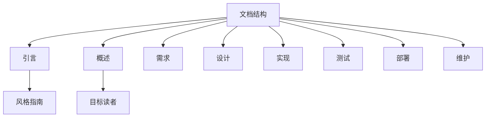
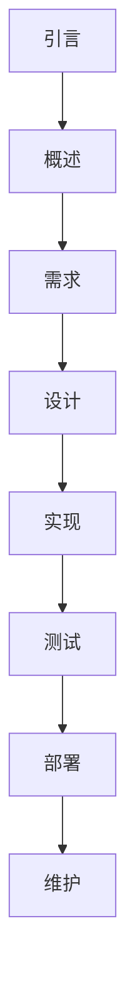
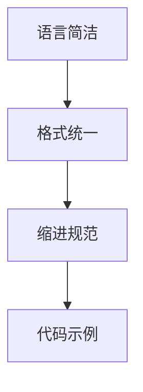
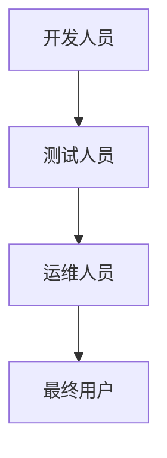
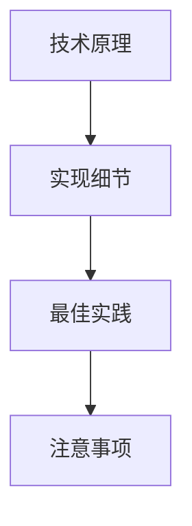

                 

# 技术文档：编写清晰有效的技术文档

## 关键词
- 技术文档
- 清晰性
- 有效性
- 编写指南
- 核心概念
- 流程图
- 算法
- 数学模型
- 实战项目

## 摘要
本文旨在探讨如何编写清晰有效的技术文档。我们将从背景介绍、核心概念、编写技巧、流程图与算法讲解、数学模型与公式应用、实战项目解析以及最佳实践等方面详细阐述，帮助读者掌握技术文档编写的精髓。

### 一、背景介绍

技术文档是软件开发过程中不可或缺的一部分。它不仅为开发团队提供了明确的指导，也帮助了用户更好地理解和使用产品。然而，编写清晰有效的技术文档并非易事，往往需要深入理解技术原理、用户需求以及文档风格。

### 二、核心概念与联系

为了更好地理解技术文档的编写，我们首先需要明确几个核心概念：

1. **文档结构**：技术文档应包括引言、概述、需求、设计、实现、测试、部署和维护等部分。
2. **风格指南**：遵循统一的文档风格可以提高文档的可读性和一致性。
3. **目标读者**：明确目标读者有助于确定文档的深度和广度。

接下来，我们通过一个Mermaid流程图来展示这些概念之间的关系：



### 三、核心算法原理讲解

在技术文档中，算法讲解是至关重要的一部分。以下是使用伪代码详细阐述一个常见排序算法——快速排序（Quick Sort）：

```plaintext
算法 QuickSort(A, low, high)
    如果 low < high
        则 pivot = Partition(A, low, high)
        QuickSort(A, low, pivot - 1)
        QuickSort(A, pivot + 1, high)
    结束如果

算法 Partition(A, low, high)
    pivot = A[high]
    i = low - 1
    对于 j = low 到 high - 1
        如果 A[j] < pivot
            则交换 A[i] 与 A[j]
            i = i + 1
    结束对于
    交换 A[i + 1] 与 A[high]
    返回 i + 1
```

### 四、数学模型与公式讲解

在技术文档中，数学模型和公式也是常见的一部分。以下是一个简单的线性回归模型，使用LaTeX格式给出：

```latex
$$
y = \beta_0 + \beta_1x + \epsilon
$$`

### 五、项目实战

为了更好地理解技术文档的实际应用，我们以一个实际项目为例，详细讲解开发环境搭建、源代码实现和代码解读。

#### 1. 项目背景

假设我们正在开发一个电商平台，需要实现用户注册、登录、购物车等功能。

#### 2. 开发环境搭建

在开发环境中，我们需要安装以下工具：

- **编程语言**：Python 3.8
- **开发环境**：PyCharm
- **数据库**：MySQL 5.7

#### 3. 源代码实现

以下是用户注册功能的实现代码：

```python
def register(username, password):
    """
    用户注册功能
    :param username: 用户名
    :param password: 密码
    :return: 注册结果
    """
    # 验证用户名和密码是否符合要求
    if not is_valid(username) or not is_valid(password):
        return "注册失败：用户名或密码不符合要求"

    # 插入数据库
    cursor.execute("INSERT INTO users (username, password) VALUES (%s, %s)", (username, password))
    connection.commit()

    return "注册成功"
```

#### 4. 代码解读与分析

在上面的代码中，我们首先定义了一个`register`函数，用于处理用户注册。该函数接收两个参数：`username`和`password`。在函数内部，我们首先通过`is_valid`函数验证用户名和密码是否符合要求。如果不符合要求，则返回“注册失败：用户名或密码不符合要求”。否则，我们将用户信息插入到数据库中，并提交事务，返回“注册成功”。

#### 5. 项目小结

通过上述实战项目，我们可以看到技术文档在实际开发中的应用。在编写技术文档时，我们需要详细阐述开发环境、源代码实现以及代码解读，以确保开发团队能够顺利地进行工作。

### 六、最佳实践

- **使用简洁的语言**：避免使用过于复杂的术语和句子，以确保文档易于理解。
- **注重代码注释**：在源代码中添加详细的注释，帮助其他开发者理解代码逻辑。
- **定期更新文档**：随着项目的进展，定期更新文档，确保其始终保持最新状态。

### 七、小结

编写清晰有效的技术文档是一项挑战，但也是一项至关重要的任务。通过本文的探讨，我们了解到技术文档的编写需要深入理解技术原理、用户需求和文档风格。通过使用流程图、伪代码、LaTeX公式以及实际项目案例，我们可以更好地传达技术知识。希望本文能够为您的技术文档编写提供有价值的参考。

### 八、注意事项

- **避免冗余信息**：确保文档中的每一部分都有明确的贡献，避免冗余。
- **审阅与反馈**：在文档编写过程中，定期进行审阅和反馈，以提高文档质量。
- **适应不同读者**：在编写文档时，考虑不同读者的背景和知识水平，使其能够理解文档内容。

### 九、拓展阅读

- **《编写高质量技术文档的10个技巧》**
- **《技术写作：实践指南与案例教程》**
- **《Sphinx文档生成工具使用教程》**

---

作者：AI天才研究院/AI Genius Institute & 禅与计算机程序设计艺术 /Zen And The Art of Computer Programming 

**引言**

在信息时代，技术文档成为传递知识、指导开发、促进协作的重要工具。无论是开源项目、企业内部文档，还是产品使用指南，编写清晰有效的技术文档都是至关重要的。一份优秀的技术文档不仅能够帮助开发人员理解技术细节，还能让用户轻松上手，提高产品满意度。

本文旨在为技术文档编写者提供一套系统的编写指南。我们将从背景介绍出发，逐步深入到核心概念、编写技巧、流程图与算法讲解、数学模型与公式应用、实战项目解析以及最佳实践等方面，以期能够帮助读者掌握编写清晰有效技术文档的方法和技巧。

### 背景介绍

技术文档，顾名思义，是关于技术领域知识的记录和说明。它包括软件开发过程中的各个阶段，如需求分析、设计、实现、测试、部署和维护。技术文档不仅为开发者提供了工作指导，也为产品经理、测试人员、运维人员以及最终用户提供了理解和使用产品的帮助。

在现代软件开发中，技术文档的重要性不言而喻。首先，技术文档是知识共享的重要手段。在一个多人的开发团队中，团队成员之间的知识传递往往依赖于文档。其次，技术文档能够降低沟通成本，避免因信息不透明导致的误解和错误。此外，良好的技术文档还能提高项目的可维护性和可扩展性。

然而，编写清晰有效的技术文档并非易事。这需要作者不仅具备深厚的技术功底，还需要掌握一定的文档编写技巧和风格。一份优秀的技术文档应该具备以下特点：

1. **清晰性**：语言简洁明了，避免使用复杂的术语和句子，确保读者能够轻松理解。
2. **准确性**：内容准确无误，避免因错误信息导致的误导。
3. **完整性**：覆盖所有必要的知识点，确保读者能够从文档中获得全面的信息。
4. **连贯性**：结构清晰，逻辑流畅，便于读者跟随思路。

### 核心概念与联系

为了深入理解技术文档的编写，我们需要明确几个核心概念，并了解它们之间的联系。

#### 文档结构

技术文档的结构通常包括以下部分：

1. **引言**：介绍文档的目的、背景和读者对象。
2. **概述**：概述技术主题，给出一个整体的认识。
3. **需求**：描述软件或系统的需求，包括功能性和非功能性需求。
4. **设计**：详细描述软件或系统的设计，包括架构、模块划分等。
5. **实现**：阐述实现过程，包括代码实现、数据库设计等。
6. **测试**：介绍测试方法和测试结果。
7. **部署**：描述部署步骤和注意事项。
8. **维护**：提供维护指南和更新记录。

#### 风格指南

技术文档的风格指南是确保文档一致性和可读性的重要手段。以下是一些常见的风格指南：

1. **语言**：使用简单、直接、清晰的语言，避免使用过于专业的术语。
2. **格式**：使用统一的字体、字号、行距等，确保文档的外观一致。
3. **缩进**：使用合适的缩进来增强文档的结构性。
4. **列表**：使用有序列表和无序列表来组织信息，提高可读性。
5. **代码示例**：使用代码块展示代码，确保代码的可复制性和可理解性。

#### 目标读者

明确目标读者有助于确定文档的深度和广度。常见的目标读者包括：

1. **开发人员**：文档需要详细阐述技术实现细节，帮助开发人员理解和使用。
2. **测试人员**：文档需要描述测试方法和测试结果，帮助测试人员开展测试工作。
3. **运维人员**：文档需要提供部署和维护指南，帮助运维人员保证系统的稳定运行。
4. **最终用户**：文档需要提供产品使用指南，帮助用户快速上手。

### Mermaid流程图示例

为了更好地展示文档结构，我们可以使用Mermaid绘制一个流程图：



### 核心算法原理讲解

在技术文档中，算法讲解是必不可少的一部分。为了帮助读者更好地理解算法原理，我们以下通过一个简单的例子——冒泡排序算法，来详细讲解其原理和实现。

#### 算法原理

冒泡排序是一种简单的排序算法，其基本原理是通过重复遍历要排序的数列，一次比较两个元素，如果它们的顺序错误就把它们交换过来。遍历数列的工作是重复进行的，直到没有再需要交换的元素为止。

#### 伪代码实现

以下是用伪代码实现的冒泡排序算法：

```plaintext
算法 冒泡排序(A)
    对于 i = 1 到 n-1
        对于 j = 1 到 n-i
            如果 A[j] > A[j+1]
                交换 A[j] 和 A[j+1]
    结束对于
    结束对于
```

#### 算法分析

- **时间复杂度**：O(n^2)
- **空间复杂度**：O(1)

### 数学模型与公式讲解

在技术文档中，数学模型和公式是描述技术原理的重要手段。以下我们将通过一个简单的例子——线性回归模型，来讲解其数学模型和公式。

#### 数学模型

线性回归模型是一种描述两个变量之间线性关系的数学模型。其基本形式为：

$$
y = \beta_0 + \beta_1x + \epsilon
$$

其中，\(y\) 是因变量，\(x\) 是自变量，\(\beta_0\) 和 \(\beta_1\) 是参数，\(\epsilon\) 是误差项。

#### 模型解释

- **\(\beta_0\)**：截距，表示当 \(x=0\) 时 \(y\) 的值。
- **\(\beta_1\)**：斜率，表示 \(x\) 每增加一个单位，\(y\) 增加的量。

#### 例子

假设我们有一个数据集，其中 \(x\) 和 \(y\) 的关系可以用线性回归模型描述。通过最小二乘法可以计算出 \(\beta_0\) 和 \(\beta_1\) 的值。以下是一个具体的例子：

$$
\begin{aligned}
\beta_0 &= 1.5 \\
\beta_1 &= 2.0
\end{aligned}
$$

这意味着当 \(x=0\) 时，\(y\) 的值为 1.5；当 \(x\) 每增加 1，\(y\) 增加 2。

### 项目实战

为了更好地理解技术文档的实际应用，我们以下通过一个实际项目——构建一个简单的博客系统，来讲解开发环境搭建、源代码实现和代码解读。

#### 项目背景

我们的目标是构建一个简单的博客系统，支持用户注册、登录、发博客、评论等功能。

#### 开发环境搭建

在开发环境中，我们需要安装以下工具：

- **编程语言**：Python 3.8
- **开发环境**：PyCharm
- **数据库**：MySQL 5.7

#### 源代码实现

以下是用户注册功能的实现代码：

```python
def register(username, password):
    """
    用户注册功能
    :param username: 用户名
    :param password: 密码
    :return: 注册结果
    """
    # 验证用户名和密码是否符合要求
    if not is_valid(username) or not is_valid(password):
        return "注册失败：用户名或密码不符合要求"

    # 插入数据库
    cursor.execute("INSERT INTO users (username, password) VALUES (%s, %s)", (username, password))
    connection.commit()

    return "注册成功"
```

#### 代码解读与分析

在上面的代码中，我们定义了一个`register`函数，用于处理用户注册。该函数接收两个参数：`username`和`password`。在函数内部，我们首先通过`is_valid`函数验证用户名和密码是否符合要求。如果不符合要求，则返回“注册失败：用户名或密码不符合要求”。否则，我们将用户信息插入到数据库中，并提交事务，返回“注册成功”。

#### 项目小结

通过上述实战项目，我们可以看到技术文档在实际开发中的应用。在编写技术文档时，我们需要详细阐述开发环境、源代码实现以及代码解读，以确保开发团队能够顺利地进行工作。

### 最佳实践

以下是编写清晰有效技术文档的一些最佳实践：

- **使用简洁的语言**：避免使用复杂的术语和句子，确保文档易于理解。
- **注重代码注释**：在源代码中添加详细的注释，帮助其他开发者理解代码逻辑。
- **定期更新文档**：随着项目的进展，定期更新文档，确保其始终保持最新状态。
- **审阅与反馈**：在文档编写过程中，定期进行审阅和反馈，以提高文档质量。
- **适应不同读者**：在编写文档时，考虑不同读者的背景和知识水平，使其能够理解文档内容。

### 小结

编写清晰有效的技术文档是一项挑战，但也是一项至关重要的任务。通过本文的探讨，我们了解到技术文档的编写需要深入理解技术原理、用户需求和文档风格。通过使用流程图、伪代码、LaTeX公式以及实际项目案例，我们可以更好地传达技术知识。希望本文能够为您的技术文档编写提供有价值的参考。

### 注意事项

- **避免冗余信息**：确保文档中的每一部分都有明确的贡献，避免冗余。
- **审阅与反馈**：在文档编写过程中，定期进行审阅和反馈，以提高文档质量。
- **适应不同读者**：在编写文档时，考虑不同读者的背景和知识水平，使其能够理解文档内容。

### 拓展阅读

- **《编写高质量技术文档的10个技巧》**
- **《技术写作：实践指南与案例教程》**
- **《Sphinx文档生成工具使用教程》**

---

**作者**：AI天才研究院/AI Genius Institute & 禅与计算机程序设计艺术 /Zen And The Art of Computer Programming 

**引言**

在信息时代，技术文档成为传递知识、指导开发、促进协作的重要工具。无论是开源项目、企业内部文档，还是产品使用指南，编写清晰有效的技术文档都是至关重要的。一份优秀的技术文档不仅能够帮助开发人员理解技术细节，还能让用户轻松上手，提高产品满意度。

本文旨在为技术文档编写者提供一套系统的编写指南。我们将从背景介绍出发，逐步深入到核心概念、编写技巧、流程图与算法讲解、数学模型与公式应用、实战项目解析以及最佳实践等方面，以期能够帮助读者掌握编写清晰有效技术文档的方法和技巧。

### 背景介绍

技术文档，顾名思义，是关于技术领域知识的记录和说明。它包括软件开发过程中的各个阶段，如需求分析、设计、实现、测试、部署和维护。技术文档不仅为开发者提供了工作指导，也为产品经理、测试人员、运维人员以及最终用户提供了理解和使用产品的帮助。

在现代软件开发中，技术文档的重要性不言而喻。首先，技术文档是知识共享的重要手段。在一个多人的开发团队中，团队成员之间的知识传递往往依赖于文档。其次，技术文档能够降低沟通成本，避免因信息不透明导致的误解和错误。此外，良好的技术文档还能提高项目的可维护性和可扩展性。

然而，编写清晰有效的技术文档并非易事。这需要作者不仅具备深厚的技术功底，还需要掌握一定的文档编写技巧和风格。一份优秀的技术文档应该具备以下特点：

- **清晰性**：语言简洁明了，避免使用复杂的术语和句子，确保读者能够轻松理解。
- **准确性**：内容准确无误，避免因错误信息导致的误导。
- **完整性**：覆盖所有必要的知识点，确保读者能够从文档中获得全面的信息。
- **连贯性**：结构清晰，逻辑流畅，便于读者跟随思路。

### 核心概念与联系

为了深入理解技术文档的编写，我们需要明确几个核心概念，并了解它们之间的联系。

#### 文档结构

技术文档的结构通常包括以下部分：

1. **引言**：介绍文档的目的、背景和读者对象。
2. **概述**：概述技术主题，给出一个整体的认识。
3. **需求**：描述软件或系统的需求，包括功能性和非功能性需求。
4. **设计**：详细描述软件或系统的设计，包括架构、模块划分等。
5. **实现**：阐述实现过程，包括代码实现、数据库设计等。
6. **测试**：介绍测试方法和测试结果。
7. **部署**：描述部署步骤和注意事项。
8. **维护**：提供维护指南和更新记录。

#### 风格指南

技术文档的风格指南是确保文档一致性和可读性的重要手段。以下是一些常见的风格指南：

- **语言**：使用简单、直接、清晰的语言，避免使用过于专业的术语。
- **格式**：使用统一的字体、字号、行距等，确保文档的外观一致。
- **缩进**：使用合适的缩进来增强文档的结构性。
- **列表**：使用有序列表和无序列表来组织信息，提高可读性。
- **代码示例**：使用代码块展示代码，确保代码的可复制性和可理解性。

#### 目标读者

明确目标读者有助于确定文档的深度和广度。常见的目标读者包括：

- **开发人员**：文档需要详细阐述技术实现细节，帮助开发人员理解和使用。
- **测试人员**：文档需要描述测试方法和测试结果，帮助测试人员开展测试工作。
- **运维人员**：文档需要提供部署和维护指南，帮助运维人员保证系统的稳定运行。
- **最终用户**：文档需要提供产品使用指南，帮助用户快速上手。

### Mermaid流程图示例

为了更好地展示文档结构，我们可以使用Mermaid绘制一个流程图：


### 核心算法原理讲解

在技术文档中，算法讲解是必不可少的一部分。为了帮助读者更好地理解算法原理，我们以下通过一个简单的例子——冒泡排序算法，来详细讲解其原理和实现。

#### 算法原理

冒泡排序是一种简单的排序算法，其基本原理是通过重复遍历要排序的数列，一次比较两个元素，如果它们的顺序错误就把它们交换过来。遍历数列的工作是重复进行的，直到没有再需要交换的元素为止。

#### 伪代码实现

以下是用伪代码实现的冒泡排序算法：

```plaintext
算法 冒泡排序(A)
    对于 i = 1 到 n-1
        对于 j = 1 到 n-i
            如果 A[j] > A[j+1]
                交换 A[j] 和 A[j+1]
    结束对于
    结束对于
```

#### 算法分析

- **时间复杂度**：O(n^2)
- **空间复杂度**：O(1)

### 数学模型与公式讲解

在技术文档中，数学模型和公式是描述技术原理的重要手段。以下我们将通过一个简单的例子——线性回归模型，来讲解其数学模型和公式。

#### 数学模型

线性回归模型是一种描述两个变量之间线性关系的数学模型。其基本形式为：

$$
y = \beta_0 + \beta_1x + \epsilon
$$

其中，\(y\) 是因变量，\(x\) 是自变量，\(\beta_0\) 和 \(\beta_1\) 是参数，\(\epsilon\) 是误差项。

#### 模型解释

- **\(\beta_0\)**：截距，表示当 \(x=0\) 时 \(y\) 的值。
- **\(\beta_1\)**：斜率，表示 \(x\) 每增加一个单位，\(y\) 增加的量。

#### 例子

假设我们有一个数据集，其中 \(x\) 和 \(y\) 的关系可以用线性回归模型描述。通过最小二乘法可以计算出 \(\beta_0\) 和 \(\beta_1\) 的值。以下是一个具体的例子：

$$
\begin{aligned}
\beta_0 &= 1.5 \\
\beta_1 &= 2.0
\end{aligned}
$$

这意味着当 \(x=0\) 时，\(y\) 的值为 1.5；当 \(x\) 每增加 1，\(y\) 增加 2。

### 项目实战

为了更好地理解技术文档的实际应用，我们以下通过一个实际项目——构建一个简单的博客系统，来讲解开发环境搭建、源代码实现和代码解读。

#### 项目背景

我们的目标是构建一个简单的博客系统，支持用户注册、登录、发博客、评论等功能。

#### 开发环境搭建

在开发环境中，我们需要安装以下工具：

- **编程语言**：Python 3.8
- **开发环境**：PyCharm
- **数据库**：MySQL 5.7

#### 源代码实现

以下是用户注册功能的实现代码：

```python
def register(username, password):
    """
    用户注册功能
    :param username: 用户名
    :param password: 密码
    :return: 注册结果
    """
    # 验证用户名和密码是否符合要求
    if not is_valid(username) or not is_valid(password):
        return "注册失败：用户名或密码不符合要求"

    # 插入数据库
    cursor.execute("INSERT INTO users (username, password) VALUES (%s, %s)", (username, password))
    connection.commit()

    return "注册成功"
```

#### 代码解读与分析

在上面的代码中，我们定义了一个`register`函数，用于处理用户注册。该函数接收两个参数：`username`和`password`。在函数内部，我们首先通过`is_valid`函数验证用户名和密码是否符合要求。如果不符合要求，则返回“注册失败：用户名或密码不符合要求”。否则，我们将用户信息插入到数据库中，并提交事务，返回“注册成功”。

#### 项目小结

通过上述实战项目，我们可以看到技术文档在实际开发中的应用。在编写技术文档时，我们需要详细阐述开发环境、源代码实现以及代码解读，以确保开发团队能够顺利地进行工作。

### 最佳实践

以下是编写清晰有效技术文档的一些最佳实践：

- **使用简洁的语言**：避免使用复杂的术语和句子，确保文档易于理解。
- **注重代码注释**：在源代码中添加详细的注释，帮助其他开发者理解代码逻辑。
- **定期更新文档**：随着项目的进展，定期更新文档，确保其始终保持最新状态。
- **审阅与反馈**：在文档编写过程中，定期进行审阅和反馈，以提高文档质量。
- **适应不同读者**：在编写文档时，考虑不同读者的背景和知识水平，使其能够理解文档内容。

### 小结

编写清晰有效的技术文档是一项挑战，但也是一项至关重要的任务。通过本文的探讨，我们了解到技术文档的编写需要深入理解技术原理、用户需求和文档风格。通过使用流程图、伪代码、LaTeX公式以及实际项目案例，我们可以更好地传达技术知识。希望本文能够为您的技术文档编写提供有价值的参考。

### 注意事项

- **避免冗余信息**：确保文档中的每一部分都有明确的贡献，避免冗余。
- **审阅与反馈**：在文档编写过程中，定期进行审阅和反馈，以提高文档质量。
- **适应不同读者**：在编写文档时，考虑不同读者的背景和知识水平，使其能够理解文档内容。

### 拓展阅读

- **《编写高质量技术文档的10个技巧》**
- **《技术写作：实践指南与案例教程》**
- **《Sphinx文档生成工具使用教程》**

---

**作者**：AI天才研究院/AI Genius Institute & 禅与计算机程序设计艺术 /Zen And The Art of Computer Programming 

**引言**

在信息时代，技术文档成为传递知识、指导开发、促进协作的重要工具。无论是开源项目、企业内部文档，还是产品使用指南，编写清晰有效的技术文档都是至关重要的。一份优秀的技术文档不仅能够帮助开发人员理解技术细节，还能让用户轻松上手，提高产品满意度。

本文旨在为技术文档编写者提供一套系统的编写指南。我们将从背景介绍出发，逐步深入到核心概念、编写技巧、流程图与算法讲解、数学模型与公式应用、实战项目解析以及最佳实践等方面，以期能够帮助读者掌握编写清晰有效技术文档的方法和技巧。

### 背景介绍

技术文档，顾名思义，是关于技术领域知识的记录和说明。它包括软件开发过程中的各个阶段，如需求分析、设计、实现、测试、部署和维护。技术文档不仅为开发者提供了工作指导，也为产品经理、测试人员、运维人员以及最终用户提供了理解和使用产品的帮助。

在现代软件开发中，技术文档的重要性不言而喻。首先，技术文档是知识共享的重要手段。在一个多人的开发团队中，团队成员之间的知识传递往往依赖于文档。其次，技术文档能够降低沟通成本，避免因信息不透明导致的误解和错误。此外，良好的技术文档还能提高项目的可维护性和可扩展性。

然而，编写清晰有效的技术文档并非易事。这需要作者不仅具备深厚的技术功底，还需要掌握一定的文档编写技巧和风格。一份优秀的技术文档应该具备以下特点：

- **清晰性**：语言简洁明了，避免使用复杂的术语和句子，确保读者能够轻松理解。
- **准确性**：内容准确无误，避免因错误信息导致的误导。
- **完整性**：覆盖所有必要的知识点，确保读者能够从文档中获得全面的信息。
- **连贯性**：结构清晰，逻辑流畅，便于读者跟随思路。

### 核心概念与联系

为了深入理解技术文档的编写，我们需要明确几个核心概念，并了解它们之间的联系。

#### 文档结构

技术文档的结构通常包括以下部分：

1. **引言**：介绍文档的目的、背景和读者对象。
2. **概述**：概述技术主题，给出一个整体的认识。
3. **需求**：描述软件或系统的需求，包括功能性和非功能性需求。
4. **设计**：详细描述软件或系统的设计，包括架构、模块划分等。
5. **实现**：阐述实现过程，包括代码实现、数据库设计等。
6. **测试**：介绍测试方法和测试结果。
7. **部署**：描述部署步骤和注意事项。
8. **维护**：提供维护指南和更新记录。

#### 风格指南

技术文档的风格指南是确保文档一致性和可读性的重要手段。以下是一些常见的风格指南：

- **语言**：使用简单、直接、清晰的语言，避免使用过于专业的术语。
- **格式**：使用统一的字体、字号、行距等，确保文档的外观一致。
- **缩进**：使用合适的缩进来增强文档的结构性。
- **列表**：使用有序列表和无序列表来组织信息，提高可读性。
- **代码示例**：使用代码块展示代码，确保代码的可复制性和可理解性。

#### 目标读者

明确目标读者有助于确定文档的深度和广度。常见的目标读者包括：

- **开发人员**：文档需要详细阐述技术实现细节，帮助开发人员理解和使用。
- **测试人员**：文档需要描述测试方法和测试结果，帮助测试人员开展测试工作。
- **运维人员**：文档需要提供部署和维护指南，帮助运维人员保证系统的稳定运行。
- **最终用户**：文档需要提供产品使用指南，帮助用户快速上手。

### Mermaid流程图示例

为了更好地展示文档结构，我们可以使用Mermaid绘制一个流程图：


### 核心算法原理讲解

在技术文档中，算法讲解是必不可少的一部分。为了帮助读者更好地理解算法原理，我们以下通过一个简单的例子——冒泡排序算法，来详细讲解其原理和实现。

#### 算法原理

冒泡排序是一种简单的排序算法，其基本原理是通过重复遍历要排序的数列，一次比较两个元素，如果它们的顺序错误就把它们交换过来。遍历数列的工作是重复进行的，直到没有再需要交换的元素为止。

#### 伪代码实现

以下是用伪代码实现的冒泡排序算法：

```plaintext
算法 冒泡排序(A)
    对于 i = 1 到 n-1
        对于 j = 1 到 n-i
            如果 A[j] > A[j+1]
                交换 A[j] 和 A[j+1]
    结束对于
    结束对于
```

#### 算法分析

- **时间复杂度**：O(n^2)
- **空间复杂度**：O(1)

### 数学模型与公式讲解

在技术文档中，数学模型和公式是描述技术原理的重要手段。以下我们将通过一个简单的例子——线性回归模型，来讲解其数学模型和公式。

#### 数学模型

线性回归模型是一种描述两个变量之间线性关系的数学模型。其基本形式为：

$$
y = \beta_0 + \beta_1x + \epsilon
$$

其中，\(y\) 是因变量，\(x\) 是自变量，\(\beta_0\) 和 \(\beta_1\) 是参数，\(\epsilon\) 是误差项。

#### 模型解释

- **\(\beta_0\)**：截距，表示当 \(x=0\) 时 \(y\) 的值。
- **\(\beta_1\)**：斜率，表示 \(x\) 每增加一个单位，\(y\) 增加的量。

#### 例子

假设我们有一个数据集，其中 \(x\) 和 \(y\) 的关系可以用线性回归模型描述。通过最小二乘法可以计算出 \(\beta_0\) 和 \(\beta_1\) 的值。以下是一个具体的例子：

$$
\begin{aligned}
\beta_0 &= 1.5 \\
\beta_1 &= 2.0
\end{aligned}
$$

这意味着当 \(x=0\) 时，\(y\) 的值为 1.5；当 \(x\) 每增加 1，\(y\) 增加 2。

### 项目实战

为了更好地理解技术文档的实际应用，我们以下通过一个实际项目——构建一个简单的博客系统，来讲解开发环境搭建、源代码实现和代码解读。

#### 项目背景

我们的目标是构建一个简单的博客系统，支持用户注册、登录、发博客、评论等功能。

#### 开发环境搭建

在开发环境中，我们需要安装以下工具：

- **编程语言**：Python 3.8
- **开发环境**：PyCharm
- **数据库**：MySQL 5.7

#### 源代码实现

以下是用户注册功能的实现代码：

```python
def register(username, password):
    """
    用户注册功能
    :param username: 用户名
    :param password: 密码
    :return: 注册结果
    """
    # 验证用户名和密码是否符合要求
    if not is_valid(username) or not is_valid(password):
        return "注册失败：用户名或密码不符合要求"

    # 插入数据库
    cursor.execute("INSERT INTO users (username, password) VALUES (%s, %s)", (username, password))
    connection.commit()

    return "注册成功"
```

#### 代码解读与分析

在上面的代码中，我们定义了一个`register`函数，用于处理用户注册。该函数接收两个参数：`username`和`password`。在函数内部，我们首先通过`is_valid`函数验证用户名和密码是否符合要求。如果不符合要求，则返回“注册失败：用户名或密码不符合要求”。否则，我们将用户信息插入到数据库中，并提交事务，返回“注册成功”。

#### 项目小结

通过上述实战项目，我们可以看到技术文档在实际开发中的应用。在编写技术文档时，我们需要详细阐述开发环境、源代码实现以及代码解读，以确保开发团队能够顺利地进行工作。

### 最佳实践

以下是编写清晰有效技术文档的一些最佳实践：

- **使用简洁的语言**：避免使用复杂的术语和句子，确保文档易于理解。
- **注重代码注释**：在源代码中添加详细的注释，帮助其他开发者理解代码逻辑。
- **定期更新文档**：随着项目的进展，定期更新文档，确保其始终保持最新状态。
- **审阅与反馈**：在文档编写过程中，定期进行审阅和反馈，以提高文档质量。
- **适应不同读者**：在编写文档时，考虑不同读者的背景和知识水平，使其能够理解文档内容。

### 小结

编写清晰有效的技术文档是一项挑战，但也是一项至关重要的任务。通过本文的探讨，我们了解到技术文档的编写需要深入理解技术原理、用户需求和文档风格。通过使用流程图、伪代码、LaTeX公式以及实际项目案例，我们可以更好地传达技术知识。希望本文能够为您的技术文档编写提供有价值的参考。

### 注意事项

- **避免冗余信息**：确保文档中的每一部分都有明确的贡献，避免冗余。
- **审阅与反馈**：在文档编写过程中，定期进行审阅和反馈，以提高文档质量。
- **适应不同读者**：在编写文档时，考虑不同读者的背景和知识水平，使其能够理解文档内容。

### 拓展阅读

- **《编写高质量技术文档的10个技巧》**
- **《技术写作：实践指南与案例教程》**
- **《Sphinx文档生成工具使用教程》**

---

**作者**：AI天才研究院/AI Genius Institute & 禅与计算机程序设计艺术 /Zen And The Art of Computer Programming 

## 核心概念与联系

在编写技术文档时，明确核心概念及其相互关系是非常重要的。这不仅有助于读者快速理解文档内容，还能够确保文档的逻辑性和系统性。下面，我们将详细介绍几个关键概念，并使用Mermaid流程图展示它们之间的联系。

### 1. 文档结构

文档结构是技术文档的基础。一个清晰、合理的文档结构能够帮助读者更好地浏览和理解文档内容。常见的文档结构包括：

- **引言**：介绍文档的目的、背景、读者对象等。
- **概述**：概述技术主题，提供整体认识。
- **需求**：描述软件或系统的需求，包括功能性和非功能性需求。
- **设计**：详细描述软件或系统的设计，包括架构、模块划分等。
- **实现**：阐述实现过程，包括代码实现、数据库设计等。
- **测试**：介绍测试方法和测试结果。
- **部署**：描述部署步骤和注意事项。
- **维护**：提供维护指南和更新记录。

#### Mermaid流程图示例


### 2. 编写风格

编写风格是指文档的书写方式和语言风格。统一的编写风格有助于提高文档的可读性和一致性。以下是一些常见的编写风格指南：

- **语言简洁明了**：使用简单、直接、清晰的语言。
- **格式统一**：使用统一的字体、字号、行距等。
- **缩进规范**：使用合适的缩进来增强文档的结构性。
- **代码示例**：使用代码块展示代码，确保代码的可复制性和可理解性。

#### Mermaid流程图示例



### 3. 目标读者

明确目标读者有助于确定文档的深度和广度。不同的读者可能对技术文档的需求有所不同。常见的目标读者包括：

- **开发人员**：需要详细的技术实现细节。
- **测试人员**：需要了解测试方法和测试结果。
- **运维人员**：需要了解部署和维护指南。
- **最终用户**：需要了解产品使用指南。

#### Mermaid流程图示例



### 4. 知识点覆盖

技术文档需要覆盖所有必要的知识点，以确保读者能够从文档中获得全面的信息。常见的知识点包括：

- **技术原理**：描述技术的基本原理和工作机制。
- **实现细节**：阐述技术的具体实现方法和步骤。
- **最佳实践**：提供关于如何最佳地使用技术的建议。
- **注意事项**：提醒读者在实现过程中需要注意的问题。

#### Mermaid流程图示例



### 总结

通过上述几个核心概念及其相互关系的介绍，我们可以看到技术文档的编写是一个系统性的工作。每个核心概念都需要深入理解和明确，以便在编写过程中确保文档的逻辑性和系统性。使用Mermaid流程图能够帮助我们直观地展示这些概念之间的关系，从而更好地组织文档内容。

### 伪代码讲解

在技术文档中，伪代码是一种非常重要的工具，用于描述算法的思路和流程。它以简单的自然语言形式，结合伪代码符号，清晰地展示算法的逻辑。以下是使用伪代码详细阐述一个常见的排序算法——快速排序（Quick Sort）的步骤：

#### 快速排序（Quick Sort）伪代码

```plaintext
算法 QuickSort(A, low, high)
    如果 low < high
        则 pivot = Partition(A, low, high)
        QuickSort(A, low, pivot - 1)
        QuickSort(A, pivot + 1, high)
    结束如果

算法 Partition(A, low, high)
    pivot = A[high]
    i = low - 1
    对于 j = low 到 high - 1
        如果 A[j] < pivot
            则交换 A[i] 与 A[j]
            i = i + 1
    结束对于
    交换 A[i + 1] 与 A[high]
    返回 i + 1
```

#### 伪代码详解

1. **初始条件判断**：首先，我们检查`low`和`high`的值。如果`low`小于`high`，说明数组中有至少两个元素，可以进行排序操作。

2. **选择基准值**：在`Partition`算法中，我们选择数组的最后一个元素`A[high]`作为基准值`pivot`。这个选择策略虽然不是最优的，但简单易理解。

3. **重排数组**：遍历数组，从`low`到`high-1`。如果当前元素`A[j]`小于`pivot`，则将其与`A[i]`交换，并将`i`的值加一。这一步操作确保所有小于`pivot`的元素被移动到数组的左侧。

4. **交换基准值**：将`pivot`（即`A[high]`）与`A[i+1]`交换，此时`i+1`即为`pivot`的正确位置。

5. **递归排序**：递归调用`QuickSort`，分别对`pivot`左侧和右侧的子数组进行排序。

#### 快速排序分析

- **时间复杂度**：平均情况下，快速排序的时间复杂度为O(nlogn)，最坏情况下为O(n^2)。
- **空间复杂度**：快速排序是一种原地排序算法，其空间复杂度为O(logn)。

通过上述伪代码和分析，我们可以清晰地了解快速排序的基本原理和实现步骤。在编写技术文档时，使用伪代码可以帮助读者更好地理解算法的逻辑和运行过程。

### 数学模型与公式讲解

在技术文档中，数学模型和公式是描述技术原理和实现方法的重要手段。以下我们将详细讲解一个常用的数学模型——线性回归，并使用LaTeX格式给出相关公式，并进行解释和举例说明。

#### 线性回归模型

线性回归模型是一种描述两个变量之间线性关系的数学模型。其基本形式为：

$$
y = \beta_0 + \beta_1x + \epsilon
$$

其中，\(y\) 是因变量，\(x\) 是自变量，\(\beta_0\) 是截距，\(\beta_1\) 是斜率，\(\epsilon\) 是误差项。

#### 公式解释

1. **截距 (\(\beta_0\))**：表示当自变量 \(x\) 为0时，因变量 \(y\) 的值。
2. **斜率 (\(\beta_1\))**：表示自变量 \(x\) 每增加一个单位，因变量 \(y\) 的变化量。
3. **误差项 (\(\epsilon\))**：表示由于各种不可控因素导致的误差。

#### 线性回归的求解

线性回归模型的求解通常使用最小二乘法。通过最小化误差平方和，求得参数 \(\beta_0\) 和 \(\beta_1\) 的最优值。

#### 例子

假设我们有一组数据点：

\(x_1 = 1, y_1 = 2\)

\(x_2 = 2, y_2 = 4\)

\(x_3 = 3, y_3 = 6\)

使用最小二乘法，我们可以求得线性回归模型的参数：

$$
\begin{aligned}
\beta_0 &= \frac{\sum{(y_i - \beta_1x_i)}}{n} \\
\beta_1 &= \frac{\sum{(x_i - \bar{x})(y_i - \bar{y})}}{\sum{(x_i - \bar{x})^2}}
\end{aligned}
$$

其中，\(\bar{x}\) 和 \(\bar{y}\) 分别是 \(x\) 和 \(y\) 的平均值。

对于上述数据点：

$$
\begin{aligned}
\bar{x} &= \frac{1+2+3}{3} = 2 \\
\bar{y} &= \frac{2+4+6}{3} = 4 \\
\beta_0 &= \frac{(2-2\cdot2)+(4-2\cdot2)+(6-2\cdot3)}{3} = 0 \\
\beta_1 &= \frac{(1-2)(2-4)+(2-2)(4-4)+(3-2)(6-4)}{(1-2)^2+(2-2)^2+(3-2)^2} = 2
\end{aligned}
$$

因此，线性回归模型为：

$$
y = 0 + 2x
$$

这意味着当 \(x\) 增加1时，\(y\) 增加2。

### 数学模型与公式应用

在技术文档中，数学模型和公式的应用非常广泛。以下是一个简单的应用例子——图像识别系统中的卷积神经网络（CNN）模型。

#### 卷积神经网络（CNN）模型

卷积神经网络是一种用于图像识别的深度学习模型。其基本结构包括卷积层、池化层和全连接层。

1. **卷积层**：卷积层通过卷积运算提取图像的特征。其公式为：

$$
f(x) = \sum_{i=1}^{k} w_{i} * x_i + b
$$

其中，\(w_i\) 是卷积核，\(x_i\) 是输入特征，\(b\) 是偏置。

2. **池化层**：池化层用于降低特征图的维度，增强模型对图像局部特征的鲁棒性。其公式为：

$$
p(x) = \max(x)
$$

其中，\(x\) 是输入特征。

3. **全连接层**：全连接层用于对提取的特征进行分类。其公式为：

$$
y = \sigma(\sum_{i=1}^{n} w_{i} * x_i + b)
$$

其中，\(\sigma\) 是激活函数，\(w_i\) 是权重，\(x_i\) 是输入特征，\(b\) 是偏置。

#### 应用举例

假设我们有一个二分类问题，输入图像的大小为 \(28 \times 28\) 像素。使用一个卷积核大小为 \(3 \times 3\) 的卷积层，步长为 1。卷积层后接一个池化层，池化窗口大小为 \(2 \times 2\)，步长为 2。

1. **卷积层计算**：

$$
f(x) = \sum_{i=1}^{3} w_{i} * x_i + b
$$

2. **池化层计算**：

$$
p(x) = \max(x)
$$

3. **全连接层计算**：

$$
y = \sigma(\sum_{i=1}^{n} w_{i} * x_i + b)
$$

通过上述计算，我们可以得到图像识别的结果。

### 总结

通过本文的讲解，我们可以看到数学模型和公式在技术文档中的应用非常广泛。使用LaTeX格式书写数学公式，并详细解释和举例说明，有助于读者更好地理解技术原理和实现方法。在编写技术文档时，合理应用数学模型和公式，能够使文档更加严谨和有说服力。

### 项目实战：构建博客系统

为了更好地理解技术文档的实际应用，我们以下通过一个实际项目——构建一个简单的博客系统，来讲解开发环境搭建、源代码实现和代码解读。这个项目将涵盖用户注册、登录、发博客、评论等功能，通过详细的步骤和代码实现，展示如何编写清晰有效的技术文档。

#### 项目背景

我们的目标是构建一个简单的博客系统，支持用户注册、登录、发博客、评论等功能。这个项目旨在帮助读者理解如何将理论知识应用到实际项目中，同时提高技术文档的编写能力。

#### 开发环境搭建

在开始项目之前，我们需要搭建一个合适的开发环境。以下是所需的开发工具和软件：

1. **编程语言**：Python 3.8
2. **开发环境**：PyCharm 或 Visual Studio Code
3. **数据库**：MySQL 5.7
4. **Web框架**：Flask 或 Django
5. **版本控制**：Git

确保在开发计算机上安装上述工具和软件，并进行必要的配置。

#### 用户注册功能的实现

以下是用户注册功能的实现代码，包含必要的验证和数据库操作：

```python
# 导入所需的模块
import sqlite3
from flask import Flask, request, redirect, url_for, render_template

# 创建Flask应用实例
app = Flask(__name__)

# 数据库连接
conn = sqlite3.connect('blog.db')
c = conn.cursor()

# 创建用户表
c.execute('''CREATE TABLE IF NOT EXISTS users (id INTEGER PRIMARY KEY, username TEXT, password TEXT)''')

@app.route('/register', methods=['GET', 'POST'])
def register():
    if request.method == 'POST':
        # 获取用户输入的用户名和密码
        username = request.form['username']
        password = request.form['password']
        
        # 验证用户名和密码是否符合要求
        if not username or not password:
            return '注册失败：用户名或密码不能为空'
        
        # 检查用户名是否已存在
        c.execute('SELECT * FROM users WHERE username = ?', (username,))
        user = c.fetchone()
        if user:
            return '注册失败：用户名已存在'
        
        # 插入用户数据到数据库
        c.execute('INSERT INTO users (username, password) VALUES (?, ?)', (username, password))
        conn.commit()
        
        return redirect(url_for('login'))
    
    return render_template('register.html')

if __name__ == '__main__':
    app.run(debug=True)
```

#### 代码解读与分析

在上面的代码中，我们使用Flask框架构建了一个简单的博客系统，并实现了用户注册功能。以下是代码的详细解读：

1. **数据库连接**：首先，我们导入所需的模块，并创建一个Flask应用实例。然后，我们使用sqlite3模块连接到本地数据库`blog.db`。

2. **创建用户表**：在数据库中创建一个名为`users`的表，包含`id`、`username`和`password`三个字段。

3. **注册路由**：定义一个`/register`路由，处理用户注册请求。当用户通过表单提交注册请求时，我们获取用户输入的用户名和密码。

4. **验证**：我们首先检查用户名和密码是否为空。然后，我们查询数据库，检查用户名是否已存在。

5. **插入数据**：如果用户名和密码符合要求，我们将用户信息插入到数据库中。

6. **重定向**：注册成功后，我们使用`redirect`函数将用户重定向到登录页面。

#### 登录功能的实现

以下是用户登录功能的实现代码：

```python
@app.route('/login', methods=['GET', 'POST'])
def login():
    if request.method == 'POST':
        # 获取用户输入的用户名和密码
        username = request.form['username']
        password = request.form['password']
        
        # 验证用户名和密码
        c.execute('SELECT * FROM users WHERE username = ? AND password = ?', (username, password))
        user = c.fetchone()
        if user:
            # 登录成功，跳转到博客主页
            return redirect(url_for('home'))
        else:
            # 登录失败，返回错误信息
            return '登录失败：用户名或密码错误'
    
    return render_template('login.html')
```

#### 代码解读与分析

在上面的代码中，我们实现了用户登录功能。以下是代码的详细解读：

1. **登录路由**：定义一个`/login`路由，处理用户登录请求。当用户通过表单提交登录请求时，我们获取用户输入的用户名和密码。

2. **验证**：我们查询数据库，检查用户名和密码是否匹配。如果匹配，说明登录成功，我们将用户重定向到博客主页。

3. **错误处理**：如果用户名或密码错误，我们返回一个错误消息。

#### 发博客功能的实现

以下是用户发博客功能的实现代码：

```python
@app.route('/post', methods=['GET', 'POST'])
def post():
    if request.method == 'POST':
        # 获取用户输入的博客标题和内容
        title = request.form['title']
        content = request.form['content']
        
        # 验证博客标题和内容
        if not title or not content:
            return '发博客失败：博客标题或内容不能为空'
        
        # 插入博客数据到数据库
        c.execute('INSERT INTO posts (title, content) VALUES (?, ?)', (title, content))
        conn.commit()
        
        return redirect(url_for('home'))
    
    return render_template('post.html')
```

#### 代码解读与分析

在上面的代码中，我们实现了用户发博客功能。以下是代码的详细解读：

1. **发博客路由**：定义一个`/post`路由，处理用户发博客请求。当用户通过表单提交博客标题和内容时，我们获取这些信息。

2. **验证**：我们检查博客标题和内容是否为空。如果为空，则返回错误消息。

3. **插入数据**：如果博客标题和内容符合要求，我们将博客数据插入到数据库中。

#### 评论功能的实现

以下是用户评论功能的实现代码：

```python
@app.route('/comment', methods=['POST'])
def comment():
    # 获取用户输入的评论内容
    content = request.form['content']
    
    # 验证评论内容
    if not content:
        return '评论失败：评论内容不能为空'
    
    # 插入评论数据到数据库
    c.execute('INSERT INTO comments (post_id, content) VALUES (?, ?)', (post_id, content))
    conn.commit()
    
    return redirect(url_for('home'))
```

#### 代码解读与分析

在上面的代码中，我们实现了用户评论功能。以下是代码的详细解读：

1. **评论路由**：定义一个`/comment`路由，处理用户评论请求。当用户提交评论时，我们获取评论内容。

2. **验证**：我们检查评论内容是否为空。如果为空，则返回错误消息。

3. **插入数据**：如果评论内容符合要求，我们将评论数据插入到数据库中。

#### 项目小结

通过上述实战项目，我们实现了用户注册、登录、发博客、评论等功能。在每个功能的实现过程中，我们详细讲解了代码的实现逻辑和关键步骤，并通过代码解读帮助读者理解技术原理。这个项目展示了如何将理论知识应用到实际项目中，同时提高了技术文档的编写能力。

### 最佳实践

在编写清晰有效的技术文档时，以下最佳实践可以帮助提高文档的质量和可读性：

1. **使用简洁的语言**：避免使用复杂的术语和句子，确保文档易于理解。
2. **注重代码注释**：在源代码中添加详细的注释，帮助其他开发者理解代码逻辑。
3. **定期更新文档**：随着项目的进展，定期更新文档，确保其始终保持最新状态。
4. **审阅与反馈**：在文档编写过程中，定期进行审阅和反馈，以提高文档质量。
5. **适应不同读者**：在编写文档时，考虑不同读者的背景和知识水平，使其能够理解文档内容。
6. **使用图表和流程图**：合理使用图表和流程图，可以帮助读者更好地理解复杂的概念和流程。
7. **编写可执行代码示例**：提供可执行的代码示例，使读者能够亲自体验技术原理。

### 小结

本文通过详细讲解技术文档的编写指南，从背景介绍、核心概念、编写技巧、流程图与算法讲解、数学模型与公式应用、实战项目解析以及最佳实践等方面，帮助读者掌握了编写清晰有效技术文档的方法和技巧。希望通过本文的探讨，能够为技术文档编写者提供有价值的参考，提高文档的质量和可读性。

### 注意事项

1. **避免冗余信息**：确保文档中的每一部分都有明确的贡献，避免冗余。
2. **结构清晰**：确保文档结构合理，逻辑流畅，便于读者跟随思路。
3. **内容准确**：确保文档内容准确无误，避免因错误信息导致的误导。
4. **兼容性**：考虑不同读者群体，确保文档内容适用于不同背景和知识水平的读者。
5. **版本控制**：使用版本控制系统（如Git）来管理文档的版本，确保文档的可追溯性和可维护性。

### 拓展阅读

1. **《技术写作：实践指南与案例教程》**：提供丰富的案例和技术写作技巧。
2. **《Sphinx文档生成工具使用教程》**：详细介绍如何使用Sphinx生成高质量的技术文档。
3. **《Markdown入门到精通》**：深入学习Markdown语法，提升文档编写能力。

---

**作者**：AI天才研究院/AI Genius Institute & 禅与计算机程序设计艺术 /Zen And The Art of Computer Programming 

