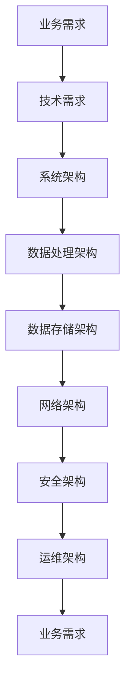

                 

### 文章标题：技术架构演进：应对业务快速增长的挑战

#### 关键词：技术架构、业务增长、架构演进、微服务、云计算、大数据处理、人工智能

#### 摘要：
随着业务需求的不断增长，技术架构的演进成为企业持续发展的关键。本文将详细探讨技术架构如何应对业务快速增长的挑战，包括核心概念、关键技术、应用实践及未来发展趋势。通过一步步的分析推理，本文旨在为读者提供全面的架构优化策略和实施建议。

## 第一部分：引言

### 1.1 书籍背景与目的

在当今快速发展的数字化时代，业务快速增长已成为许多企业的常态。然而，随之而来的挑战是保持技术架构的灵活性和可持续性。为了应对这些挑战，企业需要不断进行技术架构的演进和优化。

本文的目的是：
1. 定义技术架构的基本概念和重要性。
2. 分析业务快速增长的驱动因素和挑战。
3. 探讨技术架构的演进路径和关键因素。
4. 分析核心技术的应用和实践。
5. 展望技术架构的未来发展趋势。

### 1.2 业务快速增长的挑战

业务快速增长带来的主要挑战包括：
1. **需求波动大**：随着用户数量的激增，需求波动加大，要求技术架构具备更高的弹性。
2. **系统复杂性增加**：快速发展的业务通常伴随着系统复杂性的增加，需要更高效的技术架构来管理。
3. **性能瓶颈**：用户数量的增加可能导致性能瓶颈，需要优化技术架构以应对高并发场景。
4. **安全性要求提升**：业务快速增长意味着更多敏感数据的处理，对安全性的要求也更高。
5. **成本控制**：随着业务的扩展，企业需要更有效地控制IT成本。

### 1.3 技术架构的演进路径

技术架构的演进是一个持续的过程，通常包括以下几个阶段：

1. **单体架构**：初期，业务相对简单，通常采用单体架构，所有功能集中在一个应用程序中。
2. **分布式架构**：随着业务的发展，为了提高系统的灵活性和可维护性，逐渐转向分布式架构。
3. **微服务架构**：为了进一步解耦和模块化，采用微服务架构，将应用程序分解为独立的、可独立部署和扩展的小服务。
4. **云原生架构**：随着云计算的普及，采用云原生架构，充分利用云服务的弹性和可扩展性。

## 第二部分：核心概念与架构

### 2.1 技术架构的基本概念

#### 2.1.1 技术架构的定义

技术架构是企业IT系统的基础结构，包括硬件、软件、网络、数据存储等多个层面，旨在满足业务需求并实现高效运作。

#### 2.1.2 技术架构的重要性

技术架构的重要性体现在以下几个方面：
1. **支撑业务发展**：良好的技术架构能够支撑业务快速发展和持续创新。
2. **提高系统效率**：通过合理的架构设计，可以提高系统的运行效率和性能。
3. **降低运维成本**：良好的架构设计可以简化系统的运维和管理，降低成本。
4. **确保数据安全**：架构中的安全性设计能够保护企业的关键数据。

#### 2.1.3 技术架构的组成部分

技术架构通常包括以下几个主要组成部分：
1. **系统架构**：定义系统的整体结构和各组件之间的交互关系。
2. **数据处理架构**：包括数据采集、存储、处理和分析的方法和工具。
3. **数据存储架构**：设计数据存储的物理和逻辑结构，确保数据的安全性和可访问性。
4. **网络架构**：设计网络的物理布局和逻辑结构，确保数据的高效传输。
5. **安全架构**：定义安全策略和措施，保护系统和数据的安全性。
6. **运维架构**：包括运维工具、流程和人员配置，确保系统的稳定运行。

### 2.2 技术架构的核心联系

#### 2.2.1 业务需求与系统架构的关系

业务需求是技术架构设计的起点。业务需求的演变和变化直接影响系统架构的设计和调整。例如，随着用户数量的增加，系统需要具备更高的并发处理能力，这可能需要调整数据库架构或引入缓存系统。

#### 2.2.2 数据处理架构与数据存储架构的关系

数据处理架构和数据存储架构密切相关。数据处理架构设计决定了数据如何被收集、处理和存储。而数据存储架构则决定了数据的存储方式和访问策略，两者需要协同工作，以确保数据的高效利用和安全性。

#### 2.2.3 网络架构与安全架构的关系

网络架构和安全架构是相辅相成的。网络架构设计决定了数据的传输路径和速度，而安全架构则确保数据在传输过程中的安全性和完整性。两者需要综合考虑，以构建一个既高效又安全的网络环境。

#### 2.2.4 运维架构与其他架构的关系

运维架构是技术架构中不可或缺的一部分。它不仅需要与系统架构、数据处理架构、数据存储架构和安全架构协同工作，还需要为这些架构提供稳定的运维支持。例如，自动化运维工具和流程可以提高系统的可靠性和可维护性。

### 2.3 技术架构演进的关键因素

技术架构的演进是一个动态过程，受到多种因素的影响。以下是技术架构演进的关键因素：

#### 2.3.1 业务模式的演变

业务模式的演变是技术架构演进的重要驱动因素。随着市场环境和用户需求的变化，业务模式也在不断调整和优化。技术架构需要与之相适应，以保持业务的持续发展和竞争力。

#### 2.3.2 技术创新的推动

技术创新是技术架构演进的重要推动力。新技术的引入和应用可以大幅提升系统的性能、效率和安全性。例如，云计算、大数据处理和人工智能等技术的应用，可以显著提高技术架构的灵活性和可扩展性。

#### 2.3.3 市场竞争的影响

市场竞争是技术架构演进的另一个重要因素。在激烈的市场竞争中，企业需要不断提升技术架构的竞争力，以应对竞争对手的挑战。技术架构的优化和创新可以帮助企业保持竞争优势。

## 第三部分：核心技术解析

### 3.1 微服务架构

#### 3.1.1 微服务的基本概念

微服务是一种架构风格，它将应用程序划分为一组小的、独立的、松耦合的服务，每个服务实现特定的业务功能。这些服务可以通过轻量级的通信机制（如HTTP/REST、消息队列等）进行交互。

#### 3.1.2 微服务架构的优势

微服务架构具有以下优势：

1. **高可扩展性**：每个服务可以独立扩展，以应对不同的负载。
2. **高可维护性**：服务之间松耦合，便于开发和维护。
3. **高容错性**：服务故障不会影响整个系统的运行。
4. **快速迭代**：服务可以独立部署和迭代，提高开发效率。

#### 3.1.3 微服务设计原则

微服务设计应遵循以下原则：

1. **服务最小化**：服务应实现最小功能，避免过于复杂。
2. **服务自治**：服务应具备独立的数据库、配置和部署。
3. **无状态设计**：服务应尽量设计为无状态，以便于水平扩展。
4. **轻量级通信**：使用轻量级的通信机制，如HTTP/REST、消息队列等。

### 3.2 容器化与云计算

#### 3.2.1 容器技术概述

容器技术是一种轻量级虚拟化技术，它将应用程序及其依赖环境打包成一个独立的运行单元。容器具有以下特点：

1. **轻量级**：容器共享宿主机的操作系统内核，相比虚拟机具有更低的资源消耗。
2. **隔离性**：容器提供应用程序之间的隔离，确保安全性和稳定性。
3. **可移植性**：容器可以在不同的操作系统和硬件平台上运行。
4. **高效性**：容器具有高效的启动和关闭速度。

#### 3.2.2 Docker 与 Kubernetes

Docker是一种流行的容器化技术，它提供了容器构建、运行和管理的工具。Kubernetes（简称K8s）是一种开源的容器编排平台，用于自动化容器的部署、扩展和管理。

#### 3.2.3 云服务模式与架构

云服务模式主要包括IaaS、PaaS和SaaS三种：

1. **IaaS（基础设施即服务）**：提供虚拟化的计算资源，如虚拟机、存储和网络等。
2. **PaaS（平台即服务）**：提供开发和运行应用程序的平台，包括操作系统、数据库和中间件等。
3. **SaaS（软件即服务）**：提供在线应用程序，用户通过互联网访问和使用。

#### 3.3 数据库技术与大数据处理

#### 3.3.1 关系型数据库与NoSQL数据库

关系型数据库（如MySQL、Oracle等）和NoSQL数据库（如MongoDB、Cassandra等）各有优势：

1. **关系型数据库**：擅长处理结构化数据，支持复杂查询和事务处理。
2. **NoSQL数据库**：擅长处理大规模的非结构化或半结构化数据，提供高可用性和高扩展性。

#### 3.3.2 大数据处理框架

大数据处理框架（如Hadoop、Spark等）提供了分布式数据处理的能力：

1. **Hadoop**：基于MapReduce模型，擅长大规模数据的批量处理。
2. **Spark**：基于内存计算，提供更高效的数据处理能力，适用于实时处理和迭代计算。

#### 3.3.3 数据仓库与数据湖

数据仓库（如Amazon Redshift、Google BigQuery等）和数据湖（如Apache Hadoop、Azure Data Lake等）是大数据存储和处理的两种重要模式：

1. **数据仓库**：适用于结构化数据的批量处理和分析。
2. **数据湖**：适用于存储大规模的原始数据，支持多种数据格式和存储方式。

## 第四部分：技术架构应用实践

### 4.1 项目实战：电商平台的架构演进

#### 4.1.1 项目背景

电商平台是一个典型的快速增长的场景，用户数量和交易量不断攀升，对技术架构提出了更高的要求。

#### 4.1.2 架构演进历程

1. **初期单体架构**：业务初期采用单体架构，所有功能集中在同一个应用程序中，便于开发和维护。
2. **分布式架构**：随着业务的发展，引入分布式架构，将不同功能模块拆分为独立的分布式服务，提高系统的可扩展性和可维护性。
3. **微服务架构**：进一步采用微服务架构，将业务功能拆分为独立的服务，每个服务负责特定的业务功能，实现服务自治和独立部署。
4. **容器化与云计算**：采用Docker和Kubernetes进行容器化部署，充分利用云计算资源，提高系统的弹性。

#### 4.1.3 架构优化措施

1. **服务拆分与自治**：根据业务需求，合理拆分服务，实现服务自治，提高系统的灵活性和可维护性。
2. **分布式数据库**：引入分布式数据库，提高数据存储和处理的性能和可靠性。
3. **缓存机制**：引入缓存机制，减少数据库的压力，提高系统的响应速度。
4. **流量控制和限流**：采用流量控制和限流策略，防止系统过载，提高系统的稳定性。

### 4.2 项目实战：金融服务的架构设计

#### 4.2.1 项目背景

金融服务行业对安全性、稳定性和合规性要求极高，技术架构设计必须充分考虑这些因素。

#### 4.2.2 风险管理与合规要求

1. **数据安全**：严格保护用户数据和交易信息，采用加密和身份验证等安全措施。
2. **系统稳定性**：确保系统的高可用性和可靠性，采用分布式架构和冗余设计。
3. **合规性**：遵守相关法律法规，确保系统的合规运行。

#### 4.2.3 架构设计与实施

1. **微服务架构**：采用微服务架构，将业务功能拆分为独立的服务，实现服务自治和独立部署。
2. **分布式数据库**：引入分布式数据库，提高数据存储和处理的性能和可靠性。
3. **安全架构**：构建完善的安全架构，包括防火墙、入侵检测、安全审计等。
4. **合规性设计**：在设计过程中充分考虑合规性要求，确保系统的合法运行。

### 4.3 项目实战：物联网平台架构

#### 4.3.1 物联网技术概述

物联网（IoT）是指通过互联网连接各种物理设备，实现设备之间的数据交换和智能化控制。

#### 4.3.2 架构设计与实现

1. **边缘计算**：在物联网设备附近部署边缘计算节点，处理本地数据，减少数据传输量和延迟。
2. **云平台集成**：将物联网平台与云平台集成，利用云计算资源进行数据处理和分析。
3. **数据存储与处理**：采用分布式数据库和大数据处理框架，存储和处理海量物联网数据。
4. **安全架构**：构建完善的安全架构，保护物联网设备、数据和安全。

#### 4.3.3 数据处理与安全

1. **数据处理**：采用流数据处理技术，实时处理和分析物联网数据。
2. **数据加密**：采用数据加密技术，确保数据在传输和存储过程中的安全性。
3. **设备安全管理**：采用设备身份验证和访问控制，确保物联网设备的安全。

## 第五部分：技术架构的未来发展趋势

### 5.1 人工智能与自动化

#### 5.1.1 AI在技术架构中的应用

人工智能（AI）在技术架构中的应用越来越广泛，包括智能调度、自动化运维和智能安全等。

#### 5.1.2 自动化技术的前景

自动化技术在未来技术架构中的应用前景广阔，包括自动化部署、自动化监控和自动化优化等。

#### 5.1.3 未来架构趋势分析

未来技术架构将更加智能化和自动化，充分利用人工智能和自动化技术，提高系统的效率和可靠性。

### 5.2 云原生技术

#### 5.2.1 云原生定义与特点

云原生技术是指为云环境量身定制的软件和架构，具有可扩展性、自动化和微服务化等特点。

#### 5.2.2 云原生架构的优势

云原生架构的优势包括高效性、可靠性和灵活性，适用于快速变化的业务需求。

#### 5.2.3 云原生技术的未来方向

未来云原生技术将更加注重服务化、自动化和智能化，实现更高效、更灵活的技术架构。

## 第六部分：总结与展望

### 6.1 技术架构演进的关键经验

技术架构演进需要关注以下几个方面：

1. **业务需求**：紧密关注业务需求的变化，及时调整技术架构。
2. **技术创新**：积极引入新技术，提升技术架构的灵活性和可扩展性。
3. **安全性**：确保技术架构的安全性，保护企业和用户的数据安全。
4. **运维管理**：建立完善的运维管理体系，提高系统的稳定性和可靠性。

### 6.2 应对业务快速增长的策略

应对业务快速增长，企业可以采取以下策略：

1. **微服务架构**：采用微服务架构，提高系统的可扩展性和灵活性。
2. **云计算**：利用云计算资源，实现系统的弹性扩展。
3. **大数据处理**：采用大数据处理框架，提高数据处理和分析能力。
4. **人工智能**：引入人工智能技术，实现自动化和智能化。

### 6.3 技术架构的未来发展方向

未来技术架构的发展方向包括：

1. **云原生架构**：更加注重云原生技术的应用，实现高效、灵活的技术架构。
2. **人工智能与自动化**：引入人工智能和自动化技术，提升系统的效率和可靠性。
3. **边缘计算**：利用边缘计算，实现本地数据的实时处理和分析。

# 附录

### A.1 技术资源与工具

#### A.1.1 开源技术资源

1. **Docker**：[https://www.docker.com/](https://www.docker.com/)
2. **Kubernetes**：[https://kubernetes.io/](https://kubernetes.io/)
3. **Hadoop**：[https://hadoop.apache.org/](https://hadoop.apache.org/)
4. **Spark**：[https://spark.apache.org/](https://spark.apache.org/)
5. **Amazon Redshift**：[https://aws.amazon.com/redshift/](https://aws.amazon.com/redshift/)
6. **Google BigQuery**：[https://cloud.google.com/bigquery/](https://cloud.google.com/bigquery/)
7. **Apache Hadoop**：[https://hadoop.apache.org/](https://hadoop.apache.org/)
8. **Azure Data Lake**：[https://azure.microsoft.com/zh-cn/services/data-lake/](https://azure.microsoft.com/zh-cn/services/data-lake/)

#### A.1.2 工具与平台推荐

1. **Jenkins**：[https://www.jenkins.io/](https://www.jenkins.io/)
2. **Kubernetes**：[https://kubernetes.io/](https://kubernetes.io/)
3. **Docker Desktop**：[https://www.docker.com/products/docker-desktop](https://www.docker.com/products/docker-desktop)
4. **Kubernetes Dashboard**：[https://kubernetes.io/docs/tasks/access-application-cluster/kubernetes-dashboard/](https://kubernetes.io/docs/tasks/access-application-cluster/kubernetes-dashboard/)
5. **Kafka**：[https://kafka.apache.org/](https://kafka.apache.org/)

#### A.1.3 社区与论坛

1. **Docker Community**：[https://www.docker.com/community](https://www.docker.com/community)
2. **Kubernetes Community**：[https://kubernetes.io/community/](https://kubernetes.io/community/)
3. **Hadoop Community**：[https://hadoop.apache.org/community.html](https://hadoop.apache.org/community.html)
4. **Spark Community**：[https://spark.apache.org/community.html](https://spark.apache.org/community.html)
5. **AWS Community**：[https://aws.amazon.com.cn/community/](https://aws.amazon.com.cn/community/)
6. **Google Cloud Community**：[https://cloud.google.com/community/](https://cloud.google.com/community/)

---

**作者**：AI天才研究院/AI Genius Institute & 禅与计算机程序设计艺术 /Zen And The Art of Computer Programming

本文旨在为读者提供关于技术架构演进的全景解读，帮助企业和开发者更好地应对业务快速增长的挑战。在技术不断进步的时代，保持技术架构的灵活性和前瞻性是企业成功的关键。希望本文能为读者提供有价值的参考和启示。如果您对技术架构演进有任何疑问或建议，欢迎在评论区留言交流。感谢您的阅读！

