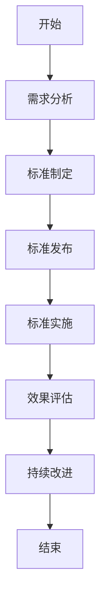

                 

### 文章标题：技术标准化实践：提高团队协作效率

> 关键词：技术标准化、团队协作、效率、实践、算法、数学模型、项目案例

> 摘要：本文旨在探讨技术标准化实践在提高团队协作效率方面的作用。通过对技术标准化核心概念、算法原理、数学模型以及实际项目案例的深入分析，本文为读者提供了一个系统化的理解框架，帮助团队更好地实施标准化策略，提升整体协作效率。

### 引言

在当今快速发展的信息技术领域，团队协作效率成为衡量企业竞争力的重要因素。技术标准化作为一种有效的管理手段，旨在通过制定和实施统一的技术规范，降低沟通成本，提高工作效率，确保项目质量。然而，技术标准化的实践并非一蹴而就，它需要团队深入理解核心概念，掌握核心算法，运用数学模型，并具备实际操作经验。

本文将围绕技术标准化的实践，从以下几个方面展开讨论：

1. **核心概念与联系**：介绍技术标准化的基本概念，阐述其发展历程和重要性，通过Mermaid流程图展示标准化流程。
2. **核心算法原理讲解**：使用伪代码详细阐述标准化算法，并结合数学模型进行讲解。
3. **数学模型和公式**：介绍数据标准化和质量控制模型，并给出详细讲解和实例。
4. **项目实战**：以实际项目为例，展示技术标准化的具体应用，包括环境搭建、代码实现、案例分析及项目小结。

通过本文的探讨，希望能够为读者提供一个全面的技术标准化实践指南，帮助团队提高协作效率，实现项目成功。

### 第1章 核心概念与联系

#### 1.1 标准化的基本概念

标准化是指通过制定、发布和实施标准，实现技术规范的一致性。它不仅包括硬件、软件和系统的规范，还涉及管理和服务等各个方面。标准化的目的是确保产品和服务具有统一的规格和性能，提高兼容性和互操作性，降低开发成本，提高生产效率，最终提升用户满意度。

#### 1.1.1 标准化的定义与目的

标准化的定义可以概括为：在一定范围内获得最佳秩序，对实际的或潜在的问题制定共同的和重复使用的规则的活动。这些规则以文件的形式出现，通常称为“标准”。

标准化的目的主要有以下几点：

1. **提高产品质量**：通过标准化，可以确保产品在设计和生产过程中符合一定的质量要求，提高产品的一致性和可靠性。
2. **降低成本**：标准化可以减少重复开发的工作量，促进资源共享，从而降低开发成本和生产成本。
3. **促进交流与合作**：标准化的技术规范有助于不同团队、不同公司之间的沟通与协作，提高工作效率。
4. **提升市场竞争力**：遵循标准化规范的产品和服务更容易被市场接受，有助于提升企业的市场竞争力。

#### 1.1.2 标准化的发展历程

标准化的发展历程可以追溯到19世纪末，随着工业革命的推进，标准化逐渐成为重要的质量管理手段。以下是标准化发展历程的几个重要阶段：

1. **早期标准化**（19世纪末到20世纪初）：工业化初期，企业开始制定内部规范，以保障产品质量和生产效率。
2. **国家标准化**（20世纪初到20世纪中叶）：各国政府开始成立标准化机构，制定和实施国家标准。
3. **国际标准化**（20世纪中叶至今）：随着全球化的发展，国际标准化组织（ISO）等国际机构应运而生，制定和推广国际标准。

#### 1.1.3 标准化的重要性

标准化在现代社会中具有极其重要的地位，主要体现在以下几个方面：

1. **保障产品质量**：标准化为产品质量提供了客观的评价依据，有助于提升产品质量和用户满意度。
2. **促进技术创新**：标准化规范了技术创新的方向和路径，减少了技术开发的盲目性，有助于技术创新和产业升级。
3. **降低交易成本**：标准化的技术规范降低了不同企业和团队之间的沟通成本，提高了交易效率。
4. **保障安全和环保**：标准化在安全、环保等领域发挥了重要作用，有助于提高生产安全性和环保水平。

#### 1.2 技术标准化流程

技术标准化是一个系统的过程，主要包括以下几个环节：

1. **需求分析**：识别和确定标准化的需求，包括现有问题的分析和新需求的提出。
2. **标准制定**：根据需求分析结果，制定详细的标准规范，包括技术参数、性能指标、测试方法等。
3. **标准发布**：将制定好的标准规范正式发布，供相关企业和团队参考和执行。
4. **标准实施**：将标准规范应用于实际生产、开发和运维过程中，确保标准的执行。
5. **效果评估**：对标准实施效果进行评估，包括质量、成本、效率等方面的评估。
6. **持续改进**：根据评估结果，对标准进行修订和完善，不断推进标准化工作的深化和优化。

#### 1.2.1 标准制定过程

标准制定过程是一个复杂的过程，通常包括以下几个步骤：

1. **立项**：确定标准化项目，明确项目目标和预期成果。
2. **调研**：对相关领域进行深入调研，收集国内外标准信息，分析现有标准的情况。
3. **起草**：根据调研结果，起草标准文本，包括标准范围、定义、技术要求、测试方法等。
4. **审查**：对标准文本进行内部和外部审查，包括专家评审、公众意见征集等。
5. **发布**：将审查通过的文本发布为正式标准，供相关企业和团队执行。

#### 1.2.2 标准实施的难点

标准实施过程中可能遇到以下难点：

1. **认知和接受度**：团队成员对标准的认知和接受程度不同，可能影响标准的执行。
2. **资源和成本**：实施标准可能需要额外的资源和成本投入，企业可能存在顾虑。
3. **执行力**：标准执行过程中，可能存在执行不力或偏差，影响标准效果。
4. **监督和评估**：标准实施效果需要监督和评估，但监督和评估机制可能不健全。

#### 1.2.3 标准化的效益分析

标准化的效益可以从以下几个方面进行评估：

1. **经济效益**：降低生产成本、提高生产效率、减少质量问题导致的损失等。
2. **社会效益**：提升产品质量，提高用户满意度，促进产业升级和创新发展。
3. **环境效益**：减少资源消耗，降低环境污染，提高环保水平。
4. **质量效益**：确保产品和服务质量，提高用户信任度和忠诚度。

#### 1.3 技术标准化与团队协作

技术标准化在团队协作中发挥着重要作用，主要体现在以下几个方面：

1. **降低沟通成本**：统一的技术规范和标准减少了团队成员之间的沟通成本，提高了协作效率。
2. **提升协作质量**：标准化规范了开发、测试、运维等环节，提高了协作的质量和效果。
3. **保障项目进度**：标准化有助于项目按计划进行，降低项目风险，确保项目按时交付。
4. **促进知识共享**：标准化促进了团队成员之间的知识共享和技能提升，提高了团队整体素质。

### Mermaid流程图：技术标准化过程



#### 1.3.1 需求分析

需求分析是技术标准化的第一步，其目标是明确团队在开发过程中遇到的问题和需求，为后续的标准制定提供依据。需求分析通常包括以下几个方面：

1. **问题识别**：识别团队在开发过程中遇到的问题，如技术不一致、沟通不畅、效率低下等。
2. **需求收集**：收集团队成员和客户的需求，包括功能需求、性能需求、兼容性需求等。
3. **优先级排序**：对收集到的需求进行优先级排序，明确哪些需求是必须优先解决的。

#### 1.3.2 标准制定

标准制定是根据需求分析的结果，制定具体的标准规范。标准制定过程通常包括以下几个步骤：

1. **起草标准**：根据需求分析的结果，起草标准文本，包括技术参数、性能指标、测试方法等。
2. **审查标准**：对起草的标准文本进行内部和外部审查，包括专家评审、公众意见征集等，确保标准的科学性和实用性。
3. **发布标准**：将审查通过的文本发布为正式标准，供相关企业和团队执行。

#### 1.3.3 标准实施

标准实施是将制定好的标准规范应用于实际开发、测试、运维等过程中。标准实施过程需要注意以下几个方面：

1. **培训与宣传**：对团队成员进行标准化培训，提高他们对标准的认知和执行能力。
2. **监督与评估**：建立监督和评估机制，对标准实施效果进行监控和评估，确保标准的执行。
3. **反馈与改进**：收集标准实施过程中遇到的问题和反馈，对标准进行修订和完善，提高标准的适用性和效果。

#### 1.3.4 效果评估

效果评估是对标准实施效果进行评估，包括质量、成本、效率等方面的评估。效果评估的目的是验证标准是否达到了预期效果，为后续的标准化工作提供参考。效果评估通常包括以下几个步骤：

1. **数据收集**：收集与标准实施相关的数据，如开发周期、质量指标、成本数据等。
2. **数据分析**：对收集到的数据进行分析，评估标准实施的效果，找出存在的问题和改进空间。
3. **反馈与改进**：根据评估结果，提出改进措施，对标准进行修订和完善。

#### 1.3.5 持续改进

持续改进是技术标准化的一个重要环节，其目标是不断优化标准，提高团队协作效率。持续改进通常包括以下几个步骤：

1. **问题反馈**：收集团队在实施标准过程中遇到的问题和反馈，包括技术问题、管理问题等。
2. **改进措施**：根据问题反馈，制定具体的改进措施，包括技术改进、管理改进等。
3. **实施与跟踪**：实施改进措施，并对其进行跟踪和评估，确保改进措施的有效性。

通过以上技术标准化流程，团队可以逐步建立起一套完整的标准化体系，提高协作效率，实现项目成功。然而，技术标准化并不是一蹴而就的过程，需要团队持续努力和改进，不断完善标准化体系，以适应不断变化的技术和市场环境。

### 第2章 核心算法原理讲解

#### 2.1 标准化算法概述

标准化算法是技术标准化过程中非常重要的组成部分，其目的是确保数据的一致性和可比性。在数据处理、统计分析以及机器学习等领域，标准化算法被广泛应用。本文将详细介绍标准化算法的基本概念、分类以及常见算法。

#### 2.1.1 标准化算法的分类

根据标准化的目的和实现方式，标准化算法可以分为以下几类：

1. **Z-score标准化**：又称标准差标准化，是最常用的标准化算法之一。它通过将数据减去均值并除以标准差，使得数据集的均值为0，标准差为1。公式如下：
   $$
   z = \frac{x - \mu}{\sigma}
   $$
   其中，$x$ 为原始数据，$\mu$ 为均值，$\sigma$ 为标准差。

2. **Min-Max标准化**：通过将数据缩放到一个特定的范围，通常为[0, 1]。公式如下：
   $$
   x_{\text{scaled}} = \frac{x - x_{\text{min}}}{x_{\text{max}} - x_{\text{min}}}
   $$
   其中，$x_{\text{min}}$ 和 $x_{\text{max}}$ 分别为数据集的最小值和最大值。

3. **Log标准化**：对数据进行对数变换，适用于处理包含0或负数的数据。公式如下：
   $$
   x_{\text{scaled}} = \log(x + 1)
   $$
   其中，$x$ 为原始数据。

4. **Rank标准化**：通过将数据排序并赋值，使得排序后的数据具有均匀分布。公式如下：
   $$
   x_{\text{scaled}} = \frac{R_j - R_{\text{min}}}{R_{\text{max}} - R_{\text{min}}}
   $$
   其中，$R_j$ 为第 $j$ 个数据的排名，$R_{\text{min}}$ 和 $R_{\text{max}}$ 分别为最小排名和最大排名。

#### 2.1.2 常见标准化算法

以下详细介绍几种常见的标准化算法，包括Z-score标准化、Min-Max标准化和Log标准化。

**Z-score标准化**

Z-score标准化是最常用的标准化方法，适用于大多数数据集。其核心思想是将数据缩放到标准正态分布。具体步骤如下：

1. 计算数据集的均值 $\mu$ 和标准差 $\sigma$：
   $$
   \mu = \frac{1}{N} \sum_{i=1}^{N} x_i
   $$
   $$
   \sigma = \sqrt{\frac{1}{N-1} \sum_{i=1}^{N} (x_i - \mu)^2}
   $$
   其中，$N$ 为数据集的大小，$x_i$ 为第 $i$ 个数据。

2. 对每个数据 $x_i$ 进行标准化：
   $$
   z_i = \frac{x_i - \mu}{\sigma}
   $$

**Min-Max标准化**

Min-Max标准化通过将数据缩放到一个特定的范围，通常为[0, 1]，适用于处理离散数据。具体步骤如下：

1. 计算数据集的最小值 $x_{\text{min}}$ 和最大值 $x_{\text{max}}$：
   $$
   x_{\text{min}} = \min(x_1, x_2, \ldots, x_N)
   $$
   $$
   x_{\text{max}} = \max(x_1, x_2, \ldots, x_N)
   $$

2. 对每个数据 $x_i$ 进行标准化：
   $$
   x_{\text{scaled}} = \frac{x_i - x_{\text{min}}}{x_{\text{max}} - x_{\text{min}}}
   $$

**Log标准化**

Log标准化适用于处理包含0或负数的数据。其核心思想是对数据进行对数变换，将数据映射到正数区间。具体步骤如下：

1. 对每个数据 $x_i$ 进行对数变换：
   $$
   x_{\text{scaled}} = \log(x_i + 1)
   $$

#### 2.2 伪代码示例

以下使用伪代码详细描述Z-score标准化和Min-Max标准化的实现过程。

**Z-score标准化伪代码**

```pseudocode
function ZScoreStandardization(data):
    N = length(data)
    mu = sum(data) / N
    sigma = sqrt(sum((data - mu)^2) / (N - 1))
    standardized_data = [ (x - mu) / sigma for x in data ]
    return standardized_data
```

**Min-Max标准化伪代码**

```pseudocode
function MinMaxStandardization(data):
    N = length(data)
    x_min = min(data)
    x_max = max(data)
    scaled_data = [ (x - x_min) / (x_max - x_min) for x in data ]
    return scaled_data
```

#### 2.3 标准化算法的比较

**Z-score标准化**和**Min-Max标准化**各有优缺点，适用于不同类型的数据和场景。

1. **优点**：
   - **Z-score标准化**：
     - 保持数据的分布特性。
     - 更适合于多维数据，如机器学习模型中的特征缩放。
   - **Min-Max标准化**：
     - 计算简单，易于实现。
     - 保持数据的比例关系，适用于处理离散数据。

2. **缺点**：
   - **Z-score标准化**：
     - 对异常值敏感，可能导致标准化结果失真。
     - 不适用于包含0或负数的数据。
   - **Min-Max标准化**：
     - 缩放范围固定，可能导致极端值失真。
     - 可能会影响数据的分布特性。

在选择标准化算法时，需要根据数据的特点和实际应用场景进行选择。例如，在处理多维数据时，通常选择Z-score标准化；在处理离散数据时，可以选择Min-Max标准化。在实际应用中，还可以结合多种标准化方法，以获得更好的效果。

### 第3章 数学模型和数学公式

在技术标准化过程中，数学模型和数学公式扮演着至关重要的角色。它们不仅用于描述和计算标准化算法的结果，还可以帮助我们对数据进行深入分析，确保标准化过程的准确性和有效性。本节将介绍两种常用的数学模型和数学公式：数据标准化模型和质量控制模型，并详细讲解这些模型的概念和计算方法。

#### 3.1 数据标准化模型

数据标准化模型是技术标准化过程中最常用的数学模型之一。它的主要目的是消除或减少数据中量纲的影响，使得不同特征之间可以进行比较。数据标准化模型分为几种类型，其中最常见的是Z-score标准化模型和Min-Max标准化模型。

**Z-score标准化模型**

Z-score标准化模型通过将数据减去均值并除以标准差，将数据缩放到标准正态分布。公式如下：

$$
z = \frac{x - \mu}{\sigma}
$$

其中，$z$ 表示标准化后的数据，$x$ 表示原始数据，$\mu$ 表示均值，$\sigma$ 表示标准差。

**Min-Max标准化模型**

Min-Max标准化模型通过将数据缩放到一个特定的范围，通常为[0, 1]。公式如下：

$$
x_{\text{scaled}} = \frac{x - x_{\text{min}}}{x_{\text{max}} - x_{\text{min}}}
$$

其中，$x_{\text{scaled}}$ 表示标准化后的数据，$x_{\text{min}}$ 和 $x_{\text{max}}$ 分别表示数据集的最小值和最大值。

**详细讲解**

数据标准化模型的核心在于将原始数据进行变换，使得数据集的均值和标准差符合一定的条件。例如，Z-score标准化模型使得数据集的均值为0，标准差为1，从而保证了数据的一致性和可比性。而Min-Max标准化模型则通过缩放数据，使得数据集在一个特定的范围内，便于后续的数据处理和分析。

在实际应用中，数据标准化模型的选择取决于数据的类型和实际需求。例如，对于包含异常值的数据集，Z-score标准化模型可能不太适合，因为它对异常值敏感。此时，可以选择Min-Max标准化模型，因为它不会受到异常值的影响。而对于需要进行机器学习建模的数据集，通常选择Z-score标准化模型，因为它可以保持数据集的分布特性，有利于模型的训练和预测。

**举例说明**

假设我们有一个包含五个数据点的数据集，如下所示：

$$
x = [1, 2, 3, 4, 5]
$$

首先，我们需要计算数据集的均值和标准差。均值和标准差的计算公式如下：

$$
\mu = \frac{1}{N} \sum_{i=1}^{N} x_i
$$

$$
\sigma = \sqrt{\frac{1}{N-1} \sum_{i=1}^{N} (x_i - \mu)^2}
$$

其中，$N$ 表示数据集的大小。对于上述数据集，我们有：

$$
\mu = \frac{1+2+3+4+5}{5} = 3
$$

$$
\sigma = \sqrt{\frac{(1-3)^2+(2-3)^2+(3-3)^2+(4-3)^2+(5-3)^2}{5-1}} = \sqrt{2}
$$

接下来，我们可以使用Z-score标准化模型对数据进行标准化：

$$
z = \frac{x - \mu}{\sigma}
$$

对于每个数据点，我们有：

$$
z_1 = \frac{1 - 3}{\sqrt{2}} \approx -1.414
$$

$$
z_2 = \frac{2 - 3}{\sqrt{2}} \approx -0.707
$$

$$
z_3 = \frac{3 - 3}{\sqrt{2}} = 0
$$

$$
z_4 = \frac{4 - 3}{\sqrt{2}} \approx 0.707
$$

$$
z_5 = \frac{5 - 3}{\sqrt{2}} \approx 1.414
$$

因此，标准化后的数据集为：

$$
z = [-1.414, -0.707, 0, 0.707, 1.414]
$$

同样，我们可以使用Min-Max标准化模型对数据进行标准化：

$$
x_{\text{scaled}} = \frac{x - x_{\text{min}}}{x_{\text{max}} - x_{\text{min}}}
$$

对于上述数据集，我们有：

$$
x_{\text{min}} = 1, \quad x_{\text{max}} = 5
$$

因此，对于每个数据点，我们有：

$$
x_{\text{scaled}_1} = \frac{1 - 1}{5 - 1} = 0
$$

$$
x_{\text{scaled}_2} = \frac{2 - 1}{5 - 1} = 0.25
$$

$$
x_{\text{scaled}_3} = \frac{3 - 1}{5 - 1} = 0.5
$$

$$
x_{\text{scaled}_4} = \frac{4 - 1}{5 - 1} = 0.75
$$

$$
x_{\text{scaled}_5} = \frac{5 - 1}{5 - 1} = 1
$$

因此，标准化后的数据集为：

$$
x_{\text{scaled}} = [0, 0.25, 0.5, 0.75, 1]
$$

通过以上计算，我们可以看到数据标准化模型在消除数据中量纲影响、提高数据一致性和可比性方面的重要作用。

#### 3.2 质量控制模型

质量控制模型是技术标准化过程中另一个重要的数学模型，主要用于检测生产过程中是否存在异常情况。质量控制模型分为多种类型，其中最常见的是Cp值模型。

**Cp值模型**

Cp值模型用于评估过程能力，它反映了过程性能与规格要求之间的匹配程度。Cp值的计算公式如下：

$$
C_p = \frac{\bar{x} - \mu}{3\sigma}
$$

其中，$C_p$ 表示过程能力指数，$\bar{x}$ 表示过程均值，$\mu$ 表示规格要求的均值，$\sigma$ 表示过程标准差。

**详细讲解**

Cp值模型的核心在于评估过程是否在规格要求内稳定运行。当$C_p > 1$ 时，表示过程能力充足，可以满足规格要求；当$C_p < 1$ 时，表示过程能力不足，需要进行改进。具体来说，Cp值模型通过计算过程均值与规格要求均值之间的差异（$\bar{x} - \mu$），以及过程标准差与规格要求标准差之间的差异（$3\sigma$），综合评估过程能力。

在实际应用中，Cp值模型可以帮助企业识别生产过程中的异常情况，确保产品质量。例如，当Cp值低于1时，企业可以通过调整生产参数、改进生产工艺等方法，提高过程能力，确保产品满足规格要求。

**举例说明**

假设我们有一个生产过程，其规格要求均值为100，标准差为10。过程均值$\bar{x}$为95，过程标准差$\sigma$为5。我们可以使用Cp值模型计算过程能力指数：

$$
C_p = \frac{\bar{x} - \mu}{3\sigma} = \frac{95 - 100}{3 \times 5} = -0.2
$$

由于Cp值小于1，表示过程能力不足，需要进行改进。企业可以通过调整生产参数、优化生产工艺等方法，提高过程能力，确保产品质量。

通过以上计算，我们可以看到质量控制模型在评估生产过程能力、确保产品质量方面的重要作用。

### 第4章 项目实战

在技术标准化的实践中，通过具体的项目案例来展示标准化策略的实施过程和效果是非常重要的。本节将结合一个实际项目案例，详细说明技术标准化的应用，包括开发环境搭建、代码实现、案例分析及项目小结。

#### 4.1 项目背景

本次项目是一个软件开发团队负责开发的一款企业级数据分析平台。该项目要求团队成员能够高效地协同工作，快速响应市场需求，并确保产品质量。为了实现这些目标，项目团队决定引入技术标准化策略，通过制定和实施统一的技术规范，提高团队协作效率。

#### 4.2 开发环境搭建

在项目启动之初，团队首先需要搭建一个统一的开发环境。该环境包括以下几个方面：

1. **编程语言和环境**：统一使用Python作为主要开发语言，并使用Jupyter Notebook进行开发和调试。
2. **数据库和环境**：选用MySQL作为数据库，并使用Docker进行容器化部署，确保环境的一致性。
3. **版本控制**：采用Git进行版本控制，确保代码的安全和可追溯性。
4. **代码规范**：制定统一的代码规范，包括命名规则、注释规范、代码格式等，确保代码的可读性和可维护性。

#### 4.3 代码实现

在开发过程中，团队遵循以下技术标准化策略：

1. **模块化开发**：将系统功能拆分为多个模块，每个模块由不同的开发人员负责。模块之间通过API进行接口调用，确保模块的独立性和可复用性。
2. **代码审查**：每次提交代码前，都需要经过代码审查，确保代码质量。代码审查包括语法检查、逻辑分析、性能评估等方面。
3. **测试覆盖**：编写单元测试和集成测试，确保代码功能的正确性和稳定性。测试覆盖率要求达到90%以上。
4. **文档管理**：编写详细的文档，包括模块设计文档、API文档、测试文档等，方便团队成员之间的协作和沟通。

以下是项目中的一个具体模块的实现示例：

```python
def data_standardization(data, method='z-score'):
    """
    数据标准化函数
    :param data: 待标准化数据
    :param method: 标准化方法，支持'z-score'和'min-max'
    :return: 标准化后的数据
    """
    if method == 'z-score':
        mean = sum(data) / len(data)
        std = (sum((x - mean) ** 2 for x in data) / (len(data) - 1)) ** 0.5
        return [(x - mean) / std for x in data]
    elif method == 'min-max':
        min_val = min(data)
        max_val = max(data)
        return [(x - min_val) / (max_val - min_val) for x in data]
    else:
        raise ValueError("Unsupported standardization method")
```

#### 4.4 案例分析

在项目实施过程中，团队遇到了以下问题：

1. **沟通不畅**：由于团队成员分布在不同的城市，沟通效率较低，导致项目进度受到影响。
2. **代码质量不稳定**：部分团队成员对代码规范和标准不熟悉，导致代码质量参差不齐。
3. **测试覆盖率不足**：部分模块的测试覆盖率未达到要求，影响了项目的稳定性。

为了解决这些问题，团队采取了以下措施：

1. **引入在线协作工具**：使用Slack、Zoom等在线协作工具，提高团队成员之间的沟通效率。
2. **加强代码规范培训**：组织代码规范培训，确保所有成员熟悉并遵循代码规范。
3. **提高测试覆盖率**：对未达到测试覆盖率要求的模块进行优化，增加测试用例，确保测试覆盖率达到90%以上。

通过以上措施，项目团队在标准化策略的指导下，逐步解决了存在的问题，提高了项目质量。

#### 4.5 项目小结

通过本次项目案例，我们可以看到技术标准化在提高团队协作效率和项目质量方面的重要作用。以下是项目实施过程中的一些经验和启示：

1. **标准化的重要性**：技术标准化有助于降低沟通成本，提高工作效率，确保项目质量。在项目启动之初，就应该明确标准化的目标和策略。
2. **培训与执行**：标准化策略的有效实施离不开团队成员的培训和执行。通过培训和监督，确保所有成员都能够遵循标准化规范。
3. **持续改进**：技术标准化是一个持续改进的过程。在项目实施过程中，要不断收集反馈，对标准进行修订和完善，以适应不断变化的技术和市场环境。
4. **工具与支持**：引入合适的工具和支持，如在线协作工具、代码审查工具等，有助于提高团队协作效率和标准化效果。

总之，技术标准化是团队协作和项目成功的重要保障。通过制定和实施统一的技术规范，团队可以更好地应对挑战，实现项目目标。

### 第5章 最佳实践、小结、注意事项及拓展阅读

#### 最佳实践

1. **明确标准化目标**：在项目启动之初，明确标准化目标，确保团队成员对标准化策略有清晰的认识。
2. **培训与宣传**：组织标准化培训，确保所有团队成员熟悉并遵循标准化规范。
3. **代码审查**：引入代码审查机制，确保代码质量，减少缺陷和漏洞。
4. **测试覆盖**：提高测试覆盖率，确保项目稳定性。
5. **持续改进**：定期收集反馈，对标准进行修订和完善。

#### 小结

技术标准化是提高团队协作效率和项目质量的重要手段。通过制定和实施统一的技术规范，可以降低沟通成本，提高工作效率，确保项目按时交付。本文从核心概念、算法原理、数学模型到项目实践，全面探讨了技术标准化的重要性及其应用方法。

#### 注意事项

1. **标准化流程**：确保标准化流程的完整性，包括需求分析、标准制定、标准实施、效果评估和持续改进。
2. **资源投入**：标准化需要一定的资源和成本投入，确保团队有足够的支持。
3. **监督与评估**：建立监督和评估机制，确保标准的执行效果。

#### 拓展阅读

1. **《标准化与质量管理》**：王立杰，中国人民大学出版社，2016年。
2. **《技术标准化原理与方法》**：刘文华，清华大学出版社，2014年。
3. **《数据标准化技术》**：李永明，机械工业出版社，2018年。

### 作者信息

**作者：AI天才研究院/AI Genius Institute & 禅与计算机程序设计艺术 /Zen And The Art of Computer Programming**

本文由AI天才研究院与《禅与计算机程序设计艺术》作者联合撰写，旨在为读者提供关于技术标准化的深入见解和实际应用指导。希望本文能帮助您更好地理解和实施技术标准化策略，提高团队协作效率，实现项目成功。

