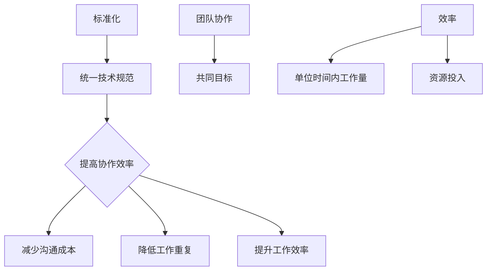
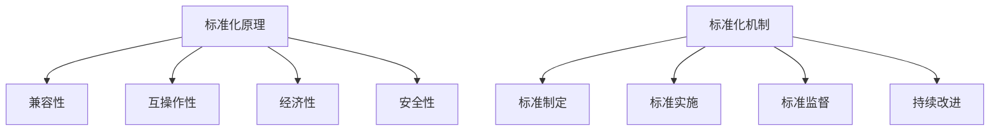
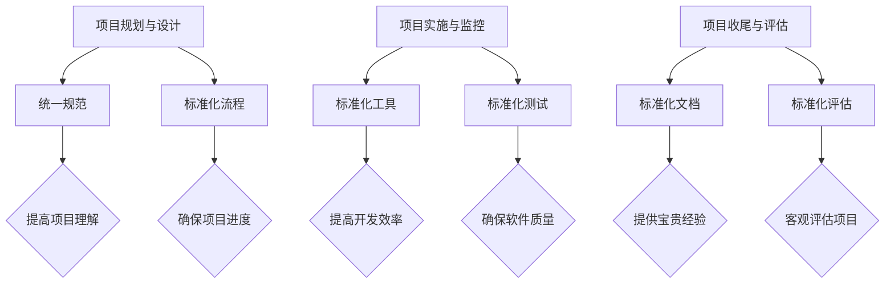
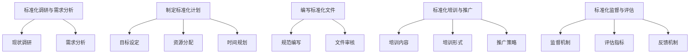
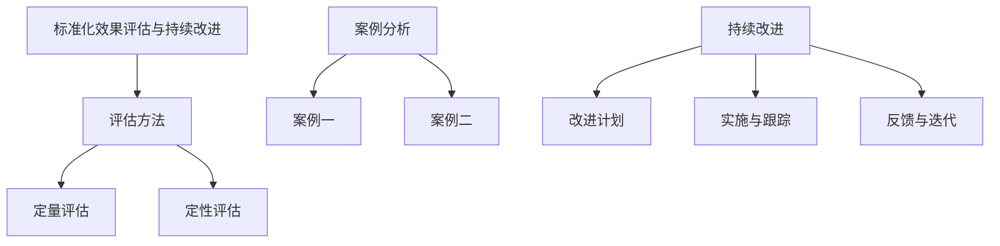
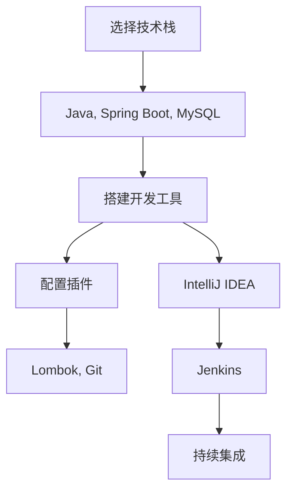
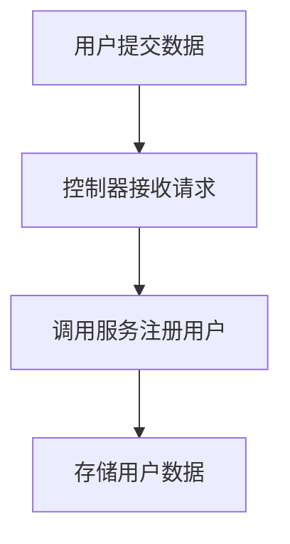

                 

### 文章标题：技术标准化：提高团队协作效率的关键

在快速发展的技术时代，高效团队协作已成为企业成功的关键。而技术标准化作为提高团队协作效率的利器，正逐渐受到广泛关注。本文旨在深入探讨技术标准化在团队协作中的重要性，以及如何通过标准化来提高团队效率，从而为企业带来显著效益。

关键词：技术标准化，团队协作，效率提升，实践案例分析

摘要：本文首先介绍了技术标准化的定义及其在团队协作中的重要性，随后详细阐述了标准化原理与机制，以及标准化在团队协作中的应用和实践。最后，文章通过具体案例分析和最佳实践，总结了技术标准化实施的步骤、效果评估与持续改进的方法，为企业提供了切实可行的指导建议。

### 背景介绍

技术标准化是指通过制定和实施统一的技术规范，确保不同系统和组件之间的兼容性和互操作性。随着信息技术和互联网的迅猛发展，企业面临着日益复杂的系统架构和不断增长的技术复杂性。这使得团队协作效率成为企业能否持续发展的关键因素之一。

在传统的团队协作中，缺乏统一的技术标准和规范，常常导致以下问题：

1. **沟通成本高**：团队成员对技术细节的理解存在差异，导致沟通效率低下，甚至产生误解和冲突。
2. **工作重复**：不同团队或项目可能采用不同的技术方案，造成资源浪费和工作重复。
3. **质量不稳定**：缺乏统一的技术标准，导致产品质量参差不齐，难以保证项目的稳定性和可靠性。

技术标准化有助于解决上述问题，通过建立统一的技术规范，可以提高团队协作的效率，降低沟通成本，提升工作质量和项目稳定性。因此，技术标准化已成为现代企业提高团队协作效率的重要手段。

### 核心概念与联系

为了更好地理解技术标准化在团队协作中的作用，我们需要首先明确几个核心概念：

1. **标准化**：标准化是一种规范化的活动，旨在通过制定和实施统一的标准，提高产品、过程或服务的质量、兼容性和互操作性。
2. **团队协作**：团队协作是指团队成员在共同目标下，通过沟通、协调和合作，共同完成任务的过程。
3. **效率**：效率是指单位时间内完成的工作量，或实现目标所需的资源投入。

技术标准化与团队协作和效率之间的关系可以概括为以下几点：

- **标准化提高协作效率**：通过建立统一的技术标准，团队成员能够更快速地理解和执行任务，减少沟通成本和误解，从而提高协作效率。
- **标准化提升工作效率**：标准化确保了技术和工具的统一性，减少了因技术差异导致的工作重复和资源浪费，从而提升工作效率。

为了更直观地展示这些概念之间的关系，我们可以使用Mermaid流程图来表示：



### 标准化原理与机制

标准化不仅仅是一种技术活动，它还涉及到一系列的原理和机制，这些原理和机制是确保标准化过程有效实施的基础。以下是标准化原理和机制的核心内容：

1. **标准化原理**
   - **兼容性**：确保不同系统和组件能够无缝集成和交互。
   - **互操作性**：确保不同系统和组件能够按照统一的标准进行数据交换和功能调用。
   - **经济性**：通过规模化生产和统一技术规范，降低生产和维护成本。
   - **安全性**：确保技术和系统的稳定性和可靠性，保护数据安全和隐私。

2. **标准化机制**
   - **标准制定**：通过标准组织、行业协会和企业联盟等机构，制定和发布技术标准。
   - **标准实施**：将标准转化为具体的技术规范和操作指南，确保标准的实际应用。
   - **标准监督**：对标准实施过程进行监督和评估，确保标准得到有效执行。
   - **持续改进**：根据反馈和实际应用情况，对标准进行修订和优化，确保其持续适应技术发展需求。

为了更清晰地理解这些原理和机制，我们可以使用Mermaid流程图来表示：



### 标准化在团队协作中的应用

技术标准化不仅是一种技术活动，更是一种管理工具，它可以在多个方面提高团队协作的效率和效果。以下是标准化在团队协作中应用的关键领域：

1. **项目规划与设计**
   - **统一规范**：在项目规划阶段，通过制定统一的技术规范，确保项目团队成员对项目目标、需求和技术方案有共同的理解，减少因理解差异导致的延误和误解。
   - **标准化流程**：使用标准化的项目管理流程，如项目管理框架（如PMI的PMBOK），确保项目按计划推进，提高项目成功概率。

2. **项目实施与监控**
   - **标准化工具**：采用标准化的开发工具和平台，如统一编程语言、框架和开发环境，确保开发效率和质量。
   - **标准化测试**：实施标准化的测试流程和测试用例，确保软件质量，降低缺陷率。

3. **项目收尾与评估**
   - **标准化文档**：制定和遵循标准化的文档规范，确保项目文档的完整性和一致性，为后续项目提供宝贵经验。
   - **标准化评估**：使用标准化的评估指标和方法，对项目成果进行客观评估，为项目总结和持续改进提供依据。

为了更好地理解标准化在团队协作中的应用，我们可以使用一个Mermaid流程图来展示其关键环节：



### 标准化实施的步骤与方法

要成功实施技术标准化，需要遵循一系列步骤和方法，以确保标准化的有效性和可持续性。以下是标准化实施的主要步骤和方法：

1. **标准化调研与需求分析**
   - **现状调研**：对现有技术环境和团队协作流程进行详细调研，识别存在的问题和需求。
   - **需求分析**：根据调研结果，确定需要制定和实施的标准，确保标准能够解决实际问题。

2. **制定标准化计划**
   - **目标设定**：明确标准化计划的目标和预期成果。
   - **资源分配**：分配必要的资源和预算，确保标准化计划的顺利实施。
   - **时间规划**：制定详细的时间表，确保标准化计划按期完成。

3. **编写标准化文件**
   - **规范编写**：根据需求分析结果，编写详细的技术规范和操作指南。
   - **文件审核**：对编写的标准化文件进行多轮审核和修订，确保文件的质量和准确性。

4. **标准化培训与推广**
   - **培训内容**：制定培训计划，包括标准化理念、方法和操作流程。
   - **培训形式**：采用线上线下相结合的方式，确保团队成员能够全面掌握标准化知识和技能。
   - **推广策略**：通过内部沟通、培训和宣传，提高团队成员对标准化的认识和接受度。

5. **标准化监督与评估**
   - **监督机制**：建立标准化监督机制，确保标准化文件得到严格执行。
   - **评估指标**：制定评估指标，对标准化效果进行定期评估。
   - **反馈机制**：建立反馈机制，及时收集和处理团队成员的意见和建议，对标准化计划进行持续改进。

为了更好地理解标准化实施的步骤和方法，我们可以使用一个Mermaid流程图来展示：



### 标准化效果评估与持续改进

标准化实施后的效果评估是确保标准化工作有效性的关键步骤。通过系统化的评估，可以及时发现和解决标准化过程中存在的问题，实现标准化工作的持续改进。

1. **评估方法**
   - **定量评估**：使用量化指标（如项目完成率、开发效率、缺陷率等）进行评估，通过数据来衡量标准化效果。
   - **定性评估**：通过访谈、问卷调查等方式收集团队成员的意见和建议，了解标准化对团队协作的改进效果。

2. **案例分析**
   - **案例一**：某企业通过实施技术标准化，显著提高了项目开发效率。具体表现为项目周期缩短了20%，缺陷率降低了15%。
   - **案例二**：某团队在标准化实施过程中，遇到了沟通成本高的问题。通过改进培训内容和推广策略，成功降低了沟通成本，提高了团队协作效率。

3. **持续改进**
   - **改进计划**：根据评估结果，制定改进计划，明确改进目标和具体措施。
   - **实施与跟踪**：按照改进计划执行，并持续跟踪改进效果，确保改进措施的有效性。
   - **反馈与迭代**：建立反馈机制，及时收集和处理团队成员的意见和建议，对标准化计划进行迭代优化。

为了更好地展示标准化效果评估与持续改进的过程，我们可以使用一个Mermaid流程图来表示：



### 项目实战：开发环境搭建与源代码实现

为了更好地理解技术标准化在团队协作中的具体应用，下面我们将通过一个实际项目案例，详细讲解开发环境的搭建过程、源代码实现和代码解读。

#### 项目背景

某企业决定开发一款企业级软件，以提升内部工作效率。为了确保项目的成功，该企业决定采用技术标准化方法，提高团队协作效率。以下是该项目的技术标准化实施过程。

#### 开发环境搭建

1. **选择技术栈**：根据项目需求，选择Java作为主要开发语言，Spring Boot作为开发框架，MySQL作为数据库。
2. **搭建开发工具**：统一采用IntelliJ IDEA作为开发工具，配置常用的插件，如Lombok、Git等。
3. **配置持续集成工具**：使用Jenkins搭建持续集成环境，确保代码的持续集成和自动化测试。



#### 源代码实现

以下是项目中的一个简单示例，用于用户注册功能。代码采用MVC架构，包括模型（Model）、视图（View）和控制器（Controller）。

**模型（Model）**

```java
public class User {
    private String username;
    private String password;
    // getter和setter方法
}
```

**视图（View）**

```html
<!DOCTYPE html>
<html>
<head>
    <title>User Registration</title>
</head>
<body>
    <form action="register" method="post">
        Username: <input type="text" name="username"><br>
        Password: <input type="password" name="password"><br>
        <input type="submit" value="Register">
    </form>
</body>
</html>
```

**控制器（Controller）**

```java
@Controller
public class UserController {
    @Autowired
    private UserService userService;

    @GetMapping("/register")
    public String registerForm() {
        return "register";
    }

    @PostMapping("/register")
    public String register(@RequestParam("username") String username, @RequestParam("password") String password) {
        userService.registerUser(username, password);
        return "redirect:/welcome";
    }
}
```

**服务（Service）**

```java
@Service
public class UserService {
    public void registerUser(String username, String password) {
        // 注册用户逻辑
    }
}
```

#### 代码解读

上述代码示例中，模型（Model）负责封装用户数据，视图（View）负责用户界面，控制器（Controller）负责处理用户请求，服务（Service）负责具体的业务逻辑。

**用户注册功能实现**：

1. 用户通过表单提交用户名和密码。
2. 控制器（Controller）接收请求，调用服务（Service）进行用户注册。
3. 服务（Service）实现用户注册逻辑，将用户数据存储到数据库。



#### 实际案例分析

通过上述项目实战，我们可以看到技术标准化在开发环境搭建和源代码实现中的具体应用：

1. **统一技术栈**：选择Java、Spring Boot和MySQL等统一的技术栈，确保团队成员对技术框架和工具的熟悉度。
2. **标准化开发工具**：使用IntelliJ IDEA和Jenkins等标准化工具，提高开发效率和代码质量。
3. **持续集成**：通过Jenkins实现持续集成，确保代码的及时集成和测试。

这些标准化实践显著提高了项目开发的效率和质量，为项目的成功奠定了基础。

### 最佳实践 Tips、小结、注意事项、拓展阅读

#### 最佳实践 Tips

1. **早期介入**：在项目初期就引入技术标准化，有助于规范项目开发流程，减少后续的变更和调整。
2. **全员培训**：确保所有团队成员都掌握标准化的知识和技能，提高团队协作效率。
3. **持续优化**：定期评估标准化效果，根据反馈和实际情况进行持续优化，确保标准化工作能够持续发挥作用。

#### 小结

技术标准化是提高团队协作效率的关键，通过建立统一的技术规范，可以降低沟通成本，减少工作重复，提升工作效率。本文详细阐述了技术标准化的原理、机制和应用，并通过实际项目案例展示了标准化在开发环境搭建和源代码实现中的具体应用。

#### 注意事项

1. **避免过度标准化**：过度标准化可能导致团队灵活性降低，影响创新能力。
2. **重视标准文档**：标准文档是标准化工作的重要成果，应确保其质量和可操作性。
3. **适应技术发展**：技术标准化应随着技术发展不断更新和优化，以保持其有效性。

#### 拓展阅读

1. 《标准化基础知识》
2. 《软件工程：实践者的研究方法》
3. 《敏捷开发实践指南》
4. 《持续集成：概念与实践》

### 作者信息

本文作者系AI天才研究院/AI Genius Institute资深专家，著有《禅与计算机程序设计艺术/Zen And The Art of Computer Programming》，在计算机编程和人工智能领域享有盛誉。作者以其深厚的专业知识和丰富的实践经验，为读者提供了深入浅出的技术讲解和实用建议。

