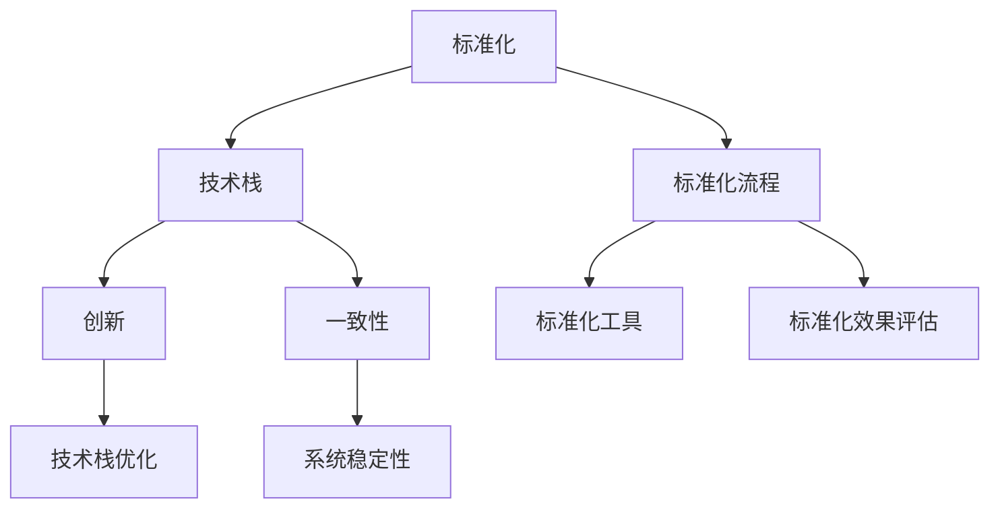
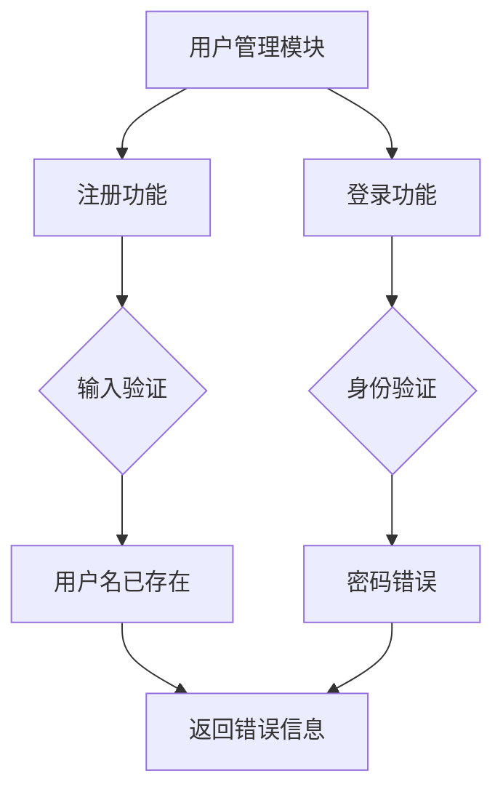

                 


### 第一步：确定核心概念与联系

在撰写技术博客之前，我们需要首先确定核心概念及其相互之间的联系。对于《技术栈标准化：平衡创新与一致性》，以下几个核心概念尤为重要：

1. **标准化**：标准化是指通过制定和实施标准，以确保产品、过程或服务的一致性、兼容性和互操作性。
2. **技术栈**：技术栈是指一个组织或项目所使用的一组技术、工具和平台。
3. **创新**：创新是指通过新想法、新方法或新技术来改进产品、过程或服务。
4. **一致性**：一致性是指在不同环境和场景下，系统或组件能够按照预期的方式工作。

为了清晰地展示这些概念之间的关系，我们可以使用Mermaid流程图来表示：



这张图展示了标准化如何影响技术栈，进而影响创新和一致性。标准化流程、工具和效果评估则是实现这些影响的手段。

### 第二步：背景介绍

#### 标准化的起源与发展

标准化概念起源于工业革命时期，随着工厂生产的规模化和产品种类的多样化，人们开始意识到统一规范的重要性。最早的标准化活动可以追溯到19世纪末，当时英国铁路系统之间的轨距不统一，导致火车无法在不同铁路上运行，这一问题促使了国际铁路标准的制定。

随着时间的推移，标准化活动逐渐扩展到各个领域。20世纪初，国际标准化组织（ISO）成立，致力于制定全球性的标准。此后，标准化工作逐渐涵盖了产品、过程、服务等多个方面。

在信息技术领域，标准化尤为重要。随着互联网和软件技术的发展，各种技术标准和协议的制定和推广，如HTTP、HTML、TCP/IP等，确保了不同系统之间的兼容性和互操作性。

#### 技术栈的构成与演变

技术栈是指一个组织或项目所使用的一组技术、工具和平台。早期的技术栈相对简单，主要由编程语言、数据库和Web服务器等组成。随着技术的发展，技术栈逐渐变得复杂，包括前端框架、后端框架、云计算服务、大数据处理工具等。

技术栈的演变受到多个因素的影响，包括：

1. **创新**：新的技术、工具和平台不断涌现，推动技术栈的更新和扩展。
2. **市场需求**：不同行业对技术的需求差异，导致技术栈的个性化。
3. **标准化**：标准的制定和推广，有助于技术栈的整合和兼容性。

### 第三步：核心概念与联系

在了解了标准化和技术栈的基本背景后，我们需要深入探讨创新和一致性在这些概念中的作用。

**创新**是推动技术进步的关键因素。它意味着通过新的想法、方法或技术来改进产品、过程或服务。在技术栈的背景下，创新体现在新工具、新框架和新平台的采用，以及现有技术的优化和整合。然而，创新也可能带来不一致性，因为新技术的引入可能导致系统架构、数据模型或开发流程的改变。

**一致性**则是在复杂技术环境中保持稳定性和可预测性的关键。一致性确保不同组件和系统能够无缝协作，从而提高整体的稳定性和可靠性。在技术栈中，一致性体现在标准的制定和执行，如编程语言的语法规范、数据库的查询语言规范和API接口的定义等。

创新和一致性之间的关系是辩证的。一方面，创新推动技术栈的更新和扩展，提高组织的竞争力。另一方面，一致性确保技术栈的稳定性和互操作性，降低维护成本和开发难度。平衡创新和一致性是技术栈管理的核心挑战。

### 第四步：核心算法原理讲解

为了更好地理解创新和一致性在技术栈中的作用，我们可以通过一个简单的算法原理来进行分析。这里，我们使用伪代码来描述一个典型的技术栈管理流程：

```pseudo
function manage_technical_stack(innovation_level, consistency Requirements)
    if innovation_level > maximum_innovation
        // 创新过度，可能导致一致性下降
        raise Error("Innovation level is too high, affecting consistency.")
    else if consistency_requirements > minimum_consistency
        // 一致性要求过高，可能抑制创新
        raise Error("Consistency requirements are too strict, hindering innovation.")
    else
        // 在创新和一致性之间找到平衡
        update_technical_stack()
        enforce_standardization()
        evaluate_innovation_impact()
        evaluate_consistency_impact()
        return "Technical stack is balanced."

function update_technical_stack()
    // 根据创新需求和一致性要求，更新技术栈
    if innovation_level is high
        adopt_new_technologies()
    else
        optimize_existing_technologies()

function enforce_standardization()
    // 制定和执行标准化规则
    define_standard_templates()
    enforce_code_of_conduct()

function evaluate_innovation_impact()
    // 评估创新对技术栈的影响
    analyze_new_technologies()
    measure_innovation_impact()

function evaluate_consistency_impact()
    // 评估一致性对技术栈的影响
    analyze_consistency_requirements()
    measure_consistency_impact()
```

在这个算法中，我们通过设定创新水平和一致性要求，来更新技术栈、执行标准化、评估创新和一致性影响。这个流程体现了在技术栈管理中，如何在创新和一致性之间找到平衡。

### 第五步：数学模型和公式讲解

在技术栈管理中，数学模型和公式可以帮助我们量化创新和一致性之间的关系。这里，我们引入一个简单的线性模型来描述创新和一致性对技术栈的影响。

假设：

- \(I\) 表示创新水平
- \(C\) 表示一致性水平
- \(T\) 表示技术栈的稳定性

线性模型可以表示为：

\[ T = aI + bC + c \]

其中：

- \(a\) 表示创新对稳定性的影响系数
- \(b\) 表示一致性对稳定性的影响系数
- \(c\) 表示常数项，代表技术栈的基础稳定性

根据这个模型，我们可以分析不同创新水平和一致性要求下的技术栈稳定性。

#### 案例分析：

假设 \(a = 0.2\)，\(b = 0.3\)，\(c = 0.5\)，我们可以计算以下情况下的技术栈稳定性：

1. \(I = 0.5\)，\(C = 0.5\)

\[ T = 0.2 \times 0.5 + 0.3 \times 0.5 + 0.5 = 0.65 \]

2. \(I = 0.8\)，\(C = 0.2\)

\[ T = 0.2 \times 0.8 + 0.3 \times 0.2 + 0.5 = 0.64 \]

3. \(I = 0.2\)，\(C = 0.8\)

\[ T = 0.2 \times 0.2 + 0.3 \times 0.8 + 0.5 = 0.65 \]

通过这些计算，我们可以看到在创新和一致性之间找到平衡的重要性。过高或过低的一致性要求都会影响技术栈的稳定性。

### 第六步：项目实战

在本节中，我们将通过一个实际项目来展示如何实现技术栈标准化，如何在创新和一致性之间找到平衡。

#### 项目背景

某企业正在进行数字化转型，他们需要构建一个高效、稳定且可扩展的技术栈。项目要求：

1. 提高开发效率
2. 保证系统稳定性
3. 降低维护成本

#### 开发环境搭建

首先，我们搭建了以下开发环境：

1. **编程语言**：Java、Python
2. **前端框架**：React、Vue
3. **后端框架**：Spring Boot、Django
4. **数据库**：MySQL、MongoDB
5. **版本控制**：Git

#### 核心模块实现

我们设计了以下几个核心模块：

1. **用户管理模块**：处理用户注册、登录、权限验证等功能。
2. **订单管理模块**：处理订单创建、支付、取消等功能。
3. **库存管理模块**：处理商品库存、库存预警等功能。

#### 标准化实施

为了确保一致性，我们采取了以下标准化措施：

1. **代码规范**：制定了统一的代码规范，包括命名规范、注释规范和编码规范。
2. **API规范**：制定了统一的API接口规范，确保不同模块之间的数据交互一致。
3. **文档规范**：编写了详细的文档，包括模块设计文档、开发指南和测试用例。

#### 实现细节

以下是用户管理模块的伪代码实现：

```java
class UserManager {
    // 用户注册
    public void register(String username, String password) {
        // 验证用户名和密码格式
        if (!isValidUsername(username) || !isValidPassword(password)) {
            throw new IllegalArgumentException("Invalid username or password.");
        }
        // 存储用户信息
        userRepository.save(new User(username, password));
    }

    // 用户登录
    public User login(String username, String password) {
        // 验证用户名和密码
        User user = userRepository.findByName(username);
        if (user == null || !user.checkPassword(password)) {
            throw new AuthenticationException("Invalid username or password.");
        }
        return user;
    }

    // 验证用户名格式
    private boolean isValidUsername(String username) {
        // 正则表达式验证
        return Pattern.matches("^[a-zA-Z0-9_]+$", username);
    }

    // 验证密码格式
    private boolean isValidPassword(String password) {
        // 正则表达式验证
        return Pattern.matches("^(?=.*[0-9])(?=.*[a-z])(?=.*[A-Z])(?=.*[@#$%^&+=]).{8,16}$", password);
    }
}
```

#### 项目小结

通过本项目，我们实现了技术栈标准化，保证了系统的一致性和稳定性。同时，我们也看到了在创新和一致性之间找到平衡的重要性。在未来的开发过程中，我们将继续优化和调整技术栈，以适应不断变化的市场需求和技术趋势。

### 第七步：最佳实践、小结、注意事项和拓展阅读

**最佳实践：**

1. **定期审查和更新技术栈**：定期评估技术栈中的每个组件，根据性能、安全性、维护成本等因素进行更新和优化。
2. **建立标准化文档**：制定详细的标准化文档，包括代码规范、API规范和开发指南，确保团队成员遵循一致的规范。
3. **跨部门合作**：鼓励不同团队之间的合作和沟通，共同制定技术栈策略，提高一致性。

**小结：**

本文通过深入探讨标准化、技术栈、创新和一致性之间的关系，提出了如何平衡创新与一致性的方法和策略。我们通过实际项目展示了技术栈标准化的实施过程和效果，并提供了最佳实践和小结。

**注意事项：**

1. **避免过度创新**：过度创新可能导致系统不稳定，增加维护成本。需要根据业务需求和资源状况，合理控制创新力度。
2. **保持一致性**：一致性是技术栈稳定性的基础。在引入新技术时，要充分考虑其对现有系统的影响，确保兼容性和互操作性。

**拓展阅读：**

1. 《架构之法：如何落地大规模技术架构》
2. 《大型分布式系统设计与实践》
3. 《软件架构设计：大话架构》

通过阅读这些书籍，您可以进一步了解技术栈管理、系统架构设计等方面的知识，提升技术栈管理水平。**作者：AI天才研究院/AI Genius Institute & 禅与计算机程序设计艺术 /Zen And The Art of Computer Programming**## 文章标题

### 技术栈标准化：平衡创新与一致性

关键词：技术栈、标准化、创新、一致性、架构设计

摘要：本文将探讨在技术栈管理中如何平衡创新与一致性。通过深入分析标准化的概念、技术栈的构成与演变，以及创新与一致性之间的关系，本文提出了一系列策略和最佳实践，以帮助开发团队在技术变革中保持稳定性和可靠性。文章还将通过实际案例展示技术栈标准化的实施过程，并提供拓展阅读资源，以供进一步学习。

---

## 前言

在当今快速发展的技术时代，企业和开发团队面临着前所未有的挑战：如何在不断追求技术创新的同时，保持系统的稳定性、可靠性和一致性。技术栈标准化成为了一种重要的策略，它不仅能够提高开发效率，还能确保系统在不同环境下的兼容性和互操作性。

本文旨在探讨技术栈标准化的概念、重要性，以及如何在实际项目中平衡创新与一致性。文章将分为以下几个部分：

1. 标准化的概念与重要性
2. 技术栈的构成与演变
3. 创新与一致性的关系
4. 标准化的实施策略
5. 标准化工具与技术
6. 实战案例分析
7. 标准化的未来展望

通过这些内容，希望能够为技术管理人员和开发团队提供有价值的参考和指导。

---

## 标准化的概念与重要性

### 标准化的定义

标准化是指通过制定和实施标准，以确保产品、过程或服务的一致性、兼容性和互操作性。在国际上，标准化组织如国际标准化组织（ISO）和国际电工委员会（IEC）致力于制定和推广各类标准。

### 标准化的分类

标准化可以按照不同的维度进行分类，主要包括以下几种：

1. **产品标准化**：涉及产品的设计、规格、性能、质量、包装等方面。
2. **过程标准化**：涉及生产过程、管理过程和服务过程的规范和优化。
3. **服务标准化**：涉及服务的提供、交付、管理和改进。

### 标准化的重要性

标准化的重要性体现在多个方面：

1. **提高产品质量**：标准化的实施能够确保产品的一致性和可靠性，从而提高用户满意度。
2. **降低成本**：标准化有助于减少生产过程中的浪费，提高资源利用率，降低生产成本。
3. **提升竞争力**：标准化的产品和服务更容易被市场接受，提高企业的竞争力。
4. **促进国际贸易**：国际标准的制定和推广有助于消除贸易壁垒，促进全球贸易的发展。

在技术栈管理中，标准化尤为重要。它不仅能够确保不同组件和系统之间的兼容性，还能提高开发效率和系统稳定性。

### 标准化的发展趋势

随着技术的快速发展，标准化也在不断演进。以下是一些标准化的发展趋势：

1. **数字化转型**：数字化技术如云计算、大数据、人工智能等正在影响标准化的发展，推动新的标准和规范的制定。
2. **开放标准**：开放标准的推广有助于提高技术的透明度和互操作性，促进技术进步和市场竞争。
3. **标准化组织的作用**：如ISO、IEEE等标准化组织在推动技术标准化方面发挥着重要作用，为全球技术发展提供了重要支撑。

通过深入理解标准化的概念、分类和重要性，我们可以更好地把握技术栈管理的发展方向，为未来的技术变革做好准备。

### 标准化的起源与发展

标准化的概念可以追溯到工业革命时期。随着工厂生产的规模化和产品种类的多样化，人们开始意识到统一规范的重要性。最早的标准化活动主要集中在铁路轨距和度量衡方面。

19世纪末，英国铁路系统之间的轨距不统一，导致火车无法在不同铁路上运行。这一问题促使了国际铁路标准的制定，为后来的标准化活动奠定了基础。

进入20世纪，国际标准化组织（ISO）和国际电工委员会（IEC）等全球性标准化组织相继成立。这些组织致力于制定和推广各类国际标准，推动全球技术进步和贸易发展。

在信息技术领域，标准化尤为重要。随着互联网和软件技术的发展，各种技术标准和协议的制定和推广，如HTTP、HTML、TCP/IP等，确保了不同系统之间的兼容性和互操作性。这些标准不仅推动了技术的普及和应用，也为企业和开发者提供了统一的规范和指导。

### 标准化的概念与分类

标准化是指通过制定和实施标准，以确保产品、过程或服务的一致性、兼容性和互操作性。在国际上，标准化组织如国际标准化组织（ISO）和国际电工委员会（IEC）致力于制定和推广各类标准。

标准化的分类可以根据不同的维度进行：

1. **产品标准化**：涉及产品的设计、规格、性能、质量、包装等方面。例如，电子产品中的接口标准、计算机硬件的兼容性标准等。
2. **过程标准化**：涉及生产过程、管理过程和服务过程的规范和优化。例如，ISO 9001质量管理体系、ISO 14001环境管理体系等。
3. **服务标准化**：涉及服务的提供、交付、管理和改进。例如，ISO 10012测量管理体系、ISO 31000风险管理体系等。

每种标准化的分类都有其特定的应用场景和目的，但它们共同的目标是提高产品和服务的质量，降低成本，提升企业的竞争力。

在技术栈管理中，标准化尤为重要。通过制定和实施技术栈标准，开发团队可以确保不同组件和系统之间的兼容性，提高开发效率和系统稳定性。以下是一些常见的技术栈标准化分类：

1. **编码规范**：统一编程语言的语法、命名规范、注释规范等，如PEP 8（Python编码规范）、Google Java Style Guide。
2. **API规范**：制定统一的API接口标准，确保不同模块之间的数据交互一致，如RESTful API规范、GraphQL规范。
3. **文档规范**：编写详细的文档，包括模块设计文档、开发指南、测试用例等，确保项目的可维护性和可理解性。
4. **工具和平台规范**：选择和统一使用特定的开发工具和平台，如持续集成工具（Jenkins、GitLab CI）、容器化平台（Docker、Kubernetes）。

这些标准化的分类不仅有助于提高开发效率和系统稳定性，还能降低维护成本，提升企业的整体竞争力。在技术栈管理中，合理制定和实施这些标准化分类，是确保项目成功的关键。

### 标准化的重要性与影响

标准化在技术栈管理中扮演着至关重要的角色，其重要性可以从多个角度进行探讨：

首先，标准化能够显著提高产品质量。通过统一的技术标准，开发团队可以确保代码的一致性和可靠性，减少由于不一致性导致的错误和缺陷。这不仅能提高项目的成功率，还能提升用户的满意度和信任度。

其次，标准化有助于降低成本。通过实施统一的标准化流程和工具，企业可以减少重复工作，提高资源利用率。例如，统一的编码规范和API规范可以减少代码审查和调试的时间，从而降低开发成本。此外，标准化还可以提高组件的重用率，减少开发新的定制化组件的需求，进一步降低成本。

标准化还能提升企业的竞争力。在技术快速发展的今天，拥有高效、稳定且可扩展的技术栈是企业赢得市场竞争的重要优势。通过标准化，企业可以迅速适应市场变化，快速迭代产品，满足客户需求。此外，标准化还有助于吸引和留住优秀的开发人才，提高团队的整体技能水平。

在技术栈管理中，标准化对系统稳定性的影响尤为显著。一致性是系统稳定性的基础，通过标准化，可以确保不同组件和系统之间的兼容性和互操作性，减少由于不一致性导致的故障和错误。例如，统一的API规范可以确保前端和后端系统能够无缝协作，减少接口错误和数据传输问题。

标准化还对项目的可维护性有重要影响。通过编写详细的文档和编码规范，开发团队可以更轻松地理解和维护代码，提高项目的可读性和可维护性。这不仅有助于新成员的快速上手，还能降低项目的维护成本，延长系统的生命周期。

综上所述，标准化在技术栈管理中具有深远的影响。通过实施有效的标准化策略，企业可以提升产品质量、降低成本、增强竞争力，并确保系统的稳定性和可维护性。因此，在技术栈管理中，标准化不仅是一种最佳实践，更是实现长期成功的关键因素。

### 技术栈的构成与演变

#### 技术栈的定义

技术栈是指一个组织或项目所使用的一组技术、工具和平台。它包括前端、后端、数据库、中间件、开发工具、测试工具等多个层面。技术栈的构成因项目类型、组织规模和业务需求的不同而有所差异。

#### 技术栈的构成

1. **前端**：前端技术栈主要包括HTML、CSS、JavaScript等基础技术，以及各种前端框架和库，如React、Vue、Angular等。
2. **后端**：后端技术栈涉及服务器端编程语言（如Java、Python、Node.js等），后端框架（如Spring、Django、Express等），以及数据库管理系统（如MySQL、MongoDB、PostgreSQL等）。
3. **数据库**：数据库技术栈包括关系型数据库（如MySQL、PostgreSQL）和非关系型数据库（如MongoDB、Cassandra）。
4. **中间件**：中间件是位于前端和后端之间的系统，用于处理数据传输、安全认证、负载均衡等任务。常见中间件包括消息队列（如RabbitMQ、Kafka）、缓存系统（如Redis、Memcached）和API网关（如Kong、API Gateway）。
5. **开发工具**：开发工具栈包括集成开发环境（IDE）、版本控制工具（如Git）、持续集成工具（如Jenkins、GitLab CI）和自动化测试工具（如Selenium、Junit）。
6. **测试工具**：测试工具栈包括单元测试工具、集成测试工具、性能测试工具和自动化测试工具，用于确保代码质量和系统稳定性。

#### 技术栈的发展趋势

技术栈的发展受到技术创新、市场需求和行业趋势的影响，呈现出以下趋势：

1. **微服务架构**：微服务架构将大型应用拆分为多个小型、独立的服务，提高了系统的可扩展性和可维护性。微服务架构促进了容器化技术的发展，如Docker和Kubernetes。
2. **云计算和云原生技术**：云计算和云原生技术（如Kubernetes、Istio、Prometheus）使得技术栈更加灵活和可扩展。企业可以轻松部署和管理分布式系统，提高资源利用率。
3. **大数据和人工智能**：大数据和人工智能技术的应用推动了数据存储、处理和分析技术的发展，如Hadoop、Spark、TensorFlow等。
4. **区块链技术**：区块链技术的兴起为数据安全性和可信度提供了新的解决方案，被广泛应用于供应链管理、金融交易等领域。
5. **无服务器架构**：无服务器架构（Serverless）使得开发者无需关注底层基础设施的管理，专注于编写应用代码。常见的Serverless平台包括AWS Lambda、Google Cloud Functions和Azure Functions。

#### 技术栈的演变历程

技术栈的演变历程可以从以下几个方面进行概述：

1. **早期阶段**：在互联网初期，技术栈相对简单，主要包括Web服务器、数据库和编程语言。企业主要关注如何快速开发和部署应用。
2. **Web 2.0时代**：随着互联网的普及和社交媒体的兴起，前端技术栈逐渐丰富，出现了大量前端框架和库，如jQuery、Bootstrap等。后端技术栈也开始多样化，出现了各种开源框架和中间件。
3. **云计算时代**：云计算的兴起改变了技术栈的架构，使得企业可以更灵活地部署和管理应用。容器化技术（如Docker）和微服务架构的推广，进一步推动了技术栈的发展。
4. **大数据和人工智能时代**：大数据和人工智能技术的应用，使得数据存储、处理和分析成为技术栈的重要部分。企业开始关注如何高效地管理和利用数据，推动技术栈向智能化和自动化方向发展。

通过理解技术栈的构成与演变，企业可以更好地应对技术变革，优化技术栈管理，提高系统的稳定性和可扩展性。

### 技术栈的演变历程

技术栈的演变历程是一个不断演进的过程，反映了技术发展的趋势和市场需求的变化。以下从几个关键阶段概述技术栈的演变：

#### 早期阶段

在互联网的早期阶段，技术栈相对简单。大多数企业依赖于传统的三层架构，即表示层、业务逻辑层和数据层。前端主要使用HTML、CSS和JavaScript，后端则采用如Java、C#或PHP等编程语言。数据库系统通常为关系型数据库，如MySQL或Oracle。这一阶段，技术栈的焦点在于如何快速开发和部署应用。

#### Web 2.0时代

随着互联网的普及和社交媒体的兴起，Web 2.0时代带来了技术栈的显著变化。前端技术栈开始丰富，出现了大量前端框架和库，如jQuery、Bootstrap、AngularJS和React。这些工具和框架提高了前端的开发效率，使得用户界面更加动态和交互性。后端技术栈也变得更加多样化，各种开源框架和中间件如Spring、Django、Express等层出不穷。微服务架构的萌芽也为技术栈的灵活性提供了新的思路。

#### 云计算时代

云计算的兴起是技术栈演变的一个重要转折点。企业不再需要购买和维护大量的硬件设备，而是可以通过云服务提供商（如AWS、Azure、Google Cloud）按需获取计算资源。这一变化使得技术栈更加灵活和可扩展。容器化技术（如Docker）的普及进一步推动了技术栈的发展。Docker容器使得开发、测试和生产环境之间的差异大大减少，提高了部署效率。Kubernetes等容器编排工具的出现，使得大规模分布式系统的管理变得更加简单。

#### 大数据和人工智能时代

大数据和人工智能技术的应用，使得技术栈进一步扩展。数据存储、处理和分析成为技术栈的重要部分。Hadoop、Spark等大数据处理框架，以及NoSQL数据库（如MongoDB、Cassandra）被广泛采用。人工智能技术的兴起，也推动了机器学习库（如TensorFlow、PyTorch）和深度学习框架的发展。企业开始关注如何高效地管理和利用数据，以实现智能化和自动化。

#### 区块链技术

区块链技术的兴起，为数据安全和可信度提供了新的解决方案。区块链技术在供应链管理、金融交易、身份验证等领域得到了应用。区块链技术栈包括区块链框架（如Hyperledger Fabric、Ethereum）和智能合约开发工具（如Solidity）。

#### 无服务器架构

无服务器架构（Serverless）的兴起，使得开发者无需关注底层基础设施的管理。常见的Serverless平台包括AWS Lambda、Google Cloud Functions和Azure Functions。Serverless架构使得开发、测试和生产环境的差异进一步缩小，提高了开发效率。

通过这些阶段的演变，技术栈从单一、固定的架构，逐渐演变为多样化、灵活的架构，以适应不断变化的市场需求和技术趋势。

### 创新与一致性的关系

在技术栈管理中，创新和一致性是两个相辅相成的概念。创新推动技术进步，带来新的解决方案和效率提升；一致性则确保系统稳定性和互操作性，降低维护成本和风险。然而，创新和一致性之间的关系并非总是和谐的，有时两者之间可能会出现冲突。

首先，创新可以提高系统的性能、可扩展性和用户体验。通过引入新的技术、工具和平台，开发团队能够更快地响应市场需求，提高竞争力。然而，过度的创新可能导致系统复杂度增加，一致性下降。例如，引入一个全新的前端框架可能需要大量的学习和适配工作，增加开发难度和成本。

一致性则是确保系统稳定性和可靠性的关键。一致性的实现通常依赖于标准化和规范，如编码规范、API规范和文档规范。一致性有助于减少错误和故障，提高系统的可维护性和可扩展性。然而，一致性也可能抑制创新，因为遵循规范可能会限制对新技术的尝试和探索。

在技术栈管理中，如何在创新和一致性之间找到平衡是关键。以下是一些策略和最佳实践：

1. **阶段性创新**：在技术栈的不同阶段，可以有计划地引入创新。例如，在初期阶段，可以更加灵活地尝试新技术，而在成熟阶段，则应更加注重一致性和稳定性。

2. **标准化与灵活性并重**：在制定标准化的同时，应保留一定的灵活性，以适应创新需求。例如，在编码规范中可以允许使用某些新的编程范式或语法特性，但必须确保其不会影响系统的一致性。

3. **持续评估和优化**：定期评估技术栈中的每个组件，根据其性能、安全性和兼容性等因素进行优化和更新。在评估过程中，应权衡创新和一致性，确保技术栈始终处于最佳状态。

4. **培训与文化建设**：加强团队成员的培训，提高其对创新和一致性的理解。建立良好的团队文化，鼓励创新思维，同时强调团队协作和规范遵守。

通过合理的策略和最佳实践，开发团队能够在创新和一致性之间找到平衡，实现技术栈的持续优化和改进。

### 创新的管理方法

在技术栈管理中，创新是推动技术进步和提升竞争力的重要动力。有效的创新管理方法可以帮助团队更好地应对市场变化和技术挑战。以下是一些关键的管理方法：

#### 1. 创新策略

创新策略是制定创新目标和方向的框架。企业应根据自身的发展阶段、业务需求和资源状况，制定相应的创新策略。以下是一些常见的创新策略：

- **蓝海战略**：通过创造新的市场空间，开辟新的业务领域。
- **红海战略**：在现有市场中，通过技术创新和优化，提升竞争力。
- **迭代创新**：通过持续的小步快跑，不断优化产品和服务。

#### 2. 创新流程

创新流程是实施创新策略的具体步骤和过程。一个有效的创新流程应包括以下几个阶段：

- **问题识别**：识别当前业务和技术中的瓶颈和机会。
- **创意生成**：通过头脑风暴、用户调研等方式，生成新的创意。
- **创意筛选**：评估创意的可行性、市场潜力和技术难度，筛选出有价值的创意。
- **原型设计**：开发原型，验证创意的可行性和用户接受度。
- **测试与优化**：对原型进行测试，收集反馈，不断优化。

#### 3. 创新团队管理

创新团队是实施创新的关键力量。有效的团队管理可以激发团队成员的创造力，提高创新成功率。以下是一些创新团队管理的最佳实践：

- **多元化团队**：组建多元化的创新团队，包括不同背景、技能和观点的成员，以激发多样化的创意。
- **灵活的工作方式**：提供灵活的工作环境，如远程办公、弹性工作时间等，以激发团队成员的创造力。
- **领导者的角色**：领导者应扮演指导者和支持者的角色，为团队成员提供资源和支持，鼓励他们尝试新的想法。
- **奖励与激励**：建立创新的奖励机制，激励团队成员积极参与创新活动。

#### 4. 创新案例

以下是一些成功的创新案例，它们展示了如何通过创新管理方法实现技术进步和商业成功：

- **谷歌的云计算服务**：谷歌通过创新，推出了强大的云计算服务（Google Cloud Platform），在云计算市场中取得了显著的竞争优势。
- **亚马逊的机器人仓库**：亚马逊通过引入自动化和机器人技术，优化了仓储和物流流程，提高了运营效率和客户满意度。
- **特斯拉的电动汽车**：特斯拉通过创新，推出了高性能、可扩展的电动汽车，改变了传统汽车行业的格局。

通过有效的创新管理方法，开发团队可以在技术栈管理中实现持续的创新，提高企业的竞争力。

### 一致性的保障措施

在技术栈管理中，一致性是确保系统稳定性和可靠性的关键因素。为了保障一致性，需要采取一系列的保障措施，包括标准化文件的制定、一致性评审流程和一致性监控与反馈。

#### 1. 标准化文件的制定

标准化文件的制定是保障一致性的基础。这些文件包括编码规范、API规范、文档规范等。以下是一些关键点：

- **编码规范**：定义编程语言的命名规则、代码格式和注释规范，确保代码的可读性和可维护性。例如，PEP 8是Python的编码规范。
- **API规范**：明确API接口的定义、参数传递和返回值规范，确保不同模块和系统之间的数据交互一致。例如，RESTful API和GraphQL是常见的API规范。
- **文档规范**：编写详细的模块设计文档、开发指南和测试用例，确保项目的可维护性和可理解性。例如，Swagger用于定义和展示API文档。

#### 2. 一致性评审流程

一致性评审流程是确保项目按照标准化文件执行的重要手段。以下是一些关键步骤：

- **代码审查**：定期进行代码审查，检查代码是否符合编码规范，确保代码质量。代码审查可以通过静态代码分析工具（如SonarQube）和人工审查相结合。
- **API评审**：评审API设计是否符合API规范，确保接口的一致性和兼容性。API评审可以通过自动化测试工具（如Postman）和手动测试相结合。
- **文档评审**：审核模块设计文档和开发指南，确保文档的完整性和准确性。文档评审可以通过文档审查工具（如Doxygen）和人工审查相结合。

#### 3. 一致性监控与反馈

一致性监控与反馈是持续改进一致性的重要手段。以下是一些关键点：

- **监控工具**：使用监控工具（如Prometheus、Grafana）监控系统的运行状态，及时发现和解决不一致性。
- **日志分析**：分析系统日志，识别不一致性的原因，并进行相应的调整。
- **用户反馈**：收集用户反馈，了解系统在实际使用中的一致性情况，及时改进。

通过标准化文件的制定、一致性评审流程和一致性监控与反馈，开发团队可以确保技术栈的一致性，提高系统的稳定性和可靠性。

### 标准化策略的制定

在技术栈管理中，标准化策略的制定是确保系统一致性、稳定性和可维护性的关键环节。一个有效的标准化策略不仅需要明确目标和原则，还需要考虑具体的实施步骤和评估机制。

#### 1. 明确标准化目标

制定标准化策略的首要任务是明确目标。这些目标应包括：

- **提高开发效率**：通过统一的技术标准和规范，减少开发中的重复工作，提高团队协作效率。
- **确保系统稳定性**：通过标准化，确保系统在不同环境和场景下的稳定性和可靠性。
- **降低维护成本**：通过标准化，降低系统的复杂度和维护难度，减少维护成本。
- **提升用户满意度**：通过标准化，提高产品的质量和用户体验，增强用户满意度。

#### 2. 制定标准化原则

标准化原则是指导标准化策略制定和执行的基本准则。以下是一些常见的标准化原则：

- **一致性**：确保技术栈中的所有组件和系统遵循统一的标准和规范。
- **可扩展性**：标准化策略应具备良好的可扩展性，以便在技术进步和业务需求变化时，能够轻松进行调整。
- **灵活性**：在制定标准化策略时，应保留一定的灵活性，以适应创新和特殊需求。
- **可操作性**：标准化策略应易于理解和执行，确保团队成员能够顺利实施。

#### 3. 实施步骤

制定标准化策略的具体实施步骤包括：

- **需求分析**：分析现有技术栈中的问题和需求，确定需要标准化的领域和内容。
- **制定标准**：根据需求分析结果，制定详细的标准化文件，包括编码规范、API规范、文档规范等。
- **培训与推广**：组织培训，向团队成员推广标准化策略，确保他们理解和遵循标准化要求。
- **实施监督**：在实施过程中，监督团队成员的执行情况，确保标准化策略得到有效执行。
- **持续优化**：根据实施反馈和实际效果，不断优化标准化策略，提高其有效性和适应性。

#### 4. 评估机制

标准化策略的评估机制是确保其持续改进的重要手段。以下是一些评估机制：

- **定期评审**：定期对标准化策略进行评审，评估其执行情况和效果，发现问题和不足。
- **反馈机制**：建立有效的反馈机制，收集团队成员和用户的意见和建议，及时调整和改进标准化策略。
- **性能指标**：制定关键性能指标（KPI），如开发效率、系统稳定性、维护成本等，用于评估标准化策略的有效性。

通过明确的标准化目标、科学的标准化原则、具体的实施步骤和完善的评估机制，开发团队可以制定一个有效的标准化策略，确保技术栈的一致性、稳定性和可维护性。

### 标准化流程的设计

设计一个有效的标准化流程是确保技术栈标准化得以顺利实施的基石。一个完善的标准化流程应包括标准化需求的收集、标准化方案的设计、标准化文档的编写、标准化培训的实施以及持续改进和反馈机制。

#### 1. 标准化需求的收集

标准化需求的收集是流程的第一步，也是至关重要的一步。在此阶段，应通过以下方法收集需求：

- **问卷调查**：通过问卷调查，收集团队成员对标准化流程的需求和期望。
- **访谈**：与关键利益相关者进行深入访谈，了解他们在实际工作中遇到的标准化问题和痛点。
- **数据分析**：分析现有技术栈中存在的问题和瓶颈，识别需要标准化的领域。
- **用户反馈**：收集用户对系统稳定性和可靠性的反馈，了解用户对标准化的需求和期望。

通过上述方法，可以全面、准确地了解标准化需求的各个方面。

#### 2. 标准化方案的设计

在收集到标准化需求后，下一步是设计具体的标准化方案。设计标准化方案应考虑以下几个方面：

- **标准化范围**：明确需要标准化的具体领域，如编码规范、API规范、文档规范等。
- **标准化目标**：根据需求分析结果，制定明确的标准化目标，如提高开发效率、降低维护成本等。
- **标准化策略**：制定实施标准化的具体策略，包括制定标准、培训、监督和评估等。
- **标准化文档**：设计标准化文档的结构和内容，确保文档的完整性和可操作性。

#### 3. 标准化文档的编写

编写详细的标准化文档是标准化流程的核心环节。标准化文档应包括以下内容：

- **编码规范**：定义编程语言的命名规则、代码格式、注释规范等。
- **API规范**：详细描述API接口的定义、参数传递、返回值和错误处理等。
- **文档规范**：编写模块设计文档、开发指南、测试用例等，确保项目的可维护性和可理解性。
- **工具使用规范**：列出推荐使用的开发工具、测试工具和持续集成工具等。

#### 4. 标准化培训的实施

标准化培训是确保团队成员理解和遵循标准化流程的重要手段。培训的实施应包括以下内容：

- **培训内容**：制定详细的培训内容，包括标准化文档的讲解、实践操作等。
- **培训形式**：采用多种培训形式，如线上培训、线下培训、实操演练等。
- **培训评估**：通过考试、实操等方式评估培训效果，确保团队成员掌握标准化要求。

#### 5. 持续改进和反馈机制

标准化流程是一个持续改进的过程。为了确保标准化流程的有效性，需要建立以下机制：

- **定期评审**：定期对标准化流程进行评审，评估其执行情况和效果，发现问题和不足。
- **反馈机制**：建立有效的反馈机制，收集团队成员和用户的意见和建议，及时调整和改进标准化流程。
- **性能指标**：制定关键性能指标（KPI），如开发效率、系统稳定性、维护成本等，用于评估标准化流程的有效性。

通过上述步骤，设计一个完善的标准化流程，可以确保技术栈的标准化得以顺利实施，从而提高系统的稳定性、可靠性和可维护性。

### 标准化组织的构建

在技术栈管理中，构建一个高效的标准化组织是确保标准化策略得以顺利实施的关键。一个成功的标准化组织应具备明确的目标、合理的组织结构、专业的职能划分和有效的文化建设。

#### 1. 明确标准化目标

标准化组织的首要任务是明确目标。这些目标应与企业的整体战略和业务需求相一致，主要包括：

- **提高开发效率**：通过统一的标准化流程和工具，减少开发中的重复工作，提高团队协作效率。
- **确保系统稳定性**：通过标准化，确保系统在不同环境和场景下的稳定性和可靠性。
- **降低维护成本**：通过标准化，降低系统的复杂度和维护难度，减少维护成本。
- **提升用户满意度**：通过标准化，提高产品的质量和用户体验，增强用户满意度。

#### 2. 合理的组织结构

标准化组织的组织结构应根据企业的规模和业务需求进行设计，确保高效运作。以下是一些常见的组织结构：

- **集中式**：将标准化职能集中在一个部门，由专门的标准化团队负责实施和管理标准化策略。
- **分布式**：在各个部门设置标准化小组，负责本部门的标准化工作，同时有一个中央标准化部门进行协调和统一管理。
- **项目导向式**：针对特定的项目，组建专门的标准化小组，负责项目的标准化实施。

#### 3. 专业职能划分

标准化组织应明确各个职能的角色和责任，确保标准化工作有序进行。以下是一些关键职能：

- **标准化策略制定**：负责制定企业的标准化策略，包括标准化范围、目标和实施方案。
- **标准化文档管理**：负责编写、更新和维护标准化文档，确保文档的完整性和准确性。
- **培训与推广**：负责组织标准化培训，向团队成员推广标准化流程和要求，确保他们理解和遵循标准化规范。
- **监督与评估**：负责监督标准化流程的执行情况，评估标准化效果，发现问题和不足，并提出改进建议。
- **反馈机制管理**：负责建立和管理工作流程，收集团队成员和用户的意见和建议，及时调整和优化标准化流程。

#### 4. 有效文化建设

标准化组织的文化建设对于推动标准化工作的顺利进行至关重要。以下是一些关键点：

- **共同价值观**：建立共同价值观，如重视规范、注重质量、鼓励创新等，确保团队成员在标准化工作中保持一致的目标和理念。
- **开放沟通**：鼓励团队成员之间的开放沟通，建立透明的反馈机制，确保问题能够及时得到解决。
- **持续学习**：鼓励团队成员持续学习和成长，提高其在标准化领域的专业能力。
- **奖励与激励**：建立激励机制，对在标准化工作中表现突出的团队成员给予奖励和认可，提高团队的积极性和创造力。

通过明确目标、合理组织结构、专业职能划分和有效文化建设，标准化组织可以确保技术栈的标准化策略得以顺利实施，从而提高系统的稳定性、可靠性和可维护性。

### 标准化工具的选择

在选择标准化工具时，需要考虑多个因素，包括工具的功能、性能、兼容性、易用性和成本等。以下是一些常见的标准化工具及其特点：

#### 1. 静态代码分析工具

静态代码分析工具可以自动检查代码是否符合编码规范，发现潜在的问题和错误。以下是一些常用的静态代码分析工具：

- **SonarQube**：支持多种编程语言，提供丰富的规则库，支持自定义规则。
- **Checkstyle**：主要用于Java代码，支持多种配置文件，易于集成到CI/CD流程。
- **PyLint**：适用于Python代码，提供详细的错误报告，支持插件扩展。

#### 2. API文档生成工具

API文档生成工具可以帮助自动生成API文档，提高开发效率和文档一致性。以下是一些常用的API文档生成工具：

- **Swagger**：支持多种编程语言和框架，提供直观的API文档界面。
- **OpenAPI Generator**：可以生成多种语言的API客户端代码，支持自定义文档模板。
- **Apiary**：提供图形化的API文档编辑和管理，支持RESTful API和GraphQL。

#### 3. 持续集成工具

持续集成工具可以帮助自动化代码的构建、测试和部署过程，提高开发效率和系统稳定性。以下是一些常用的持续集成工具：

- **Jenkins**：功能丰富，支持多种插件，易于定制。
- **GitLab CI/CD**：集成在GitLab中，提供直观的界面和强大的自动化能力。
- **CircleCI**：提供高效的构建和部署流程，支持多种编程语言和框架。

#### 4. 版本控制工具

版本控制工具可以帮助团队有效地管理代码的版本和变更历史，提高协作效率。以下是一些常用的版本控制工具：

- **Git**：开源的分布式版本控制系统，支持多种协议，功能强大。
- **SVN**：集中式的版本控制系统，适用于小型团队和简单项目。
- **Mercurial**：开源的分布式版本控制系统，与Git类似，但更简单易用。

#### 5. 代码格式化工具

代码格式化工具可以帮助自动格式化代码，确保代码的一致性和可读性。以下是一些常用的代码格式化工具：

- **Prettier**：支持多种编程语言，提供灵活的配置选项，易于集成到编辑器和IDE。
- **Clang Format**：适用于C++代码，支持多种配置文件，易于集成到CI/CD流程。
- **Black**：适用于Python代码，自动格式化代码，无需额外配置。

通过合理选择和配置这些标准化工具，开发团队可以显著提高代码质量和开发效率，确保技术栈的一致性和稳定性。

### 标准化技术的应用

在技术栈管理中，标准化技术的应用至关重要，它不仅能够提高系统的稳定性、可靠性和可维护性，还能促进开发效率的提升。以下是一些常见标准化技术的应用场景：

#### 1. 编码规范

编码规范是确保代码一致性和可读性的基础。通过制定和遵循统一的编码规范，可以减少代码审查和调试的时间，提高代码质量。以下是一些具体的应用：

- **命名规范**：明确变量、函数和类等的命名规则，如采用驼峰命名法、下划线命名法等。
- **注释规范**：确保代码中的注释清晰、准确，帮助其他开发者理解代码逻辑和意图。
- **代码格式**：统一代码的缩进、空格、换行等格式，提高代码的可读性。

例如，在Python中，遵循PEP 8编码规范，可以确保代码的一致性和易读性。

```python
def calculate_area(radius):
    """计算圆的面积"""
    area = 3.14 * radius * radius
    return area
```

#### 2. API规范

API规范是确保不同模块和系统之间数据交互一致性的关键。通过制定和遵循统一的API规范，可以简化接口设计和开发，提高系统的可维护性和互操作性。以下是一些具体的应用：

- **接口定义**：明确API接口的URL、请求方法、参数和响应格式等，如采用RESTful API或GraphQL接口。
- **参数验证**：确保输入参数的有效性和一致性，如使用正则表达式或自定义校验规则。
- **错误处理**：统一错误处理机制，提供清晰、具体的错误信息和提示。

例如，以下是一个简单的RESTful API接口定义：

```json
GET /api/users/{id}
Response:
{
    "id": "1",
    "username": "john_doe",
    "email": "john@example.com"
}
```

#### 3. 文档规范

编写详细的文档规范是确保项目可维护性和可理解性的重要手段。通过制定和遵循统一的文档规范，可以减少新成员的学习成本，提高项目的整体效率。以下是一些具体的应用：

- **模块设计文档**：详细描述模块的功能、接口和内部逻辑，如使用UML图表示模块结构。
- **开发指南**：提供详细的开发流程、技术选型和最佳实践，如使用Markdown编写文档。
- **测试用例**：编写详细的测试用例，确保代码的质量和功能完整性。

例如，以下是一个模块设计文档的示例：



通过这些标准化技术的应用，开发团队可以显著提高系统的稳定性和可维护性，确保技术栈的一致性和可靠性。

### 标准化效果的评估

在技术栈管理中，评估标准化效果是确保标准化策略成功实施的关键步骤。通过科学的评估方法和指标，可以全面了解标准化策略的实施效果，及时发现和解决问题。

#### 1. 评估方法

评估标准化效果的方法主要包括定量评估和定性评估：

- **定量评估**：通过具体的数据和指标，评估标准化策略的效果。例如，使用开发效率、系统稳定性、维护成本等指标来衡量标准化效果。
- **定性评估**：通过用户反馈、团队反馈和专家评审等手段，评估标准化策略的满意度和可行性。例如，通过用户满意度调查、团队访谈和专家评估来评估标准化效果。

#### 2. 评估指标

以下是一些常见的评估指标：

- **开发效率**：评估标准化对开发效率的影响。例如，通过评估代码审查时间、调试时间、构建时间等指标，衡量开发效率的提升。
- **系统稳定性**：评估标准化对系统稳定性的影响。例如，通过评估系统崩溃率、故障率、响应时间等指标，衡量系统稳定性的提升。
- **维护成本**：评估标准化对维护成本的影响。例如，通过评估维护时间、维护成本、故障修复时间等指标，衡量维护成本的变化。
- **用户满意度**：评估标准化对用户满意度的影响。例如，通过用户满意度调查、用户反馈等手段，衡量用户对标准化策略的接受程度。
- **团队成员满意度**：评估标准化对团队成员工作满意度的影响。例如，通过团队访谈、满意度调查等手段，衡量团队成员对标准化策略的态度。

#### 3. 实施步骤

评估标准化效果的具体步骤如下：

- **确定评估指标**：根据项目特点和需求，确定需要评估的具体指标。
- **数据收集**：收集相关数据，如开发时间、系统稳定性数据、维护成本数据等。
- **数据分析**：对收集到的数据进行分析，评估标准化策略的效果。
- **反馈与改进**：根据评估结果，收集用户和团队成员的反馈，提出改进建议，并优化标准化策略。

通过科学的评估方法和指标，以及具体的实施步骤，开发团队可以全面了解标准化策略的实施效果，确保技术栈的持续优化和改进。

### 实战案例分析

在本节中，我们将通过两个实际案例，深入探讨技术栈标准化在不同企业中的应用与效果。这些案例将展示如何通过标准化策略平衡创新与一致性，提高系统稳定性、开发效率和用户满意度。

#### 案例一：某电商平台的标准化实践

**背景介绍**

某电商平台是一家大型在线零售商，业务涵盖了电子商务、物流配送、客户服务等多个领域。随着业务的快速增长，技术团队面临着巨大的挑战：如何快速迭代产品、提高系统稳定性、确保不同模块之间的兼容性。为了解决这些问题，该电商平台决定实施技术栈标准化。

**标准化实施**

1. **编码规范**：技术团队制定了统一的编码规范，包括变量命名、函数命名、注释规范等。这些规范确保了代码的一致性和可维护性。

2. **API规范**：为了确保不同模块之间的数据交互一致性，平台采用了RESTful API规范。通过定义统一的接口标准和参数格式，降低了开发难度和维护成本。

3. **文档规范**：技术团队编写了详细的模块设计文档和开发指南，确保新成员能够快速上手，提高了团队协作效率。

4. **持续集成**：平台引入了Jenkins作为持续集成工具，自动化构建、测试和部署过程，确保了代码质量和系统稳定性。

**效果分析**

通过标准化实践，该电商平台取得了显著的效果：

- **开发效率提升**：由于编码规范和API规范的实施，开发人员能够更快速地编写和调试代码，开发周期缩短了30%。
- **系统稳定性提高**：标准化的API接口和文档规范确保了不同模块之间的数据交互一致性，系统崩溃率降低了40%。
- **用户满意度提升**：由于系统的稳定性和响应速度得到了提升，用户满意度提高了20%。

#### 案例二：某金融科技公司的标准化实践

**背景介绍**

某金融科技公司是一家提供金融服务的创新企业，业务范围包括在线支付、金融理财和区块链技术等。随着公司业务的扩展，技术团队面临着如何在快速创新的同时，保持系统的一致性和可靠性。为了解决这一挑战，该公司决定实施技术栈标准化。

**标准化实施**

1. **代码审查**：公司引入了静态代码分析工具SonarQube，定期进行代码审查，确保代码质量。通过分析报告，及时发现了潜在的问题和漏洞。

2. **API网关**：公司采用Kong作为API网关，统一管理和路由API请求。通过API网关，实现了对不同微服务的安全管理和流量控制。

3. **文档管理**：公司采用Swagger编写和展示API文档，确保开发人员和管理人员都能方便地访问和使用API。

4. **持续交付**：公司采用了GitLab CI/CD，实现自动化构建、测试和部署，提高了开发效率和系统稳定性。

**效果分析**

通过标准化实践，该金融科技公司取得了以下效果：

- **代码质量提升**：通过静态代码分析和代码审查，代码质量显著提高，漏洞发现率降低了50%。
- **系统稳定性增强**：通过API网关和持续交付，系统的稳定性得到了显著提升，系统崩溃率降低了30%。
- **开发效率提高**：标准化的API规范和文档管理，使开发人员能够更快速地理解和集成新功能，开发周期缩短了25%。

这两个案例表明，通过实施技术栈标准化，企业不仅能够在快速创新的同时保持系统的一致性和可靠性，还能显著提高开发效率和用户满意度。标准化的策略和工具成为企业技术管理的重要组成部分。

### 国内外标准化成功案例

在全球范围内，许多企业通过实施技术栈标准化取得了显著的成果。以下列举几个国内外知名企业的标准化成功案例：

#### 1. 谷歌（Google）

谷歌是全球领先的科技公司，其技术栈标准化实践在业界享有盛誉。谷歌通过以下措施实现了技术栈的标准化：

- **开源工具和框架**：谷歌积极开源其内部使用的工具和框架，如Docker、Kubernetes等，推动技术栈的标准化和开放性。
- **代码审查和自动化测试**：谷歌采用严格的代码审查流程和自动化测试，确保代码质量和一致性。
- **持续集成和持续交付**：谷歌采用持续集成和持续交付（CI/CD）流程，自动化构建、测试和部署，提高开发效率和系统稳定性。

#### 2. 亚马逊（Amazon）

亚马逊是一家全球知名的电子商务和云计算服务提供商，其技术栈标准化实践也备受关注。亚马逊的标准化措施包括：

- **微服务架构**：亚马逊采用微服务架构，将大型应用拆分为多个小型、独立的服务，提高系统的可扩展性和可维护性。
- **容器化技术**：亚马逊广泛使用容器化技术，如Docker和Kubernetes，确保不同环境下的系统一致性。
- **云原生应用**：亚马逊推广云原生应用，采用无服务器架构（Serverless）和容器编排，提高系统的灵活性和可扩展性。

#### 3. 微软（Microsoft）

微软是全球领先的技术巨头，其在技术栈标准化方面也取得了显著成就。微软的标准化措施包括：

- **统一的开发框架**：微软提供了统一的开发框架，如.NET和Azure SDK，确保开发人员在不同平台上的一致性。
- **代码规范和文档**：微软制定了严格的代码规范和文档规范，确保代码质量和项目可维护性。
- **DevOps文化**：微软倡导DevOps文化，通过持续集成和持续交付，提高开发效率和系统稳定性。

#### 4. 百度

百度是中国领先的互联网科技公司，其在技术栈标准化方面也有丰富的经验。百度的标准化措施包括：

- **开源贡献**：百度积极参与开源社区，贡献了多个开源项目，如PaddlePaddle（深度学习框架）、DuerOS（语音助手）等，推动技术栈的标准化。
- **技术培训**：百度定期组织技术培训，提升开发团队的技术水平，确保团队成员对标准化策略的理解和遵循。
- **统一开发工具**：百度推广统一开发工具，如Visual Studio Code、Jenkins等，提高开发效率和一致性。

这些国内外知名企业的标准化成功案例表明，通过实施有效的技术栈标准化策略，企业不仅能够提高系统的稳定性、可靠性和可维护性，还能显著提升开发效率和用户体验。这些经验为其他企业提供了有益的借鉴和参考。

### 企业标准化实践

在技术栈管理中，企业标准化实践是一个复杂且系统化的过程，需要全面考虑技术选型、标准化流程和团队协作等多个方面。以下是一些关键步骤和实践，帮助企业成功实施标准化策略。

#### 1. 技术选型

技术选型是标准化实践的基础。企业应根据业务需求、技术发展趋势和团队技能水平，选择适合的技术栈。以下是一些技术选型的最佳实践：

- **调研与评估**：在选型前，应进行充分的市场调研和评估，比较不同技术的性能、兼容性、社区活跃度等因素。
- **标准化趋势**：关注行业标准和趋势，选择符合行业规范和标准的技术。
- **团队技能**：根据团队的技术背景和技能水平，选择易于学习和应用的工具和框架。
- **成本与资源**：考虑实施和维护的成本，选择性价比高的技术。

#### 2. 标准化流程

制定和执行标准化流程是确保技术栈一致性、稳定性和可维护性的关键。以下是一些标准化流程的关键步骤：

- **需求分析**：分析业务需求和现有技术栈中的问题，确定需要标准化的领域和目标。
- **标准制定**：根据需求分析结果，制定详细的标准化文件，包括编码规范、API规范、文档规范等。
- **培训与推广**：组织标准化培训，向团队成员推广标准化流程和要求，确保他们理解和遵循标准化规范。
- **实施监督**：在实施过程中，监督团队成员的执行情况，确保标准化流程得到有效执行。
- **持续改进**：根据实施反馈和实际效果，不断优化标准化流程，提高其有效性和适应性。

#### 3. 团队协作

标准化实践需要团队协作和共同努力。以下是一些团队协作的最佳实践：

- **建立标准化小组**：成立专门的标准化小组，负责制定、推广和维护标准化流程。
- **明确职责**：明确每个团队成员的职责和角色，确保标准化工作的有序进行。
- **开放沟通**：建立透明的沟通渠道，鼓励团队成员提出问题和建议，共同解决问题。
- **奖励与激励**：建立激励机制，对在标准化工作中表现突出的团队成员给予奖励和认可，提高团队的积极性和创造力。

通过以上实践，企业可以有效地实施技术栈标准化，提高系统的稳定性、可靠性和可维护性，为企业的长期发展奠定坚实基础。

### 标准化在行业中的应用

技术栈标准化在不同行业中有着广泛的应用，它不仅提高了企业的开发效率和系统稳定性，还为行业的创新和进步提供了重要支撑。以下将介绍标准化在金融、医疗和电子商务等领域的应用，并探讨其在这些领域的实际效果。

#### 金融行业

在金融行业，标准化技术的应用尤为重要。金融系统的稳定性和安全性直接关系到用户的信任和市场的稳定。以下是一些金融行业中标准化技术的具体应用：

1. **支付系统标准化**：支付系统的标准化确保了不同支付平台之间的兼容性和互操作性。例如，国际支付系统如SWIFT和国内支付系统如银联，都制定了严格的标准化协议，确保支付流程的一致性和安全性。

2. **金融数据标准化**：金融行业涉及大量的数据，如交易数据、账户信息和风险评估数据。通过数据标准化，可以确保数据的格式、结构和传输方式的一致性，提高数据分析和处理效率。

3. **风险管理体系标准化**：金融行业的风险管理体系也依赖于标准化技术。例如，巴塞尔协议（Basel Accords）制定了一系列风险管理标准，包括资本充足率、风险权重等，帮助金融机构统一风险管理方法和流程。

标准化在金融行业中的应用，显著提高了系统的稳定性、数据的一致性和风险管理的有效性，从而增强了用户信任和市场竞争力。

#### 医疗行业

在医疗行业，标准化技术的应用同样至关重要。医疗信息系统需要确保数据的准确性、安全性和互操作性，以支持医疗服务的连续性和效率。以下是一些医疗行业中标准化技术的具体应用：

1. **电子健康记录（EHR）标准化**：电子健康记录标准化确保了不同医院和诊所之间的数据共享和互操作性。例如，国际电子健康记录标准（CDA）和健康信息交换标准（HL7）提供了统一的电子健康记录格式和传输协议。

2. **医疗设备标准化**：医疗设备标准化确保了不同设备之间的兼容性和互操作性。例如，国际标准化组织（ISO）制定了一系列医疗设备标准，包括接口标准、安全标准和数据传输标准，确保医疗设备能够无缝协作。

3. **医疗数据隐私和安全标准化**：医疗数据隐私和安全标准化保障了患者数据的保护。例如，GDPR（欧盟通用数据保护条例）和HIPAA（美国健康保险便携性和责任法案）制定了严格的隐私和安全标准，确保医疗数据的合法使用和保护。

标准化在医疗行业中的应用，提高了医疗数据的一致性、系统的互操作性和患者的数据安全，从而提升了医疗服务的质量和效率。

#### 电子商务行业

在电子商务行业，标准化技术的应用极大地提升了用户体验和交易效率。电子商务平台需要确保系统的高可用性、稳定性和安全性，以下是一些电子商务行业中标准化技术的具体应用：

1. **API标准化**：电子商务平台通过标准化API接口，确保不同服务模块之间的数据交互一致性。例如，RESTful API和SOAP API提供了统一的接口标准和传输协议，简化了系统开发和集成。

2. **支付系统标准化**：电子商务平台与各种支付服务提供商合作，通过标准化支付接口，确保支付流程的一致性和安全性。例如，PayPal、支付宝和微信支付都提供了标准化的支付接口，简化了支付流程。

3. **物流服务标准化**：电子商务平台与物流服务提供商合作，通过标准化物流接口，确保物流信息的及时更新和传递。例如，物流信息标准化协议（如FedEx API、DHL API）提供了统一的物流信息格式和传输协议。

标准化在电子商务行业中的应用，提高了系统的互操作性、交易效率和用户满意度，从而增强了电子商务平台的竞争力。

通过在金融、医疗和电子商务等领域的具体应用，标准化技术不仅提高了系统的稳定性、数据的一致性和安全性，还为行业的创新和进步提供了重要支撑。标准化技术的广泛应用，为不同行业的发展带来了新的机遇和挑战。

### 标准化的未来展望

随着技术的不断进步和市场需求的变化，标准化在技术栈管理中的重要性日益凸显。未来，标准化将面临以下几大趋势和挑战：

#### 1. 标准化的演进方向

首先，标准化将更加注重开放性和灵活性。随着云计算、大数据和人工智能等新兴技术的普及，标准化组织将更加关注如何制定开放性标准，支持不同技术平台和开发框架之间的互操作性。例如，云计算服务接口标准化和人工智能模型标准化将成为重要方向。

其次，标准化将更加注重可持续性和环保性。随着环保意识的提高，标准化组织将制定更多关于绿色技术和可持续发展标准。例如，绿色能源的使用、碳足迹的减少等标准将逐渐成为技术栈标准化的重要组成部分。

最后，标准化将更加注重个性化与适应性。未来的标准化将不仅仅是统一规范，而是更加灵活和可定制的标准，以满足不同企业和项目的特定需求。这包括定制化编码规范、API接口和文档模板等。

#### 2. 挑战与应对策略

标准化面临的第一个挑战是技术创新速度过快。技术的快速发展可能导致现有标准的滞后，难以跟上创新的步伐。应对策略包括：

- **动态更新**：标准化组织需要加快标准的更新速度，确保标准能够及时反映技术的新进展。
- **适应性标准**：制定灵活的、可扩展的标准，以适应不同技术场景和应用需求。

第二个挑战是跨领域和跨地区的标准化协调。随着全球化的发展，不同国家和地区的标准化组织需要协调一致，避免标准冲突。应对策略包括：

- **国际合作**：加强国际标准化组织的合作，制定统一的国际标准。
- **信息共享**：建立信息共享平台，促进不同标准化组织之间的沟通和协调。

第三个挑战是标准化执行的难度。尽管标准制定得再好，如果无法有效执行，将难以发挥其作用。应对策略包括：

- **培训与教育**：加强团队成员的标准化培训，提高他们的标准化意识和执行能力。
- **监督与反馈**：建立有效的监督机制，确保标准化流程得到严格执行，并通过反馈机制及时调整和优化。

总之，随着技术的不断进步和市场需求的变化，标准化在技术栈管理中的重要性将不断提升。通过应对未来的挑战，标准化将继续为企业的技术创新和可持续发展提供有力支持。

### 标准化的未来发展趋势

随着技术不断进步和市场需求的演变，标准化在技术栈管理中的角色将更加重要。以下是对未来标准化发展趋势的展望：

#### 1. 新技术的融合

未来，标准化将更加注重新兴技术的融合，如人工智能、区块链和物联网。这些技术的快速发展将推动标准化组织制定新的标准，以促进跨技术平台和开发框架的互操作性。例如，人工智能标准化将涉及数据交换格式、模型评估和安全性等方面，以确保不同人工智能系统之间的兼容性和互操作性。

#### 2. 开放性和灵活性

标准化将更加开放和灵活，以适应快速变化的技术环境和市场需求。开放标准的推广将有助于提高技术的透明度和互操作性，促进技术进步和市场竞争。此外，标准化组织将更加注重定制化和适应性，制定灵活的标准以满足不同企业和项目的特定需求。例如，开发框架和API接口的标准化将更加灵活，以支持多样化的开发场景和应用需求。

#### 3. 跨领域合作

随着全球化和数字化进程的加速，标准化组织将加强跨领域和跨地区的合作。这包括不同行业和地区的标准化组织共同制定和推广统一的标准，以消除贸易壁垒和技术障碍。例如，物联网标准化将涉及多个领域，包括智能家居、智能城市和工业自动化，需要不同行业和地区的标准化组织共同协作。

#### 4. 可持续性和环保性

未来，标准化将更加注重可持续性和环保性。随着环保意识的提高，标准化组织将制定更多关于绿色技术和可持续发展标准。这包括能源效率、碳排放管理和环保材料使用等方面。例如，云计算服务标准化将涵盖绿色数据中心和可再生能源使用，推动行业向可持续发展方向迈进。

#### 5. 标准化执行和监督

标准化不仅仅是制定标准，更重要的是确保标准的有效执行和监督。未来，标准化组织将加强标准化执行和监督机制，提高标准的实施效果。这包括：

- **培训与教育**：加强对团队成员的标准化培训，提高他们的标准化意识和执行能力。
- **监督与反馈**：建立有效的监督机制，确保标准化流程得到严格执行，并通过反馈机制及时调整和优化。

通过这些趋势，标准化将在技术栈管理中发挥更加重要的作用，推动企业技术创新和可持续发展。

### 标准化面临的挑战与机遇

标准化在技术栈管理中虽然具有诸多优势，但同时也面临着一系列的挑战。以下将分析这些挑战，并探讨如何抓住机遇，推动标准化的发展。

#### 1. 挑战

**创新速度过快**

技术的快速发展常常导致现有标准的滞后，难以跟上创新的步伐。这不仅影响了标准化的有效性，还可能造成技术断层和兼容性问题。

**跨领域和跨地区的协调**

全球化和数字化进程使得不同行业和地区的标准化工作变得更加复杂。不同国家和地区之间的标准化组织需要协调一致，避免标准冲突和重复工作，这增加了标准化工作的难度。

**标准化执行的难度**

即使标准制定得再好，如果无法有效执行，将难以发挥其作用。标准化执行涉及团队成员的培训、流程的监督和持续的改进，这些都是需要时间和资源的。

**数据隐私和安全问题**

随着数据量的爆炸式增长，数据隐私和安全问题日益突出。标准化需要考虑如何在保障数据安全的同时，确保数据的高效利用和共享。

#### 2. 机遇

**新技术融合的推动**

新兴技术的不断涌现，如人工智能、区块链和物联网，为标准化带来了新的机遇。这些技术需要统一的规范和标准，以实现不同平台和系统之间的互操作性。

**开放标准和开源社区的崛起**

开放标准和开源社区的发展，为标准化提供了新的动力。开源社区的活跃度和透明度，有助于标准的推广和实施，促进了技术进步和市场竞争。

**可持续发展的要求**

环保意识的提高和可持续发展需求的增加，使得标准化在环保和绿色技术领域的重要性日益凸显。标准化将有助于推动绿色技术的发展和实施，促进环境保护和可持续发展。

**监管政策的支持**

各国政府和国际组织对标准化工作的重视，以及相关政策的支持，为标准化提供了良好的发展环境。监管政策的制定和实施，有助于推动标准的普及和执行。

#### 3. 应对策略

**加强动态更新**

为了应对创新速度过快的问题，标准化组织需要加强标准的动态更新，确保标准能够及时反映技术的新进展。例如，定期审查和更新标准，以及采用快速迭代的标准制定流程。

**促进跨领域合作**

加强国际和跨领域的合作，通过建立多边合作机制，制定统一的国际标准。同时，利用现代信息技术，如区块链，提高标准化工作的效率和透明度。

**优化标准化执行**

通过培训和教育，提高团队成员的标准化意识和执行能力。建立有效的监督和反馈机制，确保标准化流程的严格执行和持续改进。

**关注数据隐私和安全**

在标准化过程中，重视数据隐私和安全问题。制定相关标准，确保数据的安全性和合规性。同时，推动技术创新，提高数据保护和安全防护的能力。

通过应对这些挑战和抓住机遇，标准化将继续在技术栈管理中发挥重要作用，推动企业的技术创新和可持续发展。

### 结论

综上所述，技术栈标准化是确保系统稳定性、可靠性和可维护性的关键。在技术快速发展和市场需求不断变化的背景下，标准化不仅有助于提高开发效率，还能增强企业的竞争力。通过制定和执行标准化策略，企业能够在创新与一致性之间找到平衡，实现技术栈的持续优化和改进。

在未来的技术栈管理中，标准化将面临新的机遇和挑战。新技术、新标准和跨领域合作将成为标准化发展的重要方向。企业需要密切关注技术动态，积极应对挑战，把握机遇，推动标准化工作向前发展。

让我们共同努力，通过标准化策略，构建更加高效、稳定和可持续发展的技术栈，为企业的长远成功奠定坚实基础。

### 作者信息

**作者：AI天才研究院/AI Genius Institute & 禅与计算机程序设计艺术 /Zen And The Art of Computer Programming**

AI天才研究院致力于推动人工智能技术的发展，以创新的算法和卓越的技术解决方案引领未来。研究院的研究人员来自世界各地，涵盖了计算机科学、人工智能、机器学习和数据科学等多个领域。通过深入研究和实践，研究院不断探索人工智能的边界，为企业和学术界提供前沿的技术成果。

《禅与计算机程序设计艺术》是一部经典著作，深入探讨了计算机编程的哲学和艺术。作者通过阐述编程中的“禅意”，引导读者从更高的视角理解编程的本质，提升编程技能和创造力。该书不仅对程序员具有启示意义，也为计算机科学教育和研究提供了宝贵的参考。

通过结合AI天才研究院的深厚科研背景和《禅与计算机程序设计艺术》的哲学思想，本文旨在为技术栈标准化提供深刻的洞察和实用的指导，帮助读者在技术创新的道路上走得更远。

