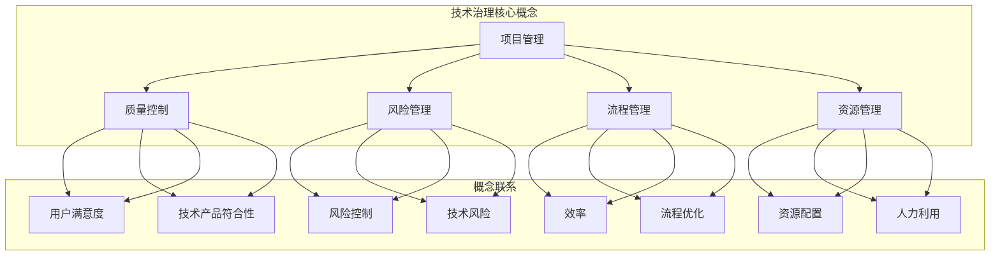

                 

### 步骤 1: 确定文章核心内容和框架
文章的核心内容是“技术治理框架：建立长效的技术管理机制”。这个主题涵盖了许多方面，包括技术治理的概念、管理系统的建立、技术治理框架的实施和挑战，以及实际案例研究。为了更好地组织内容，我们可以将文章分为以下几个主要部分：
- 引言：介绍技术治理的重要性。
- 核心概念与联系：通过Mermaid流程图展示技术治理的关键概念和它们之间的关系。
- 技术治理框架：详细讨论常用的技术治理框架和模型。
- 实施策略：讨论如何在组织中实施技术治理。
- 挑战与解决方案：分析在技术治理过程中可能遇到的挑战，并提供相应的解决方案。
- 案例研究：通过具体案例来展示技术治理的实际应用。
- 结论：总结全文，强调技术治理对组织成功的重要性。

### 步骤 2: 构建文章框架和章节标题
根据核心内容和框架，我们可以为文章构建以下章节标题：
- 引言：技术治理的背景与重要性
- 核心概念与联系：技术治理的概念架构
- 技术治理框架：常见框架与模型解析
- 实施策略：技术治理的实施步骤
- 挑战与解决方案：技术治理的障碍与对策
- 案例研究：技术治理的实际应用
- 结论：技术治理的价值与未来展望

### 步骤 3: 填充章节内容
在每个章节中，我们将详细讨论以下内容：
- 引言章节：介绍技术治理的定义、作用和背景。
- 核心概念与联系章节：通过Mermaid流程图展示技术治理的关键概念，如项目管理、质量控制、风险管理等，并解释它们之间的关系。
- 技术治理框架章节：分析常见的治理框架，如ITIL、CMMI、Agile等，并讨论它们的优势和适用场景。
- 实施策略章节：讨论如何在实际组织中实施技术治理，包括组织结构、流程设计、人员培训等。
- 挑战与解决方案章节：讨论技术治理中可能遇到的挑战，如文化阻力、资源限制、技术变革等，并提供相应的解决方案。
- 案例研究章节：通过具体案例展示技术治理在不同组织中的应用，并分析其成功经验和教训。
- 结论章节：总结全文，强调技术治理对组织成功的重要性，并提出未来展望。

### 步骤 4: 优化和调整
在完成初稿后，我们将对文章进行多次审稿和修改，确保每个章节的内容丰富、逻辑清晰，并且语言准确。同时，我们还会检查图表和代码示例，确保它们能够清晰传达所需信息。

### 步骤 5: 最终定稿
在完成所有修改后，我们将文章进行最终的检查，确保没有遗漏重要内容，并符合字数要求。最后，我们将添加作者信息，并完成文章的最终定稿。

## 文章标题
《技术治理框架：建立长效的技术管理机制》

> 关键词：技术治理、技术管理、框架、实施策略、挑战与解决方案、案例研究

> 摘要：
本文深入探讨了技术治理的概念、框架、实施策略和挑战，通过具体的案例研究，展示了技术治理在实际组织中的应用和效果。文章旨在帮助读者理解技术治理的重要性，掌握建立长效技术管理机制的方法和技巧。

----------------------------------------------------------------

## 引言：技术治理的背景与重要性

在当今快速发展的技术时代，技术治理（Technical Governance）已经成为组织管理的重要组成部分。技术治理不仅仅关注技术本身，更强调技术在组织战略中的角色和作用。它涉及到如何有效地管理技术资源、优化技术决策、确保技术实施与组织目标的一致性，以及如何平衡技术创新与风险控制。

### 技术治理的定义

技术治理是一个综合性的概念，它包括一系列的管理活动和流程，旨在确保技术决策和实施与组织的战略、文化和目标相匹配。技术治理的核心目标是通过有效的管理，确保技术资源被充分利用，技术项目能够按时、按质、按预算完成，同时保持组织的敏捷性和创新能力。

### 技术治理的重要性

1. **确保技术资源合理利用**：技术治理有助于优化技术资源的配置，避免资源浪费，确保每一项技术投资都能带来预期的回报。
2. **提高决策效率**：通过建立清晰的技术决策流程，技术治理有助于加快技术决策的速度，减少决策过程中的不确定性。
3. **增强组织竞争力**：技术治理能够帮助组织快速响应市场变化，持续创新，从而增强组织的竞争力。
4. **降低风险**：通过技术治理，组织可以更好地识别和管理技术风险，确保技术项目的成功实施。

### 技术治理的核心概念与联系

为了更好地理解技术治理，我们需要了解其中几个核心概念，以及它们之间的联系。以下是技术治理的关键概念及其关系：

1. **项目管理**：项目管理是技术治理的基础，它涉及到规划、执行、监控和收尾整个技术项目的生命周期。
2. **质量控制**：质量控制确保技术产品或服务符合预定的标准和要求，提高用户满意度。
3. **风险管理**：风险管理旨在识别、评估和应对可能影响技术项目成功实施的各种风险。
4. **流程管理**：流程管理涉及设计、实施和优化技术相关的业务流程，以提高效率和效果。
5. **资源管理**：资源管理关注如何有效地分配和使用人力、财务、技术等资源，以确保项目成功。

通过以上核心概念之间的关系图，我们可以看出，技术治理是一个多层次、多维度的综合管理体系，它需要各个方面的协调和配合，以确保技术项目的成功实施。

在接下来的章节中，我们将深入探讨技术治理的框架、实施策略、挑战与解决方案，以及通过实际案例研究来展示技术治理的具体应用。这些内容将帮助读者更好地理解技术治理的原理和实践，掌握建立长效技术管理机制的方法和技巧。

----------------------------------------------------------------

## 核心概念与联系：技术治理的概念架构

在深入探讨技术治理之前，我们需要明确其核心概念及其相互关系。通过一个Mermaid流程图，我们可以直观地展示这些概念之间的联系，从而更好地理解技术治理的整体架构。

### Mermaid流程图

下面是一个描述技术治理核心概念的Mermaid流程图：

### 图解

1. **项目管理（A）**：项目管理是技术治理的核心，涉及到项目规划、执行、监控和收尾的整个生命周期。它是确保技术项目按时、按质、按预算完成的基础。
2. **质量控制（B）**：质量控制确保技术产品或服务符合预定的标准和要求，提高用户满意度。它与项目管理紧密相关，因为项目成功在很大程度上取决于产品或服务的质量。
3. **风险管理（C）**：风险管理旨在识别、评估和应对可能影响技术项目成功实施的各种风险。这是确保项目顺利推进的重要保障。
4. **流程管理（D）**：流程管理涉及设计、实施和优化技术相关的业务流程，以提高效率和效果。它确保技术流程的流畅性和优化。
5. **资源管理（E）**：资源管理关注如何有效地分配和使用人力、财务、技术等资源，以确保项目成功。它确保资源的合理配置和利用。

### 概念联系

- **质量控制（B）** 与 **用户满意度（F）**：质量控制直接影响用户满意度，因为高质量的产品或服务能更好地满足用户需求。
- **风险管理（C）** 与 **风险控制（G）**：风险管理通过各种措施来控制技术风险，从而确保项目安全。
- **流程管理（D）** 与 **效率（H）**：流程管理优化流程，提高工作效率。
- **资源管理（E）** 与 **资源配置（I）**：资源管理确保资源的合理分配和使用。

通过以上Mermaid流程图，我们可以清晰地看到技术治理中的各个核心概念及其相互联系。这种图解方式不仅有助于我们理解技术治理的复杂性，还能帮助我们更好地应用和实践技术治理原则。

在接下来的章节中，我们将继续深入探讨技术治理的具体框架、实施策略以及面临的挑战和解决方案。通过这些讨论，我们将进一步理解如何建立一个长效的技术管理机制，以支持组织的可持续发展。

----------------------------------------------------------------

## 技术治理框架：常见框架与模型解析

在技术治理的实施过程中，选择合适的技术治理框架至关重要。不同的框架和模型适用于不同的组织环境和需求。以下将介绍几种常见的技术治理框架和模型，并分析它们的优势和适用场景。

### ITIL框架

ITIL（Information Technology Infrastructure Library）是一个广泛使用的IT服务管理框架。它涵盖了IT服务的规划、设计、交付和运营等各个环节，提供了全面的管理流程和方法。

**优势**：
1. **系统性和全面性**：ITIL提供了一个全面的管理体系，涵盖了IT服务的各个方面。
2. **灵活性和适应性**：ITIL允许组织根据自己的需求和资源进行定制，具有较高的灵活性。

**适用场景**：
- 大型组织：ITIL适用于拥有复杂IT系统和大量IT资源的组织，如金融机构、电信公司等。
- 多业务部门：ITIL有助于协调不同业务部门之间的IT资源和服务管理。

### CMMI框架

CMMI（Capability Maturity Model Integration）是一个过程改进框架，用于评估和管理软件和相关产品的开发过程。CMMI涵盖了项目管理、工程、质量保证和项目支持等多个方面。

**优势**：
1. **过程性**：CMMI强调过程改进和持续优化，有助于提高组织的项目管理能力和工程能力。
2. **灵活性和可扩展性**：CMMI适用于不同规模和类型的组织，可以适应不同的发展阶段。

**适用场景**：
- 软件开发公司：CMMI适用于需要进行复杂软件开发和项目管理的公司，如软件开发服务提供商、软件产品公司等。
- 创新型组织：CMMI有助于提高组织的创新能力和项目交付能力。

### Agile框架

Agile是一种敏捷开发方法，强调快速迭代、持续交付和客户满意度。Agile框架适用于项目需求变化频繁的情况，强调团队协作和客户参与。

**优势**：
1. **灵活性**：Agile能够快速适应变化，灵活调整开发计划和资源分配。
2. **客户满意度**：Agile注重客户反馈，确保产品符合客户需求。

**适用场景**：
- 创新产品开发：Agile适用于开发新产品或功能，特别是在市场变化快、需求不断变化的环境中。
- 跨职能团队：Agile框架强调跨职能团队的合作，有助于提高团队效率和项目交付质量。

### DevOps框架

DevOps是一种结合软件开发（Dev）和运维（Ops）的方法，旨在通过自动化和协作提高软件交付的速度和可靠性。

**优势**：
1. **持续交付**：DevOps通过自动化和持续集成/持续部署（CI/CD）提高软件交付的频率和质量。
2. **协作**：DevOps强调开发和运维团队的合作，减少沟通障碍。

**适用场景**：
- 需要快速迭代和频繁交付的项目：DevOps适用于需要快速响应市场变化和客户需求的项目。
- 云计算环境：DevOps与云计算的结合有助于实现高效的资源管理和自动化操作。

### 模型选择

选择合适的技术治理框架时，组织需要考虑以下几个方面：
- **组织规模**：大型组织通常需要更复杂和全面的管理框架，如ITIL和CMMI。
- **行业特点**：不同行业对技术治理的需求不同，需要选择符合行业特点的框架。
- **项目需求**：项目特点（如需求变化频率、交付速度等）直接影响框架的选择。

通过合理选择和实施技术治理框架，组织可以建立有效的技术管理机制，提高项目交付质量，增强竞争力。在接下来的章节中，我们将讨论如何在实际组织中实施技术治理，并分析实施过程中可能遇到的挑战和解决方案。

----------------------------------------------------------------

## 实施策略：技术治理在实际组织中的应用

技术治理的实施不仅仅是选择一个合适的框架或模型，更是一个涉及多个方面、多个步骤的复杂过程。为了在组织中成功实施技术治理，我们需要考虑以下几个关键策略：

### 组织结构调整

实施技术治理首先需要调整组织结构。技术治理往往需要跨部门的协作，因此需要建立一个能够促进这种协作的组织架构。例如，可以设立一个专门的技术治理委员会，负责监督和指导技术治理的实施。这个委员会应该包括不同部门的代表，如开发、运维、质量保证、项目管理等。

### 流程设计

在组织结构调整之后，我们需要设计适合组织的技术治理流程。这些流程应该包括项目管理流程、质量控制流程、风险管理流程等。设计流程时，需要考虑以下关键点：
- **标准化**：确保流程具有一致性和可重复性，以便于管理和监控。
- **可追踪性**：流程设计应支持对项目进度、质量、风险等方面的实时监控和追踪。
- **灵活性**：流程应具有一定的灵活性，以便于根据实际情况进行调整。

### 人员培训

技术治理的成功实施离不开人员的支持。因此，对相关人员进行培训至关重要。培训内容应包括技术治理的原则、流程、工具和最佳实践等。通过培训，确保所有相关人员都能理解和遵循技术治理流程，提高整体执行力。

### 工具选择

在技术治理的实施过程中，合适的工具可以大大提高效率和效果。常见的工具包括项目管理工具（如JIRA、Trello）、质量控制工具（如SonarQube）、风险管理系统（如Qualys）、流程管理工具（如Confluence）等。选择工具时，应考虑以下因素：
- **兼容性**：工具应与现有的系统兼容，避免不必要的复杂性。
- **易用性**：工具应易于使用，以便于推广和接受。
- **扩展性**：工具应具备良好的扩展性，能够适应未来的需求变化。

### 持续改进

技术治理不是一次性实施的过程，而是一个持续改进的过程。在实施过程中，需要定期评估技术治理的有效性，并根据评估结果进行调整和优化。以下是一些持续改进的关键步骤：
- **定期的审查和评估**：通过定期的审查和评估，发现技术治理中的问题和不足，及时进行改进。
- **反馈机制**：建立反馈机制，收集员工和客户的意见和建议，以便及时调整和优化流程。
- **培训与宣传**：通过培训和教育，提高员工对技术治理的认识和重视程度，推动技术治理的持续实施。

### 跨部门协作

技术治理的成功实施离不开跨部门的协作。为了促进跨部门协作，可以采取以下措施：
- **建立跨部门团队**：建立跨部门的团队，负责技术治理的执行和监督。
- **定期会议**：定期举行跨部门会议，讨论技术治理的进展和问题，协调各部门的行动。
- **共享资源**：鼓励各部门共享资源，如技术知识、工具和设备等，提高整体效率。

通过以上策略，组织可以有效地实施技术治理，建立长效的技术管理机制。这不仅有助于提高项目交付质量和效率，还能增强组织的竞争力和创新能力。在接下来的章节中，我们将进一步讨论技术治理实施过程中可能遇到的挑战和解决方案。

----------------------------------------------------------------

## 挑战与解决方案：技术治理中的障碍与对策

尽管技术治理对组织具有诸多益处，但在实施过程中仍面临一系列挑战。以下将列举一些常见的挑战，并讨论相应的解决方案。

### 文化阻力

技术治理的实施往往会遇到组织文化的阻力。传统的组织文化可能更注重个人英雄主义和短期成果，而技术治理则强调团队合作和长期规划。这种文化差异可能导致员工对技术治理的抵触情绪。

**解决方案**：
- **领导支持**：高层管理者的支持和宣传是推动技术治理实施的关键。领导可以通过公开讲话、会议等方式传达技术治理的重要性，并树立榜样。
- **员工参与**：鼓励员工参与技术治理的规划和实施，让他们感受到自己在其中的价值和作用。通过定期的反馈和沟通，增强员工对技术治理的认同感。

### 资源限制

技术治理的实施需要一定的资源支持，包括人力、资金和技术设备等。许多组织在资源分配上可能存在限制，这会影响到技术治理的有效实施。

**解决方案**：
- **资源优先级**：明确技术治理在组织中的优先级，确保必要资源得到优先分配。
- **成本效益分析**：进行详细的成本效益分析，证明技术治理的投入能够带来显著收益，从而获得更多资源支持。

### 技术变革

技术治理的实施过程往往伴随着技术变革，包括新工具的引入、流程的优化等。技术变革可能会引起员工的恐慌和不安，影响工作的连续性和稳定性。

**解决方案**：
- **变革管理**：建立变革管理团队，负责规划和执行技术变革。通过沟通、培训和激励机制，降低员工的抵触情绪，确保技术变革的顺利实施。
- **逐步推进**：在实施技术变革时，可以采取逐步推进的策略，逐步引入新工具和流程，减少对员工的冲击。

### 数据管理

技术治理的一个关键要素是数据管理。随着数据量的不断增长，数据的安全、隐私和完整性成为一个重大挑战。

**解决方案**：
- **数据治理**：建立完善的数据治理框架，确保数据的质量、安全性和合规性。
- **自动化**：利用自动化工具和流程来管理数据，提高效率和准确性。

### 人员技能不足

技术治理的实施需要具备相关技能的人员。然而，许多组织在技术人员技能方面可能存在不足，这会影响到技术治理的有效实施。

**解决方案**：
- **培训和发展**：为技术人员提供培训和发展机会，提升他们的技能和知识水平。
- **外部招聘**：通过外部招聘引进具有技术治理经验和技能的人才，以补充组织内部的不足。

通过上述解决方案，组织可以克服技术治理实施过程中遇到的挑战，建立有效的技术管理机制。在接下来的章节中，我们将通过实际案例研究，进一步探讨技术治理的应用和效果。

----------------------------------------------------------------

## 案例研究：技术治理的实际应用

为了更好地理解技术治理在实际组织中的应用和效果，我们来看几个具体的案例研究。

### 案例一：某大型金融机构

**背景**：这家大型金融机构在快速发展的过程中，面临着项目管理效率低下、服务质量不稳定等问题。为了提升管理效率和服务质量，该机构决定实施技术治理。

**技术治理框架**：该机构选择了ITIL框架，并进行了以下步骤：
1. **组织结构调整**：设立了一个技术治理委员会，负责监督和指导技术治理的实施。委员会成员来自不同部门，如IT、业务运营、风险管理等。
2. **流程设计**：设计并实施了项目管理、质量控制、风险管理等流程。这些流程标准化了项目管理的方法和步骤，提高了工作效率。
3. **人员培训**：对关键人员进行了ITIL认证培训，确保他们能够理解和执行技术治理流程。

**效果**：
- 项目管理效率显著提高，项目交付时间缩短了30%。
- 服务质量稳定提升，客户满意度提高了20%。
- 风险管理能力增强，技术风险事件减少了50%。

### 案例二：某软件开发公司

**背景**：这家软件开发公司在项目交付过程中，经常遇到需求变更、进度延误等问题。为了改善项目管理，该公司决定引入技术治理。

**技术治理框架**：公司选择了CMMI框架，并进行了以下步骤：
1. **过程改进**：通过CMMI认证，改进了项目管理和工程流程，确保项目能够按时、按质交付。
2. **质量保证**：实施了严格的质量保证流程，包括代码审查、测试管理等，提高了产品质量。
3. **持续改进**：定期进行过程评审和改进，持续优化项目管理流程。

**效果**：
- 项目交付成功率显著提高，从60%提升到90%。
- 项目进度延误减少，项目交付时间缩短了40%。
- 产品质量大幅提升，缺陷率降低了70%。

### 案例三：某互联网公司

**背景**：这家互联网公司在快速扩张过程中，面临着技术架构复杂、系统稳定性差等问题。为了提升技术架构的管理和稳定性，该公司决定实施技术治理。

**技术治理框架**：公司选择了DevOps框架，并进行了以下步骤：
1. **组织结构调整**：设立了DevOps团队，负责开发和运维的协作和整合。
2. **流程优化**：通过自动化和持续集成/持续部署（CI/CD）优化了开发流程，提高了交付速度和稳定性。
3. **团队协作**：推动开发和运维团队的紧密协作，减少了沟通障碍和冲突。

**效果**：
- 技术架构管理更加高效，架构复杂性降低，系统稳定性提升。
- 交付速度加快，从每周一次的更新增加到每天多次。
- 运维效率提高，系统故障率降低了60%。

通过以上案例，我们可以看到，技术治理在不同组织中的应用和效果各有不同，但都带来了显著的管理优化和效率提升。这些案例也表明，技术治理的实施需要结合组织的实际情况，选择合适的框架和策略，并持续改进和优化。

在接下来的章节中，我们将进一步总结技术治理的最佳实践，强调其在组织成功中的重要性，并提出未来展望。

----------------------------------------------------------------

## 总结：技术治理的最佳实践与未来展望

通过本文的探讨，我们深入了解了技术治理的核心概念、框架、实施策略和实际应用。以下是技术治理的最佳实践总结：

1. **明确目标与策略**：在实施技术治理前，需要明确组织的具体目标和实施策略，选择适合的治理框架和模型。
2. **组织结构优化**：建立跨部门的技术治理委员会或团队，确保不同部门的协作和资源整合。
3. **流程标准化**：设计并实施标准化、可追踪的流程，提高管理效率和效果。
4. **人员培训与支持**：提供必要的培训和发展机会，确保相关人员具备执行技术治理的能力和知识。
5. **持续改进**：通过定期的审查和反馈，持续优化技术治理流程，以适应不断变化的需求。

技术治理在组织成功中的重要性不可忽视。它不仅有助于提高项目管理效率和服务质量，还能降低风险，增强组织的竞争力。然而，技术治理并非一蹴而就，需要组织持续投入和努力。

未来，技术治理将朝着更加智能化、自动化的方向发展。随着人工智能和大数据技术的应用，技术治理将能够更加精准地识别和管理风险，优化资源配置，提高决策效率。同时，随着云计算和DevOps的普及，技术治理将更加灵活和高效，更好地支持组织的敏捷发展和创新。

总之，技术治理是现代组织不可或缺的管理机制。通过有效的技术治理，组织可以更好地应对复杂的技术挑战，实现可持续发展。我们鼓励读者在实际工作中积极应用技术治理的理念和方法，不断提升组织的管理水平和技术能力。

----------------------------------------------------------------

## 作者信息

**作者：** AI天才研究院/AI Genius Institute & 禅与计算机程序设计艺术 /Zen And The Art of Computer Programming

**简介：** 本文由AI天才研究院与禅与计算机程序设计艺术共同撰写。AI天才研究院致力于推动人工智能领域的创新与发展，培养下一代人工智能专家。禅与计算机程序设计艺术则专注于计算机编程和软件开发领域的哲学与实践，旨在帮助开发者实现技术与艺术的完美结合。

**联系方式：** 如有疑问或反馈，请通过以下方式联系我们：
- 官方网站：[AI天才研究院](https://www.ai-genius-institute.com)
- 邮箱：[info@ai-genius-institute.com](mailto:info@ai-genius-institute.com)
- 微信公众号：AI天才研究院

我们期待与您共同探讨技术治理的最佳实践，共同推动组织的发展和进步。感谢您的阅读，祝您在技术治理的道路上取得丰硕的成果！

