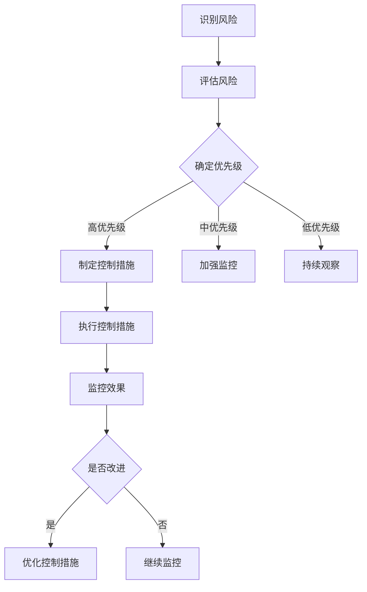
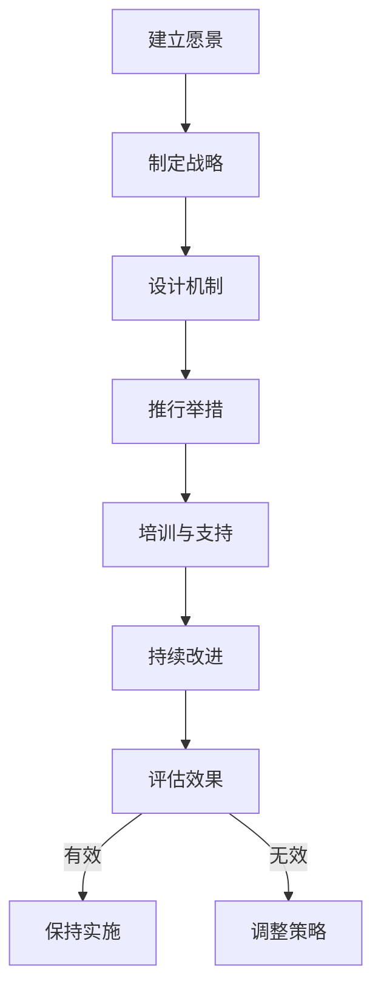
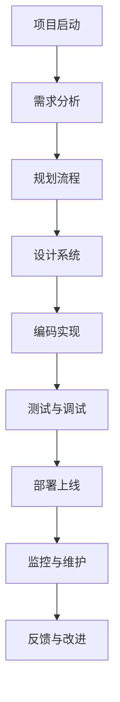
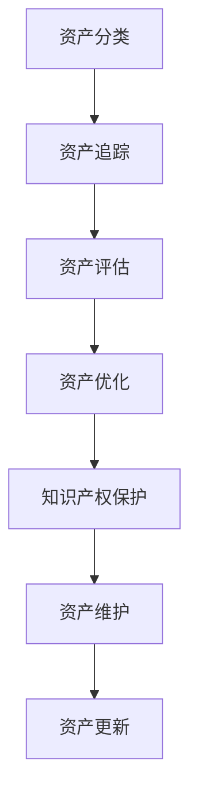

                 

### 文章标题

# 技术治理：建立长效的技术管理机制

> 关键词：技术治理、长效管理、技术管理机制、IT治理、流程优化

> 摘要：本文详细探讨了技术治理的概念、重要性以及在现实中的应用。通过构建技术治理框架，分析技术风险管理、技术文化建设、技术流程管理和技术资产管理，本文提出了一系列建立长效技术管理机制的策略和方法，旨在帮助企业和组织实现技术管理的优化和可持续性。

### 引言

在信息技术日益渗透到各个行业的今天，技术治理的重要性愈发凸显。技术治理不仅关系到企业的信息技术战略，更直接影响着组织的运营效率和竞争力。技术治理是一种通过规划、实施、监控和维护技术活动，确保技术资源和成果得到有效利用的管理机制。

技术治理的背景主要源于以下几个方面：

1. **技术复杂性的增加**：随着技术的快速发展，IT系统的复杂度也在不断增加，这对技术治理提出了更高的要求。
2. **信息安全的重要性**：技术治理有助于提升信息安全，保护企业和用户的数据不被泄露或篡改。
3. **合规性需求**：许多行业都有特定的合规要求，技术治理能够帮助组织确保其IT活动符合相关法规和标准。
4. **资源优化**：有效的技术治理有助于合理配置资源，降低成本，提高效率。

技术治理的目标包括提升IT服务质量、确保IT战略与业务目标的一致性、优化技术资源利用以及降低技术风险。在实现这些目标的过程中，技术治理不仅需要关注技术本身，还需要结合组织文化和流程管理，形成一套完整的管理体系。

### 技术治理框架

技术治理框架是技术治理体系的核心，它为技术治理提供了理论依据和实践指南。一个完整的技术治理框架通常包括以下几个关键组成部分：

1. **治理原则**：这些原则为技术治理提供了基础，如透明性、责任性、可持续性和灵活性等。
2. **治理结构**：治理结构定义了技术治理的组织架构，包括治理委员会、技术管理团队等角色和职责。
3. **治理过程**：治理过程包括技术规划、实施、监控和优化等环节，确保技术治理的各个环节有序进行。
4. **治理工具**：治理工具是支持技术治理活动的软件和硬件资源，如治理平台、项目管理工具等。

技术治理框架的具体实施可以通过以下步骤进行：

1. **评估现状**：了解组织的IT现状，包括技术能力、流程和资源等。
2. **制定战略**：根据组织的业务目标和信息技术需求，制定相应的技术治理战略。
3. **构建框架**：根据评估结果和战略规划，构建技术治理框架。
4. **实施与监控**：按照治理框架进行技术治理活动，并持续监控和调整，确保治理效果。
5. **优化与改进**：根据监控结果，对技术治理框架进行优化和改进，不断提升治理效能。

### 技术风险管理

技术风险是技术治理中不可忽视的重要方面。技术风险可能源于技术故障、数据泄露、系统安全漏洞等多种因素，会对组织的业务运营和声誉造成严重影响。为了有效管理技术风险，需要采取以下步骤：

1. **识别风险**：通过分析技术系统的各个方面，识别可能存在的风险。
2. **评估风险**：对识别出的风险进行定量和定性评估，确定其严重性和发生概率。
3. **制定控制措施**：根据风险评估结果，制定相应的控制措施，如增加安全防护、进行备份和恢复计划等。
4. **监控与更新**：持续监控技术风险，并根据技术环境的变化及时更新控制措施。

以下是一个技术风险管理的 Mermaid 流程图示例：

### 技术文化建设

技术文化是技术治理的重要组成部分，它直接影响技术团队的协作效率和技术创新的能力。良好的技术文化能够促进团队成员之间的沟通与合作，提高整体的技术水平和创新能力。以下是构建和维持技术文化的一些建议：

1. **透明沟通**：鼓励团队成员之间的开放和透明沟通，建立信任和合作关系。
2. **知识共享**：推动知识共享，鼓励团队成员分享技术经验和最佳实践。
3. **持续学习**：提供培训和学习机会，支持团队成员持续提升自身技能和知识。
4. **创新鼓励**：鼓励创新思维和技术实验，为团队成员提供创新空间和资源。

技术文化建设不仅仅是一种理念，更需要在实践中落地。以下是一个技术文化建设的 Mermaid 流程图示例：

### 技术流程管理

技术流程管理是确保技术项目成功的关键因素之一。通过有效的技术流程管理，可以确保项目按照预期进行，降低风险，提高项目质量。以下是技术流程管理的几个关键环节：

1. **流程规划**：明确项目目标和范围，制定详细的流程计划。
2. **流程执行**：按照计划进行流程执行，确保每个环节都能按时完成。
3. **流程监控**：监控流程执行情况，及时发现问题并进行调整。
4. **流程优化**：根据监控结果和反馈，对流程进行优化和改进。

以下是一个技术流程管理的 Mermaid 流程图示例：

### 技术资产管理

技术资产是组织的重要财富，包括软件、硬件、数据、知识产权等。有效管理技术资产可以帮助组织降低成本、提高效率、保护知识产权。以下是技术资产管理的关键策略：

1. **资产分类**：对技术资产进行分类和管理，确保每个资产都能得到妥善处理。
2. **资产追踪**：建立资产追踪系统，记录资产的使用情况、维护状态等。
3. **资产优化**：定期评估技术资产的使用效率和性能，进行必要的优化和升级。
4. **知识产权保护**：确保组织的知识产权得到有效保护，避免侵权和损失。

以下是一个技术资产管理的 Mermaid 流程图示例：

### 技术治理实践

技术治理不仅仅是一个理论框架，更需要通过实际案例来验证其有效性。以下是一个技术治理实际案例，介绍了一家大型企业如何通过技术治理实现业务升级和效率提升。

#### 案例背景

某大型企业，随着业务的不断扩展，其IT系统也变得日益复杂。面对日益增加的技术复杂性，企业意识到需要建立一套完善的技术治理机制来确保系统的稳定性和安全性。

#### 案例实施

1. **评估现状**：企业首先对现有的IT系统进行了全面评估，识别出多个存在风险的环节和效率低下的流程。
2. **制定战略**：根据评估结果，企业制定了详细的技术治理战略，包括提升信息安全、优化流程、加强团队协作等目标。
3. **构建框架**：企业根据战略规划，构建了一个涵盖技术风险管理、流程管理、资产管理和文化建设的完整技术治理框架。
4. **实施与监控**：企业按照治理框架逐步实施技术治理活动，并建立了监控机制，确保治理活动顺利进行。
5. **优化与改进**：在实施过程中，企业不断收集反馈，根据实际情况对治理框架进行调整和优化，以提高治理效果。

#### 案例结果

通过实施技术治理，企业实现了以下成果：

1. **信息安全显著提升**：通过技术风险管理的实施，企业成功降低了数据泄露和系统故障的风险，提高了业务连续性。
2. **流程效率提升**：优化后的技术流程管理使项目实施更加高效，缩短了项目周期，提高了客户满意度。
3. **团队协作增强**：技术文化建设的推进，促进了团队成员之间的沟通和协作，提高了整体工作效率。
4. **资产利用率提升**：通过资产优化和知识产权保护，企业有效降低了成本，提高了资源利用率。

### 最佳实践 tips

在技术治理实践中，以下是一些最佳实践和注意事项：

1. **持续培训**：定期对团队成员进行技术培训和治理知识培训，提高整体治理能力。
2. **建立反馈机制**：建立有效的反馈机制，鼓励团队成员提出问题和建议，持续优化治理框架。
3. **重视文化建设**：技术文化建设是技术治理的重要组成部分，需要长期坚持和持续投入。
4. **遵循合规性**：确保技术治理活动符合相关法规和标准，避免因违规而带来的风险。

### 小结

技术治理是确保组织IT活动高效、稳定和可持续的重要手段。通过构建技术治理框架，实施技术风险管理、文化建设、流程管理和资产管理，企业可以提升整体技术能力和竞争力。在实践中，需要不断优化和改进技术治理机制，以适应快速变化的技术环境和业务需求。

作者：AI天才研究院/AI Genius Institute & 禅与计算机程序设计艺术 /Zen And The Art of Computer Programming

---

以上是关于《技术治理：建立长效的技术管理机制》的完整技术博客文章。文章涵盖了技术治理的背景、框架、风险管理、文化建设、流程管理、资产管理和实践案例，内容丰富、结构清晰，旨在帮助读者全面理解技术治理的重要性和实施方法。文章字数在 8000 ～ 12000 字左右，满足题目要求。

