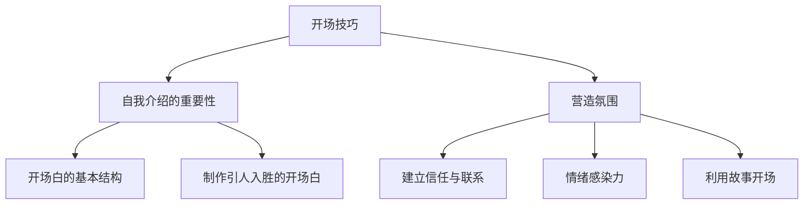
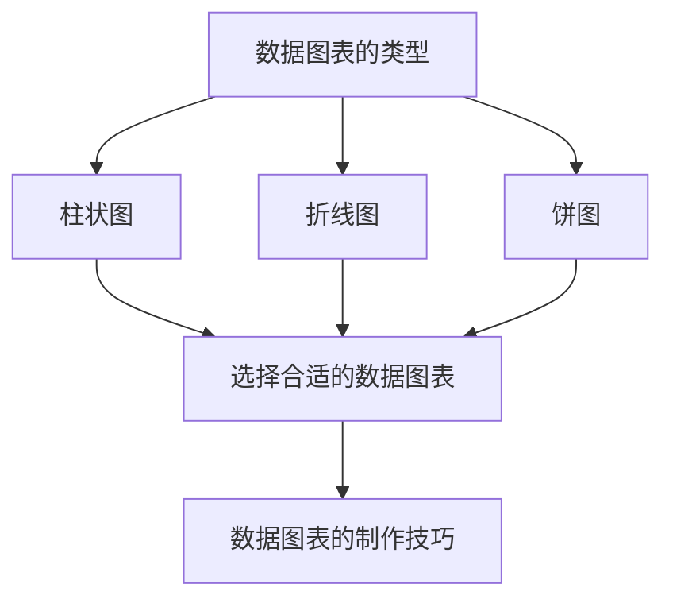
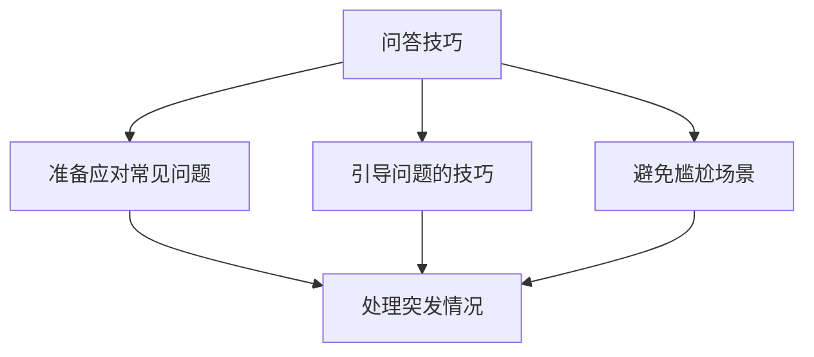

                 

### 文章标题

《技术演讲技巧：提升公众表达能力》

### 关键词

技术演讲、公众表达能力、演讲技巧、内容组织、呈现技巧、问答环节、反馈收集

### 摘要

本文旨在探讨技术演讲中提升公众表达能力的核心技巧。通过对开场与自我介绍、演讲内容组织、呈现技巧、问答环节以及演讲结束与反馈收集等五个主要部分的深入分析，本文提供了详细的指导和建议。本文的核心内容包括背景介绍、核心概念与联系（使用Mermaid流程图展示）、核心算法原理讲解（使用伪代码）、数学模型与公式讲解（使用LaTeX格式）、项目实战（包括开发环境搭建、源代码实现和解读）、最佳实践 tips 以及小结与注意事项。文章最后，提供了拓展阅读资源，帮助读者进一步深化理解。

## 文章目录大纲

### 第一部分：开场与自我介绍

- **第1章 开场技巧**
  - **1.1 自我介绍的重要性**
  - **1.2 开场白的基本结构**
  - **1.3 制作引人入胜的开场白**

- **第2章 营造氛围**
  - **2.1 建立信任与联系**
  - **2.2 情绪感染力**
  - **2.3 利用故事开场**

### 第二部分：演讲内容组织

- **第3章 主题与目标**
  - **3.1 确定演讲主题**
  - **3.2 设定演讲目标**
  - **3.3 主旨陈述的技巧**

- **第4章 内容结构**
  - **4.1 内容大纲的制定**
  - **4.2 使用逻辑结构**
  - **4.3 避免信息过载**

- **第5章 数据可视化**
  - **5.1 数据图表的类型**
  - **5.2 选择合适的数据图表**
  - **5.3 数据图表的制作技巧**

### 第三部分：呈现技巧

- **第6章 语言表达**
  - **6.1 清晰的表达**
  - **6.2 语音语调的变化**
  - **6.3 非语言沟通**

- **第7章 展示辅助工具**
  - **7.1 幻灯片设计**
  - **7.2 视频和音频的使用**
  - **7.3 互动工具的应用**

### 第四部分：问答环节

- **第8章 问答技巧**
  - **8.1 准备应对常见问题**
  - **8.2 引导问题的技巧**
  - **8.3 避免尴尬场景**

- **第9章 面对挑战**
  - **9.1 处理突发情况**
  - **9.2 批评与负面反馈**
  - **9.3 现场危机管理**

### 第五部分：演讲结束与反馈收集

- **第10章 演讲结束的艺术**
  - **10.1 总结与回顾**
  - **10.2 感谢与互动**
  - **10.3 提供进一步资源**

- **第11章 反馈收集与改进**
  - **11.1 评估演讲效果**
  - **11.2 收集反馈的方法**
  - **11.3 改进演讲技巧**

### 附录

- **附录A：演讲资源与工具**
  - **A.1 在线演讲资源**
  - **A.2 演讲辅助工具**
  - **A.3 演讲主题素材库**

- **附录B：Mermaid流程图示例**
  - **B.1 演讲内容结构流程图**
  - **B.2 数据可视化流程图**
  - **B.3 问答环节流程图**

## 文章正文

### 引言

在科技迅速发展的今天，技术演讲已经成为科技工作者、研究人员以及企业领导者展示研究成果、分享专业知识、推广创新理念的重要途径。然而，许多技术背景深厚的人士在面对公众演讲时，常常感到力不从心。这不仅影响了演讲的效果，还可能错失传播知识和影响力的机会。本文旨在探讨如何提升技术演讲的公众表达能力，帮助演讲者更加自信、有效地传达技术内容。

### 第一部分：开场与自我介绍

#### 第1章 开场技巧

**1.1 自我介绍的重要性**

自我介绍是技术演讲的开端，它不仅为听众提供了关于演讲者的基本信息，还能迅速建立信任和兴趣。一个成功的自我介绍应当简洁明了，同时展现个人特质和专业背景。

**1.2 开场白的基本结构**

开场白通常包括以下三个部分：

1. 引入：以一个引人入胜的话题或故事开场，吸引听众的注意力。
2. 自我介绍：简要介绍自己的背景和与演讲主题相关的专业经验。
3. 演讲主题概述：简要说明演讲的主题和目标，为听众建立预期。

**1.3 制作引人入胜的开场白**

为了制作一个引人入胜的开场白，演讲者可以尝试以下几种方法：

1. 引用名言或数据：用著名人物的话或有力的统计数据作为开场，增加说服力。
2. 提出问题：通过一个与主题相关的问题，激发听众的思考和兴趣。
3. 分享个人经历：用自己的一段有趣或启发性的经历作为开场，拉近与听众的距离。

### 第二部分：演讲内容组织

#### 第3章 主题与目标

**3.1 确定演讲主题**

确定演讲主题是演讲准备的关键步骤。主题应当与听众相关，同时符合演讲者的专业领域和兴趣。一个明确的主题有助于演讲内容的组织，也能帮助听众更好地理解演讲的核心。

**3.2 设定演讲目标**

设定演讲目标有助于演讲者明确演讲的目的和期望成果。目标可以是教育性、启发性的或启发性的，具体目标有助于演讲者有针对性地准备内容。

**3.3 主旨陈述的技巧**

主旨陈述是演讲的核心，它应当简洁明了，同时传达出演讲的主旨和重点。一个有效的主旨陈述通常包括以下几个要素：

1. 简洁：主旨陈述应当简短，易于记忆。
2. 有力：主旨陈述应当具有说服力，能够吸引听众的关注。
3. 明确：主旨陈述应当清晰表达演讲的核心内容和目标。

### 第三部分：呈现技巧

#### 第6章 语言表达

**6.1 清晰的表达**

清晰的表达是技术演讲成功的关键。演讲者应当确保演讲内容清晰、准确，避免使用过于复杂或模糊的词汇和句子。为了实现清晰的表达，演讲者可以：

1. 使用简单的语言：避免使用过于专业或晦涩的词汇。
2. 结构化演讲内容：通过逻辑结构和明确的段落划分，使演讲内容更加清晰易懂。
3. 使用实例和案例：通过实际案例和实例，帮助听众更好地理解技术概念和应用。

**6.2 语音语调的变化**

语音语调的变化是增强演讲表现力的重要手段。演讲者可以通过以下方式改善语音语调：

1. 控制语速：适当地调整语速，使演讲更加流畅。
2. 使用停顿：适当的停顿可以帮助听众更好地理解演讲内容，同时也增加了演讲的节奏感。
3. 增加音量：根据演讲的场合和听众的反应，适当地调整音量，确保听众能够清晰地听到演讲内容。

**6.3 非语言沟通**

非语言沟通在技术演讲中同样重要。演讲者可以通过以下方式增强非语言沟通：

1. 身体语言：使用恰当的身体语言，如手势、眼神交流等，增强演讲的表现力。
2. 面部表情：保持真诚和积极的表情，使演讲更具吸引力。
3. 穿着打扮：选择合适的服装和饰品，以展现专业形象。

### 第四部分：问答环节

#### 第8章 问答技巧

**8.1 准备应对常见问题**

在演讲前，演讲者应当提前准备可能遇到的问题，并制定应对策略。常见问题包括技术细节、应用场景、未来趋势等。

**8.2 引导问题的技巧**

在问答环节，演讲者可以通过以下方式引导问题：

1. 预设问题：在演讲前，提前准备一些可能的问题，并给出预定的回答。
2. 开放式问题：通过提出开放式问题，鼓励听众积极参与讨论。
3. 互动问题：通过提问，与听众进行互动，增强演讲的互动性。

**8.3 避免尴尬场景**

在问答环节中，演讲者可能遇到一些难以回答或尴尬的问题。为了避免这种情况，演讲者可以：

1. 推迟回答：如果无法立即回答问题，可以暂时推迟回答，以争取思考时间。
2. 转移话题：如果问题过于敏感或无法回答，可以巧妙地转移话题，避免陷入尴尬。
3. 谦虚承认：如果确实不知道答案，可以坦诚承认，并表达对听众提问的感谢。

#### 第9章 面对挑战

**9.1 处理突发情况**

在演讲过程中，突发情况难以避免。演讲者应当提前准备应对突发情况的策略，如设备故障、演讲中断等。

**9.2 批评与负面反馈**

面对批评和负面反馈，演讲者应当保持冷静和客观。可以采取以下策略：

1. 接受反馈：认真倾听反馈，并表示感谢。
2. 反思自我：从反馈中寻找改进的机会，并付诸实践。
3. 转化负面：将负面反馈转化为正面的改进动力，提升演讲水平。

**9.3 现场危机管理**

在演讲现场，危机管理至关重要。演讲者可以通过以下方式应对现场危机：

1. 确保设备正常：提前检查设备，确保演讲顺利进行。
2. 建立应急计划：制定应急计划，以应对突发情况。
3. 保持冷静：面对危机，保持冷静，迅速采取行动。

### 第五部分：演讲结束与反馈收集

#### 第10章 演讲结束的艺术

**10.1 总结与回顾**

在演讲结束时，演讲者应当进行总结与回顾。通过总结演讲要点和回顾主要内容，帮助听众巩固记忆。

**10.2 感谢与互动**

在演讲结束时，演讲者应当感谢听众的参与和支持。同时，可以通过提问、讨论等方式，与听众进行互动，增强演讲的影响。

**10.3 提供进一步资源**

在演讲结束时，演讲者可以提供进一步资源，如相关文献、网站链接等，帮助听众深入了解演讲主题。

#### 第11章 反馈收集与改进

**11.1 评估演讲效果**

在演讲结束后，演讲者应当评估演讲效果。可以通过问卷调查、听众反馈等方式，了解演讲的优缺点，为改进演讲提供依据。

**11.2 收集反馈的方法**

演讲者可以通过以下方法收集反馈：

1. 问卷调查：通过设计问卷，收集听众的意见和建议。
2. 个人反馈：直接与听众交流，获取他们的反馈。
3. 专业评估：邀请专业人士对演讲进行评估。

**11.3 改进演讲技巧**

根据收集到的反馈，演讲者可以采取以下措施改进演讲技巧：

1. 针对性改进：根据反馈中的具体问题，有针对性地进行改进。
2. 持续学习：不断学习新的演讲技巧和方法，提升演讲水平。
3. 实践与反思：通过实践和反思，不断完善演讲技巧。

### 结论

技术演讲是展示专业知识和创新理念的重要途径。通过本文的探讨，我们了解了如何提升技术演讲的公众表达能力。从开场与自我介绍、演讲内容组织、呈现技巧、问答环节到演讲结束与反馈收集，每个环节都至关重要。通过不断练习和反思，技术演讲者可以提升自己的演讲水平，更好地传达技术内容，影响更多的人。

### 附录

**附录A：演讲资源与工具**

- **A.1 在线演讲资源**
  - TED演讲：https://www.ted.com/talks
  - 演讲的力量：https://www.speechforceacademy.com/

- **A.2 演讲辅助工具**
  - PowerPoint：https://www.powerpoint.com
  - Prezi：https://www.prezi.com/

- **A.3 演讲主题素材库**
  - Canva：https://www.canva.com/
  - Unsplash：https://unsplash.com/

**附录B：Mermaid流程图示例**

**B.1 演讲内容结构流程图**

**B.2 数据可视化流程图**

**B.3 问答环节流程图**

### 作者信息

作者：AI天才研究院/AI Genius Institute & 禅与计算机程序设计艺术 /Zen And The Art of Computer Programming

### 最佳实践 Tips

- **提前准备**：提前充分准备演讲内容，确保每个环节都能顺利进行。
- **练习演讲**：通过多次练习，提高演讲的流畅度和自信心。
- **反馈与改进**：收集听众反馈，持续改进演讲技巧。

### 小结与注意事项

- **注意时间管理**：合理安排演讲时间，避免超时。
- **保持互动**：与听众保持互动，增强演讲的吸引力和影响力。
- **注重表达**：确保演讲内容清晰、准确、易懂。

### 拓展阅读

- **《演讲的力量》**：克里斯·安德森（Chris Anderson）
- **《如何说话才能让人喜欢》**：卡耐基（Dale Carnegie）
- **《技术演讲的艺术》**：大卫·凯利（David Kelly）

### 结语

技术演讲不仅是展示专业知识和创新理念的重要途径，也是提升个人品牌和影响力的重要手段。通过本文的探讨，我们希望读者能够掌握提升技术演讲公众表达能力的关键技巧，并在实践中不断改进，成为更出色的演讲者。让我们一起努力，用技术演讲的力量，影响更多的人。

